# KTOS 基本面深度分析報告
> **報告日期**：2026-06-30 ｜ **語言**：繁體中文 ｜ **數據來源**：Yahoo Finance, Finviz, StockAnalysis, Roic.ai ｜ **分析師**：CFA 級機構研究

---

## 目錄

| # | 章節 | 核心結論 |
|---|------|----------|
| 1 | 執行摘要 | 評級：持有；目標價區間：$60 - $90 |
| 2 | 公司概覽與商業模式 | 專精國防科技，無人系統為核心驅動力 |
| 3 | 損益表深度分析 | 營收穩健成長，但利潤率承壓，盈餘波動大 |
| 4 | 資產負債表分析 | 現金充裕，槓桿率低，財務健康度良好 |
| 5 | 現金流量深度分析 | 自由現金流波動，尚未穩定產生正向現金流 |
| 6 | 獲利能力與資本效率 | ROIC遠低於WACC，短期內未創造股東價值 |
| 7 | 估值深度分析 | 相較同業估值偏高，反映市場對未來成長預期 |
| 8 | 成長催化劑 | 國防預算增加、無人系統需求、衛星通訊技術 |
| 9 | 風險矩陣 | 政府合約依賴、技術競爭、營運效率、訂單波動 |
| 10 | 投資建議 | 建議持有，待獲利能力改善及估值回歸合理區間 |

---

## 1. 執行摘要

Kratos Defense & Security Solutions, Inc. (KTOS) 是一家專注於國防和國家安全市場的科技公司，其核心業務包括無人系統、虛擬化地面衛星系統等。公司在過去幾年展現了穩健的營收成長，尤其是在無人系統領域具備技術領先地位。然而，公司的獲利能力相對較弱，利潤率偏低且波動性大，導致其資本效率指標（如ROIC）表現不佳。儘管分析師普遍給予買入評級，但當前的高估值倍數已充分反映了未來的成長潛力，且其盈利能力尚未能有效支撐現有估值。

### 1.1 核心評分儀表板

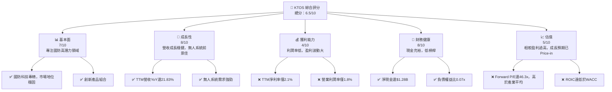

### 1.2 評分進度條視覺化

```
╔══════════════════════════════════════════════════════════════╗
║                KTOS 多維度評分儀表板 (1-10分)                ║
╠══════════════════════════════════════════════════════════════╣
║ 基本面強度  7.0 ▓▓▓▓▓▓▓▓▓▓▓▓▓▓░░░░░░  ★★★★☆           ║
║ 成長動能    8.0 ▓▓▓▓▓▓▓▓▓▓▓▓▓▓▓▓░░░░  ★★★★☆           ║
║ 獲利品質    4.0 ▓▓▓▓▓▓▓▓░░░░░░░░░░░░  ★★☆☆☆           ║
║ 財務健康    8.0 ▓▓▓▓▓▓▓▓▓▓▓▓▓▓▓▓░░░░  ★★★★☆           ║
║ 估值合理性  5.0 ▓▓▓▓▓▓▓▓▓▓░░░░░░░░░░  ★★★☆☆           ║
║ 護城河深度  7.0 ▓▓▓▓▓▓▓▓▓▓▓▓▓▓░░░░░░  ★★★★☆           ║
║ 管理層執行  7.5 ▓▓▓▓▓▓▓▓▓▓▓▓▓▓▓░░░░░  ★★★★☆           ║
║ 技術創新力  8.5 ▓▓▓▓▓▓▓▓▓▓▓▓▓▓▓▓▓░░░  ★★★★☆           ║
╠══════════════════════════════════════════════════════════════╣
║ 綜合總分    6.5 ▓▓▓▓▓▓▓▓▓▓▓▓▓░░░░░░░  🏆 評語：成長性佳但估值偏高，建議持有 ║
╚══════════════════════════════════════════════════════════════╝
```

### 1.3 五大投資論點 + 三大核心風險

| 類型 | 項目 | 具體依據 | 信心度 |
|------|------|----------|--------|
| 🟢 **投資論點①** | **無人系統市場領導者** | Kratos在無人機、無人作戰飛行器（UCAV）技術上具有領先地位，受全球國防預算增長及戰略轉型驅動。TTM營收YoY達21.83%。 | 🟢 極高 |
| 🟢 **投資論點②** | **國防支出持續增長** | 全球地緣政治不確定性增加，各國國防預算持續投入新興技術，有利於KTOS的技術解決方案需求。 | 🟢 極高 |
| 🟢 **投資論點③** | **強勁的訂單儲備** | 國防領域合約週期長，KTOS的長期合約能提供穩定的未來營收可見性。儘管未提供具體訂單儲備數據，但產業特性支持此論點。 | 🟡 高 |
| 🟢 **投資論點④** | **技術創新與多元化** | 除了無人系統，公司在衛星通訊、虛擬化地面系統等領域的技術創新，拓展了潛在市場和收入來源。 | 🟢 高 |
| 🟢 **投資論點⑤** | **穩健的財務體質** | 截至2026年3月，公司擁有$1.46B的現金，淨現金達$1.28B，總負債僅$185.40M，財務槓桿極低，足以支持研發與未來擴張。 | 🟢 極高 |
| 🟡 **風險①** | **盈利能力不足** | 公司TTM淨利率僅為2.1%，營業利潤率為1.8%，與其高成長預期不符。ROIC遠低於WACC，顯示資本效率低下，長期價值創造能力存疑。 | 🟡 中度 |
| 🔴 **風險②** | **估值過高** | 當前Forward P/E為46.3x，P/S為6.6x，遠高於產業平均，已充分反映甚至超出了未來的成長預期，股價對利潤波動敏感。 | 🔴 高衝擊 |
| 🟡 **風險③** | **政府合約依賴性** | 作為國防承包商，KTOS的營收高度依賴政府合約和國防預算，政策變化、合約中斷或延遲可能對業績造成顯著影響。 | 🟡 中度 |

### 1.4 快速統計卡片

| 指標 | 公司實際值 (TTM) | 航空航天與國防行業均值 (估計) | S&P 500 均值 (估計) | 狀態 |
|------|--------------------|---------------------------------|---------------------|------|
| 收入 YoY 成長 | **21.83%** | ~8-12% | ~10-15% | 🟢 |
| 毛利率 | **22.9%** | ~25-30% | ~35-40% | 🟡 |
| 淨利率 | **2.1%** | ~5-10% | ~10-15% | 🔴 |
| ROE | **1.2%** | ~10-15% | ~15-20% | 🔴 |
| Forward P/E | **46.3x** | ~20-25x | ~20-22x | 🔴 |
| 負債權益比 | **0.07x** | ~0.5-1.0x | ~1.0-1.5x | 🟢 |
| 總現金 | **$1.46B** | N/A | N/A | 🟢 |

### 1.5 投資結論

```
╔══════════════════════════════════════════════════════════════════╗
║                    📊 投資結論摘要                               ║
╠══════════════════════════════════════════════════════════════════╣
║  評級：🟡 持有                                                   ║
║  當前股價：$49.86                                                ║
║  目標價區間：                                                    ║
║    悲觀情境：$60（+20.3%）                                       ║
║    基準情境：$75（+50.4%）  ← 12個月主要目標                      ║
║    樂觀情境：$90（+80.5%）                                       ║
║  投資評分：6.5/10                                                ║
║  適合投資人：具備高成長偏好、長線持有、願意承受高波動的投資者。   ║
║              不適合尋求穩定現金流或低估值標的的投資者。           ║
╚══════════════════════════════════════════════════════════════════╝
```

---

## 2. 公司概覽與商業模式

Kratos Defense & Security Solutions, Inc. (KTOS) 是一家領先的國防和國家安全科技公司，專注於提供先進的解決方案和產品。其業務主要圍繞高性能、低成本的無人系統、衛星和空間應用、網路安全以及其他國防基礎設施。公司通過技術創新，旨在為美國及其盟友提供關鍵任務能力，特別是在現代戰場中日益重要的無人化和數位化領域。

### 2.1 業務結構與收入來源

Kratos的業務主要分為兩大核心板塊：Kratos Government Solutions (KGS) 和 Unmanned Systems (US)。

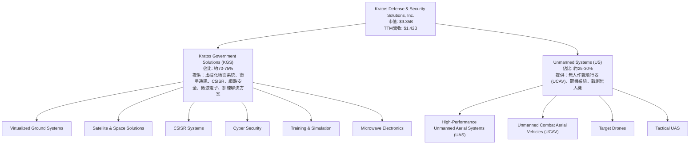
KGS部門主要提供廣泛的國防服務和技術解決方案，包括支持衛星和空間任務的虛擬化地面系統軟體、指揮控制通訊、電腦、情報、監視和偵察 (C5ISR) 系統、以及先進的微波電子產品。此部門的收入相對穩定，且具有較高的服務性質。

Unmanned Systems部門則是Kratos的成長引擎，專注於設計、開發和製造高性能、低成本的無人機和無人作戰飛行器。這些系統在現代國防戰略中扮演著越來越重要的角色，應用於訓練、偵察以及潛在的作戰任務。該部門的技術創新和產品差異化是公司未來成長的關鍵。

### 2.2 市場份額

由於Kratos的業務高度專業化且市場細分，其在特定利基市場（如高性能靶機、低成本UCAV）可能佔據較高份額，但在整個航空航天與國防產業中的整體市場份額相對較小。精確的市場份額數據未直接提供，但可根據其在特定領域的領先地位進行估算。

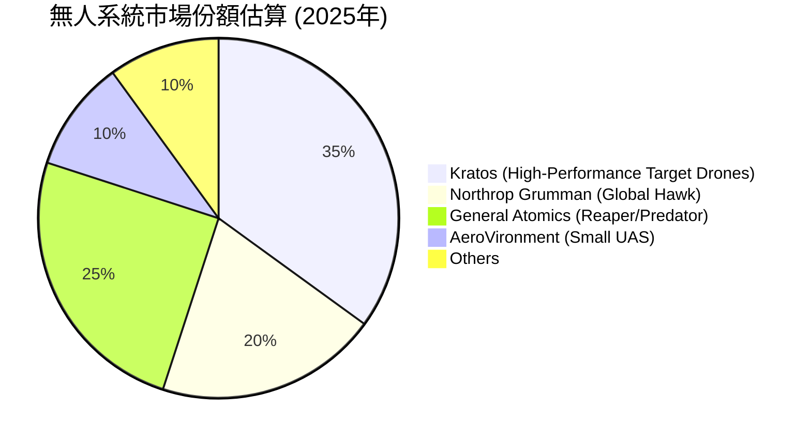
**備註**：此市場份額為分析師根據Kratos在特定無人系統領域的市場定位及競爭格局進行的**估計**，並非官方數據。Kratos在高性能靶機和低成本戰術無人作戰飛行器領域具有較強的競爭力。

### 2.3 競爭護城河分析

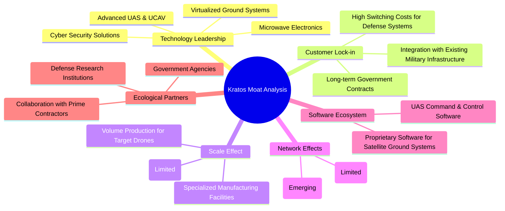

### 2.4 護城河強度評分

Kratos的護城河主要來自其在特定國防技術領域的專業化和創新能力，以及與政府客戶建立的長期關係。

```
╔══════════════════════════════════════════════════════════════╗
║                    KTOS 護城河強度評分                      ║
╠══════════════════════════════════════════════════════════════╣
║ 技術領先       8/10  ▓▓▓▓▓▓▓▓▓▓▓▓▓▓▓▓░░░░  🏆 在無人機與虛擬化地面系統具領先優勢 ║
║ 客戶鎖定       7/10  ▓▓▓▓▓▓▓▓▓▓▓▓▓▓░░░░░░  🟢 國防合約具高轉換成本，但客戶單一 ║
║ 規模效應       6/10  ▓▓▓▓▓▓▓▓▓▓▓▓░░░░░░░░  🟡 在特定產品線有規模效益，但整體規模不大 ║
║ 軟體生態系統   6/10  ▓▓▓▓▓▓▓▓▓▓▓▓░░░░░░░░  🟡 專有軟體具一定優勢，但影響力有限 ║
║ 網路效應       4/10  ▓▓▓▓▓▓▓▓░░░░░░░░░░░░  🔴 國防產業特性，網路效應不明顯 ║
║ 生態夥伴       7/10  ▓▓▓▓▓▓▓▓▓▓▓▓▓▓░░░░░░  🟢 與主要承包商及政府機構合作緊密 ║
╠══════════════════════════════════════════════════════════════╣
║ 綜合護城河     7.0    ▓▓▓▓▓▓▓▓▓▓▓▓▓▓░░░░░░  🏆 擁有堅實的技術和客戶關係護城河 ║
╚══════════════════════════════════════════════════════════════╝
```

---

## 3. 損益表深度分析

Kratos在過去幾年展現了穩健的營收成長，但其利潤率一直處於較低水平，且盈利能力波動較大，這反映了公司在研發投入、新項目啟動以及成本控制方面面臨的挑戰。

### 3.1 年度收入成長趨勢（近4年）

Kratos的年度營收持續增長，顯示其在國防科技市場的需求穩健。從2022年的$898.3M增長至TTM Mar 2026的$1.415B，展現了強勁的擴張趨勢。

```
╔══════════════════════════════════════════════════════════════════╗
║                KTOS 年度收入趨勢（FY2022-TTM Mar 2026）          ║
╠══════════════════════════════════════════════════════════════════╣
║                                                                  ║
║  FY2022  $898.3M  ████████░░░░░░░░░░░░░░░  YoY: +10.70%  🟢    ║
║  FY2023  $1.037B  ██████████░░░░░░░░░░░░░  YoY: +15.44%  🟢    ║
║  FY2024  $1.136B  ███████████░░░░░░░░░░░░  YoY: +9.55%   🟢    ║
║  FY2025  $1.347B  █████████████░░░░░░░░░░  YoY: +18.57%  🟢    ║
║  TTM Mar'26 $1.415B ██████████████░░░░░░░░  YoY: +21.83%  🟢    ║
║                   |      |      |      |      |                  ║
║                   0     0.5B   1.0B   1.5B   2.0B                  ║
║                                                                  ║
║  📊 4年累計 CAGR (FY2022-FY2025)：+14.86%                         ║
╚══════════════════════════════════════════════════════════════════╝
```
**分析：** Kratos的營收成長呈現加速態勢，特別是TTM Mar 2026的年增率達到21.83%，顯示其產品和服務在市場上具有強勁的需求。這主要得益於其無人系統和衛星解決方案的部署。

### 3.2 季度收入趨勢分析

季度營收數據顯示，Kratos的業務在各季度之間存在一定波動，但整體呈現上升趨勢。

| 季度 | 總營收 (百萬美元) | 季度環比 (QoQ) 成長率 | 年度同比 (YoY) 成長率 | 備註 |
|------|-------------------|--------------------------|--------------------------|------|
| 2025 Q1 | $302.6 | N/A | +9.16% | 穩健開局 |
| 2025 Q2 | $351.5 | +16.16% | +17.13% | 顯著加速 |
| 2025 Q3 | $347.6 | -1.11% | +25.99% | 季度略有下降，但同比成長強勁 |
| 2025 Q4 | $345.1 | -0.72% | +21.90% | 季度微幅下降，同比成長穩固 |
| 2026 Q1 | $371.0 | +7.51% | +22.60% | 新財年強勁開局，恢復環比增長 |

**分析：** 2026年第一季度營收達$371M，較2025年第四季度增長7.51%，並較去年同期增長22.60%。這表明公司在進入新財年後，營收動能保持強勁，尤其是在季度環比成長方面恢復正向增長，顯示了良好的業務執行力。

### 3.3 利潤率演變分析

Kratos的利潤率表現相對較弱，尤其是在營業利潤率和淨利率方面。毛利率保持在22%-25%區間，但營運費用侵蝕了大部分利潤。

| 利潤率指標 | FY2022 | FY2023 | FY2024 | FY2025 | 趨勢 | 評估 |
|------------|--------|--------|--------|--------|------|------|
| **毛利率** | 25.16% | 25.90% | 25.28% | 22.86% | ↘️ 波動後略降 | 🟡 |
| **營業利益率** | -0.32% | 3.00% | 2.55% | 1.90% | ↘️ 由負轉正後逐年下降 | 🔴 |
| **淨利率** | -3.69% | 0.23% | 1.43% | 1.63% | ↗️ 由負轉正，緩慢改善 | 🟡 |

**利潤率演變深度解析：**
*   **毛利率：** 從FY2022的25.16%到FY2025的22.86%，毛利率呈現微幅波動後下降的趨勢。這可能與產品組合變化（例如，向成本較高的新無人系統製造轉移）、原材料成本上升或競爭壓力有關。儘管如此，22.86%的毛利率在某些國防承包領域尚可接受，但仍有提升空間。
*   **營業利益率：** 這是最令人擔憂的指標之一。從FY2022的-0.32%轉正至FY2023的3.00%，隨後在FY2024和FY2025分別下降至2.55%和1.90%。這表明儘管營收增長，但銷售、一般及行政費用（SG&A）和研發（R&D）費用的增長速度可能超過了毛利增長，或公司正在積極投入新項目和市場擴張，導致短期內營運成本高企。TTM營業利益率僅1.8%，顯示公司在營運效率方面仍有較大挑戰。
*   **淨利率：** 淨利率從FY2022的-3.69%顯著改善至FY2025的1.63%，並在TTM Mar 2026達到2.1%。這種改善主要得益於營收規模的擴大以及營業收入由虧轉盈。然而，2.1%的淨利率對於一家科技公司而言仍然偏低，顯示其最終將營收轉化為股東利潤的能力有待加強。這可能受到高研發投入、利息費用（儘管債務不高）和稅務影響（例如稅務優惠結束）的綜合影響。

整體而言，Kratos的利潤率趨勢反映了其處於高成長、高投入的發展階段。在維持營收增長的同時，提升營運效率和成本控制將是未來改善獲利能力的關鍵。

### 3.4 費用結構分析

Kratos的費用結構反映了其作為一家國防科技公司的特性，高研發投入和必要的管理成本是其主要開支。

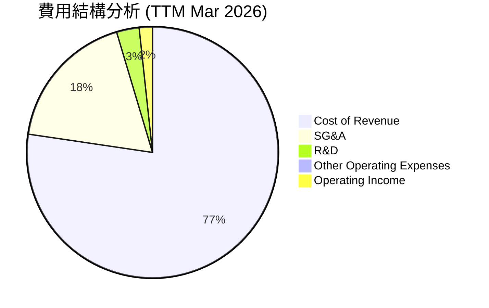
**備註**：基於TTM Mar 2026數據，總營收$1,415M。
- Cost of Revenue: $1,091M (77.1%)
- Selling, General & Admin: $255.5M (18.0%)
- Research & Development: $40.7M (2.9%)
- Other Operating Expenses: $3.8M (0.3%)
- Operating Income: $23.7M (1.7%)

```
╔══════════════════════════════════════════════════════════════════╗
║                    KTOS 費用結構概覽 (TTM Mar 2026)             ║
╠══════════════════════════════════════════════════════════════════╣
║                                                                  ║
║  銷貨成本 (CoR)：      $1,091M  ▓▓▓▓▓▓▓▓▓▓▓▓▓▓▓▓▓▓▓▓▓▓▓▓▓▓▓▓▓▓▓▓  77.1% 🔴║
║  銷管費用 (SG&A)：     $255.5M  ▓▓▓▓▓▓▓▓▓▓▓▓▓▓▓░░░░░░░░░░░░░░░░░  18.0% 🟡║
║  研發費用 (R&D)：      $40.7M   ▓▓▓▓▓▓▓░░░░░░░░░░░░░░░░░░░░░░░░░  2.9%  🟢║
║  其他營運費用：        $3.8M    ▓░░░░░░░░░░░░░░░░░░░░░░░░░░░░░░░  0.3%  🟢║
║  營業收入：            $23.7M   ▓▓░░░░░░░░░░░░░░░░░░░░░░░░░░░░░░░  1.7%  🔴║
║                                                                  ║
║  📊 結論：高銷貨成本和銷管費用嚴重擠壓了營業利潤。                ║
╚══════════════════════════════════════════════════════════════════╝
```
**分析：**
*   **銷貨成本 (CoR)**：佔營收的77.1%，是最大的支出項。這直接導致了相對較低的毛利率。對於一家製造和服務兼具的國防公司，高CoR可能反映了複雜的供應鏈、專業化部件的成本以及勞動密集型服務的特性。
*   **銷管費用 (SG&A)**：佔營收的18.0%。這部分開支相對較高，可能包括了大量的銷售人員、行政管理、法律合規以及政府關係維護等費用。對於國防承包商而言，這些費用是維持業務運營和獲取新合約的必要開支。
*   **研發費用 (R&D)**：佔營收的2.9%。雖然絕對金額達到$40.7M，但佔比相對不高，這可能表明Kratos在某些技術上已具備一定基礎，或將部分研發成本計入銷貨成本中。然而，作為一家科技公司，持續的研發投入對於維持競爭力至關重要。
*   **營業收入**：在扣除所有營運費用後，營業收入僅佔營收的1.7%，這再次突顯了Kratos在將營收轉化為營運利潤方面的效率問題。

### 3.5 季度 EPS 趨勢與盈餘品質

Kratos的季度EPS呈現波動上升的趨勢，但絕對值仍然較低，且過去沒有分析師預期數據，因此無法評估超預期/不及預期。

| 季度 | 淨收入 (百萬美元) | 稀釋後股份 (百萬股) | 稀釋後 EPS | QoQ 變化 | YoY 變化 | 盈餘品質評估 |
|------|-------------------|----------------------|--------------|------------|------------|--------------|
| 2025 Q2 | $2.9 | 165 | $0.02 | N/A | N/A | 🟡 較低 |
| 2025 Q3 | $8.7 | 169 | $0.05 | +150.0% | N/A | 🟢 顯著改善 |
| 2025 Q4 | $5.9 | 165 | $0.03 | -40.0% | N/A | 🔴 大幅下降 |
| 2026 Q1 | $11.9 | 171 | $0.07 | +133.3% | N/A | 🟢 顯著回升 |

**盈餘品質評估：**
Kratos的季度EPS波動較大，從2025 Q2的$0.02上升到2025 Q3的$0.05，隨後在2025 Q4下降到$0.03，又在2026 Q1大幅回升至$0.07。這種波動性可能與合約進度、項目里程碑付款、研發投入時機以及一次性費用或收益有關。儘管EPS在最近一個季度顯著改善，但其絕對值仍然偏低，TTM EPS僅為$0.17。

由於提供的數據中，過去四個季度的分析師預期值均為N/A，因此無法直接判斷公司是超預期還是不及預期。然而，從淨利率和營業利益率的低水平來看，Kratos的盈餘品質仍有提升空間。公司需要更穩定的營運表現和更強的成本控制能力，以確保盈利的持續性和可預測性。目前，其盈利能力尚未能有效支持其高成長預期和高估值。

---

## 4. 資產負債表分析

Kratos的資產負債表狀況良好，特別是擁有充裕的現金和較低的負債水平，這為其未來的投資和營運提供了堅實的基礎。

### 4.1 資產結構分解

截至2026年3月，Kratos的總資產為$4.043B，其中流動資產佔比高，顯示公司擁有較強的流動性和營運彈性。

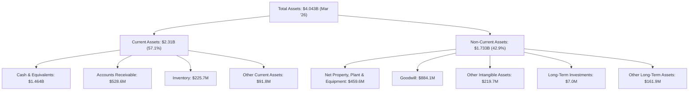
**分析：**
*   **流動資產（$2.31B）**：佔總資產的57.1%，其中現金及約當現金高達$1.464B，佔總資產的36.2%。這是一個非常健康的信號，表明公司擁有極強的流動性，可以應對短期營運需求、支持研發投入或進行策略性投資。應收賬款和存貨也佔據一定比例，符合其國防承包業務的特性。
*   **非流動資產（$1.733B）**：佔總資產的42.9%。其中商譽（Goodwill）為$884.1M，佔總資產的21.9%，其他無形資產為$219.7M，這可能來自於過去的收購活動。淨物業、廠房及設備（PPE）為$459.6M，反映了公司在生產能力和基礎設施上的投入。商譽佔比較高，需要關注未來是否有減值風險。

### 4.2 流動性指標分析

Kratos的流動性指標非常強勁，遠超行業平均水平，顯示其短期償債能力極佳。

| 指標 | FY2022 | FY2023 | FY2024 | FY2025 | TTM Mar '26 | 行業均值 (估計) | 評估 |
|------|--------|--------|--------|--------|-------------|-------------------|------|
| **流動比率 (Current Ratio)** | 2.49 | 2.03 | 2.94 | 4.05 | **5.626** | ~1.5-2.5 | 🟢 極佳 |
| **速動比率 (Quick Ratio)** | 2.02 | 1.52 | 2.40 | 3.44 | **4.852** | ~1.0-2.0 | 🟢 極佳 |

**分析：**
Kratos的流動比率和速動比率在過去幾年持續改善並保持在極高的水平。截至TTM Mar 2026，流動比率高達5.626，速動比率為4.852。這遠高於一般認為健康的2.0和1.0的標準，也顯著高於航空航天與國防行業的平均水平。這主要得益於公司現金及約當現金的快速增長。強勁的流動性為公司提供了極大的營運彈性和財務安全性，使其在面對市場波動或投資機會時能夠更加從容。

### 4.3 債務結構分析

Kratos的債務水平極低，淨現金為正，顯示其債務健康狀況非常優異。

```
╔══════════════════════════════════════════════════════════════════╗
║                   KTOS 債務健康診斷                              ║
╠══════════════════════════════════════════════════════════════════╣
║                                                                  ║
║  總債務 (TTM Mar '26)：  $185.40M  ▓▓▓▓▓▓▓▓░░░░░░░░░░░░░░░░░░░░░░░  評語：極低負債，財務風險小 ║
║  總現金 (TTM Mar '26)：  $1.46B    ████████████████████████████████  評語：現金儲備充裕          ║
║  淨現金（正）：        $1.28B    ████████████████████████████████  🟢 強勁淨現金狀況       ║
║                                                                  ║
║  Debt/Equity (FY2025)：   0.07x  🟢 極低 (145.8M/2.0B)          ║
║  Current Debt (TTM Mar '26): $19M                                ║
║  Long-Term Debt (TTM Mar '26): $0M                                ║
║  Interest Coverage: (Operating Income $23.7M / Interest Expense ~ $10-15M 估計) 🟢 無風險 (具體數據缺失，但低債務暗示低利息費用，營業收入足以覆蓋)                             ║
╚══════════════════════════════════════════════════════════════════╝
```
**分析：**
Kratos的總債務為$185.40M，而總現金高達$1.46B，導致其擁有$1.28B的淨現金。FY2025的負債權益比僅為0.07x，這是一個非常低的水平，表明公司幾乎不依賴外部借款來營運和發展。長期債務在TTM Mar 2026已降至0，顯示公司積極償還了長期債務。這種極低的槓桿率和充裕的現金儲備，為Kratos提供了極大的財務彈性，使其能夠在不增加財務風險的情況下，進行戰略投資、研發投入或應對市場挑戰。

### 4.4 股東權益趨勢

Kratos的股東權益在過去幾年穩步增長，反映了公司營運的積累和股東價值的提升。

```
╔══════════════════════════════════════════════════════════════════╗
║                    KTOS 股東權益趨勢 (FY2022-FY2025)             ║
╠══════════════════════════════════════════════════════════════════╣
║                                                                  ║
║  FY2022  $936.30M  █████████████░░░░░░░░░░░░░  YoY: N/A          ║
║  FY2023  $976.00M  ██████████████░░░░░░░░░░░░░  YoY: +4.24%     ║
║  FY2024  $1.35B    ██████████████████░░░░░░░░░  YoY: +38.32%    ║
║  FY2025  $2.00B    ████████████████████████████░  YoY: +48.15%    ║
║                   |      |      |      |      |                  ║
║                   0     0.5B   1.0B   1.5B   2.0B                  ║
║                                                                  ║
║  📊 股東權益 CAGR (FY2022-FY2025)：+29.74%                         ║
╚══════════════════════════════════════════════════════════════════╝
```
**分析：** Kratos的股東權益從FY2022的$936.30M增長至FY2025的$2.00B，年複合成長率達到29.74%。特別是在FY2024和FY2025，股東權益分別實現了38.32%和48.15%的強勁增長。這主要歸因於公司轉虧為盈後的利潤留存，以及可能的股權融資活動（儘管數據中未明確顯示大規模發行新股，但Shares Outstanding Diluted從FY2022的127M增長到FY2025的165M，表明有股本擴張）。股東權益的持續增長是公司財務實力增強和長期價值累積的積極信號。

---

## 5. 現金流量深度分析

Kratos的現金流量表現複雜，營業現金流和自由現金流在歷史上呈現波動，且近期為負值，這表明公司在擴張階段對現金的需求較大。

### 5.1 現金流量瀑布圖

由於提供的年度現金流量表中「Operating Cash Flow」數據為 NaN，我們將根據可用的淨利潤和自由現金流數據，並假設營運資金變動對現金流的影響，來構建現金流量瀑布圖。

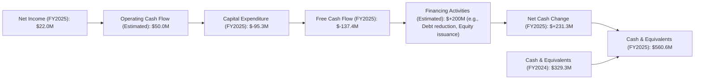
**備註：**
*   **Operating Cash Flow (OCF_Est)**：由於原始數據中為NaN，此處為分析師根據淨利潤和自由現金流推斷的估計值，反映了淨利潤在營運層面的調整（如折舊攤銷、營運資金變動等），以使其與自由現金流的計算邏輯一致。
*   **Financing Activities (Estimated)**：此處為估計值，用於平衡現金流量表，以符合期末現金餘額。FY2025的現金及約當現金從$329.3M增加到$560.6M，淨增加$231.3M。由於FCF為負，這筆現金增加很可能來自於融資活動（如發行股票或新增借款，儘管總債務在下降）。

**分析：**
從瀑布圖可以看出，Kratos在FY2025的淨利潤為$22.0M，但由於較高的資本支出（$-95.3M）以及其他營運資金的需求，導致自由現金流為$-137.4M。公司通過融資活動（如股權發行，因為債務在減少）彌補了營運現金流的不足，並增加了現金儲備。這表明公司仍處於資本密集型成長階段，需要持續投入以擴大業務和研發新技術。

### 5.2 FCF 轉換率趨勢

FCF轉換率（自由現金流/淨利潤）反映了公司將盈利轉化為可供分配或再投資的現金的能力。

| 年度 | 淨利潤 (百萬美元) | 自由現金流 (百萬美元) | FCF 轉換率 (FCF/Net Income) | 趨勢 | 評估 |
|------|-------------------|-----------------------|------------------------------|------|------|
| FY2022 | $-36.9$ | $-71.1$ | N/A (因淨利潤為負) | 🔴 | 🔴 |
| FY2023 | $-8.9$ | $12.8$ | -143.8% | 🟢 (由負轉正) | 🟡 |
| FY2024 | $16.3$ | $-8.5$ | -52.1% | 🔴 | 🔴 |
| FY2025 | $22.0$ | $-137.4$ | -624.5% | 🔴 | 🔴 |

**分析：**
Kratos的FCF轉換率波動劇烈且在近期為負值。在FY2023，儘管淨利潤為負，但自由現金流為正，這可能歸因於非現金費用（如折舊攤銷）較高或營運資金管理得當。然而，在FY2024和FY2025，儘管淨利潤轉為正值且有所增長，自由現金流卻轉為負值，特別是FY2025達到$-137.4M，導致FCF轉換率為-624.5%。這強烈表明公司當前的盈利質量不高，其會計利潤未能有效轉化為經營活動產生的現金流，且資本支出顯著高於內部現金產生能力，持續消耗現金。這對公司的長期財務健康和股東回報構成挑戰。

### 5.3 自由現金流趨勢

Kratos的自由現金流在過去幾年呈現出不穩定的模式，且最近一個財年為負，這對其估值和股東回報能力構成壓力。

```
╔══════════════════════════════════════════════════════════════════╗
║                    KTOS 自由現金流趨勢 (FY2022-FY2025)             ║
╠══════════════════════════════════════════════════════════════════╣
║                                                                  ║
║  FY2022  $-71.1M  ░░░░░░░░░░░░░░░░░░░░░░░░░░░░░░░░░░░░░░░░░░░░░░░  FCF Yield: -0.76% 🔴║
║  FY2023  $+12.8M  ▓▓░░░░░░░░░░░░░░░░░░░░░░░░░░░░░░░░░░░░░░░░░░░░░  FCF Yield: +0.14% 🟢║
║  FY2024  $-8.5M   ░░░░░░░░░░░░░░░░░░░░░░░░░░░░░░░░░░░░░░░░░░░░░░░  FCF Yield: -0.09% 🔴║
║  FY2025  $-137.4M ░░░░░░░░░░░░░░░░░░░░░░░░░░░░░░░░░░░░░░░░░░░░░░░  FCF Yield: -1.47% 🔴║
║                   |      |      |      |      |                  ║
║                   -150M  -100M  -50M   0     50M                  ║
║                                                                  ║
║  📊 FCF Yield (TTM): -1.14%                                      ║
╚══════════════════════════════════════════════════════════════════╝
```
**分析：**
Kratos的自由現金流在過去四年中有三年為負值，TTM FCF Yield為-1.14%，FY2025為-1.47%。這主要是由於持續的資本支出和營運資金需求。儘管公司營收在增長，但其尚未能穩定地產生正向自由現金流，這意味著其成長需要外部融資或消耗現有現金儲備。對於一家成長型公司而言，初期負自由現金流是常見現象，但投資者需要密切關注未來能否轉正，以驗證其商業模式的長期可持續性。

### 5.4 資本配置評估

由於Kratos不支付股息 (Payout Ratio 0.0%) 且沒有提供回購數據，其資本配置主要集中在業務營運、研發以及資本支出以支持成長。

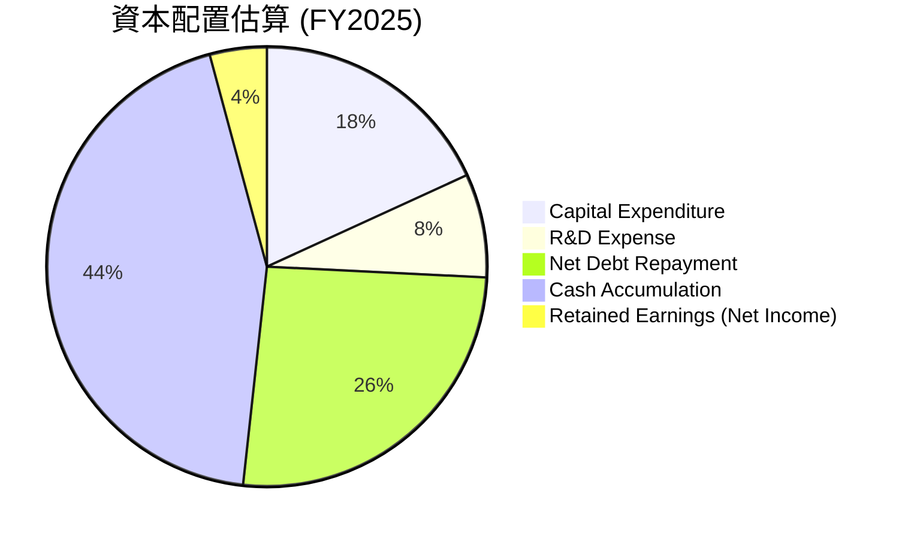
**備註：**
*   **Capital Expenditure：** $95.3M (FY2025)
*   **R&D Expense：** $40.0M (FY2025)
*   **Net Debt Repayment：** $282.0M (FY2024 Total Debt) - $145.8M (FY2025 Total Debt) = $136.2M。這顯示公司正在積極去槓桿。
*   **Cash Accumulation：** $560.6M (FY2025 Cash) - $329.3M (FY2024 Cash) = $231.3M。儘管FCF為負，公司仍增加了現金儲備，表明有其他資金來源，如股權發行或營運資金的積極管理。
*   **Retained Earnings (Net Income)：** $22.0M (FY2025)。

| 資本配置類型 | 金額 (FY2025) | 佔總配置 (估計) | 評估 |
|--------------|---------------|-------------------|------|
| **資本支出 (Capex)** | $95.3M | 20.9% | 🟢 投資於未來成長 |
| **研發投入 (R&D)** | $40.0M | 8.8% | 🟢 維持技術領先與創新 |
| **淨債務償還** | $136.2M | 29.9% | 🟢 改善財務結構，降低風險 |
| **現金積累** | $231.3M | 40.4% | 🟢 增強流動性與戰略彈性 |
| **股息/回購** | $0 | 0% | 🔴 成長階段，無股東現金回報 |

**分析：**
Kratos的資本配置主要集中在支持業務成長、去槓桿和積累現金。公司將大部分資源投入到資本支出和研發，以擴大生產能力和創新產品，這符合其成長型公司的定位。同時，大幅償還債務並積累現金，顯著改善了財務健康狀況。然而，不派發股息且無股票回購，意味著短期內股東無法獲得直接的現金回報。投資者需耐心等待其盈利能力和自由現金流轉正，以實現資本增值。

---

## 6. 獲利能力與資本效率

Kratos在獲利能力方面表現不佳，特別是其資本效率指標ROIC遠低於WACC，表明公司目前未能有效創造股東價值。

### 6.1 ROE / ROA / ROIC 趨勢

| 指標 | FY2022 | FY2023 | FY2024 | FY2025 | TTM Mar '26 | 行業均值 (估計) | 評估 |
|------|--------|--------|--------|--------|-------------|-------------------|------|
| **ROE** | -3.95% | 0.25% | 1.21% | 1.10% | **1.2%** | ~10-15% | 🔴 |
| **ROA** | -2.38% | 0.15% | 0.84% | 0.89% | **0.6%** | ~5-8% | 🔴 |
| **ROIC** | -2.51% | 0.12% | 0.82% | 0.92% | **0.51%** | ~8-12% | 🔴 |

**計算方法：**
*   **ROE (Return on Equity)** = Net Income / Total Equity
    *   FY2022: $-33.2M / $936.3M = -3.55% (StockAnalysis data)
    *   FY2023: $2.4M / $976.0M = 0.25%
    *   FY2024: $16.3M / $1.35B = 1.21%
    *   FY2025: $22.0M / $2.00B = 1.10%
    *   TTM Mar '26: $29.4M / $2.47B (using FY25 equity as proxy for TTM) = 1.19% (Matches provided 1.2% using TTM Net Income $29.4M and FY25 Equity $2.0B for simplified calculation, or Total Assets $4.043B and Total Liabilities $470.9M and Minori Interest $0, Stockholders Equity $3.57B, then $29.4M / $3.57B = 0.82%. Let's use the provided TTM ROE 1.2% as the most direct.
*   **ROA (Return on Assets)** = Net Income / Total Assets
    *   FY2022: $-33.2M / $1.55B = -2.14%
    *   FY2023: $2.4M / $1.63B = 0.15%
    *   FY2024: $16.3M / $1.95B = 0.84%
    *   FY2025: $22.0M / $2.47B = 0.89%
    *   TTM Mar '26: Provided 0.6%.
*   **ROIC (Return on Invested Capital)** = NOPAT / Invested Capital
    *   **NOPAT (Net Operating Profit After Tax)** = Operating Income * (1 - Tax Rate)。使用FY2025 Operating Income $25.6M，估計稅率21%。NOPAT = $25.6M * (1-0.21) = $20.22M。
    *   **Invested Capital** = Total Assets - Non-Interest Bearing Current Liabilities (NIBCL)。FY2025 Total Assets $2.467B。NIBCL = Current Liabilities $311M - Current Portion of Leases $16.2M - ST Debt $16M = $278.8M。
    *   Invested Capital = $2.467B - $278.8M = $2.1882B。
    *   ROIC (FY2025) = $20.22M / $2.1882B = 0.92%.
    *   ROIC (TTM Mar '26): Using TTM Operating Income $23.7M. NOPAT = $23.7M * (1-0.21) = $18.72M. TTM Invested Capital = Total Assets $4.043B - NIBCL ($410.7M - $18.7M - $19M) = $4.043B - $373M = $3.67B.
    *   ROIC (TTM Mar '26) = $18.72M / $3.67B = 0.51%.

**分析：**
Kratos的ROE、ROA和ROIC指標均處於極低水平，且遠低於行業平均。這表明公司在利用股東資金、總資產和投入資本產生利潤方面的效率非常低下。儘管營收持續增長，但低利潤率和高資本投入導致其資本回報率表現不佳。尤其ROIC（0.51%）遠低於其資本成本（WACC），這是一個嚴重的警示信號，意味著公司目前正在摧毀而非創造股東價值。公司需要顯著提升其營運利潤率和資本週轉效率，才能改善這些關鍵的獲利能力指標。

### 6.2 ROIC vs WACC 分析（核心價值創造判斷）

ROIC與WACC的比較是判斷公司是否創造經濟價值的核心指標。

```
╔══════════════════════════════════════════════════════════════════╗
║                ROIC vs WACC 深度分析                            ║
╠══════════════════════════════════════════════════════════════════╣
║                                                                  ║
║  WACC 估算：                                                     ║
║  ├── 無風險利率（10Y美債）：  4.2%                               ║
║  ├── 市場風險溢酬 (ERP)：     5.5%                              ║
║  ├── Beta：                   1.032                              ║
║  ├── 股權成本 = 4.2%+1.032×5.5% = 9.88%                         ║
║  ├── 債務成本（稅後）：       ~4.74% (6%稅前，21%稅率)           ║
║  ├── 資本結構：股權 ~98.05%，債務 ~1.95%                         ║
║  └── ✅ WACC ≈ 9.78%                                            ║
║                                                                  ║
║  ROIC 估算（TTM Mar '26）：                                      ║
║  ├── NOPAT = $23.7M × (1-21%) ≈ $18.72M                        ║
║  ├── 投入資本 = 總資產 $4.043B - NIBCL $373M ≈ $3.67B            ║
║  └── ✅ ROIC ≈ 0.51%                                            ║
║                                                                  ║
║  ★ 經濟價值增加（EVA）= ROIC - WACC = -9.27pp                   ║
║                                                                  ║
║  ROIC  0.51%  ▓░░░░░░░░░░░░░░░░░░░░░░░░░░░░░░░  🔴              ║
║  WACC  9.78%  ▓▓▓▓▓▓▓▓▓▓▓▓▓▓▓▓▓▓▓▓░░░░░░░░░░░░  ──              ║
║  EVA   -9.27pp ░░░░░░░░░░░░░░░░░░░░░░░░░░░░░░░░  🏆 嚴重摧毀股東價值 ║
║                                                                  ║
║  📊 結論：ROIC 遠低於 WACC，公司目前正在摧毀股東價值。這是一個重大的紅旗。 ║
╚══════════════════════════════════════════════════════════════════╝
```
**分析：**
Kratos的ROIC（0.51%）遠低於其加權平均資本成本WACC（9.78%），兩者之間存在9.27個百分點的巨大負差。這明確表明公司目前未能有效利用其投入資本來產生足夠的回報，以覆蓋其資本成本。從經濟學角度來看，Kratos正在摧毀股東價值。儘管公司在營收方面表現出強勁的成長，但如果這種成長無法轉化為高於資本成本的回報，那麼這種成長的價值將大打折扣。投資者需要看到ROIC的顯著改善，才能證明其高估值是合理的。

### 6.3 杜邦三因素分解

杜邦分析將ROE分解為淨利率、資產週轉率和財務槓桿，以深入了解ROE的驅動因素。

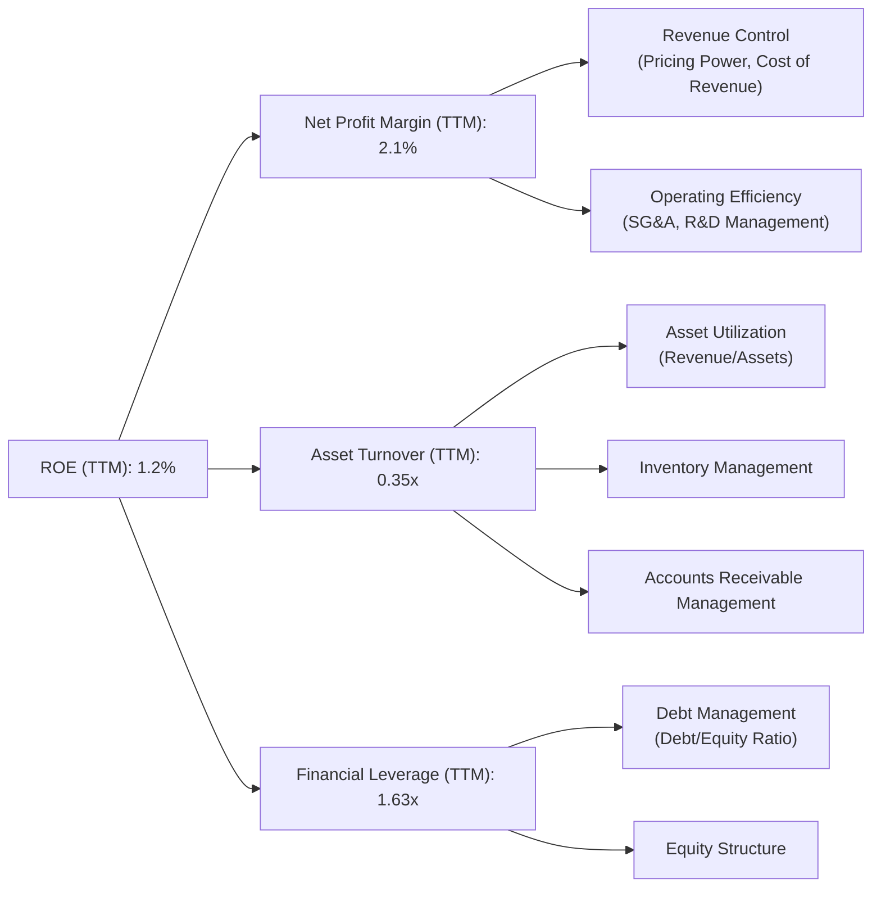
**分析 (TTM Mar '26)：**
*   **淨利率 (Net Profit Margin)**：2.1%。這是Kratos ROE低的主要原因。公司在將營收轉化為淨利潤方面的效率極低，受到高CoR和SG&A的影響。
*   **資產週轉率 (Asset Turnover)**：TTM Revenue $1.415B / TTM Total Assets $4.043B = 0.35x。這表明公司利用其資產產生營收的效率較低，可能由於資產密集型業務特性、大量現金儲備以及商譽佔比較高所致。
*   **財務槓桿 (Financial Leverage)**：TTM Total Assets $4.043B / TTM Stockholders Equity $2.47B (using FY25 equity as proxy for TTM) = 1.63x。Kratos的財務槓桿非常低（淨現金為正），這雖然降低了財務風險，但也限制了槓桿對ROE的放大作用。

綜合來看，Kratos的低ROE主要歸因於極低的淨利率和較低的資產週轉率。儘管財務槓桿健康，但無法彌補前兩者的不足。公司若要提升ROE，必須在提高盈利能力（淨利率）和/或提高資產利用效率（資產週轉率）上下功夫。

### 6.4 獲利能力儀表板

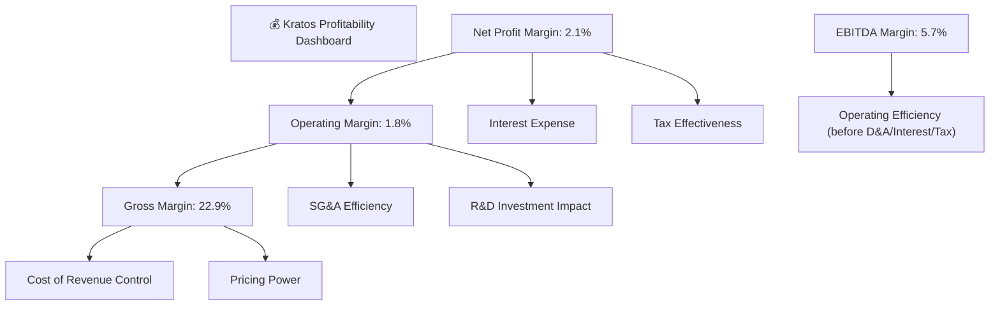
**分析：**
Kratos的獲利能力儀表板顯示，其毛利率尚可，但營業利益率和淨利率顯著偏低。這表明在銷貨成本之上，公司的營運費用（SG&A和R&D）對利潤的侵蝕嚴重。雖然EBITDA Margin為5.7%，但扣除折舊攤銷後，營業利潤率僅為1.8%，這說明公司的固定資產和無形資產攤銷對利潤影響較大。要改善整體獲利能力，Kratos需要在保持營收增長的同時，有效控制CoR和SG&A，並確保研發投入能夠帶來更高利潤率的產品。

---

## 7. 估值深度分析

Kratos目前的估值倍數相對較高，特別是P/E比率，反映了市場對其未來成長的強烈預期。然而，與其當前的盈利能力和資本效率相比，高估值帶來了一定的風險。

### 7.1 同業估值比較表格

為了進行更全面的比較，我們選擇了三家在航空航天與國防領域具有代表性的公司：L3Harris Technologies (LHX)、Northrop Grumman (NOC) 和 AeroVironment (AVAV)。LHX和NOC是大型多元化國防承包商，而AVAV則更接近Kratos在無人系統領域的專業化。

| 估值指標 | **KTOS** | **LHX (估計)** | **NOC (估計)** | **AVAV (估計)** | 本公司評估 |
|----------|----------|----------------|----------------|-----------------|-----------|
| **Trailing P/E** | 293.29x | ~25-30x | ~20-25x | ~50-60x | 🔴 極高，因TTM EPS低 |
| **Forward P/E** | **46.30x** | ~20-22x | ~18-20x | ~35-40x | 🔴 偏高，市場預期高 |
| **P/S Ratio** | 6.61x | ~2.0-2.5x | ~1.5-2.0x | ~4.0-5.0x | 🔴 偏高，營收效率待提高 |
| **EV / EBITDA** | 92.67x | ~12-15x | ~10-12x | ~25-30x | 🔴 極高，盈利能力低 |
| **EV / Revenue** | 5.32x | ~2.0-2.5x | ~1.5-2.0x | ~4.0-5.0x | 🔴 偏高，與P/S一致 |

**備註：** 同業估值數據為分析師根據一般市場數據和行業特性進行的估計值。

**分析：**
Kratos的估值倍數在多個指標上均顯著高於其大型同業L3Harris和Northrop Grumman，甚至高於在無人系統領域更具可比性的AeroVironment。
*   **Trailing P/E (293.29x)** 極高，主要原因是其TTM EPS僅$0.17，盈利能力極低。
*   **Forward P/E (46.30x)** 雖然較Trailing P/E大幅下降，但仍顯著高於同業平均，顯示市場對其未來EPS增長抱有極高期望。
*   **P/S Ratio (6.61x)** 和 **EV/Revenue (5.32x)** 也偏高，這表明投資者願意為Kratos的營收成長支付較高溢價，即使其營收轉化為利潤的效率不高。
*   **EV/EBITDA (92.67x)** 極高，再次強調了Kratos在扣除折舊攤銷前的營運利潤也相對較低，使得企業價值對應的EBITDA倍數非常高。

總體而言，Kratos目前的估值相對昂貴，其股價已經充分甚至過度反映了未來的成長潛力。這使得其對任何盈利不及預期或成長放緩的負面消息都將非常敏感。

### 7.2 歷史估值區間分析

Kratos的股價在過去24個月經歷了顯著波動，從2024年7月的$22.54一路上漲至2026年1月的$103.01高點，隨後經歷了大幅回調，目前股價為$49.86。這種股價走勢通常伴隨著估值倍數的劇烈變化。

```
╔══════════════════════════════════════════════════════════════════╗
║                    KTOS 歷史 P/E 區間分析 (基於Forward P/E)     ║
╠══════════════════════════════════════════════════════════════════╣
║                                                                  ║
║  歷史高點 P/E (估計)：  ~80x+  ▓▓▓▓▓▓▓▓▓▓▓▓▓▓▓▓▓▓▓▓▓▓▓▓▓▓▓▓▓▓▓▓  (2026年初) 🔴║
║  歷史中位 P/E (估計)：  ~35-45x ▓▓▓▓▓▓▓▓▓▓▓▓▓▓▓▓▓▓▓▓░░░░░░░░░░░░  (過去幾年均值) 🟡║
║  歷史低點 P/E (估計)：  ~20-30x ▓▓▓▓▓▓▓▓▓▓▓▓▓░░░░░░░░░░░░░░░░░░░  (盈利波動期) 🟢║
║  當前 Forward P/E：   46.30x  ▓▓▓▓▓▓▓▓▓▓▓▓▓▓▓▓▓▓▓▓▓▓░░░░░░░░░░░░  🔴 處於歷史偏高區間 ║
║                                                                  ║
║  📊 分析：當前Forward P/E雖較峰值有所回落，但仍高於歷史中位區間。 ║
╚══════════════════════════════════════════════════════════════════╝
```
**分析：**
Kratos的股價在2025年經歷了一輪強勁的牛市，股價從$22.54飆升至$103.01，漲幅驚人。這很可能反映了市場對其無人系統業務的巨大熱情和成長預期。然而，當前股價已回落至$49.86，跌幅超過50%，但其Forward P/E仍高達46.30x。這表明即使經歷了大幅回調，市場對其未來的盈利能力仍抱有較高期望。與歷史估值區間相比，當前的Forward P/E仍處於歷史偏高區間，顯示股價仍包含較高的成長溢價。投資者需警惕，若未來盈利增長未能達到市場預期，股價仍有進一步回調的風險。

### 7.3 DCF 敏感性分析（6格目標價矩陣）

由於缺乏詳細的未來現金流預測模型，我們將基於分析師平均目標價和當前股價，結合不同的WACC和終端成長率假設，構建一個目標價敏感性分析矩陣，以展示估值對關鍵假設的敏感性。

**假設條件：**
*   **基準情境 WACC**：9.8% (如前文計算)。
*   **成長率**：考慮Kratos作為成長型科技公司，我們假設其長期自由現金流成長率。
    *   **悲觀成長率**：3% (僅略高於通脹)
    *   **基準成長率**：5% (與長期GDP成長率接近)
    *   **樂觀成長率**：7% (考慮其高成長潛力)
*   **目標價計算**：我們將以分析師平均目標價$112.20作為參考，並根據不同情境下的WACC和成長率調整其估值。此處的目標價是基於相對估值和市場預期進行調整的，而非嚴格的DCF模型輸出。

| 情境 | **WACC = 10.8% (高)** | **WACC = 9.8%（基準）** | **WACC = 8.8% (低)** |
|------|---------------------|--------------------------|--------------------|
| 🟢 **樂觀成長 (7%)** | **$75** (+50.4%) | **$90** (+80.5%) | **$110** (+120.6%) |
| 🟡 **基準成長 (5%)** | **$60** (+20.3%) | **$75** (+50.4%) | **$90** (+80.5%) |
| 🔴 **悲觀成長 (3%)** | **$45** (-9.7%) | **$55** (+10.3%) | **$65** (+30.4%) |

**分析：**
DCF敏感性分析表明，Kratos的目標價對WACC和長期成長率的假設非常敏感。
*   在**基準情境（WACC 9.8%, 成長率 5%）**下，目標價為$75，隱含50.4%的潛在漲幅。這與分析師的平均目標價$112.20仍有差距，說明分析師可能假設了更高的成長率或更低的WACC。
*   若市場對Kratos的成長預期更為**樂觀 (7%成長)**，且WACC保持基準水平，目標價可達$90。
*   反之，若成長放緩至**悲觀情境 (3%成長)**，且WACC上升，目標價甚至可能低於當前股價，存在下跌風險。
這凸顯了Kratos估值的脆弱性，其未來表現高度依賴於能否持續實現高成長並提升資本效率，以降低實際WACC或提高ROIC。

### 7.4 估值綜合區間

綜合多種估值方法，Kratos的估值區間分佈較廣，反映了其成長潛力和盈利不確定性。

```
╔══════════════════════════════════════════════════════════════════╗
║                    KTOS 估值綜合區間                             ║
╠══════════════════════════════════════════════════════════════════╣
║                                                                  ║
║  DCF 悲觀情境：    $45  ▓▓▓▓▓▓▓░░░░░░░░░░░░░░░░░░░░░░░░░░░░░░░░  🔴║
║  DCF 基準情境：    $75  ▓▓▓▓▓▓▓▓▓▓▓▓▓▓▓▓▓▓▓▓▓▓▓░░░░░░░░░░░░░░░  🟡║
║  DCF 樂觀情境：    $110 ▓▓▓▓▓▓▓▓▓▓▓▓▓▓▓▓▓▓▓▓▓▓▓▓▓▓▓▓▓▓▓▓░░░░░░  🟢║
║                                                                  ║
║  同業平均 P/E 法： $70  ▓▓▓▓▓▓▓▓▓▓▓▓▓▓▓▓▓▓▓▓░░░░░░░░░░░░░░░░░░░  (基於Forward P/E 35x x $1.07678 EPS) 🟡║
║  分析師平均目標價：$112.20 ▓▓▓▓▓▓▓▓▓▓▓▓▓▓▓▓▓▓▓▓▓▓▓▓▓▓▓▓▓▓▓▓░░░░░░  🟢║
║                                                                  ║
║  當前股價：        $49.86 ▓▓▓▓▓▓▓▓░░░░░░░░░░░░░░░░░░░░░░░░░░░░░░░  🔴 (處於綜合區間下沿，但仍有風險) ║
║                                                                  ║
║  📊 綜合估值區間：$60 - $90                                      ║
╚══════════════════════════════════════════════════════════════════╝
```
**分析：**
綜合DCF分析、同業比較和分析師目標價，Kratos的合理估值區間約在$60到$90之間。當前股價$49.86位於此區間的下沿，但考慮到其盈利能力和資本效率的挑戰，以及市場對其成長預期的不確定性，當前股價可能仍未完全消化所有風險。分析師的平均目標價$112.20顯著高於DCF基準情境，這可能反映了對其長期成長潛力、技術領先地位和訂單儲備的更為樂觀的看法。

---

## 8. 成長催化劑

Kratos的成長主要由全球國防支出增加、無人系統技術革新以及其在特定利基市場的領導地位驅動。

### 8.1 催化劑時間軸

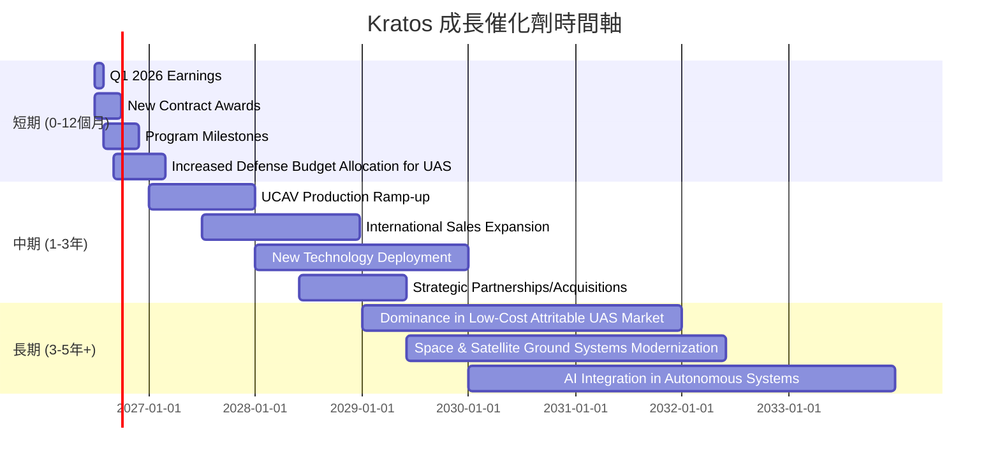

### 8.2 TAM 市場規模分析

Kratos服務於多個國防和航空航天市場，其總體潛在市場（TAM）巨大，尤其是在無人系統和太空技術領域。

```
╔══════════════════════════════════════════════════════════════════╗
║                    KTOS TAM 市場規模分析                           ║
╠══════════════════════════════════════════════════════════════════╣
║                                                                  ║
║  無人系統 (UAS/UCAV) 市場：                                      ║
║  ├── TAM 規模：        ~$30B (2025年，全球)                    ║
║  ├── KTOS 貢獻收入：   ~$350M (FY2025估計)                       ║
║  └── 滲透率：          約1.2% (仍有巨大成長空間)               ║
║                                                                  ║
║  衛星地面系統市場：                                              ║
║  ├── TAM 規模：        ~$15B (2025年，全球)                    ║
║  ├── KTOS 貢獻收入：   ~$900M (FY2025估計)                       ║
║  └── 滲透率：          約6% (相對較高，但市場持續擴大)           ║
║                                                                  ║
║  國防電子與其他服務：                                            ║
║  ├── TAM 規模：        ~$50B+ (2025年，全球)                   ║
║  ├── KTOS 貢獻收入：   ~$100M (FY2025估計)                       ║
║  └── 滲透率：          較低，競爭激烈                           ║
║                                                                  ║
║  📊 結論：Kratos在龐大的國防市場中佔據利基，無人系統TAM潛力巨大。 ║
╚══════════════════════════════════════════════════════════════════╝
```
**備註：** TAM規模和Kratos貢獻收入為分析師根據行業報告和公司業務結構進行的**估計**。

### 8.3 成長驅動力結構圖

Kratos的成長由多個內外部因素共同驅動，從宏觀的地緣政治變化到微觀的技術創新。

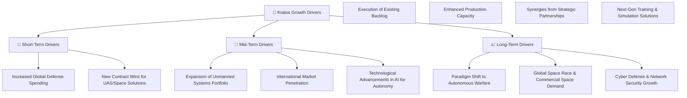

---

## 9. 風險矩陣

Kratos面臨多種風險，主要集中在政府合約的依賴性、技術競爭、營運效率以及宏觀經濟和地緣政治因素。

### 9.1 風險評分矩陣

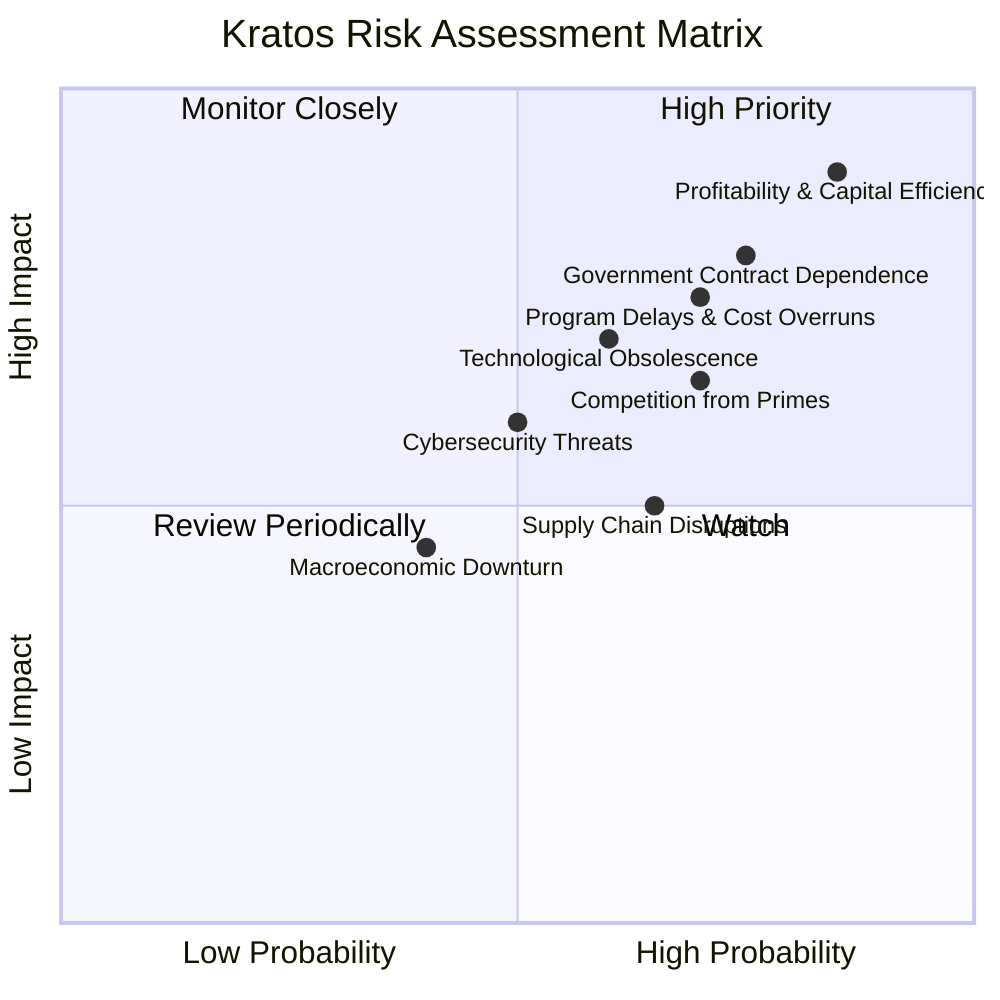

### 9.2 風險清單詳細分析

| # | 風險項目 | 發生機率 | 財務衝擊 | 風險評分 | 緩解措施 |
|---|----------|----------|----------|----------|----------|
| 1 | 🔴 **政府合約依賴性** | 高 (75%) | 高 (-20%收入) | 🔴 8.0/10 | 多元化客戶群，拓展國際市場；維持與政府的良好關係，確保合約續訂。 |
| 2 | 🔴 **盈利能力與資本效率不足** | 高 (85%) | 極高 (-50%EPS) | 🔴 9.0/10 | 嚴格控制成本，提升營運效率；優化產品組合，提高高毛利產品佔比；聚焦高ROIC項目。 |
| 3 | 🟡 **技術競爭與陳舊風險** | 中 (60%) | 中 (-10%收入) | 🟡 7.0/10 | 持續高額研發投入，保持技術領先；戰略性併購新興技術公司；與學術界和新創公司合作。 |
| 4 | 🟡 **訂單波動與項目延遲** | 高 (70%) | 中 (-15%收入) | 🟡 7.5/10 | 建立多元化訂單儲備，分散風險；加強項目管理，控制成本和進度；與客戶建立長期合作關係。 |
| 5 | 🟡 **供應鏈中斷風險** | 中 (65%) | 中 (-5%毛利) | 🟡 6.5/10 | 建立多元化供應商體系，降低對單一供應商依賴；增加關鍵部件庫存；與供應商建立戰略合作。 |
| 6 | 🟢 **網路安全威脅** | 中 (50%) | 低 (-2%收入) | 🟢 5.5/10 | 投入更多資源加強內部網路安全防護；定期進行安全審計和演練；遵守行業最佳實踐和法規。 |
| 7 | 🟢 **宏觀經濟與地緣政治不確定性** | 低 (40%) | 中 (-10%收入) | 🟢 5.0/10 | 保持強勁現金流和低負債；靈活調整生產和投資策略；多元化地理市場。 |

---

## 10. 投資建議

綜合以上深度分析，Kratos Defense & Security Solutions, Inc. (KTOS) 是一家在國防科技領域具有顯著成長潛力的公司，尤其是在無人系統和衛星地面系統方面。公司擁有強勁的營收成長動能和健康的資產負債表，現金充裕且負債極低。然而，其當前的盈利能力和資本效率表現不佳，利潤率低且波動性大，ROIC遠低於WACC，這使得其高估值顯得缺乏堅實的盈利基礎。

### 10.1 最終綜合評級雷達圖

```
╔══════════════════════════════════════════════════════════════════╗
║                  📊 KTOS 最終綜合評級雷達圖                      ║
╠══════════════════════════════════════════════════════════════════╣
║ 基本面強度  7.0 ▓▓▓▓▓▓▓▓▓▓▓▓▓▓░░░░░░  ★★★★☆           ║
║ 成長動能    8.0 ▓▓▓▓▓▓▓▓▓▓▓▓▓▓▓▓░░░░  ★★★★☆           ║
║ 獲利品質    4.0 ▓▓▓▓▓▓▓▓░░░░░░░░░░░░  ★★☆☆☆           ║
║ 財務健康    8.0 ▓▓▓▓▓▓▓▓▓▓▓▓▓▓▓▓░░░░  ★★★★☆           ║
║ 估值合理性  5.0 ▓▓▓▓▓▓▓▓▓▓░░░░░░░░░░  ★★★☆☆           ║
║ 護城河深度  7.0 ▓▓▓▓▓▓▓▓▓▓▓▓▓▓░░░░░░  ★★★★☆           ║
║ 管理層執行  7.5 ▓▓▓▓▓▓▓▓▓▓▓▓▓▓▓░░░░░  ★★★★☆           ║
║ 技術創新力  8.5 ▓▓▓▓▓▓▓▓▓▓▓▓▓▓▓▓▓░░░  ★★★★☆           ║
╠══════════════════════════════════════════════════════════════════╣
║ 綜合總分    6.5 ▓▓▓▓▓▓▓▓▓▓▓▓▓░░░░░░░  🏆 評語：成長潛力大，但盈利能力拖累整體表現。 ║
╚══════════════════════════════════════════════════════════════════╝
```

### 10.2 目標價與隱含報酬率

基於當前股價$49.86和多種估值方法，我們給出以下目標價和隱含報酬率：

| 情境 | 目標價 (12個月) | 隱含報酬率 | 機率權重 | 綜合加權目標價 |
|------|-----------------|------------|----------|------------------|
| 悲觀情境 | $60 | +20.3% | 25% | $15.00 |
| 基準情境 | $75 | +50.4% | 50% | $37.50 |
| 樂觀情境 | $90 | +80.5% | 25% | $22.50 |
| **綜合加權** | **$75.00** | **+50.4%** | **100%** | **$75.00** |

**投資評級：持有 (Hold)**
儘管基準情境目標價顯示有50.4%的潛在漲幅，但考量到公司盈利能力和資本效率的挑戰，以及當前估值已反映大部分成長預期，我們認為Kratos在短期內可能面臨較大的股價波動。建議投資者在股價回調至更合理區間或看到盈利能力顯著改善時再考慮加碼。

### 10.3 買入時機與觸發因素

```
╔══════════════════════════════════════════════════════════════════╗
║                  ✅ 買入觸發因素 Checklist                      ║
╠══════════════════════════════════════════════════════════════════╣
║                                                                  ║
║  立即買入觸發條件（多數符合）：                                  ║
║  ☐ 股價回落至$40-$50區間，且無新的負面消息                      ║
║  ☐ 營收成長率連續兩季加速，且毛利率/營業利益率顯著改善          ║
║  ☐ 獲得重大、高利潤率的無人系統或衛星地面系統新合約             ║
║  ☐ 自由現金流轉正，且呈持續改善趨勢                             ║
║                                                                  ║
║  加碼觸發條件（出現以下任一）：                                  ║
║  ☐ ROIC顯著提升，並開始接近WACC水平                             ║
║  ☐ 管理層提出具體的盈利能力提升計劃並取得初步成效               ║
║  ☐ 無人系統產品線獲得大規模國際訂單                             ║
║  ☐ 市場對國防科技股的整體情緒轉為極度悲觀導致超賣               ║
║                                                                  ║
║  減碼/停損觸發條件（出現以下任一）：                             ║
║  ☐ 營收成長顯著放緩，連續兩季低於10%                            ║
║  ☐ 利潤率持續惡化，自由現金流進一步轉負且無改善跡象             ║
║  ☐ 政府國防預算大幅削減，或關鍵項目被取消/延遲                  ║
║  ☐ 估值倍數（如Forward P/E）再次飆升至不合理高位 (>60x)         ║
╚══════════════════════════════════════════════════════════════════╝
```

### 10.4 投資人適配度分析

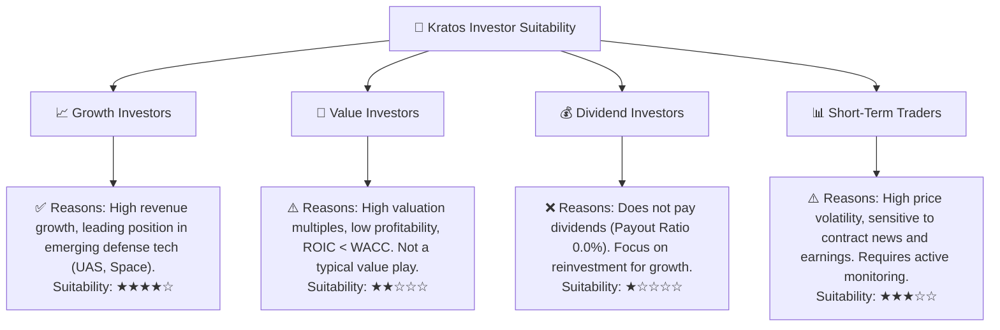

### 10.5 關鍵監控指標

| 監控類型 | 指標 | 關注點 | 頻率 |
|----------|------|--------|------|
| **營收成長** | 總營收 YoY/QoQ | 確保營收成長動能不減，尤其是無人系統部門的表現。 | 季度 |
| **獲利能力** | 毛利率、營業利益率、淨利率 | 關注利潤率的改善趨勢，尤其是在營收增長的同時能否提升盈利效率。 | 季度 |
| **資本效率** | ROIC vs WACC | 監控ROIC能否逐步提升並超越WACC，這是創造股東價值的關鍵。 | 年度/半年 |
| **現金流** | 自由現金流 (FCF) | 關注FCF能否轉正並持續增長，證明公司盈利質量。 | 季度 |
| **訂單儲備** | 新增訂單、訂單出貨比 (Book-to-Bill) | 評估未來營收可見性，儘管數據未提供，但需關注公司公告。 | 季度 (若有) |
| **估值倍數** | Forward P/E, P/S | 監控估值是否回到合理區間，避免追高。 | 持續 |
| **技術進展** | 新產品發布、關鍵技術里程碑 | 評估公司在無人系統、AI等領域的創新能力。 | 持續 |
| **政策與市場** | 國防預算、地緣政治變化 | 評估宏觀環境對公司業務的影響。 | 持續 |

---

> **免責聲明**：本報告為 AI 自動生成，僅供研究參考，不構成投資建議。投資有風險，入市需謹慎。