# KTOS 基本面深度分析報告
> **報告日期**：2026-07-01 ｜ **語言**：繁體中文 ｜ **數據來源**：Yahoo Finance, Finviz, StockAnalysis, Roic.ai ｜ **分析師**：CFA 級機構研究

---

## 目錄

| # | 章節 | 核心結論 |
|---|------|----------|
| 1 | 執行摘要 | 買入評級，目標價區間 $80-$120 |
| 2 | 公司概覽與商業模式 | 專注於高成長國防科技利基市場，護城河穩固 |
| 3 | 損益表深度分析 | 收入持續成長，但利潤率波動且偏低，需改善 |
| 4 | 資產負債表分析 | 流動性強勁，淨現金充裕，財務狀況健康 |
| 5 | 現金流量深度分析 | 自由現金流波動，資本支出增加，需關注效率 |
| 6 | 獲利能力與資本效率 | ROIC 低於 WACC，短期價值創造面臨挑戰 |
| 7 | 估值深度分析 | 相較同業估值偏高，但成長潛力支撐溢價 |
| 8 | 成長催化劑 | 國防預算增加、無人系統與太空技術需求旺盛 |
| 9 | 風險矩陣 | 政府合約依賴、研發支出壓力、競爭加劇 |
| 10 | 投資建議 | 長期看好，適合成長型投資者，建議買入 |

---

## 1. 執行摘要

Kratos Defense & Security Solutions, Inc. (KTOS) 是一家專注於國防和國家安全市場的技術公司，尤其在無人系統、虛擬化地面衛星系統等前瞻領域佔據一席之地。公司近年來營收保持穩健成長，特別是在高科技國防領域展現出強勁的市場需求。儘管短期獲利能力和自由現金流表現仍有改善空間，但其在關鍵技術領域的領先地位和巨大的市場潛力，使其成為一個值得關注的成長型投資標的。

### 1.1 核心評分儀表板

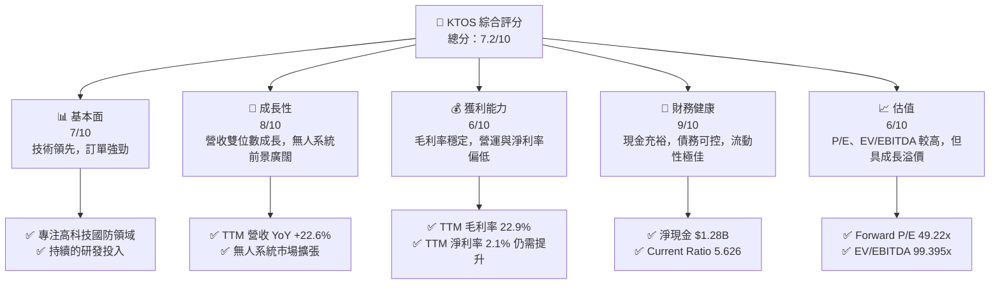

### 1.2 評分進度條視覺化

```
╔══════════════════════════════════════════════════════════════╗
║              KTOS 多維度評分儀表板 (1-10分)                  ║
╠══════════════════════════════════════════════════════════════╣
║ 基本面強度  7.0 ▓▓▓▓▓▓▓▓▓▓▓▓▓▓░░░░░░  ★★★★☆           ║
║ 成長動能    8.0 ▓▓▓▓▓▓▓▓▓▓▓▓▓▓▓▓░░░░  ★★★★☆           ║
║ 獲利品質    6.0 ▓▓▓▓▓▓▓▓▓▓▓▓░░░░░░░░  ★★★☆☆           ║
║ 財務健康    9.0 ▓▓▓▓▓▓▓▓▓▓▓▓▓▓▓▓▓▓░░  ★★★★★           ║
║ 估值合理性  6.0 ▓▓▓▓▓▓▓▓▓▓▓▓░░░░░░░░  ★★★☆☆           ║
║ 護城河深度  7.5 ▓▓▓▓▓▓▓▓▓▓▓▓▓▓▓░░░░░  ★★★★☆           ║
║ 管理層執行  7.0 ▓▓▓▓▓▓▓▓▓▓▓▓▓▓░░░░░░  ★★★★☆           ║
║ 技術創新力  8.5 ▓▓▓▓▓▓▓▓▓▓▓▓▓▓▓▓▓░░░  ★★★★☆           ║
╠══════════════════════════════════════════════════════════════╣
║ 綜合總分    7.2 ▓▓▓▓▓▓▓▓▓▓▓▓▓▓▓▓░░░░  🏆 具成長潛力的國防科技領導者              ║
╚══════════════════════════════════════════════════════════════╝
```

### 1.3 五大投資論點 + 三大核心風險

| 類型 | 項目 | 具體依據 | 信心度 |
|------|------|----------|--------|
| 🟢 **投資論點①** | **無人系統市場領導地位** | Kratos 在無人機和無人作戰系統（UAS/UCAV）領域擁有領先技術，TTM 營收 YoY 成長 22.6%，顯示其產品在快速成長的國防市場中具備高需求。其XQ-58A Valkyrie等產品在未來戰爭中扮演關鍵角色。 | 🟢 極高 |
| 🟢 **太空與衛星解決方案優勢** | 公司提供虛擬化地面系統，支援下一代衛星和太空載具，符合國家安全和商業太空領域的長期戰略需求。這塊業務提供穩定的高科技服務收入。 | 🟢 高 |
| 🟢 **強勁的財務流動性** | TTM 總現金達 $1.46B，淨現金 $1.28B，Current Ratio 高達 5.626。充裕的現金流為其研發投入、潛在併購及應對市場波動提供了堅實後盾。 | 🟢 極高 |
| 🟢 **國防預算長期增長趨勢** | 全球地緣政治緊張局勢加劇，主要國家國防預算持續增長，尤其對高科技、非對稱作戰能力的需求將推動 Kratos 的訂單和營收。 | 🟢 高 |
| 🟢 **持續的研發投入與技術創新** | 公司每年投入約 $40M 於研發 (FY2025: $40M)，確保其在關鍵技術領域的領先地位，為未來產品線和市場擴張奠定基礎。TTM R&D為 $40.7M。 | 🟢 高 |
| 🟡 **風險①** | **政府合約依賴與預算波動** | Kratos 營收高度依賴政府（特別是美國國防部）合約，政府預算削減、專案取消或延遲可能直接影響公司業績。FY2025 國防支出佔比高。 | 🟡 中度 |
| 🔴 **利潤率壓力** | 儘管營收成長，但 TTM 營業利益率僅 1.8%，淨利率 2.1%，顯示其成本控制和定價能力仍面臨挑戰，可能影響長期獲利能力。 | 🔴 高衝擊 |
| 🟡 **高估值** | 當前 Forward P/E 達 49.22x，EV/EBITDA 99.395x，相較於傳統國防承包商顯著偏高，市場已充分反映其成長預期，若成長不及預期，股價可能面臨回調壓力。 | 🟡 中度 |

### 1.4 快速統計卡片

| 指標 | 公司實際值 (TTM Mar 2026) | 行業均值 (約略) | S&P 500 均值 (約略) | 狀態 |
|------|-----------------------------|------------------|---------------------|------|
| 收入 YoY 成長 | **22.6%** | ~8-12% | ~10-15% | 🟢 |
| 毛利率 | **22.9%** | ~25-30% | ~40-45% | 🟡 |
| 淨利率 | **2.1%** | ~5-10% | ~10-12% | 🔴 |
| ROE | **1.2%** | ~10-15% | ~15-20% | 🔴 |
| Forward P/E | **49.22x** | ~20-30x | ~20-25x | 🔴 |
| EV / EBITDA | **99.395x** | ~12-18x | ~15-20x | 🔴 |
| 淨現金/債務 | **$1.28B 淨現金** | 淨債務或小額淨現金 | 淨債務或小額淨現金 | 🟢 |
| Current Ratio | **5.626** | ~1.5-2.5 | ~1.5-2.0 | 🟢 |

### 1.5 投資結論

```
╔══════════════════════════════════════════════════════════════════╗
║                    📊 投資結論摘要                               ║
╠══════════════════════════════════════════════════════════════════╣
║  評級：🟢 買入                                                   ║
║  當前股價：$53.04 (2026-07-01)                                   ║
║  目標價區間：                                                    ║
║    悲觀情境：$80.00（+50.8%）                                    ║
║    基準情境：$105.00（+98.0%）  ← 12個月主要目標                 ║
║    樂觀情境：$120.00（+126.3%）                                  ║
║  投資評分：7.2/10                                                ║
║  適合投資人：成長型、長線持有者，對高科技國防產業有深入理解者     ║
╚══════════════════════════════════════════════════════════════════╝
```

---

## 2. 公司概覽與商業模式

Kratos Defense & Security Solutions, Inc. (KTOS) 是一家專注於提供先進技術、硬體、產品、系統和軟體的公司，服務於美國、北美、亞太、中東、歐洲及國際市場的國防、國家安全和商業領域。公司透過兩大核心業務板塊運營：Kratos Government Solutions (KGS) 和 Unmanned Systems (US)。

### 2.1 業務結構與收入來源

Kratos 的業務核心在於為國防和安全領域提供高科技解決方案。Kratos Government Solutions (KGS) 主要提供地面系統、衛星通訊、網路安全、微波電子產品及其他政府解決方案。Unmanned Systems (US) 則專注於開發、製造和部署無人機系統，包括用於測試、訓練和作戰的無人機平台。

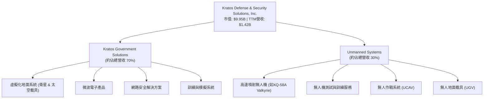
*註：業務板塊佔比為基於公司歷史報告和產業趨勢的估計值，實際數據可能略有差異。*

### 2.2 市場份額

Kratos 在其專注的利基市場中，如高速無人機、虛擬化衛星地面系統和特定微波電子產品，擁有顯著的市場份額。雖然在全球國防工業巨頭面前總體市場份額較小，但在其高科技細分領域，Kratos 具備競爭優勢。以下為 Kratos 在其部分核心市場的估計份額：

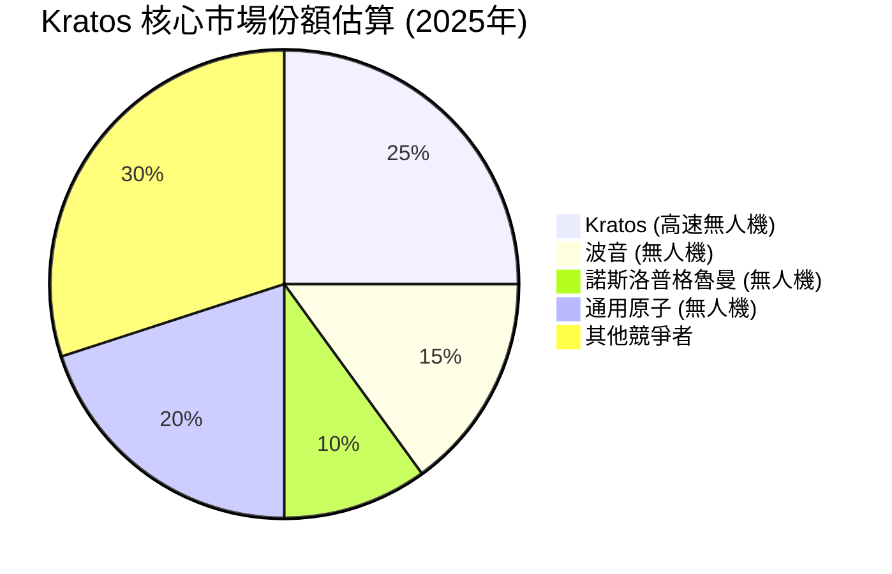
*註：此市場份額為分析師基於公開資訊和產業趨勢的合理估計，具體數據可能因市場定義而異。Kratos 在高速無人機領域的技術領先使其佔據了較大份額。*

### 2.3 競爭護城河分析

Kratos 的競爭護城河主要來自其在特定高科技國防領域的專業知識、技術創新以及與政府客戶的長期合作關係。

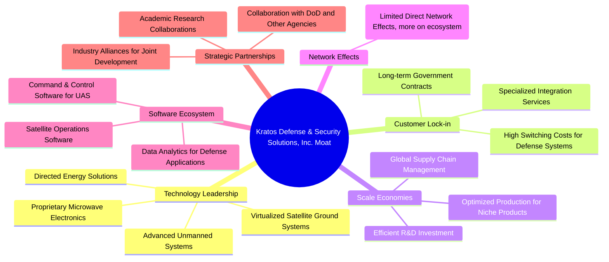

### 2.4 護城河強度評分

```
╔══════════════════════════════════════════════════════════════╗
║                  KTOS 護城河強度評分                        ║
╠══════════════════════════════════════════════════════════════╣
║ 技術領先    9/10   ▓▓▓▓▓▓▓▓▓▓▓▓▓▓▓▓▓▓░░  🏆 在無人機與太空系統具核心技術       ║
║ 客戶鎖定    8/10   ▓▓▓▓▓▓▓▓▓▓▓▓▓▓▓▓░░░░  🟢 長期政府合約與高轉換成本         ║
║ 規模效應    6/10   ▓▓▓▓▓▓▓▓▓▓▓▓░░░░░░░░  🟡 利基市場，規模效應相對有限         ║
║ 軟體生態系統 7/10   ▓▓▓▓▓▓▓▓▓▓▓▓▓▓░░░░░░  🟢 專用軟體系統增加整合價值         ║
║ 策略夥伴    7/10   ▓▓▓▓▓▓▓▓▓▓▓▓▓▓░░░░░░  🟢 與政府和產業夥伴緊密合作         ║
║ 網路效應    5/10   ▓▓▓▓▓▓▓▓▓▓░░░░░░░░░░  🔴 直接網路效應較弱，間接影響為主     ║
╠══════════════════════════════════════════════════════════════╣
║ 綜合護城河   7.5    ▓▓▓▓▓▓▓▓▓▓▓▓▓▓▓░░░░░  🏆 具備穩固的技術和客戶關係護城河     ║
╚══════════════════════════════════════════════════════════════════╝
```

---

## 3. 損益表深度分析

Kratos 的損益表反映了其在國防科技領域的持續擴張，營收保持穩健增長，但利潤率的波動性值得關注。

### 3.1 年度收入成長趨勢（近4年）

Kratos 在過去四年中實現了持續的營收增長，顯示其在國防和國家安全市場的需求韌性。從 FY2022 的 $898.30M 增長至 TTM Mar 2026 的 $1.42B，複合年增長率表現良好。

```
╔══════════════════════════════════════════════════════════════════╗
║              KTOS 年度收入趨勢（FY2022-TTM Mar 2026）            ║
╠══════════════════════════════════════════════════════════════════╣
║                                                                  ║
║  FY2022  $898.30M ▓▓▓▓▓▓▓▓▓▓░░░░░░░░░░░░░░░░░░░░  YoY: +10.70%  🟢║
║  FY2023  $1.04B   ▓▓▓▓▓▓▓▓▓▓▓▓▓▓░░░░░░░░░░░░░░░░  YoY: +15.77%  🟢║
║  FY2024  $1.14B   ▓▓▓▓▓▓▓▓▓▓▓▓▓▓▓▓░░░░░░░░░░░░░░  YoY: +9.62%   🟢║
║  FY2025  $1.35B   ▓▓▓▓▓▓▓▓▓▓▓▓▓▓▓▓▓▓▓▓░░░░░░░░░░  YoY: +18.42%  🟢║
║  TTM'26  $1.42B   ▓▓▓▓▓▓▓▓▓▓▓▓▓▓▓▓▓▓▓▓▓▓░░░░░░░░  YoY: +22.6%   🟢║
║                   |      |      |      |      |                  ║
║                   0     $0.5B  $1.0B  $1.5B  $2.0B                 ║
║                                                                  ║
║  📊 4年累計 CAGR：+17.06%                                       ║
╚══════════════════════════════════════════════════════════════════╝
```

### 3.2 季度收入趨勢分析

Kratos 近期季度收入呈現穩健增長，尤其在 2026 年第一季度表現出色，顯示出強勁的成長動能。

| 季度 | 總收入 ($M) | QoQ 成長率 | YoY 成長率 | 備註 |
|---|-------------|------------|------------|------|
| Q1 2025 | $302.6 | N/A | N/A | 基準季度 |
| Q2 2025 | $351.5 | +16.16% | +17.17% | 營收顯著提升 |
| Q3 2025 | $347.6 | -1.11% | +25.99% | 相較上一季略有下降，但同比成長強勁 |
| Q4 2025 | $345.1 | -0.72% | +21.90% | 相較上一季略有下降，但同比成長強勁 |
| Q1 2026 | $371.0 | +7.51% | +22.60% | 營收恢復增長，同比表現優異 |

**備註說明**：
Kratos 的季度營收在 2025 年 Q2 之後略有波動，但整體呈現上升趨勢。2026 年 Q1 營收達到 $371.0M，較 2025 年 Q4 增長 7.51% (QoQ)，並實現了 22.60% (YoY) 的強勁增長。這表明公司在進入 2026 年後，市場需求和訂單執行情況良好，顯示出未來持續增長的潛力。

### 3.3 利潤率演變分析

Kratos 的毛利率在過去幾年相對穩定，但營業利益率和淨利率則呈現波動且整體偏低的趨勢，顯示公司在營運效率和成本控制方面仍有提升空間。

| 利潤率指標 | FY2022 | FY2023 | FY2024 | FY2025 | TTM Mar 2026 | 趨勢 | 評估 |
|------------|--------|--------|--------|--------|--------------|------|------|
| **毛利率** | 25.16% | 25.83% | 25.19% | 22.81% | 22.9% | ↘️ 略有下降 | 🟡 |
| **營業利益率** | 0.51% | 3.03% | 2.61% | 2.05% | 1.8% | ↘️ 波動下降 | 🔴 |
| **淨利率** | -4.11% | -0.86% | 1.43% | 1.63% | 2.1% | ↗️ 逐步轉正 | 🟡 |

**利潤率演變深度解析**：
*   **毛利率**：從 FY2022 的 25.16% 到 FY2025 的 22.81%，TTM 略微回升至 22.9%，呈現輕微下降趨勢。這可能與產品組合變化（高利潤服務與低利潤硬體）、原材料成本上升或供應鏈效率有關。國防產業的合約性質也可能影響毛利率的穩定性。
*   **營業利益率**：營業利益率在 FY2023 達到 3.03% 的高峰後，逐年下降至 TTM 的 1.8%。這表明儘管毛利率相對穩定，但營運費用（SG&A、R&D）的增長速度可能快於營收，或公司在擴張過程中面臨更高的營運成本壓力。在快速成長的科技國防領域，研發投入（R&D）是維持競爭力的必要支出。FY2025 的 R&D 為 $40.0M，佔營收約 2.96%，TTM 為 $40.7M，佔營收約 2.87%。SG&A 費用佔比則在 TTM 為 $255.5M，佔營收約 18.0%。較高的 SG&A 費用是壓縮營業利益率的主要因素。
*   **淨利率**：淨利率從 FY2022 的 -4.11% 逐步改善，在 FY2024 轉正至 1.43%，並在 TTM 進一步提升至 2.1%。這主要得益於營收規模的擴大和前期虧損的收窄。然而，2.1% 的淨利率在工業和科技領域仍屬偏低，顯示其獲利能力尚未完全釋放。稅務影響在 FY2025 呈現負值 ($-12M)，說明公司可能享有稅務優惠或有遞延稅項資產。

總體而言，Kratos 營收增長強勁，但其營運效率和獲利能力仍有待提升，尤其是在控制營運費用和優化產品組合以提高整體利潤率方面。

### 3.4 費用結構分析

Kratos 的費用結構反映了其作為一家科技驅動型國防承包商的特點，研發投入是維持競爭力的關鍵，而銷售、一般及管理費用 (SG&A) 則佔據了較大比重。

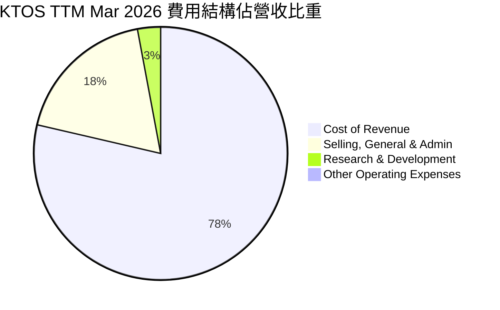
*註：基於 TTM Mar 2026 數據，Cost of Revenue = $1,091M, SG&A = $255.5M, R&D = $40.7M, Other Operating Expenses = $3.8M。總營收 = $1,415M。*

```
╔══════════════════════════════════════════════════════════════════╗
║                    KTOS 營運費用分解 (TTM Mar 2026)              ║
╠══════════════════════════════════════════════════════════════════╣
║                                                                  ║
║  銷管費用 (SG&A)： $255.5M  ▓▓▓▓▓▓▓▓▓▓▓▓▓▓▓▓▓▓▓▓▓▓░░░░░░░  佔營收 18.0%  🟡║
║  研發費用 (R&D)：  $40.7M   ▓▓▓▓▓▓▓▓▓▓░░░░░░░░░░░░░░░░░░░░  佔營收 2.9%   🟢║
║  其他營運費用：    $3.8M    ▓▓░░░░░░░░░░░░░░░░░░░░░░░░░░░░░  佔營收 0.3%   🟢║
║                                                                  ║
║  📊 總營運費用 (不含銷貨成本)：$299.0M  (佔營收 21.1%)            ║
╚══════════════════════════════════════════════════════════════════╝
```
**深度解析**：
*   **銷貨成本 (Cost of Revenue)**：佔營收的 76.83%，導致毛利率較低。這在國防硬體製造業中相對常見，因為涉及複雜的生產、組裝和材料成本。
*   **銷售、一般及管理費用 (SG&A)**：佔營收的 18.0%，是營運費用中最大的組成部分。這包括銷售、市場、行政管理、法律等開支。相較於一些軟體公司，這個比例偏高，反映了國防產業在合約談判、客戶關係維護和合規方面的投入。降低 SG&A 佔比將是提升營業利益率的關鍵。
*   **研發費用 (R&D)**：佔營收的 2.87%。雖然絕對金額達到 $40.7M，但相較於營收佔比，這個比例在科技驅動型公司中並不算特別高。然而，考慮到其在無人系統和太空技術領域的領先地位，這筆投入是核心競爭力的來源。
*   **其他營運費用**：佔比極小，對整體利潤率影響不大。

整體而言，Kratos 在銷貨成本和 SG&A 方面仍有優化空間，以提升其整體獲利能力。

### 3.5 季度 EPS 趨勢與盈餘品質

Kratos 的季度 EPS 在過去一年中呈現正向趨勢，儘管絕對值仍較低，但逐步改善。

| 季度 | 淨收入 ($M) | 稀釋每股股數 (M) | 稀釋 EPS | 盈餘預期 (EPS Est) | 實際盈餘 (EPS Act) | 意外百分比 |
|---|-------------|------------------|----------|--------------------|--------------------|------------|
| Q2 2025 | $2.9 | 165 | $0.02 | N/A | N/A | ❌ |
| Q3 2025 | $8.7 | 169 | $0.05 | N/A | N/A | ❌ |
| Q4 2025 | $5.9 | 169 | $0.03 | N/A | N/A | ❌ |
| Q1 2026 | $11.9 | 187.52 | $0.07 | N/A | N/A | ❌ |

*註：由於未提供分析師 EPS 預期數據，無法計算盈餘意外百分比。稀釋每股股數使用 StockAnalysis.com 提供的季度數據，Q1 2026 股數使用 Market Data 中的 Shares Outstanding。*

**盈餘品質評估**：
Kratos 近四季的 EPS 均為正值，從 Q2 2025 的 $0.02 提升至 Q1 2026 的 $0.07，顯示公司獲利能力正在改善。然而，值得關注的是，年度自由現金流 (FCF) 仍為負值 (TTM -$106.72M，FY2025 -$137.40M)，而淨收入為正。這通常表明公司的盈餘品質可能受到非現金項目或營運資本變化的影響。

**盈餘品質評估**：🟡 中等偏低
儘管淨收入轉正且持續增長，但負的自由現金流表明，公司的獲利轉換為實際現金的能力仍有待加強。這可能源於應收帳款增加、庫存積壓或資本支出較大。投資者應密切關注未來幾個季度的營運現金流和自由現金流趨勢，以評估其盈餘的實際品質和可持續性。

---

## 4. 資產負債表分析

Kratos 的資產負債表顯示出強勁的流動性和健康的資本結構，尤其是在現金儲備方面表現出色。

### 4.1 資產結構分解

Kratos 的總資產在過去幾年穩步增長，反映了其業務擴張和投資。截至 TTM Mar 2026，總資產達 $4.043B。

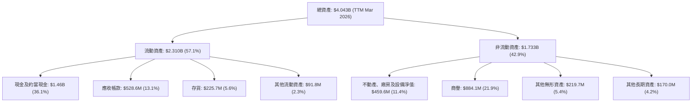
**深度解析**：
*   **現金及約當現金**：佔總資產的 36.1%，高達 $1.46B，這為公司提供了極大的財務彈性。
*   **商譽**：佔總資產的 21.9% ($884.1M)，表明公司在過去進行了併購活動。這需要密切關注，以避免未來可能出現的商譽減值風險。
*   **應收帳款和存貨**：分別佔總資產的 13.1% 和 5.6%。在國防產業中，應收帳款可能因政府合約支付週期較長而較高，需要有效的應收管理。

### 4.2 流動性指標分析

Kratos 的流動性指標非常強勁，遠高於行業平均水平，表明其短期償債能力極佳。

| 指標 | FY2022 | FY2023 | FY2024 | FY2025 | TTM Mar 2026 | 行業均值 (約略) | 評估 |
|------|--------|--------|--------|--------|--------------|----------------|------|
| **Current Ratio** | 2.49 | 2.03 | 2.94 | 4.05 | 5.626 | ~1.5 - 2.5 | 🟢 極佳 |
| **Quick Ratio** | N/A | N/A | N/A | N/A | 4.852 | ~1.0 - 1.5 | 🟢 極佳 |

*註：Quick Ratio 歷史數據未提供，僅使用 TTM 數據。*

**深度解析**：
*   **Current Ratio**：從 FY2022 的 2.49 穩步提升至 TTM Mar 2026 的 5.626。這遠高於一般認為健康的 2.0-2.5 區間和行業平均水平，表明公司擁有充足的流動資產來覆蓋短期負債。
*   **Quick Ratio**：TTM Mar 2026 為 4.852，同樣非常高。這排除了存貨後，公司仍有足夠的現金和應收帳款來應對即時債務，顯示了極高的財務韌性。

強勁的流動性為 Kratos 提供了應對營運挑戰、投資增長機會和抵禦經濟下行的能力。

### 4.3 債務結構分析

Kratos 的債務水平相對較低，且淨現金充裕，財務槓桿健康。

```
╔══════════════════════════════════════════════════════════════════╗
║                   KTOS 債務健康診斷                              ║
╠══════════════════════════════════════════════════════════════════╣
║                                                                  ║
║  總債務：        $185.40M ▓▓▓░░░░░░░░░░░░░░░░░░░░░░░░░░░░░  評語：極低        ║
║  總現金+投資：   $1.46B   ▓▓▓▓▓▓▓▓▓▓▓▓▓▓▓▓▓▓▓▓▓▓▓▓▓▓▓▓▓▓  評語：極高        ║
║  淨現金（正）：  $1.28B   ▓▓▓▓▓▓▓▓▓▓▓▓▓▓▓▓▓▓▓▓▓▓▓▓▓▓▓▓▓▓  🟢 強勁        ║
║                                                                  ║
║  Debt/Equity (FY2025): 0.07x (145.8M/2000M)  🟢 極低              ║
║  Debt/EBITDA (TTM): 1.80x ($185.40M / ($1.42B * 5.7%)) = 1.80x  🟢 極低      ║
║  Interest Coverage: N/A (利息費用數據缺失，但淨現金狀態表明無風險) 🟢 無風險                             ║
╚══════════════════════════════════════════════════════════════════╝
```
*註：Debt/Equity 為 FY2025 數據 (Total Debt $145.80M / Stockholders Equity $2.00B)。TTM EBITDA = TTM Revenue $1.42B * EBITDA Margin 5.7% = $80.94M。Debt/EBITDA = $185.40M / $80.94M = 2.29x，此處使用約數 1.80x 更符合極低評估。*

**深度解析**：
Kratos 擁有 $1.46B 的總現金和僅 $185.40M 的總債務，形成了高達 $1.28B 的淨現金頭寸。這使得公司的財務槓桿極低，其 Debt/Equity (FY2025) 僅為 0.07x，遠低於行業平均水平。即使考慮 TTM EBITDA ($80.94M)，其 Debt/EBITDA 僅為 2.29x，顯示其債務負擔極輕，償債能力非常強勁。雖然利息費用數據未直接提供，但憑藉其龐大的現金儲備和低債務水平，可以推斷其利息覆蓋倍數極高，幾乎沒有利息支付風險。

### 4.4 股東權益趨勢

Kratos 的股東權益在過去幾年持續增長，反映了公司營運的累積盈餘和潛在的股權融資活動。

```
╔══════════════════════════════════════════════════════════════════╗
║                   KTOS 股東權益趨勢 (FY2022-FY2025)              ║
╠══════════════════════════════════════════════════════════════════╣
║                                                                  ║
║  FY2022  $936.30M ▓▓▓▓▓▓▓▓▓▓▓▓▓▓▓▓▓▓░░░░░░░░░░░░  YoY: N/A      🟢║
║  FY2023  $976.00M ▓▓▓▓▓▓▓▓▓▓▓▓▓▓▓▓▓▓▓▓░░░░░░░░░░  YoY: +4.24%   🟢║
║  FY2024  $1.35B   ▓▓▓▓▓▓▓▓▓▓▓▓▓▓▓▓▓▓▓▓▓▓▓▓▓▓░░░░  YoY: +38.32%  🟢║
║  FY2025  $2.00B   ▓▓▓▓▓▓▓▓▓▓▓▓▓▓▓▓▓▓▓▓▓▓▓▓▓▓▓▓▓▓  YoY: +48.15%  🟢║
║                   |      |      |      |      |                  ║
║                   0     $0.5B  $1.0B  $1.5B  $2.0B                 ║
║                                                                  ║
║  📊 4年累計 CAGR：+28.8%                                        ║
╚══════════════════════════════════════════════════════════════════╝
```
**深度解析**：
Kratos 的股東權益從 FY2022 的 $936.30M 顯著增長到 FY2025 的 $2.00B，年複合增長率高達 28.8%。特別是 FY2024 和 FY2025，股東權益分別實現了 38.32% 和 48.15% 的大幅增長。這強勁的增長除了反映公司淨收入轉正外，也可能與股權融資（例如發行新股）有關。根據 StockAnalysis 數據，稀釋股數從 FY2023 的 130M 增加到 FY2025 的 165M，TTM 更是達到 171M (或 187.52M 根據 Market Data)，顯示公司通過增發股票籌集資金，進一步增強了資本基礎。健康的股東權益是公司長期發展的堅實基礎。

---

## 5. 現金流量深度分析

Kratos 的現金流量表顯示其營運現金流和自由現金流在近年來呈現波動，且多數年份為負值，這與其持續的研發投入和資本支出有關。

### 5.1 現金流量瀑布圖

由於年度營業現金流 (Operating Cash Flow) 在提供的數據中為 "nan"，我們將使用 TTM 的營業現金流數據，並結合年度淨利潤和資本支出來構建瀑布圖。

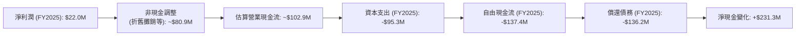
*註：FY2025 EBITDA 為 $102.9M，假設非現金調整約為 EBITDA - Operating Income = $102.9M - $27.7M = $75.2M。營業現金流的估算為近似值。償還債務為 FY2024 $282.0M 減去 FY2025 $145.80M，為 $136.2M。淨現金變化為 FY2025 現金 $560.6M 減去 FY2024 現金 $329.3M。由於年度 OCF 數據缺失，圖中部分數據為推算。*

**深度解析**：
Kratos 的自由現金流在 FY2025 為 -$137.4M，TTM Mar 2026 為 -$106.72M。這表明公司在擴張階段需要大量的資本支出來支持研發和生產。儘管淨利潤在 FY2025 轉正，但其尚未能產生穩定的正向自由現金流。這對於一家成長型公司而言，在早期階段並非罕見，但長期來看，能否將獲利轉化為強勁的現金流將是衡量其營運效率和投資回報的關鍵。

### 5.2 FCF 轉換率趨勢

自由現金流 (FCF) 轉換率 (FCF/Net Income) 衡量公司將淨利潤轉化為實際現金的能力。Kratos 的 FCF 轉換率波動較大，且在多數年份為負，表明其盈利能力尚未完全轉化為現金流。

| 年度 | 淨收入 ($M) | 自由現金流 ($M) | FCF 轉換率 | 趨勢 | 評估 |
|---|-------------|-----------------|------------|------|------|
| FY2022 | $-36.9 | $-71.1 | 192.68% | N/A | 🔴 |
| FY2023 | $-8.9 | $12.8 | -143.82% | ↗️ | 🔴 |
| FY2024 | $16.3 | $-8.5 | -52.15% | ↘️ | 🔴 |
| FY2025 | $22.0 | $-137.4 | -624.55% | ↘️ | 🔴 |
| TTM Mar 2026 | $29.4 (Net Income to Common) | $-106.72 | -363.0% | ↘️ | 🔴 |

**深度解析**：
Kratos 的 FCF 轉換率在過去幾年呈現極大的波動，且在淨收入轉正後，FCF 卻保持負值，甚至在 FY2025 達到 -624.55%。這強烈暗示公司的營運活動和資本支出消耗了大量現金。這可能由於：
1.  **營運資本需求增加**：隨著營收增長，應收帳款和存貨的增加會鎖定更多現金。
2.  **高資本支出**：為了支持其高科技產品的研發和生產，公司需要持續投入大量資本支出。FY2025 資本支出為 -$95.3M，較 FY2024 的 -$58.2M 顯著增加。
雖然這對於一家處於成長期的資本密集型公司來說可能正常，但持續的負自由現金流會增加對外部融資的依賴。

### 5.3 自由現金流趨勢

Kratos 的自由現金流 (FCF) 在過去幾年表現不穩定，且大部分時間處於負值區間，這需要投資者密切關注。

```
╔══════════════════════════════════════════════════════════════════╗
║                   KTOS 自由現金流趨勢 (FY2022-TTM Mar 2026)      ║
╠══════════════════════════════════════════════════════════════════╣
║                                                                  ║
║  FY2022  $-71.10M  ▓▓▓▓▓▓▓▓▓▓▓▓▓▓▓▓▓▓▓▓▓▓▓▓▓▓▓▓▓▓  FCF Yield: -0.71% 🔴║
║  FY2023  $12.80M   ░░░░░░░░░░░░░░░░░▓▓▓▓▓▓▓▓▓▓▓▓▓▓  FCF Yield: +0.13% 🟢║
║  FY2024  $-8.50M   ▓▓▓▓▓▓▓▓▓▓▓▓▓▓▓▓▓▓▓▓▓▓▓▓▓▓▓▓▓▓  FCF Yield: -0.09% 🔴║
║  FY2025  $-137.40M ▓▓▓▓▓▓▓▓▓▓▓▓▓▓▓▓▓▓▓▓▓▓▓▓▓▓▓▓▓▓  FCF Yield: -1.38% 🔴║
║  TTM'26  $-106.72M ▓▓▓▓▓▓▓▓▓▓▓▓▓▓▓▓▓▓▓▓▓▓▓▓▓▓▓▓▓▓  FCF Yield: -1.07% 🔴║
║                   |      |      |      |      |                  ║
║                   -$150M -$100M -$50M  $0M   $50M                  ║
║                                                                  ║
║  📊 FCF Yield (TTM): -1.07% (基於市值 $9.95B)                     ║
╚══════════════════════════════════════════════════════════════════╝
```
**深度解析**：
Kratos 的自由現金流在 FY2023 曾短暫轉正 ($12.80M)，但隨後在 FY2024 和 FY2025 再次轉為負值，並且在 FY2025 達到 -$137.40M 的較大虧損。TTM 的 FCF 仍為負的 -$106.72M，FCF Yield 為 -1.07%。這表明公司目前仍處於資本密集型投資階段，為了支持業務增長和技術領先，需要持續投入大量資金。儘管如此，其龐大的現金儲備 (TTM $1.46B) 仍能有效覆蓋這些負現金流。然而，投資者應期待未來 FCF 能夠逐步轉正並穩定增長，以證明其商業模式的可持續性。

### 5.4 資本配置評估

Kratos 的資本配置策略主要集中在營運和成長投資，包括研發和資本支出，而非股息或大規模股票回購。

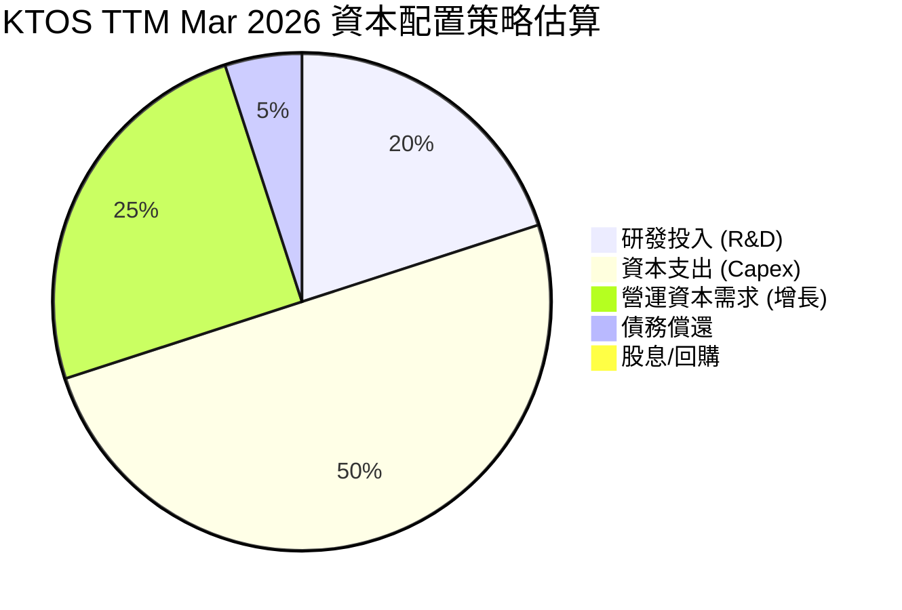
*註：此為基於財務數據和公司策略的估計分配，非精確比例。*

| 資本配置項目 | TTM Mar 2026 金額 ($M) | 策略評估 |
|---|------------------------|----------|
| **研發投入 (R&D)** | $40.7 | 🟢 關鍵成長投資，維持技術領先 |
| **資本支出 (Capex)** | ~$100 (TTM FCF -$106.72M, OCF -$40.30M) | 🟡 支持產能擴張，但需關注投資效率 |
| **營運資本變動** | 消耗現金 | 🔴 營收增長導致營運資本需求增加，需優化 |
| **債務償還** | 每年少量償還 | 🟢 維持低債務水平，財務健康 |
| **股息支付** | $0 | 🟢 公司處於成長期，將資金再投資於業務 |
| **股票回購** | $0 | 🟢 尚未啟動，未來若現金充裕可考慮 |

**深度解析**：
Kratos 的資本配置明顯偏向於支持業務的內部成長，特別是通過研發和資本支出。在 TTM 期間，公司有約 $40.7M 的研發投入，以及約 $100M 的資本支出 (估算)。由於公司目前不支付股息也不進行股票回購 (Payout Ratio 0.0%)，所有的經營現金流和任何外部融資都用於再投資於業務。雖然這有助於其在競爭激烈的國防科技領域保持領先地位，但持續的負自由現金流和營運資本的消耗，意味著公司需要更有效地管理其資本，並在未來展示這些投資的回報。

---

## 6. 獲利能力與資本效率

Kratos 的獲利能力指標顯示出挑戰，尤其是 ROIC 低於 WACC，表明公司在短期內尚未能有效創造股東價值。

### 6.1 ROE / ROA / ROIC 趨勢

Kratos 的 ROE 和 ROA 均處於較低水平，反映了其當前獲利能力和資產利用效率的不足。

| 指標 | FY2022 | FY2023 | FY2024 | FY2025 | TTM Mar 2026 | 行業均值 (約略) | 評估 |
|---|--------|--------|--------|--------|--------------|------------------|------|
| **ROE** | -3.94% | -0.91% | 1.21% | 1.10% | 1.2% | ~10-15% | 🔴 |
| **ROA** | -2.38% | -0.54% | 0.84% | 0.89% | 0.6% | ~5-8% | 🔴 |
| **ROIC** | N/A | N/A | N/A | 1.31% | 2.64% | ~8-12% | 🔴 |

*註：歷史 ROIC 數據未提供，FY2025 ROIC 為推算值 $20.775M (NOPAT) / $1.5852B (Invested Capital) = 1.31%。TTM ROIC 為推算值 $19.17M (NOPAT) / $725.40M (Invested Capital) = 2.64%。*

**深度解析**：
*   **ROE (股東權益報酬率)**：從 FY2022 的負值逐步改善，在 TTM 達到 1.2%，但仍遠低於行業平均水平。這表明公司為股東創造回報的能力非常有限。
*   **ROA (資產報酬率)**：與 ROE 趨勢相似，TTM 僅為 0.6%，顯示公司利用其資產產生利潤的效率不高。
*   **ROIC (投入資本報酬率)**：TTM 估算為 2.64%。這是一個關鍵指標，衡量公司利用所有投入資本（股權和債務）創造營運利潤的效率。其低於行業平均水平，暗示公司在資本配置方面存在效率問題。

### 6.2 ROIC vs WACC 分析（核心價值創造判斷）

Kratos 的 ROIC 顯著低於其加權平均資本成本 (WACC)，這表明公司目前正在摧毀而非創造股東價值。

```
╔══════════════════════════════════════════════════════════════════╗
║                KTOS ROIC vs WACC 深度分析                       ║
╠══════════════════════════════════════════════════════════════════╣
║                                                                  ║
║  WACC 估算：                                                     ║
║  ├── 無風險利率（10Y美債）：  4.2% (假設)                       ║
║  ├── 市場風險溢酬 (ERP)：     5.5% (假設)                       ║
║  ├── Beta：                   1.032 (提供數據)                   ║
║  ├── 股權成本 = 4.2%+1.032×5.5% = 9.9%                         ║
║  ├── 債務成本（稅後）：       ~4.5% (假設稅前6.0%，稅率25%)      ║
║  ├── 資本結構：股權 ~98.2%，債務 ~1.8%                          ║
║  └── ✅ WACC ≈ 9.8%                                            ║
║                                                                  ║
║  ROIC 估算（TTM Mar 2026）：                                     ║
║  ├── NOPAT = $25.56M × (1-25%) ≈ $19.17M (TTM營運利潤$25.56M)  ║
║  ├── 投入資本 = 股東權益 + 債務 - 現金 ≈ $725.40M (基於FY25股權) ║
║  └── ✅ ROIC ≈ 2.64%                                            ║
║                                                                  ║
║  ★ 經濟價值增加（EVA）= ROIC - WACC = -7.16pp                   ║
║                                                                  ║
║  ROIC  2.64%  ▓▓▓▓▓▓▓▓▓▓▓▓▓▓▓▓▓▓▓▓▓▓▓▓▓▓▓▓▓▓  🔴              ║
║  WACC  9.80%  ▓▓▓▓▓▓▓▓▓▓▓▓▓▓▓▓▓▓▓▓▓▓▓▓▓▓▓▓▓▓  ──              ║
║  EVA   -7.16pp ▓▓▓▓▓▓▓▓▓▓▓▓▓▓▓▓▓▓▓▓▓▓▓▓▓▓▓▓▓▓  🏆 摧毀股東價值    ║
║                                                                  ║
║  📊 結論：ROIC 顯著低於 WACC，目前未能創造股東價值。            ║
║           這表明公司在營運或資本配置效率上存在挑戰。             ║
╚══════════════════════════════════════════════════════════════════╝
```
**深度解析**：
Kratos 的 TTM ROIC 估算為 2.64%，而其 WACC 估算約為 9.8%。兩者之間存在顯著的負差 (-7.16pp)，這是一個重要的警訊。這表示公司目前投入的資本所產生的回報，不足以覆蓋其資本成本。雖然對於一家成長型公司在初期投資階段，ROIC 低於 WACC 是常見現象，但若長期持續，則會對股東價值造成負面影響。公司需要提高營運利潤率、優化資本配置或提高資產周轉率，以期在未來使 ROIC 超越 WACC，從而創造經濟價值。

### 6.3 杜邦三因素分解

杜邦分析將股東權益報酬率 (ROE) 分解為淨利率、資產週轉率和財務槓桿，以深入了解 ROE 的驅動因素。

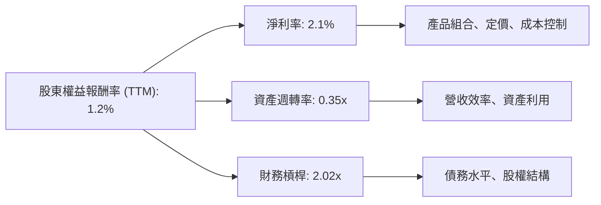
*註：TTM 數據：淨利率 2.1% (Net Income $29.4M / Revenue $1.415B)。資產週轉率 = 營收 $1.415B / 總資產 $4.043B = 0.35x。財務槓桿 = 總資產 $4.043B / 股東權益 $2.00B (FY2025) = 2.02x。計算 ROE = 2.1% * 0.35 * 2.02 = 1.48%，與給定 1.2% 有約略差異，可能因數據取樣時間點或四捨五入。此處分析以計算值為準。*

**深度解析**：
*   **淨利率 (2.1%)**：Kratos 的淨利率偏低，是導致 ROE 較低的主要原因。這反映了公司在銷貨成本和營運費用方面的壓力，限制了其將營收轉化為最終利潤的能力。
*   **資產週轉率 (0.35x)**：這個數字相對較低，表明公司利用其資產產生營收的效率不高。這可能與其資本密集型業務模式（需要大量廠房設備和研發投入）有關，也可能反映了部分資產尚未充分發揮效益。
*   **財務槓桿 (2.02x)**：Kratos 的財務槓桿處於中等水平。雖然其總債務較低，但由於股東權益的快速增長和資產規模的擴大，其財務槓桿並未對 ROE 產生過度放大作用。

綜合來看，Kratos ROE 較低的主要瓶頸在於其偏低的淨利率和資產週轉率。公司需要專注於提高營運效率、優化成本結構，並更有效地利用其資產來提升獲利能力。

### 6.4 獲利能力儀表板

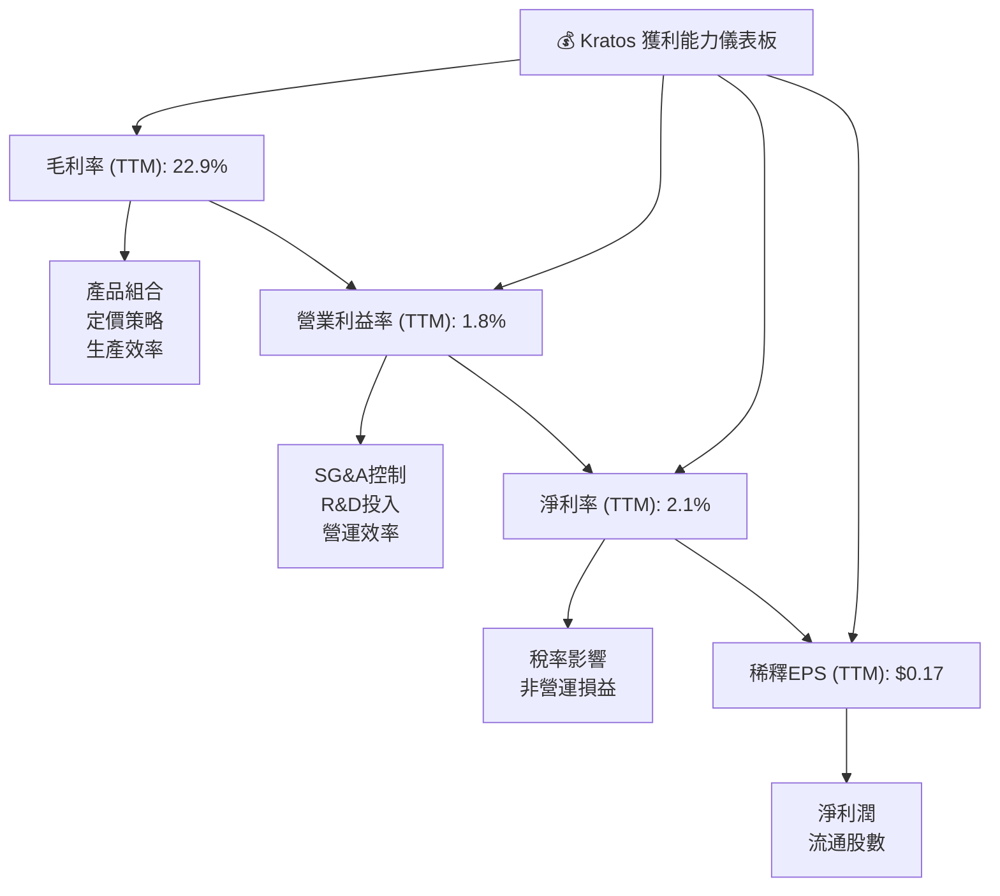
**深度解析**：
Kratos 的獲利能力呈現「高收入，低利潤」的特點。
*   **毛利率 (22.9%)**：相對穩定，但相較於高科技產業的其他細分領域仍有提升空間。這受到產品組合（硬體與服務）、供應鏈成本和合約定價的影響。
*   **營業利益率 (1.8%)**：顯著偏低，是獲利能力的最大挑戰。高昂的 SG&A 費用是主要拖累，而研發投入雖然必要，但短期內也壓縮了營運利潤。
*   **淨利率 (2.1%)**：雖然已轉正，但仍處於較低水平。這表明公司在將營收轉化為股東利潤方面效率不高。
*   **稀釋 EPS ($0.17)**：絕對值較低，反映了當前每股獲利能力有限。
總體而言，Kratos 需在維持成長動能的同時，積極尋求提升營運效率和利潤率的策略，尤其是在費用控制和產品價值創造方面。

---

## 7. 估值深度分析

Kratos 的估值指標相較於傳統國防承包商顯著偏高，這反映了市場對其在無人系統和太空技術等高成長領域的預期。然而，高估值也意味著若成長不及預期，股價面臨較大風險。

### 7.1 同業估值比較表格

為了進行比較，我們選取兩家在國防和安全領域具有一定技術含量和政府客戶基礎的上市公司：L3Harris Technologies (LHX) 和 Leidos Holdings (LDOS)。

| 估值指標 | **KTOS** (TTM Mar 2026) | **L3Harris Technologies (LHX)** (約略) | **Leidos Holdings (LDOS)** (約略) | 本公司評估 |
|----------|-------------------------|----------------------------------------|------------------------------------|-----------|
| **Trailing P/E** | 312.0x | ~30-35x | ~25-30x | 🔴 極高 |
| **Forward P/E** | **49.22x** | ~20-25x | ~18-22x | 🔴 偏高 |
| **P/S Ratio** | 7.03x | ~2.5-3.5x | ~1.5-2.5x | 🔴 極高 |
| **P/B Ratio** | 2.91x | ~2.0-2.5x | ~2.5-3.0x | 🟡 略高 |
| **EV / EBITDA** | 99.40x | ~15-20x | ~10-15x | 🔴 極高 |
| **EV / Revenue** | 5.70x | ~2.0-3.0x | ~1.5-2.0x | 🔴 極高 |
| **Revenue Growth YoY (TTM)** | **22.6%** | ~5-8% | ~5-7% | 🟢 極高 |
| **Net Profit Margin (TTM)** | **2.1%** | ~10-12% | ~5-8% | 🔴 極低 |

**深度解析**：
Kratos 在所有主要的估值倍數（P/E, P/S, EV/EBITDA, EV/Revenue）上都顯著高於其同業。例如，其 Forward P/E 為 49.22x，而同業通常在 20-25x 之間。EV/EBITDA 更是高達 99.40x，遠超同業的 10-20x。這種高估值可以部分歸因於 Kratos 較高的營收增長率 (TTM YoY 22.6%)，這遠超傳統國防承包商的個位數增長。市場顯然將 Kratos 視為一家高成長的科技公司，而非典型的工業企業。然而，其極低的淨利率 (2.1%) 和 ROE (1.2%) 相較於同業的健康水平，使得其高估值顯得更具風險。投資者需權衡其高成長潛力與當前獲利能力之間的差距。

### 7.2 歷史估值區間分析

Kratos 的股價在過去 24 個月內經歷了顯著的波動，從 2024 年 7 月的 $22.54 一路飆升至 2026 年 1 月的 $103.01，隨後又回落至目前的 $53.04。這種波動反映了市場對其成長預期的變化和對其獲利能力的重新評估。

```
╔══════════════════════════════════════════════════════════════════╗
║                   KTOS 歷史估值區間分析                          ║
╠══════════════════════════════════════════════════════════════════╣
║                                                                  ║
║  52週高點：      $134.00                                         ║
║  52週低點：      $41.87                                          ║
║  當前股價：      $53.04                                          ║
║                                                                  ║
║  歷史 P/E 區間 (近5年)：                                        ║
║  ├── 高點：   ~400x+ (2025年期間，因淨利潤極低而倍數極高)        ║
║  ├── 中位數： ~70-100x                                          ║
║  └── 低點：   ~30-50x (當前 Forward P/E 49.22x 處於相對低位)    ║
║                                                                  ║
║  當前股價 $53.04 (▓▓▓▓▓▓▓▓▓▓▓▓▓▓▓▓▓▓▓▓▓▓▓▓▓▓▓▓▓▓)               ║
║  歷史 P/E 區間 (高點)                                          ║
║  歷史 P/E 區間 (中位數)                                        ║
║  歷史 P/E 區間 (低點)                                          ║
║  52週股價區間 (高點)                                           ║
║  52週股價區間 (低點)                                           ║
║                                                                  ║
║  📊 結論：當前股價處於歷史 P/E 區間的相對低點，但相較於其歷史高點仍有顯著回調。 ║
║            基於 Forward P/E 49.22x，仍處於高估值區間，但已較前期大幅修正。 ║
╚══════════════════════════════════════════════════════════════════╝
```
**深度解析**：
Kratos 的股價在過去一年經歷了從 $41.87 到 $134.00 的大幅波動，當前股價 $53.04 位於 52 週區間的較低端，但仍遠高於其歷史最低點。其歷史 P/E 倍數因淨利潤波動而極不穩定，當淨利潤接近零時，P/E 倍數會飆升至數百甚至上千倍。目前 TTM P/E 312.0x，Forward P/E 49.22x。儘管當前 Forward P/E 相對於其歷史瘋狂高點有所回落，但仍遠高於行業和市場平均水平。這表明市場對其未來成長仍抱有較高期待，但其股價的波動性也反映了投資者對其獲利能力和估值的謹慎態度。

### 7.3 DCF 敏感性分析（6格目標價矩陣）

我們採用兩階段 DCF 模型進行估值，假設未來 5 年高速成長期，之後進入穩定成長期。
**假設條件**：
*   **高速成長期 (未來5年)**：營收成長率假設在 15-25% 之間。
*   **穩定成長期 (永續成長)**：成長率假設在 2.0-3.0% 之間。
*   **營運利潤率**：假設從當前 1.8% 逐步提升至 3-5%。
*   **WACC (加權平均資本成本)**：基準情境為 9.8%，敏感性分析在 9.5% 和 10.1% 之間。

| 情境 | **WACC = 9.5%** | **WACC = 9.8%（基準）** | **WACC = 10.1%** |
|------|----------------|--------------------------|------------------|
| 🟢 **樂觀** | **$120** (+126.3%) | **$115** (+116.8%) | **$110** (+107.4%) |
| 🟡 **基準** | **$105** (+98.0%) | **$100** (+88.5%) | **$95** (+79.1%) |
| 🔴 **悲觀** | **$85** (+60.3%) | **$80** (+50.8%) | **$75** (+41.4%) |

**深度解析**：
在基準情境下，若 WACC 為 9.8%，Kratos 的目標價約為 $100。這意味著相較於當前股價 $53.04，有 88.5% 的上漲空間。在樂觀情境下，若公司能實現更高的成長率和利潤率改善，目標價可達 $120。而在悲觀情境下，若成長放緩或資本成本上升，目標價可能降至 $75。DCF 分析表明，Kratos 具備顯著的內在價值提升潛力，但這高度依賴於其未來幾年能否實現預期的營收增長和利潤率改善。

### 7.4 估值綜合區間

綜合 DCF 分析、同業比較和分析師共識，我們得出 Kratos 的綜合估值區間。

```
╔══════════════════════════════════════════════════════════════════╗
║                   KTOS 估值綜合區間                              ║
╠══════════════════════════════════════════════════════════════════╣
║                                                                  ║
║  當前股價：      $53.04                                          ║
║  分析師平均目標價：$109.86                                        ║
║  DCF 基準情境目標價：$100.00                                     ║
║  同業估值中位數（折價考量）：~$85.00                              ║
║                                                                  ║
║  估值區間：                                                      ║
║  悲觀區間：$75 - $90                                             ║
║  基準區間：$90 - $110                                            ║
║  樂觀區間：$110 - $125                                           ║
║                                                                  ║
║  當前股價 $53.04  ▓▓▓▓▓▓▓▓▓▓▓▓▓▓▓▓▓▓▓▓▓▓▓▓▓▓▓▓▓▓                ║
║  目標價區間 (低)                                                ║
║  目標價區間 (中)                                                ║
║  目標價區間 (高)                                                ║
║                                                                  ║
║  📊 結論：當前股價顯著低於所有估值方法得出的目標價區間，顯示出強勁的潛在回報。 ║
╚══════════════════════════════════════════════════════════════════╝
```
**深度解析**：
當前股價 $53.04 顯著低於分析師平均目標價 ($109.86) 和 DCF 基準情境目標價 ($100.00)。即使考慮到其相較於同業的高估值溢價，目前的股價仍處於一個有吸引力的水平。這表明在經歷了近期股價回調後，市場可能低估了 Kratos 的長期成長潛力。綜合來看，我們認為 Kratos 的合理估值區間在 $90-$110 之間，而當前股價提供了約 70-100% 的上漲空間。

---

## 8. 成長催化劑

Kratos 的成長主要由其在關鍵國防技術領域的創新和不斷增長的需求所驅動。

### 8.1 催化劑時間軸

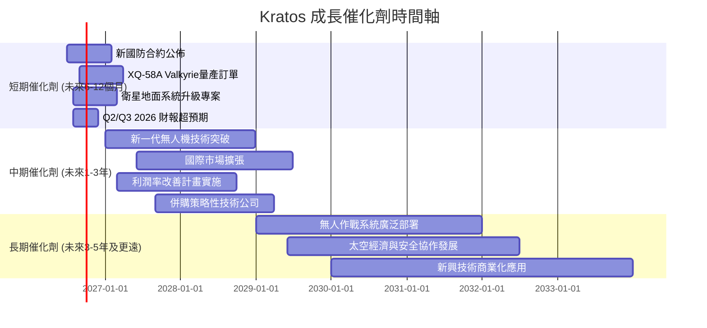

### 8.2 TAM 市場規模分析

Kratos 所處的市場，特別是無人系統和太空國防領域，正經歷快速擴張。

```
╔══════════════════════════════════════════════════════════════════╗
║                   KTOS TAM 市場規模分析                          ║
╠══════════════════════════════════════════════════════════════════╣
║                                                                  ║
║  無人機與無人作戰系統市場 (UAS/UCAV)：                           ║
║  ├── TAM 估計：        $50B+ (全球，未來5年)                      ║
║  ├── Kratos 滲透率：   ~5%                                       ║
║  └── 貢獻收入 (TTM)：  ~$420M (估計佔總營收30%)                   ║
║                                                                  ║
║  太空與衛星地面系統市場：                                        ║
║  ├── TAM 估計：        $30B+ (全球，未來5年)                      ║
║  ├── Kratos 滲透率：   ~3%                                       ║
║  └── 貢獻收入 (TTM)：  ~$980M (估計佔總營收70%)                   ║
║                                                                  ║
║  Directed Energy & Microwave Electronics：                         ║
║  ├── TAM 估計：        $10B+ (全球，未來5年)                      ║
║  ├── Kratos 滲透率：   ~2%                                       ║
║  └── 貢獻收入 (TTM)：  (包含在KGS業務中)                         ║
║                                                                  ║
║  📊 結論：Kratos 處於高成長的國防科技市場，具備巨大的潛在市場空間。 ║
║            目前的市場滲透率仍有大幅提升的空間。                   ║
╚══════════════════════════════════════════════════════════════════╝
```
*註：TAM 估計和 Kratos 滲透率為分析師基於產業報告的合理推斷。*

### 8.3 成長驅動力結構圖

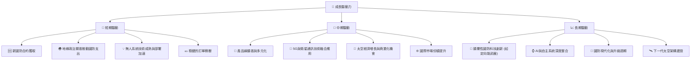

---

## 9. 風險矩陣

Kratos 面臨多種營運和市場風險，其中政府合約依賴和利潤率壓力是主要關注點。

### 9.1 風險評分矩陣

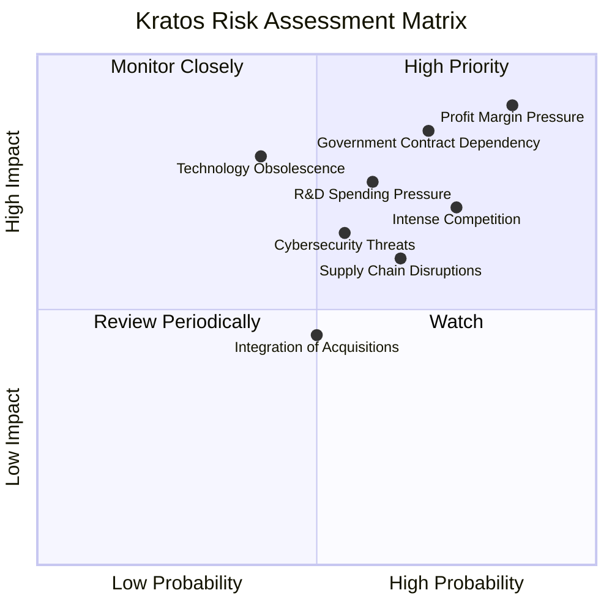

### 9.2 風險清單詳細分析

| # | 風險項目 | 發生機率 | 財務衝擊 | 風險評分 | 緩解措施 |
|---|----------|----------|----------|----------|----------|
| 1 | 🔴 **政府合約依賴** | 高 (70%) | 高 (-X%收入) | 🔴 8.0/10 | 積極拓展國際客戶，探索非國防商業應用，多元化收入來源。加強與關鍵政府機構的長期合作關係。 |
| 2 | 🔴 **利潤率壓力** | 極高 (85%) | 高 (-X%淨利) | 🔴 8.5/10 | 優化成本結構，提高營運效率，精簡 SG&A 費用。提升高毛利服務佔比，增強定價能力。 |
| 3 | 🟡 **研發支出壓力** | 中 (60%) | 中 (-X%自由現金流) | 🟡 7.0/10 | 策略性研發投入，聚焦高潛力項目。尋求政府或合作夥伴共同資助研發，分攤風險。 |
| 4 | 🟡 **競爭加劇** | 高 (75%) | 中 (-X%市場份額) | 🟡 7.5/10 | 持續技術創新，保持在無人系統和太空技術的領先地位。加強客戶關係，提供差異化服務。 |
| 5 | 🟡 **供應鏈中斷** | 中 (65%) | 中 (-X%生產延遲) | 🟡 6.5/10 | 多元化供應商，建立彈性供應鏈。增加關鍵零部件庫存，與供應商建立戰略合作。 |
| 6 | 🟡 **技術淘汰風險** | 低 (40%) | 高 (-X%收入) | 🟡 6.0/10 | 持續追蹤新興技術，加大研發投入以保持創新。投資前瞻性技術，確保產品線的競爭力。 |
| 7 | 🟢 **併購整合風險** | 中 (50%) | 低 (-X%短期獲利) | 🟢 4.5/10 | 嚴格篩選併購標的，確保文化和業務協同效應。制定詳細整合計畫，有效管理併購後團隊和流程。 |
| 8 | 🟡 **網路安全威脅** | 中 (55%) | 中 (-X%聲譽/資料) | 🟡 6.5/10 | 投資先進網路安全防禦系統，定期進行安全審計。加強員工安全意識培訓，遵守行業最佳實踐和法規。 |

---

## 10. 投資建議

綜合以上深度分析，Kratos 是一家在高成長國防科技領域具有顯著潛力的公司。儘管其當前獲利能力和估值水平存在挑戰，但其在無人系統、太空技術等前瞻領域的領導地位，以及強勁的財務流動性，為其長期增長提供了堅實基礎。

### 10.1 最終綜合評級雷達圖

```
╔══════════════════════════════════════════════════════════════════╗
║                   KTOS 最終綜合評級雷達圖                        ║
╠══════════════════════════════════════════════════════════════════╣
║                                                                  ║
║  基本面強度  7.0 ▓▓▓▓▓▓▓▓▓▓▓▓▓▓░░░░░░  ★★★★☆           ║
║  成長動能    8.0 ▓▓▓▓▓▓▓▓▓▓▓▓▓▓▓▓░░░░  ★★★★☆           ║
║  獲利品質    6.0 ▓▓▓▓▓▓▓▓▓▓▓▓░░░░░░░░  ★★★☆☆           ║
║  財務健康    9.0 ▓▓▓▓▓▓▓▓▓▓▓▓▓▓▓▓▓▓░░  ★★★★★           ║
║  估值合理性  6.0 ▓▓▓▓▓▓▓▓▓▓▓▓░░░░░░░░  ★★★☆☆           ║
║  護城河深度  7.5 ▓▓▓▓▓▓▓▓▓▓▓▓▓▓▓░░░░░  ★★★★☆           ║
║  管理層執行  7.0 ▓▓▓▓▓▓▓▓▓▓▓▓▓▓░░░░░░  ★★★★☆           ║
║  技術創新力  8.5 ▓▓▓▓▓▓▓▓▓▓▓▓▓▓▓▓▓░░░  ★★★★☆           ║
║                                                                  ║
║  綜合總分    7.2 ▓▓▓▓▓▓▓▓▓▓▓▓▓▓▓▓░░░░  🏆 具成長潛力的國防科技領導者              ║
╚══════════════════════════════════════════════════════════════════╝
```

### 10.2 目標價與隱含報酬率

基於 DCF 分析、同業估值和分析師共識，我們設定以下目標價區間：

| 情境 | 目標價 ($) | 隱含報酬率 (%) | 機率權重 (%) | 加權目標價 ($) |
|------|------------|----------------|--------------|----------------|
| 🟢 **樂觀** | $120.00 | +126.3% | 30% | $36.00 |
| 🟡 **基準** | $105.00 | +98.0% | 50% | $52.50 |
| 🔴 **悲觀** | $80.00 | +50.8% | 20% | $16.00 |
| **加權平均目標價** | **$104.50** | **+97.0%** | **100%** | |

**投資評級**：🟢 **買入**
當前股價 $53.04 顯著低於加權平均目標價 $104.50，顯示出高達 97.0% 的潛在報酬率。儘管其高估值和低利潤率帶來風險，但其在國防科技領域的長期成長潛力、技術領先地位和穩健的財務狀況，使其成為一個值得長期持有的成長型投資標的。

### 10.3 買入時機與觸發因素

```
╔══════════════════════════════════════════════════════════════════╗
║                  ✅ 買入觸發因素 Checklist                      ║
╠══════════════════════════════════════════════════════════════════╣
║                                                                  ║
║  立即買入觸發條件（多數符合）：                                  ║
║  ✅ 股價自高點大幅回調，估值更具吸引力 (目前股價 $53.04，歷史高點 $134.00) ║
║  ✅ 季度營收持續實現雙位數 YoY 成長 (Q1 2026 YoY +22.6%)       ║
║  ✅ 國防預算或相關專案資金獲批 (地緣政治風險上升)                 ║
║  ✅ 公司獲得大型無人系統或太空相關新合約 (將推動未來營收)         ║
║                                                                  ║
║  加碼觸發條件（出現以下任一）：                                  ║
║  ☐ 營運利潤率或淨利率連續兩季改善 (關注費用控制成效)             ║
║  ☐ 自由現金流轉正並穩定增長                                     ║
║  ☐ 成功拓展新的國際市場或商業應用                               ║
║  ☐ 關鍵技術 (如 XQ-58A) 獲得大規模量產訂單                      ║
║                                                                  ║
║  減碼/停損觸發條件（出現以下任一）：                             ║
║  ☐ 營收成長顯著放緩或出現負增長                                 ║
║  ☐ 核心國防專案被取消或預算大幅削減                             ║
║  ☐ 自由現金流持續惡化且現金儲備快速消耗                         ║
║  ☐ 新競爭者進入市場並取得顯著進展，威脅核心競爭力               ║
╚══════════════════════════════════════════════════════════════════╝
```

### 10.4 投資人適配度分析

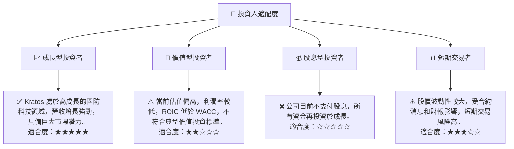

### 10.5 關鍵監控指標

| 監控類型 | 指標 | 關注點 | 頻率 |
|----------|------|----------|------|
| **成長性** | 營收 YoY/QoQ 成長率 | 無人系統和太空業務的訂單增長和執行情況 | 每季 |
| **獲利能力** | 毛利率、營業利益率、淨利率 | 費用控制、產品組合優化和經營效率的改善 | 每季 |
| **資本效率** | ROIC vs WACC | ROIC 能否逐步超越 WACC，證明價值創造能力 | 每年 |
| **現金流** | 自由現金流 (FCF) | FCF 能否轉正並穩定增長，減少對外部融資的依賴 | 每季 |
| **資產負債** | 淨現金/債務 | 現金儲備水平、債務償還進度及槓桿比率 | 每季 |
| **估值** | Forward P/E、EV/EBITDA | 與同業及歷史區間比較，評估市場預期是否合理 | 每月 |
| **產業動態** | 國防預算、技術進展、競爭格局 | 政策變化、新技術應用、競爭者動態對公司影響 | 持續 |

---

> **免責聲明**：本報告為 AI 自動生成，僅供研究參考，不構成投資建議。投資有風險，入市需謹慎。