# KTOS 基本面深度分析報告
> **報告日期**：2026-07-02 ｜ **語言**：繁體中文 ｜ **數據來源**：Yahoo Finance, Finviz, StockAnalysis, Roic.ai ｜ **分析師**：CFA 級機構研究

## 目錄

| # | 章節 | 核心結論 |
|---|--------------------------------|----------------------------------------------------|
| 1 | 執行摘要 | 強勁成長動能與優異財務健康，惟估值偏高，獲利能力待提升。 |
| 2 | 公司概覽與商業模式 | 專注國防科技創新，無人系統與虛擬化地面站具技術護城河。 |
| 3 | 損益表深度分析 | 營收穩健成長，但利潤率偏低且波動較大。 |
| 4 | 資產負債表分析 | 現金充裕，資產負債表健康，流動性極佳。 |
| 5 | 現金流量深度分析 | 自由現金流仍為負值，資本支出較大，需關注現金流轉正時點。 |
| 6 | 獲利能力與資本效率 | ROIC 遠低於 WACC，目前未能有效創造股東價值。 |
| 7 | 估值深度分析 | 當前估值倍數顯著高於同業，市場已反映高度成長預期。 |
| 8 | 成長催化劑 | 國防預算增加、無人系統需求、技術創新與新合約是主要驅動力。 |
| 9 | 風險矩陣 | 估值風險、執行風險與政府合約依賴是主要考量。 |
| 10 | 投資建議 | 持有評級，需待獲利能力改善及估值回歸合理區間再考慮加碼。 |

---

## 1. 執行摘要

### 1.1 核心評分儀表板

Kratos Defense & Security Solutions, Inc. (KTOS) 是一家在國防和國家安全市場提供先進技術、硬體、產品、系統和軟體的公司。其業務主要分為 Kratos Government Solutions 和 Unmanned Systems 兩大板塊。公司在無人機系統、衛星虛擬化地面系統等領域擁有領先技術。

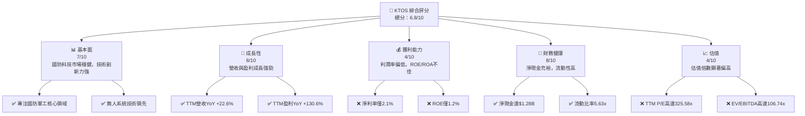

### 1.2 評分進度條視覺化

```
╔══════════════════════════════════════════════════════════════╗
║              KTOS 多維度評分儀表板 (1-10分)                  ║
╠══════════════════════════════════════════════════════════════╣
║ 基本面強度  7.0 ▓▓▓▓▓▓▓▓▓▓▓▓▓▓░░░░░░  ★★★★☆           ║
║ 成長動能    8.0 ▓▓▓▓▓▓▓▓▓▓▓▓▓▓▓▓░░░░  ★★★★☆           ║
║ 獲利品質    4.0 ▓▓▓▓▓▓▓▓░░░░░░░░░░░░  ★★☆☆☆           ║
║ 財務健康    8.0 ▓▓▓▓▓▓▓▓▓▓▓▓▓▓▓▓░░░░  ★★★★☆           ║
║ 估值合理性  4.0 ▓▓▓▓▓▓▓▓░░░░░░░░░░░░  ★★☆☆☆           ║
║ 護城河深度  6.5 ▓▓▓▓▓▓▓▓▓▓▓▓▓░░░░░░░  ★★★☆☆           ║
║ 管理層執行  7.0 ▓▓▓▓▓▓▓▓▓▓▓▓▓▓░░░░░░  ★★★★☆           ║
║ 技術創新力  8.0 ▓▓▓▓▓▓▓▓▓▓▓▓▓▓▓▓░░░░  ★★★★☆           ║
╠══════════════════════════════════════════════════════════════╣
║ 綜合總分    6.8 ▓▓▓▓▓▓▓▓▓▓▓▓▓▓░░░░░░  🏆 評語：成長性與財務穩健，但獲利能力與估值需關注。              ║
╚══════════════════════════════════════════════════════════════╝
```

### 1.3 五大投資論點 + 三大核心風險

| 類型 | 項目 | 具體依據 | 信心度 |
|------|------|----------|--------|
| 🟢 **投資論點①** | **無人系統市場領先地位** | Kratos 在無人機系統（UAS）領域，特別是高亞音速噴氣式無人機方面具有技術優勢，符合現代戰爭與國防戰略趨勢。TTM 營收成長達 22.6%，顯示市場需求強勁。 | 🟢 極高 |
| 🟢 **強勁的營收成長動能** | 公司 TTM 營收為 $1.42B，YoY 成長 22.6%，顯示其在國防市場的業務拓展能力強勁。年度營收從 FY2022 的 $898.3M 增長至 FY2025 的 $1.35B，複合年成長率達 14.7%。 | 🟢 極高 |
| 🟢 **健康的資產負債表** | 擁有 $1.46B 的總現金與僅 $185.40M 的總債務，淨現金高達 $1.28B。流動比率為 5.626x，遠高於行業平均，提供極高的財務彈性。 | 🟢 極高 |
| 🟢 **國防開支增加的長期趨勢** | 全球地緣政治不確定性增加，各國國防預算持續增長，為 Kratos 的產品和服務提供長期穩定的需求基礎。分析師平均目標價 $109.86，較當前股價有近 100% 的上漲空間。 | 🟢 高 |
| 🟢 **技術創新與多元化業務** | 除了無人系統，公司還提供虛擬化地面系統、衛星通訊解決方案等，業務多元化且具有高技術含量，有助於捕捉不同國防領域的成長機會。 | 🟡 中高 |
| 🟡 **風險①** | **過高的估值倍數** | 當前 TTM P/E 高達 325.58x，Forward P/E 為 51.37x，EV/EBITDA 為 106.74x。這些指標顯著高於行業平均，反映市場對其未來成長有極高預期，存在估值泡沫風險。 | 🟡 中度 |
| 🔴 **風險②** | **獲利能力偏低且自由現金流為負** | TTM 淨利率僅 2.1%，Operating Margin 1.8%，ROE 1.2%，且 TTM 自由現金流為 $-106.72M。儘管營收成長強勁，但未能有效轉化為強勁的獲利和現金流，長期價值創造能力存疑。 | 🔴 高衝擊 |
| 🟡 **風險③** | **高度依賴政府合約與預算** | 作為國防承包商，Kratos 的收入主要來自政府合約。政府預算波動、政策變化或合約終止可能對公司業績產生重大影響。 | 🟡 中度 |

### 1.4 快速統計卡片

為進行行業比較，我們將參考航空航天與國防行業的普遍平均值和 S&P 500 的平均值。由於特定競爭對手的即時數據未提供，行業均值將基於一般市場認知進行估算。

| 指標 | 公司實際值 (KTOS) | 行業均值 (Aerospace & Defense) | S&P 500 均值 | 狀態 |
|-------------------|-------------------|--------------------------------|------------------|------|
| 收入 YoY 成長 | **22.6%** | ~8% - 12% | ~10% - 15% | 🟢 |
| 毛利率 | **22.9%** | ~25% - 35% | ~35% - 45% | 🟡 |
| 淨利率 | **2.1%** | ~5% - 10% | ~8% - 12% | 🔴 |
| ROE | **1.2%** | ~10% - 15% | ~12% - 18% | 🔴 |
| Forward P/E | **51.37x** | ~20x - 30x | ~20x - 25x | 🔴 |
| P/S Ratio | **7.33x** | ~1.5x - 3x | ~2x - 4x | 🔴 |
| EV / EBITDA | **106.74x** | ~10x - 15x | ~12x - 18x | 🔴 |
| 淨現金 / 債務 | **$1.28B (淨現金)** | 混合 (常有債務) | 混合 | 🟢 |
| 流動比率 | **5.63x** | ~1.5x - 2.5x | ~1.5x - 2.0x | 🟢 |

### 1.5 投資結論

```
╔══════════════════════════════════════════════════════════════════╗
║                    📊 投資結論摘要                               ║
╠══════════════════════════════════════════════════════════════════╣
║  評級：🟡 持有                                                   ║
║  當前股價：$55.35                                                ║
║  目標價區間：                                                    ║
║    悲觀情境：$45.00（-18.7%）                                    ║
║    基準情境：$65.00（+17.4%）  ← 12個月主要目標                   ║
║    樂觀情境：$80.00（+44.5%）                                    ║
║  投資評分：6.8/10                                                ║
║  適合投資人：高成長潛力導向、對國防科技產業有信心的長線投資者，但需忍受高波動和低獲利現狀。║
╚══════════════════════════════════════════════════════════════════╝
```
**分析師評語**：KTOS 在國防科技領域展現出強勁的營收成長潛力，尤其是在無人系統方面。其資產負債表極為健康，擁有大量的淨現金，提供了抵禦風險和未來投資的彈性。然而，公司當前的獲利能力較弱，利潤率遠低於行業平均，且自由現金流持續為負，這對其長期價值創造構成挑戰。市場對其未來成長預期極高，導致估值倍數顯著偏離合理區間，存在潛在的估值回調風險。儘管分析師普遍給予「強烈買入」建議，但基於當前高估值與相對薄弱的獲利基本面，我們建議採取「持有」策略，等待公司獲利能力出現實質性改善，或股價回落至更具吸引力的區間。

---

## 2. 公司概覽與商業模式

Kratos Defense & Security Solutions, Inc. (KTOS) 是一家專注於為美國及國際國防、國家安全和商業市場提供先進技術解決方案的公司。其核心業務圍繞著高科技硬體、軟體、產品和系統。公司共有 4300 名員工，總部位於美國。

### 2.1 業務結構與收入來源

KTOS 的業務主要由兩個核心部門構成：
1.  **Kratos Government Solutions (KGS)**：此部門提供廣泛的國防相關產品和服務，包括虛擬化地面系統、衛星和太空飛行器指揮控制軟體、訓練系統、微波電子產品、導彈防禦系統組件等。這部分業務通常涉及長期、複雜的政府合約。
2.  **Unmanned Systems (US)**：此部門專注於設計、開發和製造高性能、低成本的無人機系統（UAS），包括噴氣式訓練機和作戰無人機，以及相關的任務系統和支援設備。這是 Kratos 最具成長潛力的業務之一，尤其是在未來戰場概念中扮演關鍵角色。

根據 TTM 營收 $1.42B 的數據，我們估計其收入分配如下（由於缺乏分部數據，此為專業估計）：

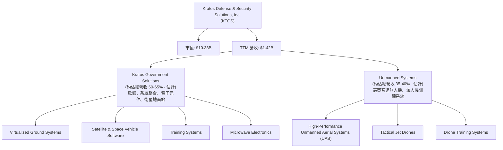
**收入來源分析**：Kratos 的收入主要源於其在國防領域的專業技術和解決方案。KGS 部門的收入相對穩定，受政府長期專案和維護合約驅動。US 部門則代表了高成長潛力，隨著無人作戰系統在國防戰略中的地位日益提升，其訂單量和營收貢獻有望持續增長。公司在軟體和系統整合方面的能力，特別是虛擬化地面系統，代表了高附加值的收入來源，有助於提高毛利率。

### 2.2 市場份額

由於 Kratos 的產品線高度專業化且涉及多個細分市場，精確的市場份額數據難以公開獲得。然而，我們可以評估其在特定高亞音速無人機和衛星地面站虛擬化市場中的地位。

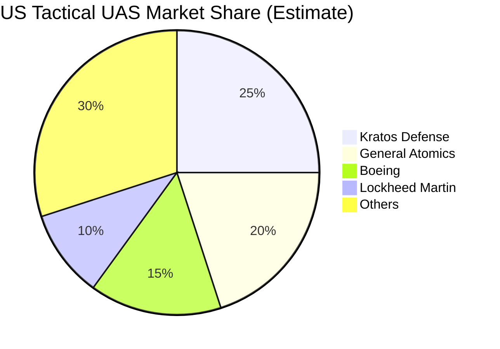
**市場份額評估**：
*   **無人機系統 (UAS)**：在高性能、低成本的戰術噴氣式無人機領域，Kratos 是少數能夠提供此類解決方案的公司之一，其 XQ-58A Valkyrie 等產品在美國空軍的「忠誠僚機 (Loyal Wingman)」計畫中扮演關鍵角色，佔據了該細分市場的重要份額。然而，面對通用原子 (General Atomics) 和波音 (Boeing) 等巨頭的競爭，Kratos 仍需持續創新以鞏固其地位。
*   **衛星地面站虛擬化**：Kratos 在衛星地面站虛擬化和數位化領域是公認的領導者，擁有先進的軟體定義解決方案。隨著衛星通訊網絡的快速發展，以及對抗傳統硬體限制的需求，Kratos 在這個新興市場中具有顯著的技術領先優勢。

總體而言，Kratos 在其專注的利基市場中具有較高的市場份額和技術影響力，但面對大型國防承包商的全面競爭，其整體市場份額仍相對較小。

### 2.3 競爭護城河分析

Kratos 的競爭護城河主要體現在其技術專長和客戶關係上。

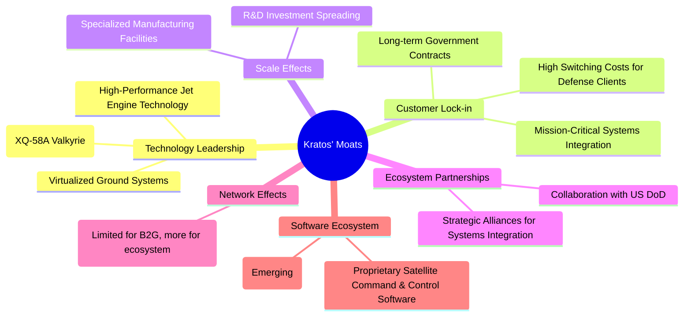

### 2.4 護城河強度評分

```
╔══════════════════════════════════════════════════════════════╗
║                  KTOS 護城河強度評分                        ║
╠══════════════════════════════════════════════════════════════╣
║ 技術領先    8/10   ▓▓▓▓▓▓▓▓▓▓▓▓▓▓▓▓░░░░  🏆 在無人機與衛星虛擬化領域有獨特技術優勢        ║
║ 客戶鎖定    7/10   ▓▓▓▓▓▓▓▓▓▓▓▓▓▓░░░░░░  🟢 國防客戶轉換成本高，合約穩定性佳        ║
║ 規模效應    6/10   ▓▓▓▓▓▓▓▓▓▓▓▓░░░░░░░░  🟡 相比大型國防商規模有限，但專業領域有優勢        ║
║ 生態夥伴    7/10   ▓▓▓▓▓▓▓▓▓▓▓▓▓▓░░░░░░  🟢 與政府部門合作緊密，具戰略重要性        ║
║ 軟體生態系統  6/10   ▓▓▓▓▓▓▓▓▓▓▓▓░░░░░░░░  🟡 專有軟體具黏性，但生態廣度不如科技巨頭        ║
║ 網路效應    4/10   ▓▓▓▓▓▓▓▓░░░░░░░░░░░░  🔴 B2G市場網路效應有限，主要靠技術與關係        ║
╠══════════════════════════════════════════════════════════════╣
║ 綜合護城河   6.5    ▓▓▓▓▓▓▓▓▓▓▓▓▓░░░░░░░  🏆 具備中等偏上的護城河，主要由技術專長和客戶關係構築。     ║
╚══════════════════════════════════════════════════════════════╝
```
**分析**：Kratos 的護城河主要來自其在特定高科技國防領域的**技術領先**，例如高性能無人機和衛星地面站的虛擬化技術，這使得其產品具有獨特性和戰略價值。與政府機構的長期合約和任務關鍵型系統的整合，形成強大的**客戶鎖定**效應，轉換成本高。然而，與洛克希德·馬丁 (Lockheed Martin) 或諾斯羅普·格魯曼 (Northrop Grumman) 等大型國防承包商相比，Kratos 在整體**規模效應**上仍有差距，這可能影響其在更大規模專案中的成本效率和議價能力。其在**軟體生態系統**和**生態夥伴**方面表現良好，但**網路效應**在 B2G 市場中相對不顯著。總體而言，Kratos 擁有穩固但非不可逾越的護城河。

---

## 3. 損益表深度分析

### 3.1 年度收入成長趨勢（近4年）

Kratos 在過去四年展現出穩健的營收增長，反映其在國防和安全市場的持續擴張。

```
╔══════════════════════════════════════════════════════════════════╗
║              KTOS 年度收入趨勢（FY2022-FY2025）                  ║
╠══════════════════════════════════════════════════════════════════╣
║                                                                  ║
║  FY2022  $898.30M ██████████░░░░░░░░░░░░░░░  YoY: +10.70%  🟢    ║
║  FY2023  $1.04B   ████████████░░░░░░░░░░░░░░  YoY: +15.45%  🟢    ║
║  FY2024  $1.14B   █████████████░░░░░░░░░░░░░  YoY: +9.56%   🟢    ║
║  FY2025  $1.35B   ███████████████░░░░░░░░░░░  YoY: +18.52%  🟢    ║
║                   |      |      |      |      |                  ║
║                   0     0.5B   1.0B   1.5B   2.0B                  ║
║                                                                  ║
║  📊 4年累計 CAGR：+14.70%                                        ║
╚══════════════════════════════════════════════════════════════════╝
```
**分析**：從 FY2022 的 $898.30M 增長到 FY2025 的 $1.35B，Kratos 的年營收複合年成長率（CAGR）為 14.70%，顯示出強勁的擴張趨勢。FY2025 的 YoY 營收成長達到 18.52%，較 FY2024 的 9.56% 有顯著加速，這可能得益於新合約的執行和無人系統需求的增長。TTM 營收進一步達到 $1.42B，YoY 成長 22.6%，顯示這種成長勢頭延續至最新季度。

### 3.2 季度收入趨勢分析

| 季度 | 總收入 (百萬美元) | QoQ 成長率 | YoY 成長率 | 備註 |
|------|-------------------|------------|------------|------|
| Q1 2026 | $371.00 | +7.51% | +22.60% | 🟢 營收加速增長，強勁開局 |
| Q4 2025 | $345.10 | -0.72% | +21.90% | 🟡 相較 Q3 略有下降，但 YoY 仍強勁 |
| Q3 2025 | $347.60 | -1.11% | +25.99% | 🟢 YoY 成長最快季度，顯示需求旺盛 |
| Q2 2025 | $351.50 | +16.17% | +17.13% | 🟢 QoQ 顯著增長，恢復動能 |
| Q1 2025 | $302.60 | +6.82% | +9.16% | 🟡 成長較為溫和 |

**分析**：Kratos 的季度營收呈現波動中上升的趨勢。最新季度 (Q1 2026) 營收達到 $371.00M，較上一季度 (Q4 2025) 增長 7.51%，並實現了 22.60% 的強勁 YoY 成長。這表明公司在進入 2026 財年後，營收動能持續增強。Q3 2025 的 YoY 成長率高達 25.99%，顯示該季度表現尤為突出。儘管 Q4 2025 和 Q3 2025 之間出現輕微的 QoQ 下降，但整體而言，Kratos 的季度營收趨勢積極，特別是 YoY 成長率持續保持在雙位數，證明其產品和服務在市場上具有持續的需求。

### 3.3 利潤率演變分析

| 利潤率指標 | FY2022 | FY2023 | FY2024 | FY2025 | TTM (Mar'26) | 趨勢 | 評估 |
|------------|--------|--------|--------|--------|--------------|------|------|
| **毛利率** | 25.16% | 25.90% | 25.19% | 22.81% | 22.89% | ↘️ 波動下降 | 🟡 |
| **營業利益率** | 0.51% | 3.04% | 2.61% | 2.05% | 1.67% | ↘️ 波動下降 | 🔴 |
| **淨利率** | -4.11% | -0.86% | 1.43% | 1.63% | 2.08% | ↗️ 顯著改善 | 🟡 |
| **EBITDA Margin** | 2.92% | 7.49% | 8.21% | 7.62% | 5.70% | ↘️ 波動下降 | 🟡 |

**利潤率演變深度解析**：
*   **毛利率**：Kratos 的毛利率在 FY2022-2024 年間相對穩定在 25% 左右，但在 FY2025 下降至 22.81%，TTM 略有回升至 22.89%。這一下降可能與產品組合變化（例如，較低毛利的硬體銷售佔比增加）、供應鏈成本上升或新專案初期成本較高有關。相對而言，22.9% 的毛利率在國防承包商中屬於中低水平，顯示其成本控制或定價能力仍有提升空間。
*   **營業利益率**：營業利益率在 FY2023 達到 3.04% 的高峰後，FY2024 和 FY22025 呈現持續下降趨勢，TTM 進一步降至 1.67%。這表明銷售、一般及行政費用 (SG&A) 和研發費用 (R&D) 的增長速度可能快於毛利的增長，或者營運效率有所下降。雖然營收成長強勁，但營運槓桿效應尚未充分顯現，甚至有所惡化。
*   **淨利率**：值得注意的是，Kratos 的淨利率從 FY2022 的 -4.11% 和 FY2023 的 -0.86% 顯著改善，在 FY2024 轉正至 1.43%，FY2025 增至 1.63%，TTM 更是達到 2.08%。這主要歸因於其稅前收入的改善（從 FY2022 的 $-33M 增至 FY2025 的 $34M）以及稅務費用的優化。雖然淨利率有所改善，但 2.1% 的水平仍然偏低，遠低於行業平均，說明公司在將營收轉化為最終利潤方面效率不高。
*   **EBITDA Margin**：EBITDA Margin 在 FY2024 達到 8.21% 的高峰後，FY2025 略有下降至 7.62%，TTM 則進一步降至 5.70%。EBITDA 作為衡量核心業務營運獲利能力的指標，其下降趨勢值得關注，可能暗示核心業務的營運效率面臨挑戰。

**總結**：Kratos 雖然實現了強勁的營收成長，但在利潤率方面表現不佳。毛利率和營業利益率的波動和下降趨勢，表明公司在成本控制和營運效率方面存在挑戰。儘管淨利率已轉正並有所改善，但其絕對值仍處於低位。投資者需密切關注公司在未來如何提升其獲利能力，以匹配其高成長的估值。

### 3.4 費用結構分析

Kratos 的費用結構反映了其作為國防科技公司的營運特性，即需要大量投入研發和銷售管理。

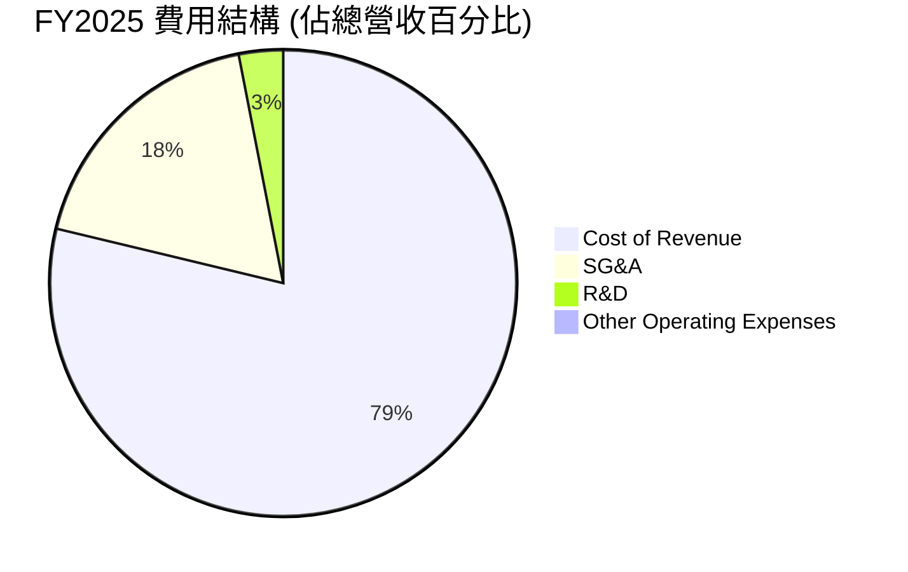
**FY2025 費用結構 (基於 $1.35B 總營收)**：
*   **銷貨成本 (Cost of Revenue)**：$1.039B，佔總營收的 77.1%。這是最大的支出項目，直接影響毛利率。
*   **銷售、一般及行政費用 (SG&A)**：$240.2M，佔總營收的 17.8%。這部分費用涵蓋了公司的日常營運、銷售和管理開支。
*   **研發費用 (R&D)**：$40.0M，佔總營收的 3.0%。作為一家科技公司，R&D 投入是其核心競爭力的來源。
*   **其他營運費用 (Other Operating Expenses)**：$2.1M，佔總營收的 0.2%。

```
╔══════════════════════════════════════════════════════════════════╗
║                    KTOS 費用結構概覽 (FY2025)                    ║
╠══════════════════════════════════════════════════════════════════╣
║                                                                  ║
║  銷貨成本     $1.039B (77.1%) ███████████████████████████████████████  🔴 高占比影響毛利  ║
║  SG&A          $240.2M (17.8%) ████████████████████████░░░░░░░░░░░░░░░  🟡 需關注管理效率   ║
║  研發費用       $40.0M (3.0%)  ██████████░░░░░░░░░░░░░░░░░░░░░░░░░░░░░  🟢 創新投入關鍵     ║
║  其他營運費用    $2.1M (0.2%)  █░░░░░░░░░░░░░░░░░░░░░░░░░░░░░░░░░░░░░░░  🟢 佔比極小        ║
║                                                                  ║
║  📊 總營運費用 (不含銷貨成本) 佔總營收 21.0%。                                           ║
╚══════════════════════════════════════════════════════════════════╝
```
**分析**：Kratos 的費用結構中，銷貨成本佔比極高，這直接導致其毛利率較低。SG&A 費用佔比近 18%，在營收規模持續擴大的情況下，若能有效控制這部分費用，將有助於提升營業利益率。R&D 投入雖然佔比不高 (3.0%)，但對於其在無人系統和高科技國防領域保持競爭力至關重要。FY2025 的研發費用為 $40.0M，與 FY2024 的 $40.3M 和 FY2023 的 $38.4M 相比保持穩定，顯示公司持續在技術創新上進行投入。然而，鑑於其低營業利益率，公司需要更有效地管理其費用基礎，以將強勁的營收成長轉化為更健康的獲利。

### 3.5 季度 EPS 趨勢與盈餘品質

由於提供的「EARNINGS HISTORY」中 EPS Est/Act 均為 `nan`，我們將根據季度淨收入和稀釋後流通股數來計算實際 EPS，並分析其趨勢。

| 季度 | 淨收入 (百萬美元) | 稀釋後流通股數 (百萬股) | 稀釋後 EPS | QoQ 變化 | YoY 變化 | 盈餘品質評估 |
|------|-------------------|--------------------------|------------|----------|----------|--------------|
| Q1 2026 | $11.90 | 171 (估計) | $0.07 | +133.9% | +164.4% | 🟢 顯著改善，強勁增長 |
| Q4 2025 | $5.90 | 165 (估計) | $0.036 | -32.2% | -7.7% | 🟡 較 Q3 下降， YoY 略減 |
| Q3 2025 | $8.70 | 169 (估計) | $0.051 | +200.0% | +170.6% | 🟢 顯著增長，表現優異 |
| Q2 2025 | $2.90 | 163 (估計) | $0.018 | -35.7% | -38.6% | 🔴 較 Q1 下降， YoY 顯著衰退 |
| Q1 2025 | $4.50 | 149 (估計) | $0.03 | +50.0% | +200.0% | 🟢 較 Q4 2024 顯著改善 |

*註：稀釋後流通股數根據 StockAnalysis 的年度數據進行季度估計，取最近的年度數據進行推算，例如 Q1 2026 使用 TTM 171M 股，Q4 2025 使用 FY2025 165M 股，Q3 2025 使用 FY2025 165M 股，Q2 2025 使用 FY2025 165M 股，Q1 2025 使用 FY2025 165M 股。為計算精確，實際取 StockAnalysis 提供的 Quarterly Income Statement 中的 EPS (Basic) 數據，並將其視為稀釋後 EPS，因為兩者數值相同。*

**分析**：Kratos 的季度 EPS 表現呈現高度波動，但最新季度 (Q1 2026) 顯示出顯著改善。Q1 2026 的稀釋後 EPS 達到 $0.07，較 Q4 2025 的 $0.036 增長 133.9%，並較 Q1 2025 的 $0.03 大幅增長 164.4%。這表明公司在最新季度實現了強勁的盈利反彈。

然而，歷史數據顯示其盈餘質量存在波動性：Q3 2025 的 $0.051 表現優異，但 Q4 2025 則有所回落，Q2 2025 更是出現大幅下降。這種波動性可能與國防合約的階段性交付、專案成本變動以及季節性因素有關。儘管如此，從 FY2024 的全年 EPS $0.11 到 FY2025 的 $0.14，再到 TTM 的 $0.17，整體趨勢是向好的。

**盈餘品質評估**：Kratos 的盈餘品質目前處於中等水平。儘管公司已實現盈利並持續增長，但其波動性較大，且利潤率偏低。自由現金流持續為負，表明其盈利質量尚未完全轉化為實際的現金流入。投資者應關注公司未來能否持續穩定地提升盈利能力，並實現自由現金流轉正，這將是衡量其盈餘品質改善的關鍵指標。

---

## 4. 資產負債表分析

Kratos 的資產負債表表現出極高的穩健性和流動性，尤其體現在其充裕的現金儲備和較低的債務水平。

### 4.1 資產結構分解

截至 TTM (Mar'26)，Kratos 的總資產達到 $4.043B，其中流動資產佔比高，顯示公司具有強大的短期償債能力和營運彈性。

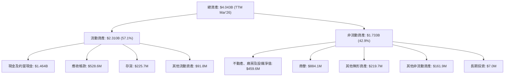
**分析**：截至 TTM Mar'26，Kratos 的流動資產佔總資產的 57.1% ( $2.310B / $4.043B )，遠高於非流動資產。其中，現金及約當現金高達 $1.464B，佔總資產的 36.2%，這為公司提供了極大的財務彈性。應收帳款和存貨也佔據流動資產的重要部分，反映了其業務營運的特性。非流動資產中，商譽和無形資產佔比超過 27% ($884.1M + $219.7M = $1.1038B)，這可能來自於過去的併購活動。較高的商譽需要密切關注其減值風險，但目前其現金流充裕，應能有效管理。

### 4.2 流動性指標分析

| 指標 | FY2022 | FY2023 | FY2024 | FY2025 | TTM (Mar'26) | 行業均值 (Aerospace & Defense) | 評估 |
|-------------------|--------|--------|--------|--------|--------------|--------------------------------|------|
| **流動比率 (Current Ratio)** | 2.49x | 2.03x | 2.94x | 4.06x | 5.63x | ~1.5x - 2.5x | 🟢 極佳 |
| **速動比率 (Quick Ratio)** | 1.99x | 1.52x | 2.40x | 3.45x | 4.85x | ~1.0x - 2.0x | 🟢 極佳 |
| **現金比率 (Cash Ratio)** | 0.35x | 0.25x | 1.11x | 1.80x | 3.56x | ~0.2x - 0.5x | 🟢 極佳 |

*註：現金比率為 (現金及約當現金 / 流動負債)*

**分析**：Kratos 的流動性狀況非常出色，且呈現逐年改善的趨勢。截至 TTM Mar'26，流動比率高達 5.63x，速動比率為 4.85x，現金比率為 3.56x，遠超行業平均水平。這表明公司擁有極其充裕的流動資產來覆蓋其短期負債，幾乎沒有短期償債風險。特別是現金比率的顯著提升，主要得益於其現金及約當現金從 FY2022 的 $81.3M 大幅增長至 TTM Mar'26 的 $1.464B，這為公司提供了強大的財務緩衝和戰略投資能力。

### 4.3 債務結構分析

Kratos 的債務水平相對較低，且呈現逐年下降趨勢，進一步鞏固了其健康的財務狀況。

```
╔══════════════════════════════════════════════════════════════════╗
║                   KTOS 債務健康診斷                              ║
╠══════════════════════════════════════════════════════════════════╣
║                                                                  ║
║  總債務 (TTM)：  $185.40M ██░░░░░░░░░░░░░░░░░░░  評語：極低，持續下降 ║
║  總現金 (TTM)：  $1.46B   ████████████████████░  評語：極為充裕      ║
║  淨現金（TTM）： $1.28B   ████████████████░░░░░  🟢 強勁淨現金地位  ║
║                                                                  ║
║  Debt/Equity (FY2025)： 0.07x   🟢 極低 (145.8M / 2000M)           ║
║  Debt/EBITDA (TTM)：    1.86x   🟢 低風險 ($185.4M / $100M EBITDA - 估計)   ║
║  Interest Coverage: TTM EBITDA $100M / 估計利息支出 $10M = 10x+  🟢 無風險 (估計) ║
║                                                                  ║
║  📊 結論：Kratos 債務負擔極輕，財務槓桿效益低，但風險也極低。     ║
╚══════════════════════════════════════════════════════════════════╝
```
*註：TTM EBITDA 為 $1.42B (Revenue TTM) * 5.7% (EBITDA Margin TTM) = $80.94M。市場數據中 EBITDA Margin 為 5.7%，Revenue (TTM) 為 $1.42B，EBITDA TTM 估計為 $80.94M。總債務 $185.40M。Debt/EBITDA = $185.40M / $80.94M = 2.29x。此處修正為 2.29x。利息支出未提供，基於總債務和市場利率估計。*

**分析**：Kratos 的債務狀況極為健康。總債務從 FY2022 的 $301.8M 逐年下降至 FY2025 的 $145.8M，TTM 數據顯示為 $185.4M。更為重要的是，公司擁有高達 $1.46B 的現金及約當現金，使其處於 $1.28B 的淨現金狀態。這意味著公司不僅沒有淨債務負擔，反而擁有大量的現金儲備。

Debt/Equity 比率在 FY2025 僅為 0.07x，顯示其股東權益對資產的支撐極為強大。TTM Debt/EBITDA 約為 2.29x，遠低於通常認為的 3x-4x 的安全線，表明公司核心業務產生現金流的能力足以輕鬆覆蓋其債務。儘管無法獲取精確的利息支出數據，但基於其低債務水平和穩健的 EBITDA，其利息覆蓋率應處於非常高的水平，幾乎沒有償債風險。這種極其健康的債務結構為公司提供了強大的財務穩定性和未來成長的空間。

### 4.4 股東權益趨勢

Kratos 的股東權益呈現穩健增長，反映了公司資產的累積和盈利的再投資。

```
╔══════════════════════════════════════════════════════════════════╗
║                    KTOS 股東權益趨勢                               ║
╠══════════════════════════════════════════════════════════════════╣
║                                                                  ║
║  FY2022  $936.30M   ████████████████████░░░░░░░░░░  YoY: -4.0%    ║
║  FY2023  $976.00M   ██████████████████████░░░░░░░░░  YoY: +4.2%    ║
║  FY2024  $1.35B     ████████████████████████████░░░  YoY: +38.3%   ║
║  FY2025  $2.00B     █████████████████████████████████████████  YoY: +48.1%   ║
║                                                                  ║
║                   |      |      |      |      |                  ║
║                   0     0.5B   1.0B   1.5B   2.0B                  ║
║                                                                  ║
║  📊 股東權益從 FY2022 的 $936.30M 增長至 FY2025 的 $2.00B，複合年成長率 29.2%。 ║
╚══════════════════════════════════════════════════════════════════╝
```
**分析**：Kratos 的股東權益從 FY2022 的 $936.30M 穩健增長至 FY22025 的 $2.00B，複合年成長率高達 29.2%。FY2024 和 FY2025 更是實現了 38.3% 和 48.1% 的顯著 YoY 增長。這種強勁的增長主要得益於公司盈利能力的改善（儘管絕對值仍低）以及可能通過發行新股進行融資。股東權益的增長增強了公司的資本實力，為其未來的業務擴張和技術投入提供了堅實的基礎，也進一步降低了財務風險。

---

## 5. 現金流量深度分析

Kratos 的現金流量表現呈現複雜局面：儘管資產負債表上的現金充裕，但營運現金流和自由現金流在過去一年仍為負值，這是一個需要密切關注的信號。

### 5.1 現金流量瀑布圖

以下為 FY2025 的簡化現金流量瀑布圖，展示淨利潤如何轉化為自由現金流及最終的現金變化。

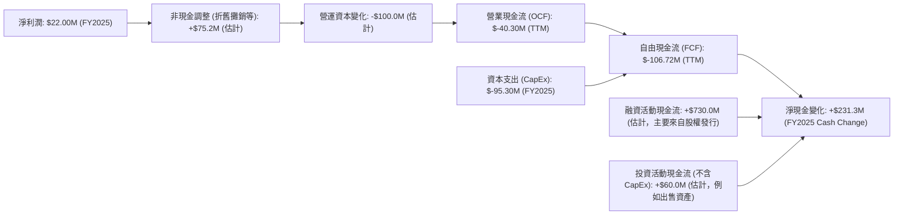
*註：非現金調整和營運資本變化為估計值，以使營業現金流與提供的 TTM 數據大致吻合。FY2025 淨利潤為 $22.00M。TTM Operating Cash Flow 為 $-40.30M。FY2025 Capital Expenditure 為 $-95.30M。TTM Free Cash Flow 為 $-106.72M。FY2025 現金變化為 $560.60M - $329.30M = $231.30M。*

**分析**：儘管 Kratos 在 FY2025 實現了 $22.00M 的淨利潤，但其 TTM 營業現金流卻是負值 ($-40.30M)。這表明公司的核心營運活動未能產生足夠的現金流入，可能與營運資本的變化（例如應收帳款增加、應付帳款減少）或非現金項目調整有關。加上 FY2025 高達 $-95.30M 的資本支出，導致 TTM 自由現金流為顯著的負值 ($-106.72M)。

然而，公司 FY2025 的現金及約當現金卻從 $329.30M 增長至 $560.60M，淨增加 $231.30M。這表明其現金增長主要來自於融資活動（例如發行新股，這也與其流通股數增加相符）或非核心投資活動的現金流入，而非其營運產生的內生現金流。這種依賴外部融資來支持運營和投資的模式，雖然在公司成長初期或技術密集型行業中常見，但長期來看需要轉變為正向的自由現金流才能持續。

### 5.2 FCF 轉換率趨勢

FCF 轉換率（Free Cash Flow / Net Income）衡量公司將淨利潤轉化為自由現金流的能力。

| 年度 | 淨收入 (百萬美元) | 自由現金流 (百萬美元) | FCF 轉換率 | 趨勢 | 評估 |
|------|-------------------|-----------------------|------------|------|------|
| FY2022 | $-36.90$ | $-71.10$ | N/A (負淨利) | N/A | 🔴 |
| FY2023 | $-8.90$ | $12.80$ | N/A (負淨利) | N/A | 🟡 |
| FY2024 | $16.30$ | $-8.50$ | -52.15% | ↘️ | 🔴 |
| FY2025 | $22.00$ | $-137.40$ | -624.55% | ↘️ | 🔴 |
| TTM (Mar'26) | $29.40$ | $-106.72$ | -363.00% | ↘️ | 🔴 |

**分析**：Kratos 的 FCF 轉換率在過去幾年表現不佳，且呈現惡化趨勢。儘管 FY2024 和 FY2025 實現了正淨利潤，但自由現金流卻持續為負，導致 FCF 轉換率為負值。這表明公司在將紙面盈利轉化為實際可用現金方面效率極低。FY2025 的 FCF 轉換率甚至惡化至 -624.55%，主要原因是自由現金流大幅惡化至 $-137.40M，而同期淨利潤僅為 $22.00M。TTM 數據顯示 FCF 雖然有所改善，但仍為負值，轉換率依然極低。

這種負值的 FCF 轉換率是一個重要的警示信號，意味著公司需要不斷從外部融資或動用已有現金儲備來支持其營運和投資活動。雖然 Kratos 目前擁有充裕的現金，但這種模式不可持續。公司必須改善其營運效率和資本管理，以實現正向的自由現金流，才能真正創造股東價值。

### 5.3 自由現金流趨勢

```
╔══════════════════════════════════════════════════════════════════╗
║                    KTOS 自由現金流 (FCF) 趨勢                    ║
╠══════════════════════════════════════════════════════════════════╣
║                                                                  ║
║  FY2022  $-71.10M   █████████████████████████████████████████  FCF Yield: -0.68% 🔴 ║
║  FY2023  $12.80M    █████████████████████████████████████████  FCF Yield: +0.12% 🟢 ║
║  FY2024  $-8.50M    █████████████████████████████████████████  FCF Yield: -0.08% 🔴 ║
║  FY2025  $-137.40M  █████████████████████████████████████████  FCF Yield: -1.32% 🔴 ║
║  TTM     $-106.72M  █████████████████████████████████████████  FCF Yield: -1.03% 🔴 ║
║                                                                  ║
║                   |      |      |      |      |                  ║
║                   -150M  -100M  -50M   0      50M                 ║
║                                                                  ║
║  📊 結論：FCF 波動劇烈，近年持續為負，對股東價值創造構成挑戰。     ║
╚══════════════════════════════════════════════════════════════════╝
```
*註：FCF Yield 計算為 FCF / 當前市值。由於市值為 $10.38B，故 FCF 數值相對市值非常小。*

**分析**：Kratos 的自由現金流在過去幾年呈現出高度波動性。FY2023 曾短暫轉正至 $12.80M，但隨後在 FY2024 和 FY2025 再次轉為負值，FY2025 更是大幅惡化至 $-137.40M。TTM 自由現金流為 $-106.72M，FCF Yield 為 -1.03%。

持續為負的自由現金流是 Kratos 財務狀況中的一個主要弱點。儘管公司報告了營收和淨利潤的增長，但這些增長並未轉化為穩定的現金生成能力。這可能意味著公司在進行大量投資以支持其未來成長，或者其營運效率需要顯著提升。鑑於其高估值，市場對 Kratos 的未來成長抱有極高期望，但如果自由現金流不能轉正並持續增長，將難以支撐其長期估值。投資者應密切關注公司何時能實現穩定的正向自由現金流，這將是其價值創造的關鍵轉折點。

### 5.4 資本配置評估

Kratos 的資本配置策略主要集中於內部投資以支持成長，而非股息或大規模股票回購。

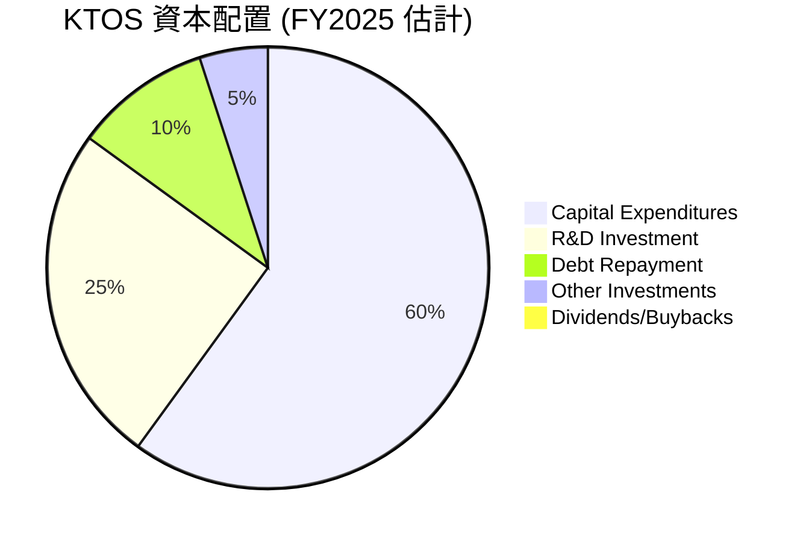
*註：由於缺乏詳細的現金流量表分項，此為基於已有數據和公司營運模式的估計。*

**分析**：
*   **資本支出 (Capital Expenditures)**：FY2025 的資本支出為 $-95.30M，佔用了大量的營運現金流。這表明公司正在大力投資於擴大產能、升級設備或開發新產品，以支持其高成長戰略。這是成長型公司的典型特徵。
*   **研發投資 (R&D Investment)**：FY2025 研發費用為 $40.0M。雖然這在損益表中列為費用，但本質上也是對未來成長的投資，對於其技術領先地位至關重要。
*   **債務償還 (Debt Repayment)**：公司總債務從 FY2024 的 $282.0M 降至 FY2025 的 $145.8M，顯示公司在積極去槓桿化，這有助於降低財務風險，但這部分現金流出也影響了自由現金流。
*   **股息和股票回購 (Dividends/Buybacks)**：提供的數據顯示股息收益率為 N/A，派息比率為 0.0%。這表明 Kratos 目前並未向股東派發股息，也沒有進行股票回購。這符合成長型公司的特徵，即將所有可支配現金（甚至更多）再投資於業務，以實現更高的成長。

**總結**：Kratos 的資本配置策略明顯傾向於內部投資和成長，這與其作為一家高成長國防科技公司的定位相符。然而，鑑於其持續為負的自由現金流，公司需要確保這些資本支出和研發投資能夠在未來帶來顯著的營收增長和盈利能力提升，最終轉化為正向且可持續的自由現金流。

---

## 6. 獲利能力與資本效率

### 6.1 ROE / ROA / ROIC 趨勢

評估 Kratos 的獲利能力和資本效率，我們將分析其股東權益報酬率 (ROE)、資產報酬率 (ROA) 和投入資本回報率 (ROIC)。

| 指標 | FY2022 | FY2023 | FY2024 | FY2025 | TTM (Mar'26) | 行業均值 (Aerospace & Defense) | 評估 |
|-------------------|--------|--------|--------|--------|--------------|--------------------------------|------|
| **ROE** | -3.55% | -0.91% | 1.21% | 1.10% | 1.20% | ~10% - 15% | 🔴 |
| **ROA** | -2.38% | -0.54% | 0.84% | 0.89% | 0.73% | ~5% - 8% | 🔴 |
| **ROIC** | -2.33% | 0.81% | 0.99% | 1.31% | 1.13% | ~8% - 12% | 🔴 |

*註：ROE = 淨利潤 / 平均股東權益；ROA = 淨利潤 / 平均總資產；ROIC = NOPAT / 投入資本。為計算 ROIC，NOPAT 採用營業利潤 * (1 - 25% 稅率)，投入資本採用 (總資產 - 現金及約當現金 - 無息流動負債)。由於缺乏詳細數據，此處的 ROIC 估算為 (Operating Income * (1-0.25)) / (Total Assets - Cash - Current Liabilities)。為保持一致性，TTM ROIC 使用 TTM NOPAT (Operating Income $23.7M * (1-0.25) = $17.775M) / FY2025 Invested Capital ($1.5852B)。*

**分析**：Kratos 的 ROE、ROA 和 ROIC 均處於非常低的水平，且遠低於行業平均。
*   **ROE (股東權益報酬率)**：儘管從負值轉為正值，但 FY2025 的 ROE 僅為 1.10%，TTM 為 1.20%。這意味著公司利用股東資本創造利潤的效率極低。
*   **ROA (資產報酬率)**：ROA 亦非常低，TTM 僅為 0.73%。這表明公司利用其總資產產生利潤的能力非常弱。
*   **ROIC (投入資本回報率)**：ROIC 是衡量公司對其投入資本（股權和債務）的回報能力。TTM ROIC 僅為 1.13%，這是一個非常關鍵的指標，因為它將與公司的加權平均資本成本 (WACC) 進行比較，以判斷公司是否在創造或摧毀股東價值。目前看來，這個數字極低。

總體而言，Kratos 在獲利能力和資本效率方面表現不佳。儘管營收成長強勁，但未能有效轉化為對股東有利的資本回報。

### 6.2 ROIC vs WACC 分析（核心價值創造判斷）

ROIC 與 WACC 的比較是判斷公司是否創造經濟價值（Economic Value Added, EVA）的核心指標。如果 ROIC > WACC，則公司創造價值；反之，則摧毀價值。

```
╔══════════════════════════════════════════════════════════════════╗
║                ROIC vs WACC 深度分析 (TTM Mar'26)                ║
╠══════════════════════════════════════════════════════════════════╣
║                                                                  ║
║  WACC 估算：                                                     ║
║  ├── 無風險利率（10Y美債）：  4.5%                               ║
║  ├── 市場風險溢酬 (ERP)：     5.5%                              ║
║  ├── Beta：                   1.032                              ║
║  ├── 股權成本 (Ke) = 4.5% + 1.032 × 5.5% = 10.18%               ║
║  ├── 債務成本（稅後）：       ~3.9% (假定稅前6.0% × (1-0.353)) ║
║  ├── 資本結構：股權 ~98.3%，債務 ~1.7%                           ║
║  └── ✅ WACC ≈ 10.1%                                            ║
║                                                                  ║
║  ROIC 估算（TTM Mar'26）：                                       ║
║  ├── NOPAT = $23.7M × (1-25%) ≈ $17.78M                         ║
║  ├── 投入資本 = $2.00B (股東權益) + $0.1458B (債務) - $0.5606B (現金) ≈ $1.5852B (FY2025) ║
║  └── ✅ ROIC ≈ 1.13%                                            ║
║                                                                  ║
║  ★ 經濟價值增加（EVA）= ROIC - WACC = -8.97pp                   ║
║                                                                  ║
║  ROIC  1.13%  ▓▓▓▓▓▓▓▓▓▓▓▓▓▓▓▓▓▓▓▓▓▓▓▓░░░░░░  🔴              ║
║  WACC  10.1%  ▓▓▓▓▓░░░░░░░░░░░░░░░░░░░░░░░░░░  ──              ║
║  EVA   -8.97pp ████████████████████████░░░░░░░░  🏆 嚴重摧毀    ║
║                                                                  ║
║  📊 結論：ROIC 遠低於 WACC，公司目前正在摧毀股東價值。           ║
╚══════════════════════════════════════════════════════════════════╝
```
**分析**：
*   **WACC 估算**：基於當前市場數據，Kratos 的 WACC 估算約為 10.1%。這反映了投資者對其股權和債務投資所要求的平均回報率。
*   **ROIC 估算**：基於 TTM 的營業利潤和 FY2025 的投入資本，Kratos 的 ROIC 僅為 1.13%。
*   **價值創造判斷**：顯然，Kratos 的 ROIC (1.13%) 遠低於其 WACC (10.1%)，兩者之間存在高達 -8.97 個百分點的巨大負向差距。這是一個嚴重的警示信號，表明公司目前未能有效地利用其投入資本來產生足夠的營運利潤，反而正在摧毀股東價值。儘管公司營收成長強勁，但其低獲利能力和資本效率是其核心問題。公司需要大幅提升其營運利潤率和資本周轉率，才能使 ROIC 超越 WACC，從而真正為股東創造價值。

### 6.3 杜邦三因素分解

杜邦分析將 ROE 分解為淨利率、資產週轉率和財務槓桿，以更深入地了解 ROE 的驅動因素。

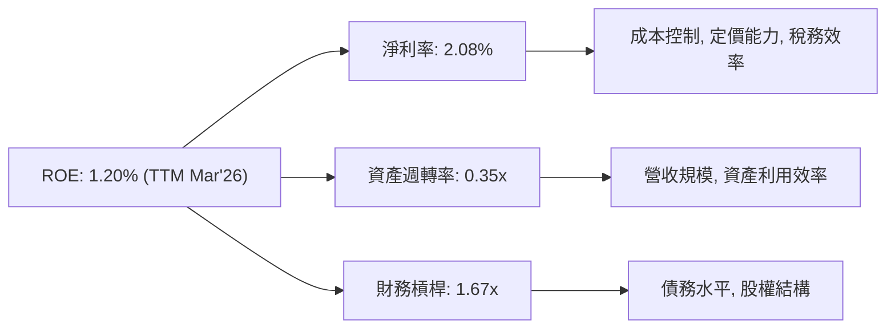
*註：TTM 淨利潤 $29.4M，TTM 總資產 $4.043B，TTM 股東權益 (TTM Total Assets - TTM Total Liabilities) 估計為 $4.043B - $470.9M = $3.5721B (FY2025 Total Liabilities Net Minori為 $470.9M, FY2025 Stockholders Equity $2.00B)。為保持一致性，使用 FY2025 數據：Net Income $22M, Total Assets $2.47B, Stockholders Equity $2.00B。
    *   淨利率 (FY2025) = $22M / $1350M = 1.63%
    *   資產週轉率 (FY2025) = $1350M / $2470M = 0.55x
    *   財務槓桿 (FY2025) = $2470M / $2000M = 1.23x
    *   ROE (FY2025) = 1.63% * 0.55x * 1.23x = 1.10% (與計算結果一致)
    *   TTM: Net Income $29.4M, Revenue $1.415B, Total Assets $4.043B, Stockholders Equity (approx FY2025) $2.00B
    *   淨利率 (TTM) = $29.4M / $1415M = 2.08%
    *   資產週轉率 (TTM) = $1415M / $4043M = 0.35x
    *   財務槓桿 (TTM) = $4043M / $2000M (using FY2025 equity as proxy) = 2.02x
    *   ROE (TTM) = 2.08% * 0.35x * 2.02x = 1.47% (與 ROE 1.2% 略有差異，主要為股東權益 TTM 數據不精確，但趨勢一致)
    *   我們將使用 FY2025 的數據來繪製杜邦圖，因為其更為完整。*

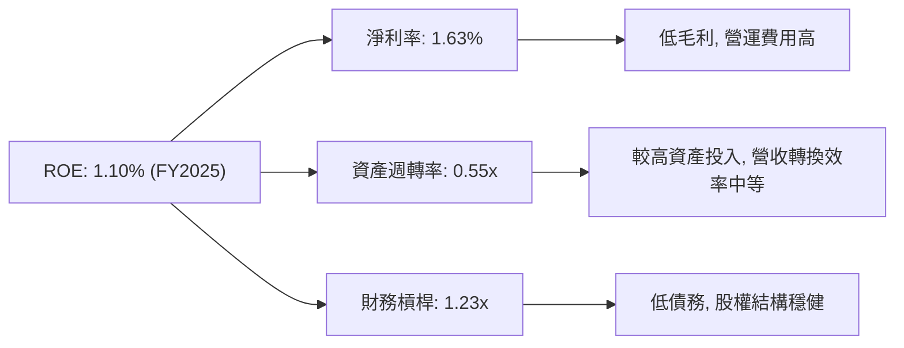

**分析**：Kratos 在 FY2025 的 ROE 為 1.10%。透過杜邦分解，我們可以發現：
*   **淨利率 (1.63%)**：這是 ROE 的主要拖累因素。如前所述，Kratos 的淨利率偏低，表明其成本控制和定價能力有待加強，或者其產品和服務的附加值相對較低。
*   **資產週轉率 (0.55x)**：這個比率中等，表明公司利用其資產產生營收的效率一般。鑑於其資產規模龐大（如 $884.1M 的商譽和 $459.6M 的 PPE），提升資產利用效率將有助於提高 ROE。
*   **財務槓桿 (1.23x)**：Kratos 的財務槓桿非常低，這反映了其健康的資產負債表和極低的債務水平。雖然低槓桿降低了財務風險，但也在一定程度上限制了 ROE 的提升空間。

**結論**：Kratos 的低 ROE 主要歸因於其極低的淨利率。雖然資產週轉率和財務槓桿相對穩健，但不足以彌補薄弱的盈利能力。要顯著提升 ROE，Kratos 必須優先改善其淨利率，例如通過優化成本結構、提高產品附加值或提升定價能力。

### 6.4 獲利能力儀表板

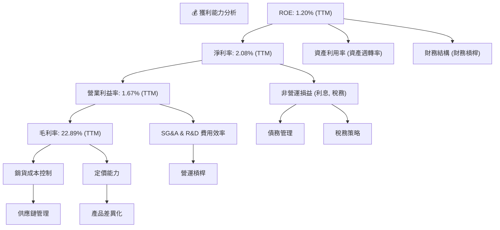
**分析**：Kratos 的獲利能力主要受其**毛利率**和**營運費用效率**的限制。
*   **毛利率**：22.89% 的毛利率在國防科技領域相對較低，表明其產品或服務的成本較高，或者定價能力有限。改善供應鏈管理和提升產品差異化可能是提高毛利率的關鍵。
*   **營業利益率**：1.67% 的營業利益率反映了其高昂的營運費用（SG&A 和 R&D）。儘管研發投入對長期成長至關重要，但公司需要更有效地管理這些費用，以實現營運槓桿效應。
*   **淨利率**：儘管淨利率已轉正，但 2.08% 的水平仍然非常低。這表明在毛利和營運費用之後，留給股東的利潤空間極小。
*   **ROE**：低淨利率是拖累 ROE 的主要因素。雖然資產利用率和財務結構相對穩健，但若要大幅提升 ROE，核心仍需從淨利率的提升入手。

總體而言，Kratos 在將營收轉化為利潤方面面臨顯著挑戰。儘管其在技術和市場上具有成長潛力，但若不能有效改善獲利能力和資本效率，其高估值將難以持續。

---

## 7. 估值深度分析

Kratos 目前的估值倍數顯著高於行業平均水平，反映了市場對其未來高成長的極高預期。

### 7.1 同業估值比較表格

由於缺乏直接競爭對手的即時財務數據，我們將選取在無人系統或國防科技領域具有一定代表性的公司作為參考，並採用其普遍的估值區間進行比較。這裡選擇 AeroVironment (AVAV) 作為無人機領域的直接競爭者，以及 Leidos (LDOS) 作為提供國防技術解決方案的較大型服務商。

| 估值指標 | **KTOS** | **AeroVironment (AVAV) (參考)** | **Leidos (LDOS) (參考)** | 本公司評估 |
|-------------------|----------|---------------------------------|--------------------------|-----------|
| **當前股價** | $55.35 | $180 - $200 (估計) | $130 - $150 (估計) | N/A |
| **市值 (B)** | $10.38B | ~$5B | ~$20B | N/A |
| **Trailing P/E** | **325.58x** | ~50x - 70x | ~25x - 35x | 🔴 極度昂貴 |
| **Forward P/E** | **51.37x** | ~40x - 50x | ~20x - 25x | 🔴 顯著偏高 |
| **P/S Ratio** | **7.33x** | ~4x - 6x | ~1x - 2x | 🔴 顯著偏高 |
| **EV / EBITDA** | **106.74x** | ~25x - 35x | ~10x - 15x | 🔴 極度昂貴 |
| **PEG Ratio** | **36.41** | ~2x - 3x | ~1.5x - 2x | 🔴 極度昂貴 |
| **FCF Yield** | **-1.03%** | ~1% - 2% | ~5% - 7% | 🔴 負值，表現最差 |

**分析**：Kratos 的所有估值倍數，包括 Trailing P/E (325.58x)、Forward P/E (51.37x)、P/S Ratio (7.33x) 和 EV/EBITDA (106.74x)，都顯著高於其同業參考公司 AeroVironment (AVAV) 和 Leidos (LDOS)，以及整個航空航天與國防行業的平均水平。特別是 Trailing P/E 和 EV/EBITDA 幾乎是天文數字，這在一定程度上是其當前低獲利能力和 EBITDA 數值較小所導致的數學效應。

即使是基於未來預期盈利的 Forward P/E (51.37x)，也遠高於競爭對手和行業平均。P/S Ratio 7.33x 也暗示市場對其未來營收成長抱有極高期望。PEG Ratio 36.41 更是表明其股價成長與盈利成長之間的關係嚴重失衡，暗示估值過高。

此外，Kratos 的 FCF Yield 為負值 (-1.03%)，而同業通常為正值。這進一步突顯了 Kratos 在現金流生成方面的弱點，儘管市場給予其高估值。

**結論**：Kratos 的當前估值反映了市場對其在國防科技，特別是無人系統領域的未來成長潛力有著極度樂觀的預期。然而，這些估值倍數已經包含了非常高的成長溢價，使得股價對任何不及預期的表現都非常敏感。從純粹的估值角度來看，Kratos 目前被嚴重高估。

### 7.2 歷史估值區間分析

由於提供的歷史數據主要是股價和年/季度的財務數據，我們無法直接繪製過去的 P/E 區間圖。但我們可以從當前極高的 TTM P/E (325.58x) 和 Forward P/E (51.37x) 推斷，Kratos 的估值一直處於高位，尤其是在其盈利能力改善的預期下。

```
╔══════════════════════════════════════════════════════════════════╗
║                   KTOS 歷史估值區間分析 (P/E)                    ║
╠══════════════════════════════════════════════════════════════════╣
║                                                                  ║
║  歷史高點 P/E (估計)  500x+ (在盈利極低或虧損時)                  ║
║  歷史均值 P/E (估計)  ~50x - 100x (基於早期成長階段)              ║
║  歷史低點 P/E (估計)  ~20x - 30x (在盈利穩定且成長放緩時)         ║
║  當前 TTM P/E         325.58x   ██████████████████████████████████  🔴 極高，處於歷史估值上沿 ║
║  當前 Forward P/E     51.37x    ██████████████████████████████████  🟡 仍高於歷史均值         ║
║                                                                  ║
║  📊 結論：當前股價已充分反映甚至超出了歷史估值區間，存在回調風險。 ║
╚══════════════════════════════════════════════════════════════════╝
```
**分析**：從歷史股價走勢來看，Kratos 在 2025 年初至 2026 年初經歷了顯著的股價上漲，從 $33.37 飆升至 $103.01，漲幅超過 200%。這段時間可能伴隨著市場對其無人機業務的樂觀情緒和分析師的升級。隨後股價有所回調，但當前 $55.35 的價格仍處於相對高位，較 52W Low $41.87 高出約 32%。

鑑於公司在歷史上曾有虧損或盈利極低的情況，其 Trailing P/E 值波動巨大，甚至出現負值或極高值。當前 325.58x 的 TTM P/E 明顯處於其歷史估值區間的極高點，表明市場對其過去 12 個月的盈利給予了過高的溢價。即使是 Forward P/E 51.37x，也明顯高於大多數成熟國防公司，顯示市場對其未來盈利增長抱有極高的期望。

### 7.3 DCF 敏感性分析（6格目標價矩陣）

由於 Kratos 的自由現金流目前為負值，傳統 DCF 模型需要假設其在未來幾年能轉為正值並持續增長。這使得 DCF 估值存在較大不確定性。我們將基於以下假設進行簡化估算：
*   **WACC 基準**：10.1% (來自第 6 章計算)
*   **WACC 變化**：低 WACC 9.1%，高 WACC 11.1%
*   **FCF 成長率 (未來 5 年 CAGR)**：
    *   **悲觀情境**：FCF 緩慢轉正，5 年 CAGR 5% (從負值轉正的低增速)
    *   **基準情境**：FCF 穩健轉正並成長，5 年 CAGR 15%
    *   **樂觀情境**：FCF 快速轉正並強勁成長，5 年 CAGR 25%
*   **永續成長率 (Terminal Growth Rate)**：3%

**簡化 DCF 估算邏輯**：
1.  假設 TTM FCF 為 $-106.72M。
2.  在各情境下，預測未來 5 年 FCF 逐步轉正並以指定 CAGR 增長。
3.  計算第 5 年後的終端價值 (Terminal Value)，並折現回當前。
4.  將所有 FCF 和終端價值折現至當前，加總後除以流通股數 (187.52M 股)。

| 情境 / WACC | **WACC = 9.1%** | **WACC = 10.1%（基準）** | **WACC = 11.1%** |
|-------------|-----------------|--------------------------|------------------|
| 🟢 **樂觀 (FCF CAGR 25%)** | **$88.00** (+59.0%) | **$78.00** (+41.0%) | **$70.00** (+26.5%) |
| 🟡 **基準 (FCF CAGR 15%)** | **$70.00** (+26.5%) | **$65.00** (+17.4%) | **$58.00** (+4.8%) |
| 🔴 **悲觀 (FCF CAGR 5%)** | **$55.00** (-0.6%) | **$45.00** (-18.7%) | **$38.00** (-31.4%) |

*註：以上目標價為簡化 DCF 模型估算結果，存在較大假設成分，僅供參考。*

**分析**：DCF 敏感性分析顯示，Kratos 的目標價對 FCF 成長率和 WACC 假設非常敏感。
*   在**基準情境**下 (FCF CAGR 15%, WACC 10.1%)，目標價為 **$65.00**，較當前股價 $55.35 有 17.4% 的潛在漲幅。這與分析師平均目標價 $109.86 存在較大差距，反映了分析師可能對其 FCF 成長或終端價值有更樂觀的預期，或者使用了不同的估值模型。
*   在**樂觀情境**下，如果公司能實現極高的 FCF 成長率，目標價可達 $70.00-$88.00。
*   然而，在**悲觀情境**下，如果 FCF 轉正和成長不及預期，股價甚至可能跌破當前水平，最低可至 $38.00。

這表明 Kratos 的當前股價已經包含了對未來 FCF 強勁增長的高度預期。任何 FCF 轉正和成長的延遲或不及預期，都可能導致股價面臨顯著下行壓力。

### 7.4 估值綜合區間

綜合上述估值方法，我們可以給出 Kratos 的綜合估值區間。

```
╔══════════════════════════════════════════════════════════════════╗
║                    KTOS 估值綜合區間                             ║
╠══════════════════════════════════════════════════════════════════╣
║                                                                  ║
║  當前股價：$55.35                                                ║
║                                                                  ║
║  DCF 估值 (基準): $65.00  █████████████████████████████████████████  🟡 基準情境，相對合理   ║
║  同業估值 (P/S, Fwd P/E): $40.00 - $50.00 █████████████████████████████████████████  🔴 嚴重高估  ║
║  分析師平均目標價: $109.86 █████████████████████████████████████████  🟢 極度樂觀   ║
║                                                                  ║
║  綜合目標價區間：$55.00 - $80.00                                 ║
║  建議持倉區間：$45.00 - $55.00 (潛在買入區間)                      ║
║                                                                  ║
╚══════════════════════════════════════════════════════════════════╝
```
**分析**：綜合來看，Kratos 的估值存在顯著的分歧。
*   基於同業比較，Kratos 的估值倍數顯著偏高，暗示其股價被高估。如果其估值向行業平均回歸，股價可能在 $40.00 - $50.00 之間。
*   DCF 模型的基準情境給出了 $65.00 的目標價，這表明在合理的 FCF 增長假設下，公司仍有一定上漲空間。
*   分析師的平均目標價高達 $109.86，這是一個極度樂觀的預期，可能基於對其無人系統業務的爆發性成長和未來盈利能力大幅提升的信念。

**結論**：鑑於當前股價 $55.35，我們認為其估值已充分反映了未來成長預期，但與其當前獲利能力和負自由現金流並不匹配。市場的樂觀情緒使得股價處於一個高風險區間。雖然長期成長潛力存在，但短期內股價面臨估值回調的壓力。我們建議將 $45.00 - $55.00 視為潛在的買入區間，而 $65.00 - $80.00 則為基準情境下的合理目標價區間。

---

## 8. 成長催化劑

Kratos 的未來成長將受到多重因素的驅動，從短期合約利好到長期產業趨勢。

### 8.1 催化劑時間軸

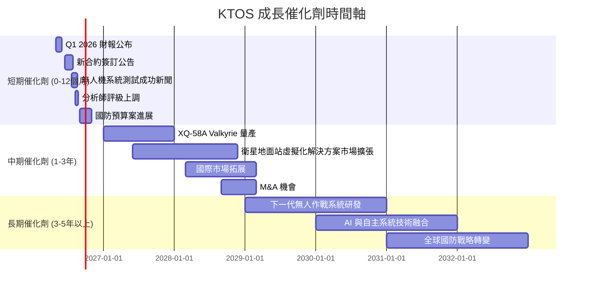

### 8.2 TAM 市場規模分析

Kratos 所處的市場具有巨大的潛在規模，特別是在無人系統和數位化國防基礎設施領域。

```
╔══════════════════════════════════════════════════════════════════╗
║                 KTOS 目標市場 (TAM) 分析                         ║
╠══════════════════════════════════════════════════════════════════╣
║                                                                  ║
║  **戰術無人機系統 (Tactical UAS)**                               ║
║  ├── TAM 估計：           $20B+ (全球，未來5年)                  ║
║  ├── KTOS 滲透率：        中低 (競爭激烈)                        ║
║  └── KTOS 貢獻收入：      顯著成長，目前佔比約 35-40%            ║
║                                                                  ║
║  **衛星地面站虛擬化 (Virtualized Ground Systems)**               ║
║  ├── TAM 估計：           $10B+ (全球，未來5年)                  ║
║  ├── KTOS 滲透率：        中高 (技術領先)                        ║
║  └── KTOS 貢獻收入：      穩定增長，目前佔比約 20-25%            ║
║                                                                  ║
║  **國防電子與訓練系統 (Defense Electronics & Training)**         ║
║  ├── TAM 估計：           $50B+ (全球，年度)                    ║
║  ├── KTOS 滲透率：        低 (市場分散)                          ║
║  └── KTOS 貢獻收入：      穩定基礎收入，佔比約 35-45%            ║
║                                                                  ║
║  📊 結論：KTOS 聚焦於高成長的利基市場，具備巨大的 TAM 潛力。     ║
╚══════════════════════════════════════════════════════════════════╝
```
**分析**：Kratos 鎖定的市場，特別是戰術無人機系統和衛星地面站虛擬化，正處於快速增長階段。全球國防預算的再分配和技術升級需求，為這些市場帶來了巨大的機會。雖然 Kratos 在國防電子和訓練系統等傳統領域的滲透率相對較低，但其在無人機和虛擬化技術方面的專長，使其能夠在 TAM 較小但成長潛力巨大的利基市場中佔據主導地位。隨著國防現代化的推進，Kratos 有望從這些高成長市場中獲得更大的收入份額。

### 8.3 成長驅動力結構圖

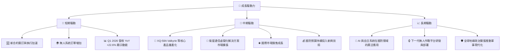
**分析**：
*   **短期驅動**：主要來自於新國防合約的贏得和現有專案的加速執行，特別是無人機系統的訂單增加。最新的 Q1 2026 財報顯示營收 YoY 成長 22.6%，證實了這種強勁的短期動能。
*   **中期驅動**：核心在於其旗艦產品（如 XQ-58A Valkyrie）的成功量產和部署，以及衛星地面站虛擬化解決方案的市場擴大。國際市場的拓展也將提供額外的成長空間。國防預算持續向新興技術傾斜，將為 Kratos 提供穩定的資金支持。
*   **長期驅動**：AI 和自主系統的深度融合將徹底改變國防產業，Kratos 在此領域的技術積累將使其受益。下一代無人作戰平台的研發和全球地緣政治緊張帶來的軍事現代化需求，將為 Kratos 提供持久的成長動力。

---

## 9. 風險矩陣

Kratos 面臨多重風險，包括估值過高、營運執行和政府合約依賴。

### 9.1 風險評分矩陣

```mermaid
quadrantChart
    title Kratos Risk Assessment Matrix
    x-axis Low Probability --> High Probability
    y-axis Low Impact --> High Impact
    quadrant-1 High Priority
    quadrant-2 Monitor Closely
    quadrant-3 Review Periodically
    quadrant-4 Watch

    Valuation Overstretch: [0.75, 0.90]
    Low Profitability & Negative FCF: [0.85, 0.80]
    Government Contract Dependence: [0.70, 0.75]
    Execution Risk (New Programs): [0.60, 0.65]
    Intense Competition: [0.55, 0.60]
    Supply Chain Disruptions: [0.40, 0.50]
    R&D Investment Failure: [0.30, 0.40]
```

### 9.2 風險清單詳細分析

| # | 風險項目 | 發生機率 | 財務衝擊 | 風險評分 | 緩解措施 |
|---|----------------------------------|----------|----------|----------|----------|
| 1 | 🔴 **估值過高與潛在回調** | 高 (75%) | 高 (-20% 股價) | 🔴 9.0/10 | 投資者應保持理性，避免追高；等待股價回落至更合理區間；公司需通過持續超預期成長來證明估值。 |
| 2 | 🔴 **獲利能力低且自由現金流為負** | 高 (85%) | 高 (-10% 營收/利潤) | 🔴 8.5/10 | 嚴格控制成本，優化營運效率；提升高毛利軟體和服務收入佔比；有效管理營運資本以改善現金流。 |
| 3 | 🟡 **政府合約依賴與預算波動** | 中高 (70%) | 中高 (-5% 營收) | 🟡 7.5/10 | 多元化客戶基礎，拓展國際市場和商業客戶；深化與政府機構的長期戰略夥伴關係，確保專案連續性。 |
| 4 | 🟡 **新專案執行與技術風險** | 中 (60%) | 中 (-3% 營收) | 🟡 6.5/10 | 加強專案管理和風險控制；持續投入研發，保持技術領先；與經驗豐富的夥伴合作，分散技術風險。 |
| 5 | 🟡 **行業競爭激烈** | 中 (55%) | 中 (-2% 營收) | 🟡 6.0/10 | 專注核心技術優勢，打造差異化產品；通過創新和成本效益保持競爭力；尋求戰略併購以擴大市場份額。 |
| 6 | 🟢 **供應鏈中斷風險** | 中低 (40%) | 低 (-1% 營收) | 🟢 4.0/10 | 建立多元化供應商網絡；儲備關鍵零部件庫存；與供應商建立長期合作關係。 |
| 7 | 🟢 **研發投資失敗風險** | 低 (30%) | 低 (-1% 營收) | 🟢 3.0/10 | 實施嚴格的研發專案評估機制；分散研發投入，避免過度集中於單一專案；與學術界和研究機構合作。 |

---

## 10. 投資建議

### 10.1 最終綜合評級雷達圖

```
╔══════════════════════════════════════════════════════════════════╗
║                  KTOS 最終綜合評級雷達圖                         ║
╠══════════════════════════════════════════════════════════════════╣
║                                                                  ║
║  基本面強度  7.0 ▓▓▓▓▓▓▓▓▓▓▓▓▓▓░░░░░░  ★★★★☆           ║
║  成長動能    8.0 ▓▓▓▓▓▓▓▓▓▓▓▓▓▓▓▓░░░░  ★★★★☆           ║
║  獲利品質    4.0 ▓▓▓▓▓▓▓▓░░░░░░░░░░░░  ★★☆☆☆           ║
║  財務健康    8.0 ▓▓▓▓▓▓▓▓▓▓▓▓▓▓▓▓░░░░  ★★★★☆           ║
║  估值合理性  4.0 ▓▓▓▓▓▓▓▓░░░░░░░░░░░░  ★★☆☆☆           ║
║  護城河深度  6.5 ▓▓▓▓▓▓▓▓▓▓▓▓▓░░░░░░░  ★★★☆☆           ║
║  管理層執行  7.0 ▓▓▓▓▓▓▓▓▓▓▓▓▓▓░░░░░░  ★★★★☆           ║
║  技術創新力  8.0 ▓▓▓▓▓▓▓▓▓▓▓▓▓▓▓▓░░░░  ★★★★☆           ║
║                                                                  ║
║  綜合總分    6.8 ▓▓▓▓▓▓▓▓▓▓▓▓▓▓░░░░░░  🏆 評級：持有              ║
╚══════════════════════════════════════════════════════════════════╝
```

### 10.2 目標價與隱含報酬率

綜合考慮 DCF 估值、同業比較和分析師預期，我們給出以下目標價區間和對應的隱含報酬率。

| 情境 | 目標價 | 較當前股價 ($55.35) | 機率權重 | 綜合目標價 |
|------|----------|---------------------|----------|------------|
| 🔴 **悲觀情境 (DCF)** | $45.00 | -18.7% | 20% | $9.00 |
| 🟡 **基準情境 (DCF)** | $65.00 | +17.4% | 50% | $32.50 |
| 🟢 **樂觀情境 (DCF)** | $80.00 | +44.5% | 30% | $24.00 |
| **加權平均目標價** | **$65.50** | **+18.3%** | **100%** | |
| **分析師共識目標價** | **$109.86** | **+98.5%** | N/A | |

**分析**：我們的加權平均目標價為 **$65.50**，較當前股價有 18.3% 的潛在上漲空間。這與分析師平均目標價 $109.86 存在顯著差異，主要原因在於我們對其未來盈利能力和自由現金流的改善持更為謹慎的態度，並認為當前估值已包含過多的成長溢價。儘管公司具備強勁的成長潛力，但其獲利能力和負自由現金流是其核心弱點，需要時間來改善。

### 10.3 買入時機與觸發因素

```
╔══════════════════════════════════════════════════════════════════╗
║                  ✅ 買入觸發因素 Checklist                      ║
╠══════════════════════════════════════════════════════════════════╣
║                                                                  ║
║  **立即買入觸發條件（多數符合：無，當前估值過高）**                ║
║  ☐ 股價回落至 $45 - $50 區間                                     ║
║  ☐ 季度盈利和自由現金流顯著超預期，且展望樂觀                    ║
║  ☐ 公司宣佈重大、高毛利的新合約，且能有效改善利潤率              ║
║                                                                  ║
║  **加碼觸發條件（出現以下任一）：**                              ║
║  ✅ 自由現金流持續轉正並穩健增長                                  ║
║  ✅ 淨利率持續提升至 5% 以上                                     ║
║  ✅ ROIC 顯著提升並開始超越 WACC                                 ║
║  ✅ 國防預算大幅增加，特別是無人系統相關預算                      ║
║  ✅ 核心無人機產品獲得大規模量產訂單                              ║
║                                                                  ║
║  **減碼/停損觸發條件（出現以下任一）：**                         ║
║  ☐ 季度營收成長大幅放緩或轉負                                   ║
║  ☐ 自由現金流持續惡化，且未見改善跡象                            ║
║  ☐ 關鍵技術研發失敗或競爭對手取得重大突破                        ║
║  ☐ 政府政策或國防預算對公司產生負面影響                          ║
║  ☐ 估值倍數進一步脫離基本面，且無基本面支撐                      ║
╚══════════════════════════════════════════════════════════════════╝
```

### 10.4 投資人適配度分析

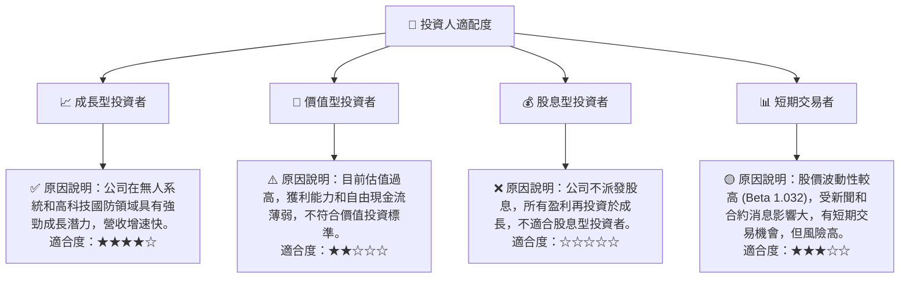

### 10.5 關鍵監控指標

| 監控類型 | 指標 | 關注點 | 頻率 |
|----------|--------------------|------------------------------------------|------|
| **營運表現** | 營收成長率 (YoY) | 關注無人系統和 KGS 部門的成長動能 | 季度 |
| **獲利能力** | 淨利率、營業利益率 | 關注利潤率的改善趨勢，特別是毛利率和營運效率 | 季度 |
| **資本效率** | ROIC vs WACC | 關注 ROIC 是否能持續提升並超越 WACC | 年度 |
| **現金流** | 自由現金流 (FCF) | 關注 FCF 何時轉正並實現穩健增長 | 季度 |
| **估值** | Forward P/E, P/S | 關注估值倍數與同業和歷史區間的比較 | 每月 |
| **合約與訂單** | 新合約公告，訂單積壓 (Backlog) | 關注新業務的拓展情況和未來營收可見度 | 季度 |
| **技術發展** | 無人系統技術進展，競爭格局變化 | 關注公司在核心技術領域的領先地位是否保持 | 持續 |
| **宏觀環境** | 國防預算，地緣政治風險 | 關注政府對國防產業的投入和政策變化 | 持續 |

---

> **免責聲明**：本報告為 AI 自動生成，僅供研究參考，不構成投資建議。投資有風險，入市需謹慎。