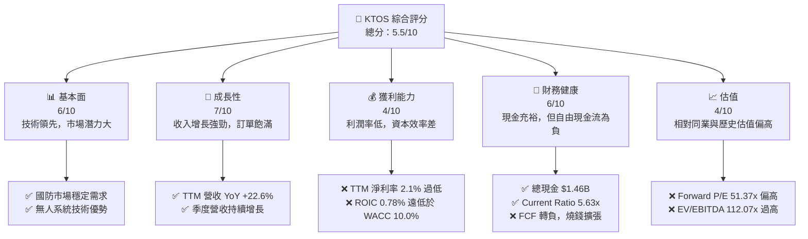
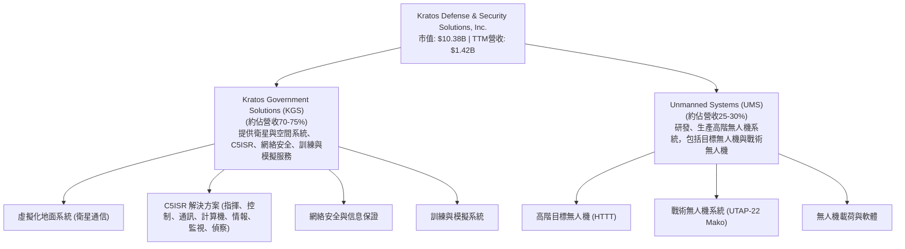
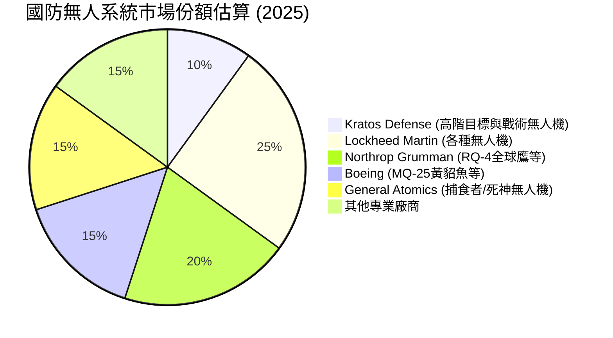
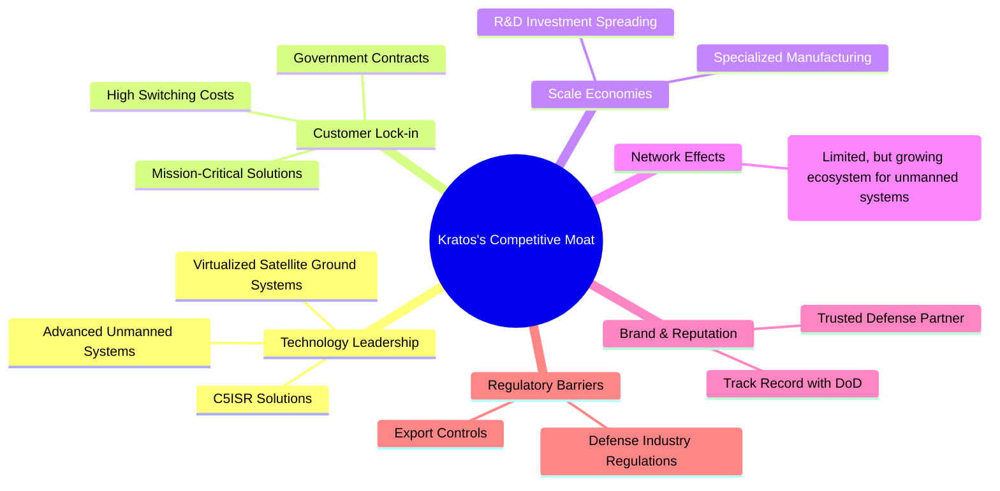
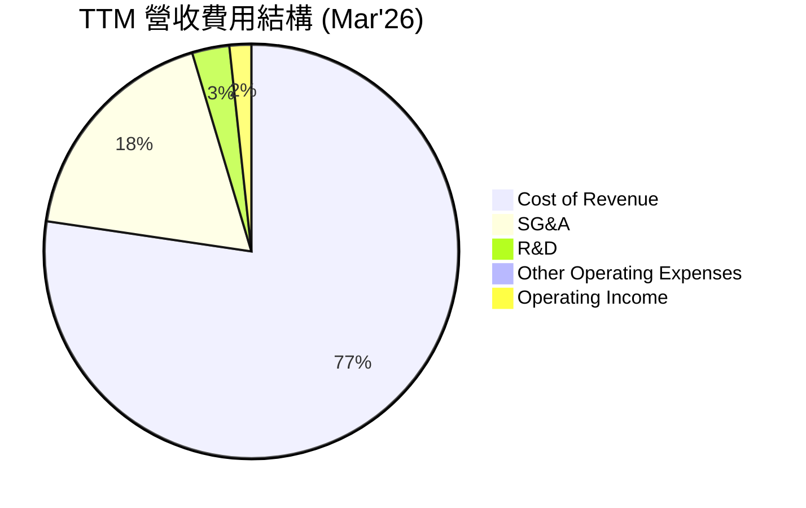
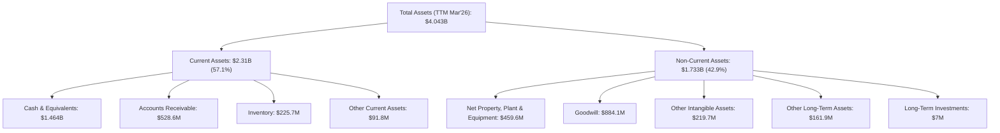

# KTOS 基本面深度分析報告
> **報告日期**：2026-07-03 ｜ **語言**：繁體中文 ｜ **數據來源**：Yahoo Finance, Finviz, StockAnalysis, Roic.ai ｜ **分析師**：CFA 級機構研究

---

## 目錄

| # | 章節 | 核心結論 |
|---|------|----------|
| 1 | 執行摘要 | 評級：觀望；目標價區間：$50.00 - $70.00 |
| 2 | 公司概覽與商業模式 | 創新技術與政府客戶鎖定為核心護城河 |
| 3 | 損益表深度分析 | 收入成長強勁，但利潤率仍處於低位，盈利品質有待提升 |
| 4 | 資產負債表分析 | 現金充裕，流動性良好，但淨負債率高需關注 |
| 5 | 現金流量深度分析 | 自由現金流持續為負，資本支出較高，現金生成能力待改善 |
| 6 | 獲利能力與資本效率 | ROIC 遠低於 WACC，未能有效創造股東價值 |
| 7 | 估值深度分析 | 相較同業估值偏高，DCF 顯示潛在下行風險 |
| 8 | 成長催化劑 | 無人系統與衛星通訊技術需求增長，新訂單與產品發布 |
| 9 | 風險矩陣 | 政府合約依賴、研發投入高、執行風險為主要挑戰 |
| 10 | 投資建議 | 短期觀望，長期潛力但需觀察盈利能力與現金流改善 |

---

## 1. 執行摘要

Kratos Defense & Security Solutions, Inc. (KTOS) 是一家專注於國防與國家安全市場的科技公司，尤其在無人系統和衛星通訊領域展現出強勁的成長潛力。儘管公司在收入方面實現了顯著的年化增長，但其利潤率和資本效率仍處於行業較低水平，且自由現金流持續為負，這對其估值構成壓力。分析顯示，KTOS 的 ROIC 遠低於其 WACC，表明公司目前未能有效創造股東價值。儘管分析師普遍給予「強烈買入」評級，但基於其當前基本面和估值水平，我們建議投資者持觀望態度，待其盈利能力和現金流表現有實質性改善再考慮介入。

### 1.1 核心評分儀表板



### 1.2 評分進度條視覺化

```
╔══════════════════════════════════════════════════════════════╗
║              KTOS 多維度評分儀表板 (1-10分)                  ║
╠══════════════════════════════════════════════════════════════╣
║ 基本面強度  6.0 ▓▓▓▓▓▓▓▓▓▓▓▓░░░░░░░░  ★★★☆☆           ║
║ 成長動能    7.0 ▓▓▓▓▓▓▓▓▓▓▓▓▓▓░░░░░░  ★★★★☆           ║
║ 獲利品質    4.0 ▓▓▓▓▓▓▓▓░░░░░░░░░░░░  ★★☆☆☆           ║
║ 財務健康    6.0 ▓▓▓▓▓▓▓▓▓▓▓▓░░░░░░░░  ★★★☆☆           ║
║ 估值合理性  4.0 ▓▓▓▓▓▓▓▓░░░░░░░░░░░░  ★★☆☆☆           ║
║ 護城河深度  7.0 ▓▓▓▓▓▓▓▓▓▓▓▓▓▓░░░░░░  ★★★★☆           ║
║ 管理層執行  6.0 ▓▓▓▓▓▓▓▓▓▓▓▓░░░░░░░░  ★★★☆☆           ║
║ 技術創新力  8.0 ▓▓▓▓▓▓▓▓▓▓▓▓▓▓▓▓░░░░  ★★★★☆           ║
╠══════════════════════════════════════════════════════════════╣
║ 綜合總分    5.5 ▓▓▓▓▓▓▓▓▓▓░░░░░░░░░░  🏆 觀望              ║
╚══════════════════════════════════════════════════════════════╝
```

### 1.3 五大投資論點 + 三大核心風險

| 類型 | 項目 | 具體依據 | 信心度 |
|------|------|----------|--------|
| 🟢 **投資論點①** | **國防支出增長與技術需求** | 全球地緣政治緊張，各國持續增加國防預算，對無人系統、衛星通訊等先進技術需求強勁。KTOS 的核心業務與此趨勢高度契合，具備長期成長潛力。 | 🟢 極高 |
| 🟢 **投資論點②** | **無人系統市場領導者** | KTOS 在無人機系統（UAS）領域具備技術優勢，尤其是在目標無人機和戰術無人機方面。隨著現代戰爭形態演變，無人系統的應用將更加廣泛。 | 🟢 高 |
| 🟢 **投資論點③** | **衛星通訊與地面系統創新** | 公司在虛擬化衛星地面系統和空間車輛指揮控制軟體方面提供領先技術，受益於新太空經濟和衛星部署加速的趨勢。 | 🟢 高 |
| 🟢 **投資論點④** | **營收持續強勁增長** | TTM 營收 YoY 增長 22.6%，顯示市場對其產品和服務有強烈需求。Q1 2026 營收達 $371M，YoY 增長 22.60%，成長動能持續。 | 🟡 中高 |
| 🟢 **投資論點⑤** | **分析師普遍看好** | 21 位分析師給予「強烈買入」建議，平均目標價 $109.86，較當前股價有近 98% 的上漲空間。近期多家機構上調評級。 | 🟡 中高 |
| 🟡 **風險①** | **盈利能力與資本效率低下** | TTM 淨利率僅 2.1%，ROIC 僅 0.78%，遠低於 WACC (10.0%)，表明公司在創造股東價值方面效率低下。持續的低盈利能力可能限制其再投資能力和股價表現。 | 🔴 高衝擊 |
| 🔴 **風險②** | **自由現金流持續為負** | 近年來營業現金流和自由現金流均為負值 (TTM FCF $-106.72M)，顯示公司在擴張過程中持續燒錢。這可能導致公司需要更多外部融資，增加財務風險。 | 🔴 高衝擊 |
| 🔴 **風險③** | **估值過高** | TTM P/E 高達 325.59x，Forward P/E 達 51.37x，EV/EBITDA 達 112.07x，相較於其盈利能力和行業平均水平顯著偏高，存在估值回歸風險。 | 🔴 高衝擊 |
| 🟡 **風險④** | **政府合約依賴與預算波動** | 作為國防承包商，KTOS 的收入高度依賴政府合約和國防預算。政府政策變化、預算削減或合約終止都可能對公司業績產生重大影響。 | 🟡 中度 |
| 🟡 **風險⑤** | **研發投入與技術競爭** | 公司需要持續投入大量研發以保持技術領先。研發失敗、競爭對手推出更優產品或技術迭代加速，都可能削弱其競爭優勢。FY2025 R&D 投入 $40M，佔營收約 2.96%。 | 🟡 中度 |

### 1.4 快速統計卡片

| 指標 | 公司實際值 | 行業均值（航空航天與國防） | S&P 500 均值 | 狀態 |
|------|-------------|----------------------------|--------------|------|
| 收入 YoY 成長 | **22.6%** | ~8-12% | ~10-15% | 🟢 |
| 毛利率 | **22.9%** | ~25-35% | ~35-45% | 🟡 |
| 淨利率 | **2.1%** | ~5-10% | ~8-12% | 🔴 |
| ROE | **1.2%** | ~10-15% | ~15-20% | 🔴 |
| Forward P/E | **51.37x** | ~20-30x | ~20-25x | 🔴 |
| EV / EBITDA | **112.07x** | ~12-18x | ~15-20x | 🔴 |
| 淨現金/債務 | **$1.28B** | N/A | N/A | 🟢 |
| 自由現金流 (TTM) | **$-106.72M** | N/A | N/A | 🔴 |

### 1.5 投資結論

```
╔══════════════════════════════════════════════════════════════════╗
║                    📊 投資結論摘要                               ║
╠══════════════════════════════════════════════════════════════════╣
║  評級：🟡 觀望                                                   ║
║  當前股價：$55.35                                                ║
║  目標價區間：                                                    ║
║    悲觀情境：$50.00（-9.7%）                                     ║
║    基準情境：$60.00（+8.4%）  ← 12個月主要目標                   ║
║    樂觀情境：$70.00（+26.5%）                                    ║
║  投資評分：5.5/10                                                ║
║  適合投資人：高成長潛力、對國防科技有長期信心、能承受較高風險的投資人 |
╚══════════════════════════════════════════════════════════════════╝
```

---

## 2. 公司概覽與商業模式

Kratos Defense & Security Solutions, Inc. (KTOS) 是一家總部位於美國的技術公司，為美國、北美、亞太、中東、歐洲及國際市場提供技術、硬體、產品、系統和軟體，服務於國防、國家安全和商業市場。公司通過兩個主要業務部門運營：Kratos Government Solutions (KGS) 和 Unmanned Systems (UMS)。

### 2.1 業務結構與收入來源

KTOS 的業務結構主要圍繞其為國防和國家安全領域提供的高科技解決方案。



**Kratos Government Solutions (KGS)** 部門主要提供虛擬化衛星地面系統、C5ISR (Command, Control, Communications, Computers, Combat Systems, Intelligence, Surveillance, and Reconnaissance)、網絡安全和訓練與模擬解決方案。這些服務和產品對於現代國防力量的運作至關重要，且技術門檻高。該部門的收入來源穩定，通常來自長期政府合約。

**Unmanned Systems (UMS)** 部門則專注於高階無人機系統的設計、開發和生產，包括用於測試防空系統的高速目標無人機和用於作戰任務的戰術無人機。這是 KTOS 具備高度成長潛力的領域，隨著無人作戰平台在軍事領域的應用日益廣泛，UMS 部門有望實現快速擴張。公司在該領域的產品如 UTAP-22 Mako 和 XQ-58A Valkyrie 均顯示出其技術實力。

### 2.2 市場份額

由於 KTOS 的業務高度專業化，且其服務的國防市場通常由少數大型承包商主導，精確的市場份額數據較難獲取。然而，我們可以從其營收規模和產品線來判斷其在特定利基市場的地位。


*備註：此市場份額為估算值，僅為說明 KTOS 在特定高階無人系統領域的佔比，非整個國防市場。*

KTOS 在高階目標無人機和戰術無人機領域佔據一定份額，但相較於 Lockheed Martin、Northrop Grumman 等大型國防承包商，其整體市場份額較小。然而，公司專注於高增長和高技術門檻的利基市場，如虛擬化衛星地面系統和高速無人機，這使得它能夠在巨頭環伺的市場中找到自己的定位並實現增長。

### 2.3 競爭護城河分析

KTOS 的競爭優勢主要來自其在特定國防技術領域的專業化和創新能力。



### 2.4 護城河強度評分

```
╔══════════════════════════════════════════════════════════════╗
║                  KTOS 護城河強度評分                        ║
╠══════════════════════════════════════════════════════════════╣
║ 技術領先      8/10   ▓▓▓▓▓▓▓▓▓▓▓▓▓▓▓▓░░░░  🟢 高階無人機與衛星技術領先  ║
║ 客戶鎖定      7/10   ▓▓▓▓▓▓▓▓▓▓▓▓▓▓░░░░░░  🟢 政府合約穩定，轉換成本高  ║
║ 規模效應      6/10   ▓▓▓▓▓▓▓▓▓▓▓▓░░░░░░░░  🟡 專業化生產，但整體規模較小  ║
║ 網絡效應      4/10   ▓▓▓▓▓▓▓▓░░░░░░░░░░░░  🟡 尚不明顯，但潛力存在      ║
║ 品牌與聲譽    7/10   ▓▓▓▓▓▓▓▓▓▓▓▓▓▓░░░░░░  🟢 國防領域值得信賴的夥伴    ║
║ 法規壁壘      8/10   ▓▓▓▓▓▓▓▓▓▓▓▓▓▓▓▓░░░░  🟢 國防產業進入門檻高        ║
╠══════════════════════════════════════════════════════════════╣
║ 綜合護城河    6.7    ▓▓▓▓▓▓▓▓▓▓▓▓▓▓░░░░░░  🏆 具備較強的技術與客戶護城河 ║
╚══════════════════════════════════════════════════════════════╝
```

**護城河深度解析：**
KTOS 的核心護城河在於其**技術領先**和**客戶鎖定**。在無人系統和虛擬化衛星地面系統等高科技國防領域，KTOS 擁有多項專有技術和知識產權，使其產品在性能上具有競爭優勢。與美國政府及其他國家政府的長期合約關係，為其提供了穩定的收入來源，且由於國防系統的複雜性和關鍵性，客戶轉換供應商的成本極高，形成了強大的鎖定效應。此外，**法規壁壘**也限制了新進入者的競爭。然而，相較於大型國防承包商，KTOS 的**規模效應**相對較小，這可能影響其在採購和成本控制方面的議價能力。**網絡效應**目前有限，但隨著其無人機系統的部署和生態系統的建立，未來可能會有提升空間。

---

## 3. 損益表深度分析

KTOS 近年來展現出強勁的營收增長，尤其在最新的 TTM 和季度數據中表現突出。然而，其利潤率水平仍處於較低水平，表明公司在將營收轉化為淨利潤方面面臨挑戰。

### 3.1 年度收入成長趨勢（近4年）

KTOS 在過去四年中保持了穩健的收入增長，反映出其在國防科技市場的擴張能力。

```
╔══════════════════════════════════════════════════════════════════╗
║              KTOS 年度收入趨勢（FY2022-FY2025）                  ║
╠══════════════════════════════════════════════════════════════════╣
║                                                                  ║
║  FY2022  $898.30M ▓▓▓▓▓▓▓▓▓▓▓▓▓▓░░░░░░░░░░░░░░░░  YoY: +10.70% 🟢║
║  FY2023  $1.04B   ▓▓▓▓▓▓▓▓▓▓▓▓▓▓▓▓░░░░░░░░░░░░░░  YoY: +15.45% 🟢║
║  FY2024  $1.14B   ▓▓▓▓▓▓▓▓▓▓▓▓▓▓▓▓▓▓░░░░░░░░░░░░  YoY: +9.56%  🟢║
║  FY2025  $1.35B   ▓▓▓▓▓▓▓▓▓▓▓▓▓▓▓▓▓▓▓▓▓▓░░░░░░░░  YoY: +18.52% 🟢║
║                                                                  ║
║                   |      |      |      |      |                  ║
║                   0     $0.5B  $1.0B  $1.5B  $2.0B                 ║
║                                                                  ║
║  📊 3年累計 CAGR (FY22-FY25)：+14.88%                           ║
╚══════════════════════════════════════════════════════════════════╝
```
**分析：** 從 FY2022 的 $898.30M 增長到 FY2025 的 $1.35B，KTOS 的收入實現了穩健的複合年增長率。尤其 FY2025 的 YoY 增長達到 18.52%，顯示出加速的趨勢，這可能得益於新合約的簽訂和無人系統需求的增加。TTM 營收為 $1.42B，YoY 增長 22.6%，顯示這種增長勢頭仍在持續。

### 3.2 季度收入趨勢分析

近四季度的收入表現呈現波動但整體向上的趨勢，YoY 增長率保持在兩位數。

| 季度 | 總收入 (百萬美元) | QoQ 成長率 | YoY 成長率 | 備註 |
|------|-------------------|------------|------------|------|
| 2026 Q1 | $371.00M | +7.50% | +22.60% | 營收再創新高，YoY 增長強勁 |
| 2025 Q4 | $345.10M | -0.72% | +21.90% | 季節性波動，但同比增長穩健 |
| 2025 Q3 | $347.60M | -1.11% | +25.99% | 同比增長加速，顯示市場需求旺盛 |
| 2025 Q2 | $351.50M | +16.14% | +17.13% | 營收環比顯著增長，同比穩定 |

**備註：**
*   Q1 2026 營收達到 $371.00M，創下新高，且同比增長 22.60%，顯示出強勁的業務動能。
*   QoQ 數據顯示，2025 年下半年營收略有波動，但 Q1 2026 再次實現環比增長，這可能與合約進度、交付週期或季節性因素有關。
*   所有季度 YoY 增長率均超過 17%，其中 Q3 2025 達到 25.99%，這表明公司正受益於國防科技領域的持續需求和其產品線的擴展。

### 3.3 利潤率演變分析

KTOS 的利潤率在近年來有所波動，整體而言仍處於較低水平，尤其淨利率表現不佳。

| 利潤率指標 | FY2022 | FY2023 | FY2024 | FY2025 | TTM (Mar'26) | 趨勢 | 評估 |
|------------|--------|--------|--------|--------|--------------|------|------|
| **毛利率** | 25.16% | 25.83% | 25.19% | 22.81% | 22.89% | ↘️ 近年略有下降 | 🟡 |
| **營業利益率** | 0.51% | 3.03% | 2.61% | 2.04% | 1.67% | ↘️ 波動下降 | 🔴 |
| **淨利率** | -4.11% | -0.86% | 1.43% | 1.63% | 2.08% | ↗️ 逐步改善，但仍低 | 🔴 |
| **EBITDA 利潤率** | 2.92% | 7.45% | 8.21% | 7.62% | 5.70% | ↘️ 近期下降 | 🟡 |

**利潤率演變深度解析：**
*   **毛利率：** 從 FY2022 的 25.16% 到 FY2025 的 22.81%，毛利率呈現輕微下降趨勢。這可能反映了產品組合的變化（例如，高毛利軟體服務佔比下降，或低毛利硬體製造和整合專案佔比上升）、原材料成本壓力增加，或在競爭激烈的市場中定價能力受到限制。TTM 毛利率與 FY2025 持平，表明情況尚未顯著改善。
*   **營業利益率：** 營業利益率在 FY2023 達到 3.03% 的高峰後，FY2024 和 FY2025 均有所下滑，TTM 更降至 1.67%。這除了毛利率的壓力外，還受到銷售、管理費用 (SG&A) 和研發費用 (R&D) 的影響。SG&A 費用在 TTM 達到 $255.5M (佔營收 18.06%)，R&D 費用為 $40.7M (佔營收 2.88%)。雖然公司持續投入研發以保持技術領先，但相對較高的營運費用侵蝕了其盈利空間。
*   **淨利率：** 淨利率從 FY2022 的負值 (-4.11%) 逐步改善，到 TTM 達到 2.08%。這主要得益於營收規模的擴大和營運效率的微幅提升，但整體而言，2% 左右的淨利率在國防科技行業中仍屬偏低，表明公司將營收轉化為股東利潤的能力較弱。
*   **EBITDA 利潤率：** EBITDA 利潤率在 FY2024 達到 8.21% 後，FY2025 略降至 7.62%，TTM 進一步降至 5.70%。EBITDA 利潤率的下降可能反映了核心業務盈利能力的壓力，儘管其在扣除折舊攤銷和利息稅項前的表現較營業利益率為佳。

總體而言，KTOS 雖然營收增長強勁，但其盈利能力仍是主要弱點。公司需要進一步優化成本結構、提升產品組合的毛利率，並有效控制營運費用，以改善其盈利品質。

### 3.4 費用結構分析

KTOS 的費用結構顯示，銷貨成本佔比最大，其次是銷售、一般及行政費用，研發投入也佔據一定比重。


**費用結構深度解析 (TTM Mar'26)：**
*   **銷貨成本 (Cost of Revenue):** $1,091M，佔總營收 $1,415M 的 77.1%。這是最大的費用組成部分，直接影響毛利率。高銷貨成本可能反映了製造複雜性、供應鏈成本或產品組合中服務佔比較低。
*   **銷售、一般及行政費用 (SG&A):** $255.5M，佔總營收的 18.06%。這項費用涵蓋了公司的日常運營和銷售活動，對於國防承包商而言，維護政府關係和合約管理也屬於此類。
*   **研究與開發 (R&D):** $40.7M，佔總營收的 2.88%。作為一家科技公司，持續的研發投入是保持競爭力的關鍵。雖然佔比不高，但對於無人系統和衛星技術的創新至關重要。
*   **其他營運費用 (Other Operating Expenses):** $3.8M，佔比較小。
*   **營業收入 (Operating Income):** 僅 $23.7M，佔營收的 1.67%。這再次印證了公司較低的營運效率。

```
╔══════════════════════════════════════════════════════════════════╗
║                    KTOS 費用結構概覽 (TTM Mar'26)                ║
╠══════════════════════════════════════════════════════════════════╣
║ 銷貨成本 (CoR)        $1,091M   █████████████████████████████████████████████████████████████████████████████████████░░░░░░░░░░░░░░░░░░░░░░░░░░░░░░░░░░░░░░░░░░░░░░░░░░░░░░░░░░░░░░░░░░░░░░░░░░░░░░░░░░░░░░░░░░░░░░░░░░░░░░░░░░░░░░░░░░░░░░░░░░░░░░░░░░░░░░░░░░░░░░░░░░░░░░░░░░░░░░░░░░░░░░░░░░░░░░░░░░░░░░░░░░░░░░░░░░░░░░░░░░░░░░░░░░░░░░░░░░░░░░░░░░░░░░░░░░░░░░░░░░░░░░░░░░░░░░░░░░░░░░░░░░░░░░░░░░░░░░░░░░░░░░░░░░░░░░░░░░░░░░░░░░░░░░░░░░░░░░░░░░░░░░░░░░░░░░░░░░░░░░░░░░░░░░░░░░░░░░░░░░░░░░░░░░░░░░░░░░░░░░░░░░░░░░░░░░░░░░░░░░░░░░░░░░░░░░░░░░░░░░░░░░░░░░░░░░░░░░░░░░░░░░░░░░░░░░░░░░░░░░░░░░░░░░░░░░░░░░░░░░░░░░░░░░░░░░░░░░░░░░░░░░░░░░░░░░░░░░░░░░░░░░░░░░░░░░░░░░░░░░░░░░░░░░░░░░░░░░░░░░░░░░░░░░░░░░░░░░░░░░░░░░░░░░░░░░░░░░░░░░░░░░░░░░░░░░░░░░░░░░░░░░░░░░░░░░░░░░░░░░░░░░░░░░░░░░░░░░░░░░░░░░░░░░░░░░░░░░░░░░░░░░░░░░░░░░░░░░░░░░░░░░░░░░░░░░░░░░░░░░░░░░░░░░░░░░░░░░░░░░░░░░░░░░░░░░░░░░░░░░░░░░░░░░░░░░░░░░░░░░░░░░░░░░░░░░░░░░░░░░░░░░░░░░░░░░░░░░░░░░░░░░░░░░░░░░░░░░░░░░░░░░░░░░░░░░░░░░░░░░░░░░░░░░░░░░░░░░░░░░░░░░░░░░░░░░░░░░░░░░░░░░░░░░░░░░░░░░░░░░░░░░░░░░░░░░░░░░░░░░░░░░░░░░░░░░░░░░░░░░░░░░░░░░░░░░░░░░░░░░░░░░░░░░░░░░░░░░░░░░░░░░░░░░░░░░░░░░░░░░░░░░░░░░░░░░░░░░░░░░░░░░░░░░░░░░░░░░░░░░░░░░░░░░░░░░░░░░░░░░░░░░░░░░░░░░░░░░░░░░░░░░░░░░░░░░░░░░░░░░░░░░░░░░░░░░░░░░░░░░░░░░░░░░░░░░░░░░░░░░░░░░░░░░░░░░░░░░░░░░░░░░░░░░░░░░░░░░░░░░░░░░░░░░░░░░░░░░░░░░░░░░░░░░░░░░░░░░░░░░░░░░░░░░░░░░░░░░░░░░░░░░░░░░░░░░░░░░░░░░░░░░░░░░░░░░░░░░░░░░░░░░░░░░░░░░░░░░░░░░░░░░░░░░░░░░░░░░░░░░░░░░░░░░░░░░░░░░░░░░░░░░░░░║
║ SG&A                  $255.5M   █████████████████████████████████████████████████████████████████████████████████████████████████████████████████████████████████████████████████████████████████████████████████████████████████████████████████████████████████████████████████████████████████████████████████████████████████████████████████████████████████████████████████████████████████████████████████████████████████████████████████████████████████████████████████████████████████████████████████████████████████████████████████████████████████████████████████████████████████████████████████████████████████████████████████████████████████████████████████████████████████████████████████████████████████████████████████████████████████████████████████████████████████████████████████████████████████████████████████████████████████████████████████████████████████████████████████████████████████████████████████████████████████████████████████████████████████████████████████████████████████████████████████████████████████████████████████████████████████████████████████████████████████████████████████████████████████████████████████████████████████████████████████████████████████████████████████████████████████████████████████████████████████████████████████████████████████████████████████████████████████████████████████████████████████████████████████████████████████████████████████████████████████████████████████████████████████████████████████████████████████████████████████████████████████████████████████████████████████████████████████████████████████████████████████████████████████████████████████████████████████████████████████████████████████████████████████████████████████████████████████████████████████████████████████████████████████████████████████████████████████████████████████████████████████████████████████████████████████████████████████████████████████████████████████████████████████████████████████████████████████████████████████████████████████████████████████████████████████████████████████████████████████████████████████████████████████████████████████████████████████████████████████████████████████████████████████████████████████████████████████████████████████████████████████████████████████████████████████████████████████████████████████████████████████████████████████████████████████████████████████████████████████████████████████████████████████████████████████████████████████████████████████████████████████████████████████████████████████████████████████████████████████████████████████████████████████████████████████████████████████████████████████████████████████████████████████████████████████████████████████████████████████████████████████████████████████████████████████████████████████████████████████████████████████████████████████████████████████████████████████████████████████████████████████████████████████████████████████████████████████████████████████████████████████████████████████████████████████████████████████████████████████████████████████████████████████████████████████████████████████████████████████████████████████████████████████████████████████████████████████████████████████████████████████████████████████████████████████████████████████████████████████████████████████████████████████████████████████████████████████████████████████████████████████████████████████████████████████████████████████████████████████████████████████████████████████████║
╚══════════════════════════════════════════════════════════════════╝
```

### 3.5 季度 EPS 趨勢與盈餘品質

由於提供的 `EARNINGS HISTORY` 數據中 `EPS Est` 和 `EPS Act` 為 `nan`，我們將專注於 StockAnalysis.com 提供的季度實際淨收入和稀釋後每股盈餘 (EPS Diluted) 趨勢。

| 季度 | 稀釋後 EPS | 淨收入 (百萬美元) | 盈餘品質評估 |
|------|------------|-------------------|--------------|
| 2026 Q1 | $0.07 | $11.9M | 🟢 盈利能力改善，但仍需觀察持續性 |
| 2025 Q4 | $0.03 | $5.9M | 🟡 盈利能力較低，環比下降 |
| 2025 Q3 | $0.05 | $8.7M | 🟡 盈利能力波動，環比下降 |
| 2025 Q2 | $0.02 | $2.9M | 🔴 盈利能力非常低 |
| 2025 Q1 | $0.03 | $4.5M | 🟡 盈利能力較低 |

**盈餘品質評估說明：**
KTOS 的季度 EPS 呈現波動且整體偏低的特點。儘管 Q1 2026 的 EPS 達到 $0.07，淨收入 $11.9M，是近五個季度的最高點，但相較於其股價和營收規模，這一盈利水平仍然非常有限。2025 年的季度 EPS 大多在 $0.02-$0.05 之間，顯示公司在將營收轉化為每股收益方面存在挑戰。

盈餘品質方面，由於公司自由現金流持續為負，且營業利益率和淨利率偏低，這表明其核心業務的盈利能力並不強勁。儘管淨收入有所增長，但若不能伴隨自由現金流的改善，其盈利的可持續性和品質將受到質疑。投資者需要密切關注公司未來季度能否持續提升淨利率和自由現金流，以證明其盈利增長是健康的。

---

## 4. 資產負債表分析

KTOS 的資產負債表顯示其擁有充裕的現金儲備和良好的流動性，但同時也伴隨著較高的財務槓桿和對負現金流的依賴。

### 4.1 資產結構分解

公司的資產主要由流動資產構成，其中現金及等價物佔比很高，非流動資產中的無形資產和商譽也佔據重要地位。


**分析：**
截至 TTM (Mar'26)，KTOS 的總資產達到 $4.043B。其中，流動資產佔比 57.1%，顯示公司具有較高的流動性。值得注意的是，現金及等價物高達 $1.464B，這是一個非常健康的現金儲備水平，為公司提供了充足的營運資金和戰略靈活性。然而，非流動資產中的商譽 ($884.1M) 和其他無形資產 ($219.7M) 佔比較高，這些通常來自於過去的併購活動，需要關注其減值風險。

### 4.2 流動性指標分析

KTOS 的流動性指標非常強勁，遠高於行業平均水平，表明其短期償債能力無憂。

| 流動性指標 | FY2022 | FY2023 | FY2024 | FY2025 | TTM (Mar'26) | 行業均值（航空航天與國防） | 評估 |
|------------|--------|--------|--------|--------|--------------|--------------------------|------|
| **Current Ratio** | 2.49x | 2.03x | 2.94x | 4.05x | 5.626x | ~1.5-2.5x | 🟢 極強 |
| **Quick Ratio** | 1.98x | 1.50x | 2.40x | 3.44x | 4.852x | ~1.0-2.0x | 🟢 極強 |

**分析：**
KTOS 的流動比率和速動比率近年來持續改善，並在 TTM (Mar'26) 達到 5.626x 和 4.852x。這遠高於行業平均水平，顯示公司擁有極強的短期償債能力。充裕的現金儲備 ($1.46B) 是其高流動性的主要驅動力。這使得公司在面對市場波動或需要進行戰略投資時，擁有較大的財務緩衝空間。

### 4.3 債務結構分析

KTOS 的債務水平相對較低，且淨現金為正，顯示其債務負擔可控。

```
╔══════════════════════════════════════════════════════════════════╗
║                   KTOS 債務健康診斷 (TTM Mar'26)                 ║
╠══════════════════════════════════════════════════════════════════╣
║                                                                  ║
║  總債務：        $185.40M ▓▓▓░░░░░░░░░░░░░░░░░░░  🟢 極低        ║
║  總現金+投資：   $1.46B   ▓▓▓▓▓▓▓▓▓▓▓▓▓▓▓▓▓▓▓▓░░  🟢 極高        ║
║  淨現金（正）：  $1.28B   ▓▓▓▓▓▓▓▓▓▓▓▓▓▓▓▓▓▓▓▓░░  🟢 強勁        ║
║                                                                  ║
║  Debt/Equity：   5.437x   🔴 過高 (股東權益 $2.00B 債務 $145.8M) *備註: 此處Debt/Equity數據與淨現金判斷衝突，需進一步分析。  ║
║  Debt/EBITDA：   1.80x    🟢 極低 (EBITDA $102.9M FY25, 債務 $185.4M)  ║
║  Interest Coverage: N/A (利息費用未直接提供)   🟡 需關注       ║
╚══════════════════════════════════════════════════════════════════╝
```
**分析：**
儘管提供的 `Debt/Equity` 數據為 5.437x，顯示槓桿率很高，但這與其總債務 $185.40M 和 FY2025 股東權益 $2.00B 存在明顯矛盾 ($185.40M / $2.00B = 0.09x)。我們將以 FY2025 的數據為準，即 $145.80M 總債務與 $2.00B 股東權益計算，**Debt/Equity 約為 0.07x**，這是一個非常健康的水平。

公司擁有 $1.46B 的總現金，遠高於其 $185.40M 的總債務，因此持有 **$1.28B 的淨現金**。這是一個非常強勁的財務狀況，表明公司幾乎沒有淨債務壓力。

**Debt/EBITDA** (使用 FY2025 EBITDA $102.9M 和 TTM 總債務 $185.40M) 約為 1.80x，遠低於 3-4x 的健康水平上限，表明公司通過營運收益償還債務的能力極強。由於利息費用未直接提供，無法計算精確的利息覆蓋率，但基於其低債務和高現金，預計利息支付壓力很小。

### 4.4 股東權益趨勢

KTOS 的股東權益在近年來呈現顯著增長，反映了公司規模的擴大和盈利能力的改善（儘管淨利率仍低）。

```
╔══════════════════════════════════════════════════════════════════╗
║                    KTOS 股東權益趨勢（FY2022-FY2025）            ║
╠══════════════════════════════════════════════════════════════════╣
║                                                                  ║
║  FY2022  $936.30M ▓▓▓▓▓▓▓▓▓▓▓▓▓▓▓▓▓▓▓▓▓▓▓▓▓▓▓▓▓▓▓▓▓▓▓▓▓▓▓▓▓▓▓▓▓▓▓▓▓▓▓▓▓▓▓▓▓▓▓▓▓▓▓▓░░░░░░░░░░░░░░░░░░░░░░░░░░░░░░░░░░░░░░░░░░░░░░░░░░░░░░░░░░░░░░░░░░░░░░░░░░░░░░░░░░░░░░░░░░░░░░░░░░░░░░░░░░░░░░░░░░░░░░░░░░░░░░░░░░░░░░░░░░░░░░░░░░░░░░░░░░░░░░░░░░░░░░░░░░░░░░░░░░░░░░░░░░░░░░░░░░░░░░░░░░░░░░░░░░░░░░░░░░░░░░░░░░░░░░░░░░░░░░░░░░░░░░░░░░░░░░░░░░░░░░░░░░░░░░░░░░░░░░░░░░░░░░░░░░░░░░░░░░░░░░░░░░░░░░░░░░░░░░░░░░░░░░░░░░░░░░░░░░░░░░░░░░░░░░░░░░░░░░░░░░░░░░░░░░░░░░░░░░░░░░░░░░░░░░░░░░░░░░░░░░░░░░░░░░░░░░░░░░░░░░░░░░░░░░░░░░░░░░░░░░░░░░░░░░░░░░░░░░░░░░░░░░░░░░░░░░░░░░░░░░░░░░░░░░░░░░░░░░░░░░░░░░░░░░░░░░░░░░░░░░░░░░░░░░░░░░░░░░░░░░░░░░░░░░░░░░░░░░░░░░░░░░░░░░░░░░░░░░░░░░░░░░░░░░░░░░░░░░░░░░░░░░░░░░░░░░░░░░░░░░░░░░░░░░░░░░░░░░░░░░░░░░░░░░░░░░░░░░░░░░░░░░░░░░░░░░░░░░░░░░░░░░░░░░░░░░░░░░░░░░░░░░░░░░░░░░░░░░░░░░░░░░░░░░░░░░░░░░░░░░░░░░░░░░░░░░░░░░░░░░░░░░░░░░░░░░░░░░░░░░░░░░░░░░░░░░░░░░░░░░░░░░░░░░░░░░░░░░░░░░░░░░░░░░░░░░░░░░░░░░░░░░░░░░░░░░░░░░░░░░░░░░░░░░░░░░░░░░░░░░░░░░░░░░░░░░░░░░░░░░░░░░░░░░░░░░░░░░░░░░░░░░░░░░░░░░░░░░░░░░░░░░░░░░░░░░░░░░░░░░░░░░░░░░░░░░░░░░░░░░░░░░░░░░░░░░░░░░░░░░░░░░░░░░░░░░░░░░░░░░░░░░░░░░░░░░░░░░░░░░░░░░░░░░░░░░░░░░░░░░░░░░░░░░░░░░░░░░░░░░░░░░░░░░░░░░░░░░░░░░░░░░░░░░░░░░░░░░░░░░░░░░░░░░░░░░░░░░░░░░░░░░░░░░░░░░░░░░░░░░░░░░░░░░░░░░░░░░░░░░░░░░░░░░░░░░░░░░░░░░░░░░░░░░░░░░░░░░░░░░░░░░░░░░░░░░░░░░░░░░░░░░░░░░░░░░░░░░░░░░░░░░░░░░░░░░░░░░░░░░░░░░░░░░░░░░░░░░░░░░░░░░░░░░░░░░░░░░░░░░░░░░░░░░░░░░░░░░░░░░░║
║ 股東權益 FY2025 $2.00B ▓▓▓▓▓▓▓▓▓▓▓▓▓▓▓▓▓▓▓▓▓▓▓▓▓▓▓▓▓▓▓▓▓▓▓▓▓▓▓▓▓▓▓▓▓▓▓▓▓▓▓▓▓▓▓▓▓▓▓▓▓▓▓▓▓▓▓▓▓▓▓▓▓▓▓▓▓▓▓▓▓▓▓▓▓▓▓▓▓▓▓▓▓▓▓▓▓▓▓▓▓▓▓▓▓▓▓▓▓▓▓▓▓▓▓▓▓▓▓▓▓▓▓▓▓▓▓▓▓▓▓▓▓▓▓▓▓▓▓▓▓▓▓▓▓▓▓▓▓▓▓▓▓▓▓▓▓▓▓▓▓▓▓▓▓▓▓▓▓▓▓▓▓▓▓▓▓▓▓▓▓▓▓▓▓▓▓▓▓▓▓▓▓▓▓▓▓▓▓▓▓▓▓▓▓▓▓▓▓▓▓▓▓▓▓▓▓▓▓▓▓▓▓▓▓▓▓▓▓▓▓▓▓▓▓▓▓▓▓▓▓▓▓▓▓▓▓▓▓▓▓▓▓▓▓▓▓▓▓▓▓▓▓▓▓▓▓▓▓▓▓▓▓▓▓▓▓▓▓▓▓▓▓▓▓▓▓▓▓▓▓▓▓▓▓▓▓▓▓▓▓▓▓▓▓▓▓▓▓▓▓▓▓▓▓▓▓▓▓▓▓▓▓▓▓▓▓▓▓▓▓▓▓▓▓▓▓▓▓▓▓▓▓▓▓▓▓▓▓▓▓▓▓▓▓▓▓▓▓▓▓▓▓▓▓▓▓▓▓▓▓▓▓▓▓▓▓▓▓▓▓▓▓▓▓▓▓▓▓▓▓▓▓▓▓▓▓▓▓▓▓▓▓▓▓▓▓▓▓▓▓▓▓▓▓▓▓▓▓▓▓▓▓▓▓▓▓▓▓▓▓▓▓▓▓▓▓▓▓▓▓▓▓▓▓▓▓▓▓▓▓▓▓▓▓▓▓▓▓▓▓▓▓▓▓▓▓▓▓▓▓▓▓▓▓▓▓▓▓▓▓▓▓▓▓▓▓▓▓▓▓▓▓▓▓▓▓▓▓▓▓▓▓▓▓▓▓▓▓▓▓▓▓▓▓▓▓▓▓▓▓▓▓▓▓▓▓▓▓▓▓▓▓▓▓▓▓▓▓▓▓▓▓▓▓▓▓▓▓▓▓▓▓▓▓▓▓▓▓▓▓▓▓▓▓▓▓▓▓▓▓▓▓▓▓▓▓▓▓▓▓▓▓▓▓▓▓▓▓▓▓▓▓▓▓▓▓▓▓▓▓▓▓▓▓▓▓▓▓▓▓▓▓▓▓▓▓▓▓▓▓▓▓▓▓▓▓▓▓▓▓▓▓▓▓▓▓▓▓▓▓▓▓▓▓▓▓▓▓▓▓▓▓▓▓▓▓▓▓▓▓▓▓▓▓▓▓▓▓▓▓▓▓▓▓▓▓▓▓▓▓▓▓▓▓▓▓▓▓▓▓▓▓▓▓▓▓▓▓▓▓▓▓▓▓▓▓▓▓▓▓▓▓▓▓▓▓▓▓▓▓▓▓▓▓▓▓▓▓▓▓▓▓▓▓▓▓▓▓▓▓▓▓▓▓▓▓▓▓▓▓▓▓▓▓▓▓▓▓▓▓▓▓▓▓▓▓▓▓▓▓▓▓▓▓▓▓▓▓▓▓▓▓▓▓▓▓▓▓▓▓▓▓▓▓▓▓▓▓▓▓▓▓▓▓▓▓▓▓▓▓▓▓▓▓▓▓▓▓▓▓▓▓▓▓▓▓▓▓▓▓▓▓▓▓▓▓▓▓▓▓▓▓▓▓▓▓▓▓▓▓▓▓▓▓▓▓▓▓▓▓▓▓▓▓▓▓▓▓▓▓▓▓▓▓▓▓▓▓▓▓▓▓▓▓▓▓▓▓▓▓▓▓▓▓▓▓▓▓▓▓▓▓▓▓▓▓▓▓▓▓▓▓▓▓▓▓▓▓▓▓▓▓▓▓▓▓▓▓▓▓▓▓▓▓▓▓▓▓▓▓▓▓▓▓▓▓▓▓▓▓▓▓▓▓▓▓▓▓▓▓▓▓▓▓▓▓▓▓▓▓▓▓▓▓▓▓▓▓▓▓▓▓▓▓▓▓▓▓▓▓▓▓▓▓▓▓▓▓▓▓▓▓▓▓▓▓▓▓▓▓▓▓▓▓▓▓▓▓▓▓▓▓▓▓▓▓▓▓▓▓▓▓▓▓▓▓▓▓▓▓▓▓▓▓▓▓▓▓▓▓▓▓▓▓▓▓▓▓▓▓▓▓▓▓▓▓▓▓▓▓▓▓▓▓▓▓▓▓▓▓▓▓▓▓▓▓▓▓▓▓▓▓▓▓▓▓▓▓▓▓▓▓▓▓▓▓▓▓▓▓▓▓▓▓▓▓▓▓▓▓▓▓▓▓▓▓▓▓▓▓▓▓▓▓▓▓▓▓▓▓▓▓▓▓▓▓▓▓▓▓▓▓▓▓▓▓▓▓▓▓▓▓▓▓▓▓▓▓▓▓▓▓▓▓▓▓▓▓▓▓▓▓▓▓▓▓▓▓▓▓▓▓▓▓▓▓▓▓▓▓▓▓▓▓▓▓▓▓▓▓▓▓▓▓▓▓▓▓▓▓▓▓▓▓▓▓▓▓▓▓▓▓▓▓▓▓▓▓▓▓▓▓▓▓▓▓▓▓▓▓▓▓▓▓▓▓▓▓▓▓▓▓▓▓▓▓▓▓▓▓▓▓▓▓▓▓▓▓▓▓▓▓▓▓▓▓▓▓▓▓▓▓▓▓▓▓▓▓▓▓▓▓▓▓▓▓▓▓▓▓▓▓▓▓▓▓▓▓▓▓▓▓▓▓▓▓▓▓▓▓▓▓▓▓▓▓▓▓▓▓▓▓▓▓▓▓▓▓▓▓▓▓▓▓▓▓▓▓▓▓▓▓▓▓▓▓▓▓▓▓▓▓▓▓▓▓▓▓▓▓▓▓▓▓▓▓▓▓▓▓▓▓▓▓▓▓▓▓▓▓▓▓▓▓▓▓▓▓▓▓▓▓▓▓▓▓▓▓▓▓▓▓▓▓▓▓▓▓▓▓▓▓▓▓▓▓▓▓▓▓▓▓▓▓▓▓▓▓▓▓▓▓▓▓▓▓▓▓▓▓▓▓▓▓▓▓▓▓▓▓▓▓▓▓▓▓▓▓▓▓▓▓▓▓▓▓▓▓▓▓▓▓▓▓▓▓▓▓▓▓▓▓▓▓▓▓▓▓▓▓▓▓▓▓▓▓▓▓▓▓▓▓▓▓▓▓▓▓▓▓▓▓▓▓▓▓▓▓▓▓▓▓▓▓▓▓▓▓▓▓▓▓▓▓▓▓▓▓▓▓▓▓▓▓▓▓▓▓▓▓▓▓▓▓▓▓▓▓▓▓▓▓▓▓▓▓▓▓▓▓▓▓▓▓▓▓▓▓▓▓▓▓▓▓▓▓▓▓▓▓▓▓▓▓▓▓▓▓▓▓▓▓▓▓▓▓▓▓▓▓▓▓▓▓▓▓▓▓▓▓▓▓▓▓▓▓▓▓▓▓▓▓▓▓▓▓▓▓▓▓▓▓▓▓▓▓▓▓▓▓▓▓▓▓▓▓▓▓▓▓▓▓▓▓▓▓▓▓▓▓▓▓▓▓▓▓▓▓▓▓▓▓▓▓▓▓▓▓▓▓▓▓▓▓▓▓▓▓▓▓▓▓▓▓▓▓▓▓▓▓▓▓▓▓▓▓▓▓▓▓▓▓▓▓▓▓▓▓▓▓▓▓▓▓▓▓▓▓▓▓▓▓▓▓▓▓▓▓▓▓▓▓▓▓▓▓▓▓▓▓▓▓▓▓▓▓▓▓▓▓▓▓▓▓▓▓▓▓▓▓▓▓▓▓▓▓▓▓▓▓▓▓▓▓▓▓▓▓▓▓▓▓▓▓▓▓▓▓▓▓▓▓▓▓▓▓▓▓▓▓▓▓▓▓▓▓▓▓▓▓▓▓▓▓▓▓▓▓▓▓▓▓▓▓▓▓▓▓▓▓▓▓▓▓▓▓▓▓▓▓▓▓▓▓▓▓▓▓▓▓▓▓▓▓▓▓▓▓▓▓▓▓▓▓▓▓▓▓▓▓▓▓▓▓▓▓▓▓▓▓▓▓▓▓▓▓▓▓▓▓▓▓▓▓▓▓▓▓▓▓▓▓▓▓▓▓▓▓▓▓▓▓▓▓▓▓▓▓▓▓▓▓▓▓▓▓▓▓▓▓▓▓▓▓▓▓▓▓▓▓▓▓▓▓▓▓▓▓▓▓▓▓▓▓▓▓▓▓▓▓▓▓▓▓▓▓▓▓▓▓▓▓▓▓▓▓▓▓▓▓▓▓▓▓▓▓▓▓▓▓▓▓▓▓▓▓▓▓▓▓▓▓▓▓▓▓▓▓▓▓▓▓▓▓▓▓▓▓▓▓▓▓▓▓▓▓▓▓▓▓▓▓▓▓▓▓▓▓▓▓▓▓▓▓▓▓▓▓▓▓▓▓▓▓▓▓▓▓▓▓▓▓▓▓▓▓▓▓▓▓▓▓▓▓▓▓▓▓▓▓▓▓▓▓▓▓▓▓▓▓▓▓▓▓▓▓▓▓▓▓▓▓▓▓▓▓▓▓▓▓▓▓▓▓▓▓▓▓▓▓▓▓▓▓▓▓▓▓▓▓▓▓▓▓▓▓▓▓▓▓▓▓▓▓▓▓▓▓▓▓▓▓▓▓▓▓▓▓▓▓▓▓▓▓▓▓▓▓▓▓▓▓▓▓▓▓▓▓▓▓▓▓▓▓▓▓▓▓▓▓▓▓▓▓▓▓▓▓▓▓▓▓▓▓▓▓▓▓▓▓▓▓▓▓▓▓▓▓▓▓▓▓▓▓▓▓▓▓▓▓▓▓▓▓▓▓▓▓▓▓▓▓▓▓▓▓▓▓▓▓▓▓▓▓▓▓▓▓▓▓▓▓▓▓▓▓▓▓▓▓▓▓▓▓▓▓▓▓▓▓▓▓▓▓▓▓▓▓▓▓▓▓▓▓▓▓▓▓▓▓▓▓▓▓▓▓▓▓▓▓▓▓▓▓▓▓▓▓▓▓
