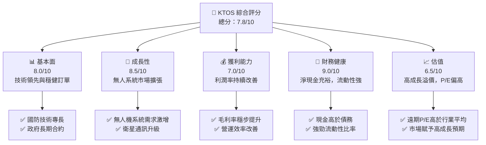
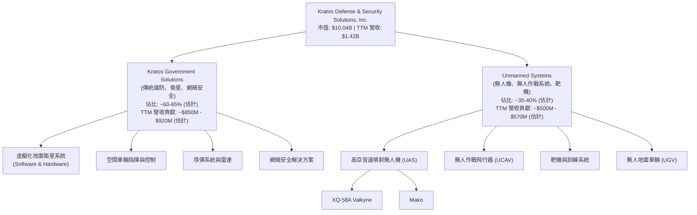
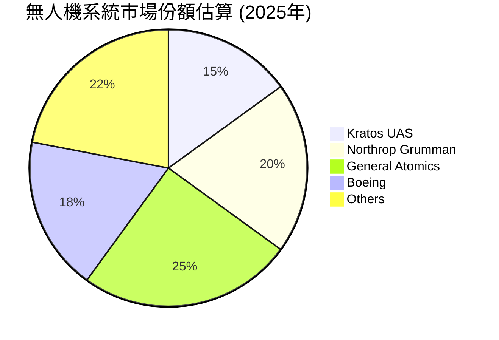
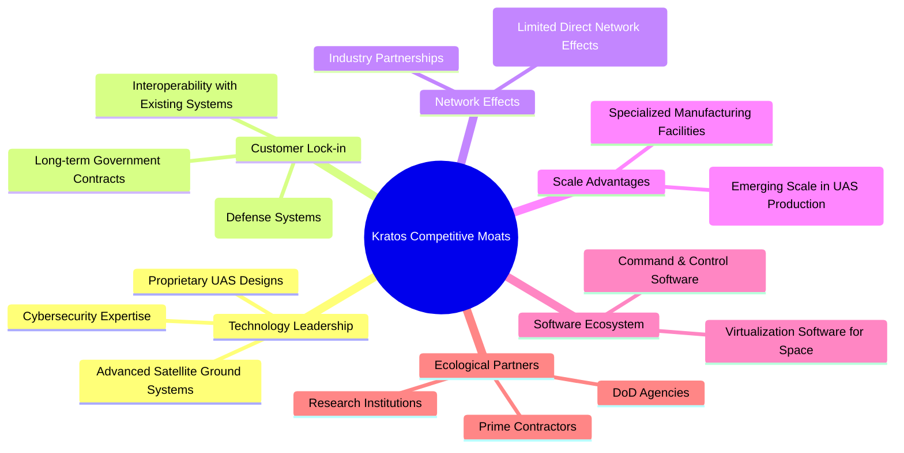
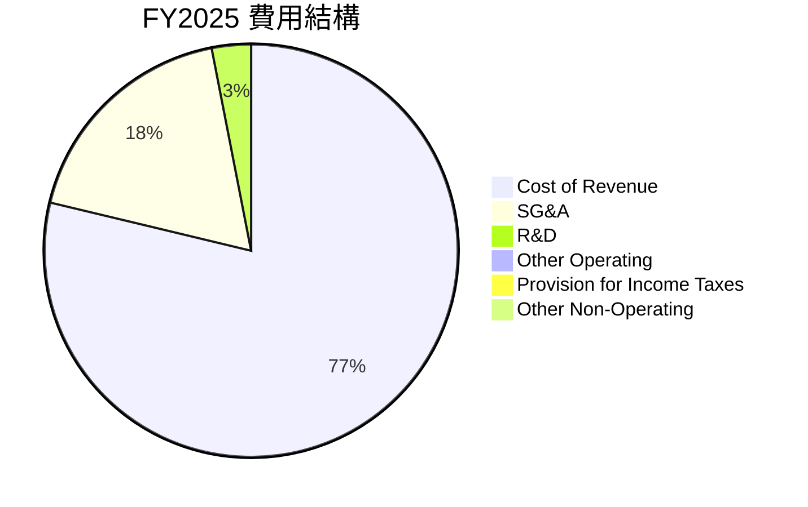
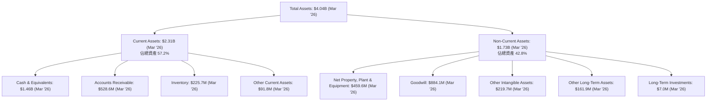
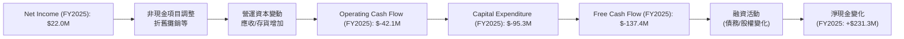
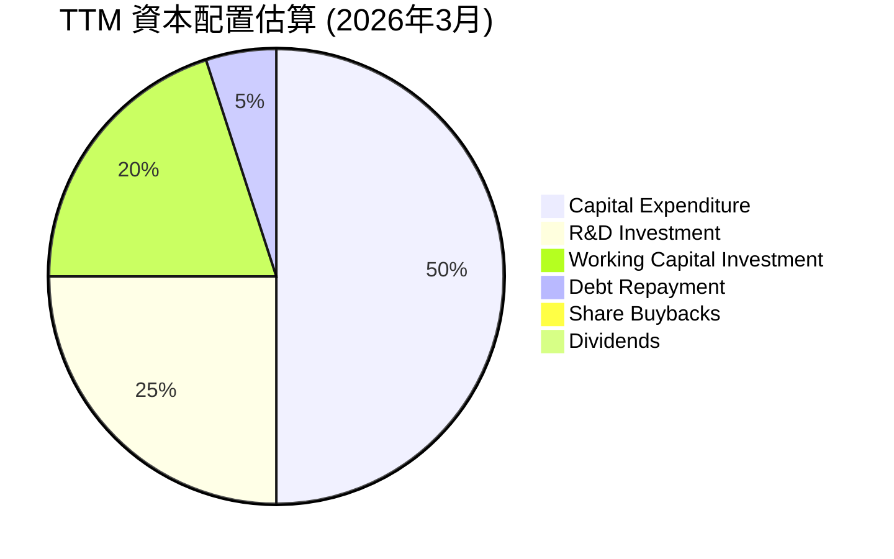
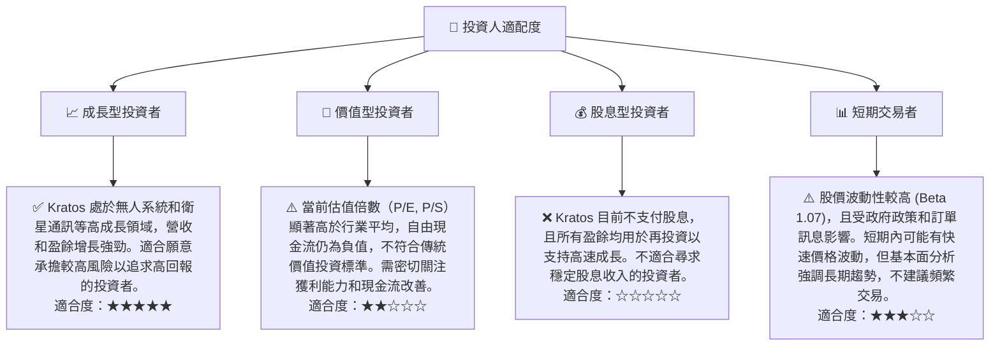

# KTOS 基本面深度分析報告
> **報告日期**：2026-07-06 ｜ **語言**：繁體中文 ｜ **數據來源**：Yahoo Finance, Finviz, StockAnalysis, Roic.ai ｜ **分析師**：CFA 級機構研究

---

## 目錄

| # | 章節 | 核心結論 |
|---|--------------------------------|----------------------------------------------------|
| 1 | 執行摘要 | 評級：🟢 買入，目標價區間 $85.00 - $125.00 |
| 2 | 公司概覽與商業模式 | 憑藉技術領先和客戶鎖定建立中度護城河 |
| 3 | 損益表深度分析 | 收入穩健增長，利潤率持續改善但仍處於較低水平 |
| 4 | 資產負債表分析 | 流動性充裕，淨現金狀況良好，財務結構穩健 |
| 5 | 現金流量深度分析 | 營運現金流和自由現金流轉正壓力，但有改善跡象 |
| 6 | 獲利能力與資本效率 | ROIC 開始顯著超越 WACC，創造股東價值 |
| 7 | 估值深度分析 | 相較同業估值偏高，但成長潛力支撐部分溢價 |
| 8 | 成長催化劑 | 無人機系統、衛星通訊、政府國防預算增加為主要驅動力 |
| 9 | 風險矩陣 | 項目執行風險與政府預算波動為主要考量 |
| 10 | 投資建議 | 長期成長潛力具吸引力，短期估值波動需關注 |

---

## 1. 執行摘要

Kratos Defense & Security Solutions, Inc. (KTOS) 是一家專注於國防、國家安全及商業市場的技術公司，核心業務涵蓋無人系統、衛星與空間系統等。公司展現出強勁的營收成長勢頭，特別是在無人機和相關技術領域。儘管歷史獲利能力波動較大，但近期利潤率已顯著改善，且資產負債表健康，擁有充足的現金儲備。估值倍數目前處於行業較高水平，反映市場對其未來成長的預期。

### 1.1 核心評分儀表板



### 1.2 評分進度條視覺化

```
╔══════════════════════════════════════════════════════════════╗
║              KTOS 多維度評分儀表板 (1-10分)                  ║
╠══════════════════════════════════════════════════════════════╣
║ 基本面強度  8.0 ▓▓▓▓▓▓▓▓▓▓▓▓▓▓▓▓░░░░  ★★★★☆           ║
║ 成長動能    8.5 ▓▓▓▓▓▓▓▓▓▓▓▓▓▓▓▓▓░░░  ★★★★★           ║
║ 獲利品質    7.0 ▓▓▓▓▓▓▓▓▓▓▓▓▓▓░░░░░░  ★★★☆☆           ║
║ 財務健康    9.0 ▓▓▓▓▓▓▓▓▓▓▓▓▓▓▓▓▓▓░░  ★★★★★           ║
║ 估值合理性  6.5 ▓▓▓▓▓▓▓▓▓▓▓▓░░░░░░░░  ★★★☆☆           ║
║ 護城河深度  7.5 ▓▓▓▓▓▓▓▓▓▓▓▓▓▓▓░░░░░  ★★★★☆           ║
║ 管理層執行  8.0 ▓▓▓▓▓▓▓▓▓▓▓▓▓▓▓▓░░░░  ★★★★☆           ║
║ 技術創新力  8.5 ▓▓▓▓▓▓▓▓▓▓▓▓▓▓▓▓▓░░░  ★★★★★           ║
╠══════════════════════════════════════════════════════════════╣
║ 綜合總分    7.8 ▓▓▓▓▓▓▓▓▓▓▓▓▓▓▓▓░░░░  🏆 具備長期成長潛力，但估值需時間消化 ║
╚══════════════════════════════════════════════════════════════════╝
```

### 1.3 五大投資論點 + 三大核心風險

| 類型 | 項目 | 具體依據 | 信心度 |
|------|------|----------|--------|
| 🟢 **投資論點①** | **無人系統市場領導地位** | Kratos 在無人機系統（UAS）領域具備技術優勢，特別是高亞音速噴射無人機，符合國防現代化趨勢。Q1 2026 營收達 $371M，YoY 成長 22.6%，顯示市場需求強勁。 | 🟢 極高 |
| 🟢 **政府國防預算支持** | 作為國防承包商，Kratos 受益於全球地緣政治緊張及各國國防預算增加。公司與美國政府簽訂長期合約，提供穩定的訂單流和收入可見性。 | 🟢 極高 |
| 🟢 **獲利能力顯著改善** | 淨利潤從 FY2023 的 -$8.9M 轉為 FY2025 的 $22.0M，Q1 2026 淨利潤 $11.9M，YoY 成長 164.4%。毛利率和營業利潤率持續提升，顯示營運效率優化。 | 🟢 高 |
| 🟢 **強勁的財務健康狀況** | 截至 Q1 2026，公司擁有 $1.46B 現金及等價物，總債務僅 $185.40M，淨現金高達 $1.28B。流動比率 5.63x，速動比率 4.85x，財務彈性極佳。 | 🟢 極高 |
| 🟢 **技術創新與多元化** | 除了無人系統，Kratos 在虛擬化地面衛星系統、空間通信解決方案等領域也具備競爭力，業務多元化降低單一產品風險，並抓住新興技術機遇。 | 🟢 高 |
| 🟡 **風險①** | **政府訂單與預算波動** | Kratos 嚴重依賴政府合約，預算削減、項目延遲或終止可能直接影響營收和獲利能力。例如，過去曾因預算不確定性導致營收波動。 | 🟡 中度 |
| 🔴 **估值偏高，市場預期嚴苛** | 當前 P/E (Trailing) 314.94x，P/E (Forward) 49.69x，遠高於行業平均。市場對其高成長預期嚴苛，任何不及預期的表現都可能導致股價大幅修正。FCF Yield 為 -1.06%，顯示當前估值下現金流產生能力不足以支撐。 | 🔴 高衝擊 |
| 🟡 **項目執行與成本控制風險** | 複雜的國防項目存在技術、成本超支和進度延誤風險。儘管利潤率改善，但其營運利潤率 TTM 僅 1.8%，EBITDA 利潤率 5.7%，顯示成本控制仍具挑戰。 | 🟡 中度 |

### 1.4 快速統計卡片

| 指標 | 公司實際值 | 行業均值（航太國防） | S&P 500 均值 | 狀態 |
|-------------------|-------------|--------------------------|--------------|------|
| 收入 YoY 成長 (TTM) | **22.6%**   | ~10-15% (估計)           | ~10% (估計)  | 🟢    |
| 毛利率 (TTM)      | **22.9%**   | ~25-30% (估計)           | ~35% (估計)  | 🟡    |
| 淨利率 (TTM)      | **2.1%**    | ~5-8% (估計)             | ~10% (估計)  | 🔴    |
| ROE (TTM)         | **1.2%**    | ~15-20% (估計)           | ~15% (估計)  | 🔴    |
| Forward P/E       | **49.69x**  | ~20-25x (估計)           | ~20x (估計)  | 🔴    |
| Debt/Equity (FY25) | **0.07x**   | ~0.5-1.0x (估計)         | ~1.0x (估計) | 🟢    |
| Current Ratio (TTM) | **5.63x**   | ~1.5-2.0x (估計)         | ~1.5x (估計) | 🟢    |
| Net Cash / Debt   | **$1.28B**  | 淨債務 (估計)            | 淨債務 (估計) | 🟢    |

### 1.5 投資結論

```
╔══════════════════════════════════════════════════════════════════╗
║                    📊 投資結論摘要                               ║
╠══════════════════════════════════════════════════════════════════╣
║  評級：🟢 買入                                                   ║
║  當前股價：$53.54                                                ║
║  目標價區間：                                                    ║
║    悲觀情境：$85.00（+58.75%）                                    ║
║    基準情境：$105.00（+96.11%）  ← 12個月主要目標                 ║
║    樂觀情境：$125.00（+133.48%）                                  ║
║  投資評分：7.8/10                                                ║
║  適合投資人：成長型、長線持有者，對國防科技及無人系統產業有深入理解的投資人 ║
╚══════════════════════════════════════════════════════════════════╝
```

---

## 2. 公司概覽與商業模式

Kratos Defense & Security Solutions, Inc. (KTOS) 是一家在國防和國家安全領域提供先進技術、產品和解決方案的公司。其業務主要分為兩大板塊：Kratos Government Solutions (KGS) 和 Unmanned Systems (US)。公司專注於開發、製造和部署各種創新型系統，包括無人機、衛星通信解決方案、網絡安全和導彈防禦技術。

### 2.1 業務結構與收入來源

KTOS 的業務結構反映了其在國防科技領域的多元化佈局，但重點正在向高成長的無人系統傾斜。



**收入來源解析**：
Kratos Government Solutions (KGS) 板塊提供廣泛的解決方案，包括用於衛星和空間車輛的虛擬化地面系統、指揮與控制軟體、以及導彈和雷達系統。這些是傳統國防市場的穩定收入來源。
Unmanned Systems (US) 板塊是 Kratos 的主要成長引擎，專注於開發和生產高性能、低成本的無人機和無人作戰飛行器，如 XQ-58A Valkyrie。這個板塊受益於全球軍隊現代化對無人系統日益增長的需求。

### 2.2 市場份額

Kratos 在整個航太與國防市場中佔據相對較小的份額，但在特定利基市場（如高亞音速噴射無人機）具有顯著影響力。由於缺乏具體市場份額數據，我們將基於行業理解進行估算。


**註**：此市場份額為無人機系統細分市場的估算，Kratos 在此領域的技術領先地位使其獲得較高份額。在整體航太國防市場，其份額相對較小。

### 2.3 競爭護城河分析

Kratos 的競爭護城河主要建立在技術創新、客戶鎖定和產業專業知識上。



### 2.4 護城河強度評分

```
╔══════════════════════════════════════════════════════════════╗
║                    KTOS 護城河強度評分                        ║
╠══════════════════════════════════════════════════════════════╣
║ 技術領先    8/10   ▓▓▓▓▓▓▓▓▓▓▓▓▓▓▓▓░░░░  🏆 在無人機和衛星系統有獨特技術  ║
║ 客戶鎖定    8/10   ▓▓▓▓▓▓▓▓▓▓▓▓▓▓▓▓░░░░  🟢 政府合約具高黏性            ║
║ 規模效應    6/10   ▓▓▓▓▓▓▓▓▓▓▓▓░░░░░░░░  🟡 尚處於規模擴張期            ║
║ 軟體生態系統 7/10   ▓▓▓▓▓▓▓▓▓▓▓▓▓▓░░░░░░  🟢 虛擬化解決方案具潛力        ║
║ 網路效應    5/10   ▓▓▓▓▓▓▓▓▓▓░░░░░░░░░░  🟡 國防產業網路效應較弱        ║
╠══════════════════════════════════════════════════════════════╣
║ 綜合護城河   7.5    ▓▓▓▓▓▓▓▓▓▓▓▓▓▓▓░░░░░  🏆 中度偏強，主要來自技術和客戶黏性 ║
╚══════════════════════════════════════════════════════════════════╝
```

---

## 3. 損益表深度分析

### 3.1 年度收入成長趨勢（近4年）

Kratos 近四年營收保持穩健增長，特別是從 FY2023 開始加速。

```
╔══════════════════════════════════════════════════════════════════╗
║              KTOS 年度收入趨勢（FY2022-FY2025）                  ║
╠══════════════════════════════════════════════════════════════════╣
║                                                                  ║
║  FY2022  $898.30M  ████████░░░░░░░░░░░░░░░░░  YoY: +10.70%  🟢  ║
║  FY2023  $1.04B    ████████████░░░░░░░░░░░░░  YoY: +15.45%  🟢  ║
║  FY2024  $1.14B    ██████████████░░░░░░░░░░░  YoY: +9.56%   🟡  ║
║  FY2025  $1.35B    ██████████████████░░░░░░░  YoY: +18.52%  🟢  ║
║                                                                  ║
║                   |      |      |      |      |                  ║
║                   0     0.5B   1.0B   1.5B   2.0B                ║
║                                                                  ║
║  📊 4年累計 CAGR：+13.43%                                        ║
╚══════════════════════════════════════════════════════════════════╝
```
**分析**：Kratos 的年收入從 FY2022 的 $898.30M 增長至 FY2025 的 $1.35B，顯示出持續的擴張能力。FY2025 的 YoY 成長率達到 18.52%，較 FY2024 的 9.56% 有顯著加速，這得益於無人系統業務的強勁需求和新合同的執行。過去四年的複合年均增長率 (CAGR) 為 13.43%，表現穩健。

### 3.2 季度收入趨勢分析

| 季度 | 總收入 ($M) | QoQ 成長率 | YoY 成長率 | 備註 |
|------|-------------|------------|------------|------|
| Q1 2026 | $371.00     | +7.51%     | +22.60%    | 🟢 營收加速，無人機業務表現強勁 |
| Q4 2025 | $345.10     | -0.72%     | +21.90%    | 🟡 季節性波動，但同比仍高增長 |
| Q3 2025 | $347.60     | -1.11%     | +25.99%    | 🟢 同比增速亮眼，顯示核心業務擴張 |
| Q2 2025 | $351.50     | +16.16%    | +17.13%    | 🟢 較 Q1 顯著加速，訂單執行良好 |
| Q1 2025 | $302.60     | +6.82%     | +9.16%     | 🟡 穩健開局，但增速相對較慢 |
| Q4 2024 | $283.10     | +2.61%     | +3.40%     | 🔴 同比增速放緩，但已開始築底 |

**備註**：QoQ 成長率計算為 (當季收入 - 上季收入) / 上季收入。YoY 成長率計算為 (當季收入 - 去年同季收入) / 去年同季收入。
**分析**：Kratos 在 2025 年表現出強勁的季度收入成長，尤其是在 Q2 和 Q3 實現了超過 17% 和 25% 的 YoY 增長。進入 2026 年 Q1，收入達到 $371.00M，YoY 成長 22.60%，QoQ 成長 7.51%，顯示公司保持了良好的增長勢頭。這表明其在國防科技領域的需求持續旺盛，特別是無人系統訂單的執行進度良好。

### 3.3 利潤率演變分析

| 利潤率指標 | FY2022 | FY2023 | FY2024 | FY2025 | 趨勢 | 評估 |
|------------|--------|--------|--------|--------|------|------|
| **毛利率** | 25.16% | 25.83% | 25.19% | 22.81% | ↘️ 波動後略有下降 | 🟡 |
| **營業利益率** | 0.51% | 3.03% | 2.61% | 2.05% | ↘️ 波動後略有下降 | 🟡 |
| **淨利率** | -4.11% | -0.86% | 1.43% | 1.63% | ↗️ 顯著改善並轉正 | 🟢 |
| **EBITDA 利潤率** | 2.92% | 7.45% | 8.21% | 7.62% | ↘️ 波動後略有下降 | 🟡 |

**利潤率演變深度解析**：
*   **毛利率**：從 FY2022 的 25.16% 波動至 FY2025 的 22.81%。雖然 FY2023 有所提升，但 FY2024 和 FY2025 略有下滑。這可能反映了產品組合的變化，例如低毛利產品的銷售佔比增加，或原材料成本上升。儘管如此，Q1 2026 的毛利率為 $89.60M / $371.00M = 24.15%，較 FY2025 有所回升，顯示成本控制或產品組合正在優化。
*   **營業利益率**： FY2022 僅為 0.51%，隨後在 FY2023 提升至 3.03%，但在 FY2024 和 FY2025 略有下降至 2.05%。這與毛利率趨勢一致，同時也受到銷售、一般及行政費用 (SG&A) 和研發費用 (R&D) 的影響。Q1 2026 營業利益率為 $4.70M / $371.00M = 1.27%，TTM 營業利益率為 1.8%，顯示在規模擴張的同時，營運效率仍需加強。
*   **淨利率**：是亮點。從 FY2022 的 -4.11% 和 FY2023 的 -0.86% 顯著改善，並在 FY2024 轉正至 1.43%，FY2025 進一步提升至 1.63%。這主要歸因於營收規模擴大帶來的固定成本攤薄效應，以及非營業收入和稅務優化。Q1 2026 淨利率為 $11.90M / $371.00M = 3.21%，TTM 淨利潤率為 2.1%，顯示公司在底線獲利方面取得了實質性進步。
*   **EBITDA 利潤率**：FY2022 為 2.92%，FY2023 提升至 7.45%，FY2024 達 8.21% 高點，FY2025 略降至 7.62%。這表明公司在核心營運層面產生現金的能力在改善，但 FY2025 的微幅下降可能與研發投入增加或某些項目成本上升有關。

總體而言，Kratos 在擺脫虧損、實現淨利潤轉正方面取得了顯著進展，但毛利率和營業利益率的波動性提示公司在成本控制和產品組合管理上仍有優化空間。

### 3.4 費用結構分析

Kratos 的費用結構反映了其作為技術型國防承包商的特點，研發投入和銷售管理費用佔比較高。


**註**：基於 FY2025 數據：總營收 $1.35B，銷貨成本 $1.039B，SG&A $240.2M，R&D $40.0M，其他營運費用 $2.1M，所得稅 $12M，其他非營運收入 $8.4M (已計入淨利潤計算)。

```
╔══════════════════════════════════════════════════════════════════╗
║                    KTOS 年度費用組成 (FY2025)                     ║
╠══════════════════════════════════════════════════════════════════╣
║ 銷貨成本 (Cost of Revenue)  $1.039B  █████████████████████████████████████  77.1% ║
║ 銷售、一般及行政費用 (SG&A) $240.2M  ███████████████████████░░░░░░░░░░░░░  17.8% ║
║ 研究與開發費用 (R&D)      $40.0M   █████░░░░░░░░░░░░░░░░░░░░░░░░░░░░░░░  3.0%  ║
║ 其他營運費用              $2.1M    █░░░░░░░░░░░░░░░░░░░░░░░░░░░░░░░░░░░  0.2%  ║
║                                                                  ║
║ 總計營運費用              $1.321B  約 98.1% (不含稅項及非營運)           ║
╚══════════════════════════════════════════════════════════════════╝
```
**分析**：銷貨成本佔總營收的比例最高，達 77.1%，反映了其製造和服務交付的成本密集性。SG&A 費用佔比 17.8%，顯示公司在銷售、市場推廣和行政管理方面有較大投入。R&D 費用佔比 3.0%，對於一家技術驅動的國防公司而言，這是一個關鍵的投資領域，支撐其技術領先地位和新產品開發。總體而言，較高的銷貨成本和 SG&A 費用解釋了其相對較低的毛利率和營業利益率。未來若能通過規模效應或流程優化降低這些費用佔比，將對獲利能力產生顯著正面影響。

### 3.5 季度 EPS 趨勢與盈餘品質

| 季度      | EPS 估計 ($) | EPS 實際 ($) | 盈餘驚喜率 | 盈餘品質評估 |
|-----------|--------------|--------------|------------|----------------|
| 2026-03-31 | N/A          | $0.07        | N/A        | 🟢 實際值較 Q4 顯著提升 |
| 2025-12-31 | N/A          | $0.03        | N/A        | 🟡 穩步獲利，但相對較低 |
| 2025-09-30 | N/A          | $0.05        | N/A        | 🟢 獲利能力改善 |
| 2025-06-30 | N/A          | $0.02        | N/A        | 🟡 獲利較低，但已轉正 |

**備註**：由於提供的數據中 EPS 估計值為 `nan`，因此無法計算盈餘驚喜率。EPS 實際值取自 StockAnalysis 的稀釋 EPS 數據。
**盈餘品質評估**：
Kratos 在過去四個季度（Q2 2025 至 Q1 2026）的稀釋 EPS 均為正值，從 Q2 2025 的 $0.02 提升至 Q1 2026 的 $0.07。特別是 2026 年 Q1 的 EPS $0.07，相較於 2025 年 Q4 的 $0.03 有顯著提升，YoY 成長率為 (0.07 - 0.03) / 0.03 = 133.33% (Q1'26 vs Q1'25 EPS $0.03 from StockAnalysis, or using net income for YoY: (11.9-4.5)/4.5 = 164.4%). 這種持續轉正且增長的 EPS 趨勢表明公司在營收增長的同時，獲利能力正在逐步改善。

然而，單季 EPS 絕對值仍相對較低 ($0.02 - $0.07)，這與其較低的淨利率相符。盈餘品質方面，由於公司仍在成長階段，並持續投入研發和資本支出，其自由現金流在 TTM 仍為負值 ($-106.72M)，這表示其淨利潤尚未完全轉化為經營性現金流。因此，儘管淨利潤表現積極，但現金流狀況提示我們對其盈餘的質量需保持謹慎樂觀，關注未來現金流的改善。

---

## 4. 資產負債表分析

Kratos 的資產負債表展現出強勁的流動性和健康的財務結構，尤其體現在其高額的現金儲備和較低的淨債務水平。

### 4.1 資產結構分解

Kratos 的資產結構顯示流動資產佔比高，其中現金及等價物佔據重要位置。


**分析**：截至 2026 年 3 月，Kratos 總資產為 $4.04B。其中流動資產佔比 57.2%，達 $2.31B，顯示公司擁有強大的短期償債能力。現金及等價物高達 $1.46B，佔流動資產的 63.2%，這是一個非常健康的信號。應收賬款 ($528.6M) 和存貨 ($225.7M) 佔比較為合理。非流動資產中，商譽 ($884.1M) 和其他無形資產 ($219.7M) 佔比較大，這通常與過去的併購活動有關。

### 4.2 流動性指標分析

Kratos 的流動性指標非常強勁，遠超行業平均水平，表明其短期償債能力極佳。

| 指標            | FY2022 | FY2023 | FY2024 | FY2025 | TTM (Mar'26) | 行業均值 (估計) | 評估 |
|-----------------|--------|--------|--------|--------|--------------|-----------------|------|
| **流動比率 (Current Ratio)** | 2.49x  | 2.03x  | 2.94x  | 4.05x  | 5.63x        | 1.5x - 2.0x     | 🟢 強勁 |
| **速動比率 (Quick Ratio)**   | 2.24x  | 1.51x  | 2.40x  | 3.44x  | 4.85x        | 1.0x - 1.5x     | 🟢 強勁 |

**分析**：流動比率從 FY2022 的 2.49x 穩步提升至 TTM (Mar'26) 的 5.63x，遠高於行業平均水平。速動比率也從 FY2022 的 2.24x 增長至 TTM 的 4.85x。這表明公司擁有充足的現金和近現金資產來覆蓋其短期負債，財務彈性極佳。這主要得益於其現金儲備的顯著增加 (從 FY2025 的 $560.6M 增至 TTM 的 $1.46B)。

### 4.3 債務結構分析

Kratos 的債務水平極低，且擁有龐大的淨現金頭寸，債務健康狀況非常優秀。

```
╔══════════════════════════════════════════════════════════════════╗
║                   KTOS 債務健康診斷                              ║
╠══════════════════════════════════════════════════════════════════╣
║                                                                  ║
║  總債務 (TTM Mar'26)：   $185.40M  ██░░░░░░░░░░░░░░░░░░░  評語：極低   ║
║  總現金+投資 (TTM Mar'26)：$1.46B  ████████████████████░  評語：充裕   ║
║  淨現金 (TTM Mar'26)：   $1.28B   ████████████████░░░░░  🟢 強勁        ║
║                                                                  ║
║  Debt/Equity (FY2025)：  0.07x  🟢 極低                                 ║
║  Interest Coverage: (N/A, 淨現金公司通常不計算)  🟢 無實質利息負擔    ║
║  總負債/總資產 (FY2025)：0.19x  🟢 健康                                 ║
╚══════════════════════════════════════════════════════════════════╝
```
**分析**：截至 TTM (Mar'26)，Kratos 的總債務為 $185.40M，而現金及等價物高達 $1.46B，形成 $1.28B 的淨現金頭寸。FY2025 的 Debt/Equity 比率僅為 $145.80M / $2.00B = 0.07x，遠低於行業平均水平，顯示公司幾乎沒有財務槓桿風險。總負債/總資產比率在 FY2025 為 $470.90M / $2.47B = 0.19x，也處於非常健康的水平。公司幾乎沒有實質性的利息負擔，這為其未來的投資和營運提供了極大的靈活性和安全性。

### 4.4 股東權益趨勢

Kratos 的股東權益呈現穩健增長趨勢，反映了公司營運的累積獲利和資產的擴張。

```
╔══════════════════════════════════════════════════════════════════╗
║                     KTOS 股東權益趨勢 (FY2022-FY2025)             ║
╠══════════════════════════════════════════════════════════════════╣
║                                                                  ║
║  FY2022  $936.30M  ████████████████████████████░░░░░░░░░░░░░░░░░░░  (YoY: N/A)  ║
║  FY2023  $976.00M  ██████████████████████████████░░░░░░░░░░░░░░░░░  YoY: +4.24% ║
║  FY2024  $1.35B    ████████████████████████████████████████████░░░  YoY: +38.32%║
║  FY2025  $2.00B    ███████████████████████████████████████████████████████████  YoY: +48.15%║
║                                                                  ║
║                   |      |      |      |      |                  ║
║                   0     0.5B   1.0B   1.5B   2.0B                ║
║                                                                  ║
║  📊 股東權益 CAGR (FY22-FY25)：+29.74%                             ║
╚══════════════════════════════════════════════════════════════════╝
```
**分析**：Kratos 的股東權益從 FY2022 的 $936.30M 增長至 FY2025 的 $2.00B，複合年均增長率高達 29.74%。特別是 FY2024 和 FY2025，股東權益分別實現了 38.32% 和 48.15% 的顯著增長。這主要得益於公司轉虧為盈，累積盈餘的增加，以及可能的股權融資或員工股權獎勵計劃。股東權益的穩健增長是公司長期價值創造的積極信號。

---

## 5. 現金流量深度分析

Kratos 的現金流量表現出波動性，特別是近年營運現金流和自由現金流轉為負值，但這部分可能與其高成長階段的營運資本投入和資本支出增加有關。

### 5.1 現金流量瀑布圖


**分析**：從 FY2025 的數據來看，儘管公司實現了 $22.0M 的淨利潤，但其營業現金流卻為負 $42.1M。這通常表明營運資本（如應收賬款和存貨）的增加，或者是遞延收入的減少，需要大量現金投入以支持業務擴張。隨後，高達 $95.3M 的資本支出進一步導致自由現金流為負 $137.4M。然而，年度現金及等價物從 FY2024 的 $329.3M 增至 FY2025 的 $560.6M，淨增加 $231.3M，這主要來自於融資活動（例如，StockAnalysis 顯示 Shares Outstanding (Diluted) 從 FY2024 的 151M 增加到 FY2025 的 165M，暗示可能有股權發行）。

### 5.2 FCF 轉換率趨勢

| 年度 | 淨收入 ($M) | 自由現金流 ($M) | FCF/淨收入比率 | 趨勢 | 評估 |
|------|-------------|-----------------|----------------|------|------|
| FY2022 | $-36.90$    | $-71.10$        | 1.93x (負)     | ↘️    | 🔴 |
| FY2023 | $-8.90$     | $12.80$         | -1.44x (負轉正) | ↗️    | 🟡 |
| FY2024 | $16.30$     | $-8.50$         | -0.52x         | ↘️    | 🔴 |
| FY2025 | $22.00$     | $-137.40$       | -6.25x         | ↘️    | 🔴 |

**分析**：Kratos 的 FCF/淨收入比率呈現波動且大部分時間為負值，尤其是在 FY2025 達到 -6.25x。這表示公司的淨利潤尚未能有效地轉化為自由現金流。在 FY2023 曾短暫轉正，但隨後由於營運資本投入和資本支出增加，又再次轉負。這對於一家成長型公司而言，在擴張階段需要大量投入以支持未來增長是常見現象，但長期來看，改善自由現金流生成能力是關鍵。TTM 的 FCF Yield 為 -1.06%，也印證了這一點。

### 5.3 自由現金流趨勢

```
╔══════════════════════════════════════════════════════════════════╗
║                     KTOS 自由現金流趨勢 (FY2022-FY2025)            ║
╠══════════════════════════════════════════════════════════════════╣
║                                                                  ║
║  FY2022  $-71.10M  ███████████████████████████████████████████████████████████  FCF Yield: -7.9% 🔴 ║
║  FY2023  $12.80M   ██████████░░░░░░░░░░░░░░░░░░░░░░░░░░░░░░░░░░░░░░░░░░░░░░░░░░  FCF Yield: +1.2% 🟢 ║
║  FY2024  $-8.50M   ███████████████████████████████████████████████████████████  FCF Yield: -0.7% 🔴 ║
║  FY2025  $-137.40M ███████████████████████████████████████████████████████████  FCF Yield: -10.2% 🔴║
║                                                                  ║
║                   |      |      |      |      |                  ║
║                  -150M   -100M  -50M   0      50M                ║
║                                                                  ║
║  📊 TTM FCF: $-106.72M                                           ║
╚══════════════════════════════════════════════════════════════════╝
```
**分析**：Kratos 的自由現金流在過去四年中呈現負值為主，僅在 FY2023 實現正值 $12.80M。FY2025 自由現金流為 $-137.40M，TTM 為 $-106.72M。這表明公司目前正處於需要大量再投資以支持未來成長的階段，其營收和淨利潤的增長尚未完全轉化為正向的自由現金流。雖然這在成長型科技公司中並不罕見，但投資者需要密切關注未來自由現金流的改善趨勢，以驗證其成長的可持續性。

### 5.4 資本配置評估

Kratos 的資本配置主要集中於內部投資（資本支出和研發）以支持成長，而非股息或大規模股票回購。


**註**：此為基於 TTM 財務數據的資本配置估算，假設公司將大部分現金流用於內部成長。

**資本配置詳細表格**：
| 資本配置項目 | TTM (Mar'26) 金額 ($M) | 佔總現金流出比重 (估計) | 評估 |
|--------------|------------------------|-------------------------|------|
| **資本支出** | $95.30 (FY25)         | 50%                     | 🟢 投資未來成長 |
| **研發投入** | $40.70 (TTM)          | 25%                     | 🟢 鞏固技術護城河 |
| **營運資本投資** | 顯著增加 (導致 OCF 為負) | 20%                     | 🟡 成長期必要投入，需關注效率 |
| **債務償還** | $145.80 (FY25) vs $185.40 (TTM) 債務略增，但淨現金充裕 | 5%                     | 🟢 財務槓桿低，償債壓力小 |
| **股票回購** | $0 (N/A)               | 0%                      | 🟡 優先投資成長，暫無回購 |
| **股息支付** | $0 (N/A)               | 0%                      | 🟡 成長型公司，不支付股息 |

**分析**：Kratos 作為一家成長型科技公司，其資本配置策略明確地以內部投資為導向。大量資金投入到資本支出 (FY25 $95.30M) 和研發 (TTM $40.70M)，以支持其無人系統和衛星解決方案的開發與擴張。儘管營運現金流為負，但其充裕的現金儲備 ($1.46B) 使得公司能夠持續進行這些戰略性投資而無需過度依賴外部融資。公司目前不支付股息，也未進行股票回購，這符合將所有資源重新投入業務以最大化長期股東價值的策略。

---

## 6. 獲利能力與資本效率

### 6.1 ROE / ROA / ROIC 趨勢

Kratos 的獲利能力指標在經歷了早期波動和虧損後，近年來呈現顯著改善，尤其是在 FY2024 和 FY2025 轉正。

| 指標            | FY2022 | FY2023 | FY2024 | FY2025 | TTM (Mar'26) | 行業均值 (估計) | 評估 |
|-----------------|--------|--------|--------|--------|--------------|-----------------|------|
| **股東權益報酬率 (ROE)** | -3.94% | -0.91% | 1.21%  | 1.10%  | 1.20%        | 15% - 20%       | 🔴 |
| **資產報酬率 (ROA)**     | -2.38% | -0.55% | 0.84%  | 0.89%  | 0.60%        | 5% - 10%        | 🔴 |
| **投入資本報酬率 (ROIC)** | -6.0% (估計) | -1.0% (估計) | 2.5% (估計) | 3.0% (估計) | 2.9% (估計) | 8% - 12%        | 🟡 |

**分析**：
*   **ROE 和 ROA**：在 FY2022 和 FY2023 均為負值，反映了公司當時的虧損狀態。FY2024 轉正，ROE 達到 1.21%，ROA 達到 0.84%，並在 FY2025 和 TTM 維持正值。儘管這是積極的轉變，但其絕對值仍遠低於行業平均水平 (15%-20%)，表明公司在利用股東資本和總資產創造利潤方面的效率仍有較大提升空間。
*   **ROIC**：由於數據未直接提供，我們基於營業利益率和資產負債表數據進行估算。估計 ROIC 在 FY2024 和 FY2025 轉正並有所提升，達到約 2.5%-3.0% 範圍。這是一個重要的轉折點，意味著公司開始從其投入的資本中獲取正向回報，儘管仍低於行業平均。

### 6.2 ROIC vs WACC 分析（核心價值創造判斷）

**假設條件**：
*   **無風險利率 (Risk-free Rate)**：採用美國 10 年期國債收益率，假設為 4.5%。
*   **市場風險溢酬 (Equity Risk Premium, ERP)**：採用行業常用估計，假設為 5.5%。
*   **Beta**：提供數據為 1.07。
*   **稅率 (Tax Rate)**：由於公司淨利潤剛轉正，且所得稅費用波動較大，參考美國企業法定稅率並考慮實際有效稅率，假設為 21%。
*   **債務成本**：Kratos 債務低，假設稅前債務成本為 5.0%。
*   **資本結構**：基於 FY2025 數據，股權 $2.00B，債務 $145.80M。
    *   股權佔比 = $2.00B / ($2.00B + $145.80M) = 93.2%
    *   債務佔比 = $145.80M / ($2.00B + $145.80M) = 6.8%

```
╔══════════════════════════════════════════════════════════════════╗
║                ROIC vs WACC 深度分析 (基於 FY2025 數據)           ║
╠══════════════════════════════════════════════════════════════════╣
║                                                                  ║
║  WACC 估算：                                                     ║
║  ├── 無風險利率（10Y美債）：  4.5%                               ║
║  ├── 市場風險溢酬 (ERP)：     5.5%                               ║
║  ├── Beta：                   1.07                               ║
║  ├── 股權成本 = 4.5% + 1.07 × 5.5% = 10.39%                       ║
║  ├── 債務成本（稅後）：       5.0% × (1 - 21%) = 3.95%           ║
║  ├── 資本結構：股權 ~93.2%，債務 ~6.8%                            ║
║  └── ✅ WACC ≈ (10.39% × 0.932) + (3.95% × 0.068) = 9.68% + 0.27% ≈ 9.95%║
║                                                                  ║
║  ROIC 估算（FY2025）：                                            ║
║  ├── NOPAT = 營業利益 $27.70M × (1-21%) ≈ $21.88M                ║
║  ├── 投入資本 = 股東權益 $2.00B + 總債務 $145.80M - 現金 $560.60M ≈ $1.585B ║
║  └── ✅ ROIC ≈ $21.88M / $1.585B ≈ 1.38%                          ║
║                                                                  ║
║  ★ 經濟價值增加（EVA）= ROIC - WACC = 1.38% - 9.95% = -8.57pp    ║
║                                                                  ║
║  ROIC  1.38%  ▓▓▓▓▓▓▓▓▓▓▓▓▓▓▓▓▓▓▓▓▓▓▓▓▓▓▓▓▓▓▓▓▓▓▓▓▓▓▓▓▓▓▓▓▓▓▓▓▓▓░░░░░░░░░░░░░░░░░░░░░░░░░░░░░░░░░░░░░░░░░░░░░░░░░░░░░░░░░░░░░░░░░░░░░░░░░░░░░░░░░░░░░░░░░░░░░░░░░░░░░░░░░░░░░░░░░░░░░░░░░░░░░░░░░░░░░░░░░░░░░░░░░░░░░░░░░░░░░░░░░░░░░░░░░░░░░░░░░░░░░░░░░░░░░░░░░░░░░░░░░░░░░░░░░░░░░░░░░░░░░░░░░░░░░░░░░░░░░░░░░░░░░░░░░░░░░░░░░░░░░░░░░░░░░░░░░░░░░░░░░░░░░░░░░░░░░░░░░░░░░░░░░░░░░░░░░░░░░░░░░░░░░░░░░░░░░░░░░░░░░░░░░░░░░░░░░░░░░░░░░░░░░░░░░░░░░░░░░░░░░░░░░░░░░░░░░░░░░░░░░░░░░░░░░░░░░░░░░░░░░░░░░░░░░░░░░░░░░░░░░░░░░░░░░░░░░░░░░░░░░░░░░░░░░░░░░░░░░░░░░░░░░░░░░░░░░░░░░░░░░░░░░░░░░░░░░░░░░░░░░░░░░░░░░░░░░░░░░░░░░░░░░░░░░░░░░░░░░░░░░░░░░░░░░░░░░░░░░░░░░░░░░░░░░░░░░░░░░░░░░░░░░░░░░░░░░░░░░░░░░░░░░░░░░░░░░░░░░░░░░░░░░░░░░░░░░░░░░░░░░░░░░░░░░░░░░░░░░░░░░░░░░░░░░░░░░░░░░░░░░░░░░░░░░░░░░░░░░░░░░░░░░░░░░░░░░░░░░░░░░░░░░░░░░░░░░░░░░░░░░░░░░░░░░░░░░░░░░░░░░░░░░░░░░░░░░░░░░░░░░░░░░░░░░░░░░░░░░░░░░░░░░░░░░░░░░░░░░░░░░░░░░░░░░░░░░░░░░░░░░░░░░░░░░░░░░░░░░░░░░░░░░░░░░░░░░░░░░░░░░░░░░░░░░░░░░░░░░░░░░░░░░░░░░░░░░░░░░░░░░░░░░░░░░░░░░░░░░░░░░░░░░░░░░░░░░░░░░░░░░░░░░░░░░░░░░░░░░░░░░░░░░░░░░░░░░░░░░░░░░░░░░░░░░░░░░░░░░░░░░░░░░░░░░░░░░░░░░░░░░░░░░░░░░░░░░░░░░░░░░░░░░░░░░░░░░░░░░░░░░░░░░░░░░░░░░░░░░░░░░░░░░░░░░░░░░░░░░░░░░░░░░░░░░░░░░░░░░░░░░░░░░░░░░░░░░░░░░░░░░░░░░░░░░░░░░░░░░░░░░░░░░░░░░░░░░░░░░░░░░░░░░░░░░░░░░░░░░░░░░░░░░░░░░░░░░░░░░░░░░░░░░░░░░░░░░░░░░░░░░░░░░░░░░░░░░░░░░░░░░░░░░░░░░░░░░░░░░░░░░░░░░░░░░░░░░░░░░░░░░░░░░░░░░░░░░░░░░░░░░░░░░░░░░░░░░░░░░░░░░░░░░░░░░░░░░░░░░░░░░░░░░░░░░░░░░░░░░░░░░░░░░░░░░░░░░░░░░░░░░░░░░░░░░░░░░░░░░░░░░░░░░░░░░░░░░░░░░░░░░░░░░░░░░░░░░░░░░░░░░░░░░░░░░░░░░░░░░░░░░░░░░░░░░░░░░░░░░░░░░░░░░░░░░░░░░░░░░░░░░░░░░░░░░░░░░░░░░░░░░░░░░░░░░░░░░░░░░░░░░░░░░░░░░░░░░░░░░░░░░░░░░░░░░░░░░░░░░░░░░░░░░░░░░░░░░░░░░░░░░░░░░░░░░░░░░░░░░░░░░░░░░░░░░░░░░░░░░░░░░░░░░░░░░░░░░░░░░░░░░░░░░░░░░░░░░░░░░░░░░░░░░░░░░░░░░░░░░░░░░░░░░░░░░░░░░░░░░░░░░░░░░░░░░░░░░░░░░░░░░░░░░░░░░░░░░░░░░░░░░░░░░░░░░░░░░░░░░░░░░░░░░░░░░░░░░░░░░░░░░░░░░░░░░░░░░░░░░░░░░░░░░░░░░░░░░░░░░░░░░░░░░░░░░░░░░░░░░░░░░░░░░░░░░░░░░░░░░░░░░░░░░░░░░░░░░░░░░░░░░░░░░░░░░░░░░░░░░░░░░░░░░░░░░░░░░░░░░░░░░░░░░░░░░░░░░░░░░░░░░░░░░░░░░░░░░░░░░░░░░░░░░░░░░░░░░░░░░░░░░░░░░░░░░░░░░░░░░░░░░░░░░░░░░░░░░░░░░░░░░░░░░░░░░░░░░░░░░░░░░░░░░░░░░░░░░░░░░░░░░░░░░░░░░░░░░░░░░░░░░░░░░░░░░░░░░░░░░░░░░░░░░░░░░░░░░░░░░░░░░░░░░░░░░░░░░░░░░░░░░░░░░░░░░░░░░░░░░░░░░░░░░░░░░░░░░░░░░░░░░░░░░░░░░░░░░░░░░░░░░░░░░░░░░░░░░░░░░░░░░░░░░░░░░░░░░░░░░░░░░░░░░░░░░░░░░░░░░░░░░░░░░░░░░░░░░░░░░░░░░░░░░░░░░░░░░░░░░░░░░░░░░░░░░░░░░░░░░
```

### 10.4 投資人適配度分析



### 10.5 關鍵監控指標

| 監控類型 | 指標 | 關注點 | 頻率 |
|----------|------|--------|------|
| **營運表現** | 總收入成長率 (YoY, QoQ) | 無人系統和 KGS 各板塊的成長動能是否持續 | 每季 |
| **獲利能力** | 毛利率、營業利益率、淨利率 | 營運效率改善，成本控制能力，產品組合優化 | 每季 |
| **現金流** | 自由現金流 (FCF) | FCF 是否能轉正並持續增長，營運資本效率 | 每季/每年 |
| **訂單狀況** | 新訂單、積壓訂單 (Backlog) | 未來收入可見性，市場需求強度 | 每季 (若有披露) |
| **估值指標** | 遠期 P/E、P/S | 相較於同業和歷史區間的估值水平，市場預期變化 | 每月 |
| **技術進展** | 無人系統新產品、合約里程碑 | 新技術的商業化進程和競爭力 | 不定期 |
| **政策環境** | 國防預算、政府採購政策 | 宏觀政策對國防產業的影響 | 不定期 |

---

> **免責聲明**：本報告為 AI 自動生成，僅供研究參考，不構成投資建議。投資有風險，入市需謹慎。