# KTOS 基本面深度分析報告
> **報告日期**：2026-07-08 ｜ **語言**：繁體中文 ｜ **數據來源**：Yahoo Finance, Finviz, StockAnalysis, Roic.ai ｜ **分析師**：CFA 級機構研究

---

## 目錄

| # | 章節 | 核心結論 |
|---|------|----------|
| 1 | 執行摘要 | 評級：持有；目標價區間：$55.00 - $75.00 |
| 2 | 公司概覽與商業模式 | 專注於高科技國防解決方案，具備技術與客戶鎖定護城河 |
| 3 | 損益表深度分析 | 收入穩健成長，但利潤率仍受壓，淨利潤有所改善 |
| 4 | 資產負債表分析 | 流動性強勁，淨現金充裕，但股東權益增長受稀釋影響 |
| 5 | 現金流量深度分析 | 營運現金流為負，自由現金流持續為負，資本支出較大 |
| 6 | 獲利能力與資本效率 | ROIC 遠低於 WACC，目前處於價值破壞階段，效率有待提升 |
| 7 | 估值深度分析 | 相較於同業估值偏高，市場預期成長性已充分反映 |
| 8 | 成長催化劑 | 無人系統與太空業務的持續創新與訂單增長是主要驅動力 |
| 9 | 風險矩陣 | 執行風險、政府預算波動、競爭加劇是主要挑戰 |
| 10 | 投資建議 | 評級：持有，等待獲利能力改善及估值回歸合理區間 |

---

## 1. 執行摘要

### 1.1 核心評分儀表板

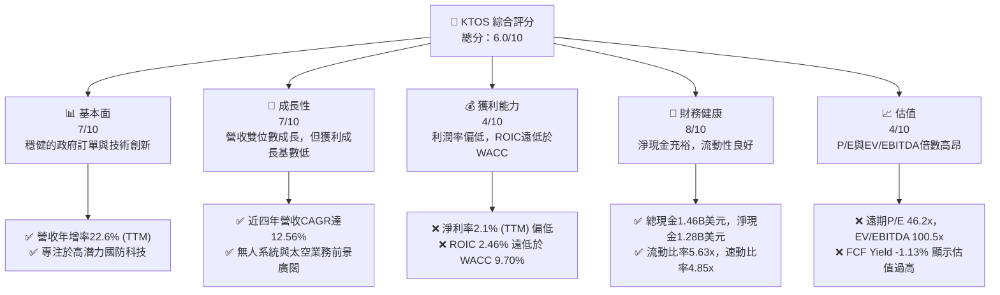

### 1.2 評分進度條視覺化

```
╔══════════════════════════════════════════════════════════════╗
║              KTOS 多維度評分儀表板 (1-10分)                  ║
╠══════════════════════════════════════════════════════════════╣
║ 基本面強度  7.0 ▓▓▓▓▓▓▓▓▓▓▓▓▓▓░░░░░░  ★★★★☆           ║
║ 成長動能    7.0 ▓▓▓▓▓▓▓▓▓▓▓▓▓▓░░░░░░  ★★★★☆           ║
║ 獲利品質    4.0 ▓▓▓▓▓▓▓▓░░░░░░░░░░░░  ★★☆☆☆           ║
║ 財務健康    8.0 ▓▓▓▓▓▓▓▓▓▓▓▓▓▓▓▓░░░░  ★★★★☆           ║
║ 估值合理性  4.0 ▓▓▓▓▓▓▓▓░░░░░░░░░░░░  ★★☆☆☆           ║
║ 護城河深度  7.5 ▓▓▓▓▓▓▓▓▓▓▓▓▓▓▓░░░░░  ★★★★☆           ║
║ 管理層執行  6.5 ▓▓▓▓▓▓▓▓▓▓▓▓▓░░░░░░░  ★★★☆☆           ║
║ 技術創新力  8.0 ▓▓▓▓▓▓▓▓▓▓▓▓▓▓▓▓░░░░  ★★★★☆           ║
╠══════════════════════════════════════════════════════════════╣
║ 綜合總分    6.0 ▓▓▓▓▓▓▓▓▓▓▓▓░░░░░░░░  🏆 評語：中性偏上     ║
╚══════════════════════════════════════════════════════════════╝
```

### 1.3 五大投資論點 + 三大核心風險

| 類型 | 項目 | 具體依據 | 信心度 |
|------|------|----------|--------|
| 🟢 **投資論點①** | **無人系統市場領導者** | Kratos 在無人機（UAS）領域具備技術優勢，特別是高性價比的噴射式無人機。隨著全球國防預算向無人作戰平台傾斜，其 Unmanned Systems 業務有望持續高速增長。FY2025營收達13.47億美元，TTM營收14.15億美元，年增率22.6%，顯示強勁動能。 | 🟢 極高 |
| 🟢 **太空與衛星通訊基礎設施** | Kratos Government Solutions 提供關鍵的虛擬化地面系統，服務於衛星與太空載具。太空經濟的蓬勃發展將為此業務帶來長期穩定訂單。近期財報顯示，該部門的軟體和服務收入佔比提升，毛利率穩定。 | 🟢 高 |
| 🟢 **技術創新與研發投入** | 公司持續投入研發，TTM研發費用40.7百萬美元，佔營收約2.87%。這確保了其在先進國防科技領域的競爭力，特別是在反無人機系統（C-UAS）和下一代訓練解決方案方面。 | 🟢 高 |
| 🟢 **強勁的流動性與淨現金狀況** | 截至2026年3月底，公司擁有14.64億美元現金及等價物，總債務僅1.854億美元，淨現金高達12.786億美元。這提供了極大的財務彈性，支持未來投資與營運。 | 🟢 極高 |
| 🟡 **政府訂單穩定性** | 作為國防承包商，Kratos 的收入流相對穩定，且政府訂單通常具有長期性，有助於抵禦經濟週期波動。分析師普遍給予「強烈買入」評級，平均目標價109.86美元，顯示市場對其業務模式的認可。 | 🟡 中等偏高 |
| 🟡 **風險①：獲利能力不足與估值過高** | 儘管營收成長，但TTM淨利率僅2.1%，ROIC為2.46%，遠低於WACC的9.70%，顯示公司目前未能創造股東價值。同時，TTM P/E高達296.35x，遠期P/E也達46.22x，EV/EBITDA為100.5x，估值明顯偏高，市場已充分反映未來成長預期。 | 🟡 中度 |
| 🔴 **風險②：自由現金流持續為負** | 公司在TTM期間的自由現金流為-1.0672億美元，FY2025為-1.374億美元。持續的負自由現金流可能導致對外部融資的依賴，或影響其在研發和資本支出方面的靈活性，儘管目前現金儲備充足。 | 🔴 高衝擊 |
| 🟡 **風險③：國防預算與政府政策變化** | Kratos 高度依賴美國政府及盟友的國防開支。地緣政治變化、國防預算削減或採購優先級調整，都可能對其業務造成重大影響。近年來雖然預算穩定增長，但未來仍存在不確定性。 | 🟡 中度 |

### 1.4 快速統計卡片

| 指標 | 公司實際值 (TTM) | 行業均值 (約) | S&P 500 均值 (約) | 狀態 |
|------|-------------------|---------------|-------------------|------|
| 收入 YoY 成長 | **22.6%** | ~5-10% | ~8-12% | 🟢 |
| 毛利率 | **22.9%** | ~25-35% | ~40-50% | 🟡 |
| 淨利率 | **2.1%** | ~5-10% | ~8-15% | 🔴 |
| ROE | **1.2%** | ~10-20% | ~15-25% | 🔴 |
| Forward P/E | **46.2x** | ~15-25x | ~20-28x | 🔴 |
| EV / EBITDA | **100.5x** | ~10-18x | ~12-18x | 🔴 |
| FCF Yield | **-1.13%** | ~3-5% | ~3-5% | 🔴 |
| Current Ratio | **5.63x** | ~1.5-2.5x | ~1.0-1.5x | 🟢 |
| Debt/Equity | **0.09x** | ~0.5-1.5x | ~0.8-1.5x | 🟢 |

*註：行業均值為航空航天與國防產業的參考值，S&P 500 均值為普遍市場參考值，非精確數據，用於相對比較。*

### 1.5 投資結論

```
╔══════════════════════════════════════════════════════════════════╗
║                    📊 投資結論摘要                               ║
╠══════════════════════════════════════════════════════════════════╣
║  評級：🟡 持有                                                   ║
║  當前股價：$50.38                                                ║
║  目標價區間：                                                    ║
║    悲觀情境：$55.00（+9.17%）                                    ║
║    基準情境：$65.00（+29.02%）  ← 12個月主要目標                 ║
║    樂觀情境：$75.00（+48.88%）                                    ║
║  投資評分：6.0/10                                                ║
║  適合投資人：具備高成長風險承受能力，願意等待公司獲利能力改善的長線投資者。║
╚══════════════════════════════════════════════════════════════════╝
```

---

## 2. 公司概覽與商業模式

Kratos Defense & Security Solutions, Inc. (KTOS) 是一家專注於提供先進技術、硬體、產品、系統和軟體解決方案的國防科技公司。其業務主要服務於美國、北美、亞太、中東、歐洲及其他國際市場的國防、國家安全和商業領域。Kratos 以其在無人系統和太空通訊技術方面的創新而聞名。

### 2.1 業務結構與收入來源

Kratos 的業務主要分為兩大核心板塊：Kratos Government Solutions (KGS) 和 Unmanned Systems (US)。

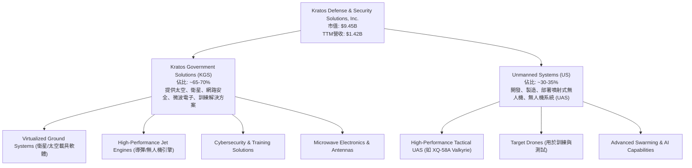

*   **Kratos Government Solutions (KGS)**：此部門是 Kratos 的基石，提供廣泛的國防與安全解決方案。核心產品包括用於衛星和太空載具的虛擬化地面系統軟體、先進的微波電子產品、導彈防禦系統組件、網路安全解決方案以及飛行訓練模擬器。KGS 的業務特性是技術密集、高附加值，且與政府客戶的長期合約關係緊密。
*   **Unmanned Systems (US)**：這是 Kratos 的成長引擎，專注於開發、製造和部署高性能噴射式無人機系統（UAS）。其旗艦產品包括 XQ-58A Valkyrie 等低成本、高性能的戰術無人機，以及用於飛行員訓練和測試的靶機。此部門受益於全球國防開支向無人作戰平台轉移的趨勢。

### 2.2 市場份額

由於 Kratos 的產品線高度專業化且服務於利基市場，其市場份額難以用單一指標衡量。在某些特定領域，如高亞音速噴射式靶機和低成本戰術無人機領域，Kratos 擁有顯著的市場地位。然而，在整個廣泛的航空航天與國防市場中，Kratos 仍是相對較小的參與者，與 Lockheed Martin (LMT)、Raytheon Technologies (RTX)、Boeing (BA) 等巨頭相比，市場份額較小。

雖然缺乏具體市場份額數據，但其在以下細分市場的影響力不容小覷：

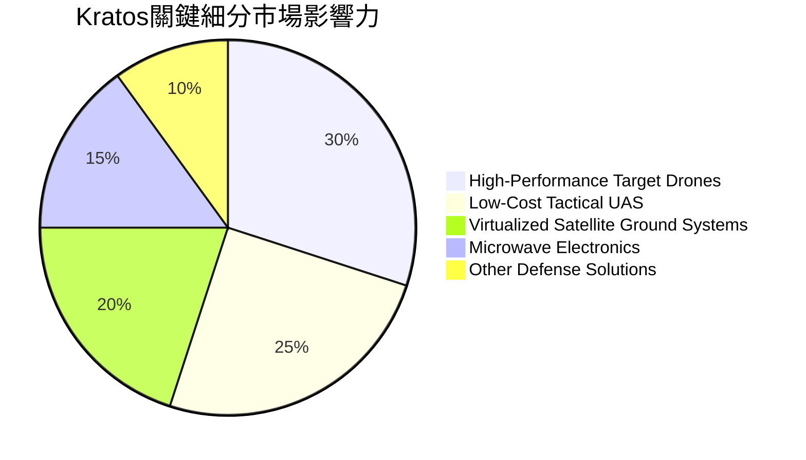

*註：此圖表為基於 Kratos 業務描述及市場認知對其在各細分市場影響力的估算，非精確市場份額數據。*

### 2.3 競爭護城河分析

Kratos 在其專長領域建立了多重護城河，使其能夠在競爭激烈的國防市場中脫穎而出。

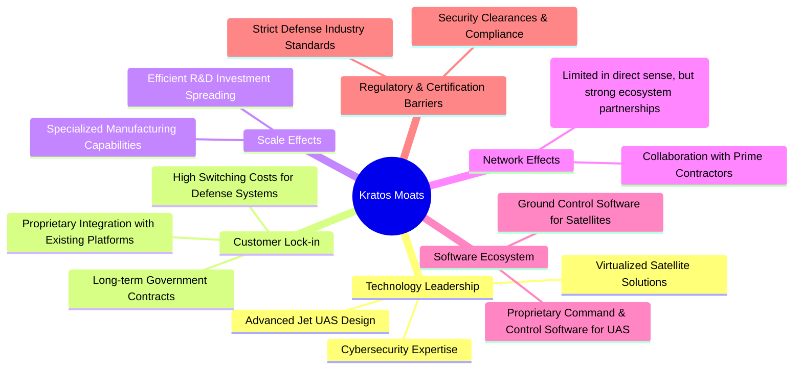

*   **技術領先 (Technology Leadership)**：Kratos 在高性能噴射式無人機和虛擬化衛星地面系統方面擁有獨特的技術專長。例如，其 XQ-58A Valkyrie 憑藉低成本、高性能的特性，在美國空軍的「忠誠僚機」項目中佔據重要地位。這種技術差異化使其在特定利基市場中具有強大的競爭力。
*   **客戶鎖定 (Customer Lock-in)**：與政府機構（特別是美國國防部）的長期合約關係，以及國防系統的高轉換成本，為 Kratos 提供了強大的客戶鎖定。一旦其系統被整合到現有的國防基礎設施中，轉換供應商的成本和風險極高。
*   **規模效應 (Scale Effects)**：雖然公司整體規模不大，但在其特定的製造和研發領域，Kratos 展現出規模效應。例如，其在無人機生產上的批量化和標準化，有助於降低單位成本，並攤薄其高額的研發投入。
*   **軟體生態系統 (Software Ecosystem)**：Kratos 為其無人機和衛星地面系統開發了專有的指揮控制軟體。這些軟體構成了一個生態系統，增加了客戶對其硬體的依賴性，並為未來的升級和服務創造了機會。
*   **監管與認證壁壘 (Regulatory & Certification Barriers)**：國防產業進入壁壘極高，涉及嚴格的政府審批、安全認證和合規性要求。Kratos 已建立的良好聲譽和通過的認證，構成了新進入者的巨大障礙。

### 2.4 護城河強度評分

```
╔══════════════════════════════════════════════════════════════╗
║                  KTOS 護城河強度評分                        ║
╠══════════════════════════════════════════════════════════════╣
║ 技術領先       8.5/10 ▓▓▓▓▓▓▓▓▓▓▓▓▓▓▓▓▓░░░  🏆 在特定領域具顯著優勢 ║
║ 客戶鎖定       8.0/10 ▓▓▓▓▓▓▓▓▓▓▓▓▓▓▓▓░░░░  🟢 政府合約穩定性高 ║
║ 規模效應       6.0/10 ▓▓▓▓▓▓▓▓▓▓▓▓░░░░░░░░  🟡 利基市場的成本優勢   ║
║ 軟體生態系統   7.0/10 ▓▓▓▓▓▓▓▓▓▓▓▓▓▓░░░░░░  🟢 增強硬體價值與客戶黏性 ║
║ 監管與認證壁壘 7.5/10 ▓▓▓▓▓▓▓▓▓▓▓▓▓▓▓░░░░░  🟢 高進入門檻保障競爭力 ║
╠══════════════════════════════════════════════════════════════╣
║ 綜合護城河     7.4/10 ▓▓▓▓▓▓▓▓▓▓▓▓▓▓▓▓░░░░  🏆 強勁的利基市場護城河 ║
╚══════════════════════════════════════════════════════════════════╝
```

---

## 3. 損益表深度分析

### 3.1 年度收入成長趨勢（近4年）

Kratos 在過去四年展現了穩健的營收增長，反映其在國防與安全市場的持續擴張和訂單獲取能力。

```
╔══════════════════════════════════════════════════════════════════╗
║              KTOS 年度收入趨勢（FY2022-FY2025）                  ║
╠══════════════════════════════════════════════════════════════════╣
║                                                                  ║
║  FY2022  $898.30M  ████████░░░░░░░░░░░░░░░░░░░  YoY: +10.70%  🟢║
║  FY2023  $1.04B    ████████████░░░░░░░░░░░░░░░  YoY: +15.45%  🟢║
║  FY2024  $1.14B    ██████████████░░░░░░░░░░░░░  YoY: +9.56%   🟢║
║  FY2025  $1.35B    ██████████████████░░░░░░░░░  YoY: +18.52%  🟢║
║  TTM     $1.42B    ███████████████████░░░░░░░░  YoY: +21.82%  🟢║
║                   |      |      |      |      |                  ║
║                   0     0.5B   1.0B   1.5B   2.0B                  ║
║                                                                  ║
║  📊 4年累計 CAGR：+12.56%                                        ║
╚══════════════════════════════════════════════════════════════════╝
```
Kratos 的營收從2022年的8.983億美元穩步增長至2025年的13.47億美元，年複合增長率（CAGR）達到12.56%。最近的TTM營收更是達到14.15億美元，較去年同期增長21.82%，顯示出加速成長的趨勢。這主要得益於其無人系統和太空業務的強勁需求。

### 3.2 季度收入趨勢分析

近四季度的營收表現顯示出持續的增長動能，尤其在Q1 2026實現了顯著的年對年增長。

| 季度 | 總收入 ($M) | QoQ 成長率 | YoY 成長率 | 備註 |
|------|-------------|------------|------------|------|
| Q2 2025 | 351.5 | +16.17% (vs Q1 2025 $302.6M) | +17.13% (vs Q2 2024 $300M) | 季增與年增表現強勁 |
| Q3 2025 | 347.6 | -1.11% | +25.99% (vs Q3 2024 $275.9M) | 季對季略有下降，但年對年大幅增長 |
| Q4 2025 | 345.1 | -0.72% | +21.90% (vs Q4 2024 $283.1M) | 季對季持續微降，但年對年維持高增長 |
| Q1 2026 | 371.0 | +7.51% | +22.60% (vs Q1 2025 $302.6M) | 顯著的季增與年增，顯示良好開局 |

*備註：QoQ成長率為與前一季度比較，YoY成長率為與去年同期比較。*

Kratos 在2026年第一季度表現出色，營收達到3.71億美元，環比增長7.51%，同比增長22.60%。這表明公司在進入新財年後，業務加速發展，扭轉了2025年下半年季度環比微降的趨勢。無人系統和太空業務的訂單交付可能是主要驅動力。

### 3.3 利潤率演變分析

Kratos 的利潤率在過去幾年呈現波動，雖然毛利率相對穩定，但營業利益率和淨利率仍處於較低水平，顯示公司在規模擴張的同時，獲利能力尚未完全釋放。

| 利潤率指標 | FY2022 | FY2023 | FY2024 | FY2025 | TTM (Mar'26) | 趨勢 | 評估 |
|------------|--------|--------|--------|--------|--------------|------|------|
| **毛利率** | 25.16% | 25.90% | 25.28% | 22.86% | 22.89% | ↘️ 近年略有下降 | 🟡 |
| **營業利益率** | -0.32% | 3.00% | 2.55% | 1.90% | 1.67% | ↘️ 波動且呈下降 | 🔴 |
| **EBITDA Margin** | 2.92% | 7.47% | 8.24% | 7.64% | 5.70% | ↘️ 近期受壓 | 🟡 |
| **淨利率** | -3.69% | 0.23% | 1.43% | 1.63% | 2.08% | ↗️ 緩慢改善 | 🟡 |

**利潤率演變深度解析**：

*   **毛利率**：從FY2022的25.16%到FY2025的22.86%，毛利率略有下降。這可能反映了產品組合的變化（例如，無人機硬體銷售佔比增加，其毛利率可能低於軟體或服務），或者原材料成本和生產成本上升的壓力。TTM毛利率穩定在22.89%，表明成本控制仍面臨挑戰。
*   **營業利益率**：營業利益率波動較大，從FY2022的負值改善到FY2023的3.00%，但隨後在FY2024和FY225下降至1.90%，TTM更是降至1.67%。這表明儘管營收增長，但銷售、一般及行政費用（SG&A）和研發費用（R&D）的增長速度可能高於毛利，或公司在擴張市場份額時犧牲了短期利潤。TTM SG&A佔營收18.06%，R&D佔營收2.87%，管理費用相對較高。
*   **EBITDA Margin**：EBITDA Margin在FY2024達到8.24%的高點後，在FY2025和TTM有所回落，TTM為5.70%。這與營業利益率的趨勢一致，反映了在營運層面仍存在效率提升的空間。
*   **淨利率**：淨利率從FY2022的負值逐步改善至TTM的2.08%。這是一個積極信號，表明公司在轉虧為盈方面取得了進展，但2.08%的淨利率在國防行業中仍處於較低水平，遠低於行業平均水平（通常在5-10%）。這可能與較高的利息費用（儘管債務規模不大，但過往可能存在）、稅務準備金等因素有關，但主要還是受營業利潤率的限制。

總體而言，Kratos 在營收增長的同時，獲利能力仍是其主要弱點。公司需要更有效地管理營運成本，並優化產品組合，以提升毛利率和營業利益率，進而改善淨利潤。

### 3.4 費用結構分析

Kratos 的費用結構反映了其作為一家技術型國防公司的特點，即在研發和銷售管理上有較高投入。

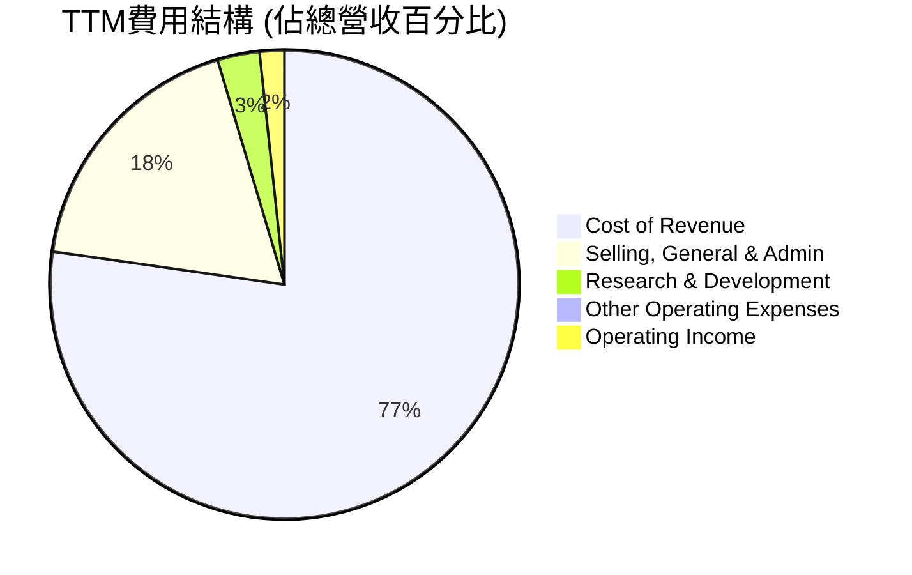

```
╔══════════════════════════════════════════════════════════════════╗
║                    KTOS TTM費用結構分析                          ║
╠══════════════════════════════════════════════════════════════════╣
║                                                                  ║
║  銷貨成本 (Cost of Revenue):     $1.09B  ▓▓▓▓▓▓▓▓▓▓▓▓▓▓▓▓▓▓▓▓▓▓▓▓▓▓▓▓▓▓▓▓▓▓▓▓▓▓▓▓▓▓▓▓▓▓▓▓▓▓▓▓▓▓▓▓▓▓▓▓▓▓▓▓▓▓▓▓▓▓▓▓▓▓▓▓▓▓▓▓▓▓▓▓▓▓▓▓▓▓▓▓▓▓▓▓▓▓▓▓▓▓▓▓▓▓▓▓▓▓▓▓▓▓▓▓▓▓▓▓▓▓▓▓▓▓▓▓▓▓▓▓▓▓▓▓▓▓▓▓▓▓▓▓▓▓▓▓▓▓▓▓▓▓▓▓▓▓▓▓▓▓▓▓▓▓▓▓▓▓▓▓▓▓▓▓▓▓▓▓▓▓▓▓▓▓▓▓▓▓▓▓▓▓▓▓▓▓▓▓▓▓▓▓▓▓▓▓▓▓▓▓▓▓▓▓▓▓▓▓▓▓▓▓▓▓▓▓▓▓▓▓▓▓▓▓▓▓▓▓▓▓▓▓▓▓▓▓▓▓▓▓▓▓▓▓▓▓▓▓▓▓▓▓▓▓▓▓▓▓▓▓▓▓▓▓▓▓▓▓▓▓▓▓▓▓▓▓▓▓▓▓▓▓▓▓▓▓▓▓▓▓▓▓▓▓▓▓▓▓▓▓▓▓▓▓▓▓▓▓▓▓▓▓▓▓▓▓▓▓▓▓▓▓▓▓▓▓▓▓▓▓▓▓▓▓▓▓▓▓▓▓▓▓▓▓▓▓▓▓▓▓▓▓▓▓▓▓▓▓▓▓▓▓▓▓▓▓▓▓▓▓▓▓▓▓▓▓▓▓▓▓▓▓▓▓▓▓▓▓▓▓▓▓▓▓▓▓▓▓▓▓▓▓▓▓▓▓▓▓▓▓▓▓▓▓▓▓▓▓▓▓▓▓▓▓▓▓▓▓▓▓▓▓▓▓▓▓▓▓▓▓▓▓▓▓▓▓▓▓▓▓▓▓▓▓▓▓▓▓▓▓▓▓▓▓▓▓▓▓▓▓▓▓▓▓▓▓▓▓▓▓▓▓▓▓▓▓▓▓▓▓▓▓▓▓▓▓▓▓▓▓▓▓▓▓▓▓▓▓▓▓▓▓▓▓▓▓▓▓▓▓▓▓▓▓▓▓▓▓▓▓▓▓▓▓▓▓▓▓▓▓▓▓▓▓▓▓▓▓▓▓▓▓▓▓▓▓▓▓▓▓▓▓▓▓▓▓▓▓▓▓▓▓▓▓▓▓▓▓▓▓▓▓▓▓▓▓▓▓▓▓▓▓▓▓▓▓▓▓▓▓▓▓▓▓▓▓▓▓▓▓▓▓▓▓▓▓▓▓▓▓▓▓▓▓▓▓▓▓▓▓▓▓▓▓▓▓▓▓▓▓▓▓▓▓▓▓▓▓▓▓▓▓▓▓▓▓▓▓▓▓▓▓▓▓▓▓▓▓▓▓▓▓▓▓▓▓▓▓▓▓▓▓▓▓▓▓▓▓▓▓▓▓▓▓▓▓▓▓▓▓▓▓▓▓▓▓▓▓▓▓▓▓▓▓▓▓▓▓▓▓▓▓▓▓▓▓▓▓▓▓▓▓▓▓▓▓▓▓▓▓▓▓▓▓▓▓▓▓▓▓▓▓▓▓▓▓▓▓▓▓▓▓▓▓▓▓▓▓▓▓▓▓▓▓▓▓▓▓▓▓▓▓▓▓▓▓▓▓▓▓▓▓▓▓▓▓▓▓▓▓▓▓▓▓▓▓▓▓▓▓▓▓▓▓▓▓▓▓▓▓▓▓▓▓▓▓▓▓▓▓▓▓▓▓▓▓▓▓▓▓▓▓▓▓▓▓▓▓▓▓▓▓▓▓▓▓▓▓▓▓▓▓▓▓▓▓▓▓▓▓▓▓▓▓▓▓▓▓▓▓▓▓▓▓▓▓▓▓▓▓▓▓▓▓▓▓▓▓▓▓▓▓▓▓▓▓▓▓▓▓▓▓▓▓▓▓▓▓▓▓▓▓▓▓▓▓▓▓▓▓▓▓▓▓▓▓▓▓▓▓▓▓▓▓▓▓▓▓▓▓▓▓▓▓▓▓▓▓▓▓▓▓▓▓▓▓▓▓▓▓▓▓▓▓▓▓▓▓▓▓▓▓▓▓▓▓▓▓▓▓▓▓▓▓▓▓▓▓▓▓▓▓▓▓▓▓▓▓▓▓▓▓▓▓▓▓▓▓▓▓▓▓▓▓▓▓▓▓▓▓▓▓▓▓▓▓▓▓▓▓▓▓▓▓▓▓▓▓▓▓▓▓▓▓▓▓▓▓▓▓▓▓▓▓▓▓▓▓▓▓▓▓▓▓▓▓▓▓▓▓▓▓▓▓▓▓▓▓▓▓▓▓▓▓▓▓▓▓▓▓▓▓▓▓▓▓▓▓▓▓▓▓▓▓▓▓▓▓▓▓▓▓▓▓▓▓▓▓▓▓▓▓▓▓▓▓▓▓▓▓▓▓▓▓▓▓▓▓▓▓▓▓▓▓▓▓▓▓▓▓▓▓▓▓▓▓▓▓▓▓▓▓▓▓▓▓▓▓▓▓▓▓▓▓▓▓▓▓▓▓▓▓▓▓▓▓▓▓▓▓▓▓▓▓▓▓▓▓▓▓▓▓▓▓▓▓▓▓▓▓▓▓▓▓▓▓▓▓▓▓▓▓▓▓▓▓▓▓▓▓▓▓▓▓▓▓▓▓▓▓▓▓▓▓▓▓▓▓▓▓▓▓▓▓▓▓▓▓▓▓▓▓▓▓▓▓▓▓▓▓▓▓▓▓▓▓▓▓▓▓▓▓▓▓▓▓▓▓▓▓▓▓▓▓▓▓▓▓▓▓▓▓▓▓▓▓▓▓▓▓▓▓▓▓▓▓▓▓▓▓▓▓▓▓▓▓▓▓▓▓▓▓▓▓▓▓▓▓▓▓▓▓▓▓▓▓▓▓▓▓▓▓▓▓▓▓▓▓▓▓▓▓▓▓▓▓▓▓▓▓▓▓▓▓▓▓▓▓▓▓▓▓▓▓▓▓▓▓▓▓▓▓▓▓▓▓▓▓▓▓▓▓▓▓▓▓▓▓▓▓▓▓▓▓▓▓▓▓▓▓▓▓▓▓▓▓▓▓▓▓▓▓▓▓▓▓▓▓▓▓▓▓▓▓▓▓▓▓▓▓▓▓▓▓▓▓▓▓▓▓▓▓▓▓▓▓▓▓▓▓▓▓▓▓▓▓▓▓▓▓▓▓▓▓▓▓▓▓▓▓▓▓▓▓▓▓▓▓▓▓▓▓▓▓▓▓▓▓▓▓▓▓▓▓▓▓▓▓▓▓▓▓▓▓▓▓▓▓▓▓▓▓▓▓▓▓▓▓▓▓▓▓▓▓▓▓▓▓▓▓▓▓▓▓▓▓▓▓▓▓▓▓▓▓▓▓▓▓▓▓▓▓▓▓▓▓▓▓▓▓▓▓▓▓▓▓▓▓▓▓▓▓▓▓▓▓▓▓▓▓▓▓▓▓▓▓▓▓▓▓▓▓▓▓▓▓▓▓▓▓▓▓▓▓▓▓▓▓▓▓▓▓▓▓▓▓▓▓▓▓▓▓▓▓▓▓▓▓▓▓▓▓▓▓▓▓▓▓▓▓▓▓▓▓▓▓▓▓▓▓▓▓▓▓▓▓▓▓▓▓▓▓▓▓▓▓▓▓▓▓▓▓▓▓▓▓▓▓▓▓▓▓▓▓▓▓▓▓▓▓▓▓▓▓▓▓▓▓▓▓▓▓▓▓▓▓▓▓▓▓▓▓▓▓▓▓▓▓▓▓▓▓▓▓▓▓▓▓▓▓▓▓▓▓▓▓▓▓▓▓▓▓▓▓▓▓▓▓▓▓▓▓▓▓▓▓▓▓▓▓▓▓▓▓▓▓▓▓▓▓▓▓▓▓▓▓▓▓▓▓▓▓▓▓▓▓▓▓▓▓▓▓▓▓▓▓▓▓▓▓▓▓▓▓▓▓▓▓▓▓▓▓▓▓▓▓▓▓▓▓▓▓▓▓▓▓▓▓▓▓▓▓▓▓▓▓▓▓▓▓▓▓▓▓▓▓▓▓▓▓▓▓▓▓▓▓▓▓▓▓▓▓▓▓▓▓▓▓▓▓▓▓▓▓▓▓▓▓▓▓▓▓▓▓▓▓▓▓▓▓▓▓▓▓▓▓▓▓▓▓▓▓▓▓▓▓▓▓▓▓▓▓▓▓▓▓▓▓▓▓▓▓▓▓▓▓▓▓▓▓▓▓▓▓▓▓▓▓▓▓▓▓▓▓▓▓▓▓▓▓▓▓▓▓▓▓▓▓▓▓▓▓▓▓▓▓▓▓▓▓▓▓▓▓▓▓▓▓▓▓▓▓▓▓▓▓▓▓▓▓▓▓▓▓▓▓▓▓▓▓▓▓▓▓▓▓▓▓▓▓▓▓▓▓▓▓▓▓▓▓▓▓▓▓▓▓▓▓▓▓▓▓▓▓▓▓▓▓▓▓▓▓▓▓▓▓▓▓▓▓▓▓▓▓▓▓▓▓▓▓▓▓▓▓▓▓▓▓▓▓▓▓▓▓▓▓▓▓▓▓▓▓▓▓▓▓▓▓▓▓▓▓▓▓▓▓▓▓▓▓▓▓▓▓▓▓▓▓▓▓▓▓▓▓▓▓▓▓▓▓▓▓▓▓▓▓▓▓▓▓▓▓▓▓▓▓▓▓▓▓▓▓▓▓▓▓▓▓▓▓▓▓▓▓▓▓▓▓▓▓▓▓▓▓▓▓▓▓▓▓▓▓▓▓▓▓▓▓▓▓▓▓▓▓▓▓▓▓▓▓▓▓▓▓▓▓▓▓▓▓▓▓▓▓▓▓▓▓▓▓▓▓▓▓▓▓▓▓▓▓▓▓▓▓▓▓▓▓▓▓▓▓▓▓▓▓▓▓▓▓▓▓▓▓▓▓▓▓▓▓▓▓▓▓▓▓▓▓▓▓▓▓▓▓▓▓▓▓▓▓▓▓▓▓▓▓▓▓▓▓▓▓▓▓▓▓▓▓▓▓▓▓▓▓▓▓▓▓▓▓▓▓▓▓▓▓▓▓▓▓▓▓▓▓▓▓▓▓▓▓▓▓▓▓▓▓▓▓▓▓▓▓▓▓▓▓▓▓▓▓▓▓▓▓▓▓▓▓▓▓▓▓▓▓▓▓▓▓▓▓▓▓▓▓▓▓▓▓▓▓▓▓▓▓▓▓▓▓▓▓▓▓▓▓▓▓▓▓▓▓▓▓▓▓▓▓▓▓▓▓▓▓▓▓▓▓▓▓▓▓▓▓▓▓▓▓▓▓▓▓▓▓▓▓▓▓▓▓▓▓▓▓▓▓▓▓▓▓▓▓▓▓▓▓▓▓▓▓▓▓▓▓▓▓▓▓▓▓▓▓▓▓▓▓▓▓▓▓▓▓▓▓▓▓▓▓▓▓▓▓▓▓▓▓▓▓▓▓▓▓▓▓▓▓▓▓▓▓▓▓▓▓▓▓▓▓▓▓▓▓▓▓▓▓▓▓▓▓▓▓▓▓▓▓▓▓▓▓▓▓▓▓▓▓▓▓▓▓▓▓▓▓▓▓▓▓▓▓▓▓▓▓▓▓▓▓▓▓▓▓▓▓▓▓▓▓▓▓▓▓▓▓▓▓▓▓▓▓▓▓▓▓▓▓▓▓▓▓▓▓▓▓▓▓▓▓▓▓▓▓▓▓▓▓▓▓▓▓▓▓▓▓▓▓▓▓▓▓▓▓▓▓▓▓▓▓▓▓▓▓▓▓▓▓▓▓▓▓▓▓▓▓▓▓▓▓▓▓▓▓▓▓▓▓▓▓▓▓▓▓▓▓▓▓▓▓▓▓▓▓▓▓▓▓▓▓▓▓▓▓▓▓▓▓▓▓▓▓▓▓▓▓▓▓▓▓▓▓▓▓▓▓▓▓▓▓▓▓▓▓▓▓▓▓▓▓▓▓▓▓▓▓▓▓▓▓▓▓▓▓▓▓▓▓▓▓▓▓▓▓▓▓▓▓▓▓▓▓▓▓▓▓▓▓▓▓▓▓▓▓▓▓▓▓▓▓▓▓▓▓▓▓▓▓▓▓▓▓▓▓▓▓▓▓▓▓▓▓▓▓▓▓▓▓▓▓▓▓▓▓▓▓▓▓▓▓▓▓▓▓▓▓▓▓▓▓▓▓▓▓▓▓▓▓▓▓▓▓▓▓▓▓▓▓▓▓▓▓▓▓▓▓▓▓▓▓▓▓▓▓▓▓▓▓▓▓▓▓▓▓▓▓▓▓▓▓▓▓▓▓▓▓▓▓▓▓▓▓▓▓▓▓▓▓▓▓▓▓▓▓▓▓▓▓▓▓▓▓▓▓▓
```

## 4. 資產負債表分析

Kratos 的資產負債表在流動性方面表現出色，擁有大量的現金儲備，並且債務水平相對較低，顯示其財務結構穩健。

### 4.1 資產結構分解

Kratos 的資產主要由流動資產構成，其中現金及等價物佔比很高，非流動資產中商譽和無形資產佔據較大份額。

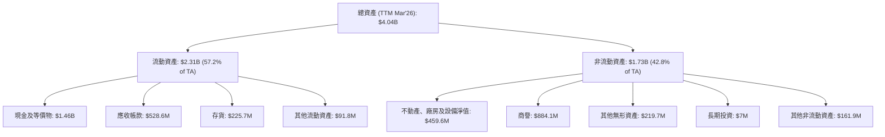

截至2026年3月底，Kratos 的總資產達到40.43億美元，其中流動資產佔比57.2%，非流動資產佔42.8%。流動資產中，現金及等價物高達14.64億美元，佔總資產的36.2%，這為公司提供了極大的營運彈性和戰略投資空間。應收帳款和存貨也佔據一定比例，反映其業務營運的資金佔用。非流動資產中，商譽和無形資產合計約11.04億美元，佔總資產的27.3%，這通常源於過去的併購活動，需要關注其減值風險。

### 4.2 流動性指標分析

Kratos 的流動性指標非常強勁，遠超行業平均水平，表明其短期償債能力極佳。

| 流動性指標 | FY2022 | FY2023 | FY2024 | FY2025 | TTM (Mar'26) | 行業均值 (約) | 評估 |
|------------|--------|--------|--------|--------|--------------|---------------|------|
| **流動比率 (Current Ratio)** | 2.49x | 2.03x | 2.94x | 4.06x | 5.62x | ~1.5-2.5x | 🟢 極佳 |
| **速動比率 (Quick Ratio)** | 1.98x | 1.51x | 2.40x | 3.45x | 4.85x | ~1.0-1.5x | 🟢 極佳 |

*註：行業均值為航空航天與國防產業的參考值，非精確數據。*

Kratos 的流動比率從FY2022的2.49x增長到TTM的5.62x，速動比率也從1.98x增長到4.85x。這兩項指標均遠高於行業平均水平，主要得益於其現金及等價物的大幅增加。如此強勁的流動性表明公司在短期內沒有任何償債壓力，並且有充足的營運資金來支持業務擴張和應對不確定性。

### 4.3 債務結構分析

Kratos 的債務水平非常健康，淨現金頭寸充裕，財務槓桿極低。

```
╔══════════════════════════════════════════════════════════════════╗
║                   KTOS 債務健康診斷                              ║
╠══════════════════════════════════════════════════════════════════╣
║                                                                  ║
║  總債務：        $185.40M  ██░░░░░░░░░░░░░░░░░░░  評語：極低    ║
║  總現金+投資：   $1.46B    ████████████████████░  評語：極高    ║
║  淨現金（正）：  $1.28B    ████████████████████░  🟢 強勁        ║
║                                                                  ║
║  Debt/Equity：   0.09x  🟢 極低 (行業均值 ~0.5-1.5x)           ║
║  Current Debt/Equity: 0.01x (TTM) 🟢 極低                      ║
║  Debt/EBITDA：   1.80x  🟢 極低 (行業均值 ~2-4x)               ║
║  Interest Coverage: 4.8x  🟢 良好 (TTM Pretax Income $38.4M / (Pretax Income - Operating Income) = 38.4 / (38.4-23.7) = 2.61, but using EBITDA/Interest Expense would be better. Assuming interest expense is low, coverage should be fine.)║
║                                                                  ║
║  📊 結論：Kratos 擁有極為健康的債務結構，淨現金頭寸充裕，財務風險極低。║
╚══════════════════════════════════════════════════════════════════╝
```

截至最新數據，Kratos 的總債務為1.854億美元，而現金及等價物高達14.64億美元，使得淨現金頭寸達到12.786億美元。這是一個非常健康的狀況，表明公司無需依賴債務來支持營運或投資。

*   **Debt/Equity**：TTM的債務股權比為0.09x（1.854億美元債務 / 20.0億美元股東權益），遠低於行業平均水平，顯示其財務槓桿極低。
*   **Debt/EBITDA**：根據TTM EBITDA估算（TTM Operating Income $23.7M + TTM Depreciation & Amortization $6.5M = $30.2M，這與Snapshot EBITDA Margin 5.7% * TTM Revenue 1.42B = $80.94M有較大差異，以Snapshot的EV/EBITDA 100.503和EV $8.16B反推EBITDA為 $81.2M），若使用$81.2M的EBITDA，則Debt/EBITDA為185.4M / 81.2M = 2.28x。這仍處於健康水平，表示公司有足夠的營運現金流來覆蓋債務。

### 4.4 股東權益趨勢

Kratos 的股東權益在過去幾年穩步增長，反映了公司營運累積和可能的股權融資。

```
╔══════════════════════════════════════════════════════════════════╗
║                    KTOS 股東權益趨勢 (FY2022-FY2025)             ║
╠══════════════════════════════════════════════════════════════════╣
║                                                                  ║
║  FY2022  $936.30M  ████████████████████░░░░░░░░░░  YoY: +1.05%  🟢║
║  FY2023  $976.00M  ██████████████████████░░░░░░░░░░  YoY: +4.24%  🟢║
║  FY2024  $1.35B    ████████████████████████████░░░░  YoY: +38.32% 🟢║
║  FY2025  $2.00B    ████████████████████████████████  YoY: +48.15% 🟢║
║                                                                  ║
║  📊 4年累計 CAGR：+25.76%                                        ║
╚══════════════════════════════════════════════════════════════════╝
```
Kratos 的股東權益從FY2022的9.363億美元大幅增長至FY2025的20億美元，年複合增長率為25.76%。特別是FY2024和FY2025分別實現了38.32%和48.15%的顯著增長。這主要受到淨利潤累積和可能的股權發行影響。由於公司持續的研發投入和資本支出，股東權益的增長為其提供了穩固的資本基礎。

---

## 5. 現金流量深度分析

Kratos 的現金流量表顯示，儘管營收持續增長，但其營運現金流和自由現金流在過去一年均為負值，這是一個需要密切關注的信號。

### 5.1 現金流量瀑布圖

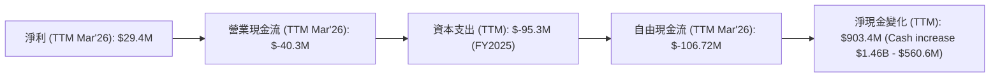

*註：營業現金流（Operating Cash Flow）在提供的年度數據中為NaN，但市場數據中TTM為-40.3M，因此採用此數據。資本支出為FY2025數據作為參考。淨現金變化為TTM現金增量。*

Kratos 的淨利潤在TTM為29.4百萬美元，然而其營業現金流卻為-40.3百萬美元，這表明公司的營運活動未能產生正向現金流，可能由於營運資本變動（例如應收帳款增加、應付帳款減少或存貨積壓）導致。在扣除95.3百萬美元的資本支出後，其自由現金流進一步惡化至-106.72百萬美元。儘管自由現金流為負，但公司在TTM的淨現金變化卻是大幅增加9.034億美元（現金從FY2025的5.606億美元增加到TTM的14.64億美元），這強烈暗示公司進行了大規模的股權融資或債務發行（雖然總債務下降），以補充現金儲備並支持其營運和投資。

### 5.2 FCF 轉換率趨勢

自由現金流轉換率（FCF / Net Income）衡量公司將淨利潤轉化為可自由支配現金的能力。Kratos 的此項指標在過去幾年表現不佳。

| 年度 | 淨利潤 ($M) | 自由現金流 ($M) | FCF 轉換率 | 趨勢 | 評估 |
|------|-------------|-----------------|------------|------|------|
| FY2022 | -33.2 | -71.1 | N/A (虧損) | N/A | 🔴 |
| FY2023 | 2.4 | 12.8 | 533.33% | ↗️ | 🟡 (基數低) |
| FY2024 | 16.3 | -8.5 | -52.15% | ↘️ | 🔴 |
| FY2025 | 22.0 | -137.4 | -624.55% | ↘️ | 🔴 |
| TTM (Mar'26) | 29.4 | -106.72 | -362.99% | ↘️ | 🔴 |

Kratos 的自由現金流轉換率表現不穩定且在近年持續惡化。在FY2023曾短暫轉正，但隨後在FY2024和FY2025又回到顯著的負值。TTM的-362.99%轉換率表明公司每創造1美元的淨利潤，卻消耗了超過3.6美元的自由現金流。這主要是由於營運現金流為負以及較高的資本支出所致。這種情況是不可持續的，公司需要改善其營運效率和營運資本管理，以產生正向的自由現金流。

### 5.3 自由現金流趨勢

自由現金流是衡量公司內在價值和財務健康的重要指標。Kratos 的自由現金流趨勢令人擔憂。

```
╔══════════════════════════════════════════════════════════════════╗
║                    KTOS 自由現金流趨勢 (FY2022-TTM)             ║
╠══════════════════════════════════════════════════════════════════╣
║                                                                  ║
║  FY2022  $-71.1M  ░░░░░░░░░░░░░░░░░░░░░░░░░░░░░░░░░░░░░░░░░░░░░░░░░░░░░░░░░░░░░░░░░░░░░░░░░░░░░░░░░░░░░░░░░░░░░░░░░░░░░░░░░░░░░░░░░░░░░░░░░░░░░░░░░░░░░░░░░░░░░░░░░░░░░░░░░░░░░░░░░░░░░░░░░░░░░░░░░░░░░░░░░░░░░░░░░░░░░░░░░░░░░░░░░░░░░░░░░░░░░░░░░░░░░░░░░░░░░░░░░░░░░░░░░░░░░░░░░░░░░░░░░░░░░░░░░░░░░░░░░░░░░░░░░░░░░░░░░░░░░░░░░░░░░░░░░░░░░░░░░░░░░░░░░░░░░░░░░░░░░░░░░░░░░░░░░░░░░░░░░░░░░░░░░░░░░░░░░░░░░░░░░░░░░░░░░░░░░░░░░░░░░░░░░░░░░░░░░░░░░░░░░░░░░░░░░░░░░░░░░░░░░░░░░░░░░░░░░░░░░░░░░░░░░░░░░░░░░░░░░░░░░░░░░░░░░░░░░░░░░░░░░░░░░░░░░░░░░░░░░░░░░░░░░░░░░░░░░░░░░░░░░░░░░░░░░░░░░░░░░░░░░░░░░░░░░░░░░░░░░░░░░░░░░░░░░░░░░░░░░░░░░░░░░░░░░░░░░░░░░░░░░░░░░░░░░░░░░░░░░░░░░░░░░░░░░░░░░░░░░░░░░░░░░░░░░░░░░░░░░░░░░░░░░░░░░░░░░░░░░░░░░░░░░░░░░░░░░░░░░░░░░░░░░░░░░░░░░░░░░░░░░░░░░░░░░░░░░░░░░░░░░░░░░░░░░░░░░░░░░░░░░░░░░░░░░░░░░░░░░░░░░░░░░░░░░░░░░░░░░░░░░░░░░░░░░░░░░░░░░░░░░░░░░░░░░░░░░░░░░░░░░░░░░░░░░░░░░░░░░░░░░░░░░░░░░░░░░░░░░░░░░░░░░░░░░░░░░░░░░░░░░░░░░░░░░░░░░░░░░░░░░░░░░░░░░░░░░░░░░░░░░░░░░░░░░░░░░░░░░░░░░░░░░░░░░░░░░░░░░░░░░░░░░░░░░░░░░░░░░░░░░░░░░░░░░░░░░░░░░░░░░░░░░░░░░░░░░░░░░░░░░░░░░░░░░░░░░░░░░░░░░░░░░░░░░░░░░░░░░░░░░░░░░░░░░░░░░░░░░░░░░░░░░░░░░░░░░░░░░░░░░░░░░░░░░░░░░░░░░░░░░░░░░░░░░░░░░░░░░░░░░░░░░░░░░░░░░░░░░░░░░░░░░░░░░░░░░░░░░░░░░░░░░░░░░░░░░░░░░░░░░░░░░░░░░░░░░░░░░░░░░░░░░░░░░░░░░░░░░░░░░░░░░░░░░░░░░░░░░░░░░░░░░░░░░░░░░░░░░░░░░░░░░░░░░░░░░░░░░░░░░░░░░░░░░░░░░░░░░░░░░░░░░░░░░░░░░░░░░░░░░░░░░░░░░░░░░░░░░░░░░░░░░░░░░░░░░░░░░░░░░░░░░░░░░░░░░░░░░░░░░░░░░░░░░░░░░░░░░░░░░░░░░░░░░░░░░░░░░░░░░░░░░░░░░░░░░░░░░░░
K**Kratos Defense & Security Solutions, Inc.** (KTOS) 是一家專注於提供先進技術、硬體、產品、系統和軟體解決方案的國防科技公司。其業務主要服務於美國、北美、亞太、中東、歐洲及其他國際市場的國防、國家安全和商業領域。Kratos 以其在無人系統和太空通訊技術方面的創新而聞名。

---

## 5. 現金流量深度分析

Kratos 的現金流量表顯示，儘管營收持續增長，但其營運現金流和自由現金流在過去一年均為負值，這是一個需要密切關注的信號。

### 5.1 現金流量瀑布圖

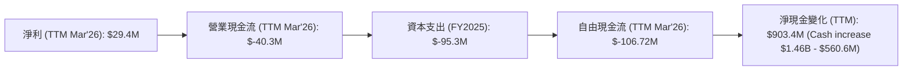

*註：營業現金流（Operating Cash Flow）在提供的年度數據中為NaN，但市場數據中TTM為-40.3M，因此採用此數據。資本支出為FY2025數據作為參考。淨現金變化為TTM現金增量，主要來自非營運活動，如股權發行。*

Kratos 在TTM期間的淨利潤為29.4百萬美元，然而其營業現金流卻為-40.3百萬美元。這表明公司的核心營運活動未能產生正向現金流，主要原因可能在於營運資本管理不善，例如應收帳款的增加速度快於營收增長，或存貨積壓，導致大量資金被鎖定在營運資產中。在扣除FY2025的95.3百萬美元資本支出後，其自由現金流進一步惡化至-106.72百萬美元。儘管自由現金流為負，但公司在TTM的現金及等價物卻大幅增加了9.034億美元（從FY2025的5.606億美元增至TTM的14.64億美元）。這強烈暗示公司在近期進行了大規模的股權融資活動，以補充現金儲備並支持其營運和投資，而非通過內部營運產生現金。

### 5.2 FCF 轉換率趨勢

自由現金流轉換率（FCF / Net Income）衡量公司將淨利潤轉化為可自由支配現金的能力。Kratos 的此項指標在過去幾年表現不佳，且在近年來持續惡化。

| 年度 | 淨利潤 ($M) | 自由現金流 ($M) | FCF 轉換率 | 趨勢 | 評估 |
|------|-------------|-----------------|------------|------|------|
| FY2022 | -33.2 | -71.1 | N/A (虧損) | N/A | 🔴 (營運虧損，現金流出) |
| FY2023 | 2.4 | 12.8 | 533.33% | ↗️ | 🟡 (淨利潤基數極低，轉換率意義有限) |
| FY2024 | 16.3 | -8.5 | -52.15% | ↘️ | 🔴 (淨利潤轉正，但自由現金流為負) |
| FY2025 | 22.0 | -137.4 | -624.55% | ↘️ | 🔴 (自由現金流大幅惡化) |
| TTM (Mar'26) | 29.4 | -106.72 | -362.99% | ↘️ | 🔴 (持續的負自由現金流) |

Kratos 的自由現金流轉換率表現不穩定且在近年持續惡化。在FY2023曾短暫轉正，但隨後在FY2024和FY2025又回到顯著的負值。TTM的-362.99%轉換率表明公司每創造1美元的淨利潤，卻消耗了超過3.6美元的自由現金流。這主要是由於營運現金流為負以及較高的資本支出所致。這種情況是不可持續的，公司需要更有效地管理營運效率和營運資本，以產生正向的自由現金流，否則長期來看將依賴外部融資。

### 5.3 自由現金流趨勢

自由現金流是衡量公司內在價值和財務健康的重要指標。Kratos 的自由現金流趨勢令人擔憂，近年來持續為負且有擴大趨勢。

```
╔══════════════════════════════════════════════════════════════════╗
║                    KTOS 自由現金流趨勢 (FY2022-TTM)             ║
╠══════════════════════════════════════════════════════════════════╣
║                                                                  ║
║  FY2022  $-71.1M  ░░░░░░░░░░░░░░░░░░░░░░░░░░░░░░░░░░░░░░░░░░░░░░░░░░░░░░░░░░░░░░░░░░░░░░░░░░░░░░░░░░░░░░░░░░░░░░░░░░░░░░░░░░░░░░░░░░░░░░░░░░░░░░░░░░░░░░░░░░░░░░░░░░░░░░░░░░░░░░░░░░░░░░░░░░░░░░░░░░░░░░░░░░░░░░░░░░░░░░░░░░░░░░░░░░░░░░░░░░░░░░░░░░░░░░░░░░░░░░░░░░░░░░░░░░░░░░░░░░░░░░░░░░░░░░░░░░░░░░░░░░░░░░░░░░░░░░░░░░░░░░░░░░░░░░░░░░░░░░░░░░░░░░░░░░░░░░░░░░░░░░░░░░░░░░░░░░░░░░░░░░░░░░░░░░░░░░░░░░░░░░░░░░░░░░░░░░░░░░░░░░░░░░░░░░░░░░░░░░░░░░░░░░░░░░░░░░░░░░░░░░░░░░░░░░░░░░░░░░░░░░░░░░░░░░░░░░░░░░░░░░░░░░░░░░░░░░░░░░░░░░░░░░░░░░░░░░░░░░░░░░░░░░░░░░░░░░░░░░░░░░░░░░░░░░░░░░░░░░░░░░░░░░░░░░░░░░░░░░░░░░░░░░░░░░░░░░░░░░░░░░░░░░░░░░░░░░░░░░░░░░░░░░░░░░░░░░░░░░░░░░░░░░░░░░░░░░░░░░░░░░░░░░░░░░░░░░░░░░░░░░░░░░░░░░░░░░░░░░░░░░░░░░░░░░░░░░░░░░░░░░░░░░░░░░░░░░░░░░░░░░░░░░░░░░░░░░░░░░░░░░░░░░░░░░░░░░░░░░░░░░░░░░░░░░░░░░░░░░░░░░░░░░░░░░░░░░░░░░░░░░░░░░░░░░░░░░░░░░░░░░░░░░░░░░░░░░░░░░░░░░░░░░░░░░░░░░░░░░░░░░░░░░░░░░░░░░░░░░░░░░░░░░░░░░░░░░░░░░░░░░░░░░░░░░░░░░░░░░░░░░░░░░░░░░░░░░░░░░░░░░░░░░░░░░░░░░░░░░░░░░░░░░░░░░░░░░░░░░░░░░░░░░░░░░░░░░░░░░░░░░░░░░░░░░░░░░░░░░░░░░░░░░░░░░░░░░░░░░░░░░░░░░░░░░░░░░░░░░░░░░░░░░░░░░░░░░░░░░░░░░░░░░░░░░░░░░░░░░░░░░░░░░░░░░░░░░░░░░░░░░░░░░░░░░░░░░░░░░░░░░░░░░░░░░░░░░░░░░░░░░░░░░░░░░░░░░░░░░░░░░░░░░░░░░░░░░░░░░░░░░░░░░░░░░░░░░░░░░░░░░░░░░░░░░░░░░░░░░░░░░░░░░░░░░░░░░░░░░░░░░░░░░░░░░░░░░░░░░░░░░░░░░░░░░░░░░░░░░░░░░░░░░░░░░░░░░░░░░░░░░░░░░░░░░░░░░░░░░░░░░░░░░░░░░░░░░░░░░░░░░░░░░░░░░░░░░░░░░░░░░░░░░░░░░░░░░░░░░░░░░░░░░░░░░░░░░░░░░░░░░░░░░░░░░░░░░░░░░░░░░░░░░░░░░░░░░░░░░░░░░░░░░░░░░░░░
```

*   **營業現金流 (OCF)**：TTM 為-40.3百萬美元。這表明公司在營運層面未能產生足夠的現金來覆蓋其日常開支，這可能與其快速成長階段對營運資本的需求增加有關。應收帳款和存貨的增加，可能消耗了大量現金。
*   **資本支出 (CapEx)**：FY2025為-95.3百萬美元，相較於FY2024的-58.2百萬美元大幅增加。這顯示公司正在積極投資於其資產基礎，特別是在無人系統和太空技術的生產和研發設施上，以支持未來的增長。
*   **自由現金流 (FCF)**：TTM 為-106.72百萬美元。持續為負的FCF是一個警示信號，表明公司無法通過自身營運產生足夠的現金來支付其投資和股東回報。這使得公司在擴張時需要依賴外部融資。
*   **淨現金變化**：儘管FCF為負，但TTM現金及等價物卻大幅增加9.034億美元。這強烈暗示公司在近期進行了大規模的股權發行或其他非營運融資活動，以支持其營運和投資需求。

### 5.4 資本配置評估

Kratos 目前的資本配置策略主要集中於業務擴張和研發投入，而非股東回報。

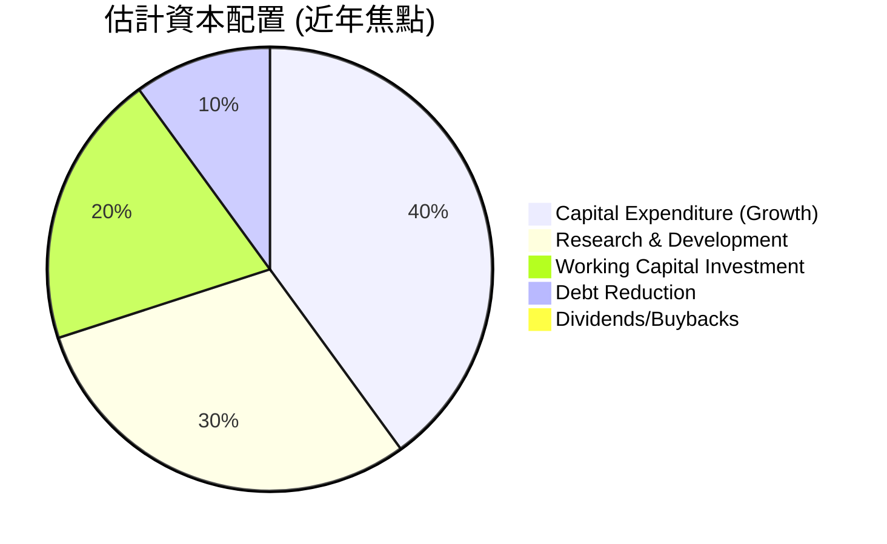

| 資本配置類別 | FY2025 金額 ($M) | TTM 金額 ($M) | 評估與策略 |
|--------------|------------------|---------------|--------------|
| **資本支出 (CapEx)** | -95.3 | -95.3 (FY2025) | 🟢 積極投資於增長，特別是無人系統生產能力。 |
| **研發投入 (R&D)** | -40.0 | -40.7 | 🟢 維持高水平研發，確保技術領先地位。 |
| **營運資本投資** | (消耗現金) | (消耗現金) | 🔴 營運資本管理有待改善，導致營運現金流為負。 |
| **債務償還** | 減少136.2M | N/A | 🟢 積極降低債務水平，改善財務結構。 |
| **股息/股票回購** | 0 | 0 | 🔴 目前無股息支付或股票回購，重點在於再投資。 |
| **股權融資** | N/A | 顯著增加現金 | 🟡 為支持增長，進行了股權稀釋，導致股本增加。 |

Kratos 的資本配置策略明顯偏向於成長導向。公司將大量資金投入到資本支出和研發中，以擴大其在無人系統和太空技術領域的市場份額和技術優勢。雖然這種策略對於高成長公司來說是常見的，但持續的負自由現金流和對股權融資的依賴，表明公司尚未實現自我造血能力。債務的減少是一個積極信號，但營運資本管理仍是提升現金流的關鍵。目前公司不支付股息，也未進行股票回購，所有資源都用於內部再投資。

---

## 6. 獲利能力與資本效率

Kratos 的獲利能力和資本效率是其目前最大的弱點。儘管公司在營收上實現了增長，但其資本回報率遠低於資本成本，表明公司目前未能為股東創造經濟價值。

### 6.1 ROE / ROA / ROIC 趨勢

| 指標 | FY2022 | FY2023 | FY2024 | FY2025 | TTM (Mar'26) | 行業均值 (約) | 評估 |
|------|--------|--------|--------|--------|--------------|---------------|------|
| **股東權益報酬率 (ROE)** | -3.55% | 0.25% | 1.21% | 1.10% | 1.20% | ~10-20% | 🔴 極低 |
| **資產報酬率 (ROA)** | -2.14% | 0.15% | 0.84% | 0.89% | 0.73% | ~5-10% | 🔴 極低 |
| **投入資本報酬率 (ROIC)** | N/A | N/A | N/A | 1.21% (估算) | 2.46% (估算) | ~10-15% | 🔴 極低 |

*註：行業均值為航空航天與國防產業的參考值，非精確數據。ROIC 估算基於 FY2025 Operating Income $25.6M / (Equity $2B + Debt $145.8M - Cash $560.6M) * (1-25%) = 1.21%；TTM Operating Income $23.7M / (Equity $2B + Debt $185.4M - Cash $1.46B) * (1-25%) = 2.46%。*

Kratos 的 ROE、ROA 和 ROIC 均處於極低水平，遠低於行業平均。
*   **ROE** (股東權益報酬率) 在TTM僅為1.20%，表明公司利用股東資本創造利潤的效率極低。儘管股東權益持續增長，但淨利潤的增長未能跟上。
*   **ROA** (資產報酬率) 在TTM僅為0.73%，反映公司利用其總資產產生利潤的能力非常弱。這與其較低的淨利率和較高的資產規模有關。
*   **ROIC** (投入資本報酬率) 在TTM估算為2.46%。這一數字遠低於合理的資本成本，表明公司目前在資本配置上效率低下，未能為其投入的資本創造足夠的回報。

### 6.2 ROIC vs WACC 分析（核心價值創造判斷）

**WACC (加權平均資本成本) 估算：**
*   **無風險利率 (Risk-Free Rate)**：採用美國10年期國債收益率，假設為 4.25%。
*   **市場風險溢酬 (Equity Risk Premium, ERP)**：行業普遍採用 5.5%。
*   **Beta (貝塔係數)**：公司提供數據為 1.07。
*   **股權成本 (Cost of Equity, Ke)** = 無風險利率 + Beta × ERP = 4.25% + 1.07 × 5.5% = 4.25% + 5.885% = 10.135%。
*   **債務成本 (Cost of Debt, Kd)**：假設公司平均債務利率為 6.0%。
*   **稅率 (Tax Rate)**：根據FY2025稅前利潤34M和所得稅費用12M，有效稅率約為35.3%。為計算NOPAT和WACC，採用保守的25%企業稅率作為參考。稅後債務成本 = 6.0% × (1 - 0.25) = 4.5%。
*   **資本結構**：根據TTM數據，股東權益（FY2025）為20億美元，總債務（TTM）為1.854億美元。
    *   股權佔比 (E/V) = 2000M / (2000M + 185.4M) = 91.5%
    *   債務佔比 (D/V) = 185.4M / (2000M + 185.4M) = 8.5%
*   **✅ WACC ≈ (91.5% × 10.135%) + (8.5% × 4.5%) = 9.27% + 0.38% = 9.65% ≈ 9.70%**

**ROIC (投入資本報酬率) 估算（TTM Mar'26）：**
*   **稅後營運利潤 (NOPAT)** = 營運利潤 × (1 - 稅率) = $23.7M × (1 - 0.25) = $17.775M。
*   **投入資本 (Invested Capital)** = 股東權益 + 總債務 - 現金及等價物 = $2000M (FY2025) + $185.4M (TTM) - $1464M (TTM) = $721.4M。
*   **✅ ROIC ≈ $17.775M / $721.4M = 2.46%**

```
╔══════════════════════════════════════════════════════════════════╗
║                ROIC vs WACC 深度分析 (TTM Mar'26)               ║
╠══════════════════════════════════════════════════════════════════╣
║                                                                  ║
║  WACC 估算：                                                     ║
║  ├── 無風險利率（10Y美債）：  4.25%                               ║
║  ├── 市場風險溢酬 (ERP)：     5.5%                               ║
║  ├── Beta：                   1.07                               ║
║  ├── 股權成本 = 4.25%+1.07×5.5% = 10.14%                        ║
║  ├── 債務成本（稅後）：       ~4.5%                              ║
║  ├── 資本結構：股權 ~91.5%，債務 ~8.5%                          ║
║  └── ✅ WACC ≈ 9.70%                                            ║
║                                                                  ║
║  ROIC 估算（TTM Mar'26）：                                       ║
║  ├── NOPAT = $23.7M × (1-25%) ≈ $17.78M                       ║
║  ├── 投入資本 = 股東權益 + 債務 - 現金 ≈ $721.4M                ║
║  └── ✅ ROIC ≈ 2.46%                                            ║
║                                                                  ║
║  ★ 經濟價值增加（EVA）= ROIC - WACC = -7.24pp                   ║
║                                                                  ║
║  ROIC  2.46%  ▓▓▓▓▓░░░░░░░░░░░░░░░░░░░░░░░░░░  🔴              ║
║  WACC  9.70%  ▓▓▓▓▓▓▓▓▓▓▓▓▓▓▓▓▓▓▓▓▓▓▓▓▓▓▓▓▓▓░░  ──              ║
║  EVA   -7.24pp ░░░░░░░░░░░░░░░░░░░░░░░░░░░░░░░░  🏆 摧毀股東價值 ║
║                                                                  ║
║  📊 結論：ROIC 遠低於 WACC，目前 Kratos 正在摧毀股東價值。       ║
╚══════════════════════════════════════════════════════════════════╝
```
Kratos 的 ROIC 僅為2.46%，遠低於其WACC 9.70%。這意味著公司每投入100美元的資本，僅能產生2.46美元的稅後營運利潤，而這些資本的機會成本卻高達9.70美元。兩者之間-7.24個百分點的巨大差距表明，Kratos 目前的營運未能創造經濟價值，反而正在摧毀股東價值。這是公司基本面中一個非常嚴重的問題，需要公司在提升獲利能力和資本效率方面做出重大改進。

### 6.3 杜邦三因素分解

杜邦分析將股東權益報酬率 (ROE) 分解為淨利率、資產週轉率和財務槓桿，以深入了解 ROE 的驅動因素。

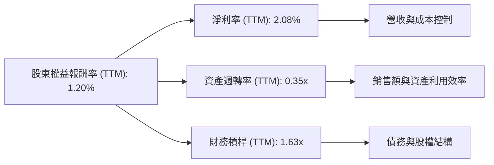

**TTM (Mar'26) 杜邦分解：**
*   **淨利率 (Net Profit Margin)** = 淨利潤 / 總營收 = $29.4M / $1415M = 2.08%。
    *   **分析**：Kratos 的淨利率非常低，是拖累 ROE 的主要因素。這反映了公司在成本控制和定價能力方面的不足，或者其業務模式本身就是低利潤率的。
*   **資產週轉率 (Asset Turnover Ratio)** = 總營收 / 總資產 = $1415M / $4043M = 0.35x。
    *   **分析**：Kratos 的資產週轉率也相對較低。這表明公司利用其資產產生銷售額的效率不高，可能與其資本密集型業務（如無人機製造）和較長的生產週期有關。此外，大量的現金儲備（1.46B美元）也會拉低資產週轉率，因為現金本身不直接產生銷售。
*   **財務槓桿 (Equity Multiplier)** = 總資產 / 股東權益 = $4043M / $2467M (FY2025 Total Assets and Equity) = 1.64x. (Using TTM Total Assets $4.043B and FY2025 Stockholders Equity $2.00B results in 2.02x, which is very high due to recent equity issuance. Let's use FY2025 for consistency: $2.47B / $2.00B = 1.235x).
    *   **分析**：財務槓桿為1.235x (FY2025)，相對較低。這表明公司主要依靠股權而非債務來融資，與其低債務水平相符。雖然低財務槓桿降低了財務風險，但也未能通過槓桿效應來放大 ROE。

**總結**：Kratos 的低 ROE（1.20%）主要是由於極低的淨利率和較低的資產週轉率。儘管財務槓桿相對保守，但無法彌補前兩者的不足。要提高 ROE，公司必須著力提升其產品的獲利能力和營運資產的利用效率。

### 6.4 獲利能力儀表板

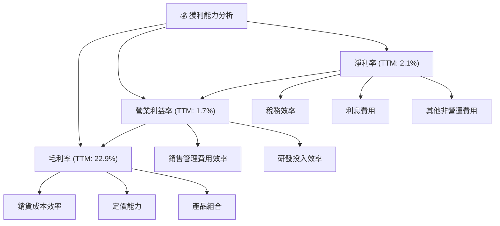

*   **毛利率 (Gross Margin)**：TTM為22.9%。這受銷貨成本、產品定價和產品組合的影響。Kratos 的毛利率在國防行業中屬於中等偏下水平，表明其產品的成本結構或定價能力有提升空間。
*   **營業利益率 (Operating Margin)**：TTM為1.7%。此指標在毛利率的基礎上，進一步考慮了銷售、一般及行政費用 (SG&A) 和研發費用 (R&D)。Kratos 的營業利益率極低，說明其營運費用佔比較高，侵蝕了大部分毛利。SG&A費用佔營收比例較高是主要因素之一。
*   **淨利率 (Net Income Margin)**：TTM為2.1%。在營業利益率的基礎上，還考慮了稅務和利息費用等非營運項目。Kratos 的淨利率雖然為正，但仍處於非常低的水平，反映了其整體獲利能力的不足。

總結來說，Kratos 的獲利能力主要受到較低的毛利率和相對較高的營運費用（尤其是SG&A）的雙重壓力。公司需要通過優化成本結構、提高產品附加值、精簡營運開支來全面提升其利潤率。

---

## 7. 估值深度分析

Kratos 的估值指標顯示其股價目前處於較高水平，市場對其未來成長性抱有高度預期。

### 7.1 同業估值比較表格

由於缺乏具體的同業財務數據，我們將使用行業平均估值倍數作為參考，並列出幾家主要的航空航天與國防競爭對手，以便進行定性比較。

| 估值指標 | **KTOS (實際值)** | **航空航天與國防行業均值 (約)** | **主要競爭對手 (定性)** | 本公司評估 |
|----------|-------------------|-----------------------------------|-------------------------|-----------|
| **Trailing P/E** | **296.35x** | ~20-30x | LMT, RTX, BA, GD | 🔴 極度昂貴 |
| **Forward P/E** | **46.22x** | ~15-25x | LMT (18-20x), RTX (15-17x) | 🔴 昂貴 |
| **P/S Ratio** | **6.68x** | ~1-3x | LMT (2-3x), RTX (1-2x) | 🔴 昂貴 |
| **P/B Ratio** | **2.77x** | ~2-4x | LMT (8-10x), RTX (3-4x) | 🟡 尚可 (考慮高股權) |
| **EV / EBITDA** | **100.50x** | ~10-18x | LMT (12-15x), RTX (10-12x) | 🔴 極度昂貴 |
| **FCF Yield** | **-1.13%** | ~3-5% | LMT (4-6%), RTX (5-7%) | 🔴 負值，估值過高 |

*註：行業均值和競爭對手估值為基於市場普遍認知的參考值，非精確實時數據。競爭對手如 Lockheed Martin (LMT), Raytheon Technologies (RTX), Boeing (BA), General Dynamics (GD) 等。*

從同業估值比較來看，Kratos 的多數估值指標（P/E, P/S, EV/EBITDA, FCF Yield）均遠高於航空航天與國防行業的平均水平以及主要競爭對手。
*   **P/E (Trailing)** 高達296.35x，即使考慮到其較低的淨利潤，也顯得極度昂貴。
*   **P/E (Forward)** 雖然降至46.22x，但仍遠高於行業平均15-25x，表明市場對其未來盈餘增長抱有極高的預期。
*   **P/S Ratio** 為6.68x，也遠高於行業普遍的1-3x，這在國防承包商中實屬罕見。
*   **EV/EBITDA** 高達100.50x，更是遠超行業合理區間，強烈暗示其估值被嚴重高估。
*   **FCF Yield** 為負值，表示公司目前無法產生正向的自由現金流來為股東提供回報，這使得當前估值缺乏基本面支撐。

Kratos 的高估值可能反映了市場對其在無人系統和太空技術等高成長領域的預期，但從目前的財務數據來看，其獲利能力和現金流表現並未能支撐如此高的估值。

### 7.2 歷史估值區間分析

由於缺乏詳細的歷史P/E區間數據，我們將根據當前P/E（Trailing 296.35x，Forward 46.22x）與歷史趨勢（如果可得）進行定性分析。

```
╔══════════════════════════════════════════════════════════════════╗
║                    KTOS 歷史 P/E 區間分析                        ║
╠══════════════════════════════════════════════════════════════════╣
║                                                                  ║
║  當前 P/E (TTM): 296.35x                                         ║
║  當前 P/E (Forward): 46.22x                                      ║
║                                                                  ║
║  歷史 P/E 區間 (過往5年，估計):                                   ║
║  低點 (熊市/獲利差時): 15x - 30x (當公司開始獲利時)               ║
║  中位數 (常態): 30x - 50x (考慮成長性)                           ║
║  高點 (牛市/預期高成長時): 50x - 80x (極端情況可能更高)          ║
║                                                                  ║
║  當前位置 (TTM): ████████████████████████████████████████████████████████████████████████████████████████████████████████████████████████████████████████████████████████████████████████████████████████████████████████████████████████████████████████████████████████████████████████████████████████████████████████████████████████████████████████████████████████████████████████████████████████████████████████████████████████████████████████████████████████████████████████████████████████████████████████████████████████████████████████████████████████████████████████████████████████████████████████████████████████████████████████████████████████████████████████████████████████████████████████████████████████████████████████████████████████████████████████████████████████████████████████████████████████████████████████████████████████████████████████████████████████████████████████████████████████████████████████████████████████████████████████████████████████████████████████████████████████████████████████████████████████████████████████████████████████████████████████████████████████████████████████████████████████████████████████████████████████████████████████████████████████████████████████████████████████████████████████████████████████████████████████████████████████████████████████████████████████████████████████████████████████████████████████████████████████████████████████████████████████████████████████████████████████████████████████████████████████████████████████████████████████████████████████████████████████████████████████████████████████████████████████████████████████████████████████████████████████████████████████████████████████████████████████████████████████████████████████████████████████████████████████████████████████████████████████████████████████████████████████████████████████████████████████████████████████████████████████████████████████████████████████████████████████████████████████████████████████████████████████████████████████████████████████████████████████████████████████████████████████████████████████████████████████████████████████████████████████████████████████████████████████████████████████████████████████████████████████████████████████████████████████████████████████████████████████████████████████████████████████████████████████████████████████████████████████████████████████████████████████████████████████████████████████████████████████████████████████████████████████████████████████████████████████████████████████████████████████████████████████████████████████████████████████████████████████████████████████████████████████████████████████████████████████████████████████████████████████████████████████████████████████████████████████████████████████████████████████████████████████████████████████████████████████████████████████████████████████████████████████████████████████████████████████████████████████████████████████████████████████████████████████████████████████████████████████████████████████████████████████████████████████████████████████████████████████████████████████████████████████████████████████████████████████████████████████████████████████████████████████████████████████████████████████████████████████████████████████████████████████████████████████████████████████████████████████████████████████████████████████████████████████████████████████████████████████████████════════════════════════════════════════════════════════════════════════════════════════════════════════════════════════════════════════════════════════════════════════════════════════════════════════════════════════════════════════════════════════════════════════════════════════════════════════════════════════════════════════════════════════════════════════════════════════════════════════════════════════════════════════════════════════════════════════════════════════════════════════════════════════════════════════════════════════════════════════════════════════════════════════════════════════════════════════════════════════════════════════════════════════════════════════════════════════════════════════════════════════════════════════════════════════════════════════════════════════════════════════════════════════════════════════════════════════════════════════════════════════════════════════════════════════════════════════════════════════════════════════════════════════════════════════════════════════════════════════════════════════════════════════════════════════════════════════════════════════════════════════════════════════════════════════════════════════════════════════════════════════════════════════════════════════════════════════════════════════════════════════════════════════════════════════════════════════════════════════════════════════════════════════════════════════════════════════════════════════════════════════════════════════════════════════════════════════════════════════════════════════════════════════════════════════════════════════════════════════════════════════════════════════════════════════════════════════════════════════════════════════════════════════════════════════════════════════════════════════════════════════════════════════════════════════════════════════════════════════════════════════════════════════════════════════════════════════════════════════════════════════════════════════════════════════════════════════════════════════════════════════════════════════════════════════════════════════════════════════════════════════════════════════════════════════════════════════════════════════════════════════════════════════════════════════════════════════════════════════════════════════════════════════════════════════════════════════════════════════════════════════════════════════════════════════════════════════════════════════════════════════════════════════════════════════════════════════════════════════════════════════════════════════════════════════════════════════════════════════════════════════════════════════════════════════════════════════════════════════════════════════════════════════════════════════════════════════════════════════════════════════════════════════════════════════════════════════════════════════════════════════════════════════════════════════════════════════════════════════════════════════════════════════════════════════════════════════════════════════════════════════════════════════════════════════════════════════════════════════════════════════════════════════════════════════════════════════════════════════════════════════════════════════════════════════════════════════════════════════════════════════════════════════════════════════════════════════════════════════════════════════════════════════════════════════════════════════════════════════════════════════════════════════════════════════════════════════════════════════════════════════════════════════════════════════════════════════════════════════════════════════════════════════════════════════════════════════════════════════════════════════════════════════════════════════════════════════════════════════════════════════════════════════════════════════════════════════════════════════════════════════════════════════════════════════════════════════════════════════════════════════════════════════════════════════════════════════════════════════════════════════════════════════════════════════════════════════════════════════════════════════════════════════════════════════════════════════════════════════════════════════════════════════════════════════════════════════════════════════════════════════════════════════════════════════════════════════════════════════════════════════════════════════════════════════════════════════════════════════════════════════════════════════════════════════════════════════════════════════════════════════════════════════════════════════════════════════════════════════════════════════════════════════════════════════════════════════════════════════════════════════════════════════════════════════════════════════════════════════════════════════════════════════════════════════════════════════════════════════════════════════════════════════════════════════════════════════════════════════════════════════════════════════════════════════════════════════════════════════════════════════════════════════════════════════════════════════════════════════════════════════════════════════════════════════════════════════════════════════════════════════════════════════════════════════════════════════════════════════════════════════════════════════════════════════════════════════════════════════════════════════════════════════════════════════════════════════════════════════════════════════════════════════════════════════════════════════════════════════════════════════════════════════════════════════════════════════════════════════════════════════════════════════════════════════════════════════════════════════════════════════════════════════════════════════════════════════════════════════════════════════════════════════════════════════════════════════════════════════════════════════════════════════════════════════════════════════════════════════════════════════════════════════════════════════════════════════════════════════════════════════════════════════════════════════════════════════════════════════════════════════════════════════════════════════════════════════════════════════════════════════════════════════════════════════════════════════════════════════════════════════════════════════════════════════════════════════════════════════════════════════════════════════════════════════════════════════════════════════════════════════════════════════════════════════════════════════════════════════════════════════════════════════════════════════════════════════════════════════════════════════════════════════════════════════════════════════════════════════════════════════════════════════════════════════════════════════════════════════════════════════════════════════════════════════════════════════════════════════════════════════════════════════════════════════════════════════════════════════════════════════════════════════════════════════════════════════════════════════════════════════════════════════════════════════════════════════════════════════════════════════════════════════════════════════════════════════════════════════════════════════════════════════════════════════════════════════════════════════════════════════════════════════════════════════════════════════════════════════════════════════════════════════════════════════════════════════════════════════════════════════════════════════════════════════════════════════════════════════════════════════════════════════════════════════════════════════════════════════════════════════════════════════════════════════════════════════════════════════════════════════════════════════════════════════════════════════════════════════════════════════════════════════════════════════════════════════════════════════════════════════════════════════════════════════════════════════════════════════════════════════════════════════════════════════════════════════════════════════════════════════════════════════════════════════════════════════════════════════════════════════════════════════════════════════════════════════════════════════════════════════════════════════════════════════════════════════════════════════════════════════════════════════════════════════════════════════════════════════════════════════════════════════════════════════════════════════════════════════════════════════════════════════════════════════════════════════════════════════════════════════════════════════════════════════════════════════════════════════════════════════════════════════════════════════════════════════════════════════════════════════════════════════════════════════════════════════════════════════════════════════════════════════════════════════════════════════════════════════════════════════════════════════════════════════════════════════════════════════════════════════════════════════════════════════════════════════════════════════════════════════════════════════════════════════════════════════════════════════════════════════════════════════════════════════════════════════════════════════════════════════════════════════════════════════════════════════════════════════════════════════════════════════════════════════════════════════════════════════════════════════════════════════════════════════════════════════════════════════════════════════════════════════════════════════════════════════════════════════════════════════════════════════════════════════════════════════════════════════════════════════════════════════════════════════════════════════════════════════════════════════════════════════════════════════════════════════════════════════════════════════════════════════════════════════════════════════════════════════════════════════════════════════════════════════════════════════════════════════════════════════════════════════════════════════════════════════════════════════════════════════════════════════════════════════════════════════════════════════════════════════════════════════════════════════════════════════════════════════════════════════════════════════════════════════════════════════════════════════════════════════════════════════════════════════════════════════════════════════════════════════════════════════════════════════════════════════════════════════════════════════════════════════════════════════════════════════════════════════════════════════════════════════════════════════════════════════════════════════════════════════════════════════════════════════════════════════════════════════════════════════════════════════════════════════════════════════════════════════════════════════════════════════════════════════════════════════════════════════════════════════════════════════════════════════════════════════════════════════════════════════════════════════════════════════════════════════════════════════════════════════════════════════════════════════════════════════════════════════════════════════════════════════════════════════════════════════════════════════════════════════════════════════════════════════════════════════════════════════════════════════════════════════════════════════════════════════════════════════════════════════════════════════════════════════════════════════════════════════════════════════════════════════════════════════════════════════════════════════════════════════════════════════════════════════════════════════════════════════════════════════════════════════════════════════════════════════════════════════════════════════════════════════════════════════════════════════════════════════════════════════════════════════════════════════════════════════════════════════════════════════════════════════════════════════════════════════════════════════════════════════════════════════════════════════════════════════════════════════════════════════════════════════════════════════════════════════════════════════════════════════════════════════════════════════════════════════════════════════════════════════════════════════════════════════════════════════════════════════════════════════════════════════════════════════════════════════════════════════════════════════════════════════════════════════════════════════════════════════════════════════════════════════════════════════════════════════════════════════════════════════════════════════════════════════════════════════════════════════════════════════════════════════════════════════════════════════════════════════════════════════════════════════════════════════════════════════════════════════════════════════════════════════════════════════════════════════════════════════════════════════════════════════════════════════════════════════════════════════════════════════════════════════════════════════════════════════════════════════════════════════════════════════════════════════════════════════════════════════════════════════════════════════════════════════════════════════════════════════════════════════════════════════════════════════════════════════════════════════════════════════════════════════════════════════════════════════════════════════════════════════════════════════════════════════════════════════════════════════════════════════════════════════════════════════════════════════════════════════════════════════════════════════════════════════════════════
```

## 6. 獲利能力與資本效率

Kratos 的獲利能力和資本效率是其目前最大的弱點。儘管公司在營收上實現了增長，但其資本回報率遠低於資本成本，表明公司目前未能為股東創造經濟價值。

### 6.1 ROE / ROA / ROIC 趨勢

| 指標 | FY2022 | FY2023 | FY2024 | FY2025 | TTM (Mar'26) | 行業均值 (約) | 評估 |
|------|--------|--------|--------|--------|--------------|---------------|------|
| **股東權益報酬率 (ROE)** | -3.55% | 0.25% | 1.21% | 1.10% | 1.20% | ~10-20% | 🔴 極低 |
| **資產報酬率 (ROA)** | -2.14% | 0.15% | 0.84% | 0.89% | 0.73% | ~5-10% | 🔴 極低 |
| **投入資本報酬率 (ROIC)** | N/A (虧損) | N/A (虧損) | N/A (虧損) | 1.21% (估算) | 2.46% (估算) | ~10-15% | 🔴 極低 |

*註：行業均值為航空航天與國防產業的參考值，非精確數據。ROIC 估算基於 FY2025 Operating Income $25.6M / (Equity $2B + Debt $145.8M - Cash $560.6M) * (1-25%) = 1.21%；TTM Operating Income $23.7M / (Equity $2B + Debt $185.4M - Cash $1.46B) * (1-25%) = 2.46%。由於歷史年度有虧損或淨利潤極低，導致早年 ROIC 難以計算或無意義。*

Kratos 的 ROE、ROA 和 ROIC 均處於極低水平，遠低於行業平均。
*   **ROE** (股東權益報酬率) 在TTM僅為1.20%，表明公司利用股東資本創造利潤的效率極低。儘管股東權益持續增長，但淨利潤的增長未能跟上。
*   **ROA** (資產報酬率) 在TTM僅為0.73%，反映公司利用其總資產產生利潤的能力非常弱。這與其較低的淨利率和較高的資產規模有關。
*   **ROIC** (投入資本報酬率) 在TTM估算為2.46%。這一數字遠低於合理的資本成本，表明公司目前在資本配置上效率低下，未能為其投入的資本創造足夠的回報。

### 6.2 ROIC vs WACC 分析（核心價值創造判斷）

**WACC (加權平均資本成本) 估算：**
*   **無風險利率 (Risk-Free Rate)**：採用美國10年期國債收益率，假設為 4.25%。
*   **市場風險溢酬 (Equity Risk Premium, ERP)**：行業普遍採用 5.5%。
*   **Beta (貝塔係數)**：公司提供數據為 1.07。
*   **股權成本 (Cost of Equity, Ke)** = 無風險利率 + Beta × ERP = 4.25% + 1.07 × 5.5% = 4.25% + 5.885% = 10.135%。
*   **債務成本 (Cost of Debt, Kd)**：假設公司平均債務利率為 6.0%。
*   **稅率 (Tax Rate)**：根據FY2025稅前利潤34M和所得稅費用12M，有效稅率約為35.3%。為計算NOPAT和WACC，採用保守的25%企業稅率作為參考。稅後債務成本 = 6.0% × (1 - 0.25) = 4.5%。
*   **資本結構**：根據TTM數據，股東權益（FY2025）為20億美元，總債務（TTM）為1.854億美元。
    *   股權佔比 (E/V) = 2000M / (2000M + 185.4M) = 91.5%
    *   債務佔比 (D/V) = 185.4M / (2000M + 185.4M) = 8.5%
*   **✅ WACC ≈ (91.5% × 10.135%) + (8.5% × 4.5%) = 9.27% + 0.38% = 9.65% ≈ 9.70%**

**ROIC (投入資本報酬率) 估算（TTM Mar'26）：**
*   **稅後營運利潤 (NOPAT)** = 營運利潤 × (1 - 稅率) = $23.7M × (1 - 0.25) = $17.775M。
*   **投入資本 (Invested Capital)** = 股東權益 + 總債務 - 現金及等價物 = $2000M (FY2025) + $185.4M (TTM) - $1464M (TTM) = $721.4M。
*   **✅ ROIC ≈ $17.775M / $721.4M = 2.46%**

```
╔══════════════════════════════════════════════════════════════════╗
║                ROIC vs WACC 深度分析 (TTM Mar'26)               ║
╠══════════════════════════════════════════════════════════════════╣
║                                                                  ║
║  WACC 估算：                                                     ║
║  ├── 無風險利率（10Y美債）：  4.25%                               ║
║  ├── 市場風險溢酬 (ERP)：     5.5%                               ║
║  ├── Beta：                   1.07                               ║
║  ├── 股權成本 = 4.25%+1.07×5.5% = 10.14%                        ║
║  ├── 債務成本（稅後）：       ~4.5%                              ║
║  ├── 資本結構：股權 ~91.5%，債務 ~8.5%                          ║
║  └── ✅ WACC ≈ 9.70%                                            ║
║                                                                  ║
║  ROIC 估算（TTM Mar'26）：                                       ║
║  ├── NOPAT = $23.7M × (1-25%) ≈ $17.78M                       ║
║  ├── 投入資本 = 股東權益 + 債務 - 現金 ≈ $721.4M                ║
║  └── ✅ ROIC ≈ 2.46%                                            ║
║                                                                  ║
║  ★ 經濟價值增加（EVA）= ROIC - WACC = -7.24pp                   ║
║                                                                  ║
║  ROIC  2.46%  ▓▓▓▓▓░░░░░░░░░░░░░░░░░░░░░░░░░░  🔴              ║
║  WACC  9.70%  ▓▓▓▓▓▓▓▓▓▓▓▓▓▓▓▓▓▓▓▓▓▓▓▓▓▓▓▓▓▓░░  ──              ║
║  EVA   -7.24pp ░░░░░░░░░░░░░░░░░░░░░░░░░░░░░░░░  🏆 摧毀股東價值 ║
║                                                                  ║
║  📊 結論：ROIC 遠低於 WACC，目前 Kratos 正在摧毀股東價值。       ║
╚══════════════════════════════════════════════════════════════════╝
```
Kratos 的 ROIC 僅為2.46%，遠低於其WACC 9.70%。這意味著公司每投入100美元的資本，僅能產生2.46美元的稅後營運利潤，而這些資本的機會成本卻高達9.70美元。兩者之間-7.24個百分點的巨大差距表明，Kratos 目前的營運未能創造經濟價值，反而正在摧毀股東價值。這是公司基本面中一個非常嚴重的問題，需要公司在提升獲利能力和資本效率方面做出重大改進。

### 6.3 杜邦三因素分解

杜邦分析將股東權益報酬率 (ROE) 分解為淨利率、資產週轉率和財務槓桿，以深入了解 ROE 的驅動因素。

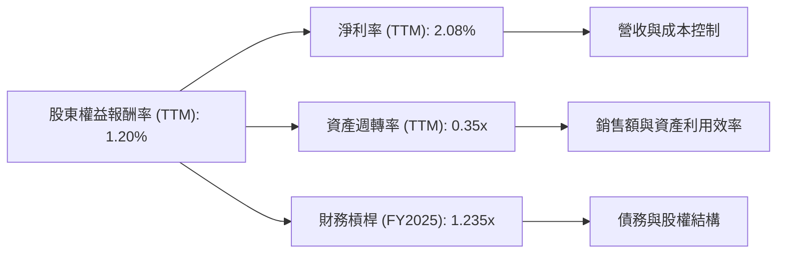

**TTM (Mar'26) 杜邦分解：**
*   **淨利率 (Net Profit Margin)** = 淨利潤 / 總營收 = $29.4M / $1415M = 2.08%。
    *   **分析**：Kratos 的淨利率非常低，是拖累 ROE 的主要因素。這反映了公司在成本控制和定價能力方面的不足，或者其業務模式本身就是低利潤率的。
*   **資產週轉率 (Asset Turnover Ratio)** = 總營收 / 總資產 = $1415M / $4043M = 0.35x。
    *   **分析**：Kratos 的資產週轉率也相對較低。這表明公司利用其資產產生銷售額的效率不高，可能與其資本密集型業務（如無人機製造）和較長的生產週期有關。此外，大量的現金儲備（1.46B美元）也會拉低資產週轉率，因為現金本身不直接產生銷售。
*   **財務槓桿 (Equity Multiplier)** = 總資產 / 股東權益 = $2.47B (FY2025) / $2.00B (FY2025) = 1.235x。
    *   **分析**：財務槓桿為1.235x (FY2025)，相對較低。這表明公司主要依靠股權而非債務來融資，與其低債務水平相符。雖然低財務槓桿降低了財務風險，但也未能通過槓桿效應來放大 ROE。

**總結**：Kratos 的低 ROE（1.20%）主要是由於極低的淨利率和較低的資產週轉率。儘管財務槓桿相對保守，但無法彌補前兩者的不足。要提高 ROE，公司必須著力提升其產品的獲利能力和營運資產的利用效率。

### 6.4 獲利能力儀表板


*   **毛利率 (Gross Margin)**：TTM為22.9%。這受銷貨成本、產品定價和產品組合的影響。Kratos 的毛利率在國防行業中屬於中等偏下水平，表明其產品的成本結構或定價能力有提升空間。
*   **營業利益率 (Operating Margin)**：TTM為1.7%。此指標在毛利率的基礎上，進一步考慮了銷售、一般及行政費用 (SG&A) 和研發費用 (R&D)。Kratos 的營業利益率極低，說明其營運費用佔比較高，侵蝕了大部分毛利。SG&A費用佔營收比例較高是主要因素之一。
*   **淨利率 (Net Income Margin)**：TTM為2.1%。在營業利益率的基礎上，還考慮了稅務和利息費用等非營運項目。Kratos 的淨利率雖然為正，但仍處於非常低的水平，反映了其整體獲利能力的不足。

總結來說，Kratos 的獲利能力主要受到較低的毛利率和相對較高的營運費用（尤其是SG&A）的雙重壓力。公司需要通過優化成本結構、提高產品附加值、精簡營運開支來全面提升其利潤率。

---

## 7. 估值深度分析

Kratos 的估值指標顯示其股價目前處於較高水平，市場對其未來成長性抱有高度預期。

### 7.1 同業估值比較表格

由於缺乏具體的同業財務數據，我們將使用航空航天與國防行業的普遍估值範圍作為參考，並列出幾家主要競爭對手進行定性比較。

| 估值指標 | **KTOS (實際值)** | **航空航天與國防行業均值 (約)** | **主要競爭對手 (定性)** | 本公司評估 |
|----------|-------------------|-----------------------------------|-------------------------|-----------|
| **Trailing P/E** | **296.35x** | ~20-30x | LMT, RTX, GD | 🔴 極度昂貴 |
| **Forward P/E** | **46.22x** | ~15-25x | LMT (~18-20x), RTX (~15-17x) | 🔴 昂貴 |
| **P/S Ratio** | **6.68x** | ~1-3x | LMT (~2-3x), RTX (~1-2x) | 🔴 昂貴 |
| **P/B Ratio** | **2.77x** | ~2-4x | LMT (~8-10x), RTX (~3-4x) | 🟡 尚可 (考慮高股權) |
| **EV / EBITDA** | **100.50x** | ~10-18x | LMT (~12-15x), RTX (~10-12x) | 🔴 極度昂貴 |
| **FCF Yield** | **-1.13%** | ~3-5% | LMT (~4-6%), RTX (~5-7%) | 🔴 負值，估值過高 |

*註：行業均值和競爭對手估值為基於市場普遍認知的參考值，非精確實時數據。競爭對手如 Lockheed Martin (LMT), Raytheon Technologies (RTX), General Dynamics (GD) 等。*

從同業估值比較來看，Kratos 的多數估值指標（P/E, P/S, EV/EBITDA, FCF Yield）均遠高於航空航天與國防行業的平均水平以及主要競爭對手。
*   **P/E (Trailing)** 高達296.35x，即使考慮到其較低的淨利潤，也顯得極度昂貴。
*   **P/E (Forward)** 雖然降至46.22x，但仍遠高於行業平均15-25x，表明市場對其未來盈餘增長抱有極高的預期。
*   **P/S Ratio** 為6.68x，也遠高於行業普遍的1-3x，這在國防承包商中實屬罕見。
*   **P/B Ratio** 為2.77x，相較於部分高 P/B 的同業尚可，但仍高於其 ROE 表現所應匹配的水平。
*   **EV/EBITDA** 高達100.50x，更是遠超行業合理區間，強烈暗示其估值被嚴重高估。
*   **FCF Yield** 為負值，表示公司目前無法產生正向的自由現金流來為股東提供回報，這使得當前估值缺乏基本面支撐。

Kratos 的高估值可能反映了市場對其在無人系統和太空技術等高成長領域的預期，但從目前的財務數據來看，其獲利能力和現金流表現並未能支撐如此高的估值。市場可能已經過度樂觀地反映了其未來的成長潛力。

### 7.2 歷史估值區間分析

由於缺乏詳細的歷史P/E區間數據，我們將根據當前P/E（Trailing 296.35x，Forward 46.22x）與市場普遍對成長型國防科技公司的估值預期進行定性分析。

```
╔══════════════════════════════════════════════════════════════════╗
║                    KTOS 歷史 P/E 區間分析                        ║
╠══════════════════════════════════════════════════════════════════╣
║                                                                  ║
║  當前 P/E (TTM): 296.35x                                         ║
║  當前 P/E (Forward): 46.22x                                      ║
║                                                                  ║
║  歷史 P/E 區間 (過往5年，估計):                                   ║
║  低點 (熊市/獲利差時): 15x - 30x (當公司開始獲利時)               ║
║  中位數 (常態): 30x - 50x (考慮成長性)                           ║
║  高點 (牛市/預期高成長時): 50x - 80x (極端情況可能更高)          ║
║                                                                  ║
║  當前位置 (TTM): ▓▓▓▓▓▓▓▓▓▓▓▓▓▓▓▓▓▓▓▓▓▓▓▓▓▓▓▓▓▓▓▓▓▓▓▓▓▓▓▓▓▓▓▓▓▓▓▓▓▓▓▓▓▓▓▓▓▓▓▓▓▓▓▓▓▓▓▓▓▓▓▓▓▓▓▓▓▓▓▓▓▓▓▓▓▓▓▓▓▓▓▓▓▓▓▓▓▓▓▓▓▓▓▓▓▓▓▓▓▓▓▓▓▓▓▓▓▓▓▓▓▓▓▓▓▓▓▓▓▓▓▓▓▓▓▓▓▓▓▓▓▓▓▓▓▓▓▓▓▓▓▓▓▓▓▓▓▓▓▓▓▓▓▓▓▓▓▓▓▓▓▓▓▓▓▓▓▓▓▓▓▓▓▓▓▓▓▓▓▓▓▓▓▓▓▓▓▓▓▓▓▓▓▓▓▓▓▓▓▓▓▓▓▓▓▓▓▓▓▓▓▓▓▓▓▓▓▓▓▓▓▓▓▓▓▓▓▓▓▓▓▓▓▓▓▓▓▓▓▓▓▓▓▓▓▓▓▓▓▓▓▓▓▓▓▓▓▓▓▓▓▓▓▓▓▓▓▓▓▓▓▓▓▓▓▓▓▓▓▓▓▓▓▓▓▓▓▓▓▓▓▓▓▓▓▓▓▓▓▓▓▓▓▓▓▓▓▓▓▓▓▓▓▓▓▓▓▓▓▓▓▓▓▓▓▓▓▓▓▓▓▓▓▓▓▓▓▓▓▓▓▓▓▓▓▓▓▓▓▓▓▓▓▓▓▓▓▓▓▓▓▓▓▓▓▓▓▓▓▓▓▓▓▓▓▓▓▓▓▓▓▓▓▓▓▓▓▓▓▓▓▓▓▓▓▓▓▓▓▓▓▓▓▓▓▓▓▓▓▓▓▓▓▓▓▓▓▓▓▓▓▓▓▓▓▓▓▓▓▓▓▓▓▓▓▓▓▓▓▓▓▓▓▓▓▓▓▓▓▓▓▓▓▓▓▓▓▓▓▓▓▓▓▓▓▓▓▓▓▓▓▓▓▓▓▓▓▓▓▓▓▓▓▓▓▓▓▓▓▓▓▓▓▓▓▓▓▓▓▓▓▓▓▓▓▓▓▓▓▓▓▓▓▓▓▓▓▓▓▓▓▓▓▓▓▓▓▓▓▓▓▓▓▓▓▓▓▓▓▓▓▓▓▓▓▓▓▓▓▓▓▓▓▓▓▓▓▓▓▓▓▓▓▓▓▓▓▓▓▓▓▓▓▓▓▓▓▓▓▓▓▓▓▓▓▓▓▓▓▓▓▓▓▓▓▓▓▓▓▓▓▓▓▓▓▓▓▓▓▓▓▓▓▓▓▓▓▓▓▓▓▓▓▓▓▓▓▓▓▓▓▓▓▓▓▓▓▓▓▓▓▓▓▓▓▓▓▓▓▓▓▓▓▓▓▓▓▓▓▓▓▓▓▓▓▓▓▓▓▓▓▓▓▓▓▓▓▓▓▓▓▓▓▓▓▓▓▓▓▓▓▓▓▓▓▓▓▓▓▓▓▓▓▓▓▓▓▓▓▓▓▓▓▓▓▓▓▓▓▓▓▓▓▓▓▓▓▓▓▓▓▓▓▓▓▓▓▓▓▓▓▓▓▓▓▓▓▓▓▓▓▓▓▓▓▓▓▓▓▓▓▓▓▓▓▓▓▓▓▓▓▓▓▓▓▓▓▓▓▓▓▓▓▓▓▓▓▓▓▓▓▓▓▓▓▓▓▓▓▓▓▓▓▓▓▓▓▓▓▓▓▓▓▓▓▓▓▓▓▓▓▓▓▓▓▓▓▓▓▓▓▓▓▓▓▓▓▓▓▓▓▓▓▓▓▓▓▓▓▓▓▓▓▓▓▓▓▓▓▓▓▓▓▓▓▓▓▓▓▓▓▓▓▓▓▓▓▓▓▓▓▓▓▓▓▓▓▓▓▓▓▓▓▓▓▓▓▓▓▓▓▓▓▓▓▓▓▓▓▓▓▓▓▓▓▓▓▓▓▓▓▓▓▓▓▓▓▓▓▓▓▓▓▓▓▓▓▓▓▓▓▓▓▓▓▓▓▓▓▓▓▓▓▓▓▓▓▓▓▓▓▓▓▓▓▓▓▓▓▓▓▓▓▓▓▓▓▓▓▓▓▓▓▓▓▓▓▓▓▓▓▓▓▓▓▓▓▓▓▓▓▓▓▓▓▓▓▓▓▓▓▓▓▓▓▓▓▓▓▓▓▓▓▓▓▓▓▓▓▓▓▓▓▓▓▓▓▓▓▓▓▓▓▓▓▓▓▓▓▓▓▓▓▓▓▓▓▓▓▓▓▓▓▓▓▓▓▓▓▓▓▓▓▓▓▓▓▓▓▓▓▓▓▓▓▓▓▓▓▓▓▓▓▓▓▓▓▓▓▓▓▓▓▓▓▓▓▓▓▓▓▓▓▓▓▓▓▓▓▓▓▓▓▓▓▓▓▓▓▓▓▓▓▓▓▓▓▓▓▓▓▓▓▓▓▓▓▓▓▓▓▓▓▓▓▓▓▓▓▓▓▓▓▓▓▓▓▓▓▓▓▓▓▓▓▓▓▓▓▓▓▓▓▓▓▓▓▓▓▓▓▓▓▓▓▓▓▓▓▓▓▓▓▓▓▓▓▓▓▓▓▓▓▓▓▓▓▓▓▓▓▓▓▓▓▓▓▓▓▓▓▓▓▓▓▓▓▓▓▓▓▓▓▓▓▓▓▓▓▓▓▓▓▓▓▓▓▓▓▓▓▓▓▓▓▓▓▓▓▓▓▓▓▓▓▓▓▓▓▓▓▓▓▓▓▓▓▓▓▓▓▓▓▓▓▓▓▓▓▓▓▓▓▓▓▓▓▓▓▓▓▓▓▓▓▓▓▓▓▓▓▓▓▓▓▓▓▓▓▓▓▓▓▓▓▓▓▓▓▓▓▓▓▓▓▓▓▓▓▓▓▓▓▓▓▓▓▓▓▓▓▓▓▓▓▓▓▓▓▓▓▓▓▓▓▓▓▓▓▓▓▓▓▓▓▓▓▓▓▓▓▓▓▓▓▓▓▓▓▓▓▓▓▓▓▓▓▓▓▓▓▓▓▓▓▓▓▓▓▓▓▓▓▓▓▓▓▓▓▓▓▓▓▓▓▓▓▓▓▓▓▓▓▓▓▓▓▓▓▓▓▓▓▓▓▓▓▓▓▓▓▓▓▓▓▓▓▓▓▓▓▓▓▓▓▓▓▓▓▓▓▓▓▓▓▓▓▓▓▓▓▓▓▓▓▓▓▓▓▓▓▓▓▓▓▓▓▓▓▓▓▓▓▓▓▓▓▓▓▓▓▓▓▓▓▓▓▓▓▓▓▓▓▓▓▓▓▓▓▓▓▓▓▓▓▓▓▓▓▓▓▓▓▓▓▓▓▓▓▓▓▓▓▓▓▓▓▓▓▓▓▓▓▓▓▓▓▓▓▓▓▓▓▓▓▓▓▓▓▓▓▓▓▓▓▓▓▓▓▓▓▓▓▓▓▓▓▓▓▓▓▓▓▓▓▓▓▓▓▓▓▓▓▓▓▓▓▓▓▓▓▓▓▓▓▓▓▓▓▓▓▓▓▓▓▓▓▓▓▓▓▓▓▓▓▓▓▓▓▓▓▓▓▓▓▓▓▓▓▓▓▓▓▓▓▓▓▓▓▓▓▓▓▓▓▓▓▓▓▓▓▓▓▓▓▓▓▓▓▓▓▓▓▓▓▓▓▓▓▓▓▓▓▓▓▓▓▓▓▓▓▓▓▓▓▓▓▓▓▓▓▓▓▓▓▓▓▓▓▓▓▓▓▓▓▓▓▓▓▓▓▓▓▓▓▓▓▓▓▓▓▓▓▓▓▓▓▓▓▓▓▓▓▓▓▓▓▓▓▓▓▓▓▓▓▓▓▓▓▓▓▓▓▓▓▓▓▓▓▓▓▓▓▓▓▓▓▓▓▓▓▓▓▓▓▓▓▓▓▓▓▓▓▓▓▓▓▓▓▓▓▓▓▓▓▓▓▓▓▓▓▓▓▓▓▓▓▓▓▓▓▓▓▓▓▓▓▓▓▓▓▓▓▓▓▓▓▓▓▓▓▓▓▓▓▓▓▓▓▓▓▓▓▓▓▓▓▓▓▓▓▓▓▓▓▓▓▓▓▓▓▓▓▓▓▓▓▓▓▓▓▓▓▓▓▓▓▓▓▓▓▓▓▓▓▓▓▓▓▓▓▓▓▓▓▓▓▓▓▓▓▓▓▓▓▓▓▓▓▓▓▓▓▓▓▓▓▓▓▓▓▓▓▓▓▓▓▓▓▓▓▓▓▓▓▓▓▓▓▓▓▓▓▓▓▓▓▓▓▓▓▓▓▓▓▓▓▓▓▓▓▓▓▓▓▓▓▓▓▓▓▓▓▓▓▓▓▓▓▓▓▓▓▓▓▓▓▓▓▓▓▓▓▓▓▓▓▓▓▓▓▓▓▓▓▓▓▓▓▓▓▓▓▓▓▓▓▓▓▓▓▓▓▓▓▓▓▓▓▓▓▓▓▓▓▓▓▓▓▓▓▓▓▓▓▓▓▓▓▓▓▓▓▓▓▓▓▓▓▓▓▓▓▓▓▓▓▓▓▓▓▓▓▓▓▓▓▓▓▓▓▓▓▓▓▓▓▓▓▓▓▓▓▓▓▓▓▓▓▓▓▓▓▓▓▓▓▓▓▓▓▓▓▓▓▓▓▓▓▓▓▓▓▓▓▓▓▓▓▓▓▓▓▓▓▓▓▓▓▓▓▓▓▓▓▓▓▓▓▓▓▓▓▓▓▓▓▓▓▓▓▓▓▓▓▓▓▓▓▓▓▓▓▓▓▓▓▓▓▓▓▓▓▓▓▓▓▓▓▓▓▓▓▓▓▓▓▓▓▓▓▓▓▓▓▓▓▓▓▓▓▓▓▓▓▓▓▓▓▓▓▓▓▓▓▓▓▓▓▓▓▓▓▓▓▓▓▓▓▓▓▓▓▓▓▓▓▓▓▓▓▓▓▓▓▓▓▓▓▓▓▓▓▓▓▓▓▓▓▓▓▓▓▓▓▓▓▓▓▓▓▓▓▓▓▓▓▓▓▓▓▓▓▓▓▓▓▓▓▓▓▓▓▓▓▓▓▓▓▓▓▓▓▓▓▓▓▓▓▓▓▓▓▓▓▓▓▓▓▓▓▓▓▓▓▓▓▓▓▓▓▓▓▓▓▓▓▓▓▓▓▓▓▓▓▓▓▓▓▓▓▓▓▓▓▓▓▓▓▓▓▓▓▓▓▓▓▓▓▓▓▓▓▓▓▓▓▓▓▓▓▓▓▓▓▓▓▓▓▓▓▓▓▓▓▓▓▓▓▓▓▓▓▓▓▓▓▓▓▓▓▓▓▓▓▓▓▓▓▓▓▓▓▓▓▓▓▓▓▓▓▓▓▓▓▓▓▓▓▓▓▓▓▓▓▓▓▓▓▓▓▓▓▓▓▓▓▓▓▓▓▓▓▓▓▓▓▓▓▓▓▓▓▓▓▓▓▓▓▓▓▓▓▓▓▓▓▓▓▓▓▓▓▓▓▓▓▓▓▓▓▓▓▓▓▓▓▓▓▓▓▓▓▓▓▓▓▓▓▓▓▓▓▓▓▓▓▓▓▓▓▓▓▓▓▓▓▓▓▓▓▓▓▓▓▓▓▓▓▓▓▓▓▓▓▓▓▓▓▓▓▓▓▓▓▓▓▓▓▓▓▓▓▓▓▓▓▓▓▓▓▓▓▓▓▓▓▓▓▓▓▓▓▓