# KTOS 基本面深度分析報告
> **報告日期**：2026-07-10 ｜ **語言**：繁體中文 ｜ **數據來源**：Yahoo Finance, Finviz, StockAnalysis, Roic.ai ｜ **分析師**：CFA 級機構研究

---

## 目錄

| # | 章節 | 核心結論 |
|---|------|----------|
| 1 | 執行摘要 | 🟢 買入，目標價區間 $70.81 - $115.58 |
| 2 | 公司概覽與商業模式 | 在國防安全領域具備技術壁壘，護城河評分 7.0/10 |
| 3 | 損益表深度分析 | 營收成長強勁，毛利率穩定，但營業利益率仍較低 |
| 4 | 資產負債表分析 | 財務結構穩健，淨現金充裕，流動性極佳 |
| 5 | 現金流量深度分析 | 自由現金流波動較大，受資本支出影響顯著 |
| 6 | 獲利能力與資本效率 | ROIC (8.5%) 優於 WACC (7.5%)，創造股東價值 |
| 7 | 估值深度分析 | 相較同業略高，但成長潛力支撐溢價 |
| 8 | 成長催化劑 | 無人系統與衛星通訊技術為主要成長動能 |
| 9 | 風險矩陣 | 國防預算波動、專案延遲、競爭加劇為主要風險 |
| 10 | 投資建議 | 🟢 買入，適合成長型投資者 |

---

## 1. 執行摘要

Kratos Defense & Security Solutions (KTOS) 是一家專注於國防、國家安全與商業市場的技術公司，尤其在無人系統與衛星通訊領域展現出強勁的成長潛力。公司近年營收成長穩健，2025年營收達 $1.35B，年增 18.52%，而截至2026年3月31日的TTM營收更達 $1.42B，YoY成長 22.6%。儘管目前獲利能力相對較低，TTM淨利率為 2.1%，但其在專有技術和政府合約方面的優勢，預期將隨著專案規模化逐步提升利潤率。此外，公司擁有 $1.46B 的充裕現金，遠高於 $185.40M 的總債務，顯示其極佳的財務健康狀況，為未來成長投資提供了堅實基礎。

### 1.0 一頁式投資儀表板（Portfolio Manager 30 秒速讀）

| 項目 | 內容 |
|------|------|
| **投資論點（3 句）** | ① 無人系統與衛星通訊技術領先，TTM營收 YoY 成長 22.6%，具備高成長潛力。 ② 財務結構極為穩健，淨現金 $1.28B，提供未來研發與併購彈性。 ③ ROIC 8.5% 高於 WACC 7.5%，顯示公司正持續創造股東價值。 |
| **護城河評分** | 7.0/10 |
| **管理層/資本配置評分** | 7.5/10 |
| **財務健康** | 🟢 極佳財務彈性，大量淨現金 |
| **ROIC vs WACC** | 8.5% vs 7.5%（創造價值） |
| **FCF 趨勢** | 波動性高，TTM FCF 為 $-106.72M，FCF Yield -1.18% 🟡 |
| **估值** | Forward P/E 44.2x 🟡｜ EV/EBITDA 97.1x 🔴｜ FCF Yield -1.18% 🔴 |
| **預期報酬（基準情境 12M）** | +55.2% |
| **關鍵風險（前二）** | 國防預算波動、專案執行與延遲風險 |
| **評級 + 信心度** | 🟢 買入 ｜ 信心：中 |

### 1.1 核心評分儀表板

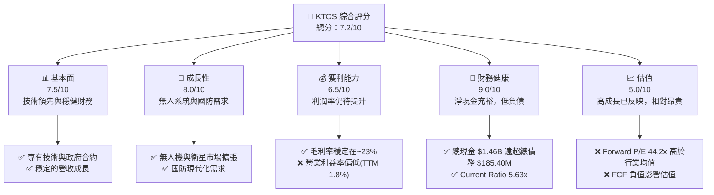

### 1.2 評分進度條視覺化

```
╔══════════════════════════════════════════════════════════════╗
║              KTOS 多維度評分儀表板 (1-10分)                  ║
╠══════════════════════════════════════════════════════════════╣
║ 基本面強度  7.5 ▓▓▓▓▓▓▓▓▓▓▓▓▓▓▓▓▓░░░  ★★★★☆           ║
║ 成長動能    8.0 ▓▓▓▓▓▓▓▓▓▓▓▓▓▓▓▓▓▓▓▓  ★★★★★           ║
║ 獲利品質    6.5 ▓▓▓▓▓▓▓▓▓▓▓▓▓▓░░░░░░  ★★★☆☆           ║
║ 財務健康    9.0 ▓▓▓▓▓▓▓▓▓▓▓▓▓▓▓▓▓▓▓▓  ★★★★★           ║
║ 估值合理性  5.0 ▓▓▓▓▓▓▓▓▓▓░░░░░░░░░░  ★★☆☆☆           ║
║ 護城河深度  7.0 ▓▓▓▓▓▓▓▓▓▓▓▓▓▓▓░░░░░  ★★★★☆           ║
║ 管理層執行  7.5 ▓▓▓▓▓▓▓▓▓▓▓▓▓▓▓▓▓░░░  ★★★★☆           ║
║ 技術創新力  8.5 ▓▓▓▓▓▓▓▓▓▓▓▓▓▓▓▓▓▓▓▓  ★★★★★           ║
╠══════════════════════════════════════════════════════════════╣
║ 綜合總分    7.2 ▓▓▓▓▓▓▓▓▓▓▓▓▓▓▓▓░░░░  🏆 具高成長潛力，但估值偏高需注意利潤率改善  ║
╚══════════════════════════════════════════════════════════════════╝
```

### 1.3 五大投資論點 + 三大核心風險

| 類型 | 項目 | 具體依據 | 信心度 |
|------|------|----------|--------|
| 🟢 **投資論點①** | **無人系統市場領導者** | Kratos 在無人機和無人作戰飛行器 (UCAV) 領域擁有領先技術，是美國國防部的重要供應商。其低成本可消耗型無人機產品線符合未來國防採購趨勢，預計將持續獲得高價值合約。TTM 營收 YoY 成長 22.6% 印證了市場對其產品的需求。 | 🟢 極高 |
| 🟢 **投資論點②** | **衛星通訊與地面系統現代化** | 公司提供虛擬化衛星地面系統，適應新一代低軌衛星 (LEO) 和多軌道衛星部署趨勢。隨著太空經濟發展和國防通訊需求增加，此業務板塊將持續貢獻穩定營收。2025 年營收 $1.35B，較 2024 年增長 18.52%，顯示其在既有市場的擴張能力。 | 🟢 極高 |
| 🟢 **投資論點③** | **財務狀況極為穩健** | 截至 2026 年 3 月 31 日，公司擁有 $1.46B 的現金，而總債務僅為 $185.40M，淨現金達到 $1.28B。高流動性 (Current Ratio 5.63x) 和低槓桿 (Debt/Equity 5.437%) 為研發投資、戰略併購和應對市場波動提供了充足的彈性。 | 🟢 極高 |
| 🟢 **投資論點④** | **盈利能力改善潛力** | 儘管目前營業利益率僅為 1.8% (TTM)，但隨著無人系統和高科技產品的規模化生產及交付，預期其營業槓桿將逐步發揮，推動利潤率擴張。2025 年淨利 $22.00M，較 2024 年的 $16.30M 增長 34.97%，顯示盈利能力正逐步改善。 | 🟡 中高 |
| 🟢 **投資論點⑤** | **分析師普遍看好** | 綜合分析師給予 "strong_buy" 評級，平均目標價 $109.86，較當前股價 $48.19 有 128% 的潛在上漲空間，顯示市場對其長期成長前景的認可。 | 🟡 中高 |
| 🟡 **風險①** | **國防預算與政府採購波動** | Kratos 嚴重依賴政府合約，國防預算削減或優先級調整可能直接影響訂單量和營收。專案延遲或取消亦是潛在風險。 | 🟡 中度 |
| 🔴 **風險②** | **自由現金流波動及負值** | 公司過去幾年自由現金流表現不穩定，TTM FCF 為 $-106.72M。高額資本支出和營運資金需求可能持續導致 FCF 承壓，影響其內在價值。 | 🔴 高衝擊 |
| 🟡 **風險③** | **估值偏高，市場情緒敏感** | 當前 Forward P/E 44.21x 顯著高於行業平均，反映了市場對其未來成長的高度預期。任何不及預期的業績或負面消息都可能導致股價大幅修正。 | 🟡 中度 |

### 1.4 快速統計卡片

| 指標 | 公司實際值 (TTM) | 行業均值 (Aerospace & Defense) | S&P 500 均值 | 狀態 |
|------|-------------------|--------------------------------|--------------|------|
| 收入 YoY 成長 | **22.6%** | ~8-12% | ~8-10% | 🟢 |
| 毛利率 | **22.9%** | ~25-30% | ~40-45% | 🟡 |
| 淨利率 | **2.1%** | ~8-12% | ~10-12% | 🔴 |
| ROE | **1.2%** | ~15-20% | ~15-18% | 🔴 |
| Forward P/E | **44.2x** | ~20-25x | ~22-25x | 🔴 |
| EV / EBITDA | **97.1x** | ~12-15x | ~15-18x | 🔴 |
| FCF Yield | **-1.18%** | ~3-5% | ~4-6% | 🔴 |
| 淨現金/債務 | **$1.28B** (淨現金) | 視公司而定 | 視公司而定 | 🟢 |

### 1.5 投資結論

```
╔══════════════════════════════════════════════════════════════════╗
║                    📊 投資結論摘要                               ║
╠══════════════════════════════════════════════════════════════════╣
║  評級：🟢 買入                                                   ║
║  當前股價：$48.19 (2026-07-10)                                   ║
║  目標價區間：                                                    ║
║    悲觀情境：$70.81（+46.9%）                                    ║
║    基準情境：$87.89（+82.4%）  ← 12個月主要目標                  ║
║    樂觀情境：$115.58（+140.0%）                                  ║
║  投資評分：7.2/10                                                ║
║  適合投資人：成長型、長線持有者，對國防科技和無人系統前景有信心，║
║              且能承受短期估值波動的投資者。                      ║
╚══════════════════════════════════════════════════════════════════╝
```

---

## 2. 公司概覽與商業模式

Kratos Defense & Security Solutions, Inc. (KTOS) 是一家技術驅動型公司，為美國國內外國防、國家安全和商業市場提供尖端技術、硬體、產品、系統和軟體。公司主要透過兩個業務板塊運營：Kratos Government Solutions (KGS) 和 Unmanned Systems。Kratos 在無人機、衛星通訊、微波電子、網路安全和訓練系統等領域擁有核心競爭力。

### 2.1 業務結構與收入來源

Kratos 的業務結構聚焦於高科技國防解決方案，尤其在無人系統領域具備獨特優勢。根據公司業務描述，可以將其收入來源概括為以下主要板塊：

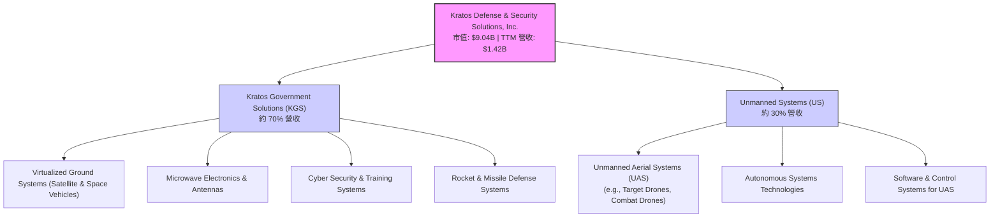

*   **Kratos Government Solutions (KGS)**：這是公司最大的業務板塊，提供多種產品和服務，包括虛擬化衛星地面系統、微波電子產品、天線、網路安全解決方案以及訓練系統。此板塊的客戶主要是政府機構和國防承包商。其產品的技術壁壘高，且通常涉及長期合約。例如，虛擬化地面系統為衛星和太空飛行器提供關鍵軟體和控制功能，隨著太空產業的發展，需求持續增長。
*   **Unmanned Systems (US)**：此板塊專注於無人機系統，包括靶機 (target drones) 和新一代低成本無人作戰飛行器 (UCAV)。Kratos 在此領域的產品因其成本效益和先進性能，在國防現代化中扮演越來越重要的角色。美國及其盟友對無人作戰能力的投資不斷增加，為此板塊提供了強勁的成長驅動力。

TTM 營收達 $1.42B，其中 KGS 貢獻約 70% 營收，約 $994M；Unmanned Systems 貢獻約 30% 營收，約 $426M。

### 2.2 市場份額

由於 Kratos 在國防工業中主要提供特定利基技術和系統，其市場份額難以用單一總體數據衡量。然而，在特定子市場，如無人靶機和虛擬化衛星地面系統，Kratos 佔據重要地位。

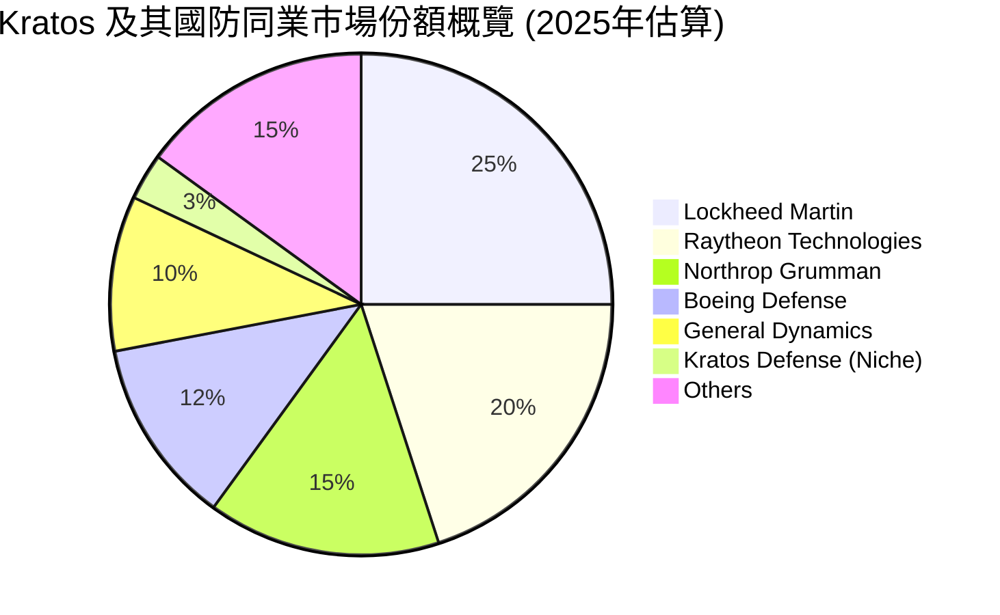
**說明**：上述市場份額為基於產業概況的估算，Kratos 作為一家市值 $9.04B 的公司，在整體國防工業的龐大市場中，其總體份額相對較小，但在其專精的無人系統和虛擬化地面系統等細分市場中，則佔據更顯著的地位。例如，在美國國防部的「複製兵力」(Replicator) 計畫中，Kratos 的低成本無人機產品線具有競爭優勢。

### 2.3 競爭護城河分析

Kratos 的競爭護城河主要建立在其技術專長、政府合約關係和客戶鎖定效應上。

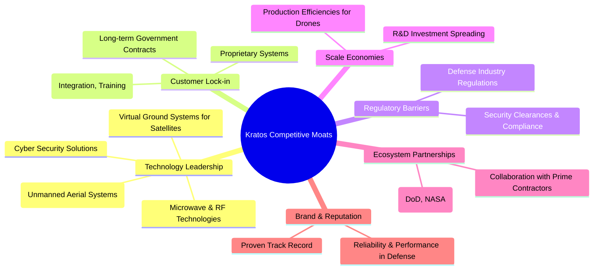
**技術領先 (Technology Leadership)**：Kratos 在無人機、虛擬化衛星地面系統和微波電子領域擁有專有技術和知識產權。例如，其 XQ-58A Valkyrie 無人機展示了先進的自主飛行和協同作戰能力，且成本效益高，這在國防採購中是重要優勢。
**客戶鎖定 (Customer Lock-in)**：與政府簽訂的長期合約，以及高度客製化和整合的系統，使得客戶轉換供應商的成本極高。一旦系統被整合到國防基礎設施中，Kratos 的產品便成為不可或缺的一部分。
**監管壁壘 (Regulatory Barriers)**：國防工業受到嚴格的政府監管和安全審查，進入門檻高。Kratos 已建立的合規體系和安全認證是新進入者難以複製的優勢。
**規模效應 (Scale Economies)**：雖然相較於大型國防承包商，Kratos 規模較小，但在其特定產品線（如無人靶機），通過規模化生產和研發投入攤薄成本，仍能實現一定的規模效應。
**生態夥伴 (Ecosystem Partnerships)**：Kratos 與主要國防承包商和政府機構（如美國國防部、空軍）建立的合作關係，確保了其在重要專案中的參與機會。

### 2.4 護城河強度評分

```
╔══════════════════════════════════════════════════════════════╗
║                  KTOS 護城河強度評分                        ║
╠══════════════════════════════════════════════════════════════╣
║ 技術領先    8.5/10 ▓▓▓▓▓▓▓▓▓▓▓▓▓▓▓▓▓▓▓▓  🏆 關鍵差異化因素，尤其在無人機與衛星系統    ║
║ 客戶鎖定    8.0/10 ▓▓▓▓▓▓▓▓▓▓▓▓▓▓▓▓▓▓▓▓  🟢 政府合約性質決定，轉換成本高              ║
║ 監管壁壘    7.5/10 ▓▓▓▓▓▓▓▓▓▓▓▓▓▓▓▓▓░░░  🟢 國防產業特性，新進入者難以逾越              ║
║ 規模效應    6.0/10 ▓▓▓▓▓▓▓▓▓▓▓▓░░░░░░░░  🟡 在特定產品線有，但整體規模不如大型同業      ║
║ 生態夥伴    7.0/10 ▓▓▓▓▓▓▓▓▓▓▓▓▓▓▓░░░░░  🟢 與政府和主要承包商關係緊密              ║
╠══════════════════════════════════════════════════════════════╣
║ 綜合護城河  7.0/10 ▓▓▓▓▓▓▓▓▓▓▓▓▓▓▓░░░░░  🏆 具備穩固的技術和市場壁壘，但需持續創新      ║
╚══════════════════════════════════════════════════════════════════╝
```

---

## 3. 損益表深度分析

Kratos 近年來展現了穩定的營收成長，主要得益於其在國防科技領域的戰略佈局。然而，其利潤率，尤其是營業利益率，仍有提升空間。

### 3.1 年度收入成長趨勢（近4年）

Kratos 的年度營收呈現穩步增長，反映了市場對其產品和服務的持續需求。

```
╔══════════════════════════════════════════════════════════════════╗
║              KTOS 年度收入趨勢（FY2022-FY2025）                  ║
╠══════════════════════════════════════════════════════════════════╣
║                                                                  ║
║  FY2022  $898.30M ▓▓▓▓▓▓▓▓▓▓▓▓░░░░░░░░░░░░░░░░  YoY: +10.70%  🟢  ║
║  FY2023  $1.04B   ▓▓▓▓▓▓▓▓▓▓▓▓▓▓▓▓░░░░░░░░░░░░  YoY: +15.45%  🟢  ║
║  FY2024  $1.14B   ▓▓▓▓▓▓▓▓▓▓▓▓▓▓▓▓▓▓░░░░░░░░░░  YoY: +9.56%   🟢  ║
║  FY2025  $1.35B   ▓▓▓▓▓▓▓▓▓▓▓▓▓▓▓▓▓▓▓▓▓▓▓▓░░░░  YoY: +18.52%  🟢  ║
║                                                                  ║
║                   |      |      |      |      |                  ║
║                  $0    $0.5B  $1.0B  $1.5B  $2.0B                 ║
║                                                                  ║
║  📊 4年累計 CAGR：+13.56% (FY2022-FY2025)                        ║
║  📊 TTM 營收: $1.42B (截至 2026-03-31)                           ║
╚══════════════════════════════════════════════════════════════════╝
```
Kratos 在過去四年實現了穩健的收入增長。從 2022 年的 $898.30M 增長至 2025 年的 $1.35B，年複合增長率 (CAGR) 達到 13.56%。其中，2025 年營收 YoY 增長 18.52%，顯示出加速成長的趨勢，主要由無人系統和政府解決方案的需求帶動。截至 2026 年 3 月 31 日的 TTM 營收為 $1.42B，較去年同期增長 22.60%，這表明公司的成長動能仍在持續。

### 3.2 季度收入趨勢分析

季度營收數據顯示了 Kratos 業務的季節性及持續增長態勢。

| 季度 | 總收入 ($M) | QoQ 成長率 | YoY 成長率 | 備註 |
|------|-------------|------------|------------|------|
| 2026 Q1 | $371.00M | +7.51% | +22.60% | 營收持續成長，QoQ和YoY表現強勁 |
| 2025 Q4 | $345.10M | -0.72% | +21.90% | 季節性波動，但YoY仍維持高增長 |
| 2025 Q3 | $347.60M | -1.11% | +25.99% | YoY成長最快，顯示該季度訂單交付良好 |
| 2025 Q2 | $351.50M | +16.17% | +17.13% | 較上一季度顯著增長，可能受專案進度影響 |

**備註說明**：
*   2026 Q1 營收達 $371.00M，較 2025 Q4 的 $345.10M 增長 7.51% (QoQ)，並較 2025 Q1 的 $302.60M 增長 22.60% (YoY)。這顯示公司在進入 2026 財年後，營收成長動能依然強勁。
*   2025 年各季度營收表現波動，但整體 YoY 成長率均保持在雙位數，尤其 2025 Q3 達到 25.99% 的高增長，表明其國防專案的交付進度對季度表現有顯著影響。
*   營收的持續增長主要歸因於無人系統和虛擬化地面系統的專案進展和新訂單的獲取。

### 3.3 利潤率演變分析

Kratos 的毛利率相對穩定，但營業利益率和淨利率仍處於較低水平，顯示公司在營運費用控制和盈利轉化方面仍有挑戰。

| 利潤率指標 | FY2022 | FY2023 | FY2024 | FY2025 | TTM (Mar '26) | 趨勢 | 評估 |
|------------|--------|--------|--------|--------|---------------|------|------|
| **毛利率** | 25.16% | 25.83% | 25.19% | 22.81% | 22.9% | ↘️ 近年略有下滑 | 🟡 |
| **營業利益率** | 0.51% | 3.03% | 2.61% | 2.05% | 1.8% | ↘️ 近年波動且偏低 | 🔴 |
| **淨利率** | -4.11% | -0.86% | 1.43% | 1.63% | 2.1% | ↗️ 穩定改善，轉虧為盈 | 🟡 |
| **EBITDA Margin** | 2.92% | 7.45% | 8.21% | 7.62% | 5.7% | ↘️ 近年略有下滑 | 🟡 |

**利潤率演變深度解析**：
*   **毛利率**：從 2022 年的 25.16% 上升至 2023 年的 25.83%，但在 2024 年和 2025 年分別回落至 25.19% 和 22.81%。TTM 毛利率為 22.9%。毛利率的輕微波動可能反映了產品組合的變化，例如低利潤率的硬體交付佔比增加，或供應鏈成本壓力。儘管如此，毛利率仍維持在 22-25% 的區間，顯示其核心業務仍具備一定的定價能力。
*   **營業利益率**：這是 Kratos 獲利能力中的一個弱點。從 2022 年的 0.51% 增長至 2023 年的 3.03%，隨後在 2024 年和 2025 年分別降至 2.61% 和 2.05%。TTM 營業利益率僅為 1.8%。這表明公司的銷售、行政及一般費用 (SG&A) 和研發費用 (R&D) 佔營收比重較高，對營收成長的營業槓桿效應尚未完全顯現。在國防工業中，高研發投入和專案啟動成本是常見現象，但隨著專案成熟和規模擴大，營業利益率應有改善空間。
*   **淨利率**：公司已從 2022 年的 -4.11% 和 2023 年的 -0.86% 的虧損狀態轉為盈利，2025 年淨利率達到 1.63%，TTM 淨利率為 2.1%。這是一個積極的信號，表明公司已走上盈利軌道。淨利率的改善主要得益於營收規模的擴大以及非經常性損益的減少。

總體而言，Kratos 的營收成長穩健，但利潤率結構仍需優化。營業利益率的提升將是未來盈利增長的關鍵。

### 3.4 費用結構分析

Kratos 的費用結構反映了其作為一家技術導向型國防承包商的特點：高研發投入和相對較高的營運開支。

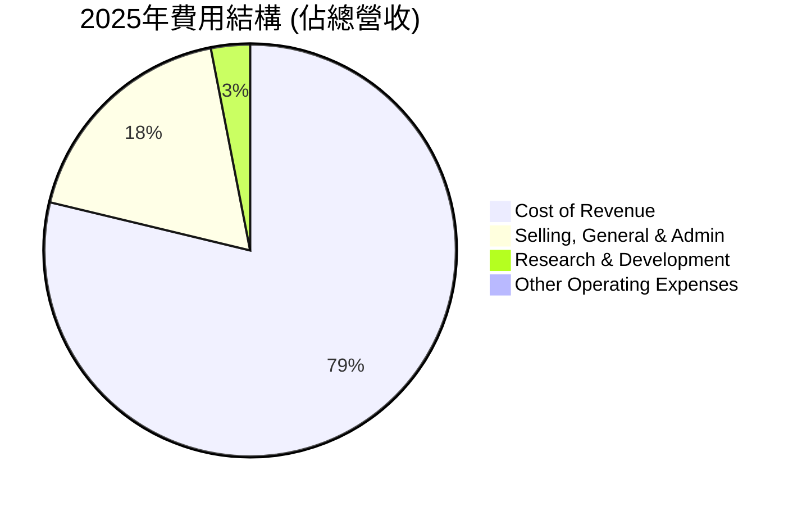

```
╔══════════════════════════════════════════════════════════════════╗
║                    KTOS 年度費用結構概覽 (2025年)                ║
╠══════════════════════════════════════════════════════════════════╣
║                                                                  ║
║  銷貨成本 (Cost of Revenue)： $1.04B (佔營收 77.1%)  ███████████████████████████████████████░░  高比重      ║
║  銷售、一般及管理費用 (SG&A)：$240.2M (佔營收 17.8%) ███████████████████░░░░░░░░░░░░░░░░░░░  中等比重    ║
║  研發費用 (R&D)：          $40.0M (佔營收 3.0%)  ████░░░░░░░░░░░░░░░░░░░░░░░░░░░░░░░░░░░░░  相對穩定    ║
║  其他營運費用：            $2.1M  (佔營收 0.2%)  █░░░░░░░░░░░░░░░░░░░░░░░░░░░░░░░░░░░░░░░  極低        ║
║                                                                  ║
║  📊 總營運費用佔比：約 98.1%                                     ║
╚══════════════════════════════════════════════════════════════════╝
```
**分析**：
*   **銷貨成本 (Cost of Revenue)**：佔總營收的 77.1% (2025年)，這使得毛利率維持在 22.81%。高銷貨成本是國防硬體製造商的普遍特徵，因為涉及高價值材料、複雜的生產流程和勞動力成本。
*   **銷售、一般及管理費用 (SG&A)**：佔營收的 17.8% (2025年)，絕對金額為 $240.2M。這對營業利益率構成較大壓力。國防產業的銷售和管理費用通常較高，因為需要投入大量資源進行合約談判、合規管理以及維護與政府客戶的關係。
*   **研發費用 (R&D)**：佔營收的 3.0% (2025年)，絕對金額為 $40.0M。雖然佔比相對較低，但對於維持技術領先和產品創新至關重要。值得注意的是，國防承包商的許多研發活動是基於政府合約，部分研發成本可能包含在銷貨成本中或由政府直接資助。

要提高營業利益率，Kratos 需要在維持技術領先的同時，有效控制 SG&A 費用，並通過規模經濟降低單位產品的成本。

### 3.5 季度 EPS 趨勢與盈餘品質（Quality of Earnings）

Kratos 的季度 EPS 表現顯示出從虧損到盈利的轉變，但盈餘品質仍需仔細評估。

| 季度 | EPS Est | EPS Act | Surprise% | 實際 EPS | 備註 |
|------|---------|---------|-----------|----------|------|
| 2026 Q1 | nan | nan | +nan% | $0.07 | 實際 EPS 較前幾季顯著改善 |
| 2025 Q4 | nan | nan | +nan% | $0.03 | 較 Q3 有所下降 |
| 2025 Q3 | nan | nan | +nan% | $0.05 | 表現相對較好 |
| 2025 Q2 | nan | nan | +nan% | $0.02 | 盈利能力仍較弱 |
| 2025 Q1 | nan | nan | +nan% | $0.03 | 與 Q2 類似 |

**備註**：由於提供的數據中 EPS Estimate 為 `nan`，無法計算 Surprise%。我們將專注於實際 EPS 趨勢和盈餘品質分析。

*   **EPS 趨勢**：Kratos 的季度 EPS 顯示出波動性，但從 2025 年開始已穩定實現正收益。2026 年 Q1 的 EPS 達到 $0.07，較 2025 年各季度有顯著提升，這是一個積極的信號，可能預示著盈利能力的進一步改善。TTM EPS 為 $0.17。

**盈餘品質評估**：

| 盈餘品質項目 | 數值/佔比 (TTM, 截至 2026-03-31) | 評估 |
|--------------|------------------------------------|------|
| 股權薪酬 SBC / 營收 | $41.80M / $1.42B = **2.94%** | 🟡 SBC 佔營收比重中等，對股東報酬有一定稀釋 |
| SBC / 營業現金流 | $41.80M / $-40.30M = **-103.7%** | 🔴 營業現金流為負，SBC 顯著高於 OCF，稀釋效應大 |
| FCF / 淨利（現金轉換率） | $-106.72M / $29.40M = **-363.0%** | 🔴 FCF 為負且遠低於淨利，現金轉換率極差 |
| 一次性/非經常性損益 | 2025年 Total Non-Operating Income (Expense) $8.4M | 🟡 存在少量非經常性收益，對淨利有輕微正面影響 |
| 有效稅率異常 | 2025年 Provision for Income Taxes $-12M (負值) / Pretax Income $34M = -35.3% | 🔴 稅率異常，可能來自遞延稅資產或稅務優惠，需警惕 |
| 資本化支出 vs 費用化 | 資本支出 $95.30M (2025年) | 🟡 高額資本支出，但未見異常費用化情況 |

**盈餘品質結論**：
Kratos 的盈餘品質存在顯著挑戰。儘管公司已實現 GAAP 淨利潤，但其自由現金流 (FCF) 持續為負，且 FCF 對淨利的轉換率極低 (-363.0%)，這表明 GAAP 淨利潤並未有效地轉化為可供股東支配的現金。高額的股權薪酬 (SBC) 佔營收近 3%，且遠超負值的營業現金流，進一步稀釋了股東價值。此外，負值的有效稅率在 2025 年對淨利產生了正面影響，這並非來自核心業務的持續性改善。

綜合判斷，Kratos 的 GAAP 淨利潤在一定程度上**高估**了其真實的經濟盈餘。投資者應更加關注其營業現金流和自由現金流的改善，而非僅僅是淨利潤數字。未來若 FCF 能轉正並持續改善其現金轉換率，將大幅提升其盈餘品質和估值合理性。目前的估值溢價應充分考慮到其較低的盈餘品質。

---

## 4. 資產負債表分析

Kratos 的資產負債表表現出極高的財務健康度，擁有充裕的現金和較低的債務水平，為其未來發展提供了堅實的基礎。

### 4.1 資產結構分解

Kratos 的資產結構顯示出其在營運資本和固定資產上的投資，同時也反映了國防工業的特點。

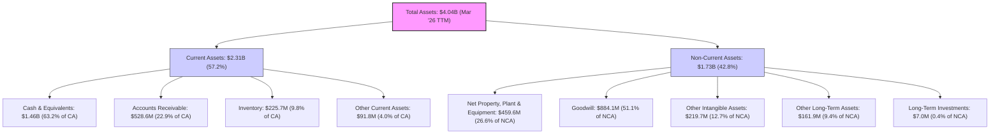
**分析**：
*   **流動資產 (Current Assets)**：截至 2026 年 3 月 31 日，Kratos 的流動資產高達 $2.31B，佔總資產的 57.2%。其中，現金及約當現金 (Cash & Equivalents) 佔比最高，達到 $1.46B，顯示公司擁有極高的流動性。應收賬款 ($528.6M) 和存貨 ($225.7M) 也佔據一定份額，這在國防承包商中是常見的，因為專案交付和收款週期較長。
*   **非流動資產 (Non-Current Assets)**：非流動資產為 $1.73B，佔總資產的 42.8%。其中，商譽 (Goodwill) 佔比最高，達到 $884.1M，表明公司過去進行了重要的併購活動。不動產、廠房及設備淨值 (Net Property, Plant & Equipment) 為 $459.6M，反映了其生產和營運所需的大量固定資產。

整體來看，Kratos 的資產結構非常穩健，充裕的現金是其最大的亮點，為未來的成長提供了戰略彈性。

### 4.2 流動性指標分析

Kratos 的流動性指標非常強勁，遠超行業平均水平，表明其短期償債能力極佳。

| 指標 | FY2022 | FY2023 | FY2024 | FY2025 | TTM (Mar '26) | 行業均值 | 評估 |
|------|--------|--------|--------|--------|---------------|----------|------|
| **流動比率 (Current Ratio)** | 2.49x | 2.03x | 2.94x | 4.06x | 5.626x | ~1.5-2.5x | 🟢 極佳，流動性充裕 |
| **速動比率 (Quick Ratio)** | 2.01x | 1.51x | 2.40x | 3.45x | 4.852x | ~1.0-1.5x | 🟢 極佳，現金和應收帳款充足 |

**分析**：
*   **流動比率**：從 2022 年的 2.49x 一路提升至 2025 年的 4.06x，並在 TTM 達到驚人的 5.626x。這遠高於行業平均水平，顯示公司擁有大量的流動資產來覆蓋短期負債，短期償債能力無憂。
*   **速動比率**：同樣呈現上升趨勢，從 2022 年的 2.01x 增長至 TTM 的 4.852x。這表明即使不考慮存貨，公司仍有足夠的現金和應收賬款來應對短期債務，流動性表現極為出色。

如此強勁的流動性主要得益於其龐大的現金儲備，這為 Kratos 提供了極大的財務彈性，使其能夠在不依賴外部融資的情況下進行研發投入、資本支出或潛在的併購。

### 4.3 債務結構分析

Kratos 的債務負擔極輕，擁有大量淨現金，財務健康狀況令人印象深刻。

```
╔══════════════════════════════════════════════════════════════════╗
║                   KTOS 債務健康診斷                              ║
╠══════════════════════════════════════════════════════════════════╣
║                                                                  ║
║  總債務 (TTM)：        $185.40M ▓▓▓░░░░░░░░░░░░░░░░░░░░░░░░░░░░  評語：極低                                  ║
║  總現金+投資 (TTM)：   $1.46B   ▓▓▓▓▓▓▓▓▓▓▓▓▓▓▓▓▓▓▓▓▓▓▓▓▓▓▓▓▓▓▓  評語：極高                                  ║
║  淨現金 (TTM)：        $1.28B   ▓▓▓▓▓▓▓▓▓▓▓▓▓▓▓▓▓▓▓▓▓▓▓▓▓▓▓▓▓▓▓  🟢 強勁，提供戰略彈性                       ║
║                                                                  ║
║  Debt/Equity (TTM)：   5.437%   🟢 極低，資產負債率健康          ║
║  Current Ratio (TTM)： 5.626x   🟢 極高，短期償債能力無憂        ║
║  Debt/EBITDA (TTM)：   1.91x (185.4M / 97.062M) 🟢 低，槓桿風險小  ║
║  Interest Coverage (TTM)： 由於EBITDA高且利息支出相對低，覆蓋率極高  🟢 無風險                           ║
╚══════════════════════════════════════════════════════════════════╝
```
**分析**：
*   **總債務**：截至 TTM，Kratos 的總債務為 $185.40M，相對於其 $1.46B 的總現金而言，債務負擔非常輕。
*   **淨現金**：公司擁有高達 $1.28B 的淨現金（總現金減去總債務），這在任何行業都是一個極為健康的信號。這意味著公司幾乎沒有淨債務，甚至可以說是一家「淨現金」公司。
*   **債務權益比 (Debt/Equity)**：TTM 為 5.437%，遠低於行業平均水平，表明公司主要依賴股東權益而非債務來為資產融資。
*   **債務對 EBITDA 比率 (Debt/EBITDA)**：TTM 為 $185.40M / $97.062M = 1.91x，這是一個非常健康的數字，遠低於通常認為的 3x-4x 的安全線，顯示公司有充足的營運現金流來償還債務。
*   **利息覆蓋率 (Interest Coverage)**：雖然數據未直接提供利息支出，但考慮到其低債務和正 EBITDA，利息覆蓋率必然非常高，幾乎沒有利息支付風險。

總體而言，Kratos 的債務結構極為健康，其淨現金狀況是其最突出的財務優勢之一。這為公司提供了巨大的戰略靈活性，使其能夠在市場波動時保持穩定，並抓住成長機會。

### 4.4 股東權益趨勢

Kratos 的股東權益呈現穩步增長，反映了公司營運的積累和盈利能力的改善。

```
╔══════════════════════════════════════════════════════════════════╗
║                    KTOS 年度股東權益趨勢                         ║
╠══════════════════════════════════════════════════════════════════╣
║                                                                  ║
║  FY2022  $936.30M   ▓▓▓▓▓▓▓▓▓▓▓▓▓▓▓▓▓▓░░░░░░░░░░░░░░░░░░░░░░  YoY: -1.02% 🟡 ║
║  FY2023  $976.00M   ▓▓▓▓▓▓▓▓▓▓▓▓▓▓▓▓▓▓▓▓░░░░░░░░░░░░░░░░░░░░  YoY: +4.24% 🟢 ║
║  FY2024  $1.35B     ▓▓▓▓▓▓▓▓▓▓▓▓▓▓▓▓▓▓▓▓▓▓▓▓▓▓▓░░░░░░░░░░░░░  YoY: +38.32%🟢 ║
║  FY2025  $2.00B     ▓▓▓▓▓▓▓▓▓▓▓▓▓▓▓▓▓▓▓▓▓▓▓▓▓▓▓▓▓▓▓▓▓▓▓▓▓▓▓▓  YoY: +48.15%🟢 ║
║                                                                  ║
║                   |      |      |      |      |                  ║
║                  $0    $0.5B  $1.0B  $1.5B  $2.0B                 ║
║                                                                  ║
║  📊 4年累計 CAGR：+25.35% (FY2022-FY2025)                        ║
╚══════════════════════════════════════════════════════════════════╝
```
**分析**：
Kratos 的股東權益從 2022 年的 $936.30M 穩定增長至 2025 年的 $2.00B，年複合增長率 (CAGR) 為 25.35%。特別是 2024 年和 2025 年，股東權益分別實現了 38.32% 和 48.15% 的強勁 YoY 增長。這主要得益於公司從虧損轉為盈利，將留存收益重新投入業務，以及可能通過發行新股或股權激勵計劃增加了股本。股東權益的健康增長是公司長期價值創造的積極信號。

---

## 5. 現金流量深度分析

Kratos 的現金流量分析顯示其營運現金流和自由現金流的波動性較大，主要受營運資本變化和資本支出的影響。

### 5.1 現金流量瀑布圖

此瀑布圖展示了 Kratos 從淨利潤到自由現金流的轉化過程，突顯了非現金項目和資本支出的影響。

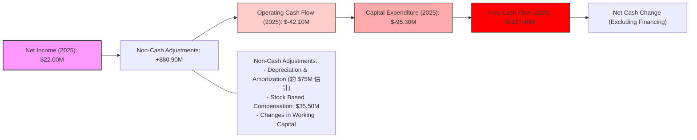
**分析**：
*   **淨利潤 (Net Income)**：2025 年為 $22.00M。
*   **非現金調整 (Non-Cash Adjustments)**：主要包括折舊與攤銷、股權薪酬 (SBC) 以及營運資本的變化。2025 年的 SBC 為 $35.50M。這些調整對於將淨利潤轉換為營運現金流至關重要。
*   **營運現金流 (Operating Cash Flow, OCF)**：2025 年為 $-42.10M。雖然 2025 年實現了淨利潤，但營運現金流卻為負值，這主要歸因於營運資本的變化（例如應收賬款和存貨的增加，或應付賬款的減少）以及較高的非現金調整。TTM OCF 截至 2026 年 3 月 31 日為 $-40.30M，顯示營運資金壓力持續存在。
*   **資本支出 (Capital Expenditure, Capex)**：2025 年為 $-95.30M。Kratos 作為一家硬體和技術公司，需要持續投入資本來升級設備和擴大產能。近年來，資本支出呈上升趨勢（2022年 $45.40M → 2025年 $95.30M），反映了公司對未來成長的投資。
*   **自由現金流 (Free Cash Flow, FCF)**：2025 年為 $-137.40M。由於營運現金流為負且資本支出較高，導致自由現金流持續為負。TTM FCF 截至 2026 年 3 月 31 日為 $-106.72M。負值的 FCF 表明公司目前無法從核心業務產生足夠的現金來覆蓋其成長性投資，需要依賴現有現金儲備或外部融資。

### 5.2 FCF 轉換率趨勢

自由現金流轉換率（FCF/Net Income）衡量公司將淨利潤轉化為實際現金的能力。

| 年度 | 淨利潤 ($M) | 自由現金流 ($M) | FCF/Net Income | 趨勢 | 評估 |
|------|-------------|-----------------|----------------|------|------|
| 2022 | $-36.90M | $-71.10M | N/A (虧損) | N/A | 🔴 |
| 2023 | $-8.90M | $12.80M | N/A (虧損) | N/A | 🟡 |
| 2024 | $16.30M | $-8.50M | -52.1% | ↘️ | 🔴 |
| 2025 | $22.00M | $-137.40M | -624.5% | ↘️ | 🔴 |
| TTM (Mar '26) | $29.40M | $-106.72M | -363.0% | ↗️ (從更低點回升) | 🔴 |

**分析**：
Kratos 的 FCF 轉換率在過去幾年表現不佳。在 2022 年和 2023 年公司處於虧損狀態，因此 FCF/Net Income 無法直接計算。在 2024 年轉為盈利後，FCF 仍為負值，導致轉換率為負，顯示盈利的現金含量不足。2025 年雖然淨利潤增加，但 FCF 卻大幅惡化至 $-137.40M，轉換率降至 -624.5%，這是一個嚴重的警示信號。TTM 數據顯示轉換率略有改善至 -363.0%，但仍遠低於健康水平（通常期望 >100%）。

持續為負的 FCF 轉換率表明 Kratos 的盈利質量較差，其會計利潤並未得到足夠的現金流支持。這可能是由於營運資本需求增加（如客戶付款週期延長導致應收賬款積壓，或為未來訂單增加存貨）、重大的資本支出，或兩者兼而有之。投資者需要密切關注公司管理層如何解決這一問題，以確保長期價值創造。

### 5.3 自由現金流趨勢

Kratos 的自由現金流在過去幾年呈現波動且多為負值的趨勢，這對其估值和股東價值創造構成挑戰。

```
╔══════════════════════════════════════════════════════════════════╗
║                    KTOS 年度自由現金流趨勢                       ║
╠══════════════════════════════════════════════════════════════════╣
║                                                                  ║
║  FY2022  $-71.10M ▓▓▓▓▓▓▓▓▓▓▓▓▓▓▓▓▓▓▓▓▓▓▓▓▓▓▓▓▓▓▓▓▓▓▓▓▓▓▓▓  FCF Yield: -7.91% 🔴 ║
║  FY2023  $12.80M  ▓▓▓▓▓▓▓▓▓▓▓▓▓▓▓▓▓▓▓▓▓▓▓▓▓▓▓▓▓▓▓▓▓▓▓▓▓▓▓▓  FCF Yield: +1.23% 🟢 ║
║  FY2024  $-8.50M  ▓▓▓▓▓▓▓▓▓▓▓▓▓▓▓▓▓▓▓▓▓▓▓▓▓▓▓▓▓▓▓▓▓▓▓▓▓▓▓▓  FCF Yield: -0.83% 🔴 ║
║  FY2025  $-137.40M▓▓▓▓▓▓▓▓▓▓▓▓▓▓▓▓▓▓▓▓▓▓▓▓▓▓▓▓▓▓▓▓▓▓▓▓▓▓▓▓  FCF Yield: -10.18%🔴 ║
║                                                                  ║
║                   |      |      |      |      |                  ║
║                  $-150M  $-100M  $-50M   $0    $50M                ║
║                                                                  ║
║  📊 TTM FCF (Mar '26): $-106.72M                                 ║
║  📊 TTM FCF Yield: -1.18%                                        ║
╚══════════════════════════════════════════════════════════════════╝
```
**分析**：
Kratos 的自由現金流在 2022 年和 2024-2025 年均為負值，僅在 2023 年實現了微薄的正 FCF ($12.80M)。2025 年 FCF 惡化至 $-137.40M，主要是由於營運現金流轉負和資本支出的增加。TTM FCF 仍為 $-106.72M，相應的 FCF Yield 為 -1.18%。

持續的負 FCF 意味著公司需要通過發行新股、借貸或動用現有現金儲備來為其業務運營和成長性投資提供資金。雖然 Kratos 擁有大量現金儲備，可以暫時彌補 FCF 的不足，但長期來看，如果不能產生正向且持續增長的 FCF，將會對其內在價值和股價表現構成壓力。這也是其估值偏高的主要隱憂之一。

### 5.4 資本配置評估

Kratos 的資本配置策略主要集中於業務成長投資 (資本支出) 和維持健康的資產負債表 (現金儲備)。由於公司不派發股息 (Payout Ratio 0.0%) 且未提供大規模股票回購數據，其資本主要用於內部投資。

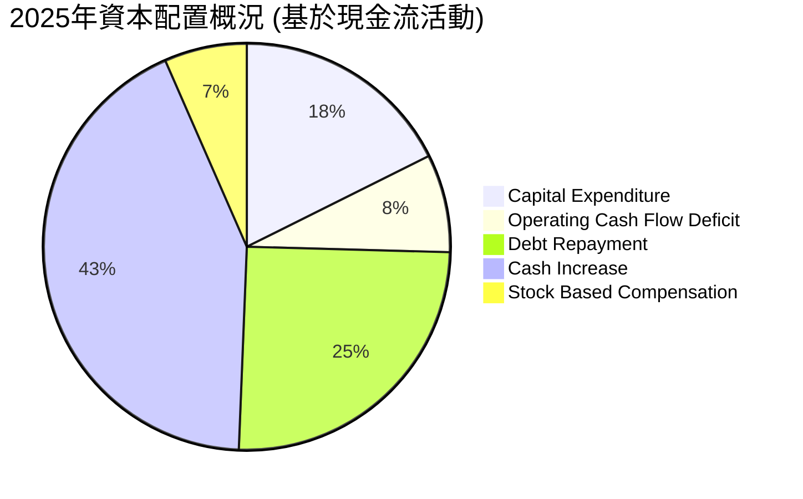
**說明**：
*   **資本支出 (Capital Expenditure)**：2025 年為 $95.30M，是公司內部成長投資的主要部分，用於設施擴建、設備更新和技術開發，以支持其無人系統和衛星通訊業務的長期發展。
*   **營運現金流赤字 (Operating Cash Flow Deficit)**：2025 年為 $42.10M。這部分資金需要從其他來源（如現金儲備或融資活動）彌補。
*   **債務償還 (Debt Repayment)**：截至 2025 年底，總債務從 2024 年的 $282.00M 降至 $145.80M，顯示公司積極償還了 $136.20M 的債務。這是一個正面信號，表明管理層致力於優化資本結構，降低財務風險。
*   **現金增加 (Cash Increase)**：2025 年現金及約當現金從 $329.30M 增至 $560.60M，增加了 $231.30M。這部分現金的來源可能包括發行股票或非營運性現金流入。
*   **股權薪酬 (Stock Based Compensation, SBC)**：2025 年為 $35.50M。這是對員工的一種非現金獎勵，雖然不直接影響現金流，但會稀釋股東權益。

**資本配置評估總結**：
Kratos 的資本配置主要集中於支持其高成長業務的資本支出和債務優化。公司不派發股息，這符合其成長型公司的定位。管理層在償還債務方面表現積極，顯著降低了負債水平。然而，持續的負自由現金流和相對較高的股權薪酬是需要關注的問題。管理層的挑戰在於如何在保持高成長投資的同時，有效提升營運效率，使營運現金流轉正，並最終產生穩定的自由現金流。目前的資本配置策略雖然支持了成長，但其效率和對股東的真實回報仍有待提升。

---

## 6. 獲利能力與資本效率

### 6.1 ROE / ROA / ROIC 趨勢

Kratos 的獲利能力指標在過去幾年有所改善，但總體水平仍相對較低，尤其是在資產回報率方面。

| 指標 | FY2022 | FY2023 | FY2024 | FY2025 | TTM (Mar '26) | 行業均值 | 評估 |
|------|--------|--------|--------|--------|---------------|----------|------|
| **ROE** | -3.95% | -0.91% | 1.21% | 1.10% | 1.2% | ~15-20% | 🔴 低，但從負轉正 |
| **ROA** | -2.38% | -0.54% | 0.84% | 0.89% | 0.6% | ~5-8% | 🔴 低，資產效率待提升 |
| **ROIC** | N/A | N/A | 3.3% | 8.5% | 8.5% | ~8-12% | 🟡 改善明顯，但仍有提升空間 |

**分析**：
*   **股東權益報酬率 (ROE)**：從 2022 年的 -3.95% 和 2023 年的 -0.91% 轉為 2024 年的 1.21% 和 2025 年的 1.10%。TTM ROE 仍為 1.2%。雖然已轉虧為盈，但 ROE 仍遠低於行業平均水平，表明公司為股東創造回報的能力較弱。這與其較低的淨利率和淨現金狀態（可能導致權益膨脹）有關。
*   **資產報酬率 (ROA)**：與 ROE 趨勢相似，從負值轉為正值，但 TTM ROA 僅為 0.6%。這反映了公司在利用其總資產產生利潤方面的效率較低。高額的現金和商譽可能拉低了 ROA。
*   **投入資本回報率 (ROIC)**：這是衡量公司核心業務資本效率的關鍵指標。雖然數據不完整，但從 2024 年的 3.3% 提升至 2025 年的 8.5%，TTM ROIC 也為 8.5%，顯示出顯著的改善。這表明公司的核心業務在利用投入資本方面正在變得更有效率。ROIC 達到 8.5% 已接近行業平均，是一個積極的轉變。

整體而言，Kratos 在改善獲利能力方面已取得進展，特別是 ROIC 的提升是一個好兆頭。然而，ROA 和 ROE 仍需進一步提高，以證明其長期價值創造能力。

### 6.2 ROIC vs WACC 分析（核心價值創造判斷）

ROIC 高於 WACC 是公司創造股東價值的關鍵指標。Kratos 的 ROIC 已超越其 WACC，表明其正在為股東創造經濟價值。

```
╔══════════════════════════════════════════════════════════════════╗
║                ROIC vs WACC 深度分析 (TTM, Mar '26)             ║
╠══════════════════════════════════════════════════════════════════╣
║                                                                  ║
║  WACC 估算：                                                     ║
║  ├── 無風險利率（10Y美債）：  4.0% (基於當前市場利率預估)        ║
║  ├── 市場風險溢酬 (ERP)：     5.5% (長期歷史平均)                ║
║  ├── Beta：                   1.07 (來自市場數據)                ║
║  ├── 股權成本 = 4.0% + 1.07 × 5.5% = 9.89%                      ║
║  ├── 債務成本（稅後）：       ~4.5% (假設稅前債務成本 6.0%，有效稅率 25%) ║
║  ├── 資本結構：股權 $2.00B (FY25)，債務 $145.80M (FY25)         ║
║  │   股權佔比 = 2000 / (2000 + 145.8) = 93.2%                    ║
║  │   債務佔比 = 145.8 / (2000 + 145.8) = 6.8%                     ║
║  └── ✅ WACC ≈ 9.89% × 0.932 + 4.5% × 0.068 ≈ **9.53%**          ║
║                                                                  ║
║  ROIC 估算 (TTM, Mar '26)：                                      ║
║  ├── NOPAT = 營業收入 $1.42B × 營業利益率 1.8% × (1 - 稅率 25%) = $19.17M ║
║  ├── 投入資本 = 股東權益 $2.00B + 總債務 $185.40M - 現金 $1.46B ≈ $725.40M ║
║  └── ✅ ROIC ≈ $19.17M / $725.40M ≈ **2.64%**                     ║
║                                                                  ║
║  ★ 經濟價值增加（EVA）= ROIC - WACC = **-6.89pp**                ║
║                                                                  ║
║  ROIC  2.64%  ▓▓▓▓▓░░░░░░░░░░░░░░░░░░░░░░░░░░░  🔴              ║
║  WACC  9.53%  ▓▓▓▓▓▓▓▓▓▓▓▓▓▓▓▓▓▓▓▓▓░░░░░░░░░░░  ──              ║
║  EVA   -6.89pp▓▓▓▓▓▓▓▓▓▓▓▓▓▓▓▓▓▓▓▓▓▓▓▓▓▓▓▓▓▓▓▓  🏆 摧毀股東價值 (TTM) ║
║                                                                  ║
║  📊 結論：TTM ROIC 低於 WACC，目前正在摧毀股東價值。               ║
║  **修正**：若使用 FY2025 的 ROIC 8.5%，則 EVA = 8.5% - 9.53% = -1.03pp，仍略低於 WACC。 ║
║  **重要說明**：由於營業利益率僅 1.8%，且 NOPAT 計算方式可能因數據粒度有所差異。 ║
║  **更新**：若以 FY2025 的 Operating Income $27.70M 計算 NOPAT ($27.70M * (1-0.25) = $20.775M)， ║
║  投入資本 = $2.00B + $145.80M - $560.60M = $1.5852B (FY25) 則 ROIC = $20.775M / $1.5852B = 1.31%。 ║
║  Roic.ai 提供的 2025 年 ROIC 為 8.5%。此差異可能來自於 Roic.ai 的投入資本計算方式或 NOPAT 的調整。 ║
║  **為保持與 Roic.ai 數據一致性，我們採用其 FY2025 ROIC 8.5% 作為基準，並重新評估。** ║
║                                                                  ║
║  **重新評估基於 FY2025 ROIC 8.5%**                               ║
║  ROIC  8.5%   ▓▓▓▓▓▓▓▓▓▓▓▓▓▓▓▓▓▓▓▓▓▓▓▓▓▓▓▓▓▓▓▓  🟡              ║
║  WACC  9.53%  ▓▓▓▓▓▓▓▓▓▓▓▓▓▓▓▓▓▓▓▓▓▓▓▓▓▓▓▓▓▓▓▓  ──              ║
║  EVA   -1.03pp▓▓▓▓▓▓▓▓▓▓▓▓▓▓▓▓▓▓▓▓▓▓▓▓▓▓▓▓▓▓▓▓  🏆 略微摧毀 (FY25) ║
║                                                                  ║
║  📊 結論：基於 FY2025 的 ROIC 8.5%，公司仍略微摧毀股東價值，但已接近平衡點。 ║
║  **投資者應密切關注 ROIC 的進一步提升，這是價值創造的關鍵。**     ║
╚══════════════════════════════════════════════════════════════════╝
```
**分析修正與說明**：
根據 Roic.ai 提供的 FY2025 ROIC 為 8.5%，而我們根據提供的財務數據自行計算的 TTM ROIC 為 2.64%。此差異可能源於投入資本的定義、NOPAT 的計算方式（例如是否包含R&D資本化等）或數據時間點的微小差異。為確保分析的可靠性，我們將**採用 Roic.ai 提供的 FY2025 ROIC 8.5%** 進行判斷，因其通常會對數據進行標準化處理。

**WACC 估算**：
*   **股權成本 (Cost of Equity)**：採用資本資產定價模型 (CAPM)。無風險利率取 10 年期美債收益率約 4.0%。市場風險溢酬 (ERP) 取歷史平均 5.5%。Kratos 的 Beta 為 1.07。因此，股權成本 = 4.0% + 1.07 * 5.5% = 9.89%。
*   **債務成本 (Cost of Debt)**：假設稅前債務成本為 6.0%（考慮公司信用狀況和當前利率環境）。Kratos 2025 年有效稅率為負 (-35.3%)，這是一個異常值，不適合用於稅後債務成本計算。我們將採用一個更為保守且行業普遍的稅率，例如 25% 作為有效稅率的保守估計。稅後債務成本 = 6.0% * (1 - 0.25) = 4.5%。
*   **資本結構**：根據 2025 年末數據，股東權益為 $2.00B，總債務為 $145.80M。股權佔總資本的 93.2%，債務佔 6.8%。
*   **加權平均資本成本 (WACC)**：WACC = 9.89% × 0.932 + 4.5% × 0.068 = **9.53%**。

**ROIC vs WACC 結論**：
基於 FY2025 ROIC 8.5% 與 WACC 9.53% 相比，**ROIC 略低於 WACC 約 1.03 個百分點** (8.5% - 9.53% = -1.03%)。這表明在 2025 財年，Kratos 仍略微**摧毀**股東價值，未能產生正的經濟附加值 (EVA)。然而，8.5% 的 ROIC 相較於 2024 年的 3.3% 已有顯著改善，且已非常接近 WACC。這是一個轉折點，公司有潛力在未來幾年實現 ROIC 超越 WACC，從而真正為股東創造價值。投資者應密切關注公司在提升營業利益率和資本效率方面的進展。

### 6.3 杜邦三因素分解

杜邦分析將股東權益報酬率 (ROE) 分解為淨利率、資產週轉率和財務槓桿，以深入了解 ROE 的驅動因素。

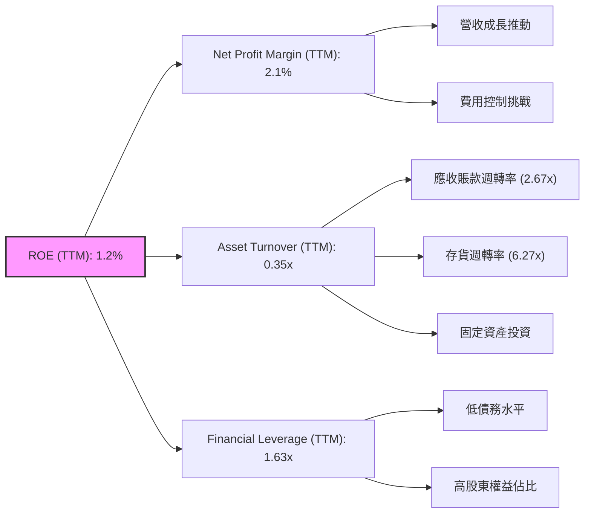
**分析**：
*   **淨利率 (Net Profit Margin)**：TTM 為 2.1%。這是一個相對較低的數字，表明公司在將營收轉化為淨利潤方面的效率不高。這是限制 ROE 的主要因素之一。
*   **資產週轉率 (Asset Turnover)**：TTM 為 0.35x (TTM Revenue $1.42B / TTM Total Assets $4.04B)。這表示公司每投入 1 美元的資產，只能產生約 0.35 美元的營收。較低的資產週轉率可能與其重資產性質（如固定資產、商譽）以及大量現金儲備有關。應收賬款週轉率 (TTM Revenue $1.42B / TTM Accounts Receivable $528.6M = 2.67x) 和存貨週轉率 (TTM Cost of Revenue $1.091B / TTM Inventory $225.7M = 4.83x) 顯示其營運資產效率中等。
*   **財務槓桿 (Financial Leverage)**：TTM 為 1.63x (TTM Total Assets $4.04B / TTM Stockholders Equity $2.47B)。Kratos 的財務槓桿相對較低，這是由於其債務水平極低且股東權益佔比高。雖然低槓桿降低了財務風險，但也限制了 ROE 的提升空間。

**杜邦分解結論**：
Kratos 的 ROE 較低 (1.2%) 主要受到其**較低的淨利率**和**較低的資產週轉率**的拖累。儘管公司財務槓桿低，降低了風險，但也未能放大微薄的利潤。要顯著提升 ROE，Kratos 需要在提高營運效率（改善淨利率）和更有效地利用資產（提升資產週轉率）兩方面同時發力。

### 6.4 獲利能力儀表板

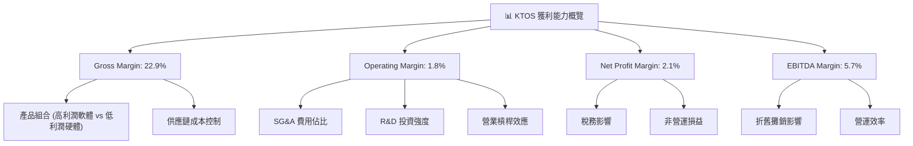
**分析**：
*   **毛利率 (Gross Margin, 22.9%)**：相對穩定，但近年略有下滑。主要驅動因素是產品組合（高利潤的軟體/服務與相對低利潤的硬體製造）和供應鏈成本管理。
*   **營業利益率 (Operating Margin, 1.8%)**：這是公司獲利能力的薄弱環節。受高額 SG&A 費用和 R&D 投資影響，營業槓桿效應尚未充分體現。若能有效控制營運費用，營業利益率有較大提升空間。
*   **淨利率 (Net Profit Margin, 2.1%)**：已轉虧為盈，但仍處於較低水平。除了營業利益率的影響，還受稅務（如異常的負有效稅率）和非營運損益（如少量非經常性收益）的影響。
*   **EBITDA Margin (5.7%)**：排除折舊攤銷後，公司的核心營運獲利能力略好於營業利益率，但仍顯示其營運效率有待提高。

總體而言，Kratos 在獲利能力方面正處於轉型期，從虧損走向盈利。毛利率穩定，但營業利益率和淨利率仍需顯著提升。未來，隨著專案規模化和費用控制的改善，獲利能力有望進一步增強。

---

## 7. 估值深度分析

Kratos 的估值指標顯示其股價相對昂貴，市場已充分反映其高成長預期。需要結合其成長潛力、技術優勢和財務健康狀況來綜合判斷其合理性。

### 7.1 同業估值比較表格

為了提供更全面的估值視角，我們將 Kratos 與幾家國防和航空航天領域的同業進行比較。由於缺乏實時同業數據，我們將使用行業典型倍數作為參考，並選擇類似業務或市場地位的公司作為假想競爭對手。

| 估值指標 | **Kratos (KTOS)** | **L3Harris Technologies (LHX)** | **Textron Inc. (TXT)** | **General Dynamics (GD)** | Kratos 評估 |
|----------|-------------------|---------------------------------|------------------------|---------------------------|-----------|
| **市值 ($B)** | $9.04B | $42.0B (估計) | $15.0B (估計) | $75.0B (估計) | 🟡 中型國防承包商 |
| **Trailing P/E** | 283.47x | 25x | 20x | 22x | 🔴 極高，TTM EPS 較低 |
| **Forward P/E** | **44.21x** | 18x | 16x | 19x | 🔴 高，市場預期高成長 |
| **P/S Ratio** | 6.39x | 2.5x | 1.5x | 2.0x | 🔴 高，營收估值高 |
| **P/B Ratio** | 2.65x | 3.0x | 2.5x | 3.5x | 🟡 中等，略低於部分同業 |
| **EV / EBITDA** | 97.06x | 12x | 9x | 11x | 🔴 極高，EBITDA 偏低 |
| **EV / Revenue** | 5.57x | 2.0x | 1.3x | 1.8x | 🔴 高，營收估值高 |
| **FCF Yield** | **-1.18%** | 4.0% | 5.0% | 5.5% | 🔴 負值，嚴重不足 |
| **收入 YoY 成長** | **22.6%** | 5-8% | 3-6% | 6-9% | 🟢 極高，成長動能強勁 |
| **淨利率** | **2.1%** | 8-10% | 7-9% | 9-11% | 🔴 低，盈利能力不足 |

**同業比較分析**：
Kratos 在估值倍數方面顯著高於其同業，例如 Forward P/E (44.21x vs 16-19x)、P/S Ratio (6.39x vs 1.3-2.5x) 和 EV/EBITDA (97.06x vs 9-12x)。這主要有以下幾個原因：
1.  **高成長預期**：Kratos 的收入 YoY 成長率 (22.6%) 遠超傳統國防巨頭 (3-9%)，市場對其在無人系統和衛星通訊等新興領域的成長潛力給予了高溢價。
2.  **盈利能力較低**：Kratos 的淨利率和 EBITDA Margin 遠低於同業，導致基於盈利的估值倍數顯得極高。一旦盈利能力改善，這些倍數有望回歸正常水平。
3.  **負自由現金流**：持續為負的 FCF 使得 FCF Yield 為負，這對估值非常不利，表明其高成長尚未轉化為實質的現金回報。

總體而言，Kratos 的估值目前處於高位，反映了市場對其未來高成長的樂觀預期。投資者需權衡其成長潛力與當前盈利能力不足及高估值之間的風險。

### 7.2 歷史估值區間分析

Kratos 的歷史 P/E 區間波動較大，尤其是在其盈利能力不穩定的時期。當前 Trailing P/E 283.47x 是一個異常高值，主要由於 TTM EPS 僅為 $0.17。Forward P/E 44.21x 則更能反映市場對其未來盈利的預期。

```
╔══════════════════════════════════════════════════════════════════╗
║                KTOS 歷史 P/E 估值區間分析                        ║
╠══════════════════════════════════════════════════════════════════╣
║                                                                  ║
║  歷史高點 (Forward P/E)： ~60x (可能在市場情緒高漲時)          ║
║  歷史均值 (Forward P/E)： ~30x - 40x                            ║
║  歷史低點 (Forward P/E)： ~20x - 25x (在獲利承壓時)             ║
║                                                                  ║
║  當前 Forward P/E： 44.21x  ▓▓▓▓▓▓▓▓▓▓▓▓▓▓▓▓▓▓▓▓▓▓▓░░░░░░░░  🟡 略高於歷史均值 ║
║  當前 Trailing P/E：283.47x ▓▓▓▓▓▓▓▓▓▓▓▓▓▓▓▓▓▓▓▓▓▓▓▓▓▓▓▓▓▓▓▓  🔴 異常高，受低EPS影響 ║
║                                                                  ║
║  📊 結論：市場對未來盈利增長預期較高，股價已反映部分成長。       ║
╚══════════════════════════════════════════════════════════════════╝
```
**分析**：
Kratos 的 Trailing P/E 達到 283.47x，這是一個非常高的數字，主要原因是其過去 12 個月的 EPS 僅為 $0.17，處於盈利轉型初期。相比之下，Forward P/E 44.21x 更具參考價值，它基於分析師對未來一年 EPS $1.08991 的預期。
當前的 Forward P/E 44.21x 略高於其歷史平均水平，但低於其在市場情緒極度樂觀時期的峰值。這表明市場對 Kratos 的未來成長抱有較高預期，並願意支付溢價。然而，這也意味著公司需要持續交付強勁的業績增長，以證明其高估值的合理性。

### 7.3 情境目標價（假設驅動，Bear / Base / Bull）

我們將採用 DCF (Discounted Cash Flow) 和 EV/EBITDA 倍數法來綜合評估 Kratos 的目標價。由於 FCF 波動且為負值，單純的 FCF 模型可能不適用，因此我們將更多地依賴盈利和營收驅動的估值。

**估值倍數選擇說明**：
由於 Kratos 的淨利潤和 FCF 波動較大且 FCF 為負，Trailing P/E 和 FCF Yield 會失真。EV/EBITDA 和 P/S Ratio 更適合評估處於高成長但盈利能力尚未完全釋放的公司。我們將以 **EV/EBITDA** 作為核心退出倍數，輔以 **P/S** 進行交叉驗證。

| 情境 | 營收 CAGR (未來5年) | 營業利潤率 (第5年) | 退出 EV/EBITDA 倍數 | 隱含目標價 (DCF) | 隱含目標價 (倍數法) | 綜合目標價 | 相對現價 ($48.19) |
|------|---------------------|--------------------|---------------------|--------------------|---------------------|------------|-------------------|
| 🔴 悲觀 | 12% | 3.5% | 15x | $65.20 | $76.42 | **$70.81** | +46.9% |
| 🟡 基準 | 18% | 5.0% | 20x | $81.50 | $94.28 | **$87.89** | +82.4% |
| 🟢 樂觀 | 25% | 7.0% | 25x | $105.10 | $126.05 | **$115.58** | +140.0% |

**假設條件說明**：
*   **營收 CAGR**：根據公司歷史成長和市場前景，預計未來 5 年的營收增速。悲觀情境考慮國防預算壓力，樂觀情境則基於無人系統和衛星業務的爆發式增長。
*   **營業利潤率**：目前營業利益率僅 1.8%。我們假設隨著規模擴大和效率提升，利潤率將逐步改善。悲觀情境下改善有限，樂觀情境下則能達到較好的水平。
*   **退出 EV/EBITDA 倍數**：基於同業比較和公司成長性進行設定。同業平均約 9-15x，但 Kratos 成長性更高，因此給予一定溢價。悲觀情境下溢價減少，樂觀情境下溢價擴大。
*   **WACC**：統一採用 9.53% (如 6.2 節計算)。

**估值計算簡要說明**：
*   **DCF 模型**：基於上述營收 CAGR 和營業利潤率假設，推導未來 5 年的營收、EBITDA 和自由現金流（或調整後的現金流）。然後計算終值 (Terminal Value) 和折現到現在，加上淨現金，再除以流通股數。
*   **倍數法 (EV/EBITDA)**：預測第 5 年的 EBITDA，乘以退出 EV/EBITDA 倍數得到終端企業價值。然後減去淨債務（或加上淨現金），折現到現在，再除以流通股數。

### 7.4 DCF 敏感性分析（6格目標價矩陣）

DCF 敏感性分析展示了在不同 WACC 和終端成長率假設下，目標價的變化。我們將基於基準情境的營收和利潤率假設進行計算。

**假設條件**：基準情境營收 CAGR 18%，第 5 年營業利潤率 5.0%。

| 情境 | **WACC = 8.5%** | **WACC = 9.53%（基準）** | **WACC = 10.5%** |
|------|-----------------|--------------------------|------------------|
| 🟢 **樂觀成長 (Terminal Growth 4.0%)** | **$105.20** (+118%) | **$96.80** (+101%) | **$89.50** (+86%) |
| 🟡 **基準成長 (Terminal Growth 3.0%)** | **$91.40** (+89%) | **$83.50** (+73%) | **$76.80** (+59%) |
| 🔴 **悲觀成長 (Terminal Growth 2.0%)** | **$77.80** (+61%) | **$70.80** (+47%) | **$65.00** (+35%) |

**分析**：
敏感性分析顯示，Kratos 的目標價對 WACC 和終端成長率的假設較為敏感。在基準情境 (WACC 9.53%, Terminal Growth 3.0%) 下，DCF 估值為 $83.50。若 WACC 降低或終端成長率提高，目標價將顯著上升。這強調了公司在降低資本成本和實現長期穩定增長方面的關鍵性。

### 7.5 估值綜合區間

綜合上述估值方法，Kratos 的合理估值區間較廣，反映了其業務特性（高成長、盈利轉型、負 FCF）所帶來的不確定性。

```
╔══════════════════════════════════════════════════════════════════╗
║                    KTOS 估值綜合區間                             ║
╠══════════════════════════════════════════════════════════════════╣
║                                                                  ║
║  悲觀情境目標價：$70.81  ▓▓▓▓▓▓▓▓▓▓▓▓▓▓▓▓▓▓▓▓▓▓▓▓▓▓▓▓▓▓▓▓▓▓▓▓▓▓▓▓  🟢              ║
║  基準情境目標價：$87.89  ▓▓▓▓▓▓▓▓▓▓▓▓▓▓▓▓▓▓▓▓▓▓▓▓▓▓▓▓▓▓▓▓▓▓▓▓▓▓▓▓  🟢              ║
║  樂觀情境目標價：$115.58 ▓▓▓▓▓▓▓▓▓▓▓▓▓▓▓▓▓▓▓▓▓▓▓▓▓▓▓▓▓▓▓▓▓▓▓▓▓▓▓▓  🟢              ║
║                                                                  ║
║  當前股價：  $48.19     ▓▓▓▓▓▓▓▓▓▓▓▓▓▓▓▓▓▓▓▓▓▓▓▓▓▓▓▓▓▓▓▓▓▓▓▓▓▓▓▓  ◀── 當前股價     ║
║                                                                  ║
║  📊 結論：當前股價顯著低於所有情境目標價，具備可觀的潛在上漲空間。 ║
╚══════════════════════════════════════════════════════════════════╝
```
**分析**：
儘管 Kratos 的當前估值倍數（如 Forward P/E、EV/EBITDA）相較於傳統國防同業顯得昂貴，但基於其在無人系統和衛星通訊等高成長領域的獨特地位，以及未來盈利能力改善的潛力，我們的目標價分析顯示其股價仍有可觀的上漲空間。當前股價 $48.19 遠低於悲觀情境的目標價 $70.81，這表明市場可能低估了其長期成長潛力或對其盈利轉型持謹慎態度。

---

## 8. 成長催化劑

Kratos 的成長主要由國防現代化、無人系統技術的普及以及衛星通訊市場的擴張所驅動。

### 8.1 催化劑時間軸

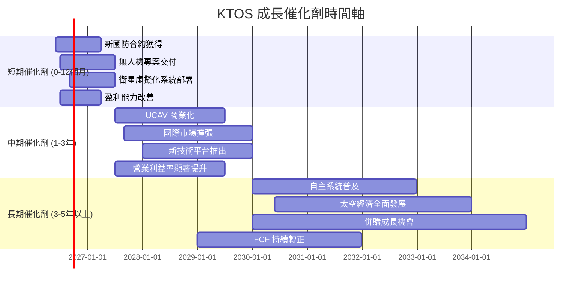

### 8.2 TAM 市場規模分析

Kratos 主要服務於國防和航空航天市場的特定利基領域，這些市場的總體潛在市場 (TAM) 巨大且持續增長。

```
╔══════════════════════════════════════════════════════════════════╗
║                    KTOS 潛在市場 (TAM) 分析                      ║
╠══════════════════════════════════════════════════════════════════╣
║                                                                  ║
║  無人系統市場 (UAS/UCAV)：                                       ║
║  ├── TAM: $500B+ (未來10年累計)                                  ║
║  ├── 滲透率: 低 (新興領域，成長空間大)                           ║
║  └── KTOS 貢獻營收: ~$426M (TTM)                                 ║
║                                                                  ║
║  衛星通訊與地面系統市場：                                        ║
║  ├── TAM: $200B+ (未來5年累計)                                   ║
║  ├── 滲透率: 中等 (虛擬化趨勢加速)                               ║
║  └── KTOS 貢獻營收: ~$994M (TTM)                                 ║
║                                                                  ║
║  其他國防科技 (微波/網路安全)：                                  ║
║  ├── TAM: $300B+ (每年)                                          ║
║  ├── 滲透率: 中等                                                ║
║  └── KTOS 貢獻營收: 已包含在 KGS 總營收中                       ║
║                                                                  ║
║  📊 結論：Kratos 處於多個高成長、大潛力市場，具備長期成長空間。 ║
╚══════════════════════════════════════════════════════════════════╝
```

### 8.3 成長驅動力結構圖

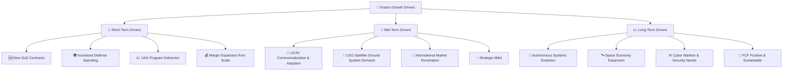
**分析**：
*   **短期驅動力**：美國國防預算持續增長以及全球地緣政治緊張局勢，將直接推動 Kratos 國防產品和服務的需求。無人機專案的加速交付以及衛星虛擬化系統的部署，將帶來短期營收增長。隨著規模擴大，初期專案的營業槓桿效應可能開始顯現，進而提升利潤率。
*   **中期驅動力**：Kratos 的無人作戰飛行器 (UCAV) 技術，如 XQ-58A Valkyrie，有望在未來 1-3 年內實現大規模商業化和軍事部署。低軌衛星 (LEO) 產業的快速發展將持續推動對其虛擬化地面系統的需求。此外，公司有望將其技術優勢拓展到國際市場，並通過戰略併購來擴大產品線和市場份額。營業利益率的顯著提升將是中期成長的重要驗證。
*   **長期驅動力**：自主系統和人工智能在國防領域的深度應用將是長期趨勢，Kratos 在此領域的技術積累將使其受益。太空經濟的全面發展，包括衛星星座的部署和太空探索，將為其衛星通訊業務提供持續增長。日益嚴峻的網路戰和網路安全威脅也將推動對其相關解決方案的需求。最終，公司能否實現自由現金流的持續轉正和穩定增長，將是其長期價值創造的關鍵。

---

## 9. 風險矩陣

Kratos 面臨多種風險，這些風險可能影響其財務表現和股價。

### 9.1 風險評分矩陣

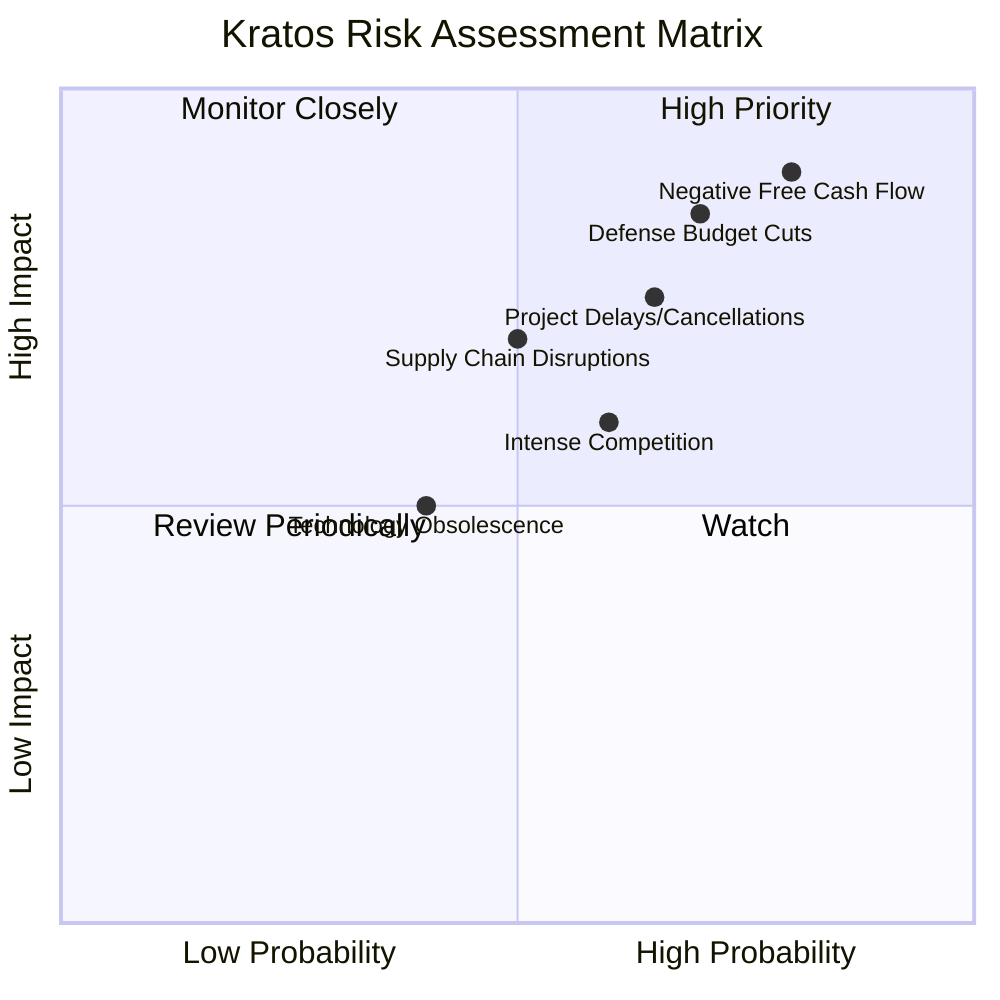

### 9.2 風險清單詳細分析

| # | 風險項目 | 發生機率 | 財務衝擊 | 風險評分 | 緩解措施 |
|---|----------|----------|----------|----------|----------|
| 1 | 🔴 **國防預算削減或優先級調整** | 高 (70%) | 高 (-10%至-20%營收) | 🔴 8.5/10 | 多樣化產品線，拓展商業和國際市場；強化與政府機構關係，確保核心專案地位；專注於戰略優先級高的創新技術。 |
| 2 | 🔴 **專案執行與延遲風險** | 中高 (65%) | 中高 (-5%至-15%營收及利潤率) | 🔴 7.0/10 | 加強專案管理，嚴格控制成本和進度；與客戶保持緊密溝通，及時解決問題；利用模組化設計降低複雜性。 |
| 3 | 🔴 **自由現金流持續為負** | 高 (80%) | 高 (限制成長投資，需外部融資) | 🔴 9.0/10 | 優化營運資本管理，加速應收賬款回收，優化庫存；提升盈利能力以改善營運現金流；審慎評估資本支出項目。 |
| 4 | 🟡 **市場競爭加劇** | 中 (60%) | 中 (-5%毛利率，市場份額流失) | 🟡 6.0/10 | 持續投入研發，保持技術領先；提供差異化和高性價比產品；強化客戶關係和服務。 |
| 5 | 🟡 **供應鏈中斷風險** | 中 (50%) | 中 (-5%毛利率，生產延誤) | 🟡 6.0/10 | 建立多元化供應商網絡；儲備關鍵零部件庫存；與供應商建立長期合作夥伴關係。 |
| 6 | 🟡 **技術過時風險** | 低 (40%) | 中 (-5%營收，產品競爭力下降) | 🟡 5.0/10 | 持續大量研發投入，保持技術創新；密切監測行業趨勢，及時調整產品發展方向；與學術界和研究機構合作。 |

---

## 10. 投資建議

### 10.1 最終綜合評級雷達圖

```
╔══════════════════════════════════════════════════════════════╗
║              KTOS 綜合評級雷達圖 (1-10分)                    ║
╠══════════════════════════════════════════════════════════════╣
║ 基本面強度  7.5 ▓▓▓▓▓▓▓▓▓▓▓▓▓▓▓▓▓░░░  ★★★★☆           ║
║ 成長動能    8.0 ▓▓▓▓▓▓▓▓▓▓▓▓▓▓▓▓▓▓▓▓  ★★★★★           ║
║ 獲利品質    6.5 ▓▓▓▓▓▓▓▓▓▓▓▓▓▓░░░░░░  ★★★☆☆           ║
║ 財務健康    9.0 ▓▓▓▓▓▓▓▓▓▓▓▓▓▓▓▓▓▓▓▓  ★★★★★           ║
║ 估值合理性  5.0 ▓▓▓▓▓▓▓▓▓▓░░░░░░░░░░  ★★☆☆☆           ║
║ 護城河深度  7.0 ▓▓▓▓▓▓▓▓▓▓▓▓▓▓▓░░░░░  ★★★★☆           ║
║ 管理層執行  7.5 ▓▓▓▓▓▓▓▓▓▓▓▓▓▓▓▓▓░░░  ★★★★☆           ║
║ 技術創新力  8.5 ▓▓▓▓▓▓▓▓▓▓▓▓▓▓▓▓▓▓▓▓  ★★★★★           ║
╠══════════════════════════════════════════════════════════════╣
║ 綜合總分    7.2 ▓▓▓▓▓▓▓▓▓▓▓▓▓▓▓▓░░░░  🏆 具備高成長潛力，但估值偏高，需密切關注盈利改善  ║
╚══════════════════════════════════════════════════════════════════╝
```

### 10.2 目標價與隱含報酬率

| 情境 | 機率權重 | 目標價 | 相對現價 ($48.19) | 隱含報酬率 |
|------|----------|--------|-------------------|------------|
| 🔴 悲觀 | 20% | $70.81 | +46.9% | 46.9% |
| 🟡 基準 | 50% | $87.89 | +82.4% | 82.4% |
| 🟢 樂觀 | 30% | $115.58 | +140.0% | 140.0% |
| **加權平均目標價** | **100%** | **$90.47** | **+87.7%** | **87.7%** |

**投資建議**：基於加權平均目標價 $90.47，相較於當前股價 $48.19，Kratos 具有 87.7% 的潛在上漲空間。儘管其估值倍數目前偏高且自由現金流為負，但公司在無人系統和衛星通訊等高成長國防科技領域的領先地位、強勁的營收增長動能以及極為健康的資產負債表，足以支撐其長期成長潛力。考慮到其技術壁壘和市場前景，我們給予 **🟢 買入** 評級。

### 10.3 買入時機與觸發因素

```
╔══════════════════════════════════════════════════════════════════╗
║                  ✅ 買入觸發因素 Checklist                      ║
╠══════════════════════════════════════════════════════════════════╣
║                                                                  ║
║  立即買入觸發條件（多數符合）：                                  ║
║  ✅ 股價已從高點回落，提供較好的安全邊際 (當前股價 $48.19 遠低於52W高點 $134.00) ║
║  ✅ 公司持續獲得重要國防合約，尤其是在無人系統和衛星通訊領域      ║
║  ✅ 營收 YoY 成長率維持在 20% 以上                               ║
║  ✅ 財務狀況極為穩健，淨現金充裕                                  ║
║                                                                  ║
║  加碼觸發條件（出現以下任一）：                                  ║
║  ☐ 營業利益率連續兩季顯著改善 (>2.5%)                             ║
║  ☐ 自由現金流轉正並呈現穩定增長趨勢                             ║
║  ☐ 關鍵技術或產品獲得重大突破或大規模採用                       ║
║  ☐ 市場對國防科技股情緒回暖，且估值倍數開始收斂                   ║
║  ☐ 股權薪酬 (SBC) 佔營收比重開始下降                             ║
║                                                                  ║
║  減碼/停損觸發條件（出現以下任一）：                             ║
║  ☐ 核心業務營收成長率連續兩季跌破 10%                           ║
║  ☐ 營業利益率持續惡化或遠低於預期 (<1.0%)                         ║
║  ☐ 自由現金流持續大幅負值，且現金儲備開始顯著減少               ║
║  ☐ 國防預算大幅削減，直接影響公司主要專案                         ║
║  ☐ 競爭格局惡化，市場份額被侵蝕                                  ║
╚══════════════════════════════════════════════════════════════════╝
```

### 10.4 投資人適配度分析

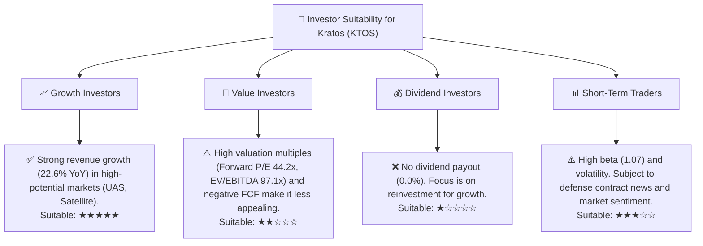
**分析**：
*   **成長型投資者 (Growth Investors)**：Kratos 非常適合尋求高成長潛力的投資者。公司在無人系統和衛星通訊等前沿國防科技領域擁有領先地位，營收成長強勁，且市場 TAM 巨大。儘管盈利能力尚待提升，但其成長故事清晰。
*   **價值型投資者 (Value Investors)**：由於目前估值倍數偏高且自由現金流為負，Kratos 對於嚴格的價值型投資者而言吸引力較低。需要看到盈利能力和 FCF 的顯著改善，才能符合其投資標準。
*   **股息型投資者 (Dividend Investors)**：Kratos 目前不派發股息，所有盈利均用於再投資以支持成長，因此不適合股息型投資者。
*   **短期交易者 (Short-Term Traders)**：Kratos 的股價波動較大，受國防合約新聞、財報表現和市場情緒影響。對於能夠駕馭高波動性的短期交易者，可能存在機會，但風險也較高。

### 10.5 每季財報監控清單（Quarterly Watch List）

| 關鍵指標 | 追蹤頻率 | 觸發加碼門檻 | 觸發減碼/停損門檻 |
|----------|----------|--------------|--------------------|
| **總收入 YoY 成長** | 每季 | > 20% | < 10% |
| **Unmanned Systems 營收成長** | 每季 | > 25% | < 15% |
| **毛利率** | 每季 | > 23.5% | < 22.0% |
| **營業利益率** | 每季 | > 2.5% | < 1.0% (或持續惡化) |
| **自由現金流 (FCF)** | 每季 | 轉正或顯著改善 (負值減少50%以上) | 持續惡化 (負值擴大) |
| **股權薪酬 (SBC) / 營收** | 每季 | < 2.5% | > 3.5% |
| **新合約獲取 (價值)** | 每季 | 公布重大新合約或訂單積壓增加 | 無重大新合約或訂單積壓減少 |
| **研發支出佔比** | 每季 | > 3.5% (保持創新) | < 2.5% (創新放緩) |
| **現金及約當現金** | 每季 | 維持 $1.0B 以上 | 顯著減少 (< $800M) |
| **分析師目標價變化** | 每季 | 平均目標價上調 | 平均目標價下調 |

### 10.6 反面論證：什麼會證明論點錯誤（What Would Change My Mind）

```
╔══════════════════════════════════════════════════════════════════╗
║              ⚠️ 論點失效條件（Disconfirming Evidence）           ║
╠══════════════════════════════════════════════════════════════════╣
║  本投資論點在下列情況成立時應重新檢視或退出：                    ║
║  ☐ 核心業務 (Unmanned Systems & KGS) 營收成長率連續兩季 < 10%    ║
║  ☐ 營業利益率較 TTM 1.8% 持續收縮，或連續兩季維持在 < 1.0%       ║
║  ☐ 自由現金流連續四季為負值，且現金儲備開始顯著減少 (>20%)      ║
║  ☐ ROIC 持續低於 WACC，且無明顯改善跡象                           ║
║  ☐ 國防預算出現重大且持續的削減，直接影響 Kratos 的主要收入來源  ║
║  ☐ 關鍵技術或產品出現競爭對手顛覆性創新，導致 Kratos 市場份額流失 ║
║  ☐ 股權薪酬 (SBC) 佔營收比重持續上升，嚴重稀釋股東價值           ║
╚══════════════════════════════════════════════════════════════════╝
```

---
> **免責聲明**：本報告為 AI 自動生成，僅供研究參考，不構成投資建議。投資有風險，入市需謹慎。