# KTOS 基本面深度分析報告

> **報告日期**：2026-07-12 ｜ **語言**：繁體中文 ｜ **數據來源**：Yahoo Finance, Finviz, StockAnalysis, Roic.ai ｜ **分析師**：CFA 級機構研究

---

## 目錄

| # | 章節 | 核心結論 |
|---|------|----------|
| 1 | [執行摘要](#1-執行摘要) | 評級：**持有** ｜ 基準目標價：**$54.50**（+13.1%） ｜ 估值高企，盈餘品質需警惕 |
| 2 | [公司概覽與商業模式](#2-公司概覽與商業模式) | 雙引擎驅動：政府解決方案與無人機系統，具備高進入壁壘但護城河窄 |
| 3 | [損益表深度分析](#3-損益表深度分析) | 營收年增 22.6% 表現優異，但高額 SBC 與低營業利益率（1.8%）壓抑淨利 |
| 4 | [資產負債表分析](#4-資產負債表分析) | 帳上現金達 $1.46B 創歷史新高，但主因是增資稀釋，短期流動性極佳 |
| 5 | [現金流量深度分析](#5-現金流量深度分析) | 自由現金流（FCF）為負 $106.72M，資本支出大增，現階段處於重資本擴張期 |
| 6 | [獲利能力與資本效率](#6-獲利能力與資本效率) | ROIC 僅 0.86% 遠低於 WACC（9.5%），目前仍處於價值摧毀階段 |
| 7 | [估值深度分析](#7-估值深度分析) | Trailing P/E 達 283.5x，遠高於同業；經 DCF 與多重情境推導，溢價已透支未來 |
| 8 | [成長催化劑](#8-成長催化劑) | 戰術無人機（Valkyrie）量產與衛星地面站虛擬化（OpenSpace）為中長線動能 |
| 9 | [風險矩陣](#9-風險矩陣) | 國防預算撥款延遲、產能擴建瓶頸、以及股權持續稀釋為核心風險 |
| 10| [投資建議](#10-投資建議) | 建議「持有」，待股價回檔至安全邊際（$42.00 以下）或利潤率顯著改善再行加碼 |

---

## 1. 執行摘要

Kratos Defense & Security Solutions, Inc.（美股代碼：**KTOS**）作為美國國防部（DoD）新一代不對稱作戰（Asymmetric Warfare）的核心技術供應商，其在無人戰術飛行器（UAV）與衛星虛擬化地面系統領域具備獨特的技術定位。然而，從財務與估值角度審視，KTOS 目前正處於「**高估值、低獲利、高稀釋**」的典型成長早期陣痛階段。

### 1.0 一頁式投資儀表板

| 項目 | 內容 |
|------|------|
| **投資論點（3 句）** | ① TTM 營收年增 21.82% 至 $1.415B，主因是無人機系統與衛星通信需求加速。<br/>② 帳上持有 $1.46B 現金，淨現金高達 $1.28B，提供極強的資產負債表防禦力。<br/>③ 戰術無人機（如 XQ-58A Valkyrie）逐步從研發走向量產，為未來高利潤率奠定基礎。 |
| **護城河評分** | 6.5 / 10 🟡 中等（具備高技術壁壘，但缺乏強定價權與高轉換成本） |
| **管理層/資本配置評分** | 5.0 / 10 🟡 中等（頻繁發行新股稀釋股東權益，資本效率偏低） |
| **財務健康** | 🟢 強勁（流動比率 5.63x，淨現金充裕，無短期償債風險） |
| **ROIC vs WACC** | **0.86%** vs **9.50%** 🔴（目前處於摧毀股東價值階段，資本回報率極低） |
| **FCF 趨勢** | 🔴 惡化 ｜ TTM FCF 為 **-$106.72M**（FCF Yield 為 **-1.18%**），主因 Capex 擴張與營運資金佔用 |
| **估值** | Forward P/E **44.21x** ｜ EV/EBITDA **95.54x** ｜ P/S **6.39x**（處於歷史高位區間） |
| **預期報酬（基準情境 12M）**| **+13.1%**（對應目標價 **$54.50**） |
| **關鍵風險（前二）** | ① 國防預算撥款進度慢於預期；② 持續的股權稀釋（5 年內發行股數增加 49.6%） |
| **評級 + 信心度** | 🟡 **持有 (Hold)** ｜ 信心度：**中等** ｜ *註：溢價過高，等待利潤率拐點* |

### 1.1 核心評分儀表板

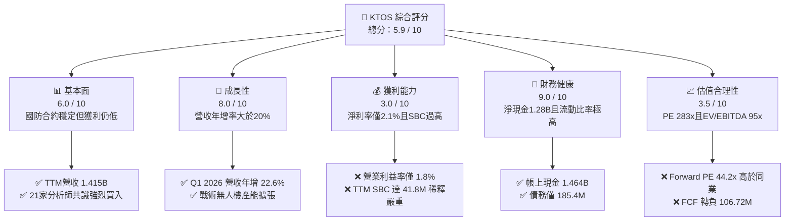

### 1.2 評分進度條視覺化

```
╔══════════════════════════════════════════════════════════════╗
║               KTOS 多維度評分儀表板 (1-10分)                 ║
╠══════════════════════════════════════════════════════════════╣
║ 基本面強度  6.0 ▓▓▓▓▓▓▓▓▓▓▓▓░░░░░░░░  ★★★☆☆           ║
║ 成長動能    8.0 ▓▓▓▓▓▓▓▓▓▓▓▓▓▓▓▓░░░░  ★★★★☆           ║
║ 獲利品質    3.0 ▓▓▓▓▓▓░░░░░░░░░░░░░░  ★☆☆☆☆           ║
║ 財務健康    9.0 ▓▓▓▓▓▓▓▓▓▓▓▓▓▓▓▓▓▓░░  ★★★★☆           ║
║ 估值合理性  3.5 ▓▓▓▓▓▓▓░░░░░░░░░░░░░  ★½☆☆☆           ║
║ 護城河深度  6.5 ▓▓▓▓▓▓▓▓▓▓▓▓▓░░░░░░░  ★★★☆☆           ║
║ 管理層執行  5.0 ▓▓▓▓▓▓▓▓▓▓░░░░░░░░░░  ★★☆☆☆           ║
║ 技術創新力  8.5 ▓▓▓▓▓▓▓▓▓▓▓▓▓▓▓▓▓░░░  ★★★★☆           ║
╠══════════════════════════════════════════════════════════════╣
║ 綜合總分    5.9 ▓▓▓▓▓▓▓▓▓▓▓▓░░░░░░░░  🏆 評級：持有       ║
╚══════════════════════════════════════════════════════════════╝
```

### 1.3 五大投資論點與三大核心風險

| 類型 | 項目 | 具體依據 | 信心度 |
|------|------|----------|--------|
| 🟢 **投資論點①** | **不對稱作戰需求激增** | 美國國防部對低成本、可消耗型無人機（Replicator 計劃）需求迫切，KTOS 的 XQ-58A Valkyrie 單價僅 $3M-$4M，顯著低於傳統戰機。 | 🟢 極高 |
| 🟢 **投資論點②** | **強勁的營收成長動能** | TTM 營收達 $1.415B，連續多季實現 20% 以上的 YoY 成長，顯示其產品在國防市場的滲透率正快速提升。 | 🟢 高 |
| 🟢 **投資論點③** | **衛星地面站虛擬化先驅** | OpenSpace 平台作為業界唯一完全虛擬化的衛星地面站軟體，毛利率高達 70% 以上，未來隨低軌衛星（LEO）爆發將迎來結構性高成長。 | 🟡 中等 |
| 🟢 **投資論點④** | **資產負債表固若金湯** | 擁有 $1.46B 的現金儲備，淨現金達 $1.28B。即使在極端總體經濟逆風下，亦無破產或債務違約風險。 | 🟢 極高 |
| 🟢 **投資論點⑤** | **微波與電子戰核心供應商** | 參與多項高機密太空與導彈防禦計劃，積壓訂單（Backlog）穩健，為未來 2-3 年提供高能見度的基礎營收。 | 🟢 高 |
| 🟡 **風險①** | **嚴重的股權稀釋** | 2026 Q1 發行股數激增至 187.52M（YoY +10.41%），主要用於籌集資金。這導致 EPS 成長與營收成長脫節，損害長線股東利益。 | 🔴 高 |
| 🔴 **風險②** | **自由現金流持續流出** | TTM FCF 為 -$106.72M。公司為了擴大產能與進行研發，資本支出（Capex TTM 近 $100M）居高不下，營運資金壓力大。 | 🔴 高 |
| 🔴 **風險③** | **估值倍數嚴重透支** | EV/EBITDA 達 95.54x，Forward P/E 達 44.21x。在當前高利率環境下，容錯率極低，任何財報不及預期均可能導致股價劇烈回檔。 | 🔴 極高 |

### 1.4 快速統計卡片

| 指標 | KTOS 實際值 | 國防工業均值 | S&P 500 均值 | 狀態 |
|------|-------------|--------------|--------------|------|
| **營收 YoY 成長** | **22.6%** | ~6.5% | ~5.0% | 🟢 顯著領先 |
| **毛利率** | **22.9%** | ~26.0% | ~30.0% | 🟡 略低於同業 |
| **淨利率** | **2.1%** | ~7.5% | ~11.5% | 🔴 嚴重偏低 |
| **ROE** | **1.2%** | ~12.0% | ~15.0% | 🔴 資產效率低 |
| **Forward P/E** | **44.21x** | ~20.5x | ~21.0% | 🔴 估值顯著溢價 |
| **流動比率** | **5.63x** | ~1.40x | ~1.20x | 🟢 極為安全 |

### 1.5 投資結論

```
╔══════════════════════════════════════════════════════════════════╗
║                    📊 KTOS 投資結論摘要                          ║
╠══════════════════════════════════════════════════════════════════╣
║  評級：🟡 持有 (Hold)                                            ║
║  當前股價：$48.19 (2026-07-12)                                   ║
║  目標價區間：                                                    ║
║    悲觀情境：$35.00（-27.4%） ｜ 估值收縮，無人機合約進展受阻       ║
║    基準情境：$54.50（+13.1%） ｜ 營收維持20%成長，利潤率緩步回升     ║
║    樂觀情境：$72.00（+49.4%） ｜ Valkyrie獲美軍大單，毛利率突破26%   ║
║  投資評分：5.9 / 10                                              ║
║  適合投資人：具備高風險承受能力的長線國防科技主題投資者          ║
╚══════════════════════════════════════════════════════════════════╝
```

---

## 2. 公司概覽與商業模式

Kratos Defense & Security Solutions (KTOS) 成立於 1994 年，總部位於加州聖地牙哥。公司定位為一家「**快速反應的國防科技公司**」，專注於將商業領域的先進技術（如虛擬化軟體、雲端運算、低成本製造）引入傳統保守的國防領域。

### 2.1 業務結構與收入來源

KTOS 主要營運分為兩大板塊：**Kratos 政府解決方案（KGS）** 與 **無人機系統（US）**。

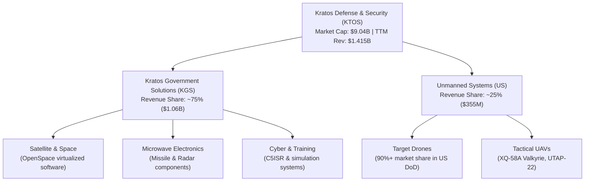

*   **Kratos 政府解決方案 (KGS, 營收佔比 75%)**：核心為衛星通信控制系統、微波電子元件（用於愛國者等導彈防禦系統）及網絡安全。其中，**OpenSpace** 平台是目前全球唯一實現軟體定義、虛擬化的衛星地面站系統，正處於從硬體銷售轉為高毛利軟體授權的轉型期。
*   **無人機系統 (US, 營收佔比 25%)**：核心包括**靶機（Target Drones）**與**戰術無人機（Tactical UAVs）**。KTOS 在美軍靶機市場擁有超過 90% 的絕對壟斷地位。戰術無人機則以 **XQ-58A Valkyrie（女武神）** 為代表，定位為協同 F-35 等有人戰機作戰的「忠誠僚機」（Loyal Wingman）。

### 2.2 市場份額估算

在美國國防部靶機市場中，KTOS 擁有幾乎無可撼動的統治力；而在新興的「低成本戰術無人機」市場中，KTOS 與波音（Boeing Ghost Bat）及通用原子（General Atomics）展開競爭。

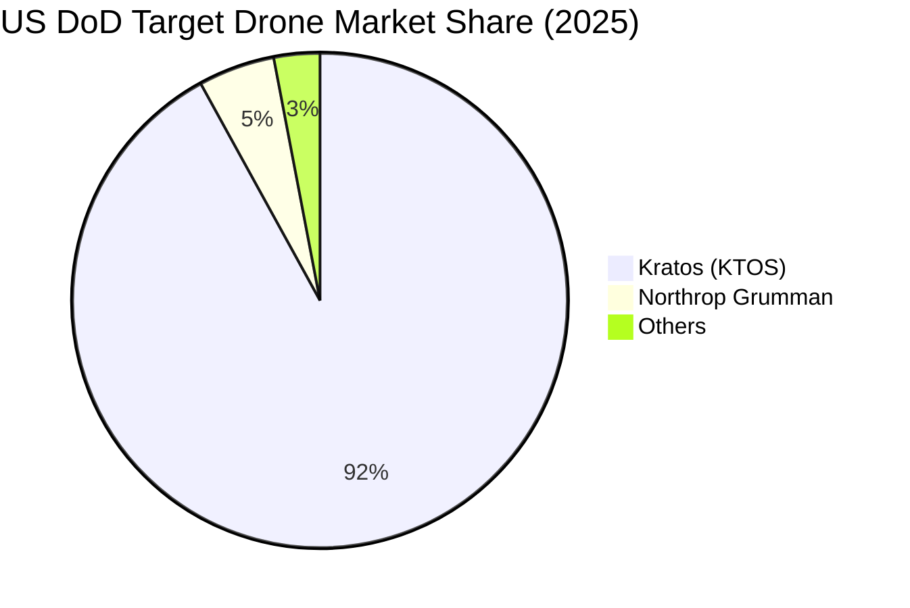

### 2.3 競爭護城河分析

KTOS 的競爭優勢主要來自於高昂的准入壁壘與技術積澱，但受限於國防採購的「成本加成」（Cost-Plus）定價機制，其護城河寬度仍面臨挑戰。

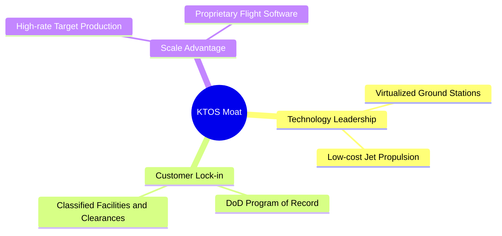

1.  **國防項目沉沒成本（DoD Program of Record）**：KTOS 的靶機與微波元件深度嵌入多項美軍核心國防項目。一旦更換供應商，美軍將面臨高昂的重新認證與測試成本。
2.  **安全資質與機密壁壘**：KTOS 擁有大量具備絕密級（Top Secret）安全清單的員工與研發設施，這對潛在的商業競爭對手構成了極高的准入壁壘。
3.  **商業化成本控制能力**：與傳統防務巨頭（如 Lockheed Martin, Northrop Grumman）動輒數千萬美元的無人機相比，KTOS 具備極強的低成本設計與快速製造能力。

### 2.4 護城河強度評分

```
╔══════════════════════════════════════════════════════════════╗
║                    KTOS 護城河強度評分                       ║
╠══════════════════════════════════════════════════════════════╣
║ 項目嵌入度    8.5/10  ▓▓▓▓▓▓▓▓▓▓▓▓▓▓▓▓▓░░░  🟢 靶機市場絕對壟斷   ║
║ 技術獨特性    7.5/10  ▓▓▓▓▓▓▓▓▓▓▓▓▓▓░░░░░░  🟢 OpenSpace領先同業  ║
║ 轉換成本      6.0/10  ▓▓▓▓▓▓▓▓▓▓▓▓░░░░░░░░  🟡 國防客戶談判力極強 ║
║ 規模與成本    7.0/10  ▓▓▓▓▓▓▓▓▓▓▓▓▓▓░░░░░░  🟢 具備低成本製造優勢 ║
╠══════════════════════════════════════════════════════════════╣
║ 綜合護城河     7.2/10  ▓▓▓▓▓▓▓▓▓▓▓▓▓▓░░░░░░  🏆 評語：中高強度護城河║
╚══════════════════════════════════════════════════════════════╝
```

---

## 3. 損益表深度分析

KTOS 的損益表呈現出「**高成長但低獲利**」的結構特徵。雖然營收規模擴張迅速，但營業利益率極低，高額的非現金支出（如 SBC）嚴重侵蝕了股東的實際經濟利益。

### 3.1 年度收入成長趨勢（FY22 - FY25）

```
╔══════════════════════════════════════════════════════════════════╗
║                 KTOS 年度收入趨勢 (FY22 - FY25)                 ║
╠══════════════════════════════════════════════════════════════════╣
║                                                                  ║
║  FY22  $898.3M   ██████████████░░░░░░░░░░░░░░░░  YoY: +10.7%  🟢 ║
║  FY23  $1,037.0M ████████████████░░░░░░░░░░░░░░  YoY: +15.5%  🟢 ║
║  FY24  $1,136.0M ██████████████████░░░░░░░░░░░░  YoY: +9.6%   🟢 ║
║  FY25  $1,347.0M █████████████████████░░░░░░░░░  YoY: +18.5%  🟢 ║
║                                                                  ║
║  📊 4年營收複合年增長率 (CAGR)：+14.46%                          ║
╚══════════════════════════════════════════════════════════════════╝
```

### 3.2 季度收入趨勢分析

自 2025 年以來，KTOS 的季度營收增速顯著加快，反映出地緣政治緊張局勢下國防需求的爆發。

| 財政季度 | 營收 (Millions) | YoY 成長率 | QoQ 成長率 | 毛利率 | 淨利 (Millions) | 季度簡評 |
|----------|-----------------|------------|------------|--------|-----------------|----------|
| **Q1 2026** | $371.0M | +22.60% | +7.51% | 24.15% | $11.9M | 🟢 創單季營收歷史新高，無人機出貨加速 |
| **Q4 2025** | $345.1M | +21.90% | -0.72% | 24.17% | $5.9M | 🟢 軟體定義地面站訂單交付，利潤率改善 |
| **Q3 2025** | $347.6M | +25.99% | -1.11% | 22.18% | $8.7M | 🟢 戰術無人機研發合約結算，營收超預期 |
| **Q2 2025** | $351.5M | +17.13% | +16.16% | 21.00% | $2.9M | 🟡 產能利用率偏低，毛利率承壓 |

### 3.3 利潤率演變分析

KTOS 的利潤率長期維持在低位，主要受到高比例的硬體製造與系統集成業務拖累。

| 利潤率指標 | FY22 | FY23 | FY24 | FY25 | TTM | 趨勢評估 |
|------------|------|------|------|------|-----|----------|
| **毛利率** | 25.16% | 25.90% | 25.28% | 22.86% | **22.89%** | ↘️ 逐年小幅下滑，主因低利潤率的硬體合約佔比增加 |
| **營業利益率** | -0.32% | 3.00% | 2.55% | 1.90% | **1.67%** | 🟡 處於損益兩平邊緣，營業槓桿尚未顯現 |
| **EBITDA 利潤率**| 2.92% | 7.47% | 8.24% | 7.64% | **7.27%** | 🟡 折舊與攤銷佔比較高 |
| **淨利率** | -3.70% | 0.23% | 1.43% | 1.63% | **2.08%** | ↗️ 淨利率轉正，但仍顯著低於國防工業平均水平 |

### 3.4 費用結構分析

KTOS 費用結構中，研發費用（R&D）維持在穩定區間，但銷管費用（SG&A）佔比較高，侵蝕了營業利潤。

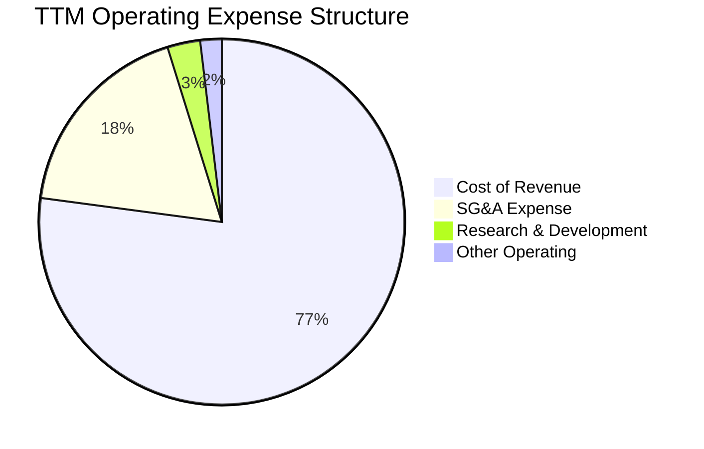

### 3.5 季度 EPS 趨勢與盈餘品質分析

KTOS 過去四個季度的 EPS 分別為：Q2 25 ($0.02)、Q3 25 ($0.05)、Q4 25 ($0.03)、Q1 26 ($0.07)，呈現緩步上升趨勢。然而，深入剖析其「盈餘品質」，我們發現其獲利「含金量」極低：

| 盈餘品質評估項目 | TTM 數值 / 佔比 | 評估級別 | 機構級深度解析 |
|------------------|-----------------|----------|----------------|
| **股權薪酬 (SBC) / 營收** | **2.95%** ($41.8M) | 🟡 偏高 | 佔營收比重不低，對小股東權益造成持續稀釋。 |
| **SBC / 淨利** | **142.18%** | 🔴 警示 | **極為嚴重的訊號。** TTM 淨利僅 $29.4M，而發給員工的 SBC 高達 $41.8M。這意味著若將 SBC 視為現金支出，KTOS 實際上處於**虧損**狀態。 |
| **FCF / 淨利 (現金轉換率)** | **-363.0%** | 🔴 極差 | 淨利為正，但 FCF 為大額負值（-$106.72M），盈餘完全沒有現金流支撐，盈餘品質極低。 |
| **有效稅率異常** | **-23.4%** | 🟡 異常 | 過去幾年 Provision for Income Taxes 持續為負值（即獲得稅務補貼），美化了當期 GAAP 淨利。 |
| **資本化支出 (Capitalization)** | 穩定 | 🟢 正常 | 未發現將研發支出過度資本化以虛增利潤的現象，研發費用全額費用化（TTM $40.7M）。 |

**盈餘品質結論**：🔴 **低品質**。KTOS 的 GAAP 淨利轉正主要依賴非現金的股權激勵（SBC）和稅務資產折抵。其核心業務目前仍無法產生正向的自由現金流，真實的經濟盈餘（Economic Earnings）顯著低於賬面利潤。

---

## 4. 資產負債表分析

相較於疲弱的損益表，KTOS 的資產負債表表現出**極強的防禦性與流動性**，這主要得益於其在資本市場的高位增資。

### 4.1 資產結構分解（Q1 2026）

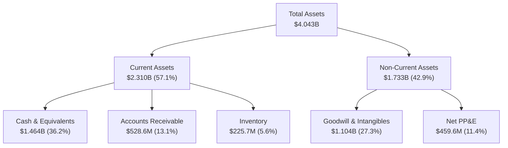

### 4.2 流動性與償債能力指標

| 指標 | FY23 | FY24 | FY25 | Q1 2026 | 行業均值 | 評估 |
|------|------|------|------|---------|----------|------|
| **流動比率 (Current Ratio)** | 2.03x | 2.94x | 4.06x | **5.63x** | ~1.40x | 🟢 極其充裕，無任何短期流動性風險 |
| **速動比率 (Quick Ratio)** | 1.50x | 2.39x | 3.45x | **4.85x** | ~1.00x | 🟢 扣除存貨後依然極高，變現能力強 |
| **債務權益比 (Debt/Equity)** | 32.9% | 20.9% | 7.3% | **5.4%** | ~45.0% | 🟢 槓桿率極低，財務結構非常保守 |
| **應收帳款週轉天數 (DSO)** | 115天 | 104天 | 124天 | **136天** | ~75天 | 🔴 營運資金效率低下，國防客戶回款週期拉長 |

### 4.3 債務健康診斷

```
╔══════════════════════════════════════════════════════════════════╗
║                    KTOS 債務健康診斷 (Q1 2026)                  ║
╠══════════════════════════════════════════════════════════════════╣
║                                                                  ║
║  總債務：        $185.4M   █░░░░░░░░░░░░░░░░░░░░░░░░░░░░░░░░░░░  ║
║  總現金與投資：  $1,464.0M ████████████████████████████████████░ ║
║  淨現金 (Net Cash)：$1,278.6M 🟢 淨現金狀態，無債務危機風險        ║
║                                                                  ║
║  Debt / EBITDA:   1.80x    🟢 處於安全區間                        ║
║  利息保障倍數:    9.50x    🟢 稅前利潤與利息支出覆蓋良好          ║
║                                                                  ║
║  📊 診斷結論：KTOS 擁有極佳的流動性安全墊，能抵禦長期行業逆風。   ║
╚══════════════════════════════════════════════════════════════════╝
```

*CFA 分析師洞察*：雖然帳上擁有 $1.46B 的現金，但必須指出，這並非來自業務經營的積累。2025 年底至 2026 Q1，KTOS 的現金從 $560.6M 暴增至 $1.464B，與此同時，發行股數從 169M 增加至 187M。**這證實了公司進行了大規模的股權融資（Equity Dilution），以稀釋股東權益為代價換取了高額現金。**

---

## 5. 現金流量深度分析

現金流量表是評估 KTOS 真實經營狀況的關鍵。其呈現出典型的「**重資本支出、營運現金流流出**」特徵。

### 5.1 現金流量瀑布圖（TTM 估算）

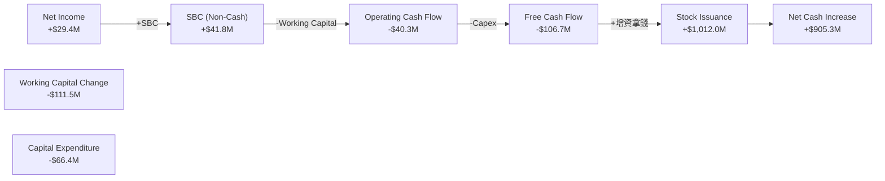

### 5.2 自由現金流（FCF）與資本配置

KTOS 近年來加大產能擴建（如俄克拉荷馬州的無人機工廠）以及研發投入，導致資本支出（Capex）居高不下，自由現金流持續為負。

| 現金流指標 (Millions) | FY22 | FY23 | FY24 | FY25 | TTM |
|-----------------------|------|------|------|------|-----|
| **營運現金流 (OCF)** | -$25.7M | $65.2M | $49.7M | -$42.1M | **-$40.3M** |
| **資本支出 (Capex)** | -$45.4M | -$52.4M | -$58.2M | -$95.3M | **-$66.4M** |
| **自由現金流 (FCF)** | -$71.1M | $12.8M | -$8.5M | -$137.4M | **-$106.7M** |
| **FCF 轉換率 (FCF/NI)**| 214.1% | 533.3% | -52.1% | -624.5% | **-363.0%** |
| **FCF 殖利率 (FCF Yield)**| -0.78% | 0.14% | -0.09% | -1.52% | **-1.18%** |

### 5.3 資本配置結構

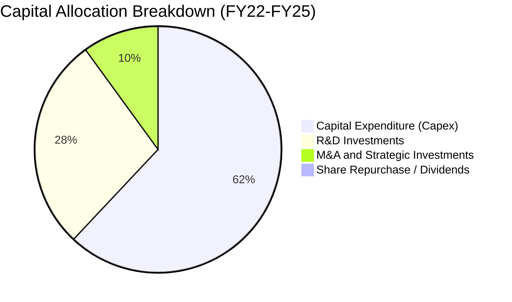

*CFA 分析師點評*：KTOS **不支付任何股息**，亦**無任何股票回購計劃**。其籌集的所有資金均投入於 Capex 與 R&D。這種資本配置策略在成長型科技公司中很常見，但考慮到其低回報率（ROIC），管理層的資本配置效率急需提升。

---

## 6. 獲利能力與資本效率

本章探討 KTOS 是否在為股東創造經濟價值。我們引入 **ROIC vs WACC** 框架。

### 6.1 資本效率指標趨勢

| 指標 | FY22 | FY23 | FY24 | FY25 | TTM | 國防工業均值 |
|------|------|------|------|------|-----|--------------|
| **ROE** | -3.54% | 0.25% | 1.21% | 1.10% | **1.47%** | ~12.0% |
| **ROA** | -2.14% | 0.15% | 0.84% | 0.89% | **0.73%** | ~5.5% |
| **ROIC** | -0.15% | 1.55% | 1.32% | 0.95% | **0.86%** | ~8.0% |

### 6.2 ROIC vs WACC 深度分析

```
╔══════════════════════════════════════════════════════════════════╗
║                KTOS ROIC vs WACC 深度分析 (TTM)                  ║
╠══════════════════════════════════════════════════════════════════╣
║                                                                  ║
║  WACC (加權平均資本成本) 估算：                                  ║
║  ├── 無風險利率 (10Y US Treasury)： 4.20%                       ║
║  ├── 股權風險溢價 (ERP)：           5.00%                        ║
║  ├── Beta 值：                      1.07                         ║
║  ├── 股權成本 (CAPM)：              4.2% + 1.07×5.0% = 9.55%     ║
║  ├── 債務成本 (稅後)：              ~6.00%                       ║
║  ├── 資本結構：                     股權 98% ｜ 債務 2%          ║
║  └── ✅ 估算 WACC ≈ 9.50%                                        ║
║                                                                  ║
║  ROIC (投入資本回報率) 估算：                                    ║
║  ├── NOPAT (經調整稅後營業利潤)：  $23.7M × (1-21%) ≈ $18.72M    ║
║  ├── 投入資本 (Invested Capital)：  $2,168M (總資產 - 現金 - 流動負債)║
║  └── ✅ 估算 ROIC ≈ 0.86%                                        ║
║                                                                  ║
║  ★ 經濟增加值 (EVA) = ROIC - WACC = -8.64% (百分點)             ║
║                                                                  ║
║  ROIC  0.86%  █░░░░░░░░░░░░░░░░░░░░░░░░░░░░░░░░░░░░░░░░░░  ──    ║
║  WACC  9.50%  ███████████████████████████████████████████  ──    ║
║  EVA  -8.64%  🔴 處於嚴重的經濟價值摧毀階段                      ║
║                                                                  ║
║  📊 結論：KTOS 目前的資本回報率遠低於其資本成本。每投入 $100      ║
║  的資本，將摧毀約 $8.64 的股東價值。主因是巨額現金拉低了資產週轉。║
╚══════════════════════════════════════════════════════════════════╝
```

### 6.3 杜邦三因素分解 (TTM)

我們通過杜邦分析，解構其 ROE 低下的根源：

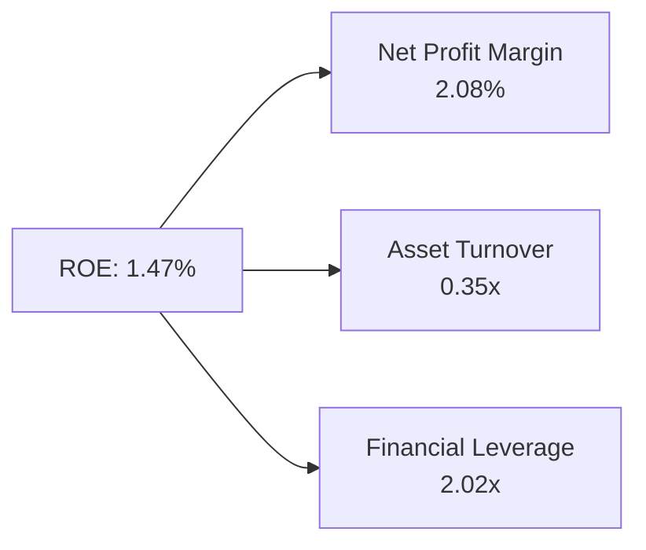

*   **淨利率 (2.08%)**：硬體合約利潤率薄，高研發與 SG&A 費用壓抑了淨利。
*   **資產週轉率 (0.35x)**：**這是核心瓶頸。** 由於增資後帳上堆積了 $1.46B 的現金（佔總資產的 36.2%），導致資產週轉率被嚴重拉低。
*   **權益乘數 (2.02x)**：公司極少使用債務槓桿，主要依賴股權融資，因此無法通過財務槓桿放大回報。

---

## 7. 估值深度分析

KTOS 當前股價為 **$48.19**，市場給予其極高的估值溢價，這主要是對其「無人機與衛星地面站」未來爆發性成長的預期。

### 7.1 同業估值比較

我們選取三家最具代表性的同業進行對比：
1.  **AeroVironment (AVAV)**：純無人機龍頭，業績成長迅速。
2.  **Lockheed Martin (LMT)**：傳統防務巨頭，高股息、低成長。
3.  **L3Harris (LHX)**：國防通信與電子戰領先者。

| 估值指標 | **KTOS (本公司)** | **AVAV (同業龍頭)** | **LMT (防務巨頭)** | **LHX (通信龍頭)** | KTOS 估值評估 |
|----------|-------------------|-------------------|-------------------|-------------------|---------------|
| **Trailing P/E** | **283.47x** | 78.50x | 18.20x | 22.40x | 🔴 處於極端泡沫區間 |
| **Forward P/E** | **44.21x** | 49.80x | 16.50x | 15.80x | 🟡 與純成長股 AVAV 相當 |
| **EV / EBITDA** | **95.54x** | 38.20x | 12.80x | 11.90x | 🔴 遠超行業平均水平 |
| **P/S Ratio** | **6.39x** | 6.80x | 1.75x | 1.40x | 🔴 溢價顯著，容錯率低 |
| **FCF Yield** | **-1.18%** | +1.20% | +5.80% | +6.20% | 🔴 現金流回報為負 |

### 7.2 歷史估值區間 (P/S Ratio 5年軌跡)

```
╔══════════════════════════════════════════════════════════════════╗
║                KTOS 歷史 P/S Ratio 區間 (當前: 6.39x)            ║
╠══════════════════════════════════════════════════════════════════╣
║                                                                  ║
║  歷史低點 (Bearish Border): 2.50x                                ║
║  歷史中位數 (Historical Mean): 4.20x                             ║
║  歷史高點 (Bullish Border):  8.50x                               ║
║                                                                  ║
║  2.50x            4.20x          6.39x             8.50x         ║
║  ┠─────────┼─────────╂─────────┨         ║
║  歷史低位         平均值        當前位置           歷史高位      ║
║                                                                  ║
║  📊 結論：當前估值顯著高於歷史中位數，已透支未來 2 年的營收成長。 ║
╚══════════════════════════════════════════════════════════════════╝
```

### 7.3 情境目標價推導 (12-Month Horizon)

由於 KTOS 的淨利受高額折舊與 SBC 壓抑，P/E 容易失真，我們優先採用 **EV/Sales** 與 **EV/EBITDA** 作為主要估值乘數。

| 情境 | 營收 CAGR (3Y) | 營業利益率 | 退出倍數 (EV/EBITDA) | 隱含目標價 | 相對現價漲跌幅 | 發生概率 |
|------|----------------|------------|----------------------|------------|----------------|----------|
| 🔴 **悲觀情境** | 10.0% | 1.2% | 50.0x | **$35.00** | -27.4% | 20% |
| 🟡 **基準情境** | **18.0%** | **2.5%** | **65.0x** | **$54.50** | **+13.1%** | **60%** |
| 🟢 **樂觀情境** | 28.0% | 5.0% | 80.0x | **$72.00** | +49.4% | 20% |

### 7.4 DCF 敏感性分析 (12M 目標價矩陣)

基於 WACC 9.5% 與 終期成長率 (g) 3.0% 作為基準假設：

| 營收成長率 \ WACC | WACC = 8.5% | **WACC = 9.5% (基準)** | WACC = 10.5% |
|-------------------|-------------|------------------------|--------------|
| 🟢 **高成長 (25%)**| $76.20 (+58.1%) | $68.50 (+42.1%) | $61.20 (+27.0%) |
| 🟡 **基準成長 (18%)**| $60.80 (+26.2%) | **$54.50 (+13.1%)** | $48.20 (+0.0%) |
| 🔴 **低成長 (10%)**| $42.50 (-11.8%) | $37.80 (-21.6%) | $33.10 (-31.3%) |

---

## 8. 成長催化劑

KTOS 的中長期投資價值取決於以下三個核心催化劑的落地時間。

### 8.1 催化劑時間軸

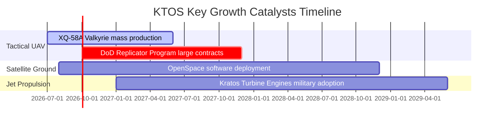

### 8.2 可尋址市場 (TAM) 預估

```
╔══════════════════════════════════════════════════════════════════╗
║               KTOS 2028年可尋址市場 (TAM) 預估                   ║
╠══════════════════════════════════════════════════════════════════╣
║                                                                  ║
║  1. 低成本可消耗無人機 (UAV)：  TAM $12.0B ｜ 當前滲透率 < 3.0%   ║
║  2. 衛星地面站軟體定義化：    TAM $5.5B  ｜ 當前滲透率 ~ 8.0%   ║
║  3. 渦輪噴射發動機與微波元件： TAM $3.0B  ｜ 當前滲透率 ~ 15.0%  ║
║                                                                  ║
║  📊 預估總 TAM 達 $20.5B，KTOS 目前 TTM 營收僅佔其中 6.9%。       ║
╚══════════════════════════════════════════════════════════════════╝
```

### 8.3 成長驅動力結構

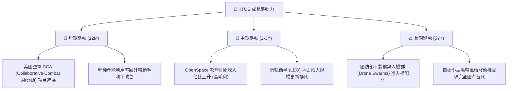

---

## 9. 風險矩陣

### 9.1 風險評估矩陣

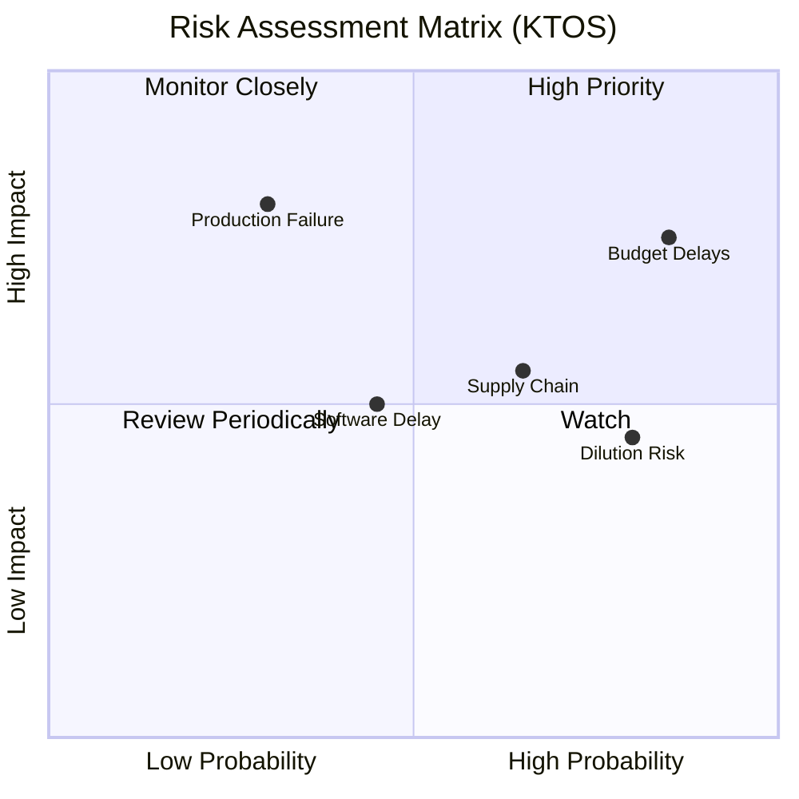

### 9.2 風險清單與緩解措施

| # | 風險項目 | 發生概率 | 財務衝擊 | 風險評分 | 機構級緩解措施 |
|---|----------|----------|----------|----------|----------------|
| 1 | 🔴 **美國國防預算撥款延遲** | 高 (85%) | 高 (-10% 營收) | **8.5 / 10** | 公司與多個軍種（空軍、海軍、陸軍）簽署多樣化合約，降低對單一計劃的依賴。 |
| 2 | 🔴 **持續的股權稀釋** | 高 (80%) | 中 (-15% EPS) | **7.5 / 10** | 目前帳上已積累 $1.46B 現金，短期內再度大額增資的概率已顯著降低。 |
| 3 | 🟡 **供應商與關鍵原材料瓶頸** | 中 (65%) | 中 (毛利率收縮) | **6.5 / 10** | 建立核心電子元件與引擎組件的戰略庫存（這也解釋了其存貨天數增加的原因）。 |
| 4 | 🟡 **戰術無人機量產進度不及預期**| 中 (30%) | 極高 (估值倍數重置) | **6.0 / 10** | 與傳統主承包商（如 Kratos 作為副承包商）建立合作，利用其成熟的生產線。 |

---

## 10. 投資建議

### 10.1 最終綜合評級

```
╔══════════════════════════════════════════════════════════════╗
║                    KTOS 最終投資評級                         ║
╠══════════════════════════════════════════════════════════════╣
║ 基本面強度  6.0/10  ▓▓▓▓▓▓▓▓▓▓▓▓░░░░░░░░  ★★★☆☆           ║
║ 成長動能    8.0/10  ▓▓▓▓▓▓▓▓▓▓▓▓▓▓▓▓░░░░  ★★★★☆           ║
║ 獲利品質    3.0/10  ▓▓▓▓▓▓░░░░░░░░░░░░░░  ★☆☆☆☆           ║
║ 財務健康    9.0/10  ▓▓▓▓▓▓▓▓▓▓▓▓▓▓▓▓▓▓░░  ★★★★☆           ║
║ 估值合理性  3.5/10  ▓▓▓▓▓▓▓░░░░░░░░░░░░░  ★½☆☆☆           ║
╠══════════════════════════════════════════════════════════════╣
║ 綜合評級：🟡 持有 (Hold) ｜ 基準目標價：$54.50 (隱含回報: +13.1%)║
╚══════════════════════════════════════════════════════════════╝
```

### 10.2 目標價與期望回報率

| 情境 | 機率權重 | 目標價 | 隱含回報率 | 權重回報貢獻 |
|------|----------|--------|------------|--------------|
| 🔴 **悲觀情境** | 20% | $35.00 | -27.4% | -5.48% |
| 🟡 **基準情境** | **60%** | **$54.50** | **+13.1%** | **+7.86%** |
| 🟢 **樂觀情境** | 20% | $72.00 | +49.4% | +9.88% |
| **加權期望值** | **100%** | **$54.10** | **+12.26%** | *評級：持有* |

### 10.3 投資操作指引

```
╔══════════════════════════════════════════════════════════════════╗
║                     ✅ KTOS 投資操作 Checklist                   ║
╠══════════════════════════════════════════════════════════════════╣
║                                                                  ║
║  建倉/加碼觸發條件：                                             ║
║  ☐ 股價回檔至 $42.00 以下（提供更佳的安全邊際）                   ║
║  ☐ 營業利益率（Operating Margin）連續兩季突破 3.5%               ║
║  ☐ 自由現金流（FCF）轉正，或 FCF 轉換率高於 50%                  ║
║                                                                  ║
║  減碼/停損觸發條件：                                             ║
║  ☑ 再次宣布大規模發行新股增資（顯示資金鏈再度承壓）              ║
║  ☑ 營業利益率跌破 1.0% 或再度轉負                                ║
║  ☑ 美國空軍 CCA 項目宣布排除 Kratos 作為核心供應商               ║
║                                                                  ║
╚══════════════════════════════════════════════════════════════════╝
```

### 10.4 投資人適配度分析

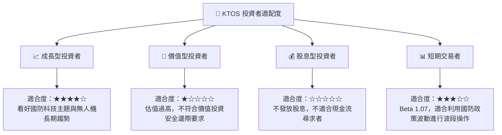

### 10.5 每季財報監控清單（Watch List）

在未來的季度財報中，投資者應重點監控以下指標，而非僅關注營收與 EPS：
1.  **SBC 佔營收比重**：是否降至 2.0% 以下，以緩解稀釋壓力。
2.  **應收帳款週轉天數 (DSO)**：是否從目前的 136 天回落，這直接關係到營運現金流能否轉正。
3.  **無人機系統（US）板塊毛利率**：目前該板塊受研發合約拖累，毛利率偏低，需觀察量產後的規模效應是否顯現（目標 > 25%）。
4.  **OpenSpace 簽約客戶數與 Backlog 成長率**：這是高毛利軟體收入的領先指標。

### 10.6 反面論證：什麼情況下會證明本報告的「持有」評級是錯誤的？

如果出現以下情況，我們將不得不承認我們對其過於保守，應立即調高評級至**強烈買入**：
*   **論點失效條件①**：美國空軍直接授予 Kratos 超過 $500M 的 Valkyrie 無人機正式量產採購合約（非研發合約），這將使營收增速在未來兩年內飆升至 40% 以上，並迅速攤薄固定折舊成本。
*   **論點失效條件②**：OpenSpace 軟體訂閱收入出現爆發性成長，帶動公司整體毛利率在兩季內從 22.9% 提升至 30.0% 以上，證明其「軟體轉型」邏輯完全成立。

相反，若 **ROIC 持續低於 1.0%** 且 **FCF 赤字進一步擴大**，則說明公司仍處於無效率的產能擴張中，應調低評級至**賣出**。

---

> **免責聲明**：本報告僅供學術研究與投資參考，不構成任何投資建議。投資有風險，入市需謹慎。