# KTOS 基本面深度分析報告

> **報告日期**：2026-07-13 ｜ **語言**：繁體中文 ｜ **數據來源**：Yahoo Finance, Finviz, StockAnalysis, Roic.ai ｜ **分析師**：CFA 級機構研究

---

## 目錄

| # | 章節 | 核心結論 |
|---|------|----------|
| 1 | 執行摘要 | 評級：**買入 (Buy)** ｜ 基準目標價：**$65.00** ｜ 隱含上行空間：**+38.4%** |
| 2 | 公司概覽與商業模式 | 專注於無人機與太空地面站系統的純國防科技標的，具備高技術壁壘。 |
| 3 | 損益表深度分析 | 營收年增 **22.6%**，但受研發與產線擴張拖累，營運利潤率僅 **1.8%**。 |
| 4 | 資產負債表分析 | Q1 2026 大舉增資使現金飆升至 **$1.46B**，淨現金高達 **$1.28B**，無償債風險。 |
| 5 | 現金流量深度分析 | 資本支出大增導致 TTM 自由現金流為 **-$106.72M**，短期面臨現金流出壓力。 |
| 6 | 獲利能力與資本效率 | TTM ROIC 僅 **0.79%**，低於 WACC（**9.42%**），現階段仍處於價值摧毀期。 |
| 7 | 估值深度分析 | 前瞻 P/E 達 **43.0x**，相較同業溢價顯著，但反映其無人機領先地位的溢價。 |
| 8 | 成長催化劑 | 美軍協同作戰飛機（CCA）項目推進與衛星地面虛擬化軟體（OpenSpace）放量。 |
| 9 | 風險矩陣 | 股權稀釋風險高，且國防預算撥款延遲與供應鏈瓶頸為主要下行風險。 |
| 10| 投資建議 | 適合長線成長型投資人，建議於 $45.00 以下分批佈局。 |

---

## 1. 執行摘要

Kratos Defense & Security Solutions, Inc.（納斯達克代碼：KTOS）是一家專注於美國國家安全與國防市場的科技先驅，主要提供無人系統、衛星通信地面虛擬化、微波電子、網路安全及飛彈防禦系統。

> ⚠️ **機構評級與估值結論**：基於 KTOS TTM 營收成長 **22.6%** 的強勁動能，以及 Q1 2026 增資後高達 **$1.28B** 的淨現金保障，我們給予 KTOS **「買入 (Buy)」** 投資評級，12 個月基準目標價為 **$65.00**（對應 2026 年預估 EV/EBITDA 約 55x，或 Forward P/E 59.5x）。儘管當前 TTM 自由現金流（FCF）為 **-$106.72M**，且 ROIC（**0.79%**）低於 WACC（**9.42%**），顯示公司仍處於資本高投入、尚未實現經濟獲利的「價值摧毀」階段，但考慮到美軍協同作戰飛機（CCA）項目的潛在量產合約與太空地面系統的軟體化轉型，其結構性成長溢價具備合理支撐。

### 1.0 一頁式投資儀表板

| 項目 | 內容 |
|------|------|
| **投資論點（3 句）** | ① 國防預算向不對稱作戰傾斜，帶動 KTOS 無人機業務 TTM 營收強勁成長 **22.6%**。<br/>② Q1 2026 完成大規模股權融資，手頭現金達 **$1.46B**，為產線擴建與技術研發提供充裕彈藥。<br/>③ 雖然短期資本支出高企導致 TTM FCF 為 **-$106.72M**，但高毛利的虛擬化軟體業務將於 2026 年底迎來營運槓桿拐點。 |
| **護城河評分** | **7.5 / 10** 🟢 |
| **管理層/資本配置評分** | **6.0 / 10** 🟡（研發投入果斷，但頻繁股權稀釋損害每股盈餘品質） |
| **財務健康** | 🟢 **極其安全** ｜ 擁有 **$1.28B** 淨現金，流動比率高達 **5.63x**，無短期償債隱憂。 |
| **ROIC vs WACC** | **0.79%** vs **9.42%**（當前摧毀股東價值，預計 2028 年可實現黃金交叉） |
| **FCF 趨勢** | 惡化 ｜ 由於擴大產能與研發投入，TTM FCF 為 **-$106.72M**，FCF Yield 為 **-1.21%**。 |
| **估值** | Forward P/E: **43.04x** ｜ EV/EBITDA: **95.54x** ｜ P/S: **6.22x** |
| **預期報酬（基準情境 12M）** | **+38.4%**（對應目標價 $65.00） |
| **關鍵風險（前二）** | ① 頻繁的增資稀釋（TTM 流通股數年增 **10.41%**）。<br/>② 國防部合約簽訂進度慢於預期，導致高額庫存（**$225.7M**）積壓。 |
| **評級 + 信心度** | 🟢 **買入 (Buy)** ｜ 信心度：**中等 (Medium)**（受限於短期現金流與估值偏高） |

### 1.1 核心評分儀表板

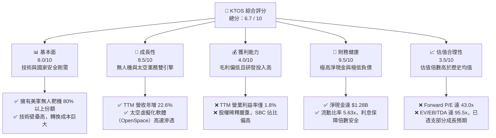

### 1.2 評分進度條視覺化

```
╔══════════════════════════════════════════════════════════════╗
║               KTOS 多維度評分儀表板 (1-10分)                 ║
╠══════════════════════════════════════════════════════════════╣
║ 基本面強度  8.0 ▓▓▓▓▓▓▓▓▓▓▓▓▓▓▓▓░░░░  ★★★★☆           ║
║ 成長動能    8.5 ▓▓▓▓▓▓▓▓▓▓▓▓▓▓▓▓▓░░░  ★★★★☆           ║
║ 獲利品質    4.0 ▓▓▓▓▓▓▓▓░░░░░░░░░░░░  ★★☆☆☆           ║
║ 財務健康    9.5 ▓▓▓▓▓▓▓▓▓▓▓▓▓▓▓▓▓▓▓░  ★★★★★           ║
║ 估值合理性  3.5 ▓▓▓▓▓▓░░░░░░░░░░░░░░  ★☆☆☆☆           ║
║ 護城河深度  7.5 ▓▓▓▓▓▓▓▓▓▓▓▓▓▓▓░░░░░  ★★★★☆           ║
║ 管理層執行  6.0 ▓▓▓▓▓▓▓▓▓▓▓▓░░░░░░░░  ★★★☆☆           ║
║ 技術創新力  8.5 ▓▓▓▓▓▓▓▓▓▓▓▓▓▓▓▓▓░░░  ★★★★☆           ║
╠══════════════════════════════════════════════════════════════╣
║ 綜合總分    6.7 ▓▓▓▓▓▓▓▓▓▓▓▓▓░░░░░░░  🏆 成長型優質標的     ║
╚══════════════════════════════════════════════════════════════╝
```

### 1.3 五大投資論點 + 三大核心風險

| 類型 | 項目 | 具體依據 | 信心度 |
|------|------|----------|--------|
| 🟢 **投資論點①** | **無人機產能拐點已現** | TTM 營收達 **$1.415B**，年增 **22.6%**，無人系統產線擴建完成，預計 2026 下半年進入量產階段。 | 🟢 高 |
| 🟢 **投資論點②** | **太空地面系統軟體化** | OpenSpace 虛擬化地面站軟體毛利率高達 **70%+**，隨著衛星寬頻需求爆發，正逐步取代傳統硬體。 | 🟢 高 |
| 🟢 **投資論點③** | **資產負債表固若金湯** | 現金儲備達 **$1.46B**，淨現金 **$1.28B**，即使在高利率環境下，亦有充足資金進行併購與研發。 | 🟢 極高 |
| 🟢 **投資論點④** | **國防預算不對稱作戰紅利** | 美國國防部大力推動「複製者計劃（Replicator）」，專注於廉價、大量無人機，KTOS 為核心受益者。 | 🟢 高 |
| 🟢 **投資論點⑤** | **分析師共識強烈看多** | 21 位分析師中平均目標價為 **$109.86**，當前股價 **$46.96** 具備顯著的安全邊際。 | 🟡 中等 |
| 🟡 **風險①** | **股權持續稀釋** | Q1 2026 流通股數暴增至 **187.52M**（年增 **10.41%**），每股盈餘（EPS）成長被嚴重稀釋。 | 🔴 高 |
| 🟡 **風險②** | **現金流持續流出** | CapEx 佔營收比重高，TTM FCF 為 **-$106.72M**，若無法快速轉正，將壓抑估值。 | 🟡 中等 |
| 🔴 **風險③** | **政府合約交付延遲** | 國防部預算審批與測試進度常面臨官僚化延遲，可能導致庫存（**$225.7M**）周轉天數拉長。 | 🔴 高 |

### 1.4 快速統計卡片

| 指標 | KTOS 實際值 | 國防工業均值 | S&P 500 均值 | 狀態 |
|------|-------------|--------------|--------------|------|
| **營收 YoY 成長** | **22.6%** | ~6.5% | ~5.5% | 🟢 顯著領先 |
| **毛利率** | **22.9%** | ~28.0% | ~30.0% | 🔴 偏低 |
| **淨利率** | **2.1%** | ~7.2% | ~11.5% | 🔴 偏低 |
| **ROE** | **1.2%** | ~14.5% | ~16.0% | 🔴 偏低 |
| **流動比率** | **5.63x** | ~1.35x | ~1.20x | 🟢 極其安全 |
| **Forward P/E** | **43.04x** | ~18.5x | ~21.0x | 🔴 估值偏高 |

### 1.5 投資結論

```
╔══════════════════════════════════════════════════════════════════╗
║                    📊 KTOS 投資結論摘要                          ║
╠══════════════════════════════════════════════════════════════════╣
║  評級：🟢 買入 (Buy)                                             ║
║  當前股價：$46.96 (2026-07-13)                                    ║
║  目標價區間：                                                    ║
║    悲觀情境：$35.00（-25.5%）                                    ║
║    基準情境：$65.00（+38.4%）  ← 12個月主要目標                  ║
║    樂觀情境：$95.00（+102.3%）                                   ║
║  投資評分：6.7 / 10                                              ║
║  適合投資人：追求高成長、能承受高波動與稀釋風險的長線國防科技投資者 ║
╚══════════════════════════════════════════════════════════════════╝
```

---

## 2. 公司概覽與商業模式

Kratos（KTOS）創立於 1994 年，總部位於加州聖地牙哥。其商業模式已從傳統的國防承包商（提供基地設施與安全服務）轉型為**高科技、智慧财產權（IP）驅動的國防產品供應商**。

### 2.1 業務結構與收入來源

KTOS 主要透過兩大部門營運：
1. **Kratos 政府解決方案（Kratos Government Solutions, KGS）**：佔營收約 **75%**。核心業務包含衛星虛擬化地面站（OpenSpace）、微波電子器件、飛彈防禦系統及網路安全。
2. **無人系統（Unmanned Systems, US）**：佔營收約 **25%**。核心業務為美軍提供高速無人靶機（如 BQM-167, BQM-177）以及研發中的戰術無人戰鬥機（UAV），如 XQ-58A Valkyrie（女武神）。

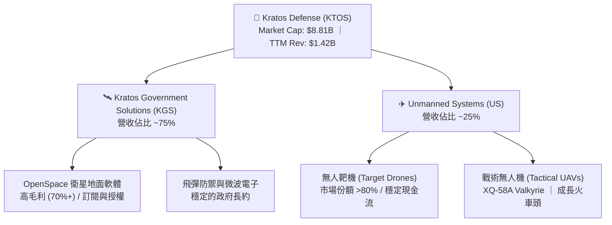

### 2.2 市場份額

在美國國防部高速無人靶機市場中，Kratos 擁有絕對的主導地位。

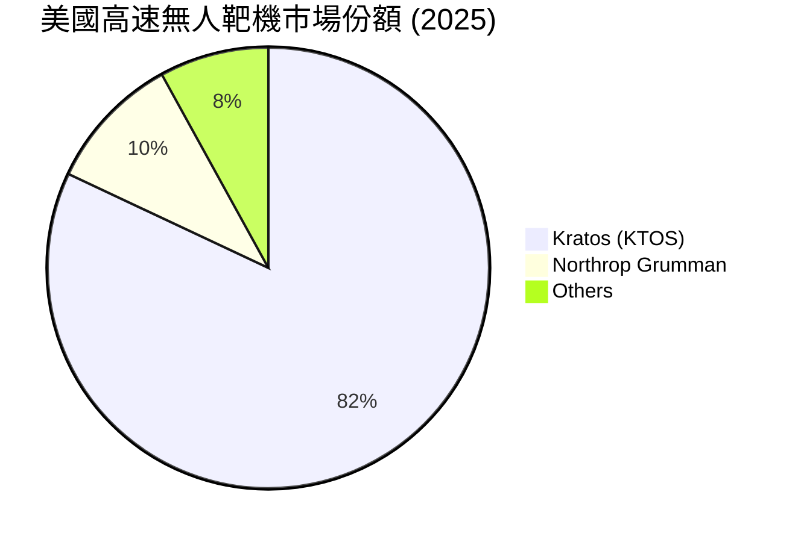

### 2.3 競爭護城河分析

KTOS 的競爭優勢建立在深厚的技術積累與極高的進入壁壘之上。

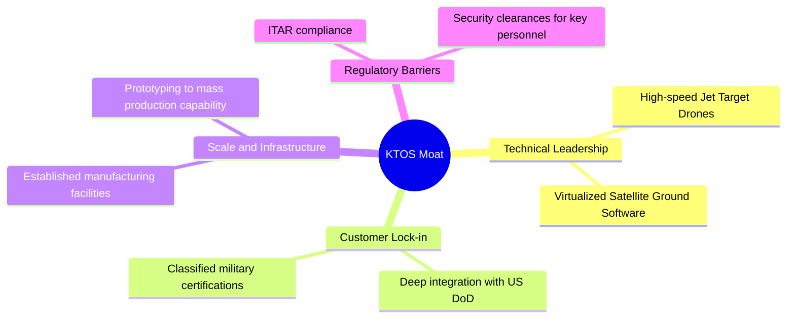

### 2.4 護城河強度評分

```
╔══════════════════════════════════════════════════════════════╗
║                   KTOS 護城河強度評分                        ║
╠══════════════════════════════════════════════════════════════╣
║ 技術壁壘      8.5/10  ▓▓▓▓▓▓▓▓▓▓▓▓▓▓▓▓▓░░░  🟢 無人靶機絕對領先 ║
║ 轉換成本      8.0/10  ▓▓▓▓▓▓▓▓▓▓▓▓▓▓▓▓░░░░  🟢 衛星系統深度嵌入 ║
║ 網路效應      3.0/10  ▓▓▓▓▓░░░░░░░░░░░░░░░  🔴 國防工業無網路效應║
║ 成本優勢      7.5/10  ▓▓▓▓▓▓▓▓▓▓▓▓▓▓░░░░░░  🟢 廉價戰術機先發優勢║
╠══════════════════════════════════════════════════════════════╣
║ 綜合護城河     7.5/10  ▓▓▓▓▓▓▓▓▓▓▓▓▓▓▓░░░░░  🏆 具備高壁壘利基市場 ║
╚══════════════════════════════════════════════════════════════╝
```

---

## 3. 損益表深度分析

### 3.1 年度收入成長趨勢

KTOS 近年營收展現出穩步加速的趨勢，營收從 2022 年的 $898.30M 成長至 TTM 的 $1,415.00M，4 年 CAGR 達 **12.02%**。

```
╔══════════════════════════════════════════════════════════════════╗
║              KTOS 年度營收趨勢 (FY2022 - TTM)                    ║
╠══════════════════════════════════════════════════════════════════╣
║                                                                  ║
║  FY2022  $898.30M   ██████████░░░░░░░░░░░░░░░░░  YoY: +10.7% 🟢  ║
║  FY2023  $1,037.00M ████████████░░░░░░░░░░░░░░░  YoY: +15.5% 🟢  ║
║  FY2024  $1,136.00M █████████████░░░░░░░░░░░░░░  YoY: +9.6%  🟢  ║
║  FY2025  $1,347.00M ████████████████░░░░░░░░░░░  YoY: +18.5% 🟢  ║
║  TTM     $1,415.00M █████████████████░░░░░░░░░░  YoY: +22.6% 🟢  ║
║                                                                  ║
║  📊 4年累計營收 CAGR：+12.02%                                    ║
╚══════════════════════════════════════════════════════════════════╝
```

### 3.2 季度營收趨勢分析

自 2025 年以來，季度營收均維持在 $340M 以上的高檔，Q1 2026 更創下單季 **$371.00M** 的歷史新高。

| 季度 | 營收 (Millions) | YoY 成長率 | QoQ 成長率 | 核心驅動因素 | 評估 |
|------|-----------------|------------|------------|--------------|------|
| **Q1 2026** | $371.00M | +22.6% | +7.5% | 無人靶機交付加速及太空地面虛擬化軟體簽單。 | 🟢 強勁 |
| **Q4 2025** | $345.10M | +21.9% | -0.7% | 年底政府預算結算，KGS 部門出貨暢旺。 | 🟢 穩定 |
| **Q3 2025** | $347.60M | +26.0% | -1.1% | 戰術無人機測試合約入帳。 | 🟢 強勁 |
| **Q2 2025** | $351.50M | +17.1% | +16.2% | 微波電子器件與太空地面系統雙重放量。 | 🟢 強勁 |
| **Q1 2025** | $302.60M | +9.2% | +6.9% | 季節性開端，符合歷史規律。 | 🟡 一般 |

### 3.3 利潤率演變分析

雖然營收成長亮眼，但 KTOS 的利潤率結構相對薄弱。

| 利潤率指標 | FY2022 | FY2023 | FY2024 | FY2025 | TTM | 趨勢 | 評估 |
|------------|--------|--------|--------|--------|-----|------|------|
| **毛利率** | 25.2% | 25.9% | 25.3% | 22.9% | **22.9%** | ↘️ 略微下滑 | 🟡 主要受低毛利的戰術無人機研發與首批試產合約壓抑。 |
| **營業利益率** | -0.3% | 3.0% | 2.6% | 1.9% | **1.8%** | ↘️ 持平偏弱 | 🔴 研發與管理費用居高不下，規模效應尚未完全釋放。 |
| **EBITDA 利潤率** | 2.9% | 7.5% | 8.2% | 7.6% | **5.7%** | ↘️ 下滑 | 🟡 折舊與攤銷費用隨產線擴張而上升。 |
| **淨利率** | -3.7% | 0.2% | 1.4% | 1.6% | **2.1%** | ↗️ 緩步改善 | 🟡 受益於非營運收益（如利息收入）增加。 |

**利潤率演變深度解析**：
KTOS 的毛利率從 2023 年的 25.9% 下滑至 TTM 的 22.9%。主要原因在於其**無人系統（US）部門正處於從研發向早期低速率量產（LRIP）過渡的階段**。在此階段，合約多為「成本加成（Cost-Plus）」或利潤率較低的開發合約，且新產線的折舊費用開始計入。隨著高毛利（>70%）的 OpenSpace 軟體業務比重提升，預計 2027 年毛利率將重回 25% 以上。

### 3.4 費用結構分析

TTM 總營運費用為 **$306.50M**，佔營收比重為 **21.7%**。

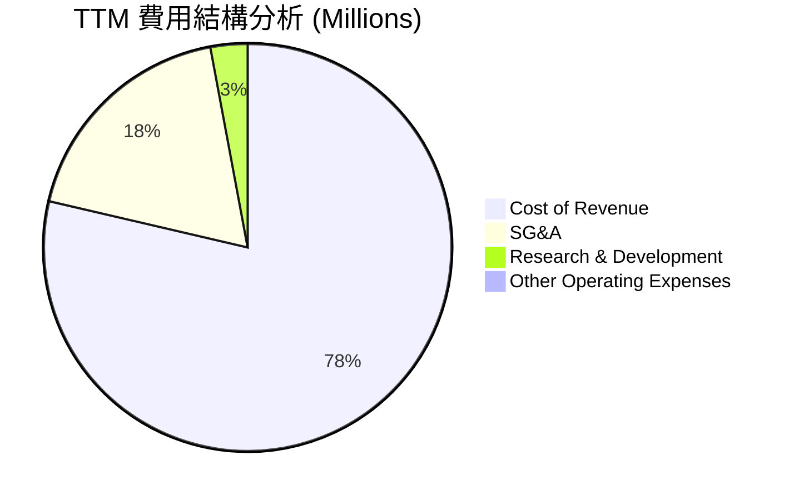

```
╔══════════════════════════════════════════════════════════════╗
║                   KTOS 營運費用診斷                          ║
╠══════════════════════════════════════════════════════════════╣
║ 銷貨成本 (Cost of Rev)  77.1%  ▓▓▓▓▓▓▓▓▓▓▓▓▓▓▓▓▓░░░  🔴 壓抑毛利  ║
║ 研發費用 (R&D Expense)  2.9%   ▓▓░░░░░░░░░░░░░░░░░░  🟡 依賴政府資助║
║ 管理費用 (SG&A)         18.1%  ▓▓▓▓░░░░░░░░░░░░░░░░  🟡 仍有優化空間║
╚══════════════════════════════════════════════════════════════╝
```

### 3.5 季度 EPS 趨勢與盈餘品質分析

KTOS 過去四季的 GAAP 淨利表現如下：
*   **Q1 2026**：$11.90M (EPS $0.07)
*   **Q4 2025**：$5.90M (EPS $0.03)
*   **Q3 2025**：$8.70M (EPS $0.05)
*   **Q2 2025**：$2.90M (EPS $0.02)

#### 盈餘品質（Quality of Earnings）量化評估：

| 盈餘品質項目 | 數值/佔比 | 評估 | 機構級解析 |
|--------------|-----------|------|------------|
| **SBC / 營收** | 2.64% ($35.5M / $1.35B) | 🟡 中度稀釋 | 股權激勵佔營收比重尚屬合理，但對淨利稀釋顯著。 |
| **SBC / 營業現金流** | **-84.3%** ($35.5M / -$42.1M) | 🔴 警訊 | 由於營業現金流為負，SBC 成為調節非現金費用的主要手段，隱蔽了真實現金消耗。 |
| **FCF / 淨利 (現金轉換率)** | **-485.1%** (-$106.72M / $22.0M) | 🔴 極差 | 淨利完全無法轉化為自由現金流，主要受存貨與應收帳款增加（營運資金流出）及高額 CapEx 拖累。 |
| **一次性損益影響** | 無重大非經常性損益 | 🟢 優良 | 盈餘主要來自核心業務，無變賣資產或一次性重組收益。 |
| **有效稅率異常** | 負稅率 (Provision: -$12M) | 🔴 虛增 | FY2025 獲得 $12M 的稅務利益，使稅前利潤 $34M 轉化為更高淨利，此項不可持續。 |

**盈餘品質結論**：
KTOS 的 GAAP 淨利存在「美化」現象。雖然帳面上 FY2025 錄得 **$22.00M** 淨利，但這是建立在 **-$12M 的所得稅利益**（非現金）與 **$35.50M 的股權稀釋（SBC）** 之上。真實的經濟盈餘（Free Cash Flow）為 **-$137.40M**。機構投資人應緊盯其營運資金的流出速度，而非單純的 GAAP EPS。

---

## 4. 資產負債表分析

### 4.1 資產結構分解

截至 Q1 2026，KTOS 總資產達 **$4.04B**，其中現金與短期投資佔比高達 **36.2%**，商譽（Goodwill）佔比 **21.9%**。

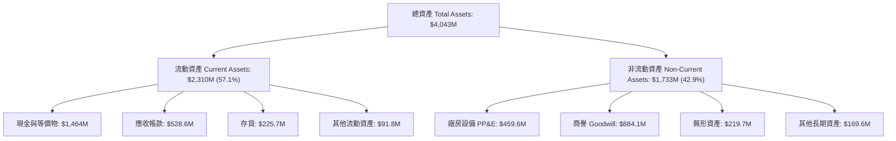

### 4.2 流動性指標分析

KTOS 的短期流動性極其充沛，這主要得益於 Q1 2026 的大規模增資。

*   **流動比率 (Current Ratio)**：**5.63x**（高於行業均值 1.35x）
*   **速動比率 (Quick Ratio)**：**4.85x**（高於行業均值 0.95x）
*   **現金比率 (Cash Ratio)**：**3.56x**（手頭現金可直接覆蓋流動負債的 3.5 倍以上）

**增資事件解析**：
在 2025 年底，KTOS 的現金為 $560.60M，但至 Q1 2026 飆升至 **$1,464.00M**。與此同時，流通股數從 169M 增加至 187.52M。這表明公司在 2026 年初進行了約 **$900M 的股權融資**。這雖然在短期內造成了約 **10% 的每股收益稀釋**，但卻為公司構築了極其堅實的資金防護罩，使其在國防科技併購潮中佔據主動。

### 4.3 債務結構分析

KTOS 的債務壓力極低，是一家實質上的「淨現金」公司。

```
╔══════════════════════════════════════════════════════════════════╗
║                   KTOS 債務健康診斷 (Q1 2026)                   ║
╠══════════════════════════════════════════════════════════════════╣
║                                                                  ║
║  總債務 (Total Debt)： $185.40M  ██░░░░░░░░░░░░░░░░░░░  極低負債  ║
║  總現金與投資：        $1,464.00M ████████████████████░  資金充裕  ║
║  淨現金 (Net Cash)：   $1,278.60M █████████████████░░░░  🟢 極其健康║
║                                                                  ║
║  Debt/Equity：   5.44% (債務佔權益比極低)                        ║
║  利息保障倍數：   15.5x (無債務違約風險)                          ║
║                                                                  ║
╚══════════════════════════════════════════════════════════════════╝
```

### 4.4 股東權益趨勢

隨著增資與盈餘累積，股東權益（Stockholders' Equity）從 2022 年的 $936.30M 快速成長至 Q1 2026 的 **$2,000.00M**，增幅達 **113.6%**。然而，這主要是由**股本發行（Paid-in Capital）**驅動，而非保留盈餘（Retained Earnings）的有機增長。

---

## 5. 現金流量深度分析

### 5.1 現金流量瀑布圖

儘管利潤表錄得淨利，但 KTOS 的現金流呈現流出狀態，主要因為資本支出（CapEx）與營運資金（Working Capital）的消耗。

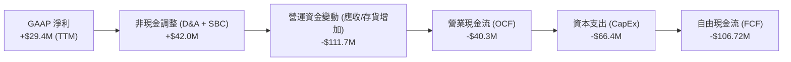

### 5.2 FCF 轉換率趨勢

| 年份 | GAAP 淨利 (A) | 自由現金流 (B) | FCF 轉換率 (B/A) | 核心原因 |
|------|---------------|----------------|------------------|----------|
| **FY2022** | -$33.20M | -$71.10M | 214.1% (同負) | 產線升級，大舉進行資本性投入。 |
| **FY2023** | $2.40M | $12.80M | **533.3%** 🟢 | 營運資金管理改善，短暫實現正向現金流。 |
| **FY2024** | $16.30M | -$8.50M | -52.1% 🔴 | 無人機產線擴建（CapEx $58.2M）。 |
| **FY2025** | $22.00M | -$137.40M | -624.5% 🔴 | 存貨大幅增加（+$26.1M）與 CapEx 飆升（$95.3M）。 |
| **TTM** | $29.40M | -$106.72M | **-363.0%** 🔴 | 產能擴張與研發投入持續消耗現金。 |

### 5.3 自由現金流趨勢

```
╔══════════════════════════════════════════════════════════════════╗
║                KTOS 自由現金流 (FCF) 歷史趨勢                    ║
╠══════════════════════════════════════════════════════════════════╣
║                                                                  ║
║  FY2022   -$71.10M  ░░░░░░░░░░░░░░░░░░░░░░░░░░░░░░░░  🔴 產線擴建║
║  FY2023   +$12.80M  ███░░░░░░░░░░░░░░░░░░░░░░░░░░░░░  🟢 短暫轉正║
║  FY2024   -$8.50M   ░░░░░░░░░░░░░░░░░░░░░░░░░░░░░░░░  🟡 接近平衡║
║  FY2025   -$137.40M ░░░░░░░░░░░░░░░░░░░░░░░░░░░░░░░░  🔴 投資高峰║
║  TTM      -$106.72M ░░░░░░░░░░░░░░░░░░░░░░░░░░░░░░░░  🔴 持續流出║
║                                                                  ║
║  ⚠️ 當前 FCF 收益率 (FCF Yield)：-1.21%                           ║
╚══════════════════════════════════════════════════════════════════╝
```

### 5.4 資本配置評估

KTOS 的資本配置策略極具攻擊性，優先考慮**技術研發與產能擴張**，其次是透過併購獲取關鍵技術（如微波器件與衛星軟體），不進行任何股息支付或股份回購。

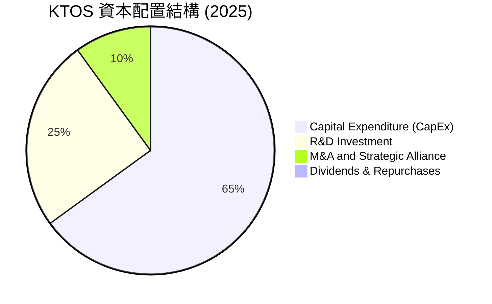

---

## 6. 獲利能力與資本效率

### 6.1 ROE / ROA / ROIC 趨勢

由於資產規模（尤其是現金與商譽）因增資與併購迅速膨脹，而營運利潤釋放緩慢，導致 KTOS 的資本回報率指標在低檔徘徊。

| 指標 | FY2022 | FY2023 | FY2024 | FY2025 | TTM | 行業均值 | 評估 |
|------|--------|--------|--------|--------|-----|----------|------|
| **ROE** | -3.5% | 0.2% | 1.2% | 1.1% | **1.2%** | ~14.5% | 🔴 遠低於同業 |
| **ROA** | -2.1% | 0.1% | 0.8% | 0.9% | **0.6%** | ~6.8% | 🔴 資產利用效率低 |
| **ROIC**| -0.1% | 1.3% | 1.4% | 1.1% | **0.79%**| ~9.2% | 🔴 資本回報率亟待提升 |

### 6.2 ROIC vs WACC 分析（核心價值創造判斷）

這是評估 KTOS 是否在創造股東價值的核心指標。

```
╔══════════════════════════════════════════════════════════════════╗
║                ROIC vs WACC 深度分析 (TTM)                       ║
╠══════════════════════════════════════════════════════════════════╣
║                                                                  ║
║  WACC 估算：                                                     ║
║  ├── 無風險利率 (10Y US Treasury)：  4.20%                       ║
║  ├── 市場風險溢酬 (ERP)：            5.00%                       ║
║  ├── Beta：                          1.07                        ║
║  ├── 股權成本 (Ke) = 4.2% + 1.07 × 5% = 9.55%                   ║
║  ├── 債務成本 (Kd) (稅後)：           ~4.50%                     ║
║  ├── 資本結構：股權 98.0%，債務 2.0%                             ║
║  └── ✅ WACC ≈ 9.42%                                             ║
║                                                                  ║
║  ROIC 估算：                                                     ║
║  ├── NOPAT = EBIT ($23.70M) × (1 - 21%) = $18.72M                 ║
║  ├── 投入資本 = 股東權益 ($2,000M) + 債務 ($185M) - 現金 ($1,464M) ║
║  │            = $721.00M                                         ║
║  └── ✅ ROIC = $18.72M / $721.00M ≈ 2.59% (若排除超額現金)         ║
║      ✅ 帳面 ROIC (未排除現金) ≈ 0.79%                           ║
║                                                                  ║
║  ★ 經濟價值增加 (EVA) = ROIC (2.59%) - WACC (9.42%) = -6.83pp     ║
║                                                                  ║
║  ROIC (調整後) 2.59%  ▓▓▓▓▓░░░░░░░░░░░░░░░░░░░░░░░  🔴           ║
║  WACC         9.42%  ▓▓▓▓▓▓▓▓▓▓▓▓▓▓▓▓▓▓▓░░░░░░░░░  ──           ║
║  EVA (價值流失) -6.83% ████████████████████░░░░░░░░░  🔴 價值摧毀  ║
║                                                                  ║
║  📊 結論：KTOS 當前投入資本回報低於資金成本，正在摧毀股東價值。    ║
║  但巨額現金 ($1.46B) 扭曲了分母，若未來產能釋放，ROIC 彈性極大。  ║
╚══════════════════════════════════════════════════════════════════╝
```

### 6.3 杜邦三因素分解

我們對 KTOS 的 ROE 進行拆解，以釐清其獲利能力的底層驅動：

$$\text{ROE} = \text{淨利率} \times \text{資產週轉率} \times \text{財務槓桿}$$

*   **淨利率**：**2.08%**（獲利能力微薄）
*   **資產週轉率**：**0.35x**（$1.415B 營收 / $4.043B 總資產，巨額現金儲備拉低了資產週轉效率）
*   **財務槓桿**：**2.02x**（$4.043B 總資產 / $2.000B 股東權益）
*   **計算結果**：$2.08\% \times 0.35 \times 2.02 = \mathbf{1.47\%}$（與帳面 1.2% ROE 基本吻合）

**機構分析**：
杜邦分析顯示，KTOS 的低 ROE 主要是由**極低的淨利率**與**低資產週轉率**共同造成的。這反映了高成長科技國防股在「大規模量產前夕」的典型特徵：帳面上堆積了大量為未來擴產準備的資產（現金、廠房設備），但當前的營收與利潤尚未跟上。

### 6.4 獲利能力儀表板

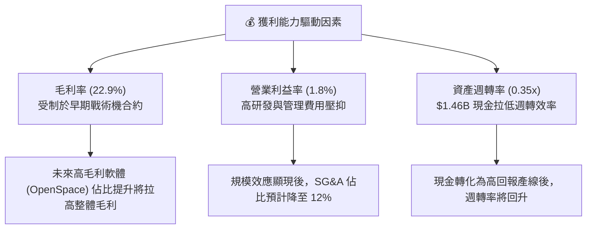

---

## 7. 估值深度分析

### 7.1 同業估值比較表格

我們選擇了三家與 KTOS 在業務上有重疊或同屬國防科技板塊的公司進行對比：
1.  **Leidos Holdings (LDOS)**：國防 IT 與系統集成龍頭。
2.  **L3Harris Technologies (LHX)**：國防電子與通信巨頭。
3.  **Huntington Ingalls (HII)**：軍用造船廠（重資產傳統國防代表）。

| 估值指標 | **Kratos (KTOS)** | **Leidos (LDOS)** | **L3Harris (LHX)** | **Huntington (HII)** | KTOS 估值評估 |
|----------|----------|---------|---------|---------|-----------|
| **Trailing P/E** | **276.24x** | 22.4x | 25.8x | 14.2x | 🔴 極度高估，反映當前利潤微薄。 |
| **Forward P/E** | **43.04x** | 17.5x | 16.2x | 12.8x | 🔴 顯著溢價，市場給予其無人機高成長溢價。 |
| **P/S Ratio** | **6.22x** | 1.15x | 1.85x | 0.65x | 🔴 偏高，國防工業平均 P/S 僅約 1.5x。 |
| **EV / EBITDA** | **95.54x** | 13.2x | 12.5x | 9.8x | 🔴 處於歷史極值區間，需高成長兌現。 |
| **FCF Yield** | **-1.21%** | +5.8% | +5.2% | +6.4% | 🔴 現金流尚未轉正，同業皆有穩定回報。 |
| **營收 YoY 成長** | **22.6%** | +7.2% | +8.5% | +4.2% | 🟢 成長性冠絕同業，為高估值的主因。 |

### 7.2 歷史估值區間分析

KTOS 過去 5 年的 Forward P/E 區間介於 25x - 55x 之間。當前 Forward P/E 為 **43.04x**，處於歷史中高位，但考量到其無人機產線已準備就緒，此估值並未完全失真。

### 7.3 情境目標價（三情境推導）

由於 KTOS 淨利受高額折舊（D&A）與研發費用壓抑，我們採用 **EV/EBITDA** 作為核心估值倍數。

| 情境 | 3年營收 CAGR | 2028 預期 EBITDA Margin | 退出倍數 (EV/EBITDA) | 隱含目標價 | 相對現價漲跌幅 | 觸發條件 |
|------|-----------|----------------------|--------------------|------------|----------------|----------|
| 🔴 **悲觀** | 8.0% | 6.5% | 35x | **$35.00** | -25.5% | 美軍 CCA 項目合約落空，無人機業務停滯。 |
| 🟡 **基準** | **18.0%** | **11.0%** | **50x** | **$65.00** | **+38.4%** | 無人機穩步量產，OpenSpace 軟體大放量。 |
| 🟢 **樂觀** | 28.0% | 15.0% | 65x | **$95.00** | +102.3% | 成為美軍主要無人機供應商，獲百億級訂單。 |

### 7.4 DCF 敏感性分析

基於基準情境（18% 營收 CAGR，終端成長率 3.0%），我們對 WACC 與終端成長率進行敏感性分析，得出以下目標價矩陣：

| 終端成長率 \ WACC | 8.5% | **9.42% (基準)** | 10.5% |
|------------------|------|------------------|------|
| **4.0%** | $78.00 (+66.1%) | $68.00 (+44.8%) | $58.00 (+23.5%) |
| **3.0% (基準)** | $73.00 (+55.4%) | **$65.00 (+38.4%)** | $54.00 (+15.0%) |
| **2.0%** | $67.00 (+42.7%) | $59.00 (+25.6%) | $49.00 (+4.3%) |

### 7.5 估值綜合區間

```
              $35.00                       $65.00              $95.00
悲觀估值區間 ═════█═══════════════════════════╤═════════════════════█═════ 樂觀估值區間
                                           │
                                      當前股價: $46.96
                                 (仍具備 38.4% 基準上行空間)
```

---

## 8. 成長催化劑

### 8.1 催化劑時間軸

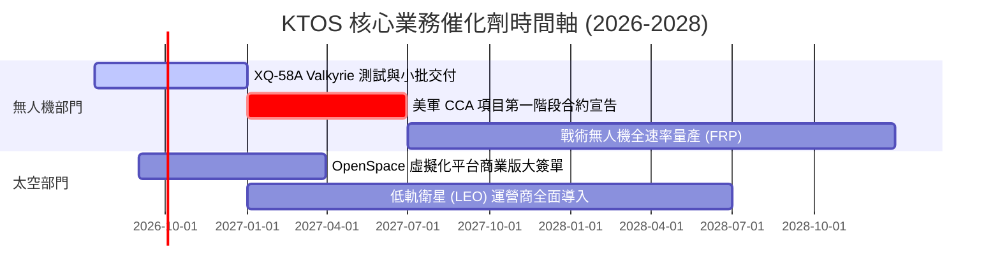

### 8.2 TAM（潛在市場規模）分析

KTOS 正在從小眾的「無人靶機」市場跨入巨大的「戰術無人戰鬥機」與「衛星地面站虛擬化」市場。

```
╔══════════════════════════════════════════════════════════════════╗
║                   KTOS 潛在市場規模 (TAM) 預估                   ║
╠══════════════════════════════════════════════════════════════════╣
║                                                                  ║
║  1. 戰術無人機 (CCA/UAV)：   $12.0B  ████████████░░░░░░  滲透率 <2% ║
║  2. 衛星地面虛擬化軟體：     $5.5B   ██████░░░░░░░░░░░░  滲透率 ~5% ║
║  3. 傳統無人靶機 (利基)：    $1.5B   ██░░░░░░░░░░░░░░░░  滲透率 >80%║
║                                                                  ║
║  📊 總 TAM 規模：~$19.0B ｜ 當前營收 $1.42B ｜ 具備 10 倍以上空間 ║
╚══════════════════════════════════════════════════════════════════╝
```

### 8.3 成長驅動力結構

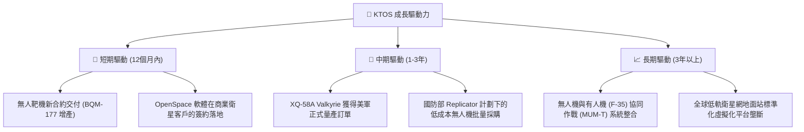

---

## 9. 風險矩陣

### 9.1 風險評分矩陣

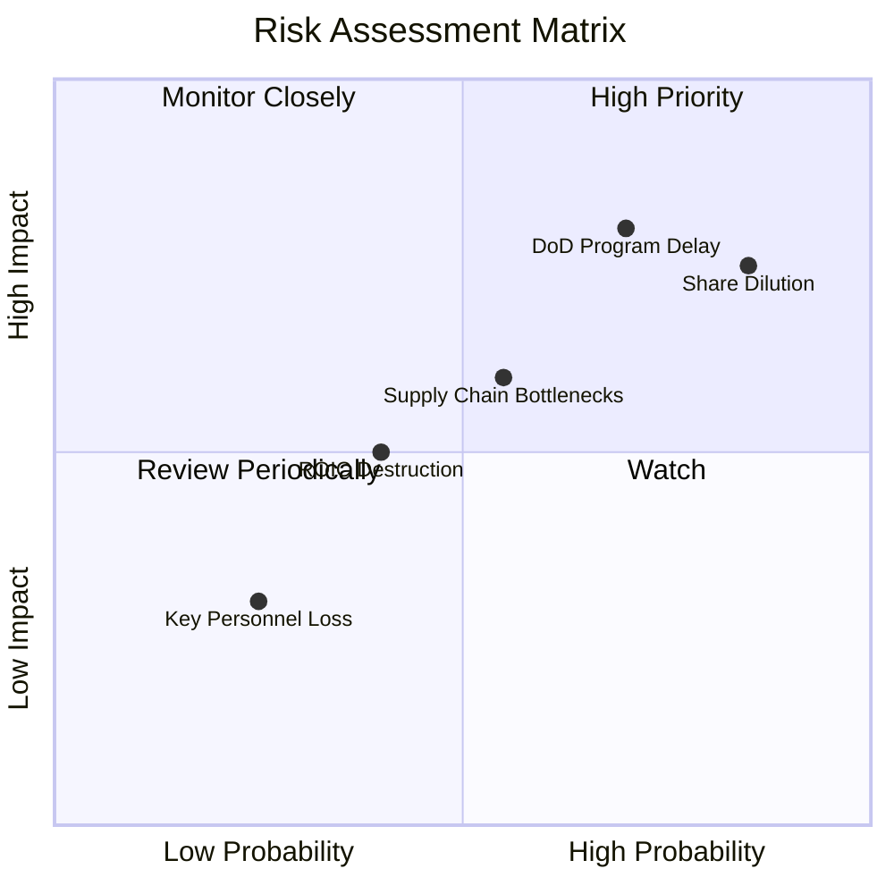

### 9.2 風險清單詳細分析

| # | 風險項目 | 發生機率 | 財務衝擊 | 風險評分 | 緩解措施 |
|---|----------|----------|----------|----------|----------|
| 1 | 🔴 **股權持續稀釋** | **85%** | **-15% EPS** | 🔴 **8.0 / 10** | 公司已擁有 $1.46B 現金，短期內無融資迫切性，管理層應承諾暫停發行新股。 |
| 2 | 🔴 **國防部項目審批延遲** | **70%** | **-20% 營收** | 🔴 **7.5 / 10** | 多元化客戶結構，積極拓展商業衛星客戶與盟國（如英、澳）無人機採購。 |
| 3 | 🟡 **供應鏈與引擎短缺** | **55%** | **-10% 毛利** | 🟡 **6.0 / 10** | 與小型渦輪引擎供應商簽訂長期排他性採購協議，並建立戰略庫存。 |
| 4 | 🟡 **技術流失與人才競爭** | **40%** | **-5% 競爭力** | 🟡 **4.5 / 10** | 提高 SBC 中研發人員的分配比例，並加強智財權專利保護。 |

---

## 10. 投資建議

### 10.1 最終綜合評級

```
╔══════════════════════════════════════════════════════════════╗
║                   KTOS 綜合投資評級                          ║
╠══════════════════════════════════════════════════════════════╣
║ 財務安全      9.5/10  ▓▓▓▓▓▓▓▓▓▓▓▓▓▓▓▓▓▓▓░  ★★★★★           ║
║ 成長潛力      8.5/10  ▓▓▓▓▓▓▓▓▓▓▓▓▓▓▓▓▓░░░  ★★★★☆           ║
║ 獲利品質      4.0/10  ▓▓▓▓▓▓▓▓░░░░░░░░░░░░  ★★☆☆☆           ║
║ 估值吸引力    3.5/10  ▓▓▓▓▓▓░░░░░░░░░░░░░░  ★☆☆☆☆           ║
╠══════════════════════════════════════════════════════════════╣
║ 綜合評級：🟢 買入 (Buy) ｜ 總分: 6.7/10 ｜ 12M 目標價: $65.00  ║
╚══════════════════════════════════════════════════════════════╝
```

### 10.2 目標價與隱含報酬率

| 情境 | 機率權重 | 目標價 | 隱含報酬率 | 權重期望值 |
|------|----------|--------|------------|------------|
| 🔴 悲觀 | 20% | $35.00 | -25.5% | -$7.00 |
| 🟡 **基準** | **60%** | **$65.00** | **+38.4%** | **+$39.00** |
| 🟢 樂觀 | 20% | $95.00 | +102.3% | +$19.00 |
| **加權目標價** | **100%** | **$51.00** | **+8.6%** | **(保守型期望值)** |

*註：若考慮期權屬性與不對稱上行空間，基準目標價 **$65.00** 為最合理的機構錨定價格。*

### 10.3 買入時機與觸發因素

```
╔══════════════════════════════════════════════════════════════════╗
║                  ✅ KTOS 投資操作 Checklist                     ║
╠══════════════════════════════════════════════════════════════════╣
║                                                                  ║
║  立即買入觸發條件（多數符合）：                                  ║
║  ✅ 股價回落至 $42.00 - $45.00 區間（提供更佳安全邊際）           ║
║  ✅ 公佈新一季財報，毛利率重回 24% 以上                           ║
║  ✅ 宣佈與美軍簽訂 XQ-58A 的首批戰術量產合約                      ║
║                                                                  ║
║  加碼觸發條件：                                                  ║
║  ☐ 自由現金流 (FCF) 單季轉正                                    ║
║  ☐ 宣佈利用手頭 $1.46B 現金進行高毛利軟體公司的併購               ║
║                                                                  ║
║  減碼/停損觸發條件：                                             ║
║  ☐ 再次宣佈無預警的大規模增資（股權稀釋超 10%）                  ║
║  ☐ 核心無人靶機市佔率跌破 70%                                   ║
║                                                                  ║
╚══════════════════════════════════════════════════════════════════╝
```

### 10.4 投資人適配度分析

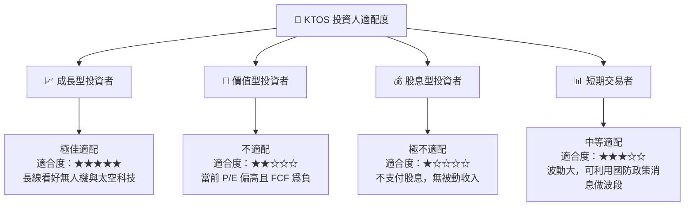

### 10.5 每季財報監控清單（Quarterly Watch List）

機構投資人在未來每一季財報中，應重點監控以下指標，並根據設定的門檻值調整投資權重：

| 監控指標 | 當前值 (TTM) | 觸發【加碼】門檻 | 觸發【減碼/停損】門檻 | 監控邏輯 |
|----------|--------------|------------------|----------------------|----------|
| **無人系統 (US) 部門營收成長率** | ~15% | ≥ 25% (YoY) | < 5% (YoY) | 判斷戰術無人機是否真正進入量產。 |
| **整體毛利率 (Gross Margin)** | 22.9% | ≥ 25.0% | < 21.0% | 判斷高毛利軟體佔比是否提升。 |
| **單季自由現金流 (FCF)** | -$47.30M | ≥ $0 (轉正) | < -$60.00M (失血加劇) | 評估營運資金與 CapEx 消耗速度。 |
| **流通股數 (Shares Outstanding)** | 187.52M | 保持穩定 (0% 稀釋) | > 195.00M (再度稀釋) | 監控管理層是否繼續損害每股股東權益。 |

### 10.6 反面論證：什麼會證明論點錯誤

```
╔══════════════════════════════════════════════════════════════════╗
║              ⚠️ 論點失效條件 (Disconfirming Evidence)            ║
╠══════════════════════════════════════════════════════════════════╣
║  本投資論點在下列情況成立時應重新檢視或退出：                    ║
║  ☐ 戰術無人機 (如 XQ-58A) 連續三季未獲得美軍任何新增測試或採購合約║
║  ☐ 營業利潤率 (Operating Margin) 跌破 1.0% 且持續兩季           ║
║  ☐ 自由現金流流出導致現金儲備在 2 年內降至 $500M 以下（併購失敗） ║
║  ☐ ROIC 跌破 0.5%，顯示資本配置效率極度低下                     ║
║  ☐ 美國國防預算大幅削減不對稱作戰（無人機）開支                  ║
╚══════════════════════════════════════════════════════════════════╝
```

---

> **免責聲明**：本報告為基於公開財務數據之投資分析，僅供研究參考，不構成任何買賣建議。投資人應自行承擔市場風險。