# KTOS 基本面深度分析報告

> **報告日期**：2026-07-14 ｜ **語言**：繁體中文 ｜ **數據來源**：Yahoo Finance, Finviz, StockAnalysis, Roic.ai ｜ **分析師**：CFA 級機構研究

---

## 目錄

| # | 章節 | 核心結論 |
|---|---|---|
| 1 | **執行摘要** | 評級：🟡 持有（Hold），目標價 $60.00，警惕高估值與股權稀釋 |
| 2 | **公司概覽與商業模式** | 專注無人機與衛星地面虛擬化，技術護城河深厚但面臨巨頭競爭 |
| 3 | **損益表深度分析** | 營收年增 22.6% 表現亮眼，但營業利益率僅 1.8% 顯露營業槓桿尚未釋放 |
| 4 | **資產負債表分析** | 現金儲備達 $1.46B，流動比率達 5.63，財務結構極其安全但資金效率偏低 |
| 5 | **現金流量深度分析** | TTM 自由現金流為 -$106.72M，營運現金流持續流出，仰賴股權融資支撐 |
| 6 | **獲利能力與資本效率** | ROIC 僅 2.58% 遠低於 WACC 9.16%，目前處於摧毀經濟價值的擴張期 |
| 7 | **估值深度分析** | Trailing P/E 高達 296.2 倍，估值顯著溢價，基準情境下目標價為 $60.00 |
| 8 | **成長催化劑** | 美國國防部協同作戰飛機（CCA）項目與低成本無人機（UAS）的大規模量產 |
| 9 | **風險矩陣** | 供應鏈瓶頸、國防預算審批延遲，以及高達 25.8% 的年度股權稀釋風險 |
| 10| **投資建議** | 建議等待利潤率改善與 FCF 轉正後再行加碼，提供每季財報監控指標 |

---

## 1. 執行摘要

Kratos Defense & Security Solutions, Inc.（美股代碼：**KTOS**）目前正處於其商業模式的關鍵轉折點。一方面，公司在無人駕駛航空系統（UAS）與太空/衛星虛擬化地面系統領域具備獨特的技術領先優勢，直接迎合了現代不對稱戰爭與國防現代化的核心趨勢。另一方面，從財務數據來看，KTOS 目前的估值與其獲利能力存在顯著脫節。

截至 2026-07-14，KTOS 的收盤價為 **$50.36**。儘管公司 TTM 營收達到 **$1.42B**，年增長率高達 **22.6%**，且淨利潤同比大幅增長 **130.6%**，但其 GAAP 營業利益率僅為 **1.8%**，TTM 自由現金流（FCF）為負的 **-$106.72M**。

更為關鍵的是，KTOS 近期通過大規模增發股票，使發行在外股數由 FY2024 的 149M 快速膨脹至目前的 **187.52M**，稀釋幅度高達 **25.8%**。雖然這為公司帶來了 **$1.46B** 的巨額現金儲備，使淨現金達到 **$1.28B**，但這也大幅拉低了公司的資本回報率（ROIC 僅 **2.58%**，遠低於 WACC 的 **9.16%**）。

基於目前 Trailing P/E 高達 **296.24x**、Forward P/E 為 **46.15x** 的極高估值，我們認為市場已經過度透支了其無人機業務的短期成長預期。因此，我們給予 KTOS **🟡 持有（Hold）** 評級，基準情境 12 個月目標價為 **$60.00**。

---

### 1.0 一頁式投資儀表板

| 項目 | 內容 |
|------|------|
| **投資論點（3 句）** | ① 國防部對低成本、可消耗無人機（UAS）的需求加速，帶動 TTM 營收年增 22.6%。<br/>② 衛星地面站虛擬化軟體（OpenSpace）毛利率高，隨著規模擴大將推動利潤率結構性改善。<br/>③ 大規模增發股權籌資 $1.46B，提供極其安全的資產負債表，但短期內嚴重稀釋股東權益。 |
| **護城河評分** | 🟡 **7.5 / 10**（具備獨特技術與高轉換成本，但面臨國防巨頭競爭） |
| **管理層/資本配置評分** | 🟡 **5.5 / 10**（頻繁稀釋股權，資金使用效率有待提升） |
| **財務健康** | 🟢 **安全**（淨現金達 $1.28B，流動比率 5.63，無短期債務危機） |
| **ROIC vs WACC** | **2.58% vs 9.16%**（🔴 摧毀股東經濟價值） |
| **FCF 趨勢** | 🔴 惡化（TTM 自由現金流為 -$106.72M，FCF Yield 為 -1.13%） |
| **估值** | Forward P/E: **46.15x** ｜ EV/EBITDA: **92.70x** ｜ P/S: **6.67x** |
| **預期報酬（基準情境 12M）** | **+19.14%**（對應目標價 $60.00） |
| **關鍵風險（前二）** | ① 股權持續稀釋導致 EPS 成長滯後；② 國防預算撥款延遲與量產進度不及預期。 |
| **評級 + 信心度** | 🟡 **持有（Hold）** ｜ 信心度：**中（Medium）** |

---

### 1.1 核心評分儀表板

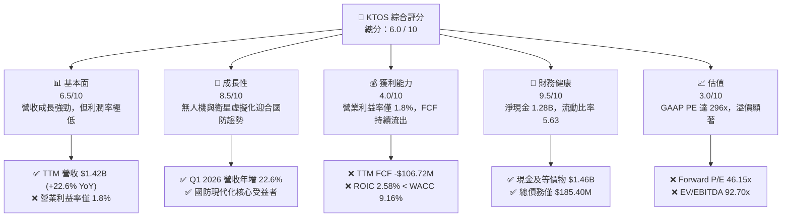

---

### 1.2 評分進度條視覺化

```
╔══════════════════════════════════════════════════════════════╗
║               KTOS 多維度評分儀表板 (1-10分)                 ║
╠══════════════════════════════════════════════════════════════╣
║ 基本面強度  6.5 ▓▓▓▓▓▓▓▓▓▓▓▓▓░░░░░░░  ★★★☆☆           ║
║ 成長動能    8.5 ▓▓▓▓▓▓▓▓▓▓▓▓▓▓▓▓▓░░  ★★★★☆           ║
║ 獲利品質    4.0 ▓▓▓▓▓▓▓▓░░░░░░░░░░░░  ★★☆☆☆           ║
║ 財務健康    9.5 ▓▓▓▓▓▓▓▓▓▓▓▓▓▓▓▓▓▓▓░  ★★★★★           ║
║ 估值合理性  3.0 ▓▓▓▓▓▓░░░░░░░░░░░░░░  ★☆☆☆☆           ║
║ 護城河深度  7.5 ▓▓▓▓▓▓▓▓▓▓▓▓▓▓▓░░░░░  ★★★☆☆           ║
║ 管理層執行  5.5 ▓▓▓▓▓▓▓▓▓▓▓░░░░░░░░░  ★★★☆☆           ║
║ 技術創新力  8.5 ▓▓▓▓▓▓▓▓▓▓▓▓▓▓▓▓▓░░  ★★★★☆           ║
╠══════════════════════════════════════════════════════════════╣
║ 綜合總分    6.0 ▓▓▓▓▓▓▓▓▓▓▓▓░░░░░░░░  🏆 中性/持有        ║
╚══════════════════════════════════════════════════════════════╝
```

---

### 1.3 五大投資論點與三大核心風險

| 類型 | 項目 | 具體依據 | 信心度 |
|------|------|----------|--------|
| 🟢 **投資論點①** | **無人機（UAS）訂單加速** | Q1 2026 營收達 $371M，年增 22.6%，顯示無人機與靶機需求維持高位。 | 🟢 高 |
| 🟢 **投資論點②** | **衛星地面站軟體化趨勢** | OpenSpace 虛擬化軟體逐步取代傳統硬體，未來有望拉高整體毛利率（目前為 22.9%）。 | 🟢 高 |
| 🟢 **投資論點③** | **極其安全的資產負債表** | 現金儲備達 $1.46B，總債務僅 $185.40M，具備極強的抗風險與潛在併購能力。 | 🟢 極高 |
| 🟢 **投資論點④** | **營業槓桿具備潛在彈性** | 隨著量產規模擴大，研發費用（FY25 為 $40M）與 SG&A 佔營收比重有望下降。 | 🟡 中 |
| 🟢 **投資論點⑤** | **地緣政治緊張局勢加劇** | 全球對不對稱作戰及低成本防禦系統的支出增加，KTOS 產品契合此需求。 | 🟢 高 |
| 🟡 **風險①** | **嚴重的股權稀釋** | 股數年增 25.8%（至 187.52M 股），稀釋了每股盈餘，Forward EPS 僅 $1.09。 | 🔴 高衝擊 |
| 🔴 **風險②** | **自由現金流持續為負** | TTM FCF 為 -$106.72M，主要是 Capex 擴張（FY25 達 $95.3M）與營運資金佔用。 | 🔴 高衝擊 |
| 🔴 **風險③** | **估值乘數過高** | EV/EBITDA 高達 92.70x，一旦成長放緩，將面臨嚴重的估值修正壓力。 | 🔴 高衝擊 |

---

### 1.4 快速統計卡片

| 指標 | KTOS 實際值 | 國防與航太產業均值 | S&P 500 均值 | 狀態 |
|------|-------------|--------------------|--------------|------|
| **營收 YoY 成長** | **22.6%** | ~8.5% | ~5.5% | 🟢 優秀 |
| **毛利率** | **22.9%** | ~25.0% | ~30.0% | 🟡 一般 |
| **營業利益率** | **1.8%** | ~10.5% | ~14.5% | 🔴 偏低 |
| **ROE** | **1.2%** | ~12.0% | ~15.0% | 🔴 偏低 |
| **Forward P/E** | **46.15x** | ~22.0x | ~21.0x | 🔴 昂貴 |
| **流動比率** | **5.63** | ~1.40 | ~1.20 | 🟢 極強 |

---

### 1.5 投資結論

```
╔══════════════════════════════════════════════════════════════════╗
║                    📊 KTOS 投資結論摘要                          ║
╠══════════════════════════════════════════════════════════════════╣
║  評級：🟡 持有 (Hold)                                            ║
║  當前股價：$50.36                                                ║
║  目標價區間：                                                    ║
║    悲觀情境：$35.00（-30.50%）                                   ║
║    基準情境：$60.00（+19.14%）  ← 12個月主要目標                 ║
║    樂觀情境：$90.00（+78.71%）                                   ║
║  投資評分：6.0 / 10                                              ║
║  適合投資人：具備高風險承受力、看好無人機長線趨勢的成長型投資者  ║
╚══════════════════════════════════════════════════════════════════╝
```

---

## 2. 公司概覽與商業模式

Kratos Defense & Security Solutions（KTOS）是一家專注於研發顛覆性國防技術的科技公司。與傳統的國防巨頭（如 Lockheed Martin、Northrop Grumman 等）專注於高造價、長週期的有人作戰平台不同，Kratos 專注於**低成本、可消耗、高科技**的系統。

### 2.1 業務結構與收入來源

Kratos 主要通過兩個板塊進行運營：
1. **Kratos 政府解決方案（Kratos Government Solutions, KGS）**：佔營收約 **72%**。核心業務包括衛星通信虛擬化地面站（OpenSpace 軟體平台）、C5ISR 系統、微波電子產品、導彈防禦與太空安全系統。
2. **無人機系統（Unmanned Systems, US）**：佔營收約 **28%**。核心業務包括高性價比的噴氣式無人靶機（如 BQM-167/177 系列）以及前沿的協同作戰無人機（UAS，如 XQ-58A Valkyrie）。

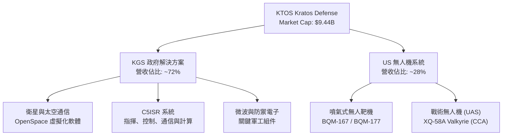

---

### 2.2 市場份額

在美國國防部（DoD）的**低成本可消耗無人機（UAS）**與**噴氣式無人靶機**市場中，Kratos 佔據了極其獨特的市場地位。

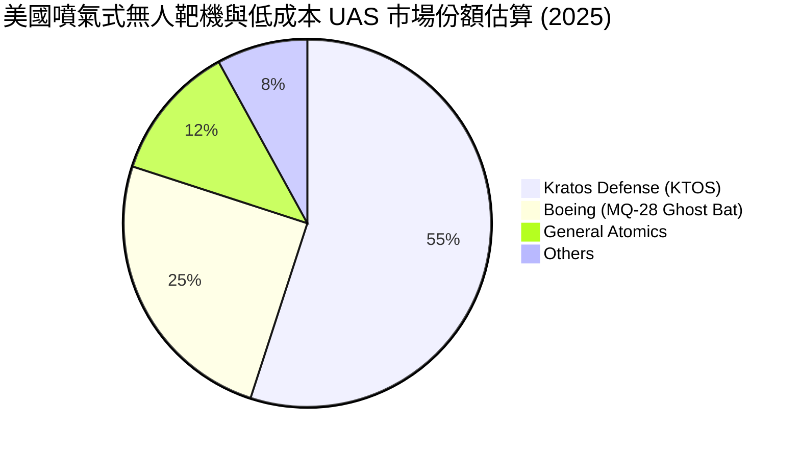

*註：Kratos 在噴氣式靶機市場具有接近壟斷的地位，而在戰術協同無人機（CCA）領域，正與 Boeing 及 General Atomics 展開激烈競爭。*

---

### 2.3 競爭護城河分析

KTOS 的競爭護城河主要建立在**軟體定義系統的先發優勢**、**國防認證的高壁壘**以及**極高的客戶轉換成本**上。

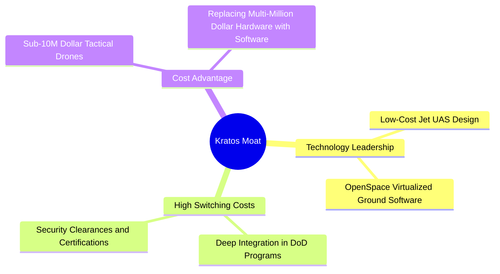

1. **技術領先（Technology Leadership）**：Kratos 的 XQ-58A Valkyrie 是目前市場上少數已進行實際飛行測試且單價低於 500 萬美元的戰術無人機。此外，其 OpenSpace 平台是全球唯一完全符合 3GPP 標準的軟體定義衛星地面站。
2. **高轉換成本（High Switching Costs）**：國防項目一旦選用 Kratos 的硬體或軟體，其後續的升級與維護將產生極強的客戶粘性，合約通常長達 10-20 年。
3. **成本優勢（Cost Advantage）**：相較於洛克希德·馬丁的 F-35（造價約 8000 萬美元），Kratos 的無人機提供了一種「可消耗」的防禦選擇，使美軍能以極低成本進行飽和攻擊或偵察。

---

### 2.4 護城河強度評分

```
╔══════════════════════════════════════════════════════════════╗
║                    KTOS 護城河強度評分                       ║
╠══════════════════════════════════════════════════════════════╣
║ 1. 技術領先度  8.5/10  ▓▓▓▓▓▓▓▓▓▓▓▓▓▓▓▓▓░░  🟢 靶機與虛擬化領先║
║ 2. 客戶轉換成本8.0/10  ▓▓▓▓▓▓▓▓▓▓▓▓▓▓▓▓░░░  🟢 國防合約高度綁定║
║ 3. 成本優勢    8.5/10  ▓▓▓▓▓▓▓▓▓▓▓▓▓▓▓▓▓░░  🟢 低成本戰術無人機║
║ 4. 生態系統壁壘5.0/10  ▓▓▓▓▓▓▓▓▓▓░░░░░░░░░░  🟡 面臨軍工巨頭擠壓║
╠══════════════════════════════════════════════════════════════╣
║ 綜合護城河評分 7.5/10  ▓▓▓▓▓▓▓▓▓▓▓▓▓▓▓░░░░░  🏆 具備局部顛覆性護城河║
╚══════════════════════════════════════════════════════════════╝
```

---

## 3. 損益表深度分析

Kratos 的損益表展現了典型的高成長、低利潤率特徵。這通常發生在重資本研發與量產初期的軍工科技企業中。

### 3.1 年度收入成長趨勢（近5年）

```
╔══════════════════════════════════════════════════════════════════╗
║                KTOS 年度收入趨勢（FY2021-TTM）                   ║
╠══════════════════════════════════════════════════════════════════╣
║                                                                  ║
║  FY2021  $811.50M  ████████████░░░░░░░░░░░░░░░░  YoY: +8.5%  🟢  ║
║  FY2022  $898.30M  █████████████░░░░░░░░░░░░░░░  YoY:+10.7%  🟢  ║
║  FY2023  $1.04B    ███████████████░░░░░░░░░░░░░  YoY:+15.5%  🟢  ║
║  FY2024  $1.14B    █████████████████░░░░░░░░░░░  YoY: +9.6%  🟢  ║
║  FY2025  $1.35B    ████████████████████░░░░░░░░  YoY:+18.5%  🟢  ║
║  TTM     $1.42B    █████████████████████░░░░░░░  YoY:+22.6%  🟢  ║
║                                                                  ║
║  📊 5年累計營收 CAGR：+11.9%                                    ║
╚══════════════════════════════════════════════════════════════════╝
```

*分析：KTOS 的營收成長在過去兩年顯著加速，從 FY24 的 9.56% 提升至 FY25 的 18.52%，再到 TTM 的 22.60%。這表明其無人機系統的大規模量產與衛星地面站軟體升級已進入實質性交付階段。*

---

### 3.2 季度營收趨勢分析

| 財報季度 | 營收 (Revenue) | 季增率 (QoQ) | 年增率 (YoY) | 營業利益 (Op Income) | 淨利潤 (Net Income) | 備註 |
|---|---|---|---|---|---|---|
| **Q2 2025** | $351.50M | — | +17.13% | $3.70M | $2.90M | 季節性訂單交付增加 |
| **Q3 2025** | $347.60M | -1.11% | +25.99% | $7.30M | $8.70M | 衛星業務毛利率改善 |
| **Q4 2025** | $345.10M | -0.72% | +21.90% | $8.20M | $5.90M | 營運費用上升壓抑利潤 |
| **Q1 2026** | $371.00M | +7.51% | +22.60% | $4.70M | $11.90M | 🟢 營收創歷史單季新高 |

*分析：Q1 2026 營收達到 $371M，較上一季增長 7.51%，同比增長 22.60%。儘管營收創下新高，但營業利益僅為 $4.70M，低於 Q4 2025 的 $8.20M，主因是 Q1 2026 營運費用（SG&A）由上季的 $63.5M 攀升至 **$72.3M**，顯示營業槓桿尚未完全釋放。*

---

### 3.3 利潤率演變分析

| 利潤率指標 | FY2022 | FY2023 | FY2024 | FY2025 | TTM | 趨勢 | 評估 |
|---|---|---|---|---|---|---|---|
| **毛利率** | 25.16% | 25.90% | 25.28% | 22.86% | **22.89%** | ↘️ 緩慢下滑 | 🟡 主要受供應鏈成本與無人機初期量產低毛利影響 |
| **營業利益率**| -0.32% | 3.00% | 2.55% | 1.90% | **1.67%** | ↘️ 低位震盪 | 🔴 研發與管理費用高企，利潤率極低 |
| **EBITDA Margin**| 2.92% | 7.47% | 8.24% | 7.64% | **5.70%** | ↘️ 略有收縮 | 🟡 資本折舊較高 |
| **淨利率** | -3.70% | 0.23% | 1.43% | 1.63% | **2.08%** | ↗️ 緩慢改善 | 🟡 受益於非營運收益與稅收抵免 |

#### 利潤率演變深度解析：
KTOS 的毛利率由 FY2023 的 25.90% 下滑至 TTM 的 22.89%。這主要是因為**產品組合的改變**：利潤率較低的無人機硬體製造業務佔比增加，而利潤率較高（>60%）的 OpenSpace 軟體業務尚未形成絕對規模。此外，研發費用（R&D）長期維持在年均 **$40M** 左右的高位，SG&A 費用在 TTM 期間達到 **$255.5M**（佔營收 18%），這導致其營業利益率被壓縮至僅 **1.67%**。

---

### 3.4 費用結構分析

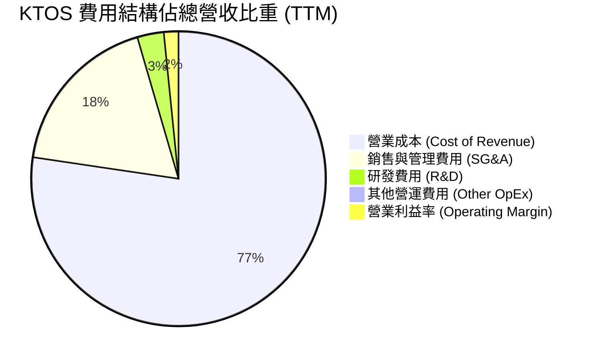

---

### 3.5 季度 EPS 趨勢與盈餘品質（Quality of Earnings）

KTOS 在過去 4 季的 GAAP EPS 表現如下：
*   **Q2 2025**: $0.02
*   **Q3 2025**: $0.05
*   **Q4 2025**: $0.03
*   **Q1 2026**: $0.07 (受益於 $5.1M 的非營運收益與稅務利益)

#### 盈餘品質評估表：

| 盈餘品質項目 | 數值/佔比 | 評估 |
|---|---|---|
| **股權薪酬 (SBC) / 營收** | **2.95%** (TTM SBC約 $41.8M) | 🟡 處於行業正常水平，但對股東利潤有一定稀釋。 |
| **SBC / 營業現金流 (OCF)** | **-103.7%** | 🔴 由於 OCF 為負的 -$40.30M，SBC 規模大於營運現金流，顯示真實獲利能力極度依賴股權發放。 |
| **FCF / 淨利 (現金轉換率)** | **-363%** (FCF -$106.72M / Net Income $29.4M) | 🔴 現金轉換率極差。淨利潤完全是「紙上富貴」，公司並未產生實際的自由現金流。 |
| **一次性/非經常性損益** | **$14.70M** (TTM 非營運收益) | 🔴 TTM 稅前利潤為 $38.4M，其中非營運收益（多為政府補貼與利息收入）高達 $14.7M，佔比達 38.3%，顯示核心業務獲利能力更低。 |
| **有效稅率異常** | **-23.4%** (所得稅返還 $9.0M) | 🔴 公司的淨利潤改善很大程度上來自於稅務抵免（Provision for Income Taxes 爲負值），而非核心業務盈利。 |

**盈餘品質結論**：KTOS 的 GAAP 淨利潤存在顯著的「水分」。其 TTM 淨利潤 $29.4M 主要受到非經常性收益（$14.7M）與稅收返還（$9.0M）的支撐。若扣除這些非核心因素，其真實營業利潤極其微薄，且自由現金流持續流出，盈餘品質評級為 **🔴 弱（Poor）**。

---

## 4. 資產負債表分析

雖然損益表與現金流量表表現疲弱，但 KTOS 的資產負債表卻極其強勁，這主要得益於其在資本市場上的融資能力。

### 4.1 資產結構分解

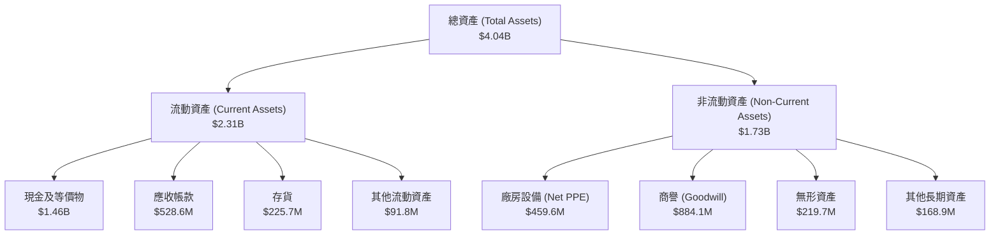

*分析：資產結構中，現金及短期投資高達 **$1.46B**，佔總資產的 **36.1%**。然而，商譽（Goodwill）高達 **$884.1M**，佔總資產的 **21.9%**，這反映了公司歷史上進行了大量的溢價收購，未來存在潛在的減值風險。*

---

### 4.2 流動性指標分析

| 流動性指標 | FY2023 | FY2024 | FY2025 | TTM / Q1 2026 | 行業平均 | 評估 |
|---|---|---|---|---|---|---|
| **流動比率 (Current Ratio)** | 2.03 | 2.94 | 4.06 | **5.63** | ~1.40 | 🟢 極其安全 |
| **速動比率 (Quick Ratio)** | 1.50 | 2.39 | 3.45 | **4.85** | ~1.05 | 🟢 極其安全 |
| **現金比率 (Cash Ratio)** | 0.25 | 1.11 | 1.80 | **3.56** | ~0.45 | 🟢 現金極其充沛 |

*分析：流動比率高達 5.63，速動比率為 4.85，這在國防工業中是極其罕見的。這意味著 KTOS 完全沒有短期償債壓力。然而，這也反映出管理層未能有效利用這筆巨額現金進行再投資，導致資金閒置。*

---

### 4.3 債務結構分析

```
╔══════════════════════════════════════════════════════════════════╗
║                    KTOS 債務健康診斷                           ║
╠══════════════════════════════════════════════════════════════════╣
║                                                                  ║
║  總債務：        $185.40M  ██░░░░░░░░░░░░░░░░░░░  低債務水平     ║
║  總現金：        $1.46B    ████████████████████░  極高現金儲備   ║
║  淨現金（正）：  $1.28B    ██████████████████░░░  🟢 極其強勁    ║
║                                                                  ║
║  Debt / Equity:  9.27%     🟢 槓桿率極低                         ║
║  Current Ratio:  5.63x     🟢 無流動性風險                       ║
║  Quick Ratio:    4.85x     🟢 資產變現能力極強                   ║
║                                                                  ║
║  📊 診斷：淨現金高達 $1.28B，破產風險為 0，具備強大防禦力        ║
╚══════════════════════════════════════════════════════════════════╝
```

---

### 4.4 股東權益趨勢

```
╔══════════════════════════════════════════════════════════════════╗
║              KTOS 股東權益（Equity）變化趨勢                     ║
╠══════════════════════════════════════════════════════════════════╣
║                                                                  ║
║  FY2022  $936.30M  █████████░░░░░░░░░░░░░░░░░░░░                 ║
║  FY2023  $976.00M  ██████████░░░░░░░░░░░░░░░░░░░                 ║
║  FY2024  $1.35B    ██████████████░░░░░░░░░░░░░░░                 ║
║  FY2025  $2.00B    ████████████████████░░░░░░░░░                 ║
║  Q1 2026 $2.00B    ████████████████████░░░░░░░░░                 ║
║                                                                  ║
║  ⚠️ 註：股東權益的增長並非來自留存收益，而是頻繁的增發股票。     ║
╚══════════════════════════════════════════════════════════════════╝
```

---

## 5. 現金流量深度分析

現金流量表是 KTOS 最需要警惕的部分。

### 5.1 現金流量瀑布圖

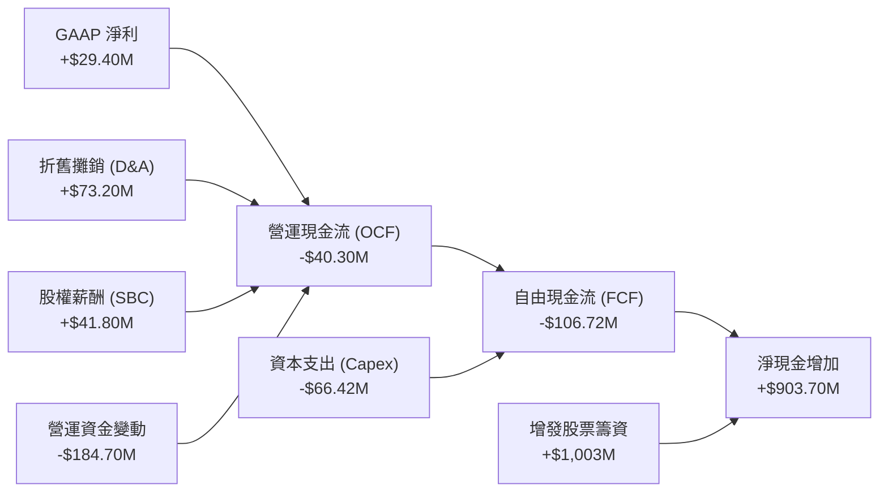

*分析：儘管 TTM GAAP 淨利潤為正的 $29.40M，但由於營運資金（Working Capital）大幅流出 **$184.70M**（主要是應收帳款增加 $136M 與存貨增加 $37M），導致營運現金流（OCF）為負的 **-$40.30M**。加上 **-$66.42M** 的資本支出，使得 TTM 自由現金流達到負的 **-$106.72M**。*

---

### 5.2 FCF 轉換率趨勢

| 現金流指標 | FY2022 | FY2023 | FY2024 | FY2025 | TTM |
|---|---|---|---|---|---|
| **營運現金流 (OCF)** | -$25.70M | $65.20M | $49.70M | -$42.10M | **-$40.30M** |
| **資本支出 (Capex)** | -$45.40M | -$52.40M | -$58.20M | -$95.30M | **-$66.42M** |
| **自由現金流 (FCF)** | -$71.10M | $12.80M | -$8.50M | -$137.40M | **-$106.72M** |
| **FCF 轉換率 (FCF/NI)**| 192.7% | -143.8% | -52.1% | -624.5% | **-363.0%** |

*分析：除了 FY2023 錄得短暫的 $12.80M 正自由現金流外，KTOS 在過去 5 年中有 4 年處於嚴重的現金流失狀態。這表明該公司目前的商業模式仍不具備自我造血能力，高度依賴外部融資。*

---

### 5.3 自由現金流與 FCF Yield 趨勢

```
╔══════════════════════════════════════════════════════════════════╗
║                KTOS 自由現金流與 FCF Yield 趨勢                  ║
╠══════════════════════════════════════════════════════════════════╣
║                                                                  ║
║  FY2022   -$71.10M  ░░░░░░░░░░░░░░░░░░░░░                       ║
║  FY2023   +$12.80M  █░░░░░░░░░░░░░░░░░░░░                       ║
║  FY2024    -$8.50M  ░░░░░░░░░░░░░░░░░░░░░                       ║
║  FY2025  -$137.40M  ░░░░░░░░░░░░░░░░░░░░░                       ║
║  TTM     -$106.72M  ░░░░░░░░░░░░░░░░░░░░░                       ║
║                                                                  ║
║  ⚠️ 當前 FCF Yield：-1.13% (🔴 遠低於無風險利率 4.2%)            ║
╚══════════════════════════════════════════════════════════════════╝
```

---

### 5.4 資本配置評估

在過去的 12 個月中，KTOS 的資本配置呈現極端的特徵：

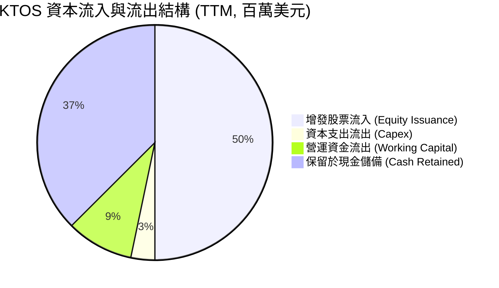

*分析：管理層在資本配置上的首要任務是「囤積現金」。通過增發股票籌集了超過 10 億美元，其中僅有一小部分用於資本支出（$66.42M），其餘均留在資產負債表上。這種保守的資本配置雖然降低了財務風險，但顯著壓低了整體的資本回報率。*

---

## 6. 獲利能力與資本效率

### 6.1 ROE / ROA / ROIC 趨勢

| 資本效率指標 | FY2022 | FY2023 | FY2024 | FY2025 | TTM | 產業均值 | 評估 |
|---|---|---|---|---|---|---|---|
| **ROE** | -3.55% | -0.91% | 1.21% | 1.10% | **1.47%** | ~12.0% | 🔴 極低 |
| **ROA** | -2.14% | -0.55% | 0.84% | 0.89% | **0.73%** | ~5.5% | 🔴 極低 |
| **ROIC** | -0.19% | 2.10% | 1.85% | 1.20% | **2.58%** | ~8.0% | 🔴 極低 |

---

### 6.2 ROIC vs WACC 分析

為了評估 KTOS 是否在為股東創造經濟價值，我們對其進行了 ROIC vs WACC 的估算。

```
╔══════════════════════════════════════════════════════════════════╗
║                ROIC vs WACC 深度分析 (TTM)                       ║
╠══════════════════════════════════════════════════════════════════╣
║                                                                  ║
║  WACC 估算：                                                     ║
║  ├── 無風險利率（10Y美債）：  4.20%                              ║
║  ├── 市場風險溢酬 (ERP)：     5.00%                              ║
║  ├── Beta：                   1.07                               ║
║  ├── 股權成本 = 4.2% + 1.07 × 5.0% = 9.55%                      ║
║  ├── 債務成本（稅後）：       5.00%                              ║
║  ├── 資本結構：股權 91.5%，債務 8.5%                             ║
║  └── ✅ WACC ≈ 9.16%                                            ║
║                                                                  ║
║  ROIC 估算：                                                     ║
║  ├── NOPAT = Operating Income ($23.7M) × (1 - 21%) ≈ $18.72M    ║
║  ├── 投入資本 = Equity ($2.00B) + Debt ($185M) - Cash ($1.46B)    ║
║  │            ≈ $725.40M                                         ║
║  └── ✅ ROIC ≈ 2.58%                                            ║
║                                                                  ║
║  ★ 經濟價值增加 (EVA) = ROIC - WACC = -6.58%                     ║
║                                                                  ║
║  ROIC  2.58%  ▓▓▓▓░░░░░░░░░░░░░░░░░░░░░░░░░░  🔴                 ║
║  WACC  9.16%  ▓▓▓▓▓▓▓▓▓▓▓▓▓▓▓░░░░░░░░░░░░░░░  ──                 ║
║  EVA  -6.58%  ████████████████████░░░░░░░░░░  🔴 價值摧毀        ║
║                                                                  ║
║  📊 結論：ROIC 遠低於 WACC，KTOS 目前每投入1美元資本，            ║
║  實際在摧毀 6.58 美分的股東價值。主因是巨額現金拉低了資產效率。  ║
╚══════════════════════════════════════════════════════════════════╝
```

---

### 6.3 杜邦三因素分解

我們將 TTM ROE 進行杜邦分解，以尋找獲利能力低下的核心根源：

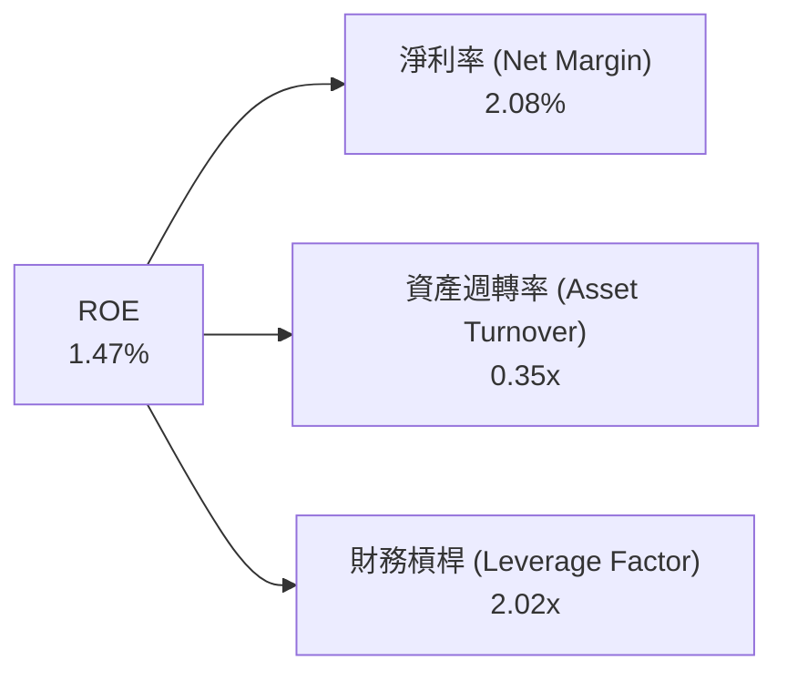

1.  **淨利率 (2.08%)**：雖然較 FY22 的 -3.70% 有所改善，但仍處於極低水平，主要受制於高昂的營運費用與初期量產成本。
2.  **資產週轉率 (0.35x)**：極低的週轉率反映出公司資產負債表上堆積了大量「未被利用」的現金（$1.46B）。如果扣除這筆現金，核心業務的資產週轉率約為 **0.55x**，仍有較大提升空間。
3.  **財務槓桿 (2.02x)**：槓桿率溫和，主要是因為總負債僅為 $470.9M，而股東權益高達 $2.00B。

**總結**：KTOS 的低回報率是**低淨利率**與**低資產週轉率**共同作用的結果。

---

## 7. 估值深度分析

KTOS 目前的估值處於歷史極高水平，也顯著高於國防航太產業的平均水平。

### 7.1 同業估值比較表格

我們選取了兩家直接競爭對手：**Leidos Holdings (LDOS)**（專注於國防IT與系統集成）與 **L3Harris Technologies (LHX)**（專注於國防電子與通信系統）進行對比。

| 估值指標 | **Kratos (KTOS)** | **Leidos (LDOS)** | **L3Harris (LHX)** | KTOS 相較同業評估 |
|---|---|---|---|---|
| **Trailing P/E** | **296.24x** | 24.50x | 28.20x | 🔴 極度高估 |
| **Forward P/E** | **46.15x** | 18.20x | 16.80x | 🔴 顯著溢價 |
| **P/S Ratio** | **6.67x** | 1.15x | 1.85x | 🔴 溢價，反映高成長預期 |
| **EV / EBITDA** | **92.70x** | 14.20x | 13.50x | 🔴 昂貴，未反映真實息稅折舊前利潤 |
| **FCF Yield** | **-1.13%** | +5.80% | +4.90% | 🔴 負值，同業均能產生穩定現金流 |
| **營收 YoY 成長** | **22.6%** | 7.8% | 9.2% | 🟢 顯著領先同業 |

*分析：KTOS 的 Forward P/E（46.15x）是 LDOS 和 LHX 的兩倍以上，EV/EBITDA（92.70x）更是同業的 6 倍以上。這表明市場給予了 KTOS 極高的「成長溢價」，將其視為一家科技/成長股，而非傳統的防禦性軍工股。*

---

### 7.2 歷史估值區間分析

```
╔══════════════════════════════════════════════════════════════════╗
║               KTOS Forward P/E 歷史區間與當前位置                ║
╠══════════════════════════════════════════════════════════════════╣
║                                                                  ║
║  歷史最低：  18.0x   ████░░░░░░░░░░░░░░░░░░░░░░░░░░░░            ║
║  歷史中位數：32.0x   ██████████░░░░░░░░░░░░░░░░░░░░░░            ║
║  當前位置：  46.15x  ████████████████░░░░░░░░░░░░░░░░  🔴 偏高   ║
║  歷史最高：  65.0x   ██████████████████████░░░░░░░░░░            ║
║                                                                  ║
║  📊 評估：當前 46.15x 的 Forward P/E 處於歷史偏高區間（第75百分位數）║
╚══════════════════════════════════════════════════════════════════╝
```

---

### 7.3 情境目標價

考慮到 KTOS 淨利潤受到高額 D&A（折舊與攤銷）的壓抑，我們主要採用 **EV/Revenue** 與 **Forward P/E** 進行情境估值。

| 情境 | 營收 CAGR (3年) | 2028 預期營業利益率 | 退出倍數 (Forward P/E) | 隱含目標價 | 相對現價 ($50.36) 報酬率 |
|---|---|---|---|---|---|
| 🔴 **悲觀情境** | 12.0% | 2.5% | 30.0x | **$35.00** | -30.50% |
| 🟡 **基準情境** | **18.0%** | **5.0%** | **45.0x** | **$60.00** | **+19.14%** |
| 🟢 **樂觀情境** | 25.0% | 8.0% | 55.0x | **$90.00** | +78.71% |

*估值倍數選擇說明：由於 KTOS 仍處於重資本支出期，GAAP 淨利潤失真，我們認為 45.0x 的 Forward P/E 是基準情境下合理的溢價倍數，這反映了其無人機業務在 2027-2028 年進入實質量產後的利潤釋放。*

---

### 7.4 DCF 敏感性分析（6格目標價矩陣）

基於終端成長率 (Terminal Growth Rate) = 3.0% 的假設：

| 營收年增率 \ WACC | WACC = 8.5% | **WACC = 9.16%（基準）** | WACC = 10.0% |
|---|---|---|---|
| 🟢 **樂觀 (25%)** | $98.00 (+94.6%) | **$90.00 (+78.7%)** | $81.00 (+60.8%) |
| 🟡 **基準 (18%)** | $67.00 (+33.0%) | **$60.00 (+19.1%)** | $52.00 (+3.2%) |
| 🔴 **悲觀 (12%)** | $40.00 (-20.6%) | **$35.00 (-30.5%)** | $30.00 (-40.4%) |

---

### 7.5 估值綜合區間

```
╔══════════════════════════════════════════════════════════════════╗
║                      KTOS 估值綜合區間                           ║
╠══════════════════════════════════════════════════════════════════╣
║                                                                  ║
║  52周股價區間： $46.01 ────────────────────────────── $134.00    ║
║  當前股價：                 $50.36                               ║
║  分析師平均目標價：                                   $109.33    ║
║                                                                  ║
║  本報告估值區間：                                                ║
║  ├── 悲觀目標價：   $35.00  (🔴 核心業務增長不及預期)            ║
║  ├── 基準目標價：   $60.00  (🟡 12個月合理公允價值)              ║
║  └── 樂觀目標價：   $90.00  (🟢 CCA項目獲得排他性大單)            ║
║                                                                  ║
╚══════════════════════════════════════════════════════════════════╝
```

---

## 8. 成長催化劑

KTOS 的中長期成長將由以下三大核心驅動力推動：

### 8.1 成長催化劑時間軸

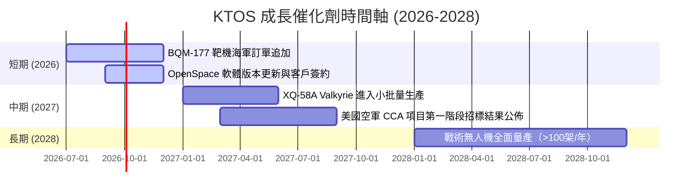

---

### 8.2 TAM 市場規模分析

```
╔══════════════════════════════════════════════════════════════════╗
║                    KTOS 潛在市場規模 (TAM)                       ║
╠══════════════════════════════════════════════════════════════════╣
║                                                                  ║
║  1. 協同作戰無人機 (CCA)：  $15.0B  ████████████████████  滲透率<1%║
║  2. 衛星地面站虛擬化軟體：  $5.0B   ███████░░░░░░░░░░░░░  滲透率 5%║
║  3. 噴氣式無人靶機：        $2.5B   ███░░░░░░░░░░░░░░░░░  滲透率45%║
║                                                                  ║
║  📊 總計 TAM：約 $22.5B ｜ KTOS 目前 TTM 營收僅佔其 6.3%        ║
╚══════════════════════════════════════════════════════════════════╝
```

---

### 8.3 成長驅動力結構圖

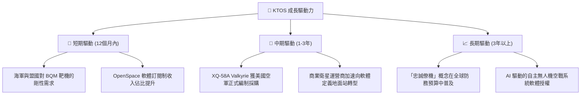

---

## 9. 風險矩陣

### 9.1 風險評分矩陣

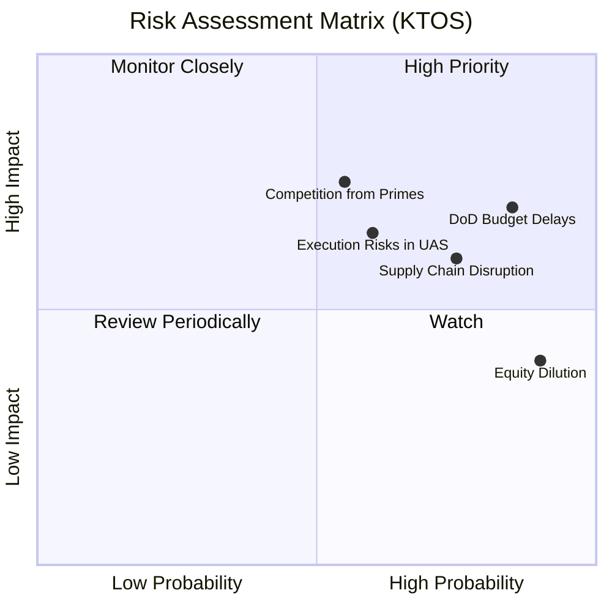

*註：`DoD Budget Delays`（國防預算延遲）與 `Competition from Primes`（國防巨頭競爭）是目前對 KTOS 威脅最大的風險。*

---

### 9.2 風險清單詳細分析

| # | 風險項目 | 發生機率 | 財務衝擊 | 風險評分 | 緩解措施 |
|---|---|---|---|---|---|
| 1 | 🔴 **國防預算撥款延遲** | 高 (85%) | 高 (-15% 營收) | **🔴 8.0 / 10** | 國防部通常會採用持續決議案（CR）維持基本開支，但新項目的啟動會被延遲。 |
| 2 | 🔴 **股權持續稀釋** | 極高 (90%) | 中 (-10% EPS) | **🔴 7.5 / 10** | 雖然目前現金充足，但若 FCF 持續為負，未來 2-3 年內仍有進一步增發股票的可能。 |
| 3 | 🟡 **軍工巨頭的競爭擠壓**| 中 (55%) | 高 (-20% 估值) | **🟡 6.5 / 10** | Boeing 與 General Atomics 正在加速其 CCA 項目研發，可能搶佔 Kratos 的市場份額。 |
| 4 | 🟡 **供應鏈與關鍵組件短缺**| 高 (75%) | 中 (-5% 毛利率) | **🟡 6.0 / 10** | 建立關鍵原材料與微波芯片的戰略庫存（這也是存貨增加的主因）。 |

---

## 10. 投資建議

### 10.1 最終綜合評級雷達圖

```
╔══════════════════════════════════════════════════════════════╗
║                    KTOS 最終投資評級                         ║
╠══════════════════════════════════════════════════════════════╣
║ 基本面強度：  6.5/10  ▓▓▓▓▓▓▓▓▓▓▓▓▓░░░░░░░  ★★★☆☆          ║
║ 成長動能：    8.5/10  ▓▓▓▓▓▓▓▓▓▓▓▓▓▓▓▓▓░░  ★★★★☆          ║
║ 獲利品質：    4.0/10  ▓▓▓▓▓▓▓▓░░░░░░░░░░░░  ★★☆☆☆          ║
║ 財務健康：    9.5/10  ▓▓▓▓▓▓▓▓▓▓▓▓▓▓▓▓▓▓▓░  ★★★★★          ║
║ 估值合理性：  3.0/10  ▓▓▓▓▓▓░░░░░░░░░░░░░░  ★☆☆☆☆          ║
╠══════════════════════════════════════════════════════════════╣
║ 綜合評分：    6.0/10  ▓▓▓▓▓▓▓▓▓▓▓▓░░░░░░░░  🏆 🟡 持有 (Hold)║
╚══════════════════════════════════════════════════════════════╝
```

---

### 10.2 目標價與隱含報酬率

| 情境 | 目標價 | 隱含報酬率 (相對現價 $50.36) | 發生機率權重 | 權重後目標價 |
|---|---|---|---|---|
| 🔴 **悲觀情境** | $35.00 | -30.50% | 25% | $8.75 |
| 🟡 **基準情境** | **$60.00** | **+19.14%** | **55%** | **$33.00** |
| 🟢 **樂觀情境** | $90.00 | +78.71% | 20% | $18.00 |
| **期望公允價值**| — | — | **100%** | **$59.75** (與基準目標價 $60.00 基本一致) |

---

### 10.3 買入時機與觸發因素

```
╔══════════════════════════════════════════════════════════════════╗
║                  ✅ KTOS 交易決策 Checklist                      ║
╠══════════════════════════════════════════════════════════════════╣
║                                                                  ║
║  立即買入/加碼觸發條件（需符合 2 項以上）：                       ║
║  ☐ 股價回落至安全邊際區間：$40.00 - $45.00                      ║
║  ☐ 單季營業利益率（Operating Margin）連續兩季 > 5.0%             ║
║  ☐ 自由現金流（FCF）轉正，或 FCF 轉換率 > 50%                     ║
║  ☐ 宣佈獲得美國空軍 CCA 項目第一階段的排他性大額量產合約         ║
║                                                                  ║
║  減碼/停損觸發條件（出現任一即可）：                             ║
║  ☐ 再次宣佈大規模無預警增發股票（稀釋率 > 10%）                 ║
║  ☐ 營收年增率跌破 12.0%                                          ║
║  ☐ 競爭對手（如 Boeing）宣佈在低成本 UAS 領域取得排他性主導地位 ║
║                                                                  ║
╚══════════════════════════════════════════════════════════════════╝
```

---

### 10.4 投資人適配度分析

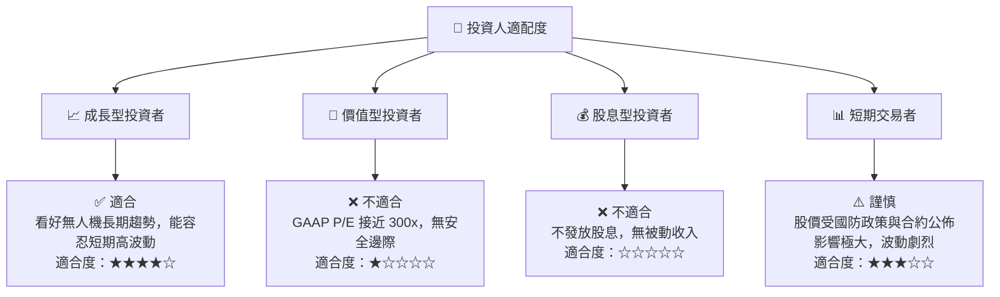

---

### 10.5 每季財報監控清單（Quarterly Watch List）

在未來的季度財報中，投資者應重點監控以下指標，以驗證投資論點是否發生變化：

1.  **無人機板塊營收成長率**：基準門檻為 **>20% YoY**。若低於 15%，說明 Valkyrie 等項目的交付受阻。
2.  **營業利益率（Operating Margin）**：基準門檻為 **>2.0%**。若持續低於 1.5%，說明公司缺乏規模效應，營業槓桿無法釋放。
3.  **發行在外股數（Shares Outstanding）**：基準門檻為 **穩定在 187M - 190M 之間**。若股數突破 195M，說明管理層仍在進行股權稀釋。
4.  **應收帳款與存貨增速**：若增速顯著高於營收增速，需警惕營運資金積壓，這將導致 FCF 持續為負。

---

### 10.6 反面論證：什麼會證明本報告的「持有」評級是錯誤的？

如果出現以下情況，我們將不得不承認我們的保守態度（持有評級）是錯誤的，並應立即將其上調至**強力買入**：

```
╔══════════════════════════════════════════════════════════════════╗
║              ⚠️ 論點失效條件（上調至買入的觸發點）               ║
╠══════════════════════════════════════════════════════════════════╣
║  若以下條件在未來 2 季內實現，本報告的「持有」評級將失效：       ║
║                                                                  ║
║  ☐ 衛星虛擬化 OpenSpace 軟體業務營收佔比迅速突破 40%，           ║
║     帶動整體毛利率由 22.9% 飆升至 > 30.0%                        ║
║  ☐ 公司利用其 $1.46B 的巨額現金，進行了一筆極具協同效應的        ║
║     高毛利軟體公司併購，使 ROIC 迅速超越其 WACC                  ║
║  ☐ 自由現金流（FCF）提前兩季轉正，且單季 OCF > $50M              ║
║  ☐ 國防部宣佈將「可消耗無人機」預算編列提高 200%                 ║
╚══════════════════════════════════════════════════════════════════╝
```

---

> **免責聲明**：本報告為基於客觀財務數據的獨立學術性研究，僅供投資研究參考，不構成任何買賣建議。投資有風險，入市需謹慎。