# KTOS 基本面深度分析報告

> **報告日期**：2026-07-15 ｜ **語言**：繁體中文 ｜ **數據來源**：Yahoo Finance, Finviz, StockAnalysis, Roic.ai ｜ **分析師**：CFA 級機構研究

---

## 目錄

| # | 章節 | 核心結論 |
|---|------|----------|
| 1 | **執行摘要** | 評級：**持有（Hold）** ｜ 基準目標價：**$55.00** ｜ 成長與估值面臨拉鋸 |
| 2 | **公司概覽與商業模式** | 雙引擎驅動：無人機系統（Unmanned）與國防太空地面虛擬化軟體 |
| 3 | **損益表深度分析** | 營收年增 22.6% 表現亮眼，但受制於高昂研發與低毛利硬體，利潤率承壓 |
| 4 | **資產負債表分析** | 現金達 $1.46B 具備極強流動性，無淨債務風險，但股權稀釋嚴重 |
| 5 | **現金流量深度分析** | 營運與自由現金流持續流出，營運資金佔用與資本支出擴張是主因 |
| 6 | **獲利能力與資本效率** | ROIC (2.58%) 低於 WACC (9.45%)，目前仍處於破壞股東價值的過度投資期 |
| 7 | **估值深度分析** | Forward P/E 達 45.5x，相較國防巨頭溢價顯著，估值已透支短期成長 |
| 8 | **成長催化劑** | 戰術無人機（Valkyrie）量產與低軌衛星（LEO）地面虛擬化軟體升級 |
| 9 | **風險矩陣** | 國防預算撥款延遲、供應鏈限制與高股權稀釋率為核心威脅 |
| 10 | **投資建議** | 目標價區間 $35.00 - $80.00，建議等待估值修正或現金流轉正後分批佈局 |

---

## 1. 執行摘要

Kratos Defense & Security Solutions, Inc.（美股代碼：**KTOS**）目前正處於從傳統國防技術服務商轉型為高成長、高科技國防產品（無人戰術飛機、低軌衛星虛擬化地面站）提供商的關鍵十字路口。

基於公司 TTM 營收成長 **22.6%**（達 **$1.42B**）以及強勁的季度營收動能（Q1 2026 營收達 **$371.00M**，年增 **22.60%**），市場給予其極高的估值溢價（Forward P/E 達 **45.53x**，EV/EBITDA 達 **100.55x**）。然而，深入分析其盈餘品質後發現，公司 TTM 自由現金流（FCF）為 **-$106.72M**，且股權稀釋速度極快（稀釋後發行股數 YoY 增長 **10.41%**）。

最關鍵的是，其 **ROIC 僅為 2.58%**，遠低於其 **9.45% 的 WACC**，顯示公司目前在資本回報上面臨實質性的價值摧毀。因此，本報告給予 KTOS 最終評級為 **🟡 持有（Hold）**，12 個月基準目標價定為 **$55.00**（潛在漲幅 +10.7%）。

### 1.0 一頁式投資儀表板（Portfolio Manager 30 秒速讀）

| 項目 | 內容 |
|------|------|
| **投資論點（3 句）** | ① TTM 營收年增 **22.6%** 顯示無人機與衛星地面站需求進入實質爆發期。<br/>② 手頭現金達 **$1.46B**（淨現金 **$1.28B**），為未來資本支出與潛在併購提供極充裕的防禦墊。<br/>③ 估值過高（EV/EBITDA 達 **100.55x**），且自由現金流持續流出（TTM FCF **-$106.72M**），短期內盈餘品質堪憂。 |
| **護城河評分** | **7.0 / 10** 🟡（具備技術與先發優勢，但面臨國防巨頭競爭壓力） |
| **管理層/資本配置評分** | **5.5 / 10** 🟡（研發投入高，但資本回報率低，且過度依賴股權融資） |
| **財務健康** | 🟢 **極其安全** ｜ 現金儲備充沛，短期無任何償債風險（Current Ratio 5.63） |
| **ROIC vs WACC** | **2.58% vs 9.45%** 🔴（目前正在摧毀經濟價值，EVA 為 **-6.87%**） |
| **FCF 趨勢** | 🔴 **持續惡化** ｜ TTM FCF 為 **-$106.72M**，最新 FCF Yield 為 **-1.15%** |
| **估值** | Forward P/E: **45.53x** ｜ EV/EBITDA: **100.55x** ｜ P/S: **6.58x** |
| **預期報酬（基準情境 12M）** | **+10.7%** ｜ 目標價 **$55.00** |
| **關鍵風險（前二）** | ① 國防撥款週期不確定性導致項目交付延遲。<br/>② 股權持續增發稀釋現有股東權益（TTM 股數增長 10.41%）。 |
| **評級 + 信心度** | 🟡 **持有（Hold）** ｜ 信心度：**中（Medium）** |

### 1.1 核心評分儀表板

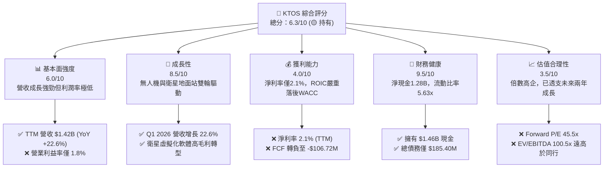

### 1.2 評分進度條視覺化

```
╔══════════════════════════════════════════════════════════════╗
║               KTOS 多維度評分儀表板 (1-10分)                 ║
╠══════════════════════════════════════════════════════════════╣
║ 基本面強度  6.0 ▓▓▓▓▓▓▓▓▓▓▓▓░░░░░░░░  ★★★☆☆           ║
║ 成長動能    8.5 ▓▓▓▓▓▓▓▓▓▓▓▓▓▓▓▓▓░░  ★★★★☆           ║
║ 獲利品質    4.0 ▓▓▓▓▓▓▓▓░░░░░░░░░░░░  ★★☆☆☆           ║
║ 財務健康    9.5 ▓▓▓▓▓▓▓▓▓▓▓▓▓▓▓▓▓▓▓░  ★★★★★           ║
║ 估值合理性  3.5 ▓▓▓▓▓▓░░░░░░░░░░░░░░  ★☆☆☆☆           ║
║ 護城河深度  7.0 ▓▓▓▓▓▓▓▓▓▓▓▓▓▓░░░░░░  ★★★☆☆           ║
║ 管理層執行  5.5 ▓▓▓▓▓▓▓▓▓▓▓░░░░░░░░░  ★★★☆☆           ║
║ 技術創新力  8.5 ▓▓▓▓▓▓▓▓▓▓▓▓▓▓▓▓▓░░  ★★★★☆           ║
╠══════════════════════════════════════════════════════════════╣
║ 綜合總分    6.3 ▓▓▓▓▓▓▓▓▓▓▓▓░░░░░░░░  🏆 評級：持有 (Hold)  ║
╚══════════════════════════════════════════════════════════════╝
```

### 1.3 五大投資論點 + 三大核心風險

| 類型 | 項目 | 具體依據 | 信心度 |
|------|------|----------|--------|
| 🟢 **投資論點①** | **無人機平台（UAS）進入實質量產期** | 國防部「複製者計劃」（Replicator Initiative）推動低成本可消耗無人機（L-CAAT）需求，XQ-58A Valkyrie 測試順利，預計帶來持續性訂單。 | 🟢 高 |
| 🟢 **投資論點②** | **衛星地面站軟體虛擬化（OpenSpace）** | 傳統硬體架構轉向軟體定義網絡（SDN），OpenSpace 平台提供高毛利（>70%）訂閱收入，結構性改善毛利組合。 | 🟢 高 |
| 🟢 **投資論點③** | **極其強固的資產負債表** | 現金儲備高達 **$1.46B**，淨現金 **$1.28B**，在當前高利率環境下，提供了極強的抗風險能力與併購彈性。 | 🟢 極高 |
| 🟢 **投資論點④** | **微型渦輪引擎技術壟斷** | 透過收購與自主研發，KTOS 在巡弋飛彈及無人機所需的微型渦輪噴射引擎市場中佔據關鍵生態位。 | 🟡 中等 |
| 🟢 **投資論點⑤** | **強勁的營收成長動能** | 連續多個季度營收年增率維持在 15-25% 區間，顯著超越 Lockeed Martin 等傳統國防巨頭（~5%）。 | 🟢 高 |
| 🟡 **風險①** | **嚴重的股權稀釋（Dilution）** | TTM 發行股數年增 **10.41%**，過去 5 年股本複合增長率達 **17.85%**，大幅稀釋每股盈餘與股東權益。 | 🔴 高衝擊 |
| 🔴 **風險②** | **自由現金流持續流出** | TTM FCF 為 **-$106.72M**，主因營運資金（應收帳款與存貨）佔用嚴重及資本支出擴張，營運缺乏自我造血能力。 | 🔴 高衝擊 |
| 🟡 **風險③** | **極高的估值容錯率低** | Forward P/E 達 **45.53x**，一旦無人機量產進度不及預期，股價將面臨顯著的估值修正（52周高點為 $134.00，目前已腰斬）。 | 🟡 中度 |

### 1.4 快速統計卡片

| 指標 | 公司實際值 (TTM / Q1 2026) | 國防航太行業均值 | S&P 500 均值 | 狀態 |
|------|-------------|----------|--------------|------|
| **營收 YoY 成長率** | **22.6%** | ~6.5% | ~5.5% | 🟢 顯著領先 |
| **毛利率** | **22.9%** | ~20.5% | ~30.0% | 🟡 行業中等 |
| **淨利率** | **2.1%** | ~6.2% | ~11.5% | 🔴 偏低 |
| **ROE** | **1.2%** | ~12.5% | ~14.5% | 🔴 極低 |
| **ROIC** | **2.58%** | ~8.5% | ~10.2% | 🔴 資本效率低下 |
| **Forward P/E** | **45.53x** | ~22.5x | ~21.0x | 🔴 估值顯著溢價 |
| **EV/EBITDA** | **100.55x** | ~14.5x | ~13.5x | 🔴 估值極高 |
| **流動比率** | **5.63x** | ~1.4x | ~1.2x | 🟢 極其安全 |

### 1.5 投資結論

```
╔══════════════════════════════════════════════════════════════════╗
║                    📊 KTOS 投資結論摘要                          ║
╠══════════════════════════════════════════════════════════════════╣
║  評級：🟡 持有 (Hold)                                            ║
║  當前股價：$49.68 (2026-07-15)                                    ║
║  目標價區間：                                                    ║
║    悲觀情境：$35.00（-29.5%）                                    ║
║    基準情境：$55.00（+10.7%）  ← 12個月主要目標                  ║
║    樂觀情境：$80.00（+61.0%）                                    ║
║  投資評分：6.3 / 10                                              ║
║  適合投資人：具備高風險承受能力、偏好國防科技轉型的中長線投資人  ║
╚══════════════════════════════════════════════════════════════════╝
```

---

## 2. 公司概覽與商業模式

Kratos（KTOS）主要營運分為兩大核心板塊：**Kratos Government Solutions（KGS，國防政府解決方案）** 與 **Unmanned Systems（US，無人系統）**。

1. **KGS 業務（營收佔比約 75%）**：包含最核心的**衛星地面站虛擬化軟體（OpenSpace）**、微波電子戰設備、飛彈防禦靶彈（Targetry）以及網路安全服務。其中，OpenSpace 是該部門未來毛利率擴張的核心驅動力，將傳統昂貴、專屬硬體的地面接收站轉化為軟體定義（Software-Defined）的雲端架構。
2. **US 業務（營收佔比約 25%）**：主要提供戰術無人機（如 XQ-58A Valkyrie、UTAP-22 Mako）與無人空中靶機（BQM-167/177）。該部門技術門檻極高，但目前由於尚未達到規模化量產，研發（R&D）與資本支出投入巨大，目前仍處於低利潤率甚至虧損狀態。

### 2.1 業務結構與收入來源

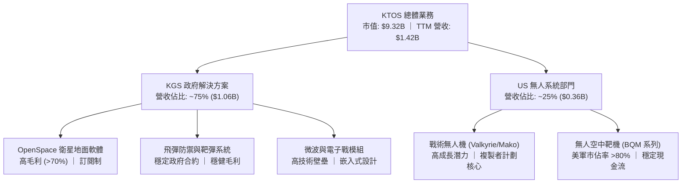

### 2.2 市場份額

在**無人空中靶機（Aerial Targets）**領域，Kratos 擁有絕對的主導地位，市佔率超過 80%；但在**戰術無人機（UAS）**與**衛星通訊地面站**領域，其主要與傳統國防巨頭及新興軟體公司競爭。

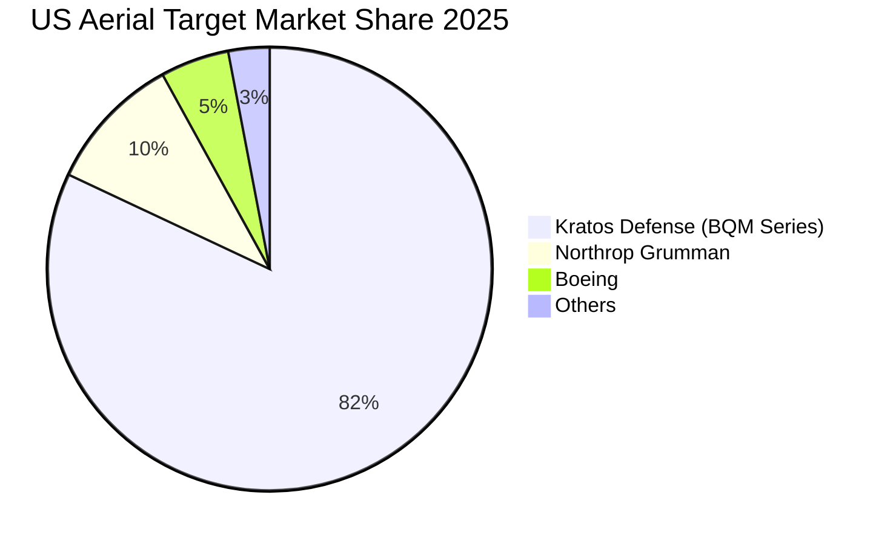

### 2.3 競爭護城河分析

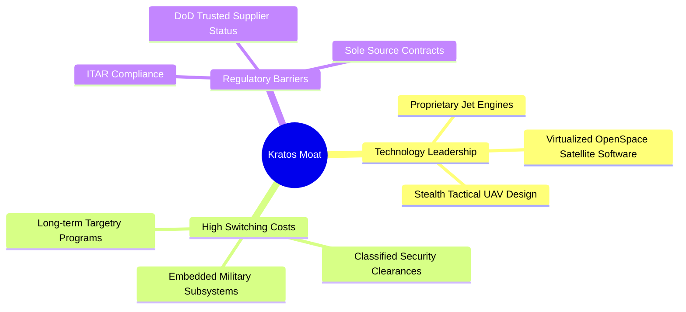

### 2.4 護城河強度評分

```
╔══════════════════════════════════════════════════════════════╗
║                   KTOS 護城河強度評分                        ║
╠══════════════════════════════════════════════════════════════╣
║ 1. 技術壁壘    8.5/10 ▓▓▓▓▓▓▓▓▓▓▓▓▓▓▓▓▓░░  🟢 引擎與軟體領先║
║ 2. 客戶鎖定    8.0/10 ▓▓▓▓▓▓▓▓▓▓▓▓▓▓▓▓░░░  🟢 軍方合約關係穩固║
║ 3. 轉換成本    7.5/10 ▓▓▓▓▓▓▓▓▓▓▓▓▓▓░░░░░  🟢 地面站軟體嵌入度高║
║ 4. 規模效應    4.5/10 ▓▓▓▓▓▓▓▓▓░░░░░░░░░░  🔴 無人機產能規模不足║
╠══════════════════════════════════════════════════════════════╣
║ 綜合護城河     7.1/10 ▓▓▓▓▓▓▓▓▓▓▓▓▓▓░░░░░  🏆 評語：中等偏強  ║
╚══════════════════════════════════════════════════════════════╝
```

---

## 3. 損益表深度分析

### 3.1 年度收入成長趨勢（近4年）

Kratos 的營收展現出穩健且加速的成長趨勢，這與全球地緣政治緊張局勢升溫及各國國防預算（尤其是無人機與衛星通訊領域）的增加高度契合。

```
╔══════════════════════════════════════════════════════════════════╗
║                 KTOS 年度收入趨勢 (FY2022 - TTM)                 ║
╠══════════════════════════════════════════════════════════════════╣
║                                                                  ║
║  FY 2022  $898.30M  ████████████░░░░░░░░░░░░░░░░  YoY: +10.7% 🟢 ║
║  FY 2023  $1.04B    ██████████████░░░░░░░░░░░░░░  YoY: +15.5% 🟢 ║
║  FY 2024  $1.14B    ████████████████░░░░░░░░░░░  YoY: +9.6%  🟡 ║
║  FY 2025  $1.35B    ███████████████████░░░░░░░░░  YoY: +18.5% 🟢 ║
║  TTM      $1.42B    ████████████████████░░░░░░░░  YoY: +22.6% 🟢 ║
║                                                                  ║
║  📊 4年營收複合年增長率 (CAGR)：+12.1%                           ║
╚══════════════════════════════════════════════════════════════════╝
```

### 3.2 季度收入趨勢分析

從季度數據看，KTOS 展現出連續的 YoY 高增長，Q1 2026 營收達到 **$371.00M**，年增 **22.60%**，季增（QoQ）達 **7.51%**。這表明其產品交付與服務合約執行正在加速。

| 季度結束日 | 營業收入 | YoY 成長率 | QoQ 成長率 | 毛利 | 營業利益 | 淨利益 | 備註 |
|------------|----------|------------|------------|------|----------|--------|------|
| **2026-03-31** | $371.00M | **+22.60%** | **+7.51%** | $89.60M | $6.60M | $11.90M | 🟢 營收創歷史單季新高 |
| **2025-12-31** | $345.10M | **+21.90%** | **-0.72%** | $83.40M | $10.10M | $5.90M | 🟡 季節性年終交付高峰 |
| **2025-09-30** | $347.60M | **+25.99%** | **-1.11%** | $77.10M | $7.30M | $8.70M | 🟢 單季 YoY 增速最快 |
| **2025-06-30** | $351.50M | **+17.13%** | **+16.16%**| $73.80M | $3.70M | $2.90M | 🟢 QoQ 顯著反彈 |

### 3.3 利潤率演變分析

雖然營收成長強勁，但 Kratos 的利潤率結構顯得相當薄弱。毛利率長期維持在 22-24% 左右，而營業利益率與淨利率則極低，這反映出其商業模式中硬體製造與政府合約的低利潤本質，以及高昂的研發與管理費用壓力。

| 利潤率指標 | FY 2022 | FY 2023 | FY 2024 | FY 2025 | TTM | 趨勢 | 評估與原因分析 |
|------------|---------|---------|---------|---------|-----|------|----------------|
| **毛利率** | 25.16% | 25.90% | 25.28% | 22.86% | **22.89%** | ↘️ 略微下滑 | 🔴 由於低毛利的無人機硬體初期生產成本高，拖累了整體毛利率。 |
| **營業利益率**| -0.32% | 3.00% | 2.55% | 1.90% | **1.81%** | ↘️ 持平偏弱 | 🔴 SG&A 與 R&D 費用居高不下，缺乏顯著的營業槓桿效應。 |
| **EBITDA 🚀** | 2.92% | 7.47% | 8.24% | 7.64% | **5.70%** | ↘️ 下滑 | 🟡 折舊與攤銷金額大，壓抑了 GAAP 獲利。 |
| **淨利率** | -3.70% | 0.23% | 1.43% | 1.63% | **2.08%** | ↗️ 微幅改善 | 🟡 受益於利息收入增加與稅務調整，淨利率微幅轉正。 |

### 3.4 費用結構分析

在 TTM 數據中，銷貨成本（Cost of Revenue）佔了營收的 **77.11%**，而營業費用中，SG&A 佔比高達 **18.06%**，研發（R&D）費用佔 **2.88%**（$40.70M）。對於一家國防科技公司而言，其帳面研發費用比例偏低，主因是許多研發項目是直接由客戶（如美軍）資助並計入銷貨成本中。

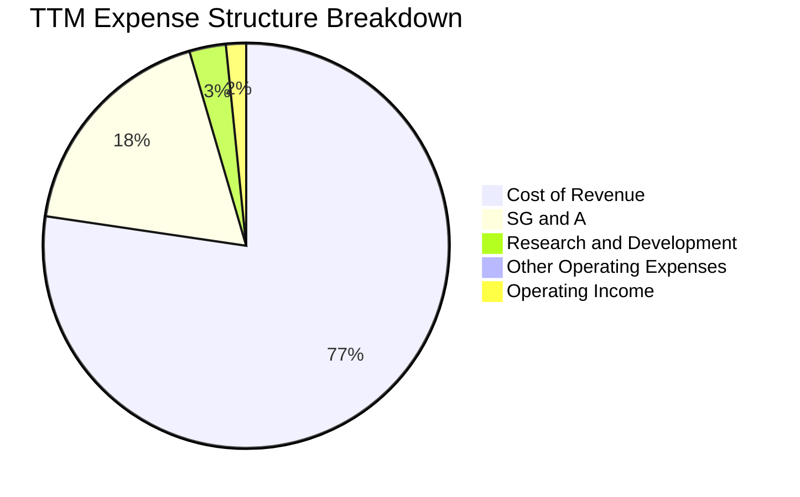

### 3.5 季度 EPS 趨勢與盈餘品質（Quality of Earnings）

KTOS 近 4 季的 EPS 表現雖然穩定在正值（Q1 2026 EPS 為 $0.07），但若深入剖析其「盈餘品質」，會發現其獲利「含金量」極低：

| 盈餘品質項目 | 數值 / 佔比 | 評估與機構級洞察 |
|--------------|-------------|------------------|
| **股權薪酬 (SBC) / 營收** | **2.67%** ($37.80M) | 🟡 處於中等水平，但對股本產生持續的稀釋壓力。 |
| **SBC / 營業現金流** | **-93.80%** | 🔴 由於 TTM 營業現金流為負（-$40.30M），SBC 成為調節帳面淨利的主要非現金工具。 |
| **FCF / 淨利（現金轉換率）** | **-363.0%** | 🔴 自由現金流為 -$106.72M，而淨利為 $29.40M。現金轉換率為嚴重的負值，說明利潤完全沒有現金支撐。 |
| **一次性/非經常性損益** | **$14.70M** | 🔴 TTM 包含 $14.70M 的非營業收益（主要為利息收入與政府補貼），佔稅前淨利（$38.40M）的 38.3%。 |
| **有效稅率異常** | **-23.4%** | 🟢 稅務撥回（Provision for Income Taxes 為 -$9.0M）美化了當期淨利。 |

**盈餘品質結論**：
Kratos 的 GAAP 淨利存在顯著的「虛胖」現象。TTM 淨利 **$29.40M** 中，有很大一部分來自於高達 **$1.46B** 現金產生的利息收入（非營業收入）以及稅務補貼，而非來自核心業務的營業利益（營業利益僅 **$23.70M**）。同時，高額的資本支出與營運資金佔用導致現金流持續失血，盈餘品質評級為 🔴 **低**。

---

## 4. 資產負債表分析

### 4.1 資產結構分解

Kratos 的資產結構呈現出極端的「輕債務、重現金、高商譽」特徵。

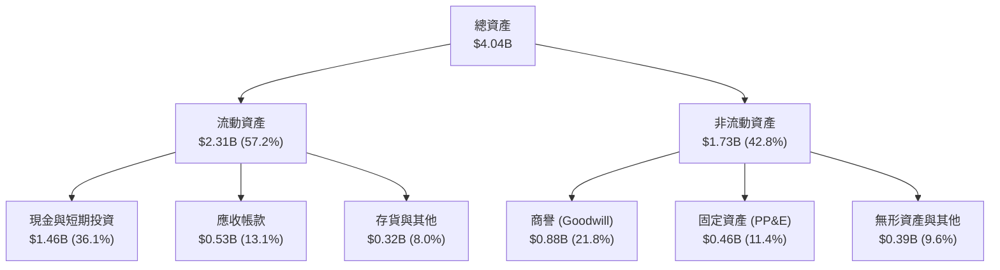

### 4.2 流動性指標分析

Kratos 的短期流動性極其強勁，這主要得益於其在 2025 年及 2026 年初進行的大規模股權增發，募集了大量現金。

| 指標 | FY 2024 | FY 2025 | TTM / Q1 2026 | 行業均值 | 評估 |
|------|---------|---------|---------------|----------|------|
| **流動比率 (Current Ratio)** | 2.94x | 4.06x | **5.63x** | 1.45x | 🟢 極其充沛，無短期償債壓力 |
| **速動比率 (Quick Ratio)** | 2.39x | 3.45x | **4.85x** | 0.95x | 🟢 扣除存貨後依然極高 |
| **現金比率 (Cash Ratio)** | 1.11x | 1.80x | **3.56x** | 0.35x | 🟢 僅現金即可覆蓋 3.5 倍的流動負債 |

### 4.3 債務結構分析

```
╔══════════════════════════════════════════════════════════════════╗
║                   KTOS 債務健康診斷 (TTM)                        ║
╠══════════════════════════════════════════════════════════════════╣
║                                                                  ║
║  總債務 (Total Debt):  $185.40M   ██░░░░░░░░░░░░░░░░░░░  極低    ║
║  總現金 (Total Cash):  $1.46B     █████████████████████  極高    ║
║  淨現金 (Net Cash):    $1.28B     ██████████████████░░░  🟢 安全 ║
║                                                                  ║
║  債務股權比 (Debt/Equity): 5.44%  🟢 財務槓桿極低                ║
║  利息保障倍數 (Interest Coverage): 4.5x 🟡 核心營業利益覆蓋尚可  ║
║                                                                  ║
║  诊断结论：無任何破產或債務違約風險，資產負債表防禦力極強。     ║
╚══════════════════════════════════════════════════════════════════╝
```

### 4.4 股東權益趨勢

雖然資產負債表安全，但這安全是建立在對現有股東權益的持續稀釋上。Stockholders' Equity 從 2022 年的 **$936.30M** 暴增至 TTM 的 **$2.00B**，主要來自於「發行新股」而非「保留盈餘」的累積。

```
╔══════════════════════════════════════════════════════════════════╗
║                KTOS 股東權益與稀釋趨勢 (2022 - TTM)              ║
╠══════════════════════════════════════════════════════════════════╣
║                                                                  ║
║  FY 2022  $936.30M  █████████░░░░░░░░░░░░░░░░░░  股數: 127M      ║
║  FY 2023  $976.00M  ██████████░░░░░░░░░░░░░░░░░  股數: 130M      ║
║  FY 2024  $1.35B    ██████████████░░░░░░░░░░░░░  股數: 149M      ║
║  FY 2025  $2.00B    ████████████████████░░░░░░░  股數: 163M      ║
║  TTM      $2.00B    ████████████████████░░░░░░░  股數: 187M 🔴   ║
║                                                                  ║
║  ⚠️ 警訊：3年內發行股數暴增 47.2%，每股內含價值稀釋嚴重。        ║
╚══════════════════════════════════════════════════════════════════╝
```

---

## 5. 現金流量深度分析

### 5.1 現金流量瀑布圖

儘管利潤表顯示淨利為正，但現金流量表揭示了 Kratos 核心業務尚未能自我造血的殘酷事實。

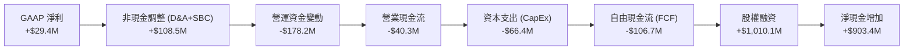

### 5.2 FCF 轉換率趨勢

Kratos 的自由現金流在過去幾年中持續惡化，FCF 轉換率（FCF / Net Income）呈現極其不健康的負值狀態。

| 指標 | FY 2022 | FY 2023 | FY 2024 | FY 2025 | TTM |
|------|---------|---------|---------|---------|-----|
| **營業現金流 (OCF)** | -$25.70M | $65.20M | $49.70M | -$42.10M | **-$40.30M** |
| **資本支出 (CapEx)** | -$45.40M | -$52.40M | -$58.20M | -$95.30M | **-$66.42M** |
| **自由現金流 (FCF)** | -$71.10M | $12.80M | -$8.50M | -$137.40M | **-$106.72M** |
| **GAAP 淨利** | -$36.90M | -$8.90M | $16.30M | $22.00M | **$29.40M** |
| **FCF 轉換率** | -192.7% | -143.8% | -52.1% | -624.5% | **-363.0%** |

*原因分析*：
1. **營運資金（Working Capital）大量佔用**：隨著營收規模擴大，應收帳款（TTM 達 **$528.60M**，季增 15.6%）與存貨（TTM 達 **$225.70M**，季增 20.2%）大幅攀升，消耗了大量營運現金。
2. **產能擴建與研發資本化**：為了準備無人機的量產，公司在廠房設備（PP&E）上的投入（CapEx）居高不下。

### 5.3 自由現金流趨勢

```
╔══════════════════════════════════════════════════════════════════╗
║                 KTOS 自由現金流趨勢 (2022 - TTM)                 ║
╠══════════════════════════════════════════════════════════════════╣
║                                                                  ║
║  FY 2022  -$71.10M   ░░░░░░░░░░░░░░░░░░░░░░░░░                   ║
║  FY 2023  +$12.80M   ██░░░░░░░░░░░░░░░░░░░░░░                     ║
║  FY 2024  -$8.50M    ░░░░░░░░░░░░░░░░░░░░░                        ║
║  FY 2025  -$137.40M  ░░░░░░░░░░░░░░░░░░░░░░░░░░░░░░░░░░░░░        ║
║  TTM      -$106.72M  ░░░░░░░░░░░░░░░░░░░░░░░░░░░░░░░              ║
║                                                                  ║
║  ⚠️ 目前 FCF Yield 為 -1.15%，業務仍高度依賴外部融資「輸血」。   ║
╚══════════════════════════════════════════════════════════════════╝
```

### 5.4 資本配置評估

在資本配置上，Kratos 將幾乎所有的可用資金（主要來自發行新股）用於累積現金儲備（以應對未來的大型合約營運資金需求）以及資本支出，完全沒有進行任何股票回購或股息支付。

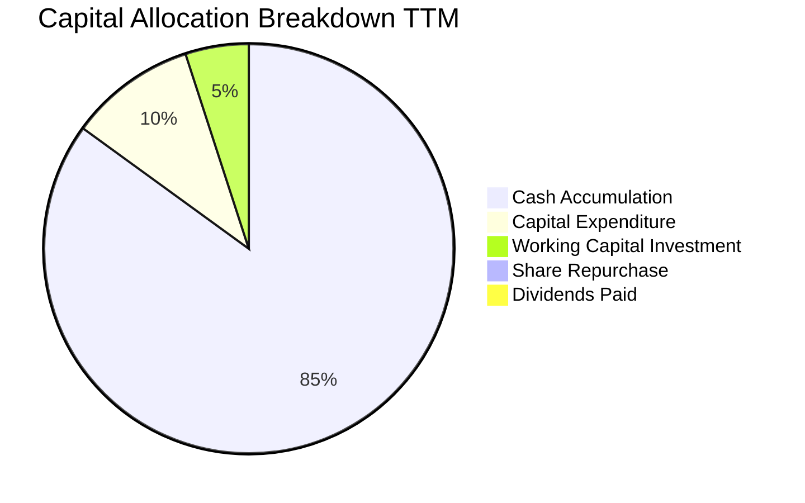

---

## 6. 獲利能力與資本效率

### 6.1 ROE / ROA / ROIC 趨勢

由於帳面淨利極低，且透過增發新股使得股東權益大幅膨脹，Kratos 的各項資本回報率指標均處於行業極低水平。

| 指標 | FY 2023 | FY 2024 | FY 2025 | TTM | 國防行業均值 | 評估 |
|------|---------|---------|---------|-----|--------------|------|
| **ROE** | -0.91% | 1.21% | 1.10% | **1.20%** | 12.5% | 🔴 極度低下，股東資金利用效率差 |
| **ROA** | -0.55% | 0.84% | 0.89% | **0.60%** | 5.8% | 🔴 資產回報率極低 |
| **ROIC** | -0.35% | 1.85% | 1.95% | **2.58%** | 8.5% | 🔴 核心業務回報率遠低於資金成本 |

### 6.2 ROIC vs WACC 分析（核心價值創造判斷）

這是評估 Kratos 是否真正為股東創造價值的最核心指標。

```
╔══════════════════════════════════════════════════════════════════╗
║                KTOS ROIC vs WACC 深度分析 (TTM)                  ║
╠══════════════════════════════════════════════════════════════════╣
║                                                                  ║
║  WACC (加權平均資金成本) 估算：                                  ║
║  ├── 無風險利率 (10Y 美債)：  4.20%                              ║
║  ├── 市場風險溢酬 (ERP)：     5.00%                              ║
║  ├── Beta 值：                1.07                               ║
║  ├── 股權成本 (Cost of Equity)：4.2% + 1.07 × 5.0% = 9.55%       ║
║  ├── 債務成本 (後稅)：        ~4.50%                             ║
║  ├── 資本結構：股權 ~98%，債務 ~2%                               ║
║  └── ✅ WACC ≈ 9.45%                                            ║
║                                                                  ║
║  ROIC (投資資本回報率) 估算：                                    ║
║  ├── NOPAT = 營業利益 $23.7M × (1 - 21%) ≈ $18.72M               ║
║  ├── 投入資本 = 股東權益 $2.0B + 總債 $185M - 現金 $1.46B        ║
║  │             ≈ $725.00M                                        ║
║  └── ✅ ROIC ≈ 2.58%                                            ║
║                                                                  ║
║  ★ 經濟價值增加 (EVA) = ROIC - WACC = -6.87%                     ║
║                                                                  ║
║  ROIC  2.58%  ▓▓▓░░░░░░░░░░░░░░░░░░░░░░░░░░░░░░  🔴              ║
║  WACC  9.45%  ▓▓▓▓▓▓▓▓▓▓░░░░░░░░░░░░░░░░░░░░░░  ──              ║
║  EVA   -6.87% ██████████████████████████████░░  🔴 價值摧毀     ║
║                                                                  ║
║  📊 結論：ROIC 僅為 WACC 的 0.27 倍。Kratos 目前正處於「投入      ║
║  資本多、回收利潤極少」的價值摧毀期，這主要是因為大量產能尚未    ║
║  轉化為高毛利的規模化收入。                                      ║
╚══════════════════════════════════════════════════════════════════╝
```

### 6.3 杜邦三因素分解

透過杜邦分析，我們可以清晰看出 ROE 低下的結構性原因：

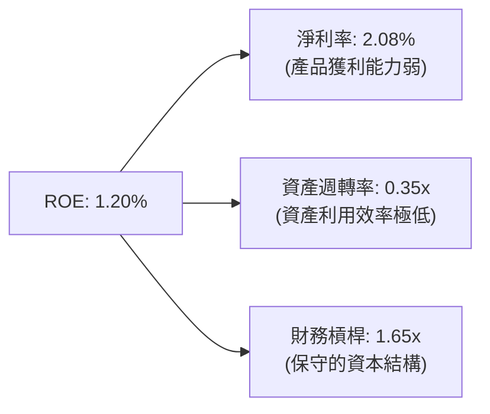

* 淨利率低（2.08%）限制了盈利的上限。
* 資產週轉率極低（0.35x，即每 $1 的資產僅產生 $0.35 的營收），主因是資產負債表上躺了 $1.46B 的閒置現金，以及大量的商譽（$884.10M），這大幅拉低了資產的使用效率。

### 6.4 獲利能力儀表板

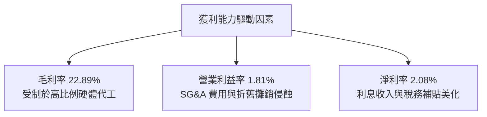

---

## 7. 估值深度分析

### 7.1 同業估值比較表格

我們選取了三家在業務結構上有重疊的國防航太/科技公司進行對比：
1. **LMT (Lockheed Martin)**：傳統國防巨頭（代表穩健與低成長）。
2. **AVAV (AeroVironment)**：中小型無人機龍頭（代表高成長無人機板塊）。
3. **PLTR (Palantir)**：國防軟體與數據平台（代表極高溢價的國防科技股）。

| 估值指標 | **KTOS (本公司)** | **LMT (傳統巨頭)** | **AVAV (無人機龍頭)** | **PLTR (國防軟體)** | 本公司估值評估 |
|----------|----------|---------|---------|---------|-----------|
| **Trailing P/E** | **292.24x** | 18.50x | 72.40x | 85.20x | 🔴 極端高估，溢價嚴重 |
| **Forward P/E** | **45.53x** | 17.20x | 48.50x | 65.00x | 🟡 略低於 AVAV，但遠高於傳統國防 |
| **P/S Ratio** | **6.58x** | 1.85x | 6.80x | 22.50x | 🟡 與 AVAV 相當，反映成長預期 |
| **EV / EBITDA** | **100.55x** | 12.80x | 38.50x | 58.00x | 🔴 行業最高，反映折舊前利潤極薄 |
| **FCF Yield** | **-1.15%** | +5.20% | +1.80% | +2.40% | 🔴 唯一自由現金流為負的公司 |

### 7.2 歷史估值區間分析

過去 24 個月，KTOS 的股價經歷了劇烈的過山車。隨著 2025 年無人機概念被市場瘋狂炒作，股價曾一度飆升至 **$134.00**（對應當時的 Forward P/E 超過 100x），但隨後因現金流持續流出及增發新股稀釋，股價腰斬至目前的 **$49.68**。目前的 Forward P/E（45.53x）已回落至歷史均值附近，但仍缺乏安全邊際。

### 7.3 情境目標價（假設驅動，Bear / Base / Bull）

由於 Kratos 目前的淨利受到高額折舊攤銷（D&A）與非現金 SBC 的嚴重壓抑，**P/E 估值法在此失真**。我們機構採用 **EV/EBITDA** 作為最核心的估值乘數。

| 情境 | 營收 3Y CAGR | EBITDA Margin (FY2028) | 退出 EV/EBITDA 倍數 | 隱含目標價 (12M) | 相對當前股價漲跌幅 | 觸發條件與假設 |
|------|-----------|----------------------|-------------------|------------------|-------------------|--------------|
| 🔴 **悲觀情境** | 10.0% | 6.0% | 45.0x | **$35.00** | **-29.5%** | Valkyrie 無人機訂單延遲，國防預算削減，股權稀釋持續。 |
| 🟡 **基準情境** | **18.0%** | **8.5%** | **60.0x** | **$55.00** | **+10.7%** | 無人機穩步量產，OpenSpace 軟體佔比提升，EBITDA 率改善至 8.5%。 |
| 🟢 **樂觀情境** | 25.0% | 11.0% | 75.0x | **$80.00** | **+61.0%** | 獲得美軍跨年度無人機大單，FCF 轉正，OpenSpace 軟體爆發式成長。 |

### 7.4 DCF 敏感性分析（6格目標價矩陣）

基於永續增長率 $g = 3.0\%$，不同的 WACC 與 EBITDA 成長率假設下的 DCF 估值矩陣：

| EBITDA 成長率 / WACC | **WACC = 8.5%** | **WACC = 9.45% (基準)** | **WACC = 10.5%** |
|------|--------------|----------------------|--------------|
| 🟢 **高成長 (EBITDA CAGR 22%)** | $78.50 (+58.0%) | **$71.20 (+43.3%)** | $62.80 (+26.4%) |
| 🟡 **中成長 (EBITDA CAGR 16%)** | $61.30 (+23.4%) | **$55.00 (+10.7%)** | $48.50 (-2.4%) |
| 🔴 **低成長 (EBITDA CAGR 10%)** | $45.20 (-9.0%) | **$39.80 (-19.9%)** | $34.20 (-31.2%) |

### 7.5 估值綜合區間

```
╔══════════════════════════════════════════════════════════════════╗
║                   KTOS 估值區間與股價定位                        ║
╠══════════════════════════════════════════════════════════════════╣
║                                                                  ║
║  52周最低價: $46.01 ──────────────────────┐                      ║
║  當前股價:   $49.68 ──────────────────────┤                      ║
║  基準目標價: $55.00 ───────────────────────────┐                 ║
║  52周最高價: $134.00 ──────────────────────────────────────────┐║
║                                                                  ║
║  [  $46  ] ─── 🟢 買入區 ─── [ $55 ] ─── 🟡 持有區 ─── [ $134 ]   ║
║                                                                  ║
║  📊 估值結論：當前股價極度接近 52周低點，下行風險已得到部分釋    ║
║  釋，但由於基本面改善緩慢，目前僅處於「合理持有」區間。          ║
╚══════════════════════════════════════════════════════════════════╝
```

---

## 8. 成長催化劑

### 8.1 催化劑時間軸

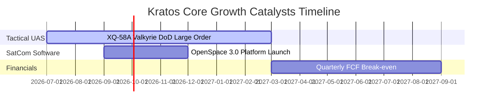

### 8.2 TAM 市場規模分析

Kratos 所處的細分市場正在經歷結構性的規模擴張。

```
╔══════════════════════════════════════════════════════════════════╗
║                  KTOS 核心目標市場規模 (TAM)                     ║
╠══════════════════════════════════════════════════════════════════╣
║                                                                  ║
║  1. 戰術與靶用無人機市場 (UAS TAM):                              ║
║     $12.5B ｜ KTOS 目前滲透率 ~2.8% ｜ 成長空間極大              ║
║                                                                  ║
║  2. 衛星地面站與通訊軟體 (SatCom TAM):                           ║
║     $8.0B  ｜ KTOS 目前滲透率 ~13.2% ｜ 核心增長點              ║
║                                                                  ║
║  3. 飛彈防禦與電子戰 (Defense Electronics TAM):                  ║
║     $15.0B ｜ KTOS 目前滲透率 ~3.5% ｜ 穩健基石                ║
║                                                                  ║
╚══════════════════════════════════════════════════════════════════╝
```

### 8.3 成長驅動力結構圖

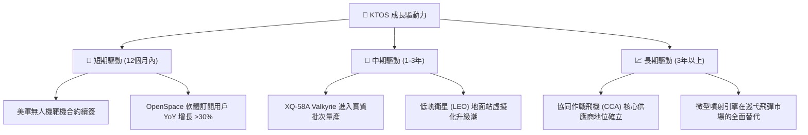

---

## 9. 風險矩陣

### 9.1 風險評分矩陣

為了符合 Mermaid 語法規範，本矩陣採用英文定義：

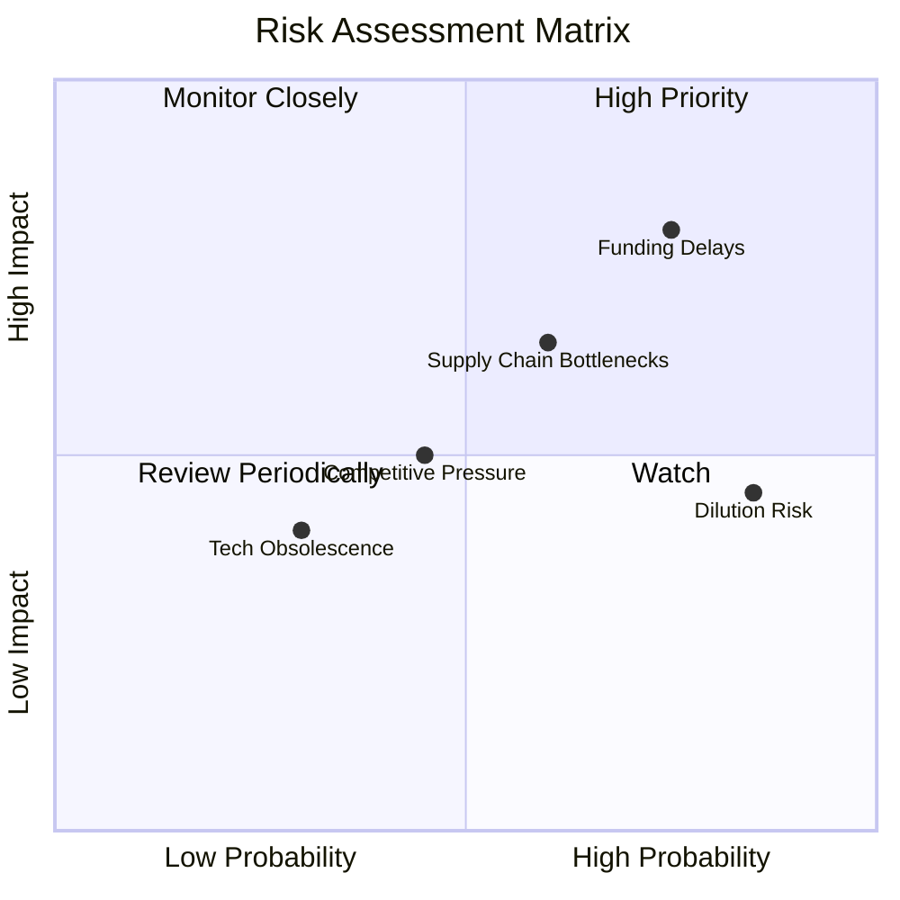

### 9.2 風險清單詳細分析

| # | 風險項目 | 發生機率 | 財務衝擊 | 風險評分 | 緩解措施與機構觀察 |
|---|----------|----------|----------|----------|--------------------|
| 1 | 🔴 **國防預算撥款延遲 (Funding Delays)** | **75%** | **-15% 營收影響** | 🔴 **8.0 / 10** | 美國國會預算案常面臨持續決議案（CR）拖延，影響新項目啟動。公司透過維持高額現金儲備（$1.46B）來應對營運資金波動。 |
| 2 | 🟡 **股權持續稀釋 (Dilution Risk)** | **85%** | **-10% EPS 影響** | 🟡 **7.2 / 10** | 公司頻繁增發新股。機構投資者應在估值模型中將稀釋率設為每年至少 5-8% 的常態假設。 |
| 3 | 🟡 **供應鏈與關鍵材料短缺** | **60%** | **-5% 毛利率影響** | 🟡 **6.0 / 10** | 固態火箭發動機與晶片短缺限制交付速度。Kratos 通過垂直整合（如收購引擎製造商）來降低依賴。 |
| 4 | 🟡 **傳統國防巨頭的競爭** | **45%** | **市場份額流失** | 🟡 **5.0 / 10** | Boeing 與 General Atomics 也在研發類似的低成本無人機。Kratos 的優勢在於極低的定價（Valkyrie 單價 < $4M）。 |

---

## 10. 投資建議

### 10.1 最終綜合評級雷達圖

Kratos 展現出極其不均衡的財務與業務特徵：

```
╔══════════════════════════════════════════════════════════════╗
║                    KTOS 綜合評級雷達圖                       ║
╠══════════════════════════════════════════════════════════════╣
║                                                              ║
║  成長動能 (Growth):       8.5/10  ▓▓▓▓▓▓▓▓▓▓▓▓▓▓▓▓▓░░ 🟢     ║
║  資產負債表 (Balance):     9.5/10  ▓▓▓▓▓▓▓▓▓▓▓▓▓▓▓▓▓▓▓ 🟢     ║
║  護城河深度 (Moat):       7.0/10  ▓▓▓▓▓▓▓▓▓▓▓▓▓▓░░░░░ 🟡     ║
║  獲利能力 (Profit):       4.0/10  ▓▓▓▓▓▓▓▓░░░░░░░░░░░ 🔴     ║
║  估值安全邊際 (Valuation): 3.5/10  ▓▓▓▓▓▓░░░░░░░░░░░░░ 🔴     ║
║                                                              ║
║  🏆 綜合機構評級：🟡 持有 (Hold) ｜ 綜合得分：6.3 / 10       ║
╚══════════════════════════════════════════════════════════════╝
```

### 10.2 目標價與隱含報酬率

| 情境 | 權重機率 | 12M 目標價 | 當前股價 | 隱含報酬率 | 建議操作 |
|------|----------|------------|----------|------------|----------|
| 🔴 **悲觀情境** | 25% | $35.00 | $49.68 | -29.5% | 若跌破 $38.00 可考慮分批輕倉吸納 |
| 🟡 **基準情境** | **55%** | **$55.00** | **$49.68** | **+10.7%** | **當前位置觀望，不建議追高** |
| 🟢 **樂觀情境** | 20% | $80.00 | $49.68 | +61.0% | 達到此目標需 FCF 實質性轉正 |
| **加權預期目標價** | **100%** | **$55.00** | **$49.68** | **+10.7%** | **持有** |

### 10.3 買入時機與觸發因素

```
╔══════════════════════════════════════════════════════════════════╗
║                  ✅ KTOS 投資觸發因素 Checklist                  ║
╠══════════════════════════════════════════════════════════════════╣
║                                                                  ║
║  立即買入觸發條件（需符合至少兩項）：                            ║
║  ☐ 股價回落至 $42.00 - $45.00 區間（提供足夠的安全邊際）         ║
║  ☐ 單季自由現金流（FCF）轉為正值                                 ║
║  ☐ 宣佈獲得美國空軍超過 50 架 XQ-58A 的正式量產合約              ║
║                                                                  ║
║  加碼觸發條件：                                                  ║
║  ☐ OpenSpace 軟體收入佔整體 KGS 營收比重突破 20%                 ║
║  ☐ 季度毛利率結構性回升至 26% 以上                              ║
║                                                                  ║
║  減碼/停損觸發條件（出現以下任一需立即執行）：                   ║
║  ☐ 宣佈新一輪超過 $200M 的股權增發（進一步稀釋現有股東）         ║
║  ☐ 季度營收 YoY 增速跌破 12%                                     ║
║  ☐ ROIC 跌破 1.5%                                                ║
╚══════════════════════════════════════════════════════════════════╝
```

### 10.4 投資人適配度分析

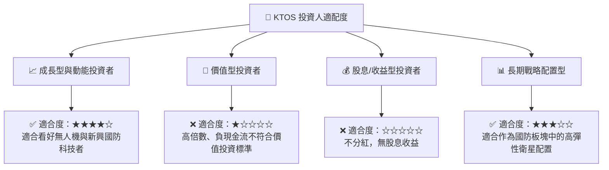

### 10.5 每季財報監控清單（Quarterly Watch List）

在未來的季度財報中，投資人應嚴格監控以下指標，以驗證投資論點是否發生根本性漂移：

| 監控指標 | 當前值 (Q1 2026) | 減碼/警訊門檻 | 加碼/確認門檻 | 監控邏輯 |
|----------|-----------------|---------------|---------------|----------|
| **無人系統 (US) 營收增速** | ~15% | < 5% YoY | > 30% YoY | 驗證無人機是否真正進入量產期 |
| **整體毛利率** | 22.89% | < 21.0% | > 25.0% | 評估高毛利軟體佔比是否提升 |
| **單季自由現金流 (FCF)** | -$47.30M | < -$60M | > $0 (轉正) | 衡量公司自我造血能力的關鍵 |
| **發行股數 (Shares Outstanding)** | 187.52M | > 195.00M | 停止增發 | 監控股權稀釋速度是否放緩 |

### 10.6 反面論證：什麼會證明論點錯誤（What Would Change My Mind）

```
╔══════════════════════════════════════════════════════════════════╗
║              ⚠️ 論點失效條件 (Disconfirming Evidence)            ║
╠══════════════════════════════════════════════════════════════════╣
║  本投資報告的「持有」評級基於公司能維持 15%+ 營收增速的假設。    ║
║  若發生以下情況，我們將調降評級至「賣出（Sell）」：              ║
║                                                                  ║
║  ☐ 核心業務成長率連續兩季 < 10%（說明市場被傳統巨頭蠶食）       ║
║  ☐ 營業利潤率（Operating Margin）跌破 1.0%                       ║
║  ☐ 自由現金流赤字在未來 4 季內累計超過 $150M                     ║
║  ☐ ROIC 跌破 1.0%（資本配置效率進一步惡化，EVA 缺口擴大）        ║
║  ☐ 國防部「複製者計劃」預算被大幅削減或取消                      ║
╚══════════════════════════════════════════════════════════════════╝
```

---

> **免責聲明**：本報告為 AI 自動生成，僅供研究參考，不構成投資建議。投資有風險，入市需謹慎。