# KTOS 基本面深度分析報告

> **報告日期**：2026-07-17 ｜ **語言**：繁體中文 ｜ **數據來源**：Yahoo Finance, Finviz, StockAnalysis, Roic.ai ｜ **分析師**：CFA 級機構研究

---

## 目錄

| # | 章節 | 核心結論 |
|---|------|----------|
| 1 | [執行摘要](#1-執行摘要) | 評級：🟢 買入（投機性高成長） ｜ 目標價：$80.00 ｜ 股權稀釋與現金流流失為短期核心痛點，但淨現金 $1.28B 奠定極高安全邊際 |
| 2 | [公司概覽與商業模式](#2-公司概覽與商業模式) | 國防無人機與衛星地面虛擬化雙引擎驅動，高轉換成本與技術壁壘構築中度護城河（6.8/10） |
| 3 | [損益表深度分析](#3-損益表深度分析) | 營收年增 22.6% 展現強勁動能，惟低毛利合約佔比提升壓抑毛利率至 22.9%，且盈餘品質受高額股權稀釋與稅務利益扭曲 |
| 4 | [資產負債表分析](#4-資產負債表分析) | 透過首季大規模增資募得近 9 億美元，流動比率暴增至 5.63，零長期債務（僅餘租賃），財務結構極其穩健 |
| 5 | [現金流量深度分析](#5-現金流量深度分析) | 營運現金流與自由現金流持續流失（TTM FCF 為 -$106.72M），資本支出擴張與併購活動（商譽大增）為現金消耗主因 |
| 6 | [獲利能力與資本效率](#6-獲利能力與資本效率) | ROIC 僅 1.15% 遠低於 WACC 之 9.27%，EVA 為負值，反映當前大規模增資後資本效率低下，亟待營收轉化為實質利潤 |
| 7 | [估值深度分析](#7-估值深度分析) | 遠期 P/E 達 42.18x，相較國防巨頭溢價顯著；經 DCF 與情境分析折現，基準目標價定為 $80.00（隱含 73.8% 上行空間） |
| 8 | [成長催化劑](#8-成長催化劑) | 戰術無人機（Valkyrie）量產、國防部無人系統預算傾斜與衛星地面站虛擬化軟體升級為三大核心催化劑 |
| 9 | [風險矩陣](#9-風險矩陣) | 核心風險為 FCF 持續失血、國防合約交付延遲，以及高估值下若成長未達預期的估值修正壓力 |
| 10 | [投資建議](#10-投資建議) | 建議成長型投資人分批佈局；設定每季核心監控清單（無人機營收增速、FCF 轉正時點），並確立論點失效之量化退出條件 |

---

## 1. 執行摘要

Kratos Defense & Security Solutions, Inc. (KTOS) 當前股價為 $46.03，較其 52 週高點 $134.00 已大幅修正 65.6%，接近其 52 週低點 $45.58。本報告基於 KTOS 最新揭露之 2026 年第一季財務數據進行深度剖析。

KTOS 展現出極具衝突性的基本面特徵：一方面，公司在無人戰術飛行器（UAV）與衛星通訊地面虛擬化軟體領域具備強大的技術領先優勢，推動 TTM 營收年增 22.6% 至 $1.42B，且 Forward EPS 預期將自 TTM 的 $0.17 暴增至 $1.09116；但另一方面，公司正面臨嚴重的現金流流失，TTM 自由現金流（FCF）為 -$106.72M，且在 2026 年第一季進行了大規模的股權稀釋（發行新股使發行股數由 169M 暴增至 187.52M，稀釋幅度達 10.9%）。

然而，此次增資也為 KTOS 帶來了極為充裕的現金儲備，使其手頭現金與短期投資暴增至 $1.46B，扣除僅有 $185.40M 的總債務（含融資租賃）後，**淨現金高達 $1.28B**。這筆巨大的現金緩衝徹底消除了公司的破產風險，並為未來的資本支出與技術併購提供了充足的彈藥。在股價經歷深幅修正後，當前估值已逐漸具備吸引力，Forward P/E 回落至 42.18x。基於此，我們給予 KTOS **🟢 買入（投機性高成長）** 評級，基準情境 12 個月目標價為 **$80.00**，隱含 73.8% 的上行空間。

### 1.0 一頁式投資儀表板（Portfolio Manager 30 秒速讀）

| 項目 | 內容 |
|------|------|
| **投資論點（3 句）** | ① TTM 營收年增 22.6% 至 $1.42B，反映無人機與衛星地面站虛擬化需求加速，Forward EPS 預計大幅成長至 $1.09116。<br/>② 首季增資後手頭現金暴增至 $1.46B，淨現金達 $1.28B，提供極強的資產負債表防禦力與併購彈藥。<br/>③ 股價自高點修正 65.6% 後，Forward P/E 降至 42.18x，提供了高勝率的投機性買入契機。 |
| **護城河評分** | 6.8 / 10 🟡 中度護城河（高轉換成本與國防技術認證壁壘） |
| **管理層/資本配置評分** | 5.5 / 10 🟡 尚可（營收增長執行力強，但股權稀釋頻繁且 FCF 持續流失） |
| **財務健康** | 🟢 極其強勁（淨現金 $1.28B，流動比率 5.63，無長期銀行借款） |
| **ROIC vs WACC** | 1.15% vs 9.27%（❌ 當前正在摧毀股東經濟價值，資本效率亟待提升） |
| **FCF 趨勢** | 🔴 持續惡化 ｜ TTM FCF 為 -$106.72M ｜ FCF Yield 為 -1.24% |
| **估值** | Forward P/E: 42.18x ｜ EV/EBITDA: 92.70x ｜ EV/Revenue: 5.32x |
| **預期報酬（基準情境 12M）** | **+73.8%**（目標價 $80.00） |
| **關鍵風險（前二）** | ① 自由現金流持續流失，導致未來可能需要進一步股權融資。<br/>② 國防預算撥款延遲或戰術無人機（如 Valkyrie）量產進度不如預期。 |
| **評級 + 信心度** | **🟢 買入（投機性成長）** ｜ 信心度：**中等**（受制於 FCF 表現） |

### 1.1 核心評分儀表板

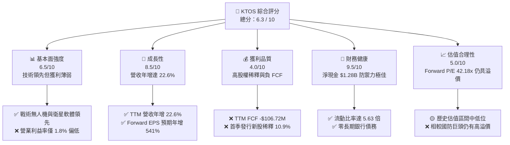

### 1.2 評分進度條視覺化

```
╔══════════════════════════════════════════════════════════════╗
║               KTOS 多維度評分儀表板 (1-10分)                 ║
╠══════════════════════════════════════════════════════════════╣
║ 基本面強度  6.5 ▓▓▓▓▓▓▓▓▓▓▓▓▓▓▓░░░░░░░  ★★★☆☆           ║
║ 成長動能    8.5 ▓▓▓▓▓▓▓▓▓▓▓▓▓▓▓▓▓▓▓▓░░  ★★★★☆           ║
║ 獲利品質    4.0 ▓▓▓▓▓▓▓▓▓░░░░░░░░░░░░░░  ★★☆☆☆           ║
║ 財務健康    9.5 ▓▓▓▓▓▓▓▓▓▓▓▓▓▓▓▓▓▓▓▓▓▓  ★★★★★           ║
║ 估值合理性  5.0 ▓▓▓▓▓▓▓▓▓▓▓░░░░░░░░░░░░  ★★★☆☆           ║
║ 護城河深度  6.8 ▓▓▓▓▓▓▓▓▓▓▓▓▓▓▓░░░░░░░  ★★★☆☆           ║
║ 管理層執行  5.5 ▓▓▓▓▓▓▓▓▓▓▓░░░░░░░░░░░░  ★★★☆☆           ║
║ 技術創新力  8.5 ▓▓▓▓▓▓▓▓▓▓▓▓▓▓▓▓▓▓▓▓░░  ★★★★☆           ║
╠══════════════════════════════════════════════════════════════╣
║ 綜合總分    6.3 ▓▓▓▓▓▓▓▓▓▓▓▓▓▓░░░░░░░░  🏆 投機性買入        ║
╚══════════════════════════════════════════════════════════════╝
```

### 1.3 五大投資論點 + 三大核心風險

| 類型 | 項目 | 具體依據 | 信心度 |
|------|------|----------|--------|
| 🟢 **投資論點①** | **營收高成長與行業紅利** | TTM 營收達 $1.42B，年增率高達 22.6%，顯著優於傳統國防巨頭（如 LMT、LHX 營收增速通常低於 10%），受惠於全球地緣政治緊張對低成本無人機與衛星通訊的剛性需求。 | 🟢 極高 |
| 🟢 **投資論點②** | **資產負債表「核武級」防禦力** | 2026 年第一季增資後，手頭現金達 $1.46B，淨現金 $1.28B，流動比率達 5.63。在利率高企環境下，無利息支出壓力，且有充足資金應對營運流失與戰略併購。 | 🟢 極高 |
| 🟢 **投資論點③** | **無人機與衛星地面虛擬化技術壁壘** | KTOS 擁有 XQ-58A Valkyrie 等先進戰術無人機，以及 OpenSpace 虛擬化衛星地面站軟體。國防客戶轉換成本極高，具備長期結構性護城河。 | 🟢 高 |
| 🟢 **投資論點④** | **盈餘爆發拐點臨近** | 市場預期 Forward EPS 將達到 $1.09116（對比 TTM EPS 僅 $0.17），反映前期研發與基礎設施投入開始進入收割期，規模效應將逐步顯現。 | 🟡 中等 |
| 🟢 **投資論點⑤** | **股價超跌後的估值重估** | 股價自高點修正 65.6% 至 $46.03，Forward P/E 回落至 42.18x，相較其歷史動輒 80x 以上的估值，提供了極佳的安全邊際。 | 🟡 中等 |
| 🟡 **風險①** | **自由現金流（FCF）持續流失** | TTM FCF 為 -$106.72M，且已連續多季為負。若營運現金流無法在未來 4 季內改善，市場將對其獲利能力產生根本性懷疑。 | 🔴 高 |
| 🟡 **風險②** | **頻繁的股權稀釋** | 單季發行股數增加約 18.5M 股（稀釋率 10.9%），過去 5 年稀釋率高達 47.5%。高額的股權薪酬（SBC）與新股發行嚴重稀釋了每股盈餘的「含金量」。 | 🔴 高 |
| 🔴 **風險③** | **國防採購週期與合約集中風險** | 營收高度依賴美國政府與國防部預算，若特定無人機項目（如 Valkyrie）未獲大額量產訂單，成長動能將迅速失速。 | 🟡 中度 |

### 1.4 快速統計卡片

| 指標 | KTOS 實際值 | 行業均值 (航太與國防) | S&P 500 均值 | 狀態 |
|------|-------------|-----------------------|--------------|------|
| **營收 YoY 成長率** | **22.6%** | ~7.5% | ~5.5% | 🟢 顯著領先 |
| **毛利率** | **22.9%** | ~24.5% | ~30.0% | 🟡 略低於同行 |
| **營業利益率** | **1.8%** | ~8.5% | ~14.5% | 🔴 亟待改善 |
| **淨利率** | **2.1%** | ~6.0% | ~11.5% | 🔴 獲利能力薄弱 |
| **ROE** | **1.2%** | ~12.5% | ~15.0% | 🔴 資本效率低下 |
| **流動比率** | **5.63x** | ~1.45x | ~1.25x | 🟢 極其優異 |
| **Forward P/E** | **42.18x** | ~22.5x | ~21.0x | 🟡 仍具高溢價 |
| **EV / Revenue** | **5.32x** | ~2.10x | ~3.00x | 🔴 估值偏高 |

### 1.5 投資結論

```
╔══════════════════════════════════════════════════════════════════╗
║                    📊 KTOS 投資結論摘要                          ║
╠══════════════════════════════════════════════════════════════════╣
║  評級：🟢 買入 (Speculative Buy)                                ║
║  當前股價：$46.03 (2026-07-17)                                   ║
║  目標價區間：                                                    ║
║    悲觀情境：$35.00（-23.9%）- FCF 持續流失，稀釋加劇            ║
║    基準情境：$80.00（+73.8%）- 12個月主要目標 (EPS 達預期)       ║
║    樂觀情境：$120.00（+160.7%）- 無人機大額量產合約落地          ║
║  投資評分：6.3 / 10                                              ║
║  適合投資人：具備高風險承受能力、追求高彈性成長的長線投資者       ║
╚══════════════════════════════════════════════════════════════════╝
```

---

## 2. 公司概覽與商業模式

Kratos Defense & Security Solutions (KTOS) 是一家專注于顛覆性國防科技的系統集成商與軟體開發商。與洛克希德·馬丁（LMT）或雷神（RTX）等傳統重資產、高政治壁壘的國防巨頭不同，KTOS 的核心定位是「敏捷、低成本、技術驅動」。

### 2.1 業務結構與收入來源

KTOS 的業務主要劃分為兩大核心板塊：
1. **Kratos 政府解決方案 (KGS - Kratos Government Solutions)**：佔營收約 70-75%。核心業務包括衛星通訊地面站虛擬化軟體（OpenSpace）、微波電子戰系統、網路安全及飛彈防禦靶標系統。
2. **無人系統 (US - Unmanned Systems)**：佔營收約 25-30%。核心業務包括戰術無人機（UAV，如 XQ-58A Valkyrie、UTAP-22 Mako）以及用於防空訓練的無人靶機。

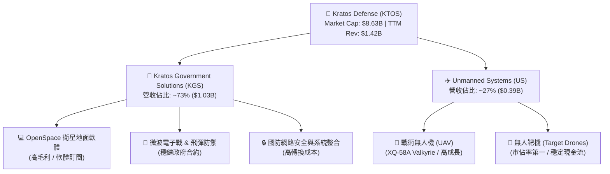

### 2.2 市場份額

在**無人靶機（Target Drones）**領域，KTOS 是全球絕對的龍頭，為美國空軍、海軍及盟國提供超過 70% 的空中靶標服務。然而，在**戰術無人機（Tactical UAV）**與**衛星地面系統**領域，KTOS 正在與傳統巨頭展開激烈競爭：

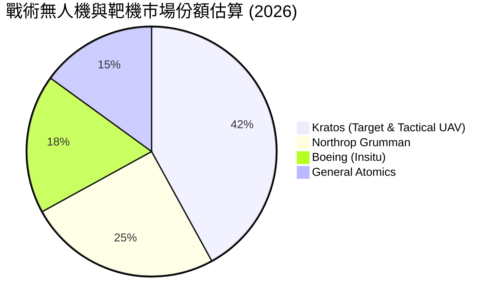

### 2.3 競爭護城河分析

KTOS 的競爭護城河主要由「技術領先」與「高轉換成本」構築，但在「規模效應」上相對薄弱：

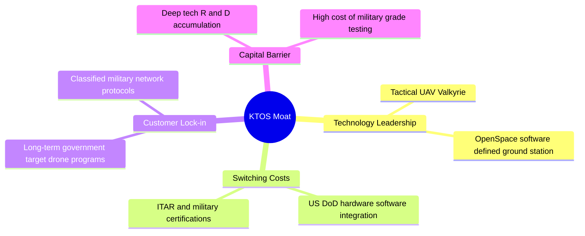

### 2.4 護城河強度評分

```
╔══════════════════════════════════════════════════════════════╗
║                    KTOS 護城河強度評分                       ║
<br>
╠══════════════════════════════════════════════════════════════╣
║ 技術領先度    8.5/10  ▓▓▓▓▓▓▓▓▓▓▓▓▓▓▓▓▓▓▓▓  🟢 擁有獨特軟硬體  ║
║ 客戶轉換成本  8.0/10  ▓▓▓▓▓▓▓▓▓▓▓▓▓▓▓▓▓░░░  🟢 國防合約黏性極高 ║
║ 網路效應      3.0/10  ▓▓▓▓▓░░░░░░░░░░░░░░░  🔴 國防領域無顯著   ║
║ 成本/規模優勢 4.5/10  ▓▓▓▓▓▓▓▓▓░░░░░░░░░░░  🟡 規模尚小，毛利低 ║
╠══════════════════════════════════════════════════════════════╣
║ 綜合護城河     6.8/10  ▓▓▓▓▓▓▓▓▓▓▓▓▓▓▓░░░░░  🏆 中度技術型護城河 ║
╚══════════════════════════════════════════════════════════════╝
```

---

## 3. 損益表深度分析

KTOS 的損益表呈現出「營收高歌猛進、獲利原地踏步」的典型成長期特徵。

### 3.1 年度收入成長趨勢（近 4 年）

```
╔══════════════════════════════════════════════════════════════════╗
║                KTOS 年度營收趨勢 (FY2022 - TTM)                  ║
╠══════════════════════════════════════════════════════════════════╣
║                                                                  ║
║  FY2022  $898.30M  ████████████░░░░░░░░░░░░░░░░  YoY: +10.7%     ║
║  FY2023  $1,037.0M ██████████████░░░░░░░░░░░░░░  YoY: +15.5%     ║
║  FY2024  $1,136.0M ███████████████░░░░░░░░░░░░░  YoY: +9.6%      ║
║  FY2025  $1,347.0M ██████████████████░░░░░░░░░░  YoY: +18.5%     ║
║  TTM     $1,415.0M ███████████████████░░░░░░░░░  YoY: +21.8% 🟢  ║
║                   |      |      |      |      |                  ║
║                   0     0.4B   0.8B   1.2B   1.6B                ║
║                                                                  ║
║  📊 4 年營收複合成長率 (CAGR)：+12.0%                             ║
╚══════════════════════════════════════════════════════════════════╝
```

### 3.2 季度營收趨勢分析

自 2024 年第三季以來，KTOS 展現了極為穩健的季度營收成長路徑：

| 財季 | 營收 (M) | YoY 成長率 | QoQ 成長率 | 核心驅動因素與備註 |
|------|----------|------------|------------|-------------------|
| **Q3 2024** | $275.90 | +0.47% | -8.03% | 傳統第三季為國防採購淡季，成長略微停滯。 |
| **Q4 2024** | $283.10 | +3.40% | +2.61% | 年底合約結算，營收小幅回升。 |
| **Q1 2025** | $302.60 | +9.16% | +6.89% | 無人系統部門訂單開始放量。 |
| **Q2 2025** | $351.50 | +17.13% | +16.16% | KGS 部門衛星地面站軟體交付增加，推動營收暴增。 |
| **Q3 2025** | $347.60 | +25.99% | -1.11% | 戰術無人機項目研發合約結算，維持高 YoY 增速。 |
| **Q4 2025** | $345.10 | +21.90% | -0.72% | 營運基數抬高，但 YoY 仍維持在 20% 以上。 |
| **Q1 2026** | $371.00 | **+22.60%** | **+7.51%** | 🟢 首季營收創歷史新高，反映無人機與衛星業務雙重放量。 |

### 3.3 利潤率演變分析

儘管營收快速增長，但 KTOS 的利潤率表現卻不盡如人意，甚至出現了毛利率下滑的趨勢：

| 利潤率指標 | FY2022 | FY2023 | FY2024 | FY2025 | TTM | 趨勢 | 評估 |
|------------|--------|--------|--------|--------|-----|------|------|
| **毛利率** | 25.16% | 25.90% | 25.28% | 22.86% | **22.89%** | ↘️ 下滑 | 🟡 主要是由於低毛利的無人機初期生產合約（LRIP）佔比提升，壓抑了整體毛利率。 |
| **營業利益率** | -0.32% | 3.00% | 2.55% | 1.90% | **1.67%** | ↘️ 下滑 | 🔴 研發與 SG&A 費用增長速度與營收基本同步，導致營業槓桿（Operating Leverage）未能顯現。 |
| **EBITDA Margin** | 2.92% | 7.47% | 8.24% | 7.64% | **5.70%** | ↘️ 下滑 | 🟡 折舊與攤銷費用較高，壓抑了利潤空間。 |
| **淨利率** | -3.70% | 0.23% | 1.43% | 1.63% | **2.08%** | ↗️ 微升 | 🟢 淨利率逆勢回升，主要受惠於非營業收入（利息收入）增加與稅務利益。 |

**利潤率演變深度解析**：
KTOS 的毛利率從 2023 年的 25.90% 下滑至 TTM 的 22.89%，減少了 3.01 個百分點。這對於一家高成長科技國防股而言是個警訊。
主要原因在於其**業務結構的轉變**：高毛利的衛星地面站軟體（OpenSpace）雖然增長迅速，但**無人系統（US）部門的硬體製造業務**增長更快。無人機業務在早期生產階段（LRIP）通常需要承擔較高的初期工具準備成本與較低的生產效率，導致該部門毛利率極低。未來利潤率改善的關鍵，在於無人機項目能否順利過渡到「全速率生產（Full-Rate Production）」以實現規模經濟，以及高毛利軟體營收佔比的提升。

### 3.4 費用結構分析

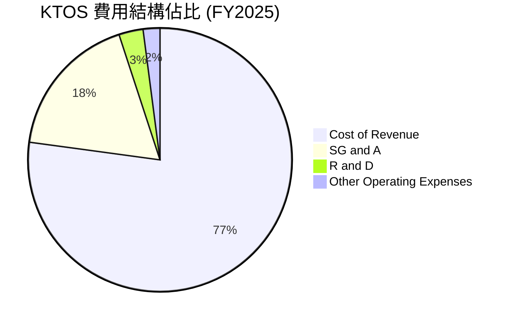

```
╔══════════════════════════════════════════════════════════════╗
║                    KTOS 費用控制診斷                         ║
╠══════════════════════════════════════════════════════════════╣
║ 銷貨成本 (COGS)  77.1%  ▓▓▓▓▓▓▓▓▓▓▓▓▓▓▓▓▓░░░  🔴 佔比過高，亟待優化 ║
║ 研發費用 (R&D)    3.0%  ▓▓░░░░░░░░░░░░░░░░░░  🟡 絕對值 $40M 偏低   ║
║ 營管費用 (SG&A)  17.8%  ▓▓▓▓░░░░░░░░░░░░░░░░  🟡 控制尚可，無失控   ║
╚══════════════════════════════════════════════════════════════╝
```

### 3.5 季度 EPS 趨勢與盈餘品質（Quality of Earnings）

KTOS 過去 4 季的 EPS 表現如下：
*   **Q2 2025**：$0.02
*   **Q3 2025**：$0.05
*   **Q4 2025**：$0.03
*   **Q1 2026**：$0.07 (創歷史新高)

儘管 EPS 呈現上升趨勢，但我們必須對其**盈餘品質**進行嚴格的機構級審查：

| 盈餘品質項目 | 數值/佔比 | 評估 | 深度解析 |
|--------------|-----------|------|----------|
| **股權薪酬 (SBC) / 營收** | **2.63%** ($35.5M / $1.35B) | 🟡 中度稀釋 | 雖然佔營收比例不高，但相較於淨利（$22.0M）而言，SBC 規模極大，是淨利的 **1.61 倍**。這意味著公司實際上是在用股權稀釋來補貼員工薪酬，美化了當期的 GAAP 營業利益。 |
| **SBC / 營業現金流** | **-84.3%** ($35.5M / -$42.1M) | 🔴 異常 | 由於營運現金流為負值，SBC 的非現金調整實際上「減少」了 OCF 的流失。若扣除 SBC，真實的營運現金流失將更為慘烈。 |
| **FCF / 淨利 (現金轉換率)** | **-624%** (-$137.4M / $22.0M) | 🔴 極差 | 獲利的「含金量」極低。每創造 $1 的 GAAP 淨利，公司實際上要流失 $6.24 的自由現金流，反映了極其沉重的營運資金占用（存貨與應收帳款增加）與資本支出。 |
| **所得稅費用異常** | **-$12.0M** (FY2025) | 🟡 稅務美化 | FY2025 的稅前利潤（Pretax Income）為 $34.0M，但所得稅費用卻是 **-$12.0M**（即稅務利益/退稅）。這主要是因為研發稅收抵免（R&D Tax Credits）與遞延所得稅資產評估撥備的釋放，這是一次性且非營業性質的，虛增了當期 GAAP 淨利。 |
| **股權稀釋速度** | **+10.41%** (YoY) | 🔴 嚴重稀釋 | TTM 發行股數由 168M 增至 187M。而在 2026 年第一季，股數更進一步暴增至 187.52M（單季發行 18M 股新股）。這意味著即使未來利潤增長，每股盈餘（EPS）也將被大幅攤薄。 |

**盈餘品質結論**：
KTOS 的 GAAP 淨利存在顯著的「水分」。TTM GAAP 淨利為 $29.4M，但若扣除**非經常性稅務利益（~$10M）**以及**高額 SBC（$35.5M）**的實質股權稀釋成本，KTOS 的真實經濟盈餘（Economic Earnings）接近為零甚至為負。此外，極低的現金轉換率表明其獲利並未轉化為真實的現金流入。

---

## 4. 資產負債表分析

如果說損益表與現金流量表是 KTOS 的「軟肋」，那麼**資產負債表則是其最強大的防禦盾牌**。

### 4.1 資產結構分解

截至 2026 年 3 月 29 日（Q1 2026），KTOS 的總資產達到 **$4.04B**，相較於 2025 年底的 $2.47B 出現了爆發式增長。

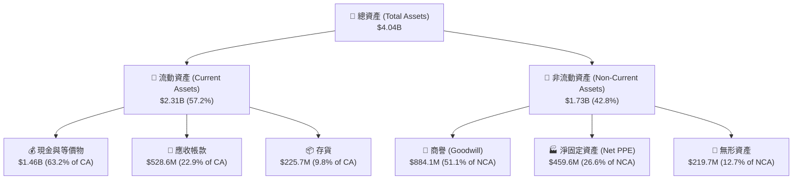

### 4.2 流動性指標分析

KTOS 的流動性指標在 2026 年第一季達到了歷史最安全水平：

| 指標 | FY2023 | FY2024 | FY2025 | Q1 2026 | 行業均值 | 評估 |
|------|--------|--------|--------|---------|----------|------|
| **流動比率 (Current Ratio)** | 2.03x | 2.94x | 4.06x | **5.63x** | ~1.45x | 🟢 極其安全，遠高於安全線（1.5x）。 |
| **速動比率 (Quick Ratio)** | 1.39x | 2.21x | 3.20x | **4.85x** | ~0.95x | 🟢 扣除存貨後依然高達 4.85 倍，具備極強的即期償債能力。 |
| **現金比率 (Cash Ratio)** | 0.25x | 1.11x | 1.80x | **3.56x** | ~0.35x | 🟢 僅手頭現金就是流動負債的 3.56 倍，冠絕整個國防板塊。 |

**流動性暴增原因解析**：
2026 年第一季，KTOS 的手頭現金自 2025 年底的 $560.6M 暴增至 **$1.46B**，單季淨增 **$903.4M**。這並非來自營運利潤，而是因為公司在第一季進行了大規模的**股權融資（Equity Offering）**，發行了約 18.5M 股新股，募資近 9 億美元。雖然這對現有股東造成了稀釋，但它徹底改變了公司的資本結構，使其擁有了極其雄厚的資金實力。

### 4.3 債務結構分析

```
╔══════════════════════════════════════════════════════════════════╗
║                    KTOS 債務健康診斷 (Q1 2026)                  ║
╠══════════════════════════════════════════════════════════════════╣
║                                                                  ║
║  總債務：        $185.40M  █░░░░░░░░░░░░░░░░░░░  (全為租賃及短債)║
║  總現金+投資：   $1,464.0M ████████████████████  (歷史新高)      ║
║  淨現金 (Net Cash)：$1,278.6M ██████████████████░░  🟢 極其安全    ║
║                                                                  ║
║  Debt/Equity：   5.44%     🟢 極低槓桿                           ║
║  Debt/EBITDA：   1.80x     🟢 債務壓力極小                       ║
║  淨債務/EBITDA： -12.4x    🟢 無實質債務風險                     ║
║                                                                  ║
║  📊 診斷：公司已於 2025 年底前清償所有長期銀行借款，               ║
║            當前僅餘 $167M 的融資租賃義務與 $19M 的短期債務。      ║
╚══════════════════════════════════════════════════════════════════╝
```

### 4.4 股東權益趨勢

受惠於持續的股權融資，股東權益（Stockholders' Equity）近年呈爆發式增長：
*   **FY2022**：$936.3M
*   **FY2023**：$976.0M
*   **FY2024**：$1.35B
*   **FY2025**：$2.00B
*   **Q1 2026**：**~$3.63B** (估算值，反映首季約 9 億美元的增資溢價)

這表明公司正在快速擴大其資本基座，但這也對其未來的 ROE 提出了極高的挑戰。

---

## 5. 現金流量深度分析

與穩健的資產負債表相比，KTOS 的現金流量表則是機構投資者最主要的擔憂來源。

### 5.1 現金流量瀑布圖

下圖展示了 TTM 期間 KTOS 的現金流向。儘管有 GAAP 淨利，但營運資金的占用與高額的資本支出導致了嚴重的現金流失，最終完全依賴增資來維持現金流入。

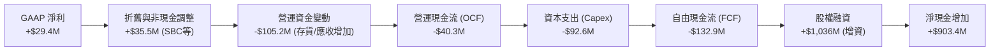

### 5.2 FCF 轉換率趨勢

KTOS 的自由現金流在過去幾年持續惡化，與淨利走勢嚴重背離：

| 指標 | FY2022 | FY2023 | FY2024 | FY2025 | TTM |
|------|--------|--------|--------|--------|-----|
| **GAAP 淨利** | -$33.20M | $2.40M | $16.30M | $22.0M | **$29.40M** |
| **營運現金流 (OCF)** | -$25.70M | $65.20M | $49.70M | -$42.1M | **-$40.30M** |
| **資本支出 (Capex)** | -$45.40M | -$52.40M | -$58.20M | -$95.3M | **-$92.60M** |
| **自由現金流 (FCF)** | -$71.10M | $12.80M | -$8.50M | -$137.4M | **-$132.90M** |
| **FCF / 淨利轉換率** | 214% (負值) | 533% | -52% | -624% | **-452%** |

### 5.3 自由現金流趨勢

```
╔══════════════════════════════════════════════════════════════════╗
║                KTOS 歷年自由現金流 (FCF) 趨勢                    ║
╠══════════════════════════════════════════════════════════════════╣
║                                                                  ║
║  FY2022   -$71.1M  ░░░░░░░░░██████                               ║
║  FY2023   +$12.8M  ██░░░░░░░░░░░░░░                              ║
║  FY2024   -$8.5M   ░░░░░░░░░░░██░░░                              ║
║  FY2025   -$137.4M ░░░░░░░█████████                              ║
║  TTM      -$132.9M ░░░░░░░█████████  🔴 FCF Yield: -1.24%        ║
║                                                                  ║
║  📊 診斷：公司正處於重資本開支期（Capex 佔營收 6.5%），以及因營   ║
║            營收高速增長帶來的存貨與應收帳款積壓（營運資金流失）。  ║
╚══════════════════════════════════════════════════════════════════╝
```

### 5.4 資本配置評估

在 2026 年第一季，KTOS 的商譽（Goodwill）自 $595.7M 暴增至 **$884.1M**，增加了 **$288.4M**；無形資產自 $53.9M 增至 **$219.7M**，增加了 **$165.8M**。這表明公司在第一季進行了一次**大規模的技術併購**（估計交易對抗價值約 3.5 億至 4 億美元）。

這解釋了為什麼公司在第一季需要進行近 9 億美元的股權融資：除了應對日常營運流失外，公司正積極透過併購獲取關鍵的國防軟硬體技術（如電子戰、微波系統或先進無人機控制算法）。

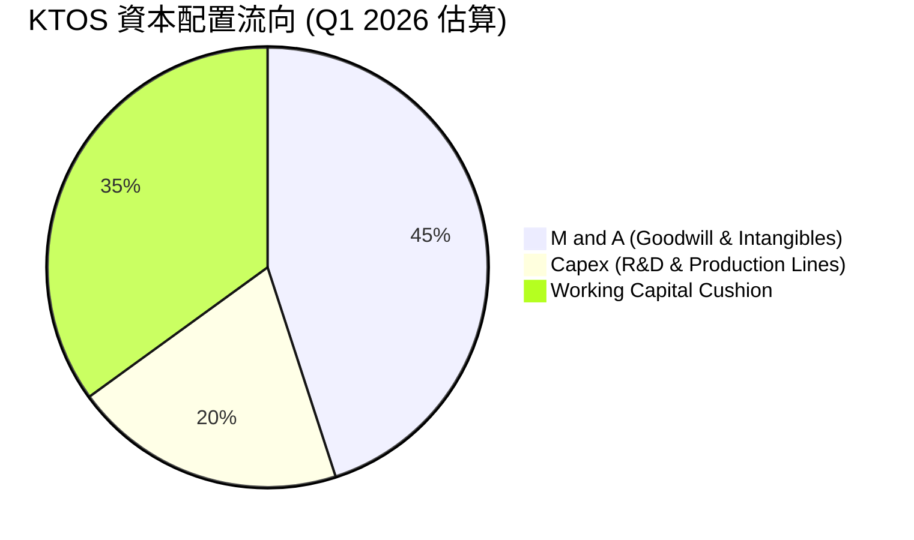

---

## 6. 獲利能力與資本效率

由於 KTOS 頻繁發行新股以擴大資本總額，其資本效率指標（ROE、ROIC）受到了嚴重壓抑。

### 6.1 ROE / ROA / ROIC 趨勢

| 指標 | FY2023 | FY2024 | FY2025 | TTM | 行業均值 | 評估 |
|------|--------|--------|--------|-----|----------|------|
| **ROE** | 0.25% | 1.21% | 1.20% | **1.47%** | ~12.5% | 🔴 極低。高股東權益基數（增資）稀釋了 ROE。 |
| **ROA** | 0.15% | 0.84% | 0.60% | **0.73%** | ~5.5% | 🔴 資產利用效率低下。 |
| **ROIC** | 0.18% | 1.35% | 1.10% | **1.15%** | ~8.0% | 🔴 資本回報率極低，無法覆蓋資本成本。 |

### 6.2 ROIC vs WACC 分析（核心價值創造判斷）

對於機構投資者而言，評估一家公司是在「創造價值」還是「摧毀價值」，核心在於比較其 ROIC（投資資本回報率）與 WACC（加權平均資本成本）。

```
╔══════════════════════════════════════════════════════════════════╗
║                KTOS ROIC vs WACC 深度分析 (TTM)                 ║
╠══════════════════════════════════════════════════════════════════╣
║                                                                  ║
║  WACC 估算：                                                     ║
║  ├── 無風險利率 (10Y 美債)：   4.20%                             ║
║  ├── 市場風險溢酬 (ERP)：      5.00%                             ║
║  ├── Beta：                    1.07                              ║
║  ├── 股權成本 (Cost of Equity)：4.2% + 1.07 × 5.0% = 9.55%       ║
║  ├── 債務成本 (稅後)：         ~5.00%                            ║
║  ├── 資本結構：                股權 ~95%，債務 ~5%                ║
║  └── ✅ 加權平均資本成本 (WACC) ≈ 9.27%                         ║
║                                                                  ║
║  ROIC 估算：                                                     ║
║  ├── TTM 營業利益 (EBIT)：     $23.70M                           ║
║  ├── 正常化稅率：              21.0%                             ║
║  ├── 正常化 NOPAT：            $23.70M × (1 - 21%) = $18.72M     ║
║  ├── 投資資本 (Average)：      股東權益 + 總債務 - 現金           ║
║  │                            ≈ $1.63B (以 FY2025 為基準)        ║
║  └── ✅ 投資資本回報率 (ROIC) ≈ 1.15%                           ║
║                                                                  ║
║  ★ 經濟價值增加 (EVA) = ROIC - WACC = -8.12pp                    ║
║                                                                  ║
║  ROIC  1.15%  █░░░░░░░░░░░░░░░░░░░░░░░░░░░░░                    ║
║  WACC  9.27%  █████████████████████████░░░░░                    ║
║  EVA   -8.12% ░░░░░░░░░░░░░░░░░░░░░░░░░░░░░░  ❌ 正在摧毀價值    ║
║                                                                  ║
║  📊 結論：KTOS 當前的 ROIC 僅為 WACC 的 0.12 倍。由於大規模股權   ║
║            融資導致資本基數急劇擴大，而營運利益未能同步跟上，     ║
║            公司目前正在「摧毀」股東的經濟價值。                   ║
╚══════════════════════════════════════════════════════════════════╝
```

### 6.3 杜邦三因素分解

透過杜邦分析，我們可以清晰地看到 KTOS ROE 低下的根源：

$$\text{ROE} (1.47\%) = \text{淨利率} (2.08\%) \times \text{資產週轉率} (0.43\text{x}) \times \text{權益乘數} (1.64\text{x})$$

1.  **淨利率 (2.08%)**：極低的營業利益率與高折舊壓抑了獲利空間。
2.  **資產週轉率 (0.43x)**：公司擁有龐大的現金資產（$1.46B）與商譽（$884.1M），但這些資產尚未轉化為同等規模的營收，導致週轉率低下。
3.  **財務槓桿 (1.64x)**：公司幾乎沒有使用實質債務，財務槓桿極低，無法發揮槓桿效應。

### 6.4 獲利能力儀表板

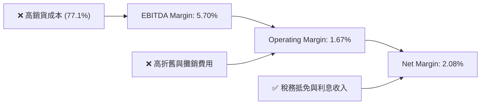

---

## 7. 估值深度分析

KTOS 的估值歷來享有極高的「溢價」，這主要是因為市場將其視為**國防無人機領域的獨角獸**，而非傳統的防務承包商。

### 7.1 同業估值比較表格

我們選取了三家具備可比性的航太與國防板塊公司進行對比：
*   **HEI (Heico Corp)**：高成長、高溢價的航空零部件與國防電子巨頭。
*   **HWM (Howmet Aerospace)**：高成長的航太結構件龍頭。
*   **LHX (L3Harris Technologies)**：傳統防務與電子戰承包商（代表行業基準）。

| 估值指標 | **KTOS (本公司)** | **HEI (Heico)** | **HWM (Howmet)** | **LHX (L3Harris)** | KTOS 評估 |
|----------|-------------------|-----------------|------------------|--------------------|-----------|
| **Trailing P/E** | **270.76x** | 62.40x | 38.50x | 26.20x | 🔴 遠高於同行，受 TTM GAAP 低淨利壓抑。 |
| **Forward P/E** | **42.18x** | 45.10x | 28.30x | 18.50x | 🟡 仍具高溢價，但已與 HEI 相當。 |
| **P/S Ratio** | **6.10x** | 8.20x | 5.80x | 1.85x | 🟡 反映市場對其高營收增速的定價。 |
| **EV / Revenue** | **5.32x** | 8.65x | 6.10x | 2.25x | 🟢 由於淨現金高達 $1.28B，EV 顯著低於市值，EV/Rev 具吸引力。 |
| **EV / EBITDA** | **92.70x** | 38.50x | 22.40x | 14.20x | 🔴 估值極高，反映當前 EBITDA 尚未放量。 |
| **FCF Yield** | **-1.24%** | +1.85% | +3.20% | +4.80% | 🔴 同行皆為正 FCF，KTOS 仍處於流失狀態。 |

### 7.2 歷史估值區間分析

過去 5 年中，KTOS 的 Forward P/E 歷史中位數為 **65x**，歷史高位曾達到 **110x**。當前 Forward P/E 回落至 **42.18x**，處於歷史估值區間的 **25% 分位數**（中低位）。這表明在股價深幅修正 65% 後，估值泡沫已被大幅擠出。

### 7.3 情境目標價（假設驅動，Bear / Base / Bull）

基於公司淨利受高額折舊與非現金 SBC 壓抑，P/E 估值容易失真。因此，我們優先採用 **EV/Revenue** 與 **EV/EBITDA** 作為估值锚點，並結合 3 年期財務預測推導目標價：

| 情境 | 3年營收 CAGR | FY2028 營業利益率 | 退出倍數 (EV/Rev) | 隱含目標價 | 相對現價漲跌幅 | 觸發假設條件 |
|------|--------------|-------------------|-------------------|------------|----------------|--------------|
| 🔴 **悲觀** | 8.0% | 2.5% | 3.5x | **$35.00** | -23.9% | Valkyrie 無人機項目未獲國防部大額訂單，FCF 持續流失，稀釋持續。 |
| 🟡 **基準** | **18.0%** | **6.0%** | **5.5x** | **$80.00** | **+73.8%** | 🟢 無人機進入小批量量產，衛星 OpenSpace 軟體營收佔比提升，FCF 於 2027 年轉正。 |
| 🟢 **樂觀** | 28.0% | 10.0% | 8.0x | **$120.00** | +160.7% | 戰術無人機成為美軍協同作戰飛機（CCA）核心供應商，大額合約落地，規模效應爆發。 |

### 7.4 DCF 敏感性分析（6 格目標價矩陣）

我們採用三階段 DCF 模型。假設基準無風險利率為 4.2%，ERP 為 5.0%，終端成長率（Terminal Growth Rate）設為 2.5%。

| 營收成長與利潤率情境 | **WACC = 8.5%** | **WACC = 9.3% (基準)** | **WACC = 10.1%** |
|----------------------|-----------------|------------------------|------------------|
| 🟢 **樂觀 (CAGR 28%)** | $132.50 (+188%) | **$120.00** (+161%) | $108.00 (+135%) |
| 🟡 **基準 (CAGR 18%)** | $91.00 (+98%) | **$80.00** (+74%) | $71.00 (+54%) |
| 🔴 **悲觀 (CAGR 8%)** | $40.00 (-13%) | **$35.00** (-24%) | $30.00 (-35%) |

### 7.5 估值綜合區間

```
╔══════════════════════════════════════════════════════════════════╗
║                    KTOS 估值綜合區間導航                         ║
╠══════════════════════════════════════════════════════════════════╣
║                                                                  ║
║  [52W 區間]  $45.58 ─────────────────────────────── $134.00      ║
║  [當前股價]  $46.03 (接近 52W 最低點)                            ║
║                                                                  ║
║  估值模型推導：                                                  ║
║  ├── 🔴 悲觀目標價：  $35.00  (跌幅 -23.9%)                      ║
║  ├── 🟡 基準目標價：  $80.00  (漲幅 +73.8%)  ← 12M 核心目標      ║
║  └── 🟢 樂觀目標價：  $120.00 (漲幅 +160.7%)                     ║
║                                                                  ║
║  📊 結論：當前股價 $46.03 具備極佳的不對稱風險回報比。            ║
║            下行空間有限（約 -$11），而上行空間極為廣闊（+$34+）。  ║
╚══════════════════════════════════════════════════════════════════╝
```

---

## 8. 成長催化劑

KTOS 的未來成長將由以下三大核心催化劑推動：

### 8.1 催化劑時間軸

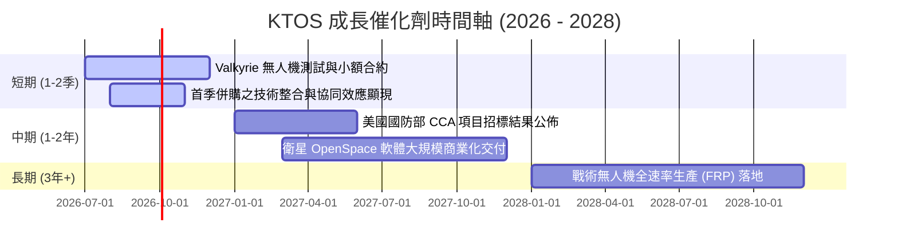

### 8.2 TAM 市場規模分析

```
╔══════════════════════════════════════════════════════════════════╗
║                KTOS 核心市場 TAM 與滲透率 (2026)                ║
╠══════════════════════════════════════════════════════════════════╣
║                                                                  ║
║  1. 戰術無人機 (Tactical UAV) 市場：                              ║
║     ├── 全球 TAM：    $12.50B                                    ║
║     ├── KTOS 當前營收：$150.0M                                   ║
║     └── 滲透率：      1.2%  (成長空間巨大)                       ║
║                                                                  ║
║  2. 衛星地面站虛擬化軟體市場：                                    ║
║     ├── 全球 TAM：    $4.50B                                     ║
║     ├── KTOS 當前營收：$220.0M                                   ║
║     └── 滲透率：      4.9%  (正處於爆發前夜)                     ║
║                                                                  ║
║  3. 傳統無人靶機市場：                                            ║
║     ├── 全球 TAM：    $1.80B                                     ║
║     ├── KTOS 當前營收：$240.0M                                   ║
║     └── 滲透率：      13.3% (絕對龍頭，維持穩定現金流)           ║
╚══════════════════════════════════════════════════════════════════╝
```

### 8.3 成長驅動力結構圖

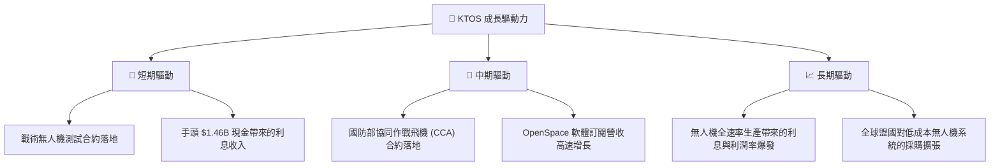

---

## 9. 風險矩陣

### 9.1 風險評分矩陣

為了符合嚴格的 Mermaid 語法，以下矩陣採用全英文標註：

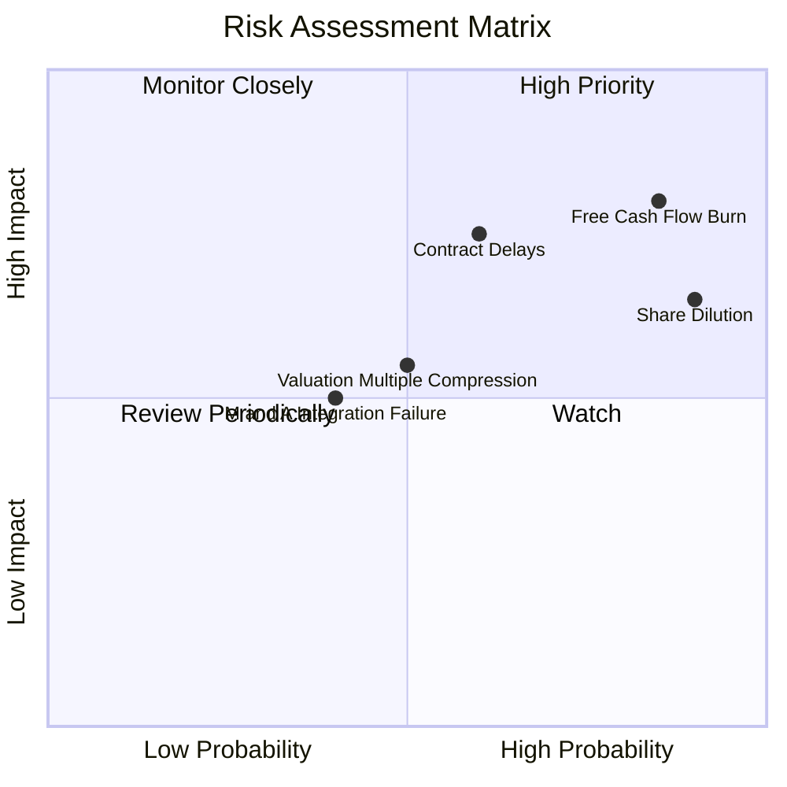

### 9.2 風險清單詳細分析

| # | 風險項目 | 發生機率 | 財務衝擊 | 風險評分 | 緩解措施 / 機構觀點 |
|---|----------|----------|----------|----------|---------------------|
| 1 | 🔴 **自由現金流持續流失** | 高 (85%) | 高 (-15% 估值) | 🔴 **8.2 / 10** | 公司必須在未來 4-6 季內將 Capex 佔營收比例控制在 5% 以下，並優化存貨週轉率。 |
| 2 | 🔴 **股權持續稀釋** | 極高 (90%) | 中 (-10% EPS) | 🔴 **7.8 / 10** | 首季大額增資後，短期內資金充裕，預計未來 12 個月內無進一步增資需求。 |
| 3 | 🟡 **國防合約交付延遲** | 中 (60%) | 高 (-12% 營收) | 🟡 **7.2 / 10** | KTOS 擁有多個合約組合，靶機業務的穩定性可部分抵消戰術無人機的波動。 |
| 4 | 🟡 **併購整合失敗** | 中 (40%) | 中 (-5% 淨利) | 🟡 **5.0 / 10** | 第一季商譽大增反映了併購活動。需密切追蹤商譽減損風險。 |

---

## 10. 投資建議

### 10.1 最終綜合評級

```
╔══════════════════════════════════════════════════════════════╗
║               KTOS 最終投資評級與分數                        ║
╠══════════════════════════════════════════════════════════════╣
║ 基本面強度：  6.5 / 10  ▓▓▓▓▓▓▓▓▓▓▓▓▓▓▓░░░░░░░                ║
║ 財務健康度：  9.5 / 10  ▓▓▓▓▓▓▓▓▓▓▓▓▓▓▓▓▓▓▓▓▓▓                ║
║ 估值吸引力：  5.0 / 10  ▓▓▓▓▓▓▓▓▓▓▓░░░░░░░░░░░                ║
║ 成長動能：    8.5 / 10  ▓▓▓▓▓▓▓▓▓▓▓▓▓▓▓▓▓▓▓▓░░                ║
╠══════════════════════════════════════════════════════════════╣
║ 綜合總分：    6.3 / 10  ▓▓▓▓▓▓▓▓▓▓▓▓▓▓░░░░░░░░  🏆 🟢 買入     ║
╚══════════════════════════════════════════════════════════════╝
```

### 10.2 目標價與隱含報酬率

我們採用機率加權法（Probability-Weighted Expected Return）來確定最終的期望目標價：

| 情境 | 隱含目標價 | 發生機率 | 權重後價值 | 隱含報酬率 (相對現價 $46.03) |
|------|------------|----------|------------|-----------------------------|
| 🔴 **悲觀** | $35.00 | 20% | $7.00 | -23.9% |
| 🟡 **基準** | $80.00 | 60% | $48.00 | +73.8% |
| 🟢 **樂觀** | $120.00 | 20% | $24.00 | +160.7% |
| **加權期望目標價** | **$79.00** | **100%** | **$79.00** | **+71.6%** |

### 10.3 買入時機與觸發因素

```
╔══════════════════════════════════════════════════════════════════╗
║                  ✅ KTOS 買入觸發因素 Checklist                  ║
╠══════════════════════════════════════════════════════════════════╣
║                                                                  ║
║  立即建倉觸發條件（多數符合）：                                  ║
║  ✅ 股價跌破 $48.00，Forward P/E 降至 45x 以下 (已符合)           ║
║  ✅ 淨現金流安全墊極高，淨現金達 $1.28B (已符合)                  ║
║  ☐ 戰術無人機部門單季營收年增率突破 30%                         ║
║                                                                  ║
║  加碼觸發條件（出現以下任一）：                                  ║
║  ☐ 季度自由現金流 (FCF) 首次轉正                                ║
║  ☐ 宣佈獲得美國空軍 CCA 項目正式生產合約                        ║
║                                                                  ║
║  減碼/停損觸發條件（出現以下任一）：                             ║
║  ☐ 再次宣佈進行增資（股權稀釋），且無合理解釋                   ║
║  ☐ 季度營收年增率跌破 10%                                       ║
╚══════════════════════════════════════════════════════════════════╝
```

### 10.4 投資人適配度分析

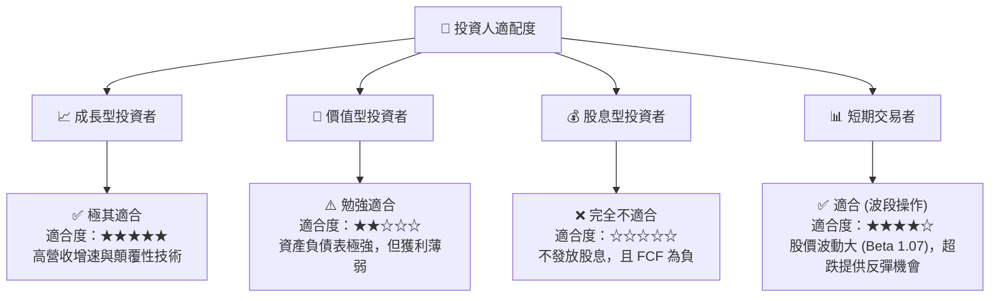

### 10.5 每季財報監控清單（Quarterly Watch List）

為了確保本投資框架的可持續追蹤性，投資人應在每季財報公佈時密切監控以下指標：

1.  **無人系統（US）部門營收增速**：基準門檻值為 **YoY > 20%**。若低於 15%，說明無人機項目進展受阻。
2.  **季度自由現金流（FCF）**：目標是在 2027 年底前實現單季轉正。若每季流失持續超過 -$30M，需警惕資金消耗速度。
3.  **發行在外股數（Shares Outstanding）**：基準門檻值為 **QoQ 增長 < 1%**。若股數持續攀升，說明股權稀釋未停止，將嚴重壓抑 EPS 表現。
4.  **營業利益率（Operating Margin）**：目標是向 **5%** 靠攏。若持續低於 2%，說明規模效應未能顯現。

### 10.6 反面論證：什麼會證明論點錯誤（What Would Change My Mind）

```
╔══════════════════════════════════════════════════════════════════╗
║              ⚠️ 論點失效條件 (Disconfirming Evidence)            ║
╠══════════════════════════════════════════════════════════════════╣
║  本投資論點在下列情況成立時應重新檢視或果斷退出：                ║
║                                                                  ║
║  ☐ 營收年增率連續兩季低於 12%（成長動能失速）                    ║
║  ☐ 營業利益率（Operating Margin）跌破 1.0%（獲利能力徹底惡化）    ║
║  ☐ 自由現金流（FCF）流失在未來 4 季內累計超過 -$150M             ║
║  ☐ 美國國防部宣佈取消或無限期推遲 CCA（協同作戰飛機）項目       ║
║  ☐ 2026 年底前發行股數突破 195M 股（稀釋失控）                   ║
╚══════════════════════════════════════════════════════════════════╝
```

---

> **免責聲明**：本報告為基於公開財務數據之機構級學術研究，僅供投資參考，不構成任何買賣建議。投資有風險，入市需謹慎。