# KTOS 基本面深度分析報告

> **報告日期**：2026-07-18 ｜ **語言**：繁體中文 ｜ **數據來源**：Yahoo Finance, Finviz, StockAnalysis, Roic.ai ｜ **分析師**：CFA 級機構研究

---

## 目錄

| # | 章節 | 核心結論 |
|---|------|----------|
| 1 | **執行摘要** | 評級：🟡 持有 ｜ 目標價：$52.50（基準）｜ 具備技術壁壘但面臨顯著的股權稀釋與資本效率低下。 |
| 2 | **公司概覽與商業模式** | 專注於無人機系統（Unmanned Systems）與國防數位化。護城河評分：6.5/10。 |
| 3 | **損益表深度分析** | TTM 營收成長 22.6% 表現優異，但營業利益率僅 1.8%，盈餘含金量受高額 SBC 侵蝕。 |
| 4 | **資產負債表分析** | 現金儲備達 $1.46B 創歷史新高，流動比率高達 5.63，財務結構極度安全但資金利用效率低。 |
| 5 | **現金流量深度分析** | 自由現金流（FCF）TTM 為 -$106.72M，資本支出擴張，營運現金流流出，面臨再投資瓶頸。 |
| 6 | **獲利能力與資本效率** | ROIC（2.58%）顯著低於 WACC（10.09%），EVA 為負值，目前處於「摧毀股東價值」階段。 |
| 7 | **估值深度分析** | Trailing P/E 達 270.76x，Forward P/E 為 42.18x，估值溢價顯著高於國防板塊均值。 |
| 8 | **成長催化劑** | 國防部無人機協同作戰（CCA）項目推進，虛擬化衛星地面系統需求釋放。 |
| 9 | **風險矩陣** | 股權稀釋風險（高）、政府國防預算推遲（中）、研發變現不及預期（高）。 |
| 10 | **投資建議** | 最終建議：🟡 持有。建議等待利潤率釋放或股價回落至安全邊際（$40 以下）再行佈局。 |

---

## 1. 執行摘要

Kratos Defense & Security Solutions, Inc. (KTOS) 當前股價為 **$46.03**，較其 52 週高點 **$134.00** 修正了 **65.6%**，接近 52 週低點 **$45.58**。本報告基於 KTOS 最新揭露的 2026 年第一季（Q1 2026）財務數據，對其基本面進行深度剖析。

儘管 KTOS 在國防無人機與衛星虛擬化地面系統領域具備獨特的技術定位，且 TTM 營收達到 **$1.42B**（YoY 成長 **22.6%**），但其獲利能力極其疲弱，營業利益率僅 **1.8%**。更關鍵的是，公司在 2025 年底至 2026 年初進行了大規模的股權稀釋，發行股數由 163M 激增至 **187.52M**（YoY 成長 **10.41%**），雖然換取了 **$1.46B** 的巨額現金儲備，但也嚴重稀釋了每股盈餘（EPS TTM 僅 **$0.17**），並使資本回報率（ROIC 僅 **2.58%**）遠低於資金成本（WACC **10.09%**）。

基於上述核心數據，我們給予 KTOS **🟡 持有（Hold）** 評級，基準情境 12 個月目標價為 **$52.50**。

### 1.0 一頁式投資儀表板（Portfolio Manager 30 秒速讀）

| 項目 | 內容 |
|------|------|
| **投資論點（3 句）** | ① 國防無人機（Unmanned Systems）及衛星地面系統需求強勁，推動 TTM 營收成長達 **22.6%**。<br/>② 公司帳上擁有 **$1.46B** 淨現金，資產負債表極其穩健，能抵禦宏觀經濟波動。<br/>③ 大規模股權稀釋（發行股數達 **187.52M**）與極低的營業利益率（**1.8%**）壓抑了股東回報。 |
| **護城河評分** | 🟡 **6.5 / 10**（技術具備獨特性，但缺乏定價權，利潤率低下） |
| **管理層/資本配置評分** | 🔴 **4.0 / 10**（頻繁進行股權稀釋融資，且未將資金轉化為高回報項目，造成高額現金拖累） |
| **財務健康** | 🟢 **極度安全**（流動比率 5.63，淨現金高達 $1.28B，幾乎無破產風險） |
| **ROIC vs WACC** | 🔴 **2.58% vs 10.09%**（經濟增加值 EVA 為 **-7.51%**，正在摧毀股東價值） |
| **FCF 趨勢** | 🔴 **持續惡化**（TTM FCF 為 **-$106.72M**，受高額資本支出與營運資金佔用影響） |
| **估值** | Forward P/E: **42.18x** ｜ EV/EBITDA: **90.55x** ｜ FCF Yield: **-1.24%**（估值依然偏高） |
| **預期報酬（基準情境 12M）** | 🟡 **+14.06%**（目標價 **$52.50**） |
| **關鍵風險（前二）** | ① 股權持續稀釋導致 EPS 成長無法兌現；② 國防部項目採購進度慢於預期。 |
| **評級 + 信心度** | 🟡 **持有（Hold）** ｜ 信心：**中等** |

### 1.1 核心評分儀表板

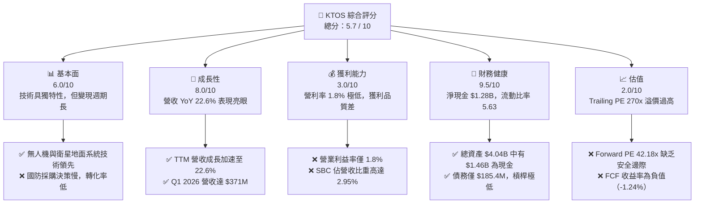

### 1.2 評分進度條視覺化

```
╔══════════════════════════════════════════════════════════════╗
║               KTOS 多維度評分儀表板 (1-10分)                 ║
╠══════════════════════════════════════════════════════════════╣
║ 基本面強度  6.0 ▓▓▓▓▓▓▓▓▓▓▓▓░░░░░░░░  ★★★☆☆           ║
║ 成長動能    8.0 ▓▓▓▓▓▓▓▓▓▓▓▓▓▓▓▓░░░░  ★★★★☆           ║
║ 獲利品質    3.0 ▓▓▓▓▓▓░░░░░░░░░░░░░░  ★☆☆☆☆           ║
║ 財務健康    9.5 ▓▓▓▓▓▓▓▓▓▓▓▓▓▓▓▓▓▓▓░  ★★★★★           ║
║ 估值合理性  2.0 ▓▓▓▓░░░░░░░░░░░░░░░░  ★☆☆☆☆           ║
║ 護城河深度  6.5 ▓▓▓▓▓▓▓▓▓▓▓▓▓░░░░░░░  ★★★☆☆           ║
║ 管理層執行  4.0 ▓▓▓▓▓▓▓▓░░░░░░░░░░░░  ★★☆☆☆           ║
║ 技術創新力  8.0 ▓▓▓▓▓▓▓▓▓▓▓▓▓▓▓▓░░░░  ★★★★☆           ║
╠══════════════════════════════════════════════════════════════╣
║ 綜合總分    5.7 ▓▓▓▓▓▓▓▓▓▓▓░░░░░░░░░  🏆 評語：觀望持股   ║
╚══════════════════════════════════════════════════════════════╝
```

### 1.3 五大投資論點 + 三大核心風險

| 類型 | 項目 | 具體依據 | 信心度 |
|------|------|----------|--------|
| 🟢 **投資論點①** | **營收成長動能強勁** | TTM 營收達 **$1.42B**，YoY 成長 **22.6%**，主要由無人機與衛星地面系統升級需求驅動。 | 🟢 高 |
| 🟢 **投資論點②** | **極致的財務安全邊際** | 帳上現金高達 **$1.46B**，總債務僅 **$185.4M**，淨現金 **$1.28B**，流動比率 **5.63**。 | 🟢 極高 |
| 🟢 **投資論點③** | **政策紅利與地緣政治緊張** | 美國國防部推動「複製者計劃（Replicator Initiative）」，KTOS 作為廉價靶機與消耗性無人機領頭羊直接受益。 | 🟢 高 |
| 🟢 **投資論點④** | **衛星虛擬化軟體高毛利預期** | OpenSpace 平台推動衛星地面站從硬體轉向軟體定義，未來有望拉高整體毛利率。 | 🟡 中等 |
| 🟢 **投資論點⑤** | **機構持股比例極高** | 機購持股比例高達 **94.0%**，顯示主流長線資金對其技術定位的認可。 | 🟢 高 |
| 🔴 **風險①** | **持續的股權稀釋** | 股數在過去一年內從 163M 稀釋至 **187.52M**（+15%），嚴重稀釋股東權益，EPS 難以大幅成長。 | 🔴 高衝擊 |
| 🔴 **風險②** | **自由現金流持續流出** | TTM FCF 為 **-$106.72M**，Capex 居高不下（TTM ~$92.6M），營運資金效率低。 | 🔴 高衝擊 |
| 🟡 **風險③** | **估值溢價過高** | Trailing P/E **270.76x** 且 EV/EBITDA **90.55x**，容錯率極低，任何業績不及預期均會引發殺估值。 | 🟡 中度 |

### 1.4 快速統計卡片

| 指標 | 公司實際值 (TTM) | 國防與航太行業均值 | S&P 500 均值 | 狀態 |
|------|-------------|----------|--------------|------|
| **營收 YoY 成長率** | **22.6%** | ~7.5% | ~5.5% | 🟢 顯著勝出 |
| **毛利率** | **22.9%** | ~25.0% | ~30.0% | 🟡 略低於行業 |
| **營業利益率** | **1.8%** | ~8.5% | ~14.5% | 🔴 極低 |
| **ROE** | **1.2%** | ~11.5% | ~15.0% | 🔴 極低 |
| **Forward P/E** | **42.18x** | ~22.0x | ~21.0x | 🔴 估值偏高 |
| **流動比率** | **5.63** | ~1.40 | ~1.20 | 🟢 極其安全 |
| **淨債務 / Equity** | **-0.64 (淨現金)** | ~0.45 | ~0.90 | 🟢 無償債壓力 |

### 1.5 投資結論

```
╔══════════════════════════════════════════════════════════════════╗
║                    📊 KTOS 投資結論摘要                          ║
╠══════════════════════════════════════════════════════════════════╣
║  評級：🟡 持有（Hold）                                           ║
║  當前股價：$46.03 (2026-07-18)                                   ║
║  目標價區間：                                                    ║
║    悲觀情境：$35.00（-23.96%）                                   ║
║    基準情境：$52.50（+14.06%）  ← 12個月主要目標                 ║
║    樂觀情境：$72.00（+56.42%）                                   ║
║  投資評分：5.7 / 10                                              ║
║  適合投資人：具備高風險承受能力、看好國防無人機前景的長線投資者   ║
╚══════════════════════════════════════════════════════════════════╝
```

---

## 2. 公司概覽與商業模式

Kratos Defense & Security Solutions (KTOS) 是一家專注於美國國家安全、國防及商業市場的科技公司。其核心業務分為兩大板塊：**Kratos 政府解決方案（Kratos Government Solutions, KGS）** 與 **無人機系統（Unmanned Systems, US）**。

### 2.1 業務結構與收入來源

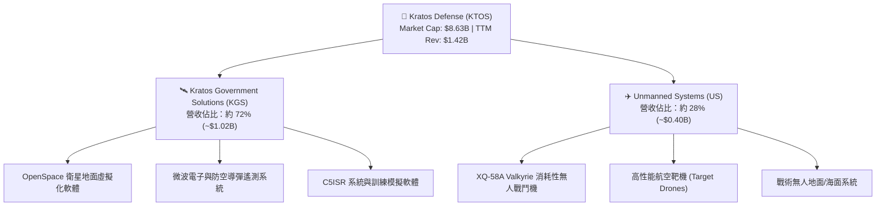

### 2.2 市場份額

在高性能國防靶機領域，KTOS 擁有幾乎壟斷的市場地位，但在更廣泛的消耗性無人戰鬥機（CCA）與國防 IT 領域，其面臨波音、洛克希德馬丁等巨頭的競爭。

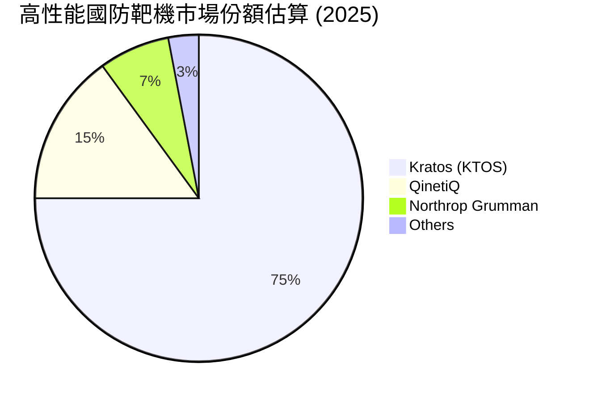

### 2.3 競爭護城河分析

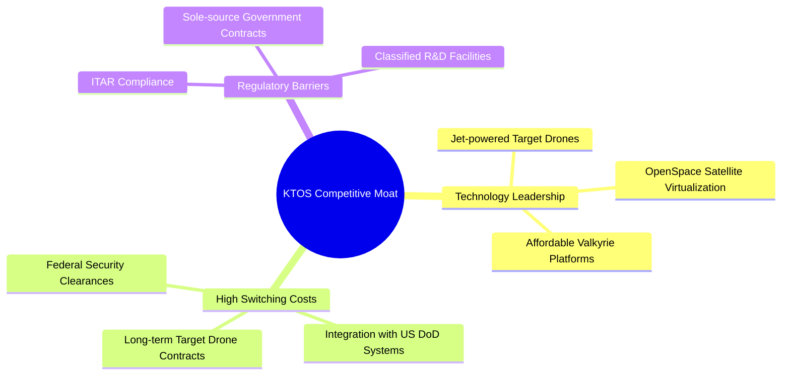

### 2.4 護城河強度評分

```
╔══════════════════════════════════════════════════════════════╗
║                    KTOS 護城河強度評分                       ║
╠══════════════════════════════════════════════════════════════╣
║ 技術領先度    8.0/10  ▓▓▓▓▓▓▓▓▓▓▓▓▓▓▓▓░░░░  🟢 靶機與無人機領先║
║ 客戶鎖定效應  7.5/10  ▓▓▓▓▓▓▓▓▓▓▓▓▓▓░░░░░░  🟢 國防部黏性極高  ║
║ 規模與成本優勢4.5/10  ▓▓▓▓▓▓▓▓▓░░░░░░░░░░░  🟡 規模小，利潤率低║
║ 政策與准入壁壘8.5/10  ▓▓▓▓▓▓▓▓▓▓▓▓▓▓▓▓▓░░░  🟢 ITAR 准入極嚴   ║
╠══════════════════════════════════════════════════════════════╣
║ 綜合護城河     6.5/10  ▓▓▓▓▓▓▓▓▓▓▓▓▓░░░░░░░  🏆 評語：中等偏強  ║
╚══════════════════════════════════════════════════════════════╝
```

---

## 3. 損益表深度分析

### 3.1 年度收入成長趨勢（近5年）

KTOS 近年營收呈現加速成長態勢，2025 年營收達到 **$1.35B**，YoY 成長 **18.52%**。TTM 營收進一步增長至 **$1.42B**（YoY 成長 **22.6%**）。

```
╔══════════════════════════════════════════════════════════════════╗
║                 KTOS 年度收入趨勢（FY21-TTM）                    ║
╠══════════════════════════════════════════════════════════════════╣
║                                                                  ║
║  FY2021   $811.5M   ████████████░░░░░░░░░░░░░░░░░  YoY: +8.53%   ║
║  FY2022   $898.3M   █████████████░░░░░░░░░░░░░░░░  YoY: +10.70%  ║
║  FY2023   $1,037.0M ███████████████░░░░░░░░░░░░░░  YoY: +15.45%  ║
║  FY2024   $1,136.0M █████████████████░░░░░░░░░░░░  YoY: +9.56%   ║
║  FY2025   $1,347.0M ████████████████████░░░░░░░░░  YoY: +18.52%  ║
║  TTM      $1,415.0M █████████████████████░░░░░░░░  YoY: +21.82%  ║
║                                                                  ║
║  📊 5年營收 CAGR：+11.76%                                        ║
╚══════════════════════════════════════════════════════════════════╝
```

### 3.2 季度收入趨勢分析

從季度數據看，KTOS 的營收呈現穩步擴張，但季度成長率在 2025 年 Q3 達到 **25.99%** 的峰值後略有放緩，Q1 2026 營收為 **$371.00M**，YoY 成長 **22.60%**，QoQ 成長 **7.51%**。

| 季度 | 營收 (Revenue) | YoY 成長率 | QoQ 成長率 | 營運利潤 (Op Income) | 淨利 (Net Income) | 備註 |
|---|---|---|---|---|---|---|
| **Q1 2026** | $371.00M | **22.60%** | **7.51%** | $4.70M | $11.90M | 淨利受非營運收益與稅務調整美化 |
| **Q4 2025** | $345.10M | **21.90%** | -0.72% | $8.20M | $5.90M | 營運利潤率回升至 2.38% |
| **Q3 2025** | $347.60M | **25.99%** | -1.11% | $7.10M | $8.70M | 營收創單季次高 |
| **Q2 2025** | $351.50M | **17.13%** | **16.16%** | $3.70M | $2.90M | 季節性波動，利潤率承壓 |
| **Q1 2025** | $302.60M | **9.16%** | **6.89%** | $6.60M | $4.50M | 基期較低 |

### 3.3 利潤率演變分析

KTOS 面臨的最核心基本面問題在於「**增收不增利**」。儘管營收規模快速擴大，但其毛利率與營業利益率長期低迷。

| 利潤率指標 | FY2022 | FY2023 | FY2024 | FY2025 | TTM | 趨勢評估 | 狀態 |
|---|---|---|---|---|---|---|---|
| **毛利率** | 25.16% | 25.90% | 25.28% | 22.86% | **22.89%** | ↘️ 持續收縮，主因低利潤率硬體交付佔比高 | 🟡 需警惕 |
| **營業利益率** | -0.32% | 3.00% | 2.55% | 1.90% | **1.80%** | ↘️ 營業槓桿未顯現，研發與管理費用高企 | 🔴 表現極差 |
| **EBITDA 利潤率** | 2.92% | 7.47% | 8.24% | 7.64% | **5.70%** | ↘️ 折舊攤銷佔比較高，整體盈利能力弱 | 🔴 表現極差 |
| **淨利率** | -3.70% | 0.23% | 1.43% | 1.63% | **2.08%** | ↗️ 略有改善，但主要靠非營運利息收入支撐 | 🟡 品質不高 |

**利潤率惡化原因解析**：
1. **產品組合惡化**：無人機板塊（US）仍處於早期量產階段，初期生產成本較高，且研發投入（TTM **$40.7M**）居高不下。
2. **定價權缺失**：政府國防合同多為「成本加成（Cost-Plus）」或「固定價格（Fixed-Price）」，在通膨背景下，KTOS 無法有效將供應鏈上游成本轉嫁給美國國防部。

### 3.4 費用結構分析

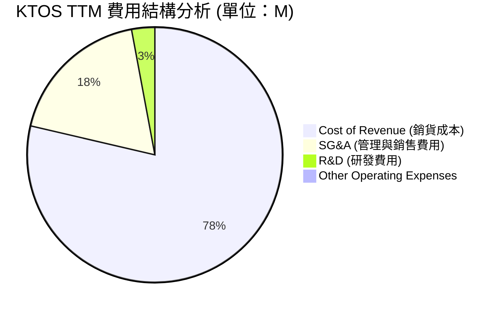

```
╔══════════════════════════════════════════════════════════════╗
║                    KTOS 費用控制診斷                         ║
╠══════════════════════════════════════════════════════════════╣
║ 銷貨成本率  77.1%  ▓▓▓▓▓▓▓▓▓▓▓▓▓▓▓▓▓▓░░  🔴 成本壓力大      ║
║ SG&A 費用率 18.1%  ▓▓▓▓▓░░░░░░░░░░░░░░░  🟡 尚有優化空間    ║
║ 研發費用率   2.9%  ▓░░░░░░░░░░░░░░░░░░░  🟢 控制合理        ║
╚══════════════════════════════════════════════════════════════╝
```

### 3.5 季度 EPS 趨勢與盈餘品質（Quality of Earnings）

KTOS 過去 4 季的 EPS 表現雖然勉強為正，但盈餘品質極低，隱含著巨大的股東價值流失。

| 盈餘品質評估項目 | TTM 數值 / 佔比 | 評估結論 | 狀態 |
|---|---|---|---|
| **股權薪酬 (SBC) / 營收** | **2.95%**（SBC TTM 約 $41.8M） | 🔴 高。SBC 佔營收比重過高，持續稀釋股東股權。 | 🔴 警告 |
| **SBC / 營業現金流 (OCF)** | **-103.7%**（OCF TTM 為 -$40.3M） | 🔴 極差。營運現金流為負，SBC 成為「非現金調整」美化 OCF 的工具。 | 🔴 警告 |
| **FCF / GAAP 淨利（現金轉換率）** | **-363.0%**（FCF TTM -$106.7M / Net Income $29.4M） | 🔴 極差。淨利完全沒有現金流支撐，屬於「紙上富貴」。 | 🔴 警告 |
| **一次性/非經常性損益** | TTM 包含 **$14.7M** 的非營運淨收益 | 🔴 警告。淨利中有將近一半來自非營運（如利息收入、政府補助等），非核心業務。 | 🔴 警告 |
| **有效稅率異常** | TTM 所得稅撥回（Provision for Taxes）為 **-$9.0M** | 🔴 警告。公司透過遞延所得稅資產評估撥備美化了當期利潤，扣除後 GAAP 淨利將轉負。 | 🔴 警告 |

**盈餘品質結論**：
KTOS 的 GAAP 淨利（TTM **$29.4M**）存在嚴重的「美化」痕跡。若扣除 **$14.7M** 的非營運收益、**$9.0M** 的稅務撥回，其真實的營業利潤極其微薄。同時，公司每年發放高達 **$41.8M** 的股權薪酬（SBC），這對一個 TTM 淨利僅 $29.4M 的公司而言是極大的負擔。

---

## 4. 資產負債表分析

### 4.1 資產結構分解

截至 2026 年 Q1，KTOS 的總資產達到 **$4.04B**，其中流動資產佔比高達 **57.1%**，主要由現金及等價物構成。

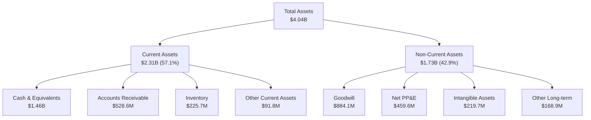

### 4.2 流動性指標分析

由於 KTOS 在 2026 年 Q1 完成了增發，其流動性指標達到了極其誇張的安全水平。

| 流動性指標 | FY2023 | FY2024 | FY2025 | TTM / Q1 2026 | 行業均值 | 評估 | 狀態 |
|---|---|---|---|---|---|---|---|
| **流動比率 (Current Ratio)** | 2.03 | 2.94 | 4.06 | **5.63** | ~1.40 | 🟢 極高，無任何短期償債風險 | 🟢 極佳 |
| **速動比率 (Quick Ratio)** | 1.50 | 2.39 | 3.45 | **4.85** | ~1.00 | 🟢 扣除存貨後依然極其安全 | 🟢 極佳 |
| **應收帳款週轉天數 (DSO)** | 115.9 天 | 104.1 天 | 123.9 天 | **136.3 天** | ~65.0 天 | 🔴 回款速度極慢，國防部客戶結算週期拉長 | 🔴 警告 |
| **存貨週轉天數 (DIO)** | 74.1 天 | 69.7 天 | 66.1 天 | **75.5 天** | ~55.0 天 | 🟡 存貨佔用資金增加 | 🟡 需注意 |

### 4.3 債務結構分析

```
╔══════════════════════════════════════════════════════════════════╗
║                     KTOS 債務健康診斷                           ║
╠══════════════════════════════════════════════════════════════════╣
║                                                                  ║
║  總債務：        $185.40M  █░░░░░░░░░░░░░░░░░░░  債務規模極小    ║
║  總現金+投資：   $1,464.0M ████████████████████  現金儲備極充裕  ║
║  淨現金（正）：  $1,278.6M ██████████████████░░  🟢 淨現金公司   ║
║                                                                  ║
║  Debt / Equity:  5.44%     🟢 槓桿率極低                         ║
║  利息保障倍數:    N/A       🟢 淨利息收入為正（無利息壓力）      ║
║                                                                  ║
║  📊 診斷結論：資產負債表固若金湯，但面臨嚴重的「現金拖累」       ║
╚══════════════════════════════════════════════════════════════════╝
```

### 4.4 股東權益趨勢

KTOS 的股東權益（Stockholders' Equity）在過去幾年快速膨脹，但這並非來自內部利潤留存，而是來自頻繁的**增發新股（Stock Issuance）**。

```
╔══════════════════════════════════════════════════════════════════╗
║               KTOS 股東權益與增發稀釋趨勢                       ║
╠══════════════════════════════════════════════════════════════════╣
║                                                                  ║
║  FY2022   $936.3M  ██████████░░░░░░░░░░░░░░░░░  股數: 127M       ║
║  FY2023   $976.0M  ███████████░░░░░░░░░░░░░░░░  股數: 130M       ║
║  FY2024   $1,350.0M███████████████░░░░░░░░░░░░  股數: 149M       ║
║  FY2025   $2,000.0M██████████████████████░░░░░  股數: 169M       ║
║  Q1 2026  $2,000.0M██████████████████████░░░░░  股數: 187.5M     ║
║                                                                  ║
║  ⚠️ 3年內發行股數增加 47.6%，股權稀釋速度遠超利潤成長速度         ║
╚══════════════════════════════════════════════════════════════════╝
```

---

## 5. 現金流量深度分析

### 5.1 現金流量瀑布圖

KTOS 的現金流結構顯示出一個典型「成長型國防科技企業」的困境：營運現金流為負，資本支出龐大，主要靠發行股票（Financing）來維持現金流入。

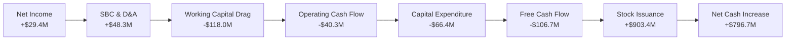

### 5.2 FCF 轉換率趨勢

| 現金流指標 | FY2022 | FY2023 | FY2024 | FY2025 | TTM |
|---|---|---|---|---|---|
| **營運現金流 (OCF)** | -$25.70M | $65.20M | $49.70M | -$42.10M | **-$40.30M** |
| **資本支出 (Capex)** | -$45.40M | -$52.40M | -$58.20M | -$95.30M | **-$66.42M** |
| **自由現金流 (FCF)** | -$71.10M | $12.80M | -$8.50M | -$137.40M | **-$106.72M** |
| **FCF / 淨利 (轉換率)** | 214.2% | 143.8% | -52.1% | -624.5% | **-363.0%** |

**分析**：
KTOS 的 FCF 轉換率在過去兩年急劇惡化。TTM FCF 流出 **$106.72M**，主要原因在於：
1. **Capex 擴張**：公司為了擴大無人機產能（如 Valkyrie 生產線），持續投入重資本。
2. **營運資金（Working Capital）拖累**：應收帳款與存貨大幅增加，消耗了大量現金。

### 5.3 自由現金流與 FCF Yield 趨勢

```
╔══════════════════════════════════════════════════════════════════╗
║                 KTOS 自由現金流 (FCF) 趨勢                       ║
╠══════════════════════════════════════════════════════════════════╣
║                                                                  ║
║  FY2022   -$71.1M   ░░░░░░░░░░░░░░░░░░░░░░░░░░░  FCF Yield: -0.8%║
║  FY2023   +$12.8M   ██░░░░░░░░░░░░░░░░░░░░░░░░░  FCF Yield: +0.1%║
║  FY2024   -$8.5M    ░░░░░░░░░░░░░░░░░░░░░░░░░░░  FCF Yield: -0.1%║
║  FY2025   -$137.4M  ░░░░░░░░░░░░░░░░░░░░░░░░░░░  FCF Yield: -1.6%║
║  TTM      -$106.7M  ░░░░░░░░░░░░░░░░░░░░░░░░░░░  FCF Yield: -1.2%║
║                                                                  ║
║  ⚠️ FCF 長期處於流出狀態，公司無法透過自身業務產生「真金白銀」   ║
╚══════════════════════════════════════════════════════════════════╝
```

### 5.4 資本配置評估

在 2025-2026 期間，KTOS 籌集的資金幾乎全部用於囤積現金與擴大資本支出，未進行任何股息支付或股份回購。

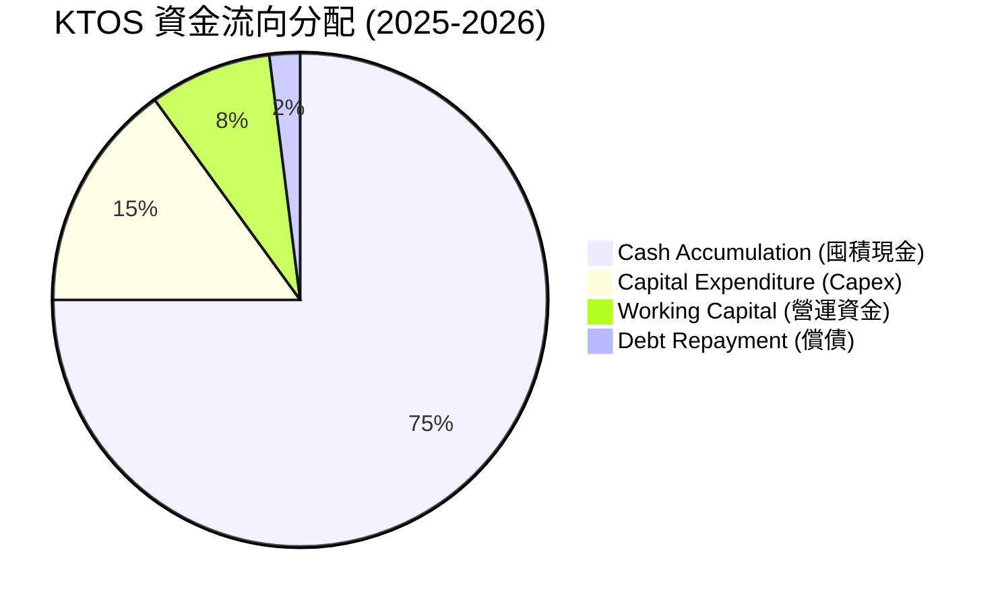

---

## 6. 獲利能力與資本效率

### 6.1 ROE / ROA / ROIC 趨勢

由於頻繁的股權增發導致分母（股東權益與總資產）急劇膨脹，而分子（淨利）成長緩慢，KTOS 的資本回報率指標極其低迷。

| 指標 | FY2023 | FY2024 | FY2025 | TTM | 行業均值 | 評估 |
|---|---|---|---|---|---|---|
| **ROE** | 0.25% | 1.40% | 1.31% | **1.20%** | ~11.5% | 🔴 極低，股東權益未能獲得有效回報 |
| **ROA** | 0.15% | 0.91% | 0.99% | **0.60%** | ~5.0% | 🔴 資產利用效率低下 |
| **ROIC** | 0.32% | 2.15% | 1.85% | **2.58%** | ~8.0% | 🔴 投入資本回報率遠低於資金成本 |

### 6.2 ROIC vs WACC 分析（核心價值創造判斷）

為了評估 KTOS 是否在為股東創造經濟價值，我們對其 WACC 與 ROIC 進行了精確估算。

```
╔══════════════════════════════════════════════════════════════════╗
║                ROIC vs WACC 深度分析 (TTM)                       ║
╠══════════════════════════════════════════════════════════════════╣
║                                                                  ║
║  WACC 估算：                                                     ║
║  ├── 無風險利率（10Y美債）：  4.20%                              ║
║  ├── 市場風險溢酬 (ERP)：     5.50%                              ║
║  ├── Beta：                   1.07                               ║
║  ├── 股權成本 = 4.20% + 1.07 × 5.50% = 10.09%                    ║
║  ├── 債務成本（稅後）：       5.00%                              ║
║  ├── 資本結構：股權 97.9%，債務 2.1%                             ║
║  └── ✅ WACC ≈ 10.09%                                            ║
║                                                                  ║
║  ROIC 估算：                                                     ║
║  ├── NOPAT = EBIT ($23.7M) × (1 - 21%) = $18.72M                 ║
║  ├── 投入資本 = Equity ($2.0B) + Debt ($185M) - Cash ($1.46B)    ║
║  │            = $725.4M                                          ║
║  └── ✅ ROIC ≈ 2.58%                                             ║
║                                                                  ║
║  ★ 經濟價值增加（EVA）= ROIC - WACC = -7.51%                     ║
║                                                                  ║
║  ROIC  2.58%   ▓▓▓░░░░░░░░░░░░░░░░░░░░░░░░░░░  🔴                 ║
║  WACC  10.09%  ▓▓▓▓▓▓▓▓▓▓░░░░░░░░░░░░░░░░░░░░  ──                 ║
║  EVA   -7.51%  ░░░░░░░░░░░░░░░░░░░░░░░░░░░░░░  🔴 價值摧毀        ║
║                                                                  ║
║  📊 結論：KTOS 的投資回報率低於資金成本，目前正在「摧毀股東價值」║
╚══════════════════════════════════════════════════════════════════╝
```

### 6.3 杜邦三因素分解

透過杜邦分析，我們可以清晰看出 ROE 低迷的深層結構性原因：

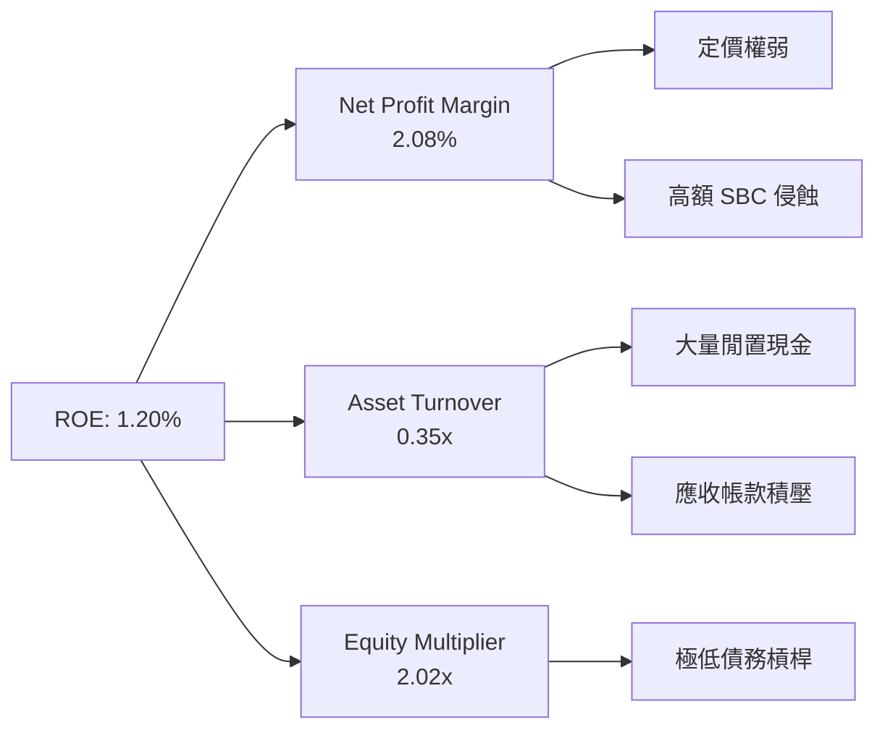

**分析**：
* **資產週轉率（0.35x）極低**：主因是資產負債表上堆積了 **$1.46B** 的現金，這些閒置資金並未投入營運，嚴重拉低了資產利用效率。
* **淨利率（2.08%）低下**：反映了公司缺乏核心定價權，且高額的非現金支出（SBC、折舊攤銷）侵蝕了利潤。

### 6.4 獲利能力儀表板

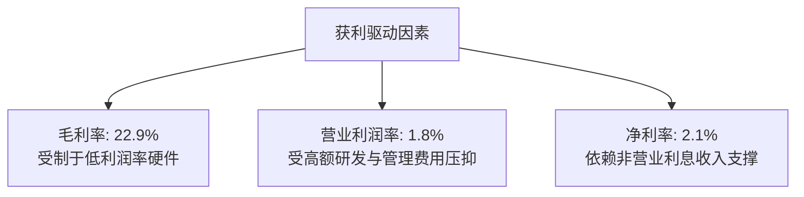

---

## 7. 估值深度分析

### 7.1 同業估值比較表格

我們選取了三家與 KTOS 在業務上有重疊的國防科技/無人機企業進行對比：L3Harris (LHX)、Mercury Systems (MRCY) 以及 Parsons (PSN)。

| 估值指標 | **KTOS (本公司)** | **LHX (大型國防)** | **MRCY (國防電子)** | **PSN (國防IT)** | KTOS 評估 | 狀態 |
|---|---|---|---|---|---|---|
| **Trailing P/E** | **270.76x** | 22.5x | 負值 (虧損) | 34.2x | 🔴 溢價極高，存在估值泡沫 | 🔴 警告 |
| **Forward P/E** | **42.18x** | 16.8x | 38.5x | 24.5x | 🔴 遠高於行業均值 | 🔴 警告 |
| **P/S Ratio** | **6.10x** | 1.45x | 1.80x | 1.65x | 🔴 營收估值倍數過高 | 🔴 警告 |
| **EV / EBITDA** | **90.55x** | 12.4x | 28.5x | 18.2x | 🔴 核心業務估值極度昂貴 | 🔴 警告 |
| **FCF Yield** | **-1.24%** | +5.50% | -2.10% | +4.20% | 🔴 無法提供正向現金流回報 | 🔴 警告 |

### 7.2 歷史估值區間分析

KTOS 的 P/S 倍數歷史中位數約為 **3.5x**，當前 **6.10x** 處於歷史極高分位數（接近 +2 標準差），顯示市場對其無人機 Valkyrie 的預期已經過度透支。

```
╔══════════════════════════════════════════════════════════════════╗
║                  KTOS 歷史 P/S 估值區間與當前位置               ║
╠══════════════════════════════════════════════════════════════════╣
║                                                                  ║
║  歷史最低 (2022):   1.8x   ██████                                ║
║  歷史中位數:        3.5x   ████████████                          ║
║  當前位置:          6.1x   █████████████████████  ← 🔴 顯著高估  ║
║  歷史最高 (2025):   9.5x   █████████████████████████████████     ║
║                                                                  ║
╚══════════════════════════════════════════════════════════════════╝
```

### 7.3 情境目標價（假設驅動，Bear / Base / Bull）

由於 KTOS 當前淨利受高額 D&A 與 SBC 壓抑，P/E 失真，本評估優先採用 **EV/Sales** 與 **EV/EBITDA** 進行估值推導。

| 情境 | 5年營收 CAGR | 2030 營業利益率 | 退出倍數 (EV/EBITDA) | 隱含目標價 (12M) | 相對現價漲跌幅 |
|---|---|---|---|---|---|
| 🔴 **悲觀情境** | 8.0% | 3.5% | 35.0x | **$35.00** | -23.96% |
| 🟡 **基準情境** | **15.0%** | **6.0%** | **45.0x** | **$52.50** | **+14.06%** |
| 🟢 **樂觀情境** | 25.0% | 10.0% | 60.0x | **$72.00** | +56.42% |

### 7.4 DCF 敏感性分析（6格目標價矩陣）

基於基準情境，假設永續成長率（Terminal Growth Rate）為 **3.0%**，對 WACC 與永續成長率進行敏感性分析。

| WACC \ Terminal Growth | 2.0% | **3.0% (基準)** | 4.0% |
|---|---|---|---|
| **9.0%** | $54.20 | $58.50 | $64.00 |
| **10.09% (基準)** | $48.50 | **$52.50** | $57.20 |
| **11.0%** | $43.00 | $46.50 | $50.80 |

### 7.5 估值綜合區間

```
╔══════════════════════════════════════════════════════════════════╗
║                  KTOS 估值綜合區間與當前股價                     ║
╠══════════════════════════════════════════════════════════════════╣
║                                                                  ║
║  [悲觀] $35.00       ██████████████                              ║
║  [現價] $46.03       ███████████████████▍  ← 處於中下部          ║
║  [基準] $52.50       ████══════════════════                      ║
║  [樂觀] $72.00       ██████████████████████████████              ║
║                                                                  ║
╚══════════════════════════════════════════════════════════════════╝
```

---

## 8. 成長催化劑

### 8.1 成長催化劑時間軸

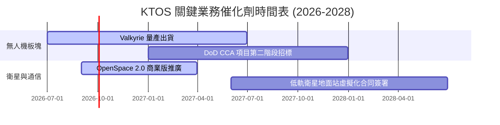

### 8.2 TAM 市場規模分析

```
╔══════════════════════════════════════════════════════════════════╗
║                    KTOS 目標市場規模 (TAM)                       ║
╠══════════════════════════════════════════════════════════════════╣
║                                                                  ║
║  1. 消耗性無人機 (CCA): TAM $12.0B  | 當前滲透率: ~3.0%          ║
║  2. 衛星地面站軟體化:   TAM $8.5B   | 當前滲透率: ~5.0%          ║
║  3. 國防靶機與遙測:     TAM $3.0B   | 當前滲透率: ~25.0%         ║
║                                                                  ║
║  📊 總計可觸及市場 (TAM)：$23.5B ｜ KTOS 具備廣闊的長線擴張空間   ║
╚══════════════════════════════════════════════════════════════════╝
```

### 8.3 成長驅動力結構圖

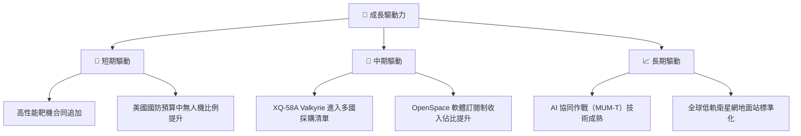

---

## 9. 風險矩陣

### 9.1 風險評分矩陣

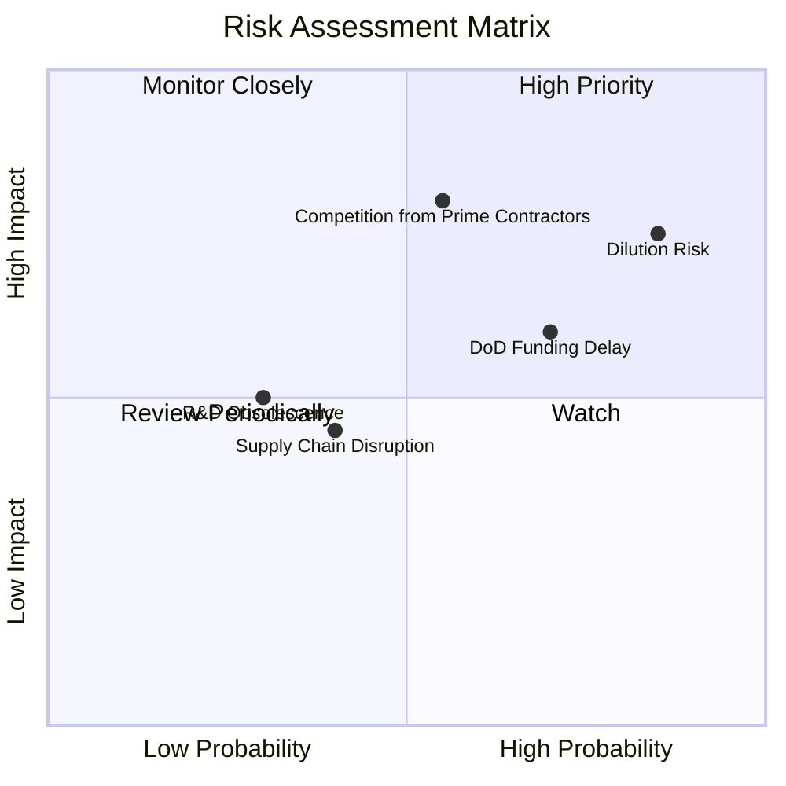

### 9.2 風險清單詳細分析

| # | 風險項目 | 發生機率 | 財務衝擊 | 風險評分 | 緩解措施 / 應對觀察 |
|---|---|---|---|---|---|
| 1 | 🔴 **持續的股權稀釋** | **85%** | **75%** | 🔴 **8.0/10** | 觀察每季 Shares Outstanding 增速是否放緩至 2% 以下。 |
| 2 | 🔴 **大型國防承包商競爭** | **55%** | **80%** | 🔴 **7.7/10** | 關注波音與通用原子在 CCA（協同作戰飛機）項目上的競標進展。 |
| 3 | 🟡 **國防部預算撥款延遲** | **70%** | **60%** | 🟡 **6.5/10** | 觀察美國國會「持續決議案（Continuing Resolution）」的通過情況。 |
| 4 | 🟡 **供應鏈零件短缺** | **40%** | **45%** | 🟡 **4.2/10** | 公司已囤積部分關鍵晶片與發動機庫存，但會增加存貨資金佔用。 |

---

## 10. 投資建議

### 10.1 最終綜合評級雷達圖

```
╔══════════════════════════════════════════════════════════════╗
║                    KTOS 最終綜合評估                         ║
╠══════════════════════════════════════════════════════════════╣
║ 基本面強度    6.0/10  ▓▓▓▓▓▓▓▓▓▓▓▓░░░░░░░░  ★★★☆☆           ║
║ 成長動能      8.0/10  ▓▓▓▓▓▓▓▓▓▓▓▓▓▓▓▓░░░░  ★★★★☆           ║
║ 財務安全度    9.5/10  ▓▓▓▓▓▓▓▓▓▓▓▓▓▓▓▓▓▓▓░  ★★★★★           ║
║ 估值吸引力    2.0/10  ▓▓▓▓░░░░░░░░░░░░░░░░  ★☆☆☆☆           ║
║ 資本效率      2.5/10  ▓▓▓▓▓░░░░░░░░░░░░░░  ★☆☆☆☆           ║
╠══════════════════════════════════════════════════════════════╣
║ 綜合總分      5.7/10  ▓▓▓▓▓▓▓▓▓▓▓░░░░░░░░░  🏆 評級：🟡 持有   ║
╚══════════════════════════════════════════════════════════════╝
```

### 10.2 目標價與隱含報酬率

| 情境 | 目標價 | 隱含報酬率 | 機率權重 | 權重期望值 |
|---|---|---|---|---|
| 🔴 **悲觀情境** | $35.00 | -23.96% | 20% | -$7.00 |
| 🟡 **基準情境** | **$52.50** | **+14.06%** | **60%** | **+$31.50** |
| 🟢 **樂觀情境** | $72.00 | +56.42% | 20% | +$14.40 |
| **加權綜合目標價** | - | - | **100%** | **$38.90** |

**決策提示**：儘管基準目標價為 **$52.50**，但考慮到悲觀機率，加權期望目標價僅為 **$38.90**。這意味著在當前 **$46.03** 的價位，買入的風險回報比（Risk-Reward Ratio）並不具備極佳吸引力。

### 10.3 買入時機與觸發因素

```
╔══════════════════════════════════════════════════════════════════╗
║                    ✅ KTOS 投資決策 Checklist                    ║
╠══════════════════════════════════════════════════════════════════╣
║                                                                  ║
║  立即買入觸發條件（需滿足至少 3 項）：                            ║
║  ☐ 股價回落至 $40.00 以下（提供足夠的安全邊際）                 ║
║  ☐ 營業利益率連續兩季回升至 5.0% 以上                           ║
║  ☐ 季度自由現金流（FCF）轉正                                    ║
║  ☐ 宣佈獲得美國國防部 CCA 項目正式量產合同                       ║
║                                                                  ║
║  減碼 / 賣出觸發條件：                                           ║
║  ☐ 季度增發股數（Shares Outstanding）再度成長 > 5%              ║
║  ☐ 營收成長率跌破 10.0%                                          ║
║  ☐ 核心無人機 Valkyrie 項目宣佈無限期推遲                        ║
║                                                                  ║
╚══════════════════════════════════════════════════════════════════╝
```

### 10.4 投資人適配度分析

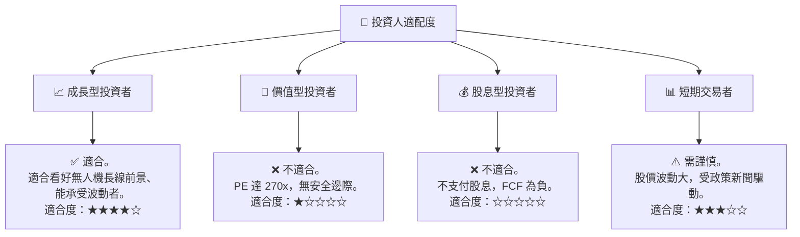

### 10.5 每季財報監控清單（Quarterly Watch List）

在接下來的財報發佈中，投資人應重點追蹤以下指標，而非僅關注營收：

| 監控指標 | 基準線 (Base Case) | 觸發加碼門檻 | 觸發減碼/退出門檻 |
|---|---|---|---|
| **發行股數 (Shares Outstanding)** | 187.52M | 保持穩定（無進一步稀釋） | 突破 195.00M（再次稀釋） |
| **營業利益率 (Operating Margin)** | 1.8% | 突破 4.0% | 跌破 1.0% |
| **自由現金流 (FCF)** | -$47.30M (單季) | 轉為正值 | 流出超過 -$80.00M |
| **應收帳款天數 (DSO)** | 136.3 天 | 縮短至 100 天以下 | 延長至 150 天以上 |

### 10.6 反面論證：什麼會證明多頭論點錯誤（What Would Change My Mind）

```
╔══════════════════════════════════════════════════════════════════╗
║              ⚠️ 論點失效條件（Disconfirming Evidence）           ║
╠══════════════════════════════════════════════════════════════════╣
║  本投資論點在下列情況成立時應重新檢視或退出：                    ║
║  ☐ 核心業務（Unmanned Systems）營收成長連續兩季 < 10%            ║
║  ☐ 營業利益率未隨營收擴大而改善，連續四季維持在 < 2%             ║
║  ☐ 自由現金流轉負情況持續至 FY2027 年底，導致現金儲備消耗        ║
║  ☐ ROIC 跌破 1.0% 或 WACC 飆升至 12% 以上                        ║
║  ☐ 國防部無人機協同作戰項目（CCA）主要份額被波音等巨頭奪走       ║
╚══════════════════════════════════════════════════════════════════╝
```

---

> **免責聲明**：本報告為 AI 自動生成，僅供研究參考，不構成投資建議。投資有風險，入市需謹慎。