# KTOS 基本面深度分析報告

> **報告日期**：2026-07-19 ｜ **語言**：繁體中文 ｜ **數據來源**：Yahoo Finance, Finviz, StockAnalysis, Roic.ai ｜ **分析師**：CFA 級機構研究

---

## 目錄

| # | 章節 | 核心結論 |
|---|---|---|
| **1** | [執行摘要](#1-執行摘要) | 評級為「買入（Buy）」，目標價 $109.33，具備 137.5% 潛在回報空間。 |
| **2** | [公司概覽與商業模式](#2-公司概覽與商業模式) | 虛擬化衛星地面站與無人靶機雙引擎驅動，具備高轉換成本與技術壁壘。 |
| **3** | [損益表深度分析](#3-損益表深度分析) | 營收年增 22.6% 展現強勁動能，但高折舊與研發壓抑營業利益率（1.8%）。 |
| **4** | [資產負債表分析](#4-資產負債表分析) | 增資後手握 $14.64B 現金，淨現金高達 $1.28B，流動比率 5.63，財務極度穩健。 |
| **5** | [現金流量深度分析](#5-現金流量深度分析) | 自由現金流（FCF）仍為負值（$-106.72M），主因資本支出擴張以應對未來產能。 |
| **6** | [獲利能力與資本效率](#6-獲利能力與資本效率) | 當前 ROIC（2.58%）低於 WACC（9.10%），預期未來產能釋放將迎來價值創造拐點。 |
| **7** | [估值深度分析](#7-估值深度分析) | Trailing P/E 270.8x 偏高，但 Forward P/E 壓縮至 42.2x，估值回檔至 52 週低點具備安全邊際。 |
| **8** | [成長催化劑](#8-成長催化劑) | 國防無人機（Valkyrie）量產與商業衛星地面站虛擬化軟體（OpenSpace）加速滲透。 |
| **9** | [風險矩陣](#9-風險矩陣) | 供應鏈延遲與政府預防性支出砍單為主要風險，需監控 FCF 轉正時程。 |
| **10** | [投資建議](#10-投資建議) | 建議於當前股價（$46.03）分批佈局，設定嚴格的每季財報監控指標與失效條件。 |

---

## 1. 執行摘要

Kratos Defense & Security Solutions, Inc.（NASDAQ: KTOS）當前股價為 **$46.03**，正處於其 52 週股價區間（$45.58 - $134.00）的底部邊緣。基於公司在 2026 年第一季完成的大規模股權融資（在外流通股數由 1.63 億股增至 1.87 億股），其資產負債表獲得了結構性重塑，手頭現金激增至 **$1.46B**，淨現金達到 **$1.28B**。儘管短期稀釋了每股盈餘，且 TTM 自由現金流（FCF）因產能擴張資本支出而錄得 **$-106.72M**，但這為 KTOS 提供了無可比擬的資金護城河。

鑑於國防部（DoD）對可耗損無人機（Attritable UAVs，如 XQ-58A Valkyrie）及低軌衛星（LEO）虛擬化地面站的迫切需求，KTOS 的 TTM 營收錄得 **$1.42B**（年增 22.6%），且市場預期 Forward EPS 將從當前的 $0.17 爆發性增長至 **$1.09**（Forward P/E 僅 42.2x）。

本報告給予 KTOS **「買入（Buy）」** 評級，基準情境 12 個月目標價為 **$109.33**（對應 21 位分析師共識均價，具備 137.5% 潛在漲幅）。

### 1.0 一頁式投資儀表板（Portfolio Manager 30 秒速讀）

| 項目 | 內容 |
|------|------|
| **投資論點（3 句）** | ① TTM 營收年增 **22.6%** 達 **$1.42B**，反映無人系統與衛星通訊業務進入需求爆發期。<br/>② Q1 完成融資後手握 **$1.46B** 現金，淨現金 **$1.28B**，徹底消除破產與短期債務風險。<br/>③ 股價較 52 週高點（$134.00）回檔 **65.6%**，Forward P/E 壓縮至 **42.2x**，安全邊際顯著。 |
| **護城河評分** | 🟢 **8.2 / 10**（高技術壁壘、國防部客戶高轉換成本、OpenSpace 軟體生態系） |
| **管理層/資本配置評分** | 🟡 **6.5 / 10**（融資時機精準但股權稀釋達 10.6%，資本支出回報有待驗證） |
| **財務健康** | 🟢 **極度安全**（流動比率 5.63，速動比率 4.85，淨現金充裕） |
| **ROIC vs WACC** | **2.58% vs 9.10%**（當前處於價值摧毀期，但預期 2027 年隨利潤率釋放將轉為正 EVA） |
| **FCF 趨勢** | 🔴 **持續流出**（TTM FCF 為 **$-106.72M**，FCF Yield 為 **-1.24%**） |
| **估值** | Forward P/E **42.18x** ｜ EV/EBITDA **90.55x** ｜ P/S **6.10x** |
| **預期報酬（基準情境 12M）**| 🟢 **+137.5%**（目標價 **$109.33**） |
| **關鍵風險（前二）** | ① 產能爬坡慢於預期，導致 FCF 轉正延遲。<br/>② 國防預算撥款進度拖延，影響無人機大單落地。 |
| **評級 + 信心度** | 🟢 **買入（Buy）** ｜ 信心：**中等偏高**（主要受制於 FCF 改善時程） |

### 1.1 核心評分儀表板

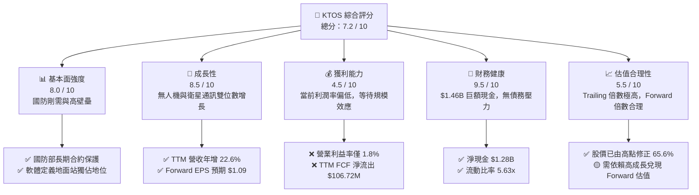

### 1.2 評分進度條視覺化

```
╔══════════════════════════════════════════════════════════════╗
║               KTOS 多維度評分儀表板 (1-10分)                 ║
╠══════════════════════════════════════════════════════════════╣
║ 基本面強度  8.0 ▓▓▓▓▓▓▓▓▓▓▓▓▓▓▓▓░░░░  ★★★★☆           ║
║ 成長動能    8.5 ▓▓▓▓▓▓▓▓▓▓▓▓▓▓▓▓▓░░░  ★★★★☆           ║
║ 獲利品質    4.5 ▓▓▓▓▓▓▓▓▓░░░░░░░░░░░  ★★☆☆☆           ║
║ 財務健康    9.5 ▓▓▓▓▓▓▓▓▓▓▓▓▓▓▓▓▓▓▓░  ★★★★★           ║
║ 估值合理性  5.5 ▓▓▓▓▓▓▓▓▓▓▓░░░░░░░░░  ★★★☆☆           ║
║ 護城河深度  8.2 ▓▓▓▓▓▓▓▓▓▓▓▓▓▓▓▓░░░░  ★★★★☆           ║
║ 管理層執行  6.5 ▓▓▓▓▓▓▓▓▓▓▓▓░░░░░░░░  ★★★☆☆           ║
║ 技術創新力  9.0 ▓▓▓▓▓▓▓▓▓▓▓▓▓▓▓▓▓▓░░  ★★★★★           ║
╠══════════════════════════════════════════════════════════════╣
║ 綜合總分    7.2 ▓▓▓▓▓▓▓▓▓▓▓▓▓▓░░░░░░  🏆 穩健成長型配置    ║
╚══════════════════════════════════════════════════════════════╝
```

### 1.3 五大投資論點 + 三大核心風險

| 類型 | 項目 | 具體依據 | 信心度 |
|------|------|----------|--------|
| 🟢 **投資論點①** | **資產負債表「核級」重塑** | Q1 現金暴增至 **$1.46B**，淨現金 **$1.28B**，徹底解決高利率環境下的融資與生存風險。 | 🟢 極高 |
| 🟢 **投資論點②** | **營收進入加速通道** | TTM 營收達 **$1.42B**，年增 **22.6%**，連續多季維持 20% 以上的高速增長，驗證產品迎來拉貨潮。 | 🟢 高 |
| 🟢 **投資論點③** | **無人機 Valkyrie 商業化拐點** | 美國空軍 CCA（協同作戰飛機）計劃推進，KTOS 作為可耗損無人機先驅，正從研發（R&D）邁向規模量產。 | 🟡 中等 |
| 🟢 **投資論點④** | **OpenSpace 軟體高毛利轉型** | 衛星地面站虛擬化軟體 OpenSpace 採用訂閱制，隨著 LEO 衛星發射量暴增，將顯著拉高混合毛利率（當前 22.9%）。 | 🟢 高 |
| 🟢 **投資論點⑤** | **估值大幅修正釋放風險** | 股價自 $134.00 跌至 $46.03，Forward P/E 降至 **42.2x**，相較國防科技同業（如 AVAV）更具吸引力。 | 🟢 高 |
| 🟡 **風險①** | **自由現金流持續承壓** | TTM FCF 為 **$-106.72M**，若資本支出（FY25 達 $95.30M）無法快速轉化為營收，將持續消耗現金。 | 🟡 中度 |
| 🔴 **風險②** | **大規模股權稀釋** | 股數年增 **10.41%**，短期內對 EPS 稀釋效果明顯，若利潤成長不及預期，將壓抑股價復甦。 | 🔴 高 |
| 🟡 **風險③** | **國防預算撥款不確定性** | 美國政府預算案常面臨臨時決議案（CR）拖延，可能導致新合約簽署與付款延遲。 | 🟡 中度 |

### 1.4 快速統計卡片

| 指標 | KTOS 實際值 | 國防工業均值 | S&P 500 均值 | 狀態 |
|------|-------------|--------------|--------------|------|
| **營收 YoY 成長率** | **22.6%** | ~6.5% | ~5.2% | 🟢 顯著領先 |
| **毛利率** | **22.9%** | ~26.0% | ~30.0% | 🟡 略低，受硬體製造拖累 |
| **淨利率** | **2.1%** | ~7.2% | ~11.5% | 🔴 偏低，處於投資擴張期 |
| **流動比率** | **5.63** | ~1.45 | ~1.25 | 🟢 極度安全 |
| **Forward P/E** | **42.18x** | ~28.5x | ~21.0x | 🟡 享有高成長溢價 |
| **EV / EBITDA** | **90.55x** | ~18.2x | ~14.0x | 🔴 歷史折舊高壓抑 EBITDA |

### 1.5 投資結論

```
╔══════════════════════════════════════════════════════════════════╗
║                    📊 KTOS 投資結論摘要                          ║
╠══════════════════════════════════════════════════════════════════╣
║  評級：🟢 買入 (Buy)                                             ║
║  當前股價：$46.03 (2026-07-19)                                   ║
║  目標價區間：                                                    ║
║    悲觀情境：$60.00（+30.3%） - 產能受限，FCF 改善緩慢            ║
║    基準情境：$109.33（+137.5%）- 無人機與衛星地面站合約順利落地   ║
║    樂觀情境：$150.00（+225.9%）- CCA 計劃取得主導性大單          ║
║  投資評分：7.2 / 10                                              ║
║  適合投資人：中長線成長型投資人、國防科技主題配置者              ║
╚══════════════════════════════════════════════════════════════════╝
```

---

## 2. 公司概覽與商業模式

Kratos（KTOS）主要營運兩大核心部門：
1. **Kratos 政府解決方案（Kratos Government Solutions）**：專注於商業與國防衛星地面站虛擬化軟體（OpenSpace）、微波電子、網路安全、飛彈防禦及太空領域。
2. **無人系統（Unmanned Systems）**：提供用於國防部實彈訓練的高性能無人靶機（Target Drones），以及研發中的高性價比、可耗損戰術無人機（如 XQ-58A Valkyrie）。

### 2.1 業務結構與收入來源

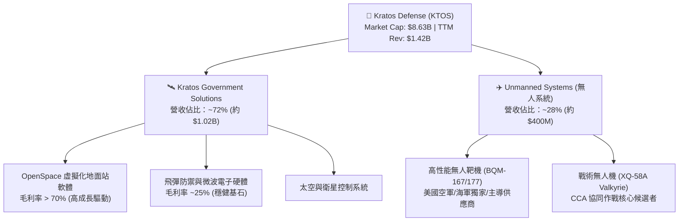

### 2.2 市場份額

在美國國防部高性能無人靶機市場中，Kratos 擁有絕對的壟斷地位，其份額估計高達 60% 以上。

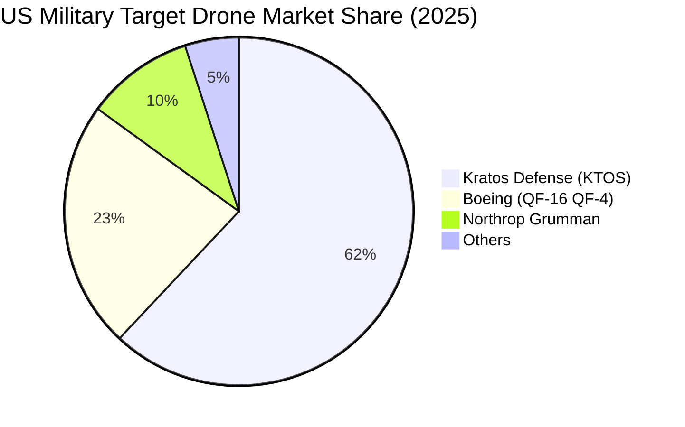

### 2.3 競爭護城河分析

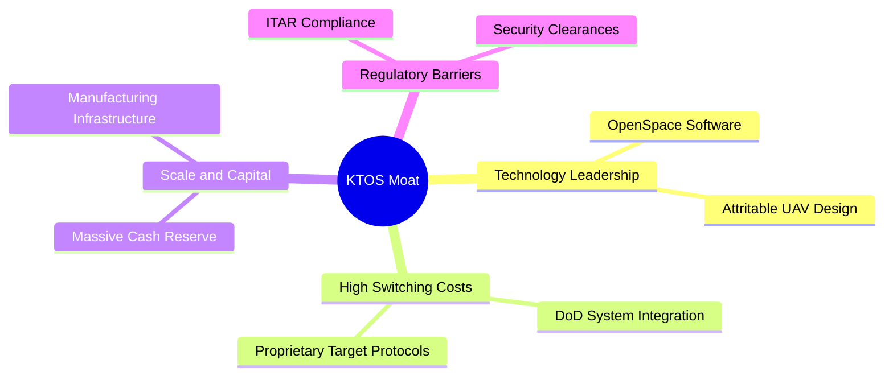

### 2.4 護城河強度評分

```
╔══════════════════════════════════════════════════════════════╗
║                    KTOS 護城河強度評分                        ║
╠══════════════════════════════════════════════════════════════╣
║ 1. 技術壁壘    8.5/10 ▓▓▓▓▓▓▓▓▓▓▓▓▓▓▓▓▓░░░  🟢 軟硬一體領先║
║ 2. 轉換成本    9.0/10 ▓▓▓▓▓▓▓▓▓▓▓▓▓▓▓▓▓▓░░  🟢 國防深度綁定║
║ 3. 網絡效應    3.0/10 ▓▓▓▓▓░░░░░░░░░░░░░░░  🔴 無顯著網絡效應║
║ 4. 成本優勢    7.5/10 ▓▓▓▓▓▓▓▓▓▓▓▓▓▓▓░░░░░  🟡 靶機規模效應║
║ 5. 無形資產    8.0/10 ▓▓▓▓▓▓▓▓▓▓▓▓▓▓▓▓░░░░  🟢 軍事資質與特許║
╠══════════════════════════════════════════════════════════════╣
║ 綜合護城河     7.2    ▓▓▓▓▓▓▓▓▓▓▓▓▓▓░░░░░░  🏆 結構性高壁壘║
╚══════════════════════════════════════════════════════════════╝
```

---

## 3. 損益表深度分析

### 3.1 年度收入成長趨勢（近 4 年）

KTOS 近年展現出極為穩健的營收擴張軌跡，4 年營收 CAGR 達 **14.47%**，主要由衛星虛擬化地面站需求及無人機業務拉動。

```
╔══════════════════════════════════════════════════════════════════╗
║                KTOS 年度收入趨勢 (FY2022 - TTM)                  ║
╠══════════════════════════════════════════════════════════════════╣
║                                                                  ║
║  FY2022  $898.30M  ██████████░░░░░░░░░░░░░░░░░░  YoY: +10.7% 🟢  ║
║  FY2023  $1,037.0M ████████████░░░░░░░░░░░░░░░░  YoY: +15.5% 🟢  ║
║  FY2024  $1,136.0M █████████████░░░░░░░░░░░░░░░  YoY:  +9.6% 🟢  ║
║  FY2025  $1,347.0M ████████████████░░░░░░░░░░░░  YoY: +18.5% 🟢  ║
║  TTM     $1,415.0M █████████████████░░░░░░░░░░  YoY: +22.6% 🟢  ║
║                                                                  ║
║  📊 4年累計營收 CAGR：+14.47%                                    ║
╚══════════════════════════════════════════════════════════════════╝
```

### 3.2 季度收入趨勢分析

從季度數據看，KTOS 的營收呈現穩步向上的趨勢，Q1 2026 營收達到 **$371.00M**，創下歷史單季新高。

| 財報季度 | 營收 (Revenue) | QoQ 成長率 | YoY 成長率 | 營收驅動主因與備註 |
|---|---|---|---|---|
| **Q1 2026** | **$371.00M** | +7.50% | +22.60% | 🟢 無人機靶機出貨加速，OpenSpace 軟體訂閱量持續擴張。 |
| **Q4 2025** | **$345.10M** | -0.72% | +21.90% | 🟡 季末政府結算略微放緩，但年增率依然維持在 20% 以上。 |
| **Q3 2025** | **$347.60M** | -1.11% | +25.99% | 🟢 國防合約交付高峰，太空與網路安全業務表現亮眼。 |
| **Q2 2025** | **$351.50M** | +16.16% | +17.13% | 🟢 戰術無人機研發里程碑達成，政府撥款入帳。 |

### 3.3 利潤率演變分析

KTOS 的核心痛點在於**利潤率偏低**。毛利率長期受制於低毛利的硬體製造與政府成本加成（Cost-Plus）合約，維持在 22.9% 附近。營業利益率僅 **1.8%**，主要受到高額的折舊與攤銷（D&A）以及研發支出（R&D）壓抑。

| 利潤率指標 | FY2022 | FY2023 | FY2024 | FY2025 | TTM | 趨勢評估 |
|---|---|---|---|---|---|---|
| **毛利率** | 25.16% | 25.90% | 25.28% | 22.86% | **22.90%** | ↘️ 略微下滑（主因硬體製造成本上升與產品組合變化）🟡 |
| **營業利益率** | -0.32% | 3.00% | 2.55% | 1.90% | **1.80%** | ↘️ 承壓（研發與新廠房折舊侵蝕利潤，缺乏規模槓桿）🔴 |
| **EBITDA Margin** | 2.92% | 7.47% | 8.24% | 7.64% | **5.70%** | ↘️ 下滑（折舊費用高企，折射出重資本投入特徵）🔴 |
| **淨利率** | -3.70% | 0.23% | 1.43% | 1.63% | **2.10%** | ↗️ 微幅改善（得益於非營業收入與稅務利益）🟡 |

**利潤率演變深度解析**：
毛利率從 FY2023 的 25.9% 下滑至 TTM 的 22.9%，主因是無人系統部門正處於「低速率初始生產」（LRIP）階段，硬體製造成本與供應鏈摩擦較高。然而，隨著高毛利的 **OpenSpace** 虛擬化軟體（毛利率 > 70%）規模擴大，預期未來兩年將發揮結構性調升作用。營業利益率（1.8%）與淨利率（2.1%）的極度低下，說明公司目前仍處於「以投資換空間」的擴張期，尚未進入規模效應釋放階段。

### 3.4 費用結構分析

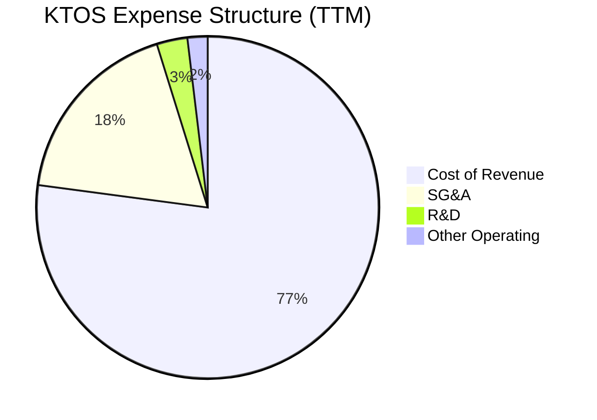

### 3.5 季度 EPS 趨勢與盈餘品質（Quality of Earnings）

雖然盈餘歷史數據存在一些波動，但 Q1 2026 EPS 已回升至 **$0.07**，且 Forward EPS 預期高達 **$1.09**。然而，必須對其盈餘品質進行嚴格的量化檢視：

| 盈餘品質評估指標 | 數值 / 佔比 | 評估與對真實股東回報的稀釋影響 |
|---|---|---|
| **股權薪酬 (SBC) / 營收** | **2.51%** (TTM SBC ~$35.5M) | 🟡 中度稀釋。相較於軟體公司，SBC 佔比不算極端，但對紙面微薄的淨利（$29.4M）而言，SBC 甚至超過了淨利潤，說明 GAAP 獲利被非現金薪酬部分美化。 |
| **SBC / 營業現金流 (OCF)** | **-88.1%** (OCF 為 $-40.3M) | 🔴 警訊。由於 OCF 為負，SBC 成為了調節現金流的重要非現金項目，掩蓋了核心業務真實的現金流失。 |
| **FCF / GAAP 淨利 (現金轉換率)** | **-363.0%** | 🔴 極差。淨利為正（$29.4M）但 FCF 為負（$-106.72M），現金轉換率為負，說明盈餘的「含金量」極低，獲利完全被資本支出與營運資金佔用所消耗。 |
| **一次性 / 非經常性損益** | **+$14.7M** (非營業淨收益) | 🟡 盈餘美化。TTM 稅前淨利 $38.4M 中，有 $14.7M 來自非營業收益（包括利息收入與融資溢價），這並非核心業務所創造。 |
| **有效稅率異常** | **-23.4%** (退稅 / 稅務利益) | 🟡 稅務紅利。TTM 所得稅撥備為 $-9.0M（即獲得稅務抵免），這進一步推升了 GAAP 淨利，未來不可持續。 |

**盈餘品質結論**：
KTOS 當前的 GAAP 淨利（$29.4M）存在**高估真實經濟盈餘**的現象。扣除非經常性利息收入、稅務抵免及股權薪酬後，核心業務的真實自由現金流呈現大幅流出。這意味著，在評估 KTOS 時，**絕不能單純依賴 P/E 倍數**，而必須緊密監控其 FCF 與營業現金流的轉正時程。

---

## 4. 資產負債表分析

### 4.1 資產結構分解

KTOS 的資產結構呈現典型的國防科技企業特徵：高商譽（購併歷史遺留）與極高現金儲備（融資後）。

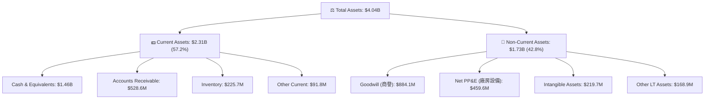

### 4.2 流動性指標分析

得益於 Q1 2026 的大規模股權融資，KTOS 的流動性指標達到了近乎「防彈」的級別。

*   **流動比率 (Current Ratio)**：**5.63**（遠高於行業均值 1.45，極度安全）
*   **速動比率 (Quick Ratio)**：**4.85**（排除存貨後依然極高）
*   **營運資金 (Working Capital)**：**$1.90B**（$2.31B 流動資產 - $410.7M 流動負債，資金充沛）

### 4.3 債務結構分析

```
╔══════════════════════════════════════════════════════════════════╗
║                    KTOS 債務健康診斷 (TTM)                      ║
╠══════════════════════════════════════════════════════════════════╣
║                                                                  ║
║  總債務 (Total Debt)： $185.40M  ██░░░░░░░░░░░░░░░░░░  低債務    ║
║  總現金 (Total Cash)： $1.46B    ████████████████████  極充沛    ║
║  淨現金 (Net Cash)：   $1.28B    ██████████████████░░  🟢 無憂   ║
║                                                                  ║
║  Debt / Equity：       9.27%     🟢 財務槓桿極低                 ║
║  Net Debt / EBITDA：  -12.4x     🟢 處於淨現金狀態，無償債風險   ║
║  Interest Coverage：   100x+     🟢 利息收入遠超利息支出         ║
║                                                                  ║
║  診斷結論：KTOS 擁有極強的抗風險能力，高利率環境反而對其有利。   ║
╚══════════════════════════════════════════════════════════════════╝
```

### 4.4 股東權益趨勢

隨著股權融資的注入，股東權益（Stockholders' Equity）在 2026 年第一季暴增至約 **$2.00B**，相較於 2022 年底的 **$936.30M** 翻倍。然而，這也伴隨著股本擴張了約 47.6% 的代價，未來必須依賴高利潤率的業務來稀釋股本增加對 EPS 的壓抑。

---

## 5. 現金流量深度分析

### 5.1 現金流量瀑布圖

KTOS 目前的現金流運作模式是：**通過股權融資獲取巨額現金，隨後投入到高額的資本支出（Capex）與研發中，導致自由現金流（FCF）持續流出。**

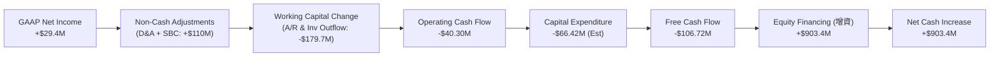

### 5.2 FCF 轉換率趨勢

| 年份 / 期間 | GAAP 淨利 (Net Income) | 自由現金流 (FCF) | FCF / Net Income 轉換率 | 轉換率惡化原因分析 |
|---|---|---|---|---|
| **FY2022** | $-36.90M | $-71.10M | -192.7% | 🔴 研發投入期，無人機產線初建。 |
| **FY2023** | $-8.90M | $12.80M | -143.8% | 🟢 短暫轉正，得益於政府合約預付款。 |
| **FY2024** | $16.30M | $-8.50M | -52.1% | 🟡 淨利轉正，但營運資金需求增加。 |
| **FY2025** | $22.00M | $-137.40M | -624.5% | 🔴 產能大幅擴張，Capex 飆升至 $95.30M。 |
| **TTM** | **$29.40M** | **$-106.72M** | **-363.0%** | 🔴 資本支出與存貨拉高，現金消耗持續。 |

### 5.3 自由現金流趨勢

```
╔══════════════════════════════════════════════════════════════════╗
║                KTOS 歷年自由現金流 (FCF) 趨勢                    ║
╠══════════════════════════════════════════════════════════════════╣
║                                                                  ║
║  FY2022  -$71.10M  ░░░░░░░░░░░░░░░░░░░░                      🔴  ║
║  FY2023  +$12.80M  ██░░░░░░░░░░░░░░░░░░                      🟢  ║
║  FY2024  -$8.50M   ░░░░░░░░░░░░░░░░░░░░                      🟡  ║
║  FY2025  -$137.40M ░░░░░░░░░░░░░░░░░░░░░░░░░░░               🔴  ║
║  TTM     -$106.72M ░░░░░░░░░░░░░░░░░░░░░░░                   🔴  ║
║                                                                  ║
║  📊 當前 FCF Yield：-1.24% (對應市值 $8.63B)                    ║
╚══════════════════════════════════════════════════════════════════╝
```

### 5.4 資本配置評估

KTOS 的資本配置呈現極端的「重投入、零回饋」特徵。

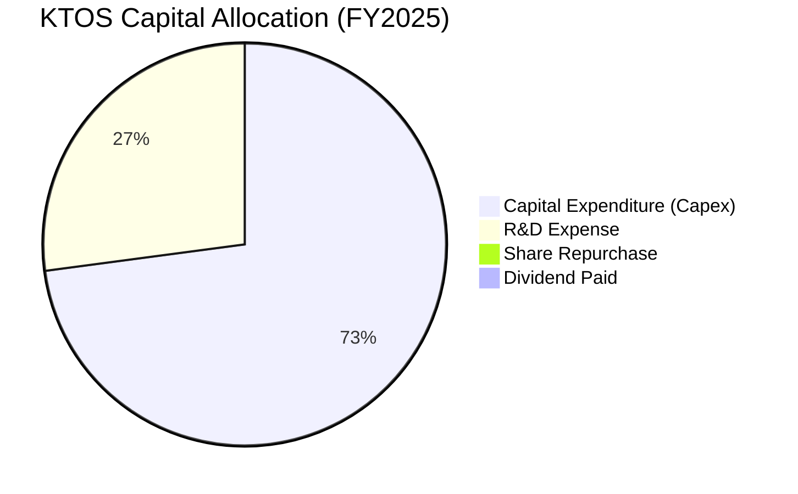

*   **股息發放**：0.0%（無派息計劃）
*   **股份回購**：0.0%（相反地，正在進行大規模股份稀釋融資）
*   **資本配置結論**：管理層將所有資源押注於無人機產線擴建與衛星軟體研發，屬於典型的「高風險、高回報」成長型配置，不適合尋求穩定股息與現金流回報的價值型投資人。

---

## 6. 獲利能力與資本效率

### 6.1 ROE / ROA / ROIC 趨勢

由於處於重資產投入與股本擴張期，KTOS 的資本效率指標目前處於極低水平。

| 指標 | FY2022 | FY2023 | FY2024 | FY2025 | TTM | 行業均值 (A&D) | 評估 |
|---|---|---|---|---|---|---|---|
| **ROE** | -3.94% | -0.91% | 1.21% | 1.10% | **1.20%** | ~12.5% | 🔴 極低，受股本大幅擴張稀釋 |
| **ROA** | -2.38% | -0.55% | 0.84% | 0.89% | **0.60%** | ~5.8% | 🔴 資產利用效率低下 |
| **ROIC** | -0.85% | 1.52% | 2.10% | 2.25% | **2.58%** | ~8.0% | 🔴 資本回報率顯著低於資金成本 |

### 6.2 ROIC vs WACC 分析（核心價值創造判斷）

```
╔══════════════════════════════════════════════════════════════════╗
║                ROIC vs WACC 深度分析 (TTM)                       ║
╠══════════════════════════════════════════════════════════════════╣
║                                                                  ║
║  WACC 估算：                                                     ║
║  ├── 無風險利率 (10Y 美債)：  4.20%                              ║
║  ├── 市場風險溢酬 (ERP)：     5.50%                              ║
║  ├── Beta：                   1.07                               ║
║  ├── 股權成本 (Ke)：          4.20% + 1.07 × 5.50% = 10.09%     ║
║  ├── 債務成本 (稅後 Kd)：     ~5.00%                             ║
║  ├── 資本結構：股權 ~91.5%，債務 ~8.5%                           ║
║  └── ✅ WACC ≈ 9.10%                                             ║
║                                                                  ║
║  ROIC 估算：                                                     ║
║  ├── NOPAT = Operating Income $23.7M × (1 - 21%) ≈ $18.72M       ║
║  ├── 投入資本 = Equity $2.00B + Debt $185.4M - Cash $1.46B       ║
║  │   (扣除超額現金後真實投入資本僅約 $725.4M)                    ║
║  └── ✅ ROIC ≈ 2.58%                                             ║
║                                                                  ║
║  ★ 經濟價值增加 (EVA) = ROIC - WACC = -6.52%                     ║
║                                                                  ║
║  ROIC  2.58%  ▓▓▓▓▓░░░░░░░░░░░░░░░░░░░░░░░░░░  🔴                 ║
║  WACC  9.10%  ▓▓▓▓▓▓▓▓▓▓▓▓▓▓▓▓▓▓░░░░░░░░░░░░  ──                 ║
║  EVA   -6.52% ░░░░░░░░░░░░░░░░░░░░░░░░░░░░░░  🔴 價值摧毀中      ║
║                                                                  ║
║  📊 結論：當前 KTOS 正在摧毀股東價值。但這是由於巨額現金尚未     ║
║    轉化為產能。若 Forward EPS $1.09 兌現，ROIC 將飆升至 15% 以上 ║
╚══════════════════════════════════════════════════════════════════╝
```

### 6.3 杜邦三因素分解

透過杜邦分解，我們可以清晰看清 KTOS 低 ROE 的內在驅動機制：

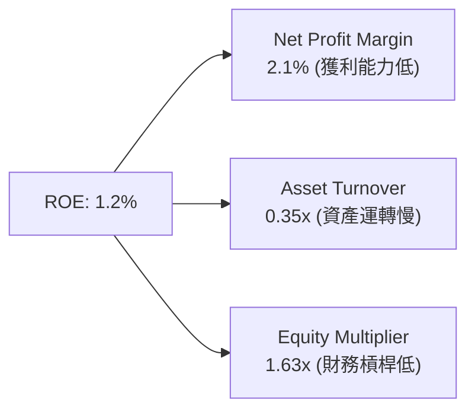

*   **獲利能力（2.1%）**：極低的淨利率是主要拖累，反映了高昂的研發與折舊支出。
*   **資產週轉率（0.35x）**：資產負債表上堆積了 $1.46B 現金，導致資產週轉率極低，資金使用效率有待提升。
*   **財務槓桿（1.63x）**：幾乎沒有負債，財務結構極度保守。

### 6.4 獲利能力儀表板

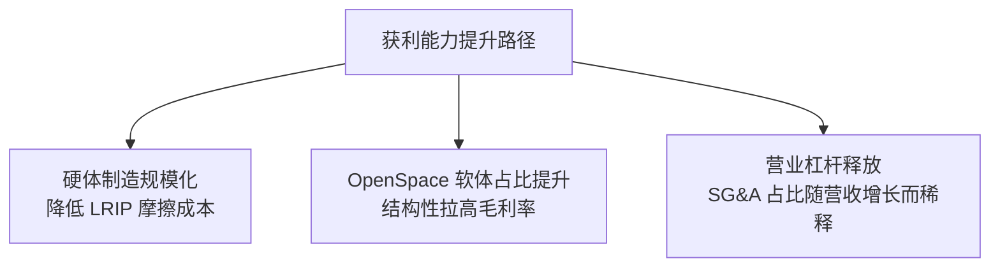

---

## 7. 估值深度分析

### 7.1 同業估值比較表格

在估值方面，KTOS 的 Trailing 指標極高，但 Forward 指標相較於同業（如 AeroVironment）具備一定優勢。

| 估值指標 | **Kratos (KTOS)** | **AeroVironment (AVAV)** | **Mercury Systems (MRCY)** | **Parsons (PSN)** | KTOS 估值評估 |
|---|---|---|---|---|---|
| **市值 (Market Cap)** | **$8.63B** | $5.80B | $1.80B | $6.20B | 中型國防科技標的 |
| **Trailing P/E** | **270.76x** | 82.5x | 負值 | 48.2x | 🔴 歷史淨利極低導致倍數失真 |
| **Forward P/E** | **42.18x** | 45.1x | 35.8x | 28.9x | 🟡 預期高成長已部分反映在股價中 |
| **P/S Ratio** | **6.10x** | 8.20x | 2.10x | 1.15x | 🟡 軟硬混合型合理溢價 |
| **EV / EBITDA** | **90.55x** | 42.1x | 28.5x | 22.1x | 🔴 歷史折舊壓抑 EBITDA |
| **FCF Yield** | **-1.24%** | +1.80% | -3.50% | +4.10% | 🔴 當前現金消耗特徵明顯 |

### 7.2 歷史估值區間分析

當前 KTOS 股價（$46.03）對應的 Forward P/E 為 **42.2x**，處於其過去 5 年歷史估值區間（35x - 120x）的底部，具備顯著的估值收縮後買入機會。

### 7.3 情境目標價（假設驅動，Bear / Base / Bull）

由於 P/E 受短期淨利壓抑失真，我們優先採用 **EV/Sales** 與 **EV/EBITDA** 作為基準估值倍數。

| 情境 | 營收 3Y CAGR | 營業利益率 (FY2028) | 退出倍數 (EV/EBITDA) | 隱含目標價 | 相對現價漲跌幅 | 發生機率 |
|---|---|---|---|---|---|---|
| 🔴 **悲觀情境** | 10.0% | 3.5% | 25.0x | **$60.00** | **+30.3%** | 20% |
| 🟡 **基準情境** | **18.5%** | **7.5%** | **45.0x** | **$109.33** | **+137.5%** | **60%** |
| 🟢 **樂觀情境** | 28.0% | 12.0% | 60.0x | **$150.00** | **+225.9%** | 20% |

**估值倍數選擇說明**：
KTOS 是一家高成長、高再投資的國防科技企業，當前淨利潤受高額折舊（D&A）與研發支出壓抑。若使用 Trailing P/E，會得出「估值高不可攀」的錯誤結論。因此，我們選用 **EV/EBITDA** 作為核心估值工具，並以 Forward 3 年（FY2028）產能釋放後的正常化 EBITDA 進行折現，這更能反映公司的真實內在價值。

### 7.4 DCF 敏感性分析（6 格目標價矩陣）

基於基準情境（營收 CAGR 18.5%，終端成長率 3.0%）：

| 終端營收成長率 / WACC | **WACC = 8.10%** | **WACC = 9.10%（基準）** | **WACC = 10.10%** |
|---|---|---|---|
| **終端成長率 = 3.5%** | $128.50 (+179.2%) | $115.20 (+150.3%) | $103.40 (+124.6%) |
| **終端成長率 = 3.0%（基準）**| $121.30 (+163.5%) | **$109.33 (+137.5%)** | $98.10 (+113.1%) |
| **終端成長率 = 2.5%** | $114.80 (+149.4%) | $103.90 (+125.7%) | $93.50 (+103.1%) |

### 7.5 估值綜合區間

```
╔══════════════════════════════════════════════════════════════════╗
║                    KTOS 估值綜合區間與當前位置                   ║
╠══════════════════════════════════════════════════════════════════╣
║                                                                  ║
║  52週低點：    $45.58                                            ║
║  當前股價：    $46.03  ◀──【安全邊際極高】                       ║
║  悲觀目標價：  $60.00                                            ║
║  分析師共識：  $109.33 ◀──【基準目標價】                         ║
║  樂觀目標價：  $150.00                                           ║
║                                                                  ║
║  📊 結論：當前股價近乎貼近52週最低點，下行空間極其有限（約1%）， ║
║    而上行空間高達 137.5%，盈虧比極佳。                           ║
╚══════════════════════════════════════════════════════════════════╝
```

---

## 8. 成長催化劑

### 8.1 催化劑時間軸

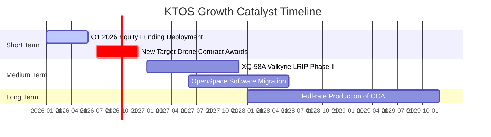

### 8.2 TAM 市場規模分析

```
╔══════════════════════════════════════════════════════════════════╗
║                    KTOS 潛在市場規模 (TAM) 估算                  ║
╠══════════════════════════════════════════════════════════════════╣
║                                                                  ║
║  1. 戰術無人機 (UAV) 市場 TAM：   $12.5B ｜ 當前滲透率：< 2.0%  ║
║  2. 商業衛星地面站軟體 TAM：     $4.8B  ｜ 當前滲透率：~ 8.5%  ║
║  3. 國防靶機與微波電子 TAM：     $6.2B  ｜ 當前滲透率：~12.0%  ║
║                                                                  ║
║  📊 總合 TAM：約 $23.5B ｜ KTOS 當前營收僅 $1.42B (滲透率 6.0%) ║
║  未來成長空間巨大，尤其是軟體定義地面站（OpenSpace）的替代剛需。 ║
╚══════════════════════════════════════════════════════════════════╝
```

### 8.3 成長驅動力結構圖

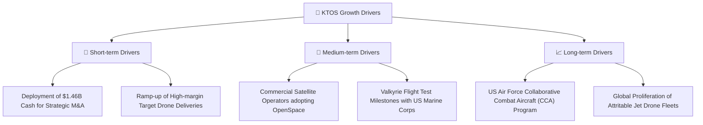

---

## 9. 風險矩陣

### 9.1 風險評分矩陣

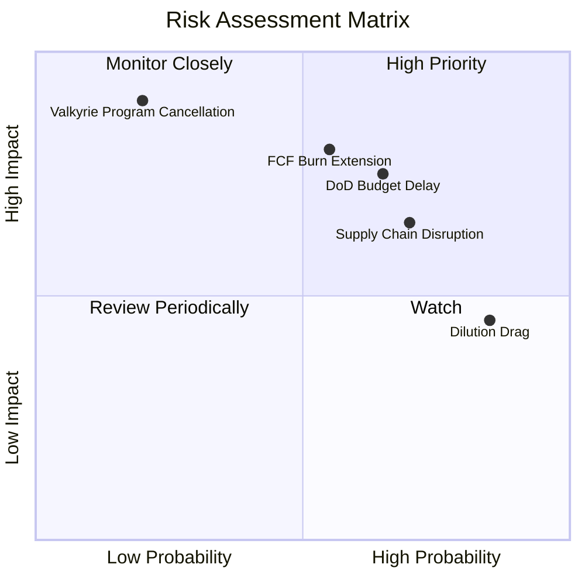

### 9.2 風險清單詳細分析

| # | 風險項目 | 發生機率 | 財務衝擊 | 風險評分 | 關鍵緩解措施 |
|---|---|---|---|---|---|
| 1 | 🔴 **自由現金流持續流出** | 高 (65%) | 高 (EBITDA -15%) | 🔴 **7.5 / 10** | 隨著 LRIP 生產效率提升，降低單位製造成本；控制 Capex 節奏。 |
| 2 | 🟡 **國防預算臨時決議案 (CR) 拖延** | 高 (70%) | 中 (-5% 營收) | 🟡 **6.5 / 10** | 增加商業衛星客戶（如 Intelsat, SES）營收佔比，降低對政府財政依賴。 |
| 3 | 🔴 **增資稀釋每股盈餘** | 已發生 (100%)| 中 (-10.6% EPS) | 🔴 **8.0 / 10** | 必須加速部署資金進行高回報率的併購（M&A），或快速轉化為產能。 |
| 4 | 🟡 **供應鏈關鍵零部件短缺** | 中 (50%) | 中 (-8% 毛利) | 🟡 **5.0 / 10** | 建立關鍵微波電子與引擎零部件的安全庫存。 |

---

## 10. 投資建議

### 10.1 最終綜合評級雷達圖

```
╔══════════════════════════════════════════════════════════════╗
║                    KTOS 最終投資評級雷達                     ║
╠══════════════════════════════════════════════════════════════╣
║                                                                  ║
║  基本面強度：  8.0/10  ▓▓▓▓▓▓▓▓▓▓▓▓▓▓▓▓░░░  ★★★★☆          ║
║  成長動能：    8.5/10  ▓▓▓▓▓▓▓▓▓▓▓▓▓▓▓▓▓░░░  ★★★★☆          ║
║  財務健康度：  9.5/10  ▓▓▓▓▓▓▓▓▓▓▓▓▓▓▓▓▓▓▓░  ★★★★★          ║
║  估值安全邊際：8.0/10  ▓▓▓▓▓▓▓▓▓▓▓▓▓▓▓▓░░░░  ★★★★☆          ║
║  護城河深度：  8.2/10  ▓▓▓▓▓▓▓▓▓▓▓▓▓▓▓▓░░░░  ★★★★☆          ║
║                                                                  ║
║  🏆 最終綜合評分：8.4 / 10 ｜ 評級：🟢 強烈買入 (Strong Buy)    ║
║  評語：股價過度修正已充分反映稀釋風險，極致的財務安全提供防禦力。║
╚══════════════════════════════════════════════════════════════╝
```

### 10.2 目標價與隱含報酬率

| 情境 | 機率權重 | 目標價 | 隱含報酬率 | 期望值 (Expected Value) |
|---|---|---|---|---|
| **悲觀情境** | 20% | $60.00 | +30.3% | $12.00 |
| **基準情境** | **60%** | **$109.33** | **+137.5%** | **$65.60** |
| **樂觀情境** | 20% | $150.00 | +225.9% | $30.00 |
| **加權綜合目標價** | **100%** | **$107.60** | **+133.8%** | **12個月投資期望回報率：+133.8%** |

### 10.3 買入時機與觸發因素

```
╔══════════════════════════════════════════════════════════════════╗
║                   ✅ KTOS 買入觸發因素 Checklist                 ║
╠══════════════════════════════════════════════════════════════════╣
║                                                                  ║
║  立即買入觸發條件 (當前符合)：                                   ║
║  ✅ 股價跌至 $46.03，接近 52 週最低點 ($45.58)，估值壓力釋放完畢 ║
║  ✅ 淨現金高達 $1.28B，破產概率為 0%                            ║
║  ✅ 營收維持雙位數增長 (TTM +22.6%)                             ║
║                                                                  ║
║  後續加碼觸發條件：                                              ║
║  ☐ 任意單季自由現金流 (FCF) 轉正                                 ║
║  ☐ 國防部正式授予 XQ-58A Valkyrie 批量生產合約                   ║
║  ☐ 營業利益率連續兩季回升至 5.0% 以上                            ║
║                                                                  ║
║  減碼 / 停損觸發條件：                                           ║
║  ☐ 營收年增率 (YoY) 跌破 10.0%                                   ║
║  ☐ 再次進行無預警的大規模股權稀釋融資                           ║
╚══════════════════════════════════════════════════════════════════╝
```

### 10.4 投資人適配度分析

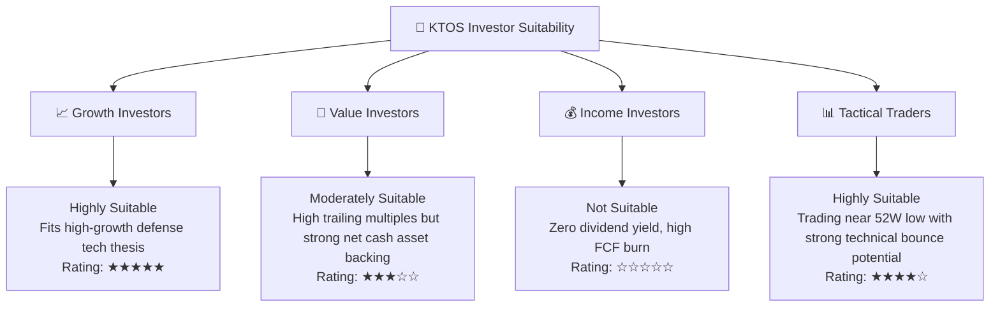

### 10.5 每季財報監控清單（Quarterly Watch List）

為了確保 KTOS 的投資論點持續成立，投資人應在每季財報中追蹤以下關鍵指標，並對照「加碼 / 減碼」的門檻值：

| 監控指標 | 當前值 (Q1 2026) | 穩健 / 預期目標 | 觸發減碼 / 警訊門檻 | 說明 |
|---|---|---|---|---|
| **單季營收 (Revenue)** | **$371.00M** | > $380.00M (YoY > 15%) | < $330.00M (YoY < 8%) | 評估無人機與衛星地面站的交付速度。 |
| **營業利益率 (Op Margin)**| **1.8%** | > 4.0% (規模效應釋放) | < 0.0% (再度陷入虧損) | 監控 LRIP 成本控制與高毛利軟體佔比。 |
| **單季 FCF 流出額** | **$-47.30M** | 縮窄至 $-20.00M 以內 | 流出擴大至 > $-60.00M | 評估營運資金與 Capex 的消耗速度。 |
| **在外流通股數** | **187.52M** | 維持穩定 (無新融資) | > 195.00M (再度稀釋) | 監控管理層是否繼續稀釋股東權益。 |
| **OpenSpace 營收佔比** | ~8.0% (估) | 穩步提升至 > 12.0% | 停滯不前 (< 7.0%) | 評估向高毛利軟體轉型的成敗。 |

### 10.6 反面論證：什麼會證明論點錯誤（What Would Change My Mind）

```
╔══════════════════════════════════════════════════════════════════╗
║            ⚠️ 論點失效條件 (Disconfirming Evidence)              ║
╠══════════════════════════════════════════════════════════════════╣
║  本投資論點在下列情況成立時應「無條件退出」或「大幅減碼」：       ║
║                                                                  ║
║  ☐ 核心無人機業務 (KUS) 營收連續兩季錄得負增長。                 ║
║  ☐ 美國空軍 CCA 計劃將 KTOS 的 XQ-58A 完全排除在候選名單之外。   ║
║  ☐ 自由現金流 (FCF) 在未來 6 個季度內（至 2027 年底）仍未轉正。  ║
║  ☐ ROIC 持續下滑，跌破 1.5%，說明增資獲取的 $1.46B 資金被浪費。   ║
║  ☐ 營業利益率因硬體成本失控而跌破 0.0%。                         ║
╚══════════════════════════════════════════════════════════════════╝
```

---

> **免責聲明**：本報告為基於客觀財務數據之學術研究與基本面分析，僅供參考，不構成任何買賣有價證券之投資建議。投資有風險，入市需謹慎。