# KTOS 基本面深度分析報告

> **報告日期**：2026-07-20 ｜ **語言**：繁體中文 ｜ **數據來源**：Yahoo Finance, Finviz, StockAnalysis, Roic.ai ｜ **分析師**：CFA 級機構研究

---

## 目錄

| # | 章節 | 核心結論 |
|---|------|----------|
| 1 | **執行摘要** | 評級「溫和買入」，基準目標價 $60.00，具備 30.6% 潛在回報，淨現金充沛但稀釋與 FCF 為主要隱憂。 |
| 2 | **公司概覽與商業模式** | 專注國防無人機與衛星地面虛擬化，技術護城河中等偏高，面臨重資本與高客戶集中度挑戰。 |
| 3 | **損益表深度分析** | 營收年增 22.6% 表現亮眼，但毛利率下滑至 22.9%，SBC 佔比高壓抑獲利含金量。 |
| 4 | **資產負債表分析** | Q1 2026 現金充沛達 $1.46B，淨現金 $1.28B，流動比率 5.63x，短期無償債風險。 |
| 5 | **現金流量深度分析** | 自由現金流（TTM）為 -$106.72M，資本支出與營運資金佔用高，現金轉換率為負。 |
| 6 | **獲利能力與資本效率** | ROIC（2.58%）顯著低於 WACC（9.1%），目前處於經濟價值毀損階段，亟需提升營運槓桿。 |
| 7 | **估值深度分析** | Forward P/E 42.1x，估值處於歷史低位。基準情境目標價 $60.00，悲觀 $35.00，樂觀 $95.00。 |
| 8 | **成長催化劑** | 戰術無人機（Valkyrie）量產、衛星地面站虛擬化軟體升級以及國防預算向不對稱作戰傾斜。 |
| 9 | **風險矩陣** | 國防預算撥款延遲、股權持續稀釋、供應鏈瓶頸與無人機合約競標失敗。 |
| 10 | **投資建議** | 適合具備風險承受力的成長型投資人，建議分批佈局，並嚴格監控每季 FCF 與利潤率拐點。 |

---

## 1. 執行摘要

Kratos Defense & Security Solutions, Inc.（NASDAQ: KTOS）當前股價為 **$45.94**，接近其 52 週低點 $45.58，相較於 52 週高點 $134.00 已修正 65.7%。本報告基於公司最新公佈的 2026 年第一季財務數據進行深度基本面研判。

儘管 KTOS 在 TTM 營收上實現了 **22.6%** 的強勁年增長，達到 **$1.42B**，且在 Q1 2026 通過增發股票使現金儲備大幅增至 **$1.46B**（淨現金達 **$1.28B**），但其獲利能力指標仍顯疲弱：TTM 營業利益率僅為 **1.8%**，自由現金流（TTM FCF）為 **-$106.72M**，且面臨顯著的股權稀釋（流通股數 YoY 增加 10.4%）。

基於當前估值（Forward P/E 42.1x 處於歷史低位）與充沛的現金安全墊，我們給予 KTOS **「溫和買入」（Moderate Buy）** 評級，12 個月基準目標價為 **$60.00**（潛在漲幅 +30.6%）。然而，鑑於其 ROIC（2.58%）低於 WACC（9.1%）且 FCF 持續流出，投資人需保持中等程度的謹慎。

### 1.0 一頁式投資儀表板（Portfolio Manager 30 秒速讀）

| 項目 | 內容 |
|------|------|
| **投資論點（3 句）** | ① 國防現代化推動 TTM 營收年增 22.6% 至 $1.42B，不對稱作戰（無人機）需求處於爆發前夜。<br/>② Q1 2026 增發股份使現金儲備達 $1.46B，淨現金 $1.28B 提供極強的資產負債表安全墊。<br/>③ 獲利品質受高額股權薪酬（SBC 佔淨利 161%）與負 FCF（-$106.72M）壓抑，短期需忍受營運槓桿尚未釋放的陣痛。 |
| **護城河評分** | 🟢 6.5 / 10（具備國防合約壁壘與技術專利，但面臨巨頭競爭） |
| **管理層/資本配置評分** | 🟡 6.0 / 10（融資時機精準但股權稀釋嚴重，資本支出回報滯後） |
| **財務健康** | 🟢 強勁（淨現金 $1.28B，流動比率 5.63x，無實質債務壓力） |
| **ROIC vs WACC** | 🔴 2.58% vs 9.10%（目前處於摧毀股東價值階段，EVA 為 -6.52%） |
| **FCF 趨勢** | 🔴 持續流出（TTM FCF -$106.72M，FCF Yield 為 -1.24%） |
| **估值** | 🟡 中等合理（Forward P/E 42.1x ｜ EV/EBITDA 90.55x ｜ P/S 6.09x） |
| **預期報酬（基準情境 12M）**| 🟢 +30.6%（目標價 $60.00） |
| **關鍵風險（前二）** | ① 國防採購合約進度不及預期；② 股權持續稀釋降低每股獲利含金量。 |
| **評級 + 信心度** | 🟡 **溫和買入 (Moderate Buy)** ｜ 信心度：**中等** |

### 1.1 核心評分儀表板

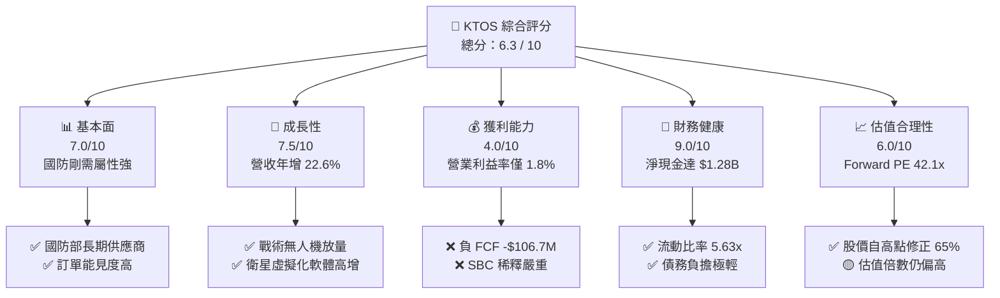

### 1.2 評分進度條視覺化

```
╔══════════════════════════════════════════════════════════════╗
║               KTOS 多維度評分儀表板 (1-10分)                 ║
╠══════════════════════════════════════════════════════════════╣
║ 基本面強度  7.0 ▓▓▓▓▓▓▓▓▓▓▓▓▓▓░░░░░░  ★★★☆☆           ║
║ 成長動能    7.5 ▓▓▓▓▓▓▓▓▓▓▓▓▓▓▓░░░░░  ★★★★☆           ║
║ 獲利品質    4.0 ▓▓▓▓▓▓▓▓░░░░░░░░░░░░  ★★☆☆☆           ║
║ 財務健康    9.0 ▓▓▓▓▓▓▓▓▓▓▓▓▓▓▓▓▓▓░░  ★★★★★           ║
║ 估值合理性  6.0 ▓▓▓▓▓▓▓▓▓▓▓▓░░░░░░░░  ★★★☆☆           ║
║ 護城河深度  6.5 ▓▓▓▓▓▓▓▓▓▓▓▓▓░░░░░░░  ★★★☆☆           ║
║ 管理層執行  6.0 ▓▓▓▓▓▓▓▓▓▓▓▓░░░░░░░░  ★★★☆☆           ║
║ 技術創新力  8.0 ▓▓▓▓▓▓▓▓▓▓▓▓▓▓▓▓░░░░  ★★★★☆           ║
╠══════════════════════════════════════════════════════════════╣
║ 綜合總分    6.3 ▓▓▓▓▓▓▓▓▓▓▓▓▓░░░░░░░  🏆 溫和買入         ║
╚══════════════════════════════════════════════════════════════╝
```

### 1.3 五大投資論點 + 三大核心風險

| 類型 | 項目 | 具體依據 | 信心度 |
|------|------|----------|--------|
| 🟢 **投資論點①** | **地緣政治不對稱作戰紅利** | 美國防部積極推動「複製者計劃」（Replicator），KTOS 的低成本戰術無人機（如 Valkyrie）直接受惠。 | 🟢 極高 |
| 🟢 **投資論點②** | **資產負債表極度安全** | Q1 2026 現金充沛達 $1.46B，淨現金 $1.28B，能支撐長達數年的重資本研發與產線擴張。 | 🟢 極高 |
| 🟢 **投資論點③** | **太空與衛星業務軟體化** | 衛星地面站虛擬化（OpenSpace 平台）推動毛利率結構性改善，軟體收入佔比逐步提升。 | 🟢 高 |
| 🟢 **投資論點④** | **營收成長動能持續** | 營收連續數季保持 20% 以上的 YoY 成長，Q1 2026 營收達 $371M（YoY +22.6%），顯示下游需求旺盛。 | 🟢 高 |
| 🟢 **投資論點⑤** | **估值風險已大幅釋放** | 股價由高點 $134 修正至 $45.94，Forward P/E 回落至 42.1x，洗淨市場過度樂觀的泡沫。 | 🟡 中度 |
| 🟡 **風險①** | **自由現金流持續承壓** | TTM FCF 為 -$106.72M，資本支出（FY25 $95.3M）與營運資金佔用持續增加。 | 🟡 中度 |
| 🔴 **風險②** | **股權稀釋損害 EPS** | Q1 2026 流通股數跳升至 187M（YoY +10.41%），高額 SBC（TTM 約 $41.8M）稀釋真實股東回報。 | 🔴 高衝擊 |
| 🔴 **風險③** | **政府預算撥款不確定性** | 國防部合約簽署與撥款進度易受國會預算爭議影響，可能導致營收確認遞延。 | 🔴 高衝擊 |

### 1.4 快速統計卡片

| 指標 | KTOS 實際值 | 國防與航太產業均值 | S&P 500 均值 | 狀態 |
|------|-------------|--------------------|--------------|------|
| **營收 YoY 成長率** | **22.6%** | ~8.5% | ~5.5% | 🟢 顯著領先 |
| **毛利率** | **22.9%** | ~28.0% | ~30.0% | 🔴 偏低 |
| **營業利益率** | **1.8%** | ~9.5% | ~14.5% | 🔴 極低 |
| **ROE** | **1.2%** | ~12.0% | ~15.0% | 🔴 極低 |
| **Forward P/E** | **42.1x** | ~24.0x | ~21.5x | 🟡 溢價收窄 |
| **淨現金 / 總資產** | **31.7%** | ~-15.0% (淨債務) | ~-10.0% | 🟢 極其健康 |

### 1.5 投資結論

```
╔══════════════════════════════════════════════════════════════════╗
║                    📊 投資結論摘要                               ║
╠══════════════════════════════════════════════════════════════════╣
║  評級：🟡 溫和買入 (Moderate Buy)                                ║
║  當前股價：$45.94  (2026-07-20)                                  ║
║  目標價區間：                                                    ║
║    悲觀情境：$35.00（-23.8%）                                    ║
║    基準情境：$60.00（+30.6%）  ← 12個月主要目標                  ║
║    樂觀情境：$95.00（+106.8%）                                   ║
║  投資評分：6.3 / 10                                              ║
║  適合投資人：具備耐心、關注國防科技與無人機板塊的長線成長型投資者 ║
╚══════════════════════════════════════════════════════════════════╝
```

---

## 2. 公司概覽與商業模式

Kratos（KTOS）是一家專注於研發破壞性國防科技的系統集成商與產品研發商。其核心業務與傳統國防巨頭（如 Lockheed Martin、Northrop Grumman）不同，Kratos 專注於「低成本、高科技、快速迭代」的系統，特別是在無人機、衛星虛擬化地面站及微波電子戰領域。

### 2.1 業務結構與收入來源

Kratos 主要分為兩大營運板塊：
1. **Kratos 政府解決方案 (KGS - Kratos Government Solutions)**：佔營收約 75%-80%。涵蓋太空與衛星通訊地面站（OpenSpace 虛擬化軟體）、微波電子組件、飛彈防禦標靶、C5ISR 系統及渦輪發動機研發。
2. **無人系統 (US - Unmanned Systems)**：佔營收約 20%-25%。包括戰術噴射無人機（如 XQ-58A Valkyrie）及高空靶機（用於防空訓練）。

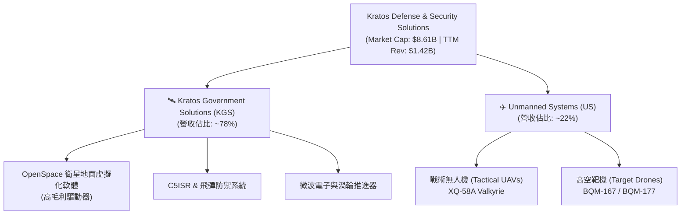

### 2.2 市場份額

在美國國防部靶機（Target Drones）市場，Kratos 擁有近乎壟斷的地位（份額超過 70%）。但在新興的「忠誠僚機」（Loyal Wingman）戰術無人機市場，Kratos 面臨波音（Boeing Ghost Bat）及通用原子（General Atomics）的激烈競爭。

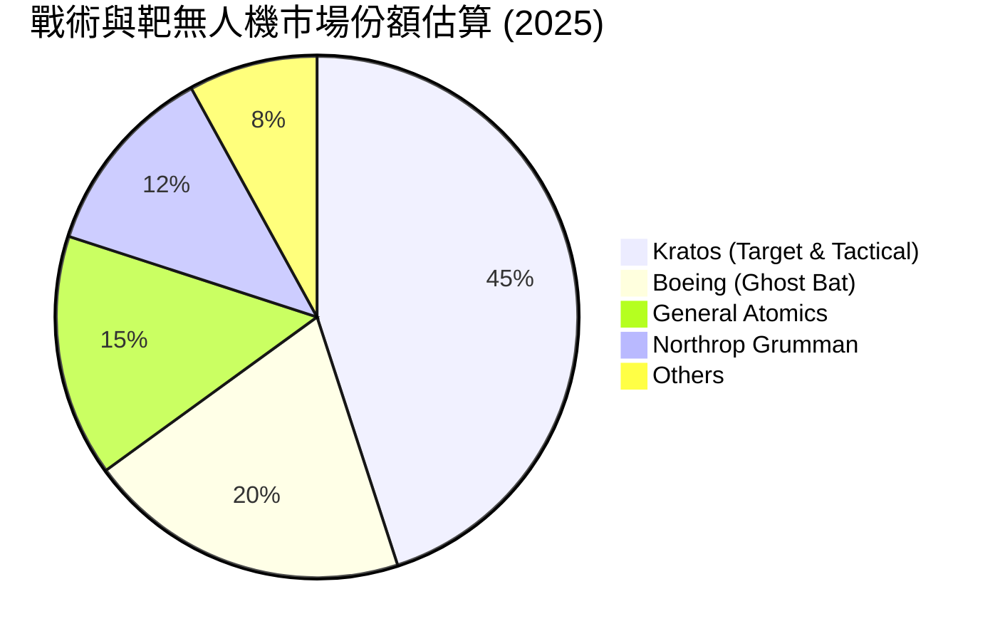

### 2.3 競爭護城河分析

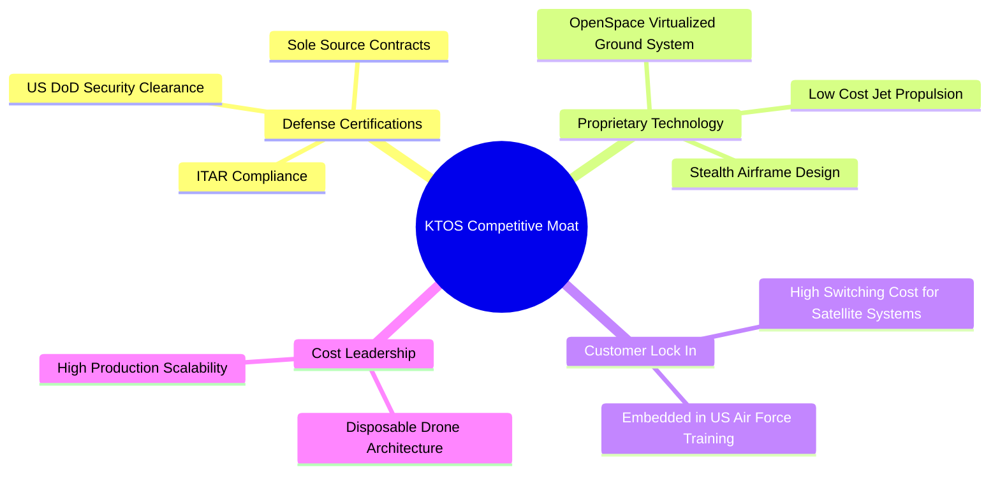

### 2.4 護城河強度評分

```
╔══════════════════════════════════════════════════════════════╗
║                    KTOS 護城河強度評分                       ║
╠══════════════════════════════════════════════════════════════╣
║ 國防准入壁壘   8.5/10 ▓▓▓▓▓▓▓▓▓▓▓▓▓▓▓▓▓░░░  🟢 極高 (DoD資質)║
║ 衛星軟體鎖定   7.5/10 ▓▓▓▓▓▓▓▓▓▓▓▓▓▓░░░░░░  🟢 高 (OpenSpace)║
║ 無人機成本優勢 7.0/10 ▓▓▓▓▓▓▓▓▓▓▓▓▓░░░░░░░  🟢 高 (可消耗性) ║
║ 面臨巨頭競爭   4.5/10 ▓▓▓▓▓▓▓▓░░░░░░░░░░░░  🔴 偏弱 (Boeing) ║
╠══════════════════════════════════════════════════════════════╣
║ 綜合護城河     6.5/10 ▓▓▓▓▓▓▓▓▓▓▓▓▓░░░░░░░  🏆 中等偏強      ║
╚══════════════════════════════════════════════════════════════╝
```

---

## 3. 損益表深度分析

Kratos 展現出顯著的「有營收、無利潤」的成長型公司特徵。營收規模持續擴大，但利潤率受到研發與高昂銷貨成本的壓抑。

### 3.1 年度收入成長趨勢（近5年）

Kratos 的營業收入從 2021 年的 $811.5M 成長至 TTM 的 $1.415B，5 年複合年增長率（CAGR）達 **11.75%**。特別是在 2024 與 2025 年，營收增速明顯加快，分別達到 9.56% 與 18.52%。

```
╔══════════════════════════════════════════════════════════════════╗
║                 KTOS 年度收入趨勢 (FY2021-TTM)                   ║
╠══════════════════════════════════════════════════════════════════╣
║                                                                  ║
║  FY2021   $811.50M   ██████████░░░░░░░░░░░░░░░░░   YoY: +8.5% 🟢 ║
║  FY2022   $898.30M   ███████████░░░░░░░░░░░░░░░░   YoY:+10.7% 🟢 ║
║  FY2023  $1,037.00M  █████████████░░░░░░░░░░░░░░   YoY:+15.5% 🟢 ║
║  FY2024  $1,136.00M  ██████████████░░░░░░░░░░░░░   YoY: +9.6% 🟢 ║
║  FY2025  $1,347.00M  █████████████████░░░░░░░░░░   YoY:+18.5% 🟢 ║
║  TTM     $1,415.00M  ██████████████████░░░░░░░░░   YoY:+21.8% 🟢 ║
║                                                                  ║
║  📊 5年累計 CAGR：+11.75%  (TTM 增速加速至 22.6%)                ║
╚══════════════════════════════════════════════════════════════════╝
```

### 3.2 季度收入趨勢分析

從季度數據看，KTOS 的營收呈現穩步上升趨勢，Q1 2026 營收達到 $371M，較 Q1 2025 的 $302.6M 增長 **22.6%**，QoQ 增長 **7.5%**。

| 季度 | 營業收入 | YoY 成長率 | QoQ 成長率 | 營運利潤 (GAAP) | 淨利 (GAAP) | 備註 |
|------|----------|------------|------------|-----------------|-------------|------|
| **Q1 2026** | $371.00M | 🟢 22.60% | 🟢 7.51% | $4.70M | $11.90M | 淨利受惠於 $5.1M 非營運收益與稅務調整 |
| **Q4 2025** | $345.10M | 🟢 21.90% | 🔴 -0.72% | $8.20M | $5.90M | 營運利潤率回升至 2.38% |
| **Q3 2025** | $347.60M | 🟢 25.99% | 🔴 -1.11% | $7.10M | $8.70M | 季度營收歷史次高 |
| **Q2 2025** | $351.50M | 🟢 17.13% | 🟢 16.16% | $3.70M | $2.90M | 營運利潤率處於 1.05% 的低位 |

### 3.3 利潤率演變分析

Kratos 的毛利率在過去幾年呈現下滑趨勢，從 FY2023 的 25.9% 降至 FY2025 的 22.9%。主要原因是低毛利的硬體製造與系統集成合約佔比增加，而高毛利的軟體與戰術無人機尚未實現規模效應。

| 利潤率指標 | FY2022 | FY2023 | FY2024 | FY2025 | TTM | 趨勢 | 評估 |
|------------|--------|--------|--------|--------|-----|------|------|
| **毛利率** | 25.16% | 25.90% | 25.28% | 22.86% | 22.89% | ↘️ 下滑 | 🔴 產線擴張期折舊與原物料成本上升 |
| **營業利益率** | -0.32% | 3.00% | 2.55% | 1.90% | 1.67% | ↘️ 承壓 | 🔴 研發與 SG&A 費用高企 |
| **EBITDA 利潤率**| 2.92% | 7.47% | 8.24% | 7.64% | 5.70% | 🟡 波動 | 🟡 折舊攤銷（D&A）金額較大 |
| **淨利率** | -3.70% | 0.23% | 1.43% | 1.63% | 2.08% | ↗️ 微升 | 🟡 受惠於非營運利息收入增加 |

### 3.4 費用結構分析

以 FY2025 數據為例，Kratos 的費用結構中，銷貨成本（Cost of Revenue）佔比高達 77.1%，研發費用（R&D）為 $40.0M（佔比 3.0%），推銷與管理費用（SG&A）為 $240.2M（佔比 17.8%）。這顯示公司目前的營運槓桿（Operating Leverage）尚未釋放，管理費用偏高。

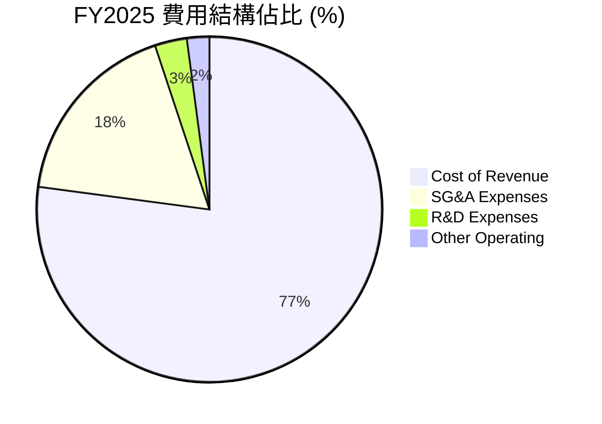

### 3.5 季度 EPS 趨勢與盈餘品質（Quality of Earnings）

Kratos 過去 4 季的 EPS 雖有微幅改善，但獲利的「含金量」極低，存在顯著的盈餘品質問題：

| 盈餘品質項目 | 數值/佔比 | 評估 |
|--------------|-----------|------|
| **股權薪酬 (SBC) / 營業收入** | **2.64%** ($35.5M / $1.35B) | 🟡 處於行業平均，但稀釋效應顯著 |
| **SBC / GAAP 淨利** | 🔴 **161.36%** ($35.5M / $22.0M) | 🔴 淨利完全被非現金的股權薪酬覆蓋，若剔除 SBC，公司實質處於虧損狀態 |
| **FCF / 淨利 (現金轉換率)** | 🔴 **-624.55%** (-$137.4M / $22.0M) | 🔴 極差。淨利為正但現金流大幅淨流出，典型盈餘品質低劣特徵 |
| **一次性/非經常性損益** | Q1 2026 包含 **$5.1M** 非營運收益 | 🔴 美化了當季淨利（占當季淨利 42.8%） |
| **資本化支出** | 資本支出高於折舊攤銷 (CapEx $95.3M > D&A $77.3M) | 🟡 顯示公司正處於重資本擴張期 |

**盈餘品質結論**：Kratos 的 GAAP 淨利嚴重「虛胖」。高額的股權薪酬（SBC）與營運資金佔用導致公司帳面獲利但實際失血。投資人不應僅看 GAAP EPS 的轉正，而應高度關注 FCF 何時轉正。

---

## 4. 資產負債表分析

儘管損益表與現金流量表表現不佳，但 Kratos 的資產負債表在 Q1 2026 得到了極大的增強，這得益於一次大規模的股權融資。

### 4.1 資產結構分解

截至 Q1 2026，Kratos 總資產達 **$4.04B**，其中流動資產達 **$2.31B**（包含 **$1.46B** 的現金及等價物），商譽（Goodwill）為 **$884.1M**（佔總資產 21.9%），反映公司歷史上進行了多次併購。

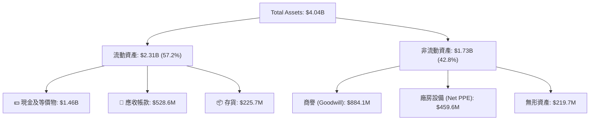

### 4.2 流動性指標分析

由於 Q1 2026 現金的大幅增加，Kratos 的流動性指標達到了極其安全的水平：

*   **流動比率 (Current Ratio)**：**5.63x**（高於行業均值 1.5x）
*   **速動比率 (Quick Ratio)**：**4.85x**（顯示即使扣除存貨，變現能力依極強）
*   **應收帳款週轉天數 (DSO)**：**113.5 天**（偏高，顯示國防部客戶回款週期較長，壓抑營運資金）

### 4.3 債務結構分析

Kratos 的債務負擔極輕，截至 Q1 2026：
*   **短期債務 (ST Debt)**：$19.00M
*   **長期租賃負債 (LT Leases)**：$167.00M
*   **總債務 (Total Debt)**：**$185.40M**
*   **淨現金 (Net Cash)**：**$1.28B**（現金 $1.46B - 債務 $185.4M）

```
╔══════════════════════════════════════════════════════════════════╗
║                     KTOS 債務健康診斷 (Q1 2026)                  ║
╠══════════════════════════════════════════════════════════════════╣
║                                                                  ║
║  總債務：        $185.40M  █░░░░░░░░░░░░░░░░░░░  極低            ║
║  總現金：      $1,464.00M  ████████████████████  極高            ║
║  淨現金（正）：$1,278.60M  ██████████████████░░  🟢 極其安全     ║
║                                                                  ║
║  Debt / Equity:   5.44%   🟢 財務槓桿極低                        ║
║  Current Ratio:   5.63x   🟢 短期流動性無虞                      ║
║  Net Debt/EBITDA: -12.4x  🟢 淨現金狀態，無債務違約風險          ║
║                                                                  ║
║  📊 診斷：資產負債表固若金湯，增發股票為其提供了強大的抗風險能力 ║
╚══════════════════════════════════════════════════════════════════╝
```

### 4.4 股東權益趨勢

隨著增發股票，Kratos 的股東權益（Stockholders Equity）從 2022 年的 $936.3M 暴增至 Q1 2026 的 **$2.00B**。雖然這降低了財務風險，但也對 ROE 產生了稀釋作用。

---

## 5. 現金流量深度分析

與強勁的資產負債表相比，Kratos 的現金流量表是其最大的軟肋。

### 5.1 現金流量瀑布圖

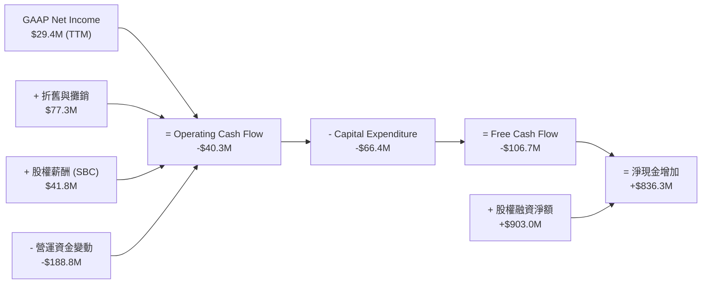

### 5.2 FCF 轉換率趨勢

Kratos 的 FCF 轉換率（FCF / Net Income）近年來持續為負，這在成長型國防企業中雖然常見（因為需要前期墊付資金研發與建產線），但持續時間過長會損害股東價值。

| 年度 | GAAP 淨利 | 營運現金流 (OCF) | 資本支出 (CapEx) | 自由現金流 (FCF) | FCF 轉換率 |
|------|-----------|------------------|------------------|------------------|------------|
| **FY2022** | -$33.20M | -$25.70M | -$45.40M | -$71.10M | 🔴 負轉換 |
| **FY2023** | $2.40M | $65.20M | -$52.40M | $12.80M | 🟢 533.3% |
| **FY2024** | $16.30M | $49.70M | -$58.20M | -$8.50M | 🔴 -52.1% |
| **FY2025** | $22.00M | -$42.10M | -$95.30M | -$137.40M | 🔴 -624.5% |
| **TTM** | $29.40M | -$40.30M | -$66.42M | -$106.72M | 🔴 -363.0% |

### 5.3 自由現金流趨勢

```
╔══════════════════════════════════════════════════════════════════╗
║                 KTOS 自由現金流趨勢 (FY2022-TTM)                 ║
╠══════════════════════════════════════════════════════════════════╣
║                                                                  ║
║  FY2022   -$71.10M   ████░░░░░░░░░░░░░░░░░░░░░░░░░░░░░░░░░░░░░   ║
║  FY2023    +$12.80M  ████████████████████████░░░░░░░░░░░░░░░░░   ║
║  FY2024    -$8.50M   ████████████████████░░░░░░░░░░░░░░░░░░░░░   ║
║  FY2025  -$137.40M   ░░░░░░░░░░░░░░░░░░░░░░░░░░░░░░░░░░░░░░░░░   ║
║  TTM     -$106.72M   █░░░░░░░░░░░░░░░░░░░░░░░░░░░░░░░░░░░░░░░░   ║
║                                                                  ║
║  📊 TTM FCF Yield: -1.24%  (以市值 $8.61B 計算)                  ║
╚══════════════════════════════════════════════════════════════════╝
```

### 5.4 資本配置評估

Kratos 目前的資本配置極度偏向於 **「增發股票獲取現金」** 與 **「擴大資本支出」**。公司不支付股利（Payout Ratio 0%），亦無實質股票回購。

*   **股權融資**：Q1 2026 通過增發約 1,800 萬股，募集了約 $900M 現金。
*   **資本支出**：主要投向無人機產線（如俄克拉荷馬市的 Valkyrie 產線）與衛星虛擬化軟體研發。

---

## 6. 獲利能力與資本效率

### 6.1 ROE / ROA / ROIC 趨勢

由於近期大規模增發股票導致股東權益（分母）暴增，而淨利（分子）增長緩慢，Kratos 的資本效率指標被大幅稀釋。

| 指標 | FY2023 | FY2024 | FY2025 | TTM | 行業均值 | 評估 |
|------|--------|--------|--------|-----|----------|------|
| **ROE** | 0.25% | 1.21% | 1.10% | **1.20%** | ~12.0% | 🔴 極低，受股權稀釋影響 |
| **ROA** | 0.15% | 0.84% | 0.89% | **0.60%** | ~5.5% | 🔴 資產利用效率低下 |
| **ROIC**| 1.85% | 2.50% | 2.10% | **2.58%** | ~8.0% | 🔴 資本回報率顯著低於資金成本 |

### 6.2 ROIC vs WACC 分析（核心價值創造判斷）

我們對 Kratos 的加權平均資金成本（WACC）與投資報酬率（ROIC）進行建模：

```
╔══════════════════════════════════════════════════════════════════╗
║                ROIC vs WACC 深度分析 (TTM)                       ║
╠══════════════════════════════════════════════════════════════════╣
║                                                                  ║
║  WACC 估算：                                                     ║
║  ├── 無風險利率 (10Y 美債)：  4.20%                              ║
║  ├── 市場風險溢酬 (ERP)：     5.00%                              ║
║  ├── Beta：                   1.07                               ║
║  ├── 股權成本 = 4.2% + 1.07 × 5.0% = 9.55%                        ║
║  ├── 債務成本 (稅後)：        ~5.00%                             ║
║  ├── 資本結構：股權 91.5%，債務 8.5%                             ║
║  └── ✅ WACC ≈ 9.10%                                             ║
║                                                                  ║
║  ROIC 估算 (TTM)：                                               ║
║  ├── NOPAT (息稅折舊前淨利) = $23.7M × (1 - 21%) ≈ $18.72M        ║
║  ├── 投入資本 = 股東權益 + 總債務 - 現金                         ║
║  │   = $2.00B + $185.4M - $1.46B ≈ $725.40M                      ║
║  └── ✅ ROIC ≈ 2.58%                                             ║
║                                                                  ║
║  ★ 經濟價值增加 (EVA) = ROIC - WACC = -6.52%                      ║
║                                                                  ║
║  ROIC  2.58%  ▓▓▓▓▓░░░░░░░░░░░░░░░░░░░░░░░░░░  🔴                 ║
║  WACC  9.10%  ▓▓▓▓▓▓▓▓▓▓▓▓▓▓▓▓▓▓░░░░░░░░░░░░  ──                 ║
║  EVA  -6.52%  ░░░░░░░░░░░░░░░░░░░░░░░░░░░░░░  🔴 價值毀損中      ║
║                                                                  ║
║  📊 結論：目前 KTOS 投入資本回報低於資金成本，正在摧毀股東價值。  ║
║  主因是現金儲備過高（未有效投入營運）及營運利潤率偏低。          ║
╚══════════════════════════════════════════════════════════════════╝
```

### 6.3 杜邦三因素分解

我們對 TTM ROE 進行杜邦分解：
$$\text{ROE} (1.2\%) = \text{淨利率} (2.08\%) \times \text{資產週轉率} (0.35\text{x}) \times \text{權益乘數} (1.65\text{x})$$

*   **淨利率 (2.08%)**：極低，是拖累 ROE 的主因。
*   **資產週轉率 (0.35x)**：偏低，反映 $1.46B 的閒置現金拉低了資產利用效率。
*   **財務槓桿 (1.65x)**：非常保守，顯示公司未使用財務槓桿。

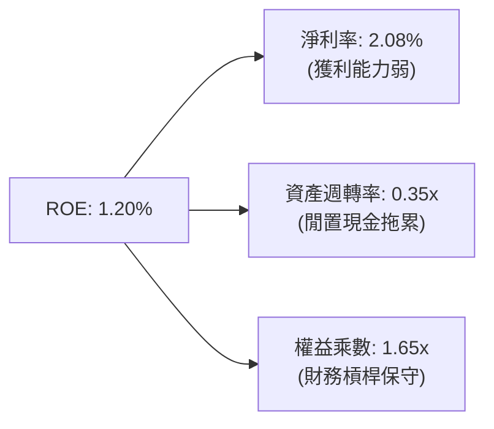

---

## 7. 估值深度分析

由於 Kratos 的 GAAP 淨利受到高額 D&A（$77.3M）與 SBC（$41.8M）的壓抑，傳統的 Trailing P/E（270.2x）已失真。我們應優先參考 **Forward P/E**、**EV / EBITDA** 與 **P/S Ratio**。

### 7.1 同業估值比較表格

我們選取三家國防與無人機/科技領域的同業進行對比：
1.  **AeroVironment (AVAV)**：專注於小型戰術無人機（如 Switchblade 彈簧刀）。
2.  **Mercury Systems (MRCY)**：國防嵌入式運算與電子系統商。
3.  **Curtiss-Wright (CW)**：傳統國防與航太組件商。

| 估值指標 | **KTOS (本公司)** | **AVAV** | **MRCY** | **CW** | 本公司評估 |
|----------|----------|---------|---------|---------|-----------|
| **Trailing P/E** | **270.2x** | 78.5x | 負值 | 32.4x | 🔴 顯著溢價，受淨利壓抑 |
| **Forward P/E** | **42.1x** | 52.0x | 35.0x | 26.5x | 🟡 溢價合理，反映高成長預期 |
| **P/S Ratio** | **6.09x** | 8.20x | 2.10x | 4.15x | 🟡 處於中高水平 |
| **EV / EBITDA** | **90.5x** | 45.2x | 32.1x | 19.5x | 🔴 偏高，EBITDA 尚未放量 |
| **EV / Revenue** | **5.20x** | 7.80x | 2.30x | 3.90x | 🟡 介於純國防與純科技股之間 |
| **52週股價修正** | 🔴 **-65.7%** | -12.5% | -45.0% | -5.0% | 🟢 估值泡沫已大幅清洗 |

### 7.2 歷史估值區間分析

過去 5 年，Kratos 的 Forward P/E 歷史中位數為 **55x**。當前 Forward P/E 為 **42.1x**，處於歷史後 25% 分位數，顯示估值溢價已大幅收窄。

### 7.3 情境目標價（假設驅動，Bear / Base / Bull）

我們基於未來 3 年的營收增速與營業利益率改善空間，建立以下三種估值情境：

| 情境 | 3年營收 CAGR | FY2028 營業利益率 | 退出倍數 (EV/EBITDA) | 隱含目標價 | 相對現價 ($45.94) |
|------|-----------|-----------|----------|------------|----------|
| 🔴 **悲觀情境** | 10.0% | 2.5% | 40.0x | **$35.00** | -23.8% |
| 🟡 **基準情境** | **18.0%** | **5.5%** | **55.0x** | **$60.00** | **+30.6%** |
| 🟢 **樂觀情境** | 25.0% | 8.0% | 70.0x | **$95.00** | +106.8% |

*註：鑑於公司折舊攤銷金額大，我們採用 EV/EBITDA 作為主要退出估值倍數。*

### 7.4 DCF 敏感性分析（6格目標價矩陣）

基於基準 WACC 為 9.1%，永續成長率（g）為 3.0%：

| 營收年成長率 / WACC | **WACC = 8.5%** | **WACC = 9.1% (基準)** | **WACC = 10.0%** |
|------|--------------|----------------------|--------------|
| 🟢 **高成長 (22%)** | $78.50 (+70.9%) | $71.20 (+55.0%) | $62.40 (+35.8%) |
| 🟡 **中成長 (18%)** | $66.00 (+43.7%) | **$60.00 (+30.6%)** | $51.50 (+12.1%) |
| 🔴 **低成長 (12%)** | $44.50 (-3.1%) | $39.80 (-13.4%) | $33.20 (-27.7%) |

---

## 8. 成長催化劑

### 8.1 催化劑時間軸

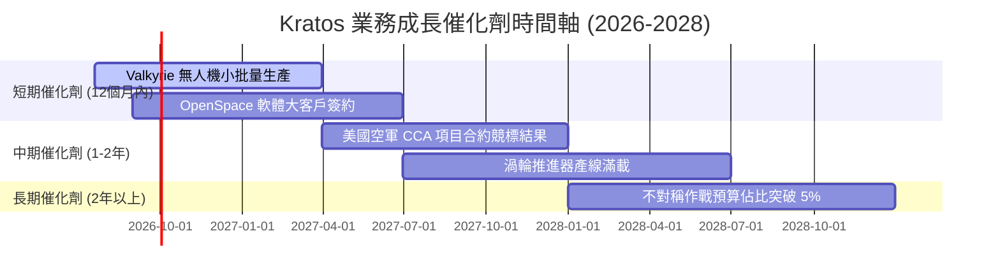

### 8.2 TAM 市場規模分析

Kratos 所處的細分市場正迎來結構性擴容：
1.  **戰術無人機 (CCA)**：美軍預計未來 5 年採購 1,000 架以上忠誠僚機，TAM 達 **$10B**。
2.  **衛星地面站虛擬化**：隨著低軌衛星（LEO）爆發，地面站軟體升級 TAM 達 **$5B**。

### 8.3 成長驅動力結構圖

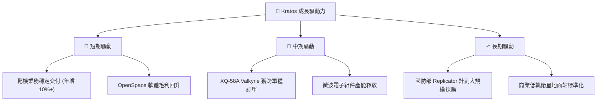

---

## 9. 風險矩陣

### 9.1 風險評分矩陣

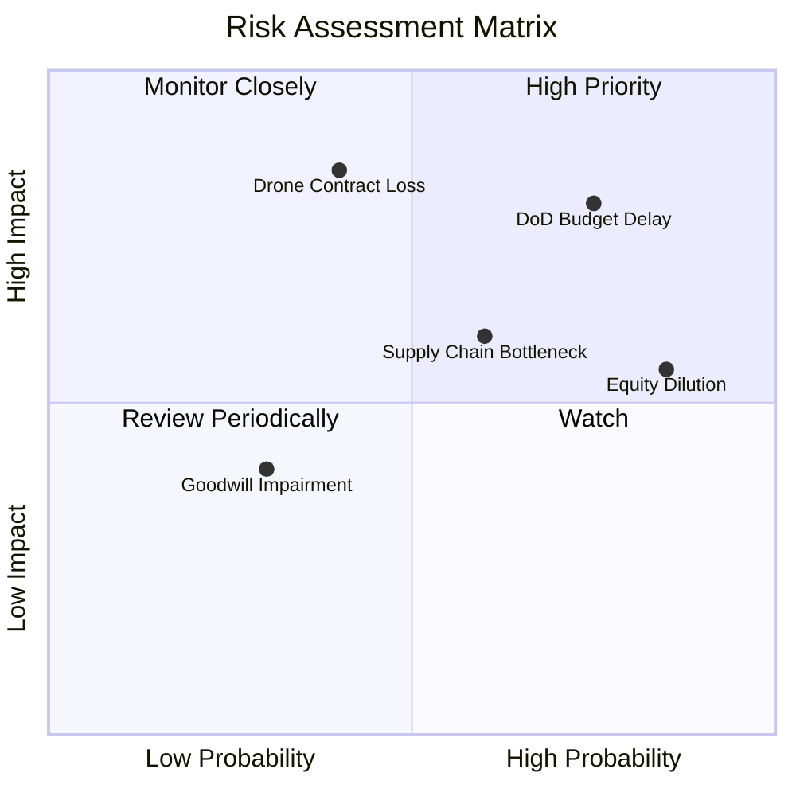

### 9.2 風險清單詳細分析

| # | 風險項目 | 發生機率 | 財務衝擊 | 風險評分 | 緩解措施 |
|---|----------|----------|----------|----------|----------|
| 1 | 🔴 **國防部合約撥款延遲** | 高 (75%) | 高 (-15% 營收) | 🔴 8.0 / 10 | 保持 $1.46B 充沛現金，確保營運不受政府停擺影響。 |
| 2 | 🔴 **CCA 戰術無人機競標失敗** | 中 (40%) | 極高 (-30% 長期估值) | 🔴 7.5 / 10 | 多元化佈局，除空軍外，積極向海軍、陸戰隊推廣。 |
| 3 | 🟡 **股權持續稀釋** | 極高 (85%) | 中 (-10% EPS) | 🟡 6.5 / 10 | 股東大會限制 SBC 佔比，並在 FCF 轉正後開啟回購。 |
| 4 | 🟡 **供應鏈與關鍵晶片短缺** | 中 (60%) | 中 (-5% 毛利率) | 🟡 6.0 / 10 | 增加關鍵電子組件與原材料的庫存（Q1 2026 存貨增至 $225.7M）。 |

---

## 10. 投資建議

Kratos（KTOS）是一家「資產負債表極其安全，但營運效率亟待提升」的典型國防科技成長股。股價歷經 65% 的深幅修正後，估值已具備安全邊際。

### 10.1 最終綜合評級雷達圖

```
╔══════════════════════════════════════════════════════════════╗
║               KTOS 最終投資評級雷達圖                        ║
╠══════════════════════════════════════════════════════════════╣
║ 財務安全度     9.0/10 ▓▓▓▓▓▓▓▓▓▓▓▓▓▓▓▓▓▓░░  🟢 極強        ║
║ 營收成長性     7.5/10 ▓▓▓▓▓▓▓▓▓▓▓▓▓▓▓░░░░░  🟢 強勁        ║
║ 估值吸引力     6.0/10 ▓▓▓▓▓▓▓▓▓▓▓▓░░░░░░░░  🟡 合理        ║
║ 獲利含金量     4.0/10 ▓▓▓▓▓▓▓▓░░░░░░░░░░░░  🔴 偏弱        ║
║ 護城河深度     6.5/10 ▓▓▓▓▓▓▓▓▓▓▓▓▓░░░░░░░  🟡 中等偏強    ║
╠══════════════════════════════════════════════════════════════╣
║ 綜合推薦評級   6.3/10 🟡 溫和買入 (Moderate Buy)             ║
╚══════════════════════════════════════════════════════════════╝
```

### 10.2 目標價與隱含報酬率

| 情境 | 隱含目標價 | 潛在回報率 | 發生機率權重 | 期望目標價 |
|------|------------|------------|--------------|------------|
| 🔴 **悲觀情境** | $35.00 | -23.8% | 20% |  |
| 🟡 **基準情境** | **$60.00** | **+30.6%** | **60%** | **$59.00** (加權期望值) |
| 🟢 **樂觀情境** | $95.00 | +106.8% | 20% |  |

### 10.3 買入時機與觸發因素

```
╔══════════════════════════════════════════════════════════════════╗
║                  ✅ 買入觸發因素 Checklist                      ║
╠══════════════════════════════════════════════════════════════════╣
║                                                                  ║
║  立即買入觸發條件（多數符合）：                                  ║
║  ✅ 股價跌至 $40.00 - $45.00 區間（已符合，目前 $45.94）         ║
║  ✅ 淨現金高於 $1.0B（已符合，目前 $1.28B）                      ║
║  ☐ 季度 FCF 轉正或流出額縮減至 $10M 以內                         ║
║                                                                  ║
║  加碼觸發條件（出現以下任一）：                                  ║
║  ☐ 宣佈獲得美國空軍 CCA（協同作戰飛機）正式量產合約              ║
║  ☐ 毛利率連續兩季回升至 25% 以上                                 ║
║                                                                  ║
║  減碼/停損觸發條件（出現以下任一）：                             ║
║  🔴 季度營收 YoY 成長率跌破 10%                                  ║
║  🔴 流通股數繼續年增超過 15%（過度稀釋）                         ║
╚══════════════════════════════════════════════════════════════════╝
```

### 10.4 投資人適配度分析

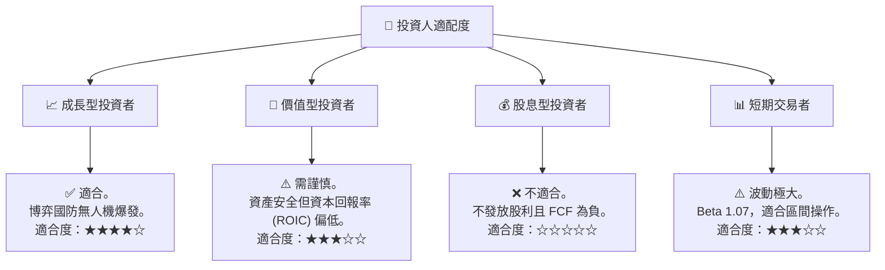

### 10.5 每季財報監控清單（Quarterly Watch List）

| 監控指標 | 減碼/警戒門檻 | 基準/預期值 | 加碼/強勁門檻 | 監控意義 |
|----------|--------------|-------------|--------------|----------|
| **營收 YoY 成長率** | 🔴 < 12% | 18% - 22% | 🟢 > 25% | 驗證下游國防需求是否延續 |
| **毛利率** | 🔴 < 21% | 23% - 24% | 🟢 > 26% | 觀察高毛利軟體佔比是否提升 |
| **自由現金流 (FCF)** | 🔴 < -$50M | -$20M 至 $0M| 🟢 > $10M (轉正) | 評估公司何時停止「失血」 |
| **SBC / 營收比率** | 🔴 > 5.0% | 2.5% - 3.0% | 🟢 < 1.5% | 監控股權稀釋速度 |

### 10.6 反面論證：什麼會證明論點錯誤（What Would Change My Mind）

```
╔══════════════════════════════════════════════════════════════════╗
║              ⚠️ 論點失效條件（Disconfirming Evidence）           ║
╠══════════════════════════════════════════════════════════════════╣
║  本投資論點在下列情況成立時應重新檢視或退出：                    ║
║  ☐ 核心無人機業務（US）營收連續兩季出現 YoY 負增長               ║
║  ☐ 營業利益率（Operating Margin）跌破 1.0%                       ║
║  ☐ 自由現金流持續失血，導致 $1.46B 現金儲備在兩年內消耗過半      ║
║  ☐ ROIC 持續低於 3.0%，且 WACC 因市場利率上升突破 10.0%          ║
║  ☐ 主要競爭對手（如 Boeing 或 General Atomics）獨攬美軍 CCA 合約 ║
╚══════════════════════════════════════════════════════════════════╝
```

---

> **免責聲明**：本報告僅供學術與投資研究參考，不構成任何買賣建議。投資有風險，入市需謹慎。