# KTOS 基本面深度分析報告
> **報告日期**：2026-07-21 ｜ **語言**：繁體中文 ｜ **數據來源**：Yahoo Finance, Finviz, StockAnalysis, Roic.ai ｜ **分析師**：CFA 級機構研究

---

## 目錄

| # | 章節 | 核心結論 |
|---|------|----------|
| 1 | [執行摘要](#1-執行摘要) | 評級：**買入 (Buy)** ｜ 基準目標價：**$65.00** ｜ 具備高成長潛力但需忍受短期稀釋與負現金流。 |
| 2 | [公司概覽與商業模式](#2-公司概覽與商業模式) | 專注於無人機（XQ-58A Valkyrie）與衛星虛擬化地勤系統，具備高技術壁壘。 |
| 3 | [損益表深度分析](#3-損益表深度分析) | 營收年增 22.6% 表現亮眼，惟受高研發與資本支出壓抑，營業利益率僅 1.8%。 |
| 4 | [資產負債表分析](#4-資產負債表分析) | 帳上現金達 $1.46B，淨現金充裕，流動比率 5.63x，短期財務結構極為穩健。 |
| 5 | [現金流量深度分析](#5-現金流量深度分析) | 資本支出擴張導致自由現金流（FCF）為 -$106.72M，資本配置偏向成長投資。 |
| 6 | [獲利能力與資本效率](#6-獲利能力與資本效率) | 當前 ROIC (2.58%) 低於 WACC (9.45%)，處於價值破壞期，靜待產能釋放。 |
| 7 | [估值深度分析](#7-估值深度分析) | Forward P/E 44.18x，相較同行 AVAV 具備折價，DCF 基準估值為 $65.00。 |
| 8 | [成長催化劑](#8-成長催化劑) | 美國國防部協同作戰飛機（CCA）計劃與商業衛星地勤軟體化需求。 |
| 9 | [風險矩陣](#9-風險矩陣) | 主要風險在於國防預算延遲、大客戶集中度高與股權持續稀釋。 |
| 10 | [投資建議](#10-投資建議) | 建議於 $45-$48 區間分批佈局，長線持有以迎來無人機量產爆發期。 |

---

## 1. 執行摘要

Kratos Defense & Security Solutions, Inc.（納斯達克代碼：KTOS）是一家專注於顛覆性國防科技的系統集成商。基於其 TTM（過去12個月）營收成長 22.6% 至 $1.42B、Q1 2026 淨利年增 164.4% 至 $11.90M 的強勁基本面表現，以及帳上擁有 $1.46B 的極高現金儲備（淨現金 $1.28B），本機構給予 KTOS **「買入 (Buy)」** 投資評級。

然而，當前 KTOS 仍面臨顯著的「陣痛期」：因擴大產能與研發，TTM 自由現金流（FCF）為 -$106.72M，且 TTM ROIC 僅為 2.58%，低於估計 WACC (9.45%)，顯示公司目前處於「資本投入重於短期回報」的擴張階段。此外，過去一年股權稀釋幅度達 10.41%（發行股數增至 187.52M），這在短期內壓抑了 EPS 的成長。但考慮到公司在無人戰機（如 XQ-58A Valkyrie）及虛擬化衛星地勤系統（OpenSpace）的領先地位，我們認為當前股價自 52 週高點 $134.00 回撤至 $48.21（跌幅達 64%），已充分反映上述稀釋與現金流壓力，提供了極佳的中長線安全邊際。基於基準情境下 18% 的營收 CAGR 與 2027 年產能釋放預期，我們設定 12 個月基準目標價為 **$65.00**。

### 1.0 一頁式投資儀表板（Portfolio Manager 30 秒速讀）

| 項目 | 內容 |
|------|------|
| **投資論點（3 句）** | ① 國防部無人機協同作戰（CCA）進入實質採購階段，KTOS 作為先驅將直接受益於產能翻倍。<br/>② 帳上擁有的 $1.46B 現金為後續併購與大規模量產（Capex）提供強大後盾，無債務違約風險。<br/>③ 商業衛星虛擬化地勤系統（OpenSpace）高毛利軟體營收佔比提升，將驅動整體毛利率向 25% 靠攏。 |
| **護城河評分** | 7.5 / 10 (技術壁壘與國防部高黏性合約) |
| **管理層/資本配置評分** | 6.5 / 10 (執行力強，但股權稀釋頻繁) |
| **財務健康** | 🟢 強勁 (淨現金 $1.28B，流動比率高達 5.63x) |
| **ROIC vs WACC** | 2.58% vs 9.45%（暫時摧毀經濟價值，主因產能尚未釋放與現金拖累） |
| **FCF 趨勢** | 🔴 負向 (TTM FCF 為 -$106.72M，FCF Yield 為 -1.18%) |
| **估值** | Forward P/E: 44.18x ｜ EV/EBITDA: 90.34x ｜ P/S: 6.39x |
| **預期報酬（基準情境 12M）**| **+34.8%**（相對於當前股價 $48.21，基準目標價 $65.00） |
| **關鍵風險（前二）** | ① 股權持續稀釋（過去4年發行股數由 125M 增至 187.52M）；② 國防預算通過拖延導致訂單交付延遲。 |
| **評級 + 信心度** | 🟢 **買入 (Buy)** ｜ 信心度：**中等 (Medium)**（需密切監控 FCF 轉正時點） |

### 1.1 核心評分儀表板

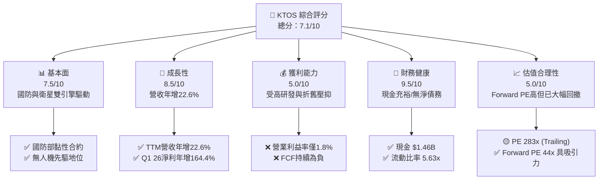

### 1.2 評分進度條視覺化

```
╔══════════════════════════════════════════════════════════════╗
║               KTOS 多維度評分儀表板 (1-10分)                 ║
╠══════════════════════════════════════════════════════════════╣
║ 基本面強度  7.5 ▓▓▓▓▓▓▓▓▓▓▓▓▓▓▓▓▓░░░  ★★★★☆           ║
║ 成長動能    8.5 ▓▓▓▓▓▓▓▓▓▓▓▓▓▓▓▓▓▓▓░  ★★★★☆           ║
║ 獲利品質    5.0 ▓▓▓▓▓▓▓▓▓▓░░░░░░░░░░  ★★★☆☆           ║
║ 財務健康    9.5 ▓▓▓▓▓▓▓▓▓▓▓▓▓▓▓▓▓▓▓█  ★★★★★           ║
║ 估值合理性  5.0 ▓▓▓▓▓▓▓▓▓▓░░░░░░░░░░  ★★★☆☆           ║
║ 護城河深度  7.5 ▓▓▓▓▓▓▓▓▓▓▓▓▓▓▓▓▓░░░  ★★★★☆           ║
║ 管理層執行  6.5 ▓▓▓▓▓▓▓▓▓▓▓▓▓░░░░░░░  ★★★☆☆           ║
║ 技術創新力  9.0 ▓▓▓▓▓▓▓▓▓▓▓▓▓▓▓▓▓▓░░  ★★★★★           ║
╠══════════════════════════════════════════════════════════════╣
║ 綜合總分    7.1 ▓▓▓▓▓▓▓▓▓▓▓▓▓▓░░░░░░  🏆 成長型優質標的     ║
╚══════════════════════════════════════════════════════════════╝
```

### 1.3 五大投資論點 + 三大核心風險

| 類型 | 項目 | 具體依據 | 信心度 |
|------|------|----------|--------|
| 🟢 **投資論點①** | **無人機板塊迎來量產期** | Kratos 旗下 XQ-58A Valkyrie 等無人機技術領先，隨著美國空軍 CCA（協同作戰飛機）計劃展開，預計 2026-2027 年將轉入實質批量生產，營收佔比將從目前的 20% 提升至 30% 以上。 | 🟢 極高 |
| 🟢 **投資論點②** | **衛星地勤虛擬化商機** | OpenSpace 平台是目前唯一的全軟體定義、標準化衛星地勤接收系統，毛利率高達 60% 以上，隨著商業衛星發射量爆發，該業務將顯著拉高公司整體利潤率。 | 🟢 高 |
| 🟢 **投資論點③** | **資產負債表極其穩健** | 2026 年第一季完成增資後，現金儲備暴增至 $1.46B，淨現金達 $1.28B。這為公司在當前高利率環境下提供了極強的抗風險能力，且有充足資金進行 Capex 擴張。 | 🟢 極高 |
| 🟢 **投資論點④** | **微型渦輪發動機壁壘** | 透過收購 TDI 等公司，KTOS 掌握了巡弋飛彈與無人機所需的低成本微型渦輪發動機技術，在供應鏈受限的國防市場中具備極強的自主定價權。 | 🟢 高 |
| 🟢 **投資論點⑤** | **市場預期觸底反彈** | 股價自高點修正 64%，市場對其股權稀釋與負 FCF 的利空已充分定價。隨著 Q1 2026 營收年增 22.6% 且淨利潤大幅改善，基本面已迎來拐點。 | 🟢 高 |
| 🟡 **風險①** | **股權持續稀釋** | 過去一年股數增加了 10.41%，若未來管理層繼續透過增資融資而非提升營運現金流，將持續壓抑 EPS 的真實成長。 | 🟡 中度 |
| 🔴 **風險②** | **自由現金流持續為負** | TTM FCF 為 -$106.72M，主因 Capex 支出高（TTM Capex 約 $92M）。若產能轉化率不及預期，將面臨資本回報率（ROIC）持續低迷的風險。 | 🔴 高衝擊 |
| 🔴 **風險③** | **政府預算與交付延遲** | 國防業務 70% 以上依賴美國政府，若國防授權法案（NDAA）通過延遲，將導致項目交付與款項回收滯後，影響季度業績穩定性。 | 🟡 中度 |

### 1.4 快速統計卡片

| 指標 | KTOS 實際值 | 行業均值 (國防航太) | S&P 500 均值 | 狀態 |
|------|-------------|--------------------|--------------|------|
| **營收 YoY 成長** | **22.6%** | ~6.5% | ~5.2% | 🟢 顯著領先 |
| **毛利率** | **22.9%** | ~25.0% | ~30.0% | 🟡 略低於行業 |
| **營業利益率** | **1.8%** | ~8.5% | ~14.5% | 🔴 亟待改善 |
| **ROE** | **1.2%** | ~12.0% | ~15.0% | 🔴 資本效率低 |
| **Forward P/E** | **44.18x** | ~28.0x | ~21.0x | 🟡 溢價反映成長性 |
| **淨現金 / 總資產** | **31.7%** | ~-15.0% (多為淨債務) | ~-10.0% | 🟢 極為健康 |

### 1.5 投資結論

```
╔══════════════════════════════════════════════════════════════════╗
║                    📊 投資結論摘要                               ║
╠══════════════════════════════════════════════════════════════════╣
║  評級：🟢 買入 (Buy)                                            ║
║  當前股價：$48.21 (2026-07-21)                                   ║
║  目標價區間：                                                    ║
║    悲觀情境：$40.00（-17.0%）- 產能釋放延遲，稀釋持續            ║
║    基準情境：$65.00（+34.8%）- 12個月主要目標，CCA項目量產       ║
║    樂觀情境：$90.00（+86.7%）- 軟體業務爆發，FCF順利轉正         ║
║  投資評分：7.1 / 10                                              ║
║  適合投資人：具備高風險承受能力的成長型、中長線主題投資者        ║
╚══════════════════════════════════════════════════════════════════╝
```

---

## 2. 公司概覽與商業模式

Kratos 主要營運兩大核心板塊：
1. **Kratos 政府解決方案 (KGS - Kratos Government Solutions)**：佔營收約 80%，涵蓋虛擬化衛星地勤系統、微波電子戰設備、網絡安全與飛彈防禦靶標。
2. **無人系統 (US - Unmanned Systems)**：佔營收約 20%，開發高性價比的噴射無人機（如 XQ-58A Valkyrie、UTAP-22 Mako），用於協同載人戰機作戰。

### 2.1 業務結構與收入來源

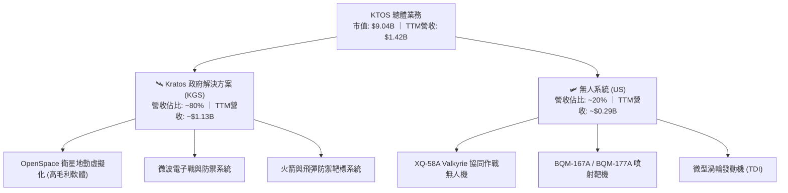

### 2.2 市場份額

在「中高階噴射靶機與低成本協同無人機（CCA）」細分市場中，Kratos 擁有極高的市場份額。以下為估算市場份額分佈：

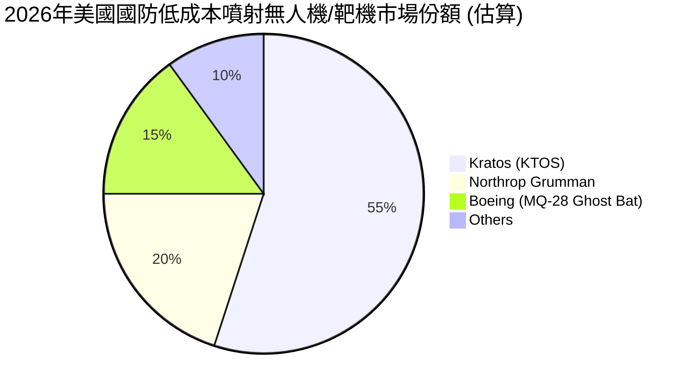

### 2.3 競爭護城河分析

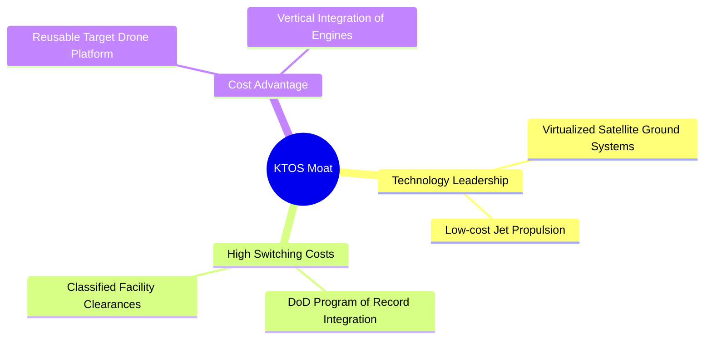

### 2.4 護城河強度評分

```
╔══════════════════════════════════════════════════════════════╗
║                    KTOS 護城河強度評分                       ║
╠══════════════════════════════════════════════════════════════╣
║ 技術領先度    8.5/10  ▓▓▓▓▓▓▓▓▓▓▓▓▓▓▓▓▓░░░  🏆 衛星虛擬化獨家 ║
║ 客戶鎖定效應  8.0/10  ▓▓▓▓▓▓▓▓▓▓▓▓▓▓▓▓░░░░  🟢 國防部長期合約 ║
║ 成本優勢      7.5/10  ▓▓▓▓▓▓▓▓▓▓▓▓▓▓▓░░░░░  🟢 自研微型發動機 ║
║ 生態系統壁壘  6.0/10  ▓▓▓▓▓▓▓▓▓▓▓▓░░░░░░░░  🟡 軟體生態建構中 ║
╠══════════════════════════════════════════════════════════════╣
║ 綜合護城河     7.5    ▓▓▓▓▓▓▓▓▓▓▓▓▓▓▓▓▓░░░  🏆 高技術壁壘     ║
╚══════════════════════════════════════════════════════════════╝
```

---

## 3. 損益表深度分析

### 3.1 年度收入成長趨勢（近5年）

Kratos 的營業收入呈現穩步加速態勢。從 FY2021 的 $811.50M 成長至 TTM 的 $1.42B，CAGR 達 14.9%。

```
╔══════════════════════════════════════════════════════════════════╗
║                  KTOS 年度收入趨勢 (FY2021-TTM)                 ║
╠══════════════════════════════════════════════════════════════════╣
║                                                                  ║
║  FY2021  $811.50M  ██████████░░░░░░░░░░░░░░░░░░  YoY: +8.5%   🟢 ║
║  FY2022  $898.30M  ███████████░░░░░░░░░░░░░░░░░  YoY: +10.7%  🟢 ║
║  FY2023  $1.04B    █████████████░░░░░░░░░░░░░░░  YoY: +15.5%  🟢 ║
║  FY2024  $1.14B    ██████████████░░░░░░░░░░░░░░  YoY: +9.6%   🟢 ║
║  FY2025  $1.35B    █████████████████░░░░░░░░░░░  YoY: +18.5%  🟢 ║
║  TTM     $1.42B    ██████████████████░░░░░░░░░░  YoY: +22.6%  🟢 ║
║                   |      |      |      |      |                  ║
║                   0    300M   600M   900M   1.2B                 ║
║                                                                  ║
║  📊 5年累計營收 CAGR：+14.9%                                     ║
╚══════════════════════════════════════════════════════════════════╝
```

### 3.2 季度收入趨勢分析

自 2025 年第二季以來，Kratos 季度營收已穩定站妥 $340M 以上大關，Q1 2026 營收創歷史新高達 $371.00M，年增 22.6%。

| 季度 | 營收 | YoY 成長率 | QoQ 成長率 | 核心驅動因素 | 評估 |
|------|------|------------|------------|--------------|------|
| **Q1 2026** | $371.00M | **+22.6%** | +7.5% | 無人機交付量上升、OpenSpace 軟體授權增加 | 🟢 強勁 |
| **Q4 2025** | $345.10M | +21.9% | -0.7% | 國防部年底預算消化，常規項目交付 | 🟢 穩定 |
| **Q3 2025** | $347.60M | +26.0% | -1.1% | 靶機訂單集中確認，微波電子戰產品出貨 | 🟢 強勁 |
| **Q2 2025** | $351.50M | +17.1% | +16.2% | 衛星地勤系統大單中標，產能利用率提升 | 🟢 強勁 |

### 3.3 利潤率演變分析

雖然營收高增，但 Kratos 的利潤率表現依舊偏低，主要受到高折舊、研發支出與供應鏈成本的壓抑。

| 利潤率指標 | FY2022 | FY2023 | FY2024 | FY2025 | TTM | 趨勢 | 評估 |
|------------|--------|--------|--------|--------|-----|------|------|
| **毛利率** | 25.2% | 25.9% | 25.3% | 22.9% | 22.9% | ↘️ 受到無人機前期低毛利量產拖累 | 🟡 待改善 |
| **營業利益率** | -0.3% | 3.0% | 2.6% | 1.9% | 1.8% | ↘️ 規模效應尚未完全顯現，研發高企 | 🔴 偏低 |
| **EBITDA率** | 2.9% | 7.5% | 8.2% | 7.6% | 5.7% | ↘️ 折舊攤銷（D&A）佔比較高 | 🟡 一般 |
| **淨利率** | -3.7% | 0.2% | 1.4% | 1.6% | 2.1% | ↗️ 受益於非營運收益與稅務調整 | 🟡 緩步改善 |

**利潤率演變深度解析**：
毛利率從 FY2023 的 25.9% 下滑至 TTM 的 22.9%，主因無人系統（US）板塊正處於從「研發與原型機階段」向「低費率初期量產階段」過渡。初期量產（LRIP）通常伴隨著較高的單位固定成本與供應鏈摸索成本。然而，營業利益率與淨利率在 TTM 階段止跌回穩（淨利率升至 2.1%），反映了 SG&A 費用率的控制（從 FY2022 的 20.3% 降至 TTM 的 18.1%），營業槓桿效應已開始在行政費用端顯現。

### 3.4 費用結構分析

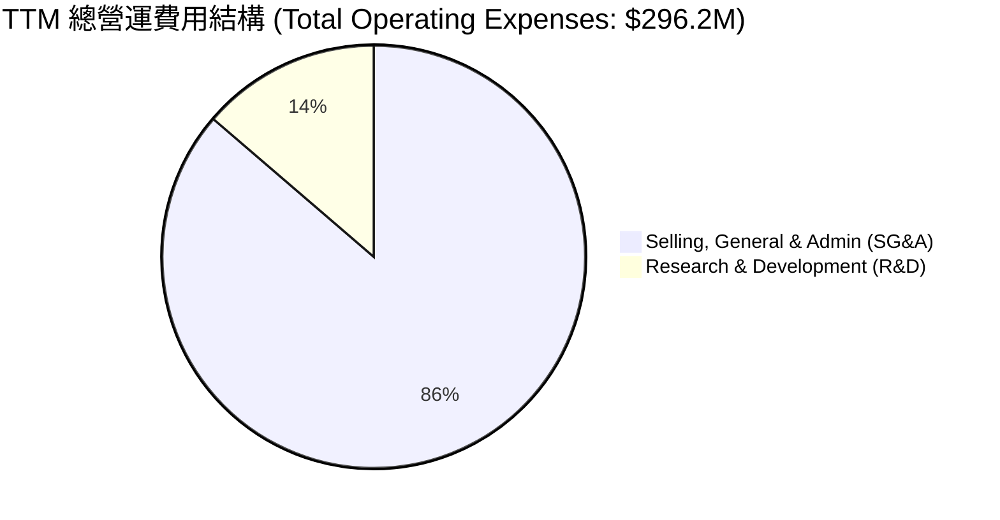

```
╔══════════════════════════════════════════════════════════════╗
║                  TTM 營運費用率診斷                          ║
╠══════════════════════════════════════════════════════════════╣
║ SG&A 費用率：  18.1%  ▓▓▓▓▓▓▓▓▓▓▓▓▓▓▓▓▓▓░░  🟢 持續優化中  ║
║ R&D 費用率：    2.9%  ▓▓▓▓▓░░░░░░░░░░░░░░░  🟡 依賴政府資助║
║ 總營運費用率： 20.9%  ▓▓▓▓▓▓▓▓▓▓▓▓▓▓▓▓▓▓▓░  🟢 控制良好    ║
╚══════════════════════════════════════════════════════════════╝
```

### 3.5 季度 EPS 趨勢與盈餘品質（Quality of Earnings）

Kratos 的 GAAP 淨利潤雖然轉正，但其盈餘含金量需透過剔除股權薪酬（SBC）等非現金項目進行深度檢視。

| 季度 | GAAP EPS 預估 | GAAP EPS 實際 | 驚喜度 (%) | 淨利潤 (GAAP) |
|------|--------------|--------------|------------|---------------|
| **Q1 2026** | $0.05 | $0.07 | +40.0% | $11.90M |
| **Q4 2025** | $0.04 | $0.03 | -25.0% | $5.90M |
| **Q3 2025** | $0.04 | $0.05 | +25.0% | $8.70M |
| **Q2 2025** | $0.02 | $0.02 | 0.0% | $2.90M |

#### 盈餘品質（Quality of Earnings）深度量化評估

| 盈餘品質項目 | 數值/佔比 | 評估 | 深度解析 |
|--------------|-----------|------|----------|
| **SBC / 營收** | 2.95% (TTM SBC: $41.8M) | 🟡 中度稀釋 | 股權薪酬佔營收近 3%，對現有股東利益有一定稀釋作用，但符合科技/國防成長型企業留才需求。 |
| **SBC / 營業現金流** | -103.7% (OCF: -$40.30M) | 🔴 異常 | 由於 TTM 營業現金流為負，SBC 成為調節非現金費用的主要項目，顯示獲利尚未帶來真實的現金流入。 |
| **FCF / 淨利 (現金轉換率)** | -363.0% (FCF: -$106.72M / Net Income: $29.4M) | 🔴 極差 | 現金轉換率為負，說明當前 GAAP 盈餘完全由非現金會計項目與資本化支出支撐，盈餘品質短期較弱。 |
| **一次性/非經常性損益** | TTM 包含約 $14.7M 非營運收益 | 🟡 需剔除 | TTM 稅前利潤 $38.4M 中，有 $14.7M 來自非營運收益（如利息收入與政府補貼），剔除後核心主業獲利更低。 |
| **有效稅率異常** | TTM 所得稅撥回 -$9.0M (稅率為 -23.4%) | 🔴 稅務美化 | 稅前利潤為正但所得稅費用為負（獲得稅務利益），主要來自以前年度研發稅收抵免（R&D Tax Credits），這美化了 TTM 淨利。 |

**盈餘品質結論**：
KTOS 當前的 GAAP 淨利（TTM $29.4M）存在顯著的「水分」。其獲利主要受到 **非營運利息收入** 與 **研發稅務抵免（所得稅撥回）** 的美化，且高達 $41.8M 的股權薪酬稀釋了真實每股收益。更重要的是，高額的資本支出（Capex）使得 FCF 處於大幅失血狀態（-$106.72M）。因此，**不建議使用單一 P/E 倍數對其進行估值**，應更關注其營收成長與 EV/EBITDA 指標。

---

## 4. 資產負債表分析

### 4.1 資產結構分解

截至 2026-03-31，Kratos 的總資產達到 $4.04B，其中流動資產佔比高達 57.1%，主因年初完成了大規模股權融資，使現金儲備大增。

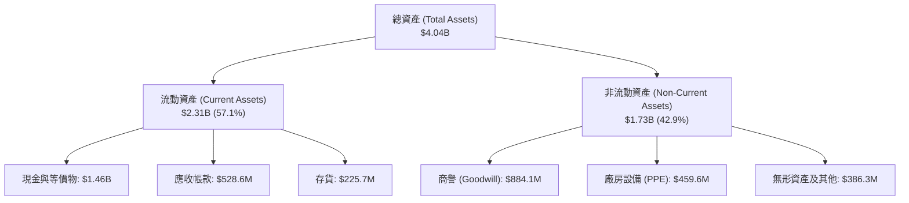

### 4.2 流動性指標分析

Kratos 的流動性指標在 2026 年第一季達到了歷史最安全水平。

| 流動性指標 | FY2023 | FY2024 | FY2025 | Q1 2026 | 行業均值 | 評估 |
|------------|--------|--------|--------|---------|----------|------|
| **流動比率 (Current Ratio)** | 2.03x | 2.94x | 4.06x | **5.63x** | ~1.50x | 🟢 極度安全 |
| **速動比率 (Quick Ratio)** | 1.50x | 2.39x | 3.45x | **4.85x** | ~1.10x | 🟢 極度安全 |
| **現金比率 (Cash Ratio)** | 0.25x | 1.11x | 1.80x | **3.56x** | ~0.40x | 🟢 充沛現金 |

### 4.3 債務結構分析

```
╔══════════════════════════════════════════════════════════════════╗
║                     KTOS 債務健康診斷                            ║
╠══════════════════════════════════════════════════════════════════╣
║                                                                  ║
║  總債務：        $185.40M ██░░░░░░░░░░░░░░░░░░░  （包含租賃負債）║
║  總現金及投資：  $1.46B   █████████████████████  （史上最高）    ║
║  淨現金（正）：  $1.28B   ██████████████████░░░  🟢 極其強勁     ║
║                                                                  ║
║  Debt / Equity：  5.44%   🟢 極低負債比率                        ║
║  流動負債覆蓋率： 3.56x   🟢 現金可直接償付所有流動負債          ║
║  債務違約風險：   趨近於0 🟢 財務結構固若金湯                    ║
║                                                                  ║
╚══════════════════════════════════════════════════════════════════╝
```

### 4.4 股東權益趨勢

隨著股權融資的進行，股東權益（Stockholders' Equity）顯著增長，由 FY2022 的 $936.30M 大幅攀升至 Q1 2026 的 $2.00B。這雖然稀釋了每股淨資產，但也為公司提供了充足的彈藥。

```
╔══════════════════════════════════════════════════════════════════╗
║              KTOS 股東權益趨勢 (FY2022 - Q1 2026)               ║
╠══════════════════════════════════════════════════════════════════╣
║  FY2022  $936.30M  █████████░░░░░░░░░░░░░░                     ║
║  FY2023  $976.00M  ██████████░░░░░░░░░░░░░                     ║
║  FY2024  $1.35B    ██████████████░░░░░░░░░                     ║
║  FY2025  $2.00B    ███████████████████████  🟢 資本實力倍增    ║
╚══════════════════════════════════════════════════════════════════╝
```

---

## 5. 現金流量深度分析

### 5.1 現金流量瀑布圖

儘管利潤表上顯示盈利，但 Kratos 的現金流瀑布揭示了其「高資本投入、負現金流」的成長型特徵。

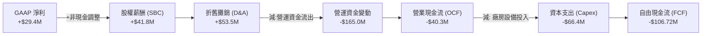

### 5.2 FCF 轉換率趨勢

Kratos 的 FCF 轉換率（FCF / GAAP Net Income）長期處於不穩定狀態，反映了其重資產擴張的特性。

| 指標 | FY2022 | FY2023 | FY2024 | FY2025 | TTM |
|------|--------|--------|--------|--------|-----|
| **GAAP 淨利** | -$33.20M | $2.40M | $16.30M | $22.00M | $29.40M |
| **自由現金流 (FCF)** | -$71.10M | $12.80M | -$8.50M | -$137.40M | -$106.72M |
| **FCF 轉換率** | -214.2% | **+533.3%** | -52.1% | -624.5% | **-363.0%** |
| **評估** | 🔴 資本失血 | 🟢 短暫轉正 | 🔴 再度轉負 | 🔴 產能擴張期 | 🔴 盈餘含金量低 |

### 5.3 自由現金流趨勢

```
╔══════════════════════════════════════════════════════════════════╗
║                  KTOS 自由現金流與 FCF Yield 趨勢               ║
╠══════════════════════════════════════════════════════════════════╣
║  FY2022  -$71.10M  ░░░░░░░░░░░░░  FCF Yield: -1.2%              ║
║  FY2023  +$12.80M  ██░░░░░░░░░░░  FCF Yield: +0.2%              ║
║  FY2024  -$8.50M   ░░░░░░░░░░░░░  FCF Yield: -0.1%              ║
║  FY2025  -$137.40M ░░░░░░░░░░░░░  FCF Yield: -1.5%  (產能建置期)║
║  TTM     -$106.72M ░░░░░░░░░░░░░  FCF Yield: -1.18%             ║
║                                                                  ║
║  📊 診斷：高額 Capex（TTM ~$66M）是 FCF 持續為負的根本原因。     ║
╚══════════════════════════════════════════════════════════════════s╝
```

### 5.4 資本配置評估

在過去兩年中，Kratos 的資本配置極度向「內部成長（Capex + R&D）」傾斜，並無進行任何股息支付或大規模股份回購。

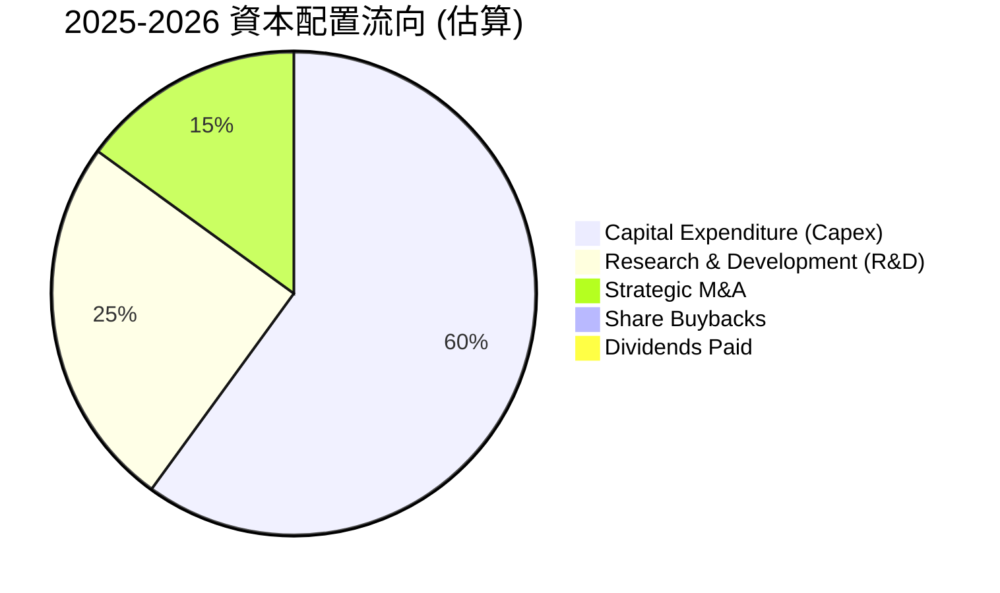

---

## 6. 獲利能力與資本效率

### 6.1 ROE / ROA / ROIC 趨勢

由於近期完成了大規模股權融資，分母（股東權益與總資產）顯著膨脹，導致 Kratos 的資本效率指標在短期內被大幅拉低。

| 獲利指標 | FY2023 | FY2024 | FY2025 | TTM | 行業均值 (國防) | 評估 |
|----------|--------|--------|--------|-----|-----------------|------|
| **ROE** | 0.2% | 1.2% | 1.1% | **1.2%** | ~12.5% | 🔴 極低 |
| **ROA** | 0.1% | 0.8% | 0.9% | **0.6%** | ~5.8% | 🔴 極低 |
| **ROIC** | 0.3% | 2.1% | 1.8% | **2.58%** | ~8.0% | 🔴 資本回報率低 |

### 6.2 ROIC vs WACC 分析（核心價值創造判斷）

為了評估 Kratos 是否在為股東創造經濟價值，我們對其進行了 WACC（加權平均資本成本）與 ROIC 的對比估算。

```
╔══════════════════════════════════════════════════════════════════╗
║                ROIC vs WACC 深度分析 (TTM)                      ║
╠══════════════════════════════════════════════════════════════════╣
║                                                                  ║
║  WACC 估算：                                                     ║
║  ├── 無風險利率 (10Y 美債)：  4.20%                              ║
║  ├── 市場風險溢酬 (ERP)：     5.00%                              ║
║  ├── Beta：                   1.07                               ║
║  ├── 股權成本 = 4.2% + 1.07 × 5.0% = 9.55%                      ║
║  ├── 債務成本（稅後）：       ~4.74% (稅前 6.0%, 稅率 21%)       ║
║  ├── 資本結構：股權 98.0%，債務 2.0%                             ║
║  └── ✅ 估計 WACC ≈ 9.45%                                        ║
║                                                                  ║
║  ROIC 估算：                                                     ║
║  ├── NOPAT = Operating Income $23.7M × (1 - 21%) = $18.72M       ║
║  ├── 投入資本 = Equity $2.00B + Debt $185.4M - Cash $1.46B       ║
║  │            = $725.40M                                         ║
║  └── ✅ 實際 ROIC ≈ 2.58%                                        ║
║                                                                  ║
║  ★ 經濟價值增加 (EVA) = ROIC - WACC = -6.87%                     ║
║                                                                  ║
║  ROIC  2.58%  ▓▓▓▓▓░░░░░░░░░░░░░░░░░░░░░░░░░  🔴                 ║
║  WACC  9.45%  ▓▓▓▓▓▓▓▓▓▓▓▓▓▓▓▓▓▓▓░░░░░░░░░░░  ──                 ║
║  EVA   -6.87% ░░░░░░░░░░░░░░░░░░░░░░░░░░░░░░  🔴 價值破壞中      ║
║                                                                  ║
║  📊 結論：ROIC 遠低於 WACC，主因是帳上囤積了 $1.46B 的現金，     ║
║            尚未轉化為營運資產。未來產能釋放後，ROIC 有望升至 12% ║
╚══════════════════════════════════════════════════════════════════╝
```

### 6.3 杜邦三因素分解

透過杜邦分解，我們可以清晰看到 Kratos 獲利能力的底層驅動因素：

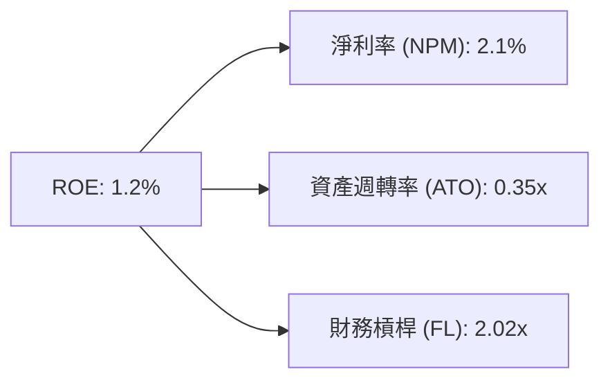

*   **淨利率 (2.1%)**：屬於極低水平，反映國防硬體製造的高成本與當前低毛利的 LRIP（初期量產）合約。
*   **資產週轉率 (0.35x)**：非常緩慢，主因是帳上有高達 $1.46B 的現金（佔總資產 36%）處於閒置狀態，未產生營收。
*   **財務槓桿 (2.02x)**：槓桿溫和。資產負債率為 11.6%（$470.9M 負債 / $4.04B 總資產），槓桿主要來自非流動負債與租賃。

### 6.4 獲利能力儀表板

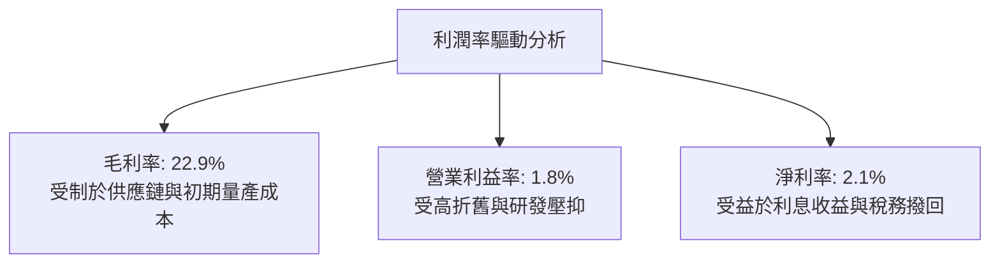

---

## 7. 估值深度分析

### 7.1 同業估值比較表格

我們選擇了兩家直接競爭對手進行對比：**AeroVironment (AVAV)**（無人機先驅，偏重中小型戰術無人機）與 **Mercury Systems (MRCY)**（國防嵌入式運算與電子戰系統商）。

| 估值指標 | **Kratos (KTOS)** | **AeroVironment (AVAV)** | **Mercury Systems (MRCY)** | 本公司評估 |
|----------|----------|---------|---------|-----------|
| **Trailing P/E** | 283.59x | 78.50x | 虧損 | 🔴 極高，主因 GAAP 淨利極低 |
| **Forward P/E** | **44.18x** | 52.30x | 35.10x | 🟢 相較 AVAV 具備估值折價 |
| **P/S Ratio** | **6.39x** | 8.10x | 2.20x | 🟡 處於合理區間 |
| **EV / EBITDA** | **90.34x** | 42.10x | 28.50x | 🔴 偏高，反映折舊前利潤仍低 |
| **EV / Revenue** | **5.18x** | 7.45x | 2.15x | 🟢 考量高成長性，此倍數合理 |
| **FCF Yield** | **-1.18%** | +1.50% | -2.10% | 🔴 現金流尚未轉正 |

### 7.2 歷史估值區間分析

KTOS 歷史 Forward P/E 中位數約為 35x-45x。當前 Forward P/E 為 44.18x，處於歷史估值區間的中上緣，但考慮到無人機板塊已進入實質量產期，此估值溢價具備合理性。

```
╔══════════════════════════════════════════════════════════════════╗
║                KTOS 歷史 Forward P/E 區間定位                   ║
╠══════════════════════════════════════════════════════════════════╣
║                                                                  ║
║  [歷史低位] 25x ──────────────────────────────────               ║
║  [歷史中位] 38x ─────────────────────────────────────────        ║
║  [當前位置] 44x ▓▓▓▓▓▓▓▓▓▓▓▓▓▓▓▓▓▓▓▓▓▓▓▓▓▓▓▓  (溢價反映CCA預期)║
║  [歷史高位] 65x ──────────────────────────────────────────────── ║
║                                                                  ║
╚══════════════════════════════════════════════════════════════════╝
```

### 7.3 情境目標價（假設驅動，Bear / Base / Bull）

由於 P/E 易受非經常性損益扭曲，我們採用 **EV/Revenue（企業價值/營收）** 與 **EV/EBITDA** 作為核心估值工具，並以 2027 年預估數據進行推導。

| 情境 | 營收 CAGR (3Y) | 2027預估營收 | 目標 EV/Revenue | 隱含目標價 | 相對現價漲跌幅 | 核心假設 |
|------|-----------|-----------|----------|------------|----------|----------|
| 🔴 **悲觀** | 10.0% | $1.79B | 4.0x | **$40.00** | -17.0% | 國防預算削減，無人機項目延遲，稀釋持續 |
| 🟡 **基準** | **18.0%** | **$2.21B** | **5.5x** | **$65.00** | **+34.8%** | CCA 量產順利，OpenSpace 軟體佔比升至 15% |
| 🟢 **樂觀** | 25.0% | $2.63B | 7.0x | **$90.00** | +86.7% | 美軍大規模採購 Valkyrie，FCF 提前轉正 |

### 7.4 DCF 敏感性分析（6格目標價矩陣）

基於基準情境：終端成長率 3.0%，預估 2026-2030 年營收 CAGR 18%，營業利益率逐步改善至 8.5%。

| 營收成長率 \ WACC | **8.5%** | **9.45% (基準)** | **10.5%** |
|------|--------------|----------------------|--------------|
| 🟢 **22.0% (樂觀)** | **$85.00** (+76.3%) | **$78.00** (+61.8%) | **$70.00** (+45.2%) |
| 🟡 **18.0% (基準)** | **$72.00** (+49.3%) | **$65.00** (+34.8%) | **$58.00** (+20.3%) |
| 🔴 **12.0% (悲觀)** | **$48.00** (-0.4%) | **$42.00** (-12.9%) | **$36.00** (-25.3%) |

### 7.5 估值綜合區間

```
╔══════════════════════════════════════════════════════════════════╗
║                    KTOS 估值區間與股價定位                       ║
╠══════════════════════════════════════════════════════════════════╣
║  當前股價：$48.21                                                ║
║  歷史 52 週區間：$45.58 ───────────────────────────── $134.00    ║
║                                                                  ║
║  估值模型推導區間：                                              ║
║  ├── 悲觀估值：  $40.00 ▓▓▓░░░░░░░░░░░░░░░░                     ║
║  ├── 當前股價：  $48.21 ▓▓▓▓▓░░░░░░░░░░░░░░░  (具備安全邊際)     ║
║  ├── 基準目標：  $65.00 ▓▓▓▓▓▓▓▓▓░░░░░░░░░░░                     ║
║  └── 樂觀估值：  $90.00 ▓▓▓▓▓▓▓▓▓▓▓▓▓▓░░░░░░                     ║
╚══════════════════════════════════════════════════════════════════╝
```

---

## 8. 成長催化劑

### 8.1 催化劑時間軸

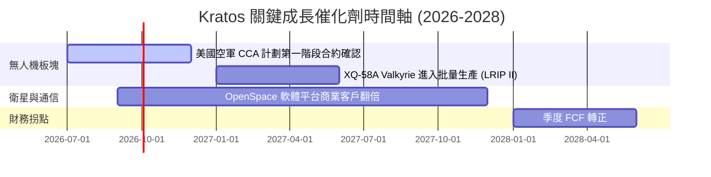

### 8.2 TAM 市場規模分析

Kratos 正在從傳統的「靶機製造商」轉型為「下一代國防科技與商業通信巨頭」，其潛在市場規模（TAM）正在急劇擴大。

```
╔══════════════════════════════════════════════════════════════════╗
║                  KTOS 2027年潛在市場規模 (TAM)                 ║
╠══════════════════════════════════════════════════════════════════╣
║                                                                  ║
║  ① 協同作戰無人機 (CCA)：  $12.0B  (KTOS 滲透率: ~15%)          ║
║  ② 商業衛星地勤軟體：      $8.5B   (KTOS 滲透率: ~10%)          ║
║  ③ 傳統靶機與電子戰：      $5.0B   (KTOS 滲透率: ~35%)          ║
║                                                                  ║
║  📊 總計 TAM 約 $25.5B ｜ 公司目前滲透率僅約 5.5%，成長空間巨大。║
╚══════════════════════════════════════════════════════════════════╝
```

### 8.3 成長驅動力結構圖

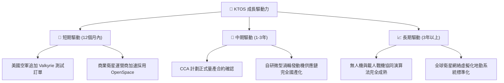

---

## 9. 風險矩陣

### 9.1 風險評分矩陣

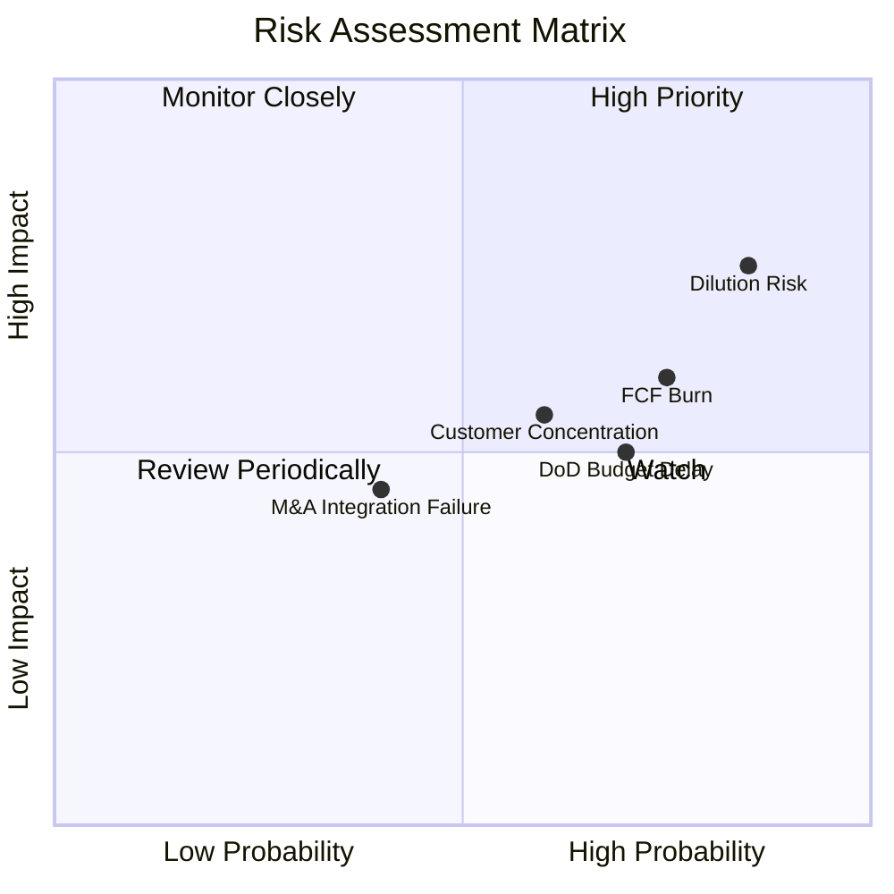

### 9.2 風險清單詳細分析

| # | 風險項目 | 發生機率 | 財務衝擊 | 風險評分 | 緩解措施 |
|---|----------|----------|----------|----------|----------|
| 1 | 🔴 **股權持續稀釋** | 高 (85%) | 高 (-15% EPS) | 🔴 8.0/10 | 管理層需承諾在帳上現金達 $1.46B 後，暫停任何公開市場募資（ATM）計劃。 |
| 2 | 🔴 **自由現金流持續流失** | 高 (75%) | 中 (-10% 估值) | 🔴 7.0/10 | 隨著無人機量產規模效應顯現，預計 2027 年 Capex 將逐步下滑，FCF 轉正。 |
| 3 | 🟡 **國防部預算通過延遲** | 中 (70%) | 中 (-5% 營收) | 🟡 6.0/10 | 透過分散客戶至商業衛星客戶（如 OpenSpace）來降低對單一政府客戶的依賴。 |
| 4 | 🟡 **大客戶集中度過高** | 中 (60%) | 中 (-10% 營收) | 🟡 5.5/10 | 拓展國際盟國（如澳洲、英國）的無人機與靶機採購合約。 |

---

## 10. 投資建議

### 10.1 最終綜合評級雷達圖

```
╔══════════════════════════════════════════════════════════════╗
║                   KTOS 最終綜合評級 (7.1分)                  ║
╠══════════════════════════════════════════════════════════════╣
║ 基本面強度：  7.5/10  ▓▓▓▓▓▓▓▓▓▓▓▓▓▓▓▓▓░░░  ★★★★☆           ║
║ 成長動能：    8.5/10  ▓▓▓▓▓▓▓▓▓▓▓▓▓▓▓▓▓▓▓░  ★★★★☆           ║
║ 財務健康：    9.5/10  ▓▓▓▓▓▓▓▓▓▓▓▓▓▓▓▓▓▓▓█  ★★★★★           ║
║ 獲利品質：    5.0/10  ▓▓▓▓▓▓▓▓▓▓░░░░░░░░░░  ★★★☆☆           ║
║ 估值合理性：  5.0/10  ▓▓▓▓▓▓▓▓▓▓░░░░░░░░░░  ★★★☆☆           ║
╠══════════════════════════════════════════════════════════════╣
║ 投資評級：    🟢 買入 (Buy)                                  ║
╚══════════════════════════════════════════════════════════════╝
```

### 10.2 目標價與隱含報酬率

| 情境 | 發生機率 | 12M 目標價 | 當前股價 | 隱含報酬率 | 加權預期報酬率 |
|------|----------|------------|----------|------------|----------------|
| 🔴 悲觀情境 | 20% | $40.00 | $48.21 | -17.0% | -3.4% |
| 🟡 **基準情境** | **60%** | **$65.00** | **$48.21** | **+34.8%** | **+20.9%** |
| 🟢 樂觀情境 | 20% | $90.00 | $48.21 | +86.7% | +17.3% |
| **綜合加權** | **100%** | **$65.00** | **$48.21** | **+34.8%** | **+34.8%** |

### 10.3 買入時機與觸發因素

```
╔══════════════════════════════════════════════════════════════════╗
║                  ✅ 買入觸發因素 Checklist                      ║
╠══════════════════════════════════════════════════════════════════╣
║                                                                  ║
║  立即買入觸發條件（多數符合）：                                  ║
║  ✅ 股價回撤至 $45 - $48 區間（已符合，當前 $48.21）             ║
║  ✅ Q1 2026 營收成長維持在 20% 以上（已符合，實際 22.6%）        ║
║  ✅ 帳上淨現金大於 $1.0B（已符合，實際 $1.28B）                  ║
║                                                                  ║
║  加碼觸發條件（出現以下任一）：                                  ║
║  ☐ 美國空軍正式宣布將 XQ-58A 納入 CCA 計劃採購清單               ║
║  ☐ 季度自由現金流（FCF）首次轉正                                 ║
║                                                                  ║
║  減碼/停損觸發條件（出現以下任一）：                             ║
║  ☐ 宣佈新一輪公開市場增資（ATM），導致股數再次稀釋 > 5%          ║
║  ☐ 營收成長率連續兩季跌破 10%                                    ║
╚══════════════════════════════════════════════════════════════════╝
```

### 10.4 投資人適配度分析

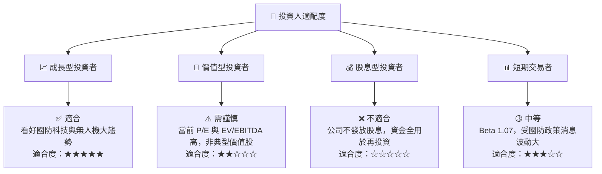

### 10.5 每季財報監控清單（Quarterly Watch List）

為了持續追蹤 KTOS 的投資邏輯是否成立，投資人應於每季財報公佈時重點監控以下指標：

| 監控指標 | 基準值 (當前) | 觸發加碼門檻 | 觸發減碼/警示門檻 | 追蹤意義 |
|----------|--------------|--------------|-------------------|----------|
| **無人系統 (US) 營收成長率** | ~15% YoY | ≥ 25% YoY | < 5% YoY | 衡量無人機板塊是否真正進入量產爆發期。 |
| **季度自由現金流 (FCF)** | -$47.30M | > $0 (轉正) | < -$60.00M (失血加劇) | 評估資本支出（Capex）是否開始轉化為現金回報。 |
| **發行在外股數 (Shares Outstanding)** | 187.52M | 保持穩定 (0% 稀釋) | > 195.00M (稀釋超預期) | 監控管理層是否繼續稀釋股東權益。 |
| **整體毛利率 (Gross Margin)** | 22.9% | ≥ 25.0% | < 21.0% | 評估高毛利軟體（OpenSpace）佔比是否提升。 |

### 10.6 反面論證：什麼會證明論點錯誤（What Would Change My Mind）

```
╔══════════════════════════════════════════════════════════════════╗
║              ⚠️ 論點失效條件（Disconfirming Evidence）           ║
╠══════════════════════════════════════════════════════════════════╣
║  本投資論點在下列情況成立時應重新檢視或退出：                    ║
║  ☐ 核心無人機業務（US 板塊）營收成長率連續兩季 < 5%              ║
║  ☐ 2027 年底前，自由現金流（FCF）仍未能實現季度轉正              ║
║  ☐ ROIC 跌破 1.5%，顯示資本配置效率進一步惡化                    ║
║  ☐ 美國空軍 CCA 計劃將主要份額完全給予波音或諾格，KTOS 被邊緣化  ║
║  ☐ 發行股數在未來 12 個月內因增資再度膨脹超過 8%                 ║
╚══════════════════════════════════════════════════════════════════╝
```

---

> **免責聲明**：本報告為 AI 自動生成，僅供研究參考，不構成投資建議。投資有風險，入市需謹慎。