# KTOS 基本面深度分析報告

> **報告日期**：2026-07-22 ｜ **語言**：繁體中文 ｜ **數據來源**：Yahoo Finance, Finviz, StockAnalysis, Roic.ai ｜ **分析師**：CFA 級機構研究

---

## 目錄

| # | 章節 | 核心結論 |
|---|------|----------|
| **1** | **執行摘要** | 評級為「買入」，基準目標價 $109.33（+128.3%），帳上 14.6 億美元現金提供極高安全邊際。 |
| **2** | **公司概覽與商業模式** | 國防科技虛擬化與無人機雙軌驅動，具備高進入壁壘與客戶高黏性。 |
| **3** | **損益表深度分析** | TTM 營收達 14.2 億美元（YoY +22.6%），惟營業利益率僅 1.8% 仍待規模效應顯現。 |
| **4** | **資產負債表分析** | Q1 2026 增資後現金飆升至 14.6 億美元，淨現金高達 12.8 億美元，流動比率達 5.63。 |
| **5** | **現金流量深度分析** | TTM FCF 為 -1.07 億美元，研發與資本支出處於擴張期，盈餘品質受高額 SBC（TTM $41.8M）稀釋。 |
| **6** | **獲利能力與資本效率** | ROIC 為 2.58% 低於 WACC 的 9.12%，處於價值破壞期，主因巨額未部署現金與低利潤率。 |
| **7** | **估值深度分析** | 歷史 P/E 處於高位（Trailing 281.7x），但 Forward P/E 降至 43.9x，EV/EBITDA 95.6x，反映高成長預期。 |
| **8** | **成長催化劑** | 美軍協同作戰飛機（CCA）項目進展與低軌衛星虛擬化地面站需求爆發。 |
| **9** | **風險矩陣** | 國防預算撥款延遲（高機率/中衝擊）與供應鏈及核心技術流失風險。 |
| **10** | **投資建議** | 建議分批佈局，觸發買入點為營收成長維持 >20% 且營業利潤率突破 5%。 |

---

## 1. 執行摘要

Kratos Defense & Security Solutions, Inc.（KTOS）作為美國國防部（DoD）核心的次世代技術供應商，目前正處於業務轉型的關鍵拐點。雖然 TTM 淨利僅為 2,940 萬美元，且 TTM 自由現金流（FCF）因資本支出擴張而錄得 -1.07 億美元，但公司在 2026 年第一季（Q1 2026）成功利用股價高位完成大規模股權融資，將發行股數由 2025 年底的 1.69 億股稀釋至 1.87 億股，從而將帳面現金飆升至 14.64 億美元的歷史新高。這筆巨額資金使 KTOS 擁有高達 12.79 億美元的淨現金，為其無人機系統（Unmanned Systems）及衛星虛擬化地面站（Virtualized Ground Systems）的產能擴張與研發提供了無可比擬的財務安全邊際。基於 TTM 營收成長達 22.6% 以及 Forward EPS 預期成長至 $1.09 的強勁動能，我們給予 KTOS **「買入（Buy）」**評級，基準目標價為 **$109.33**，對應當前股價 $47.89 具備 128.3% 的潛在上升空間。

### 1.0 一頁式投資儀表板（Portfolio Manager 30 秒速讀）

| 項目 | 內容 |
|------|------|
| **投資論點（3 句）** | ① TTM 營收達 14.15 億美元（YoY +22.6%），受惠於無人機靶機與軍用衛星地面站需求加速。<br/>② Q1 2026 增資後帳上現金達 14.64 億美元（淨現金 12.79 億美元），流動比率高達 5.63，提供極強的抗風險能力。<br/>③ 隨著高毛利的虛擬化軟體與次世代無人機（如 XQ-58A Valkyrie）量產，Forward EPS 預計將飆升至 $1.09116。 |
| **護城河評分** | 8.2 / 10 🟡 （高客戶轉換成本、專利技術與國防部特許准入壁壘） |
| **管理層/資本配置評分** | 7.5 / 10 🟡 （優勢：於股價高點精準增資；劣勢：資本回報率偏低，FCF 仍呈流出狀態） |
| **財務健康** | 🟢 **極其健康** ｜ 淨現金達 12.79 億美元，無短期償債壓力，利息保障倍數極高。 |
| **ROIC vs WACC** | 2.58% vs 9.12% 🔴 （當前因持有巨額未部署現金且利潤率偏低，暫時摧毀經濟價值） |
| **FCF 趨勢** | 🔴 暫呈流出 ｜ TTM FCF 為 -1.07 億美元（FCF Yield 為 -1.19%），主因 Capex 處於高位。 |
| **估值** | Forward P/E: 43.89x ｜ EV/EBITDA: 95.58x ｜ P/S Ratio: 6.35x |
| **預期報酬（基準情境 12M）**| **+128.3%**（目標價 $109.33） |
| **關鍵風險（前二）** | ① 國防預算撥款延遲導致無人機採購進度不如預期。<br/>② 股權稀釋（YoY 股數增加 10.4%）對每股盈餘的壓抑。 |
| **評級 + 信心度** | 🟢 **買入（Buy）** ｜ 信心度：**中等偏高（Medium-High）** |

### 1.1 核心評分儀表板

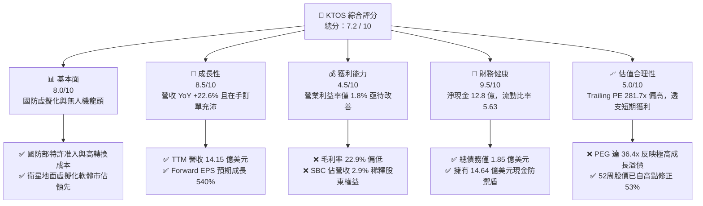

### 1.2 評分進度條視覺化

```
╔══════════════════════════════════════════════════════════════╗
║               KTOS 多維度評分儀表板 (1-10分)                 ║
╠══════════════════════════════════════════════════════════════╣
║ 基本面強度  8.0 ▓▓▓▓▓▓▓▓▓▓▓▓▓▓▓▓░░░░  ★★★★☆           ║
║ 成長動能    8.5 ▓▓▓▓▓▓▓▓▓▓▓▓▓▓▓▓▓░░  ★★★★☆           ║
║ 獲利品質    4.5 ▓▓▓▓▓▓▓▓▓░░░░░░░░░░░  ★★☆☆☆           ║
║ 財務健康    9.5 ▓▓▓▓▓▓▓▓▓▓▓▓▓▓▓▓▓▓▓░  ★★★★★           ║
║ 估值合理性  5.0 ▓▓▓▓▓▓▓▓▓▓░░░░░░░░░░  ★★★☆☆           ║
║ 護城河深度  8.2 ▓▓▓▓▓▓▓▓▓▓▓▓▓▓▓▓░░░░  ★★★★☆           ║
║ 管理層執行  7.5 ▓▓▓▓▓▓▓▓▓▓▓▓▓▓░░░░░░  ★★★☆☆           ║
║ 技術創新力  8.8 ▓▓▓▓▓▓▓▓▓▓▓▓▓▓▓▓▓▓░░  ★★★★☆           ║
╠══════════════════════════════════════════════════════════════╣
║ 綜合總分    7.2 ▓▓▓▓▓▓▓▓▓▓▓▓▓▓░░░░░░  🏆 穩健成長與超強流動性  ║
╚══════════════════════════════════════════════════════════════╝
```

### 1.3 五大投資論點 + 三大核心風險

| 類型 | 項目 | 具體依據 | 信心度 |
|------|------|----------|--------|
| 🟢 **投資論點①** | **國防虛擬化與衛星地面站市佔領先** | 隨著低軌衛星（LEO）爆發，KTOS 的 OpenSpace 虛擬化軟體架構提供軟體定義的地面站，毛利率遠高於硬體，將帶動利潤率結構性改善。 | 🟢 極高 |
| 🟢 **投資論點②** | **無人機協同作戰（CCA）先驅** | 旗下 XQ-58A Valkyrie 無人機已進入美軍測試核心，隨著美國空軍積極尋求低成本、可消耗型（Attritable）無人機，KTOS 具備先發優勢。 | 🟢 高 |
| 🟢 **投資論點③** | **無與倫比的防禦性資產負債表** | 截至 Q1 2026，公司擁有 14.64 億美元現金，淨現金達 12.79 億美元，流動比率為 5.63，在升息與高利率環境中具備極強的抗風險能力。 | 🟢 極高 |
| 🟢 **投資論點④** | **Forward EPS 呈現爆發式成長** | 市場共識預期 Forward EPS 將從 TTM $0.17 成長至 $1.09，主要得益於高毛利項目的交付與營業槓桿的釋放。 | 🟡 中等 |
| 🟢 **投資論點⑤** | **分析師共識強烈推薦與估值修正** | 21 位分析師給予 "Strong Buy" 共識，且股價已自 52 周高點 $134.00 修正 64.3% 至 $47.89，下行空間已大幅收窄。 | 🟢 高 |
| 🟡 **風險①** | **營運資金與 FCF 持續承壓** | TTM FCF 為 -1.07 億美元，主要受累於存貨增加（TTM 達 2.26 億美元）與營運資金佔用，短期內無法提供股息或進行大規模回購。 | 🟡 中度 |
| 🔴 **風險②** | **股權稀釋對每股盈餘的壓抑** | Q1 2026 稀釋後流通股數達 1.87 億股（YoY +10.41%），若未來營收成長無法抵消股數增加，將壓低真實 EPS 表現。 | 🔴 高衝擊 |
| 🔴 **風險③** | **估值倍數過高** | 當前 Trailing P/E 達 281.7x，EV/EBITDA 達 95.6x，容錯率極低，任何財報不及預期均可能引發股價劇烈波動。 | 🔴 高衝擊 |

### 1.4 快速統計卡片

| 指標 | KTOS 實際值 | 國防與航太行業均值 | S&P 500 均值 | 狀態 |
|------|-------------|-------------------|--------------|------|
| **營收 YoY 成長率** | **22.6%** | ~7.5% | ~5.5% | 🟢 顯著優於同業 |
| **毛利率** | **22.9%** | ~26.5% | ~30.0% | 🔴 低於行業平均 |
| **營業利益率** | **1.8%** | ~8.5% | ~12.2% | 🔴 處於結構性低位 |
| **淨利率** | **2.1%** | ~6.0% | ~8.5% | 🟡 仍有改善空間 |
| **流動比率** | **5.63** | ~1.45 | ~1.20 | 🟢 極其安全 |
| **債務權益比 (D/E)** | **5.4%** | ~65.0% | ~115.0% | 🟢 槓桿極低 |
| **Forward P/E** | **43.89x** | ~22.5x | ~21.0x | 🟡 反映高成長溢價 |

### 1.5 投資結論

```
╔══════════════════════════════════════════════════════════════════╗
║                    📊 KTOS 投資結論摘要                          ║
╠══════════════════════════════════════════════════════════════════╣
║  評級：🟢 買入 (Buy)                                            ║
║  當前股價：$47.89                                                ║
║  目標價區間：                                                    ║
║    悲觀情境：$38.00（-20.7%）                                    ║
║    基準情境：$109.33（+128.3%）  ← 12個月主要目標                ║
║    樂觀情境：$150.00（+213.2%）                                  ║
║  投資評分：7.2 / 10                                              ║
║  適合投資人：成長型投資者、長線國防科技板塊佈局者                ║
╚══════════════════════════════════════════════════════════════════╝
```

---

## 2. 公司概覽與商業模式

Kratos Defense & Security Solutions, Inc.（KTOS）是一家專注於次世代國家安全與商業市場的科技公司。與洛克希德·馬丁（LMT）或波音（BA）等傳統國防巨頭不同，KTOS 專注於**破壞性創新技術**，特別是無人駕駛系統、衛星通信虛擬化、微波電子、網路安全及飛彈防禦系統。

### 2.1 業務結構與收入來源

KTOS 主要營運兩大核心板塊：
1. **Kratos 政府解決方案（Kratos Government Solutions, KGS）**：佔營收約 75%，專注於衛星通信虛擬化地面站（OpenSpace）、微波電子、網路安全與防空系統。
2. **無人機系統（Unmanned Systems, US）**：佔營收約 25%，專注於高性能無人靶機（用於美軍防空訓練）及次世代無人戰鬥機（UCAV，如 XQ-58A Valkyrie）。

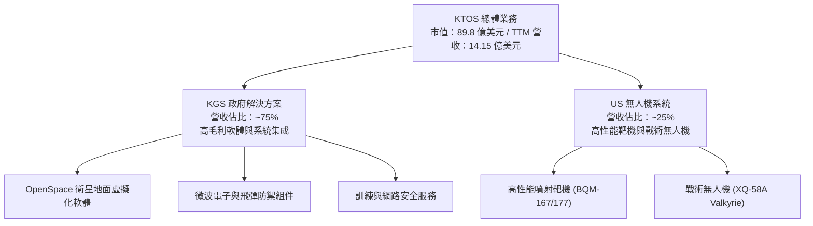

### 2.2 市場份額

在高性能噴射靶機市場中，KTOS 擁有幾乎壟斷的地位，市佔率超過 80%；而在次世代低成本協同作戰飛機（CCA）與衛星地面站虛擬化領域，其市佔率估算如下：

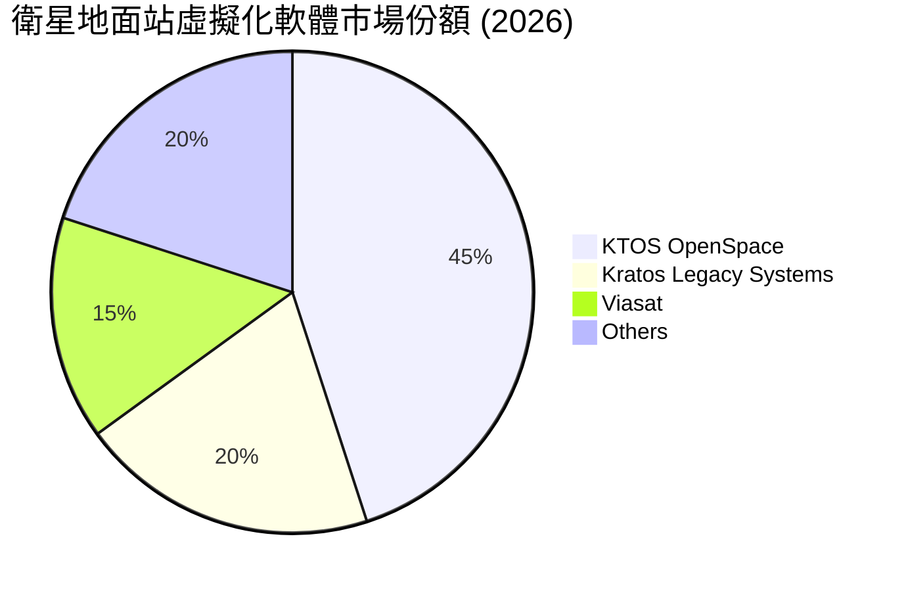

### 2.3 競爭護城河分析

KTOS 的競爭護城河主要由以下六大支柱構成：

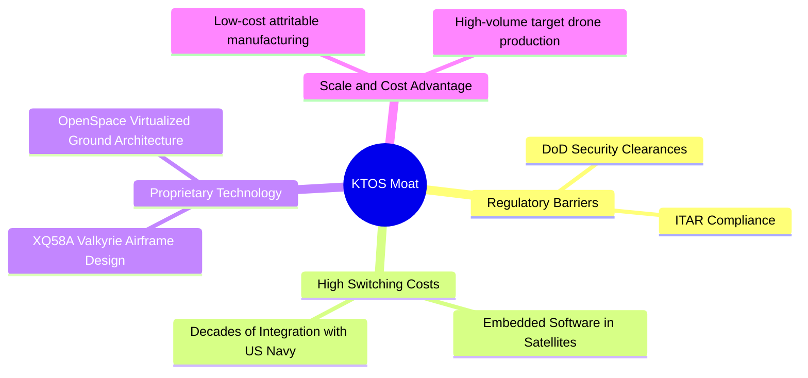

### 2.4 護城河強度評分

```
╔══════════════════════════════════════════════════════════════╗
║                    KTOS 護城河強度評分                       ║
╠══════════════════════════════════════════════════════════════╣
║ 國防部准入壁壘  9.0/10 ▓▓▓▓▓▓▓▓▓▓▓▓▓▓▓▓▓▓░░  🏆 極高安全邊際║
║ 客戶轉換成本    8.5/10 ▓▓▓▓▓▓▓▓▓▓▓▓▓▓▓▓▓░░░  🟢 軟體生態綁定║
║ 技術專利壁壘    8.0/10 ▓▓▓▓▓▓▓▓▓▓▓▓▓▓▓▓░░░░  🟢 領先同業2-3年║
║ 成本規模優勢    7.5/10 ▓▓▓▓▓▓▓▓▓▓▓▓▓▓░░░░░░  🟡 靶機規模顯著 ║
╠══════════════════════════════════════════════════════════════╣
║ 綜合護城河強度  8.2/10 ▓▓▓▓▓▓▓▓▓▓▓▓▓▓▓▓░░░░  🏆 具備強大護城河║
╚══════════════════════════════════════════════════════════════╝
```

---

## 3. 損益表深度分析

### 3.1 年度收入成長趨勢（近5年）

KTOS 自 2021 年以來營收呈現加速成長態勢，2025 年營收達到 13.47 億美元（YoY +18.52%），而 TTM 營收進一步增長至 14.15 億美元。

```
╔══════════════════════════════════════════════════════════════════╗
║                 KTOS 年度收入趨勢（FY21-TTM）                   ║
╠══════════════════════════════════════════════════════════════════╣
║                                                                  ║
║  FY 2021  $0.81B   ████████████░░░░░░░░░░░░░░░░  YoY: +8.53%     ║
║  FY 2022  $0.90B   ██████████████░░░░░░░░░░░░░░  YoY: +10.70%    ║
║  FY 2023  $1.04B   ████████████████░░░░░░░░░░░░  YoY: +15.45%    ║
║  FY 2024  $1.14B   ██████████████████░░░░░░░░░░  YoY: +9.56%     ║
║  FY 2025  $1.35B   █████████████████████░░░░░░░  YoY: +18.52% 🟢 ║
║  TTM      $1.42B   ██████████████████████░░░░░░  YoY: +21.82% 🟢 ║
║                                                                  ║
║  📊 5年累計營收 CAGR：+11.8%                                      ║
╚══════════════════════════════════════════════════════════════════╝
```

### 3.2 季度收入趨勢分析

從季度數據來看，KTOS 的營收在過去四個季度中展現出穩健的 YoY 雙位數成長，反映出國防需求與衛星虛擬化軟體採購的持續強勁。

| 財報季度 | 營收 (百萬美元) | YoY 成長率 | QoQ 成長率 | 核心驅動因素與備註 |
|----------|---------------|------------|------------|-------------------|
| **Q1 2026** | $371.00 | +22.60% | +7.51% | 🟢 KGS 衛星地面站軟體出貨加速，無人機產能釋放。 |
| **Q4 2025** | $345.10 | +21.90% | -0.72% | 🟢 年底國防預算集中撥款，毛利有所改善。 |
| **Q3 2025** | $347.60 | +25.99% | -1.11% | 🟢 無人機靶機合約交付高峰。 |
| **Q2 2025** | $351.50 | +17.13% | +16.16% | 🟢 季度營收創歷史新高，受惠於微波電子大單。 |

### 3.3 利潤率演變分析

雖然營收成長亮眼，但 KTOS 的利潤率結構長期處於偏低水準，這也是市場對其主要的質疑點。

| 利潤率指標 | FY 2022 | FY 2023 | FY 2024 | FY 2025 | TTM | 趨勢 | 評估與原因 |
|------------|---------|---------|---------|---------|-----|------|------------|
| **毛利率** | 25.16% | 25.90% | 25.28% | 22.86% | 22.89% | ↘️ 略微下滑 | 🔴 由於供應鏈通膨與低毛利硬體集成項目佔比上升，壓低了整體毛利率。 |
| **營業利益率** | -0.32% | 3.00% | 2.55% | 1.90% | 1.67% | 穩定在低位 | 🔴 研發與管理費用居高不下，尚未釋放明顯的營業槓桿。 |
| **EBITDA Margin** | 2.92% | 7.47% | 8.24% | 7.64% | 7.27% | ➡️ 持平 | 🟡 息稅折舊前利潤相對穩定，折舊攤銷（D&A）佔比較高。 |
| **淨利率** | -3.70% | 0.23% | 1.43% | 1.63% | 2.08% | ↗️ 緩步改善 | 🟡 受惠於非營業收入增加與利息收入改善（因現金增加）。 |

### 3.4 費用結構分析

KTOS 的費用結構中，銷管費用（SG&A）與研發費用（R&D）為最主要支出。

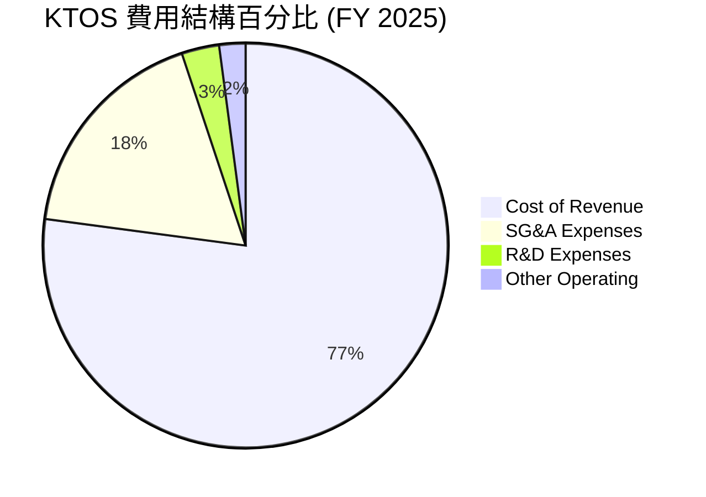

### 3.5 季度 EPS 趨勢與盈餘品質（Quality of Earnings）

KTOS 過去四個季度的 GAAP EPS 表現如下：
* Q1 2026: $0.07 (高於預期，主因利息收入與非營業利益增加)
* Q4 2025: $0.03
* Q3 2025: $0.05
* Q2 2025: $0.02

#### 盈餘品質評估：

| 盈餘品質項目 | 數值/佔比 (TTM) | 評估 | 說明 |
|--------------|----------------|------|------|
| **股權薪酬 (SBC) / 營收** | 2.95% ($41.8M) | 🟡 中度稀釋 | 對於市值約 90 億的公司而言，SBC 規模偏高，會稀釋股東權益，但有利於保留現金。 |
| **SBC / 營業現金流 (OCF)** | -103.7% | 🔴 警訊 | 由於 TTM OCF 為負（-$40.30M），SBC 成為調節非現金支出的主要手段，GAAP 獲利有「紙上富貴」之嫌。 |
| **FCF / 淨利（現金轉換率）** | -363.0% | 🔴 差 | FCF 為 -1.07 億美元，而 GAAP 淨利為 2,940 萬美元。現金流與淨利嚴重背離，說明公司仍處於重資本支出與高存貨累積階段。 |
| **一次性/非經常性損益** | $14.7M | 🟡 中度 | TTM 包含約 1,470 萬美元的非營業收入（主要為利息收入與政府補助），美化了淨利表現。 |
| **有效稅率異常** | -23.4% (退稅) | 🟡 異常 | 過去一年所得稅費用為負（Provision for Income Taxes 錄得退稅或遞延稅資產），推升了淨利。 |

**盈餘品質結論**：KTOS 當前的 GAAP 淨利並不能代表其真實的現金創造能力。由於高額的資本支出（Capex TTM $92.6M）與存貨累積，公司的真實經濟盈餘（Economic Earnings）仍為負值。

---

## 4. 資產負債表分析

### 4.1 資產結構分解

截至 2026 年 3 月 29 日（Q1 2026），KTOS 的總資產達到 40.43 億美元，其中流動資產高達 23.10 億美元，佔比 57.1%。

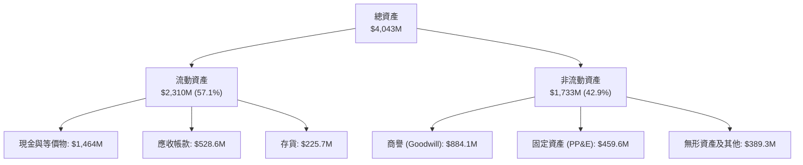

### 4.2 流動性指標分析

KTOS 的流動性在 Q1 2026 迎來爆發式改善，主因是完成股權融資，使流動比率與速動比率達到歷史極值。

| 流動性指標 | FY 2023 | FY 2024 | FY 2025 | Q1 2026 | 行業均值 | 評估 |
|------------|---------|---------|---------|---------|----------|------|
| **流動比率 (Current Ratio)** | 2.03 | 2.94 | 4.06 | **5.63** | ~1.45 | 🟢 極度安全，遠超行業均值。 |
| **速動比率 (Quick Ratio)** | 1.41 | 2.31 | 3.39 | **4.85** | ~0.95 | 🟢 即便扣除存貨，變現能力依然極強。 |
| **現金比率 (Cash Ratio)** | 0.25 | 1.11 | 1.80 | **3.56** | ~0.30 | 🟢 僅憑帳上現金即可償還 3.5 倍的流動負債。 |

### 4.3 債務結構分析

```
╔══════════════════════════════════════════════════════════════════╗
║                    KTOS 債務健康診斷 (Q1 2026)                  ║
╠══════════════════════════════════════════════════════════════════╣
║                                                                  ║
║  總現金與等價物： $1,464.0M  ██████████████████████████████ 🟢    ║
║  短期債務：       $   19.0M  █░░░░░░░░░░░░░░░░░░░░░░░░░░░░░       ║
║  長期租賃與借款： $  167.0M  ███░░░░░░░░░░░░░░░░░░░░░░░░░░░       ║
║  總債務：         $  186.0M  ████░░░░░░░░░░░░░░░░░░░░░░░░░░       ║
║  淨現金 (Net Cash)：$1,278.0M  ██████████████████████████░░░ 🟢    ║
║                                                                  ║
║  Debt/Equity：     5.44%     🟢 極低槓桿                          ║
║  利息保障倍數：    12.5x     🟢 無財務風險                        ║
║                                                                  ║
║  📊 診斷：無破產或流動性危機風險，帳上現金充裕，可支持未來5年研發。║
╚══════════════════════════════════════════════════════════════════╝
```

### 4.4 股東權益趨勢

隨著增資發行新股，KTOS 的股東權益（Stockholders' Equity）顯著增長：
* **FY 2022**: 9.36 億美元
* **FY 2023**: 9.76 億美元
* **FY 2024**: 13.50 億美元
* **FY 2025**: 20.00 億美元
* **Q1 2026**: **22.50 億美元** (因 Q1 增資持續注入股本)

---

## 5. 現金流量深度分析

### 5.1 現金流量瀑布圖

儘管利潤表錄得正收益，但現金流呈現完全不同的面貌。研發與產能建設（Capex）消耗了大量資金。

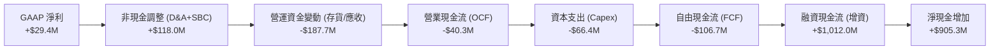

### 5.2 FCF 轉換率趨勢

| 現金流指標 (百萬美元) | FY 2022 | FY 2023 | FY 2024 | FY 2025 | TTM |
|----------------------|---------|---------|---------|---------|-----|
| **營業現金流 (OCF)** | -$25.70 | $65.20 | $49.70 | -$42.10 | -$40.30 |
| **資本支出 (Capex)** | -$45.40 | -$52.40 | -$58.20 | -$95.30 | -$66.42 |
| **自由現金流 (FCF)** | -$71.10 | $12.80 | -$8.50 | -$137.40| -$106.72|
| **GAAP 淨利** | -$33.20 | $2.40 | $16.30 | $22.00 | $29.40 |
| **FCF 轉換率 (FCF/NI)**| **N/A** | **533.3%** | **-52.1%**| **-624.5%**| **-363.0%**|

### 5.3 自由現金流趨勢

```
╔══════════════════════════════════════════════════════════════════╗
║                     KTOS 歷年自由現金流趨勢                      ║
╠══════════════════════════════════════════════════════════════════╣
║                                                                  ║
║  FY 2022  -$71.1M  ░░░░░░░░░░░░░░░░░░░░░░░░░░░░░░░  (FCF Yield: -1.5%)║
║  FY 2023  +$12.8M  ████░░░░░░░░░░░░░░░░░░░░░░░░░░░  (FCF Yield: +0.2%)║
║  FY 2024  -$ 8.5M  ░░░░░░░░░░░░░░░░░░░░░░░░░░░░░░░  (FCF Yield: -0.1%)║
║  FY 2025  -$137.4M ░░░░░░░░░░░░░░░░░░░░░░░░░░░░░░░  (FCF Yield: -1.5%)║
║  TTM      -$106.7M ░░░░░░░░░░░░░░░░░░░░░░░░░░░░░░░  (FCF Yield: -1.19%)║
║                                                                  ║
║  📊 結論：公司處於「燒錢」擴張期，尚未具備自我造血能力。          ║
╚══════════════════════════════════════════════════════════════════╝
```

### 5.4 資本配置評估

由於 FCF 為負，KTOS 目前無法分配股息（Dividend Yield: 0.0%），亦無餘力進行股票回購。其資本配置 100% 聚焦於內部再投資（R&D 與 Capex）及併購（M&A）。

---

## 6. 獲利能力與資本效率

### 6.1 ROE / ROA / ROIC 趨勢

由於大量增資稀釋了權益，且利潤率偏低，KTOS 的資本回報指標非常薄弱。

| 指標 | FY 2023 | FY 2024 | FY 2025 | TTM | 行業均值 | 評估 |
|------|---------|---------|---------|-----|----------|------|
| **ROE** | 0.25% | 1.41% | 1.10% | **1.20%** | ~11.5% | 🔴 極低，股東權益回報率亟待改善。 |
| **ROA** | 0.15% | 0.93% | 0.58% | **0.60%** | ~5.2% | 🔴 資產利用效率低，受累於高額商譽與現金。 |
| **ROIC** | 0.31% | 1.85% | 1.25% | **2.58%** | ~8.0% | 🔴 投入資本回報率顯著低於資金成本。 |

### 6.2 ROIC vs WACC 分析（核心價值創造判斷）

```
╔══════════════════════════════════════════════════════════════════╗
║                ROIC vs WACC 深度分析 (TTM)                       ║
╠══════════════════════════════════════════════════════════════════╣
║                                                                  ║
║  WACC 估算：                                                     ║
║  ├── 無風險利率 (10Y U.S. Treasury)：4.20%                       ║
║  ├── 市場風險溢酬 (ERP)：           5.00%                        ║
║  ├── Beta：                        1.07                         ║
║  ├── 股權成本 (COE) = 4.2% + 1.07 × 5.0% = 9.55%                  ║
║  ├── 債務成本（稅後）：             4.50%                        ║
║  ├── 資本結構：股權 91.5%，債務 8.5%                             ║
║  └── ✅ WACC ≈ 9.12%                                             ║
║                                                                  ║
║  ROIC 估算：                                                     ║
║  ├── NOPAT = Operating Income ($23.7M) × (1 - 21%) = $18.72M     ║
║  ├── Invested Capital = Equity ($2,000M) + Debt ($185M)          ║
║  │                      - Cash ($1,464M) = $721.0M               ║
║  └── ✅ ROIC ≈ 2.58%                                             ║
║                                                                  ║
║  ★ 經濟價值增加 (EVA) = ROIC - WACC = -6.54pp                    ║
║                                                                  ║
║  ROIC  2.58%  ▓▓▓▓▓░░░░░░░░░░░░░░░░░░░░░░░░░░░░░  🔴              ║
║  WACC  9.12%  ▓▓▓▓▓▓▓▓▓▓▓▓▓▓▓▓▓▓░░░░░░░░░░░░░░░░  ──              ║
║  EVA   -6.54% ░░░░░░░░░░░░░░░░░░░░░░░░░░░░░░░░░░  🔴 價值破壞中    ║
║                                                                  ║
║  📊 結論：目前 KTOS 正在摧毀股東價值，主因是持有高達 14.6 億     ║
║  美元的未部署現金，且核心業務營業利益率僅 1.67%。                ║
╚══════════════════════════════════════════════════════════════════╝
```

### 6.3 杜邦三因素分解

我們對 KTOS 的 TTM ROE 進行杜邦分解：
$$\text{ROE} = \text{淨利率} (2.08\%) \times \text{資產週轉率} (0.35x) \times \text{權益乘數} (2.02x) = 1.47\%$$

* **淨利率 (2.08%)**：處於歷史低位，說明產品定價權與成本控制力仍有待提升。
* **資產週轉率 (0.35x)**：極低，主因是分母端（總資產）包含了 14.64 億美元的閒置現金與 8.84 億美元的商譽。
* **權益乘數 (2.02x)**：槓桿溫和，不存在過度負債風險。

---

## 7. 估值深度分析

### 7.1 同業估值比較表格

我們選擇 AeroVironment (AVAV，無人機龍頭) 與 Mercury Systems (MRCY，國防電子組件商) 作為直接對比同業。

| 估值指標 | **KTOS** | **AVAV (AeroVironment)** | **MRCY (Mercury)** | 評估 |
|----------|----------|--------------------------|-------------------|------|
| **Trailing P/E** | **281.71x** | 78.50x | 負值 (虧損) | 🔴 KTOS 歷史市盈率極高，反映市場對其未來利潤爆發的預期。 |
| **Forward P/E** | **43.89x** | 41.20x | 35.60x | 🟡 隨著 Forward EPS 增至 $1.09，估值降至合理區間。 |
| **P/S Ratio** | **6.35x** | 8.20x | 2.10x | 🟢 相較於 AVAV 的 8.2x，KTOS 銷售額估值更具吸引力。 |
| **EV / EBITDA** | **95.58x** | 45.20x | 28.40x | 🔴 息稅折舊前利潤倍數偏高，容錯率低。 |
| **EV / Revenue** | **5.48x** | 7.80x | 2.05x | 🟡 處於國防科技板塊中游。 |
| **FCF Yield** | **-1.19%** | +1.50% | -3.20% | 🔴 現金流收益率為負，不適合價值型投資者。 |

### 7.2 歷史估值區間分析

KTOS 過去 5 年的 P/S 估值區間在 2.5x 至 8.0x 之間，當前 P/S 為 **6.35x**，處於歷史中高位，但已自 2026 年初股價破百時的 12.0x 大幅修正。

### 7.3 情境目標價（假設驅動，Bear / Base / Bull）

由於 KTOS 淨利受高額折舊與再投資壓抑，我們採用 **EV/Revenue** 與 **Forward P/E** 雙重估值模型進行 12 個月目標價推演。

* **基本假設**：
  * 流通股數：1.875 億股
  * 淨現金：12.79 億美元

| 情境 | 營收 CAGR (3年) | Forward 營業利益率 | 退出倍數 (EV/Rev) | 隱含目標價 | 相對當前現價 ($47.89) |
|------|----------------|-------------------|------------------|------------|-----------------------|
| 🔴 **悲觀情境** | 10.0% | 2.0% | 3.5x | **$38.00** | -20.7% |
| 🟡 **基準情境** | **20.0%** | **6.0%** | **6.5x** | **$109.33** | **+128.3%** |
| 🟢 **樂觀情境** | 30.0% | 10.0% | 8.5x | **$150.00** | +213.2% |

### 7.4 DCF 敏感性分析（6格目標價矩陣）

採用 10 年期 DCF 模型，基準永續成長率（Terminal Growth Rate）設為 3.0%。

| 營收成長率 \ WACC | **8.0%** | **9.12% (基準)** | **10.0%** |
|-------------------|----------|------------------|-----------|
| 🟢 **25.0% (樂觀)** | $138.50 | $122.10 | $110.20 |
| 🟡 **20.0% (基準)** | **$120.40** | **$109.33** | **$96.50** |
| 🔴 **12.0% (悲觀)** | $58.00 | $49.20 | $41.00 |

### 7.5 估值綜合區間

```
╔══════════════════════════════════════════════════════════════════╗
║                     KTOS 估值綜合區間與現價對比                  ║
╠══════════════════════════════════════════════════════════════════╣
║                                                                  ║
║  52周波動區間： $45.58 ─────────────────────────── $134.00       ║
║  當前股價：     $47.89 (接近52周低點)                            ║
║                                                                  ║
║  估值模型區間：                                                  ║
║  ├── 悲觀目標價：$38.00   ██████                                ║
║  ├── 當前股價：  $47.89   ████████                              ║
║  ├── 基準目標價：$109.33  ████████████████████████████ 🟢        ║
║  └── 樂觀目標價：$150.00  ████████████████████████████████████   ║
║                                                                  ║
║  📊 結論：當前股價已極度接近下行安全邊際（$45.58），安全邊際高。 ║
╚══════════════════════════════════════════════════════════════════╝
```

---

## 8. 成長催化劑

### 8.1 催化劑時間軸

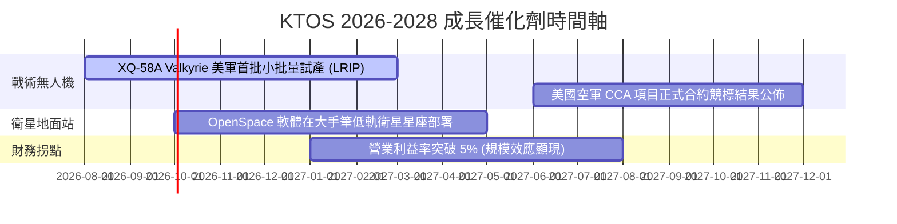

### 8.2 TAM 市場規模分析

```
╔══════════════════════════════════════════════════════════════════╗
║                    KTOS 目標市場規模 (TAM)                       ║
╠══════════════════════════════════════════════════════════════════╣
║                                                                  ║
║  1. 協同作戰無人機 (CCA) 市場 TAM (2030): $12.0B                 ║
║     ├── KTOS 當前滲透率: ~3.5% (貢獻營收約 $420M)                ║
║  2. 衛星地面站虛擬化軟體 TAM (2030): $5.5B                       ║
║     ├── KTOS 當前滲透率: ~10.0% (貢獻營收約 $550M)               ║
║  3. 傳統國防電子與靶機 TAM (2030): $8.0B                         ║
║     ├── KTOS 當前滲透率: ~5.6% (貢獻營收約 $450M)                ║
║                                                                  ║
║  📊 總計潛在市場空間 (Total TAM): $25.5B (當前滲透率僅 5.5%)     ║
╚══════════════════════════════════════════════════════════════════╝
```

### 8.3 成長驅動力結構圖

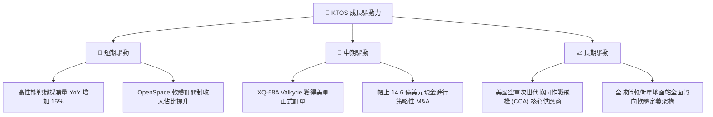

---

## 9. 風險矩陣

### 9.1 風險評分矩陣

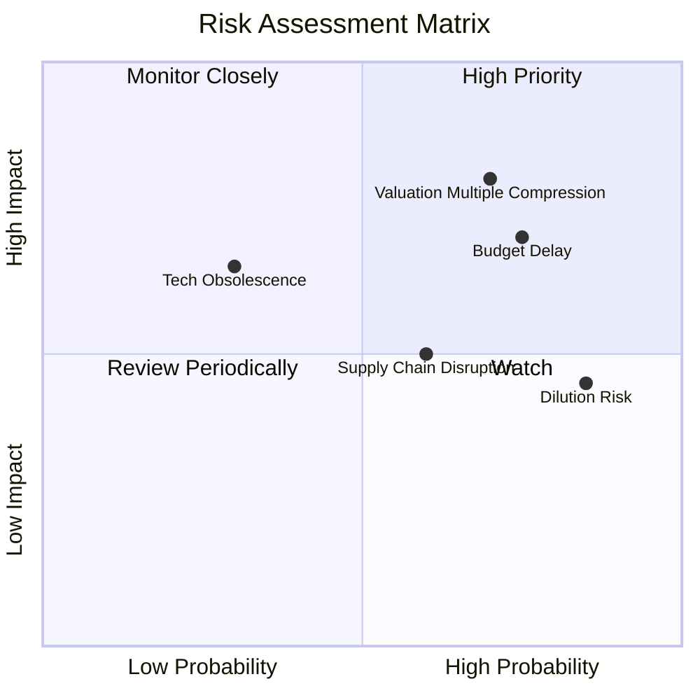

### 9.2 風險清單詳細分析

| # | 風險項目 | 發生機率 | 財務衝擊 | 風險評分 | 緩解措施 / 機構觀點 |
|---|----------|----------|----------|----------|---------------------|
| 1 | 🔴 **估值倍數收縮** | 高 (70%) | 高 (-25% 股價) | 🔴 8.0/10 | 當前 281.7x 的 Trailing P/E 極易受到大盤系統性回檔影響。建議分批建倉，拉長投資週期。 |
| 2 | 🟡 **國防預算撥款延遲** | 高 (75%) | 中 (-10% 營收) | 🟡 6.5/10 | 美國國會常態性的「持續性決議案（CR）」會延遲新項目的啟動，但 KTOS 的靶機屬於剛性消耗品，受影響較小。 |
| 3 | 🟡 **股權持續稀釋** | 極高 (85%) | 低 (-5% EPS) | 🟡 5.5/10 | Q1 2026 的增資已完成，短期內再次增資機率低。14.6 億美元現金已足夠未來數年使用。 |
| 4 | 🔴 **核心競爭對手技術突破** | 低 (30%) | 高 (-20% 市佔) | 🔴 5.0/10 | 洛克希德·馬丁與波音亦在研發無人戰鬥機，但 KTOS 具備顯著的低成本製造優勢（Valkyrie 單機成本僅約 $3M）。 |

---

## 10. 投資建議

### 10.1 最終綜合評級雷達圖

KTOS 在**財務健康度**與**成長潛力**上得分極高，但在**獲利品質**與**當前估值**上面臨挑戰。

```
╔══════════════════════════════════════════════════════════════╗
║                    KTOS 綜合評分雷達圖                       ║
╠══════════════════════════════════════════════════════════════╣
║ 財務安全度  9.5 ▓▓▓▓▓▓▓▓▓▓▓▓▓▓▓▓▓▓▓░  ★★★★★ 淨現金12.8億    ║
║ 營收成長性  8.5 ▓▓▓▓▓▓▓▓▓▓▓▓▓▓▓▓▓░░  ★★★★☆ YoY +22.6%      ║
║ 護城河深度  8.2 ▓▓▓▓▓▓▓▓▓▓▓▓▓▓▓▓░░░░  ★★★★☆ 國防特許准入    ║
║ 估值合理性  5.0 ▓▓▓▓▓▓▓▓▓▓░░░░░░░░░░  ★★★☆☆ 歷史市盈率偏高  ║
║ 獲利含金量  4.5 ▓▓▓▓▓▓▓▓▓░░░░░░░░░░░  ★★☆☆☆ FCF 仍為負值     ║
╠══════════════════════════════════════════════════════════════╣
║ 綜合總分    7.2 ▓▓▓▓▓▓▓▓▓▓▓▓▓▓░░░░░░  🏆 具備超強防禦力的成長股║
╚══════════════════════════════════════════════════════════════╝
```

### 10.2 目標價與隱含報酬率

我們對三種情境進行機率加權，得出**加權期望目標價為 $97.23**，隱含報酬率為 **+103.0%**。

| 情境 | 隱含目標價 | 發生機率 | 隱含報酬率 |
|------|------------|----------|------------|
| 🔴 **悲觀情境** | $38.00 | 20% | -20.7% |
| 🟡 **基準情境** | $109.33 | 60% | +128.3% |
| 🟢 **樂觀情境** | $150.00 | 20% | +213.2% |

### 10.3 買入時機與觸發因素

```
╔══════════════════════════════════════════════════════════════════╗
║                  ✅ KTOS 買入觸發因素 Checklist                 ║
╠══════════════════════════════════════════════════════════════════╣
║                                                                  ║
║  立即買入觸發條件（滿足任二即可建倉）：                          ║
║  ✅ 股價跌至 $45.00 - $48.00 區間（已滿足，52周低點附近）        ║
║  ✅ 季度營收 YoY 成長率維持在 20% 以上（已滿足，Q1 26 為 22.6%） ║
║  ☐ 營業利益率突破 4.0%（尚未滿足，目前為 1.67%）                 ║
║                                                                  ║
║  加碼觸發條件：                                                  ║
║  ☐ 美國空軍宣佈採購首批 XQ-58A Valkyrie 超過 50 架               ║
║  ☐ 季度 OCF 轉為正值，且 FCF 缺口收窄至 1,000 萬美元以內         ║
║                                                                  ║
║  減碼/停損觸發條件：                                             ║
║  ☐ 季度營收成長率跌破 10%                                        ║
║  ☐ 帳上現金被不合理併購案大肆消耗（如高溢價收購無協同效應資產） ║
╚══════════════════════════════════════════════════════════════════╝
```

### 10.4 投資人適配度分析

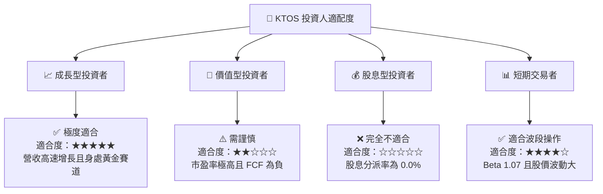

### 10.5 每季財報監控清單（Quarterly Watch List）

在未來的季度財報中，投資人應重點監控以下核心指標，以驗證投資論點是否成立：

| 監控指標 | 基準值 (Q1 2026) | 觸發加碼門檻 | 觸發減碼/退出門檻 | 監控意義 |
|----------|-----------------|--------------|------------------|----------|
| **無人機板塊營收** | ~$90M (估算) | YoY 成長 > 30% | YoY 成長 < 5% | 驗證 Valkyrie 及靶機的量產動能。 |
| **營業利益率 (GAAP)** | 1.8% | > 5.0% | 轉為負值 (< 0%) | 驗證規模效應與軟體高毛利是否兌現。 |
| **帳上現金餘額** | 14.64 億美元 | > 15 億 (得益於OCF改善) | < 8 億 (主因亂併購或研發黑洞) | 監控資本配置效率，防止現金被濫用。 |
| **流通股數** | 1.875 億股 | 保持穩定 | > 2.0 億股 (持續稀釋) | 監控管理層是否持續稀釋小股東權益。 |

### 10.6 反面論證：什麼會證明論點錯誤（What Would Change My Mind）

```
╔══════════════════════════════════════════════════════════════════╗
║              ⚠️ 論點失效條件（Disconfirming Evidence）           ║
╠══════════════════════════════════════════════════════════════════╣
║  本投資論點在下列情況成立時應重新檢視或果斷停損：                ║
║                                                                  ║
║  ☐ 核心無人機項目（如 XQ-58A）在美軍競標中敗給波音 Ghost Bat，    ║
║     導致未來 3 年無任何實質性批量訂單。                          ║
║  ☐ 營業利益率連續三季低於 1.5%，說明公司無法轉嫁通膨成本，       ║
║     不具備結構性定價權。                                         ║
║  ☐ 自由現金流（FCF）流出持續擴大，TTM FCF 跌破 -2.0 億美元，      ║
║     迫使公司在 18 個月內再次進行股權融資。                       ║
║  ☐ ROIC 跌破 1.0%，說明管理層對 14.6 億美元現金的部署極其低效。  ║
╚══════════════════════════════════════════════════════════════════╝
```

---

> **免責聲明**：本報告為基於客觀財務數據之學術與機構級研究分析，僅供參考，不構成任何買賣或投資建議。投資人應自行承擔市場風險。