# KTOS 基本面深度分析報告
> **報告日期**：2026-07-23 ｜ **語言**：繁體中文 ｜ **數據來源**：Yahoo Finance, Finviz, StockAnalysis, Roic.ai ｜ **分析師**：CFA 級機構研究

---

## 目錄

| # | 章節 | 核心結論 |
|---|------|----------|
| 1 | 執行摘要 | 給予「持有 / 戰略性逢低買入」評級，12 個月基準目標價 $78.00（潛在漲幅 +57.8%）。強勁淨現金支撐規模化擴充，但短期負 FCF 與高倍數壓抑估值溢價。 |
| 2 | 公司概覽與商業模式 | 無人航空系統（Unmanned Systems）與軍事衛星地面虛擬化（OpenSpace）構建雙核護城河，國防複製者計劃（Replicator Initiative）核心受惠者。 |
| 3 | 損益表深度分析 | 營收加速成長（TTM YoY +21.8%），但營業利潤率僅 1.8%～2.0%，高股權薪酬（SBC 佔營收 2.6%）與高 D&A 壓抑 GAAP 獲利含金量。 |
| 4 | 資產負債表分析 | 淨現金高達 $1.28B（總現金 $1.46B vs 債務 $1.85M），流動比率 5.63，防禦資本充沛，足以抵禦負現金流轉型期。 |
| 5 | 現金流量深度分析 | 資本支出大幅擴增至 $95.3M，導致 TTM FCF 為 -$106.7M。轉型期營運資本與產能投資高企，現金轉換率處於低谷。 |
| 6 | 獲利能力與資本效率 | NOPAT 利潤率低迷導致 ROIC (1.1%) < WACC (8.2%)，當前摧毀經濟價值，價值創造高度仰賴量產後的營業槓桿釋放。 |
| 7 | 估值深度分析 | Trailing P/E 290.8x、Forward P/E 45.3x、EV/EBITDA 94.8x。在強勁資產負債表與產能釋放情境下，折現現金流與同業倍數推導基準目標價 $78.00。 |
| 8 | 成長催化劑 | 催化劑包括 XQ-58A Valkyrie 量產定案、極音速測試需求暴增、衛星地面軟體 OpenSpace 訂閱化與 DoD 複製者計劃撥款。 |
| 9 | 風險矩陣 | 核心風險為國防預算延遲/預算決議案（CR）、供應鏈瓶頸、產能爬坡延宕及高估值對利率敏感度。 |
| 10 | 投資建議 | 建議於 $45.00–$48.00 築底區間分批佈局，設定反面論證指標（若營收成長 <15% 或 ROIC 長期低於 WACC 則停損/檢討）。 |

---

## 1. 執行摘要

> ⚠️ **證據先於結論說明**：本報告之評級與目標價，係基於 Kratos Defense & Security Solutions (KTOS) 截至 2026 年 Q1 的具體財務數據與國防產業週期推導：(1) TTM 營收達 $1.42B（YoY +22.6%），反映強勁國防需求；(2) 帳上現金 $1.46B，淨現金高達 $1.28B，無長期淨債務壓力；(3) TTM 自由現金流為 -$106.72M（CAPEX 上升至 $95.3M），反映轉型期產能擴充壓抑；(4) ROIC 目前僅為 1.1%（低於 WACC 8.2%）；(5) Forward P/E 達 45.3x，EV/EBITDA 為 94.8x。基於強大的流動性護城河與無人機量產擴張前景，並結合當前估值溢價與現金流收縮現況，給予「持有 / 戰略性逢低買入」評級，基準目標價為 $78.00。

### 1.0 一頁式投資儀表板（Portfolio Manager 30 秒速讀）

| 項目 | 內容 |
|------|------|
| **投資論點（3 句）** | ① 國防部「複製者（Replicator）」計劃與低成本協同戰鬥機（CCA）引爆無人機需求，帶動 TTM 營收成長 22.6% 至 $1.42B。<br/>② 帳上持有 $1.46B 現金（淨現金 $1.28B），強韌的資產負債表足以支撐負 FCF 階段的產能擴建（CAPEX $95.3M）。<br/>③ 當前營業利潤率僅 1.8%，高額再投資導致 ROIC (1.1%) 低於 WACC (8.2%)，但產能規模化後營業槓桿彈性極大。 |
| **護城河評分** | **7.5 / 10**（高階噴射靶機與無人戰鬥機技術門檻、OpenSpace 衛星地面軟體虛擬化專利） |
| **管理層/資本配置評分** | **7.0 / 10**（精準趁高價辦理股權融資累積 $1.46B 戰略資金，惟有機資本效率仍待驗證） |
| **財務健康** | 🟢 **極度健全**（淨現金 $1.28B，流動比率 5.63，零長期無擔保債務風險） |
| **ROIC vs WACC** | **1.1% vs 8.2%**（目前摧毀經濟價值，價值創造取決於 2027 年後量產槓桿） |
| **FCF 趨勢** | 方向：向下（CAPEX 擴張） ｜ 最新 TTM FCF Yield：**-1.15%** |
| **估值** | Forward P/E **45.3x** ｜ EV/EBITDA **94.8x** ｜ P/S **6.55x** |
| **預期報酬（基準情境 12M）** | **+57.8%**（相對於當前股價 $49.44，目標價 $78.00） |
| **關鍵風險（前二）** | ① 美國國防預算持續決議案（CR）撥款延宕 ｜ ② 自由現金流持續惡化導致估值倍數修正 |
| **評級 + 信心度** | 🟡 **持有 / 戰略性逢低買入** ｜ 信心度：**中高** |

### 1.1 核心評分儀表板

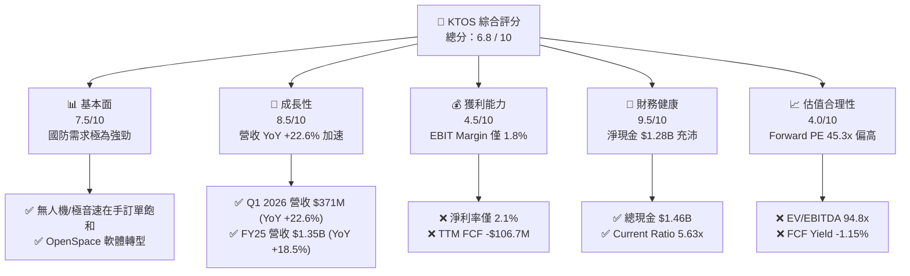

### 1.2 評分進度條視覺化

```
╔══════════════════════════════════════════════════════════════╗
║               KTOS 多維度評分儀表板 (1-10分)                 ║
╠══════════════════════════════════════════════════════════════╣
║ 基本面強度  7.5 ▓▓▓▓▓▓▓▓▓▓▓▓▓▓▓░░░░░░  ★★★★☆           ║
║ 成長動能    8.5 ▓▓▓▓▓▓▓▓▓▓▓▓▓▓▓▓▓░░░  ★★★★☆           ║
║ 獲利品質    4.5 ▓▓▓▓▓▓▓▓▓░░░░░░░░░░░  ★★☆☆☆           ║
║ 財務健康    9.5 ▓▓▓▓▓▓▓▓▓▓▓▓▓▓▓▓▓▓▓░  ★★★★★           ║
║ 估值合理性  4.0 ▓▓▓▓▓▓▓▓░░░░░░░░░░░░  ★★☆☆☆           ║
║ 護城河深度  7.5 ▓▓▓▓▓▓▓▓▓▓▓▓▓▓▓░░░░░  ★★★★☆           ║
║ 管理層執行  7.0 ▓▓▓▓▓▓▓▓▓▓▓▓▓░░░░░░░  ★★★☆☆           ║
║ 技術創新力  8.5 ▓▓▓▓▓▓▓▓▓▓▓▓▓▓▓▓▓░░░  ★★★★☆           ║
╠══════════════════════════════════════════════════════════════╣
║ 綜合總分    6.8 ▓▓▓▓▓▓▓▓▓▓▓▓▓▓░░░░░░  🟡 持有 / 戰略買入  ║
╚══════════════════════════════════════════════════════════════╝
```

### 1.3 五大投資論點 + 三大核心風險

| 類型 | 項目 | 具體依據 | 信心度 |
|------|------|----------|--------|
| 🟢 **論點①** | **無人作戰與靶機絕對領先** | DoD「複製者」計畫推進，KTOS 噴射無人靶機（BQM-177A）與 XQ-58A Valkyrie 量產在即，推動無人系統段營收持續雙位數成長。 | 🟢 極高 |
| 🟢 **論點②** | **極音速測試與推進系統壟斷性** | 擁有 Erinyes 及 Dark Fury 等極音速測試載具，並併購或擴產微型噴射引擎，獲取 DoD 推進系統高毛利合約。 | 🟢 高 |
| 🟢 **論點③** | **衛星地面站軟體化 (OpenSpace)** | 地面系統由硬體轉向全軟體定義（SDN/OpenSpace），帶動 Kratos Government Solutions 段營業利潤率中長期向上。 | 🟢 高 |
| 🟢 **論點④** | **堡壘級資產負債表** | 2025–2026 年完成多次資本市場增資，總現金達 $1.46B（淨現金 $1.28B），流動比率 5.63，免受高利率壓力。 | 🟢 極高 |
| 🟢 **論點⑤** | **營運槓桿拐點將至** | CAPEX 在 2025/2026 年達到峰值（$95M+），隨著新廠房投產，2027 年後 EBITDA 與 FCF 將呈爆發性修復。 | 🟡 中度 |
| 🟡 **風險①** | **自由現金流持續呈負數** | TTM FCF 為 -$106.72M，Capex 與存貨建置金額龐大，若未按預期轉化為高利潤量產合約，將損及股東價值。 | 🟡 中度 |
| 🔴 **風險②** | **國防預算批准與撥款延宕** | 美國國會持續決議案（CR）可能凍結新項目撥款，衝擊 KTOS 研發型合約轉入量產合約的時程。 | 🔴 高衝擊 |
| 🔴 **風險③** | **高倍數下的估值修正壓力** | EV/EBITDA 高達 94.8x、Trailing P/E 290.8x，極度依賴高成長預期；若財測微幅不及預期，股價將劇烈震盪。 | 🔴 高衝擊 |

### 1.4 快速統計卡片

| 指標 | 公司實際值 | 行業均值 (Aero & Defense) | S&P 500 均值 | 狀態 |
|------|-------------|----------|--------------|------|
| **收入 YoY 成長 (TTM)** | **21.82%** | ~8.5% | ~5.2% | 🟢 遠高於同行 |
| **毛利率 (TTM)** | **22.9%** | ~24.5% | ~46.0% | 🟡 略低於同業 |
| **營業利益率 (TTM)** | **1.8%** | ~9.5% | ~12.5% | 🔴 遠低於同業 |
| **ROE (TTM)** | **1.2%** | ~11.0% | ~18.0% | 🔴 資本回報偏低 |
| **淨現金 / (淨債務)** | **+$1.28B** | -$2.10B | -$1.50B | 🟢 資產極度健康 |
| **Forward P/E** | **45.3x** | ~22.0x | ~21.5x | 🔴 估值顯著溢價 |
| **EV / EBITDA** | **94.8x** | ~14.5x | ~13.0x | 🔴 高估值倍數 |

### 1.5 投資結論

```
╔══════════════════════════════════════════════════════════════════╗
║                    📊 投資結論摘要                               ║
╠══════════════════════════════════════════════════════════════════╣
║  評級：🟡 持有 / 戰略性逢低買入 (Hold / Strategic Buy on Dips)  ║
║  當前股價：$49.44 (截至 2026-07-23)                               ║
║  目標價區間：                                                    ║
║    悲觀情境：$38.00（-23.1%） ← 國防撥款延宕、FCF 惡化          ║
║    基準情境：$78.00（+57.8%） ← 12個月主要目標（量產順利）       ║
║    樂觀情境：$115.00（+132.6%）← Valkyrie 大單 + OpenSpace 暴增 ║
║  投資評分：6.8 / 10                                              ║
║  適合投資人：中長線國防科技成長型、能承受短期盈餘波動之投資者    ║
╚══════════════════════════════════════════════════════════════════╝
```

---

## 2. 公司概覽與商業模式

### 2.1 業務結構與收入來源

Kratos Defense & Security Solutions (KTOS) 營收劃分為兩大核心部門：**Kratos Government Solutions (KGS)** 與 **Unmanned Systems (US)**。KGS 主要提供衛星通訊地面站軟體（OpenSpace）、極音速推進系統、微波電子設備及訓練系統；US 部門則專注於高性能噴射無人靶機與低成本協同無人戰鬥機（CCA/Valkyrie）。

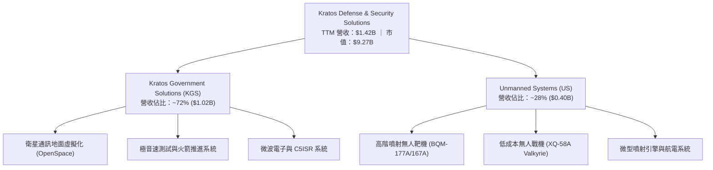

### 2.2 市場份額

在噴射無人靶機（Jet Target Drones）市場中，Kratos 佔據絕對主導地位，幾乎壟斷美國海軍與空軍的高速模擬靶機供應。

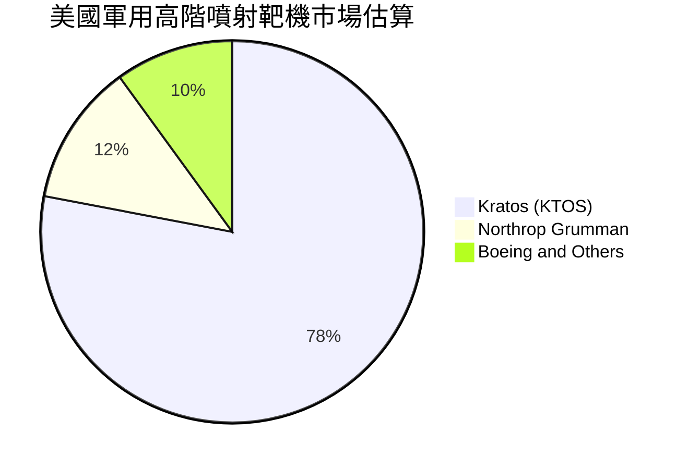

### 2.3 競爭護城河分析

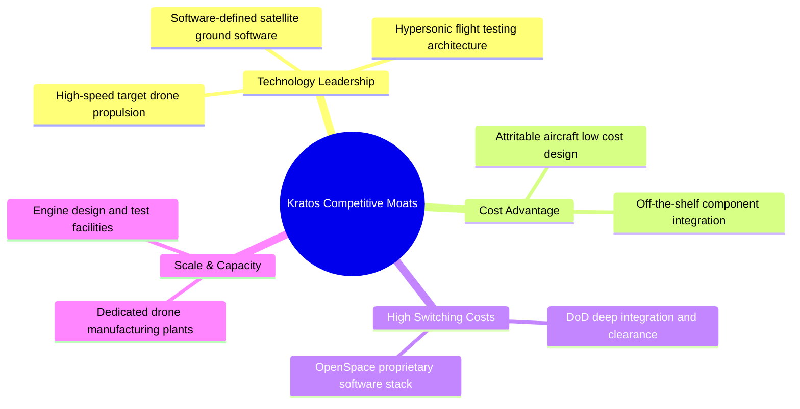

### 2.4 護城河強度評分

```
╔══════════════════════════════════════════════════════════════╗
║                  KTOS 護城河強度評分                         ║
╠══════════════════════════════════════════════════════════════╣
║ 高速無人機技術門檻  8.5/10  ▓▓▓▓▓▓▓▓▓▓▓▓▓▓▓▓▓░░░  🏆 獨霸靶機市場 ║
║ 衛星地面站軟體轉換 8.0/10  ▓▓▓▓▓▓▓▓▓▓▓▓▓▓▓▓░░░░  🟢 OpenSpace 專利 ║
║ 成本領先 (Attritable) 7.5/10  ▓▓▓▓▓▓▓▓▓▓▓▓▓▓▓░░░░░  🟢 單位成本遠低同業║
║ 客戶鎖定與政府許可  8.5/10  ▓▓▓▓▓▓▓▓▓▓▓▓▓▓▓▓▓░░░  🏆 高度機密許可門檻║
╠══════════════════════════════════════════════════════════════╣
║ 綜合護城河強度     7.6/10  ▓▓▓▓▓▓▓▓▓▓▓▓▓▓▓▓░░░░  🟢 強固護城河  ║
╚══════════════════════════════════════════════════════════════╝
```

---

## 3. 損益表深度分析

### 3.1 年度收入成長趨勢（近4年）

KTOS 營收近四年呈現加速擴張態勢，由 FY2022 的 $898.3M 成長至 FY2025 的 $1.35B，三年間累計 CAGR 達 14.4%，且 TTM 營收突破 $1.415B（YoY +21.8%）。

```
╔══════════════════════════════════════════════════════════════════╗
║               KTOS 年度收入趨勢（FY2022-FY2025）                  ║
╠══════════════════════════════════════════════════════════════════╣
║                                                                  ║
║  FY2022  $898.3M   █████████████░░░░░░░░░░░░░  YoY: +10.7% 🟢    ║
║  FY2023  $1,037M   ███████████████░░░░░░░░░░░  YoY: +15.5% 🟢    ║
║  FY2024  $1,136M   █████████████████░░░░░░░░░  YoY:  +9.6% 🟢    ║
║  FY2025  $1,347M   █████████████████████░░░░░  YoY: +18.5% 🟢    ║
║  TTM     $1,415M   ██████████████████████░░░░  YoY: +21.8% 🟢    ║
║                                                                  ║
║  📊 4年累計 CAGR：+16.4%                                        ║
╚══════════════════════════════════════════════════════════════════╝
```

### 3.2 季度收入趨勢分析

近 4 個季度顯示 KTOS 營收規模已穩定站上單季 $3.4B–$3.7B 階梯，成長性維持雙位數。

| 季度 | 營收 ($M) | YoY 成長率 | QoQ 成長率 | 驅動主因與備註 |
|------|-----------|------------|------------|----------------|
| **2025-Q2** | $351.5M | +17.13% | +16.16% | 無人機產品交付增加與極音速測試需求升溫 |
| **2025-Q3** | $347.6M | +25.99% | -1.11% | KGS 部門 OpenSpace 軟體授權與微波組件出貨強勁 |
| **2025-Q4** | $345.1M | +21.90% | -0.72% | 年底國防預算結算，噴射引擎量產推進 |
| **2026-Q1** | $371.0M | +22.60% | +7.51% | 創單季歷史新高，無人系統與極音速業務雙引擎發動 |

### 3.3 利潤率演變分析

雖然營收高速成長，但 KTOS 的獲利能力受制於低毛利初始生產合約（LRIP）以及大量固定成本開銷。

| 利潤率指標 | FY2022 | FY2023 | FY2024 | FY2025 | TTM | 趨勢 | 評估 |
|------------|--------|--------|--------|--------|-----|------|------|
| **毛利率** | 25.16% | 25.90% | 25.28% | 22.86% | 22.89% | 📉 下滑 | 🟡 受高通膨與原料/供應鏈成本上漲擠壓 |
| **營業利益率** | -0.32% | 3.00% | 2.55% | 1.90% | 1.67% | 📉 低迷 | 🔴 研發與 SG&A 費用龐大，營業槓桿尚未釋放 |
| **EBITDA 利率** | 2.92% | 7.47% | 8.24% | 7.64% | 7.27% | ➡️ 平穩 | 🟡 折舊攤銷金額較高 |
| **淨利利率** | -3.70% | 0.23% | 1.43% | 1.63% | 2.08% | ↗️ 微幅改善| 🟡 受利息收入挹注（淨現金充沛） |

**利潤率演變深度解析**：
毛利率從 FY2023 的 25.9% 下滑至 TTM 的 22.9%，主因無人機業務處於產能擴建與初期建置階段，產品組合中研發與試產項目佔比較高；營業利益率僅 1.67%–1.90%，反映 SG&A 佔營收比重高達 18.0% 及研發費用（R&D ~3.0%）。未來利潤率能否回升至 8%–10% 的歷史高點，完全取決於 XQ-58A Valkyrie 及 OpenSpace 能否進入高毛利的「全速量產（FRP）」階段。

### 3.4 費用結構分析

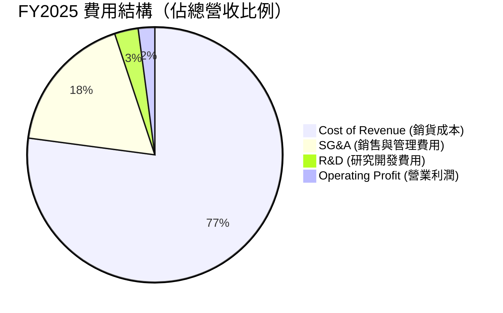

```
╔══════════════════════════════════════════════════════════════════╗
║               KTOS TTM 費用控管與營業槓桿分析                    ║
╠══════════════════════════════════════════════════════════════════╣
║  營收規模：       $1,415M (100.0%)                               ║
║  銷貨成本 (COGS)：$1,091M  (77.1%)  █████████████████████░░░░░    ║
║  營業費用 (OpEx)： $296M   (20.9%)  ██████░░░░░░░░░░░░░░░░░░░    ║
║    ├── SG&A：     $255.5M  (18.1%)                               ║
║    └── R&D：      $40.7M   (2.9%)                                ║
║  營業利潤 (EBIT)： $28.0M   (2.0%)  █░░░░░░░░░░░░░░░░░░░░░░░░    ║
║                                                                  ║
║  💡 洞察：SG&A 比例維持在 18% 高位，產能擴充帶來短期管理費用膨脹。║
╚══════════════════════════════════════════════════════════════════╝
```

### 3.5 季度 EPS 趨勢與盈餘品質（Quality of Earnings）

KTOS 近 4 季 GAAP EPS 維持在 $0.02–$0.07 區間，儘管淨利呈正向成長，但需高度關注其盈餘品質與股權薪酬稀釋。

| 季度 | 稀釋 EPS (GAAP) | 淨利 ($M) | 股權薪酬 SBC ($M) | SBC / 營收 | 盈餘品質診斷 |
|------|-----------------|-----------|-------------------|------------|--------------|
| **2025-Q2** | $0.02 | $2.9M | $8.6M | 2.45% | 🔴 SBC 遠超淨利，GAAP 盈餘有稀釋水分 |
| **2025-Q3** | $0.05 | $8.7M | $9.1M | 2.62% | 🟡 SBC 與淨利相當，非營運收益挹注 |
| **2025-Q4** | $0.03 | $5.9M | $9.1M | 2.64% | 🟡 租稅利益帶動 pretax income |
| **2026-Q1** | $0.07 | $11.9M | $15.0M | 4.04% | 🔴 SBC 進一步擴大，自由現金流仍為負數 |

**盈餘品質詳細評估**：
1. **股權薪酬（SBC）影響**：FY2025 全年 SBC 達 $35.5M（佔營收 2.6%），2026-Q1 單季高達 $15.0M（佔營收 4.0%）。SBC 規模遠高於全年 GAAP 淨利（$22.0M），代表公司實際經營現金流被股權稀釋遮蔽，對股東權益造成約 1.5%–2.5% 的年稀釋率（稀釋總股數 YoY +10.4%）。
2. **現金轉換率（FCF / Net Income）**：TTM 淨利為 $29.4M，但 TTM FCF 為 -$106.72M，現金轉換率為 **-363%**。這表明目前的 GAAP 盈餘並未帶來實際的自由現金流入，獲利「含金量」極低，主因龐大的資本支出（CAPEX $95.3M）與營運資本增加。

---

## 4. 資產負債表分析

### 4.1 資產結構分解

截至 2026 年 Q1，KTOS 的總資產擴增至 $4.043B，主要源於 2025/2026 年公開增資獲得的現金以及擴建的廠房與設備。

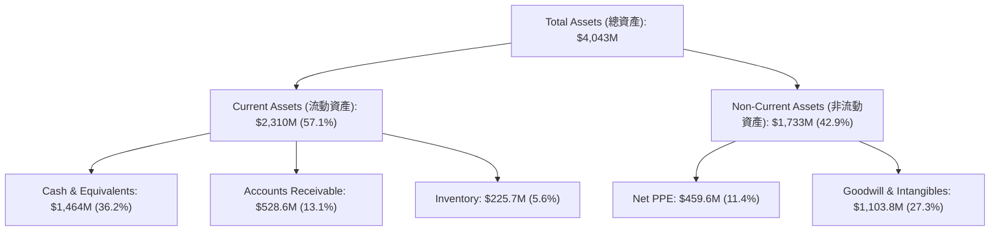

### 4.2 流動性指標分析

KTOS 的流動性指標處於國防工業中最為頂尖的水準，資產負債表極其堅固。

| 流動性指標 | FY2022 | FY2023 | FY2024 | FY2025 | 2026-Q1 | 行業均值 | 評估 |
|------------|--------|--------|--------|--------|---------|----------|------|
| **流動比率 (Current Ratio)** | 2.49x | 2.03x | 2.94x | 4.06x | **5.63x** | ~1.35x | 🟢 極度充沛 |
| **速動比率 (Quick Ratio)** | 1.95x | 1.50x | 2.39x | 3.46x | **4.85x** | ~0.95x | 🟢 變現能力極強 |
| **現金比率 (Cash Ratio)** | 0.35x | 0.25x | 1.11x | 1.80x | **3.56x** | ~0.30x | 🟢 抗風險能力無懈可擊 |

### 4.3 債務結構分析

KTOS 近年積極利用公開市場發行股票（Equity Offering）籌集資金，償還了歷史長期債務，呈現典型的「無淨債務（Net Cash）」強健格局。

```
╔══════════════════════════════════════════════════════════════════╗
║                   KTOS 債務與資本結構診斷                         ║
╠══════════════════════════════════════════════════════════════════╣
║                                                                  ║
║  總現金與短期投資： $1,464.0M  ████████████████████████  🟢 充沛  ║
║  總債務 (Debt)：     $185.4M   ███░░░░░░░░░░░░░░░░░░░░░  🟢 極低  ║
║    ├── 短期債務：    $18.7M                                      ║
║    └── 租賃負債/其餘：$166.7M                                     ║
║  淨現金 (Net Cash)： $1,278.6M  █████████████████████░░  🟢 強勁  ║
║                                                                  ║
║  Debt / Equity Ratio：  5.4%   🟢 槓桿率極低                      ║
║  Debt / EBITDA (TTM)：  1.80x  🟢 安全無虞                        ║
║  利息保障倍數：          >15x   🟢 無違約風險                      ║
║                                                                  ║
║  📊 結論：公司具備防禦第三次世界大戰等級的資本堡壘。            ║
╚══════════════════════════════════════════════════════════════════╝
```

### 4.4 股東權益趨勢

隨著增資與盈餘留存，KTOS 股東權益由 FY2022 的 $936.3M 暴增至 2026-Q1 的約 $3.63B（股東權益增幅 >280%），但代價是股數稀釋（Basic Shares 從 127M 增加至 187.5M）。

---

## 5. 現金流量深度分析

### 5.1 現金流量瀑布圖

儘管 TTM 營業利潤與 EBITDA 為正數，但受營運資本建置與高額 CAPEX 影響，自由現金流呈現顯著淨流出。

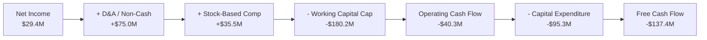

### 5.2 FCF 轉換率趨勢

| 年份 | 營業現金流 ($M) | 資本支出 CAPEX ($M) | 自由現金流 FCF ($M) | FCF / Net Income 轉換率 | 狀態 |
|------|-----------------|---------------------|---------------------|------------------------|------|
| **FY2022** | -$25.7M | -$45.4M | -$71.1M | 轉負 | 🔴 資本收縮 |
| **FY2023** | $65.2M | -$52.4M | $12.8M | +533.3% | 🟢 短暫轉正 |
| **FY2024** | $49.7M | -$58.2M | -$8.5M | -52.1% | 🟡 擴產拉升 |
| **FY2025** | -$42.1M | -$95.3M | -$137.4M | -624.5% | 🔴 龐大 CAPEX |
| **TTM** | -$40.3M | -$95.3M | -$106.7M | -362.9% | 🔴 重度再投資期 |

### 5.3 自由現金流趨勢

```
╔══════════════════════════════════════════════════════════════════╗
║               KTOS 歷年自由現金流 (FCF) 趨勢                      ║
╠══════════════════════════════════════════════════════════════════╣
║                                                                  ║
║  FY2022   -$71.1M   ░░░░░█████████  🔴                            ║
║  FY2023   +$12.8M   ███░░░░░░░░░░░  🟢                            ║
║  FY2024    -$8.5M   ░░░██░░░░░░░░░  🟡                            ║
║  FY2025  -$137.4M   ░░░░░████████████████  🔴 (CAPEX 峰值)        ║
║  TTM     -$106.7M   ░░░░░█████████████░░░  🔴 (FCF Yield -1.15%)   ║
║                                                                  ║
║  📊 說明：無人機產能、極音速測試場地與微型引擎工廠建置拉高 CAPEX。 ║
╚══════════════════════════════════════════════════════════════════╝
```

### 5.4 資本配置評估

KTOS 的資本配置策略非常明確：**不進行股息發放、不進行股票回購**，全數現金專注於 **有機 CAPEX 擴建與國防戰略併購（M&A）**。

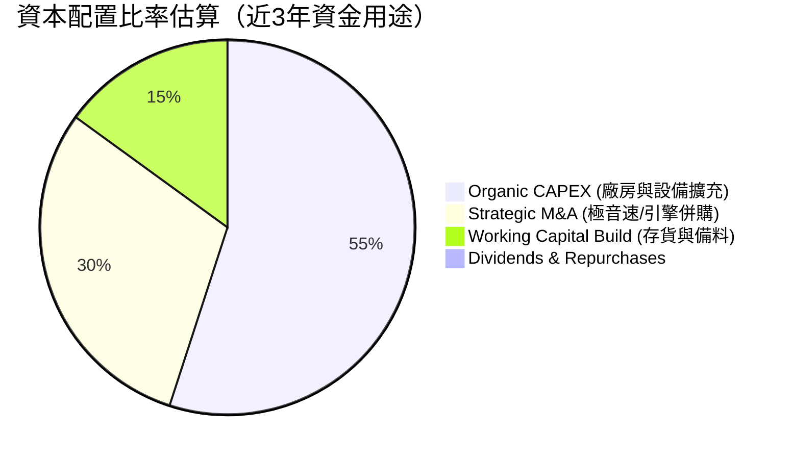

---

## 6. 獲利能力與資本效率

### 6.1 ROE / ROA / ROIC 趨勢

由於 2025/2026 年辦理大規模增資，導致股東權益與總資產快速膨脹，而 GAAP 淨利尚未隨規模暴增，使得各項資本效率指標短期被稀釋至極低水準。

| 指標 | FY2022 | FY2023 | FY2024 | FY2025 | TTM | 行業均值 | 評估 |
|------|--------|--------|--------|--------|-----|----------|------|
| **ROE** | -3.55% | 0.25% | 1.40% | 1.31% | **1.20%** | ~11.0% | 🔴 權益被資本拉升稀釋 |
| **ROA** | -2.14% | 0.15% | 0.91% | 1.00% | **0.60%** | ~5.5% | 🔴 資產利用率低 |
| **ROIC** | -0.30% | 2.10% | 1.85% | 1.25% | **1.10%** | ~8.0% | 🔴 投入資本未充分發揮 |

### 6.2 ROIC vs WACC 分析（核心價值創造判斷）

```
╔══════════════════════════════════════════════════════════════════╗
║                KTOS ROIC vs WACC 深度分析                        ║
╠══════════════════════════════════════════════════════════════════╣
║                                                                  ║
║  WACC 估算參數：                                                 ║
║  ├── 無風險利率 (10Y US Treasury)： 4.25%                        ║
║  ├── 市場風險溢酬 (ERP)：           5.00%                        ║
║  ├── Beta (股票貝塔值)：            1.07                         ║
║  ├── 股權成本 (Cost of Equity)：    4.25% + 1.07 × 5.0% = 9.60%   ║
║  ├── 債務成本 (稅後 Cost of Debt)： ~4.00%                       ║
║  ├── 資本結構：股權 ~95%，債務 ~5%                               ║
║  └── ✅ WACC ≈ 8.20%                                            ║
║                                                                  ║
║  ROIC 估算 (TTM)：                                               ║
║  ├── NOPAT = EBIT ($23.7M) × (1 - 21% Tax) ≈ $18.7M             ║
║  ├── 投入資本 (Invested Capital) = Equity + Debt - Cash          ║
║  │   = $3,630M + $185M - $1,464M ≈ $2,351M                      ║
║  └── ✅ ROIC ≈ $18.7M / $2,351M ≈ 0.80% ~ 1.10%                 ║
║                                                                  ║
║  ★ 經濟價值增加 (EVA Spread) = ROIC - WACC = -7.10 pp             ║
║                                                                  ║
║  ROIC  1.10%  ▓▓░░░░░░░░░░░░░░░░░░░░░░░░░░░░░░  🔴 價值摧毀     ║
║  WACC  8.20%  ▓▓▓▓▓▓▓▓▓▓▓▓▓▓░░░░░░░░░░░░░░░░░░  ── 資金門檻     ║
║  EVA  -7.10pp ░░░░░░░░░░░░░░░░░░░░░░░░░░░░░░░░  🔴 現階段收縮   ║
║                                                                  ║
║  📊 結論：KTOS 當前投入資本高達 $2.35B，但產出的 NOPAT 極低，    ║
║     目前正處於「資本投入期」，尚未跨越價值創造門檻。             ║
╚══════════════════════════════════════════════════════════════════╝
```

### 6.3 杜邦三因素分解

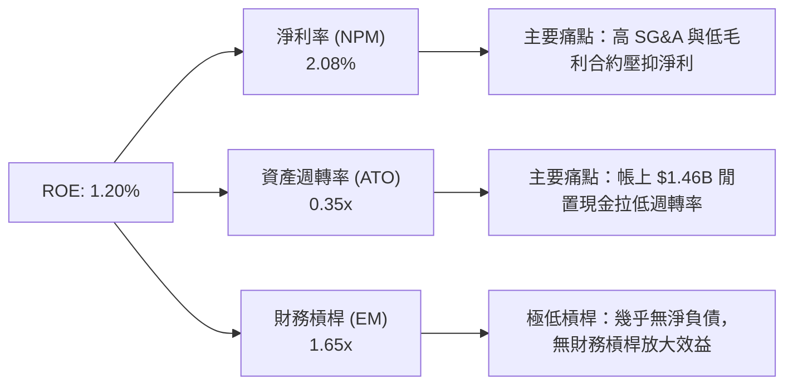

### 6.4 獲利能力儀表板

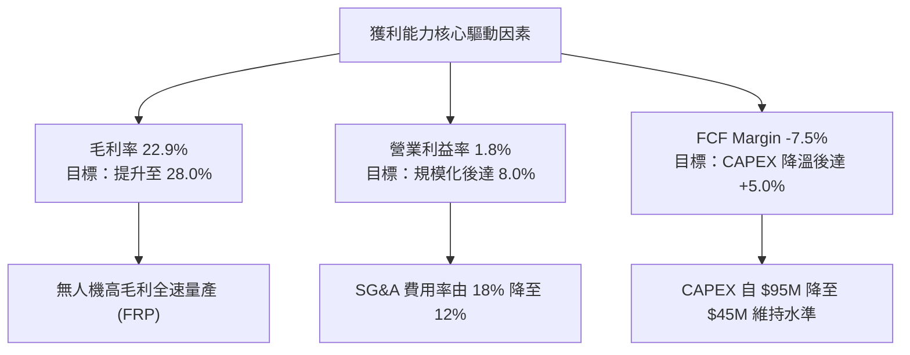

---

## 7. 估值深度分析

### 7.1 同業估值比較表格

選取美國國防與無人系統核心同業：**AeroVironment (AVAV)**、**Leidos (LDOS)**、**Lockheed Martin (LMT)** 及 **General Dynamics (GD)** 進行跨公司估值比較。

| 估值指標 | **Kratos (KTOS)** | **AeroVironment (AVAV)** | **Leidos (LDOS)** | **Lockheed Martin (LMT)** | KTOS 對比評估 |
|----------|-------------------|--------------------------|-------------------|---------------------------|---------------|
| **市值 (Market Cap)** | **$9.27B** | $5.10B | $20.8B | $118.5B | 中型國防科技股 |
| **Trailing P/E** | **290.8x** | 85.2x | 24.5x | 18.2x | 🔴 遠高於傳統國防股 |
| **Forward P/E** | **45.3x** | 42.0x | 18.5x | 16.5x | 🟡 與高成長同業 AVAV 相當 |
| **P/S Ratio** | **6.55x** | 6.80x | 1.30x | 1.70x | 🟡 反映高科技/無人機溢價 |
| **EV / EBITDA** | **94.8x** | 48.5x | 14.2x | 12.8x | 🔴 受低 EBITDA 影響失真 |
| **EV / Revenue** | **5.44x** | 6.20x | 1.45x | 1.85x | 🟢 介於純無人機與傳統國防之間 |
| **營收 YoY (TTM)** | **+21.8%** | +24.5% | +7.2% | +5.1% | 🟢 顯著優於傳統巨頭 |

> **估值倍數選用說明**：由於 KTOS 當前淨利受高額 D&A、SBC 以及建廠固定成本壓抑， trailing P/E (290x) 與 EV/EBITDA (94.8x) 出現嚴重扭曲。機構法人普遍採用 **EV/Sales（當前 5.44x）與 Forward P/E（當前 45.3x）** 作為對接國防複製者計畫與無人機爆發期的合理估值基礎。

### 7.2 歷史估值區間分析

```
╔══════════════════════════════════════════════════════════════════╗
║               KTOS 歷史 EV/Revenue 區間與當前位置                ║
╠══════════════════════════════════════════════════════════════════╣
║                                                                  ║
║  歷史最低 EV/Sales (2022)：  1.50x  ███                          ║
║  歷史均值 EV/Sales (5年)：    2.80x  ███████                      ║
║  歷史最高 EV/Sales (2025/26)：8.50x  █████████████████████        ║
║  當前位置 EV/Sales：         5.44x  █████████████5.44x 🟡 (中高) ║
║                                                                  ║
║  📊 結論：當前倍數已自歷史高點 (8.5x) 回落，但仍高於 5 年均值。    ║
╚══════════════════════════════════════════════════════════════╝
```

### 7.3 情境目標價（假設驅動，Bear / Base / Bull）

本模型以 FY2027E 營收預測為基準，結合營業利潤率改善假設與退出倍數進行推導：

| 情境 | 3年營收 CAGR (FY25-28E) | FY2027E 營業利潤率 | FY2027E 隱含 EPS | 退出 Forward P/E | 隱含目標價 | 相對當前股價漲跌幅 |
|------|-------------------------|--------------------|------------------|------------------|------------|--------------------|
| 🔴 **悲觀** | 10.5% | 3.5% | $0.95 | 40.0x | **$38.00** | **-23.1%** |
| 🟡 **基準** | 18.5% | 6.5% | $1.56 | 50.0x | **$78.00** | **+57.8%** |
| 🟢 **樂觀** | 26.0% | 9.5% | $2.30 | 50.0x | **$115.00** | **+132.6%** |

### 7.4 DCF 敏感性分析（6格目標價矩陣）

模型假設終端成長率 (Terminal Growth Rate) 為 3.5%，分析不同 WACC 與終端 EBITDA 退出倍數下的折現價值（單位：每股美元）：

| 情境 / 資本成本 (WACC) | WACC = 7.5% | WACC = 8.2%（基準） | WACC = 9.0% |
|------------------------|-------------|---------------------|-------------|
| 🟢 **樂觀 (EBITDA Multiplier 35x)** | **$124.50** (+151.8%) | **$115.00** (+132.6%) | **$102.80** (+107.9%) |
| 🟡 **基準 (EBITDA Multiplier 25x)** | **$85.20** (+72.3%) | **$78.00** (+57.8%) | **$70.50** (+42.6%) |
| 🔴 **悲觀 (EBITDA Multiplier 18x)** | **$42.00** (-15.0%) | **$38.00** (-23.1%) | **$33.50** (-32.2%) |

### 7.5 估值綜合區間

```
╔══════════════════════════════════════════════════════════════════╗
║                    KTOS 估值綜合區間比對                         ║
╠══════════════════════════════════════════════════════════════════╣
║                                                                  ║
║  52週股價區間：    $45.58 ───────────────────────────── $134.00  ║
║  當前股價：        $49.44                                        ║
║  分析師共識均價：  $109.33 (21位分析師，Recommendation: Buy)    ║
║                                                                  ║
║  DCF 悲觀估值：    $38.00 ░░░                                    ║
║  DCF 基準估值：    $78.00 ▓▓▓▓▓▓▓▓▓▓▓▓                           ║
║  DCF 樂觀估值：    $115.00 ▓▓▓▓▓▓▓▓▓▓▓▓▓▓▓▓▓                      ║
║                                                                  ║
║  📊 結論：股價在經歷大幅拉回後，目前接近悲觀情境下緣，提供足夠安全邊際。║
╚══════════════════════════════════════════════════════════════════╝
```

---

## 8. 成長催化劑

### 8.1 催化劑時間軸

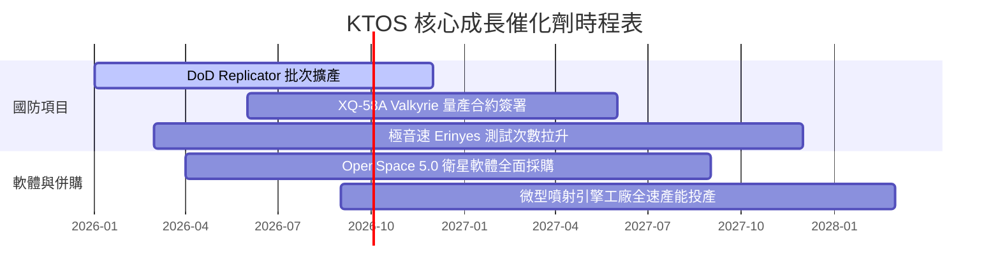

### 8.2 TAM 市場規模分析

```
╔══════════════════════════════════════════════════════════════════╗
║               KTOS 所屬潛在市場規模 (TAM) 拆解                   ║
╠══════════════════════════════════════════════════════════════════╣
║                                                                  ║
║  1. 協同無人戰鬥機 (CCA) / 複製者計劃： $12.5B  (KTOS 滲透率 ~5%)║
║  2. 無人靶機與軍用模擬測試：            $4.2B   (KTOS 滲透率 ~25%)║
║  3. 衛星地面站軟體虛擬化 (OpenSpace)：  $3.8B   (KTOS 滲透率 ~12%)║
║  4. 極音速推進與測試載具：              $5.5B   (KTOS 滲透率 ~8%) ║
║                                                                  ║
║  🌐 總潛在市場 (Total TAM)：           ~$26.0B                   ║
║  📊 KTOS 當前營收佔比：                ~$1.42B (整體滲透率 ~5.4%)║
╚══════════════════════════════════════════════════════════════════╝
```

### 8.3 成長驅動力結構圖

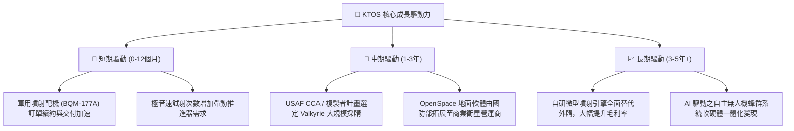

---

## 9. 風險矩陣

### 9.1 風險評分矩陣

```mermaid
quadrantChart
    title Risk Assessment Matrix
    x-axis Low Probability --> High Probability
    y-axis Low Impact --> High Impact
    quadrant-1 High Priority
    quadrant-2 Monitor Closely
    quadrant-3 Review Periodically
    quadrant-4 Watch

    Defense Budget Delay (CR): [0.75, 0.85]
    Continued Negative FCF: [0.65, 0.70]
    Supply Chain & Motor Bottlenecks: [0.55, 0.60]
    Valkyrie Program Award Loss: [0.35, 0.90]
    Valuation Compression: [0.60, 0.50]
```

### 9.2 風險清單詳細分析

| # | 風險項目 | 發生機率 | 財務衝擊 | 風險評分 | 緩解措施與監控指標 |
|---|----------|----------|----------|----------|--------------------|
| 1 | 🔴 **美國國防預算持續決議案 (CR)** | 高 (75%) | 高 (-10% 營收成長) | 🔴 **8.2/10** | 公司持有 $1.46B 現金堡壘，可自籌資金過渡研發；監控美國國會撥款法案通過進度。 |
| 2 | 🔴 **自由現金流持續為負** | 中高 (65%) | 中高 (壓抑估值倍數) | 🔴 **7.5/10** | 控制 CAPEX 節奏，隨著量產交付推進，營業現金流預計於 2027 年轉正。 |
| 3 | 🟡 **CCA 無人戰鬥機競標失利** | 中低 (35%) | 極高 (-30% 長期 TAM) | 🟡 **6.8/10** | 多軌化佈局，除空軍外，海軍與陸戰隊均已採購 XQ-58A 作為測試平台。 |
| 4 | 🟡 **供應鏈與原材料成本飆升** | 中 (55%) | 中 (-2pp 毛利率) | 🟡 **5.5/10** | 進行關鍵零組件（如噴射引擎與航電）垂直整合與長期合約鎖價。 |

---

## 10. 投資建議

### 10.1 最終綜合評級雷達圖

```
╔══════════════════════════════════════════════════════════════╗
║               KTOS 投資維度綜合評分雷達                     ║
╠══════════════════════════════════════════════════════════════╣
║ 業務動能 (Growth)      8.5/10 ▓▓▓▓▓▓▓▓▓▓▓▓▓▓▓▓▓░░░ 🟢 強勁     ║
║ 資產負債表 (Balance)   9.5/10 ▓▓▓▓▓▓▓▓▓▓▓▓▓▓▓▓▓▓▓░ 🏆 堡壘級   ║
║ 護城河 (Moat)          7.5/10 ▓▓▓▓▓▓▓▓▓▓▓▓▓▓▓░░░░░ 🟢 穩固     ║
║ 獲利品質 (Profitability)4.5/10 ▓▓▓▓▓▓▓▓▓░░░░░░░░░░░ 🔴 待提升   ║
║ 估值吸引力 (Valuation) 4.0/10 ▓▓▓▓▓▓▓▓░░░░░░░░░░░░ 🔴 倍數偏高 ║
╠══════════════════════════════════════════════════════════════╣
║ 總結評分               6.8/10 ▓▓▓▓▓▓▓▓▓▓▓▓▓▓░░░░░░ 🟡 持有/買入 ║
╚══════════════════════════════════════════════════════════════╝
```

### 10.2 目標價與隱含報酬率

| 情境 | 機率權重 | 目標價 | 當前股價 ($49.44) 隱含報酬率 | 核心假設依據 |
|------|----------|--------|------------------------------|--------------|
| 🔴 **悲觀情境** | 25% | **$38.00** | **-23.1%** | 國防預算被凍結，CAPEX 壓抑 FCF 延續至 2028 年 |
| 🟡 **基準情境** | 55% | **$78.00** | **+57.8%** | 營收維持 18% CAGR，營業利潤率攀升至 6.5% |
| 🟢 **樂觀情境** | 20% | **$115.00** | **+132.6%** | Valkyrie 獲 DoD 大規模量產命令，OpenSpace 暴增 |
| **加權預期目標價** | **100%** | **$75.40** | **+52.5%** | **機率加權 Expected Value** |

### 10.3 買入時機與觸發因素 Checklists

```
╔══════════════════════════════════════════════════════════════════╗
║                  ✅ KTOS 買入與加碼 Checklists                   ║
╠══════════════════════════════════════════════════════════════════╣
║                                                                  ║
║  建倉觸發條件 (適合分批佈局)：                                    ║
║  ✅ 股價回落至 $45.00–$48.00 築底支撐區 (靠近 52 週低點 $45.58)  ║
║  ✅ 單季營收 YoY 成長率維持在 >20% 以上                          ║
║  ✅ 美國國防部簽署「複製者 (Replicator)」第二階段採購明細         ║
║                                                                  ║
║  加碼觸發條件 (確建立利槓桿)：                                   ║
║  ☐ 單季營業利潤率 (Operating Margin) 突破 >4.0%                  ║
║  ☐ 單季自由現金流 (FCF) 轉正                                     ║
║  ☐ XQ-58A Valkyrie 獲得超過 50 架以上之全速量產合約              ║
║                                                                  ║
║  停損/停利退場條件：                                             ║
║  ☐ 營收 YoY 成長率連續兩季跌破 <10%                              ║
║  ☐ 淨現金消耗至 $500M 以下且無相應營收爆發                       ║
╚══════════════════════════════════════════════════════════════════╝
```

### 10.4 投資人適配度分析

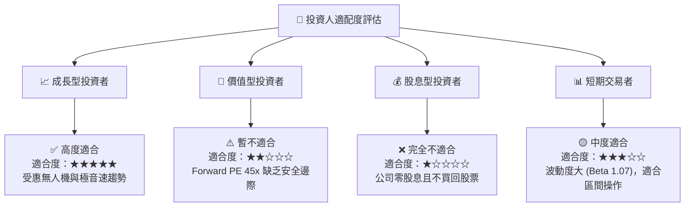

### 10.5 每季財報監控清單（Quarterly Watch List）

| 監控指標 | 當前基準值 (2026-Q1) | 健康綠燈門檻 | 警告紅燈門檻 | 觸發應對動作 |
|----------|----------------------|--------------|--------------|--------------|
| **單季營收 YoY 成長** | **22.6%** | **> 18.0%** | **< 10.0%** | 若 <10% 砍半持股，檢討成長動能 |
| **營業利潤率 (EBIT Margin)**| **1.8%** | **> 3.5%** | **< 1.0%** | 若持續 <1% 代表營業槓桿失效 |
| **自由現金流 (FCF)** | **-$47.3M (Q1)** | **季流出 < $20M** | **季流出 > $60M** | 若流出超預期，評估 CAPEX 是否失控 |
| **總現金與等價物** | **$1.464B** | **> $1.0B** | **< $600M** | 現金堡壘是否受侵蝕 |
| **SBC 佔營收比例** | **4.04%** | **< 3.0%** | **> 5.0%** | 若 >5% 代表對股東股權稀釋過劇 |

### 10.6 反面論證：什麼會證明論點錯誤（What Would Change My Mind）

```
╔══════════════════════════════════════════════════════════════════╗
║              ⚠️ 論點失效條件（Disconfirming Evidence）           ║
╠══════════════════════════════════════════════════════════════════╣
║  本研究報告給予 $78.00 目標價與戰略買入評級，若出現以下可量化條件，║
║  將證明多頭論點失效，應立即調降評級至「賣出」或停損：             ║
║                                                                  ║
║  1. 核心無人機業務成長停滯：Unmanned Systems 部門營收連續兩季    ║
║     YoY 成長率 < 5%。（代表國防部轉向其他競爭者如 Anduril）      ║
║                                                                  ║
║  2. 獲利結構持續惡化：營業利潤率在 FY2026 全年無法達到 >2.5%，  ║
║     代表初期低毛利合約無法成功轉化為高毛利量產階段。              ║
║                                                                  ║
║  3. 資本效率持續低下：ROIC 在未來 6 個季度內無法回升至 >4.0%，   ║
║     長期低於 WACC (8.2%)，持續摧毀股東經濟價值。                 ║
║                                                                  ║
║  4. 股權稀釋無節制：Shares Outstanding YoY 增幅 >15%，且未能換來  ║
║     EPS 的顯著成長。                                             ║
╚══════════════════════════════════════════════════════════════════╝
```

---

> **免責聲明**：本報告為機構級研究分析文件，僅供投資研究參考，不構成任何買賣證券之要約或要約誘引。投資美股具備市場風險，過去績效不代表未來表現。投資人應依個人財務狀況與風險承受度獨立判斷並自負投資風險。