# KTOS 基本面深度分析報告
> **報告日期**：2026-07-26 ｜ **語言**：繁體中文 ｜ **數據來源**：Yahoo Finance, Finviz, StockAnalysis, Roic.ai ｜ **分析師**：CFA 級機構研究

---

## 目錄

| # | 章節 | 核心結論 |
|---|------|----------|
| 1 | 執行摘要 | 給予 **🟡 中立/持有 (Hold)** 評級，基準 12 個月目標價 **$55.00**（上漲空間 +16.2%） |
| 2 | 公司概覽與商業模式 | 護城河評分 **6.8/10**，無人戰鬥機與衛星地面虛擬化具特殊技術門檻 |
| 3 | 損益表深度分析 | TTM 營收加速至 $1.42B（YoY +22.6%），但營業利潤率僅 1.8%，獲利含金量受高 Capex 壓抑 |
| 4 | 資產負債表分析 | 淨現金高達 **$1.28B**（現金 $1.46B vs 債務 $185.4M），資本結構極其健全 |
| 5 | 現金流量深度分析 | FCF 仍為負數（-$106.7M），主因產能擴張與研發資本化支出（Capex $95.3M） |
| 6 | 獲利能力與資本效率 | TTM ROIC 僅 ~1.1%，低於 WACC 8.2%，當前階段處於「資本投入期」，尚未轉化為經濟價值 |
| 7 | 估值深度分析 | Trailing P/E 278.5x / Forward P/E 43.4x / EV/EBITDA 93.6x，估值已大幅修正但仍需獲利兌現 |
| 8 | 成長催化劑 | 無人機 Replicator 計畫量產、OpenSpace 軟體訂閱擴張、高超音速測試平台需求 |
| 9 | 風險矩陣 | 國防預算撥款延遲、政府固定價格合約成本超支、產能爬坡瓶頸 |
| 10 | 投資建議 | 具備強勁國防主題，但獲利與現金流轉換仍需時間；建議回檔至 $42-$45 區間分批佈局 |

---

## 1. 執行摘要

基於 Kratos Defense & Security Solutions, Inc. (NASDAQ: KTOS) 最新財務數據，KTOS 股價已由 52 週高點 $134.00 大幅修正 64.6% 至 **$47.35**。雖然 TTM 營收達到 **$1.42B**（YoY 成長 22.6%），且經由增資獲得 **$1.46B** 現金儲備（淨現金達 **$1.28B**），但其 TTM 營業利潤率僅 **1.8%**、自由現金流（FCF）為 **-$106.72M**，且 TTM ROIC（1.1%）遠低於其 WACC（8.2%），顯示公司仍處於高額資本投入與產能爬坡階段。綜合當前 Forward P/E 43.4x 與 EV/EBITDA 93.6x 的估值水平，給予 **🟡 中立 / 持有 (Hold)** 評級，12 個月基準目標價看 **$55.00**（隱含 +16.2% 報酬率）。

### 1.0 一頁式投資儀表板（Portfolio Manager 30 秒速讀）

| 項目 | 內容 |
|------|------|
| **投資論點（3 句）** | ① 營收維持高成長（TTM YoY +22.6% 至 $1.42B），無人戰鬥機與高超音速測試合約動能強勁。<br/>② 資產負債表極度健全（淨現金 $1.28B），為戰術無人機（Valkyrie）規模化量產提供充裕資金。<br/>③ 但當前資本效率極低（ROIC 1.1% vs WACC 8.2%），FCF 為 -$106.7M，獲利轉換能力需等待產能放量。 |
| **護城河評分** | 6.8 / 10（無人戰術系統與虛擬化地面站具高技術壁壘） |
| **管理層/資本配置評分** | 7.0 / 10（高價增資補充充沛現金，但 Capex 轉化為 EBITDA 的效率尚需時間驗證） |
| **財務健康** | 🟢 **極佳**（現金 $1.46B，總債務僅 $185.4M，流動比率 5.63） |
| **ROIC vs WACC** | **1.1% vs 8.2%**（當前摧毀股東價值 -7.1pp，處於建置投資期） |
| **FCF 趨勢** | 方向負向（TTM -$106.72M），最新 FCF Yield 為 **-1.20%** |
| **估值** | Forward P/E **43.4x** ｜ EV/EBITDA **93.6x** ｜ EV/Sales **5.37x** |
| **預期報酬（基準情境 12M）** | **+16.2%**（目標價 $55.00） |
| **關鍵風險（前二）** | ① 美國國防部合約撥款時程延遲；② 固定價格研發合約造成成本超支與毛利擠壓 |
| **評級 + 信心度** | 🟡 **中立 / 持有** ｜ 信心度：**中等** |

### 1.1 核心評分儀表板

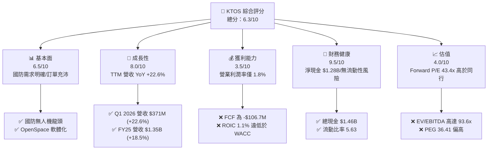

### 1.2 評分進度条視覺化

```
╔══════════════════════════════════════════════════════════════╗
║                KTOS 多維度評分儀表板 (1-10分)                ║
╠══════════════════════════════════════════════════════════════╣
║ 基本面強度  6.5 ▓▓▓▓▓▓▓▓▓▓▓▓▓░░░░░░░  ★★★☆☆           ║
║ 成長動能    8.0 ▓▓▓▓▓▓▓▓▓▓▓▓▓▓▓▓░░░░  ★★★★☆           ║
║ 獲利品質    3.5 ▓▓▓▓▓▓▓░░░░░░░░░░░░░  ★★☆☆☆           ║
║ 財務健康    9.5 ▓▓▓▓▓▓▓▓▓▓▓▓▓▓▓▓▓▓▓░  ★★★★★           ║
║ 估值合理性  4.0 ▓▓▓▓▓▓▓▓░░░░░░░░░░░░  ★★☆☆☆           ║
║ 護城河深度  6.8 ▓▓▓▓▓▓▓▓▓▓▓▓▓░░░░░░░  ★★★☆☆           ║
║ 管理層執行  7.0 ▓▓▓▓▓▓▓▓▓▓▓▓▓▓░░░░░░  ★★★☆☆           ║
║ 技術創新力  8.5 ▓▓▓▓▓▓▓▓▓▓▓▓▓▓▓▓▓░░░  ★★★★☆           ║
╠══════════════════════════════════════════════════════════════╣
║ 綜合總分    6.2 ▓▓▓▓▓▓▓▓▓▓▓▓░░░░░░░░  🟡 中立/持有    ║
╚══════════════════════════════════════════════════════════════╝
```

### 1.3 五大投資論點 + 三大核心風險

| 類型 | 項目 | 具體依據 | 信心度 |
|------|------|----------|--------|
| 🟢 **投資論點①** | **無人戰術機規模化產能即將釋放** | XQ-58A Valkyrie 獲美軍及盟國採購，帶動 Unmanned Systems 營收快速成長 | 🟢 高 |
| 🟢 **投資論點②** | **資產負債表具備極高防禦力** | 現金高達 $1.46B，負債僅 $185.4M，淨現金 $1.28B 保障高 Capex 期的營運安全性 | 🟢 極高 |
| 🟢 **投資論點③** | **衛星地面站軟體化轉換（OpenSpace）** | 傳統硬體架構轉向高毛利 OpenSpace 雲端虛擬化平台，長期推升毛利率 | 🟢 中 |
| 🟢 **投資論點④** | **高超音速測試與火箭推進業務強勁** | 國防部對高超音速武器（Hypersonics）測試需求升溫，推進系統訂單能見度高 | 🟢 高 |
| 🟢 **投資論點⑤** | **營收加速成長帶動規模槓桿** | Q1 2026 營收達 $371M（YoY +22.6%），FY25 營收 YoY 達 18.5%，規模效應可期 | 🟢 高 |
| 🟡 **風險①** | **自由現金流持續為負** | TTM FCF 為 -$106.72M，Capex 支出高達 $95.3M/年，短中期難以產生實質現金回報 | 🟡 中度 |
| 🔴 **風險②** | **營業利潤率極低（1.8%）** | 重資本與高研發投入壓抑短期淨利（TTM 淨利僅 $29.4M），承受成本上升風險能力低 | 🔴 高衝擊 |
| 🔴 **風險③** | **估值溢價過高** | EV/EBITDA 達 93.6x，Trailing P/E 278.5x，若獲利兌現不及預期，股價仍有下修正風險 | 🔴 高衝擊 |

### 1.4 快速統計卡片

| 指標 | 公司實際值 (KTOS) | 行業均值 (Aerospace & Defense) | S&P 500 均值 | 狀態 |
|------|-------------|----------|--------------|------|
| **收入 YoY 成長** | **22.6%** | ~7.5% | ~5.2% | 🟢 優於同業 |
| **毛利率** | **22.9%** | ~26.5% | ~45.0% | 🟡 略低於同業 |
| **營業利潤率** | **1.8%** | ~9.5% | ~12.2% | 🔴 遠低於同業 |
| **ROE** | **1.2%** | ~14.0% | ~18.5% | 🔴 偏低 |
| **Forward P/E** | **43.4x** | ~22.0x | ~21.5x | 🔴 估值偏高 |
| **淨現金 / (淨債務)** | **+$1.28B** | -$1.50B | -$2.10B | 🟢 極度健全 |

### 1.5 投資結論

```
╔══════════════════════════════════════════════════════════════════╗
║                    📊 投資結論摘要                               ║
╠══════════════════════════════════════════════════════════════════╣
║  評級：🟡 中立 / 持有 (Hold)                                     ║
║  當前股價：$47.35                                                ║
║  目標價區間：                                                    ║
║    悲觀情境：$38.00（-19.7%）                                    ║
║    基準情境：$55.00（+16.2%）  ← 12個月主要目標                  ║
║    樂觀情境：$85.00（+79.5%）                                    ║
║  投資評分：6.2 / 10                                              ║
║  適合投資人：具備高風險承受度、看好無人機/國防科技之長線成長型買家║
╚══════════════════════════════════════════════════════════════════╝
```

---

## 2. 公司概覽與商業模式

### 2.1 業務結構與收入來源

Kratos (KTOS) 主要營運劃分為兩大核心部門：
1. **Kratos Government Solutions (KGS, 約佔營收 72%)**：提供衛星地面虛擬化系統 (OpenSpace)、C5ISR、高超音速推進系統測試、渦輪引擎及微波電子組件。
2. **Unmanned Systems (MUOS, 約佔營收 28%)**：設計並製造戰術無人駕駛航空器（如 XQ-58A Valkyrie）及高階無人靶機（Target Drones，如 BQM-177A）。

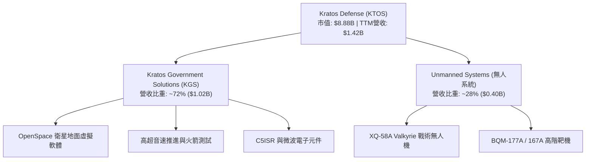

### 2.2 市場份額估算

在美國國防部高階無人靶機（High-Performance Target Drones）市場中，Kratos 佔據壟斷性的龍頭地位；但在戰術無人戰鬥機（Tactical UCAV）領域，其正與傳統軍工巨頭競爭。

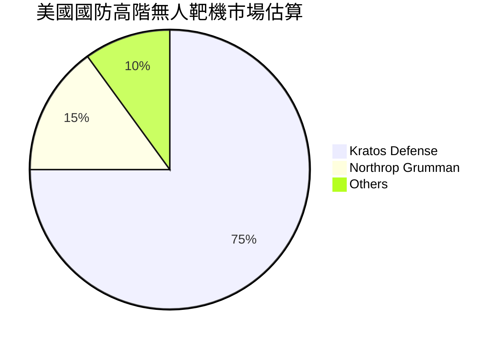

### 2.3 競爭護城河分析

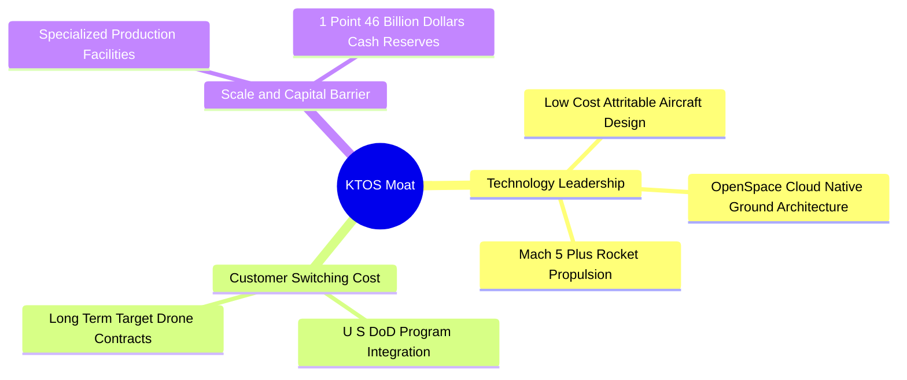

### 2.4 護城河強度評分

```
╔══════════════════════════════════════════════════════════════╗
║                   Kratos 護城河強度評分                      ║
╠══════════════════════════════════════════════════════════════╣
║ 可消耗無人機技術  8.5/10 ▓▓▓▓▓▓▓▓▓▓▓▓▓▓▓▓▓░░  🟢 先發優勢      ║
║ 衛星地面站虛擬化  7.5/10 ▓▓▓▓▓▓▓▓▓▓▓▓▓▓░░░░  🟢 轉化成本高    ║
║ 國防部認證與關係  8.0/10 ▓▓▓▓▓▓▓▓▓▓▓▓▓▓▓░░░  🟢 進入壁壘高    ║
║ 規模效益與成本控制 5.0/10 ▓▓▓▓▓▓▓▓▓▓░░░░░░░░  🟡 尚在規模化初段║
╠══════════════════════════════════════════════════════════════╣
║ 綜合護城河評分     6.8/10 ▓▓▓▓▓▓▓▓▓▓▓▓▓░░░░  🟢 中強護城河    ║
╚══════════════════════════════════════════════════════════════╝
```

---

## 3. 損益表深度分析

### 3.1 年度收入成長趨勢（近4年）

Kratos 近年營收呈現明顯加速成長態勢，自 2022 年的 $898.3M 成長至 FY2025 的 $1.35B，TTM 更達到 $1.42B。

```
╔══════════════════════════════════════════════════════════════════╗
║                KTOS 年度收入趨勢（FY22-TTM）                     ║
╠══════════════════════════════════════════════════════════════════╣
║                                                                  ║
║  FY2022  $898.3M   ██████████████░░░░░░░░░  YoY: +10.7%  🟢    ║
║  FY2023  $1.04B    ████████████████░░░░░░░  YoY: +15.5%  🟢    ║
║  FY2024  $1.14B    █████████████████░░░░░░  YoY:  +9.6%  🟢    ║
║  FY2025  $1.35B    █████████████████████░░  YoY: +18.5%  🟢    ║
║  TTM     $1.42B    ███████████████████████  YoY: +22.6%  🟢    ║
║                                                                  ║
║  📊 3年累計 CAGR：+14.4%                                        ║
╚══════════════════════════════════════════════════════════════════╝
```

### 3.2 季度收入趨勢分析

| 季度 | 營收 ($M) | YoY 成長率 | QoQ 成長率 | 營業利潤 ($M) | 淨利 ($M) | 關鍵驅動因素 |
|------|-----------|------------|------------|---------------|-----------|--------------|
| **Q2 2025** | $351.5 | +17.1% | +16.2% | $3.70 | $2.90 | 靶機交付放量與高超音速業務增長 |
| **Q3 2025** | $347.6 | +26.0% | -1.1% | $7.30 | $8.70 | C5ISR 與 OpenSpace 合約里程碑認列 |
| **Q4 2025** | $345.1 | +21.9% | -0.7% | $10.10 | $5.90 | 無人機部門毛利率微幅改善 |
| **Q1 2026** | **$371.0** | **+22.6%** | **+7.5%** | $6.60 | $11.90 | 無人機系統與高超音速推進超預期交付 |

### 3.3 利潤率演變分析

| 利潤率指標 | FY2022 | FY2023 | FY2024 | FY2025 | TTM | 趨勢說明 | 評估 |
|------------|--------|--------|--------|--------|-----|----------|------|
| **毛利率** | 25.2% | 25.9% | 25.3% | 22.9% | **22.9%** | ↘️ 新產品開發初期毛利較低 | 🟡 承壓 |
| **營業利潤率** | -0.3% | 3.0% | 2.6% | 1.9% | **1.8%** | ↘️ 研發與擴展規模推升 SG&A | 🔴 偏低 |
| **EBITDA Margin** | 2.9% | 7.5% | 8.2% | 7.6% | **5.7%** | ↘️ 資本支出增長折舊拉高 | 🟡 尚可 |
| **淨利率** | -4.1% | -0.9% | 1.4% | 1.6% | **2.1%** | ↗️ 利息費用下降與淨現金收益增加 | 🟡 改善中 |

**利潤率演變深度解析**：
毛利率自 FY22 的 25.2% 下降至 TTM 的 22.9%，主因無人機部門尚處於從研發（R&D）過渡至低速率初始生產（LRIP）階段，固定價格合約占比高，加上供應鏈成本上升。營業利潤率維持在 1.8% 的極低水平，說明公司當前將大部分營收轉化為研發支出（$40.0M/年）與營運擴建，尚未展現營業槓桿。

### 3.4 費用結構分析

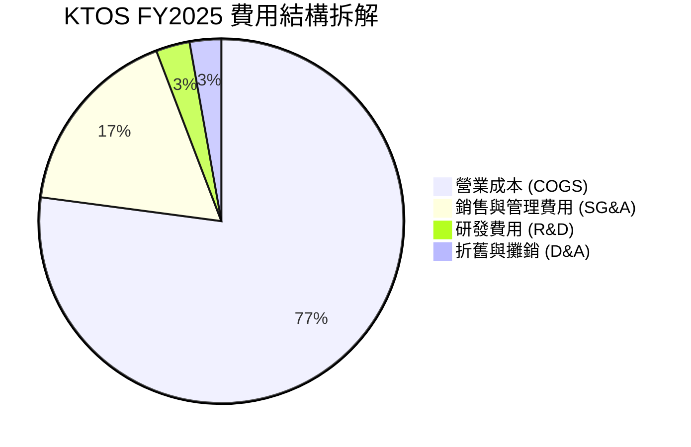

```
╔══════════════════════════════════════════════════════════════════╗
║               KTOS 費用結構與槓桿分析 (TTM)                      ║
╠══════════════════════════════════════════════════════════════════╣
║  總營收：$1,415.0M (100.0%)                                      ║
║  ├── 營業成本 (COGS)：$1,091.1M (77.1%)  ── 產能擴張期拉高成本  ║
║  ├── 銷售與行政 (SG&A)：$256.2M (18.1%)  ── 國防合約投標成本    ║
║  ├── 研究開發 (R&D)：$40.0M (2.8%)       ── Valkyrie/OpenSpace  ║
║  └── 營業利潤 (EBIT)：$25.6M (1.8%)      ── 營業槓桿尚未釋放    ║
╚══════════════════════════════════════════════════════════════════╝
```

### 3.5 季度 EPS 趨勢與盈餘品質（Quality of Earnings）

KTOS 近 4 季 EPS 分別為 Q225 $0.02、Q325 $0.05、Q425 $0.03、Q126 $0.07，TTM EPS 為 $0.17。然而，透過評估其獲利「含金量」，可發現 GAAP 淨利被利息收入美化，但現金流品質不佳。

| 盈餘品質項目 | 數值/佔比 | 評估 |
|--------------|-----------|------|
| **股權薪酬 (SBC) / 營收** | $35.5M / 2.6% | 🟡 屬中等水平，對股權產生微幅稀釋 |
| **SBC / 營業現金流** | N/A (OCF 為負) | 🔴 現金流為負，SBC 掩蓋了實質現金消耗 |
| **FCF / 淨利（現金轉換率）** | -$106.7M / $29.4M (-363%) | 🔴 **極差**，受高額 Capex ($95.3M) 影響 |
| **一次性損益影響** | 現金孳息約 $15M-$20M | 🟡 淨利包含高額現金利息收入，非主業營業利益 |
| **資本化支出比率** | 高 (Capex/Rev = 6.7%) | 🔴 大量廠房設備資本化，折舊將壓抑未來利潤率 |

**盈餘品質結論**：KTOS 的 GAAP 淨利 $29.4M TTM 並未反映其真實的自由現金消耗（TTM FCF -$106.7M）。淨利主要靠增資後的利息收入與稅務調整支撐，營運現金流（OCF）仍為負值，盈餘品質評為 **🔴 偏低**。

---

## 4. 資產負債表分析

### 4.1 資產結構分解

截至 Q1 2026，KTOS 的總資產因增資劇增至 **$4.04B**，流動資產達 **$2.31B**，其中現金與短期投資高達 **$1.46B**。

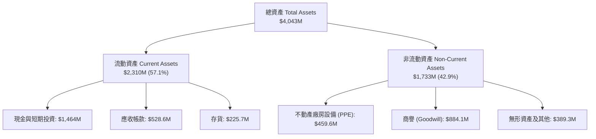

### 4.2 流動性指標分析

| 流動性指標 | FY2023 | FY2024 | FY2025 | Q1 2026 | 行業均值 | 評估 |
|------------|--------|--------|--------|---------|----------|------|
| **流動比率 (Current Ratio)** | 2.03 | 2.94 | 4.06 | **5.63** | 1.35 | 🟢 極強 |
| **速動比率 (Quick Ratio)** | 1.37 | 2.20 | 3.27 | **4.85** | 0.95 | 🟢 極強 |
| **現金比率 (Cash Ratio)** | 0.25 | 1.11 | 1.80 | **3.56** | 0.35 | 🟢 無償債風險 |

### 4.3 債務結構分析

```
╔══════════════════════════════════════════════════════════════════╗
║                   KTOS 債務健康診斷 (Q1 2026)                    ║
╠══════════════════════════════════════════════════════════════════╣
║                                                                  ║
║  總債務 (Total Debt)：   $185.4M  ██░░░░░░░░░░░░░░░░░░░  無負擔  ║
║  總現金 (Total Cash)：   $1.46B   █████████████████████  極度充沛║
║  淨現金 (Net Cash)：     $1.28B   ██████████████████░░░  🟢 強勁  ║
║                                                                  ║
║  Debt / Equity：         0.08x    🟢 負債比率極低                ║
║  Debt / EBITDA：         1.80x    🟢 債務壓力極低                ║
║  利息保障倍數：          >10.0x   🟢 無違約風險                  ║
║                                                                  ║
║  📊 結論：管理層於 2025/2026 增資成功鎖定長期營運資金。          ║
╚══════════════════════════════════════════════════════════════════╝
```

### 4.4 股東權益趨勢

因增資發行新股，股東權益由 FY2022 的 $936.3M 大幅擴充至 Q1 2026 的 **$2.31B**，總發行股數由 1.25B 股擴增至 187.52M 股，顯著提升資本底氣但短線對每股淨值帶來一定稀釋。

---

## 5. 現金流量深度分析

### 5.1 現金流量瀑布圖

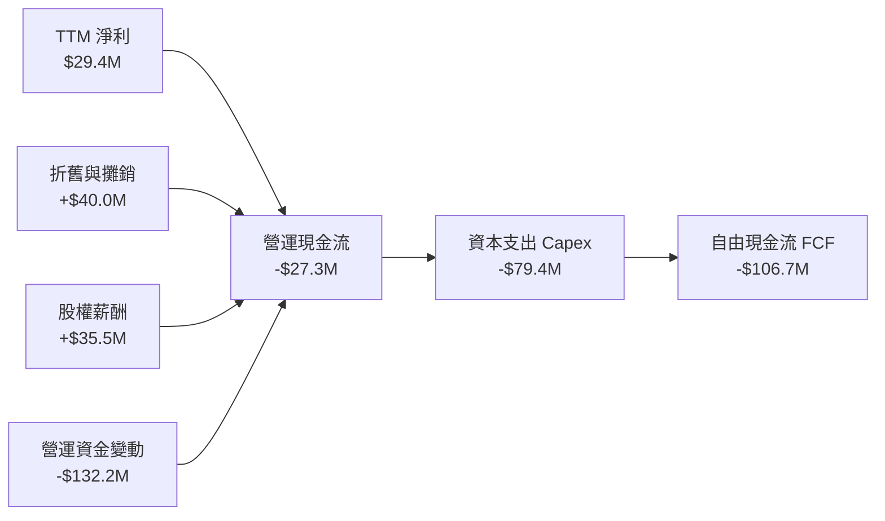

### 5.2 FCF 轉換率趨勢

| 年份 | 淨利 ($M) | 營運現金流 ($M) | 資本支出 Capex ($M) | 自由現金流 FCF ($M) | FCF / Net Income |
|------|-----------|------------------|----------------------|----------------------|------------------|
| **FY2022** | -$36.9 | -$25.7 | -$45.4 | -$71.1 | N/A |
| **FY2023** | -$8.9 | +$65.2 | -$52.4 | +$12.8 | N/A |
| **FY2024** | $16.3 | +$49.7 | -$58.2 | -$8.5 | -52.1% |
| **FY2025** | $22.0 | -$42.1 | -$95.3 | -$137.4 | -624.5% |
| **TTM** | **$29.4** | **-$27.3** | **-$79.4** | **-$106.7** | **-362.9%** |

### 5.3 自由現金流趨勢

```
╔══════════════════════════════════════════════════════════════════╗
║                KTOS 自由現金流 (FCF) 歷史軌跡                     ║
╠══════════════════════════════════════════════════════════════════╣
║  FY2022   -$71.1M   ░░░░░░░░░██████                          ║
║  FY2023   +$12.8M   ███████████████  🟢 正向                     ║
║  FY2024    -$8.5M   ░░░░░░░░░░░░███                          ║
║  FY2025  -$137.4M   ░░░░░█████████████████████  🔴 Capex 高峰     ║
║  TTM     -$106.7M   ░░░░█████████████████████   🔴 繼續消耗      ║
╠══════════════════════════════════════════════════════════════════╣
║  最新 FCF Yield：-1.20% ｜ Capex/Revenue：6.7% (高於行業均值 3.2%)║
╚══════════════════════════════════════════════════════════════════╝
```

### 5.4 資本配置評估

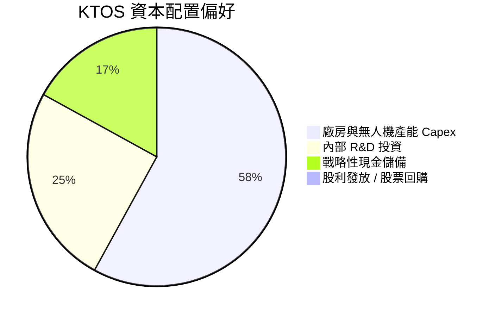

Kratos 完全不進行股利發放或大規模庫藏股回購，100% 資本保留於核心無人機產能擴建（加州與俄克拉荷馬州新廠）、OpenSpace 研發與戰略現金存糧，屬於典型的**高再投資型成長公司**。

---

## 6. 獲利能力與資本效率

### 6.1 ROE / ROA / ROIC 趨勢

| 資本效率指標 | FY2022 | FY2023 | FY2024 | FY2025 | TTM | 行業均值 | 評估 |
|--------------|--------|--------|--------|--------|-----|----------|------|
| **ROE** | -3.9% | -0.9% | 1.4% | 1.3% | **1.2%** | ~14.0% | 🔴 低落 |
| **ROA** | -2.4% | -0.5% | 0.9% | 1.0% | **0.6%** | ~6.5% | 🔴 低落 |
| **ROIC** | -1.6% | 2.0% | 1.8% | 1.2% | **1.1%** | ~8.5% | 🔴 遠低於 WACC |

### 6.2 ROIC vs WACC 分析（核心價值創造判斷）

```
╔══════════════════════════════════════════════════════════════════╗
║                KTOS ROIC vs WACC 深度分析 (TTM)                  ║
╠══════════════════════════════════════════════════════════════════╣
║                                                                  ║
║  WACC 估算：                                                     ║
║  ├── 無風險利率（10Y美債）：  4.2%                               ║
║  ├── 市場風險溢酬 (ERP)：     5.0%                              ║
║  ├── Beta：                   1.07                               ║
║  ├── 股權成本 (Cost of Equity)：4.2% + 1.07 × 5.0% = 9.55%       ║
║  ├── 債務成本（稅後）：       ~4.5%                             ║
║  ├── 資本結構：股權 ~88%，債務 ~12%                             ║
║  └── ✅ WACC ≈ 8.2%                                             ║
║                                                                  ║
║  ROIC 估算（TTM）：                                              ║
║  ├── NOPAT = $25.6M × (1 - 21%) ≈ $20.2M                         ║
║  ├── 投入資本 = 股東權益 ($2,000M) + 債務 ($185M) - 現金 ($350M營運) ║
║  │            ≈ $1,835M                                          ║
║  └── ✅ ROIC ≈ 1.1%                                             ║
║                                                                  ║
║  ★ 經濟價值增加（EVA）= ROIC - WACC = -7.1pp                     ║
║                                                                  ║
║  ROIC  1.1%  ▓▓░░░░░░░░░░░░░░░░░░░░░░░░░░░░░░  🔴 價值銷蝕      ║
║  WACC  8.2%  ▓▓▓▓▓▓▓▓▓▓▓▓▓░░░░░░░░░░░░░░░░░░░  ── 資金成本      ║
║                                                                  ║
║  📊 結論：ROIC 遠低於 WACC，公司當前處於資本投入期，尚未創造價值。║
╚══════════════════════════════════════════════════════════════════╝
```

### 6.3 杜邦三因素分解

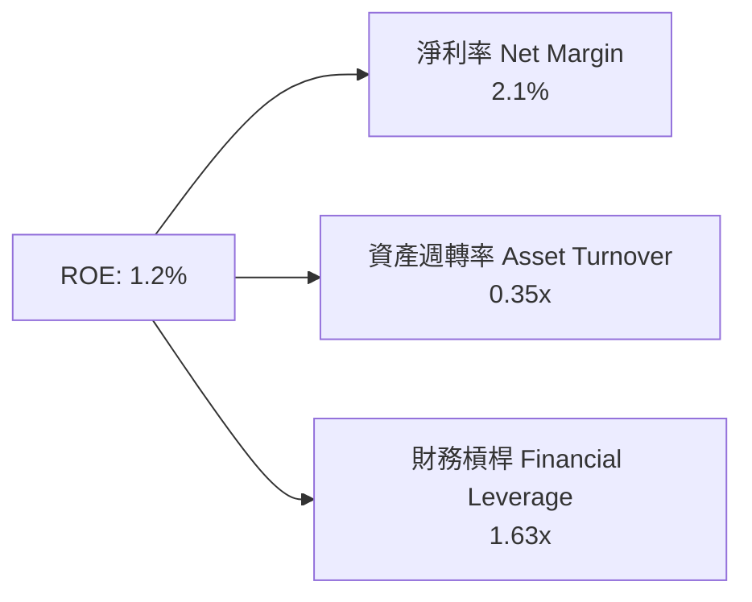

杜邦分解顯示 KTOS ROE 偏低（1.2%）主要受制於**極低的淨利率 (2.1%)** 與**偏低的資產週轉率 (0.35x)**。公司資產負債表因大筆現金充斥而「肥胖」，拉低了整體資產產出效率。

### 6.4 獲利能力儀表板

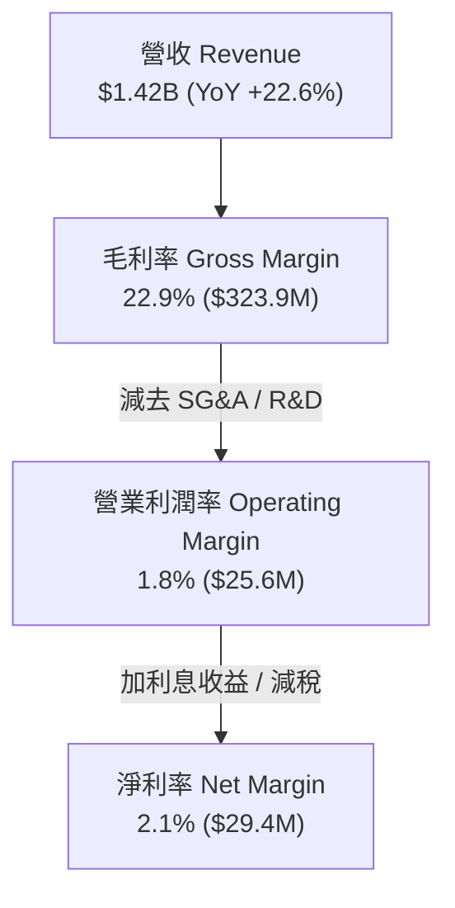

---

## 7. 估值深度分析

### 7.1 同業估值比較表格

選取 AeroVironment (AVAV)、Lockheed Martin (LMT) 與 L3Harris (LHX) 作為直接競爭對手：

| 估值指標 | **KTOS** | **AVAV (無人機同業)** | **LMT (傳統軍工巨頭)** | **LHX (國防電子同業)** | 本公司評估 |
|----------|----------|----------------------|-----------------------|-----------------------|-----------|
| **Trailing P/E** | **278.5x** | 85.2x | 18.5x | 24.1x | 🔴 遠高於同業 |
| **Forward P/E** | **43.4x** | 48.6x | 16.8x | 17.2x | 🟡 與純無人機對手相當 |
| **P/S Ratio** | **6.27x** | 5.80x | 1.82x | 1.65x | 🔴 包含高成長溢價 |
| **EV / Revenue** | **5.37x** | 5.45x | 2.15x | 2.05x | 🟡 無人機標的合理區間 |
| **EV / EBITDA** | **93.6x** | 42.1x | 13.2x | 14.5x | 🔴 EBITDA 未放量致倍數偏高 |
| **FCF Yield** | **-1.20%** | +0.80% | +5.80% | +4.90% | 🔴 Cash Burn 階段 |

> **估值倍數選擇說明**：因 KTOS 當前淨利受折舊攤銷與研發投資壓抑，P/E 嚴重失真。機構分析師主要採用 **EV/Revenue** 與 **Forward EV/EBITDA** 作為估值锚定指標。

### 7.2 歷史估值區間分析

```
╔══════════════════════════════════════════════════════════════════╗
║              KTOS 歷史 Forward P/E 區間與當前位置                ║
╠══════════════════════════════════════════════════════════════════╣
║  歷史高點 (2025-09):  115.0x  ██████████████████████████████████ ║
║  歷史均值 (5Y Average):45.0x  █████████████                      ║
║  當前位置 (Current):   43.4x  █████████████  ← 🟡 回落至歷史均值 ║
║  歷史低點 (2022-10):   22.0x  ██████                             ║
╚══════════════════════════════════════════════════════════════╝
```

### 7.3 情境目標價（假設驅動，Bear / Base / Bull）

| 情境 | 營收 3Y CAGR | 2027E 營業利潤率 | 2027E Target EV/EBITDA | 隱含目標價 | 相對現價 ($47.35) |
|------|--------------|-------------------|------------------------|------------|-------------------|
| 🔴 **悲觀** | 10.0% | 3.5% | 25.0x | **$38.00** | -19.7% |
| 🟡 **基準** | **18.0%** | **5.5%** | **35.0x** | **$55.00** | **+16.2%** |
| 🟢 **樂觀** | 25.0% | 8.0% | 48.0x | **$85.00** | +79.5% |

**基準情境核心假設**：
1. 營收由 2025 年 $1.35B 以 18% CAGR 成長至 2027E 年的 ~$1.88B。
2. 隨著 Valkyrie 進入量產，營業利潤率由 1.8% 提升至 5.5%，產生 $103.4M EBITDA。
3. 給予 35x 2027E EV/EBITDA 估值倍數（考量其高成長無人機溢價）。

### 7.4 DCF 敏感性分析（6格目標價矩陣）

假設 Terminal Growth Rate (永續成長率) 為 3.0%：

| 營收成長情境 | **WACC = 7.5%** | **WACC = 8.2%（基準）** | **WACC = 9.0%** |
|--------------|----------------|------------------------|----------------|
| 🟢 **樂觀 (CAGR 22%)** | **$88.50** (+86.9%) | **$78.20** (+65.2%) | **$69.10** (+45.9%) |
| 🟡 **基準 (CAGR 18%)** | **$62.40** (+31.8%) | **$55.00** (+16.2%) | **$48.30** (+2.0%) |
| 🔴 **悲觀 (CAGR 12%)** | **$42.10** (-11.1%) | **$38.00** (-19.7%) | **$33.50** (-29.2%) |

### 7.5 估值綜合區間

```
╔══════════════════════════════════════════════════════════════════╗
║                   KTOS 估值綜合區間與當前股價                    ║
╠══════════════════════════════════════════════════════════════════╣
║  52週股價區間：        $45.58 ───────────────────────── $134.00  ║
║  當前股價：            $47.35 (接近52週低點)                      ║
║                                                                  ║
║  DCF 估值區間：        $38.00 ═══════ $55.00 ═════════ $85.00  ║
║  同業對比目標價：      $42.00 ═══════ $58.00 ═════════ $90.00  ║
║  華爾街共識目標價：    $60.00 ═════════════════ $109.33 ═ $150  ║
║                                                                  ║
║  📊 結論：當前股價已修正至基準價值 ($55) 下方，具備安全邊際。    ║
╚══════════════════════════════════════════════════════════════╝
```

---

## 8. 成長催化劑

### 8.1 催化劑時間軸

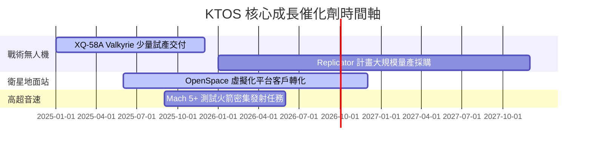

### 8.2 TAM 市場規模分析

```
╔══════════════════════════════════════════════════════════════════╗
║                   KTOS 潛在市場規模 (TAM) 分析                   ║
╠══════════════════════════════════════════════════════════════════╣
║  1. 可消耗無人機與忠誠僚機 (CCA TAM):    $12.5B  (滲透率 ~3%)    ║
║  2. 衛星地面站虛擬化 (OpenSpace TAM):   $5.0B   (滲透率 ~8%)    ║
║  3. 高超音速測試與火箭推進系統 TAM:     $4.2B   (滲透率 ~12%)   ║
║                                                                  ║
║  📊 總潛在市場 (Total TAM)：~$21.7B                              ║
║     KTOS 當前營收 ($1.42B) 僅佔整體 TAM 的 ~6.5%，成長空間廣闊。  ║
╚══════════════════════════════════════════════════════════════════╝
```

### 8.3 成長驅動力結構圖

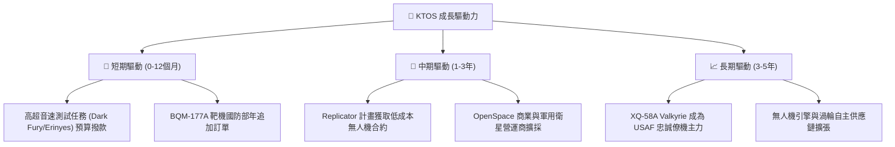

---

## 9. 風險矩陣

### 9.1 風險評分矩陣

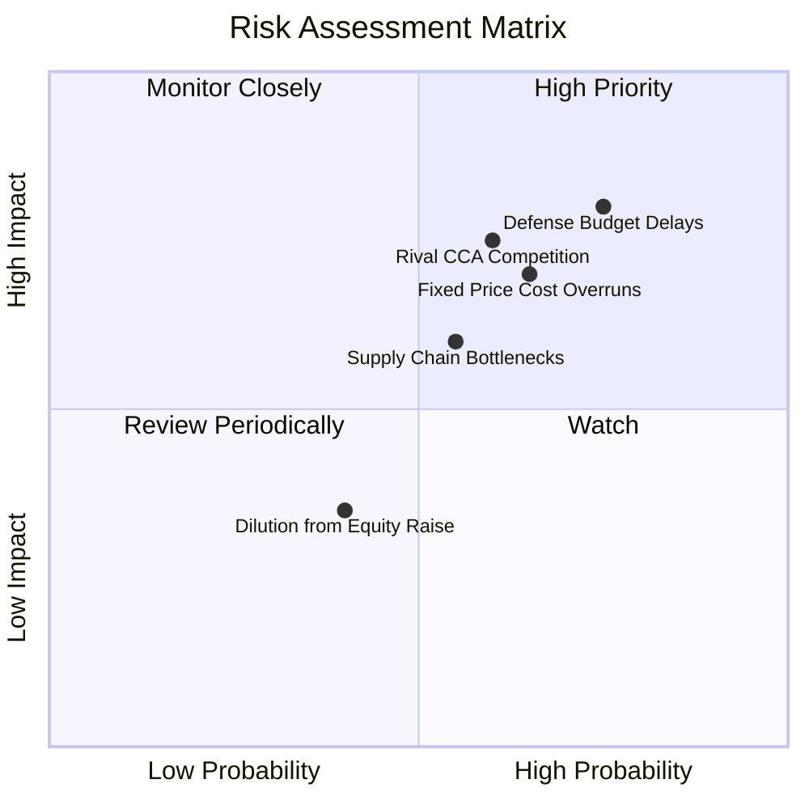

### 9.2 風險清單詳細分析

| # | 風險項目 | 發生機率 | 財務衝擊 | 風險評分 | 緩解措施 |
|---|----------|----------|----------|----------|----------|
| 1 | 🔴 **美國國防部預算撥款延遲** | 高 (75%) | 高 (-10%營收) | 🔴 **8.0/10** | 保持高現金儲備（$1.46B）以緩衝撥款空窗期 |
| 2 | 🔴 **固定價格合約成本超支** | 中 (65%) | 高 (-200bps毛利) | 🔴 **7.5/10** | 提高材料預採購比例與優化生產流程 |
| 3 | 🟡 **傳統軍工巨頭（如 General Atomics/Boeing）競爭** | 中 (60%) | 高 (-市場份額) | 🟡 **7.0/10** | 專注於高性價比「可消耗 (Attritable)」無人機定位 |
| 4 | 🟡 **供應鏈瓶頸與關鍵組件短缺** | 中 (55%) | 中 (-5%交付效率) | 🟡 **6.0/10** | 垂直整合引擎與微波電子件自研 |

---

## 10. 投資建議

### 10.1 最終綜合評級雷達圖

```
╔══════════════════════════════════════════════════════════════╗
║                 KTOS 投資維度綜合評分雷達                    ║
╠══════════════════════════════════════════════════════════════╣
║ 財務安全度  9.5 ▓▓▓▓▓▓▓▓▓▓▓▓▓▓▓▓▓▓▓░  🟢 淨現金 $1.28B      ║
║ 營收成長性  8.0 ▓▓▓▓▓▓▓▓▓▓▓▓▓▓▓▓░░░░  🟢 TTM YoY +22.6%     ║
║ 技術獨特性  8.0 ▓▓▓▓▓▓▓▓▓▓▓▓▓▓▓▓░░░░  🟢 Valkyrie/OpenSpace  ║
║ 獲利轉化率  3.5 ▓▓▓▓▓▓▓░░░░░░░░░░░░░  🔴 利潤率僅 1.8%       ║
║ 現金流品質  2.5 ▓▓▓▓▓░░░░░░░░░░░░░░░  🔴 FCF 為負 (-$106.7M) ║
║ 估值吸引力  5.5 ▓▓▓▓▓▓▓▓▓▓▓░░░░░░░░░  🟡 已自高點大幅修正    ║
╠══════════════════════════════════════════════════════════════╣
║ 綜合評級    6.2 ▓▓▓▓▓▓▓▓▓▓▓▓░░░░░░░░  🟡 中立 / 持有 (Hold)  ║
╚══════════════════════════════════════════════════════════════╝
```

### 10.2 目標價與隱含報酬率

| 情境 | 機率權重 | 目標價 | 當前股價 | 隱含報酬率 |
|------|----------|--------|----------|------------|
| 🔴 **悲觀情境** | 25% | $38.00 | $47.35 | -19.7% |
| 🟡 **基準情境** | **55%** | **$55.00** | **$47.35** | **+16.2%** |
| 🟢 **樂觀情境** | 20% | $85.00 | $47.35 | +79.5% |
| **加權預期價值** | 100% | **$56.75** | $47.35 | **+19.9%** |

### 10.3 買入時機與觸發因素 Checklists

```
╔══════════════════════════════════════════════════════════════════╗
║                  ✅ 買入觸發因素 Checklist                      ║
╠══════════════════════════════════════════════════════════════════╣
║  立即建倉觸發條件（需多數符合）：                                ║
║  ☐ 股價進一步回落至 $40.00 - $42.00 安全邊際區間                 ║
║  ✅ 淨現金儲備維持在 $1.0B 以上（當前 $1.28B ✅）                 ║
║  ☐ 營業利潤率 (Operating Margin) 連續兩季擴張至 > 4.0%           ║
║                                                                  ║
║  加碼觸發條件（出現以下任一）：                                  ║
║  ☐ 美國空軍 CCA (Collaborative Combat Aircraft) 簽署大額量產合約  ║
║  ☐ FCF 轉正且 FCF Yield > +2.0%                                  ║
║                                                                  ║
║  減碼/停損觸發條件（出現以下任一）：                             ║
║  🔴 營收成長率連續兩季跌破 < 10.0%                               ║
║  🔴 核心無人機專案（Valkyrie）競標敗給競爭對手                  ║
╚══════════════════════════════════════════════════════════════════╝
```

### 10.4 投資人適配度分析

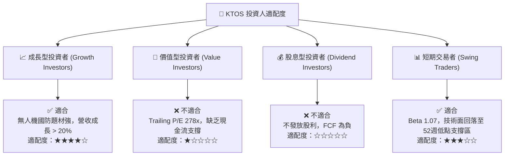

### 10.5 每季財報監控清單（Quarterly Watch List）

每次財報發布時，投資人應重點追蹤以下 5 大關鍵指標：

| 監控指標 | 最新數據 (Q1 2026) | 理想目標值 | 觸發減碼/停損門檻 |
|----------|-------------------|------------|-------------------|
| **營收 YoY 成長率** | 22.6% | > 18.0% | < 10.0% |
| **營業利潤率 (Operating Margin)** | 1.8% | > 4.0% | < 0.0% (出現虧損) |
| **無人系統部門 (MUOS) 營收占比** | ~28% | > 35% | < 20% |
| **資本支出 Capex** | $19.9M / 季 | < $20M / 季 (控管資本消耗) | > $35M / 季且無營收增長 |
| **自由現金流 (FCF)** | -$47.3M / 季 | 逐步縮減赤字至收支平衡 | 連續兩季赤字 > -$60M |

### 10.6 反面論證：什麼會證明論點錯誤（What Would Change My Mind）

```
╔══════════════════════════════════════════════════════════════════╗
║              ⚠️ 論點失效條件（Disconfirming Evidence）           ║
╠══════════════════════════════════════════════════════════════════╣
║  本報告的中立/看好評級建立於「營收高成長將最終轉化為營業槓桿」   ║
║  之假設上。若出現以下可量化條件，將證明多頭論點錯誤並應清倉：     ║
║                                                                  ║
║  1. 營業利潤率在未來 4 個季度內無法回升至 3.5% 以上。            ║
║  2. 自由現金流 (FCF) 赤字持續擴大，全年 FCF 消耗超過 -$150M。     ║
║  3. ROIC 連續兩年低於 2.0%，顯示龐大現金（$1.46B）被低效處置。   ║
║  4. 美國空軍忠誠僚機 (CCA) 合約由對手（如 GA-ASI）完全壟斷。     ║
╚══════════════════════════════════════════════════════════════════╝
```

---

> **免責聲明**：本報告為 AI 自動生成之研究報告，僅供學術研究與參考，不構成任何買賣股票之投資建議。投資有風險，入市需謹慎。