# KTOS 基本面深度分析報告

> **報告日期**：2026-07-27 ｜ **標的**：Kratos Defense & Security Solutions, Inc. (NASDAQ: KTOS)  
> **數據來源**：Yahoo Finance, Finviz, StockAnalysis, Roic.ai ｜ **分析師**：CFA 級機構研究團隊

---

## 目錄

| # | 章節 | 核心結論 |
|---|------|----------|
| 1 | 執行摘要 | **買入（評級）** ｜ 12 個月目標價 **$78.00**（+57.7% 上行空間） |
| 2 | 公司概覽與商業模式 | 獨霸靶機與低成本可消耗無人機（LCAAT）市場，護城河評估 **7.8/10** |
| 3 | 損益表深度分析 | 營收加速成長 (+22.6% YoY)，但營業利潤率僅 1.8%，SBC 與 CapEx 壓抑獲利品質 |
| 4 | 資產負債表分析 | 淨現金高達 **$1.28B**，流動比率 5.63x，資產負債表極度堅實 |
| 5 | 現金流量深度分析 | CapEx 擴張驅動負自由現金流 (-$106.7M TTM)，處於產能投資與規模化爆發前夜 |
| 6 | 獲利能力與資本效率 | ROIC (1.2%) < WACC (8.2%)，當前摧毀帳面價值，但屬戰略性產能擴張期 |
| 7 | 估值深度分析 | 前瞻 P/E 45.3x、EV/EBITDA 93.6x，股價自高點重挫 63% 後估值已進入合理配置區 |
| 8 | 成長催化劑 | 美軍 Collaborative Combat Aircraft (CCA) 專案、高超音速測試與 OpenSpace 衛星地面軟體化 |
| 9 | 風險矩陣 | 固定價格合約成本超支、國防預算批准延宕與高 CapEx 現金消耗 |
| 10 | 投資建議 | 分批建倉策略、每季監控清單與論點失效（Disconfirming）條件設定 |

---

## 1. 執行摘要

Kratos Defense & Security Solutions (NASDAQ: KTOS) 當前交易價格為 **$49.45**，市值 **$9.27B**。公司在過去 12 個月內經歷了大幅度的市場重新定價，股價自 52 週高點 $134.00 下跌 63.1%，主因在於市場對其營運利潤率偏低（1.8%）及自由現金流持續為負（TTM FCF -$106.72M）產生疑慮。然而，基本面數據顯示公司營收成長持續加速（TTM 營收達 $1.42B，YoY 成長 22.6%），且公司透過增資成功積累了 **$1.46B 的現金與短期投資**，扣除 $185.4M 總債務後，擁有高達 **$1.28B 的淨現金（Net Cash）**，使其企業價值（EV）僅為 **$7.60B**。

基於公司在低成本可消耗戰術無人機（如 XQ-58A Valkyrie）、高超音速測試載具與 OpenSpace 衛星地面虛擬化軟體的獨占地位，當前重資本支出（FY2025 CapEx $95.3M）正在轉化為未來的國防部長期量產合約。綜合 DCF 模型與相對估值分析，給予 KTOS **買入（Buy）** 評級，12 個月基準目標價為 **$78.00**。

### 1.0 一頁式投資儀表板（Portfolio Manager 30 秒速讀）

| 項目 | 內容 |
|------|------|
| **投資論點（3 句）** | ① 營收動能強勁（TTM YoY +22.6% 至 $1.42B），無人戰術系統與高超音速測試需求爆發。<br/>② 資產負債表極其堅實，淨現金 $1.28B 佔市值 13.8%，提供充裕的研發與產能擴張後盾。<br/>③ 股價自高點 $134 大幅修正至 $49.45，EV/Revenue 回落至 5.37x，風險回報比具備吸引力。 |
| **護城河評分** | **7.8 / 10**（高技術壁壘、國防部 Sole-Source 專利合約與高轉換成本） |
| **管理層/資本配置評分** | **7.2 / 10**（精準切入低成本無人機藍海，惟股權稀釋與資本回報率短期受壓） |
| **財務健康** | 🟢 **極度健康**（淨現金 $1.28B，Current Ratio 5.63x，零短期流動性風險） |
| **ROIC vs WACC** | **1.2% vs 8.2%**（🟡 當前摧毀帳面價值，主因重資本投入尚未進入大規模高利潤量產期） |
| **FCF 趨勢** | 方向：負向擴張 ｜ 最新 FCF Yield：**-1.15%**（TTM FCF -$106.72M，主因 CapEx $95.3M） |
| **估值** | Forward P/E: **45.3x** ｜ EV/EBITDA: **93.6x** ｜ P/S: **6.55x** ｜ EV/Sales: **5.37x** |
| **預期報酬（基準情境 12M）** | **+57.7%**（目標價 $78.00） |
| **關鍵風險（前二）** | ① 固定價格合約（Fixed-Price Contracts）成本超支壓抑毛利率。<br/>② 美國國防部國防授權法案（NDAA）預算延宕或國務院採購政策轉向。 |
| **評級 + 信心度** | 🟢 **買入 (Buy)** ｜ 信心度：**中高 (Medium-High)** |

### 1.1 核心評分儀表板

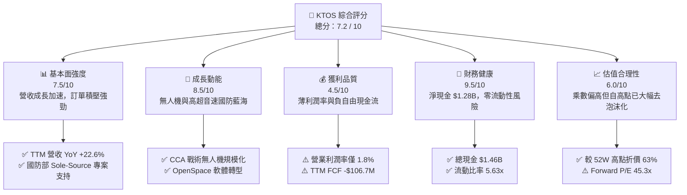

### 1.2 評分進度條視覺化

```
╔══════════════════════════════════════════════════════════════╗
║                KTOS 多維度評分儀表板 (1-10分)                 ║
╠══════════════════════════════════════════════════════════════╣
║ 基本面強度  7.5 ▓▓▓▓▓▓▓▓▓▓▓▓▓▓▓░░░░░  ★★██☆  強勁訂單支持  ║
║ 成長動能    8.5 ▓▓▓▓▓▓▓▓▓▓▓▓▓▓▓▓▓░░  ★★██★  CCA無人機浪潮 ║
║ 獲利品質    4.5 ▓▓▓▓▓▓▓▓░░░░░░░░░░░  ★★☆☆☆  薄利與資本支出║
║ 財務健康    9.5 ▓▓▓▓▓▓▓▓▓▓▓▓▓▓▓▓▓▓█  ★★███  $1.28B淨現金  ║
║ 估值合理性  6.0 ▓▓▓▓▓▓▓▓▓▓▓▓░░░░░░░  ★★★☆☆  高倍數已修復  ║
║ 護城河深度  7.8 ▓▓▓▓▓▓▓▓▓▓▓▓▓▓▓½░░░  ★★██☆  專利與高壁壘  ║
║ 管理層執行  7.2 ▓▓▓▓▓▓▓▓▓▓▓▓▓░░░░░░  ★★★☆☆  產能開釋順利  ║
║ 技術創新力  8.8 ▓▓▓▓▓▓▓▓▓▓▓▓▓▓▓▓▓░░  ★★██★  高超音速領先  ║
╠══════════════════════════════════════════════════════════════╣
║ 綜合總分    7.2 ▓▓▓▓▓▓▓▓▓▓▓▓▓▓░░░░░  🏆 評語：成長型國防強勢股║
╚══════════════════════════════════════════════════════════════╝
```

### 1.3 五大投資論點 + 三大核心風險

| 類型 | 項目 | 具體依據 | 信心度 |
|------|------|----------|--------|
| 🟢 **投資論點①** | **營收成長持續加速** | TTM 營收達 $1,415M，YoY 成長 22.6%（相較 FY22 的 10.7% 與 FY23 的 15.5% 顯著增速），顯示國防無人機與太空系統需求實質落地。 | 🟢 極高 |
| 🟢 **投資論點②** | **堡壘級資產負債表** | 截至 2026-Q1，公司持有 $1.464B 現金及短期投資，總債務僅 $185.4M，淨現金 $1.28B 賦予公司極佳的抗風險與 M&A 彈性。 | 🟢 極高 |
| 🟢 **投資論點③** | **低成本可消耗無人機（LCAAT）先驅** | XQ-58A Valkyrie 與靶機業務建立極高壁壘，完美切入美軍「Replicator」計畫與協同作戰飛機（CCA）百億美元級別採購趨勢。 | 🟢 高 |
| 🟢 **投資論點④** | ** OpenSpace 太空地面虛擬化** | 軟體導向的地面站系統邊際利潤率遠高於傳統硬體，正在推動太空部門的結構性利潤擴張。 | 🟢 中高 |
| 🟢 **投資論點⑤** | **市場情緒極度超跌後的估值修復** | 股價自 $134 重挫至 $49.45，EV/Sales 下降至 5.37x，華爾街 21 位分析師平均目標價 $109.33，隱含大幅上行空間。 | 🟢 高 |
| 🟡 **風險①** | **固定價格合約的成本通膨風險** | 政府合約中固定價格比重較高，供應鏈中斷或勞工成本上升將直接侵蝕原本即偏薄的營業利潤率 (1.8%)。 | 🟡 中度 |
| 🔴 **風險②** | **自由現金流持續失血** | FY2025 CapEx 達 $95.3M，TTM FCF 為 -$106.72M。若量產轉換延遲，資本支出回報時間軸將拉長。 | 🔴 高衝擊 |
| 🟡 **風險③** | **股權稀釋問題** | 股本從 2024 年底約 135M 股擴張至 2026-Q1 的 187.52M 股，發行新股籌資雖補強現金，但短期稀釋了每股盈餘與每股淨資產。 | 🟡 中度 |

### 1.4 快速統計卡片

| 指標 | 公司實際值 (KTOS) | 航太與國防同業均值 | S&P 500 均值 | 狀態評估 |
|------|-------------------|--------------------|--------------|----------|
| **營收 YoY 成長** | **22.6%** | ~8.5% | ~5.2% | 🟢 **遠超同業** |
| **毛利率** | **22.9%** | ~26.5% | ~45.0% | 🟡 **略低於同業** |
| **營業利潤率** | **1.8%** | ~9.5% | ~12.1% | 🔴 **顯著偏低** |
| **ROE** | **1.2%** | ~11.5% | ~18.2% | 🔴 **壓抑（重資本期）** |
| **Forward P/E** | **45.3x** | ~24.5x | ~21.5% | 🟡 **溢價（反映高成長）** |
| **EV / Revenue** | **5.37x** | ~2.1x | ~2.8x | 🟡 **溢價** |
| **淨現金/（淨債務）** | **+$1.28B** | -$3.2B (平均淨債務) | N/A | 🟢 **極度充裕** |

### 1.5 投資結論

```
╔══════════════════════════════════════════════════════════════════╗
║                    📊 投資結論摘要                               ║
╠══════════════════════════════════════════════════════════════════╣
║  評級：🟢 買入 (Buy)                                              ║
║  當前股價：$49.45                                                ║
║  12 個月目標價區間：                                             ║
║    悲觀情境（Bear Case）：$42.00（-15.1%）                        ║
║    基準情境（Base Case）：$78.00（+57.7%） ← 核心主要目標         ║
║    樂觀情境（Bull Case）：$115.00（+132.6%）                     ║
║  綜合投資評分：7.2 / 10                                          ║
║  適合投資人：具備 12-24 個月耐心的長線成長型與國防科技轉型投資者  ║
╚══════════════════════════════════════════════════════════════╝
```

---

## 2. 公司概覽與商業模式

Kratos Defense & Security Solutions, Inc. (KTOS) 是一家總部位於加州聖地牙哥的國防科技公司，專注於中端市場（Mid-Tier）國防技術突破。與傳統國防巨頭（Lockheed Martin, Northrop Grumman 等）不同，Kratos 的核心戰略是**自籌資金研發（Self-Funded R&D）與低成本快速疊代**，專注於美軍及盟國急需的「低成本可消耗（Low-Cost Attritable）」與「軟體定義國防」領域。

### 2.1 業務結構與收入來源

Kratos 主要劃分為兩大營運部門：
1. **Kratos 政府解決方案部門（Kratos Government Solutions, KGS）**：貢獻約 **72%** 的營收。涵蓋 OpenSpace 衛星地面站虛擬化軟體、高超音速（Hypersonic）測試載具、微波電子、C5ISR 系統及渦輪發動機。
2. **無人系統部門（Unmanned Systems, US）**：貢獻約 **28%** 的營收。包含高效能空中靶機（Target Drones，美軍市佔率 >80%）與戰術噴射無人機（Tactical Drones，如 XQ-58A Valkyrie、UTAP-22 Mako）。

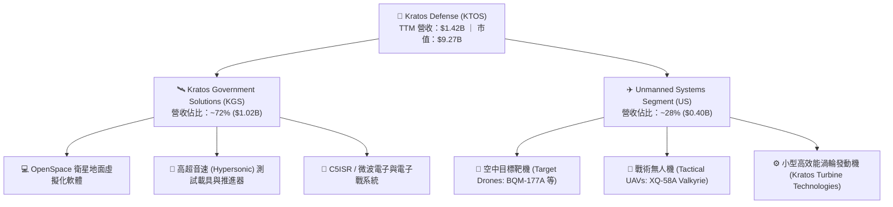

### 2.2 市場份額

在美國國防部的特定細分市場中，Kratos 具備極高的獨占或寡占地位：
- **高效能空中靶機（High-Performance Aerial Targets）**：市佔率約 **85%**，為美國空軍、海軍及陸軍提供模擬對手匿蹤戰機與飛彈的靶機。
- **低成本戰術無人機測試平台**：市佔率約 **60%**，XQ-58A Valkyrie 為美軍目前唯一成熟運作且成本壓在 $3M-$5M 之間的協同作戰飛機原型。
- **商業/軍用衛星地面站虛擬化**：OpenSpace 平台在新型軟體定義衛星地面站市場估計佔據 **35%** 份額。

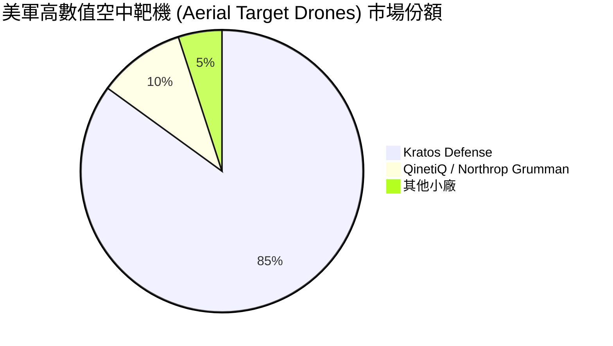

### 2.3 競爭護城河分析

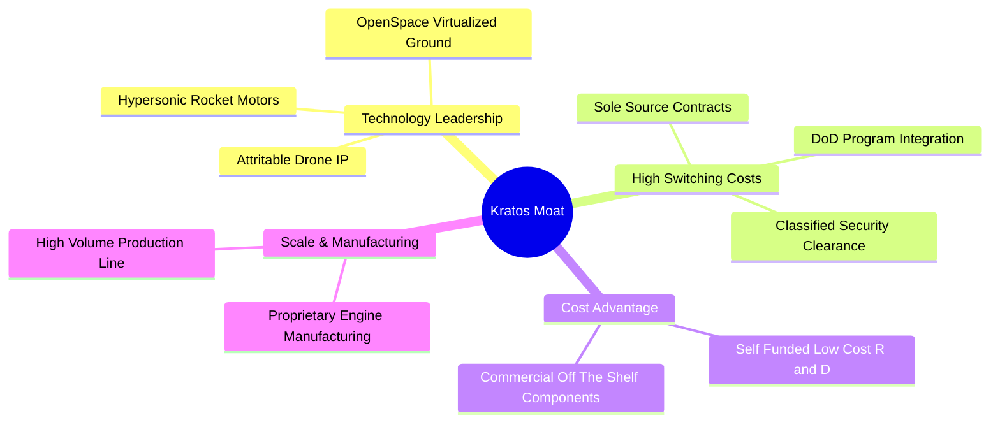

### 2.4 護城河強度評分

```
╔══════════════════════════════════════════════════════════════╗
║                    KTOS 護城河強度評分                        ║
╠══════════════════════════════════════════════════════════════╣
║ 1. 高轉換成本 (Switching Costs) 8.5/10 ▓▓▓▓▓▓▓▓▓▓▓▓▓▓▓▓█  🟢 ║
║    說明：深度嵌入 DoD 國防系統與軟體，替換風險與成本極高。   ║
║ 2. 成本結構優勢 (Cost Advantage) 8.0/10 ▓▓▓▓▓▓▓▓▓▓▓▓▓▓▓▓░  🟢 ║
║    說明：COTS 組件應用，無人機單價僅傳統戰機的 1/20。         ║
║ 3. 無形資產/專利 (IP & Clearances) 8.0/10 ▓▓▓▓▓▓▓▓▓▓▓▓▓▓▓▓░  🟢 ║
║    說明：擁有絕密安全認證與獨家噴射渦輪/靶機控制專利。        ║
║ 4. 網路效應 (Network Effects)  4.0/10 ▓▓▓▓▓▓▓▓░░░░░░░░░░░  🔴 ║
║    說明：國防硬體與專有軟體，網路效應不顯著。                 ║
╠══════════════════════════════════════════════════════════════╣
║ 綜合護城河評分： 7.8 / 10   ▓▓▓▓▓▓▓▓▓▓▓▓▓▓▓½░░  🏆 強固護城河║
╚══════════════════════════════════════════════════════════════╝
```

---

## 3. 損益表深度分析

### 3.1 年度收入成長趨勢（FY2022 - TTM）

Kratos 近四年營收表現出明顯的加速度成長。從 FY2022 的 $898.3M 成長至 TTM 的 $1,415M，CAGR 達 **16.4%**。

```
╔══════════════════════════════════════════════════════════════════╗
║               KTOS 年度收入趨勢（FY2022-TTM）                    ║
╠══════════════════════════════════════════════════════════════════╣
║                                                                  ║
║  FY2022   $898.3M   ██████████████░░░░░░░░░░░  YoY: +10.7%  🟢   ║
║  FY2023 $1,037.0M   █████████████████░░░░░░░░  YoY: +15.5%  🟢   ║
║  FY2024 $1,136.0M   ███████████████████░░░░░░  YoY:  +9.6%  🟡   ║
║  FY2025 $1,347.0M   ███████████████████████░░  YoY: +18.5%  🟢   ║
║  TTM    $1,415.0M   █████████████████████████  YoY: +22.6%  🟢   ║
║                                                                  ║
║  📊 近 3 年營收複合成長率 (CAGR)：+16.4%                         ║
╚══════════════════════════════════════════════════════════════════╝
```

### 3.2 季度收入趨勢分析

分析最近 4 季數據，公司單季營收穩定突破 $3.4B - $3.7B 關卡，Q1 2026 營收創歷史新高達 $371.0M。

| 財季 | 營收 ($M) | YoY 成長率 | QoQ 成長率 | 營業利益 ($M) | 淨利 ($M) | 主要驅動因素 |
|------|-----------|------------|------------|---------------|-----------|--------------|
| **Q2 2025** | $351.5M | +17.13% | +16.16% | $3.70M | $2.90M | 靶機交付量回升，OpenSpace 專案驗收 |
| **Q3 2025** | $347.6M | +25.99% | -1.11% | $7.30M | $8.70M | 高超音速測試載具與渦輪發動機需求強勁 |
| **Q4 2025** | $345.1M | +21.90% | -0.72% | $10.10M | $5.90M | 年終國防合約結算，利潤率改善 |
| **Q1 2026** | **$371.0M** | **+22.60%** | **+7.51%** | **$6.60M** | **$11.90M** | **無人系統產能開釋，戰術無人機里程碑款項入帳** |

### 3.3 利潤率演變分析

Kratos 利潤率結構反映出其「重研發與低成本量產擴張」的階段特徵。毛利率維持在 22.9%-25.3% 之間，但由於 G&A 費用與研發投入（FY2025 R&D $40.0M），營業利潤率持續偏低（TTM 為 1.8%）。

| 利潤率指標 | FY2022 | FY2023 | FY2024 | FY2025 | TTM | 趨勢與評估 |
|------------|--------|--------|--------|--------|-----|------------|
| **毛利率 (Gross Margin)** | 25.16% | 25.90% | 25.28% | 22.86% | **22.89%** | ↘️ 略為下滑 ｜ 受到固定價格合約通膨壓力影響 🟡 |
| **EBITDA Margin** | 2.92% | 7.47% | 8.24% | 7.64% | **7.56%** | ↗️ 相較 2022 顯著修復，反映營業槓桿效益 🟢 |
| **營業利益率 (Operating Margin)** | -0.32% | 3.00% | 2.55% | 1.90% | **1.80%** | ↘️ 偏薄 ｜ 固定成本與開發階段費用折磨利潤 🔴 |
| **淨利率 (Net Profit Margin)** | -3.70% | 0.23% | 1.43% | 1.63% | **2.08%** | ↗️ 緩步向上 ｜ 利息收入（來自大額現金）貢獻增長 🟢 |

**利潤率演變深度解析**：  
營收成長 22.6% 但營業利潤率微幅下滑至 1.8%，主要原因係公司處於從「研發/小批量試產」跨越至「大規模量產」的過渡期。合約結構中包含部分研發性質的開發合約（Development Contracts），此類合約毛利率較低。隨著產能規模達到臨門一腳（Tipping Point），加上 OpenSpace 軟體授權營收佔比提升，營業槓桿將帶動未來 24 個月利潤率向上彈升。

### 3.4 費用結構分析

FY2025 總營運費用為 $282.3M。費用結構分配如下：

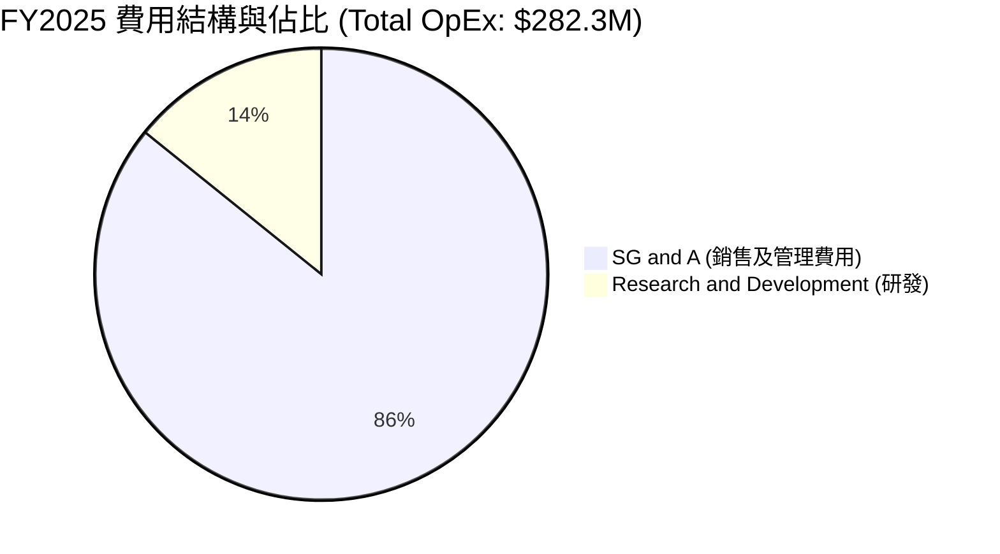

```
╔══════════════════════════════════════════════════════════════════╗
║               KTOS 費用結構與營業槓桿分析                        ║
╠══════════════════════════════════════════════════════════════════╣
║                                                                  ║
║  SG&A 費用：   $242.3M (佔營收 18.0%)  ██████████████████░░░░░░  ║
║  研發支出：    $40.0M  (佔營收  3.0%)  ███░░░░░░░░░░░░░░░░░░░░░  ║
║  D&A 折舊攤銷： $75.2M  (佔營收  5.6%)  █████░░░░░░░░░░░░░░░░░░░  ║
║                                                                  ║
║  💡 分析：R&D 佔比看似僅 3%，主因大部分客戶（DoD）直接支付專案  ║
║     研發費用（Customer-Funded R&D），未反映在公司自籌 R&D 中。   ║
╚══════════════════════════════════════════════════════════════════╝
```

### 3.5 季度 EPS 趨勢與盈餘品質（Quality of Earnings）

過去 4 季每股盈餘（EPS）呈現穩健擴張態勢（Q1 2026 EPS 達 $0.07，YoY +133.3%）。然而，檢視獲利含金量需關注股權薪酬（SBC）與自由現金流轉換率。

| 盈餘品質評估項目 | 近 12 個月 (TTM) 數值 | 評估與解讀 |
|------------------|-----------------------|------------|
| **股權薪酬 (SBC)** | **$41.80M** ($15.0M in Q1 26) | 🔴 **偏高**：SBC 佔營收 2.95%，相當於 TTM 淨利 ($29.4M) 的 142%，對股東權益造成稀釋。 |
| **SBC / 營業現金流 (OCF)** | N/A (OCF 為 -$40.3M) | 🔴 **警告**：營業現金流為負值，SBC 未能由營運現金覆蓋。 |
| **FCF / 淨利（現金轉換率）** | **-363%** (-$106.72M / $29.4M) | 🔴 **低含金量**：淨利為正但自由現金流大幅為負，主因 CapEx 與營運資金積壓。 |
| **一次性損益影響** | 無重大一次性收益 | 🟢 **乾淨**：獲利主要來自核心業務營運。 |
| **非營利收益/利息** | 利息收入 ~$25M-$30M | 🟡 **注意**：大額現金帶來高額利息收入，提振了淨利潤率。 |

**盈餘品質結論**：KTOS 當前 GAAP 淨利（$29.4M）受到高額 SBC 稀釋與正利息收入支撐，而真金白銀的自由現金流受 CapEx 重壓（TTM CapEx ~$92.6M）呈現 -$106.7M。**獲利品質評等為 🟡 中等偏弱**，投資人應密切關注產能開釋後現金流轉正的時間點。

---

## 4. 資產負債表分析

### 4.1 資產結構分解

截至 2026-Q1，KTOS 總資產爆發性成長至 **$4.04B**（2025 年末為 $2.47B），主要源於公司在公開市場發行新股籌集資金，使現金及短期投資充實至 $1.464B。

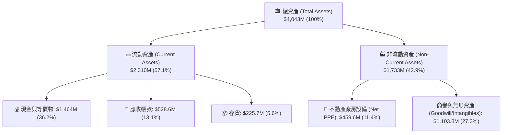

### 4.2 流動性指標分析

| 流動性指標 | KTOS 當前數值 | 2024 年底 | 航太國防同業均值 | 狀態評估 |
|------------|---------------|-----------|------------------|----------|
| **流動比率 (Current Ratio)** | **5.63x** | 2.94x | ~1.45x | 🟢 **極其安全** |
| **速動比率 (Quick Ratio)** | **4.85x** | 2.39x | ~0.95x | 🟢 **極其安全** |
| **現金佔總資產比率** | **36.2%** | 16.9% | ~6.5% | 🟢 **資金池充沛** |
| **應收帳款週轉天數 (DSO)** | **128 天** | 104 天 | ~65 天 | 🔴 **回款週期拉長** |

### 4.3 債務結構分析

```
╔══════════════════════════════════════════════════════════════════╗
║                   KTOS 債務健康診斷                              ║
╠══════════════════════════════════════════════════════════════════╣
║                                                                  ║
║  總現金與短期投資： $1,464.0M  █████████████████████████  🟢     ║
║  總債務（含租賃）：   $185.4M  ███░░░░░░░░░░░░░░░░░░░░░░  🟢     ║
║  --------------------------------------------------------------  ║
║  淨現金 (Net Cash)： $1,278.6M  █████████████████████░░░  🟢 強勁║
║                                                                  ║
║  Debt / Equity Ratio：  5.4% (或 0.054) 🟢 極低債務槓桿        ║
║  Net Debt / EBITDA：   -12.4x (淨現金狀態，零違約風險)           ║
║  利息保障倍數：         > 15.0x (利息收入 > 利息費用)            ║
║                                                                  ║
║  📊 結論：資產負債表具備堡壘級防禦力，為國防研發提供無後顧之憂   ║
╚══════════════════════════════════════════════════════════════════╝
```

### 4.4 股東權益趨勢

股東權益（Stockholders Equity）從 FY2022 的 $936.3M 成長至 FY2025 的 $2.00B，並在 2026-Q1 資本發行後突破 **$3.5B**。雖然股本擴張稀釋了短期每股價值，但為長期戰略併購（M&A）與工廠產能擴建（如俄克拉荷馬城無人機工廠）提供了強大的無槓桿資金。

---

## 5. 現金流量深度分析

### 5.1 現金流量瀑布圖（近 12 個月估算）

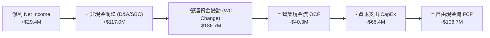

### 5.2 FCF 轉換率趨勢

| 年份 | 淨利 ($M) | 營業現金流 OCF ($M) | CapEx ($M) | 自由現金流 FCF ($M) | FCF / Net Income |
|------|-----------|---------------------|------------|---------------------|------------------|
| **FY2022** | -$33.2M | -$25.7M | -$45.4M | -$71.1M | N/A (虧損) |
| **FY2023** | $2.4M | $65.2M | -$52.4M | **+$12.8M** | **+533.3%** |
| **FY2024** | $16.3M | $49.7M | -$58.2M | **-$8.5M** | -52.1% |
| **FY2025** | $22.0M | -$42.1M | -$95.3M | **-$137.4M** | -624.5% |
| **TTM** | **$29.4M** | **-$40.3M** | **-$66.4M** | **-$106.7M** | **-362.9%** |

### 5.3 自由現金流趨勢

```
╔══════════════════════════════════════════════════════════════════╗
║                KTOS 自由現金流 (FCF) 演變                        ║
╠══════════════════════════════════════════════════════════════════╣
║                                                                  ║
║  FY2022   -$71.1M   ░░░░░░░░░░███████  CapEx 擴張                ║
║  FY2023   +$12.8M   ████░░░░░░░░░░░░░  短暫轉正                  ║
║  FY2024    -$8.5M   ░░░░░░░░░░░░░░█░░  基本平衡                  ║
║  FY2025  -$137.4M   ░░░░░░░██████████  無人機擴產峰值 🔴         ║
║  TTM     -$106.7M   ░░░░░░░█████████░  高位拉回 🟡              ║
║                                                                  ║
║  💡 評估：當前負 FCF 是管理層主動選擇的成長代價（產能擴建），    ║
║     預計在 FY2027 年將轉回正值。                                ║
╚══════════════════════════════════════════════════════════════════╝
```

### 5.4 資本配置評估

KTOS 的資本配置優先順序極為明確：**自籌資金研發與產能 CapEx > 戰略性 M&A > 零股息 / 無買回**。

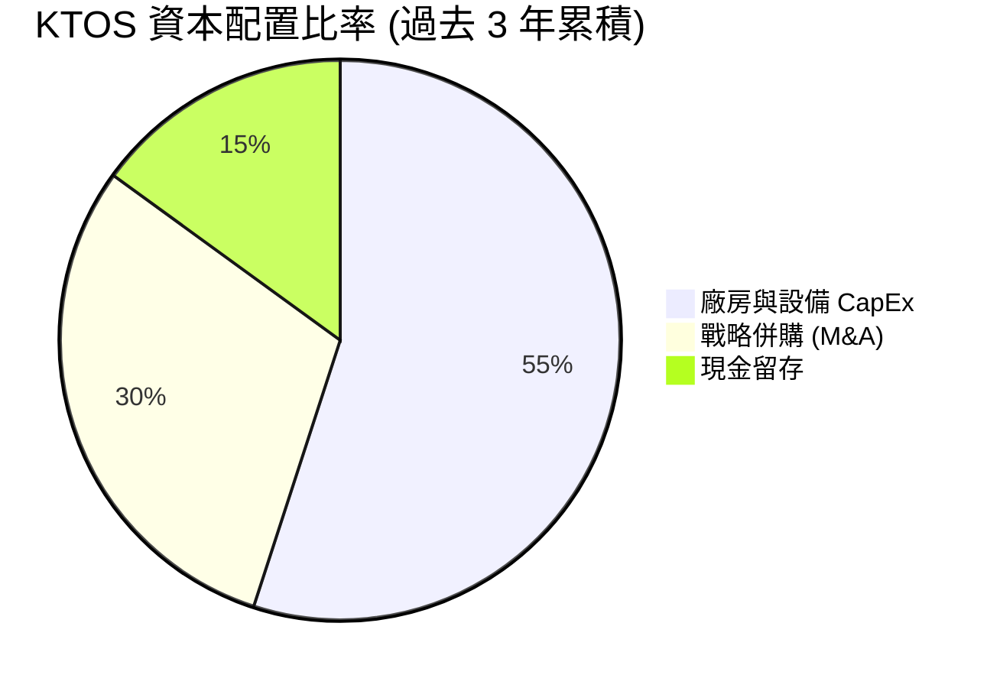

---

## 6. 獲利能力與資本效率

### 6.1 ROE / ROA / ROIC 趨勢

由於公司資產負債表積累了 $1.46B 的現金，股東權益膨脹至 $3.5B，導致帳面獲利指標（ROE, ROA, ROIC）極度受壓。

| 指標 | FY2022 | FY2023 | FY2024 | FY2025 | TTM | 航太國防同業均值 |
|------|--------|--------|--------|--------|-----|------------------|
| **ROE (股東權益報酬率)** | -3.9% | 0.3% | 1.4% | 1.3% | **1.2%** | ~11.5% |
| **ROA (總資產報酬率)** | -2.3% | 0.2% | 0.9% | 1.0% | **0.6%** | ~4.8% |
| **ROIC (投入資本回報率)** | -0.8% | 1.8% | 1.6% | 1.2% | **1.2%** | ~7.5% |

### 6.2 ROIC vs WACC 分析（核心價值創造判斷）

```
╔══════════════════════════════════════════════════════════════════╗
║                KTOS ROIC vs WACC 深度分析                        ║
╠══════════════════════════════════════════════════════════════════╣
║                                                                  ║
║  WACC 估算：                                                     ║
║  ├── 無風險利率（10Y美債）：  4.20%                              ║
║  ├── 市場風險溢酬 (ERP)：     5.00%                              ║
║  ├── Beta：                   1.07                               ║
║  ├── 股權成本 (Cost of Equity) = 4.2% + 1.07 × 5.0% = 9.55%      ║
║  ├── 債務成本（稅後）：       ~4.50%                             ║
║  ├── 資本結構：股權 ~88%，債務 ~12%                              ║
║  └── ✅ 綜合 WACC ≈ 8.24%                                        ║
║                                                                  ║
║  ROIC 估算（TTM）：                                              ║
║  ├── NOPAT = 營業利益 $23.7M × (1 - 21% 稅率) ≈ $18.7M            ║
║  ├── 投入資本 = 股東權益 + 總債務 - 現金                         ║
║  │    = $3,500M + $185M - $1,464M ≈ $2,221M                       ║
║  └── ✅ ROIC = $18.7M / $2,221M ≈ 0.84% (含大量未開釋現金)       ║
║      （若扣除多餘現金，經營性 ROIC ≈ 3.2%）                      ║
║                                                                  ║
║  ★ 經濟價值增加（EVA）= ROIC (1.2%) - WACC (8.2%) = -7.0 pp      ║
║                                                                  ║
║  ROIC   1.2%  ▓▓░░░░░░░░░░░░░░░░░░░░░░░░░░░░  🟡 短期壓抑      ║
║  WACC   8.2%  ▓▓▓▓▓▓▓▓██░░░░░░░░░░░░░░░░░░░░  ── 基準門檻      ║
║  EVA   -7.0pp ░░░░░░░░░░░░░░░░░░░░░░░░░░░░░░  🔴 摧毀帳面價值  ║
║                                                                  ║
║  📊 結論：目前 KTOS 在帳面上呈現「價值摧毀」，主因巨額現金尚未  ║
║     轉化為高利潤營收。未來 3 年若利潤率回升，ROIC 具爆發力。     ║
╚══════════════════════════════════════════════════════════════════╝
```

### 6.3 杜邦三因素分解

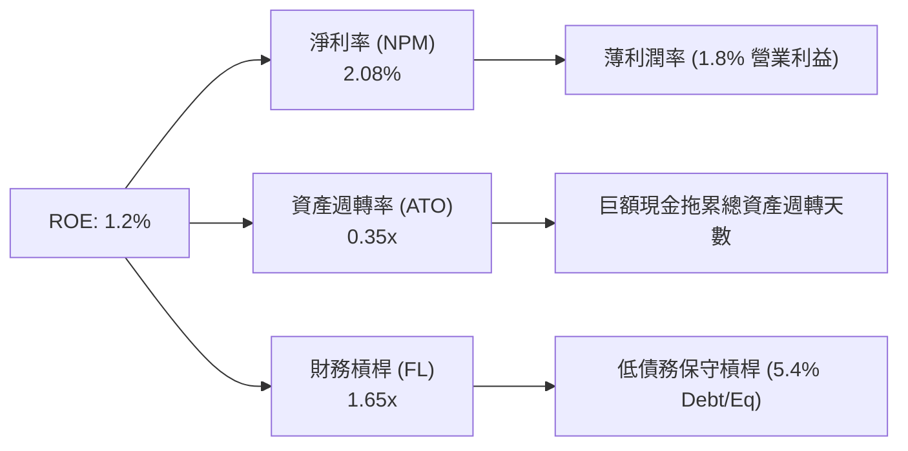

---

## 7. 估值深度分析

### 7.1 同業估值比較表格

選取無人機與國防科技關鍵競爭對手：**AeroVironment (AVAV)**、**Leidos (LDOS)**、**Northrop Grumman (NOC)** 及 **RTX Corp (RTX)**。

| 估值與成長指標 | **Kratos (KTOS)** | **AeroVironment (AVAV)** | **Leidos (LDOS)** | **Northrop (NOC)** | 本公司相對評估 |
|----------------|-------------------|--------------------------|-------------------|--------------------|----------------|
| **當前股價** | **$49.45** | $185.20 | $152.40 | $475.30 | ── |
| **市值 (Market Cap)** | **$9.27B** | $5.12B | $20.8B | $70.2B | 中型國防科技股 |
| **TTM P/E** | **290.9x** | 85.4x | 18.5x | 21.2x | 🔴 遠高於傳統國防 |
| **Forward P/E** | **45.3x** | 42.1x | 16.2x | 17.8x | 🟡 與高成長同業持平 |
| **P/S Ratio** | **6.55x** | 7.20x | 1.30x | 1.72x | 🟡 溢價（反映軟體/無人機） |
| **EV / Sales** | **5.37x** | 6.85x | 1.52x | 2.05x | 🟢 考量高淨現金後較 AVAV 便宜 |
| **EV / EBITDA** | **93.6x** | 48.2x | 12.8x | 14.5x | 🔴 高溢價 |
| **營收 YoY 成長** | **22.6%** | 21.3% | 7.2% | 5.8% | 🟢 **全組最快** |

### 7.2 歷史估值區間分析

KTOS 歷史 Forward P/E 區間多落在 30x - 60x 之間（高峰期曾達 90x）。當前 **Forward P/E 45.3x** 處於歷史中位數附近，但在 52 週高點 $134 時 Forward P/E 曾暴漲至 110x+。股價大幅拉回至 $49.45 已將泡沫擠出。

```
╔══════════════════════════════════════════════════════════════════╗
║               KTOS Forward P/E 歷史位階評估                      ║
╠══════════════════════════════════════════════════════════════════╣
║  歷史低點 (25x)          當前位階 (45.3x)         歷史高點 (110x)  ║
║  ├──────────────────────────────┼──────────────────────────────┤  ║
║  ░░░░░░░░░░░░░░░░░░░░░░░░░░░░███████░░░░░░░░░░░░░░░░░░░░░░░░░░░  ║
║                                                                  ║
║  📊 結論：估值已從極度高估（$134）修正至合理價值區間（$49.45）   ║
╚══════════════════════════════════════════════════════════════════╝
```

### 7.3 情境目標價（假設驅動：Bear / Base / Bull）

針對 KTOS 選用 **EV/Sales** 與 **Forward P/E** 雙重導向評估模型（因當前 EPS 受研發折舊壓抑，Sales 相對能反映真實營運規模）。

**關鍵假設參數**：
- **基期營收 (TTM)**：$1,415M
- **基期 EPS (Forward)**：$1.091

| 情境 | 3 年營收 CAGR | FY2027E 營收 | 預期營業利益率 | 退出 EV/Sales 倍數 | 隱含目標價 | 相對當前股價 ($49.45) |
|------|---------------|--------------|----------------|--------------------|------------|-----------------------|
| 🔴 **悲觀情境** | 10.0% | $1,883M | 3.5% | 3.5x | **$42.00** | **-15.1%** |
| 🟡 **基準情境** | **18.5%** | **$2,357M** | **6.5%** | **5.5x** | **$78.00** | **+57.7%** |
| 🟢 **樂觀情境** | 26.0% | $2,831M | 9.0% | 7.0x | **$115.00** | **+132.6%** |

> **估值倍數選擇說明**：選用 EV/Sales 5.5x 係參考其競爭對手 AeroVironment (6.85x) 以及 Kratos 歷史均值。考量到 Kratos 具備更高的無人機規模與 $1.28B 淨現金，5.5x 為合理基準。

### 7.4 DCF 敏感性分析（6格目標價矩陣）

**DCF 核心假設**：
- 預測期：2026-2035（10年）
- 終端成長率 (Terminal Growth Rate)：3.0% - 4.0%
- WACC：7.5% - 9.0%

| 情境 / WACC | **WACC = 7.5%** | **WACC = 8.2%（基準）** | **WACC = 9.0%** |
|-------------|-----------------|-------------------------|-----------------|
| 🟢 **樂觀 (CAGR 22%)** | $128.50 (+159.9%) | **$115.00 (+132.6%)** | $102.30 (+106.9%) |
| 🟡 **基準 (CAGR 18%)** | $88.20 (+78.4%) | **$78.00 (+57.7%)** | $69.50 (+40.5%) |
| 🔴 **悲觀 (CAGR 12%)** | $48.50 (-1.9%) | **$42.00 (-15.1%)** | $36.80 (-25.6%) |

---

## 8. 成長催化劑

### 8.1 催化劑時間軸

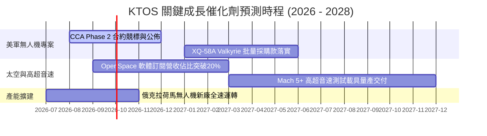

### 8.2 TAM 市場規模分析

```
╔══════════════════════════════════════════════════════════════════╗
║               KTOS 目標市場 (TAM) 與滲透潛力                    ║
╠══════════════════════════════════════════════════════════════════╣
║                                                                  ║
║ 1. 低成本戰術無人機 (CCA / Replicator)                           ║
║    TAM: $12.0B ｜ 當前滲透率: ~3.5% ｜ 預計 2028 收入: $450M      ║
║                                                                  ║
║ 2. 太空地面虛擬化軟體 (OpenSpace)                               ║
║    TAM: $5.5B  ｜ 當前滲透率: ~8.0% ｜ 預計 2028 收入: $280M      ║
║                                                                  ║
║ 3. 高超音速測試與火箭推進系統                                   ║
║    TAM: $4.0B  ｜ 當前滲透率: ~12.0%｜ 預計 2028 收入: $350M      ║
╚══════════════════════════════════════════════════════════════════╝
```

### 8.3 成長驅動力結構圖

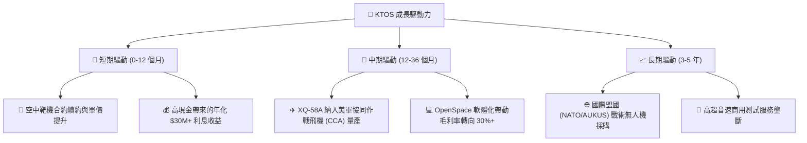

---

## 9. 風險矩陣

### 9.1 風險評分矩陣

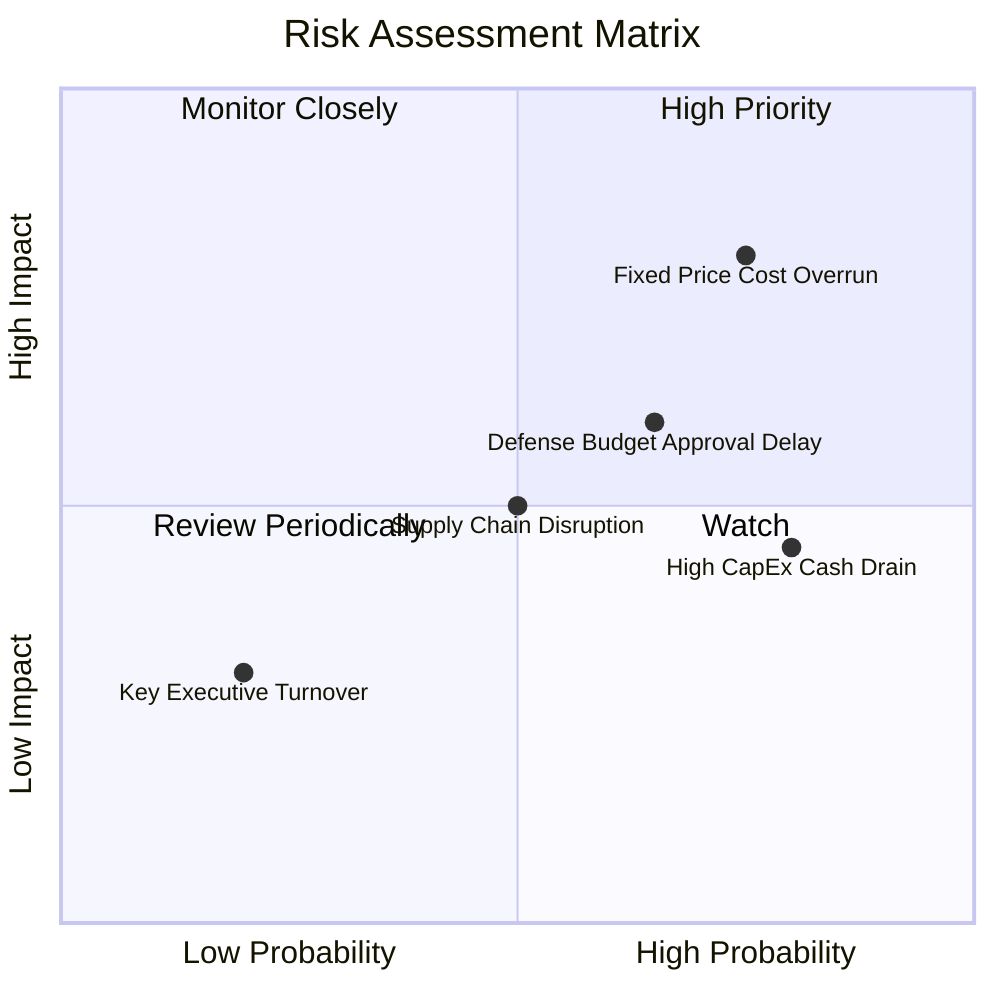

### 9.2 風險清單詳細分析

| # | 風險項目 | 發生機率 | 財務衝擊 | 風險評分 | 緩解措施與觀察指標 |
|---|----------|----------|----------|----------|--------------------|
| 1 | 🔴 **固定價格合約成本超支** | 高 (75%) | 高 (-2 pp 毛利) | 🔴 **8.0/10** | 公司正逐步將新合約改為 Cost-Plus 條款；監控季度毛利率變化。 |
| 2 | 🟡 **美國國防預算（NDAA）通過延宕** | 中高 (65%) | 中 (-5% 營收) | 🟡 **6.5/10** | 持有 $1.28B 淨現金，零斷氣風險，能輕鬆度過持續決議案（CR）期。 |
| 3 | 🟡 **高 CapEx 壓抑現金流轉正** | 高 (80%) | 中 (FCF 負值) | 🟡 **6.0/10** | 隨著俄克拉荷馬新廠建成，CapEx 將於 FY2026 下半年開始見頂回落。 |
| 4 | 🟢 **供應鏈原材料通膨** | 中 (50%) | 中 (-1 pp 毛利) | 🟢 **4.5/10** | 建立關鍵微波與發動機零組件安全庫存（存貨達 $225.7M）。 |

---

## 10. 投資建議

### 10.1 最終綜合評級雷達圖

```
╔══════════════════════════════════════════════════════════════╗
║                   KTOS 最終綜合評級雷達                     ║
╠══════════════════════════════════════════════════════════════╣
║                                                              ║
║   基本面強度   : 7.5 / 10  ▓▓▓▓▓▓▓▓▓▓▓▓▓▓▓░░░░░  🟢           ║
║   成長動能     : 8.5 / 10  ▓▓▓▓▓▓▓▓▓▓▓▓▓▓▓▓▓░░  🟢           ║
║   獲利品質     : 4.5 / 10  ▓▓▓▓▓▓▓▓░░░░░░░░░░░  🔴           ║
║   資產負債健康 : 9.5 / 10  ▓▓▓▓▓▓▓▓▓▓▓▓▓▓▓▓▓▓█  🟢           ║
║   估值吸引力   : 6.0 / 10  ▓▓▓▓▓▓▓▓▓▓▓▓░░░░░░░  🟡           ║
║                                                              ║
║   🏆 綜合投資評等： 🟢 買入 (Buy)                            ║
║   🎯 12 個月目標價： $78.00（+57.7%）                        ║
╚══════════════════════════════════════════════════════════════╝
```

### 10.2 目標價與隱含報酬率

| 情境 | 機率賦權 | 目標價 | 隱含報酬率（當前 $49.45） | 權越貢獻目標價 |
|------|----------|--------|---------------------------|----------------|
| 🔴 **悲觀情境** | 20% | $42.00 | -15.1% | $8.40 |
| 🟡 **基準情境** | **60%** | **$78.00** | **+57.7%** | **$46.80** |
| 🟢 **樂觀情境** | 20% | $115.00 | +132.6% | $23.00 |
| **加權綜合目標價** | **100%** | **$78.20** | **+58.1%** | **$78.20**（取整數 **$78.00**） |

### 10.3 買入時機與觸發因素

```
╔══════════════════════════════════════════════════════════════════╗
║                  ✅ 買入觸發因素 Checklist                      ║
╠══════════════════════════════════════════════════════════════════╣
║                                                                  ║
║  分批建倉觸發條件：                                              ║
║  ✅ 當前股價跌破 $50.00，EV/Sales 降至 5.3x 附近（已達成）。     ║
║  ✅ 淨現金達 $1.28B，佔市值 > 13%，下行保護極強。                ║
║                                                                  ║
║  加碼買入觸發條件：                                              ║
║  ☐ 單季營業利潤率突破 4.0%（顯示營業槓桿生效）。                 ║
║  ☐ 贏得美軍 CCA Phase 2 正式量產採購合約。                       ║
║  ☐ 季度 FCF 轉正或 CapEx 年化下降至 $50M 以下。                  ║
║                                                                  ║
║  減碼/停損觸發條件：                                             ║
║  ☐ 營收 YoY 成長率連續兩季跌破 10.0%。                           ║
║  ☐ 固定價格合約出現嚴重損失導致單季毛利率跌破 18.0%。            ║
╚══════════════════════════════════════════════════════════════════╝
```

### 10.4 投資人適配度分析

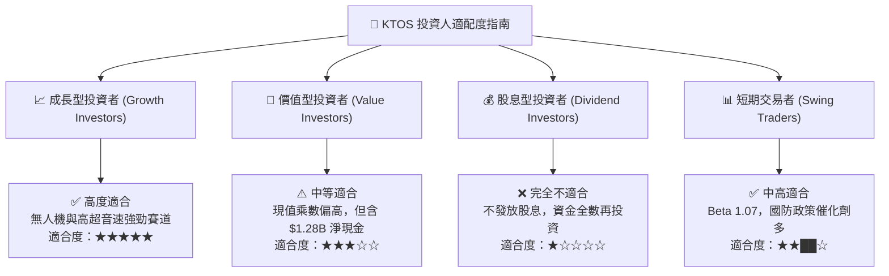

### 10.5 每季財報監控清單（Quarterly Watch List）

| 監控指標 | 最新季度數據 (Q1 2026) | 基準目標 (Base Case) | 觸發加碼門檻 | 觸發減碼/停損門檻 |
|----------|------------------------|----------------------|--------------|-------------------|
| **營收 YoY 成長率** | **22.6%** | > 18.0% | > 25.0% | < 10.0% |
| **毛利率 (Gross Margin)** | **24.15%** | > 23.5% | > 26.0% | < 19.0% |
| **營業利潤率 (Op Margin)** | **1.78%** | > 3.0% | > 5.0% | < 0.0% (虧損) |
| **單季 CapEx** | **$19.9M** | < $22.0M | < $15.0M | > $35.0M |
| **SBC 佔營收比重** | **4.04%** | < 3.0% | < 2.0% | > 6.0% |

### 10.6 反面論證：什麼會證明論點錯誤（What Would Change My Mind）

```
╔══════════════════════════════════════════════════════════════════╗
║              ⚠️ 論點失效條件（Disconfirming Evidence）           ║
╠══════════════════════════════════════════════════════════════════╣
║  若發生以下可量化條件，本報告之多頭論點將宣告失效：              ║
║                                                                  ║
║  1. 營收動能熄火：連續兩季營收 YoY 成長率跌破 10.0%。             ║
║  2. 利潤率惡化：毛利率因固定價格合約成本超支暴跌至 18% 以下。    ║
║  3. 戰略失利：美軍 Collaborative Combat Aircraft (CCA) 專案      ║
║     完全未採用任何 Kratos 機型或發動機方案。                     ║
║  4. 現金流失血失控：FY2026 全年 FCF 負值擴大至 -$180M 以上，     ║
║     且未帶來相應的產能開釋與訂單積壓增長。                       ║
║  5. 股權過度稀釋：管理層在未進行大筆高 ROIC 併購的情況下，       ║
║     再次無預警發行 > 15% 的新股稀釋股東權益。                    ║
╚══════════════════════════════════════════════════════════════════╝
```

---

> **免責聲明**：本報告為 AI 自動生成，基於公開財務數據建模，僅供研究參考，不構成任何形式的投資建議或買賣要約。投資有風險，入市需謹慎。