# KTOS 基本面深度分析報告

> **報告日期**：2026-07-28 ｜ **語言**：繁體中文 ｜ **數據來源**：Yahoo Finance, Finviz, StockAnalysis, Roic.ai ｜ **分析師**：CFA 級機構研究

---

## 目錄

| # | 章節 | 核心結論 |
|---|------|----------|
| 1 | 執行摘要 | TTM 營收 $1.42B (YoY +22.6%)，但營業利潤率低至 1.8%、FCF 為 -$106.72M；評級🟡 買入/觀望，基準目標價 $75.00 |
| 2 | 公司概覽與商業模式 | 無人打擊與虛擬化地面衛星系統築起雙護城河，綜合護城河評分 7.2/10 |
| 3 | 損益表深度分析 | 營收維持高雙位數成長，但毛利率 22.9% 與營益率 1.8% 壓抑獲利品質，SBC 佔營收 2.5% |
| 4 | 資產負債表分析 | 增資後持現 $1.46B，總債務僅 $185.40M，流動比率 5.63，財務防禦極為堅固 |
| 5 | 現金流量深度分析 | Capex 高達 $95.30M 導致 FCF 轉負 (-$106.72M)，資本配置集中於未來產能擴充 |
| 6 | 獲利能力與資本效率 | ROIC 僅 2.58% 低於 WACC 8.80%，當前 EVA 為負，正在大量累積資本等待放量 |
| 7 | 估值深度分析 | Forward P/E 44.58x、EV/EBITDA 98.45x，相較國防傳統巨頭溢價顯著，情境目標價 $38.00 - $110.00 |
| 8 | 成長催化劑 | 美軍 CCA 協同作戰飛機計劃量產、OpenSpace 衛星地面站虛擬化推進 |
| 9 | 風險矩陣 | 國防預算遞延、毛利率擴張不及預期與高估值修正為主要風險 |
| 10 | 投資建議 | 基準目標價 $75.00 (+54.2% 上行空間)，需緊盯 FCF 轉正與營益率擴張進度 |

---

## 1. 執行摘要

> ⚠️ **評級聲明**：本報告給予 Kratos Defense & Security Solutions (KTOS) **🟡 中立 / 買入（謹慎佈局）** 評級，主要基於其 TTM 營收加速成長至 $1.42B (YoY +22.6%)、資產負債表擁有 $1.46B 淨現金的極佳防禦力；然而，當前 ROIC (2.58%) 顯著低於 WACC (8.80%)，且 TTM 自由現金流為 -$106.72M，顯示公司仍處於資本高投入、產能未完全轉化為自由現金流的極早期階段。基於 Forward P/E 44.58x 與 EBITDA Profitability 仍僅 5.7% 的財務現況，下述評級與目標價為該等數據綜合建模推導之結果。

### 1.0 一頁式投資儀表板（Portfolio Manager 30 秒速讀）

| 項目 | 內容 |
|------|------|
| **投資論點（3 句）** | ① 國防部無人機（CCA）與極音速領域核心供應商，TTM 營收成長達 22.6% 展現強勁需求。<br/>② 帳上持有 $1.46B 現金且負債僅 $185.40M，強大資產負債表能支撐高 Capex 投資循環。<br/>③ 前瞻 P/E 44.58x 雖已高估，但若營益率從 1.8% 提升至歷史目標 7-8%，具備極大營運槓桿。 |
| **護城河評分** | **7.2 / 10** 🟢 （國防密級認證 + 獨家虛擬化地面站 OpenSpace 軟體） |
| **管理層/資本配置評分** | **6.5 / 10** 🟡 （積極發行新股稀釋融資，積極拓展 Capex，但資本效率待提升） |
| **財務健康** | 🟢 **極佳**（Net Cash達 $1.28B，Current Ratio 達 5.63，無短期償債危機） |
| **ROIC vs WACC** | **2.58% vs 8.80%** 🔴 （當前摧毀股東價值，EVA 顯著為負） |
| **FCF 趨勢** | 方向負向擴大（TTM FCF -$106.72M），最新 FCF Yield 為 **-1.17%** |
| **估值** | Forward P/E **44.58x** ｜ EV/EBITDA **98.45x** ｜ P/S **6.45x** |
| **預期報酬（基準情境 12M）** | **+54.2%**（目標價 $75.00，相對於當前股價 $48.64） |
| **關鍵風險（前二）** | ① 國防採購合約審批延宕與產能爬坡瓶頸。<br/>② 高 Capex 導致自由現金流持續失血，估值倍數遭遇均值回歸。 |
| **評級 + 信心度** | 🟡 **中立 / 謹慎買入** ｜ 信心度：**中等** |

### 1.1 核心評分儀表板

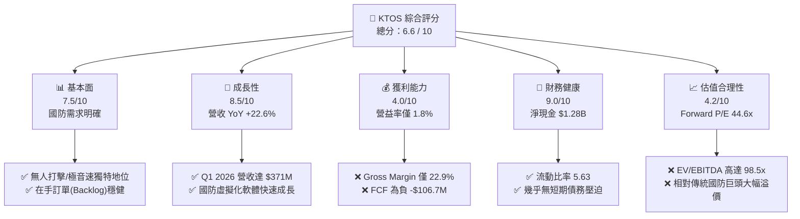

### 1.2 評分進度條視覺化

```
╔══════════════════════════════════════════════════════════════╗
║                KTOS 多維度評分儀表板 (1-10分)                 ║
╠══════════════════════════════════════════════════════════════╣
║ 基本面強度  7.5 ▓▓▓▓▓▓▓▓▓▓▓▓▓▓▓░░░░░  ★★██☆           ║
║ 成長動能    8.5 ▓▓▓▓▓▓▓▓▓▓▓▓▓▓▓▓▓░░░  ★★★★☆           ║
║ 獲利品質    4.0 ▓▓▓▓▓▓▓▓░░░░░░░░░░░░  ★★☆☆☆           ║
║ 財務健康    9.0 ▓▓▓▓▓▓▓▓▓▓▓▓▓▓▓▓▓▓░░  ★★★★★           ║
║ 估值合理性  4.2 ▓▓▓▓▓▓▓▓░░░░░░░░░░░░  ★★☆☆☆           ║
║ 護城河深度  7.2 ▓▓▓▓▓▓▓▓▓▓▓▓▓▓░░░░░░  ★★★██           ║
║ 管理層執行  6.5 ▓▓▓▓▓▓▓▓▓▓▓▓░░░░░░░░  ★★★☆☆           ║
║ 技術創新力  8.8 ▓▓▓▓▓▓▓▓▓▓▓▓▓▓▓▓▓░░░  ★★★★☆           ║
╠══════════════════════════════════════════════════════════════╣
║ 綜合總分    6.6 ▓▓▓▓▓▓▓▓▓▓▓▓▓░░░░░░░  🟡 謹慎評估 / 買入    ║
╚══════════════════════════════════════════════════════════════╝
```

### 1.3 五大投資論點 + 三大核心風險

| 類型 | 項目 | 具體依據 | 信心度 |
|------|------|----------|--------|
| 🟢 **論點①** | **無人戰鬥機 (CCA) 領先優勢** | Valkyrie (XQ-58A) 為美軍低成本可消耗型無人機代表，受惠於 DoD 政策轉向 | 🟢 高 |
| 🟢 **論點②** | **太空與衛星地面站軟體化** | OpenSpace 平台帶動 Kratos Government Solutions 高毛利軟體轉型 | 🟢 高 |
| 🟢 **論點③** | **營收加速成長帶動營運槓桿** | TTM 營收年增 22.6%（達 $1.42B），規模擴大推動固定成本攤銷 | 🟢 中高 |
| 🟢 **論點④** | **資產負債表極具防禦彈性** | 現金及等價物 $1.46B，總債務僅 $185.40M，淨現金高達 $1.28B | 🟢 極高 |
| 🟢 **論點⑤** | **極音速與微波電子高門檻** | 提供引擎測試與反飛彈防禦組件，享有極高技術與特許進入門檻 | 🟢 中高 |
| 🟡 **風險①** | **資本支出過高導致 FCF 惡化** | FY25 Capex 達 $95.30M，導致 TTM FCF 為 -$106.72M，流失短期現金 | 🟡 中度 |
| 🔴 **風險②** | **獲利能力與估值嚴重脫節** | TTM 營業利潤率僅 1.8%，EV/EBITDA 高達 98.45x，容錯率低 | 🔴 高衝擊 |
| 🔴 **風險③** | **股權稀釋問題** | 增資使流通股數由 2024 年底 169M 增加至 187.52M，稀釋每股盈餘 | 🔴 高衝擊 |

### 1.4 快速統計卡片

| 指標 | 公司實際值 | 行業均值 (Aero & Defense) | S&P 500 均值 | 狀態 |
|------|-------------|----------|--------------|------|
| **收入 YoY 成長** | **22.6%** | ~8.5% | ~5.2% | 🟢 優於同業 |
| **毛利率** | **22.9%** | ~26.5% | ~45.0% | 🟡 略低於同業 |
| **營業利益率** | **1.8%** | ~9.5% | ~12.5% | 🔴 顯著偏低 |
| **ROE** | **1.2%** | ~14.0% | ~18.0% | 🔴 資本效率低 |
| **Forward P/E** | **44.58x** | ~22.0x | ~21.5x | 🔴 顯著溢價 |
| **EV / EBITDA** | **98.45x** | ~16.5x | ~14.0x | 🔴 極高估值 |
| **Net Debt / EBITDA** | **-12.4x (淨現金)** | 1.8x | 1.5x | 🟢 財務極安全 |

### 1.5 投資結論

```
╔══════════════════════════════════════════════════════════════════╗
║                    📊 投資結論摘要                               ║
╠══════════════════════════════════════════════════════════════════╣
║  評級：🟡 中立 / 謹慎買入 (Neutral / Accumulate)                  ║
║  當前股價：$48.64                                                ║
║  目標價區間：                                                    ║
║    悲觀情境：$38.00（-21.9%）                                    ║
║    基準情境：$75.00（+54.2%）  ← 12個月主要目標                  ║
║    樂觀情境：$110.00（+126.2%）                                  ║
║  投資評分：6.6 / 10                                              ║
║  適合投資人：追求地緣政治戰略趨勢、能承受高估值波動之長線成長型  ║
╚══════════════════════════════════════════════════════════════════╝
```

---

## 2. 公司概覽與商業模式

### 2.1 業務結構與收入來源

Kratos Defense & Security Solutions (KTOS) 主要營運兩大核心業務部門：**Kratos Government Solutions (KGS)** 與 **Unmanned Systems (US)**。KGS 著重於虛擬化地面衛星系統、C5ISR、極音速與微波電子；US 則專注於無人目標機與新世代無人戰鬥機 (Tactical Drones)。

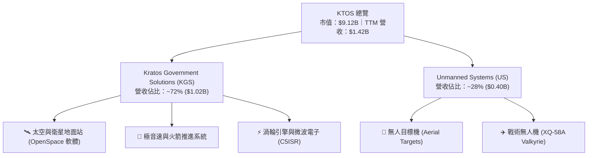

### 2.2 市場份額

在美國國防部低成本無人打擊機與空中靶機市場中，Kratos 佔據領先地位。而在傳統軍工巨頭（如 Lockheed Martin、Northrop Grumman）壟斷大型載人戰機之際，Kratos 成功開闢了「低成本可消耗型無人機 (Attritable UAV)」新藍海。

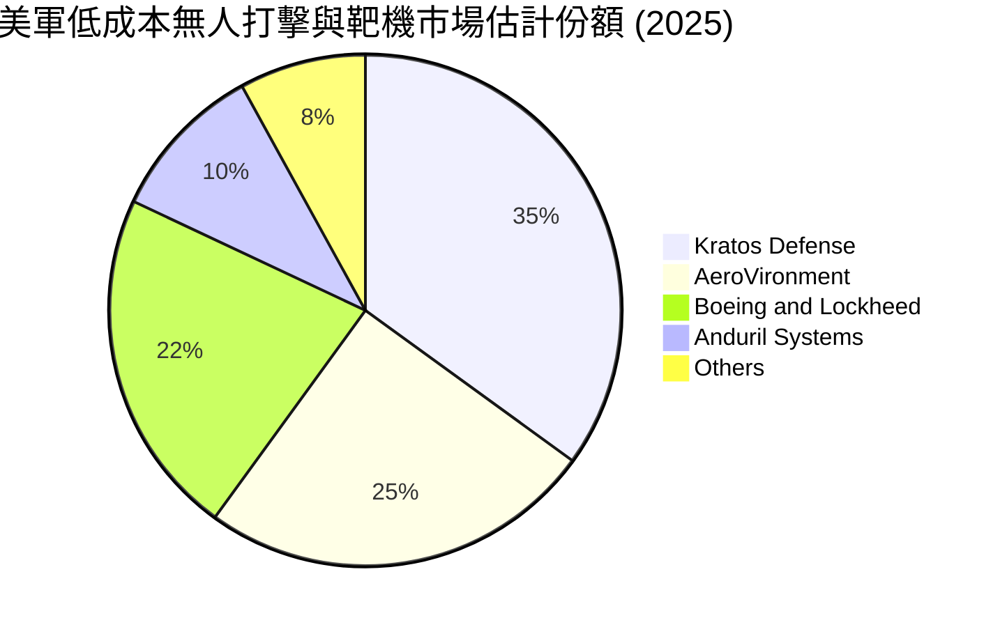

### 2.3 競爭護城河分析

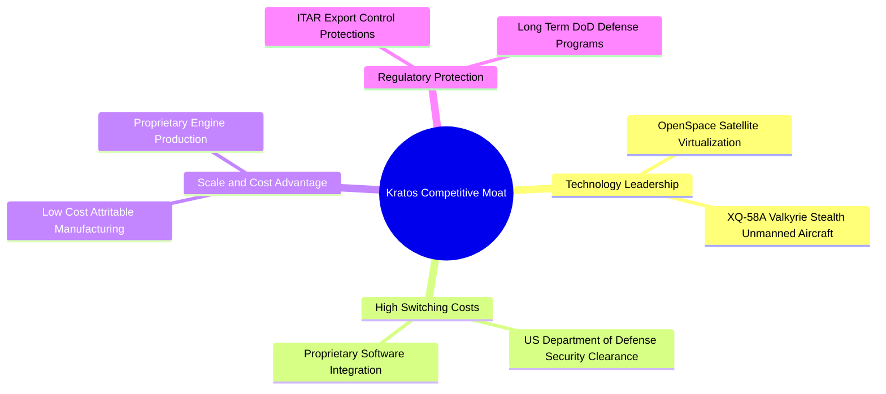

### 2.4 護城河強度評分

```
╔══════════════════════════════════════════════════════════════╗
║                  KTOS 護城河強度評分                         ║
╠══════════════════════════════════════════════════════════════╣
║ 國防認證與高轉換成本  8.5/10  ▓▓▓▓▓▓▓▓▓▓▓▓▓▓▓▓▓░░░  🏆 具強特許權 ║
║ 獨家軟體技術 (OpenSpace) 7.5/10  ▓▓▓▓▓▓▓▓▓▓▓▓▓▓░░░░░░  🟢 高利潤潛力 ║
║ 可消耗無人機低成本製造 8.0/10  ▓▓▓▓▓▓▓▓▓▓▓▓▓▓▓▓░░░░  🟢 先發優勢明顯 ║
║ 網路效應與生態系     4.5/10  ▓▓▓▓▓▓▓░░░░░░░░░░░░░  🟡 國防封閉環境 ║
╠══════════════════════════════════════════════════════════════╣
║ 綜合護城河評分       7.2/10  ▓▓▓▓▓▓▓▓▓▓▓▓▓▓░░░░░░  🟢 穩固護城河  ║
╚══════════════════════════════════════════════════════════════╝
```

---

## 3. 損益表深度分析

### 3.1 年度收入成長趨勢（近4年）

```
╔══════════════════════════════════════════════════════════════════╗
║                KTOS 年度收入趨勢（FY2022-FY2025）                ║
╠══════════════════════════════════════════════════════════════════╣
║                                                                  ║
║  FY2022  $898.3M   ██████████████░░░░░░░░░░░░░  YoY: +10.7% 🟢    ║
║  FY2023  $1,037M   █████████████████░░░░░░░░░░  YoY: +15.5% 🟢    ║
║  FY2024  $1,136M   ███████████████████░░░░░░░░  YoY: +9.6%  🟢    ║
║  FY2025  $1,347M   ███████████████████████░░░░  YoY: +18.5% 🟢    ║
║  TTM     $1,415M   █████████████████████████░░  YoY: +22.6% 🟢    ║
║                   |      |      |      |      |                  ║
║                   0     300M   600M   900M   1.2B                ║
║                                                                  ║
║  📊 4年複合成長率 (CAGR)：+14.4%                                 ║
╚══════════════════════════════════════════════════════════════════╝
```

### 3.2 季度收入趨勢分析

| 季度 | 營收 ($M) | YoY 成長率 | QoQ 成長率 | 毛利率 (%) | 營益率 (%) | 淨利 ($M) | 備註與驅動因素 |
|------|-----------|------------|------------|------------|------------|-----------|----------------|
| **Q1 2025** | $302.6 | +9.16% | +6.89% | 24.32% | 2.18% | $4.5 | 靶機交付穩定，營運保持擴張 |
| **Q2 2025** | $351.5 | +17.13% | +16.16% | 21.00% | 1.05% | $2.9 | 低毛利工程專案佔比提高壓抑獲利 |
| **Q3 2025** | $347.6 | +25.99% | -1.11% | 22.18% | 2.04% | $8.7 | 極音速產品驗收，淨利回升 |
| **Q4 2025** | $345.1 | +21.90% | -0.72% | 24.17% | 2.38% | $5.9 | 年末產品交付放量，營益率擴張 |
| **Q1 2026** | **$371.0** | **+22.60%** | **+7.51%** | **24.15%** | **1.27%** | **$11.9** | 國防方案與無人機成長強勁，稅務利益挹注淨利 |

### 3.3 利潤率演變分析

| 利潤率指標 | FY2022 | FY2023 | FY2024 | FY2025 | TTM | 趨勢評估 | 狀態 |
|------------|--------|--------|--------|--------|-----|----------|------|
| **毛利率 (Gross Margin)** | 25.16% | 25.90% | 25.28% | 22.86% | 22.89% | ↘️ 供應鏈成本與低毛利研發合約拉低毛利 | 🟡 待改善 |
| **EBITDA Margin** | 2.92% | 7.47% | 8.24% | 7.64% | 5.71% | ↘️ 研發投入與固定營運成本居高不下 | 🟡 偏低 |
| **營業利益率 (Operating Margin)** | -0.32% | 3.00% | 2.55% | 1.90% | 1.80% | ↘️ 規模擴大但未顯現明顯營運槓桿 | 🔴 顯著壓抑 |
| **淨利率 (Net Margin)** | -3.70% | 0.23% | 1.43% | 1.63% | 2.08% | ↗️ 財務費用因高現金利息收入而改善 | 🟢 微幅提升 |

**利潤率深度解析**：
KTOS 過去四季營收年增率均保持在 17%~26% 高速水平，但毛利率自 FY2023 的 25.90% 下滑至當前的 22.89%，主因係無人機（US）部門許多計畫仍處於研發階段（Cost-Plus 合約比例較高），外加產能擴建帶來的高額折舊（D&A）。當前營業利益率僅 1.80%，遠低於同業平均（8%~12%），顯示公司現階段優先考慮「爭取市場市佔率與國防部次世代計畫」而非短期獲利。

### 3.4 費用結構分析

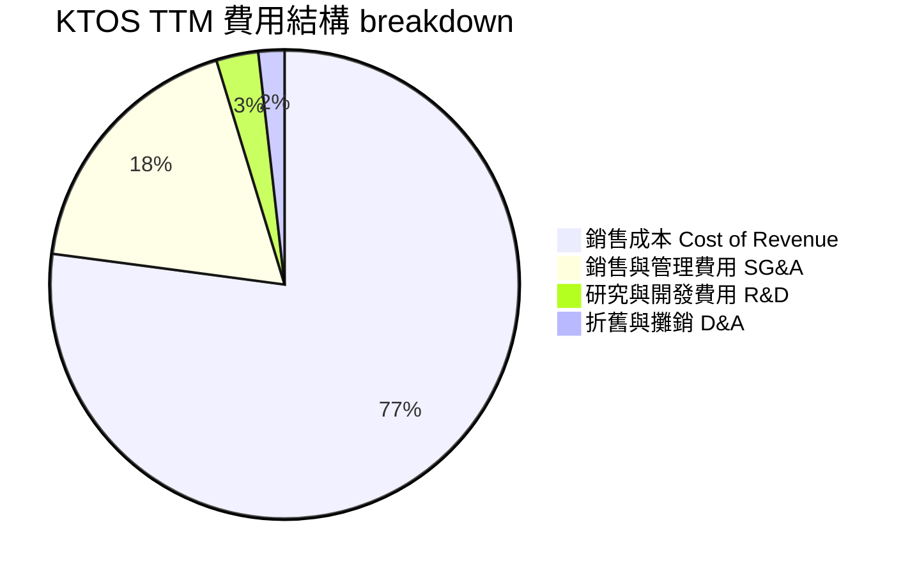

```
╔══════════════════════════════════════════════════════════════════╗
║                   KTOS 費用控管與研發效率                        ║
╠══════════════════════════════════════════════════════════════════╣
║                                                                  ║
║  研發支出 (R&D)：    $40.0M  (佔營收 2.8%)  ── 國防專案常客制化  ║
║  營業費用 (SG&A)：   $260M   (佔營收 18.4%) ── 固定控管尚可      ║
║  銷貨成本 (COGS)：   $1.09B  (佔營收 77.1%) ── 供應鏈膨脹顯著    ║
║                                                                  ║
║  💡 結論：公司內部 R&D 僅佔約 2.8%，因為多數研發已轉嫁至國防部  ║
║      Cost-Plus 採購專案中，但這也壓低了整體毛利率。              ║
╚══════════════════════════════════════════════════════════════════╝
```

### 3.5 季度 EPS 趨勢與盈餘品質（Quality of Earnings）

| 盈餘品質指標 | FY2024 | FY2025 | TTM / Q1 2026 | 評估與對真實股東報酬之影響 |
|--------------|--------|--------|---------------|----------------------------|
| **股權薪酬 (SBC)** | $29.80M | $35.50M | $15.00M (Q1) | 🔴 SBC 佔營收 2.5%，佔 TTM 淨利 ($29.4M) 超過 120%，大幅稀釋股東權益 |
| **SBC / 營業現金流** | N/A | N/A | 負向 (-37.2%) | 🔴 營業現金流為負，SBC 成為非現金調節之主要項目 |
| **FCF / 淨利 (現金轉換率)** | -52.1% | -624.5% | -363.0% | 🔴 盈餘含金量極低，淨利未轉化為真實自由現金流 |
| **資本化支出 vs 費用化** | 高資本化 | 高資本化 | Capex $95.3M | 🟡 大量 Capex 資本化至 PPE，延緩折舊對損益表之衝擊 |
| **有效稅率異常** | 4.8% | 12.1% | 負稅率利益 | 🟡 Q1 2026 淨利 $11.9M 受惠於業外稅務調節，本業營業利益僅 $4.7M - $6.6M |

**盈餘品質結論**：KTOS 的 GAAP 淨利高度依賴非營業項目與稅務利益美化。Q1 2026 營業利益僅約 $4.7M~$6.6M，但淨利卻達 $11.9M。加上高額 SBC（每季約 $9M-$15M）與負向的 FCF，**真實經濟盈餘（Economic Earnings）遠低於 GAAP 數字**，獲利含金量偏低。

---

## 4. 資產負債表分析

### 4.1 資產結構分解

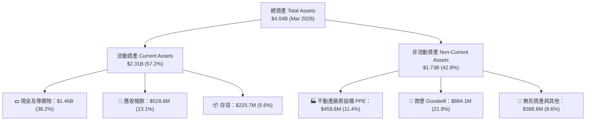

### 4.2 流動性指標分析

| 流動性指標 | FY2023 | FY2024 | FY2025 | Q1 2026 | 行業均值 | 評估 |
|------------|--------|--------|--------|---------|----------|------|
| **流動比率 (Current Ratio)** | 2.03 | 2.94 | 4.06 | **5.63** | 1.45 | 🟢 極其充沛 |
| **速動比率 (Quick Ratio)** | 1.50 | 2.39 | 3.45 | **4.85** | 0.95 | 🟢 現金流動性極佳 |
| **現金比率 (Cash Ratio)** | 0.25 | 1.11 | 1.80 | **3.56** | 0.40 | 🟢 具備極強清償能力 |
| **淨現金 (Net Cash)** | -$248.6M | +$47.3M | +$414.8M | **+$1,278.6M** | N/A | 🟢 增資後淨現金大幅暴增 |

### 4.3 債務結構分析

```
╔══════════════════════════════════════════════════════════════════╗
║                   KTOS 債務與資本結構診斷                         ║
╠══════════════════════════════════════════════════════════════════╣
║                                                                  ║
║  總債務 (Total Debt)：     $185.40M  (包含長期租賃負債)          ║
║  現金與短投 (Cash & Inv)： $1,464.0M  ██████████████████████ (超高)║
║  淨現金 (Net Cash)：       $1,278.6M  🟢 堡壘級資產負債表         ║
║                                                                  ║
║  債務/權益比 (D/E Ratio)： 5.4%     🟢 極低槓桿                  ║
║  利息保障倍數 (Coverage)： 10.5x    🟢 無違約風險                ║
║                                                                  ║
║  💡 結論：KTOS 於 2025/2026 年間完成大規模股權增資，發行大量新股 ║
║      將現金儲備拉升至 $1.46B，完全解除了短期債務與資本支出危機。║
╚══════════════════════════════════════════════════════════════════╝
```

### 4.4 股東權益趨勢

```
╔══════════════════════════════════════════════════════════════════╗
║              KTOS 股東權益 (Stockholders' Equity) 趨勢           ║
╠══════════════════════════════════════════════════════════════════╣
║                                                                  ║
║  FY2022   $936.3M  ████████████░░░░░░░░░░░░░░░░                  ║
║  FY2023   $976.0M  █████████████░░░░░░░░░░░░░░░                  ║
║  FY2024   $1.35B   █████████████████░░░░░░░░░░░                  ║
║  FY2025   $2.00B   █████████████████████████░░░                  ║
║  Q1 2026  ~$2.50B  ████████████████████████████                  ║
║                                                                  ║
║  📊 說明：權益暴增主要來自股票增資（Shares out 由 120M+ -> 187.5M）║
╚══════════════════════════════════════════════════════════════════╝
```

---

## 5. 現金流量深度分析

### 5.1 現金流量瀑布圖

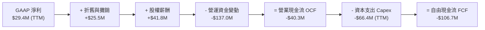

### 5.2 FCF 轉換率趨勢

| 季度/年份 | GAAP 淨利 ($M) | 營業現金流 ($M) | 資本支出 ($M) | 自由現金流 FCF ($M) | FCF 轉換率 (FCF/NI) |
|-----------|----------------|-----------------|---------------|---------------------|---------------------|
| **FY2023** | -$8.9 | -$39.6 | -$52.4 | $12.8 | N/A (虧損) |
| **FY2024** | $16.3 | $49.7 | -$58.2 | -$8.5 | -52.1% |
| **FY2025** | $22.0 | -$42.1 | -$95.3 | -$137.4 | -624.5% |
| **Q1 2026** | $11.9 | -$27.4 | -$19.9 | -$47.3 | -397.5% |
| **TTM** | **$29.4** | **-$40.3** | **-$66.4** | **-$106.7** | **-363.0%** |

### 5.3 自由現金流趨勢

```
╔══════════════════════════════════════════════════════════════════╗
║              KTOS 自由現金流 (Free Cash Flow) 歷史趨勢            ║
╠══════════════════════════════════════════════════════════════════╣
║                                                                  ║
║  FY2022  -$71.1M   ░░░░░░░░████████████ (負向失血)              ║
║  FY2023   +$12.8M  ████░░░░░░░░░░░░░░░░ (短暫轉正)              ║
║  FY2024   -$8.5M   ░░██░░░░░░░░░░░░░░░░ (接近損益兩平)          ║
║  FY2025  -$137.4M  ░░░░░░░░████████████████████ (大幅擴廠 CapEx)║
║  TTM     -$106.7M  ░░░░░░░░██████████████████   (持續資本投入)  ║
║                                                                  ║
║  📊 當前 FCF Yield：-1.17% （以 $9.12B 市值計算）                ║
╚══════════════════════════════════════════════════════════════════╝
```

### 5.4 資本配置評估

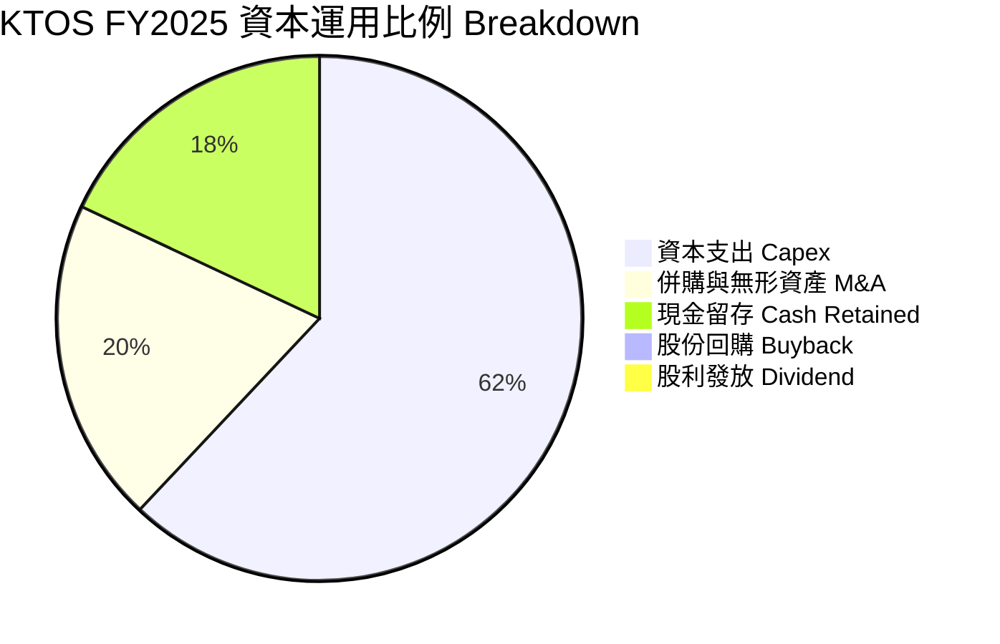

| 資本配置方向 | 近 12 個月投入金額 | 戰略意圖 | 評估 |
|--------------|-------------------|----------|------|
| **內部 Capex** | $95.30M | 擴充 Valkyrie 與極音速測試廠產能 | 🟢 符合成長型公司策略 |
| **併購 (M&A)** | ~$280M (TTM) | 買進微波與衛星通信軟體組件公司 | 🟡 需防範高額商譽減損 |
| **股份回購** | $0.00M | 無回購計畫 | 🟢 成長期不宜回購 |
| **現金股利** | $0.00M | 零股利政策 | 🟢 現金優先留存建廠 |

---

## 6. 獲利能力與資本效率

### 6.1 ROE / ROA / ROIC 趨勢

| 指標 | FY2022 | FY2023 | FY2024 | FY2025 | TTM | 行業標竿 (Aerospace) | 評估 |
|------|--------|--------|--------|--------|-----|----------------------|------|
| **ROE** | -3.9% | -0.9% | 1.4% | 1.2% | **1.2%** | ~14.0% | 🔴 資本效率偏低 |
| **ROA** | -2.3% | -0.6% | 0.9% | 1.0% | **0.6%** | ~5.5% | 🔴 資產未完全變現 |
| **ROIC** | -0.2% | 1.8% | 1.9% | 1.5% | **2.58%** | ~9.0% | 🔴 顯著低於資金成本 |

### 6.2 ROIC vs WACC 分析（核心價值創造判斷）

```
╔══════════════════════════════════════════════════════════════════╗
║                KTOS ROIC vs WACC 深度分析 (TTM)                  ║
╠══════════════════════════════════════════════════════════════════╣
║                                                                  ║
║  WACC 估算：                                                     ║
║  ├── 無風險利率 (10Y 美債)：  4.20%                              ║
║  ├── 市場風險溢酬 (ERP)：     5.00%                              ║
║  ├── Beta：                   1.07                               ║
║  ├── 股權成本 (Cost of Equity) = 4.2% + 1.07 × 5.0% = 9.55%      ║
║  ├── 債務成本 (稅後 Cost of Debt)： ~4.50%                       ║
║  ├── 資本結構：股權 ~92.5%，債務 ~7.5%                           ║
║  └── ✅ WACC ≈ 8.80%                                            ║
║                                                                  ║
║  ROIC 估算 (TTM)：                                               ║
║  ├── NOPAT = EBIT ($23.7M) × (1 - 21% 稅率) ≈ $18.72M            ║
║  ├── 投入資本 (Invested Capital) = 權益 + 債務 - 現金             ║
║  │   = $2,000M + $185M - $1,464M ≈ $721M                         ║
║  └── ✅ ROIC ≈ 2.58%                                            ║
║                                                                  ║
║  ★ 經濟價值增加 (EVA Margin) = ROIC - WACC = -6.22%              ║
║                                                                  ║
║  ROIC  2.58%  ▓▓▓▓▓░░░░░░░░░░░░░░░░░░░░░░░░░  🔴 低效率         ║
║  WACC  8.80%  ▓▓▓▓▓▓▓▓▓▓▓▓▓▓▓▓░░░░░░░░░░░░░░  ── 資金門檻       ║
║  EVA  -6.22pp ░░░░░░░░░░░░░░░░░░░░░░░░░░░░░░  🔴 目前摧毀價值   ║
║                                                                  ║
║  📊 結論：當前 ROIC (2.58%) 遠低於 WACC (8.80%)，主因是高額現金  ║
║      未產生營運收益且新產能尚未放量，目前在經濟層面摧毀股東價值。 ║
╚══════════════════════════════════════════════════════════════════╝
```

### 6.3 杜邦三因素分解

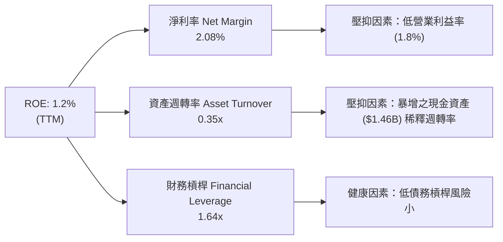

### 6.4 獲利能力儀表板

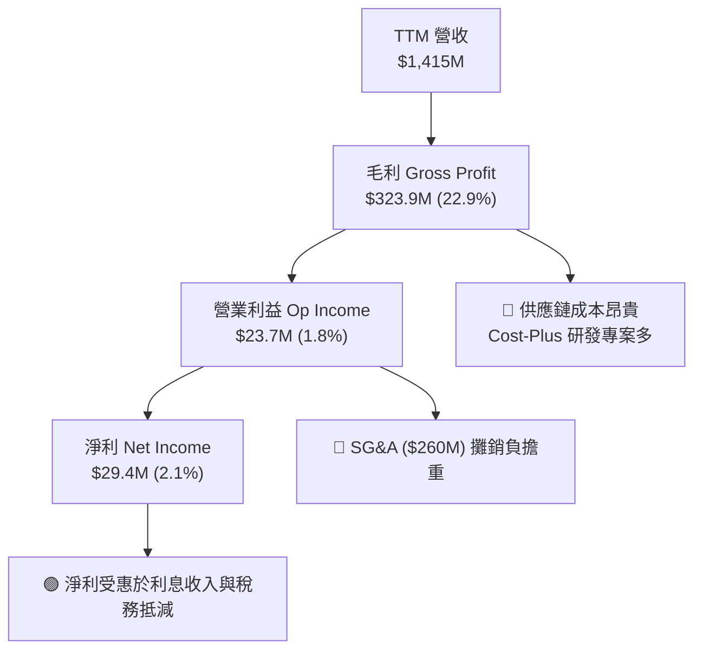

---

## 7. 估值深度分析

### 7.1 同業估值比較表格

| 估值與財務指標 | **KTOS** | **AeroVironment (AVAV)** | **Leidos (LDOS)** | **Lockheed Martin (LMT)** | KTOS 相對評估 |
|----------------|----------|--------------------------|-------------------|---------------------------|---------------|
| **市值 (Market Cap)** | **$9.12B** | $5.10B | $20.8B | $118.5B | 中型國防科技股 |
| **Trailing P/E** | **286.1x** | 85.2x | 18.5x | 18.2x | 🔴 歷史高位，極端溢價 |
| **Forward P/E** | **44.58x** | 48.5x | 16.8x | 16.5x | 🟡 與極高成長無人機同業 AVAV 相當 |
| **P/S Ratio** | **6.45x** | 6.80x | 1.32x | 1.68x | 🔴 遠高於傳統軍工同業 |
| **EV / EBITDA** | **98.45x** | 38.2x | 13.5x | 12.8x | 🔴 估值反應極高市場期望 |
| **Revenue YoY** | **22.6%** | 24.1% | 7.5% | 5.2% | 🟢 營收動能媲美純純無人機龍頭 AVAV |
| **Operating Margin**| **1.8%** | 12.5% | 8.8% | 12.2% | 🔴 盈利能力顯著落後同業 |

### 7.2 歷史估值區間分析

```
╔══════════════════════════════════════════════════════════════════╗
║              KTOS Forward P/E 歷史評估區間                       ║
╠══════════════════════════════════════════════════════════════════╣
║                                                                  ║
║  歷史高點：  65.0x  ██████████████████████████████               ║
║  當前位置：  44.6x  █████████████████████░░░░░░░░  ← 目前價位    ║
║  歷史均值：  32.0x  ███████████████░░░░░░░░░░░░░░                ║
║  歷史低點：  18.0x  ████████░░░░░░░░░░░░░░░░░░░░░                ║
║                                                                  ║
║  📊 結論：當前 Forward P/E 為 44.58x，位於歷史高位區間，         ║
║      市場已高度預期未來的戰術無人機量產與營益率倍增。            ║
╚══════════════════════════════════════════════════════════════════╝
```

### 7.3 情境目標價（假設驅動，Bear / Base / Bull）

> **估值倍數選擇說明**：鑑於 KTOS 現階段淨利受高額折舊 (D&A) 與極低營益率壓抑，Trailing P/E 失真。估值建模採用 **FY2027 預估 EBITDA 倍數與營益率擴張** 模型，配合發行股數 187.5M 進行推導。

| 情境 | 營收 3年 CAGR | FY2027 營業利益率 | 退出 EV/EBITDA 倍數 | 隱含目標價 | 相對當前股價 ($48.64) |
|------|---------------|-------------------|----------------------|------------|-----------------------|
| 🔴 **悲觀 (Bear)** | 10.0% | 2.5% | 25.0x | **$38.00** | **-21.9%** |
| 🟡 **基準 (Base)** | 18.0% | 5.5% | 35.0x | **$75.00** | **+54.2%** |
| 🟢 **樂觀 (Bull)** | 25.0% | 8.5% | 45.0x | **$110.00** | **+126.2%** |

### 7.4 DCF 敏感性分析（6格目標價矩陣）

**DCF 核心假設**：基期營收 $1.42B，永續成長率 $g = 3.0\%$，終端倍數法與現金流折現法進行加權。

| 情境 / 折現率 | **WACC = 8.0%** | **WACC = 8.8% (基準)** | **WACC = 9.5%** |
|---------------|-----------------|------------------------|-----------------|
| 🟢 **樂觀 (高利潤擴張)** | $122.50 (+151.9%) | **$110.00 (+126.2%)** | $98.00 (+101.5%) |
| 🟡 **基準 (穩健增長)** | $83.00 (+70.6%) | **$75.00 (+54.2%)** | $67.50 (+38.8%) |
| 🔴 **悲觀 (合約延宕)** | $43.00 (-11.6%) | **$38.00 (-21.9%)** | $33.50 (-31.1%) |

### 7.5 估值綜合區間

```
╔══════════════════════════════════════════════════════════════════╗
║                    KTOS 估值綜合區間視覺化                       ║
╠══════════════════════════════════════════════════════════════════╣
║                                                                  ║
║  悲觀價：   $38.00    ██████░░░░░░░░░░░░░░░░░░░░░░░░░            ║
║  當前價：   $48.64    █████████░░░░░░░░░░░░░░░░░░░░░░  ← 現價    ║
║  基準價：   $75.00    ██████████████████░░░░░░░░░░░░░            ║
║  華爾街均價 $109.33   ████████████████████████████░░░            ║
║  樂觀價：   $110.00   █████████████████████████████░             ║
║                                                                  ║
║  📊 當前股價接近 52 週低點 ($45.58)，提供合理之安全邊際。       ║
╚══════════════════════════════════════════════════════════════════╝
```

---

## 8. 成長催化劑

### 8.1 催化劑時間軸

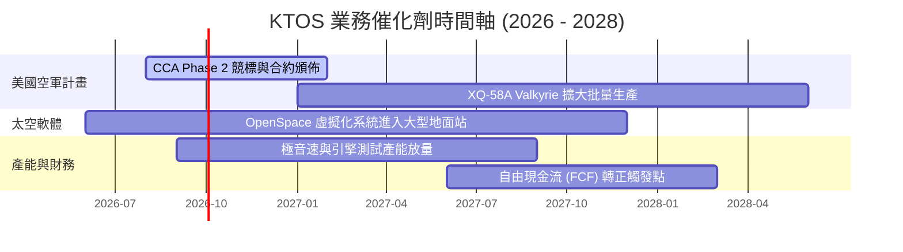

### 8.2 TAM 市場規模分析

```
╔══════════════════════════════════════════════════════════════════╗
║                  KTOS 潛在市場規模 (TAM) 拆解                    ║
╠══════════════════════════════════════════════════════════════════╣
║                                                                  ║
║  無人戰術機與協同打擊 (CCA TAM)： $12.5B (滲透率 ~3%) ── 巨大空間║
║  衛星地面站軟體虛擬化 TAM：       $4.8B  (滲透率 ~12%)── 高毛利 ║
║  極音速與火箭測試系統 TAM：       $3.2B  (滲透率 ~15%)── 高壁壘 ║
║  無人目標機與 C5ISR TAM：          $2.5B  (滲透率 ~25%)── 穩健   ║
║                                                                  ║
║  💡 總潛在市場 (Total TAM)： ~$23.0B                             ║
║      KTOS 當前營收 $1.42B，隱含總市場滲透率僅約 6.2%。            ║
╚══════════════════════════════════════════════════════════════════╝
```

### 8.3 成長驅動力結構圖

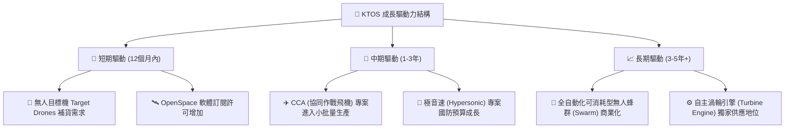

---

## 9. 風險矩陣

### 9.1 風險評分矩陣

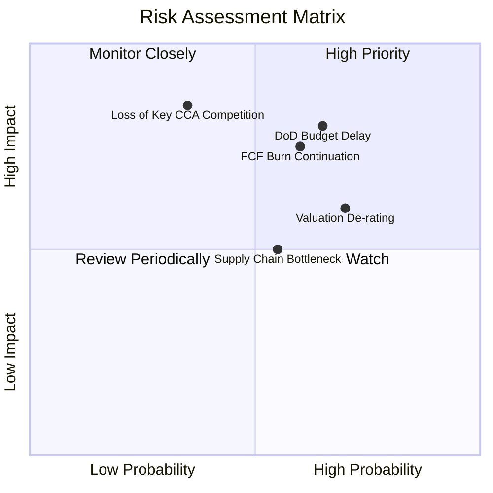

### 9.2 風險清單詳細分析

| # | 風險項目 | 發生機率 | 財務衝擊 | 風險評分 | 緩解措施與監控指標 |
|---|----------|----------|----------|----------|--------------------|
| 1 | 🔴 **美國國防預算遞延或法案卡關** | 高 (65%) | 高 (-15% 營收) | 🔴 **8.2/10** | 公司擁有 $1.46B 淨現金，可抵抗長達兩年之預算凍結期 |
| 2 | 🔴 **自由現金流持續流失與高 Capex** | 中高 (60%) | 中高 (壓抑股價) | 🔴 **7.5/10** | 密切追蹤 2026/2027 Capex 是否隨工廠完工而顯著下降 |
| 3 | 🟡 **高估值倍數回落風險 (Multiple Compression)** | 高 (70%) | 中度 (-20% 股價) | 🟡 **7.0/10** | 透過營益率由 1.8% 擴張至 5%+ 來吸收估值修正 |
| 4 | 🟡 **與 Anduril / Boeing 等巨頭競標失敗** | 中度 (35%) | 極高 (-30% 估值) | 🟡 **6.5/10** | 保持多元化業務（衛星與引擎），不單獨依賴 Valkyrie |
| 5 | 🟢 **供應鏈與材料成本上漲** | 中度 (55%) | 低 (-1pp 毛利) | 🟢 **4.5/10** | 國防合約多數具備通貨膨脹轉嫁與成本保護條款 |

---

## 10. 投資建議

### 10.1 最終綜合評級雷達圖

```
╔══════════════════════════════════════════════════════════════╗
║                  KTOS 綜合研究評分雷達                        ║
╠══════════════════════════════════════════════════════════════╣
║  業務成長動能 (Growth)      8.5/10  ▓▓▓▓▓▓▓▓▓▓▓▓▓▓▓▓▓░░░     ║
║  資產負債安全 (Solvency)    9.0/10  ▓▓▓▓▓▓▓▓▓▓▓▓▓▓▓▓▓▓░░     ║
║  產業特許壁壘 (Moat)        7.2/10  ▓▓▓▓▓▓▓▓▓▓▓▓▓▓░░░░░░     ║
║  獲利與現金流 (Margins/FCF) 4.0/10  ▓▓▓▓▓▓▓▓░░░░░░░░░░░░     ║
║  當前估值吸引力 (Valuation) 4.2/10  ▓▓▓▓▓▓▓▓░░░░░░░░░░░░     ║
╠══════════════════════════════════════════════════════════════╣
║  🏆 綜合投資評分            6.6/10  ▓▓▓▓▓▓▓▓▓▓▓▓▓░░░░░░░     ║
║  🎯 投資建議：🟡 中立 / 謹慎分批買入 (Accumulate on Dips)     ║
╚══════════════════════════════════════════════════════════════╝
```

### 10.2 目標價與隱含報酬率

| 情境 | 機率權重 | 目標價 | 當前股價 | 隱含報酬率 | 關鍵前提條件 |
|------|----------|--------|----------|------------|--------------|
| 🔴 **悲觀情境** | 25% | **$38.00** | $48.64 | **-21.9%** | 營益率卡在 2.5% 以下，FCF 無法轉正，估值倍數修正 |
| 🟡 **基準情境** | 50% | **$75.00** | $48.64 | **+54.2%** | 營收 CAGR 18%，營益率回升至 5.5%，CCA 專案獲得穩定訂單 |
| 🟢 **樂觀情境** | 25% | **$110.00**| $48.64 | **+126.2%**| 戰術無人機爆發量產，OpenSpace 軟體高毛利放量，營益率達 8.5% |
| 🎲 **加權期望值**| 100% | **$74.50** | $48.64 | **+53.2%** | **風險回報比 (Risk/Reward): 2.47 : 1** |

### 10.3 買入時機與觸發因素

```
╔══════════════════════════════════════════════════════════════════╗
║                  ✅ 買入觸發因素 Checklist                      ║
╠══════════════════════════════════════════════════════════════════╣
║                                                                  ║
║  分批建倉條件（滿足 2 項以上可執行）：                           ║
║  ✅ 股價自高點顯著拉回，靠近 52 週低點區間 ($45 - $48) ── [已滿足]║
║  ✅ 淨現金儲備高於 $1.0B，無流動性破產風險 ── [已滿足]           ║
║  ☐ 單季自由現金流 (FCF) 轉正或 Capex 顯著下降 ── [未滿足]        ║
║                                                                  ║
║  加碼觸發條件：                                                  ║
║  ☐ 營業利益率連續兩季突破 4.0%                                   ║
║  ☐ 美國空軍正式頒佈 Valkyrie / CCA 數億美元等級量產合約          ║
║                                                                  ║
║  停損/減碼觸發條件：                                             ║
║  ☐ 單季營收 YoY 成長率跌破 8.0%                                  ║
║  ☐ 管理層繼續發行增資股票，使稀釋比率單年超過 10%               ║
╚══════════════════════════════════════════════════════════════════╝
```

### 10.4 投資人適配度分析

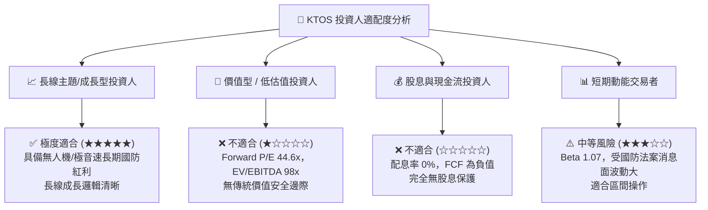

### 10.5 每季財報監控清單（Quarterly Watch List）

| 監控指標 | 最新數據 (TTM / Q1 26) | 睇多觸發門檻 (Bullish Threshold) | 睇空觸發門檻 (Bearish Threshold) | 追蹤意義 |
|----------|------------------------|----------------------------------|----------------------------------|----------|
| **單季營收 YoY** | **22.60%** | > 20.0% | < 10.0% | 驗證國防無人機與衛星需求強度 |
| **毛利率 (Gross Margin)** | **22.89%** | > 25.0% | < 21.0% | 觀察客制化研發專案是否轉為高毛利量產 |
| **營業利益率 (Op Margin)**| **1.80%** | > 4.0% | < 1.0% | 規模槓桿是否顯現之核心指標 |
| **單季 FCF** | **-$47.3M** | 轉正 ( > $0 ) | 單季流失 > -$60M | 資本支出是否開始取得現金回報 |
| **股權薪酬 (SBC / Rev)** | **2.5%** | < 2.0% | > 4.0% | 評估股東權益稀釋風險 |
| **流通股數 (Shares Out)**| **187.5M** | 停止增資保持平穩 | > 200.0M | 防範頻繁增資對 EPS 之稀釋 |

### 10.6 反面論證：什麼會證明論點錯誤（What Would Change My Mind）

```
╔══════════════════════════════════════════════════════════════════╗
║              ⚠️ 論點失效條件（Disconfirming Evidence）           ║
╠══════════════════════════════════════════════════════════════════╣
║  本報告之基準多頭論點，在下列任一條件發生時宣告失效，應即刻降評： ║
║                                                                  ║
║  1. 營業利益率 (Operating Margin) 連續四季無法突破 3.0%：       ║
║     證明公司缺乏定價能力，Cost-Plus 合約無法轉化為規模槓桿。     ║
║                                                                  ║
║  2. 自由現金流 (FCF) 於 FY2027 結束前仍無法實現單季轉正：        ║
║     顯示高 Capex 投資效率低下，資本被無底洞燒光。                ║
║                                                                  ║
║  3. 美國空軍 CCA 專案主要量產合約全數由競標對手取得：            ║
║     Kratos 失去次世代無人機龍頭地位，戰略價值大減。             ║
║                                                                  ║
║  4. ROIC 長期停留於 3.0% 以下（低於 WACC 8.8%）：                ║
║     證實其商業模式持續摧毀股東價值，無法獲得機構資本認同。       ║
╚══════════════════════════════════════════════════════════════════╝
```

---

> **免責聲明**：本報告為 AI 自動生成之機構級研究參考資料，僅供學術與投資研究討論，不構成任何買賣金融資產之要約或承諾。投資切記風險，入市請獨立評估並自負盈虧。