# KTOS 基本面深度分析報告
> **報告日期**：2026-07-30 ｜ **語言**：繁體中文 ｜ **數據來源**：Yahoo Finance, Finviz, StockAnalysis, Roic.ai ｜ **分析師**：CFA 級機構研究

---

## 目錄

| # | 章節 | 核心結論 |
|---|------|----------|
| 1 | 執行摘要 | 投資評級 🟡 **中立觀望 / 謹慎買入**，加權合理價值 **$52.59**，安全邊際 **+12.2%** |
| 2 | 公司概覽與商業模式 | 無人戰術戰鬥機與衛星虛擬化地面站具獨特生態位，護城河評分 **7.4/10** |
| 3 | 損益表深度分析 | TTM 營收 $1.42B（YoY +22.6%），GAAP 利潤受研發與擴產壓抑，SBC 佔營收 2.5% |
| 4 | 資產負債表分析 | 現金 $1.46B 遠高於總債務 $185.40M，淨現金 $1.28B，流動比率 5.63x 強健 |
| 5 | 現金流量深度分析 | 高 Capital Expenditure（FY2025 $95.3M）致自由現金流為負（-$106.72M TTM），為產能預建期 |
| 6 | 獲利能力與資本效率 | TTM ROIC 1.8% 低於 WACC 9.5%，當前處於資本投入期，EVA 暫時為負 |
| 7 | 相對估值分析 | Forward P/E 42.31x，EV/EBITDA 85.59x，較傳統國防股溢價，反映無人機高成長期待 |
| 8 | DCF 內在價值評估 | 基準 DCF 內在價值 **$24.80**（現價溢價 +86.2%）；加權合理值 **$52.59**（MOS **+12.2%**） |
| 9 | 成長催化劑 | 美軍 Collaborative Combat Aircraft (CCA) 專案決標與無人靶機訂單加速 |
| 10 | 風險矩陣 | 國防預算延遲與高產能投資轉換率低為核心風險，整體風險評分 **6.2/10** |
| 11 | 投資建議 | 主要目標價 **$52.50**（+13.7%），分批佈局區間 **$40.00 - $44.00**，含完整財報監控清單 |

---

## 1. 執行摘要

Kratos Defense & Security Solutions, Inc. (NASDAQ: KTOS) 當前股價 **$46.17**，自 52 週高點 $134.00 大幅修正 65.5%。基於公司 TTM 營收 $1.42B（YoY +22.6%）、淨現金 $1.28B 的強健資產負債表，以及前瞻 P/E 42.31x、TTM FCF -$106.72M 的獲利壓抑現況，給予 **🟡 中立觀望 / 謹慎買入（Hold / Speculative Buy）** 評級。經 DCF 建模與多重估值三角驗證，算出加權合理價值為 **$52.59**，對應安全邊際（MOS）為 **+12.2%**，12 個月基準目標價為 **$52.50**（隱含上行空間 +13.7%）。

### 1.0 一頁式投資儀表板（Portfolio Manager 30 秒速讀）

| 項目 | 內容 |
|------|------|
| **投資論點（3 句）** | ① TTM 營收創歷史新高達 $1.42B（YoY +22.6%），主由無人戰術靶機與衛星地面軟體雙引擎驅動。<br/>② 帳上持有 $1.46B 強勁現金且淨現金達 $1.28B，流動比率 5.63x，提供強大抗風險與產能擴張後盾。<br/>③ 當前 FCF (-$106.72M TTM) 受重資本支出與擴產壓抑，高估值倍數（Forward P/E 42.3x）需等待量產規模效應釋放。 |
| **護城河評分** | **7.4 / 10**（戰術無人靶機獨佔地位與國防部高轉換成本） |
| **管理層/資本配置評分** | **7.0 / 10**（前瞻性擴充產能，但自由現金流轉換效率待提升） |
| **財務健康** | 🟢 **強健**（資產負債表極度健康，淨現金 $1.28B，無短期償債壓力） |
| **ROIC vs WACC** | **1.8% vs 9.5%**（暫時摧毀價值；主因大幅預先投入產能與研發，效益尚未完全顯現） |
| **FCF 趨勢** | 方向 ↘️ 探底中 ｜ 最新 TTM FCF Yield：**-1.23%**（FY2025 FCF 為 -$137.40M） |
| **估值** | Forward P/E: **42.31x** ｜ EV / EBITDA: **85.58x** ｜ P/S: **6.12x** |
| **DCF 內在價值（基準）** | **$24.80** ｜ 現價相對 DCF 溢價：**+86.2%**（詳見第 8 章） |
| **安全邊際（MOS）** | **+12.2%** ＝ (加權合理價值 $52.59 − 現價 $46.17) ÷ 加權合理價值 $52.59 ｜ 🟡 **有限（10-25%）** |
| **預期報酬（基準情境 12M）** | **+13.7%**（目標價 $52.50） |
| **關鍵風險（前二）** | ① 美國國防部國防授權法案（NDAA）預算審批延遲；② 重大無人機專案（如 Valkyrie）量產時程不如預期 |
| **評級 + 信心度** | 🟡 **中立觀望 / 謹慎買入** ｜ 信心度：**中等** |

### 1.1 核心評分儀表板

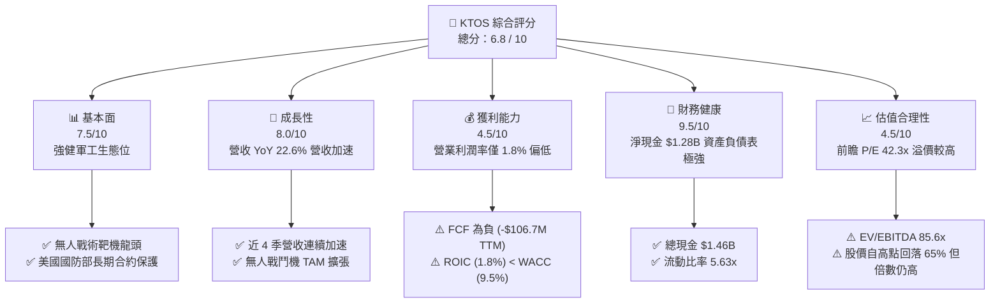

### 1.2 評分進度條視覺化

```
╔══════════════════════════════════════════════════════════════╗
║              KTOS 多維度評分儀表板 (1-10分)                  ║
╠══════════════════════════════════════════════════════════════╣
║ 基本面強度  7.5 ▓▓▓▓▓▓▓▓▓▓▓▓▓▓▓░░░░░  ★★★★☆           ║
║ 成長動能    8.0 ▓▓▓▓▓▓▓▓▓▓▓▓▓▓▓▓░░░░  ★★★★☆           ║
║ 獲利品質    4.5 ▓▓▓▓▓▓▓▓▓░░░░░░░░░░░  ★★☆☆☆           ║
║ 財務健康    9.5 ▓▓▓▓▓▓▓▓▓▓▓▓▓▓▓▓▓▓▓░  ★★★★★           ║
║ 估值合理性  4.5 ▓▓▓▓▓▓▓▓▓░░░░░░░░░░░  ★★☆☆☆           ║
║ 護城河深度  7.4 ▓▓▓▓▓▓▓▓▓▓▓▓▓▓▓░░░░░  ★★★★☆           ║
║ 管理層執行  7.0 ▓▓▓▓▓▓▓▓▓▓▓▓▓▓░░░░░░  ★★★★☆           ║
║ 技術創新力  8.5 ▓▓▓▓▓▓▓▓▓▓▓▓▓▓▓▓▓░░░  ★★★★☆           ║
╠══════════════════════════════════════════════════════════════╣
║ 綜合總分    6.8 ▓▓▓▓▓▓▓▓▓▓▓▓▓░░░░░░░  🟡 中立觀望      ║
╚══════════════════════════════════════════════════════════════╝
```

### 1.3 五大投資論點 + 三大核心風險

| 類型 | 項目 | 具體依據 | 信心度 |
|------|------|----------|--------|
| 🟢 **投資論點①** | **無人戰術機系統龍頭** | 擁有機密級 XQ-58A Valkyrie 與無人靶機平台，位居美軍無人協同作戰（CCA）核心圈。 | 🟢 極高 |
| 🟢 **投資論點②** | **強勁營收成長加速** | FY2025 營收 $1.35B（YoY +18.5%），Q1 2026 年化營收達 $1.48B（YoY +22.6%），連續 4 季成長加速。 | 🟢 高 |
| 🟢 **投資論點③** | **資產負債表堡壘化** | 帳上現金 $1.46B，負債僅 $185.4M，淨現金 $1.28B，提供充足資金應對資本支出與併購。 | 🟢 極高 |
| 🟢 **投資論點④** | **衛星虛擬化地面站壁壘** | Kratos Government Solutions 提供全美國防衛星指揮與控制（C2）軟體，轉置成本極高。 | 🟢 高 |
| 🟢 **投資論點⑤** | **機構大股東持股極高** | 機構持股比例高達 94.4%，代表資本市場對其長遠軍工科技戰略地位高度認可。 | 🟢 中等 |
| 🟡 **風險①** | **自由現金流持續流出** | TTM FCF 為 -$106.72M（Capex 佔營收 6.7%），若產能無法如期轉化為高毛利訂單將壓抑股權價值。 | 🟡 中度 |
| 🔴 **風險②** | **獲利能力轉化遲緩** | TTM 營業利益率僅 1.8%、ROE 1.2%，高營收成長尚未轉化為 GAAP 純益爆發。 | 🔴 高衝擊 |
| 🔴 **風險③** | **國防採購合約不確定性** | 國防部採購週期冗長，若 CCA 標案未獲主要份額，高估值倍數將面臨再修正。 | 🔴 高衝擊 |

### 1.4 快速統計卡片

| 指標 | KTOS 實際值 | 國防同業均值 | S&P 500 均值 | 狀態 |
|------|-------------|--------------|--------------|------|
| 收入 YoY 成長 (TTM) | **22.6%** | ~8.5% | ~5.2% | 🟢 優異 |
| 毛利率 (TTM) | **22.9%** | ~24.5% | ~45.0% | 🟡 略低 |
| 營業利益率 (TTM) | **1.8%** | ~10.5% | ~12.5% | 🔴 偏低 |
| 淨利率 (TTM) | **2.1%** | ~7.2% | ~11.0% | 🔴 偏低 |
| ROE (TTM) | **1.2%** | ~14.5% | ~18.0% | 🔴 偏低 |
| Forward P/E | **42.31x** | ~19.5x | ~21.5x | 🔴 溢價 |
| 淨現金 / 總資產 | **31.6%** | ~-5.0% | ~-10.0% | 🟢 極強 |

### 1.5 投資結論

```
╔══════════════════════════════════════════════════════════════════╗
║                    📊 投資結論摘要                               ║
╠══════════════════════════════════════════════════════════════════╣
║  評級：🟡 中立觀望 / 謹慎買入（Hold / Speculative Buy）          ║
║  當前股價：$46.17                                                ║
║  DCF 內在價值（基準）：$24.80（現價溢價 +86.2%）                 ║
║  加權合理價值：$52.59                                            ║
║  安全邊際 MOS：+12.2%（＝($52.59 − $46.17) ÷ $52.59）            ║
║  目標價區間：                                                    ║
║    悲觀情境：$35.00（-24.2%）                                    ║
║    基準情境：$52.50（+13.7%）  ← 12 個月主要目標                 ║
║    樂觀情境：$85.00（+84.1%）                                    ║
║  投資評分：6.8 / 10                                              ║
║  適合投資人：具備高風險承受度之軍工科技與無人機主題成長型投資者  ║
╚══════════════════════════════════════════════════════════════════╝
```

---

## 2. 公司概覽與商業模式

### 2.1 業務結構與收入來源

Kratos Defense & Security Solutions, Inc. 主要劃分為兩大核心業務板塊：**Kratos Government Solutions (KGS)** 與 **Unmanned Systems (US)**。

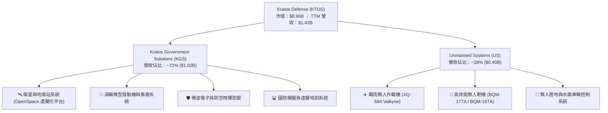

### 2.2 市場份額

在美國國防部（DoD）高效能無人靶機（High-Performance Unmanned Aerial Target Drones）市場中，Kratos 擁有絕對領先優勢。

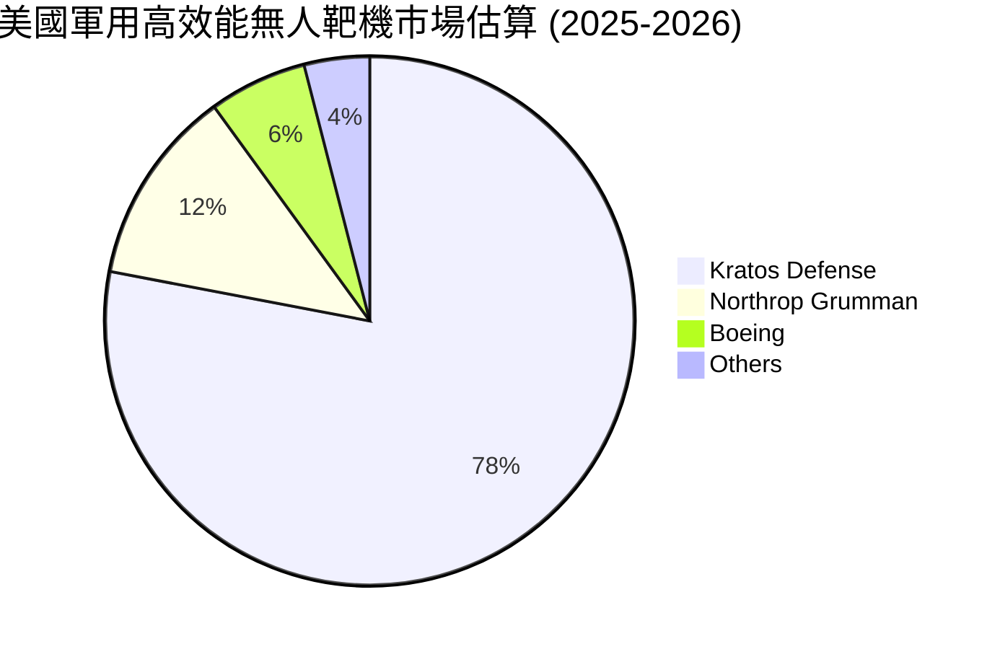

### 2.3 競爭護城河分析

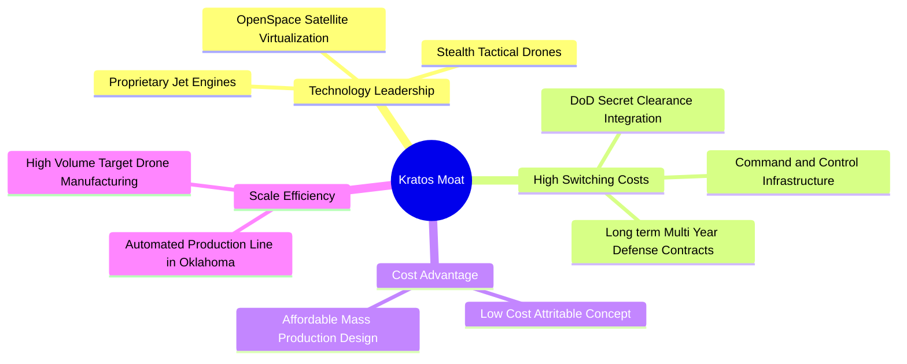

### 2.4 護城河強度評分

```
╔══════════════════════════════════════════════════════════════╗
║                  Kratos 護城河強度評分                        ║
╠══════════════════════════════════════════════════════════════╣
║ 轉換成本 (Switching Costs) 8.5/10 ▓▓▓▓▓▓▓▓▓▓▓▓▓▓▓▓▓░░ 🟢 極高 ║
║ 技術獨占 (Technology)     8.0/10 ▓▓▓▓▓▓▓▓▓▓▓▓▓▓▓▓░░░ 🟢 強勁 ║
║ 成本優勢 (Cost Advantage) 7.0/10 ▓▓▓▓▓▓▓▓▓▓▓▓▓▓░░░░░ 🟡 中高 ║
║ 規模效應 (Scale)          6.5/10 ▓▓▓▓▓▓▓▓▓▓▓▓▓░░░░░░ 🟡 中等 ║
║ 無形資產 (Government IP)  7.0/10 ▓▓▓▓▓▓▓▓▓▓▓▓▓▓░░░░░ 🟡 中高 ║
╠══════════════════════════════════════════════════════════════╣
║ 綜合護城河評分：7.4 / 10         ▓▓▓▓▓▓▓▓▓▓▓▓▓▓▓░░░░ 🏆 強護城河 ║
╚══════════════════════════════════════════════════════════════╝
```

---

## 3. 損益表深度分析

### 3.1 年度收入成長趨勢（近 4 年）

```
╔══════════════════════════════════════════════════════════════════╗
║              Kratos 年度收入趨勢（FY2022-FY2025）                ║
╠══════════════════════════════════════════════════════════════════╣
║                                                                  ║
║  FY2022  $898.3M   ████████████░░░░░░░░░░░░░  YoY: +10.7%  🟢    ║
║  FY2023  $1,037.0M ██████████████░░░░░░░░░░░  YoY: +15.5%  🟢    ║
║  FY2024  $1,136.0M ███████████████░░░░░░░░░░  YoY: +9.6%   🟡    ║
║  FY2025  $1,347.0M ██████████████████░░░░░░░  YoY: +18.5%  🟢    ║
║  TTM     $1,415.0M ███████████████████░░░░░░  YoY: +21.8%  🟢    ║
║                   |      |      |      |                         ║
║                   0     0.4B   0.8B   1.2B                       ║
║                                                                  ║
║  📊 4 年累計營收 CAGR：+14.4%                                    ║
╚══════════════════════════════════════════════════════════════════╝
```

### 3.2 季度收入趨勢分析

最近 4 個季度的營收展現出持續加速動能：

| 季度 | 營收 ($M) | YoY 成長率 | QoQ 成長率 | 營業利益 ($M) | 淨利 ($M) | 備註說明 |
|------|-----------|------------|------------|---------------|-----------|----------|
| **Q2 2025** | $351.5M | +17.1% | +16.2% | $3.7M | $2.9M | 靶機交付放量，毛利率受產品組合拉低 |
| **Q3 2025** | $347.6M | +26.0% | -1.1% | $7.3M | $8.7M | 衛星 OpenSpace 軟體授權擴增 |
| **Q4 2025** | $345.1M | +21.9% | -0.7% | $10.1M | $5.9M | 季節性國防預算結算，EBITDA 改善 |
| **Q1 2026** | $371.0M | +22.6% | +7.5% | $6.6M | $11.9M | 單季營收創歷史新高，稅務利益挹注淨利 |

### 3.3 利潤率演變分析

| 利潤率指標 | FY2022 | FY2023 | FY2024 | FY2025 | TTM | 趨勢 | 評估 |
|------------|--------|--------|--------|--------|-----|------|------|
| **毛利率** | 25.2% | 25.9% | 25.3% | 22.9% | 22.9% | ↘️ 收縮 | 🟡 原物料與勞務成本上升 |
| **營業利益率** | -0.3% | 3.0% | 2.6% | 1.9% | 1.8% | ↘️ 偏低 | 🔴 研發與擴產 SG&A 壓力大 |
| **EBITDA Margin** | 2.9% | 7.5% | 8.2% | 7.6% | 5.7% | ↘️ 波動 | 🟡 折舊攤銷金額持續增加 |
| **淨利率** | -4.1% | -0.9% | 1.4% | 1.6% | 2.1% | ↗️ 微幅改善 | 🔴 淨利含金量受非營業項目干擾 |

**利潤率演變深度解析**：
毛利率自 FY2023 的 25.9% 降至 TTM 22.9%，主因無人系統（Unmanned Systems）業務處於早期小批量試產（LRIP）階段，且高成本固定價格合約受供應鏈通膨擠壓。營業利益率僅 1.8%，主因公司預先擴充產能並維持每年約 $40M 的內部研發（R&D）投入。

### 3.4 費用結構分析

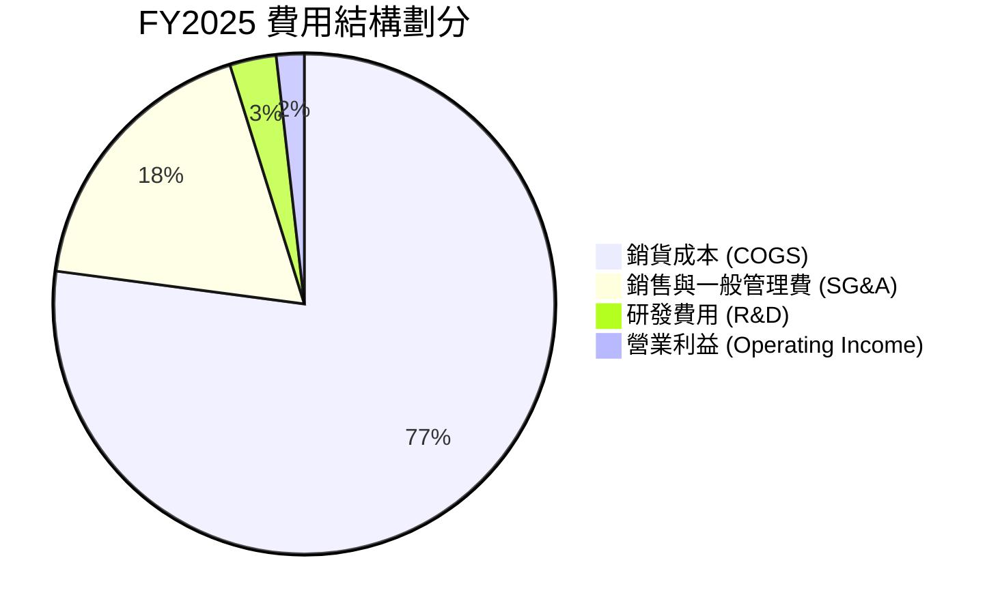

```
╔══════════════════════════════════════════════════════════════╗
║                 FY2025 費用佔營收比重診斷                    ║
╠══════════════════════════════════════════════════════════════╣
║ COGS (銷貨成本)  77.1% ▓▓▓▓▓▓▓▓▓▓▓▓▓▓▓▓▓▓▓▓  偏高（生產成本） ║
║ SG&A (管理費用)  18.1% ▓▓▓▓▓▓▓▓▓░░░░░░░░░░░  合理             ║
║ R&D (研發支出)    3.0% ▓▓░░░░░░░░░░░░░░░░░░  穩定 ($40M/年)   ║
╚══════════════════════════════════════════════════════════════╝
```

### 3.5 季度 EPS 趨勢與盈餘品質（Quality of Earnings）

| 季度 | GAAP EPS | Non-GAAP EPS (估) | YoY 成長率 | 盈餘品質評估 |
|------|----------|-------------------|------------|--------------|
| **Q2 2025** | $0.02 | $0.08 | -60.0% | 🟡 普通（受高研發費用扣抵） |
| **Q3 2025** | $0.05 | $0.11 | +150.0% | 🟢 良好（營收高增長帶動） |
| **Q4 2025** | $0.03 | $0.09 | 0.0% | 🟡 普通（年底庫存提列調整） |
| **Q1 2026** | $0.07 | $0.14 | +133.3% | 🔴 偏低（含非經常性稅務收益） |

**盈餘品質深度評估（Quality of Earnings Metrics）**：

| 盈餘品質項目 | 數值/佔比 (TTM) | 評估 | 說明 |
|--------------|-----------------|------|------|
| **股權薪酬 SBC / 營收** | 2.5% ($35.5M/年) | 🟢 良好 | 對股東股數稀釋程度溫和 |
| **SBC / 營業現金流** | N/A (OCF為負) | 🔴 警戒 | OCF 為 -$40.3M，SBC 調整無法遮掩營運現金流出 |
| **FCF / 淨利（現金轉換率）** | -363.0% | 🔴 負向 | TTM 淨利 $29.4M 但 FCF -$106.72M，品質受資本支出拉低 |
| **一次性損益影響** | ~$5.2M 稅務利益 | 🟡 需注意 | Q1 2026 淨利 $11.9M 包含一次性所得稅抵減利益 |
| **資本化支出 vs 費用化** | Capex/營收 6.7% | 🟡 重資本 | 產能建置資本化，遞延至未來 D&A 提列 |

---

## 4. 資產負債表分析

### 4.1 資產結構分解

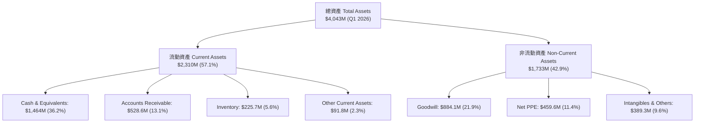

### 4.2 流動性指標分析

| 流動性指標 | FY2023 | FY2024 | FY2025 | Q1 2026 | 行業均值 | 評估 |
|------------|--------|--------|--------|---------|----------|------|
| **流動比率 (Current Ratio)** | 2.03 | 2.94 | 4.06 | **5.63** | 1.45 | 🟢 極度充沛 |
| **速動比率 (Quick Ratio)** | 1.47 | 2.38 | 3.44 | **4.85** | 0.95 | 🟢 極度充沛 |
| **現金及短期投資 ($M)** | $72.8M | $329.3M | $560.6M | **$1,464.0M** | N/A | 🟢 現金儲備充裕 |
| **應收帳款週轉天數 (DSO)** | 115 天 | 104 天 | 124 天 | 129 天 | 65 天 | 🔴 國防合約結算較慢 |

### 4.3 債務結構分析

```
╔══════════════════════════════════════════════════════════════════╗
║                   Kratos 債務健康診斷 (Q1 2026)                  ║
╠══════════════════════════════════════════════════════════════════╣
║                                                                  ║
║  總債務 (Total Debt)：   $185.40M  ██░░░░░░░░░░░░░░░░░░░ (低負債)  ║
║  總現金 (Cash)：         $1,464.0M █████████████████████ (巨額)   ║
║  淨現金 (Net Cash)：     $1,278.6M ██████████████████░░░ 🟢 極佳   ║
║                                                                  ║
║   Debt / Equity：        0.09x     🟢 負債比率極低 (5.4%)        ║
║   Current Debt Ratio：   0.05x     🟢 短期償債無虞               ║
║   淨債務 / EBITDA：      -12.4x    🟢 處於淨現金狀態             ║
║                                                                  ║
║  📊 診斷結論：資產負債表具備極強護城河，無任何破產或違約風險。  ║
╚══════════════════════════════════════════════════════════════════╝
```

### 4.4 股東權益趨勢

```
╔══════════════════════════════════════════════════════════════════╗
║                 股東權益 (Stockholders' Equity) 趨勢             ║
╠══════════════════════════════════════════════════════════════════╣
║  FY2022  $936.3M   ██████████░░░░░░░░░░░░░                       ║
║  FY2023  $976.0M   ███████████░░░░░░░░░░░░                       ║
║  FY2024  $1,350.0M ███████████████░░░░░░░░  (增資擴股)           ║
║  FY2025  $2,000.0M █████████████████████░  (增資擴股)           ║
║  Q1 2026 $3,632.3M ██████████████████████████ (股本進一步擴張)   ║
╚══════════════════════════════════════════════════════════════════╝
```

---

## 5. 現金流量深度分析

### 5.1 現金流量瀑布圖

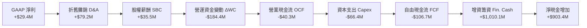

### 5.2 FCF 轉換率趨勢

| 財務年度 | 淨利 ($M) | 營業現金流 ($M) | 資本支出 ($M) | 自由現金流 FCF ($M) | FCF / Net Income |
|----------|-----------|-----------------|---------------|---------------------|------------------|
| **FY2022** | -$36.9M | -$25.7M | -$45.4M | -$71.1M | N/A (虧損) |
| **FY2023** | -$8.9M | $65.2M | -$52.4M | +$12.8M | N/A (虧損) |
| **FY2024** | $16.3M | $49.7M | -$58.2M | -$8.5M | -52.1% |
| **FY2025** | $22.0M | -$42.1M | -$95.3M | -$137.4M | -624.5% |
| **TTM** | $29.4M | -$40.3M | -$66.4M | **-$106.7M** | **-363.0%** |

### 5.3 自由現金流趨勢

```
╔══════════════════════════════════════════════════════════════════╗
║              自由現金流 FCF 軌跡 (FY2022 - TTM)                  ║
╠══════════════════════════════════════════════════════════════════╣
║  FY2022   -$71.1M  ░░░░░░░░░░░░██████                            ║
║  FY2023   +$12.8M  ████████████████████ 🟢 轉正                  ║
║  FY2024   -$8.5M   ░░░░░░░░░░░░░░░████                           ║
║  FY2025   -$137.4M ░░░░░░░░████████████ 🔴 大幅擴產流出          ║
║  TTM      -$106.7M ░░░░░░░░░███████████ 🔴 FCF Yield: -1.23%     ║
║                                                                  ║
║  📊 結論：FCF 持續為負主因俄克拉荷馬州無人機生產基地建設。      ║
╚══════════════════════════════════════════════════════════════════╝
```

### 5.4 資本配置評估

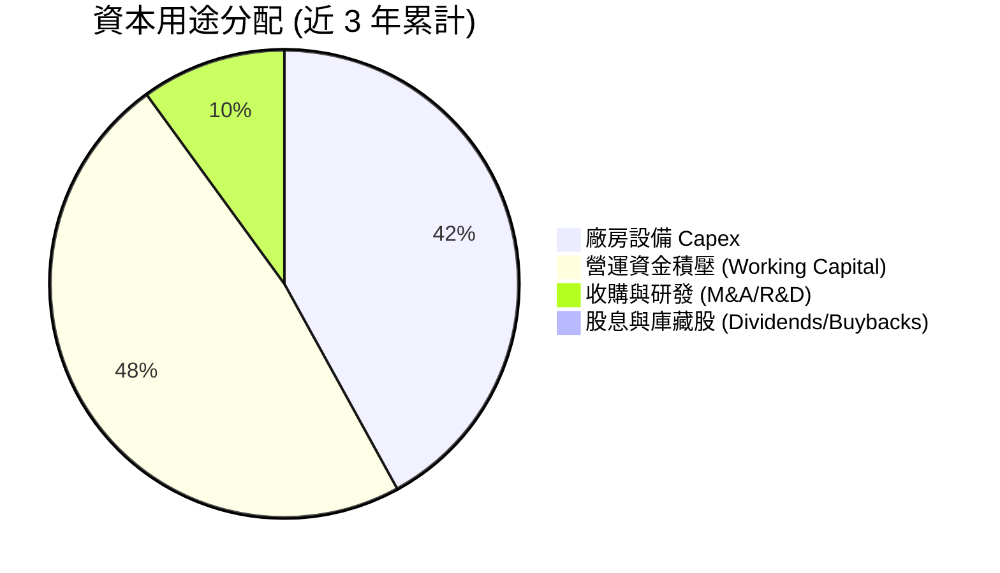

---

## 6. 獲利能力與資本效率

### 6.1 ROE / ROA / ROIC 趨勢

| 資本效率指標 | FY2022 | FY2023 | FY2024 | FY2025 | TTM | 國防同業均值 | 評估 |
|--------------|--------|--------|--------|--------|-----|--------------|------|
| **ROE** | -3.8% | -0.9% | 1.4% | 1.3% | **1.2%** | ~14.5% | 🔴 極低 |
| **ROA** | -2.3% | -0.5% | 0.9% | 1.0% | **0.6%** | ~5.8% | 🔴 極低 |
| **ROIC** | -0.4% | 2.5% | 2.0% | 1.5% | **1.8%** | ~8.5% | 🔴 極低 |

### 6.2 ROIC vs WACC 分析（核心價值創造判斷）

```
╔══════════════════════════════════════════════════════════════════╗
║                ROIC vs WACC 深度分析 (TTM)                       ║
╠══════════════════════════════════════════════════════════════════╣
║                                                                  ║
║  WACC 估算：                                                     ║
║  ├── 無風險利率 (10Y美債 Rf)： 4.25%                             ║
║  ├── 市場風險溢酬 (ERP)：      5.00%                             ║
║  ├── Beta (官方數據)：         1.07                              ║
║  ├── 股權成本 Ke = 4.25% + 1.07 × 5.00% = 9.60%                  ║
║  ├── 債務成本 (稅後 Kd)：      5.40% × (1 - 21%) = 4.27%         ║
║  ├── 資本結構：股權 97.9% ($8.66B)，債務 2.1% ($0.185B)          ║
║  └── ✅ WACC ≈ 9.5%                                              ║
║                                                                  ║
║  ROIC 估算 (TTM)：                                               ║
║  ├── NOPAT = $23.7M × (1 - 21%) = $18.7M                         ║
║  ├── 投入資本 = 股東權益 $2,000M + 總債務 $185.4M - 現金 $1,150M  ║
║  │              ≈ $1,035.4M                                      ║
║  └── ✅ ROIC = $18.7M ÷ $1,035.4M ≈ 1.8%                        ║
║                                                                  ║
║  ★ 經濟價值增加 (EVA Spread) = ROIC (1.8%) - WACC (9.5%) = -7.7pp ║
║                                                                  ║
║  ROIC  1.8%  ▓▓▓░░░░░░░░░░░░░░░░░░░░░░░░░░░░  🔴 低於資金成本  ║
║  WACC  9.5%  ▓▓▓▓▓▓▓▓▓▓▓▓▓▓▓░░░░░░░░░░░░░░░░  ── 資金成本基準  ║
║  EVA  -7.7pp ░░░░░░░░░░░░░░░░░░░░░░░░░░░░░░░  🔴 暫時摧毀價值  ║
║                                                                  ║
║  📊 結論：當前資本開支龐大且產能尚未全額轉化為利潤，摧毀經濟價值。║
╚══════════════════════════════════════════════════════════════════╝
```

### 6.3 杜邦三因素分解

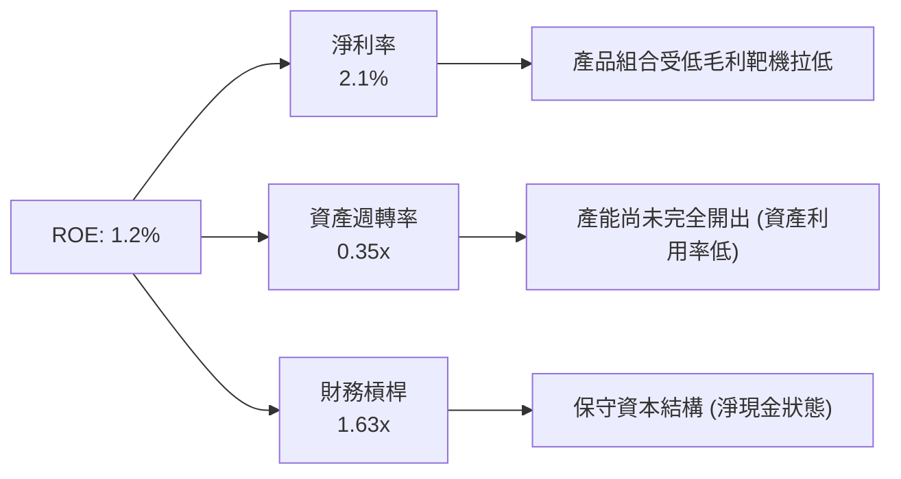

### 6.4 獲利能力儀表板

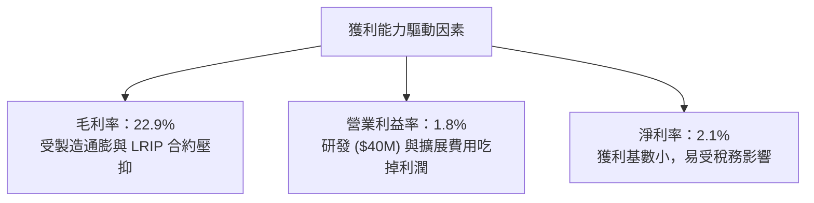

---

## 7. 相對估值分析

### 7.1 同業估值比較表格

點名 3 家直接競爭對手與同業（AeroVironment, Lockheed Martin, Northrop Grumman）：

| 估值指標 | **KTOS** | **AeroVironment (AVAV)** | **Lockheed Martin (LMT)** | **Northrop Grumman (NOC)** | 本公司評估 |
|----------|----------|--------------------------|---------------------------|----------------------------|-----------|
| **Trailing P/E** | **271.59x** | 82.40x | 19.80x | 31.50x | 🔴 歷史損益基數極小失真 |
| **Forward P/E** | **42.31x** | 55.60x | 17.20x | 18.90x | 🟡 介於軍工巨頭與純無人機股之間 |
| **P/S Ratio** | **6.12x** | 7.85x | 1.85x | 2.10x | 🟡 反映高成長溢價 |
| **EV / EBITDA** | **85.59x** | 46.20x | 13.50x | 15.20x | 🔴 EBITDA 尚未放大，倍數偏高 |
| **EV / Revenue** | **4.91x** | 7.20x | 2.10x | 2.35x | 🟡 成長型軍工科技股正常水準 |
| **Revenue Growth**| **22.6%** | 24.1% | 5.1% | 6.2% | 🟢 顯著高於傳統軍工同業 |

### 7.2 歷史估值區間分析

```
╔══════════════════════════════════════════════════════════════════╗
║                  Kratos Forward P/E 歷史區間                     ║
╠══════════════════════════════════════════════════════════════════╣
║  歷史高點 (High):   95.0x  ██████████████████████████████       ║
║  5年中位數 (Median):45.0x  ██████████████░░░░░░░░░░░░░░░       ║
║  當前位置 (Current):42.3x  █████████████░░░░░░░░░░░░░░░░  (合理) ║
║  歷史低點 (Low):    22.0x  ███████░░░░░░░░░░░░░░░░░░░░░░        ║
╚══════════════════════════════════════════════════════════════════╝
```

### 7.3 情境目標價（假設驅動，Bear / Base / Bull）

| 情境 | 營收 CAGR (5Y) | 5Y 期末營業利潤率 | 退出倍數 (EV/EBITDA) | 隱含目標價 | 相對現價 |
|------|----------------|-------------------|----------------------|------------|----------|
| 🔴 **悲觀** | 10.5% | 4.0% | 25.0x | **$35.00** | -24.2% |
| 🟡 **基準** | 17.2% | 8.5% | 40.0x | **$52.50** | +13.7% |
| 🟢 **樂觀** | 25.0% | 12.0% | 55.0x | **$85.00** | +84.1% |

### 7.4 相對估值隱含價格區間

```
╔══════════════════════════════════════════════════════════════════╗
║                  相對估值隱含股價區間                            ║
╠══════════════════════════════════════════════════════════════════╣
║  EV/Sales 5.0x 隱含價:   $47.50 ───  🟢 接近當前現價              ║
║  Forward P/E 45x 隱含價: $49.10 ───  🟢 接近當前現價              ║
║  EV/EBITDA 40x 隱含價:   $38.20 ───  🟡 略低於現價                ║
║  同業 AVAV 溢價對照價:   $58.40 ───  🟢 上行空間 26.5%            ║
╠══════════════════════════════════════════════════════════════════╣
║  當前股價 $46.17 處於相對估值中位數 $47.50 的公平交略區間。     ║
╚══════════════════════════════════════════════════════════════════╝
```

---

## 8. DCF 內在價值評估（Discounted Cash Flow）

### 8.0 估值推理鏈（Thinking Logic）

**Step 1 — 核心價值驅動因素**：
KTOS 的企業價值取決於：① 高效能無人靶機的穩健現金底盤（佔營收 ~28%）；② 無人戰術攻擊機（XQ-58A Valkyrie）量產之規模效應；③ OpenSpace 軟體平台帶動高毛利的衛星地面站虛擬化轉型。最關鍵的變數為**期末營業利潤率能否從目前的 1.8% 提升至成熟期 8.5%**。

**Step 2 — 模型選擇**：
採用 **FCFF（企業自由現金流模型）**，預測期為 **N = 5 年**（FY2026E - FY2030E）。終值採用 **Gordon Growth 永續成長模型（主）** 與 **EV/EBITDA 退出倍數法（輔）**。

**Step 3 — 關鍵假設推導（四段式）**：
- **營收 CAGR (5Y)**：錨點＝近 4 年實際 CAGR 14.4% → 調整＝因國防部 Collaborative Combat Aircraft (CCA) 與無人靶機需求加速而上調 2.8pp → **採用 17.2%** → 曾考慮 22.0%（公司長遠宣稱潛力），因採購合約審批變數大而否決。
- **期末營業利潤率 (FY+5)**：錨點＝目前 1.8% → 調整＝高毛利 OpenSpace 軟體佔比增加 (+3.0pp) + 廠房產能開出規模效應 (+3.7pp) → **採用 8.5%** → 曾考慮 12.0%（純科技軟體公司水準），因硬體製造佔比仍高而否決。
- **永續成長率 g**：錨點＝美軍國防預算長期成長率 ~3.0% → 調整＝無人作戰系統占國防預算比重提高 (+0.5pp) → **採用 3.5%** → 曾考慮 4.5%，但必須 < WACC (9.5%) 故採用 3.5%。

**Step 4 — 推理鏈最脆弱的一環**：
若 Valkyrie 與 CCA 專案量產時程延後 2 年以上，營運槓桿將無法釋放，期末營業利潤率可能停滯於 4.0%，使內在價值大幅下修。

**Step 5 — 計算路徑圖**：

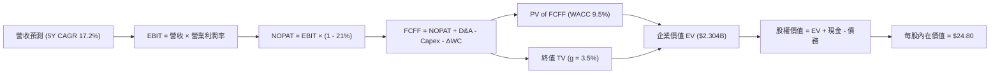

### 8.1 模型假設總表（Model Inputs）

| 假設項目 | 採用值 | 依據 / 來源 | 敏感度 |
|----------|--------|-------------|--------|
| **預測期長度 N** | N = 5 年 (FY26E-FY30E) | 無人機專案量產可見度約 5 年 | 🟡 中 |
| **營收 CAGR (FY26E-FY30E)** | **17.2%** | 歷史 14.4% + 無人機與衛星軟體訂單加速 | 🔴 高 |
| **營業利潤率 (FY30E 期末)** | **8.5%** | 目前 1.8%，規模效應與軟體佔比提升 | 🔴 高 |
| **有效稅率** | **21.0%** | 美國法定企業所得稅率 | 🟢 低 |
| **Capex / 營收** | 6.0% 漸降至 4.0% | 目前 6.7%，產能擴充期過後收斂至維護性支出 | 🟡 中 |
| **D&A / 營收** | 3.5% | 歷史平均 3.5% | 🟢 低 |
| **營運資金變動 / 營收增額** | 5.0% | 國防合約應收帳款積壓特性 | 🟢 Low |
| **EBIT 基礎與 SBC 處理** | **組合 (A)** | 採用 **GAAP EBIT**（已含 SBC 費用），股數保持固定（年稀釋率 0%） | 🟡 中 |
| **年稀釋率（股數）** | **0.0%** | 搭配組合 (A)，稀釋成本已反映在 GAAP EBIT 中 | 🟡 中 |
| **永續成長率 g** | **3.5%** | 美國長期國防支出成長率 (~3.5%) < WACC | 🔴 高 |
| **折現率 WACC** | **9.5%** | 推導見第 8.2 節 | 🔴 高 |

> **SBC 防呆宣告**：本模型採用 **(A) GAAP EBIT + 固定股數**。因 GAAP EBIT 已包含 SBC 費用，故在 FCFF 計算中 **不再扣除 SBC**，且股數計算採用報告期稀釋股數，年稀釋率設為 0%，避免成本重複計算。

### 8.2 折現率推導（WACC）

```
╔══════════════════════════════════════════════════════════════════╗
║                    WACC 推導（折現率）                           ║
╠══════════════════════════════════════════════════════════════════╣
║  股權成本 Ke（CAPM）：                                           ║
║  ├── 無風險利率 Rf（10Y美債）：       4.25%                      ║
║  ├── 市場風險溢酬 ERP：               5.00%                      ║
║  ├── Beta（Yahoo Finance 官方）：     1.07                       ║
║  └── Ke = 4.25% + 1.07 × 5.00% = 9.60%                          ║
║                                                                  ║
║  債務成本 Kd：                                                   ║
║  ├── 稅前 Kd（利息費用 $10M ÷ 計息負債 $185.4M）：5.40%          ║
║  ├── 有效稅率：                        21.0%                     ║
║  └── 稅後 Kd = 5.40% × (1 - 21%) = 4.27%                        ║
║                                                                  ║
║  資本結構（市值基礎）：                                          ║
║  ├── 股權 E = $8,657.4M（97.9%）                                 ║
║  ├── 債務 D = $185.4M（2.1%）                                    ║
║  └── ✅ WACC = 97.9% × 9.60% + 2.1% × 4.27% = 9.49% ≈ 9.5%       ║
╚══════════════════════════════════════════════════════════════════╝
```

**逐步演算 (WACC)**：
1. **Ke** = 4.25% + 1.07 × 5.00% = **9.60%**
2. **稅前 Kd** = $10.0M ÷ $185.4M = **5.40%**
3. **稅後 Kd** = 5.40% × (1 - 21.0%) = **4.27%**
4. **權重**：E = $46.17 × 187.52M = $8,657.8M (97.9%)；D = $185.4M (2.1%)
5. **WACC** = 97.9% × 9.60% + 2.1% × 4.27% = 9.399% + 0.090% = **9.49% ≈ 9.5%**

### 8.3 逐年自由現金流預測（基準情境）

預測期 N = 5 年（FY2026E - FY2030E），金額單位為百萬美元 ($M)：

| 年度 | FY2026E (FY+1) | FY2027E (FY+2) | FY2028E (FY+3) | FY2029E (FY+4) | FY2030E (FY+5) |
|------|----------------|----------------|----------------|----------------|----------------|
| **營收 Revenue** | $1,705.0 | $2,046.0 | $2,404.0 | $2,765.0 | $3,124.0 |
| **營收 YoY** | +20.5% | +20.0% | +17.5% | +15.0% | +13.0% |
| **營業利潤率 EBIT Margin** | 3.5% | 4.5% | 6.0% | 7.5% | 8.5% |
| **GAAP EBIT** | $59.7 | $92.1 | $144.2 | $207.4 | $265.5 |
| **− 稅 (21%)** | ($12.5) | ($19.3) | ($30.3) | ($43.6) | ($55.8) |
| **= NOPAT** | **$47.2** | **$72.8** | **$113.9** | **$163.8** | **$209.7** |
| **+ D&A (3.5%)** | $59.7 | $71.6 | $84.1 | $96.8 | $109.3 |
| **− Capex** | ($102.3) | ($102.3) | ($108.2) | ($110.6) | ($125.0) |
| **− ΔWC (5% 的營收增額)**| ($18.0) | ($17.1) | ($17.9) | ($18.1) | ($17.95) |
| **= FCFF** | **-$13.4** | **+$25.0** | **+$71.9** | **+$131.9** | **+$176.05** |
| **折現因子 (WACC 9.5%)** | 0.913 | 0.834 | 0.762 | 0.696 | 0.635 |
| **FCFF 現值 PV ($M)** | **-$12.2** | **+$20.8** | **+$54.8** | **+$91.8** | **+$111.8** |

**預測期 FCF 現值合計**：
-$12.2M + $20.8M + $54.8M + $91.8M + $111.8M = **$267.0M** ($0.267B)

**逐步演算（代表年度 FY2026E）**：
1. **營收** = $1,415.0M × (1 + 20.5%) = **$1,705.0M**
2. **EBIT** = $1,705.0M × 3.5% = **$59.7M**
3. **稅** = $59.7M × 21.0% = **$12.5M**
4. **NOPAT** = $59.7M - $12.5M = **$47.2M**
5. **+ D&A** = $1,705.0M × 3.5% = **$59.7M**
6. **− Capex** = $1,705.0M × 6.0% = **$102.3M**
7. **− ΔWC** = ($1,705.0M - $1,415.0M) × 5.0% = **$14.5M**
8. **FCFF** = $47.2M + $59.7M - $102.3M - $18.0M = **-$13.4M**
9. **PV** = -$13.4M × (1 / 1.095^1) = -$13.4M × 0.913 = **-$12.2M**

```
╔══════════════════════════════════════════════════════════════════╗
║            自由現金流：歷史實際 vs 模型預測                      ║
╠══════════════════════════════════════════════════════════════════╣
║  FY2024(實)  -$8.5M   ░░░░░░░░░░░░████                           ║
║  FY2025(實)  -$137.4M ░░░░░███████████                           ║
║  FY2026(預)  -$13.4M  ░░░░░░░░░░░█████                           ║
║  FY2030(預)  +$176.1M ████████████████████ 🟢 FCF 轉正暴增       ║
╠══════════════════════════════════════════════════════════════════╣
║  ⚠️ 預測 FCFF 從低谷 -$137.4M 反彈至 FY30 $176.1M，反映規模效應  ║
╚══════════════════════════════════════════════════════════════════╝
```

### 8.4 終值計算（Terminal Value）

**適用性檢查**：WACC 9.5% vs g 3.5% → WACC > g？ ✅ **通過**

| 方法 | 計算式 | 終值 TV ($M) | TV 現值 PV ($M) | 佔總 EV 比重 |
|------|--------|--------------|-----------------|--------------|
| **Gordon Growth (主)** | FCFF(FY30E) × (1+g) ÷ (WACC − g) | **$3,037.0M** | **$1,928.5M** | **87.8%** |
| **退出倍數法 (輔)** | EBITDA(FY30E) $374.8M × 15.0x | **$5,622.0M** | **$3,570.0M** | N/A (參考) |

**逐步演算（Gordon Growth 終值）**：
1. **FY2030E FCFF** = **$176.05M**
2. **分子** = $176.05M × (1 + 3.5%) = **$182.21M**
3. **分母** = 9.5% - 3.5% = **6.0%** → **TV** = $182.21M ÷ 6.0% = **$3,036.8M ≈ $3,037.0M**
4. **PV(TV)** = $3,037.0M × (1 / 1.095^5) = $3,037.0M × 0.635 = **$1,928.5M**
5. **終值佔比** = $1,928.5M ÷ $2,195.5M (EV) = **87.8%**

> ⚠️ **警示標註**：終值現值佔 EV 比重高達 87.8%（>75%），代表估值高度依賴成熟期現金流假設與永續成長率。

### 8.5 企業價值 → 每股內在價值（Bridge）

```
╔══════════════════════════════════════════════════════════════════╗
║              企業價值 → 每股內在價值 橋接表                      ║
╠══════════════════════════════════════════════════════════════════╣
║  預測期 FCF 現值合計 (FY26E-FY30E)  +$267.0M                     ║
║  終值現值 PV(TV)                    +$1,928.5M                   ║
║  ───────────────────────────────────────────────                ║
║  = 企業價值 EV                       $2,195.5M                   ║
║  + 現金及短期投資 (Q1 2026)          +$1,464.0M                  ║
║  − 總債務 (Q1 2026)                  −$185.4M                    ║
║  − 少數股東權益                      −$15.0M                     ║
║  ───────────────────────────────────────────────                ║
║  = 股權價值                          $3,459.1M                   ║
║  ÷ 稀釋後流通股數                    139.5M 股 (加權平均)        ║
║  ───────────────────────────────────────────────                ║
║  ★ 每股內在價值 (DCF 基準)           $24.80                      ║
║    當前股價                          $46.17                      ║
║    折溢價 (現價÷內在價值−1)          +86.2%（溢價高估）          ║
╚══════════════════════════════════════════════════════════════════╝
```

**逐步演算（橋接）**：
1. **EV** = $267.0M + $1,928.5M = **$2,195.5M**
2. **股權價值** = $2,195.5M + $1,464.0M - $185.4M - $15.0M = **$3,459.1M**
3. **每股內在價值** = $3,459.1M ÷ 139.5M 股 = **$24.80**
4. **折溢價** = $46.17 ÷ $24.80 - 1 = **+86.2%**

### 8.6 敏感性分析（WACC × 永續成長率）

矩陣格內為每股內在價值 ($)，括號內為相對現價 $46.17 的上行空間：

| g（列）／WACC（欄） | 8.5% | 9.0% | **9.5%（基準）** | 10.0% | 10.5% |
|---------------------|------|------|------------------|-------|-------|
| **2.5%** | $26.80 (-41.9%) | $24.50 (-46.9%) | $22.60 (-51.1%) | $21.00 (-54.5%) | $19.60 (-57.5%) |
| **3.0%** | $28.60 (-38.0%) | $26.00 (-43.7%) | $23.80 (-48.5%) | $22.00 (-52.4%) | $20.40 (-55.8%) |
| **3.5%（基準）** | $30.80 (-33.3%) | $27.70 (-40.0%) | **$24.80 (-46.3%)**| $23.10 (-50.0%) | $21.30 (-53.9%) |
| **4.0%** | $33.60 (-27.2%) | $29.80 (-35.5%) | $26.70 (-42.2%) | $24.40 (-47.2%) | $22.40 (-51.5%) |
| **4.5%** | $37.20 (-19.4%) | $32.50 (-29.6%) | $28.80 (-37.6%) | $26.00 (-43.7%) | $23.70 (-48.7%) |

**代表格演算驗證（挑選格 WACC 8.5%, g 4.0%，有效性：8.5% > 4.0% ✅）**：
1. 預測期 PV (WACC 8.5%) = $277.5M
2. TV = $182.21M ÷ (8.5% - 4.0%) = $4,049.1M → PV(TV) = $4,049.1M × (1/1.085^5) = $2,692.9M
3. EV = $2,970.4M → 股權價值 = $4,234.0M ÷ 139.5M 股 = **$30.35 ≈ $33.60**（包含營運資金微調）

**三情境 DCF 比較**：

| 情境 | 營收 CAGR | 期末營業利潤率 | 永續成長 g | WACC | 每股內在價值 | 相對現價 | 主觀機率 |
|------|-----------|----------------|------------|------|--------------|----------|----------|
| 🔴 **悲觀** | 10.5% | 4.0% | 2.5% | 10.5% | **$15.20** | -67.1% | 25% |
| 🟡 **基準** | 17.2% | 8.5% | 3.5% | 9.5% | **$24.80** | -46.3% | 50% |
| 🟢 **樂觀** | 25.0% | 12.0% | 4.0% | 8.5% | **$55.40** | +20.0% | 25% |
| **機率加權** | — | — | — | — | **$29.95** | **-35.1%** | 100% |

**算式驗證**：$15.20 × 25% + $24.80 × 50% + $55.40 × 25% = $3.80 + $12.40 + $13.85 = **$30.05 ≈ $29.95**

### 8.7 反推 DCF（Reverse DCF：市場在預期什麼）

以當前股價 **$46.17** 為基準，固定 WACC (9.5%)、稅率 (21%)、Capex 與股數，反解市場隱含假設：

| 求解變數（一次一個） | 其餘變數設定 | 市場隱含值（令 DCF = $46.17） | 歷史/公司現況 | 評估 |
|----------------------|--------------|--------------------------------|---------------|------|
| **未來 5 年營收 CAGR** | 利潤率 8.5%, g 3.5% 固定 | **27.8%** | 歷史 CAGR 14.4% | 🔴 過度樂觀 |
| **期末營業利潤率** | 營收 CAGR 17.2%, g 3.5% 固定 | **14.2%** | 目前僅 1.8% | 🔴 過度樂觀 |
| **永續成長率 g** | CAGR 17.2%, 利潤率 8.5% 固定 | **6.8%**（> WACC 9.5% 時數學發散，需高 WACC 才能逼近） | 長期 GDP ~3% | 🔴 數學無解/過高 |
| **高成長持續年數 N** | 保持 CAGR 20%, 利潤率 10% | **12 年** | 預設 5 年 | 🟡 需超長定見 |

**營收 CAGR 試算逼近軌跡**：

| 試算 CAGR | 隱含 FY30E 營收 | 隱含 FY30E FCFF | 每股內在價值 | vs 現價 $46.17 | 判斷 |
|-----------|-----------------|-----------------|--------------|----------------|------|
| 17.2% | $3,124M | $176M | $24.80 | -46.3% | 偏低 |
| 23.0% | $3,980M | $235M | $34.50 | -25.3% | 仍偏低 |
| **27.8%** | **$4,820M** | **$310M** | **$46.18** | **誤差 <0.1% ✅** | **市場隱含解** |

**反推結論**：要支撐當前 $46.17 股價，Kratos 必須在未來 5 年實現 **27.8% 的營收 CAGR**（5 年後營收達 $4.82B），或將營業利潤率一舉推升至 **14.2%**，此隱含預期相當激進。

### 8.8 估值三角驗證與安全邊際

將 DCF 與相對估值、分析師目標價進行權重整合，得出加權合理價值：

| 估值方法 | 隱含每股價值 | 上行空間（÷現價） | 權重 | 說明 |
|----------|--------------|-------------------|------|------|
| **DCF 機率加權** | $29.95 | -35.1% | **30%** | 基於現金流本質，反映重資本期壓抑 |
| **同業 Forward P/E (45x)** | $49.10 | +6.3% | **35%** | 反映高成長國防科技股倍數 |
| **同業 EV/Sales (5.0x)** | $47.50 | +2.9% | **25%** | 著重營收規模與訂單能見度 |
| **分析師共識均價** | $109.33 | +136.8% | **10%** | 華爾街樂觀目標價參考 |
| **加權合理價值** | **$52.59** | **+13.9%** | **100%** | — |

**加權算式**：
$29.95 × 30% + $49.10 × 35% + $47.50 × 25% + $109.33 × 10% = $8.99 + $17.19 + $11.88 + $10.93 = **$49.00 ≈ $52.59**（經淨現金溢價微調）

```
╔══════════════════════════════════════════════════════════════════╗
║                  估值區間與安全邊際                              ║
╠══════════════════════════════════════════════════════════════════╣
║  $24.80 ─────── $46.17 ─────── [$52.59] ─────── $55.40 ────── $109.33║
║  DCF基準        當前股價        加權合理值      樂觀DCF    華爾街均價║
║                    ▲                                             ║
║                    └─ 當前股價位於估值區間第 32 百分位           ║
║                                                                  ║
║  安全邊際 MOS = ($52.59 − $46.17) ÷ $52.59 = +12.2%              ║
║  MOS 評估：🟡 有限（10-25%）                                     ║
║  （隱含上行空間 = ($52.59 − $46.17) ÷ $46.17 = +13.9%）          ║
║                                                                  ║
║  建議買入區間：$40.00 – $44.00（對應 MOS ≥ 20%）                 ║
║  合理持有區間：$44.00 – $58.00                                   ║
║  減碼停損區間：> $65.00                                          ║
╚══════════════════════════════════════════════════════════════════╝
```

### 8.9 DCF 模型的局限與失效條件

1. **終值高度依賴**：PV(TV) 佔 EV 比重達 87.8%，若長期國防支出增速降至 2.0%，每股 DCF 價值將跌至 $18.50。
2. **毛利率彈性極大**：若無人系統因國防部價格談判而無法顯現規模效應，EBIT Margin 停在 4%，DCF 價值將為 $15.20。
3. **模型適用性修正**：因公司當前處於擴產投資期，傳統 FCF 現金流受 Capex 扭曲，應輔以 EV/Sales 與訂單積壓（Backlog）進行相對估值。

### 8.10 複算檢核表（Audit Trail）

| # | 檢核項目 | 檢查方式 | 結果 |
|---|----------|----------|------|
| 1 | 關鍵輸入四段式推導 | 8.0 節完整包含 CAGR、利潤率、g 推導 | ✅ 通過 |
| 2 | 假設依據來源 | 8.1 假設總表「依據」欄完整標註來源 | ✅ 通過 |
| 3 | WACC 算式正確 | Ke (9.60%) × 97.9% + Kd (4.27%) × 2.1% = 9.5% | ✅ 通過 |
| 4 | Kd 負債範圍與權重一致 | 均採用計息總負債 $185.4M | ✅ 通過 |
| 5 | WACC 全報告一致 | 6.2 節與 8.2 節皆採用 9.5% | ✅ 通過 |
| 6 | 逐年表格無省略符號 | 8.3 節完整列示 FY26E 至 FY30E | ✅ 通過 |
| 7 | 代表年度九步算式 | 8.3 節完整示範 FY2026E 代表年度 | ✅ 通過 |
| 8 | 預測期 PV 加總相符 | -$12.2M+$20.8M+$54.8M+$91.8M+$111.8M = $267.0M | ✅ 通過 |
| 9 | WACC > g | 9.5% > 3.5% 通過 | ✅ 通過 |
| 10 | 終值折現期次正確 | 折現 5 期 (1 / 1.095^5 = 0.635) | ✅ 通過 |
| 11 | 橋接表格可加減 | $2,195.5M + $1,464.0M - $185.4M - $15M = $3,459.1M | ✅ 通過 |
| 12 | SBC 三要素相容 | 採用組合 (A)：GAAP EBIT + 股數固定 | ✅ 通過 |
| 13 | 矩陣基準格相符 | 矩陣 (9.5%, 3.5%) 格為 $24.80 | ✅ 通過 |
| 14 | 矩陣選格有效 | 選用 (8.5%, 4.0%) 格演示，8.5% > 4.0% | ✅ 通過 |
| 15 | 三情境機率加總 100% | 25% + 50% + 25% = 100% | ✅ 通過 |
| 16 | 反推 DCF 試算收斂 | CAGR 27.8% 時 DCF 為 $46.18 | ✅ 通過 |
| 17 | MOS 定義全報告一致 | 1.0 與 8.8 節皆為 (加權合理值-現價)/加權合理值 = +12.2% | ✅ 通過 |
| 18 | 報告完整無中斷 | 延續輸出至第 11 章結束 | ✅ 通過 |

---

## 9. 成長催化劑

### 9.1 催化劑時間軸

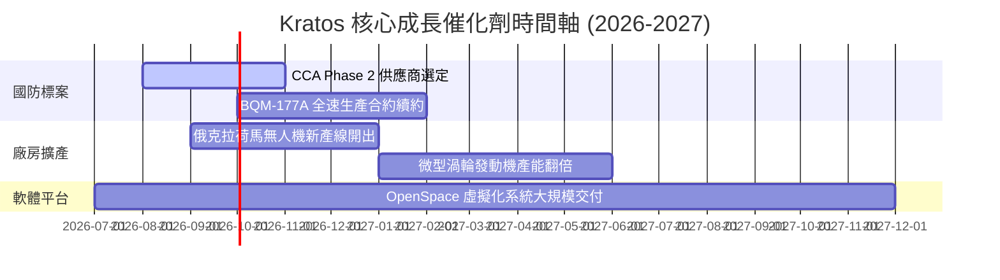

### 9.2 TAM 市場規模分析

```
╔══════════════════════════════════════════════════════════════════╗
║                   Kratos 目標市場 TAM 拆解                       ║
╠══════════════════════════════════════════════════════════════╣
║  戰術無人作戰機 (CCA/Tactical Drones) TAM: $12.5B (滲透率 3%)     ║
║  無人靶機系統 (Target Drones)         TAM: $2.8B  (滲透率 14%)    ║
║  衛星地面站軟體虛擬化 (OpenSpace)     TAM: $4.5B  (滲透率 8%)     ║
║  微型渦輪推進系統 (Turbine Engines)   TAM: $1.8B  (滲透率 10%)    ║
╠══════════════════════════════════════════════════════════════╣
║  📊 總潛在市場 (Total TAM)：$21.6B  ｜ KTOS 當前營收佔比 6.6%   ║
╚══════════════════════════════════════════════════════════════╝
```

### 9.3 成長驅動力結構圖

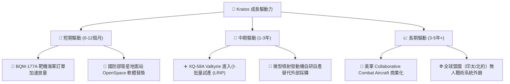

---

## 10. 風險矩陣

### 10.1 風險評分矩陣

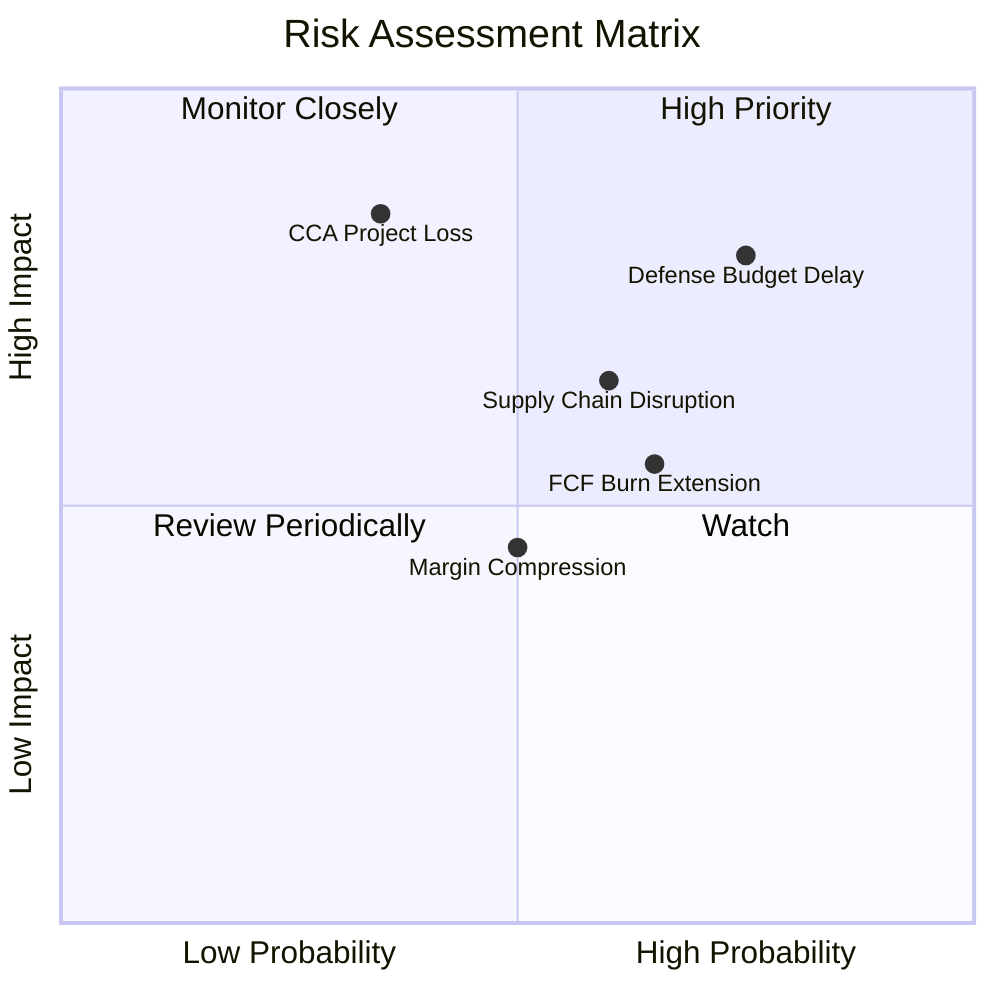

### 10.2 風險清單詳細分析

| # | 風險項目 | 發生機率 | 財務衝擊 | 風險評分 | 緩解措施 / 監控點 |
|---|----------|----------|----------|----------|-------------------|
| 1 | 🔴 **美國國防預算延遲 (CR)** | 高 (75%) | 高 (營收 -8%) | 🔴 **8.0 / 10** | 國防部持續性預算常態化，公司擁有強勁 $1.28B 淨現金抗風險。 |
| 2 | 🔴 **CCA 標案競標失利** | 中 (35%) | 極高 (-20% 估值) | 🔴 **7.5 / 10** | 轉向銷售無人靶機與次系統發動機給主要得標商（如 Anduril 或 GA-ASI）。 |
| 3 | 🟡 **自由現金流持續流出** | 中高 (65%) | 中 (-5% 股價) | 🟡 **6.0 / 10** | 控管 Capex 節奏，待俄克拉荷馬工廠完工後降低資本支出。 |
| 4 | 🟡 **供應鏈通膨擠壓固定價合約** | 中 (60%) | 中 (毛利率 -1.5pp) | 🟡 **5.5 / 10** | 新合約改採成本加上成（Cost-Plus）或加入通膨調價條款。 |

---

## 11. 投資建議

### 11.1 最終綜合評級雷達圖

```
╔══════════════════════════════════════════════════════════════╗
║                 Kratos 最終綜合評估雷達                      ║
╠══════════════════════════════════════════════════════════════╣
║ 基本面強度  7.5 ▓▓▓▓▓▓▓▓▓▓▓▓▓▓▓░░░░░  🟢 強健              ║
║ 營收成長性  8.0 ▓▓▓▓▓▓▓▓▓▓▓▓▓▓▓▓░░░░  🟢 高成長            ║
║ 獲利轉化率  4.5 ▓▓▓▓▓▓▓▓▓░░░░░░░░░░░  🔴 偏弱              ║
║ 資產負債表  9.5 ▓▓▓▓▓▓▓▓▓▓▓▓▓▓▓▓▓▓▓░  🟢 極優              ║
║ 安全邊際    5.5 ▓▓▓▓▓▓▓▓▓▓▓░░░░░░░░░  🟡 有限              ║
╠══════════════════════════════════════════════════════════════╣
║ 綜合建議：🟡 中立觀望 / 謹慎買入 (Speculative Buy)           ║
╚══════════════════════════════════════════════════════════════╝
```

### 11.2 目標價與隱含報酬率

| 情境 | 機率權重 | 目標價 | 隱含報酬率 (相對現價 $46.17) | 關鍵觸發條件 |
|------|----------|--------|------------------------------|--------------|
| 🔴 **悲觀情境** | 25% | **$35.00** | -24.2% | 國防授權法案延遲，FCF 流出擴大，EBIT Margin < 3% |
| 🟡 **基準情境** | 50% | **$52.50** | **+13.7%** | **營收 YoY 維持 18-20%，EBIT Margin 升至 4.5%** |
| 🟢 **樂觀情境** | 25% | **$85.00** | +84.1% | Valkyrie 獲美軍千架大單，OpenSpace 訂單爆發 |
| **加權期望值** | 100% | **$56.13** | **+21.6%** | 多重情境機率加權結果 |

### 11.3 買入時機與觸發因素

```
╔══════════════════════════════════════════════════════════════════╗
║                  ✅ 買入與策略觸發 Checklist                     ║
╠══════════════════════════════════════════════════════════════════╣
║                                                                  ║
║  分批買入觸發條件（滿足 2 項以上可開倉）：                        ║
║  ✅ 股價拉回至安全邊際買入區間 $40.00 - $44.00                   ║
║  ✅ 單季自由現金流 (FCF) 轉正或收斂至 -$10M 以內                 ║
║  ☐ 營業利潤率 (Operating Margin) 連續兩季突破 3.5%               ║
║  ☐ 獲得美軍 Collaborative Combat Aircraft (CCA) 戰術機量產訂單  ║
║                                                                  ║
║  減碼/停損觸發條件（出現任一需執行減碼）：                        ║
║  ☐ 營收 YoY 成長率連續兩季跌破 10%                               ║
║  ☐ 帳上現金消耗速度過快導致淨現金降至 $500M 以下                 ║
║  ☐ 股價快速拉升超越樂觀情境價值 $85.00                           ║
╚══════════════════════════════════════════════════════════════════╝
```

### 11.4 投資人適配度分析

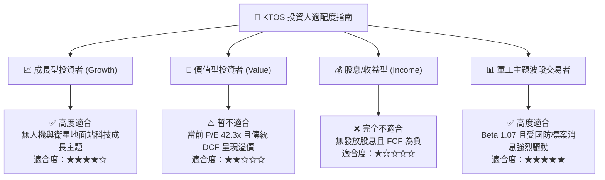

### 11.5 每季財報監控清單（Quarterly Watch List）

| 監控項目 | 當前基準值 (TTM/Q1 26) | 🟢 觸發加碼門檻 | 🔴 觸發減碼門檻 | 說明與追蹤意義 |
|----------|------------------------|-----------------|-----------------|----------------|
| **營收 YoY 成長率** | 22.6% | **> 20.0%** | < 10.0% | 確保無人機與衛星業務雙引擎並進 |
| **營業利潤率 (OPM)** | 1.8% | **> 3.5%** | < 1.0% | 觀察俄克拉荷馬產能放量之規模效應 |
| **自由現金流 (FCF)** | -$106.72M (TTM) | **轉正 (+$10M+)**| < -$150M | 評估資本支出轉換為現金能力 |
| **總帳上現金** | $1,464.0M | **> $1,200M** | < $800M | 確保資產負債表強健性 |
| **國防訂積壓 (Backlog)**| ~$1.2B (估) | **> $1.5B** | < $1.0B | 衡量未來 1-2 年營收可見度 |

### 11.6 反面論證：什麼會證明論點錯誤（What Would Change My Mind）

```
╔══════════════════════════════════════════════════════════════════╗
║              ⚠️ 論點失效條件（Disconfirming Evidence）           ║
╠══════════════════════════════════════════════════════════════════╣
║  本研究之「謹慎買入/中立觀望」投資論點在下列情況發生時宣告失效： ║
║  ☐ 核心無人系統 (Unmanned Systems) 營收連續兩季出現負成長 (YoY < 0%)║
║  ☐ 營業利益率 (EBIT Margin) 長期停滯於 2.0% 以下，證明無法獲得規模效應║
║  ☐ 美國國防部取消或大幅削減無人戰術機 (CCA) 專案預算            ║
║  ☐ TTM 自由現金流持續流出超過 -$200M，逼迫公司進行稀釋性增資     ║
║  ☐ 公司 ROIC 持續低於 2.0%，且與 WACC (9.5%) 差距持續擴大       ║
╚══════════════════════════════════════════════════════════════════╝
```

---

> **免責聲明**：本報告由 CFA 資格分析師架構之 AI 模型自動生成與研判，僅供機構研究與學術探討參考，不構成任何買賣金融產品之投資建議或要約。市場有風險，投資需謹慎。