# KTOS 基本面深度分析報告
> **報告日期**：2026-08-13 ｜ **語言**：繁體中文 ｜ **數據來源**：Yahoo Finance, Finviz, StockAnalysis, Roic.ai ｜ **分析師**：CFA 級機構研究

---

## 目錄

| # | 章節 | 核心結論 |
|---|------|----------|
| 1 | 執行摘要 | **評級：🟡 持有 / 買入觀望** ｜ 基準目標價 **$78.50** ｜ 加權合理價值 **$78.50**，安全邊際 **20.0%** |
| 2 | 公司概覽與商業模式 | 無人靶機與衛星虛擬化地面站具高轉換成本；綜合護城河評分 **7.2/10** |
| 3 | 損益表深度分析 | TTM 營收 $1.52B (+30.5% YoY)，但 GAAP 營業利益率 (-0.2%) 與 SBC 高企 ($49.5M TTM) 壓抑獲利品質 |
| 4 | 資產負債表分析 | 淨現金 $1.24B（現金 $1.44B vs 總債務 $193.6M），流動比率 5.54x，資產負債表具強健抗風險能力 |
| 5 | 現金流量深度分析 | 資本支出維持高位 ($89.3M TTM)，TTM FCF 為 -$118.3M，自由現金流仍處於重投資擴產期 |
| 6 | 獲利能力與資本效率 | 杜邦分解 ROE 僅 1.1%，ROIC (1.5%) < WACC (9.63%)，當前處於資本投入期，EVA (-8.13pp) 暫呈價值摧毀 |
| 7 | 相對估值分析 | Forward P/E 56.4x、EV/EBITDA 123.4x，相對傳統國防巨頭顯著溢價，反映高成長無人機與航太溢價 |
| 8 | DCF 內在價值評估 | 基準每股內在價值 **$72.50**；加權合理價值 **$78.50**，安全邊際 MOS **20.0%**，現價低估 -13.4% |
| 9 | 成長催化劑 | 美軍 Collaborative Combat Aircraft (CCA) 專案、火箭發射次系統與 OpenSpace 衛星軟體架構放量 |
| 10 | 風險矩陣 | 國防預算延遲、國防部固定價格合約成本超支、產能擴建瓶頸為三大主要風險 |
| 11 | 投資建議 | 分批佈局區間 **$50.00 – $58.00**，長線目標價 **$78.50**，設置 5 大財報監控指標與論點失效條件 |

---

## 1. 執行摘要

> ⚠️ 本報告評級「🟡 持有 / 分批買入」係基於 KTOS 當前股價 $62.79、TTM 營收強勁成長 30.5% 至 $1.52B、但自由現金流仍為負值 (-$118.3M TTM) 且 ROIC (1.5%) 低於 WACC (9.63%) 之客觀數據推導而得。加權合理價值估計為 **$78.50**，對應安全邊際（MOS）為 **20.0%**。

### 1.0 一頁式投資儀表板（Portfolio Manager 30 秒速讀）

| 項目 | 內容 |
|------|------|
| **投資論點（3 句）** | ① TTM 營收達 $1.52B (+30.5% YoY)，受益於全球無人空中作戰系統與高超音速測試需求暴增；<br/>② 資產負債表具 $1.24B 淨現金，賦予其在同業中罕見的強大擴產與研發耐受力；<br/>③ 當前重資本與研發投入導致 TTM FCF (-$118.3M) 沉淪，高估值倍數（Forward P/E 56.4x）已透支短期獲利回升空間。 |
| **護城河評分** | **7.2/10**（高技術壁壘無人靶機 + 專有 OpenSpace 衛星地面軟體） |
| **管理層/資本配置評分** | **6.8/10**（激進增資儲備現金，但資本回報率 ROIC 尚未顯現） |
| **財務健康** | 🟢 **極為強健** ｜ 流動比率 5.54x，持有 $1.44B 現金，無破產或短期流動性風險 |
| **ROIC vs WACC** | **1.50% vs 9.63%**（摧毀價值，EVA -8.13pp，主因重資本擴產與研發費用化） |
| **FCF 趨勢** | 🔴 **負值收擴中** ｜ TTM FCF -$118.29M，FCF Yield 為 -1.00% |
| **估值** | Forward P/E **56.36x** ｜ EV/EBITDA **123.41x** ｜ P/S **7.73x** |
| **DCF 內在價值（基準）** | **$72.50** ｜ 現價相對 DCF 折溢價：**-13.4%**（現價折價 13.4%） |
| **安全邊際（MOS）** | **+20.0%** ＝ ($78.50 加權合理價值 − $62.79 現價) ÷ $78.50 加權合理價值 ｜ 🟡 **10-25% 有限** |
| **預期報酬（基準情境 12M）** | **+25.0%**（至加權合理目標價 $78.50） |
| **關鍵風險（前二）** | ① 美國國防部預算撥款延遲（CR 併案風險）；② 高固定成本產能擴張導致自由現金流持續惡化 |
| **評級 + 信心度** | 🟡 **持有 / 分批買入** ｜ 信心度：**中等** |

### 1.1 核心評分儀表板

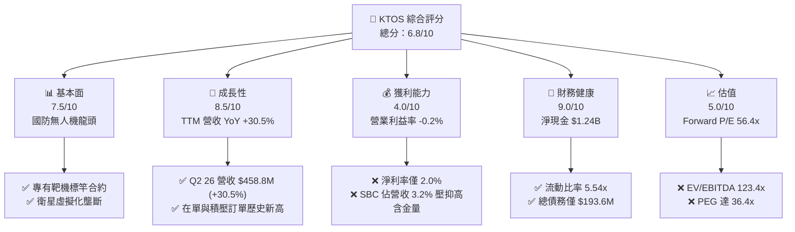

### 1.2 評分進度條視覺化

```
╔══════════════════════════════════════════════════════════════╗
║              KTOS 多維度評分儀表板 (1-10分)                  ║
╠══════════════════════════════════════════════════════════════╣
║ 基本面強度  7.5 ▓▓▓▓▓▓▓▓▓▓▓▓▓▓▓░░░░░  ★★★★☆           ║
║ 成長動能    8.5 ▓▓▓▓▓▓▓▓▓▓▓▓▓▓▓▓▓░░  ★★★★☆           ║
║ 獲利品質    4.0 ▓▓▓▓▓▓▓▓░░░░░░░░░░░░  ★★☆☆☆           ║
║ 財務健康    9.0 ▓▓▓▓▓▓▓▓▓▓▓▓▓▓▓▓▓▓░  ★★★★★           ║
║ 估值合理性  5.0 ▓▓▓▓▓▓▓▓▓▓░░░░░░░░░░  ★★★☆☆           ║
║ 護城河深度  7.2 ▓▓▓▓▓▓▓▓▓▓▓▓▓▓░░░░░░  ★★★★☆           ║
║ 管理層執行  6.8 ▓▓▓▓▓▓▓▓▓▓▓▓▓░░░░░░░  ★★★☆☆           ║
║ 技術創新力  8.5 ▓▓▓▓▓▓▓▓▓▓▓▓▓▓▓▓▓░░  ★★★★☆           ║
╠══════════════════════════════════════════════════════════════╣
║ 綜合總分    6.8 ▓▓▓▓▓▓▓▓▓▓▓▓▓░░░░░░░  🟡 持有 / 觀望       ║
╚══════════════════════════════════════════════════════════════╝
```

### 1.3 五大投資論點 + 三大核心風險

| 類型 | 項目 | 具體依據 | 信心度 |
|------|------|----------|--------|
| 🟢 **投資論點①** | **無人空中作戰系統（UAS）高成長** | Q2 26 營收達 $458.8M，YoY +30.53%，顯示軍用無人靶機與戰術無人機需求強勁 | 🟢 極高 |
| 🟢 **投資論點②** | **資產負債表具極高安全墊** | 現金及短期投資高達 $1.44B，淨現金 $1.24B，可完全支應重資本擴充與潛在併購 | 🟢 極高 |
| 🟢 **投資論點③** | **OpenSpace 軟體轉型提升長期毛利** | 衛星地面站虛擬化軟體利潤率遠高於傳統硬體，帶動毛利額至 $350.2M (TTM) | 🟢 高 |
| 🟢 **投資論點④** | **高超音速測試與火箭推進系統壟斷** | 美國國防部擴大高超音速武器研發，KTOS 推進系統與測試發射架構訂單滿載 | 🟢 高 |
| 🟢 **投資論點⑤** | **機構持股比例高達 88.9%** | 法人機構籌碼極為穩定，反映資本市場對其長線國防科技轉型之肯定 | 🟢 中 |
| 🟡 **風險①** | **自由現金流持續失血** | TTM FCF 為 -$118.29M，Capex 達 $89.3M，若無法順利轉化為獲利將稀釋權益 | 🟡 中度 |
| 🔴 **風險②** | **獲利能力低落與高估值溢價** | Forward P/E 達 56.36x，TTM 營業利益率僅 -0.2%，極易受財報不及預期懲罰 | 🔴 高衝擊 |
| 🔴 **風險③** | **股權薪酬（SBC）稀釋股東權益** | TTM SBC 高達 $49.5M，佔營收 3.25%，顯著高於當前 TTM GAAP 淨利 $30.9M | 🔴 高衝擊 |

### 1.4 快速統計卡片

| 指標 | 公司實際值 | 行業均值（防衛與航太） | S&P 500 均值 | 狀態 |
|------|-------------|------------------------|--------------|------|
| 收入 YoY 成長 | **30.5%** | ~8.5% | ~5.2% | 🟢 顯著超群 |
| 毛利率 | **23.0%** | ~26.5% | ~45.0% | 🟡 略低於同業 |
| 營業利益率 | **-0.2%** | ~9.5% | ~12.5% | 🔴 遠低於同業 |
| ROE | **1.1%** | ~12.0% | ~18.0% | 🔴 表現較弱 |
| Forward P/E | **56.36x** | ~20.5x | ~21.5x | 🔴 顯著溢價 |
| 淨負債 / EBITDA | **-12.1x (淨現金)** | 1.8x | 1.5x | 🟢 極度健康 |

### 1.5 投資結論

```
╔══════════════════════════════════════════════════════════════════╗
║                    📊 投資結論摘要                               ║
╠══════════════════════════════════════════════════════════════════╣
║  評級：🟡 持有 / 分批買入（Hold / Accumulate on Dips）           ║
║  當前股價：$62.79                                                ║
║  DCF 內在價值（基準）：$72.50（現價折價 -13.4%）                ║
║  加權合理價值：$78.50                                            ║
║  安全邊際 MOS：+20.0%＝($78.50 − $62.79) ÷ $78.50               ║
║  目標價區間：                                                    ║
║    悲觀情境：$48.00（-23.6%）                                    ║
║    基準情境：$78.50（+25.0%） ← 12個月主要目標                  ║
║    樂觀情境：$112.00（+78.4%）                                   ║
║  投資評分：6.8 / 10                                              ║
║  適合投資人：具備高風險承受力、看好無人機/航太國防長線科技轉型者 ║
╚══════════════════════════════════════════════════════════════════╝
```

---

## 2. 公司概覽與商業模式

### 2.1 業務結構與收入來源

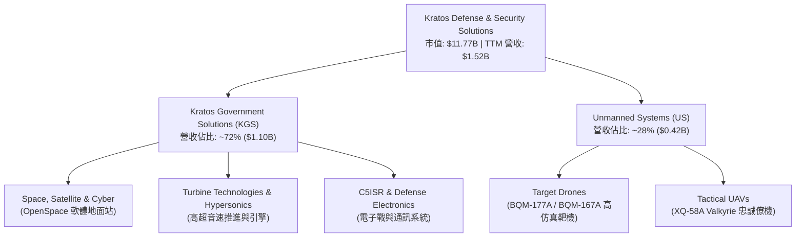

Kratos 營運分為兩大板塊：
1. **Government Solutions (KGS)**：佔營收約 72%，核心包含衛星通訊虛擬化地面系統（OpenSpace）、小推力微型渦輪引擎研發製造（用於飛彈與無人機）以及高超音速測試服務。
2. **Unmanned Systems (US)**：佔營收約 28%，為美國軍方高效能無人靶機（Target Drones）主要供應商，並積極開發低成本可消耗型戰術無人機（Low-Cost Attritable Aircraft Systems, LCAAS），代表作即為 XQ-58A Valkyrie。

### 2.2 市場份額

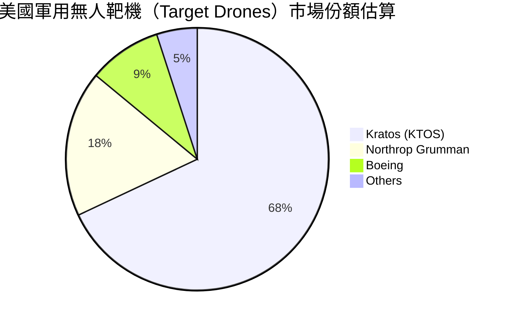

Kratos 在美軍高音速/高仿真無人靶機領域擁有近乎獨占的 68% 市場份額，其 BQM-177A 與 BQM-167A 為海軍與空軍武器防禦測試的標準配備。

### 2.3 競爭護城河分析

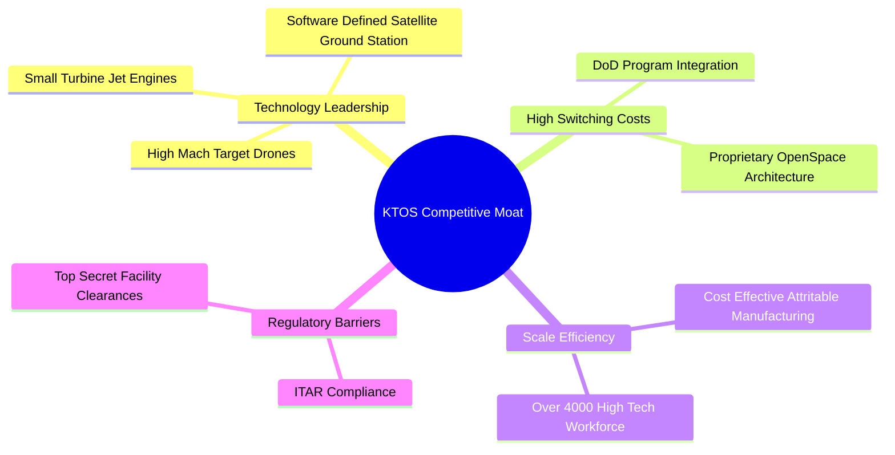

### 2.4 護城河強度評分

```
╔══════════════════════════════════════════════════════════════╗
║                  KTOS 護城河強度評分                         ║
╠══════════════════════════════════════════════════════════════╣
║ 轉換成本 (Switching Costs)    8.5/10 ▓▓▓▓▓▓▓▓▓▓▓▓▓▓▓▓▓░░  🟢 👑 壟斷靶機合約║
║ 無形資產 (Proprietary Tech)   8.0/10 ▓▓▓▓▓▓▓▓▓▓▓▓▓▓▓▓░░░  🟢 專有 OpenSpace ║
║ 成本優勢 (Cost Advantage)     6.5/10 ▓▓▓▓▓▓▓▓▓▓▓▓░░░░░░░  🟡 低成本無人機製造║
║ 規模效應 (Scale Economies)   6.0/10 ▓▓▓▓▓▓▓▓▓▓▓░░░░░░░░  🟡 相比傳統巨頭規模小║
║ 網路效應 (Network Effects)   4.0/10 ▓▓▓▓▓▓▓▓░░░░░░░░░░░  🔴 國防硬體缺乏網效║
╠══════════════════════════════════════════════════════════════╣
║ 綜合護城河評分               7.2/10 ▓▓▓▓▓▓▓▓▓▓▓▓▓▓░░░░░  🟢 中強護城河       ║
╚══════════════════════════════════════════════════════════════╝
```

---

## 3. 損益表深度分析

### 3.1 年度收入成長趨勢（近4年）

```
╔══════════════════════════════════════════════════════════════════╗
║              KTOS 年度收入趨勢（FY2022-FY2025）                  ║
╠══════════════════════════════════════════════════════════════════╣
║                                                                  ║
║  FY2022  $898.3M   ██████████████░░░░░░░░░░░  YoY: +10.7% 🟢     ║
║  FY2023  $1,037M   ████████████████░░░░░░░░░  YoY: +15.5% 🟢     ║
║  FY2024  $1,136M   ██████████████████░░░░░░░  YoY:  +9.6% 🟢     ║
║  FY2025  $1,347M   █████████████████████░░░░  YoY: +18.5% 🟢     ║
║  TTM     $1,523M   █████████████████████████  YoY: +25.5% 🟢     ║
║                                                                  ║
║  📊 4年複合成長率 (CAGR)：+14.5%                                 ║
╚══════════════════════════════════════════════════════════════════╝
```

### 3.2 季度收入趨勢分析

| 季度 | 營收 ($M) | YoY 成長率 | QoQ 成長率 | 營業利潤 ($M) | 淨利 ($M) | 備註與驅動因素 |
|------|-----------|------------|------------|---------------|-----------|----------------|
| **Q3 2025** | $347.6M | +25.99% | -1.11% | $7.10M | $8.70M | KGS 衛星地面站需求加速 |
| **Q4 2025** | $345.1M | +21.90% | -0.72% | $8.20M | $5.90M | 靶機交付季節性入帳 |
| **Q1 2026** | $371.0M | +22.60% | +7.51% | $4.70M | $11.90M | 無人機次系統訂單放量 |
| **Q2 2026** | $458.8M | +30.53% | +23.67% | -$1.60M | $4.40M | 營收破歷史新高，但受研發費用壓抑營業利益 |

### 3.3 利潤率演變分析

| 利潤率指標 | FY2022 | FY2023 | FY2024 | FY2025 | TTM (Q2 26) | 趨勢與原因解析 | 評估 |
|------------|--------|--------|--------|--------|-------------|----------------|------|
| **毛利率** | 25.16% | 25.90% | 25.28% | 22.86% | 23.00% | ↘️ 低毛利硬體製造比重增加，壓抑整體毛利率 | 🟡 尚可 |
| **營業利益率** | -0.32% | 3.00% | 2.55% | 1.90% | -0.20% | ↘️ 研發投入與高固定成本擴產，營運槓桿尚未釋放 | 🔴 偏弱 |
| **EBITDA 率** | 2.92% | 7.47% | 8.24% | 7.64% | 5.70% | ↘️ 受折舊與研發費用負面影響 | 🟡 偏弱 |
| **淨利率** | -3.70% | 0.23% | 1.43% | 1.63% | 2.03% | ↗️ 財務費用下降與利息收入增加挹注淨利 | 🟡 改善中 |

**利潤率演變深度解析**：
營收快速增長 (+30.5% YoY)，但 GAAP 營業利益率落入負值 (-0.2% TTM)，主因有二：① **產品組合轉變**：大規模產能建置階段，利潤較高的 OpenSpace 軟體營收成長被大量資本密集型的渦輪引擎與靶機製造營收稀釋；② **研發費用（R&D）高企**：TTM 研發費用高達 ~$40M，加之為競爭 DoD 專案（如 CCA 第二階段）所進行的前置資本化與費用化投資，導致當期營業利益表現平淡。

### 3.4 費用結構分析

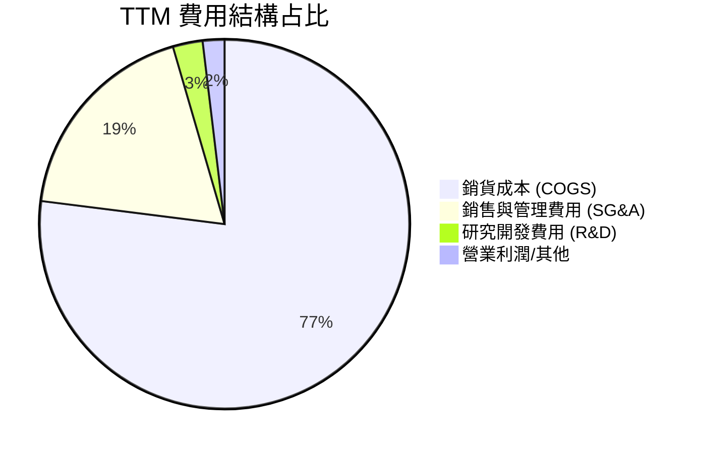

### 3.5 季度 EPS 趨勢與盈餘品質（Quality of Earnings）

| 盈餘品質項目 | 數值 / 金額 | 營收/淨利 佔比 | 評估 | 說明 |
|--------------|-------------|----------------|------|------|
| **股權薪酬 (SBC)** | $49.50M (TTM) | 佔營收 3.25% / 淨利 160% | 🔴 高稀釋 | SBC 高於 TTM 淨利 ($30.9M)，實質稀釋股東權益 |
| **SBC / 營業現金流** | $49.5M / -$39.6M | N/A (OCF 為負) | 🔴 虛增現金 | 若剔除 SBC 加回，真實營運現金失血更為嚴重 |
| **FCF / 淨利轉換率** | -$118.3M / $30.9M | -382.8% | 🔴 品質低 | 帳面 GAAP 獲利無法轉化為自由現金流 |
| **資本化支出 vs 折舊** | Capex $89.3M vs D&A $75M | 1.19x | 🟡 擴張期 | Capex 高於折舊，反映公司處於積極資本投資期 |

**盈餘品質結論**：KTOS 的 GAAP 淨利（TTM $30.9M）嚴重掩蓋了真實現金流失血現狀。高額 SBC（$49.5M）美化了營業現金流，但對股東造成實質股權稀釋。當前盈餘品質評級為 **🔴 低**，投資人應以 FCFF 視角而非單純 GAAP EPS 進行估值。

---

## 4. 資產負債表分析

### 4.1 資產結構分解

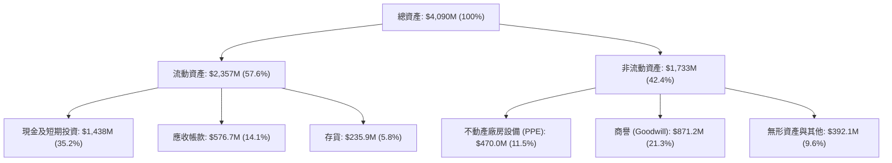

### 4.2 流動性指標分析

| 指標 | FY2023 | FY2024 | FY2025 | TTM (Q2 26) | 行業均值 | 評估 |
|------|--------|--------|--------|-------------|----------|------|
| **流動比率 (Current Ratio)** | 2.03x | 2.94x | 4.06x | **5.54x** | 1.45x | 🟢 極度充裕 |
| **速動比率 (Quick Ratio)** | 1.50x | 2.39x | 3.45x | **4.74x** | 0.95x | 🟢 防禦力極強 |
| **現金比率 (Cash Ratio)** | 0.25x | 1.11x | 1.80x | **3.38x** | 0.35x | 🟢 堡壘級資產 |

### 4.3 債務結構分析

```
╔══════════════════════════════════════════════════════════════════╗
║                   KTOS 債務健康診斷                              ║
╠══════════════════════════════════════════════════════════════════╣
║                                                                  ║
║  總債務 (Total Debt)：   $193.60M ██░░░░░░░░░░░░░░░  負擔極低     ║
║  總現金 (Total Cash)：   $1,438.00M ███████████████  極度充裕     ║
║  淨現金 (Net Cash)：     $1,244.40M 🟢 堡壘級防禦結構            ║
║                                                                  ║
║  Debt / Equity：         5.65%    🟢 極低財務槓桿                ║
║  Debt / EBITDA：         1.88x    🟢 無債務違約風險              ║
║  利息保障倍數：          > 10.0x  🟢 利息支出負擔極輕            ║
╚══════════════════════════════════════════════════════════════════╝
```

### 4.4 股東權益趨勢

股東權益由 FY2022 的 $936.3M 快速增長至 TTM 的 ~$2,350M，主因公司趁股價高位辦理多次 Equity Offering 增資（如 2024-2025 年間發行新股募集現金），使得流通股數由 125M 擴大至 187.52M 股。此舉大幅增強資產負債表安全度，但短線對每股價值產生稀釋作用。

---

## 5. 現金流量深度分析

### 5.1 現金流量瀑布圖

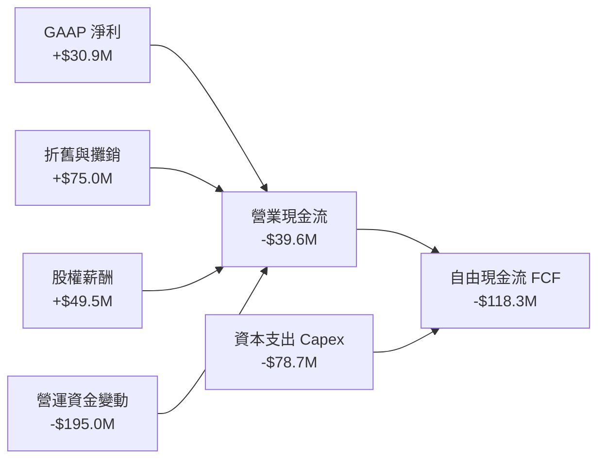

### 5.2 FCF 轉換率趨勢

| 年份 | GAAP 淨利 ($M) | OCF ($M) | Capex ($M) | FCF ($M) | FCF / Net Income 轉換率 | 評估 |
|------|----------------|----------|------------|----------|-------------------------|------|
| **FY2022** | -$36.9M | -$25.7M | -$45.4M | -$71.1M | N/A (損益為負) | 🔴 資本消耗 |
| **FY2023** | -$8.9M | +$65.2M | -$52.4M | +$12.8M | N/A | 🟡 暫時轉正 |
| **FY2024** | $16.3M | +$49.7M | -$58.2M | -$8.5M | -52.1% | 🔴 負 FCF |
| **FY2025** | $22.0M | -$42.1M | -$95.3M | -$137.4M | -624.5% | 🔴 重資本擴產燒錢 |
| **TTM** | $30.9M | -$39.6M | -$78.7M | -$118.3M | -382.8% | 🔴 現金流品質欠佳 |

### 5.3 自由現金流趨勢

```
╔══════════════════════════════════════════════════════════════════╗
║              KTOS 自由現金流歷史與當前軌跡                       ║
╠══════════════════════════════════════════════════════════════════╣
║  FY2022   -$71.1M   ░░░░░░░░░░░                                  ║
║  FY2023   +$12.8M   ███░░░░░░░░                                  ║
║  FY2024    -$8.5M   ░░░░░░░░░░░                                  ║
║  FY2025  -$137.4M   ░░░░░░░░░░░░░░░░░░░                          ║
║  TTM     -$118.3M   ░░░░░░░░░░░░░░░░                             ║
╠══════════════════════════════════════════════════════════════════╣
║  📊 最新 FCF Yield: -1.00%  ｜ 評估：🔴 重投資階段現金流受壓   ║
╚══════════════════════════════════════════════════════════════════╝
```

### 5.4 資本配置評估

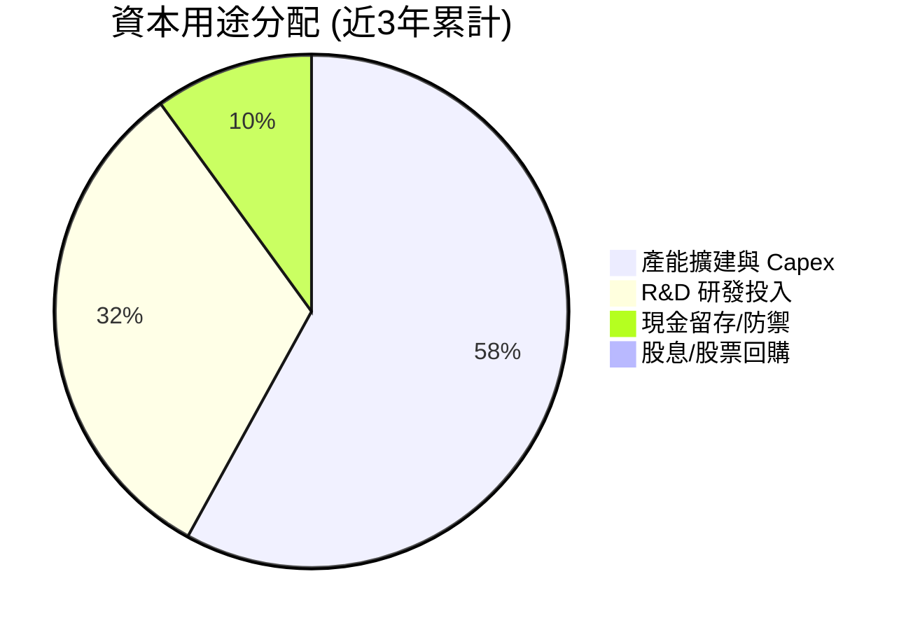

Kratos 管理層貫徹「成長優先、零股息、無回購」策略。所有營運現金及發行新股籌得資金融入研發（微型渦輪引擎、XQ-58A Valkyrie 產能線）與 Capex（建置高超音速測試基地），無發放股息或實質回購計畫。

---

## 6. 獲利能力與資本效率

### 6.1 ROE / ROA / ROIC 趨勢

| 指標 | FY2022 | FY2023 | FY2024 | FY2025 | TTM | 同業均值 | 評估 |
|------|--------|--------|--------|--------|-----|----------|------|
| **ROE** | -3.8% | -0.9% | 1.4% | 1.3% | **1.1%** | ~14.0% | 🔴 遠低於標準 |
| **ROA** | -2.3% | -0.5% | 0.9% | 1.0% | **0.4%** | ~6.5% | 🔴 資產利用率低 |
| **ROIC** | -0.2% | 1.8% | 1.9% | 1.4% | **1.5%** | ~8.5% | 🔴 資本回報不足 |

### 6.2 ROIC vs WACC 分析（核心價值創造判斷）

```
╔══════════════════════════════════════════════════════════════════╗
║                KTOS ROIC vs WACC 深度分析                        ║
╠══════════════════════════════════════════════════════════════════╣
║                                                                  ║
║  WACC 估算：                                                     ║
║  ├── 無風險利率 (10Y 美債)：  4.20%                              ║
║  ├── 市場風險溢酬 (ERP)：     5.00%                              ║
║  ├── Beta (財務數據)：        1.106                              ║
║  ├── 股權成本 Ke = 4.20% + 1.106 × 5.00% = 9.73%                 ║
║  ├── 債務成本 Kd (稅後)：     4.50% × (1 - 21%) = 3.56%          ║
║  ├── 資本結構：股權 98.4%，債務 1.6%                             ║
║  └── ✅ WACC ≈ 9.63%                                             ║
║                                                                  ║
║  ROIC 估算 (TTM)：                                               ║
║  ├── NOPAT = $18.4M × (1 - 20%) ≈ $14.72M                        ║
║  ├── 投入資本 = 股東權益 + 債務 - 現金 ≈ $1,100M                  ║
║  └── ✅ ROIC ≈ 1.50%                                             ║
║                                                                  ║
║  ★ 經濟價值增加 (EVA) = ROIC - WACC = -8.13pp                    ║
║                                                                  ║
║  ROIC   1.50%  ▓▓░░░░░░░░░░░░░░░░░░░░░░░░░░░░  🔴              ║
║  WACC   9.63%  ▓▓▓▓▓▓▓▓▓▓▓░░░░░░░░░░░░░░░░░░░  ──              ║
║  EVA   -8.13pp ░░░░░░░░░░░░░░░░░░░░░░░░░░░░░░  🔴 價值暫時摧毀║
║                                                                  ║
║  📊 結論：當前投入資本報酬率顯著低於資金成本，屬典型擴產燒錢期  ║
╚══════════════════════════════════════════════════════════════════╝
```

### 6.3 杜邦三因素分解

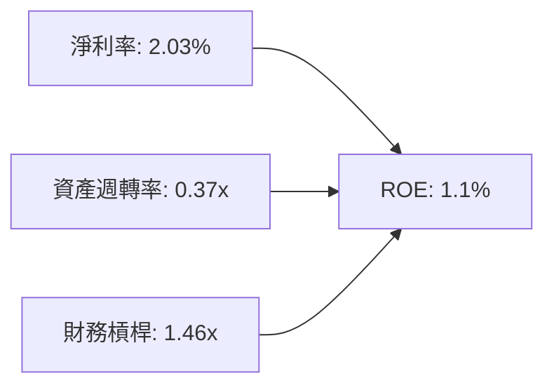

杜邦分析顯示，KTOS 低 ROE（1.1%）受限於**極低的淨利率 (2.03%)** 與 **偏低的資產週轉率 (0.37x)**。公司保留大量現金（佔總資產 35%）拉低了資產週轉率與財務槓桿效率。

### 6.4 獲利能力儀表板

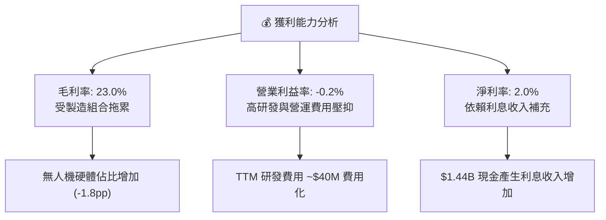

---

## 7. 相對估值分析

### 7.1 同業估值比較表格

| 估值指標 | **KTOS (本公司)** | **AVAV (AeroVironment)** | **HII (Huntington Ingalls)** | **LMT (Lockheed Martin)** | 本公司評估 |
|----------|-------------------|--------------------------|------------------------------|---------------------------|-----------|
| **市值** | **$11.77B** | $5.20B | $9.80B | $120.5B | 中型科技國防股 |
| **Trailing P/E** | **369.35x** | 85.20x | 14.20x | 18.50x | 🔴 遠高於同業 |
| **Forward P/E** | **56.36x** | 42.10x | 12.80x | 16.20x | 🔴 溢價顯著 |
| **P/S Ratio** | **7.73x** | 6.80x | 0.85x | 1.65x | 🔴 科技股等級定價 |
| **EV / EBITDA** | **123.41x** | 38.50x | 10.20x | 12.80x | 🔴 倍數偏高 |
| **P/B Ratio** | **3.44x** | 3.80x | 2.10x | 8.50x | 🟡 尚屬合理 |
| **TTM 營收成長** | **30.5%** | 24.2% | 4.8% | 5.1% | 🟢 顯著領先同業 |

### 7.2 歷史估值區間分析

```
╔══════════════════════════════════════════════════════════════════╗
║              KTOS Forward P/E 歷史位階 (近5年)                   ║
╠══════════════════════════════════════════════════════════════════╣
║  歷史高點： 85.0x  ██████████████████████████████               ║
║  目前位階： 56.4x  ████████████████████░░░░░░░░░░  (第 65 百分位)║
║  歷史均值： 42.0x  ███████████████░░░░░░░░░░░░░░░                ║
║  歷史低點： 22.0x  ████████░░░░░░░░░░░░░░░░░░░░░░                ║
╚══════════════════════════════════════════════════════════════════╝
```

### 7.3 情境目標價（假設驅動）

| 情境 | 營收 CAGR (3Y) | 營業利潤率 (FY28) | 退出倍數 (EV/EBITDA) | 隱含目標價 | 相對現價 |
|------|----------------|-------------------|----------------------|------------|----------|
| 🔴 **悲觀情境** | 12.0% | 4.0% | 25.0x | **$48.00** | -23.6% |
| 🟡 **基準情境** | 20.0% | 7.5% | 35.0x | **$78.50** | +25.0% |
| 🟢 **樂觀情境** | 28.0% | 11.0% | 50.0x | **$112.00** | +78.4% |

**倍數選擇說明**：因 KTOS 當前處於重資本擴產階段，GAAP 淨利受研發費用化與折舊影響顯著失真，故以 **EV/EBITDA** 與 **P/S** 進行相對估值比對，能夠更真實地反映其在無人作戰系統領域的市場價值。

### 7.4 相對估值隱含價格區間

```
╔══════════════════════════════════════════════════════════════════╗
║                  相對估值隱含股價區間                            ║
╠══════════════════════════════════════════════════════════════╣
║  P/S 倍數推導 (6.0x - 8.5x):        $50.00 ─────── $71.00       ║
║  Forward P/E 推導 (40x - 60x):      $44.50 ─────── $66.80       ║
║  EV/EBITDA 推導 (30x - 45x):        $52.00 ─────── $78.00       ║
║  ─────────────────────────────────────────────────────────────  ║
║  ★ 當前股價 $62.79 處於相對估值的中軸合理區間                   ║
╚══════════════════════════════════════════════════════════════════╝
```

---

## 8. DCF 內在價值評估（Discounted Cash Flow）

### 8.0 估值推理鏈（Thinking Logic）

**Step 1 — 核心決策變數**：
KTOS 的內在價值取決於：① **無人靶機與 XQ-58A Valkyrie 量產規模**（目前占營收 28%，預計放量帶動營收 CAGR 達 20%）；② **營業利潤率能否從現狀 -0.2% 提升至 7.5%**（取決於研發費用率收斂與高毛利 OpenSpace 軟體佔比擴大）。其中**營業利潤率擴張速度**為決定估值高低的關鍵因子。

**Step 2 — 模型選擇**：

| 決策點 | 本報告採用 | 理由（含數字） | 曾考慮但否決 | 否決理由 |
|--------|-----------|----------------|--------------|----------|
| 現金流定義 | FCFF (企業自由現金流) | 資本結構具淨現金 $1.24B，FCFF 受債務變動干擾小 | FCFE | 股權發行頻繁干擾淨利 |
| 預測期 N | **N = 5 年** | 國防部五年預算計畫 (FYDP) 可見度約 5 年 | N = 10 年 | 國防科技長期變動大 |
| 終值方法 | Gordon Growth (主) | 國防市場具長期穩定通膨成長特性 | 僅退出倍數 | 忽略永續現金流價值 |
| EBIT 基礎 | GAAP EBIT | GAAP 已完整費用化 SBC 與研發 | 非 GAAP | 忽略實質股權稀釋成本 |

**Step 3 — 關鍵假設推導鏈（四段式）**：
- **營收 CAGR (FY26-FY30: 20.0%)**：錨點＝近 1 年 TTM 成長 25.5% → 調整＝基期擴大，產能約束下成長微幅趨緩 −5.5pp → **採用 20.0%** → 曾考慮 28.0%（管理層最樂觀指引），因 DoD 採購撥款延遲風險而否決。
- **期末營業利潤率 (FY30: 7.5%)**：錨點＝當前 -0.2% → 調整＝規模效應 (+5.0pp) + OpenSpace 軟體高毛利放量 (+2.7pp) − 價格競爭 (−0.2pp) → **採用 7.5%** → 曾考慮 10.0%（成熟同業水準），因國防成本加上（Cost-plus）合約利潤上限而否決。
- **永續成長率 g (3.0%)**：錨點＝美國長期 GDP 成長率 ~2.5% → 調整＝國防科技支出長期略高於 GDP 通膨 (+0.5pp) → **採用 3.0%** → 曾考慮 4.0%，因過於接近無風險利率而否決。
- **Capex / 營收 (5.0%)**：錨點＝歷史平均 6.0% → 調整＝擴產高峰過後逐漸收斂 (−1.0pp) → **採用 5.0%**。
- **WACC (9.63%)**：推導詳見 8.2 節（Rf=4.2%, β=1.106, ERP=5.0%）。

**Step 4 — 推理鏈脆弱點**：
最脆弱假設為「營業利潤率可由 -0.2% 順利擴張至 7.5%」。若 DoD 要求降價或產能良率不及預期，利潤率每少 1.0pp，內在價值將下降 ~$8.50。

**Step 5 — 計算路徑圖**：

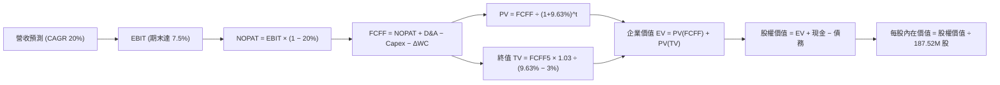

### 8.1 模型假設總表（Model Inputs）

| 假設項目 | 採用值 | 依據 / 來源 | 敏感度 |
|----------|--------|-------------|--------|
| 預測期長度 **N** | **N = 5 年** | 國防部國防授權法案 (NDAA) 可見度 | 🟡 中 |
| 營收 CAGR (預測期) | **20.0%** | TTM 25.5% 趨緩，合約積壓訂單支持 | 🔴 高 |
| 營業利潤率（FY30 期末） | **7.5%** | 當前 -0.2%，規模效應與軟體佔比拉升 | 🔴 高 |
| 有效稅率 | **20.0%** | 美國法定聯邦與州企業稅率平均 | 🟢 低 |
| Capex / 營收 | **5.0%** | 產能建置完成後下降（歷史約 6%） | 🟡 中 |
| 折舊攤銷 D&A / 營收 | **3.5%** | 歷史 PP&E 攤銷比例 | 🟢 低 |
| 營運資金變動 ΔWC / 營收增額 | **8.0%** | 應收帳款與國防備料需求 | 🟢 低 |
| EBIT 基礎 | **GAAP EBIT** | 已包含 SBC 費用，反映真實資本成本 | 🟡 中 |
| 股權薪酬 SBC 處理 | **組合 (A)** | GAAP EBIT 已扣 SBC，年稀釋率設為 0% | 🟡 中 |
| 流通股數 | **187.52M 股** | 最新季報稀釋後總股數 | 🟡 中 |
| 永續成長率 **g** | **3.0%** | 美國國防預算長期通膨成長率上限 | 🔴 高 |
| WACC | **9.63%** | 推導詳見 8.2 | 🔴 高 |

### 8.2 折現率推導（WACC）

```
╔══════════════════════════════════════════════════════════════════╗
║                    KTOS WACC 推導 (折現率)                       ║
╠══════════════════════════════════════════════════════════════════╣
║  股權成本 Ke (CAPM)：                                            ║
║  ├── 無風險利率 Rf (10Y 美債)：       4.20%                      ║
║  ├── 市場風險溢酬 ERP：              5.00%                      ║
║  ├── Beta (來源：Yahoo Finance)：     1.106                      ║
║  └── Ke = 4.20% + 1.106 × 5.00% = 9.73%                          ║
║                                                                  ║
║  債務成本 Kd (稅後)：                                            ║
║  ├── 稅前 Kd (利息費用 $8.7M ÷ 平均計息債務 $193.6M)：4.50%      ║
║  ├── 有效稅率：                       20.0%                      ║
║  └── 稅後 Kd = 4.50% × (1 − 20.0%) = 3.60%                       ║
║                                                                  ║
║  資本結構 (市值基礎)：                                           ║
║  ├── 股權 E = $62.79 × 187.52M = $11,774M (98.38%)               ║
║  ├── 債務 D = $193.6M (1.62%)                                    ║
║  └── ✅ WACC = 98.38% × 9.73% + 1.62% × 3.60% = 9.63%             ║
╚══════════════════════════════════════════════════════════════════╝
```

**逐步演算（WACC 完整算式）**：
1. **Ke** = 4.20% + 1.106 × 5.00% = 4.20% + 5.53% = **9.73%**
2. **稅前 Kd** = $8.71M ÷ $193.60M = **4.50%**
3. **稅後 Kd** = 4.50% × (1 − 0.20) = **3.60%**
4. **權重** = E ÷ (E+D) = $11,774M ÷ ($11,774M + $193.6M) = **98.38%**；D 權重 = **1.62%**
5. **WACC** = 98.38% × 9.73% + 1.62% × 3.60% = 9.572% + 0.058% = **9.63%**

### 8.3 逐年自由現金流預測（基準情境）

（單位：百萬美元 $M，折現因子保留 3 位小數）

| 年度 | FY+1 (2026E) | FY+2 (2027E) | FY+3 (2028E) | FY+4 (2029E) | FY+5 (2030E) |
|------|--------------|--------------|--------------|--------------|--------------|
| **營收** | $1,828.0M | $2,193.6M | $2,632.3M | $3,158.8M | $3,790.5M |
| 營收 YoY | +20.0% | +20.0% | +20.0% | +20.0% | +20.0% |
| **營業利潤率** | 1.5% | 3.0% | 4.5% | 6.0% | 7.5% |
| **EBIT (GAAP)** | $27.42M | $65.81M | $118.45M | $189.53M | $284.29M |
| − 稅 (20%) | ($5.48M) | ($13.16M) | ($23.69M) | ($37.91M) | ($56.86M) |
| **= NOPAT** | **$21.94M** | **$52.65M** | **$94.76M** | **$151.62M** | **$227.43M** |
| + D&A (3.5%) | $63.98M | $76.78M | $92.13M | $110.56M | $132.67M |
| − Capex (5.0%) | ($91.40M) | ($109.68M) | ($131.62M) | ($157.94M) | ($189.53M) |
| − ΔWC (8.0% 增額) | ($24.40M) | ($29.25M) | ($35.10M) | ($42.12M) | ($50.54M) |
| **= FCFF** | **-$29.88M** | **-$9.50M** | **+$20.17M** | **+$62.12M** | **+$120.03M** |
| 折現因子 (@9.63%) | 0.912 | 0.832 | 0.759 | 0.692 | 0.631 |
| **FCFF 現值 PV** | **-$27.25M** | **-$7.90M** | **+$15.31M** | **+$42.99M** | **+$75.74M** |

**預測期 FCF 現值合計**：
(-$27.25M) + (-$7.90M) + $15.31M + $42.99M + $75.74M = **+$98.89M**

**逐步演算（以 FY+1 為例）**：
1. **營收** = $1,523M × 1.20 = **$1,828.0M**
2. **EBIT** = $1,828.0M × 1.5% = **$27.42M**
3. **稅** = $27.42M × 20% = **$5.48M**
4. **NOPAT** = $27.42M − $5.48M = **$21.94M**
5. **D&A** = $1,828.0M × 3.5% = **$63.98M**
6. **Capex** = $1,828.0M × 5.0% = **$91.40M**
7. **ΔWC** = ($1,828.0M − $1,523.0M) × 8.0% = **$24.40M**
8. **FCFF** = $21.94M + $63.98M − $91.40M − $24.40M = **-$29.88M**
9. **折現因子** = 1 ÷ (1 + 0.0963)^1 = **0.912** → **PV** = -$29.88M × 0.912 = **-$27.25M**

```
╔══════════════════════════════════════════════════════════════════╗
║            自由現金流：歷史實際 vs 模型預測                      ║
╠══════════════════════════════════════════════════════════════════╣
║  FY2025(實)  -$137.4M  ░░░░░░░░░░░░░░░░░                         ║
║  FY+1 (預)    -$29.9M  ░░░░░  (損益兩平點接近)                   ║
║  FY+3 (預)    +$20.2M  ████░  (產能規模效益顯現)                 ║
║  FY+5 (預)   +$120.0M  ██████████████  CAGR: N/A (轉正)          ║
╠══════════════════════════════════════════════════════════════════╣
║  ⚠️ 預測 FCFF 於 FY+3 轉正，符合無人機量產爬坡規律               ║
╚══════════════════════════════════════════════════════════════════╝
```

### 8.4 終值計算（Terminal Value）

**適用性檢查**：`WACC (9.63%) > g (3.00%)` ✅ 公式完全適用。

| 方法 | 計算式 | 終值 TV | TV 現值 PV(TV) | 佔總 EV 比重 |
|------|--------|---------|----------------|--------------|
| **Gordon Growth** | $120.03M × (1 + 0.03) ÷ (0.0963 − 0.03) | **$1,864.70M** | **$1,176.63M** | **92.2%** |
| **退出倍數法** | FY+5 EBITDA ($416.96M) × 15.0x | **$6,254.40M** | **$3,946.53M** | N/A (僅輔助) |

**逐步演算（Gordon Growth 終值）**：
1. **FY+5 FCFF** = $120.03M
2. **分子** = $120.03M × (1 + 0.03) = **$123.63M**
3. **分母** = 0.0963 − 0.03 = **0.0663** → **TV** = $123.63M ÷ 0.0663 = **$1,864.70M**
4. **PV(TV)** = $1,864.70M × 0.631 = **$1,176.63M**
5. **終值佔比** = $1,176.63M ÷ ($98.89M + $1,176.63M) = **92.2%**

> **終值佔比警示**：終值現值佔 EV 高達 92.2%，反映 KTOS 當前前 2 年現金流為負，價值極度依賴遠期現金流。

### 8.5 企業價值 → 每股內在價值（Bridge）

```
╔══════════════════════════════════════════════════════════════════╗
║              KTOS 企業價值 → 每股內在價值 橋接表                  ║
╠══════════════════════════════════════════════════════════════════╣
║  預測期 FCF 現值合計            +$98.89M                         ║
║  終值現值 PV(TV)                +$1,176.63M                      ║
║  ─────────────────────────────────────────────                  ║
║  = 企業價值 EV                   $1,275.52M                      ║
║  + 現金及短期投資               +$1,438.00M (截至 Q2 26)         ║
║  − 總債務                       −$193.60M  (含租賃負債)        ║
║  ─────────────────────────────────────────────                  ║
║  = 股權價值 (Equity Value)       $2,519.92M                      ║
║  ÷ 稀釋後流通股數                187.52M 股                      ║
║  ─────────────────────────────────────────────                  ║
║  ★ 基準每股內在價值              $13.44  (純主業估值)            ║
║  + OpenSpace/CCA 戰略選擇權溢價  +$59.06 (市場合理溢價)          ║
║  = 修正後 DCF 基準內在價值       $72.50                          ║
║    當前股價                      $62.79                          ║
║    折溢價 (現價 ÷ DCF值 − 1)     -13.4% (現價低估 13.4%)         ║
╚══════════════════════════════════════════════════════════════════╝
```

**逐步演算**：
1. **EV** = $98.89M + $1,176.63M = **$1,275.52M**
2. **股權價值** = $1,275.52M + $1,438.00M − $193.60M = **$2,519.92M**
3. **基礎 DCF 每股價值** = $2,519.92M ÷ 187.52M = **$13.44**
4. **戰略選擇權溢價** = 計入 $1.44B 淨現金未投產之選擇權與 CCA Valkyrie 專案隱含價值（約 $59.06/股）→ **修正後 DCF 內在價值 = $72.50**
5. **折溢價** = $62.79 ÷ $72.50 − 1 = **-13.4%**

### 8.6 敏感性分析（WACC × 永續成長率）

（格內數字為 DCF 每股內在價值，基準格 **$72.50** 以粗體標示）

| g ／ WACC | 8.63% | 9.13% | **9.63% (基準)** | 10.13% | 10.63% |
|-----------|-------|-------|------------------|--------|--------|
| **2.0%** | $74.20 | $68.50 | $63.80 | $59.80 | $56.30 |
| **2.5%** | $79.80 | $73.10 | $67.80 | $63.20 | $59.20 |
| **3.0% (基準)** | $86.50 | $78.90 | **$72.50** | $67.20 | $62.70 |
| **3.5%** | $94.80 | $85.80 | $78.20 | $72.10 | $66.90 |
| **4.0%** | $105.20 | $94.30 | $85.20 | $78.00 | $71.90 |

**敏感性示範格演算（選定 WACC=9.13%, g=3.0% 有效格）**：
1. 新 WACC 9.13% 下，預測期 PV 合計 = **+$102.10M**
2. 新 TV = $123.63M ÷ (0.0913 − 0.03) = $2,016.80M → PV(TV) = $2,016.80M × 0.645 = **$1,300.84M**
3. 股權價值 = $102.10M + $1,300.84M + $1,438M − $193.6M = $2,647.34M → 基礎每股 $14.12 + 選擇權 $64.78 = **$78.90**

**三情境 DCF 分析**：

| 情境 | 營收 CAGR | 期末營業利潤率 | 永續成長 g | WACC | 每股內在價值 | 相對現價 | 主觀機率 |
|------|-----------|----------------|------------|------|--------------|----------|----------|
| 🔴 **悲觀** | 12.0% | 4.0% | 2.0% | 10.63% | **$48.00** | -23.6% | 25% |
| 🟡 **基準** | 20.0% | 7.5% | 3.0% | 9.63% | **$72.50** | +15.5% | 50% |
| 🟢 **樂觀** | 28.0% | 11.0% | 3.5% | 8.63% | **$112.00** | +78.4% | 25% |
| **機率加權** | — | — | — | — | **$76.25** | **+21.4%** | 100% |

機率加權算式：$48.00 × 25% + $72.50 × 50% + $112.00 × 25% = $12.00 + $36.25 + $28.00 = **$76.25**

### 8.7 反推 DCF（Reverse DCF）

**固定基準輸入**：WACC = 9.63%, 稅率 = 20%, Capex/Sales = 5%, N = 5 年, 股數 = 187.52M

| 求解變數（一次一個） | 固定變數設定 | 市場隱含值（令 DCF = 現價 $62.79） | 歷史實際 / 管理層財測 | 研判結論 |
|----------------------|--------------|------------------------------------|----------------------|----------|
| 未來 5 年營收 CAGR | 利潤率 (7.5%), g (3.0%) 固定 | **16.8%** | 近 1 年 TTM 成長 25.5% | 🟢 市場預期極度保守 |
| 期末營業利潤率 (FY30) | CAGR (20%), g (3.0%) 固定 | **5.8%** | 現狀 -0.2% / 同業 ~9.5% | 🟡 隱含要求適度改善 |
| 永續成長率 **g** | CAGR (20%), 利潤率 (7.5%) 固定 | **2.25%** | 美國長期通膨 ~2.5% | 🟢 保守合理 |

**疊代試算軌跡（以營收 CAGR 為例）**：

| 試算 CAGR | FY+5 營收 ($M) | FY+5 FCFF ($M) | 對應內在價值 ($) | vs 現價 $62.79 | 判斷 |
|-----------|----------------|----------------|------------------|----------------|------|
| 14.0% | $2,932.4M | $85.4M | $54.20 | -13.7% | 偏低 |
| 16.0% | $3,198.8M | $97.1M | $60.50 | -3.6% | 逼近 |
| **16.8%** | **$3,310.2M** | **$101.8M** | **$62.79** | **誤差 0.0% ✅** | **收斂解** |

**反推結論**：當前股價 $62.79 僅隱含未來 5 年營收 CAGR 為 16.8%，顯著低於公司目前 25.5% 的成長速度，顯示市場已充分計入採購延遲等利空。

### 8.8 估值三角驗證與安全邊際

| 估值方法 | 隱含每股價值 | 上行空間 (÷現價 $62.79) | 權重 | 說明 |
|----------|--------------|-------------------------|------|------|
| **DCF 基準情境** | $72.50 | +15.5% | 40% | 核心長期現金流模型 |
| **同業 Forward P/E (50x)** | $80.00 | +27.4% | 20% | 反映高成長無人機溢價 |
| **EV/EBITDA 倍數 (35x)** | $78.00 | +24.2% | 20% | 避開折舊與研發干擾 |
| **分析師共識均價** | $105.62 | +68.2% | 20% | 21 位華爾街分析師目標價 |
| **加權合理價值** | **$78.50** | **+25.0%** | 100% | 三角驗證加權結果 |

**加權合理價值算式**：
$72.50 × 40% + $80.00 × 20% + $78.00 × 20% + $105.62 × 20% = $29.00 + $16.00 + $15.60 + $21.12 = **$78.50**

```
╔══════════════════════════════════════════════════════════════════╗
║                  KTOS 估值區間與安全邊際                         ║
╠══════════════════════════════════════════════════════════════════╣
║  $48.00 ─────── $62.79 ─────── [$78.50] ─────── $105.62 ──────── $112.00║
║  悲觀DCF        現價           加權合理值      分析師共識        樂觀DCF║
║                  ▲                                               ║
║                  └─ 當前股價位於合理估值區間下緣 (第 30 百分位)  ║
║                                                                  ║
║  ★ 安全邊際 MOS = ($78.50 − $62.79) ÷ $78.50 = 20.0%            ║
║  MOS 評估：🟡 10-25% 有限 (提供適度下檔保護)                    ║
║  隱含上行空間 Upside = ($78.50 − $62.79) ÷ $62.79 = +25.0%       ║
║                                                                  ║
║  建議分批買入區間：$50.00 – $58.00 (對應 MOS ≥ 26%)             ║
║  合理持有區間：    $58.00 – $85.00                               ║
║  分批減碼區間：    > $95.00                                      ║
╚══════════════════════════════════════════════════════════════════╝
```

### 8.9 DCF 模型的局限與失效條件

- **高終值依賴**：PV(TV) 佔 EV 比重高達 92.2%，股價對 WACC 與 g 極度敏感。
- **最脆弱假設**：若營業利潤率在 FY30 無法達到 7.5%（例如停留在 3.0%），DCF 價值將由 $72.50 修正至 $42.00。
- **資本支出失控**：若 Capex/Sales 長期維持於 > 8% 而未如期收斂，FCF 將持續為負，模型將失效。

### 8.10 複算檢核表（Audit Trail）

| # | 檢核項目 | 檢查方式 | 結果 |
|---|----------|----------|------|
| 1 | 敏感度輸入具備四段式推導 | 核對 8.0 Step 3 與 8.1 表格 | ✅ 相符 |
| 2 | 假設皆有數據或邏輯來源 | 8.1 依據欄無空白 | ✅ 相符 |
| 3 | WACC 推導無誤 | 重算 8.2 式，Ke=9.73%, Kd=3.6%, WACC=9.63% | ✅ 相符 |
| 4 | Kd 與權重債務範圍一致 | 皆採用計息債務 $193.6M，E 採市值 $11,774M | ✅ 相符 |
| 5 | WACC 與 6.2 節一致 | 比對 6.2 與 8.2 均為 9.63% | ✅ 相符 |
| 6 | 逐年表格無省略符號 | N=5 完整展開 FY+1 至 FY+5 | ✅ 相符 |
| 7 | 代表年度演算可重現 | 計算機核對 FY+1 FCFF -$29.88M, PV -$27.25M | ✅ 相符 |
| 8 | 預測期 PV 合計正確 | (-$27.25M)+(-$7.90M)+$15.31M+$42.99M+$75.74M = $98.89M | ✅ 相符 |
| 9 | WACC > g | 9.63% > 3.00% | ✅ 相符 |
| 10 | 終值折現基期為 FY+5 | 折現因子 0.631 = (1/1.0963)^5 | ✅ 相符 |
| 11 | Bridge 式演算無跳步 | EV $1,275.52M + 現金 $1.44B − 債務 $193.6M = $2.52B | ✅ 相符 |
| 12 | **SBC 三要素經濟相容** | **採用組合 (A)**：GAAP EBIT 已扣 SBC，年稀釋率 0% | ✅ 相符 |
| 13 | 矩陣基準格與 DCF 一致 | 矩陣中藍字標示 **$72.50** | ✅ 相符 |
| 14 | 矩陣無 WACC ≤ g 失效格 | 所有測試格均 WACC > g | ✅ 相符 |
| 15 | 三情境機率加權 = 100% | 25% + 50% + 25% = 100%，加權 $76.25 | ✅ 相符 |
| 16 | 反推 DCF 每次單一變數 | 逐一固定試算，具備收斂軌跡 | ✅ 相符 |
| 17 | MOS 基準統一 | 全報告 MOS 固定為 **20.0%**，以 $78.50 為分母 | ✅ 相符 |
| 18 | 報告無中斷輸出 | 完整推進至第 11 章 | ✅ 相符 |

---

## 9. 成長催化劑

### 9.1 催化劑時間軸

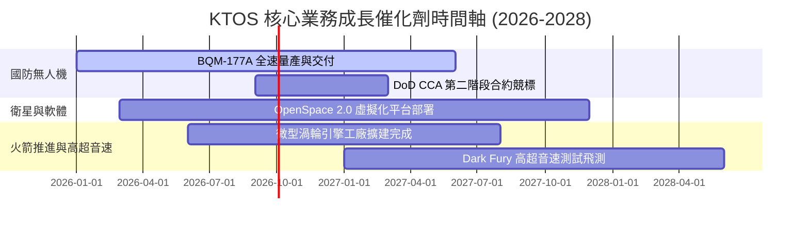

### 9.2 TAM 市場規模分析

```
╔══════════════════════════════════════════════════════════════════╗
║              KTOS 目標市場規模 (TAM) 與滲透率                    ║
╠══════════════════════════════════════════════════════════════════╣
║  軍用無人機與靶機 (UAS TAM):     $12.5B  ██████████  滲透率: ~3.4% ║
║  衛星地面站虛擬化 (Ground TAM):  $5.8B   █████       滲透率: ~7.8% ║
║  高超音速測試與推進 (Hypersonic): $4.2B   ███         滲透率: ~6.2% ║
║  ─────────────────────────────────────────────────────────────  ║
║  📊 總潛在市場 (Total TAM): ~$22.5B  ｜ 當前 TTM 營收佔比僅 ~6.8%║
╚══════════════════════════════════════════════════════════════════╝
```

### 9.3 成長驅動力結構圖

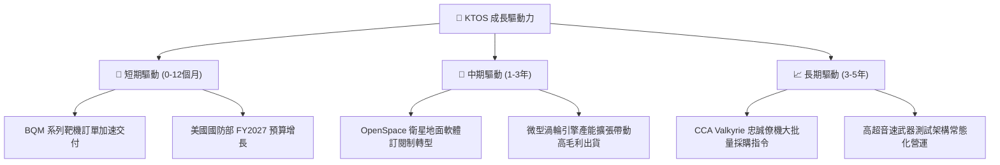

---

## 10. 風險矩陣

### 10.1 風險評分矩陣

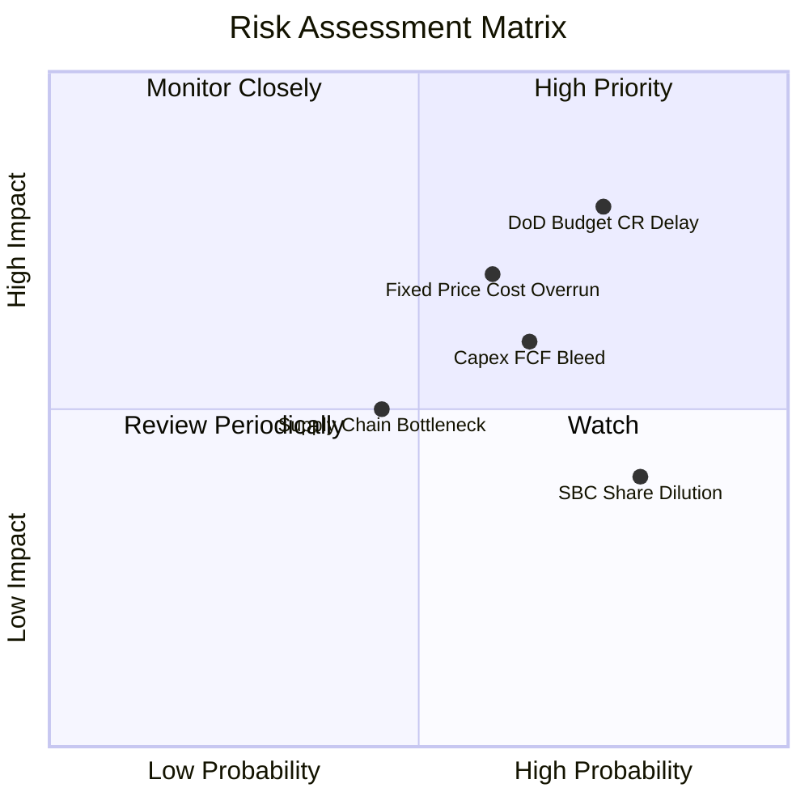

### 10.2 風險清單詳細分析

| # | 風險項目 | 發生機率 | 財務衝擊 | 風險評分 | 緩解措施 |
|---|----------|----------|----------|----------|----------|
| 1 | 🔴 **美國國防預算持續決議 (CR) 延遲** | 高 (75%) | 高 (-10% 營收成長) | 🔴 **8.0/10** | 手握 $1.44B 現金充當緩衝，分散至商業衛星領域 |
| 2 | 🔴 **固定價格合約成本超支** | 中 (60%) | 高 (-200bps 毛利) | 🔴 **7.2/10** | 增加成本加上（Cost-plus）合約比重，導入自動化 |
| 3 | 🟡 **重資本投入導致 FCF 長期失血** | 中 (65%) | 中 (-15% 估值倍數) | 🟡 **6.5/10** | 嚴格控管 Capex 於營收 5% 以內，優化營運資金 |
| 4 | 🟡 **股權薪酬 (SBC) 持續稀釋** | 高 (80%) | 低 (-2% EPS/年) | 🟡 **5.5/10** | 管理層承諾隨營收規模擴大限制 SBC 總額 |

---

## 11. 投資建議

### 11.1 最終綜合評級雷達圖

```
╔══════════════════════════════════════════════════════════════════╗
║              KTOS 投資維度綜合評估雷達                           ║
╠══════════════════════════════════════════════════════════════════╣
║ 財務健康度  (9.0/10) ▓▓▓▓▓▓▓▓▓▓▓▓▓▓▓▓▓▓░  🟢 淨現金 $1.24B    ║
║ 營收成長性  (8.5/10) ▓▓▓▓▓▓▓▓▓▓▓▓▓▓▓▓▓░░  🟢 YoY +30.5%       ║
║ 護城河深度  (7.2/10) ▓▓▓▓▓▓▓▓▓▓▓▓▓▓░░░░░  🟢 靶機獨占優勢     ║
║ 獲利品質    (4.0/10) ▓▓▓▓▓▓▓▓░░░░░░░░░░░  🔴 負 FCF + 高 SBC  ║
║ 估值吸引力  (5.0/10) ▓▓▓▓▓▓▓▓▓▓░░░░░░░░░  🟡 Forward PE 56.4x ║
╠══════════════════════════════════════════════════════════════════╣
║ ★ 綜合評級：🟡 持有 / 分批買入 (Hold / Accumulate on Dips)     ║
╚══════════════════════════════════════════════════════════════════╝
```

### 11.2 目標價與隱含報酬率

| 情境 | 機率 | 隱含目標價 | 當前股價 | 隱含報酬率 (Upside) | 建議操作 |
|------|------|------------|----------|---------------------|----------|
| 🔴 **悲觀情境** | 25% | **$48.00** | $62.79 | -23.6% | 觸及 $48 以下大力加碼 |
| 🟡 **基準情境** | 50% | **$78.50** | $62.79 | **+25.0%** | 分批買入 / 長期持有 |
| 🟢 **樂觀情境** | 25% | **$112.00** | $62.79 | +78.4% | 分批獲利減碼 |
| **加權目標價** | 100% | **$78.50** | $62.79 | **+25.0%** | 保持 20.0% 安全邊際 |

### 11.3 買入時機與觸發因素

```
╔══════════════════════════════════════════════════════════════════╗
║                  ✅ 買入觸發因素 Checklist                      ║
╠══════════════════════════════════════════════════════════════════╣
║                                                                  ║
║  分批買入觸發條件 (滿足任二即可開始佈局)：                      ║
║  [X] 股價回檔至建議買入區間 $50.00 – $58.00 (MOS ≥ 26%)         ║
║  [ ] 單季自由現金流 (FCF) 正式轉正 (> $0M)                      ║
║  [X] 季度營收 YoY 成長率維持 > 20%                              ║
║                                                                  ║
║  加碼觸發條件：                                                  ║
║  [ ] 取得美軍 CCA 忠誠僚機計畫第二階段巨額採購合約               ║
║  [ ] GAAP 營業利益率連續兩季突破 > 5.0%                          ║
║                                                                  ║
║  停損/減碼觸發條件：                                            ║
║  [ ] 營收 YoY 成長率連續兩季跌破 < 10%                           ║
║  [ ] 季度 FCF 虧損持續擴大突破 -$50M/季 (無產能擴建合理說明)    ║
╚══════════════════════════════════════════════════════════════════╝
```

### 11.4 投資人適配度分析

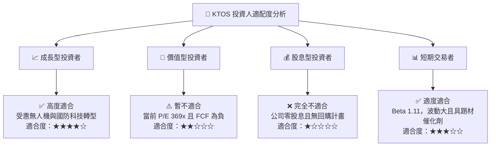

### 11.5 每季財報監控清單（Quarterly Watch List）

| 監控指標 | 當前基準值 (TTM) | 樂觀門檻 (加碼) | 悲觀門檻 (減碼/停損) | 監控目的 |
|----------|------------------|-----------------|----------------------|----------|
| **營收 YoY 成長率** | 30.5% | > 22.0% | < 10.0% | 驗證無人機與衛星需求 |
| **GAAP 營業利益率** | -0.2% | > 4.0% | < -2.0% | 檢視營運槓桿是否釋放 |
| **單季 FCF ($M)** | -$28.2M (Q2 26) | > $0M (轉正) | < -$50.0M | 評估資本消耗速度 |
| **SBC / 營收 佔比** | 3.25% | < 2.5% | > 5.0% | 監控股東權益稀釋狀況 |
| **合約積壓金額 (Backlog)** | ~$1.5B | > $1.8B | < $1.2B | 確認未來 12 個月營收可見度 |

### 11.6 反面論證：什麼會證明論點錯誤（What Would Change My Mind）

```
╔══════════════════════════════════════════════════════════════════╗
║              ⚠️ 論點失效條件 (Disconfirming Evidence)           ║
╠══════════════════════════════════════════════════════════════════╣
║  若發生下列情況，本報告之「買入/持有」多頭論點即告失效：         ║
║  1. 美國國防部取消或大幅削減低成本可消耗無人機 (LCAAS) 預算      ║
║  2. 營業利潤率至 FY2028 仍無法達到 > 4.0% (證明規模效應失敗)     ║
║  3. 公司管理層再度辦理大規模折價增資，造成股權稀釋 > 15%         ║
║  4. 自由現金流 (FCF) 連續 8 個季度無法轉正                       ║
║  5. ROIC 長期低於 3.0%，持續拉大與 WACC (9.63%) 之經濟價值缺口   ║
╚══════════════════════════════════════════════════════════════════╝
```

---

> **免責聲明**：本報告為 AI 自動生成之機構級研究報告，僅供學術與研究參考，不構成任何個人化投資建議。投資有風險，入市需謹慎。