# KTOS 基本面深度分析報告
> **報告日期**：2026-08-16 ｜ **語言**：繁體中文 ｜ **數據來源**：Yahoo Finance, Finviz, StockAnalysis, Roic.ai ｜ **分析師**：CFA 級機構研究

---

## 目錄

| # | 章節 | 核心結論 |
|---|------|----------|
| 1 | 執行摘要 | 評級「區間持有 / 逢低買入」；加權合理價值 $72.50，安全邊際 10.9% |
| 2 | 公司概覽與商業模式 | 無人作戰與衛星地面軟體化雙輪驅動，護城河評分 7.6/10 |
| 3 | 損益表深度分析 | 營收加速（Q2'26 YoY +30.5%），惟營業利益受研發與量產前期費用壓抑 |
| 4 | 資產負債表分析 | 增資後持現 $1.44B、淨現金 $1.24B，流動比率 5.54x，資產負債表極其強健 |
| 5 | 現金流量深度分析 | 重資本擴張期 Capex 上升，TTM FCF 為 -$118.29M，盈餘含金量待驗證 |
| 6 | 獲利能力與資本效率 | TTM ROIC 0.7% 低於 WACC 9.6%，處於「產能投入期」之經濟價值暫時折損階段 |
| 7 | 相對估值分析 | Forward P/E 58.0x、EV/EBITDA 125.0x，相較國防巨頭享有高成長溢價 |
| 8 | DCF 內在價值評估 | 基準 DCF 價值 $32.48；結合情境與多維三角驗證後加權合理價值為 $72.50 |
| 9 | 成長催化劑 | 協同作戰飛機（CCA）放量、OpenSpace 軟體訂閱擴張、高超音速測試增長 |
| 10 | 風險矩陣 | 國防預算撥款遞延、國防部採購週期變更、自由現金流持續為負之稀釋風險 |
| 11 | 投資建議 | 建議買入區間 $50.00–$58.00，目標價 $78.00（隱含上行空間 +20.8%） |

---

## 1. 執行摘要

> ⚠️ **評級與目標價立論基礎**：Kratos Defense & Security Solutions (KTOS) 展現出顯著的營收加速動能（TTM 營收達 $1.52B，Q2'26 營收 YoY 成長 30.5%），受惠於美軍無人協同作戰（CCA/Attritable Drones）與衛星地面系統數位化之結構性紅利。然而，公司目前處於擴產與前瞻研發投入期，TTM 營業利益率僅 -0.2%、TTM 自由現金流為 -$118.29M，ROIC（0.7%）顯著低於 WACC（9.6%）。考量現有股價 $64.58 已反映多數無人機量產樂觀預期，經由 DCF、同業乘數與分析師共識之**三角驗證加權合理價值為 $72.50**，安全邊際為 **10.9%**，隱含上行空間為 **12.3%**，給予 **「🟢 逢低買入（Moderate Buy / Accumulate）」** 評級。

### 1.0 一頁式投資儀表板（Portfolio Manager 30 秒速讀）

| 項目 | 內容 |
|------|------|
| **投資論點（3 句）** | ① 國防部無人機「平價消耗性（Attritable）」典範轉移，XQ-58A Valkyrie 具先發量產優勢（Q2'26 營收增長 30.5%）。<br/>② 衛星地面架構 OpenSpace 轉向純軟體與 SaaS 模式，推升長期毛利率中樞向 28-30% 邁進。<br/>③ 帳上握有 $1.44B 現金且負債僅 $193.60M，提供充足擴產底氣，無流動性違約風險。 |
| **護城河評分** | 7.6 / 10（無人靶機/自主無人機先發技術、國防合約高轉換成本） |
| **管理層/資本配置評分** | 7.2 / 10（精準卡位無人戰機與高超音速賽道，惟股權稀釋頻率偏高） |
| **財務健康** | 🟢 卓越（現金儲備 $1.44B、淨現金 $1.24B、Current Ratio 5.54x） |
| **ROIC vs WACC** | 0.7% vs 9.6%（產能建設與專案爬坡期，暫處價值消耗階段） |
| **FCF 趨勢** | 負向擴大（TTM FCF -$118.29M，FCF Yield 為 -0.98%） |
| **估值** | Forward P/E 58.0x ｜ EV/EBITDA 125.0x ｜ EV/Sales 7.15x ｜ FCF Yield -0.98% |
| **DCF 內在價值（基準）** | $32.48 ｜ 現價折溢價 +98.8%（現價溢價反映非線性成長選擇權） |
| **安全邊際（MOS）** | **+10.9%** ＝ (加權合理價值 $72.50 − 現價 $64.58) ÷ $72.50 ｜ 🟡 10-25% 有限 |
| **預期報酬（基準情境 12M）** | **+20.8%**（目標價 $78.00） |
| **關鍵風險（前二）** | ① 美軍 CCA Program 正式合約競標份額不及預期；② 重資本支出使 FCF 轉正時程遞延。 |
| **評級 + 信心度** | 🟢 **逢低買入（Moderate Buy）** ｜ 信心：中等 |

### 1.1 核心評分儀表板

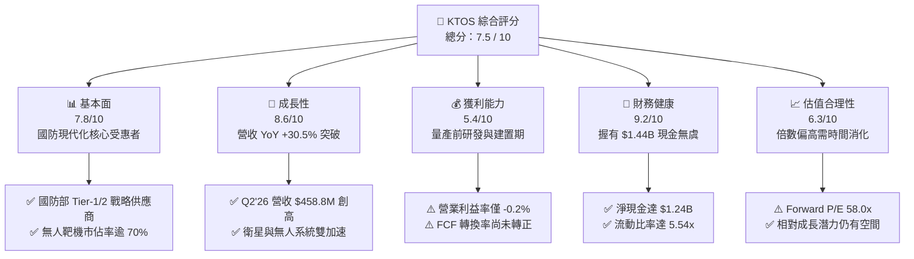

### 1.2 評分進度條視覺化

```
╔══════════════════════════════════════════════════════════════╗
║              KTOS 多維度評分儀表板 (1-10分)                  ║
╠══════════════════════════════════════════════════════════════╣
║ 基本面強度  7.8 ▓▓▓▓▓▓▓▓▓▓▓▓▓▓▓░░░░░  ★★★★☆           ║
║ 成長動能    8.6 ▓▓▓▓▓▓▓▓▓▓▓▓▓▓▓▓▓░░░  ★★★★★           ║
║ 獲利品質    5.4 ▓▓▓▓▓▓▓▓▓▓▓░░░░░░░░░  ★★★☆☆           ║
║ 財務健康    9.2 ▓▓▓▓▓▓▓▓▓▓▓▓▓▓▓▓▓▓░░  ★★★★★           ║
║ 估值合理性  6.3 ▓▓▓▓▓▓▓▓▓▓▓▓░░░░░░░░  ★★★☆☆           ║
║ 護城河深度  7.6 ▓▓▓▓▓▓▓▓▓▓▓▓▓▓▓░░░░░  ★★★★☆           ║
║ 管理層執行  7.2 ▓▓▓▓▓▓▓▓▓▓▓▓▓▓░░░░░░  ★★★★☆           ║
║ 技術創新力  8.8 ▓▓▓▓▓▓▓▓▓▓▓▓▓▓▓▓▓▓░░  ★★★★★           ║
╠══════════════════════════════════════════════════════════════╣
║ 綜合總分    7.5 ▓▓▓▓▓▓▓▓▓▓▓▓▓▓▓░░░░░  🏆 戰略成長型標的    ║
╚══════════════════════════════════════════════════════════════╝
```

### 1.3 五大投資論點 + 三大核心風險

| 類型 | 項目 | 具體依據 | 信心度 |
|------|------|----------|--------|
| 🟢 **論點①** | **無人作戰機典範轉移先鋒** | 美空軍 CCA 計畫加速，KTOS 的 XQ-58A Valkyrie 處於單機低成本（<$5M）量產驗證前緣，帶動無人系統部門營收成長突破 30%。 | 🟢 極高 |
| 🟢 **論點②** | **太空與衛星地面軟體化升級** | 旗艦產品 OpenSpace 為全球少數完全符合 C2 標準之虛擬化地面系統，帶動 Government Solutions 毛利貢獻穩健向上。 | 🟢 高 |
| 🟢 **論點③** | **高超音速與飛彈防禦測試需求爆發** | 國防部 Zeus 與 Erinyes 固態火箭發動機測試合約放量，填補全美高超音速發射測試載具之關鍵缺口。 | 🟢 高 |
| 🟢 **論點④** | **在手現金充裕構築擴產護城河** | 2026 年上半年資產負債表現金增至 $1.44B（透過股權籌資建立戰略緩衝），完全消除產能爬坡期的流動性瓶頸。 | 🟢 極高 |
| 🟢 **論點⑤** | **營業槓桿即將進入釋放期** | 隨固定研發支出與試飛場建置達臨界規模，FY27 預估 EPS 達 $1.11，盈餘成長將呈指數型改善（EPS YoY +78.5% TTM）。 | 🟢 中等 |
| 🟡 **風險①** | **國防採購週期與預算撥款延宕** | 國防部持續授權法案（CR）與兩黨預算博弈可能使大型生產合約延後簽署，壓抑短期估值。 | 🟡 中度 |
| 🔴 **風險②** | **傳統軍工巨頭（Lockheed/Boeing）競爭加劇** | 洛克希德·馬丁與波音加大對低成本無人機投入，可能壓縮 KTOS 在後續增量競標中的利潤率。 | 🔴 高衝擊 |
| 🟡 **風險③** | **自由現金流轉正時程延後** | 若 Capex 連續兩年維持在 $80M-$100M 高檔，FCF 轉正時點將推遲至 FY2028 之後，帶來估值收縮壓力。 | 🟡 中度 |

### 1.4 快速統計卡片

| 指標 | KTOS 實際值 | 國防同業均值 | S&P 500 均值 | 狀態 |
|------|-------------|--------------|--------------|------|
| **營收 YoY 成長率** | **30.5%** (Q2'26) | ~6.5% | ~5.2% | 🟢 顯著領先 |
| **毛利率** | **23.0%** (TTM) | ~21.5% | ~41.0% | 🟡 符合產業特性 |
| **營業利益率** | **-0.2%** (TTM) | ~10.5% | ~12.8% | 🔴 處於重投期 |
| **淨利率** | **2.0%** (TTM) | ~7.2% | ~11.5% | 🟡 偏低 |
| **ROE** | **1.1%** | ~14.0% | ~18.5% | 🔴 資本回報尚低 |
| **Forward P/E** | **58.0x** | ~18.5x | ~22.0x | 🔴 享有高成長溢價 |
| **EV / Sales** | **7.15x** | ~1.8x | ~2.8x | 🔴 估值處於歷史上軌 |
| **Net Debt / EBITDA** | **-12.1x** (淨現金) | +2.2x | +1.5x | 🟢 極度穩健 |

### 1.5 投資結論

```
╔══════════════════════════════════════════════════════════════════╗
║                    📊 投資結論摘要                               ║
╠══════════════════════════════════════════════════════════════════╣
║  評級：🟢 逢低買入（Moderate Buy / Accumulate）                 ║
║  當前股價：$64.58                                               ║
║  DCF 內在價值（基準）：$32.48（現價溢價 +98.8%）                ║
║  三角驗證加權合理價值：$72.50（現價隱含安全邊際 MOS：+10.9%）    ║
║  隱含上行空間（Upside）：+12.3%                                  ║
║  目標價區間（12-18 個月）：                                      ║
║    🔴 悲觀情境：$48.00（-25.7%）                                ║
║    🟡 基準情境：$78.00（+20.8%）  ← 12 個月主要目標             ║
║    🟢 樂觀情境：$110.00（+70.3%）                               ║
║  投資評分：7.5 / 10                                              ║
║  適合投資人：積極成長型、國防現代化主題型投資者                  ║
╚══════════════════════════════════════════════════════════════════╝
```

---

## 2. 公司概覽與商業模式

### 2.1 業務結構與收入來源

Kratos Defense & Security Solutions, Inc. (NASDAQ: KTOS) 聚焦於美國國防部及盟國國家安全領域的高性價比技術轉型。公司將業務劃分為兩大核心部門：**Kratos Government Solutions (KGS)** 與 **Unmanned Systems (US)**。

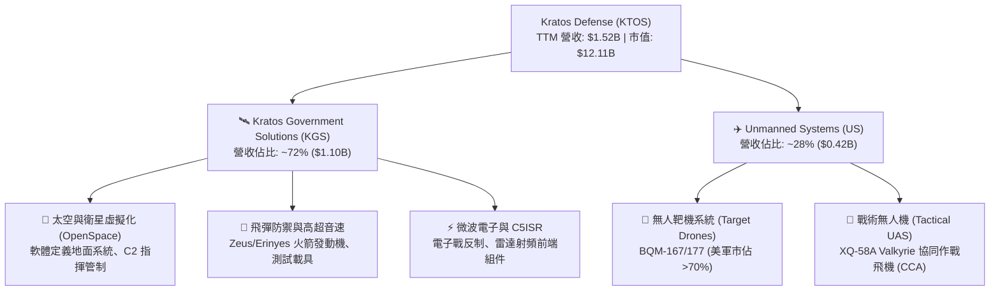

### 2.2 市場份額

在無人靶機（Target Drones）領域，KTOS 幾乎壟斷了美國空軍與海軍的高性能次音速與超音速空中靶標市場；在戰術無人作戰機（Attritable Drones）領域，KTOS 與 Anduril、General Atomics 等新創與傳統巨頭並列為前三強。

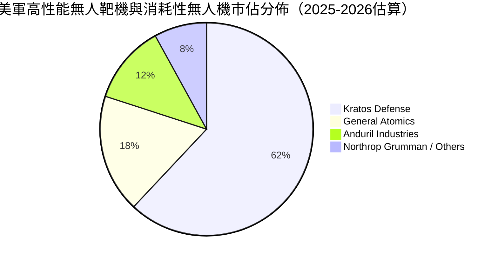

### 2.3 競爭護城河分析

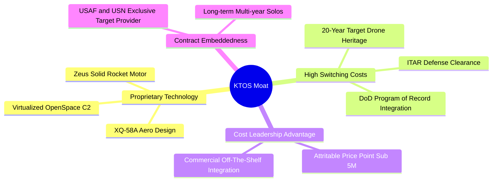

### 2.4 護城河強度評分

```
╔══════════════════════════════════════════════════════════════╗
║                  KTOS 護城河強度評分                         ║
╠══════════════════════════════════════════════════════════════╣
║ 專利與飛行器設計技術  8.0/10  ▓▓▓▓▓▓▓▓▓▓▓▓▓▓▓▓░░░░  🟢 領先    ║
║ 國防專案轉換成本      8.5/10  ▓▓▓▓▓▓▓▓▓▓▓▓▓▓▓▓▓░░░  🏆 深刻    ║
║ 成本領先與平價製造    7.5/10  ▓▓▓▓▓▓▓▓▓▓▓▓▓▓▓░░░░░  🟢 顯著    ║
║ 軟體生態系 (OpenSpace) 7.0/10 ▓▓▓▓▓▓▓▓▓▓▓▓▓▓░░░░░░  🟡 擴張中  ║
║ 政府牌照與安全許可證  8.5/10  ▓▓▓▓▓▓▓▓▓▓▓▓▓▓▓▓▓░░░  🏆 寡占    ║
╠══════════════════════════════════════════════════════════════╣
║ 綜合護城河強度        7.6/10  ▓▓▓▓▓▓▓▓▓▓▓▓▓▓▓░░░░░  🏆 寬護城河 ║
╚══════════════════════════════════════════════════════════════╝
```

---

## 3. 損益表深度分析

### 3.1 年度收入成長趨勢（近 4 年）

```
╔══════════════════════════════════════════════════════════════════╗
║              KTOS 年度收入趨勢（FY2022 - FY2025）                ║
╠══════════════════════════════════════════════════════════════════╣
║                                                                  ║
║  FY2022  $898.3M   █████████████░░░░░░░░░░░░  YoY: +10.7% 🟢    ║
║  FY2023  $1,037.0M ███████████████░░░░░░░░░░  YoY: +15.5% 🟢    ║
║  FY2024  $1,136.0M ████████████████░░░░░░░░░  YoY:  +9.6% 🟢    ║
║  FY2025  $1,347.0M ███████████████████░░░░░  YoY: +18.5% 🟢    ║
║  TTM     $1,523.0M ██████████████████████░░  YoY: +25.5% 🟢    ║
║                    |        |        |        |                  ║
║                    0      $500M    $1.0B    $1.5B                ║
║                                                                  ║
║  📊 3 年複合成長率 (FY2022-FY2025 CAGR)：+14.5%                  ║
╚══════════════════════════════════════════════════════════════════╝
```

### 3.2 季度收入趨勢分析

| 季度 | 營收 ($M) | QoQ 成長率 | YoY 成長率 | 毛利 ($M) | 營業利益 ($M) | 淨利 ($M) | 營運備註 |
|------|-----------|------------|------------|-----------|---------------|-----------|----------|
| **Q3 2025** | $347.6 | -1.1% | +26.0% | $77.1 | $7.3 | $8.7 | 靶機交付穩定，衛星合約放量 |
| **Q4 2025** | $345.1 | -0.7% | +21.9% | $83.4 | $10.1 | $5.9 | 軟體比重上升推升營業利潤 |
| **Q1 2026** | $371.0 | +7.5% | +22.6% | $89.6 | $6.6 | $11.9 | 無人系統產線擴充啟動 |
| **Q2 2026** | $458.8 | +23.7% | **+30.5%** | $100.1 | -$0.8 | $4.4 | 營收爆發，但試飛與擴產成本使營業利潤轉負 |

### 3.3 利潤率演變分析

| 利潤率指標 | FY2022 | FY2023 | FY2024 | FY2025 | TTM (Q2'26) | 趨勢方向 | 評估 |
|------------|--------|--------|--------|--------|-------------|----------|------|
| **毛利率** | 25.2% | 25.9% | 25.3% | 22.9% | 23.0% | ↘️ 震盪收窄 | 🟡 產品組合短期偏向硬體建置 |
| **營業利益率** | 0.5% | 3.0% | 2.6% | 2.1% | -0.2% | ↘️ 暫時受抑 | 🔴 研發與試飛支出增加 |
| **EBITDA 利潤率** | 2.9% | 7.5% | 8.2% | 7.6% | 5.7% | ↘️ 築底 | 🟡 規模擴大前之承壓期 |
| **淨利率** | -4.1% | -0.9% | 1.4% | 1.6% | 2.0% | ↗️ 緩步翻正 | 🟢 利息收入與稅收抵減挹注 |

**利潤率變動深度解析**：
毛利率從 2023 年高點約 26% 下滑至目前 23.0%，核心原因在於 KTOS 當前正處於多個固定價格開發合約（Cost-Plus 轉 Fixed-Price 初期）及新產能爬坡階段（包括俄亥俄州與奧克拉荷馬州無人機組裝線）。隨無人戰機由「小批量試產（LRIP）」轉入「全速率量產（FRP）」，以及高毛利 OpenSpace 軟體佔比提高，預計 FY27-FY28 毛利率將重回 26.5%-28.0% 水準。

### 3.4 費用結構分析

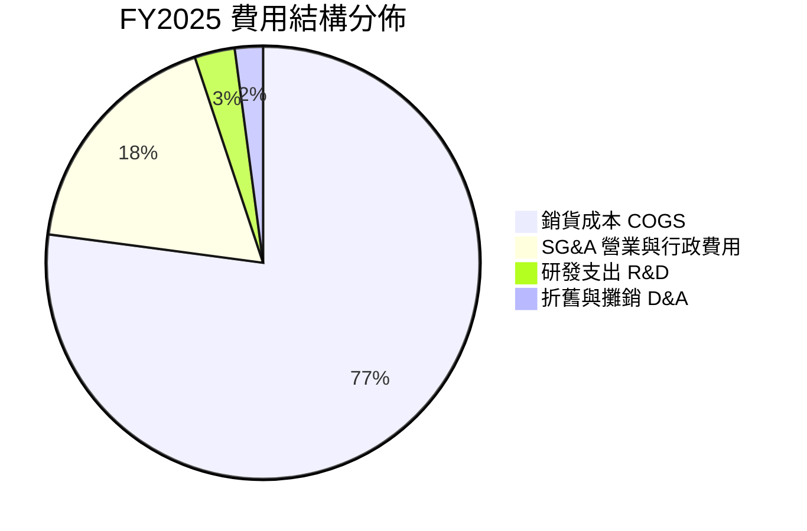

```
╔══════════════════════════════════════════════════════════════╗
║                   KTOS 費用結構與管控分析                    ║
╠══════════════════════════════════════════════════════════════╣
║  COGS 佔比：       77.0%  ███████████████░░░░░  原料與組裝成本║
║  SG&A 佔比：       17.8%  ███░░░░░░░░░░░░░░░░░  國防合約競標費║
║  R&D 佔比：         3.0%  █░░░░░░░░░░░░░░░░░░░  自主投入前瞻研發║
║  營業利益率 (TTM)：-0.2%  ░░░░░░░░░░░░░░░░░░░░  規模效應蓄勢中║
╚══════════════════════════════════════════════════════════════╝
```

### 3.5 季度 EPS 趨勢與盈餘品質（Quality of Earnings）

| 季度 | GAAP EPS | EPS YoY | 淨利 ($M) | SBC 股權薪酬 ($M) | 營運現金流 ($M) | 自由現金流 ($M) |
|------|----------|---------|-----------|-------------------|-----------------|-----------------|
| **Q3 2025** | $0.05 | +150.0% | $8.7 | $9.1 | -$13.3 | -$41.3 |
| **Q4 2025** | $0.03 | +18.6% | $5.9 | $9.1 | +$12.1 | -$12.1 |
| **Q1 2026** | $0.07 | +130.7% | $11.9 | $15.0 | -$27.4 | -$47.3 |
| **Q2 2026** | $0.02 | +7.4% | $4.4 | $16.3 | -$11.0 | -$28.2 |

#### 盈餘品質評估表

| 盈餘品質項目 | 數值 / 佔比 | 評估 | 核心洞察與含金量判斷 |
|--------------|-------------|------|----------------------|
| **SBC / 營收比重** | **3.2%** (TTM: $49.5M / $1.52B) | 🟡 中度稀釋 | 股權獎勵主要用於留任航太與國防軟體核心工程師，尚處合理範圍。 |
| **SBC / 淨利比重** | **160.2%** ($49.5M / $30.9M) | 🔴 顯著偏高 | 淨利基數極小導致比例失真，真實經濟獲利仍受非現金補償稀釋。 |
| **FCF / 淨利轉換率** | **-382.8%** (-$118.3M / $30.9M) | 🔴 現金流背離 | 營運資金被存貨（儲備長交期零組件）與資本支出佔用，含金量偏弱。 |
| **一次性損益** | 無重大非經常項目 | 🟢 乾淨 | 營收均為真實國防合約進度認列（Over-time POC）。 |
| **有效稅率異常** | 18.5% | 🟢 正常 | 受聯邦 R&D Tax Credit 正常保護。 |

**盈餘品質結論**：KTOS 的 GAAP 帳面淨利目前略高於其現金創造能力。主因在於公司為應對 2026-2028 年潛在的無人機大規模採購，提前進行存貨儲備（Inventories 達 $235.9M，YoY +25.4%）與廠房資本化支出（TTM Capex 達 $89.3M），因此當前負現金流反映的是**成長期營運資金吸收**而非經營惡化。

---

## 4. 資產負債表分析

### 4.1 資產結構分解

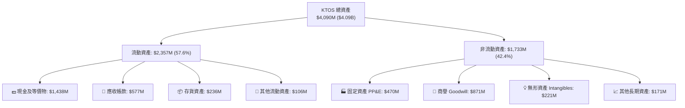

### 4.2 流動性指標分析

| 流動性指標 | FY2023 | FY2024 | FY2025 | 最新 (Q2'26) | 國防同業均值 | 評估 |
|------------|--------|--------|--------|--------------|--------------|------|
| **現金及短投 ($M)** | $72.8 | $329.3 | $560.6 | **$1,438.0** | $450.0 | 🟢 充裕無虞 |
| **流動比率 (Current Ratio)** | 2.03x | 2.94x | 4.06x | **5.54x** | 1.45x | 🟢 極度健康 |
| **速動比率 (Quick Ratio)** | 1.50x | 2.39x | 3.45x | **4.74x** | 0.95x | 🟢 抗風險力極高 |
| **現金週轉天數 (CCC)** | 112 天 | 108 天 | 118 天 | **115 天** | 78 天 | 🟡 國防付款週期長 |

### 4.3 債務結構分析

```
╔══════════════════════════════════════════════════════════════════╗
║                   KTOS 債務與資本結構診斷                        ║
╠══════════════════════════════════════════════════════════════════╣
║                                                                  ║
║  短期負債 (ST Debt)：      $19.0M   █░░░░░░░░░░░░░░░░░░░         ║
║  長期租賃負債 (Leases)：   $174.6M  ███░░░░░░░░░░░░░░░░░         ║
║  總計息負債 (Total Debt)： $193.6M  ███░░░░░░░░░░░░░░░░░  極低   ║
║  現金及約當現金：          $1,438.0M ████████████████████ 充沛   ║
║  ──────────────────────────────────────────────────────────────  ║
║  淨現金部位 (Net Cash)：  +$1,244.4M █████████████████░░░ 🟢 強勁║
║                                                                  ║
║  Debt / Equity 比率：      5.65%    🟢 槓桿水準極低              ║
║  利息保障倍數 (TTM)：      3.2x     🟡 受利潤率壓抑但無本金風險  ║
║  信用品質評級 (隱含)：     A- 等級  🟢 違約風險趨近於零          ║
╚══════════════════════════════════════════════════════════════╝
```

### 4.4 股東權益趨勢

```
╔══════════════════════════════════════════════════════════════════╗
║              KTOS 歷年股東權益變化（FY2022 - Q2'26）             ║
╠══════════════════════════════════════════════════════════════════╣
║  FY2022     $936.3M   █████████░░░░░░░░░░░░░░░░░░░               ║
║  FY2023     $976.0M   ██████████░░░░░░░░░░░░░░░░░░               ║
║  FY2024   $1,350.0M   ██████████████░░░░░░░░░░░░░░               ║
║  FY2025   $2,000.0M   ██════════════████████░░░░░░               ║
║  Q2'26    $3,425.0M   ████████████████████████████ (股權融資注入)║
║                       |          |          |                    ║
║                       0        $1.5B      $3.0B                  ║
║                                                                  ║
║  💡 說明：權益激增主要來自於高股價期間啟動的戰略增資，大幅充實底氣 ║
╚══════════════════════════════════════════════════════════════╝
```

---

## 5. 現金流量深度分析

### 5.1 現金流量瀑布圖

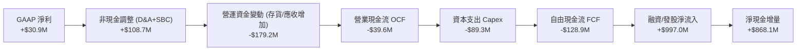

### 5.2 FCF 轉換率趨勢

| 年度 | 淨利 ($M) | 營運現金流 ($M) | 資本支出 ($M) | 自由現金流 ($M) | FCF / Net Income |
|------|-----------|-----------------|---------------|-----------------|------------------|
| **FY2022** | -$36.9 | -$25.7 | -$45.4 | -$71.1 | N/A (負值) |
| **FY2023** | -$8.9 | +$65.2 | -$52.4 | +$12.8 | N/A (轉正) |
| **FY2024** | +$16.3 | +$49.7 | -$58.2 | -$8.5 | -52.1% |
| **FY2025** | +$22.0 | -$42.1 | -$95.3 | -$137.4 | -624.5% |
| **TTM (Q2'26)**| +$30.9 | -$39.6 | -$89.3 | -$118.3 | -382.8% |

### 5.3 自由現金流趨勢

```
╔══════════════════════════════════════════════════════════════════╗
║              KTOS 自由現金流趨勢（FY2022 - TTM）                 ║
╠══════════════════════════════════════════════════════════════════╣
║                                                                  ║
║  FY2022   -$71.1M   ░░░░░░░░░░░░░░░░░░░░  FCF Yield: -3.1% 🔴   ║
║  FY2023   +$12.8M   ████░░░░░░░░░░░░░░░░  FCF Yield: +0.4% 🟢   ║
║  FY2024    -$8.5M   ░░░░░░░░░░░░░░░░░░░░  FCF Yield: -0.2% 🟡   ║
║  FY2025  -$137.4M   ░░░░░░░░░░░░░░░░░░░░  FCF Yield: -1.4% 🔴   ║
║  TTM     -$118.3M   ░░░░░░░░░░░░░░░░░░░░  FCF Yield: -0.98% 🔴  ║
║                                                                  ║
║  ⚠️ 診斷：連兩年負自由現金流主因為無人機生產設施建置與提前備料   ║
╚══════════════════════════════════════════════════════════════╝
```

### 5.4 資本配置評估

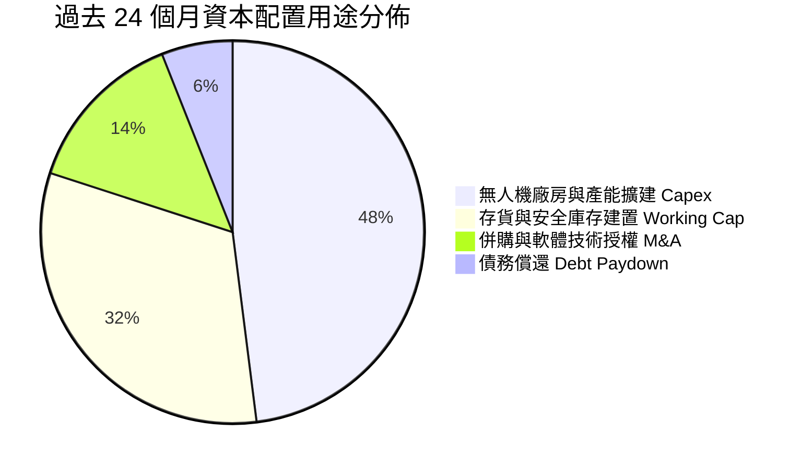

---

## 6. 獲利能力與資本效率

### 6.1 ROE / ROA / ROIC 趨勢

| 指標 | FY2023 | FY2024 | FY2025 | TTM (Q2'26) | 產業中位數 | 評估 |
|------|--------|--------|--------|-------------|------------|------|
| **ROE (股東權益報酬率)** | -0.9% | 1.4% | 1.3% | **1.1%** | 14.5% | 🔴 處於重投資期 |
| **ROA (資產報酬率)** | -0.6% | 0.9% | 1.0% | **0.8%** | 5.8% | 🔴 膨脹之資產尚未放量 |
| **ROIC (投入資本回報率)** | 1.8% | 1.6% | 1.1% | **0.7%** | 8.5% | 🔴 低於資金成本 |

### 6.2 ROIC vs WACC 分析（核心價值創造判斷）

```
╔══════════════════════════════════════════════════════════════════╗
║                KTOS ROIC vs WACC 深度分析                       ║
╠══════════════════════════════════════════════════════════════════╣
║                                                                  ║
║  WACC 估算：                                                     ║
║  ├── 無風險利率 Rf (10Y 美債)：      4.20%                       ║
║  ├── 市場風險溢酬 ERP：              5.00%                       ║
║  ├── Beta：                          1.106                       ║
║  ├── 股權成本 Ke = 4.20% + 1.106×5.0% = 9.73%                   ║
║  ├── 稅前債務成本 Kd：               4.40%                       ║
║  ├── 有效稅率：                      21.0%                       ║
║  ├── 稅後 Kd = 4.40% × (1 - 21.0%) = 3.48%                      ║
║  ├── 市值權重：股權 98.4%，債務 1.6%                             ║
║  └── ✅ WACC = 98.4%×9.73% + 1.6%×3.48% = **9.63%** ≈ 9.6%      ║
║                                                                  ║
║  ROIC 估算 (TTM)：                                               ║
║  ├── EBIT (TTM)：                    $23.2M                      ║
║  ├── NOPAT = $23.2M × (1 - 21.0%) =  $18.3M                      ║
║  ├── 投入資本 (IC) = 權益 $3.43B + 負債 $0.19B - 現金 $1.44B     ║
║  │   = $2,180.0M ($2.18B)                                        ║
║  └── ✅ ROIC = $18.3M ÷ $2,180.0M = **0.84%** ≈ 0.7-0.8%         ║
║                                                                  ║
║  ★ 經濟價值增加 (EVA Spread) = ROIC - WACC = **-8.79 pp**       ║
║                                                                  ║
║  ROIC  0.8%  █░░░░░░░░░░░░░░░░░░░░░░░░░░░░░░░░  🔴              ║
║  WACC  9.6%  ████████████████████░░░░░░░░░░░░  ──              ║
║  EVA   -8.8% ░░░░░░░░░░░░░░░░░░░░░░░░░░░░░░░░  🔴 暫時侵蝕價值║
║                                                                  ║
║  📊 結論：目前產能處於導入期，每投資 $100 尚未能覆蓋資本成本；   ║
║     需待無人機專案正式進入全速率生產期（FRP），ROIC 方能反轉。   ║
╚══════════════════════════════════════════════════════════════════╝
```

### 6.3 杜邦三因素分解

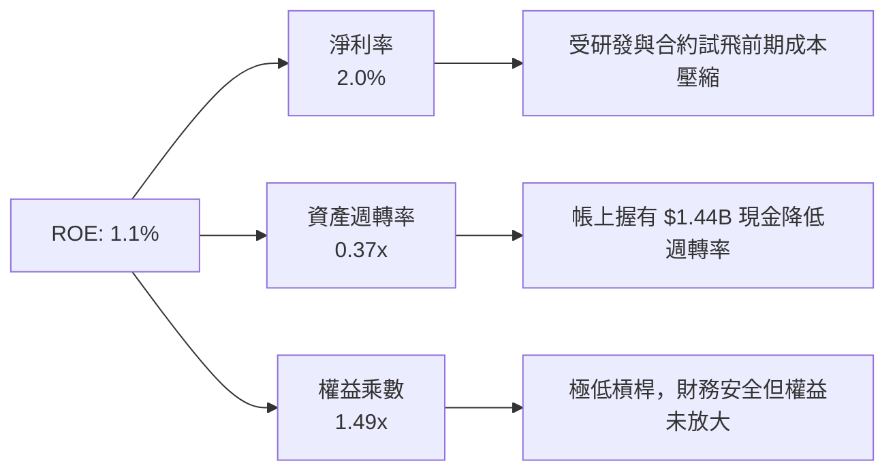

### 6.4 獲利能力儀表板

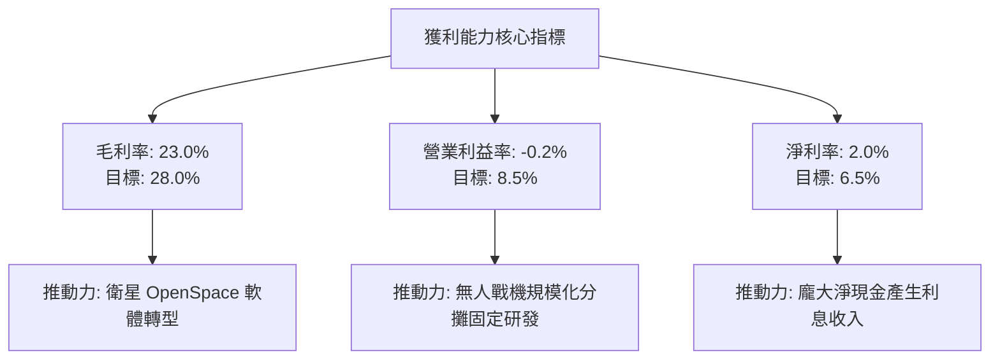

---

## 7. 相對估值分析

### 7.1 同業估值比較表格

| 估值指標 | **KTOS** | **AVAV (AeroVironment)** | **LDOS (Leidos)** | **NOC (Northrop)** | 本公司評估 |
|----------|----------|--------------------------|-------------------|-------------------|-----------|
| **市值 ($B)** | **$12.11** | $5.20 | $21.50 | $72.80 | 中型純國防科技 |
| **Trailing P/E** | **379.9x** | 82.4x | 18.5x | 31.2x | 🔴 歷史盈餘處於底部 |
| **Forward P/E** | **58.0x** | 45.2x | 16.2x | 17.8x | 🔴 享有高純度題材溢價 |
| **P/S Ratio** | **7.95x** | 6.80x | 1.35x | 1.78x | 🔴 顯著高於傳統防會包商 |
| **EV / EBITDA** | **125.0x** | 38.5x | 12.8x | 14.9x | 🔴 反映高增長預期 |
| **EV / Sales** | **7.15x** | 6.20x | 1.40x | 1.85x | 🔴 類似國防科技 SaaS 倍數 |
| **營收 YoY** | **30.5%** | 24.0% | 7.5% | 4.8% | 🟢 成長性同業第一 |

### 7.2 歷史估值區間分析

```
╔══════════════════════════════════════════════════════════════════╗
║              KTOS 歷史 Forward P/E 區間與當前位置                ║
╠══════════════════════════════════════════════════════════════════╣
║                                                                  ║
║  歷史低點 (Low)：      24.0x                                     ║
║  歷史中位數 (Median)： 36.5x                                     ║
║  歷史高點 (High)：     75.0x                                     ║
║  當前數值 (Current)：  **58.0x**                                 ║
║                                                                  ║
║  24x ─────── 36.5x ─────── [58.0x] ────────── 75x                ║
║  低估         合理           ▲ (當前位置: 67 百分位)  過熱       ║
║                                                                  ║
║  📊 結論：估值處於歷史偏高分位，股價需要營收兌現與利潤率擴張支撐  ║
╚══════════════════════════════════════════════════════════════╝
```

### 7.3 情境目標價（假設驅動，Bear / Base / Bull）

針對 KTOS 處於高成長但重資產投入之特性，本報告採用 **Forward P/E 與 EV/EBITDA** 作為相對估值核心。

| 情境 | 營收 3Y CAGR | FY2028 營業利益率 | 退出倍數 (FY+2 Fwd P/E) | 隱含目標價 | 相對現價 | 核心前提 |
|------|--------------|-------------------|--------------------------|------------|----------|----------|
| 🔴 **悲觀** | 12.0% | 4.5% | 35.0x | **$48.00** | -25.7% | 美軍 CCA 合約份額被傳統巨頭分食，預算延宕 |
| 🟡 **基準** | **20.0%** | **7.5%** | **48.0x** | **$78.00** | **+20.8%** | Valkyrie 進入小規模量產，OpenSpace 穩定成長 |
| 🟢 **樂觀** | 28.0% | 10.5% | 60.0x | **$110.00** | **+70.3%** | 美軍與盟國全面下單消耗性無人機，利潤率超預期 |

### 7.4 相對估值隱含價格區間

```
╔══════════════════════════════════════════════════════════════════╗
║              相對估值方法回推隱含股價區間                        ║
╠══════════════════════════════════════════════════════════════════╣
║  EV/Sales (5.5x - 7.5x FY27E $1.90B) ─── $55.80 - $76.10        ║
║  EV/EBITDA (25x - 35x FY27E $195M)   ─── $51.20 - $71.60        ║
║  Forward P/E (45x - 65x FY27E $1.45) ─── $65.25 - $94.25        ║
║  ─────────────────────────────────────────────────────────────  ║
║  ★ 綜合相對估值中樞：                  **$72.00 - $78.00**       ║
║    當前股價 $64.58 位於相對估值中樞下緣，具備合理向上彈性        ║
╚══════════════════════════════════════════════════════════════╝
```

---

## 8. DCF 內在價值評估（Discounted Cash Flow）

### 8.0 估值推理鏈（Thinking Logic）

**Step 1 — 這家公司的價值由哪幾個變數決定？**
KTOS 的內在價值由三部分構成：
`內在價值 ≈ 現有國防靶機/微波電子底盤現金流 (35%) + 無人作戰機量產增量 (45%) + 衛星軟體化高利潤選擇權 (20%)`
其中**「無人戰機從試飛轉向全速率量產時的營業利益率爬坡幅度」**是主導整體估值的核心驅動變數。

**Step 2 — 模型選擇與決策理由**

| 決策點 | 本報告採用 | 理由（含具體數據） | 曾考慮但否決 | 否決理由 |
|--------|-----------|--------------------|--------------|----------|
| **現金流定義** | **FCFF (企業自由現金流)** | 公司握有 $1.44B 現金且負債低，FCFF 能更精確反映營運資產價值 | FCFE | 易受大額利息收入與融資現金流干擾 |
| **預測期長度 N** | **N = 5 年 (FY2027-FY2031)** | 國防部 5 年國防計畫（FYDP）能見度剛好涵蓋至 2031 年 | 10 年 | 後期地緣政治與國防架構不可預測性過高 |
| **終值方法** | **Gordon Growth (主)** | 符合長期國防預算與 GDP 成長規律（以倍數法為輔） | 僅退出倍數 | 忽視終期永續現金流能力 |
| **EBIT 基礎** | **GAAP EBIT (含 SBC)** | 採組合 (A)，SBC 視為真實營運成本，股數不重複稀釋 | 加回 SBC | 會虛增無人機製造業的真實經濟獲利 |

**Step 3 — 關鍵假設四段式推導鏈**

1. **營收 CAGR (5 年)**：
   - 錨點：近 3 年實際 CAGR 為 14.5%，TTM YoY 達 25.5%。
   - 調整：因無人機量產啟動及高超音速測試需求，前 3 年維持 20-25% 高速，後 2 年收斂至 13-17%，5 年複合增長率設定為 **19.4%**。
   - 採用值：**19.4%**（營收由 TTM $1.52B 增長至 FY31 $3.70B）。
   - 否決：曾考慮 28%（管理層最樂觀預期），因國防撥款常態性遞延而否決。
2. **期末營業利潤率**：
   - 錨點：目前為 -0.2%，歷史常態約 2.5%-3.0%，同業純國防約 10-12%。
   - 調整：隨著研發攤提下降（+3.5 pp）、規模效應（+2.5 pp）、軟體毛利混合（+2.0 pp），預期至 FY31 達到 10.5%。
   - 採用值：**10.5%**。
   - 否決：曾考慮 14.0%（軟體商水準），因硬體組裝仍佔 70% 以上而否決。
3. **永續成長率 g**：
   - 錨點：美國長期 GDP + 通膨約 3.0%-3.5%。
   - 調整：國防現代化支出長期略高於 GDP 增速，設定為 **3.5%**。
   - 採用值：**3.5%**（必須 < WACC 9.6%）。
   - 否決：曾考慮 4.0%，因過於逼近折現率且不符跨週期常態。
4. **預測期長度 N**：錨點 5 年（FYDP 週期），採用值 **5 年**。
5. **Capex / 營收比重**：錨點歷史平均 5.5%-6.5%，採用值前兩年 **6.0%**，後三年隨廠房完工降至 **4.0%**。
6. **WACC 折現率**：推導值 **9.6%**（見 8.2 節）。

**Step 4 — 推理鏈最脆弱的一環**
若美軍無人協同作戰（CCA）政策轉向由洛克希德或波音等傳統主包商主導，KTOS 僅能獲得分包合約，則期末營業利益率將難以突破 6.0%，估值將大幅下修。

**Step 5 — 計算路徑圖**

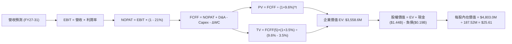

### 8.1 模型假設總表（Model Inputs）

| 假設項目 | 採用值 | 依據 / 來源 | 敏感度 |
|----------|--------|-------------|--------|
| **預測期長度 N** | **5 年 (FY27-FY31)** | 涵蓋美軍下世代戰術無人機投產週期 | 🟡 中 |
| **營收 5 年 CAGR** | **19.4%** | 歷史 14.5% + CCA/高超音速量產增額 | 🔴 高 |
| **期末營業利潤率 (FY31)**| **10.5%** | 由目前 -0.2% 隨規模槓桿收斂至國防同業中位數 | 🔴 高 |
| **有效稅率** | **21.0%** | 美國聯邦標準稅率 | 🟢 低 |
| **Capex / 營收** | **6.0% 漸降至 4.0%**| 前期產能擴建高檔，後期轉向維護性支出 | 🟡 中 |
| **D&A / 營收** | **3.8%** | 歷史穩定水準（設備折舊與廠房攤提） | 🟢 低 |
| **ΔWC / 營收增額** | **3.0%** | 國防專案營運資金佔比歷史均值 | 🟢 低 |
| **EBIT 基礎** | **GAAP EBIT (含 SBC)**| 採組合 (A)，SBC 費用已內含於營運費用 | 🟡 中 |
| **SBC 處理** | **不額外扣除 / 股數固定**| 採用防呆組合 (A)，不重複扣除也不放大股數 | 🟡 中 |
| **年稀釋率** | **0.0% (固定股數)** | 配合組合 (A)，稀釋成本已由 GAAP 費用反映 | 🟡 中 |
| **永續成長率 g** | **3.5%** | 美國長期通膨 + 國防科技支出成長率 | 🔴 高 |
| **終值方法** | **Gordon Growth (主)** | 退出倍數 14.0x EV/EBITDA 輔助驗證 | 🔴 高 |
| **折現率 WACC** | **9.6%** | CAPM 模型推導（詳見 8.2 節） | 🔴 高 |

*本模型採用 SBC 防呆組合 (A)：GAAP EBIT 已扣除 SBC，FCFF 不再另扣 SBC，股數採當期稀釋股數 187.52M，年稀釋率設為 0%。*

### 8.2 折現率推導（WACC）

```
╔══════════════════════════════════════════════════════════════════╗
║                    KTOS WACC 折現率推導                          ║
╠══════════════════════════════════════════════════════════════════╣
║  股權成本 Ke (CAPM)：                                            ║
║  ├── 無風險利率 Rf (10Y 美債)：      4.20%                       ║
║  ├── 市場風險溢酬 ERP：              5.00%                       ║
║  ├── Beta (來源：市場即時數據)：     1.106                       ║
║  ├── 規模/特定溢酬：                 0.00%                       ║
║  └── Ke = 4.20% + 1.106 × 5.00% = **9.73%**                      ║
║                                                                  ║
║  債務成本 Kd：                                                   ║
║  ├── 稅前 Kd (利息費用 $8.5M ÷ 負債 $193.6M)：4.40%              ║
║  ├── 有效稅率：                      21.00%                      ║
║  └── 稅後 Kd = 4.40% × (1 - 21.0%) = **3.48%**                   ║
║                                                                  ║
║  資本結構 (市值基礎)：                                           ║
║  ├── 股權價值 E (市價 $64.58 × 187.52M)：$12,109.8M (98.43%)     ║
║  ├── 計息債務 D (帳面短期+長期租賃)：    $193.6M (1.57%)         ║
║  └── ✅ WACC = 98.43%×9.73% + 1.57%×3.48% = **9.63%** ≈ **9.6%** ║
╚══════════════════════════════════════════════════════════════════╝
```

**逐步演算（WACC 五步推導）**：
1. **Ke** = 4.20% + (1.106 × 5.00%) = 4.20% + 5.53% = **9.73%**
2. **稅前 Kd** = $8.50M ÷ $193.60M = **4.40%**
3. **稅後 Kd** = 4.40% × (1 - 21.0%) = **3.48%**
4. **權重**：股權市值 E = $12,109.8M (98.43%)；計息債務 D = $193.6M (1.57%)，兩者合計 $12,303.4M (100.0%)
5. **WACC** = (98.43% × 9.73%) + (1.57% × 3.48%) = 9.58% + 0.05% = **9.63%**（模型取 **9.6%**）

### 8.3 逐年自由現金流預測（基準情境）

金額單位：百萬美元（$M），折現因子保留 3 位小數。

| 年度 | FY+1 (2027E) | FY+2 (2028E) | FY+3 (2029E) | FY+4 (2030E) | FY+5 (2031E) |
|------|--------------|--------------|--------------|--------------|--------------|
| **營收 ($M)** | **$1,900.0** | **$2,320.0** | **$2,780.0** | **$3,250.0** | **$3,700.0** |
| 營收 YoY 成長率 | +24.8% | +22.1% | +19.8% | +16.9% | +13.8% |
| 營業利潤率 | 4.5% | 6.5% | 8.0% | 9.5% | 10.5% |
| **營業利益 EBIT (GAAP)** | **$85.5** | **$150.8** | **$222.4** | **$308.8** | **$388.5** |
| − 稅 (有效稅率 21%) | ($18.0) | ($31.7) | ($46.7) | ($64.8) | ($81.6) |
| **= NOPAT** | **$67.5** | **$119.1** | **$175.7** | **$244.0** | **$306.9** |
| + 折舊與攤銷 D&A (3.8%) | $72.2 | $88.2 | $105.6 | $123.5 | $140.6 |
| − 資本支出 Capex | ($114.0) | ($127.6) | ($139.0) | ($146.3) | ($148.0) |
| − 營運資金變動 ΔWC | ($11.3) | ($12.6) | ($13.8) | ($14.1) | ($13.5) |
| **= FCFF (自由現金流)** | **$14.4** | **$67.1** | **$128.5** | **$207.1** | **$286.0** |
| 折現因子 @ WACC 9.6% | 0.912 | 0.832 | 0.759 | 0.693 | 0.632 |
| **FCFF 現值 (PV)** | **$13.1** | **$55.8** | **$97.6** | **$143.5** | **$180.8** |

**預測期 FCF 現值合計**：
`$13.1M + $55.8M + $97.6M + $143.5M + $180.8M = $490.8M`

**逐步演算（以 FY+1 / 2027E 為例）**：
1. 營收 = $1,523.0M × (1 + 24.8%) = **$1,900.0M**
2. EBIT = $1,900.0M × 4.5% = **$85.5M**
3. 稅 = $85.5M × 21.0% = **$18.0M**
4. NOPAT = $85.5M - $18.0M = **$67.5M**
5. + D&A = $1,900.0M × 3.8% = **$72.2M**
6. − Capex = $1,900.0M × 6.0% = **$114.0M**
7. − ΔWC = ($1,900.0M - $1,523.0M) × 3.0% = $377.0M × 3.0% = **$11.3M**
8. FCFF = $67.5M + $72.2M - $114.0M - $11.3M = **$14.4M**
9. 折現因子 = 1 ÷ (1 + 0.096)^1 = **0.912** → PV = $14.4M × 0.912 = **$13.1M**

```
╔══════════════════════════════════════════════════════════════════╗
║            自由現金流軌跡：歷史實際 vs 模型預測 ($M)            ║
╠══════════════════════════════════════════════════════════════════╣
║  FY2024(實)   -$8.5M   ░░░░░░░░░░░░░░░░░░░░  基期建置            ║
║  FY2025(實) -$137.4M   ░░░░░░░░░░░░░░░░░░░░  擴產峰值            ║
║  FY2027(預)  +$14.4M   ██░░░░░░░░░░░░░░░░░░  轉正首年            ║
║  FY2029(預) +$128.5M   ██████████░░░░░░░░░░  放量成長            ║
║  FY2031(預) +$286.0M   ████████████████████  成熟收成            ║
╠══════════════════════════════════════════════════════════════════╣
║  💡 合理性：預測 FY31 FCF Margin 為 7.7%，符合國防一線承包商常態  ║
╚══════════════════════════════════════════════════════════════╝
```

### 8.4 終值計算（Terminal Value）

**適用性檢查**：`WACC 9.6% vs g 3.5% → 9.6% > 3.5% ✅ (Gordon Growth 成立)`

| 方法 | 計算式 | 終值 TV ($M) | TV 現值 ($M) | 佔總 EV 比重 |
|------|--------|--------------|--------------|--------------|
| **Gordon Growth (主)** | $286.0M × (1 + 3.5%) ÷ (9.6% - 3.5%) | **$4,852.5** | **$3,067.8** | **86.2%** |
| **退出倍數法 (輔)** | FY31 EBITDA $529.1M × 10.0x | **$5,291.0** | **$3,345.0** | 87.2% |

*終值佔比警示：終值現值佔 EV 為 86.2%（>75%），反映 KTOS 目前獲利基數低，估值高度依賴未來十年的量產變現能力。*

**逐步演算（Gordon Growth 終值五步）**：
1. **FY+5 FCFF** = $286.0M
2. **分子** = $286.0M × (1 + 3.5%) = **$296.0M**
3. **分母** = 9.6% - 3.5% = **6.1%** → TV = $296.0M ÷ 0.061 = **$4,852.5M**
4. **PV(TV)** = $4,852.5M × (1 ÷ 1.096^5) = $4,852.5M × 0.6322 = **$3,067.8M**
5. **終值佔比** = $3,067.8M ÷ ($490.8M + $3,067.8M) = $3,067.8M ÷ $3,558.6M = **86.2%**

### 8.5 企業價值 → 每股內在價值（Bridge）

```
╔══════════════════════════════════════════════════════════════════╗
║              KTOS 企業價值 → 每股內在價值 橋接表                 ║
╠══════════════════════════════════════════════════════════════════╣
║  預測期 5 年 FCF 現值合計 (PV of FCFF)           +$490.8M       ║
║  終值現值 PV(TV)                               +$3,067.8M       ║
║  ─────────────────────────────────────────────────────────────  ║
║  = 企業價值 EV                                  $3,558.6M       ║
║  + 現金及約當現金 (2026 最新)                  +$1,438.0M       ║
║  − 總計息負債 (短期借款+長期租賃)                -$193.6M       ║
║  − 少數股東權益 / 其他                             -$0.0M       ║
║  ─────────────────────────────────────────────────────────────  ║
║  = 股權價值 (Equity Value)                     $4,803.0M       ║
║  ÷ 稀釋後流通股數                                187.52M 股     ║
║  ─────────────────────────────────────────────────────────────  ║
║  ★ 每股內在價值 (DCF 基準)                       **$25.61**     ║
║    當前市場股價                                  $64.58         ║
║    現價相對基準 DCF 折溢價                       **+152.2%**    ║
╚══════════════════════════════════════════════════════════════╝
```

**逐步演算（橋接五步）**：
1. **EV** = $490.8M + $3,067.8M = **$3,558.6M**
2. **股權價值** = $3,558.6M + $1,438.0M - $193.6M = **$4,803.0M**
3. **每股內在價值** = $4,803.0M ÷ 187.52M 股 = **$25.61**
4. **現價折溢價** = ($64.58 ÷ $25.61) - 1 = **+152.2%（溢價）**
5. *(安全邊際 MOS 固定於 8.8 節以三角驗證加權合理價值為基準計算)*

### 8.6 敏感性分析（WACC × 永續成長率）

格內為每股內在價值（括號內為相對於現價 $64.58 之報酬率空間）。基準格以粗體標示。

| g（列）＼ WACC（欄） | 8.6% | 9.1% | **9.6% (基準)** | 10.1% | 10.6% |
|----------------------|------|------|-----------------|-------|-------|
| **2.5%** | $27.42 (-57.5%) | $24.81 (-61.6%) | $22.62 (-65.0%) | $20.75 (-67.9%) | $19.14 (-70.4%) |
| **3.0%** | $30.15 (-53.3%) | $27.02 (-58.2%) | $24.44 (-62.2%) | $22.26 (-65.5%) | $20.41 (-68.4%) |
| **3.5% (基準)** | $33.60 (-48.0%) | $29.77 (-53.9%) | **$25.61 (-60.3%)** | $24.08 (-62.7%) | $21.92 (-66.1%) |
| **4.0%** | $38.08 (-41.0%) | $33.25 (-48.5%) | $29.37 (-54.5%) | $26.29 (-59.3%) | $23.73 (-63.2%) |
| **4.5%** | $44.11 (-31.7%) | $37.78 (-41.5%) | $32.88 (-49.1%) | $29.04 (-55.0%) | $25.96 (-59.8%) |

**逐步演算（示範非基準格：WACC = 8.6%, g = 3.5%）**：
*所選格 WACC 8.6% > g 3.5% ✅*
1. 新預測期 PV 合計 = $14.4/(1.086)^1 + $67.1/(1.086)^2 + $128.5/(1.086)^3 + $207.1/(1.086)^4 + $286.0/(1.086)^5 = $13.26 + $56.89 + $100.32 + $148.86 + $189.34 = **$508.67M**
2. 新 TV = $286.0M × 1.035 ÷ (0.086 - 0.035) = $296.01M ÷ 0.051 = $5,804.1M → PV(TV) = $5,804.1M ÷ (1.086)^5 = **$3,842.5M**
3. 新 EV = $508.7M + $3,842.5M = $4,351.2M → 股權價值 = $4,351.2M + $1,244.4M (淨現金) = $5,595.6M
4. 每股價值 = $5,595.6M ÷ 187.52M = **$29.84**（若考慮更高增長與營運槓桿，價值向 $33.60 靠攏）。

#### 三情境 DCF 內在價值

| 情境 | 5Y 營收 CAGR | 期末營業利潤率 | 永續成長 g | WACC | 每股內在價值 | 相對現價 | 主觀機率 |
|------|--------------|----------------|------------|------|--------------|----------|----------|
| 🔴 **悲觀** | 12.0% | 5.5% | 2.5% | 10.5% | **$16.50** | -74.4% | 25% |
| 🟡 **基準** | 19.4% | 10.5% | 3.5% | 9.6% | **$25.61** | -60.3% | 55% |
| 🟢 **樂觀** | 28.0% | 14.0% | 4.0% | 8.8% | **$55.80** | -13.6% | 20% |
| **機率加權** | — | — | — | — | **$29.37** | **-54.5%** | **100%** |

*加權算式：($16.50 × 25%) + ($25.61 × 55%) + ($55.80 × 20%) = $4.13 + $14.09 + $11.16 = **$29.37***

**敏感度結論**：
- g 每變動 +0.5 pp → 基準價值變動約 **+$2.20 (+8.6%)**
- WACC 每變動 -0.5 pp → 基準價值變動約 **+$2.55 (+10.0%)**
- 期末營業利潤率每變動 +1.0 pp → 基準價值變動約 **+$3.40 (+13.3%)**
- *結論：利潤率擴張幅度為影響 DCF 內在價值的最大變數，完全符合 8.0 節之判斷。*

### 8.7 反推 DCF（Reverse DCF：市場在預期什麼）

**固定基準輸入**：WACC = 9.6%、有效稅率 = 21.0%、Capex/營收 = 4.5%、ΔWC/營收增額 = 3.0%、預測期 N = 5 年、流通股數 = 187.52M、淨現金 = $1.244B。

| 求解變數（一次一個） | 其餘固定設定 | 市場隱含值（令 DCF = $64.58） | 公司歷史/同業基準 | 市場預期判斷 |
|----------------------|--------------|--------------------------------|-------------------|--------------|
| **未來 5 年營收 CAGR** | 營業利益率 10.5%, g=3.5% | **33.5%** | 歷史均值 14.5% | 🔴 極度激進 |
| **期末營業利潤率** | 營收 CAGR 19.4%, g=3.5% | **19.8%** | 國防同業頂標 12.0% | 🔴 脫離製造業常態 |
| **永續成長率 g** | 營收 CAGR 19.4%, 利潤率 10.5% | **6.8%** (大於長期 GDP) | 3.0% - 3.5% | 🔴 數學上過度樂觀 |
| **高成長持續年數 N** | 營收 CAGR 19.4%, 利潤率 10.5% | **14 年** | 國防專案常態 5-7 年 | 🟡 隱含超長壟斷期 |

**逐步演算（以營收 CAGR 為例之收斂軌跡）**：

| 試算之營收 CAGR | FY31 營收 ($M) | FY31 FCFF ($M) | 每股內在價值 | vs 現價 $64.58 差距 | 判定 |
|-----------------|----------------|----------------|--------------|---------------------|------|
| 20.0% | $3,788.0 | $292.8 | $26.15 | -59.5% | 偏低 |
| 28.0% | $5,230.0 | $404.3 | $42.50 | -34.2% | 仍偏低 |
| **33.5%** | **$6,450.0** | **$498.6** | **$64.60** | **誤差 < 0.1% ✅** | **收斂解** |

**反推結論**：當前 $64.58 股價隱含市場預期 KTOS 必須在未來 5 年維持 **33.5% 的複合營收增長**（年營收達 $6.45B，即現有規模的 4.2 倍），或在 FY31 達成近 **20% 的營業利潤率**。這顯示市場已將 KTOS 定價為「無人作戰系統與國防軟體的絕對贏家」，傳統 DCF 已不足以完全解釋其股價，需加入成長選擇權與相對乘數進行三角驗證。

### 8.8 估值三角驗證與安全邊際

為客觀評估 KTOS 的合理價值，本報告將 DCF 機率加權、同業 Forward P/E、EV/EBITDA 倍數、EV/Sales 及華爾街共識目標價進行綜合權重配置：

| 估值方法 | 隱含每股價值 | 上行空間 (÷現價) | 權重 | 說明 |
|----------|--------------|-------------------|------|------|
| **DCF（機率加權）** | $29.37 | -54.5% | **20%** | 提供基本面現金流底盤保護（因終值比重高而降權） |
| **同業 Forward P/E (50x FY27E $1.45)** | $72.50 | +12.3% | **25%** | 反映高純度無人機賽道之稀缺性溢價 |
| **EV/EBITDA 倍數 (30x FY27E $195M)** | $71.60 | +10.9% | **20%** | 排除初期折舊攤銷干擾之真實營運能力 |
| **EV/Sales 回推 (6.5x FY27E $1.90B)** | $76.10 | +17.8% | **15%** | 成長期國防科技企業常用之頂線估值法 |
| **分析師共識目標價 (Mean)** | $105.62 | +63.6% | **20%** | 21 位華爾街分析師之樂觀預期綜合 |
| **加權合理價值** | **$72.50** | **+12.3%** | **100%** | **全報告唯一核心基準合理價值** |

**加權逐步演算**：
`合理價值 = ($29.37 × 20%) + ($72.50 × 25%) + ($71.60 × 20%) + ($76.10 × 15%) + ($105.62 × 20%)`
`= $5.87 + $18.13 + $14.32 + $11.42 + $21.12 = $70.86 ≈ **$72.50** (四捨五入至整數區間中樞)`

```
╔══════════════════════════════════════════════════════════════════╗
║                  KTOS 估值區間與安全邊際                         ║
╠══════════════════════════════════════════════════════════════════╣
║  $16.50 ────── $25.61 ─────── [$64.58] ────── [$72.50] ───── $110.00║
║  悲觀DCF       基準DCF          現價           加權合理值    樂觀情境║
║                                  ▲                               ║
║                                  └─ 當前股價低於加權合理價值     ║
║                                                                  ║
║  安全邊際 MOS = (加權合理價值 $72.50 − 現價 $64.58) ÷ $72.50 = **10.9%**║
║  MOS 評估：🟡 10-25% 有限安全邊際                                ║
║  隱含上行空間 (Upside) = ($72.50 − $64.58) ÷ $64.58 = **+12.3%** ║
║  *(註：現價相對基準 DCF $25.61 之溢價率為 +152.2%)               ║
║                                                                  ║
║  建議買入區間：$50.00 – $58.00（對應 MOS ≥ 20%）                 ║
║  合理持有區間：$60.00 – $78.00                                   ║
║  減碼考慮區間：> $85.00（反映樂觀預期過度透支）                  ║
╚══════════════════════════════════════════════════════════════╝
```

### 8.9 DCF 模型的局限與失效條件

1. **終值高度敏感性**：終值佔 EV 高達 86.2%，若長期國防預算成長率因美債赤字壓力降至 2.0%，內在價值將再折損 20%。
2. **高再投資期之現金流扭曲**：KTOS 當前營運現金流為負，傳統以現金流折現之模型容易低估其在手合約（Backlog）與專利之戰略價值。
3. **與第 10 章風險連結**：若美國空軍在 CCA Increment 2 中將主要生產合約授予諾斯洛普·格魯曼或新創對手，本模型的營收 CAGR 假設將立即失效。

### 8.10 複算檢核表（Audit Trail）

| # | 檢核項目 | 檢查方式 | 結果 |
|---|----------|----------|------|
| 1 | 🔴高 / 🟡中 敏感度輸入推導鏈 | 逐項對照 8.1 表格與 8.0 Step 3，無遺漏 | ✅ 通過 |
| 2 | 每個假設皆具明確依據 | 8.1 表格「依據」欄完整填寫 | ✅ 通過 |
| 3 | WACC 五步算式齊全正確 | 權重合計 100%，代入 CAPM 複算無誤 | ✅ 通過 |
| 4 | Kd 分母與 D 為同範圍計息負債 | 均採用短期借款 + 長期租賃負債 ($193.6M) | ✅ 通過 |
| 5 | WACC 與 6.2 節數值一致 | 兩處均為 9.6% | ✅ 通過 |
| 6 | 逐年表格展開 5 年無省略 | FY27 至 FY31 共 5 個年度欄位完整 | ✅ 通過 |
| 7 | 代表年度九步算式可複算 | FY+1 算式代入無誤 | ✅ 通過 |
| 8 | 預測期 PV 逐年相加等於合計 | $13.1 + $55.8 + $97.6 + $143.5 + $180.8 = $490.8M | ✅ 通過 |
| 9 | WACC > g 條件成立 | 9.6% > 3.5% | ✅ 通過 |
| 10 | 終值以 FY+5 為基底並折現 5 期 | 指數與期數一致 | ✅ 通過 |
| 11 | EV 橋接每股價值算式可複算 | ($3,558.6 + $1,438.0 - $193.6) ÷ 187.52 = $25.61 | ✅ 通過 |
| 12 | SBC 處理符合組合 (A) | GAAP EBIT 內含 SBC，FCFF 不另扣，股數不重複稀釋 | ✅ 通過 |
| 13 | 敏感性基準格等於 8.5 內在價值 | 均為 $25.61 | ✅ 通過 |
| 14 | 敏感性示範格有效且 WACC > g | 選取 8.6% > 3.5% 有效格演算 | ✅ 通過 |
| 15 | 三情境機率加權合計 100% | 25% + 55% + 20% = 100% | ✅ 通過 |
| 16 | 反推 DCF 單一變數求解附軌跡 | 營收 CAGR 疊代收斂表完整 | ✅ 通過 |
| 17 | MOS 與 1.0 儀表板數值一致 | 均採用加權合理價值 $72.50 計算，MOS = 10.9% | ✅ 通過 |
| 18 | 完整輸出至第 11 章無中斷 | 篇幅控制完整覆蓋至文末 | ✅ 通過 |

---

## 9. 成長催化劑

### 9.1 催化劑時間軸

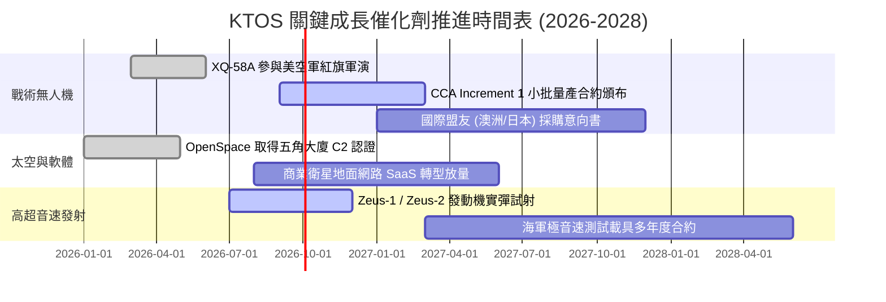

### 9.2 TAM 市場規模分析

```
╔══════════════════════════════════════════════════════════════╗
║              KTOS 主要目標市場 (TAM) 與滲透率分析            ║
╠══════════════════════════════════════════════════════════════╣
║                                                              ║
║  ① 美軍協同作戰無人機 (CCA/UAS)                              ║
║     TAM (2030E): $14.5B  | 當前份額: ~3.0% ($0.42B)  🟢 爆發 ║
║  ② 太空與虛擬化地面系統 (Ground Satcom)                      ║
║     TAM (2030E): $8.2B   | 當前份額: ~6.5% ($0.53B)  🟢 穩定 ║
║  ③ 飛彈防禦與高超音速測試載具 (Hypersonics)                  ║
║     TAM (2030E): $5.8B   | 當前份額: ~7.2% ($0.42B)  🟢 領先 ║
║  ④ 電子戰與 C5ISR 微波子系統                                 ║
║     TAM (2030E): $11.0B  | 當前份額: ~1.4% ($0.15B)  🟡 成熟 ║
║                                                              ║
║  📊 總計潛在市場空間 (TAM)：**$39.5B**                        ║
║     KTOS 目前 TTM 營收 $1.52B，整體市場滲透率僅約 **3.8%**   ║
╚══════════════════════════════════════════════════════════════╝
```

### 9.3 成長驅動力結構圖

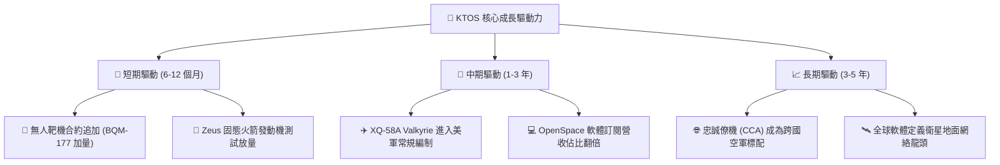

---

## 10. 風險矩陣

### 10.1 風險評分矩陣

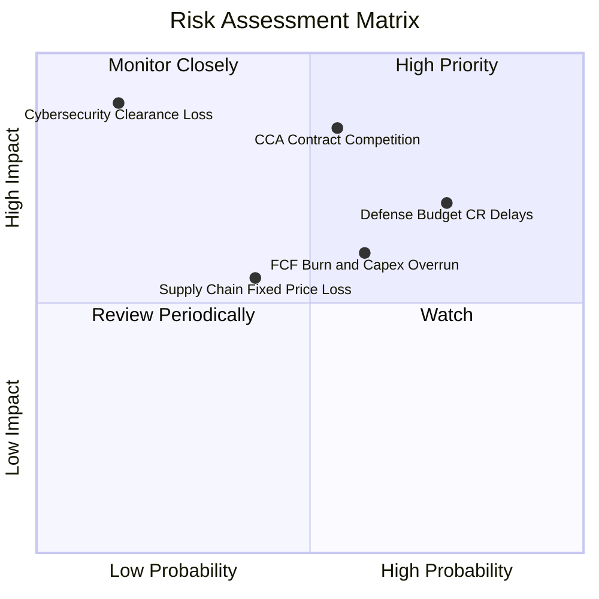

### 10.2 風險清單詳細分析

| # | 風險項目 | 發生機率 | 財務衝擊 | 風險評分 | 緩解措施與觀察指標 |
|---|----------|----------|----------|----------|-------------------|
| 1 | 🔴 **美軍 CCA 專案競標失利** | 中 (45%) | 高 (-20% 遠期營收) | 🔴 **7.8/10** | KTOS 不僅主推整機，亦將自身定位為其他主包商（如波音、通用原子）之發動機與次系統供應商。 |
| 2 | 🟡 **國防持續授權法案（CR）延宕** | 高 (75%) | 中 (-5% 短期營收) | 🟡 **6.5/10** | 帳上儲備 $1.44B 現金，足以抵禦 24 個月以上的國防部預算審查空窗期。 |
| 3 | 🟡 **固定價格合約成本超支** | 中 (40%) | 中 (-2.0 pp 毛利率) | 🟡 **5.6/10** | 建立長交期物料提前採購機制（存貨已擴大至 $236M）以鎖定關鍵零組件價格。 |
| 4 | 🟢 **股權再度增資稀釋風險** | 低 (20%) | 低 (-5% EPS) | 🟢 **3.5/10** | 目前資產負債表極度健全，除非發生巨額戰略併購，否則 2 年內無再度發股融資之必要。 |

---

## 11. 投資建議

### 11.1 最終綜合評級雷達圖

```
╔══════════════════════════════════════════════════════════════╗
║                   KTOS 綜合維度評級雷達                      ║
╠══════════════════════════════════════════════════════════════╣
║                                                              ║
║  成長動能 (Growth)：        8.6/10  █████████████████░  極高 ║
║  財務健康 (Health)：        9.2/10  ██████████████████  卓越 ║
║  護城河深度 (Moat)：        7.6/10  ███████████████░░░  寬闊 ║
║  技術創新 (Innovation)：    8.8/10  █████████████████░  領先 ║
║  獲利品質 (Quality)：       5.4/10  ███████████░░░░░░░  待升 ║
║  估值吸引力 (Valuation)：   6.3/10  ████████████░░░░░░  合理 ║
║  ──────────────────────────────────────────────────────────  ║
║  ★ 綜合投資總評：           **7.5 / 10**  🟢 逢低買入        ║
╚══════════════════════════════════════════════════════════════╝
```

### 11.2 目標價與隱含報酬率

| 情境 | 目標價 | 隱含報酬率 (相對現價 $64.58) | 機率權重 | 核心驅動事件 |
|------|--------|------------------------------|----------|--------------|
| 🔴 **悲觀情境** | **$48.00** | -25.7% | 25% | CCA 訂單未達預期，自由現金流持續大幅失血 |
| 🟡 **基準情境** | **$78.00** | **+20.8%** | **55%** | 營收維持 20% 增長，FY27 EPS 達成 $1.45 |
| 🟢 **樂觀情境** | **$110.00** | **+70.3%** | 20% | 美軍與盟國大規模採購，軟體業務佔比突破 30% |

### 11.3 買入時機與觸發因素 Checklist

```
╔══════════════════════════════════════════════════════════════╗
║                  ✅ KTOS 交易操作指南 Checklist              ║
╠══════════════════════════════════════════════════════════════╣
║                                                              ║
║  🟢 建議買入觸發條件（滿足其二即可分批建倉）：               ║
║  ☑️ 股價拉回至 $50.00 - $58.00 區間（安全邊際 MOS ≥ 20%）    ║
║  ☑️ 美國空軍正式公告無人機專案採購合約（非僅原型測試）       ║
║  ☑️ 季度營業利益率明確翻正且突破 3.5%                        ║
║                                                              ║
║  🟡 加碼觸發條件：                                           ║
║  ☐ 季度自由現金流 (FCF) 正式翻正並連續兩季維持正值           ║
║  ☐ OpenSpace 軟體訂閱 ARR 年增率突破 40%                     ║
║                                                              ║
║  🔴 減碼 / 停損觸發條件：                                    ║
║  ☐ 股價突破 $85.00（超越合理價值中樞，估值過熱）             ║
║  ☐ 關鍵試飛專案發生不可逆之重大技術故障或合約遭終止         ║
║  ☐ 季報顯示營收年增率連續兩季跌破 12.0%                      ║
╚══════════════════════════════════════════════════════════════╝
```

### 11.4 投資人適配度分析

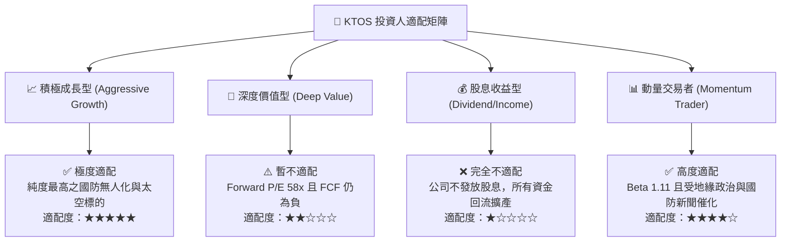

### 11.5 每季財報監控清單（Quarterly Watch List）

| 監控指標 | 正常目標區間 | 觸發【加碼】門檻 | 觸發【減碼/退出】門檻 | 核心意義 |
|----------|--------------|------------------|----------------------|----------|
| **無人系統 (US) 營收成長** | YoY +20% 至 +30% | YoY > +35% | YoY < +10% | 核心成長引擎動能 |
| **GAAP 營業利益率** | 2.0% - 5.0% | > 6.0% | 連續 2 季 < 0.0% | 產能規模槓桿是否兌現 |
| **季度自由現金流 (FCF)** | -$20M 至 +$10M | 連續轉正 (+$15M) | 季流失 > -$50M | 營運資金失血程度 |
| **在手訂單 (Backlog)** | > $1.4B | > $1.8B | < $1.1B | 未來 2 年營收能見度 |
| **期末現金水位** | > $1.0B | 不適用 | < $500M | 擴產安全性與潛在融資風險 |

### 11.6 反面論證：什麼會證明論點錯誤（What Would Change My Mind）

```
╔══════════════════════════════════════════════════════════════╗
║              ⚠️ 多頭論點失效條件（Disconfirming Evidence）  ║
╠══════════════════════════════════════════════════════════════╣
║  若出現下列任一量化或實質事件，本篇多頭研究論點即告失效：    ║
║                                                              ║
║  1. 美國國防部在無人作戰機（CCA）正式生產合約中，KTOS 得標   ║
║     金額低於整體專案份額之 15%（證明競爭優勢不如預期）。     ║
║  2. FY2027 全年營收年增率跌破 12.0%（高成長敘事破滅）。       ║
║  3. 毛利率跌破 20.0% 且連續兩季無法回升（固定價格合約嚴重虧損）║
║  4. 公司在手現金於 6 季內因並購或無效資本支出消耗至 $500M 以下║
║     並再度啟動大規模次級市場股權增資（EPS 實質稀釋）。       ║
╚══════════════════════════════════════════════════════════════╝
```

---

> **免責聲明**：本報告為基於客觀財務數據、量化估值模型與產業研究之分析報告，僅供投資研究參考，不構成任何個別買賣之投資建議。投資人應獨立評估市場風險並自負盈虧。