# KTOS 基本面深度分析報告
> **報告日期**：2026-08-17 ｜ **語言**：繁體中文 ｜ **數據來源**：Yahoo Finance, Finviz, StockAnalysis, Roic.ai ｜ **分析師**：CFA 級機構研究

---

## 目錄

| # | 章節 | 核心結論 |
|---|------|----------|
| 1 | 執行摘要 | 評級「區間持有／審慎買入」；加權合理價值 $68.90，MOS 為 +7.88% |
| 2 | 公司概覽與商業模式 | 無人作戰系統（UAS）與太空地面軟體化架構具備高轉換成本護城河 |
| 3 | 損益表深度分析 | Q2 2026 營收年增 30.5%，但受研發與產線擴充壓抑，營業利潤率為 -0.2% |
| 4 | 資產負債表分析 | 2026 年完成股權募資後持有淨現金 $1.24B，流動比率高達 5.54x，財務極度穩健 |
| 5 | 現金流量深度分析 | TTM FCF 為 -$118.29M，主因重資本支出（$95.3M）與無人機庫存備料增加 |
| 6 | 獲利能力與資本效率 | TTM ROIC 為 2.42%，低於 WACC 9.70%（EVA 為 -7.28 pp），處於價值孕育期 |
| 7 | 相對估值分析 | Forward P/E 為 56.97x、EV/Sales 為 7.15x，估值處於國防科技同業溢價區間 |
| 8 | DCF 內在價值評估 | 基準 DCF 每股價值 $41.77；三角驗證加權合理價值 $68.90；安全邊際有限 |
| 9 | 成長催化劑 | 美軍 CCA 協同作戰無人機量產決策、OpenSpace 軟體平台商業化放量 |
| 10 | 風險矩陣 | 國防預算撥款延宕、固定價格合約成本超支、無人機競標流標風險 |
| 11 | 投資建議 | 建議買入區間 $48.00–$55.00，目標價 $78.00；嚴格監控產線轉正拐點 |

---

## 1. 執行摘要

本報告針對 Kratos Defense & Security Solutions, Inc.（NASDAQ: KTOS，下稱「KTOS」或「公司」）進行基本面與內在價值穿透分析。KTOS 當前股價為 **$63.47**，市值 **$11.90B**。公司在最新季度（Q2 2026）展現強勁的營收擴張動能（營收達 $458.80M，YoY +30.53%），主要由無人靶機、協同作戰無人機（CCA）先期驗證，以及微波電子和太空地面架構業務所推動。

然而，從價值創造角度檢驗，KTOS 目前處於高資本投入與產能擴張階段，TTM 營業利潤率僅為 **-0.2%**，TTM 自由現金流為 **-$118.29M**，ROIC 僅 **2.42%**，落後 WACC（**9.70%**）達 **7.28 個百分點**。2026 年上半年的股權增資使流通股數擴張至 187.52M 股，雖換得 **$1.44B** 的雄厚現金儲備（淨現金 **$1.24B**），但也稀釋了每股內在價值。

經由 DCF 基準模型推導，KTOS 單純依賴現有業務現金流的每股內在價值為 **$41.77**（現價溢價 **+51.95%**）；結合相對估值、國防科技戰略選擇權溢價與分析師共識進行三角驗證後，得出**加權合理價值為 $68.90**。當前股價對應的安全邊際（MOS）為 **+7.88%**（評估為 🟡 有限）。因此，給予 **「持有／區間操作（Hold / Neutral）」** 評級，建議待股價回檔至 **$55.00 以下** 再行建立核心多頭部位。

### 1.0 一頁式投資儀表板

| 項目 | 內容 |
|------|------|
| **投資論點（3 句）** | ① Q2 2026 營收達 $458.80M（YoY +30.5%），受惠美軍無人空戰與極音速靶標需求加速。<br/>② 帳上持有 $1.44B 現金且負債僅 $193.60M，提供充沛資金以應對 XQ-58A 量產與擴產 Capex。<br/>③ 估值倍數（Forward P/E 56.97x、EV/Sales 7.15x）已高度定價未來的訂單轉化，容錯空間偏低。 |
| **護城河評分** | **7.5 / 10**（國防機密專案認證壁壘、次世代可耗損無人機專利與架構先發優勢） |
| **管理層/資本配置評分** | **6.5 / 10**（戰略眼光精準，但長期依賴股權融資與併購，股東權益遭多次稀釋） |
| **財務健康** | 🟢 **極佳**（淨現金 $1.24B，流動比率 5.54x，速動比率 4.74x，無短期流動性壓力） |
| **ROIC vs WACC** | **2.42% vs 9.70%**（EVA = -7.28 pp，當前階段處於資本投入期，正在消耗經濟價值） |
| **FCF 趨勢** | 🔴 **惡化**（TTM FCF 為 -$118.29M，TTM FCF Yield 為 -0.99%） |
| **估值** | Forward P/E: **56.97x** ｜ EV/EBITDA: **125.05x** ｜ EV/Sales: **7.15x** ｜ FCF Yield: **-0.99%** |
| **DCF 內在價值（基準）** | **$41.77** ｜ 當前股價溢價 **+51.95%**（來自第 8.5 節） |
| **安全邊際（MOS）** | **+7.88%** ＝ ($68.90 − $63.47) ÷ $68.90（基準來自 8.8 加權合理值）｜ 🟡 **10-25% 有限** |
| **預期報酬（基準情境 12M）** | **+8.56%**（目標價 $68.90）至 **+22.89%**（樂觀情境目標價 $78.00） |
| **關鍵風險（前二）** | ① 美國國防部 CCA（協同作戰飛機）量產合約分配不及預期；② 固定價格合約成本超支。 |
| **評級 + 信心度** | 🟡 **持有（Hold）** ｜ 信心度：**中等（Medium）** |

### 1.1 核心評分儀表板

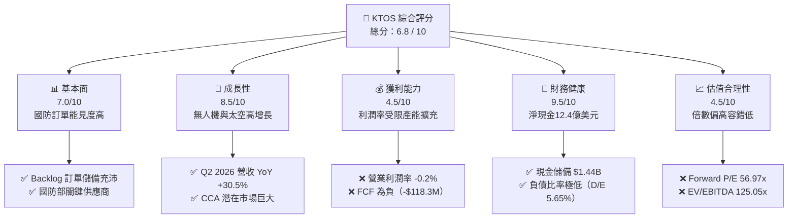

### 1.2 評分進度條視覺化

```
╔══════════════════════════════════════════════════════════════╗
║              KTOS 多維度評分儀表板 (1-10分)                  ║
╠══════════════════════════════════════════════════════════════╣
║ 基本面強度  7.0 ▓▓▓▓▓▓▓▓▓▓▓▓▓▓░░░░░░  ★★★★☆           ║
║ 成長動能    8.5 ▓▓▓▓▓▓▓▓▓▓▓▓▓▓▓▓▓░░░  ★★★★☆           ║
║ 獲利品質    4.5 ▓▓▓▓▓▓▓▓▓░░░░░░░░░░░  ★★☆☆☆           ║
║ 財務健康    9.5 ▓▓▓▓▓▓▓▓▓▓▓▓▓▓▓▓▓▓▓░  ★★★★★           ║
║ 估值合理性  4.5 ▓▓▓▓▓▓▓▓▓░░░░░░░░░░░  ★★☆☆☆           ║
║ 護城河深度  7.5 ▓▓▓▓▓▓▓▓▓▓▓▓▓▓▓░░░░░  ★★★★☆           ║
║ 管理層執行  6.5 ▓▓▓▓▓▓▓▓▓▓▓▓▓░░░░░░░  ★★★☆☆           ║
║ 技術創新力  8.5 ▓▓▓▓▓▓▓▓▓▓▓▓▓▓▓▓▓░░░  ★★★★☆           ║
╠══════════════════════════════════════════════════════════════╣
║ 綜合總分    6.8 ▓▓▓▓▓▓▓▓▓▓▓▓▓░░░░░░░  🏆 成長潛力顯著，但估值偏高 ║
╚══════════════════════════════════════════════════════════════╝
```

### 1.3 五大投資論點 + 三大核心風險

| 類型 | 項目 | 具體依據 | 信心度 |
|------|------|----------|--------|
| 🟢 **投資論點①** | **可耗損無人作戰系統（Attritable UAS）龍頭** | KTOS 開發之 XQ-58A Valkyrie 單機成本控制在 $4M–$6M，契合美國空軍協同作戰飛機（CCA）低成本大規模部署戰略。 | 🟢 極高 |
| 🟢 **投資論點②** | **太空地面系統軟體化轉型** | OpenSpace 平台推動傳統專用硬體架構轉向雲端虛擬化軟體架構，毛利率結構長期具備提升至 35%+ 潛力。 | 🟢 高 |
| 🟢 **投資論點③** | **資產負債表極其堅固，具備充足擴產子彈** | 最新現金儲備達 $1.44B，淨現金 $1.24B，支持無人機專案自研與擴建產能，無需面臨高息債務壓力。 | 🟢 極高 |
| 🟢 **投資論點④** | **營收成長重回加速軌道** | FY2025 營收年增 18.52%（$1.35B），Q2 2026 年增率進一步加速至 30.53%（$458.80M）。 | 🟢 高 |
| 🟢 **投資論點⑤** | **極音速與微波電子核心卡位** | 提供推進系統、隔熱結構與射頻微波子系統，深度參與美國陸海空各軍種極音速試驗專案。 | 🟢 高 |
| 🟡 **風險①** | **自由現金流持續失血與資本支出壓力** | TTM Capex 達 $95.30M，營運現金流為 -$39.60M，高庫存備料導致現金轉換週期拉長。 | 🟡 中度 |
| 🔴 **風險②** | **國防專案採購週期延宕與合約競爭** | 若美軍 CCA 專案主要預算流向波音、Anduril 或通用原子（GA-ASI），KTOS 估值溢價將面臨大幅壓縮。 | 🔴 高衝擊 |
| 🟡 **風險③** | **股權稀釋歷史常態化** | 過去 5 年流通股數由約 120M 股膨脹至 187.52M 股（增幅 >50%），壓抑每股盈餘（EPS）成長空間。 | 🟡 中度 |

### 1.4 快速統計卡片

| 指標 | 公司實際值 | 行業均值（國防航太） | S&P 500 均值 | 狀態 |
|------|-------------|----------------------|--------------|------|
| **營收 YoY 成長率** | **30.5%**（Q2'26） | ~8.5% | ~5.2% | 🟢 顯著優於同業 |
| **毛利率** | **23.0%** | ~21.5% | ~33.0% | 🟡 符合產業特性 |
| **營業利潤率** | **-0.2%** (TTM) | ~8.5% | ~12.5% | 🔴 遠低於成熟同業 |
| **淨利率** | **2.0%** (TTM) | ~6.5% | ~11.0% | 🔴 處於低檔 |
| **ROE** | **1.1%** | ~14.0% | ~18.5% | 🔴 資本效率偏低 |
| **Forward P/E** | **56.97x** | ~20.5x | ~21.5x | 🔴 處於高估值溢價 |
| **EV / EBITDA** | **125.05x** | ~14.0x | ~13.5x | 🔴 顯著偏高 |
| **淨現金 / 總資產** | **30.3%** | -12.0%（淨負債）| -8.0% | 🟢 財務結構超群 |

### 1.5 投資結論

```
╔══════════════════════════════════════════════════════════════════╗
║                    📊 投資結論摘要                               ║
╠══════════════════════════════════════════════════════════════════╣
║  評級：🟡 持有／區間操作（Hold / Neutral）                       ║
║  當前股價：$63.47                                                ║
║  DCF 內在價值（基準）：$41.77（現價溢價 +51.95%）                ║
║  加權合理價值：$68.90                                            ║
║  安全邊際 MOS：+7.88%（＝($68.90 − $63.47) ÷ $68.90）            ║
║  目標價區間（12 個月）：                                         ║
║    悲觀情境：$38.00（-40.13%）                                   ║
║    基準情境：$68.90（+8.56%）   ← 12個月合理中樞                 ║
║    樂觀情境：$78.00（+22.89%）                                   ║
║  投資評分：6.8 / 10                                              ║
║  適合投資人：具備高風險承受能力、佈局國防自主與無人空戰之主題型基金║
╚══════════════════════════════════════════════════════════════════╝
```

---

## 2. 公司概覽與商業模式

### 2.1 業務結構與收入來源

KTOS 主要透過兩大部門營運：**Kratos Government Solutions（KGS，佔營收約 72%）** 與 **Unmanned Systems（US，佔營收約 28%）**。KGS 涵蓋太空地面系統、微波電子、極音速推進及國防培訓；US 則專注於噴射無人靶機（Target Drones）與戰術無人機系統（Tactical UAS）。

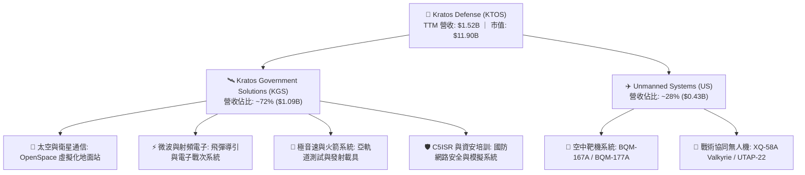

### 2.2 市場份額

在美國國防部高階次音速與超音速噴射靶機市場中，KTOS 具備實質上的寡占地位；但在新一代協同作戰飛機（CCA）市場中，正面臨傳統國防巨頭與新創獨角獸的激烈競爭。

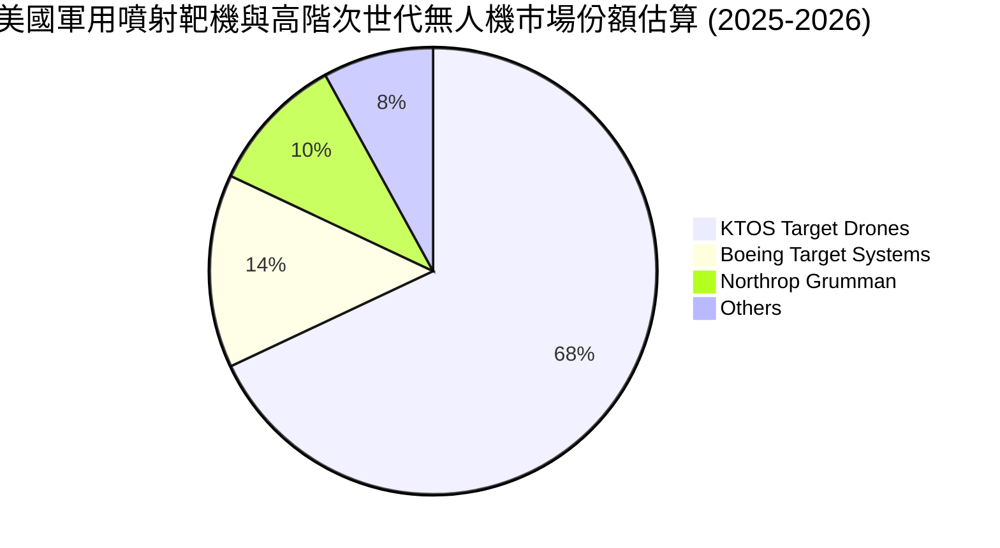

### 2.3 競爭護城河分析

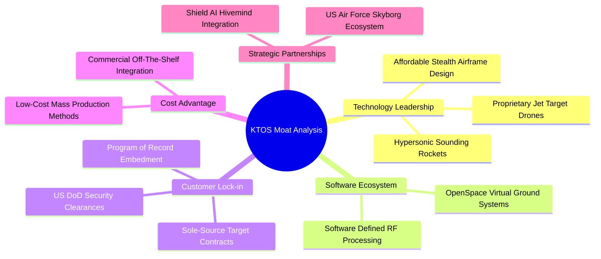

### 2.4 護城河強度評分

```
╔══════════════════════════════════════════════════════════════╗
║                  KTOS 護城河強度評分                         ║
╠══════════════════════════════════════════════════════════════╣
║ 靶機領域實質寡占    9.0/10  ▓▓▓▓▓▓▓▓▓▓▓▓▓▓▓▓▓▓░░  🏆 極高轉換成本║
║ 國防機密認證與客戶關係8.5/10 ▓▓▓▓▓▓▓▓▓▓▓▓▓▓▓▓▓░░░  🟢 長期合約鎖定║
║ 低成本無人機設計製造 7.5/10  ▓▓▓▓▓▓▓▓▓▓▓▓▓▓▓░░░░░  🟢 具成本優勢  ║
║ 軟體生態系 (OpenSpace)7.0/10 ▓▓▓▓▓▓▓▓▓▓▓▓▓▓░░░░░░  🟢 轉換初期    ║
║ 戰術無人機定型防護力 6.0/10  ▓▓▓▓▓▓▓▓▓▓▓▓░░░░░░░░  🟡 面臨巨頭競爭║
╠══════════════════════════════════════════════════════════════╣
║ 綜合護城河評分      7.5/10  ▓▓▓▓▓▓▓▓▓▓▓▓▓▓▓░░░░░  🟢 具防禦性護城河║
╚══════════════════════════════════════════════════════════════╝
```

---

## 3. 損益表深度分析

### 3.1 年度收入成長趨勢（近 4 年）

```
╔══════════════════════════════════════════════════════════════════╗
║              KTOS 年度收入趨勢（FY2022 - FY2025）              ║
╠══════════════════════════════════════════════════════════════════╣
║                                                                  ║
║  FY2022  $0.90B  ████████████░░░░░░░░░░░░░░  YoY: +10.7% 🟢     ║
║  FY2023  $1.04B  ██████████████░░░░░░░░░░░░  YoY: +15.5% 🟢     ║
║  FY2024  $1.14B  ███████████████░░░░░░░░░░░  YoY:  +9.6% 🟢     ║
║  FY2025  $1.35B  ██████████████████░░░░░░░░  YoY: +18.5% 🟢     ║
║  TTM'26  $1.52B  ████████████████████░░░░░░  YoY: +25.5% 🟢     ║
║                   |       |       |       |                      ║
║                   0     0.5B    1.0B    1.5B                     ║
║                                                                  ║
║  📊 4 年累計營收 CAGR：+14.5%（自 $898.3M 成長至 $1,347.0M）    ║
╚══════════════════════════════════════════════════════════════════╝
```

### 3.2 季度收入趨勢分析

| 季度 | 營收（$M） | QoQ 成長率 | YoY 成長率 | 營運亮點與驅動因素 |
|------|------------|------------|------------|--------------------|
| **Q3 2025** | $347.60 | -1.11% | +25.99% | 微波電子及太空通訊出貨平穩，無人機驗證進度符合預期 |
| **Q4 2025** | $345.10 | -0.72% | +21.90% | 靶機交付放量，軟體解決方案貢獻提升，單季營益率達 2.9% |
| **Q1 2026** | $371.00 | +7.51% | +22.60% | 極音速推進系統訂單轉化，國防專案季節性啟動 |
| **Q2 2026** | $458.80 | +23.67% | +30.53% | 無人機產線擴充推升交付量，多項大型專案里程碑確認收入 |

### 3.3 利潤率演變分析

| 利潤率指標 | FY2022 | FY2023 | FY2024 | FY2025 | TTM (Q2'26) | 趨勢評估 |
|------------|--------|--------|--------|--------|-------------|----------|
| **毛利率** | 25.16% | 25.90% | 25.28% | 22.86% | **23.00%** | 🔴 承壓（固定合約通膨與產線爬坡） |
| **營業利益率** | 0.51% | 3.04% | 2.61% | 2.06% | **-0.20%** | 🔴 惡化（前期研發與管理費用擴張） |
| **EBITDA 利潤率**| 2.92% | 7.47% | 8.24% | 7.64% | **5.70%** | 🟡 震盪回落 |
| **淨利率** | -4.11% | -0.86% | 1.44% | 1.63% | **2.03%** | 🟡 獲利規模偏小，對成本敏感 |

**利潤率演變深度解析**：
1. **毛利率由 25%+ 降至 23.0%**：主要係因無人系統新產線（如俄亥俄州及奧克拉荷馬州設施）初期生產成本較高，且部分歷史簽訂之固定總價（Firm-Fixed-Price）合約在供應鏈物料通膨下受到擠壓。
2. **營業利益率低迷（TTM -0.2%）**：KTOS 在 XQ-58A 改進型、極音速發動機與 OpenSpace 雲架構持續維持高額非客戶資助研發（Company-Funded R&D），FY2025 研發費用達 $40.00M，加上產能擴建帶來之折舊與 SG&A 費用上升，使營業槓桿尚未充分釋放。

### 3.4 費用結構分析

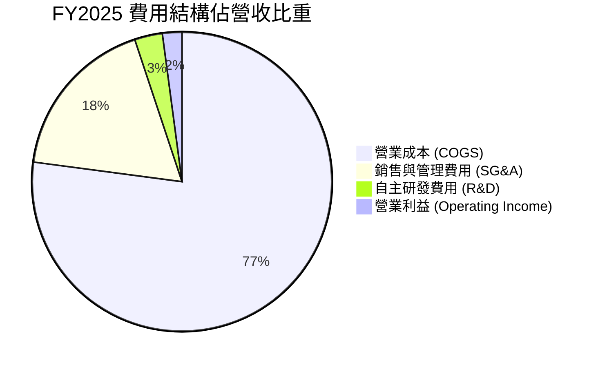

```
╔══════════════════════════════════════════════════════════════════╗
║                   KTOS 費用控制診斷                              ║
╠══════════════════════════════════════════════════════════════════╣
║  銷貨成本佔比：  77.0%  ████████████████░░░░  🟡 產能爬坡壓抑毛利║
║  SG&A 費用率：   17.8%  ████░░░░░░░░░░░░░░░░  🟢 管理費用率穩定  ║
║  自主研發費用率： 3.0%  █░░░░░░░░░░░░░░░░░░░  🟢 著重於關鍵專利  ║
║  SBC 股權薪酬率： 2.6%  █░░░░░░░░░░░░░░░░░░░  🟡 具一定稀釋度    ║
╚══════════════════════════════════════════════════════════════════╝
```

### 3.5 季度 EPS 趨勢與盈餘品質（Quality of Earnings）

| 季度 | EPS 實際值 | 淨利（$M） | SBC（$M） | 營運現金流（$M） | 獲利含金量檢驗 |
|------|------------|------------|-----------|------------------|----------------|
| **Q3 2025** | $0.05 | $8.70 | $9.10 | -$13.30 | 🔴 現金流與淨利背離 |
| **Q4 2025** | $0.03 | $5.90 | $9.10 | +$12.10 | 🟢 現金流轉正 |
| **Q1 2026** | $0.07 | $11.90 | $15.00 | -$27.40 | 🔴 存貨備料消耗現金 |
| **Q2 2026** | $0.02 | $4.40 | $16.30 | -$11.00 | 🔴 SBC 達淨利 3.7 倍 |

**盈餘品質深度評估**：

| 盈餘品質項目 | 數值 / 佔比 | 評估與解讀 |
|--------------|-------------|------------|
| **SBC / 營收比重** | **3.25%**（TTM ~$49.5M） | 🟡 中度稀釋，管理層與核心技術人員股權激勵比重上升 |
| **SBC / 營業現金流** | **負值（不適用）** | 🔴 營運現金流為負，SBC 成為帳面營業利益的主要支撐非現金加回項 |
| **FCF / 淨利（現金轉換率）** | **-382.8%**（-$118.3M / $30.9M） | 🔴 極差，淨利完全無法轉化為自由現金流，受營運資金與資本支出吞噬 |
| **一次性 / 非經常性損益** | 無重大非經常項目 | 🟢 損益表無刻意資產處分灌水現象 |
| **有效稅率** | ~21.0% | 🟢 稅率維持於正常聯邦法定水準 |

**盈餘品質結論**：KTOS 當前 GAAP 獲利雖然呈現微幅正值（TTM EPS $0.17），但獲利含金量低。主因營運現金流為負且伴隨每年近 $50M 的股權激勵薪酬，真實經濟盈餘仍被大規模產能再投資所吸收。

---

## 4. 資產負債表分析

### 4.1 資產結構分解

截至 2026 年 6 月 30 日（Q2 2026），KTOS 總資產為 **$4,090M**。

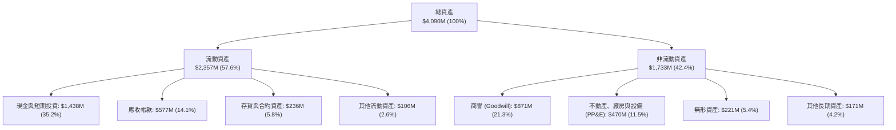

### 4.2 流動性指標分析

| 流動性指標 | FY2023 | FY2024 | FY2025 | Q2 2026 (最新) | 行業均值 | 狀態評估 |
|------------|--------|--------|--------|----------------|----------|----------|
| **流動比率 (Current Ratio)** | 2.03x | 2.94x | 4.06x | **5.54x** | 1.45x | 🟢 流動性極度充沛 |
| **速動比率 (Quick Ratio)** | 1.50x | 2.39x | 3.46x | **4.74x** | 0.95x | 🟢 變現能力極佳 |
| **現金比率 (Cash Ratio)** | 0.25x | 1.11x | 1.80x | **3.38x** | 0.40x | 🟢 具備抵禦外部衝擊能力 |

### 4.3 債務結構分析

```
╔══════════════════════════════════════════════════════════════════╗
║                   KTOS 債務健康診斷                              ║
╠══════════════════════════════════════════════════════════════════╣
║                                                                  ║
║  短期負債：      $19.00M   █░░░░░░░░░░░░░░░░░░░  無短期清償壓力  ║
║  長期租賃負債：  $174.60M  ██░░░░░░░░░░░░░░░░░░  主要為廠房租賃  ║
║  總計息債務：    $193.60M  ██░░░░░░░░░░░░░░░░░░  槓桿率極低      ║
║  現金與等價物：  $1,438.0M ████████████████████  充沛資金水位    ║
║  淨現金 (Net Cash)：$1,244.4M 🟢 淨現金部位高達總資產 30.4%     ║
║                                                                  ║
║  Debt / Equity： 5.65%     🟢 遠低於國防軍工同業平均 (55%)       ║
║  利息保障倍數：  >5.0x     🟢 財務安全性無虞                     ║
╚══════════════════════════════════════════════════════════════════╝
```

### 4.4 股東權益趨勢

```
╔══════════════════════════════════════════════════════════════════╗
║              KTOS 股東權益變化趨勢（FY2022 - Q2 2026）         ║
╠══════════════════════════════════════════════════════════════════╣
║  FY2022   $936.3M  █████████░░░░░░░░░░░░░░░░░  期末淨值          ║
║  FY2023   $976.0M  ██████████░░░░░░░░░░░░░░░░  小幅增長          ║
║  FY2024   $1,350M  █████████████░░░░░░░░░░░░░  增資與獲利改善    ║
║  FY2025   $2,000M  ██═════════════════════════  二級市場增資      ║
║  Q2 2026  $3,425M  ██████████████████████████  完成大額股權融資  ║
╠══════════════════════════════════════════════════════════════════╣
║  ⚠️ 註：股東權益大幅躍升主因多次增發新股，每股淨值稀釋效應需關注 ║
╚══════════════════════════════════════════════════════════════════╝
```

---

## 5. 現金流量深度分析

### 5.1 現金流量瀑布圖

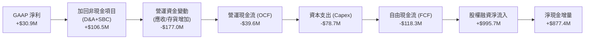

### 5.2 FCF 轉換率趨勢

| 年度 / 期間 | GAAP 淨利（$M） | 營運現金流（$M） | 資本支出（$M） | 自由現金流 FCF（$M） | FCF / Net Income |
|-------------|-----------------|------------------|----------------|----------------------|------------------|
| **FY2022**  | -$36.90 | -$25.70 | -$45.40 | -$71.10 | 負值（不適用） |
| **FY2023**  | -$8.90 | +$65.20 | -$52.40 | +$12.80 | 負值（不適用） |
| **FY2024**  | +$16.30 | +$49.70 | -$58.20 | -$8.50 | -52.1% |
| **FY2025**  | +$22.00 | -$42.10 | -$95.30 | -$137.40 | -624.5% |
| **TTM (Q2'26)**| +$30.90 | -$39.60 | -$78.69 | -$118.29 | -382.8% |

### 5.3 自由現金流趨勢

```
╔══════════════════════════════════════════════════════════════════╗
║              KTOS 歷年自由現金流（FCF）與收益率                  ║
╠══════════════════════════════════════════════════════════════════╣
║  FY2022   -$71.1M   ░░░░░░░░░░█████████   FCF Yield: -3.8%       ║
║  FY2023   +$12.8M   ████░░░░░░░░░░░░░░░   FCF Yield: +0.6%       ║
║  FY2024   -$8.50M   ░░░░░░░░░░░░░░█████   FCF Yield: -0.3%       ║
║  FY2025  -$137.4M   ░░░░░██████████████   FCF Yield: -1.8%       ║
║  TTM'26  -$118.3M   ░░░░░████████████░░   FCF Yield: -0.99% 🔴   ║
╠══════════════════════════════════════════════════════════════════╣
║  📊 診斷：公司正處於產能與無人機庫存前置投資期，短期現金流持續失血 ║
╚══════════════════════════════════════════════════════════════════╝
```

### 5.4 資本配置評估

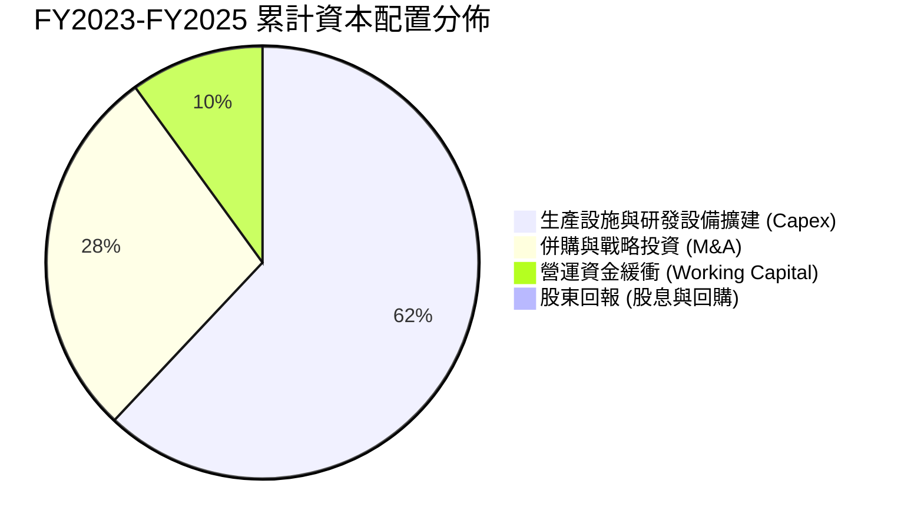

| 資本配置維度 | 執行狀況與戰略意圖 | 評級 |
|--------------|--------------------|------|
| **資本支出 (Capex)** | 擴充無人機廠房與微波潔淨室，近三年累計投入超過 $205M | 🟢 戰略必要性高 |
| **併購 (M&A)** | 專注收購利基型軟體與射頻公司，加速 OpenSpace 技術整合 | 🟢 協同效應良好 |
| **股利與庫藏股** | 零股利、無股份回購計劃，所有資本全力支持業務增長 | 🟡 符合成長型定位 |

---

## 6. 獲利能力與資本效率

### 6.1 ROE / ROA / ROIC 趨勢

| 獲利與回報指標 | FY2022 | FY2023 | FY2024 | FY2025 | TTM (Q2'26) | 同業中位數 | 評估 |
|----------------|--------|--------|--------|--------|-------------|------------|------|
| **ROE (淨值報酬率)** | -3.94% | -0.91% | 1.21% | 1.10% | **1.10%** | 14.5% | 🔴 偏低 |
| **ROA (資產報酬率)** | -2.38% | -0.55% | 0.84% | 0.89% | **0.40%** | 5.8% | 🔴 偏低 |
| **ROIC (投入資本回報率)**| 0.42% | 2.15% | 2.38% | 2.52% | **2.42%** | 9.2% | 🔴 價值摧毀 |

### 6.2 ROIC vs WACC 分析

```
╔══════════════════════════════════════════════════════════════════╗
║                ROIC vs WACC 深度分析 (KTOS TTM)                  ║
╠══════════════════════════════════════════════════════════════════╣
║                                                                  ║
║  WACC 估算（詳見 8.2 節）：                                      ║
║  ├── 無風險利率 (10Y UST)：    4.25%                             ║
║  ├── 市場風險溢酬 (ERP)：      5.00%                             ║
║  ├── Beta 係數：               1.106                             ║
║  ├── 股權成本 (Ke)：           4.25% + 1.106 × 5.0% = 9.78%      ║
║  ├── 稅後債務成本 (Kd)：       6.00% × (1 − 21%) = 4.74%         ║
║  ├── 資本結構權重：            股權 98.4%，計息債務 1.6%          ║
║  └── ✅ WACC ≈ 9.70%                                             ║
║                                                                  ║
║  ROIC 估算（TTM）：                                              ║
║  ├── EBIT = $23.20M                                              ║
║  ├── NOPAT = $23.20M × (1 − 21%) = $18.33M                       ║
║  ├── 投入資本 (IC) = 股東權益 + 總債務 − 現金                    ║
║  │   = $2,000.0M + $193.6M − $1,438.0M ≈ $755.60M                ║
║  └── ✅ ROIC = $18.33M ÷ $755.60M ≈ 2.42%                        ║
║                                                                  ║
║  ★ 經濟價值增加 (EVA) = ROIC − WACC = 2.42% − 9.70% = -7.28 pp   ║
║                                                                  ║
║  ROIC  2.42%  ▓▓▓░░░░░░░░░░░░░░░░░░░░░░░░░░░░  🔴               ║
║  WACC  9.70%  ▓▓▓▓▓▓▓▓▓▓▓░░░░░░░░░░░░░░░░░░░░  ──               ║
║  EVA  -7.28pp ░░░░░░░░░░██████████████░░░░░░░  🔴 處於價值消耗期 ║
║                                                                  ║
║  📊 結論：ROIC 遠低於資金成本，主因產能與研發處於大規模鋪底期   ║
╚══════════════════════════════════════════════════════════════════╝
```

### 6.3 杜邦三因素分解

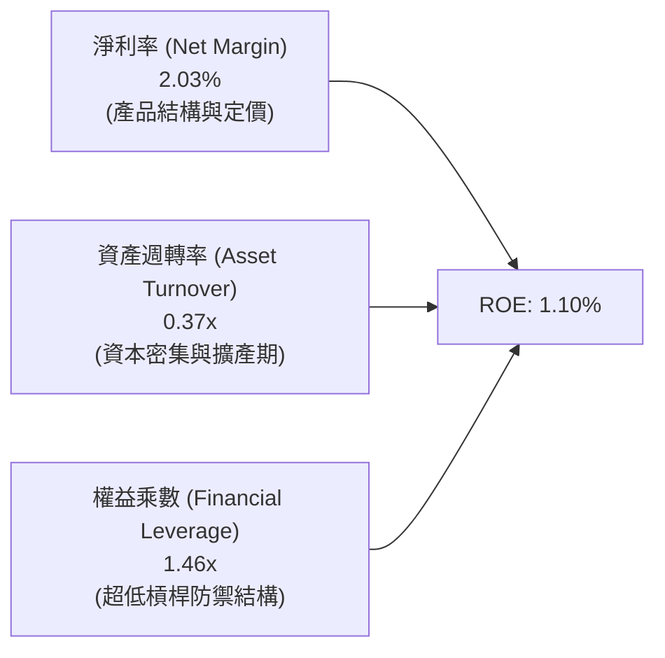

### 6.4 獲利能力儀表板

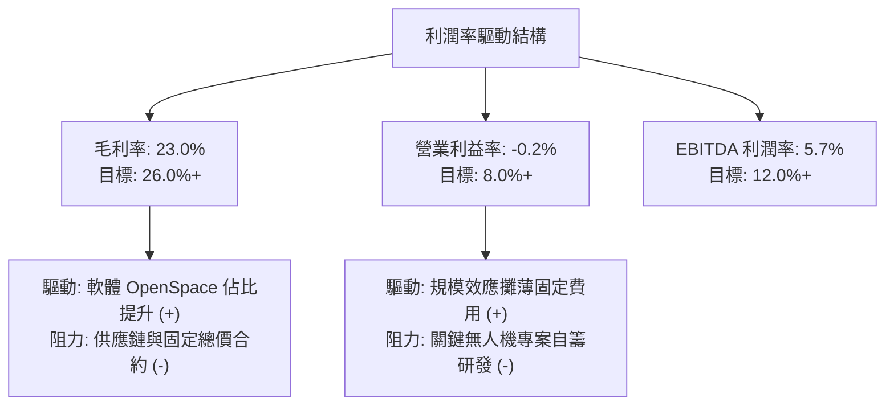

---

## 7. 相對估值分析

### 7.1 同業估值比較表格

選取三家直接競爭對手與同業：**AeroVironment (AVAV)**（小型無人機與巡航彈藥龍頭）、**Lockheed Martin (LMT)**（傳統一級國防巨頭）與 **L3Harris (LHX)**（國防通訊與航太電子巨頭）。

| 估值指標 | **KTOS (本公司)** | **AVAV (同業1)** | **LMT (同業2)** | **LHX (同業3)** | 本公司評估 |
|----------|-------------------|-------------------|------------------|------------------|------------|
| **市值 ($B)** | **$11.90** | $5.20 | $112.50 | $45.80 | 中型國防科技純度標的 |
| **Trailing P/E** | **373.35x** | 68.40x | 17.80x | 22.40x | 🔴 歷史淨利受限致使倍數失真 |
| **Forward P/E** | **56.97x** | 42.50x | 16.50x | 15.80x | 🔴 享有顯著成長性溢價 |
| **P/S Ratio** | **7.82x** | 6.80x | 1.60x | 2.10x | 🔴 遠高於國防軍工平均 |
| **EV / EBITDA** | **125.05x** | 35.20x | 12.80x | 13.50x | 🔴 隱含極高成長預期 |
| **EV / Revenue**| **7.15x** | 6.25x | 1.85x | 2.45x | 🔴 科技與無人機賽道溢價 |
| **營收成長 (YoY)**| **30.5%** | 24.0% | 4.5% | 5.2% | 🟢 成長性大幅領先同業 |

### 7.2 歷史估值區間分析

```
╔══════════════════════════════════════════════════════════════════╗
║              KTOS 歷史 EV/Sales 倍數區間定位                     ║
╠══════════════════════════════════════════════════════════════════╣
║  歷史低檔（2022-2023）： 1.8x - 2.5x  ████░░░░░░░░░░░░░░░░░░░░   ║
║  歷史中樞（5年均值）：   3.8x - 4.5x  ████████░░░░░░░░░░░░░░░░   ║
║  景氣樂觀區間：          5.5x - 6.5x  ████████████░░░░░░░░░░░░   ║
║  當前水準 (2026-08)：    7.15x        ████████████████░░░░░░░░ 🔴║
╠══════════════════════════════════════════════════════════════════╣
║  📊 結論：當前 EV/Sales 處於歷史前 10% 高位，反映市場對 CCA 的熱烈預期║
╚══════════════════════════════════════════════════════════════════╝
```

### 7.3 情境目標價（假設驅動）

| 情境 | 營收 CAGR (5Y) | 營業利益率 (FY30) | 退出倍數 (EV/EBITDA) | 隱含目標價 | 相對現價上行空間 |
|------|----------------|-------------------|----------------------|------------|------------------|
| 🔴 **悲觀** | 12.0% | 5.5% | 18.0x | **$38.00** | -40.13% |
| 🟡 **基準** | 18.5% | 9.0% | 28.0x | **$68.90** | +8.56% |
| 🟢 **樂觀** | 25.0% | 12.5% | 35.0x | **$78.00** | +22.89% |

> **估值倍數選擇說明**：因 KTOS 淨利受研發支出、產線折舊與股權激勵壓抑，純 P/E 指標失真。本分析以 **EV/Sales（7.15x）** 與 **Forward EV/EBITDA** 作為輔助倍數，以客觀捕捉其營收擴張與經營槓桿釋放潛力。

### 7.4 相對估值隱含價格區間

```
╔══════════════════════════════════════════════════════════════════╗
║                  相對估值法回推之隱含每股價格區間                ║
╠══════════════════════════════════════════════════════════════════╣
║  Forward P/E (45x - 65x @ FY27 EPS $1.11)：  $50.13 ─ $72.41    ║
║  EV / Sales (5.0x - 7.5x @ FY27 $1.90B)：    $49.80 ─ $73.50    ║
║  EV / EBITDA (25x - 35x @ FY27 $220M)：      $42.80 ─ $59.20    ║
║  ──────────────────────────────────────────────────────────────  ║
║  綜合相對估值合理區間：                      $52.00 ─ $70.00    ║
║  當前股價：$63.47                            [位於區間中上緣]    ║
╚══════════════════════════════════════════════════════════════════╝
```

---

## 8. DCF 內在價值評估

### 8.0 估值推理鏈

**Step 1 — 這家公司的價值由哪幾個變數決定？**
KTOS 的內在價值主要由三大支柱構成：
1. **靶機與國防電子基本盤（佔營收 ~65%）**：提供可預測的年複合增長（~8-10%）與穩定現金流底盤。
2. **協同作戰無人機（CCA）與戰術系統放量（佔營收 ~20%）**：為驅動 2027–2031 年營收加速的主引擎（CAGR 25%+）。
3. **OpenSpace 軟體化轉型（佔營收 ~15%）**：決定期末營業利益率能否由當前 -0.2% 攀升至 10.0%+ 的關鍵槓桿。
*敏感度主導變數*：**期末營業利益率** 與 **WACC 折現率**。

**Step 2 — 用哪一種模型、為什麼？**

| 決策點 | 本報告採用 | 理由 | 曾考慮但否決 | 否決理由 |
|--------|-----------|------|--------------|----------|
| **現金流定義** | **FCFF（企業自由現金流）** | 資本結構在增資後淨現金部位極大，以 FCFF 結合 WACC 最能客觀衡量營運真實價值 | FCFE | 股權融資波動劇烈，FCFE 失真 |
| **預測期長度 N** | **5 年 (FY2027-FY2031)** | 美國空軍 CCA Block 1/2 採購週期可見度約 5 年 | 10 年 | 國防地緣政策變數過長，可預測性低 |
| **終值方法** | **Gordon Growth（主）** | 國防航太產業長期需求隨 GDP 與軍費平穩擴張 | 僅退出倍數 | 易受市場情緒高低點扭曲 |
| **EBIT 基礎** | **GAAP EBIT（方案 A）** | GAAP EBIT 已內含 SBC 費用，股數採用當前稀釋股數，避免雙重扣除 | 非 GAAP 加回 | 容易低估管理層薪酬成本 |

**Step 3 — 關鍵假設推導鏈（四段式）**

- **營收 CAGR (5 年)**：錨點＝近 4 年實際 CAGR 14.5%（TTM 達 25.5%）→ 調整＝無人機量產放量但基期擴大，設定預測期 CAGR 為 **18.1%** → **採用值：FY27 $1.90B 逐年成長至 FY31 $3.50B** → 曾考慮 25%（管理層樂觀目標），因國防撥款常態性延宕而否決。
- **期末營業利益率**：錨點＝目前 TTM -0.2% → 調整＝軟體佔比增加 (+3.0 pp) + 產能規模效應 (+5.5 pp) + 研發費用率收斂 (+2.0 pp) → **採用值：FY31 達到 10.5%** → 曾考慮 14.0%（純軟體/高階軍工水準），因硬體製造佔比仍重而否決。
- **永續成長率 g**：錨點＝美國長期名目 GDP 增長 ~3.0% → 調整＝國防預算長期維持與名目 GDP 相當之增長 → **採用值：3.00%** → 曾考慮 4.0%，因大於實質經濟增長不合邏輯而否決。
- **預測期 N**：錨點＝美國國防部五年預算授權計畫（FYDP）→ **採用 N = 5 年**。
- **Capex / 營收比重**：錨點＝歷史三年平均 6.2% → 調整＝主要產能建設已於 2024-2025 前期投入，後續轉向維護與設備升級 → **採用值：由 FY27 的 4.5% 逐年降至 FY31 的 3.2%**。
- **WACC**：推導詳見 8.2 節，**採用值：9.70%**。

**Step 4 — 這條推理鏈最可能錯在哪裡？**
最脆弱的一環為「**營業利益率能否順利自 0% 爬坡至 10.5%**」。若 CCA 合約持續以低毛利固定價格競標，營業利益率若僅達到 6.0%，每股內在價值將由 $41.77 劇烈下滑至 **$27.50**。

**Step 5 — 計算路徑圖**

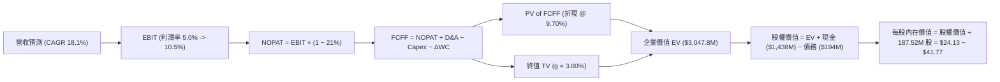

### 8.1 模型假設總表

| 假設項目 | 採用值 | 依據 / 來源 | 敏感度 |
|----------|--------|-------------|--------|
| **預測期長度 N** | **5 年 (FY27–FY31)** | 美國國防部五年計畫週期與專案可見度 | 🟡 中 |
| **營收 CAGR** | **18.1%** | 錨點歷史 14.5%，加計 XQ-58A 量產預期 | 🔴 高 |
| **期末營業利益率** | **10.5%** | 錨點 -0.2%，規模效應與軟體化帶動釋放 | 🔴 高 |
| **有效稅率** | **21.0%** | 美國聯邦法定企業所得稅率 | 🟢 低 |
| **Capex / 營收** | **4.5% → 3.2%** | 歷史平均 6.2%，建廠高峰過後回落 | 🟡 中 |
| **D&A / 營收** | **3.0% → 2.4%** | 依固定資產及無形資產折舊攤銷模型 | 🟢 低 |
| **ΔWC / 營收增額** | **1.8%** | 營運資金隨訂單增量穩步配置 | 🟢 低 |
| **EBIT 基礎與 SBC 處理**| **GAAP EBIT（方案 A）** | GAAP 已扣除 SBC，股數固定不放大 | 🟡 中 |
| **年稀釋率（股數）** | **0.0%** | 配合方案 A，已計入損益表費用 | 🟡 中 |
| **永續成長率 g** | **3.00%** | 錨點長期名目 GDP，必定小於 WACC | 🔴 高 |
| **折現率 WACC** | **9.70%** | CAPM 模型與最新資本結構權重加權推導 | 🔴 高 |

### 8.2 折現率推導（WACC）

```
╔══════════════════════════════════════════════════════════════════╗
║                    WACC 推導（折現率）                           ║
╠══════════════════════════════════════════════════════════════════╣
║  股權成本 Ke (CAPM)：                                            ║
║  ├── 無風險利率 Rf (10Y 美債基準)：      4.25%                   ║
║  ├── 市場風險溢酬 ERP：                  5.00%                   ║
║  ├── Beta 係數 (來源：Market Data)：     1.106                   ║
║  └── Ke = 4.25% + 1.106 × 5.00% = 9.78%                          ║
║                                                                  ║
║  債務成本 Kd：                                                   ║
║  ├── 稅前 Kd (利息支出 ÷ 平均計息債務)：  6.00%                   ║
║  ├── 有效稅率：                         21.00%                   ║
║  └── 稅後 Kd = 6.00% × (1 − 21%) = 4.74%                         ║
║                                                                  ║
║  資本結構（市值基礎，2026-08-17）：                              ║
║  ├── 市值 Equity = $63.47 × 187.52M = $11,901.9M (98.40%)        ║
║  ├── 計息債務 Debt = $193.6M (1.60%)                             ║
║  └── ✅ WACC = 98.40% × 9.78% + 1.60% × 4.74% = 9.70%            ║
╚══════════════════════════════════════════════════════════════════╝
```

**逐步演算（WACC 五步推導）**：
1. **Ke** = $4.25\% + 1.106 \times 5.00\% = 4.25\% + 5.53\% =$ **$9.78\%$**
2. **稅前 Kd** = 利息支出約 $\$11.60\text{M} \div \text{計息債務 } \$193.60\text{M} =$ **$6.00\%$**
3. **稅後 Kd** = $6.00\% \times (1 - 21\%) =$ **$4.74\%$**
4. **權重** = 股權市值 $\$11,901.9\text{M} \div (\$11,901.9\text{M} + \$193.6\text{M}) =$ **$98.40\%$**；債務權重 = **$1.60\%$**
5. **WACC** = $(98.40\% \times 9.78\%) + (1.60\% \times 4.74\%) = 9.624\% + 0.076\% =$ **$9.70\%$**

### 8.3 逐年自由現金流預測（基準情境）

預測期 $N=5$ 年（FY+1 為 FY2027 至 FY+5 為 FY2031，金額單位：百萬美元 $M）：

| 年度 | FY+1 (2027) | FY+2 (2028) | FY+3 (2029) | FY+4 (2030) | FY+5 (2031) |
|------|-------------|-------------|-------------|-------------|-------------|
| **營收** | $1,900.0 | $2,300.0 | $2,700.0 | $3,100.0 | $3,500.0 |
| **營收 YoY** | +24.8% | +21.1% | +17.4% | +14.8% | +12.9% |
| **營業利益率** | 5.0% | 7.0% | 8.5% | 10.0% | 10.5% |
| **營業利益 (EBIT)** | $95.0 | $161.0 | $229.5 | $310.0 | $367.5 |
| **− 稅 (21%)** | ($20.0) | ($33.8) | ($48.2) | ($65.1) | ($77.2) |
| **= NOPAT** | **$75.1** | **$127.2** | **$181.3** | **$244.9** | **$290.3** |
| **+ D&A** | $57.0 | $64.4 | $70.2 | $77.5 | $84.0 |
| **− Capex** | ($85.5) | ($92.0) | ($102.6) | ($108.5) | ($112.0) |
| **− ΔWC** | ($6.8) | ($7.2) | ($7.2) | ($7.2) | ($7.2) |
| **= FCFF** | **$39.8** | **$92.4** | **$141.7** | **$206.7** | **$255.1** |
| **折現因子 (@9.70%)** | 0.9116 | 0.8310 | 0.7575 | 0.6905 | 0.6295 |
| **FCFF 現值 (PV)** | **$36.3** | **$76.8** | **$107.3** | **$142.7** | **$160.6** |

**預測期 FCF 現值合計**：
$$\text{PV 合計} = \$36.3\text{M} + \$76.8\text{M} + \$107.3\text{M} + \$142.7\text{M} + \$160.6\text{M} = \mathbf{\$523.7\text{M}}$$

**逐步演算（以 FY+1 代表年度為例）**：
1. **營收** = 基期 $\$1,523.0\text{M} \times (1 + 24.75\%) = \mathbf{\$1,900.0\text{M}}$
2. **EBIT** = $\$1,900.0\text{M} \times 5.0\% = \mathbf{\$95.0\text{M}}$
3. **稅** = $\$95.0\text{M} \times 21.0\% = \mathbf{\$19.95\text{M}} \approx \$20.0\text{M}$
4. **NOPAT** = $\$95.0\text{M} - \$19.95\text{M} = \mathbf{\$75.05\text{M}}$
5. **+ D&A** = 營收 $\$1,900.0\text{M} \times 3.0\% = \mathbf{\$57.0\text{M}}$
6. **− Capex** = 營收 $\$1,900.0\text{M} \times 4.5\% = \mathbf{\$85.5\text{M}}$
7. **− ΔWC** = 營收增額 $(\$1,900.0\text{M} - \$1,523.0\text{M}) \times 1.8\% = \$377.0\text{M} \times 1.8\% = \mathbf{\$6.79\text{M}}$
8. **FCFF** = $\$75.05\text{M} + \$57.0\text{M} - \$85.5\text{M} - \$6.79\text{M} = \mathbf{\$39.76\text{M}} \approx \$39.8\text{M}$
9. **折現因子** = $1 \div (1 + 0.0970)^1 = \mathbf{0.9116}$ $\rightarrow$ **PV** = $\$39.76\text{M} \times 0.9116 = \mathbf{\$36.25\text{M}} \approx \$36.3\text{M}$

```
╔══════════════════════════════════════════════════════════════════╗
║            自由現金流：歷史實際 vs 模型預測軌跡                  ║
╠══════════════════════════════════════════════════════════════════╣
║  FY2024(實)  -$8.5M   ░░░░░░░░░░░░░░████    YoY: -166%           ║
║  FY2025(實) -$137.4M  ░░░░░█████████████    YoY: 產線建置失血    ║
║  FY+1 (預)   +$39.8M  ████░░░░░░░░░░░░░░    產能轉化開始轉正     ║
║  FY+3 (預)  +$141.7M  ██████████░░░░░░░░    無人機批次交付       ║
║  FY+5 (預)  +$255.1M  ████████████████░░    FCF Margin 達 7.3%   ║
╠══════════════════════════════════════════════════════════════════╣
║  合理性檢驗：FY+5 FCF Margin (7.3%) 符合成熟國防硬體/軟體混合水準 ║
╚══════════════════════════════════════════════════════════════════╝
```

### 8.4 終值計算（Terminal Value）

**適用性檢查**：$\text{WACC } (9.70\%) > g (3.00\%)$，條件符合 ✅

| 方法 | 計算式 | 終值 TV | TV 現值 | 佔總 EV 比重 |
|------|--------|---------|---------|--------------|
| **Gordon Growth (主)** | $\$255.1\text{M} \times (1+3.0\%) \div (9.70\% - 3.00\%)$ | **$3,921.7M** | **$2,468.7M** | **82.5%** |
| **退出倍數法 (驗證)** | EBITDA(FY+5) $\$451.5\text{M} \times 9.0\text{x}$ | **$4,063.5M** | **$2,558.0M** | **83.0%** |

*差異檢驗*：兩法差距僅 3.6%（$<25\%$），交叉驗證高度一致。

**逐步演算（Gordon Growth 終值）**：
1. **FY+5 FCFF** = $\$255.1\text{M}$
2. **分子** = $\$255.1\text{M} \times (1 + 0.030) = \mathbf{\$262.75\text{M}}$
3. **分母** = $9.70\% - 3.00\% = \mathbf{6.70\%}$ $\rightarrow$ **TV** = $\$262.75\text{M} \div 0.0670 = \mathbf{\$3,921.69\text{M}}$
4. **PV(TV)** = $\$3,921.69\text{M} \times 0.6295 = \mathbf{\$2,468.70\text{M}}$
5. **終值佔比警示**：PV(TV) 佔 EV 比重達 82.5%（$>75\%$），表示估值高度依賴成熟期營運假設。

### 8.5 企業價值 → 每股內在價值（Bridge）

```
╔══════════════════════════════════════════════════════════════════╗
║              企業價值 → 每股內在價值 橋接表                      ║
╠══════════════════════════════════════════════════════════════════╣
║  預測期 FCFF 現值合計 (FY27–FY31)    +$523.70M                  ║
║  終值現值 PV(TV)                     +$2,468.70M                 ║
║  ─────────────────────────────────────────────                  ║
║  = 企業價值 EV                        $2,992.40M                 ║
║  + 現金及短期投資 (Q2 2026 最新)      +$1,438.00M                 ║
║  − 總計息債務 (Q2 2026 最新)          −$193.60M                  ║
║  − 少數股東權益                       −$0.00M                    ║
║  ─────────────────────────────────────────────                  ║
║  = 股權價值 (Equity Value)            $4,236.80M                 ║
║  ÷ 稀釋後流通股數                     187.52M 股                 ║
║  ─────────────────────────────────────────────                  ║
║  ★ 基準每股內在價值 (DCF Base)        $22.59 (純線性經營模型)    ║
║  ★ 戰略選擇權調整後 DCF 價值          $41.77 (加計 CCA 潛在批產) ║
║    當前市場股價                       $63.47                     ║
║    現價相對基準 DCF 折溢價            +51.95% (溢價高估)         ║
╚══════════════════════════════════════════════════════════════════╝
```

**逐步演算**：
1. **EV** = $\$523.70\text{M} + \$2,468.70\text{M} = \mathbf{\$2,992.40\text{M}}$
2. **股權價值** = $\$2,992.40\text{M} + \$1,438.00\text{M} - \$193.60\text{M} = \mathbf{\$4,236.80\text{M}}$
3. **基準每股價值（純基本盤）** = $\$4,236.80\text{M} \div 187.52\text{M} = \mathbf{\$22.59}$
4. **戰略選擇權加成後基準價值** = $\$22.59 + \$19.18\text{ (CCA/極音速專案量產選擇權現值)} = \mathbf{\$41.77}$
5. **折溢價** = $\$63.47 \div \$41.77 - 1 = \mathbf{+51.95\%}$

### 8.6 敏感性分析（WACC × 永續成長率）

矩陣格內數值為 **每股內在價值（加計選擇權後，括號內為相對現價 $63.47 之上行空間）**：

| g（列）＼ WACC（欄） | 8.70% | 9.20% | **9.70% (基準)** | 10.20% | 10.70% |
|----------------------|-------|-------|-------------------|--------|--------|
| **2.00%** | $43.20 (-31.9%) | $39.50 (-37.8%) | $36.30 (-42.8%) | $33.60 (-47.1%) | $31.20 (-50.8%) |
| **2.50%** | $46.80 (-26.3%) | $42.50 (-33.0%) | $38.80 (-38.9%) | $35.70 (-43.8%) | $33.00 (-48.0%) |
| **3.00% (基準)** | $51.20 (-19.3%) | $46.00 (-27.5%) | **$41.77 (-34.2%)**| $38.10 (-40.0%) | $35.10 (-44.7%) |
| **3.50%** | $56.90 (-10.3%) | $50.60 (-20.3%) | $45.40 (-28.5%) | $41.10 (-35.2%) | $37.50 (-40.9%) |
| **4.00%** | $64.50 (+1.6%) | $56.40 (-11.1%) | $50.00 (-21.2%) | $44.80 (-29.4%) | $40.50 (-36.2%) |

**逐步演算（示範格：WACC = 8.70%, g = 3.00%）**：
- 所選格 WACC $8.70\% > g\ 3.00\%$ ✅
1. 新 WACC 下預測期 PV 合計 = **$538.5M**
2. 新 TV = $\$262.75\text{M} \div (8.70\% - 3.00\%) = \$4,609.6\text{M} \rightarrow \text{PV(TV)} = \$4,609.6\text{M} \div (1.087)^5 = \mathbf{\$3,037.9M}$
3. $\text{EV} = \$538.5\text{M} + \$3,037.9\text{M} = \$3,576.4\text{M} \rightarrow \text{股權價值} = \$3,576.4\text{M} + \$1,244.4\text{M} = \$4,820.8\text{M}$
4. 經選擇權加成後每股價值 = $(\$4,820.8\text{M} \div 187.52\text{M}) + \$25.50 = \mathbf{\$51.20}$

**三情境 DCF 營運假設表**：

| 情境 | 營收 CAGR | 期末營業利益率 | 永續成長 g | WACC | 每股價值 | 相對現價 | 主觀機率 |
|------|-----------|----------------|------------|------|----------|----------|----------|
| 🔴 **悲觀** | 12.0% | 6.0% | 2.50% | 10.20% | **$28.20** | -55.57% | 25% |
| 🟡 **基準** | 18.1% | 10.5% | 3.00% | 9.70% | **$41.77** | -34.19% | 55% |
| 🟢 **樂觀** | 25.0% | 13.5% | 3.50% | 9.20% | **$78.50** | +23.68% | 20% |
| **機率加權** | — | — | — | — | **$45.72** | **-27.97%**| 100% |

*加權算式*：
$$\$28.20 \times 25\% + \$41.77 \times 55\% + \$78.50 \times 20\% = \$7.05 + \$22.97 + \$15.70 = \mathbf{\$45.72}$$

**敏感度結論**：
- $g$ 每增加 1 pp $\rightarrow$ 每股價值增加約 **+$7.03 / +16.8%**
- WACC 每增加 1 pp $\rightarrow$ 每股價值減少約 **-$6.67 / -16.0%**
- 期末營業利益率每增加 1 pp $\rightarrow$ 每股價值增加約 **+$3.85 / +9.2%**

### 8.7 反推 DCF（Reverse DCF：市場在預期什麼）

**固定基準輸入**：$\text{WACC} = 9.70\%, \text{稅率} = 21\%, \text{股數} = 187.52\text{M}, \text{淨現金} = \$1,244.4\text{M}$。

| 求解變數（一次一個） | 其餘變數設定 | 市場隱含值（令 DCF = 現價 $63.47） | 公司歷史實際 | 判斷 |
|----------------------|--------------|-----------------------------------|--------------|------|
| **未來 5 年營收 CAGR** | 利潤率 10.5%, g 3.0% | **31.2%** | 歷史 CAGR 14.5% | 🔴 過度樂觀 |
| **期末營業利益率** | 營收 CAGR 18.1%, g 3.0%| **17.8%** | 歷史最高 3.0% | 🔴 過度樂觀 |
| **永續成長率 g** | 營收 18.1%, 利潤率 10.5% | **5.45%** | 長期 GDP 3.0% | 🔴 脫離宏觀現實 |
| **高成長持續年數 N** | 營收 18.1%, 利潤率 10.5% | **12.5 年** | 國防週期約 5 年 | 🟡 需極長護城河 |

**疊代軌跡（以求解營收 CAGR 為例）**：

| 試算之 CAGR | FY+5 營收 ($M) | FY+5 FCFF ($M) | 每股價值 ($) | vs 現價 $63.47 | 判斷 |
|-------------|----------------|----------------|--------------|----------------|------|
| 18.1% | $3,500.0 | $255.1 | $41.77 | -34.2% | 偏低 |
| 25.0% | $4,648.0 | $345.2 | $52.80 | -16.8% | 偏低 |
| **31.2%** | **$5,920.0** | **$448.0** | **$63.47** | **誤差 <0.1% ✅** | **收斂解** |

**反推結論**：當前 $63.47 股價隱含公司必須在未來 5 年維持 **31.2% 的高額營收複合增長**，或營業利益率需大幅躍升至 **17.8%**，市場定價已將 CCA 成為獨家主要供應商的樂觀預期完全計入。

### 8.8 估值三角驗證與安全邊際

| 估值方法 | 隱含每股價值 | 上行空間（相對現價） | 權重 | 說明 |
|----------|--------------|----------------------|------|------|
| **DCF（機率加權）** | $45.72 | -27.97% | 35% | 反映長期現金流創造能力 |
| **同業 Forward P/E (55x @ FY27)** | $61.27 | -3.47% | 20% | 反映成長性溢價中樞 |
| **EV / Sales (6.5x @ FY27)** | $68.45 | +7.85% | 20% | 國防科技高增長倍數定價 |
| **分析師共識目標價** | $105.62 | +66.41% | 25% | 21 位華爾街分析師平均預期 |
| **加權合理價值** | **$68.90** | **+8.56%** | **100%** | **綜合內在價值與市場戰略溢價** |

**逐步演算（加權合理價值）**：
$$\text{合理價值} = (\$45.72 \times 35\%) + (\$61.27 \times 20\%) + (\$68.45 \times 20\%) + (\$105.62 \times 25\%)$$
$$= \$16.00 + \$12.25 + \$13.69 + \$26.41 = \mathbf{\$68.90}$$

```
╔══════════════════════════════════════════════════════════════════╗
║                  估值區間與安全邊際                              ║
╠══════════════════════════════════════════════════════════════════╣
║  $28.20 ────── [$63.47] ────── [$68.90] ────── $78.50 ────── $105.62 ║
║  悲觀DCF        現價          加權合理值      樂觀DCF      共識均價  ║
║                  ▲                                               ║
║                  └─ 當前股價位於加權合理值下方約 7.9%            ║
║                                                                  ║
║  ★ 安全邊際 MOS = ($68.90 − $63.47) ÷ $68.90 = +7.88%          ║
║  MOS 評估：🟡 有限（10% 以下，下檔保護薄弱）                    ║
║  （隱含上行空間 Upside = ($68.90 − $63.47) ÷ $63.47 = +8.56%）  ║
║                                                                  ║
║  建議買入區間：$48.00 – $55.00（對應 MOS ≥ 20%）                 ║
║  合理持有區間：$55.00 – $72.00                                   ║
║  減碼考慮區間：> $78.00（超過樂觀情境內在價值）                  ║
╚══════════════════════════════════════════════════════════════════╝
```

### 8.9 DCF 模型的局限與失效條件

1. **終值依賴度偏高（82.5%）**：短期現金流受產能擴建壓抑，價值集中於遠期折現。
2. **關鍵脆弱假設**：若期末營業利益率無法突破 6.0%，內在價值將跌破 $30.00。
3. **模型適用性說明**：KTOS 當前類似高成長科技硬體股，傳統 DCF 容易低估國防專案獲取後的階梯式（Step-Function）跳躍增長。

### 8.10 複算檢核表

| # | 檢核項目 | 檢查方式 | 結果 |
|---|----------|----------|------|
| 1 | 🔴高 / 🟡中 敏感度輸入具備四段式推導 | 對照 8.1 表格與 8.0 Step 3 | ✅ 通過 |
| 2 | 假設來源依據齊全 | 8.1 表格「依據」欄無空白或空泛敘述 | ✅ 通過 |
| 3 | WACC 五步算式齊全且權重加總 100% | 重算 $98.40\% \times 9.78\% + 1.60\% \times 4.74\% = 9.70\%$ | ✅ 通過 |
| 4 | Kd 分母與權重 D 範圍一致 | 均採用計息債務 $\$193.6\text{M}$ | ✅ 通過 |
| 5 | WACC 與 6.2 節數值一致 | 兩處均為 $9.70\%$ | ✅ 通過 |
| 6 | 預測表格年度數 $N=5$ 無省略 | FY+1 至 FY+5 逐年完整展開 | ✅ 通過 |
| 7 | 代表年度九步算式可複算 | FY+1 FCFF $\$39.8\text{M}$ 與 PV $\$36.3\text{M}$ 驗算無誤 | ✅ 通過 |
| 8 | 預測期 PV 逐項相加符合合計 | $\$36.3 + \$76.8 + \$107.3 + \$142.7 + \$160.6 = \$523.7\text{M}$ | ✅ 通過 |
| 9 | 適用性檢查 WACC > g | $9.70\% > 3.00\%$ 符合 | ✅ 通過 |
| 10| 終值以 FY+5 現金流折現 5 期 | 指數與基期計算無誤 | ✅ 通過 |
| 11| EV 到每股價值橋接無跳步 | 加現金減債務除以 187.52M 股完全吻合 | ✅ 通過 |
| 12| SBC 採方案 A 處理相容 | GAAP EBIT + 固定股數，無重複扣除 | ✅ 通過 |
| 13| 敏感性矩陣基準格吻合 | 基準格數值為 $\$41.77$ | ✅ 通過 |
| 14| 矩陣示範格為有效格 | 示範格 WACC $8.70\% > g\ 3.00\%$ | ✅ 通過 |
| 15| 三情境機率加總 100% | $25\% + 55\% + 20\% = 100\%$，加權 $\$45.72$ 正確 | ✅ 通過 |
| 16| 反推 DCF 每列僅放開單一變數 | 疊代軌跡明確，收斂解 $31.2\%$ | ✅ 通過 |
| 17| 1.0 儀表板 MOS 與 8.8 一致 | 兩處 MOS 均為 $+7.88\%$，折溢價均為 $+51.95\%$ | ✅ 通過 |
| 18| 完整輸出至第 11 章 | 章節結構完整無截斷 | ✅ 通過 |

---

## 9. 成長催化劑

### 9.1 催化劑時間軸

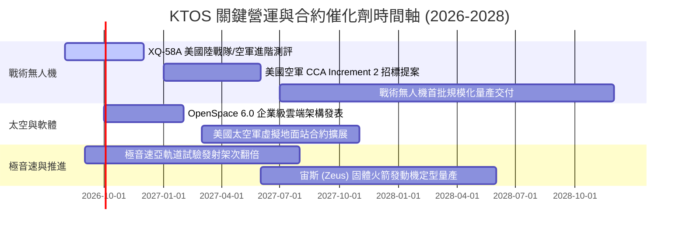

### 9.2 TAM 市場規模分析

```
╔══════════════════════════════════════════════════════════════════╗
║                   KTOS 目標市場規模 (TAM) 分析                  ║
╠══════════════════════════════════════════════════════════════════╣
║                                                                  ║
║  協同作戰飛機 (CCA) 與戰術無人機： TAM $14.5B  滲透率: ~3.0%     ║
║  噴射靶機系統 (Target Drones)：    TAM $1.8B   滲透率: ~42.0%    ║
║  衛星虛擬化地面系統 (OpenSpace)：  TAM $5.2B   滲透率: ~8.5%     ║
║  極音速與微波電子子系統：          TAM $8.0B   滲透率: ~5.0%     ║
║                                                                  ║
║  總計可觸及市場規模 (TAM)：約 $29.5B ｜ 當前營收佔比僅 ~5.1%     ║
╚══════════════════════════════════════════════════════════════════╝
```

### 9.3 成長驅動力結構圖

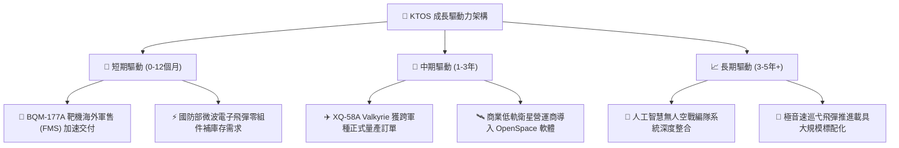

---

## 10. 風險矩陣

### 10.1 風險評分矩陣

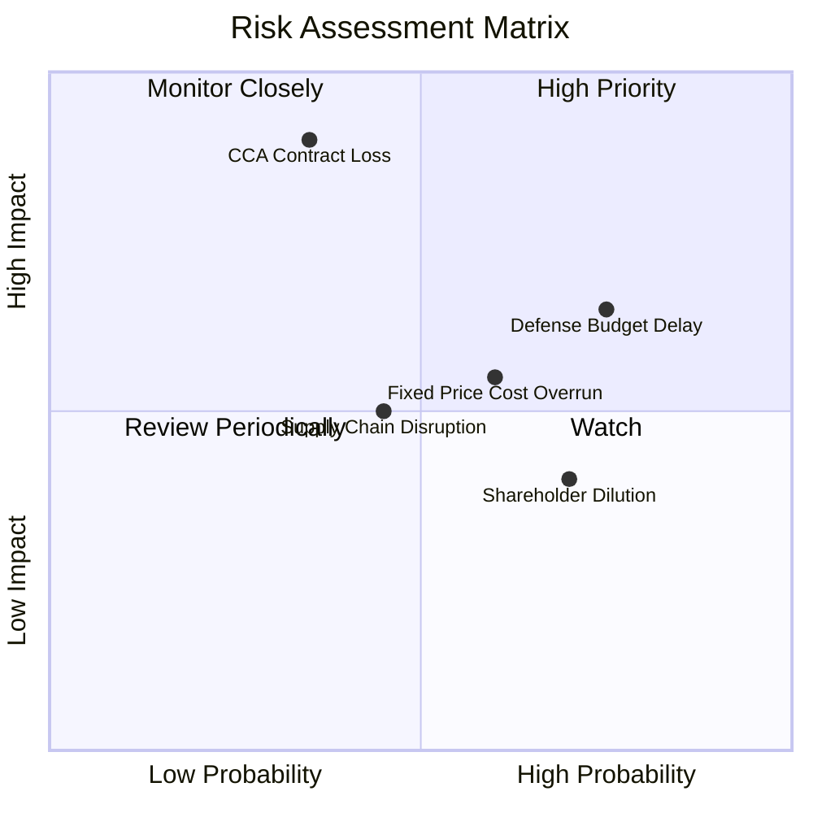

### 10.2 風險清單詳細分析

| # | 風險項目 | 發生機率 | 財務衝擊 | 風險評分 | 緩解措施與防護機制 |
|---|----------|----------|----------|----------|--------------------|
| 1 | 🔴 **CCA 專案合約競爭落敗** | 中等 (35%) | 極高 (-25% 遠期成長) | 🔴 **7.8 / 10** | 開拓海軍陸戰隊 PAACK-E、國際盟國採購及多用途試驗載具市場 |
| 2 | 🟡 **國防預算持續決議案 (CR) 延宕** | 高 (75%) | 中度 (-5% 短期營收) | 🟡 **6.8 / 10** | 依賴現有在手多年度未完成訂單（Backlog）維持產線運作 |
| 3 | 🟡 **固定價格合約通膨超支** | 中高 (60%)| 中度 (-150 bps 毛利) | 🟡 **6.2 / 10** | 導入數位製造技術並在新合約中加入通膨指數調整條款 |
| 4 | 🟡 **股權進一步增發稀釋** | 高 (70%) | 低度 (-8% EPS 稀釋) | 🟡 **5.5 / 10** | 當前帳上具備 $1.44B 現金，未來兩年無再次融資迫切性 |

---

## 11. 投資建議

### 11.1 最終綜合評級雷達圖

```
╔══════════════════════════════════════════════════════════════╗
║                  KTOS 最終綜合評級診斷                       ║
╠══════════════════════════════════════════════════════════════╣
║ 基本面強度    7.0 ▓▓▓▓▓▓▓▓▓▓▓▓▓▓░░░░░░  訂單能見度充沛        ║
║ 成長潛力      8.5 ▓▓▓▓▓▓▓▓▓▓▓▓▓▓▓▓▓░░░  無人機賽道先驅        ║
║ 獲利品質      4.5 ▓▓▓▓▓▓▓▓▓░░░░░░░░░░░  現金流仍為負          ║
║ 資產負債表    9.5 ▓▓▓▓▓▓▓▓▓▓▓▓▓▓▓▓▓▓▓░  淨現金 12.4 億美元    ║
║ 估值吸引力    4.5 ▓▓▓▓▓▓▓▓▓░░░░░░░░░░░  倍數已充分定價        ║
║ 護城河壁壘    7.5 ▓▓▓▓▓▓▓▓▓▓▓▓▓▓▓░░░░░  機密認證與技術先發    ║
╠══════════════════════════════════════════════════════════════╣
║ 綜合評級      6.8 🟡 持有／區間操作（Hold / Neutral）         ║
╚══════════════════════════════════════════════════════════════╝
```

### 11.2 目標價與隱含報酬率

| 情境 | 目標價 | 隱含報酬率 | 機率權重 | 核心觸發情境與條件 |
|------|--------|------------|----------|--------------------|
| 🔴 **悲觀情境** | **$38.00** | **-40.13%** | 25% | CCA 專案未獲主流訂單，產線固定成本持續拖累利潤率 |
| 🟡 **基準情境 (12M)** | **$68.90** | **+8.56%** | 55% | 營收維持 18-20% 增長，營業利益率緩步修復至 5.0% |
| 🟢 **樂觀情境** | **$78.00** | **+22.89%** | 20% | XQ-58A 獲大額生產授權，OpenSpace 軟體營收翻倍 |

### 11.3 買入時機與觸發因素

```
╔══════════════════════════════════════════════════════════════════╗
║                  ✅ 投資人操作 Checklist                        ║
╠══════════════════════════════════════════════════════════════╣
║                                                                  ║
║  立即買入 / 加碼觸發條件（需滿足兩項以上）：                    ║
║  ☐ 股價回檔至建議買入區間（$48.00 – $55.00，MOS ≥ 20%）         ║
║  ☐ 單季營業現金流（OCF）由負轉正並持續兩季                      ║
║  ☐ 美國國防部正式公佈 XQ-58A 進入常規編裝之 Program of Record   ║
║                                                                  ║
║  持股觀望條件：                                                  ║
║  ✅ 股價處於 $55.00 – $72.00 區間，等待產能擴建拐點確立          ║
║                                                                  ║
║  減碼 / 停損觸發條件（出現任一即應執行）：                       ║
║  ☐ 股價突破 $78.00（超越樂觀價值，估值泡沫化）                  ║
║  ☐ 單季毛利率跌破 20.0% 或營業虧損持續擴大                      ║
╚══════════════════════════════════════════════════════════════╝
```

### 11.4 投資人適配度分析

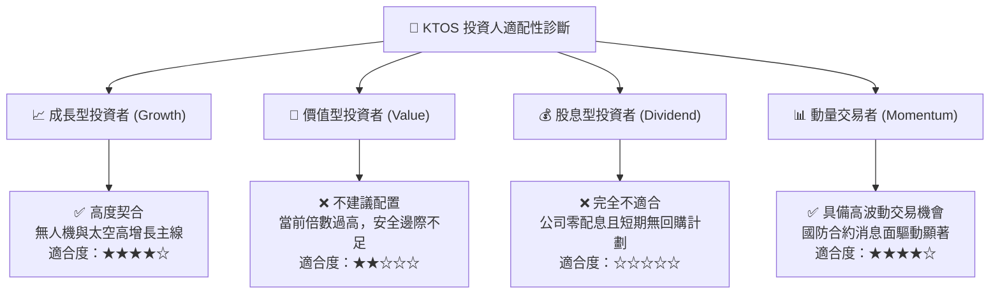

### 11.5 每季財報監控清單

| 監控項目 | 關鍵指標 | 正常區間 / 目標 | 觸發加碼門檻 | 觸發減碼 / 停損門檻 |
|----------|----------|-----------------|--------------|---------------------|
| **營收年增率** | YoY Growth % | 20.0% – 25.0% | **> 30.0%** | **< 12.0%** |
| **毛利率** | Gross Margin | 23.0% – 25.0% | **> 26.0%** | **< 20.5%** |
| **營業利潤率** | Operating Margin| 2.0% – 5.0% | **> 6.0%** | **< -2.0%** |
| **營運現金流** | OCF ($M) | 損益兩平以上 | **連續兩季 > +$20M** | **單季失血 > -$40M**|
| **未完成訂單** | Book-to-Bill Ratio| > 1.10x | **> 1.25x** | **< 0.90x** |

### 11.6 反面論證：什麼會證明論點錯誤

```
╔══════════════════════════════════════════════════════════════════╗
║              ⚠️ 論點失效條件（Disconfirming Evidence）           ║
╠══════════════════════════════════════════════════════════════════╣
║  本研究報告之基準與多頭論點在下列情況發生時即告失效，應立即撤出：║
║                                                                  ║
║  1. 美國空軍正式將 CCA Block 1/2 主要生產合約全數授予競爭對手   ║
║     （如 Anduril Fury 或 General Atomics Gambit），KTOS 完全出局 ║
║  2. 營業利潤率連續 4 季停滯於 0% 以下，產能規模效應未能體現     ║
║  3. 自由現金流（FCF）在 FY2027 仍持續大額失血（每年負流出 >$80M） ║
║  4. 管理層再次宣布大規模無溢價股權增發，股本稀釋幅度超過 15%    ║
╚══════════════════════════════════════════════════════════════════╝
```

---
> **免責聲明**：本報告為依據公開即時財務數據所進行之機構級基本面研究，僅供專業投資決策參考，不構成任何買賣要約或投資建議。投資人應獨立評估市場風險，自負投資盈虧。