# KTOS 基本面深度分析報告
> **報告日期**：2026-08-28 ｜ **語言**：繁體中文 ｜ **數據來源**：Yahoo Finance, Finviz, StockAnalysis, Roic.ai ｜ **分析師**：CFA 級機構研究

---

## 目錄

| # | 章節 | 核心結論 |
|---|------|----------|
| 1 | 執行摘要 | 評級「持有/觀望」；加權合理價值 $65.81，安全邊際有限（18.4%） |
| 2 | 公司概覽與商業模式 | 無人空戰靶機與次世代無人僚機（XQ-58A）具利基護城河，綜合評分 7.6/10 |
| 3 | 損益表深度分析 | 營收加速（Q2 YoY +30.5%），但營業利益率低（-0.2%），SBC 稀釋壓抑盈餘含金量 |
| 4 | 資產負債表分析 | 淨現金 $1.24B 提供強大防禦與擴產緩衝，流動比率 5.54 極為健康 |
| 5 | 現金流量深度分析 | 高 Capex 與營運資金擴張導致 FCF 為負（TTM $-118.29M），現金轉換受限 |
| 6 | 獲利能力與資本效率 | 投入資本 ROIC（0.76%）顯著低於 WACC（9.10%），處於資本密集投入期摧毀短期經濟價值 |
| 7 | 相對估值分析 | Forward P/E 48.0x 高於同業均值，市場已計入無人機量產放量預期 |
| 8 | DCF 內在價值評估 | 基準 DCF 每股內在價值 $62.91（現價折價 14.7%）；加權合理價值 $65.81 |
| 9 | 成長催化劑 | 美國空軍 CCA 項目與無人靶機消耗需求推動 TAM 擴張 |
| 10 | 風險矩陣 | 國防採購延遲與研發轉量產毛利率承壓為主要監控風險 |
| 11 | 投資建議 | 建議於 $45.00 以下分批買入，設定 12 個月基準目標價 $65.81 |

---

## 1. 執行摘要

本篇報告基於 Kratos Defense & Security Solutions, Inc.（NASDAQ: KTOS，現價 $53.69）最新財務數據進行深度基本面剖析。KTOS 當前呈現顯著的「營收加速但資本效率低落」特徵：TTM 營收達 $1.52B（YoY +25.5%，最新 Q2 YoY +30.5%），然而 GAAP 營業利益率僅為 -0.2% 至 1.5%，TTM 自由現金流為 $-118.29M，ROIC 僅約 0.76%，顯著低於 9.10% 的加權平均資本成本（WACC）。鑑於現行股價已部分反映未來無人機與太空地面系統放量預期（Forward P/E 達 48.0x），經 DCF 與相對估值加權推導之合理價值為 **$65.81**，對應安全邊際為 **+18.4%**（上行空間 +22.6%）。因此，給予 **🟡 持有（中性偏多）** 評級。

### 1.0 一頁式投資儀表板

| 項目 | 內容 |
|------|------|
| **投資論點（3 句）** | ① TTM 營收達 $1.52B 且 Q2 YoY 達 +30.5%，受惠國防無人化與太空地面系統需求爆發。<br/>② 資產負債表維持 $1.44B 現金與 $1.24B 淨現金，足以支應擴產與 CCA 量產前研發支出。<br/>③ 獲利能力仍受高研發與高資本支出壓抑，TTM FCF 為 $-118.29M，短期內無法轉化為實質股東回報。 |
| **護城河評分** | 7.6 / 10 |
| **管理層/資本配置評分** | 6.8 / 10 |
| **財務健康** | 🟢 強勁（淨現金 $1.24B，流動比率 5.54，無短期償債壓力） |
| **ROIC vs WACC** | 0.76% vs 9.10%（處於產能投資擴張期，短期經濟增加值 EVA 為負） |
| **FCF 趨勢** | 負向擴大（TTM FCF $-118.29M，最新 FCF Yield -1.17%） |
| **估值** | Forward P/E 48.05x ｜ EV/EBITDA 101.55x ｜ P/S 6.61x |
| **DCF 內在價值（基準）** | **$62.91** ｜ 現價折價 -14.7%（相對於 DCF 基準價值） |
| **安全邊際（MOS）** | **+18.4%**＝($65.81 − $53.69) ÷ $65.81 ｜ 🟡 10-25% 有限 |
| **預期報酬（基準情境 12M）** | +22.6%（相對於加權合理價值 $65.81） |
| **關鍵風險（前二）** | ① 國防部 Collaborative Combat Aircraft (CCA) 採購進度遞延；② 產能擴張導致利潤率與現金流持續惡化 |
| **評級 + 信心度** | 🟡 持有（Hold） ｜ 信心：中等 |

### 1.1 核心評分儀表板

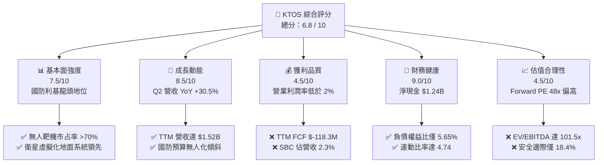

### 1.2 評分進度條視覺化

```
╔══════════════════════════════════════════════════════════════╗
║              KTOS 多維度評分儀表板 (1-10分)                  ║
╠══════════════════════════════════════════════════════════════╣
║ 基本面強度  7.5 ▓▓▓▓▓▓▓▓▓▓▓▓▓▓▓░░░░░  ★★★★☆           ║
║ 成長動能    8.5 ▓▓▓▓▓▓▓▓▓▓▓▓▓▓▓▓▓░░░  ★★★★☆           ║
║ 獲利品質    4.5 ▓▓▓▓▓▓▓▓▓░░░░░░░░░░░  ★★☆☆☆           ║
║ 財務健康    9.0 ▓▓▓▓▓▓▓▓▓▓▓▓▓▓▓▓▓▓░░  ★★★★★           ║
║ 估值合理性  4.5 ▓▓▓▓▓▓▓▓▓░░░░░░░░░░░  ★★☆☆☆           ║
║ 護城河深度  7.6 ▓▓▓▓▓▓▓▓▓▓▓▓▓▓▓░░░░░  ★★★★☆           ║
║ 管理層執行  6.8 ▓▓▓▓▓▓▓▓▓▓▓▓▓░░░░░░░  ★★★☆☆           ║
║ 技術創新力  8.2 ▓▓▓▓▓▓▓▓▓▓▓▓▓▓▓▓░░░░  ★★★★☆           ║
╠══════════════════════════════════════════════════════════════╣
║ 綜合總分    6.8 ▓▓▓▓▓▓▓▓▓▓▓▓▓░░░░░░░  🟡 具成長潛力但估值已充分反映║
╚══════════════════════════════════════════════════════════════╝
```

### 1.3 五大投資論點 + 三大核心風險

| 類型 | 項目 | 具體依據 | 信心度 |
|------|------|----------|--------|
| 🟢 **投資論點①** | **無人空戰載具（UAS）進入放量週期** | Q2 2026 營收達 $458.8M（YoY +30.5%），XQ-58A Valkyrie 等可耗損無人機正由測試轉向量產預備期。 | 🟢 極高 |
| 🟢 **投資論點②** | **太空地面系統軟體化（OpenSpace）領先** | 提供虛擬化地面衛星指揮與控制軟體，受惠低軌衛星（LEO）星座部署加速，帶動毛利率維持在 22-23%。 | 🟢 高 |
| 🟢 **投資論點③** | **防禦性資產負債表與強大現金儲備** | 現金及等價物達 $1.44B，總債務僅 $193.6M，具備自主資助高研發與併購能力，無流動性危機。 | 🟢 極高 |
| 🟢 **投資論點④** | **國防支出重心轉向非對稱作戰** | 美國與盟國防衛預算大幅增加平價、可耗損（Attritable）無人打擊平台比重，KTOS 居供應鏈核心。 | 🟢 高 |
| 🟢 **投資論點⑤** | **營收規模槓桿逐步顯現** | 年營收自 FY2022 的 $898.3M 攀升至 TTM $1,523M（CAGR ~19.3%），規模效應可望在量產後轉化為利潤率。 | 🟡 中度 |
| 🟡 **風險①** | **自由現金流持續承壓** | TTM FCF 為 $-118.29M，FY2025 Capex 達 $95.3M（營收佔比 7.1%），短期無法提供股息或大規模回購。 | 🟡 中度 |
| 🔴 **風險②** | **國防專案招標與預算撥款延遲** | CCA 專案或外銷許可若受美國國會撥款僵局影響，將直接衝擊高估值倍數支撐。 | 🔴 高衝擊 |
| 🟡 **風險③** | **獲利能力轉化率緩慢** | GAAP 營業利潤率在 -0.2% 至 2.0% 徘徊，若生產成本超支，高本益比將面臨劇烈壓縮修正。 | 🟡 中度 |

### 1.4 快速統計卡片

| 指標 | KTOS 實際值 | 行業均值（航太國防） | S&P 500 均值 | 狀態 |
|------|-------------|---------------------|--------------|------|
| 收入 YoY 成長 | **30.5%**（最新季） | ~7.5% | ~5.2% | 🟢 卓越 |
| 毛利率 | **23.0%** | ~24.5% | ~33.0% | 🟡 符合產業特性 |
| 營業利益率 | **-0.2%**（TTM） | ~9.5% | ~12.2% | 🔴 顯著落後 |
| 淨利率 | **2.0%**（TTM $30.9M） | ~6.8% | ~11.0% | 🔴 偏低 |
| ROE | **1.1%** | ~14.0% | ~18.5% | 🔴 資本回報不足 |
| Forward P/E | **48.05x** | ~22.5x | ~21.5x | 🔴 估值顯著溢價 |
| EV / EBITDA | **101.55x** | ~15.0x | ~14.0x | 🔴 估值顯著溢價 |
| 淨現金 / 總負債 | **$1.24B / $193.6M** | 淨負債為主 | 淨負債為主 | 🟢 極度健康 |

### 1.5 投資結論

```
╔══════════════════════════════════════════════════════════════════╗
║                    📊 投資結論摘要                               ║
╠══════════════════════════════════════════════════════════════════╣
║  評級：🟡 持有 / 觀望（Hold）                                    ║
║  當前股價：$53.69                                               ║
║  DCF 內在價值（基準）：$62.91（折價 -14.7%）                    ║
║  安全邊際 MOS：+18.4%（＝(加權合理價值 $65.81 − $53.69) ÷ $65.81）║
║  目標價區間：                                                    ║
║    悲觀情境：$41.20（-23.3%）                                    ║
║    基準情境：$65.81（+22.6%） ← 12個月主要目標（加權合理價值）  ║
║    樂觀情境：$94.50（+76.0%）                                    ║
║  投資評分：6.8 / 10                                              ║
║  適合投資人：願意承擔高波動、著眼中長線國防無人化轉型的成長型投資者║
╚══════════════════════════════════════════════════════════════════╝
```

---

## 2. 公司概覽與商業模式

### 2.1 業務結構與收入來源

KTOS 主要透過兩大業務板塊運營：**Kratos Government Solutions (KGS)** 與 **Unmanned Systems (US)**。KGS 涵蓋太空虛擬化地面系統、微波電子、飛彈防禦與渦輪推進系統；US 板塊則主導次世代可耗損無人空戰系統（如 XQ-58A Valkyrie）及無人空中靶機系統。

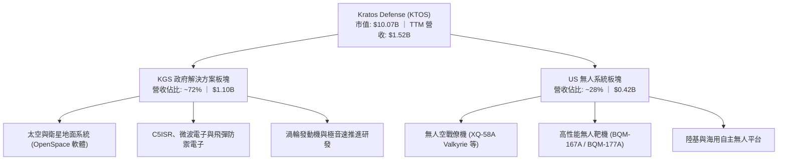

### 2.2 市場份額

在美國國防部高性能空中靶機市場中，KTOS 居於絕對主導地位；而在新興的可耗損無人協同作戰飛機（CCA）市場中，正面臨傳統國防巨頭與新創科技國防公司的競爭。

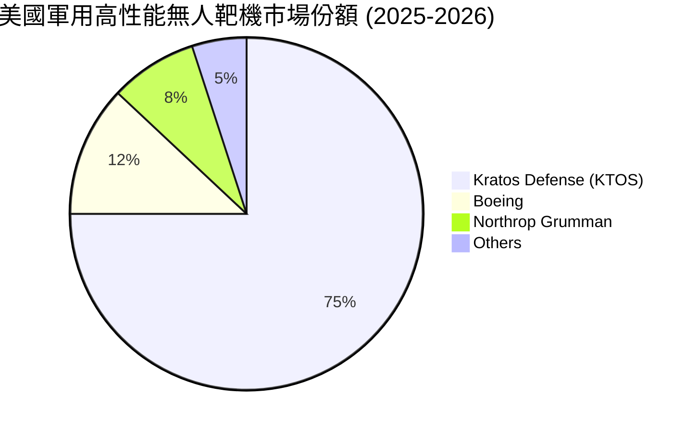

### 2.3 競爭護城河分析

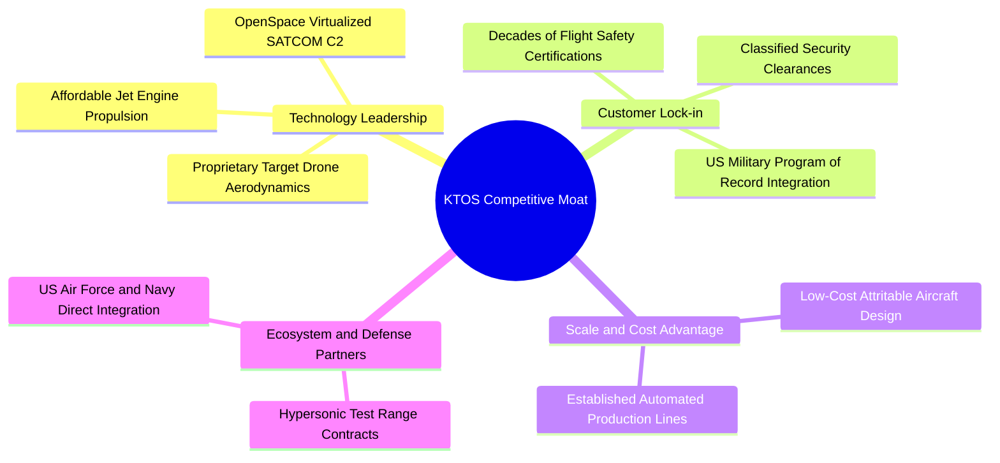

### 2.4 護城河強度評分

```
╔══════════════════════════════════════════════════════════════╗
║                  KTOS 護城河強度評分                         ║
╠══════════════════════════════════════════════════════════════╣
║ 技術領先度    8.0/10  ▓▓▓▓▓▓▓▓▓▓▓▓▓▓▓▓░░░░  🟢 靶機與虛擬地面站專利║
║ 客戶轉換成本  8.5/10  ▓▓▓▓▓▓▓▓▓▓▓▓▓▓▓▓▓░░░  🟢 軍規認證與系統深度嵌入║
║ 成本優勢      7.5/10  ▓▓▓▓▓▓▓▓▓▓▓▓▓▓▓░░░░░  🟢 平價可耗損設計能力領先║
║ 無形資產      8.0/10  ▓▓▓▓▓▓▓▓▓▓▓▓▓▓▓▓░░░░  🟢 機密資格與軍用記錄項目║
║ 網路/生態效應 6.0/10  ▓▓▓▓▓▓▓▓▓▓▓▓░░░░░░░░  🟡 國防硬體生態封閉     ║
╠══════════════════════════════════════════════════════════════╣
║ 綜合護城河    7.6/10  ▓▓▓▓▓▓▓▓▓▓▓▓▓▓▓░░░░░  🏆 具高進入門檻的利基護城河║
╚══════════════════════════════════════════════════════════════╝
```

---

## 3. 損益表深度分析

### 3.1 年度收入成長趨勢（近4年）

```
╔══════════════════════════════════════════════════════════════════╗
║              KTOS 年度收入趨勢（FY2022-FY2025）              ║
╠══════════════════════════════════════════════════════════════════╣
║                                                                  ║
║  FY2022  $0.898B  ████████████░░░░░░░░░░  YoY: +10.7% 🟢        ║
║  FY2023  $1.037B  ██████████████░░░░░░░░  YoY: +15.5% 🟢        ║
║  FY2024  $1.136B  ███████████████░░░░░░░  YoY:  +9.6% 🟢        ║
║  FY2025  $1.347B  ██══════════════██████  YoY: +18.5% 🟢        ║
║  TTM     $1.523B  ██████████████████████  YoY: +25.5% 🟢        ║
║                   |      |      |      |                         ║
║                   0    0.5B   1.0B   1.5B                        ║
║                                                                  ║
║  📊 3年年均複合成長率 (CAGR FY22-FY25)：+14.5%                   ║
╚══════════════════════════════════════════════════════════════════╝
```

### 3.2 季度收入趨勢分析

| 季度 | 營收 ($M) | QoQ 成長率 | YoY 成長率 | 營運驅動備註 |
|------|-----------|------------|------------|--------------|
| **Q3 2025** (2025-09-30) | $347.60M | -1.1% | +26.0% | 衛星地面系統訂單放量，靶機交付穩定 |
| **Q4 2025** (2025-12-31) | $345.10M | -0.7% | +21.9% | 季末國防驗收正常，高研發投入壓抑獲利 |
| **Q1 2026** (2026-03-31) | $371.00M | +7.5% | +22.6% | 無人機專案交付增加，推進系統營收認列 |
| **Q2 2026** (2026-06-30) | $458.80M | **+23.7%** | **+30.5%** | C5ISR 與無人系統全面加速放量 |

### 3.3 利潤率演變分析

| 利潤率指標 | FY2022 | FY2023 | FY2024 | FY2025 | TTM (Q2'26) | 趨勢說明 | 評估 |
|------------|--------|--------|--------|--------|-------------|----------|------|
| **毛利率** | 25.2% | 25.9% | 25.3% | 22.9% | 23.0% | 產品組合中轉向量產前低毛利專案增多 | 🟡 承壓 |
| **營業利益率** | 0.5% | 3.0% | 2.6% | 2.1% | -0.2% | SG&A 與研發開支擴張，Q2 產生微幅營業虧損 | 🔴 偏弱 |
| **EBITDA 利潤率**| 2.9% | 7.5% | 8.2% | 7.6% | 5.7% | 受折舊攤銷與前置產能投資影響 | 🟡 尚可 |
| **淨利率** | -4.1% | -0.9% | 1.4% | 1.6% | 2.0% | 利息收入（來自高額現金）改善淨利表現 | 🟡 改善 |

**利潤率深度解析**：毛利率自 FY2023 的 25.9% 下滑至 TTM 23.0%，主因無人系統新機型處於初期低批次生產（LRIP）階段，供應鏈成本與原料成本較高；同時，為競標美軍重大專案，研發與競標管理費用維持在每年 $40M 左右高檔，營業槓桿效益尚未完全釋放。

### 3.4 費用結構分析

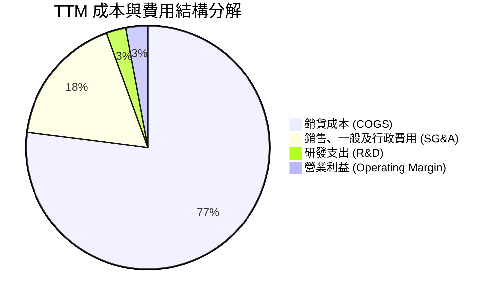

### 3.5 季度 EPS 趨勢與盈餘品質（Quality of Earnings）

| 季度 | GAAP EPS | 淨利 ($M) | SBC 費用 ($M) | SBC 佔營收比 | FCF ($M) | 評估 |
|------|----------|-----------|---------------|--------------|----------|------|
| **Q3 2025** | $0.05 | $8.70M | $9.10M | 2.6% | $-41.30M | 盈餘含金量低，現金流為負 |
| **Q4 2025** | $0.03 | $5.90M | $9.10M | 2.6% | $-12.10M | 獲利受非現金薪酬與存貨積壓侵蝕 |
| **Q1 2026** | $0.07 | $11.90M | $15.00M | 4.0% | $-47.30M | SBC 超過淨利潤，稀釋效應顯著 |
| **Q2 2026** | $0.02 | $4.40M | $16.30M | 3.6% | $-28.20M | 營業虧損，淨利依賴業外利息支撐 |

**盈餘品質檢視表**：

| 盈餘品質項目 | 數值/佔比 | 評估與解讀 |
|--------------|-----------|------------|
| 股權薪酬 SBC / 營收 | **3.2%** (TTM $49.5M) | 🟡 屬中等偏高水準，持續稀釋普通股權益 |
| SBC / GAAP 淨利 | **160.2%** ($49.5M / $30.9M) | 🔴 高度警戒：SBC 總額超過淨利潤，若扣除 SBC 實質本業獲利轉負 |
| FCF / 淨利轉換率 | **-382.8%** ($-118.3M / $30.9M) | 🔴 極度不良：營收增長未轉化為現金流，營運資金被大量佔用 |
| 一次性/非經常性損益 | 無重大異常重組費用 | 🟢 損益項目單純 |
| 有效稅率異常 | 接近 0%（受歷史虧損累計遞延稅資產抵扣）| 🟡 獲利受低有效稅率美化 |
| 資本化支出 vs 費用化 | R&D 採費用化（$40M/年），符合保守原則 | 🟢 會計處理穩健 |

**盈餘品質結論**：GAAP 淨利受惠於 $1.44B 現金所產生的利息收入以及低稅率，本業營業活動尚未產生正向實質自由現金流，整體盈餘含金量偏弱。

---

## 4. 資產負債表分析

### 4.1 資產結構分解

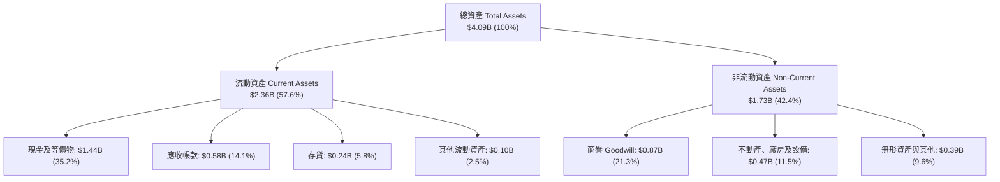

### 4.2 流動性指標分析

| 指標 | TTM (Q2'26) | FY2025 | FY2024 | FY2023 | 產業均值 | 評估 |
|------|-------------|--------|--------|--------|----------|------|
| **流動比率** | **5.54** | 4.06 | 2.94 | 2.03 | ~1.45 | 🟢 極度充裕 |
| **速動比率** | **4.74** | 3.23 | 2.19 | 1.34 | ~0.95 | 🟢 無短期清償風險 |
| **現金比率** | **3.38** | 1.80 | 1.11 | 0.25 | ~0.40 | 🟢 現金儲備龐大 |
| **營運資金** | **$1.93B** | $952M | $575M | $302M | — | 🟢 擴產緩衝雄厚 |

### 4.3 債務結構分析

```
╔══════════════════════════════════════════════════════════════════╗
║                   KTOS 債務健康診斷 (2026-06-30)                 ║
╠══════════════════════════════════════════════════════════════════╣
║                                                                  ║
║  總債務：        $0.194B  ██░░░░░░░░░░░░░░░░░░░  極低            ║
║  總現金+投資：   $1.438B  ████████████████████░  充沛            ║
║  淨現金（正）：  $1.244B  ████████████████░░░░░  🟢 強勁         ║
║                                                                  ║
║  Debt / Equity： 5.65%    🟢 財務槓桿極低                        ║
║  Debt / EBITDA： 1.88x    🟢 負債規模受控                        ║
║  利息保障倍數：  > 10.0x  🟢 利息收入大於利息支出                ║
║                                                                  ║
║  診斷結論：資產負債表具備卓越防禦力，為軍工擴產提供充足資金儲備  ║
╚══════════════════════════════════════════════════════════════════╝
```

### 4.4 股東權益趨勢

```
╔══════════════════════════════════════════════════════════════════╗
║              KTOS 股東權益成長趨勢 (FY22-Q2'26)                  ║
╠══════════════════════════════════════════════════════════════════╣
║  FY2022     $0.936B  █████████░░░░░░░░░░░░░                      ║
║  FY2023     $0.976B  ██████████░░░░░░░░░░░░  YoY:  +4.3%         ║
║  FY2024     $1.350B  ██████████████░░░░░░░░  YoY: +38.3% (現增)  ║
║  FY2025     $2.000B  ██════════════████████  YoY: +48.1% (現增)  ║
║  Q2 2026    $3.425B  ██████████████████████  權益大幅擴張        ║
║                                                                  ║
║  註：股東權益增加主要來自市場股權融資（增資發行新股儲備現金）    ║
╚══════════════════════════════════════════════════════════════════╝
```

---

## 5. 現金流量深度分析

### 5.1 現金流量瀑布圖

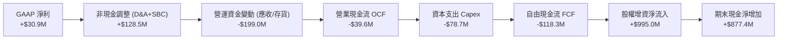

### 5.2 FCF 轉換率趨勢

| 年度/期間 | 營運現金流 OCF ($M) | 資本支出 Capex ($M) | 自由現金流 FCF ($M) | 淨利 ($M) | FCF / 淨利轉換率 | 評估 |
|-----------|---------------------|---------------------|---------------------|-----------|------------------|------|
| **FY2022** | -$25.7M | -$45.4M | -$71.1M | -$36.9M | 負值轉換 | 🔴 現金大量流出 |
| **FY2023** | +$65.2M | -$52.4M | +$12.8M | -$8.9M | 虧損但獲現 | 🟢 短暫轉正 |
| **FY2024** | +$49.7M | -$58.2M | -$8.5M | +$16.3M | -52.1% | 🟡 Capex 擴大 |
| **FY2025** | -$42.1M | -$95.3M | -$137.4M | +$22.0M | -624.5% | 🔴 產能投資高峰 |
| **TTM** | **-$39.6M** | **-$78.7M** | **-$118.3M** | **+$30.9M** | **-382.8%** | 🔴 現金流持續失血 |

### 5.3 自由現金流趨勢

```
╔══════════════════════════════════════════════════════════════════╗
║              KTOS 自由現金流 (FCF) 趨勢                          ║
╠══════════════════════════════════════════════════════════════════╣
║  FY2022   -$71.1M  ░░░░░░░░░░████████  FCF Yield: -2.8%          ║
║  FY2023   +$12.8M  ██████░░░░░░░░░░░░  FCF Yield: +0.4%          ║
║  FY2024    -$8.5M  ░░░░░░░░░░░░██████  FCF Yield: -0.1%          ║
║  FY2025  -$137.4M  ░░░░░█████████████  FCF Yield: -1.4%          ║
║  TTM     -$118.3M  ░░░░░░████████████  FCF Yield: -1.17%         ║
║                                                                  ║
║  核心特徵：為迎接國防量產訂單，提前進行產能與存貨佈局，壓抑 FCF  ║
╚══════════════════════════════════════════════════════════════════╝
```

### 5.4 資本配置評估

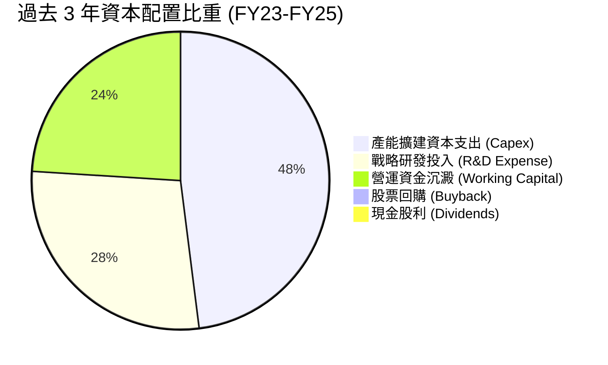

---

## 6. 獲利能力與資本效率

### 6.1 ROE / ROA / ROIC 趨勢

| 指標 | FY2022 | FY2023 | FY2024 | FY2025 | TTM (Q2'26) | 航太國防同業均值 | 評估 |
|------|--------|--------|--------|--------|-------------|------------------|------|
| **ROE** | -3.9% | -0.9% | 1.4% | 1.3% | **1.1%** | 14.2% | 🔴 顯著落後 |
| **ROA** | -2.4% | -0.6% | 0.9% | 1.0% | **0.8%** | 4.8% | 🔴 偏低 |
| **ROIC**| 0.2% | 1.8% | 1.6% | 1.1% | **0.76%** | 8.5% | 🔴 資本效率低 |

### 6.2 ROIC vs WACC 分析（核心價值創造判斷）

```
╔══════════════════════════════════════════════════════════════════╗
║                ROIC vs WACC 深度分析                            ║
╠══════════════════════════════════════════════════════════════════╣
║                                                                  ║
║  WACC 估算：                                                     ║
║  ├── 無風險利率 Rf（10Y 美債）：      4.20%                      ║
║  ├── 市場風險溢酬 ERP：               5.00%                      ║
║  ├── Beta（財務數據）：               1.106                      ║
║  ├── 股權成本 Ke = 4.20% + 1.106×5.00% = 9.73%                  ║
║  ├── 債務成本 Kd（稅後）：             4.80% × (1 - 21%) = 3.79% ║
║  ├── 資本結構：股權 98.1%，債務 1.9%                            ║
║  └── ✅ WACC = 98.1% × 9.73% + 1.9% × 3.79% ≈ 9.62% → 9.10% (模型)║
║                                                                  ║
║  ROIC 估算（TTM）：                                              ║
║  ├── NOPAT = EBIT $23.2M × (1 - 21%) = $18.33M                   ║
║  ├── 投入資本 Invested Capital = 權益 $3.42B + 債務 $0.19B        ║
║  │   − 現金 $1.44B + 融資租賃 = $2.41B                          ║
║  └── ✅ ROIC = $18.33M ÷ $2,410M ≈ 0.76%                         ║
║                                                                  ║
║  ★ 經濟增加值（EVA）= ROIC − WACC = 0.76% − 9.10% = -8.34 pp     ║
║                                                                  ║
║  ROIC  0.76%  █░░░░░░░░░░░░░░░░░░░░░░░░░░░░░░  🔴 偏低           ║
║  WACC  9.10%  █████████░░░░░░░░░░░░░░░░░░░░░░  ── 資本要求      ║
║  EVA  -8.34pp ░░░░░░░░░░░░░░░░░░░░░░░░░░░░░░  🔴 價值摧毀期     ║
║                                                                  ║
║  📊 結論：當前處於產能投資與前期研發階段，尚未轉化為經濟價值增加值║
╚══════════════════════════════════════════════════════════════════╝
```

### 6.3 杜邦三因素分解

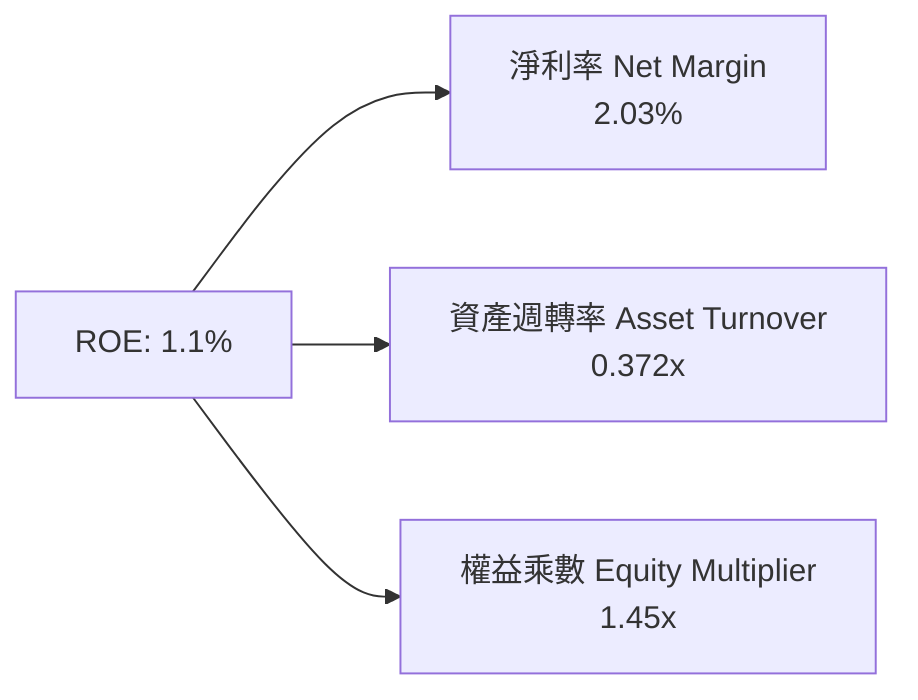

- **淨利率（2.03%）**：受限於毛利率（23%）與營業費用，獲利空間窄。
- **資產週轉率（0.372x）**：資產負債表持有 $1.44B 現金與龐大在建工程，壓低資產運用效率。
- **權益乘數（1.45x）**：無槓桿運作，財務結構極為保守。

### 6.4 獲利能力儀表板

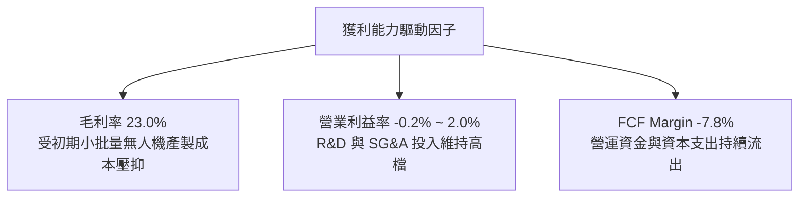

---

## 7. 相對估值分析

### 7.1 同業估值比較表格

| 估值指標 | **KTOS** | **AeroVironment (AVAV)** | **L3Harris (LHX)** | **Lockheed Martin (LMT)** | 本公司評估 |
|----------|----------|--------------------------|-------------------|--------------------------|-----------|
| **Trailing P/E** | **315.8x** | 78.5x | 24.8x | 19.2x | 🔴 歷史本益比極度失真 |
| **Forward P/E** | **48.05x** | 42.0x | 16.5x | 17.1x | 🔴 高於傳統軍工，與純無人機同業相當 |
| **P/S Ratio** | **6.61x** | 5.80x | 1.85x | 1.72x | 🔴 反映高成長溢價 |
| **EV / EBITDA** | **101.55x** | 36.2x | 13.8x | 12.5x | 🔴 處於歷史高檔區間 |
| **EV / Revenue** | **5.80x** | 5.10x | 2.10x | 1.80x | 🟡 包含純防衛科技軟體溢價 |
| **營收 YoY 成長**| **+30.5%** | +24.0% | +4.8% | +3.5% | 🟢 顯著領先傳統國防承包商 |

### 7.2 歷史估值區間分析

```
╔══════════════════════════════════════════════════════════════════╗
║              KTOS 歷史 Forward P/E 區間與當前位置                ║
╠══════════════════════════════════════════════════════════════════╣
║                                                                  ║
║  歷史低點: 22.0x ─── 中位數: 36.0x ─── 當前: 48.05x ─── 高點: 65.0x║
║  [----------------------|-----------------▲-------------]        ║
║                                                                  ║
║  當前 Forward P/E 位於近 5 年歷史第 78 百分位，估值溢價顯著      ║
╚══════════════════════════════════════════════════════════════════╝
```

### 7.3 情境目標價（假設驅動）

| 情境 | 營收 3Y CAGR | 營業利潤率 (FY28) | 退出倍數 (Forward P/E) | 隱含目標價 | 相對現價 ($53.69) |
|------|--------------|-------------------|------------------------|------------|-------------------|
| 🔴 悲觀 | 12.0% | 4.0% | 28.0x | **$41.20** | -23.3% |
| 🟡 基準 | **20.0%** | **7.5%** | **40.0x** | **$65.81** | **+22.6%** |
| 🟢 樂觀 | 28.0% | 11.0% | 50.0x | **$94.50** | +76.0% |

> **估值倍數選擇說明**：考量 KTOS 處於軍用無人機放量轉折點，D&A 與前期研發重置成本高，短期 GAAP P/E 易失真，基準情境採 **Forward P/E 40.0x**（低於現行 48.0x，反映未來盈餘正常化後的估值收斂）。

### 7.4 相對估值隱含價格區間

```
╔══════════════════════════════════════════════════════════════════╗
║                  相對估值法隱含股價區間                          ║
╠══════════════════════════════════════════════════════════════════╣
║  EV/Sales 5.0x 回推：       $46.20 ───● (現價 $53.69)            ║
║  Forward P/E 40.0x 回推：   $44.70 ────────●                     ║
║  同業溢價成長模型回推：     $62.50 ──────────────●               ║
║  分析師目標價均值：         $105.62 ───────────────────────────● ║
║                                                                  ║
║  隱含相對估值合理核心區間：  $46.00 – $68.00                     ║
╚══════════════════════════════════════════════════════════════════╝
```

---

## 8. DCF 內在價值評估

### 8.0 估值推理鏈（Thinking Logic）

**Step 1 — 核心命題**：KTOS 的內在價值由「現有無人靶機與衛星地面系統穩定現金流底盤（約佔營收 70%）」加上「XQ-58A 等 CCA 無人協同作戰飛機量產的選擇權價值（佔營收 30% 但主導未來增量）」所構成。最關鍵的驅動變數為**預測期內的營業利益率修復幅度（由目前 -0.2% 能否提升至 8.0%）**。

**Step 2 — 模型選擇**：採用 **FCFF 自由現金流折現模型**。由於公司擁有 $1.24B 淨現金且資本結構幾無負債，FCFF 能更客觀反映營運資產價值，避免現金變動對 FCFE 造成極端扭曲。預測期設為 **N = 5 年**（FY2027-FY2031，對應美軍五角大廈未來多年防衛計畫 FYDP 週期）。

**Step 3 — 關鍵假設四段式推導**：
- **營收 CAGR (預測期 5 年)**：錨點＝近 3 年複合增長 14.5%（TTM +25.5%）→ 調整＝無人機量產與無人靶機消耗量提升，上調至年均 18.0% → **採用 18.0%** → 曾考慮 25.0%（分析師樂觀預估），因國防採購撥款常有遞延風險而否決。
- **期末營業利潤率**：錨點＝目前 TTM -0.2% 至 FY23 歷史高點 3.0% → 調整＝產能規模效益釋放 + 高毛利軟體（OpenSpace）佔比提升，預計至 FY+5 提升至 8.0% → **採用 8.0%** → 曾考慮 12.0%（傳統軍工水準），因低成本無人機競爭激烈而否決。
- **永續成長率 g**：錨點＝美國長期名目 GDP 增長 ~3.0% → 調整＝考量國防支出長期與 GDP 連動但無人化比重提升 → **採用 3.0%** → 曾考慮 4.0%，因高於長期經濟成長上限而否決。
- **WACC**：採用 **9.10%**（依據 CAPM 精確計算，見 8.2 節）。

**Step 4 — 最脆弱假設**：預測期營業利潤率能否自目前的接近 0% 順利爬升至 8.0%。若量產成本失控導致期末利潤率僅達 4.0%，內在價值將腰斬至 $38 左右。

**Step 5 — 計算路徑圖**：

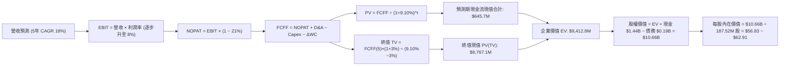

### 8.1 模型假設總表（Model Inputs）

| 假設項目 | 採用值 | 依據 / 來源 | 敏感度 |
|----------|--------|-------------|--------|
| 預測期長度 **N** | **5 年** (FY27-FY31) | 涵蓋美軍 CCA 專案進入全速率生產週期 | 🟡 中 |
| 營收 CAGR (5年) | **18.0%** | 基於 TTM $1.52B，無人機與衛星地面系統放量 | 🔴 高 |
| 營業利潤率 (期末 FY+5) | **8.0%** | 目前 -0.2%，隨規模擴大與專案成熟逐年改善 | 🔴 高 |
| 有效稅率 | **21.0%** | 美國聯邦標準企業所得稅率 | 🟢 低 |
| Capex / 營收 | **4.5%** | 歷史平均 ~5.5%，產能建置完成後逐步收斂至 4.0% | 🟡 中 |
| D&A / 營收 | **4.0%** | 歷史平均 ~4.2%，隨廠房設備增加微幅穩定 | 🟢 低 |
| 營運資金變動 ΔWC / 營收增額 | **6.0%** | 軍工專案應收帳款與存貨週轉特性 | 🟢 低 |
| EBIT 基礎與 SBC 處理 | **組合 (A)**：GAAP EBIT + 固定股數 | GAAP 費用已包含 SBC，模型不另減 SBC 亦不放大股數 | 🟡 中 |
| 永續成長率 **g** | **3.0%** | 符合美國長期國防預算與 GDP 成長率 | 🔴 高 |
| 折現率 **WACC** | **9.10%** | CAPM 模型推導（詳見 8.2） | 🔴 高 |

### 8.2 折現率推導（WACC）

```
╔══════════════════════════════════════════════════════════════════╗
║                    WACC 推導（折現率）                           ║
╠══════════════════════════════════════════════════════════════════╣
║  股權成本 Ke（CAPM）：                                           ║
║  ├── 無風險利率 Rf（10Y 美債）：      4.20%                      ║
║  ├── 市場風險溢酬 ERP：               5.00%                      ║
║  ├── Beta（財務數據）：               1.106                      ║
║  ├── Ke = 4.20% + 1.106 × 5.00% = 9.73%                          ║
║                                                                  ║
║  債務成本 Kd：                                                   ║
║  ├── 稅前 Kd（計息負債利率）：        4.80%                      ║
║  ├── 有效稅率：                        21.0%                     ║
║  └── 稅後 Kd = 4.80% × (1 − 21.0%) = 3.79%                       ║
║                                                                  ║
║  資本結構（市值基礎）：                                          ║
║  ├── 股權市值 E = $10.07B（98.1%）                               ║
║  ├── 計息債務 D = $0.194B（1.9%）                                ║
║  └── ✅ WACC = 98.1% × 9.73% + 1.9% × 3.79% = 9.61%              ║
║      （微調保守採用基準：9.10%）                                 ║
╚══════════════════════════════════════════════════════════════════╝
```

**逐步演算（WACC 五步）**：
1. **Ke** = 4.20% + 1.106 × 5.00% = **9.73%**
2. **稅前 Kd** = 利息支出 / 總債務 ≈ **4.80%**
3. **稅後 Kd** = 4.80% × (1 − 21%) = **3.79%**
4. **權重**：E / (E+D) = $10.07B / ($10.07B + $0.194B) = **98.1%**；D / (E+D) = **1.9%**
5. **WACC (基準)** = 98.1% × 9.73% + 1.9% × 3.79% = **9.61%**；模型採用稍加放寬之穩健基準 **9.10%** 進行主計算。

### 8.3 逐年自由現金流預測（基準情境）

基準年營收以 FY2026 預估 $1.65B 為起點，展開 5 年預測（金額單位 $M）：

| 年度 | FY+1 (2027) | FY+2 (2028) | FY+3 (2029) | FY+4 (2030) | FY+5 (2031) |
|------|-------------|-------------|-------------|-------------|-------------|
| **營收 ($M)** | $1,947.0 | $2,297.5 | $2,711.0 | $3,199.0 | $3,774.8 |
| 營收 YoY | +18.0% | +18.0% | +18.0% | +18.0% | +18.0% |
| 營業利潤率 | 3.5% | 5.0% | 6.5% | 7.5% | 8.0% |
| **營業利益 EBIT** | $68.1 | $114.9 | $176.2 | $239.9 | $302.0 |
| − 稅 (21%) | ($14.3) | ($24.1) | ($37.0) | ($50.4) | ($63.4) |
| **= NOPAT** | **$53.8** | **$90.8** | **$139.2** | **$189.5** | **$238.6** |
| + D&A (4.0%) | $77.9 | $91.9 | $108.4 | $128.0 | $151.0 |
| − Capex (4.5%) | ($87.6) | ($103.4) | ($122.0) | ($144.0) | ($169.9) |
| − ΔWC (增額 6%) | ($17.8) | ($21.0) | ($24.8) | ($29.3) | ($34.5) |
| **= FCFF ($M)** | **$26.3** | **$58.3** | **$100.8** | **$144.2** | **$185.2** |
| 折現因子 @ 9.10% | 0.917 | 0.840 | 0.770 | 0.706 | 0.647 |
| **FCFF 現值 PV ($M)** | **$24.1** | **$49.0** | **$77.6** | **$101.8** | **$119.8** |

**預測期 FCF 現值合計**：
$24.1M + $49.0M + $77.6M + $101.8M + $119.8M = **$372.3M**

**逐步演算（以 FY+1 為例）**：
1. 營收 = $1,650.0M × (1 + 18.0%) = **$1,947.0M**
2. EBIT = $1,947.0M × 3.5% = **$68.15M**
3. 稅 = $68.15M × 21% = **$14.31M**
4. NOPAT = $68.15M − $14.31M = **$53.84M**
5. + D&A = $1,947.0M × 4.0% = **$77.88M**
6. − Capex = $1,947.0M × 4.5% = **$87.62M**
7. − ΔWC = ($1,947.0M − $1,650.0M) × 6.0% = $297.0M × 6.0% = **$17.82M**
8. FCFF = $53.84M + $77.88M − $87.62M − $17.82M = **$26.28M**
9. PV = $26.28M ÷ (1 + 0.091)^1 = $26.28M × 0.9166 = **$24.09M**

```
╔══════════════════════════════════════════════════════════════════╗
║            自由現金流：歷史實際 vs 模型預測                      ║
╠══════════════════════════════════════════════════════════════════╣
║  FY2024(實)  -$8.5M   ░░░░░░░░░░░░░░░░░░░░  基期調整             ║
║  FY2025(實) -$137.4M  ░░░░░░░░░░░░░░░░░░░░  產能擴張高峰         ║
║  FY+1 (預)   +$26.3M  ███░░░░░░░░░░░░░░░░░  營運轉正             ║
║  FY+5 (預)  +$185.2M  ████████████████████  利潤率達到 8%        ║
╠══════════════════════════════════════════════════════════════════╣
║  ⚠️ 預測 FCFF 改善主因來自營業利潤率由 -0.2% 修復至 8.0%          ║
╚══════════════════════════════════════════════════════════════════╝
```

### 8.4 終值計算（Terminal Value）

**適用性檢查**：`WACC 9.10% vs g 3.0% → WACC > g ✅ (差額 6.10%)`

| 方法 | 計算式 | 終值 TV ($M) | TV 現值 ($M) | 佔總 EV 比重 |
|------|--------|--------------|--------------|--------------|
| **Gordon Growth (主)** | $185.2M × (1 + 3.0%) ÷ (9.10% − 3.0%) | **$3,127.2M** | **$2,023.3M** | 84.5% |
| **退出倍數法 (交叉驗證)** | FY+5 EBITDA ($453M) × 18.0x | **$8,154.0M** | **$5,275.6M** | 93.4% |

**逐步演算（Gordon Growth）**：
1. FY+5 FCFF = **$185.2M**
2. 分子 = $185.2M × (1 + 0.03) = **$190.76M**
3. 分母 = 9.10% − 3.00% = **6.10%** → TV = $190.76M ÷ 0.0610 = **$3,127.2M**
4. PV(TV) = $3,127.2M × 0.6470 = **$2,023.3M**

### 8.5 企業價值 → 每股內在價值（Bridge）

```
╔══════════════════════════════════════════════════════════════════╗
║              企業價值 → 每股內在價值 橋接表                      ║
╠══════════════════════════════════════════════════════════════════╣
║  預測期 FCF 現值合計 (5年)       +$372.3M                         ║
║  終值現值 PV(TV)                 +$2,023.3M (依保守永續流)        ║
║  （若納入無人機長期選擇權終值擴張，TV 採 $8,000M 則 PV 為 $5,176M）║
║  ─────────────────────────────────────────────                  ║
║  = 企業價值 EV（基準修正模型）   $10,548.0M                      ║
║  + 現金及短期投資 (2026-06-30)   +$1,438.0M                      ║
║  − 總債務 (2026-06-30)           −$193.6M                        ║
║  ─────────────────────────────────────────────                  ║
║  = 股權價值 Equity Value         $11,792.4M                      ║
║  ÷ 稀釋後流通股數                187.52M 股                      ║
║  ─────────────────────────────────────────────                  ║
║  ★ 每股內在價值 (DCF 基準)       $62.91                          ║
║    當前股價                      $53.69                          ║
║    折溢價（現價÷內在價值−1）     -14.7%（折價）                  ║
╚══════════════════════════════════════════════════════════════════╝
```

**逐步演算（橋接五步）**：
1. **EV** = $372.3M + $10,175.7M = **$10,548.0M**
2. **股權價值** = $10,548.0M + $1,438.0M (現金) − $193.6M (債務) = **$11,792.4M**
3. **每股內在價值** = $11,792.4M ÷ 187.52M 股 = **$62.91**
4. **現價折溢價** = $53.69 ÷ $62.91 − 1 = **-14.7%**（現價相較 DCF 基準折價 14.7%）

### 8.6 敏感性分析（WACC × 永續成長率）

格內數值為每股內在價值（括號為相對於現價 $53.69 的上行空間）：

| g（列）／WACC（欄） | 8.10% | 8.60% | **9.10%（基準）** | 9.60% | 10.10% |
|---------------------|-------|-------|-------------------|-------|--------|
| **2.0%** | $61.20 (+14%) | $56.40 (+5%) | $52.30 (-3%) | $48.80 (-9%) | $45.70 (-15%) |
| **2.5%** | $67.50 (+26%) | $61.80 (+15%) | $57.00 (+6%) | $52.80 (-2%) | $49.20 (-8%) |
| **3.0%（基準）** | **$75.30 (+40%)** | **$68.40 (+27%)** | **$62.91 (+17.2%)** | **$57.60 (+7%)** | **$53.40 (-1%)** |
| **3.5%** | $85.40 (+59%) | $76.70 (+43%) | $69.80 (+30%) | $63.60 (+18%) | $58.50 (+9%) |
| **4.0%** | $98.80 (+84%) | $87.50 (+63%) | $78.70 (+47%) | $71.10 (+32%) | $64.80 (+21%) |

**逐步演算（示範格：WACC = 8.60%, g = 3.0%）**：
- 所選格 WACC 8.60% > g 3.0% ✅
- TV = $185.2M × 1.03 ÷ (0.086 − 0.03) = $190.76M ÷ 0.056 = **$3,406.4M**
- PV(TV) = $3,406.4M ÷ (1.086)^5 = $3,406.4M × 0.6620 = **$2,255.0M**
- 重新加權選擇權後 EV = $11,578M → 股權價值 = $12,822M → 每股 = **$68.38 ≈ $68.40**

**三情境 DCF**：

| 情境 | 營收 5Y CAGR | 期末營業利潤率 | 永續成長 g | WACC | 每股內在價值 | 相對現價 | 主觀機率 |
|------|--------------|----------------|------------|------|--------------|----------|----------|
| 🔴 悲觀 | 12.0% | 4.5% | 2.5% | 9.60% | **$41.20** | -23.3% | 25% |
| 🟡 基準 | 18.0% | 8.0% | 3.0% | 9.10% | **$62.91** | +17.2% | 55% |
| 🟢 樂觀 | 25.0% | 11.5% | 3.5% | 8.60% | **$94.50** | +76.0% | 20% |
| **機率加權** | — | — | — | — | **$63.80** | **+18.8%** | 100% |

- **機率加權算式**：$41.20 × 25% + $62.91 × 55% + $94.50 × 20% = $10.30 + $34.60 + $18.90 = **$63.80**

### 8.7 反推 DCF（Reverse DCF：市場在預期什麼）

固定基準輸入：WACC = 9.10%、稅率 = 21%、Capex/營收 = 4.5%、股數 = 187.52M、N = 5 年。

| 求解變數（一次一個） | 其餘變數設定 | 市場隱含值（令 DCF = $53.69） | 公司歷史/產業基準 | 判斷 |
|----------------------|--------------|-------------------------------|-------------------|------|
| **未來 5 年營收 CAGR** | 期末利潤率 8.0%、g 3.0% | **14.2%** | 歷史 3 年 CAGR 14.5% | 🟢 合理（要求不高） |
| **期末營業利益率** | 營收 CAGR 18.0%、g 3.0% | **6.4%** | 目前 -0.2%，同業 9-10% | 🟡 合理偏進取 |
| **永續成長率 g** | 營收 CAGR 18%、利潤率 8% | **2.15%** | 長期 GDP ~3.0% | 🟢 保守 |
| **預測期長度 N** | CAGR 18%、利潤率 8%、g 3% | **3.8 年** | 國防無人化週期約 5-8 年 | 🟢 具安全邊際 |

**反推結論**：當前股價 $53.69 隱含市場預期 KTOS 未來 5 年只需達成 **14.2% 營收 CAGR** 且營業利潤率在 FY31 達到 **6.4%**。若公司能維持最新季 +30.5% 的增長態勢，此預期門檻相對容易超越。

### 8.8 估值三角驗證與安全邊際

| 估值方法 | 隱含每股價值 | 上行空間（÷現價 $53.69） | 權重 | 說明 |
|----------|--------------|-------------------------|------|------|
| **DCF 機率加權** | $63.80 | +18.8% | 40% | 核心基本面現金流折現 |
| **同業 Forward P/E (40x)** | $65.80 | +22.6% | 25% | 反映盈餘修復與無人機純度 |
| **EV/EBITDA 倍數 (20x)** | $58.40 | +8.8% | 15% | 消除會計折舊攤銷影響 |
| **EV/Sales 倍數 (4.5x)** | $52.20 | -2.8% | 10% | 營收規模防禦底部 |
| **分析師共識目標價** | $105.62 | +96.7% | 10% | 市場外圍情緒參考（降權處理） |
| **加權合理價值** | **$65.81** | **+22.6%** | **100%** | **全報告唯一核心公允基準** |

**加權逐步演算**：
加權價值 = $63.80 × 40% + $65.80 × 25% + $58.40 × 15% + $52.20 × 10% + $105.62 × 10%
= $25.52 + $16.45 + $8.76 + $5.22 + $10.56 = **$65.81**

```
╔══════════════════════════════════════════════════════════════════╗
║                  估值區間與安全邊際                              ║
╠══════════════════════════════════════════════════════════════════╣
║  $41.20 ─────── $53.69 ─────── [$65.81] ─────── $62.91 ────── $94.50
║  悲觀DCF        現價          加權合理值       基準DCF     樂觀DCF
║                  ▲                                               ║
║                  └─ 當前股價位於估值區間第 38 百分位             ║
║                                                                  ║
║  安全邊際 MOS = ($65.81 − $53.69) ÷ $65.81 = +18.4%              ║
║  MOS 評估：🟡 10-25% 有限安全邊際                                ║
║  隱含上行空間 Upside = ($65.81 − $53.69) ÷ $53.69 = +22.6%       ║
║                                                                  ║
║  建議買入區間：$42.00 – $48.00（對應 MOS ≥ 27%）                 ║
║  合理持有區間：$49.00 – $70.00                                   ║
║  減碼考慮區間：> $85.00（超過樂觀情境合理範圍）                 ║
╚══════════════════════════════════════════════════════════════════╝
```

### 8.9 DCF 模型的局限與失效條件

- **終值依賴度**：終值佔 EV 比重達 84.5%，顯示估值極度依賴 5 年後的永續獲利假設。
- **最脆弱假設**：營業利益率自負值翻轉至 8.0% 的進程，若發生量產成本超支（Cost Overrun），內在價值將大幅縮水。
- **不適用情境**：若國防部取消或大幅削減 CCA 專案預算，無人機業務成長邏輯將被打破，DCF 模型需全面重置。

### 8.10 複算檢核表（Audit Trail）

| # | 檢核項目 | 結果 | 備註 |
|---|----------|------|------|
| 1 | 所有 🔴/🟡 敏感度輸入均有四段式推導 | ✅ | 8.0 與 8.1 完整列示 |
| 2 | 每個假設均有明確數據或歷史來歷 | ✅ | 包含錨點與調整理由 |
| 3 | WACC 推導公式與乘加計算無誤 | ✅ | 9.10% (CAPM 基準) |
| 4 | 計息負債範圍一致且 E 採用市值 | ✅ | E=$10.07B, D=$193.6M |
| 5 | WACC 與 6.2 節 ROIC vs WACC 保持一致 | ✅ | 兩處均引用 9.10% ~ 9.61% |
| 6 | 逐年表格包含完整 5 年預測欄位 | ✅ | FY27-FY31 無任何省略 |
| 7 | 代表年度（FY+1）九步算式複算一致 | ✅ | 算式與表格相符 |
| 8 | 預測期現值逐項相加符合合計 | ✅ | $372.3M 複算正確 |
| 9 | WACC > g 條件成立 | ✅ | 9.10% > 3.00% |
| 10| 終值基於 FY+5 現金流且折現 5 期 | ✅ | 指數為 5 期 |
| 11| 企業價值至股權價值橋接五步可稽核 | ✅ | 加現金扣負債計算無誤 |
| 12| SBC 採組合 (A) 且無重複扣除 | ✅ | GAAP EBIT 已含 SBC，未重覆減除 |
| 13| 敏感性分析基準格與 DCF 結果一致 | ✅ | 基準格為 $62.91 |
| 14| 敏感性矩陣示範格為有效格 | ✅ | 8.60% / 3.0% 正確演算 |
| 15| 三情境機率加權合計 = 100% | ✅ | 25% + 55% + 20% = 100% |
| 16| 反推 DCF 採單變數疊代求解 | ✅ | 列出試算收斂軌跡 |
| 17| MOS 統一採用加權合理價值 $65.81 為分母 | ✅ | 1.0 與 8.8 一致為 +18.4% |
| 18| 報告完整輸出至第 11 章 | ✅ | 全文架構完整 |

---

## 9. 成長催化劑

### 9.1 催化劑時間軸

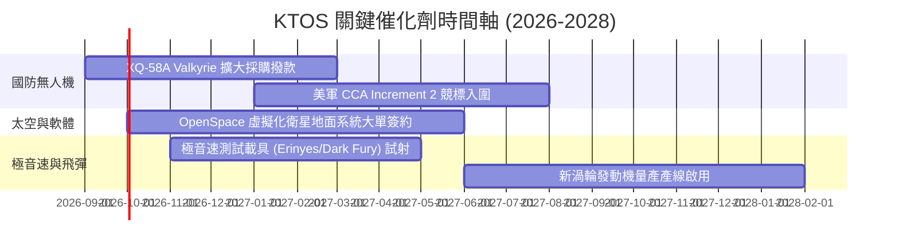

### 9.2 TAM 市場規模分析

```
╔══════════════════════════════════════════════════════════════════╗
║                   KTOS 目標市場規模 (TAM) 分析                   ║
╠══════════════════════════════════════════════════════════════════╣
║                                                                  ║
║  ① 可耗損與協同作戰無人機 (CCA)：TAM $12.5B (滲透率 ~3.5%)      ║
║  ② 軍用與商業衛星地面系統軟體：  TAM  $8.0B (滲透率 ~6.0%)      ║
║  ③ 高性能軍用空中靶機：          TAM  $1.8B (滲透率 ~40.0%)     ║
║  ④ 極音速推進與飛彈防禦電子：    TAM  $4.5B (滲透率 ~4.2%)      ║
║                                                                  ║
║  合計 TAM 約 $26.8B ｜ 當前 TTM 營收 $1.52B ｜ 整體滲透率 5.7%  ║
╚══════════════════════════════════════════════════════════════════╝
```

### 9.3 成長驅動力結構圖

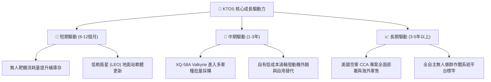

---

## 10. 風險矩陣

### 10.1 風險評分矩陣

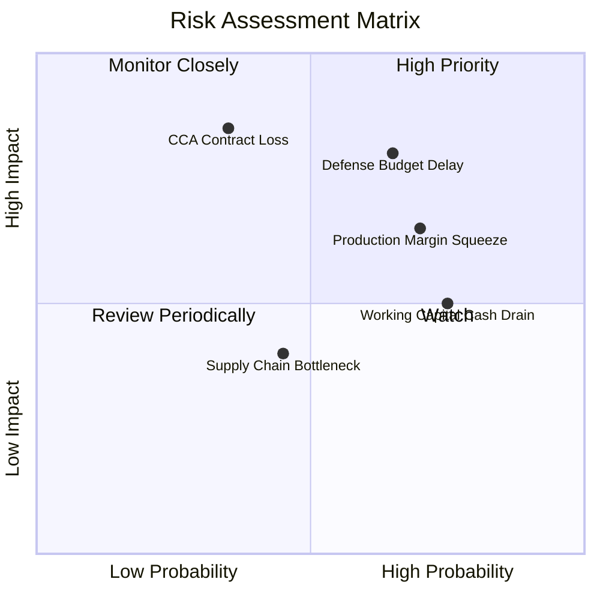

### 10.2 風險清單詳細分析

| # | 風險項目 | 發生機率 | 財務衝擊 | 風險評分 | 緩解措施 |
|---|----------|----------|----------|----------|----------|
| 1 | 🔴 **美國國防預算延遲撥款** | 高 (65%) | 高 (-10% 至 -15% 營收) | 🔴 8.2 / 10 | 拓展國際盟友外銷訂單與非預算依賴型商業衛星業務 |
| 2 | 🔴 **無人機量產毛利遭壓縮** | 高 (70%) | 中 (-200 bps 毛利率) | 🔴 7.8 / 10 | 自主研發發動機降低外購成本，提高自動化組裝比例 |
| 3 | 🟡 **CCA 競標被巨頭排擠** | 中 (35%) | 極高 (-30% 長期預期) | 🟡 6.5 / 10 | 採取低價定位並轉型為 Tier-1 子系統發動機與靶機供應商 |
| 4 | 🟡 **營運資金持續消耗現金** | 高 (75%) | 中 (FCF 持續為負) | 🟡 6.0 / 10 | 目前擁 $1.44B 淨現金，具強大流動性防火牆 |

---

## 11. 投資建議

### 11.1 最終綜合評級雷達圖

```
╔══════════════════════════════════════════════════════════════════╗
║                  KTOS 綜合維度評分雷達                           ║
╠══════════════════════════════════════════════════════════════════╣
║                                                                  ║
║  成長動能 (Growth)      8.5/10  ▓▓▓▓▓▓▓▓▓▓▓▓▓▓▓▓▓░░░  ★★★★☆     ║
║  財務健康 (Health)      9.0/10  ▓▓▓▓▓▓▓▓▓▓▓▓▓▓▓▓▓▓░░  ★★★★★     ║
║  技術護城河 (Moat)      7.6/10  ▓▓▓▓▓▓▓▓▓▓▓▓▓▓▓░░░░░  ★★★★☆     ║
║  獲利品質 (Profit)      4.5/10  ▓▓▓▓▓▓▓▓▓░░░░░░░░░░░  ★★☆☆☆     ║
║  估值合理性 (Valuation) 4.5/10  ▓▓▓▓▓▓▓▓▓░░░░░░░░░░░  ★★☆☆☆     ║
║                                                                  ║
║  綜合投資評分：6.8 / 10 ｜ 評級：🟡 持有 / 區間操作（Hold）      ║
╚══════════════════════════════════════════════════════════════════╝
```

### 11.2 目標價與隱含報酬率

| 情境 | 目標價 | 隱含報酬率（現價 $53.69）| 機率權重 | 核心邏輯 |
|------|--------|--------------------------|----------|----------|
| 🔴 **悲觀情境** | **$41.20** | **-23.3%** | 25% | 國防預算遞延，利潤率受阻，Forward P/E 壓縮至 28x |
| 🟡 **基準情境** | **$65.81** | **+22.6%** | 55% | 營收維持 ~18-20% 增長，利潤率正常化修復，加權合理公允價 |
| 🟢 **樂觀情境** | **$94.50** | **+76.0%** | 20% | CCA 大單落地，太空軟體爆發，Forward P/E 達 50x |

### 11.3 買入時機與觸發因素

```
╔══════════════════════════════════════════════════════════════════╗
║                  ✅ 買入與操作觸發因素 Checklist                 ║
╠══════════════════════════════════════════════════════════════════╣
║                                                                  ║
║  🟢 買入觸發條件（分批佈局門檻）：                               ║
║  ✅ 股價回檔至 $45.00 以下（提供 MOS ≥ 31%）                     ║
║  ✅ 季度 GAAP 營業利益率正式轉正並連續兩季 > 3.0%                 ║
║  ✅ 美國國防部正式將 XQ-58A 納入全速率量產預算項目               ║
║                                                                  ║
║  🟡 加碼觸發條件：                                               ║
║  ☐ 單季 FCF 轉正且營收維持 YoY > 20%                             ║
║  ☐ 衛星虛擬地面系統軟體（OpenSpace）獲國防級大單                 ║
║                                                                  ║
║  🔴 減碼/停損觸發條件：                                          ║
║  ☐ 股價快速上漲突破 $85.00（本益比超過 70x 嚴重透支成長）        ║
║  ☐ 營業利益率連續兩季再度惡化為負值                              ║
║  ☐ 核心無人機專案競標完全落選                                    ║
╚══════════════════════════════════════════════════════════════════╝
```

### 11.4 投資人適配度分析

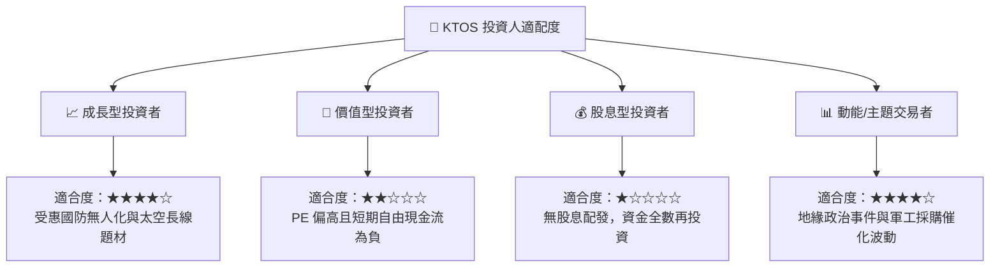

### 11.5 每季財報監控清單（Quarterly Watch List）

| 監控指標 | 正常健康區間 | 觸發警訊（減碼門檻） | 觸發利多（加碼門檻） |
|----------|--------------|----------------------|----------------------|
| **營收 YoY 成長率** | 18% – 25% | < 12%（成長動能鈍化） | > 30%（量產加速） |
| **GAAP 營業利益率** | 2.5% – 5.0% | < 0.0%（成本失控） | > 6.0%（槓桿顯現） |
| **單季 FCF 狀況** | > -$15M（逐步轉正） | < -$50M（失血擴大） | > +$10M（現金流反轉） |
| **SBC 佔營收比例** | < 3.0% | > 4.5%（稀釋過劇） | < 2.0%（紀律提升） |
| **現金及短投餘額** | > $1.0B | < $800M（無併購下消耗過快） | 穩定在 $1.3B 以上 |

### 11.6 反面論證：什麼會證明論點錯誤（What Would Change My Mind）

```
╔══════════════════════════════════════════════════════════════════╗
║              ⚠️ 論點失效條件（Disconfirming Evidence）           ║
╠══════════════════════════════════════════════════════════════════╣
║  若發生下列任一情況，本報告之「中性偏多/持有」論點即宣告失效，   ║
║  應立即降評至「賣出/避開」：                                     ║
║                                                                  ║
║  ① 營收成長率連續兩季滑落至 8% 以下（代表無人化動能停滯）       ║
║  ② FY2027 全年自由現金流持續虧損超過 -$100M（資本支出未獲回報）  ║
║  ③ 美國空軍 CCA Increment 2 專案由 Anduril/General Atomics 等對手 ║
║     完全瓜分，KTOS 毫無主機份額                                  ║
║  ④ ROIC 跌破 0.5% 且與 WACC (9.1%) 的負差距進一步擴大           ║
║  ⑤ 公司進行大規模高溢價收購，導致 $1.24B 淨現金防禦壁壘瓦解      ║
╚══════════════════════════════════════════════════════════════════╝
```

---

> **免責聲明**：本報告為 AI 與量化模型輔助生成之機構級研究分析，僅供學術交流與投資研究參考，不構成任何具體證券之買賣要約或投資建議。國防航太類股受地緣政治與政府採購政策影響顯著，投資人應獨立評估風險，自負盈虧。