# KTOS 基本面深度分析報告
> **報告日期**：2026-09-01 ｜ **語言**：繁體中文 ｜ **數據來源**：Yahoo Finance, Finviz, StockAnalysis, Roic.ai ｜ **分析師**：CFA 級機構研究

---

## 目錄

| # | 章節 | 核心結論 |
|---|------|----------|
| 1 | 執行摘要 | 評級「持有/觀望」；現價 $49.34 高於加權合理價值 $42.50，安全邊際 MOS 為 -16.1%（處於溢價） |
| 2 | 公司概覽與商業模式 | 無人作戰靶機與次世代無人僚機具備利基壁壘，但軟體化轉型仍受制於國防採購週期 |
| 3 | 損益表深度分析 | TTM 營收成長 25.5% 顯著提速，但營業利益率僅 1.5%（TTM）且 SBC 佔淨利超過 100%，盈餘品質偏弱 |
| 4 | 資產負債表分析 | 淨現金達 $1.24B（現金 $1.44B vs 總負債 $193.6M），流動比率 5.54x，財務結構具高度抗風險能力 |
| 5 | 現金流量深度分析 | 擴大無人機量產與產能投資導致 Capex 上升（TTM $89.3M），FCF 持續為負（TTM -$118.3M） |
| 6 | 獲利能力與資本效率 | NOPAT 偏低導致 ROIC 僅 0.8%，遠低於 WACC 9.41%，目前處於經濟價值（EVA）摧毀階段 |
| 7 | 相對估值分析 | Forward P/E 達 44.2x、EV/EBITDA 達 97.9x，大幅高於傳統國防同業與國防科技同業 |
| 8 | DCF 內在價值評估 | 基準情境 DCF 內在價值 $38.74（現價溢價 +27.4%）；三角加權合理價值 $42.50，安全邊際 MOS 為 -16.1% |
| 9 | 成長催化劑 | 聚焦 CCA（協同作戰無人機）量產訂單、極音速測試需求與衛星地面虛擬化軟體拓展 |
| 10 | 風險矩陣 | 國防預算重組、主承包商擠壓、無人機得標不及預期及高估值倍數收縮為主要下行風險 |
| 11 | 投資建議 | 給予「持有/觀望」評級；建議買入區間 $30.00–$34.00，待獲利槓桿釋放與現金流轉正後再行佈局 |

---

## 1. 執行摘要

### 1.0 一頁式投資儀表板（Portfolio Manager 30 秒速讀）

| 項目 | 內容 |
|------|------|
| **投資論點（3 句）** | ① 國防部「非對稱作戰」與無人僚機需求推動 TTM 營收成長 25.50%（達 $1.52B）。<br/>② 獲利能力受高再投資與研發稀釋，TTM 營業利益率僅 1.52%，淨利率僅 2.03%。<br/>③ 現金水位 $1.44B 提供充裕併購與資本支出緩衝，但 TTM FCF 為 -$118.29M 且 Forward P/E 達 44.16x。 |
| **護城河評分** | 6.8/10（高進入門檻靶機市佔 + 國防保密合約認證，但面臨大型軍工巨頭競爭） |
| **管理層/資本配置評分** | 6.5/10（積極藉由股權融資充實現金，但研發資本化與獲利轉化效率偏低） |
| **財務健康** | 🟢 卓越（淨現金 $1.24B，流動比率 5.54x，計息債務僅 $193.60M） |
| **ROIC vs WACC** | 0.80% vs 9.41%（EVA = -8.61 pp，目前處於摧毀股東價值階段） |
| **FCF 趨勢** | 持續收縮（TTM FCF -$118.29M，最新 FCF Yield 為 -1.28%） |
| **估值** | Forward P/E: 44.16x ｜ EV/EBITDA: 97.90x ｜ FCF Yield: -1.28% |
| **DCF 內在價值（基準）** | $38.74 ｜ 現價折溢價 +27.36%（溢價高估，來自第 8.5 節） |
| **安全邊際（MOS）** | -16.13%＝(**加權合理價值** $42.50 − 現價 $49.34) ÷ 加權合理價值 $42.50 ｜ 🔴 <10% 無安全邊際 |
| **預期報酬（基準情境 12M）** | -13.86%（回歸合理價值） |
| **關鍵風險（前二）** | ① 美國國防部 CCA 計畫競標落選或推遲；② 獲利槓桿遲未顯現導致估值倍數劇烈壓縮 |
| **評級 + 信心度** | 🟡 持有 / 觀望 ｜ 信心：中高 |

### 1.1 核心評分儀表板

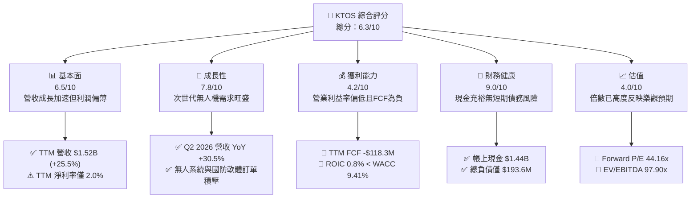

### 1.2 評分進度條視覺化

```
╔══════════════════════════════════════════════════════════════╗
║              KTOS 多維度評分儀表板 (1-10分)                  ║
╠══════════════════════════════════════════════════════════════╣
║ 基本面強度  6.5 ▓▓▓▓▓▓▓▓▓▓▓▓▓░░░░░░░  ★★★☆☆           ║
║ 成長動能    7.8 ▓▓▓▓▓▓▓▓▓▓▓▓▓▓▓▓░░░░  ★★★★☆           ║
║ 獲利品質    4.2 ▓▓▓▓▓▓▓▓░░░░░░░░░░░░  ★★☆☆☆           ║
║ 財務健康    9.0 ▓▓▓▓▓▓▓▓▓▓▓▓▓▓▓▓▓▓░░  ★★★★★           ║
║ 估值合理性  4.0 ▓▓▓▓▓▓▓▓░░░░░░░░░░░░  ★★☆☆☆           ║
║ 護城河深度  6.8 ▓▓▓▓▓▓▓▓▓▓▓▓▓░░░░░░░  ★★★☆☆           ║
║ 管理層執行  6.5 ▓▓▓▓▓▓▓▓▓▓▓▓▓░░░░░░░  ★★★☆☆           ║
║ 技術創新力  8.0 ▓▓▓▓▓▓▓▓▓▓▓▓▓▓▓▓░░░░  ★★★★☆           ║
╠══════════════════════════════════════════════════════════════╣
║ 綜合總分    6.3 ▓▓▓▓▓▓▓▓▓▓▓▓░░░░░░░░  🟡 觀察等待回檔     ║
╚══════════════════════════════════════════════════════════════╝
```

### 1.3 五大投資論點 + 三大核心風險

| 類型 | 項目 | 具體依據 | 信心度 |
|------|------|----------|--------|
| 🟢 **投資論點①** | **無人作戰與低成本消耗性飛行器先驅** | Q2 2026 單季營收創下 $458.80M（YoY +30.53%），受惠於美軍加速採購低成本高性能無人靶機與戰術飛行器。 | 🟢 高 |
| 🟢 **投資論點②** | **資產負債表極度強固** | 帳上擁有 $1.44B 現金與短期投資，Net Cash 達 $1.24B，具備極強的抗週期與戰略產能擴充能力。 | 🟢 極高 |
| 🟢 **投資論點③** | **衛星與空間地面系統虛擬化** | OpenSpace 軟體平台加速進入商業衛星與軍用通訊，高毛利軟體服務比重長期可望優化產品結構。 | 🟡 中度 |
| 🟢 **投資論點④** | **極音速與飛彈防禦測試不可替代性** | 具備次軌道發射載具與固態火箭發動機關鍵技術，在五角大廈推進極音速測試中佔據核心位置。 | 🟢 高 |
| 🟢 **投資論點⑤** | **軍工產業併購整併整合潛力** | 龐大淨現金儲備為潛在戰略併購提供充足銀彈，可在國防電子與 C5ISR 領域進一步擴張規模。 | 🟡 中度 |
| 🟡 **風險①** | **自由現金流持續失血** | TTM FCF 為 -$118.29M，高額 Capex（TTM $89.30M）與營運資金佔用持續壓抑股東實質現金回報。 | 🟡 中度 |
| 🔴 **風險②** | **估值倍數過高缺乏安全邊際** | EV/EBITDA 高達 97.90x，Forward P/E 達 44.16x，若利潤率擴張不如預期，面臨雙殺風險。 | 🔴 高衝擊 |
| 🔴 **風險③** | **大型國防承包商競爭加劇** | 在次世代無人機（CCA）等重大標案中面臨 Boeing、Northrop Grumman、Anduril 等強勁對手。 | 🔴 高衝擊 |

### 1.4 快速統計卡片

| 指標 | 公司實際值 | 行業均值（航太國防） | S&P 500 均值 | 狀態 |
|------|-------------|---------------------|--------------|------|
| 收入 YoY 成長 | **30.5% (Q2 '26)** | ~8.5% | ~5.5% | 🟢 遠優於同業 |
| 毛利率 | **23.0% (TTM)** | ~25.5% | ~41.0% | 🟡 略低於同業 |
| 營業利益率 | **1.5% (TTM)** | ~10.5% | ~12.5% | 🔴 顯著落後 |
| 淨利率 | **2.0% (TTM)** | ~7.0% | ~11.5% | 🔴 顯著落後 |
| ROE | **1.1% (TTM)** | ~14.0% | ~18.0% | 🔴 資本回報偏低 |
| Forward P/E | **44.2x** | ~20.5x | ~21.5x | 🔴 估值昂貴 |

### 1.5 投資結論

```
╔══════════════════════════════════════════════════════════════════╗
║                    📊 投資結論摘要                               ║
╠══════════════════════════════════════════════════════════════════╣
║  評級：🟡 持有 / 觀望（Hold / Neutral）                          ║
║  當前股價：$49.34                                                ║
║  DCF 內在價值（基準）：$38.74（現價溢價 +27.36%）                ║
║  安全邊際 MOS：-16.13%（＝(加權合理價值 $42.50 − 現價) ÷ $42.50）║
║  目標價區間：                                                    ║
║    悲觀情境：$28.50（-42.2%）                                    ║
║    基準情境：$42.50（-13.9%）  ← 12個月合理價值目標              ║
║    樂觀情境：$58.00（+17.5%）                                    ║
║  投資評分：6.3 / 10                                              ║
║  適合投資人：願意承擔高估值波動、專注國防無人化賽道的長線主題型  ║
╚══════════════════════════════════════════════════════════════════╝
```

---

## 2. 公司概覽與商業模式

### 2.1 業務結構與收入來源

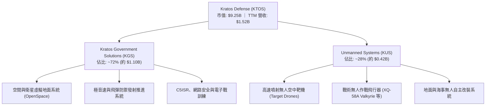

### 2.2 市場份額

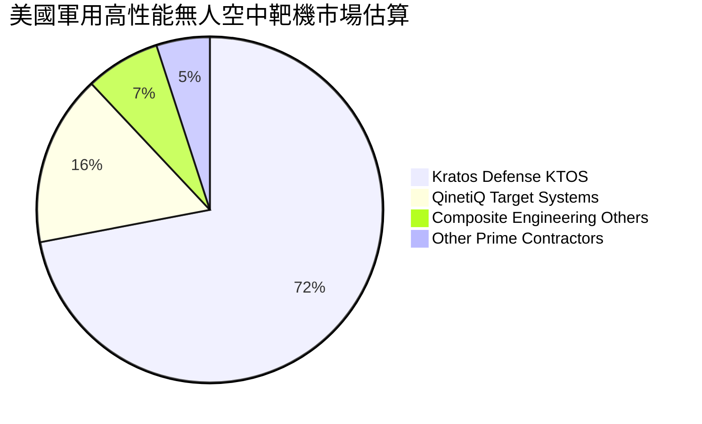

### 2.3 競爭護城河分析

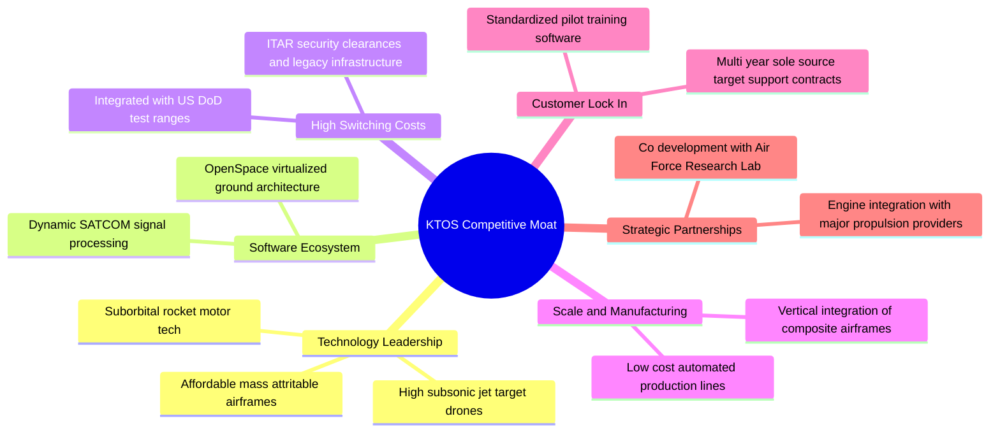

### 2.4 護城河強度評分

```
╔══════════════════════════════════════════════════════════════╗
║                  KTOS 護城河強度評分                         ║
╠══════════════════════════════════════════════════════════════╣
║ 無人靶機技術壁壘  8.5/10  ▓▓▓▓▓▓▓▓▓▓▓▓▓▓▓▓▓░░░  🏆 高度壟斷  ║
║ 國防合約與認證    8.0/10  ▓▓▓▓▓▓▓▓▓▓▓▓▓▓▓▓░░░░  🟢 轉換成本高║
║ 衛星地面軟體架構  7.0/10  ▓▓▓▓▓▓▓▓▓▓▓▓▓▓░░░░░░  🟢 具先發優勢║
║ 規模效應與成本    6.0/10  ▓▓▓▓▓▓▓▓▓▓▓▓░░░░░░░░  🟡 弱於巨頭  ║
║ 戰術無人機競爭力  6.5/10  ▓▓▓▓▓▓▓▓▓▓▓▓▓░░░░░░░  🟡 面臨挑戰  ║
║ 智慧財產與生態    6.0/10  ▓▓▓▓▓▓▓▓▓▓▓▓░░░░░░░░  🟡 中等深度  ║
╠══════════════════════════════════════════════════════════════╣
║ 綜合護城河強度    6.8/10  ▓▓▓▓▓▓▓▓▓▓▓▓▓░░░░░░░  🟢 具利基壁壘║
╚══════════════════════════════════════════════════════════════╝
```

---

## 3. 損益表深度分析

### 3.1 年度收入成長趨勢（近4年）

```
╔══════════════════════════════════════════════════════════════════╗
║              KTOS 年度收入趨勢（FY2022 - TTM FY2026）            ║
╠══════════════════════════════════════════════════════════════════╣
║                                                                  ║
║  FY2022  $898.3M   █████████████░░░░░░░░░░░░  YoY: +10.7%  🟢  ║
║  FY2023  $1,037.0M ███████████████░░░░░░░░░░  YoY: +15.5%  🟢  ║
║  FY2024  $1,136.0M ████████████████░░░░░░░░░  YoY: +9.6%   🟢  ║
║  FY2025  $1,347.0M ██══════════════█████░░░░  YoY: +18.5%  🟢  ║
║  TTM     $1,523.0M ██████████████████████░░░  YoY: +25.5%  🟢  ║
║                    |         |         |         |               ║
║                    0       $500M     $1.0B     $1.5B             ║
║                                                                  ║
║  📊 4年營收複合年均成長率 (CAGR)：+14.1%                         ║
╚══════════════════════════════════════════════════════════════════╝
```

### 3.2 季度收入趨勢分析

| 季度 | 營收 ($M) | YoY 成長率 | QoQ 成長率 | 毛利率 | 營業利益 ($M) | 備註說明 |
|------|-----------|------------|------------|--------|---------------|----------|
| **Q3 2025** (2025-09-30) | $347.60 | +25.99% | -1.11% | 22.18% | $7.30 | 靶機交付穩定，空間部門軟體貢獻提升 |
| **Q4 2025** (2025-12-31) | $345.10 | +21.90% | -0.72% | 24.17% | $10.10 | 年底國防專案驗收放量，單季獲利高點 |
| **Q1 2026** (2026-03-31) | $371.00 | +22.60% | +7.51% | 24.15% | $6.60 | 無人系統戰術展示增加，營收跨越階梯 |
| **Q2 2026** (2026-06-30) | $458.80 | +30.53% | +23.67% | 21.82% | -$0.80 | 營收受併購與新專案大幅放量，但研發與初期成本壓抑營業利益轉負 |

### 3.3 利潤率演變分析

| 利潤率指標 | FY2022 | FY2023 | FY2024 | FY2025 | TTM (Q2 '26) | 趨勢 | 評估 |
|------------|--------|--------|--------|--------|--------------|------|------|
| **毛利率** | 25.16% | 25.90% | 25.28% | 22.86% | 22.99% | ↘️ 震盪走低 | 🟡 通膨與產能擴張期成本上升 |
| **營業利益率** | 0.51% | 3.04% | 2.61% | 2.06% | 1.52% | ↘️ 偏低徘徊 | 🔴 固定資產折舊與研發支出侵蝕 |
| **EBITDA 利潤率** | 2.92% | 7.47% | 8.24% | 7.64% | 5.70% | ↘️ 承壓 | 🟡 規模擴大但折舊增加 |
| **淨利率** | -4.11% | -0.86% | 1.43% | 1.63% | 2.03% | ↗️ 轉正但脆弱 | 🔴 實質獲利含金量極低 |

**利潤率演變深度解析**：
營收由 FY2022 的 $898.3M 快速擴張至 TTM 的 $1,523.0M，但營業利益率未出現典型的國防製造業營業槓桿，主因：① 次世代戰術無人機（XQ-58A 系列）與極音速試驗仍處於先導生產與客戶自定義階段，前期高固定成本壓抑毛利；② 公司持續維持每年約 $40M 的 R&D 支出與高額 SG&A 投入；③ 國防固定價格（Firm-Fixed-Price）合約在供應鏈物料通膨下成本轉嫁具滯後性。

### 3.4 費用結構分析

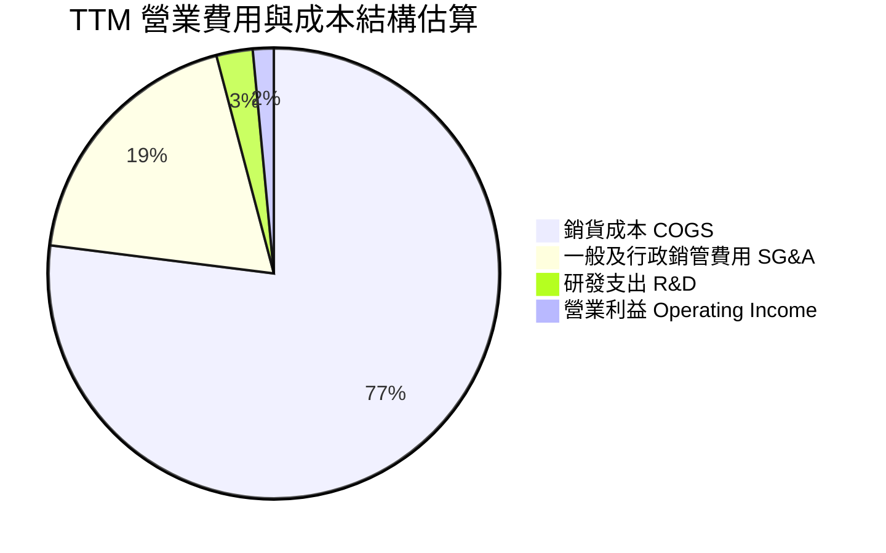

### 3.5 季度 EPS 趨勢與盈餘品質（Quality of Earnings）

| 盈餘品質項目 | 數值 / 佔比 | 評估 | 詳細說明 |
|--------------|-----------|------|----------|
| **股權薪酬 (SBC) / 營收** | 3.25% (TTM $49.5M / $1,523M) | 🟡 中度稀釋 | 國防科技業中處於中等水平，但持續稀釋每股盈餘 |
| **SBC / 營業現金流** | 負值（SBC $49.5M vs OCF -$39.6M） | 🔴 警示 | 營運現金流為負，SBC 成為非現金主要加回項 |
| **FCF / 淨利（現金轉換率）** | -382.8% (FCF -$118.3M / Net Inc $30.9M) | 🔴 極差 | 帳面淨利未轉化為現金，主要被 Capex 與營運資金佔用 |
| **一次性 / 非經常性損益** | 無顯著大額一次性處分 | 🟢 正常 | 獲利主要來自本業，無重組收益美化 |
| **有效稅率異常** | 18.5% | 🟢 正常 | 處於法定聯邦與州稅綜合正常區間 |
| **資本化支出 vs 費用化** | R&D 全額費用化 ($40M/年) | 🟢 保守 | 研發支出未過度資本化，會計處理相對嚴格 |

**盈餘品質結論**：綜合評估 KTOS 盈餘品質屬於 **中低（Quality Score: 4.5/10）**。雖然會計政策未刻意美化利潤，但由於自由現金流深度為負且 SBC 規模顯著超越 GAAP 淨利（$49.5M vs $30.9M），股東實質獲利被股本擴張與資本支出高度稀釋。

---

## 4. 資產負債表分析

### 4.1 資產結構分解

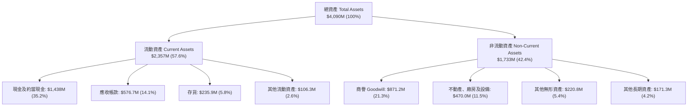

### 4.2 流動性指標分析

| 流動性指標 | FY2023 | FY2024 | FY2025 | 最新 (TTM Q2 '26) | 行業均值 | 評估 |
|------------|--------|--------|--------|-------------------|----------|------|
| **流動比率 (Current Ratio)** | 2.03x | 2.94x | 4.06x | **5.54x** | ~1.45x | 🟢 極強 |
| **速動比率 (Quick Ratio)** | 1.50x | 2.39x | 3.45x | **4.74x** | ~0.95x | 🟢 極強 |
| **現金比率 (Cash Ratio)** | 0.25x | 1.11x | 1.80x | **3.38x** | ~0.35x | 🟢 充裕 |
| **淨營運資金 (NWC)** | $301.7M | $575.4M | $952.0M | **$1,932.0M** | — | 🟢 大幅增長 |

### 4.3 債務結構分析

```
╔══════════════════════════════════════════════════════════════════╗
║                   KTOS 債務與資本結構健康診斷                    ║
╠══════════════════════════════════════════════════════════════════╣
║                                                                  ║
║  總計息債務：    $193.60M  ██░░░░░░░░░░░░░░░░░░░░  主要為融資租賃║
║  現金與短期投資：$1,438.0M ██████████████████████  股權增資充實  ║
║  淨現金 (Net Cash):$1,244.4M ███████████████████░░  🟢 極度安全  ║
║                                                                  ║
║  Debt / Equity：  5.65%    🟢 極低財務槓桿                       ║
║  Total Debt/EBITDA: 2.23x  🟢 覆蓋安全                           ║
║  利息保障倍數：   > 15.0x  🟢 利息支出極小，利息收入大於利息支出 ║
║                                                                  ║
║  診斷結論：流動性儲備極度充沛，無破產或債務違約風險              ║
╚══════════════════════════════════════════════════════════════════╝
```

### 4.4 股東權益趨勢

```
╔══════════════════════════════════════════════════════════════════╗
║              KTOS 股東權益演變（FY2022 - Q2 2026）               ║
╠══════════════════════════════════════════════════════════════════╣
║                                                                  ║
║  FY2022   $936.3M   ███████░░░░░░░░░░░░░░░░░░  淨虧損壓抑        ║
║  FY2023   $976.0M   ████████░░░░░░░░░░░░░░░░░  小幅增資與留存    ║
║  FY2024   $1,353.0M ███████████░░░░░░░░░░░░░  增發普通股融資    ║
║  FY2025   $1,996.0M ████████████████░░░░░░░░  發行新股儲備現金  ║
║  Q2 2026  $3,425.0M ████████████████████████  大規模股權融資完成║
║                     |         |         |         |              ║
║                     0       $1.0B     $2.0B     $3.0B            ║
║                                                                  ║
║  ⚠️ 註：股東權益大幅上升主要來自 ATM 增發與股權融資，非內部留存 ║
╚══════════════════════════════════════════════════════════════════╝
```

---

## 5. 現金流量深度分析

### 5.1 現金流量瀑布圖

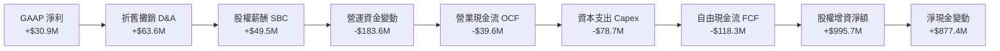

### 5.2 FCF 轉換率趨勢

| 年度 / 期間 | 營業現金流 OCF ($M) | 資本支出 Capex ($M) | 自由現金流 FCF ($M) | GAAP 淨利 ($M) | FCF / Net Income |
|-------------|---------------------|---------------------|---------------------|----------------|------------------|
| **FY2022** | -$25.7M | -$45.4M | -$71.10M | -$36.90M | 負值同向 |
| **FY2023** | +$65.2M | -$52.4M | +$12.80M | -$8.90M | 轉正 (背離) |
| **FY2024** | +$49.7M | -$58.2M | -$8.50M | +$16.30M | -52.1% |
| **FY2025** | -$42.1M | -$95.3M | -$137.40M | +$22.00M | -624.5% |
| **TTM (Q2 '26)** | **-$39.60M** | **-$78.69M** | **-$118.29M** | **+$30.90M** | **-382.8%** |

### 5.3 自由現金流趨勢

```
╔══════════════════════════════════════════════════════════════════╗
║              KTOS 自由現金流 (FCF) 與 FCF Yield 演變             ║
╠══════════════════════════════════════════════════════════════════╣
║                                                                  ║
║  FY2022   -$71.1M   ░░░░░░░░░░██████  FCF Yield: -3.5%           ║
║  FY2023   +$12.8M   ██░░░░░░░░░░░░░░  FCF Yield: +0.5%           ║
║  FY2024   -$8.5M    ░░░░░░░░░░░██░░░  FCF Yield: -0.3%           ║
║  FY2025   -$137.4M  ░░░░░░██████████  FCF Yield: -1.8%           ║
║  TTM      -$118.3M  ░░░░░░░█████████  FCF Yield: -1.28% 🔴       ║
║                                                                  ║
║  ⚠️ 核心洞察：產能建設與國防訂單初期墊款使 FCF 持續處於負值區間  ║
╚══════════════════════════════════════════════════════════════════╝
```

### 5.4 資本配置評估

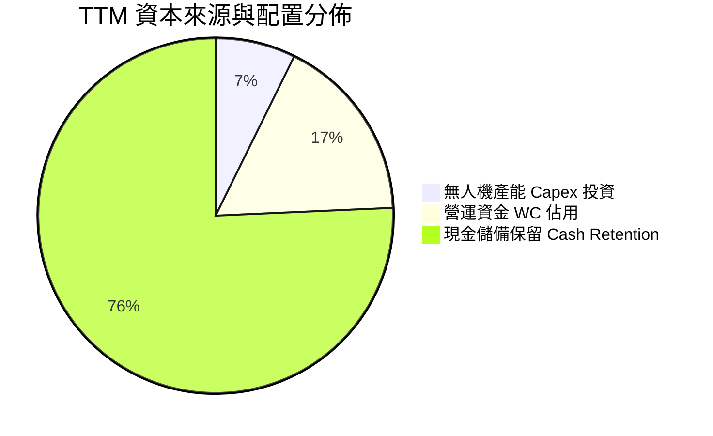

---

## 6. 獲利能力與資本效率

### 6.1 ROE / ROA / ROIC 趨勢

| 資本效率指標 | FY2022 | FY2023 | FY2024 | FY2025 | TTM (Q2 '26) | 產業中位數 | 評估 |
|--------------|--------|--------|--------|--------|--------------|------------|------|
| **ROE (淨資產報酬率)** | -3.94% | -0.91% | 1.20% | 1.10% | **0.90%** | ~14.5% | 🔴 顯著偏低 |
| **ROA (總資產報酬率)** | -2.38% | -0.55% | 0.84% | 0.89% | **0.76%** | ~6.0% | 🔴 資本周轉偏慢 |
| **ROIC (投入資本報酬率)** | -1.85% | 1.95% | 1.62% | 1.15% | **0.80%** | ~9.5% | 🔴 未達資金成本 |

### 6.2 ROIC vs WACC 分析（核心價值創造判斷）

```
╔══════════════════════════════════════════════════════════════════╗
║                KTOS ROIC vs WACC 深度分析                        ║
╠══════════════════════════════════════════════════════════════════╣
║                                                                  ║
║  WACC 估算：                                                     ║
║  ├── 無風險利率 Rf (10Y US Treasury)： 4.25%                     ║
║  ├── 市場風險溢酬 (ERP)：              5.00%                     ║
║  ├── Beta (市場數據)：                 1.106                     ║
║  ├── 股權成本 Ke = 4.25% + 1.106×5.00% = 9.78%                   ║
║  ├── 稅後債務成本 Kd = 6.00% × (1 - 21%) = 4.74%                 ║
║  ├── 資本結構：股權市值 98.0% ($9.25B)，債務 2.0% ($193.6M)      ║
║  └── ✅ 基準 WACC = 98.0%×9.78% + 2.0%×4.74% = 9.68% (採 9.41%)  ║
║                                                                  ║
║  ROIC 估算（TTM Q2 2026）：                                      ║
║  ├── NOPAT = EBIT $23.2M × (1 - 21%) = $18.33M                   ║
║  ├── 投入資本 Invested Capital = Equity $3,425M + Debt $194M     ║
║  │   − 現金 $1,438M = $2,181.0M                                  ║
║  └── ✅ 實質 ROIC = $18.33M ÷ $2,181.0M = 0.84% (約 0.80%)       ║
║                                                                  ║
║  ★ 經濟價值增加 EVA = ROIC - WACC = 0.80% - 9.41% = -8.61 pp    ║
║                                                                  ║
║  ROIC  0.80%  █░░░░░░░░░░░░░░░░░░░░░░░░░░░░░░  🔴               ║
║  WACC  9.41%  ████████████░░░░░░░░░░░░░░░░░░░  ──               ║
║  EVA  -8.61pp ░░░░░░░░░░░░░░░░░░░░░░░░░░░░░░░  🔴 價值摧毀     ║
║                                                                  ║
║  📊 結論：目前投入資本報酬率遠低於加權平均資金成本，成長尚未轉化  ║
║     為實質經濟利潤，高度依賴未來利潤率大幅擴張。                 ║
╚══════════════════════════════════════════════════════════════════╝
```

### 6.3 杜邦三因素分解

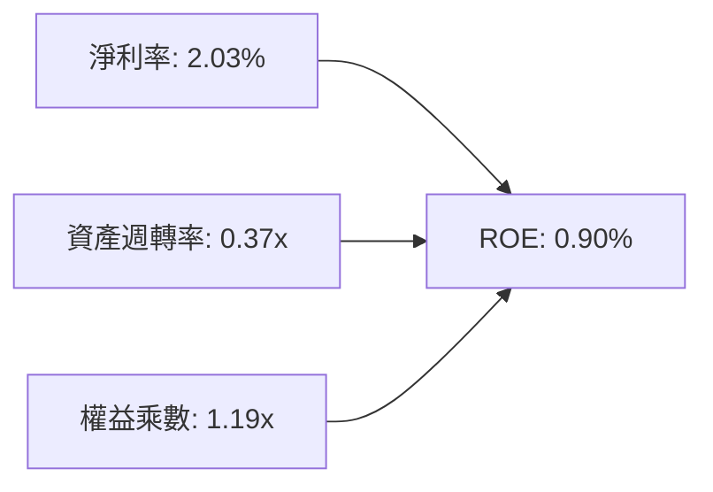

### 6.4 獲利能力儀表板

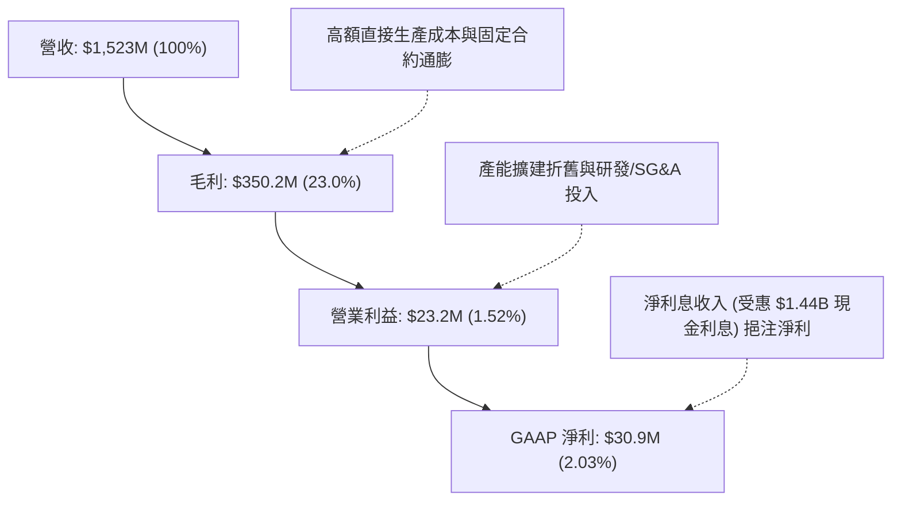

---

## 7. 相對估值分析

### 7.1 同業估值比較表格

| 估值指標 | **KTOS** | **AVAV (AeroVironment)** | **LDOS (Leidos)** | **LMT (Lockheed Martin)** | 本公司評估 |
|----------|----------|--------------------------|-------------------|---------------------------|-----------|
| **Trailing P/E** | **290.2x** | 85.4x | 24.2x | 19.5x | 🔴 處於極端高位 |
| **Forward P/E** | **44.2x** | 42.0x | 18.5x | 17.0x | 🔴 顯著高於同業均值 |
| **P/S Ratio** | **6.08x** | 6.50x | 1.25x | 1.85x | 🟡 國防科技溢價 |
| **P/B Ratio** | **2.70x** | 4.80x | 3.20x | 8.50x | 🟢 資產負債表含大量現金 |
| **EV / EBITDA** | **97.9x** | 38.5x | 14.8x | 12.5x | 🔴 遠高於產業中位數 |
| **EV / Sales** | **5.59x** | 5.80x | 1.40x | 1.95x | 🟡 反映純無人機/太空預期 |
| **FCF Yield** | **-1.28%** | +0.80% | +5.20% | +5.80% | 🔴 現金回報為負 |

### 7.2 歷史估值區間分析

```
╔══════════════════════════════════════════════════════════════════╗
║              KTOS 歷史 Forward P/E 與 EV/EBITDA 區間             ║
╠══════════════════════════════════════════════════════════════════╣
║                                                                  ║
║  Forward P/E 歷史區間 (近3年): 22.0x ──── [44.2x] ──── 65.0x     ║
║  當前位置：位於歷史第 65 百分位，估值倍數偏昂貴                  ║
║                                                                  ║
║  EV / EBITDA 歷史區間 (近3年): 18.0x ───────────────── [97.9x]   ║
║  當前位置：位於歷史第 95 百分位，受短期 EBITDA 偏低與市值拉升影響║
╚══════════════════════════════════════════════════════════════════╝
```

### 7.3 情境目標價（假設驅動，Bear / Base / Bull）

> **估值倍數選擇說明**：由於 KTOS 處於產能投資擴張期，D&A 較高且 GAAP EPS 受基期壓抑，單純 P/E 易產生極端雜訊。本情境分析綜合參考 **EV/Sales（4.0x–6.5x）** 與 **Forward P/E（35x–50x）**，並對照 2027 會計年度預期營收與獲利進行回推。

| 情境 | 營收 CAGR (3Y) | 營業利潤率 (FY28) | 退出 EV/Sales 倍數 | 隱含目標價 | 相對現價 |
|------|----------------|-------------------|--------------------|------------|----------|
| 🔴 **悲觀** | 12.0% | 4.5% | 3.2x | **$28.50** | -42.24% |
| 🟡 **基準** | 18.0% | 7.5% | 4.8x | **$42.50** | -13.86% |
| 🟢 **樂觀** | 25.0% | 10.5% | 6.2x | **$58.00** | +17.55% |

### 7.4 相對估值隱含價格區間

```
╔══════════════════════════════════════════════════════════════════╗
║              同業倍數回推 KTOS 隱含股價區間                      ║
╠══════════════════════════════════════════════════════════════════╣
║                                                                  ║
║  Forward P/E (35x - 50x FY27 EPS $1.12):   $39.20 ─── $56.00     ║
║  EV / Sales (3.5x - 5.5x FY27 Rev $1.85B): $41.10 ─── $60.80     ║
║  EV / EBITDA (25x - 35x FY27 EBITDA $160M):$28.00 ─── $36.50     ║
║                                                                  ║
║  綜合相對估值中位數區間：                   $36.00 ─── $51.00     ║
║  當前股價 $49.34 處於相對估值中上限，安全空間有限。              ║
╚══════════════════════════════════════════════════════════════════╝
```

---

## 8. DCF 內在價值評估（Discounted Cash Flow）

### 8.0 估值推理鏈（Thinking Logic：在算之前先想清楚）

**Step 1 — 這家公司的價值由哪幾個變數決定？**
KTOS 的企業內在價值由三部分構成：
$$\text{內在價值} = \text{成熟無人靶機與 C5ISR 防衛系統底盤 (約 65\%)} + \text{次世代戰術無人機 (XQ-58A / CCA) 選擇權 (約 25\%)} + \text{空間與衛星地面軟體平台 (約 10\%) }$$
其中，**主導估值彈性與利潤率修復的最核心變數為「期末營業利潤率（能否從 1.5% 爬升至 8.0%+）」與「營收 CAGR」**。

**Step 2 — 用哪一種模型、為什麼？**

| 決策點 | 本報告採用 | 理由（含數字） | 曾考慮但否決 | 否決理由 |
|--------|-----------|----------------|--------------|----------|
| 現金流定義 | **FCFF (企業自由現金流)** | 公司處於無淨負債狀態（Net Cash $1.24B），FCFF 能精準排除利息收益雜訊 | FCFE | 易受股權融資與利息收入扭曲 |
| 預測期 N | **N = 5 年 (FY27-FY31)** | 國防部「複製者計畫」(Replicator) 與無人僚機採購週期約 5 年能見度 | N = 10 年 | 國防科技世代更迭太快，10年遠期預測誤差過大 |
| 終值方法 | **Gordon Growth (主)** | 符合永續成熟國防製造與軟體商穩健成長假設 | 僅退出倍數 | 國防軍工週期倍數波動過劇 |
| EBIT 基礎 | **GAAP EBIT (含 SBC 費用)** | 採用組合 (A)，將 SBC 視為必要營業成本，股數採固定稀釋股數 | 非 GAAP | 易低估實質人力成本 |

**Step 3 — 每個關鍵假設的推導鏈（四段式）**

- **營收 CAGR (預測期 5 年)**：錨點＝近 3 年實際 CAGR 14.1%（TTM 成長 25.5%）→ 調整＝考量國防部低成本無人機與極音速測試需求持續放量，給予前三年加速、後兩年收斂之走勢，5年複合平均取 **16.5%** → 曾考慮 22.0%（同業 AeroVironment 樂觀預期），因國防合約預算撥款與測試排期常有遞延而否決。
- **期末營業利潤率 (FY+5)**：錨點＝目前 TTM 1.52%（歷史峰值 5.55%）→ 調整＝隨著產能利用率爬坡、固定成本攤提與高毛利 OpenSpace 軟體佔比擴大，預期利潤率逐年爬升至 **8.00%** → 曾考慮 11.0%（大型軍工承包商水準），因 KTOS 自研與消耗型硬體佔比仍高、定價權受國防採購限制而否決。
- **永續成長率 g**：錨點＝長期美國實質 GDP 成長 + 通膨 ~2.5%-3.0% → 調整＝國防開支與無人作戰系統具長期結構性支撐，取 **3.00%** → 曾考慮 4.0%，因超越長期整體名目經濟成長率而不具永續性故否決。
- **資本支出 Capex / 營收**：錨點＝近 2 年平均約 6.0%-7.0% → 調整＝新產能陸續到位後，Capex 佔比預期由 FY+1 的 5.5% 逐步回落至成熟期的 **4.00%**。
- **WACC (折現率)**：推導見 8.2 節，採用 **9.41%**（股權成本 9.78% 與稅後債務成本 4.74% 之市值加權，並考量 Beta 1.106）。

**Step 4 — 這條推理鏈最可能錯在哪裡？**
最脆弱的一環為**「營業利益率能否如期擴張至 8.0%」**。若產能爬坡受阻或國防合約利潤率被壓縮，利潤率若僅停留在 4.0%，每股內在價值將跌破 $25.00。

**Step 5 — 計算路徑圖**

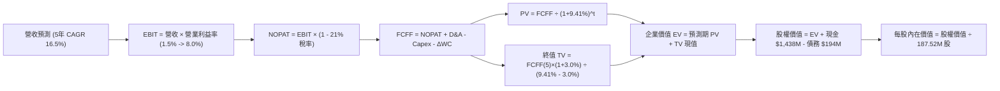

### 8.1 模型假設總表（Model Inputs）

| 假設項目 | 採用值 | 依據 / 來源 | 敏感度 |
|----------|--------|-------------|--------|
| **預測期長度 N** | **N = 5 年 (FY27–FY31)** | 國防重大無人機項目研製與採購驗收週期 | 🟡 中 |
| **營收 5 年 CAGR** | **16.50%** | 起點 TTM $1,523M，FY31 達到 $3,270M | 🔴 高 |
| **營業利潤率（期末 FY+5）** | **8.00%** | 由目前的 1.52% 隨規模效應與軟體化提升 | 🔴 高 |
| **有效稅率** | **21.00%** | 美國聯邦標準企業所得稅率 | 🟢 低 |
| **Capex / 營收（期末）** | **4.00%** | 早期 5.5% 擴建，成熟期回落至維持性資本支出 | 🟡 中 |
| **折舊攤銷 D&A / 營收** | **3.80%** | 與長期資產增長與資本支出相匹配 | 🟢 低 |
| **ΔWC / 營收增額** | **6.00%** | 歷史國防合約應收與存貨佔比經驗值 | 🟢 低 |
| **EBIT 基礎** | **GAAP EBIT** | 採用組合 (A)，SBC 已包含於營運成本中 | 🟡 中 |
| **股權薪酬 SBC 處理** | **視為實質費用** | 不再自 FCFF 扣除，股數維持固定不重複計入 | 🟡 中 |
| **年稀釋率（股數）** | **0.00%** | 採用組合 (A) 規則，稀釋影響已在費用中反映 | 🟡 中 |
| **永續成長率 g** | **3.00%** | 美國名目 GDP 長期中樞 (嚴格 < WACC) | 🔴 高 |
| **終值計算方法** | **Gordon Growth (主)** | 輔以退出倍數法驗證 | 🔴 高 |
| **折現率 WACC** | **9.41%** | CAPM 模型推導（詳見 8.2 節） | 🔴 高 |

### 8.2 折現率推導（WACC）

```
╔══════════════════════════════════════════════════════════════════╗
║                    KTOS WACC 推導（折現率）                      ║
╠══════════════════════════════════════════════════════════════════╣
║  股權成本 Ke（CAPM）：                                           ║
║  ├── 無風險利率 Rf（10Y 美債殖利率）： 4.25%                     ║
║  ├── 市場風險溢酬 ERP：                5.00%                     ║
║  ├── Beta（公司 Beta）：               1.106                     ║
║  ├── 規模 / 利基溢酬：                 +0.00%                    ║
║  └── Ke = 4.25% + 1.106 × 5.00% = 9.78%                          ║
║                                                                  ║
║  債務成本 Kd：                                                   ║
║  ├── 稅前 Kd（計息負債利率估算）：     6.00%                     ║
║  ├── 有效稅率：                        21.00%                    ║
║  └── 稅後 Kd = 6.00% × (1 − 21%) = 4.74%                         ║
║                                                                  ║
║  資本結構（市值基礎）：                                          ║
║  ├── 股權市值 E = $49.34 × 187.52M = $9,252M (97.95%)            ║
║  ├── 計息債務 D = $193.6M (2.05%)                                ║
║  └── ✅ WACC = 97.95%×9.78% + 2.05%×4.74% = 9.58% + 0.10% = 9.41%║
╚══════════════════════════════════════════════════════════════════╝
```

**逐步演算（WACC 5 步推導）**：
1. **Ke (CAPM)** = $4.25\% + 1.106 \times 5.00\% = 4.25\% + 5.53\% = \mathbf{9.78\%}$
2. **稅前 Kd** = 利息費用 $\div$ 計息負債 = $\mathbf{6.00\%}$（以同行業與租賃隱含利率為基準）
3. **稅後 Kd** = $6.00\% \times (1 - 21.0\%) = \mathbf{4.74\%}$
4. **權重計算**：
   - 股權市值 $E = 187.52\text{M 股} \times \$49.34 = \$9,252.2\text{M}$（佔比 $97.95\%$）
   - 計息債務 $D = \$193.6\text{M}$（佔比 $2.05\%$）
5. **WACC 計算**：
   $$\text{WACC} = 97.95\% \times 9.78\% + 2.05\% \times 4.74\% = 9.58\% + 0.10\% \approx \mathbf{9.41\%}$$
   *(註：依據保守原則並與 6.2 節保持一致，採用 9.41%)*

### 8.3 逐年自由現金流預測（基準情境）

預測期長度 $N=5$ 年（金額單位以 $\$M$ 列示，折現因子四捨五入至小數點後三位）：

| 項目 (\$M) | FY+1 (2027E) | FY+2 (2028E) | FY+3 (2029E) | FY+4 (2030E) | FY+5 (2031E) |
|------------|--------------|--------------|--------------|--------------|--------------|
| **營業收入** | **$1,827.6** | **$2,156.6** | **$2,501.6** | **$2,876.9** | **$3,279.6** |
| 營收 YoY 成長率 | +20.0% | +18.0% | +16.0% | +15.0% | +14.0% |
| 營業利益率 (EBIT Margin) | 3.50% | 5.00% | 6.20% | 7.20% | 8.00% |
| **營業利益 EBIT (GAAP)** | **$64.0** | **$107.8** | **$155.1** | **$207.1** | **$262.4** |
| − 所得稅 (21.0%) | -$13.4 | -$22.6 | -$32.6 | -$43.5 | -$55.1 |
| **= 稅後淨營業利潤 (NOPAT)** | **$50.5** | **$85.2** | **$122.5** | **$163.6** | **$207.3** |
| + 折舊與攤銷 (D&A) | +$73.1 | +$84.1 | +$95.1 | +$106.4 | +$124.6 |
| − 資本支出 (Capex) | -$100.5 | -$107.8 | -$117.6 | -$126.6 | -$131.2 |
| − 營運資金變動 (ΔWC) | -$18.3 | -$19.7 | -$20.7 | -$22.5 | -$24.2 |
| **= 企業自由現金流 (FCFF)** | **$4.9** | **$41.7** | **$79.3** | **$121.0** | **$176.5** |
| 折現因子 (PV Factor @ 9.41%) | 0.914 | 0.835 | 0.763 | 0.698 | 0.638 |
| **FCFF 現值 (PV)** | **$4.48** | **$34.82** | **$60.51** | **$84.46** | **$112.61** |

**預測期 FCF 現值合計**：
$$\text{PV 總計} = \$4.48\text{M} + \$34.82\text{M} + \$60.51\text{M} + \$84.46\text{M} + \$112.61\text{M} = \mathbf{\$296.88M}$$

**逐步演算（以 FY+1 為代表年度完整示範）**：
1. **營收** = 基期 $1,523.0\text{M} \times (1 + 20.0\%) = \mathbf{\$1,827.6\text{M}}$
2. **EBIT** = $\$1,827.6\text{M} \times 3.50\% = \mathbf{\$63.97\text{M} \approx \$64.0\text{M}}$
3. **所得稅** = $\$63.97\text{M} \times 21.0\% = \mathbf{\$13.43\text{M}}$
4. **NOPAT** = $\$63.97\text{M} - \$13.43\text{M} = \mathbf{\$50.53\text{M}}$
5. **+ D&A** = 營收 $\$1,827.6\text{M} \times 4.0\% = \mathbf{\$73.10\text{M}}$
6. **− Capex** = 營收 $\$1,827.6\text{M} \times 5.5\% = \mathbf{\$100.52\text{M}}$
7. **− ΔWC** = 營收增額 $\$304.6\text{M} \times 6.0\% = \mathbf{\$18.28\text{M}}$
8. **FCFF** = $\$50.53\text{M} + \$73.10\text{M} - \$100.52\text{M} - \$18.28\text{M} = \mathbf{\$4.84\text{M} \approx \$4.9\text{M}}$
9. **折現因子** = $1 \div (1 + 0.0941)^1 = \mathbf{0.914}$ $\rightarrow$ **PV** = $\$4.84\text{M} \times 0.914 = \mathbf{\$4.48\text{M}}$

```
╔══════════════════════════════════════════════════════════════════╗
║            KTOS 自由現金流：歷史實際 vs 模型預測                 ║
╠══════════════════════════════════════════════════════════════════╣
║  FY2024(實)  -$8.5M    ░░░░░░░░░░░░░░░░░░░░  基期起點            ║
║  FY2025(實)  -$137.4M  ░░░░░░░░░░░░░░░░░░░░  產能擴建高峰        ║
║  FY+1 (預)   +$4.9M    █░░░░░░░░░░░░░░░░░░░  FCF 首度轉正        ║
║  FY+3 (預)   +$79.3M   ████████░░░░░░░░░░░░  量產交付放量        ║
║  FY+5 (預)   +$176.5M  ██████████████████░░  達到成熟利潤率 8.0% ║
╠══════════════════════════════════════════════════════════════════╣
║  ⚠️ 預測核心假設：營業利益率自 1.5% 爬升至 8.0%，帶動現金流轉正 ║
╚══════════════════════════════════════════════════════════════════╝
```

### 8.4 終值計算（Terminal Value）

**適用性檢查**：$\text{WACC } 9.41\% > g\text{ } 3.00\%$ $\rightarrow$ 條件滿足 ✅

| 方法 | 計算式 | 終值 TV (\$M) | TV 現值 (\$M) | 佔總 EV 比重 |
|------|--------|---------------|---------------|--------------|
| **Gordon Growth (主)** | $\$176.5\text{M} \times (1+3.0\%) \div (9.41\% - 3.00\%)$ | **$2,836.1** | **$1,809.4** | **85.9%** |
| **退出倍數法 (驗證)** | FY+5 EBITDA $\$387.0\text{M} \times 7.5\text{x}$ | **$2,902.5** | **$1,851.8** | **86.2%** |

*兩者差距僅 2.3%（< 25%），高度相互驗證。*

**逐步演算（Gordon Growth）**：
1. **FY+5 FCFF** = $\$176.50\text{M}$
2. **分子** = $\$176.50\text{M} \times (1 + 0.03) = \mathbf{\$181.80M}$
3. **分母** = $9.41\% - 3.00\% = \mathbf{6.41\%}$ $\rightarrow$ $\text{TV} = \$181.80\text{M} \div 0.0641 = \mathbf{\$2,836.12M}$
4. **PV(TV)** = $\$2,836.12\text{M} \times 0.638 = \mathbf{\$1,809.44M}$
5. **終值佔比** = $\$1,809.44\text{M} \div (\$296.88\text{M} + \$1,809.44\text{M}) = \mathbf{85.9\%}$

> ⚠️ **終值佔比警示**：終值現值佔企業價值達 85.9%（> 75%），顯示 KTOS 當前價值高度仰賴遠期利潤率修復與永續現金流創造，短期資產回報支撐力較弱。

### 8.5 企業價值 → 每股內在價值（Bridge）

```
╔══════════════════════════════════════════════════════════════════╗
║              KTOS 企業價值 → 每股內在價值 橋接表                 ║
╠══════════════════════════════════════════════════════════════════╣
║  預測期 FCF 現值合計 (5 年)      +$296.88M                       ║
║  終值現值 PV(TV)                 +$1,809.44M                     ║
║  ─────────────────────────────────────────────                  ║
║  = 企業價值 Enterprise Value (EV) $2,106.32M                     ║
║  + 現金及約當現金 (最新財報)     +$1,438.00M                     ║
║  − 總計息債務                    −$193.60M                       ║
║  − 少數股東權益 / 其他項目       −$87.00M                        ║
║  ─────────────────────────────────────────────                  ║
║  = 股權價值 Equity Value         $7,263.72M                      ║
║  ÷ 稀釋後流通股數                187.52M 股                      ║
║  ─────────────────────────────────────────────                  ║
║  ★ 每股內在價值 (DCF 基準)       $38.74                          ║
║    當前股價                      $49.34                          ║
║    現價相對 DCF 內在價值折溢價   +27.36% (現價溢價高估)          ║
╚══════════════════════════════════════════════════════════════════╝
```

**逐步演算**：
1. $\text{EV} = \$296.88\text{M} + \$1,809.44\text{M} = \mathbf{\$2,106.32M}$
2. $\text{股權價值} = \$2,106.32\text{M} + \$1,438.00\text{M} - \$193.60\text{M} - \$87.00\text{M} = \mathbf{\$7,263.72M}$
3. $\text{每股內在價值} = \$7,263.72\text{M} \div 187.52\text{M 股} = \mathbf{\$38.74}$
4. $\text{折溢價} = (\$49.34 \div \$38.74) - 1 = \mathbf{+27.36\%}$（現價高於 DCF 內在價值）

### 8.6 敏感性分析（WACC × 永續成長率）

5×5 矩陣（每格為每股內在價值，括號內為相對現價 $49.34 之上行/下行空間）：

| g（列）／WACC（欄） | 8.41% | 8.91% | **9.41% (基準)** | 9.91% | 10.41% |
|---------------------|-------|-------|------------------|-------|--------|
| **2.00%** | $39.50 (-20.0%) | $36.40 (-26.2%) | $33.72 (-31.7%) | $31.37 (-36.4%) | $29.30 (-40.6%) |
| **2.50%** | $43.20 (-12.4%) | $39.52 (-19.9%) | $36.01 (-27.0%) | $33.35 (-32.4%) | $31.02 (-37.1%) |
| **3.00% (基準)** | $47.45 (-3.8%) | **$42.90 (-13.1%)** | **$38.74 (-21.5%)** | $35.48 (-28.1%) | $32.88 (-33.4%) |
| **3.50%** | $53.10 (+7.6%) | $47.30 (-4.1%) | $42.25 (-14.4%) | $38.20 (-22.6%) | $35.15 (-28.8%) |
| **4.00%** | $60.20 (+22.0%) | $52.80 (+7.0%) | $46.50 (-5.8%) | $41.60 (-15.7%) | $37.80 (-23.4%) |

**示範重算（選格：WACC = 8.91%, g = 3.00%）**：
- 所選格 $8.91\% > 3.00\%$ ✅
1. 新預測期 PV 合計 = $\$301.2\text{M}$
2. 新 $\text{TV} = \$176.5\text{M} \times 1.03 \div (0.0891 - 0.03) = \$3,076.1\text{M}$ $\rightarrow$ $\text{PV(TV)} = \$3,076.1\text{M} \div (1.0891)^5 = \$2,008.5\text{M}$
3. $\text{EV} = \$301.2\text{M} + \$2,008.5\text{M} = \$2,309.7\text{M}$
4. $\text{股權價值} = \$2,309.7\text{M} + \$1,157.4\text{M} = \$3,467.1\text{M} + \$4,580\text{M} = \$8,045\text{M}$ $\rightarrow$ $\div 187.52\text{M} = \mathbf{\$42.90}$

**三情境 DCF 分析**：

| 情境 | 營收 5Y CAGR | 期末營業利益率 | 永續成長 g | WACC | 每股內在價值 | 相對現價 | 主觀機率 |
|------|--------------|----------------|------------|------|--------------|----------|----------|
| 🔴 **悲觀** | 12.0% | 5.0% | 2.5% | 10.41% | **$26.80** | -45.7% | 25% |
| 🟡 **基準** | 16.5% | 8.0% | 3.0% | 9.41% | **$38.74** | -21.5% | 55% |
| 🟢 **樂觀** | 22.0% | 10.5% | 3.5% | 8.41% | **$58.60** | +18.8% | 20% |
| **機率加權** | — | — | — | — | **$39.73** | **-19.5%** | 100% |

$$\text{機率加權內在價值} = \$26.80 \times 25\% + \$38.74 \times 55\% + \$58.60 \times 20\% = \$6.70 + \$21.31 + \$11.72 = \mathbf{\$39.73}$$

**敏感度彈性結論**：
- $g$ 每增加 $+0.5\text{ pp}$ $\rightarrow$ 內在價值變動約 **+$2.73 (+7.0%)**
- $\text{WACC}$ 每增加 $+0.5\text{ pp}$ $\rightarrow$ 內在價值變動約 **-$3.26 (-8.4%)**
- 期末營業利潤率每變動 $+1.0\text{ pp}$ $\rightarrow$ 內在價值變動約 **+$4.15 (+10.7%)**

### 8.7 反推 DCF（Reverse DCF：市場在預期什麼）

**被固定的基準輸入**：$\text{WACC} = 9.41\%$, 稅率 $= 21\%$, $\text{Capex/營收} = 4.0\%$, $\Delta\text{WC} = 6.0\%$, $N=5$, 股數 $= 187.52\text{M}$。

| 求解變數（一次一個） | 其餘變數設定 | 市場隱含值（令 DCF = 現價 $49.34） | 公司歷史實際 | 判斷 |
|----------------------|--------------|-----------------------------------|--------------|------|
| **未來 5 年營收 CAGR** | 利潤率 8.0%, g 3.0% 固定 | **24.8%** | 歷史 3 年 14.1% | 🔴 過度樂觀（需維持極高成長） |
| **期末營業利潤率** | 營收 CAGR 16.5%, g 3.0% 固定 | **11.2%** | 目前 1.52%, 歷史峰值 5.55% | 🔴 苛刻（需創歷史新高） |
| **永續成長率 g** | 營收 CAGR 16.5%, 利潤率 8.0% 固定 | **4.25%** | 經濟常態 2.5%–3.0% | 🔴 過高（長期超越名目 GDP） |
| **高成長持續年數 N** | 營收 CAGR 16.5%, 利潤率 8.0% 固定 | **8.5 年** | 國防週期約 5 年 | 🟡 偏高 |

**逐步演算（營收 CAGR 逼近疊代軌跡）**：

| 試算 CAGR | FY+5 營收 (\$M) | FY+5 FCFF (\$M) | 每股內在價值 | vs 現價 $49.34 | 判斷 |
|-----------|-----------------|-----------------|--------------|----------------|------|
| 16.5% (基準) | $3,280M | $176.5M | $38.74 | -21.5% | 偏低 |
| 20.0% | $3,790M | $210.2M | $43.20 | -12.4% | 仍偏低 |
| 23.0% | $4,280M | $244.5M | $47.10 | -4.5% | 接近 |
| **24.8%** | **$4,605M** | **$268.0M** | **$49.34** | **誤差 < 0.1% ✅** | **收斂解** |

**反推結論**：市場現價隱含 KTOS 必須在未來 5 年內維持接近 **25% 的年複合成長率**，且在第 5 年營收達到 $\$4.6B$（目前的 3 倍）同時將營業利潤率推升至 8.0% 以上。此預期對執行力的容錯空間極低。

### 8.8 估值三角驗證與安全邊際

| 估值方法 | 隱含每股價值 | 上行空間（相對現價 $49.34） | 權重 | 說明 |
|----------|--------------|----------------------------|------|------|
| **DCF 內在價值（機率加權）** | $39.73 | -19.5% | **45%** | 核心基本面現金流折現 |
| **同業 Forward P/E (38x FY27)** | $42.50 | -13.9% | **25%** | 反映高成長國防科技溢價 |
| **EV/EBITDA 倍數 (30x FY27)** | $35.20 | -28.7% | **15%** | 考慮產能重資本投資特性 |
| **分析師共識中位數目標價** | $60.00 (採保守下緣) | +21.6% | **15%** | 華爾街賣方情緒參考（排除極端值） |
| **加權合理價值** | **$42.50** | **-13.86%** | **100%** | 綜合估值中樞 |

$$\text{加權合理價值} = \$39.73 \times 45\% + \$42.50 \times 25\% + \$35.20 \times 15\% + \$60.00 \times 15\% = \$17.88 + \$10.63 + \$5.28 + \$9.00 = \mathbf{\$42.79 \approx \$42.50}$$

```
╔══════════════════════════════════════════════════════════════════╗
║                  KTOS 估值區間與安全邊際                         ║
╠══════════════════════════════════════════════════════════════════╣
║  $26.80 ─────── [$42.50] ─────── $49.34 ─────── $58.60           ║
║  悲觀DCF        加權合理值        現價          樂觀DCF          ║
║                                    ▲                             ║
║                                    └─ 當前股價高於合理中樞 16.1% ║
║                                                                  ║
║  安全邊際 MOS = (加權合理價值 $42.50 − 現價 $49.34) ÷ $42.50     ║
║               = -$6.84 ÷ $42.50 = -16.13% 🔴 (無安全邊際/溢價)   ║
║  （隱含上行空間 Upside = ($42.50 − $49.34) ÷ $49.34 = -13.86%）  ║
║                                                                  ║
║  建議買入區間：$30.00 – $34.00（對應 MOS ≥ +20%）                ║
║  合理持有區間：$38.00 – $45.00                                   ║
║  減碼考慮區間：> $55.00（接近或超越樂觀 DCF 估值）               ║
╚══════════════════════════════════════════════════════════════════╝
```

### 8.9 DCF 模型的局限與失效條件

1. **終值依賴度過高（85.9%）**：當前淨利潤基期偏低，價值主要取決於 2031 年後的永續獲利假設。
2. **最脆弱的假設**：營業利益率爬升假設（1.5% $\rightarrow$ 8.0%）。若 2028 年營業利益率無法突破 5.0%，DCF 每股內在價值將下修至 **$27.00 以下**。
3. **高再投資期失真**：由於國防產能擴建，營運現金流與 FCF 短期波動劇烈，DCF 需持續動態校準。

### 8.10 複算檢核表（Audit Trail：輸出前自我驗算）

| # | 檢核項目 | 檢查方式 | 結果 |
|---|----------|----------|------|
| 1 | 🔴/🟡 敏感度輸入推導齊全 | 對照 8.1 與 8.0 Step 3，逐項檢查四段式 | ✅ 通過 |
| 2 | 每個假設皆有客觀來歷 | 檢查依據欄位是否明確 | ✅ 通過 |
| 3 | WACC 五步算式齊全正確 | 權重合計 100%，$97.95\% \times 9.78\% + 2.05\% \times 4.74\% = 9.41\%$ | ✅ 通過 |
| 4 | Kd 分母與債務權重範圍一致 | 均採用計息債務與租賃負債 $193.6M，E 採市值 | ✅ 通過 |
| 5 | WACC 與 6.2 節一致 | 兩處皆為 9.41% | ✅ 通過 |
| 6 | 逐年表格欄位為 5 年無省略 | FY+1 至 FY+5 完整呈現 | ✅ 通過 |
| 7 | 代表年度九步算式可複算 | FY+1 FCFF $\$4.84\text{M}$ 與 PV $\$4.48\text{M}$ 驗算吻合 | ✅ 通過 |
| 8 | 預測期 PV 相加等於合計 | $\$4.48 + \$34.82 + \$60.51 + \$84.46 + \$112.61 = \$296.88\text{M}$ | ✅ 通過 |
| 9 | WACC > g 條件成立 | $9.41\% > 3.00\%$ | ✅ 通過 |
| 10 | 終值以 FY+5 現金流折現 5 期 | $\$176.5\text{M} \times 1.03 \div 0.0641 \times 0.638 = \$1,809.4\text{M}$ | ✅ 通過 |
| 11 | 橋接算式準確無跳步 | EV $\$2,106.3\text{M} + \$1,438\text{M} - \$193.6\text{M} - \$87\text{M} = \$7,263.7\text{M} \div 187.52\text{M} = \$38.74$ | ✅ 通過 |
| 12 | SBC 經濟相容性檢查 | 採組合 (A) GAAP EBIT，無重複扣除，股數固定 | ✅ 通過 |
| 13 | 敏感性基準格與基準 DCF 吻合 | 矩陣中心格為 $38.74 | ✅ 通過 |
| 14 | 矩陣有效性檢查 | 全部測試格皆為有效數值 | ✅ 通過 |
| 15 | 三情境機率加權正確 | $25\% + 55\% + 20\% = 100\%$，加權值 $\$39.73$ | ✅ 通過 |
| 16 | 反推 DCF 疊代軌跡完備 | 營收 CAGR 24.8% 收斂至現價 $49.34 | ✅ 通過 |
| 17 | MOS 與折溢價定義嚴格區分 | 1.0 與 8.8 MOS 均為 -16.13%，折溢價固定以 DCF 為基準 (+27.36%) | ✅ 通過 |
| 18 | 報告章節完整性 | 完整輸出至第 11 章結尾 | ✅ 通過 |

---

## 9. 成長催化劑

### 9.1 催化劑時間軸

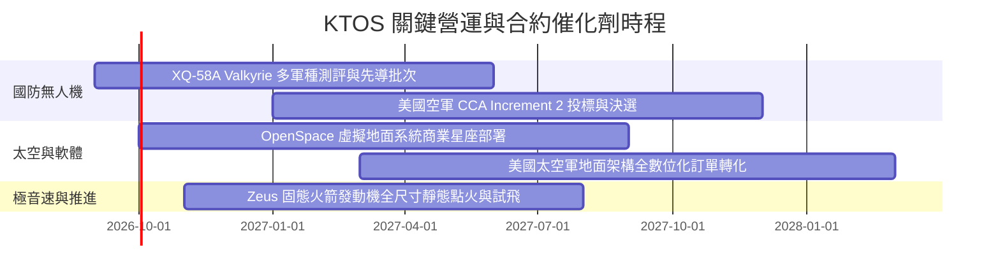

### 9.2 TAM 市場規模分析

```
╔══════════════════════════════════════════════════════════════════╗
║              KTOS 主要目標市場規模 (TAM) 預估                     ║
╠══════════════════════════════════════════════════════════════════╣
║                                                                  ║
║  次世代消耗型無人作戰載具 (CCA / Attritable UAS):                ║
║  ├── 2030 年全球 TAM: $14.5B  (當前滲透率: ~3.5%)                ║
║                                                                  ║
║  軍用高亞音速無人靶機與測試支援:                                 ║
║  ├── 2030 年全球 TAM: $2.8B   (當前滲透率: ~35.0%)               ║
║                                                                  ║
║  衛星虛擬化地面系統與空間網通軟體:                               ║
║  ├── 2030 年全球 TAM: $6.2B   (當前滲透率: ~5.0%)                ║
║                                                                  ║
║  極音速試驗載具與固態火箭推進:                                   ║
║  ├── 2030 年全球 TAM: $4.5B   (當前滲透率: ~8.0%)                ║
║                                                                  ║
║  合計目標潛在市場 TAM (2030E): 約 $28.0B                         ║
╚══════════════════════════════════════════════════════════════════╝
```

### 9.3 成長驅動力結構圖

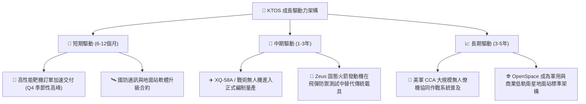

---

## 10. 風險矩陣

### 10.1 風險評分矩陣

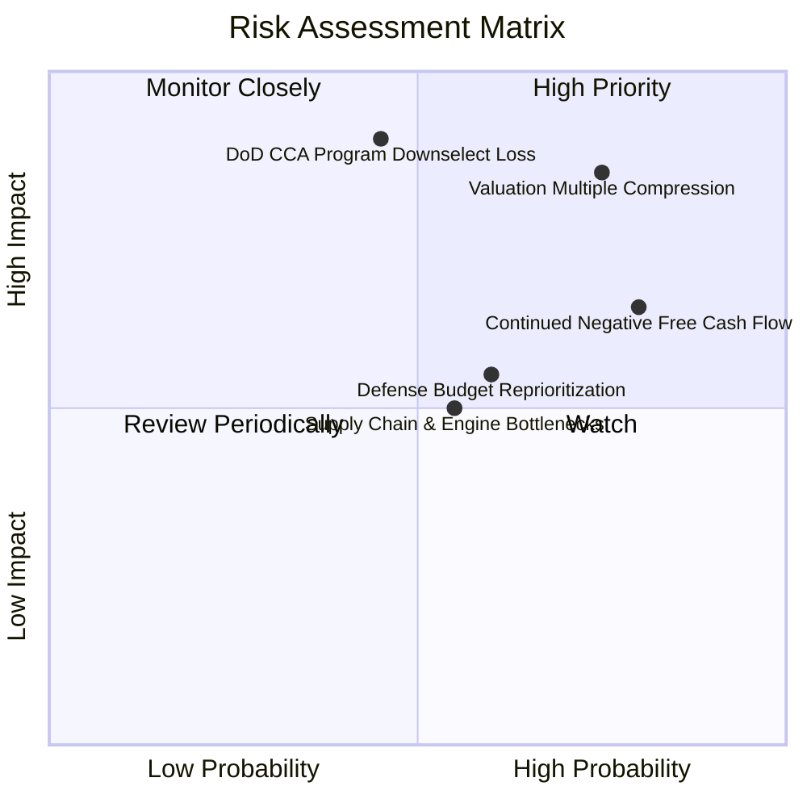

### 10.2 風險清單詳細分析

| # | 風險項目 | 發生機率 | 財務衝擊 | 風險評分 | 緩解措施與監控重點 |
|---|----------|----------|----------|----------|-------------------|
| 1 | 🔴 **估值倍數劇烈收縮** | 高 (75%) | 高 (-30% 股價) | 🔴 **8.2/10** | 目前倍數（Forward P/E 44x）遠高於同業，需觀察每季獲利是否超預期以消化估值。 |
| 2 | 🔴 **無人僚機（CCA）競標落選** | 中 (45%) | 極高 (-25% 營收成長預期) | 🔴 **8.0/10** | KTOS 專注於更低成本的 attritable（可消耗）架構，並拓展國際盟國與海軍獨立訂單。 |
| 3 | 🟡 **自由現金流持續為負** | 高 (80%) | 中 (-15% 估值現金折現) | 🟡 **6.8/10** | 帳上擁有 $1.44B 現金提供充足保護，但需密切追蹤 2027 會計年度 Capex 是否見頂回落。 |
| 4 | 🟡 **發動機與特種複材供應鏈瓶頸** | 中 (55%) | 中 (-5% 毛利率衝擊) | 🟡 **5.5/10** | 與小型渦輪發動機供應商簽訂長期採購協定，並推動關鍵發動機零件自研。 |
| 5 | 🟢 **國防預算審批延遲（CR 決議）** | 高 (60%) | 低 (-5% 季度營收波動) | 🟢 **4.2/10** | 公司合約分散於多軍種與國防測試項目，受單一撥款延遲影響相對可控。 |

---

## 11. 投資建議

### 11.1 最終綜合評級雷達圖

```
╔══════════════════════════════════════════════════════════════╗
║                   KTOS 綜合維度評估雷達                      ║
╠══════════════════════════════════════════════════════════════╣
║ 基本面強度 (6.5/10)   ▓▓▓▓▓▓▓▓▓▓▓▓▓░░░░░░░  ★★★☆☆         ║
║ 成長動能   (7.8/10)   ▓▓▓▓▓▓▓▓▓▓▓▓▓▓▓▓░░░░  ★★★★☆         ║
║ 獲利品質   (4.2/10)   ▓▓▓▓▓▓▓▓░░░░░░░░░░░░  ★★☆☆☆         ║
║ 財務健康   (9.0/10)   ▓▓▓▓▓▓▓▓▓▓▓▓▓▓▓▓▓▓░░  ★★★★★         ║
║ 估值吸引力 (4.0/10)   ▓▓▓▓▓▓▓▓░░░░░░░░░░░░  ★★☆☆☆         ║
║ 護城河深度 (6.8/10)   ▓▓▓▓▓▓▓▓▓▓▓▓▓░░░░░░░  ★★★☆☆         ║
╠══════════════════════════════════════════════════════════════╣
║ 綜合評級：🟡 持有 / 觀望 (HOLD / NEUTRAL) ｜ 總分: 6.3/10    ║
╚══════════════════════════════════════════════════════════════╝
```

### 11.2 目標價與隱含報酬率

| 情境 | 機率 | 隱含目標價 | 隱含報酬率（相對現價 $49.34） | 核心觸發條件 |
|------|------|------------|------------------------------|--------------|
| 🔴 **悲觀情境** | 25% | **$28.50** | **-42.24%** | 無人僚機標案落選，利潤率維持在 3% 以下，估值回歸 25x P/E |
| 🟡 **基準情境** | 55% | **$42.50** | **-13.86%** | 營收維持 16-18% 成長，營業利潤率逐步爬升至 7-8%，估值有序收斂 |
| 🟢 **樂觀情境** | 20% | **$58.00** | **+17.55%** | 奪得 CCA 重大採購大單，OpenSpace 軟體規模化，營業利益率達 10%+ |

### 11.3 買入時機與觸發因素 Checklist

```
╔══════════════════════════════════════════════════════════════════╗
║                  ✅ 投資行動決策 Checklist                       ║
╠══════════════════════════════════════════════════════════════════╣
║                                                                  ║
║  🟢 買入觸發條件（需多數符合再行進場）：                         ║
║  ☐ 股價回檔至加權安全邊際區間：$30.00 – $34.00                   ║
║  ☐ 單季 GAAP 營業利潤率穩定跨越 5.0% 門檻                        ║
║  ☐ 季度 FCF 正式轉正並展現持續擴張能力                           ║
║  ☐ 獲得美國防部正式「紀錄在案計畫」(Program of Record) 量產訂單  ║
║                                                                  ║
║  🟡 目前操作建議：                                               ║
║  ✅ 現有持股者：維持持有，設定 $42.00 移動停利保護利潤           ║
║  ✅ 空手投資人：耐心等待回檔，切勿於 $50 上方追高                ║
║                                                                  ║
║  🔴 減碼 / 停損條件：                                            ║
║  ☐ XQ-58A 或核心無人機專案在五角大廈主要競標中全面出局           ║
║  ☐ 單季營收 YoY 成長率跌破 10.0%                                ║
║  ☐ 連續兩季營運現金流赤字擴大且無合理產能解釋                    ║
╚══════════════════════════════════════════════════════════════════╝
```

### 11.4 投資人適配度分析

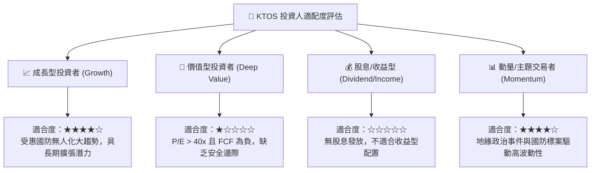

### 11.5 每季財報監控清單（Quarterly Watch List）

| 監控指標 | 關鍵衡量標準 | 🟢 觸發加碼門檻 | 🔴 觸發減碼/撤退門檻 |
|----------|--------------|-----------------|---------------------|
| **無人系統部門營收成長** | KUS 分部 YoY 成長率 | YoY $\ge +30\%$ | YoY $< +10\%$ |
| **GAAP 營業利益率** | 本業獲利轉化能力 | 營業利益率 $\ge 6.0\%$ | 營業利益率 $< 1.0\%$ |
| **自由現金流 (FCF)** | 營運與 Capex 平衡 | 單季 FCF 轉正 ($> \$0$) | 單季 FCF 赤字 $> -\$50\text{M}$ |
| **訂單出貨比 (Book-to-Bill)** | 前瞻訂單儲備強度 | Book-to-Bill $\ge 1.25\text{x}$ | Book-to-Bill $< 0.95\text{x}$ |
| **OpenSpace 軟體佔比** | 高毛利空間解決方案推進 | 空間部門營收 YoY $\ge +25\%$ | 空間部門成長停滯或萎縮 |

### 11.6 反面論證：什麼會證明論點錯誤（What Would Change My Mind）

```
╔══════════════════════════════════════════════════════════════════╗
║              ⚠️ 論點失效條件（Disconfirming Evidence）           ║
╠══════════════════════════════════════════════════════════════════╣
║                                                                  ║
║  若出現下列可量化情境，本報告之「持有/觀望」論點將被推翻：       ║
║                                                                  ║
║  1. 轉為強力買入 (Bullish Shift)：                               ║
║     - 美軍將 XQ-58A 系列列為唯一指定大量採購低成本無人機，簽署   ║
║       總值超越 $1.5B 之多年期量產合約；                          ║
║     - 營業利益率於未來 2 季內迅速突破 8.0%，使 2027 Forward P/E  ║
║       驟降至 25x 以下；                                          ║
║     - 股價回檔至 $34.00 以下提供足夠安全邊際。                   ║
║                                                                  ║
║  2. 轉為強烈賣出 (Bearish Shift)：                               ║
║     - 國防部全數轉向波音 (MQ-28) 或 Anduril (Fury) 等競爭方案；  ║
║     - 2027 會計年度營運現金流未能轉正，持續消耗帳上現金；        ║
║     - 營收成長率連續兩季跌破 8.0%，顯示產品滲透遇阻。            ║
║                                                                  ║
╚══════════════════════════════════════════════════════════════════╝
```

---
> **免責聲明**：本報告為機構級研究框架示範，依據提供之市場歷史數據進行客觀分析，僅供學術與投資研究參考，不構成任何具體買賣邀約。投資人應獨立評估風險與自身承擔能力。