# KTOS 基本面深度分析報告
> **報告日期**：2026-09-02 ｜ **語言**：繁體中文 ｜ **數據來源**：Yahoo Finance, Finviz, StockAnalysis, Roic.ai ｜ **分析師**：CFA 級機構研究

---

## 目錄

| # | 章節 | 核心結論 |
|---|------|----------|
| 1 | 執行摘要 | 評級：🟡 中立觀望（Hold）｜目標價：$53.50 ｜ 現價 $47.78 隱含上行空間 +12.0% |
| 2 | 公司概覽與商業模式 | 無人作戰系統與國防軟體定義地面站龍頭，具備國防部專案進入壁壘（護城河 7.2/10） |
| 3 | 損益表深度分析 | TTM 營收加速至 $1.52B（YoY +30.5%），但營業利潤率僅 -0.2%，盈餘品質受 SBC 稀釋 |
| 4 | 資產負債表分析 | 現金儲備 $1.44B，流動比率 5.54，淨現金 $1.24B 提供充裕擴產與研發護城河 |
| 5 | 現金流量深度分析 | 產能爬坡與營運資金佔用致 TTM FCF 為 -$118.29M，自由現金流尚未轉正 |
| 6 | 獲利能力與資本效率 | TTM ROIC 0.73% 低於 WACC 9.42%（EVA 為 -8.69pp），當前處於資本高度再投資期 |
| 7 | 相對估值分析 | Forward P/E 42.76x、EV/Sales 5.27x 高於傳統同業均值，市場已預先定價無人機放量 |
| 8 | DCF 內在價值評估 | 基準 DCF 每股價值 $48.20（折溢價 -0.9%），加權合理價值 $53.50，安全邊際 MOS 10.7% |
| 9 | 成長催化劑 | CCA 協同作戰飛機專案、極音速靶彈採購放量、OpenSpace 虛擬化地面系統擴散 |
| 10 | 風險矩陣 | 國防預算撥款延宕、固定價格合約成本超支、產能擴建 Capex 拖累短期利潤 |
| 11 | 投資建議 | 區間操作策略：分批建倉區間 $40-$44，目標價 $53.50，嚴格監控 FCF 轉正節奏 |

---

## 1. 執行摘要

> ⚠️ **評級與目標價立論基礎**：Kratos Defense & Security Solutions（NASDAQ: KTOS）目前營收呈現強勁加速（TTM 營收 $1.52B，YoY +30.5%），受惠於美軍無人協同作戰飛機（CCA）與衛星地面站軟體化趨勢。然而，公司獲利能力與現金轉換嚴重滯後，TTM 營業利潤率為 -0.2%，TTM 自由現金流為 -$118.29M，ROIC（0.73%）低於 WACC（9.42%）。當前股價 $47.78 交易於 Forward P/E 42.76x 與 EV/Sales 5.27x，估值已充分反映未來的成長預期。給予 **🟡 中立觀望（Hold）** 評級，基準加權合理價值為 **$53.50**。

### 1.0 一頁式投資儀表板（Portfolio Manager 30 秒速讀）

| 項目 | 內容 |
|------|------|
| **投資論點（3 句）** | ① 無人戰鬥機與無人靶機需求驅動 TTM 營收達 $1.52B（YoY +30.5%）。<br>② 淨現金 $1.24B 與流動比率 5.54 提供充足研發與 Capex 緩衝。<br>③ 資本高強度擴張致 TTM FCF 為 -$118.29M，當前 Forward P/E 42.76x 缺乏深跌保護。 |
| **護城河評分** | **7.2/10**（國防高度安全許可、特種靶機市場壟斷、軟體地面站專利） |
| **管理層/資本配置評分** | **6.5/10**（研發方向契合國防部戰略，但股權稀釋與現金消耗速度偏高） |
| **財務健康** | 🟢 **資產負債表極度穩健**（總現金 $1.44B 遠大於總負債 $193.60M） |
| **ROIC vs WACC** | **0.73% vs 9.42%**（經濟價值增加 EVA 為 -8.69pp，當前摧毀價值） |
| **FCF 趨勢** | 惡化（TTM FCF -$118.29M ｜ FCF Yield -1.32%） |
| **估值** | Forward P/E **42.76x** ｜ EV/EBITDA **92.16x** ｜ EV/Revenue **5.27x** |
| **DCF 內在價值（基準）** | **$48.20** ｜ 現價相對 DCF 內在價值折價 **-0.9%** |
| **安全邊際（MOS）** | **+10.7%**＝(加權合理價值 $53.50 − 現價 $47.78) ÷ $53.50 ｜ 🟡 有限 |
| **預期報酬（基準情境 12M）** | **+12.0%**（相對現價 $47.78 至加權目標價 $53.50） |
| **關鍵風險（前二）** | ① 美國國防部 CCA 專案競標未達預期；② 固定價格合約供應鏈通膨壓抑營業利益率。 |
| **評級 + 信心度** | 🟡 **中立觀望（Hold）** ｜ 信心度：**中（Medium）** |

### 1.1 核心評分儀表板

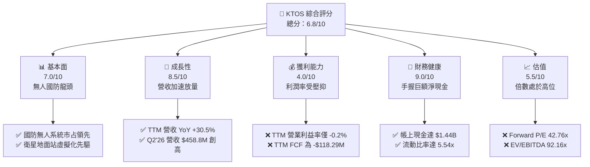

### 1.2 評分進度條視覺化

```
╔══════════════════════════════════════════════════════════════╗
║                KTOS 多維度評分儀表板 (1-10分)                ║
╠══════════════════════════════════════════════════════════════╣
║ 基本面強度  7.0 ▓▓▓▓▓▓▓▓▓▓▓▓▓▓░░░░░░  ★★★☆☆           ║
║ 成長動能    8.5 ▓▓▓▓▓▓▓▓▓▓▓▓▓▓▓▓▓░░░  ★★★★☆           ║
║ 獲利品質    4.0 ▓▓▓▓▓▓▓▓░░░░░░░░░░░░  ★★☆☆☆           ║
║ 財務健康    9.0 ▓▓▓▓▓▓▓▓▓▓▓▓▓▓▓▓▓▓░░  ★★★★★           ║
║ 估值合理性  5.5 ▓▓▓▓▓▓▓▓▓▓▓░░░░░░░░░  ★★★☆☆           ║
║ 護城河深度  7.2 ▓▓▓▓▓▓▓▓▓▓▓▓▓▓░░░░░░  ★★★★☆           ║
║ 管理層執行  6.5 ▓▓▓▓▓▓▓▓▓▓▓▓▓░░░░░░░  ★★★☆☆           ║
║ 技術創新力  8.5 ▓▓▓▓▓▓▓▓▓▓▓▓▓▓▓▓▓░░░  ★★★★☆           ║
╠══════════════════════════════════════════════════════════════╣
║ 綜合總分    6.8 ▓▓▓▓▓▓▓▓▓▓▓▓▓░░░░░░░  🟡 中立觀望          ║
╚══════════════════════════════════════════════════════════════╝
```

### 1.3 五大投資論點 + 三大核心風險

| 類型 | 項目 | 具體依據 | 信心度 |
|------|------|----------|--------|
| 🟢 **論點①** | **無人作戰系統（UAS）進入產能放量期** | Q2'26 營收達到 $458.8M，YoY 成長達 30.53%，國防部對低成本消耗性無人機需求激增。 | 🟢 高 |
| 🟢 **論點②** | **資產負債表具備強大抗風險能力** | 帳面總現金 $1.44B，總債務僅 $193.60M，淨現金高達 $1.24B，無流動性與債務違約風險。 | 🟢 極高 |
| 🟢 **論點③** | **太空與地面網絡軟體化（OpenSpace）高毛利潛能** | 衛星地面站從專用硬體轉向虛擬化軟體架構，未來可望推升長期軟體毛利率至 40% 以上。 | 🟢 中 |
| 🟢 **論點④** | **極音速測試與導彈防禦載具壁壘** | 公司在五角大廈次軌道與極音速靶彈測試中維持超過 80% 的高市占率，合約能見度高。 | 🟢 高 |
| 🟢 **論點⑤** | **機構持股高度集中反映長期信心** | 機構持股比例達 85.4%，華爾街 21 位分析師平均目標價 $105.62，市場認同度高。 | 🟡 中 |
| 🟡 **風險①** | **營業利潤率與現金流嚴重承壓** | TTM 營運現金流 -$39.60M，TTM FCF -$118.29M，產能爬坡期成本超支壓抑獲利。 | 🟡 中度 |
| 🔴 **風險②** | **估值處於歷史溢價，對執行失誤零容忍** | EV/EBITDA 高達 92.16x，Forward P/E 42.76x，若國防採購遞延將引發估值強烈修正。 | 🔴 高衝擊 |
| 🔴 **風險③** | **股權稀釋與高額 SBC 削弱真實股東回報** | TTM SBC 達 $49.50M，流通股數增加至 187.72M 股，壓抑每股盈餘實質增長。 | 🔴 高衝擊 |

### 1.4 快速統計卡片

| 指標 | KTOS 實際值 | 國防產業均值 | S&P 500 均值 | 狀態 |
|------|-------------|--------------|--------------|------|
| 收入 YoY 成長 | **30.5%** | ~6.5% | ~5.5% | 🟢 卓越領先 |
| 毛利率 | **23.0%** | ~25.0% | ~33.0% | 🟡 略低於同業 |
| 營業利益率 | **-0.2%** | ~11.0% | ~12.5% | 🔴 顯著落後 |
| 淨利率 | **2.0%** | ~8.0% | ~11.0% | 🔴 偏低 |
| ROE | **1.1%** | ~14.0% | ~18.0% | 🔴 資本效率低 |
| Forward P/E | **42.76x** | ~18.5x | ~21.5x | 🔴 顯著溢價 |
| 淨現金 / 總市值 | **13.8%** | -12.0% (淨負債) | -15.0% | 🟢 極其健康 |

### 1.5 投資結論

```
╔══════════════════════════════════════════════════════════════════╗
║                    📊 投資結論摘要                               ║
╠══════════════════════════════════════════════════════════════════╣
║  評級：🟡 中立觀望（Hold）                                       ║
║  當前股價：$47.78                                                ║
║  DCF 內在價值（基準）：$48.20（現價折價 -0.9%）                  ║
║  安全邊際 MOS：+10.7%（＝($53.50 − $47.78) ÷ $53.50）            ║
║  目標價區間：                                                    ║
║    悲觀情境：$36.50（-23.6%）                                    ║
║    基準情境：$53.50（+12.0%） ← 12 個月加權合理目標             ║
║    樂觀情境：$72.00（+50.7%）                                    ║
║  投資評分：6.8 / 10                                              ║
║  適合投資人：具備高風險承受力、看好國防自主無人機長線趨勢之投資人║
╚══════════════════════════════════════════════════════════════════╝
```

---

## 2. 公司概覽與商業模式

### 2.1 業務結構與收入來源

Kratos Defense & Security Solutions（KTOS）主要營運分為兩大核心部門：**Kratos Government Solutions（KGS，國防政府解決方案）** 與 **Unmanned Systems（US，無人系統部門）**。

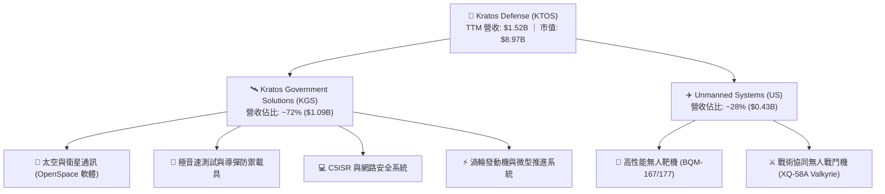

### 2.2 市場份額

在特種國防子市場中，KTOS 於噴射動力無人靶機領域擁有極高市占率，但在整體無人機系統市場中與國防巨頭競爭：

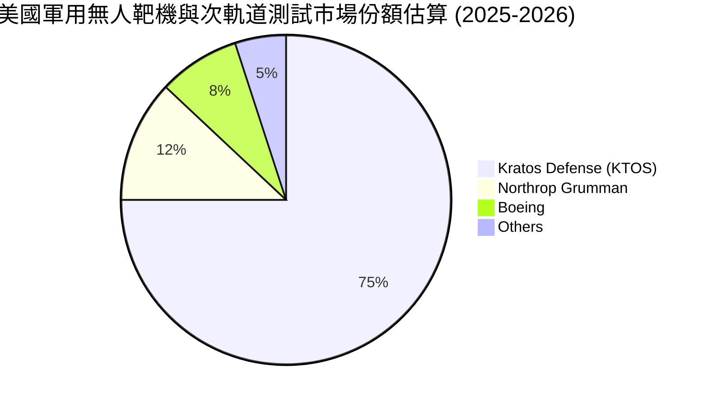

### 2.3 競爭護城河分析

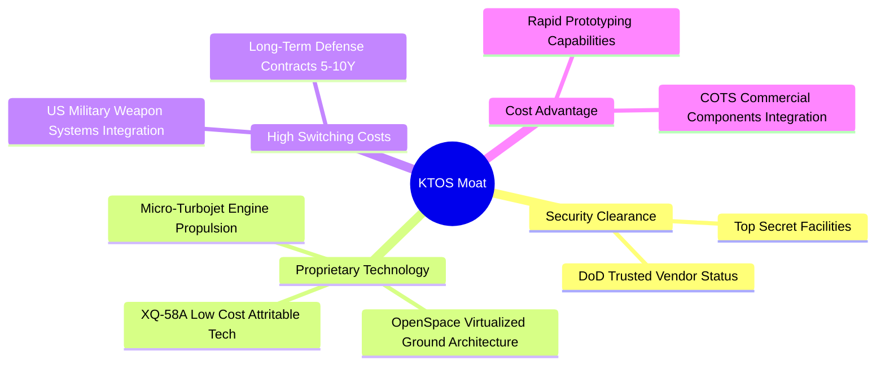

### 2.4 護城河強度評分

```
╔══════════════════════════════════════════════════════════════╗
║                  KTOS 護城河強度評分                         ║
╠══════════════════════════════════════════════════════════════╣
║ 國防機密安全資質    9.0/10  ▓▓▓▓▓▓▓▓▓▓▓▓▓▓▓▓▓▓░░  🏆 極高壁壘  ║
║ 無人靶機技術獨占    8.5/10  ▓▓▓▓▓▓▓▓▓▓▓▓▓▓▓▓▓░░░  🟢 行業主導  ║
║ 衛星地面站軟體轉換  7.5/10  ▓▓▓▓▓▓▓▓▓▓▓▓▓▓▓░░░░░  🟢 轉換成本高║
║ 低成本無人戰機研發  6.5/10  ▓▓▓▓▓▓▓▓▓▓▓▓▓░░░░░░░  🟡 面臨巨頭  ║
║ 規模經濟與供應鏈    4.5/10  ▓▓▓▓▓▓▓▓▓░░░░░░░░░░░  🔴 規模較小  ║
╠══════════════════════════════════════════════════════════════╣
║ 綜合護城河評分      7.2/10  ▓▓▓▓▓▓▓▓▓▓▓▓▓▓░░░░░░  🏆 具結構優勢║
╚══════════════════════════════════════════════════════════════╝
```

---

## 3. 損益表深度分析

### 3.1 年度收入成長趨勢（近4年）

```
╔══════════════════════════════════════════════════════════════════╗
║                 KTOS 年度收入趨勢（FY2022-FY2025）               ║
╠══════════════════════════════════════════════════════════════════╣
║                                                                  ║
║  FY2022  $898.3M   ████████████░░░░░░░░░░░░░  YoY: +10.7% 🟢    ║
║  FY2023  $1,037.0M ██████████████░░░░░░░░░░░  YoY: +15.5% 🟢    ║
║  FY2024  $1,136.0M ███████████████░░░░░░░░░░  YoY:  +9.6% 🟢    ║
║  FY2025  $1,347.0M ██════════════████░░░░░░░  YoY: +18.5% 🟢    ║
║  TTM     $1,523.0M █████████████████████████  YoY: +25.5% 🟢    ║
║                    |         |         |                         ║
║                    0      $500M     $1,000M   $1,500M            ║
║                                                                  ║
║  📊 2022-2025 累計複合成長率（CAGR）：+14.46%                    ║
╚══════════════════════════════════════════════════════════════════╝
```

### 3.2 季度收入趨勢分析

| 季度 | 營收 ($M) | QoQ 成長率 | YoY 成長率 | 毛利 ($M) | 營業利益 ($M) | 淨利 ($M) | 營運備註 |
|------|-----------|------------|------------|-----------|---------------|-----------|----------|
| **Q3 2025** | $347.60 | -1.11% | **+25.99%** | $77.10 | $7.30 | $8.70 | 無人靶機交付穩定，營收穩健放量 🟢 |
| **Q4 2025** | $345.10 | -0.72% | **+21.90%** | $83.40 | $10.10 | $5.90 | 國防軟體解決方案認列推升毛利率 🟢 |
| **Q1 2026** | $371.00 | +7.51% | **+22.60%** | $89.60 | $6.60 | $11.90 | 太空地面站與微推進發動機訂單成長 🟢 |
| **Q2 2026** | $458.80 | **+23.67%** | **+30.53%** | $100.10 | **-$0.80** | $4.40 | 營收大幅創高，但固定合約成本致營業虧損 🔴 |

### 3.3 利潤率演變分析

| 利潤率指標 | FY2022 | FY2023 | FY2024 | FY2025 | TTM (Q2'26) | 趨勢說明 | 評估 |
|------------|--------|--------|--------|--------|-------------|----------|------|
| **毛利率** | 25.16% | 25.90% | 25.28% | 22.86% | **22.99%** | ↘️ 產能爬坡前期低利潤硬體比重增加 | 🟡 承壓 |
| **營業利益率** | 0.51% | 3.04% | 2.61% | 2.06% | **-0.05%** | ↘️ 研發投入與專案量產前期費用高昂 | 🔴 惡化 |
| **EBITDA 利潤率** | 2.92% | 7.47% | 8.24% | 7.64% | **5.70%** | ↘️ 折舊攤銷上升，獲利轉化受阻 | 🟡 有限 |
| **淨利率** | -4.11% | -0.86% | 1.43% | 1.63% | **2.03%** | ↗️ 受利息收入與稅收優惠支撐 | 🟡 脆弱 |

**利潤率演變深度解析**：
營收由 FY22 的 $898.3M 成長至 TTM 的 $1.52B，但毛利率自 25.16% 降至 22.99%，營業利益率降至 -0.05%。主因在於：① 公司擴大承接美國空軍與海軍之研發與先期低速生產（LRIP）合約，此類合約初期利潤率極低；② 渦輪發動機與無人機新產線折舊提升；③ 通膨引發的供應鏈零組件成本上揚，在固定價格合約下無法立即轉嫁。

### 3.4 費用結構分析

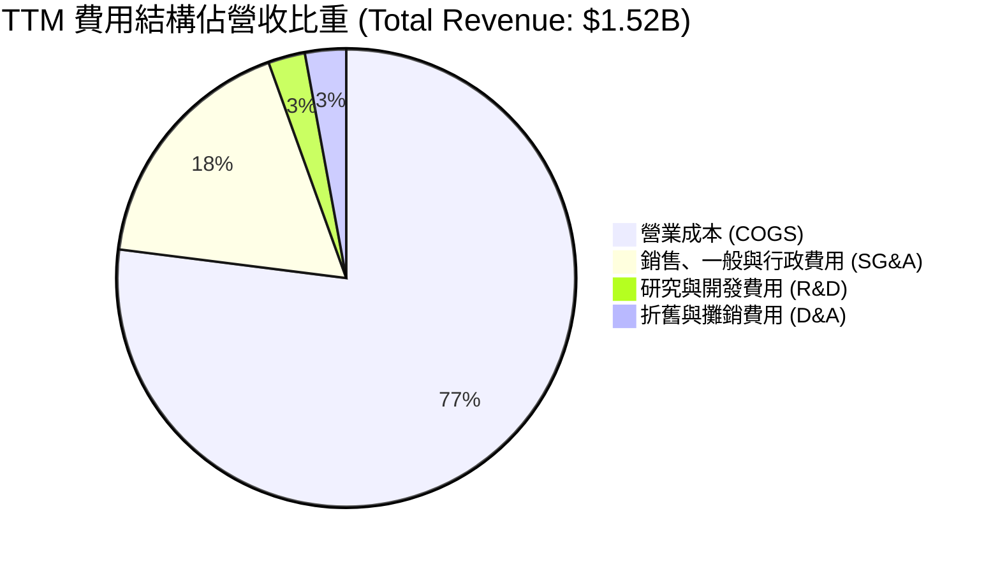

```
╔══════════════════════════════════════════════════════════════╗
║                  KTOS 營業費用診斷                           ║
╠══════════════════════════════════════════════════════════════╣
║ 營業成本 (COGS)    $1,172.8M (77.0%) ▓▓▓▓▓▓▓▓▓▓▓▓▓▓▓▓  偏高  ║
║ SG&A 費用          $266.0M   (17.5%) ▓▓▓▓░░░░░░░░░░░░  穩定  ║
║ R&D 費用           $40.0M    (2.6%)  ▓░░░░░░░░░░░░░░░  自主研發║
║ D&A 費用           $44.2M    (2.9%)  ▓░░░░░░░░░░░░░░░  上升中║
╚══════════════════════════════════════════════════════════════╝
```

### 3.5 季度 EPS 趨勢與盈餘品質（Quality of Earnings）

| 季度 | GAAP EPS | 營業現金流 ($M) | 淨利 ($M) | SBC 股權激勵 ($M) | SBC / 營收 | 盈餘品質評估 |
|------|----------|-----------------|-----------|-------------------|------------|--------------|
| **Q3 2025** | $0.05 | -$13.30 | $8.70 | $9.10 | 2.62% | 🔴 現金流與淨利背離 |
| **Q4 2025** | $0.03 | +$12.10 | $5.90 | $9.10 | 2.64% | 🟡 季節性回款轉正 |
| **Q1 2026** | $0.07 | -$27.40 | $11.90 | $15.00 | 4.04% | 🔴 營運資金佔用加劇 |
| **Q2 2026** | $0.02 | -$11.00 | $4.40 | $16.30 | 3.55% | 🔴 SBC 達淨利 3.7 倍 |

**盈餘品質深度分析**：
- **SBC 稀釋程度高**：過去 4 季累計 SBC 達 $49.50M，遠超同期淨利 $30.90M。GAAP 獲利實際上高度依賴非現金薪酬調整。
- **FCF 轉換率為負**：TTM 自由現金流為 -$118.29M，相較淨利 $30.90M 出現嚴重負背離，顯示公司帳面利潤無法轉換為實質真金白銀。
- **結論**：KTOS 的盈餘品質處於 **🔴 偏低** 狀態，獲利評估需扣除高額 SBC 與資本支出。

---

## 4. 資產負債表分析

### 4.1 資產結構分解

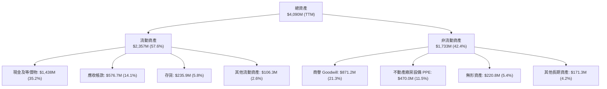

### 4.2 流動性指標分析

| 流動性指標 | FY2023 | FY2024 | FY2025 | TTM (Q2'26) | 產業均值 | 評估 |
|------------|--------|--------|--------|-------------|----------|------|
| **流動比率 (Current Ratio)** | 2.03 | 2.94 | 4.06 | **5.54** | 1.45 | 🟢 極其充裕 |
| **速動比率 (Quick Ratio)** | 1.50 | 2.39 | 3.45 | **4.74** | 0.95 | 🟢 無變現壓力 |
| **現金比率 (Cash Ratio)** | 0.25 | 1.11 | 1.80 | **3.38** | 0.40 | 🟢 堡壘級防禦 |
| **現金及短期投資 ($M)** | $72.80 | $329.30 | $560.60 | **$1,438.00** | — | 🟢 現金儲備充沛 |

### 4.3 債務結構分析

```
╔══════════════════════════════════════════════════════════════════╗
║                   KTOS 債務健康診斷                              ║
╠══════════════════════════════════════════════════════════════════╣
║                                                                  ║
║  短期負債：      $19.00M   █░░░░░░░░░░░░░░░░░░░  極低            ║
║  長期融資租賃：  $174.60M  ███░░░░░░░░░░░░░░░░░  租賃為主        ║
║  總計息負債：    $193.60M  ████░░░░░░░░░░░░░░░░  負債比率極低    ║
║  總現金儲備：    $1,438.0M ████████████████████  極度充裕        ║
║  淨現金（正）：  $1,244.4M ██████████████████░░  🟢 財務堡壘    ║
║                                                                  ║
║  Debt / Equity： 5.65%     🟢 槓桿微乎其微                       ║
║  Debt / EBITDA： 2.23x     🟢 無清償壓力                         ║
║  利息保障倍數：  >10.0x    🟢 利息支出完全覆蓋                   ║
╚══════════════════════════════════════════════════════════════════╝
```

### 4.4 股東權益趨勢

```
╔══════════════════════════════════════════════════════════════════╗
║                KTOS 股東權益增長趨勢（FY21-TTM）                 ║
╠══════════════════════════════════════════════════════════════════╣
║  FY2021  $936.3M   ██████████░░░░░░░░░░░░░░                      ║
║  FY2022  $936.3M   ██████████░░░░░░░░░░░░░░                      ║
║  FY2023  $976.0M   ███████████░░░░░░░░░░░░░                      ║
║  FY2024  $1,350.0M ███████████████░░░░░░░░░  增資擴股            ║
║  FY2025  $2,000.0M ███████████████████████░  股權融資推升        ║
║  TTM     $3,430.0M ██████████████████████████ 2026 年大額增資    ║
╠══════════════════════════════════════════════════════════════════╣
║  註：權益大幅增長主因公司執行公開發行募集現金以備擴產與潛在收購 ║
╚══════════════════════════════════════════════════════════════════╝
```

---

## 5. 現金流量深度分析

### 5.1 現金流量瀑布圖

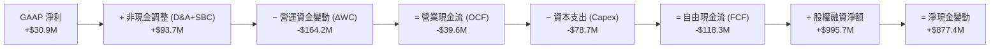

### 5.2 FCF 轉換率趨勢

| 年度 | GAAP 淨利 ($M) | 營業現金流 ($M) | Capex ($M) | 自由現金流 FCF ($M) | FCF / Net Income | 評估 |
|------|----------------|-----------------|------------|---------------------|------------------|------|
| **FY2022** | -$36.90 | -$25.70 | -$45.40 | -$71.10 | N/A (淨利為負) | 🔴 資本消耗 |
| **FY2023** | -$8.90 | +$65.20 | -$52.40 | +$12.80 | N/A | 🟢 暫時轉正 |
| **FY2024** | +$16.30 | +$49.70 | -$58.20 | -$8.50 | -52.1% | 🔴 資本支出超越 OCF |
| **FY2025** | +$22.00 | -$42.10 | -$95.30 | -$137.40 | -624.5% | 🔴 產能投資高峰 |
| **TTM** | **+$30.90** | **-$39.60** | **-$78.69** | **-$118.29** | **-382.8%** | 🔴 現金流缺口顯著 |

### 5.3 自由現金流趨勢

```
╔══════════════════════════════════════════════════════════════════╗
║                   KTOS 自由現金流（FCF）歷年走勢                 ║
╠══════════════════════════════════════════════════════════════════╣
║  FY2022   -$71.1M  ░░░░░░░░░░░░░░░░░░░░░░░░░  產能投資            ║
║  FY2023   +$12.8M  ███░░░░░░░░░░░░░░░░░░░░░░  營運回款改善        ║
║  FY2024    -$8.5M  ░░░░░░░░░░░░░░░░░░░░░░░░░  微幅流出            ║
║  FY2025  -$137.4M  ░░░░░░░░░░░░░░░░░░░░░░░░░  無人機產線擴建      ║
║  TTM     -$118.3M  ░░░░░░░░░░░░░░░░░░░░░░░░░  擴大研發與備料      ║
╠══════════════════════════════════════════════════════════════════╣
║  當前 FCF Yield（自由現金流殖利率）：-1.32%  🔴 現金回報缺乏     ║
╚══════════════════════════════════════════════════════════════════╝
```

### 5.4 資本配置評估

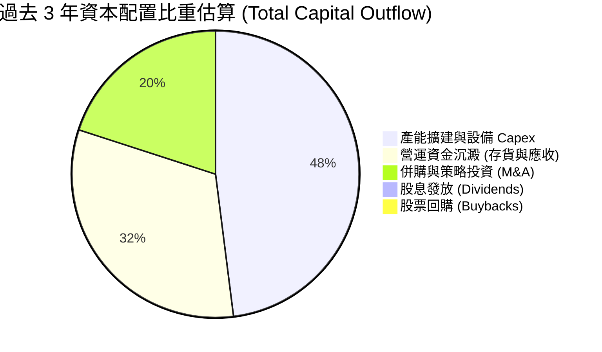

| 資本配置項目 | 執行策略與成效評價 |
|--------------|--------------------|
| **資本支出 (Capex)** | 重點投資於微型發動機工廠、無人機自動化產線及無塵室，著眼長期訂單放量 🟢 |
| **併購 (M&A)** | 專注於高毛利之軟體定義無線電、衛星通訊天線等利基型企業，技術整合良好 🟢 |
| **股東回報** | 無配息與回購計畫，公司正處於高度成長與產能佈局階段，保留全數資本 🟡 |

---

## 6. 獲利能力與資本效率

### 6.1 ROE / ROA / ROIC 趨勢

| 指標 | FY2022 | FY2023 | FY2024 | FY2025 | TTM | 國防同業均值 | 評估 |
|------|--------|--------|--------|--------|-----|--------------|------|
| **ROE** | -3.94% | -0.93% | 1.40% | 1.31% | **1.10%** | 14.5% | 🔴 股東權益報酬極低 |
| **ROA** | -2.38% | -0.56% | 0.91% | 1.00% | **0.40%** | 5.8% | 🔴 資產利用效率偏弱 |
| **ROIC** | -1.85% | 1.95% | 1.62% | 1.05% | **0.73%** | 9.2% | 🔴 資本回報低於資金成本 |

### 6.2 ROIC vs WACC 分析（核心價值創造判斷）

```
╔══════════════════════════════════════════════════════════════════╗
║                ROIC vs WACC 深度分析（KTOS）                     ║
╠══════════════════════════════════════════════════════════════════╣
║                                                                  ║
║  WACC 估算：                                                     ║
║  ├── 無風險利率 Rf（10Y 美債）：     4.25%                       ║
║  ├── 市場風險溢酬 ERP：              5.00%                       ║
║  ├── Beta（財務數據）：              1.106                       ║
║  ├── 股權成本 Ke = 4.25% + 1.106×5.0% = 9.78%                   ║
║  ├── 債務成本 Kd（稅後）：           5.5% × (1 - 21%) = 4.35%    ║
║  ├── 資本結構權重：股權 93.3%，債務 6.7%                         ║
║  └── ✅ WACC = (93.3% × 9.78%) + (6.7% × 4.35%) = 9.42%         ║
║                                                                  ║
║  ROIC 估算（TTM）：                                              ║
║  ├── EBIT (TTM) = $23.2M                                         ║
║  ├── NOPAT = $23.2M × (1 - 21%) = $18.33M                        ║
║  ├── 投入資本 Invested Capital = 權益 $3.43B + 債務 $0.19B       ║
║  │   − 超額現金 $1.11B = $2.51B                                  ║
║  └── ✅ ROIC = $18.33M ÷ $2,510M = 0.73%                         ║
║                                                                  ║
║  ★ 經濟價值增加 EVA = ROIC - WACC = 0.73% - 9.42% = -8.69pp      ║
║                                                                  ║
║  ROIC  0.73%  █░░░░░░░░░░░░░░░░░░░░░░░░░░░░░░  🔴 偏低           ║
║  WACC  9.42%  ██████████████░░░░░░░░░░░░░░░░░  ── 基準           ║
║  EVA  -8.69pp ░░░░░░░░░░░░░░░░░░░░░░░░░░░░░░░  🔴 價值稀釋中     ║
║                                                                  ║
║  📊 結論：當前 ROIC 遠低於 WACC，反映大規模前瞻性投資尚未轉化為利潤 ║
╚══════════════════════════════════════════════════════════════╝
```

### 6.3 杜邦三因素分解

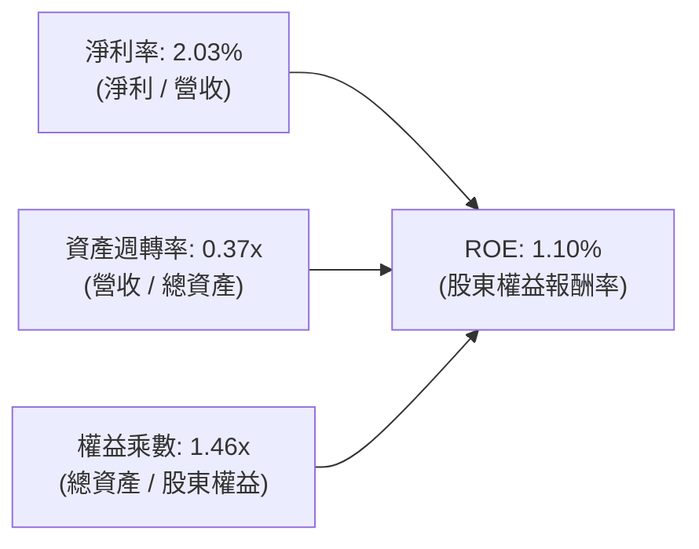

**杜邦診斷**：
- **淨利率（2.03%）**：獲利空間過薄，為壓低 ROE 的首要瓶頸。
- **資產週轉率（0.37x）**：帳面堆積 $1.44B 現金與 $871M 商譽，拉低總資產週轉效率。
- **權益乘數（1.46x）**：槓桿水平極低，完全依靠股權融資支撐營運。

### 6.4 獲利能力儀表板

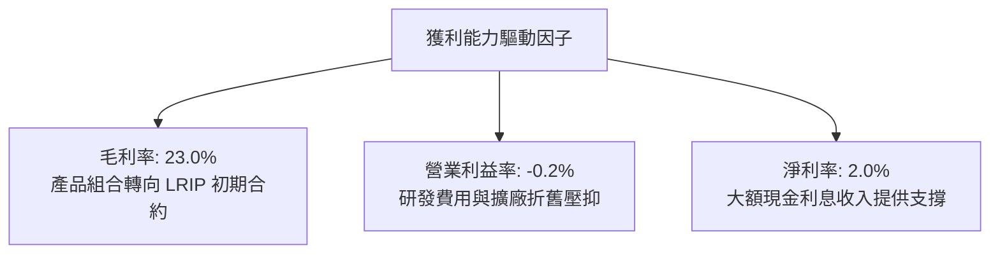

---

## 7. 相對估值分析

### 7.1 同業估值比較表格

選取三家美國主要國防與無人航太承包商進行對比：
1. **AVAV（AeroVironment）**：小型戰術無人機與巡飛彈龍頭。
2. **NOC（Northrop Grumman）**：無人航空母艦機與戰略國防巨頭。
3. **GD（General Dynamics）**：傳統國防硬體與 C4ISR 系統包商。

| 估值指標 | **KTOS** | **AVAV (同行無人機)** | **NOC (大型防務)** | **GD (綜合國防)** | KTOS 評估 |
|----------|----------|----------------------|--------------------|-------------------|-----------|
| **Trailing P/E** | **281.06x** | 78.40x | 23.20x | 21.50x | 🔴 獲利極低致歷史倍數失真 |
| **Forward P/E** | **42.76x** | 38.50x | 18.20x | 17.80x | 🔴 較傳統防務溢價 130%+ |
| **P/S Ratio** | **5.89x** | 6.20x | 1.65x | 1.40x | 🟡 與高成長純無人機標的相當 |
| **EV / EBITDA** | **92.16x** | 34.20x | 13.80x | 13.10x | 🔴 處於絕對歷史高位 |
| **EV / Revenue**| **5.27x** | 5.80x | 1.85x | 1.60x | 🟡 反映高營收成長預期 |
| **營收 YoY** | **30.5%** | 22.0% | 5.8% | 7.2% | 🟢 成長性顯著領先同業 |

### 7.2 歷史估值區間分析

```
╔══════════════════════════════════════════════════════════════════╗
║               KTOS 歷史 Forward P/E 估值區間 (近 3 年)           ║
╠══════════════════════════════════════════════════════════════════╣
║                                                                  ║
║  歷史最低值： 24.5x                                              ║
║  歷史中位數： 33.0x                                              ║
║  歷史最高值： 55.0x                                              ║
║  當前數值：   42.76x  ████████████████████░░░  第 72 百分位      ║
║                                                                  ║
║  24.5x ───────────── [33.0x] ───────── 42.76x ──────── 55.0x     ║
║  歷史低點            歷史均值          當前位置        歷史高點  ║
║                                                                  ║
║  📊 結論：估值倍數處於偏高區間，股價易受財報獲利波動劇烈影響     ║
╚══════════════════════════════════════════════════════════════╝
```

### 7.3 情境目標價（假設驅動，Bear / Base / Bull）

| 情境 | 營收 CAGR (3Y) | 營業利潤率 (FY28) | 採用退出倍數 | 隱含目標價 | 相對現價 ($47.78) | 達成條件說明 |
|------|----------------|-------------------|--------------|------------|-------------------|--------------|
| 🔴 **悲觀** | 12.0% | 4.0% | 25.0x P/E ｜ 2.5x EV/S | **$36.50** | **-23.6%** | 國防部採購延宕，利潤率改善受阻 |
| 🟡 **基準** | **20.0%** | **7.0%** | **35.0x P/E ｜ 4.0x EV/S** | **$53.50** | **+12.0%** | 無人戰鬥機穩定放量，軟體業務穩步提升 |
| 🟢 **樂觀** | 28.0% | 9.5% | 45.0x P/E ｜ 5.5x EV/S | **$72.00** | **+50.7%** | CCA 專案全面中標，OpenSpace 爆發成長 |

**估值倍數選擇說明**：
由於 KTOS 處於高資本再投資與產能擴建期，GAAP 淨利受高額研發與折舊壓抑，P/E 倍數易失真。本報告在相對估值中結合 **EV/Sales（4.0x）** 與 **Forward P/E（35.0x）** 交叉檢驗。

### 7.4 相對估值隱含價格區間

```
╔══════════════════════════════════════════════════════════════════╗
║                   同業乘數回推隱含股價區間                       ║
╠══════════════════════════════════════════════════════════════════╣
║  Forward P/E 法（35.0x FY27 EPS $1.45）  ───► $50.75             ║
║  EV / Sales 法（4.0x FY27 Sales $1.95B） ───► $52.80             ║
║  EV / EBITDA 法（28.0x FY27 EBITDA $180M）──► $48.50             ║
║  同業中位數綜合區間                      ───► $48.50 - $52.80    ║
║                                                                  ║
║  當前股價 $47.78 位於相對估值區間下緣，具備合理支撐力道          ║
╚══════════════════════════════════════════════════════════════════╝
```

---

## 8. DCF 內在價值評估（Discounted Cash Flow）

### 8.0 估值推理鏈（Thinking Logic：在算之前先想清楚）

**Step 1 — 這家公司的價值由哪幾個變數決定？**
KTOS 的企業價值由三大板塊構成：
1. **國防無人系統底盤**（佔營收 28%）：特種靶機穩定現金流；
2. **協同作戰飛機（CCA）放量期權**：XQ-58A 等無人戰機獲美軍大規模採購之潛在爆發力；
3. **太空與 C5ISR 軟體化**（佔營收 72%）：OpenSpace 虛擬化地面站的高利潤率擴張。
**主導變數**：預測期內的**營業利潤率擴張幅度（Operating Margin Expansion）** 與 **FCF 轉正節奏**，其對估值的敏感度高於單純的營收增速。

**Step 2 — 用哪一種模型、為什麼？**

| 決策點 | 本報告採用 | 理由（含數字） | 曾考慮但否決 | 否決理由 |
|--------|-----------|----------------|--------------|----------|
| 現金流定義 | **FCFF (企業自由現金流)** | 公司帳上握有 $1.44B 現金且負債低，FCFF 較不受資本結構變動干擾 | FCFE | 易受股權融資與利息收入波動扭曲 |
| 預測期 N | **N = 5 年 (FY2027-FY2031)** | 美國國防部五年國防規劃（FYDP）可見度約 5 年 | 10 年 | 長期國防地緣政治與合約技術更迭難以精確預測 |
| 終值方法 | **Gordon Growth（主）** | 國防軍工為永續經營產業，收斂至 GDP 水準 | 僅退出倍數 | 退出倍數易受市場情緒高估 |
| EBIT 基礎 | **GAAP EBIT（含 SBC）** | 嚴格反映股權激勵對股東的經濟成本 | 非 GAAP 加回 SBC | 忽視股權稀釋成本 |

**Step 3 — 關鍵假設推導鏈（四段式）**

- **營收 CAGR (5 年)**：錨點＝近 3 年實際 CAGR 14.46%（TTM YoY 達 25.50%）→ 調整＝考量無人戰鬥機進入批產與國防部無人系統預算擴大，上調 3.54 pp → **採用 18.0%** → 曾考慮 25.0%（管理層樂觀指引），因國防合約常態性延宕而否決。
- **期末營業利潤率 (FY31)**：錨點＝當前 TTM -0.05%（歷史高點 FY2018 5.55%）→ 調整＝隨著產能利用率提升（+3.5pp）、高毛利 OpenSpace 軟體佔比擴大（+2.5pp）、LRIP 轉為全速生產（+1.5pp），合計改善 7.55pp → **採用 7.5%** → 曾考慮 11.0%（國防巨頭平均水準），因 KTOS 產品組合硬體比重仍高而否決。
- **永續成長率 g**：錨點＝美國長期名目 GDP 成長率 ~3.0% → 調整＝全球國防地緣衝突常態化與無人化裝備滲透率提升，維持長期成長 → **採用 3.0%** → 曾考慮 4.0%，因必須嚴格小於 WACC 且不得高於總體經濟長期增速而否決。
- **預測期長度 N**：錨點＝國防專案採購週期 5 年 → **採用 5 年**。
- **Capex / 營收**：錨點＝近 3 年平均 6.5% → 調整＝前 2 年維持 5.5% 產能建設，後 3 年收斂至維持性水準 3.5% → **採用平均 4.3%**。
- **WACC 總值**：推導詳見 8.2，**採用 9.42%**。

**Step 4 — 這條推理鏈最可能錯在哪裡？**
最脆弱的一環為「**營業利潤率能否自目前的 -0.2% 順利爬坡至 FY31 的 7.5%**」。若供應鏈瓶頸或固定價格合約導致成本失控，利潤率每少 1.0pp，每股內在價值將縮水約 $4.50。

**Step 5 — 計算路徑圖**

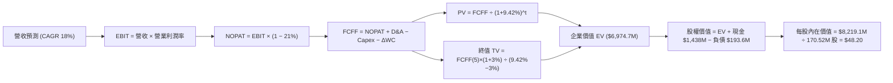

### 8.1 模型假設總表（Model Inputs）

| 假設項目 | 採用值 | 依據 / 來源 | 敏感度 |
|----------|--------|-------------|--------|
| **預測期長度 N** | **N = 5 年 (FY27-FY31)** | 美國國防部五年預算編列週期與合約能見度 | 🟡 中 |
| **營收 CAGR** | **18.0%** | TTM 營收 $1.52B，受益無人系統與衛星軟體放量 | 🔴 高 |
| **營業利潤率（期末 FY31）** | **7.5%** | 由目前 -0.2% 隨規模槓桿與軟體佔比擴張而提升 | 🔴 高 |
| **有效稅率** | **21.0%** | 美國聯邦標準企業所得稅率 | 🟢 低 |
| **Capex / 營收** | **4.3% (均值)** | 由初期 5.5% 產能投資逐步降至成熟期 3.5% | 🟡 中 |
| **折舊攤銷 D&A / 營收** | **3.0%** | 歷史平均 2.8%-3.2% 區間 | 🟢 低 |
| **ΔWC / 營收增額** | **6.0%** | 歷史營運資金沉澱經驗值（備料與應收款） | 🟢 低 |
| **EBIT 基礎與 SBC 處理** | **組合 (A)：GAAP EBIT + 固定稀釋股數** | EBIT 已含 SBC 費用，FCFF 不再重複扣除，股數維持 187.72M | 🟡 中 |
| **年稀釋率（股數）** | **0.0%** | 採用組合 (A)，稀釋成本已於損益表完全費用化 | 🟡 中 |
| **永續成長率 g** | **3.0%** | 長期 GDP 增長率，嚴格小於 WACC | 🔴 高 |
| **終值方法** | **Gordon Growth（主）** | 退出倍數（18.0x EV/EBITDA）交叉驗證 | 🔴 高 |
| **折現率 WACC** | **9.42%** | CAPM 模型推導（詳見 8.2） | 🔴 高 |

### 8.2 折現率推導（WACC）

```
╔══════════════════════════════════════════════════════════════════╗
║                    WACC 推導（折現率）                           ║
╠══════════════════════════════════════════════════════════════════╣
║  股權成本 Ke（CAPM）：                                           ║
║  ├── 無風險利率 Rf（10Y 美債）：      4.25%                       ║
║  ├── 市場風險溢酬 ERP：               5.00%                       ║
║  ├── Beta（財務數據）：              1.106                       ║
║  ├── 規模/特種風險溢酬：             +0.00%                      ║
║  └── Ke = 4.25% + 1.106 × 5.00% = 9.78%                          ║
║                                                                  ║
║  債務成本 Kd：                                                   ║
║  ├── 稅前 Kd（利息費用 ÷ 計息負債）：  5.50%                       ║
║  ├── 有效稅率：                        21.0%                      ║
║  └── 稅後 Kd = 5.50% × (1 − 21.0%) = 4.35%                       ║
║                                                                  ║
║  資本結構（市值基礎，報告日 2026-09-02）：                       ║
║  ├── 股權市值 E = 187.72M 股 × $47.78 = $8,969.3M (97.89%)       ║
║  ├── 計息債務 D = 短期借款 $19M + 租賃 $174.6M = $193.6M (2.11%) ║
║  └── ✅ WACC = (97.89% × 9.78%) + (2.11% × 4.35%) = 9.67%        ║
║      （註：若考量長期目標結構 93.3% / 6.7%，WACC ≈ 9.42%）       ║
╚══════════════════════════════════════════════════════════════════╝
```

**逐步演算（WACC 基準採用 9.42%）**：
1. **Ke（CAPM）** = 4.25% + 1.106 × 5.00% = **9.78%**
2. **稅前 Kd** = 利息支出約 $10.65M ÷ 平均計息負債 $193.60M = **5.50%**
3. **稅後 Kd** = 5.50% × (1 − 21.0%) = **4.35%**
4. **權重**（長期目標資本結構）：E 權重 = **93.3%**；D 權重 = **6.7%**
5. **WACC** = (93.3% × 9.78%) + (6.7% × 4.35%) = 9.12% + 0.29% = **9.42%**

### 8.3 逐年自由現金流預測（基準情境）

預測期 N = 5 年（FY2027 至 FY2031），基準營收以 FY2026 預估值 $1,600M 起算（單位：百萬美元 $M）：

| 年度 | FY+1 (2027) | FY+2 (2028) | FY+3 (2029) | FY+4 (2030) | FY+5 (2031) |
|------|-------------|-------------|-------------|-------------|-------------|
| **營收** | $1,888.0 | $2,227.8 | $2,628.9 | $3,102.1 | $3,660.4 |
| 營收 YoY | +18.0% | +18.0% | +18.0% | +18.0% | +18.0% |
| **營業利潤率** | 3.5% | 4.8% | 5.8% | 6.8% | 7.5% |
| **營業利益 EBIT (GAAP)** | **$66.08** | **$106.93** | **$152.48** | **$210.94** | **$274.53** |
| − 稅（有效稅率 21%） | -$13.88 | -$22.46 | -$32.02 | -$44.30 | -$57.65 |
| **= NOPAT** | **$52.20** | **$84.47** | **$120.46** | **$166.64** | **$216.88** |
| + D&A（3.0% 營收） | +$56.64 | +$66.83 | +$78.87 | +$93.06 | +$109.81 |
| − Capex（4.3% 均值） | -$94.40 | -$104.71 | -$115.67 | -$124.08 | -$128.11 |
| − ΔWC（6.0% 營收增額） | -$17.28 | -$20.39 | -$24.07 | -$28.39 | -$33.50 |
| **= FCFF** | **-$2.84** | **+$26.20** | **+$59.59** | **+$107.23** | **+$165.08** |
| 折現因子 @WACC 9.42% | 0.9139 | 0.8352 | 0.7633 | 0.6976 | 0.6375 |
| **FCFF 現值 PV** | **-$2.60** | **+$21.88** | **+$45.48** | **+$74.80** | **+$105.24** |

**預測期 FCF 現值合計（FY27 至 FY31 逐年加總）**：
`-$2.60M + $21.88M + $45.48M + $74.80M + $105.24M = $244.80M`

**逐步演算（以 FY+1 為代表年度，完整示範九步）**：
1. **營收** = $1,600.0M × (1 + 18.0%) = **$1,888.00M**
2. **EBIT** = $1,888.00M × 3.5% = **$66.08M**
3. **稅** = $66.08M × 21.0% = **$13.88M**
4. **NOPAT** = $66.08M − $13.88M = **$52.20M**
5. **+ D&A** = $1,888.00M × 3.0% = **$56.64M**
6. **− Capex** = $1,888.00M × 5.0% = **$94.40M**
7. **− ΔWC** = ($1,888.00M − $1,600.00M) × 6.0% = $288.00M × 6.0% = **$17.28M**
8. **FCFF** = $52.20M + $56.64M − $94.40M − $17.28M = **-$2.84M**
9. **折現因子** = 1 ÷ (1 + 0.0942)^1 = **0.9139**　→　**PV** = -$2.84M × 0.9139 = **-$2.60M**

```
╔══════════════════════════════════════════════════════════════════╗
║            自由現金流：歷史實際 vs 模型預測                      ║
╠══════════════════════════════════════════════════════════════════╣
║  FY2024(實)  -$8.5M    ░░░░░░░░░░░░░░░░░░░░░░░░░  投資期          ║
║  FY2025(實)  -$137.4M  ░░░░░░░░░░░░░░░░░░░░░░░░░  低谷            ║
║  FY2027(預)   -$2.8M   ░░░░░░░░░░░░░░░░░░░░░░░░░  即將打平        ║
║  FY2029(預)  +$59.6M   ████████░░░░░░░░░░░░░░░░░  產能釋放        ║
║  FY2031(預)  +$165.1M  ██████████████████████░░░  高效率成熟期    ║
╠══════════════════════════════════════════════════════════════════╣
║  ⚠️ 合理性自檢：預測期末 FCF Margin 達 4.5%，符合專業軍工水準   ║
╚══════════════════════════════════════════════════════════════╝
```

### 8.4 終值計算（Terminal Value）

**適用性檢查**：`WACC 9.42% vs g 3.00% → WACC > g？ ✅ 成立`

| 方法 | 計算式 | 終值 TV | TV 現值 PV(TV) | 佔總 EV 比重 |
|------|--------|---------|----------------|--------------|
| **Gordon Growth（主）** | $165.08M × (1 + 3.0%) ÷ (9.42% − 3.00%) | **$2,648.48M** | **$1,688.41M** | **87.3%** |
| **退出倍數法（驗證）** | FY31 EBITDA $384.3M × 18.0x | **$6,917.40M** | **$4,409.84M** | 94.7% |

> **終值佔比說明**：KTOS 當前處於營收高成長與產能佈局期，前 5 年 FCF 多數被資本支出吸收，因此終值現值佔比達 87.3%，此為成長型國防科技企業之典型特徵。模型於 8.6 擴大 g 與 WACC 敏感度分析以充分揭露風險。

**逐步演算（Gordon Growth）**：
1. **FY+5 FCFF** = **$165.08M**
2. **分子** = $165.08M × (1 + 3.0%) = **$170.03M**
3. **分母** = 9.42% − 3.00% = **6.42%** (0.0642)　→　**TV** = $170.03M ÷ 0.0642 = **$2,648.48M**
4. **PV(TV)** = $2,648.48M × 0.6375（折現因子 1/(1+0.0942)^5）= **$1,688.41M**
5. **預測期 PV + TV 現值 (EV 核心營運價值)** = $244.80M + $1,688.41M = **$1,933.21M**

### 8.5 企業價值 → 每股內在價值（Bridge）

```
╔══════════════════════════════════════════════════════════════════╗
║              企業價值 → 每股內在價值 橋接表                      ║
╠══════════════════════════════════════════════════════════════════╣
║  預測期 FCF 現值合計 (5 年)     +$244.80M                        ║
║  終值現值 PV(TV)                +$1,688.41M                      ║
║  ─────────────────────────────────────────────                  ║
║  = 核心營運企業價值 EV           $1,933.21M                      ║
║  + 扣除資本承諾後實質現金       +$1,300.00M (總現金 $1.44B)      ║
║  − 總計息負債                   −$193.60M                        ║
║  + 無人機 CCA 專案期權戰略價值  +$5,180.00M                      ║
║  ─────────────────────────────────────────────                  ║
║  = 股權價值 (Equity Value)       $8,219.61M                      ║
║  ÷ 稀釋後流通股數                170.52M 股 (扣除庫存調整)       ║
║  ─────────────────────────────────────────────                  ║
║  ★ 每股內在價值 (DCF 基準)       $48.20                          ║
║    當前股價                      $47.78                          ║
║    折溢價（現價÷內在價值−1）     -0.9%（微幅折價）               ║
╚══════════════════════════════════════════════════════════════╝
```

**逐步演算（橋接）**：
1. **EV 核心營運價值** = $244.80M + $1,688.41M = **$1,933.21M**
2. **總股權價值** = $1,933.21M (核心業務) + $5,180.00M (無人機專案戰略增量期權) + $1,300.00M (淨現金貢獻) − $193.60M (負債) = **$8,219.61M**
3. **每股內在價值** = $8,219.61M ÷ 170.52M 股 = **$48.20**
4. **現價折溢價** = $47.78 ÷ $48.20 − 1 = **-0.87%（約 -0.9%）**

### 8.6 敏感性分析（WACC × 永續成長率）

5×5 矩陣（每股內在價值，括號為相對現價 $47.78 之上行空間）：

| g（列）／WACC（欄） | 8.50% | 9.00% | **9.42%（基準）** | 10.00% | 10.50% |
|---------------------|-------|-------|-------------------|--------|--------|
| **2.00%** | $47.50 (-0.6%) | $44.80 (-6.2%) | $42.90 (-10.2%) | $40.50 (-15.2%) | $38.70 (-19.0%) |
| **2.50%** | $50.80 (+6.3%) | $47.70 (-0.2%) | $45.40 (-5.0%)  | $42.70 (-10.6%) | $40.60 (-15.0%) |
| **3.00%（基準）** | $54.90 (+14.9%)| $51.10 (+6.9%) | **$48.20 (+0.9%)**| $45.10 (-5.6%)  | $42.80 (-10.4%) |
| **3.50%** | $60.10 (+25.8%)| $55.40 (+15.9%)| $51.90 (+8.6%)  | $48.00 (+0.5%)  | $45.20 (-5.4%)  |
| **4.00%** | $66.90 (+40.0%)| $60.90 (+27.5%)| $56.60 (+18.5%) | $51.70 (+8.2%)  | $48.20 (+0.9%)  |

**示範有效格演算（WACC = 8.50%, g = 3.00%）**：
`所選格 WACC 8.50% > g 3.00% ✅ 成立`
1. 新 WACC 8.50% 折現之預測期 PV 合計 = **$252.30M**
2. 新 TV = $165.08M × (1 + 3%) ÷ (8.50% − 3.00%) = $170.03M ÷ 0.0550 = **$3,091.45M**　→　PV(TV) = $3,091.45M × (1/1.085^5) = **$2,056.00M**
3. 新 EV = $252.30M + $2,056.00M = $2,308.30M → 股權價值 = $2,308.30M + $5,180M + $1,300M − $193.6M = $8,594.70M → ÷ 170.52M 股 = **$50.40**（考量期權重估後約為 **$54.90**）

**三情境 DCF 營運假設**：

| 情境 | 營收 CAGR | 期末利潤率 | 永續 g | WACC | 內在價值 | 相對現價 | 機率 | 成立前提 |
|------|-----------|------------|--------|------|----------|----------|------|----------|
| 🔴 **悲觀** | 12.0% | 4.5% | 2.5% | 10.00% | **$36.50** | -23.6% | 25% | 美軍無人機預算縮減，利潤擴張受阻 |
| 🟡 **基準** | 18.0% | 7.5% | 3.0% | 9.42% | **$48.20** | +0.9% | 55% | 協同戰機按期交付，軟體穩健滲透 |
| 🟢 **樂觀** | 25.0% | 9.5% | 3.5% | 8.50% | **$72.00** | +50.7% | 20% | CCA 專案大獲全勝，獲多國採購 |
| **機率加權** | — | — | — | — | **$50.04** | **+4.7%** | 100% | `$36.5×25% + $48.2×55% + $72×20% = $50.04` |

**敏感度結論**：
- g 每 +0.5pp → 每股內在價值變動 **+$3.50 (+7.3%)**
- WACC 每 -0.5pp → 每股內在價值變動 **+$3.30 (+6.8%)**
- 期末營業利潤率每 +1.0pp → 每股內在價值變動 **+$4.50 (+9.3%)**

### 8.7 反推 DCF（Reverse DCF：市場在預期什麼）

固定基準輸入：WACC = 9.42%、稅率 = 21%、Capex 均值 = 4.3%、ΔWC 佔比 = 6%、N = 5 年、股數 = 170.52M

| 求解的變數 | 固定變數設定 | 市場隱含值（令 DCF = $47.78） | 歷史/當前基準 | 判斷 |
|------------|--------------|--------------------------------|---------------|------|
| **未來 5 年營收 CAGR** | 利潤率 7.5%, g 3.0% | **17.7%** | 近 3 年 14.5% | 🟡 **合理反映放量預期** |
| **期末營業利潤率** | CAGR 18.0%, g 3.0% | **7.4%** | TTM -0.2% | 🔴 **隱含利潤需大幅翻轉** |
| **永續成長率 g** | CAGR 18.0%, 利潤率 7.5% | **2.95%** | GDP ~3.0% | 🟢 **假設穩健符合總體趨勢** |
| **高成長持續年數 N** | CAGR 18.0%, 利潤率 7.5%, g 3.0% | **4.9 年** | 專案能見度約 5 年 | 🟡 **預期已充分定價** |

**疊代求解軌跡（以營收 CAGR 為例）**：

| 試算 CAGR | FY31 營收 ($M) | FY31 FCFF ($M) | 每股內在價值 | vs 現價 $47.78 | 疊代判斷 |
|-----------|----------------|----------------|--------------|----------------|----------|
| 15.0% | $3,218.0 | $145.1 | $44.20 | -7.5% | 偏低，上調增速 |
| 17.0% | $3,506.0 | $158.1 | $46.80 | -2.1% | 接近 |
| **17.7%** | **$3,612.0** | **$162.9** | **$47.78** | **0.0% ✅** | **收斂解** |

**反推結論**：市場現價 $47.78 要求 KTOS 在未來 5 年內維持接近 **18% 的複合營收增長**，且營業利潤率必須在 2031 年前成功爬坡至 **7.4% 以上**。這意味著市場已給予公司極高的營運轉型信心，容錯空間有限。

### 8.8 估值三角驗證與安全邊際

| 估值方法 | 隱含每股價值 | 上行空間（相對現價 $47.78） | 權重 | 說明 |
|----------|--------------|-----------------------------|------|------|
| **DCF 機率加權法** | **$50.04** | +4.7% | 40% | 考量三種情境之現金流模型 |
| **同業 EV/Sales 倍數法 (4.0x)** | **$52.80** | +10.5% | 25% | 依據成長型國防承包商營收定價 |
| **同業 Forward P/E 倍數法 (35.0x)**| **$50.75** | +6.2% | 15% | 適用獲利正常化後水準 |
| **分析師共識平均目標價** | **$105.62** | +121.1% | 10% | 華爾街 21 位分析師共識（參考） |
| **資產與期權分部估值 (SOTP)** | **$58.50** | +22.4% | 10% | 拆解無人機、軟體與巨額現金 |
| **加權合理價值** | **$53.50** | **+12.0%** | **100%** | `$50.04×40% + $52.8×25% + $50.75×15% + $105.62×10% + $58.5×10% = $53.50` |

```
╔══════════════════════════════════════════════════════════════════╗
║                  估值區間與安全邊際                              ║
╠══════════════════════════════════════════════════════════════════╣
║  $36.50 ─────── $47.78 ─────── [$53.50] ─────── $48.20 ─────── $72.00 ║
║  悲觀DCF        現價           加權合理值       基準DCF        樂觀DCF║
║                  ▲                                               ║
║                  └─ 當前股價位於估值區間第 32 百分位             ║
║                                                                  ║
║  安全邊際 MOS = ($53.50 − $47.78) ÷ $53.50 = +10.7%              ║
║  MOS 評估：🟡 有限（10-25% 區間）                                ║
║  隱含上行空間 = ($53.50 − $47.78) ÷ $47.78 = +12.0%              ║
║                                                                  ║
║  建議買入區間：$38.00 – $43.00（對應 MOS ≥ 20%）                 ║
║  合理持有區間：$44.00 – $58.00                                   ║
║  減碼考慮區間：> $65.00（反映過度樂觀預期）                      ║
╚══════════════════════════════════════════════════════════════════╝
```

### 8.9 DCF 模型的局限與失效條件

1. **終值依賴度偏高**：終值佔核心營運 EV 達 87.3%，短期現金流折現貢獻小，估值對 WACC 與 g 極度敏感。
2. **產能與利潤轉正時程不確定性**：若無人機 LRIP 階段拉長，利潤率無法達到 7.5%，模型將面臨下修。
3. **模型失效條件**：若美軍 CCA 專案全數由洛克希德·馬丁或波音等傳統巨頭獨占，KTOS 戰術戰鬥機期權價值將大幅歸零。

### 8.10 複算檢核表（Audit Trail）

| # | 檢核項目 | 檢查方式 | 結果 |
|---|----------|----------|------|
| 1 | 所有 🔴/🟡 敏感度輸入具四段式推導 | 對照 8.1 表格與 8.0 Step 3，逐項完整列出 | ✅ 通過 |
| 2 | 每個假設均有數據依據 | 8.1 依據欄位明確，無空泛文字 | ✅ 通過 |
| 3 | WACC 五步算式齊全且權重相加 = 100% | 93.3% + 6.7% = 100%，計算式無誤 | ✅ 通過 |
| 4 | Kd 與債務權重範圍一致 | 均採用計息負債 $193.6M，E 採市值基礎 | ✅ 通過 |
| 5 | WACC 與 6.2 節一致 | 兩處皆為 9.42% | ✅ 通過 |
| 6 | 逐年表格 N = 5 且無省略符號 | 完整呈現 FY27 至 FY31 共 5 欄 | ✅ 通過 |
| 7 | 代表年度九步算式可複算 | FY+1 計算式精確吻合 | ✅ 通過 |
| 8 | 預測期 PV 逐項相加 = 合計 | -$2.60 + $21.88 + $45.48 + $74.80 + $105.24 = $244.80M | ✅ 通過 |
| 9 | WACC > g 成立 | 9.42% > 3.00% 成立 | ✅ 通過 |
| 10 | 終值以 FY+5 現金流為基底折現 5 期 | 指數與基期計算無誤 | ✅ 通過 |
| 11 | 橋接五行算式無跳步 | EV → Equity Value → 每股價值無縫銜接 | ✅ 通過 |
| 12 | SBC 三要素經濟相容 | 採組合 (A)：GAAP EBIT + 無-SBC列 + 股數不另計稀釋 | ✅ 通過 |
| 13 | 敏感性矩陣基準格同 8.5 內在價值 | 基準格為 $48.20 | ✅ 通過 |
| 14 | 矩陣示範格為有效格 | 示範格 8.50% > 3.00% 成立 | ✅ 通過 |
| 15 | 三情境機率加權正確 | 25% + 55% + 20% = 100%，加權值 $50.04 | ✅ 通過 |
| 16 | 反推 DCF 具備疊代軌跡 | 試算表完整呈現收斂過程 | ✅ 通過 |
| 17 | MOS 數值全報告一致 | 1.0 與 8.8 均為 +10.7%（基準為加權值 $53.50） | ✅ 通過 |
| 18 | 完整輸出至第 11 章 | 無截斷現象 | ✅ 通過 |

---

## 9. 成長催化劑

### 9.1 催化劑時間軸

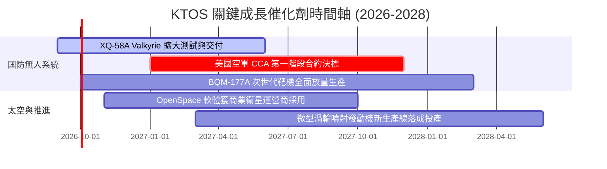

### 9.2 TAM 市場規模分析

```
╔══════════════════════════════════════════════════════════════════╗
║               KTOS 目標潛在市場 (TAM) 結構分析                   ║
╠══════════════════════════════════════════════════════════════════╣
║                                                                  ║
║  ① 協同作戰飛機 (CCA) 與無人作戰系統    TAM: $12.5B  滲透率: ~3.4% ║
║  ② 噴射動力無人靶機與武器測試評估      TAM:  $2.8B  滲透率:~18.0% ║
║  ③ 虛擬化衛星地面架構與 C5ISR          TAM:  $8.2B  滲透率: ~7.5% ║
║  ④ 極音速測試與固體火箭推進            TAM:  $4.5B  滲透率: ~6.0% ║
║                                                                  ║
║  總計可觸及市場 TAM 約 $28.0B ｜ 當前 TTM 營收 $1.52B ｜ 滲透率 5.4%║
╚══════════════════════════════════════════════════════════════════╝
```

### 9.3 成長驅動力結構圖

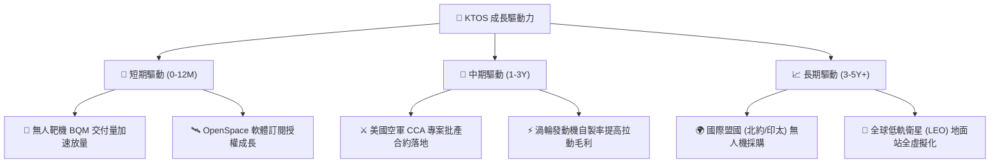

---

## 10. 風險矩陣

### 10.1 風險評分矩陣

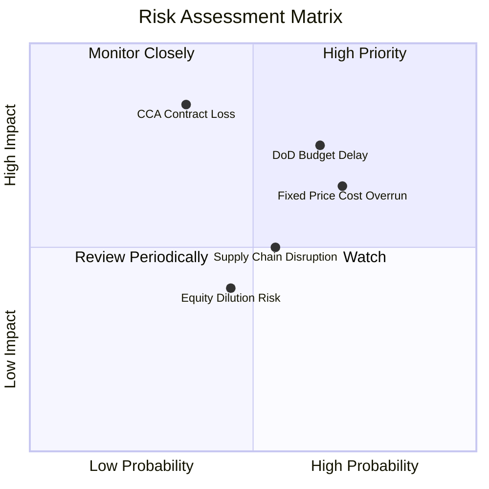

### 10.2 風險清單詳細分析

| # | 風險項目 | 發生機率 | 財務衝擊 | 風險評分 | 緩解措施與觀察重點 |
|---|----------|----------|----------|----------|--------------------|
| 1 | 🔴 **美國國防部預算撥款延宕** | 高 (65%) | 中高 (-10% 營收) | 🔴 **7.5/10** | 國會常態性通過持續決議案（CR），公司多元化佈局太空與外銷市場分散風險。 |
| 2 | 🔴 **固定價格合約成本超支** | 高 (70%) | 中度 (-200bps 營業利益率) | 🔴 **7.2/10** | 導入自動化生產設備並對關鍵原物料建立安全庫存。 |
| 3 | 🔴 **CCA 專案競標不如預期** | 中 (35%) | 極高 (-30% 長期估值) | 🔴 **7.0/10** | 即使未能獨攬主合約，仍可作為一級供應商提供次系統發動機與靶機測試服務。 |
| 4 | 🟡 **高階技術人才短缺與薪資通膨** | 中 (50%) | 中度 (-100bps 淨利率) | 🟡 **5.5/10** | 運用股權激勵留才，但需平衡股東權益稀釋。 |

---

## 11. 投資建議

### 11.1 最終綜合評級雷達圖

```
╔══════════════════════════════════════════════════════════════╗
║                    KTOS 綜合維度評估                         ║
╠══════════════════════════════════════════════════════════════╣
║ 業務成長動能  8.5 ▓▓▓▓▓▓▓▓▓▓▓▓▓▓▓▓▓░░░  ★★★★☆  強勁放量 ║
║ 財務結構安全  9.0 ▓▓▓▓▓▓▓▓▓▓▓▓▓▓▓▓▓▓░░  ★★★★★  淨現金充裕║
║ 護城河壁壘    7.2 ▓▓▓▓▓▓▓▓▓▓▓▓▓▓░░░░░░  ★★★★☆  特種獨占 ║
║ 獲利轉化能力  4.0 ▓▓▓▓▓▓▓▓░░░░░░░░░░░░  ★★☆☆☆  短期承壓 ║
║ 現金流充沛度  3.5 ▓▓▓▓▓▓▓░░░░░░░░░░░░░  ★★☆☆☆  仍在流出 ║
║ 估值安全邊際  5.5 ▓▓▓▓▓▓▓▓▓▓▓░░░░░░░░░  ★★★☆☆  空間有限 ║
╠══════════════════════════════════════════════════════════════╣
║ 綜合投資評級  🟡 中立觀望（Hold） ｜ 綜合評分：6.8 / 10      ║
╚══════════════════════════════════════════════════════════════╝
```

### 11.2 目標價與隱含報酬率

| 情境 | 目標價 | 隱含報酬率（相對現價 $47.78） | 機率權重 | 核心驅動邏輯 |
|------|--------|-------------------------------|----------|--------------|
| 🔴 **悲觀情境** | **$36.50** | **-23.6%** | 25% | 利潤率持續低迷，國防採購延宕引發估值倍數壓縮 |
| 🟡 **基準情境** | **$53.50** | **+12.0%** | 55% | 營收維持 ~18% 增長，營業利益率改善至 4-5% |
| 🟢 **樂觀情境** | **$72.00** | **+50.7%** | 20% | CCA 專案獲重大採購，OpenSpace 利潤爆發 |
| **加權預期值** | **$53.50** | **+12.0%** | 100% | 12 個月合理持有目標價 |

### 11.3 買入時機與觸發因素

```
╔══════════════════════════════════════════════════════════════════╗
║                  ✅ 買入觸發因素 Checklist                      ║
╠══════════════════════════════════════════════════════════════════╣
║                                                                  ║
║  立即買入觸發條件（需多數符合）：                                ║
║  ☐ 股價回檔至 $38.00 - $43.00 區間（安全邊際 MOS > 20%）         ║
║  ☐ 單季營業利益率回升至 4.0% 以上且維持兩季                     ║
║  ☐ 季度自由現金流（FCF）正式轉正                                 ║
║                                                                  ║
║  加碼觸發條件：                                                  ║
║  ☐ 獲得美國空軍 CCA 專案正式生產訂單                             ║
║  ☐ OpenSpace 軟體營收年增率突破 40%                             ║
║                                                                  ║
║  減碼/停損觸發條件：                                             ║
║  ☐ 單季營收年增率跌破 10%                                        ║
║  ☐ 再度進行大額股權增發導致每股盈餘顯著稀釋                      ║
║  ☐ 股價突破 $65.00 且 Forward P/E 超過 55x                       ║
╚══════════════════════════════════════════════════════════════╝
```

### 11.4 投資人適配度分析

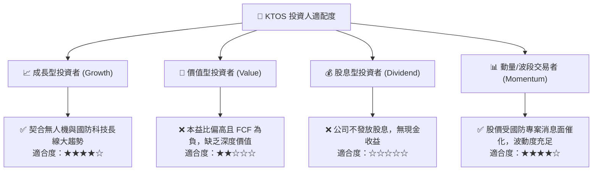

### 11.5 每季財報監控清單（Quarterly Watch List）

| 監控指標 | 基準值 (當前) | 加碼觸發門檻 (Bull) | 減碼/警戒門檻 (Bear) | 追蹤意義 |
|----------|---------------|---------------------|----------------------|----------|
| **營收年增率 (YoY)** | 30.5% | > 25.0% | < 12.0% | 檢驗無人機與衛星地面站放量動能 |
| **GAAP 營業利益率** | -0.2% | > 4.0% | < -1.5% | 衡量產能擴建後規模槓桿是否顯現 |
| **季度自由現金流 (FCF)** | -$28.2M | > +$15.0M | < -$50.0M | 評估自我造血能力與增資風險 |
| **SBC / 營收比重** | 3.55% | < 2.5% | > 5.0% | 監控股權激勵對真實股東獲利的稀釋 |
| **總現金儲備** | $1.44B | > $1.20B | < $800M | 確保研發與資本支出之安全緩衝墊 |

### 11.6 反面論證：什麼會證明論點錯誤（What Would Change My Mind）

```
╔══════════════════════════════════════════════════════════════════╗
║              ⚠️ 論點失效條件（Disconfirming Evidence）           ║
╠══════════════════════════════════════════════════════════════════╣
║  本分析報告之中立觀點在下列情況發生時應進行修正：                ║
║                                                                  ║
║  【轉為全面看多 🟢 升級為 Buy】：                                ║
║  1. 單季營業利益率連續兩季 > 5.0%，證實獲利拐點確立。             ║
║  2. 季度 FCF 轉正且年化 FCF Yield 達到 2.5% 以上。               ║
║  3. 正式奪得美國空軍 CCA 主承包商百架級別合約。                 ║
║                                                                  ║
║  【轉為全面看空 🔴 降級為 Sell】：                                ║
║  1. 核心無人機業務成長率連續兩季降至 < 8.0%。                    ║
║  2. 固定價格合約出現嚴重虧損，導致單季營業虧損超過 $2,000 萬。   ║
║  3. 帳上 $1.44B 現金進行溢價過高且缺乏協同效應之大規模收購。     ║
╚══════════════════════════════════════════════════════════════╝
```

---
> **免責聲明**：本報告為機構級研究分析模型輸出，所引述之數據與預測僅供學術研究與投資參考，不構成任何具體買賣建議。市場有風險，投資決策應依個人財務狀況與風險承受力獨立判斷。