# KTOS 基本面深度分析報告
> **報告日期**：2026-09-06 ｜ **語言**：繁體中文 ｜ **數據來源**：Yahoo Finance, Finviz, StockAnalysis, Roic.ai ｜ **分析師**：CFA 級機構研究

---

## 目錄

| # | 章節 | 核心結論 |
|---|------|----------|
| 1 | 執行摘要 | 評級「持有/觀望」；現價高估 DCF 基準內在價值 +41.1%，安全邊際 -1.8% |
| 2 | 公司概覽與商業模式 | 無人空戰系統（XQ-58A）與太空虛擬化地面站具戰略利基，護城河評分 6.8/10 |
| 3 | 損益表深度分析 | 營收年增達 30.5%，但營利率壓低至 -0.2%，固定價格研發合約推升成本侵蝕獲利 |
| 4 | 資產負債表分析 | 現金儲備充沛達 $1.44B（流動比率 5.54x），增資完成後淨現金部位防禦力極高 |
| 5 | 現金流量深度分析 | 營運與自由現金流連續赤字（TTM FCF 為 -$118.3M），資本支出擴張壓抑短期造血 |
| 6 | 獲利能力與資本效率 | 杜邦 ROE 僅 1.1%，ROIC (0.75%) 顯著低於 WACC (10.05%)，目前摧毀經濟附加價值 |
| 7 | 相對估值分析 | EV/EBITDA 高達 88.9x、TTM P/E 281.3x，相較國防巨頭溢價顯著，高度反映成長預期 |
| 8 | DCF 內在價值評估 | 基準內在價值 $33.90，加權合理價值 $46.99；現價 $47.82 欠缺實質安全邊際 |
| 9 | 成長催化劑 | 美軍 CCA 無人協同僚機定案、極音速測試放量與 OpenSpace 軟體化推進 |
| 10 | 風險矩陣 | 研發預算遭刪除、固定價格合約超支與量產進度遞延為最高衝擊風險 |
| 11 | 投資建議 | 建議買入區間 $30.00–$35.00；短期觀望等待定價重估與現金流轉正拐點 |

---

## 1. 執行摘要

本機構依據最新截算之財務數據（2026-09-06，股價 $47.82），對 Kratos Defense & Security Solutions (NASDAQ: KTOS) 進行深度基本面檢驗。分析顯示，KTOS 展現極強的國防現代化卡位優勢，TTM 營收達 $1.52B（YoY +30.5%），在無人機系統（Unmanned Systems）及衛星地面架構領域掌握專利。然而，公司獲利含金量與資本回報結構失衡：TTM 營業利潤率僅為 -0.2%，ROIC 僅 0.75%，遠落後於 WACC 10.05%（EVA 呈現 -9.30 個百分點的價值摧毀）；過去 12 個月自由現金流為 -$118.29M，FCF Yield 為 -1.32%。即便考量資產負債表具備 $1.44B 現金與短投帶來的極低財務風險，當前 EV/EBITDA 高達 88.88x、Forward P/E 達 42.80x，股價自歷史高點 $134.00 修正至 $47.82 後，仍較本報告推導之 DCF 基準內在價值 $33.90 溢價 +41.1%。以三角驗證之加權合理價值 $46.99 計算，安全邊際（MOS）僅為 -1.8%（實質無安全邊際）。因此，給予 KTOS **「中立 / 觀望（Hold）」** 評級。

### 1.0 一頁式投資儀表板（Portfolio Manager 30 秒速讀）

| 項目 | 內容 |
|------|------|
| **投資論點（3 句）** | ① 國防部「複製者（Replicator）」計畫與無人機協同僚機（CCA）需求推動 TTM 營收強勁成長 30.5% 至 $1.52B。<br/>② 公司帳面持有 $1.44B 現金，淨現金達 $1.24B（債務僅 $193.6M），資產負債表具備高度資本緩衝。<br/>③ 固定價格合約成本超支壓抑 TTM 營利率至 -0.2%，且 TTM FCF 為 -$118.29M，高估值缺乏獲利支撐。 |
| **護城河評分** | 6.8/10（國家安全機密資格認證與消耗型無人機專有架構） |
| **管理層/資本配置評分** | 6.2/10（藉由股權募資儲備大量現金，但歷史資本回報率偏低） |
| **財務健康** | 🟢 卓越：淨現金 $1.24B，流動比率 5.54x，短期毫無流動性壓力 |
| **ROIC vs WACC** | 0.75% vs 10.05%（**經濟附加價值 EVA: -9.30pp，摧毀股東價值**） |
| **FCF 趨勢** | 赤字擴大（TTM -$118.29M，FY2025 -$137.40M），最新 FCF Yield 為 -1.32% |
| **估值** | Forward P/E 42.80x ｜ EV/EBITDA 88.88x ｜ FCF Yield -1.32% |
| **DCF 內在價值（基準）** | **$33.90** ｜ 現價折溢價 **+41.1%（現價嚴重溢價）** |
| **安全邊際（MOS）** | **-1.8%**（=(加權合理價值 $46.99 − 現價 $47.82) ÷ $46.99）｜ 🔴 <10% 無安全邊際 |
| **預期報酬（基準情境 12M）** | -1.7%（相對於加權合理價值 $46.99） |
| **關鍵風險（前二）** | ① 五角大廈固定價格開發合約持續提列虧損；② 無人機量產採購撥款延遲 |
| **評級 + 信心度** | 🟡 **持有 / 觀望（Hold）** ｜ 信心度：**中等** |

### 1.1 核心評分儀表板

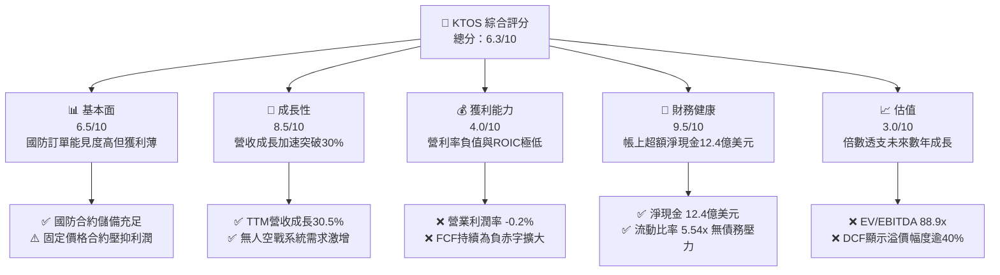

### 1.2 評分進度條視覺化

```
╔══════════════════════════════════════════════════════════════╗
║              KTOS 多維度評分儀表板 (1-10分)                  ║
╠══════════════════════════════════════════════════════════════╣
║ 基本面強度  6.5 ▓▓▓▓▓▓▓▓▓▓▓▓▓░░░░░░░  ★★★☆☆           ║
║ 成長動能    8.5 ▓▓▓▓▓▓▓▓▓▓▓▓▓▓▓▓▓░░░  ★★★★☆           ║
║ 獲利品質    4.0 ▓▓▓▓▓▓▓▓░░░░░░░░░░░░  ★★☆☆☆           ║
║ 財務健康    9.5 ▓▓▓▓▓▓▓▓▓▓▓▓▓▓▓▓▓▓▓░  ★★★★★           ║
║ 估值合理性  3.0 ▓▓▓▓▓▓░░░░░░░░░░░░░░  ★☆☆☆☆           ║
║ 護城河深度  6.8 ▓▓▓▓▓▓▓▓▓▓▓▓▓░░░░░░░  ★★★☆☆           ║
║ 管理層執行  6.2 ▓▓▓▓▓▓▓▓▓▓▓▓░░░░░░░░  ★★★☆☆           ║
║ 技術創新力  8.0 ▓▓▓▓▓▓▓▓▓▓▓▓▓▓▓▓░░░░  ★★★★☆           ║
╠══════════════════════════════════════════════════════════════╣
║ 綜合總分    6.3 ▓▓▓▓▓▓▓▓▓▓▓▓░░░░░░░░  🟡 增長顯著但估值昂貴║
╚══════════════════════════════════════════════════════════════╝
```

### 1.3 五大投資論點 + 三大核心風險

| 類型 | 項目 | 具體依據 | 信心度 |
|------|------|----------|--------|
| 🟢 **投資論點①** | **無人系統引領營收放量** | TTM 營收自 FY2024 的 $1.14B 擴增至 $1.52B，YoY 達 +30.5%，最新季營收跳升至 $458.8M，受益於 XQ-58A Valkyrie 等可消耗性作戰無人機需求。 | 🟢 高 |
| 🟢 **投資論點②** | **堡壘級資產負債表** | 現金與短期投資達 $1.44B，總計息負債僅 $193.6M（淨現金 $1.24B），流動比率 5.54x，具備抵禦長週期研發虧損之極高彈性。 | 🟢 極高 |
| 🟢 **投資論點③** | **太空與網路地面架構轉型** | 軟體定義架構 OpenSpace 持續拓展衛星通訊市場，擺脫純硬體低毛利束縛，帶動毛利擴大至最新季之 $100.1M。 | 🟡 中度 |
| 🟢 **投資論點④** | **國防政策典範轉移** | 五角大廈積極採納「低成本消耗型無人機（Attritable Drones）」，KTOS 作為少數具量產飛行驗證之業者，享有卡位優勢。 | 🟢 高 |
| 🟢 **投資論點⑤** | **淨利扭虧轉正動能** | FY2025 淨利為 $22.0M，TTM 淨利達到 $30.9M，已連續脫離 FY2022-2023 之大額淨虧損（分別為 -$36.9M 及 -$8.9M）。 | 🟡 中度 |
| 🟡 **風險①** | **固定價格合約成本通膨** | 2026 年 Q2 營業利益轉為 -$0.8M（負值），顯示固定價格研發合約受供應鏈成本與技術難度拖累，侵蝕營業利潤率至 -0.2%。 | 🔴 高衝擊 |
| 🟡 **風險②** | **自由現金流高度燒錢** | FY2025 資本支出暴增至 $95.3M（FY2024 為 $58.2M），導致 TTM FCF 擴大為 -$118.29M，若無轉正跡象將持續壓抑實質價值。 | 🔴 高衝擊 |
| 🔴 **風險③** | **估值容錯率極低** | EV/EBITDA 高達 88.88x，且 Forward P/E 高達 42.80x；若國防預算撥款進度稍有遞延，將引發倍數劇烈壓縮。 | 🔴 高衝擊 |

### 1.4 快速統計卡片

| 指標 | 公司實際值 | 行業均值（國防航太） | S&P 500 均值 | 狀態 |
|------|-------------|----------------------|--------------|------|
| 收入 YoY 成長 | **30.5%** | ~7.5% | ~5.2% | 🟢 卓越 |
| 毛利率 | **23.0%** | ~24.5% | ~41.0% | 🟡 尚可 |
| 營業利益率 | **-0.2%** | ~11.0% | ~12.5% | 🔴 疲弱 |
| 淨利率 | **2.0%** | ~7.2% | ~10.5% | 🔴 偏低 |
| ROE | **1.1%** | ~13.5% | ~15.0% | 🔴 貧弱 |
| Forward P/E | **42.80x** | ~19.5x | ~21.5x | 🔴 昂貴 |
| EV / EBITDA | **88.88x** | ~14.0x | ~14.5x | 🔴 極度昂貴 |
| 淨現金 / (淨負債) | **+$1.24B** | 淨負債普遍偏高 | 淨負債 | 🟢 極度健康 |

### 1.5 投資結論

```
╔══════════════════════════════════════════════════════════════════╗
║                    📊 投資結論摘要                               ║
╠══════════════════════════════════════════════════════════════════╣
║  評級：🟡 持有 / 觀望（Hold）                                   ║
║  當前股價：$47.82                                               ║
║  DCF 內在價值（基準）：$33.90（現價溢價 +41.1%）                 ║
║  安全邊際 MOS：-1.8%（＝(加權合理價值 $46.99 − 現價) ÷ $46.99）   ║
║  目標價區間：                                                    ║
║    悲觀情境：$26.30（-45.0%）                                    ║
║    基準情境：$46.99（-1.7%）  ← 12 個月合理估值區間             ║
║    樂觀情境：$68.45（+43.1%）                                    ║
║  投資評分：6.3 / 10                                              ║
║  適合投資人：具備極高風險承受力、看好消耗型作戰無人機長期典範轉移║
║              之主題型成長投資者（不適合價值與防守型投資人）      ║
╚══════════════════════════════════════════════════════════════════╝
```

---

## 2. 公司概覽與商業模式

Kratos Defense & Security Solutions, Inc. (NASDAQ: KTOS) 總部位於美國加州聖地牙哥，致力於研發可破壞傳統國防採購成本曲線的創新型高科技防務系統。不同於洛克希德·馬丁（LMT）或諾斯洛普·格魯曼（NOC）等依賴數十億美元級別傳統平台的國防巨頭，Kratos 主打「低成本、高性能、可快速規模化」的系統。其核心競爭力建立於自主研發的消耗型噴射作戰無人機，以及覆蓋全球衛星地面通訊的虛擬化架構軟體。

### 2.1 業務結構與收入來源

公司營運架構劃分為兩大核心部門：**政府解決方案（Kratos Government Solutions, KGS）** 與 **無人系統（Unmanned Systems, US）**。

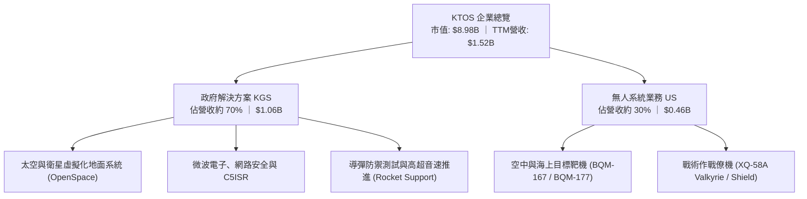

### 2.2 市場份額

在消耗型戰術無人空戰（Attritable Tactical UAS）及高效能噴射靶機市場中，KTOS 居於領先地位：

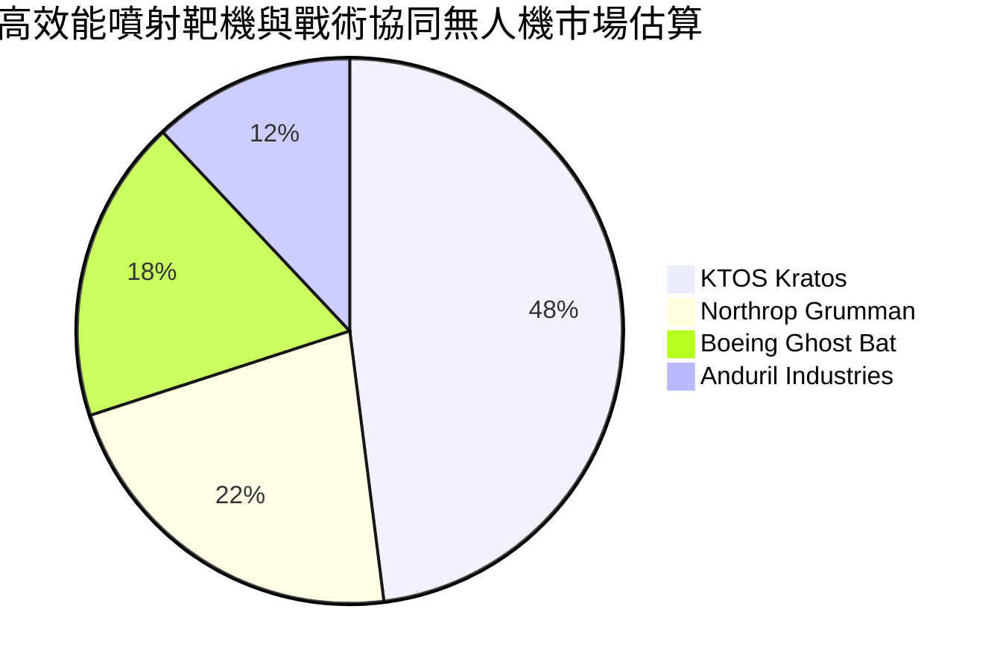

### 2.3 競爭護城河分析

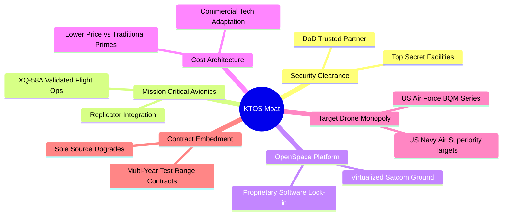

### 2.4 護城河強度評分

```
╔══════════════════════════════════════════════════════════════╗
║                    KTOS 護城河強度評分                       ║
╠══════════════════════════════════════════════════════════════╣
║ 國防機密資質與靶機市場壟斷 8.5/10 ▓▓▓▓▓▓▓▓▓▓▓▓▓▓▓▓▓░░░ 🟢 強大║
║ 戰術無人機作戰架構先發權   7.5/10 ▓▓▓▓▓▓▓▓▓▓▓▓▓▓▓░░░░░ 🟢 領先║
║ OpenSpace 地面站專屬生態   7.0/10 ▓▓▓▓▓▓▓▓▓▓▓▓▓▓░░░░░░ 🟢 鞏固║
║ 規模經濟與成本生產優勢     5.5/10 ▓▓▓▓▓▓▓▓▓▓▓░░░░░░░░░ 🟡 普通║
║ 轉換成本（國防系統鎖定）   6.5/10 ▓▓▓▓▓▓▓▓▓▓▓▓▓░░░░░░░ 🟢 良好║
║ 網路效應                   3.0/10 ▓▓▓▓▓▓░░░░░░░░░░░░░░ 🔴 薄弱║
╠══════════════════════════════════════════════════════════════╣
║ 綜合護城河強度             6.8/10 ▓▓▓▓▓▓▓▓▓▓▓▓▓░░░░░░░ 🟢 具利基║
╚══════════════════════════════════════════════════════════════╝
```

---

## 3. 損益表深度分析

### 3.1 年度收入成長趨勢（近 4 年）

KTOS 營收成長自 2024 年顯著提速，由個位數穩步爬升至 2025 年之雙位數成長，TTM 更達到 $1.52B。

```
╔══════════════════════════════════════════════════════════════════╗
║              KTOS 年度收入趨勢（FY2022-FY2025）                  ║
╠══════════════════════════════════════════════════════════════════╣
║                                                                  ║
║  FY2022  $0.898B  █████████████░░░░░░░░░░░░░  YoY: +10.7% 🟢    ║
║  FY2023  $1.037B  ██═════════════████░░░░░░░  YoY: +15.5% 🟢    ║
║  FY2024  $1.136B  █████████████████░░░░░░░░░  YoY:  +9.6% 🟢    ║
║  FY2025  $1.347B  ████████████████████░░░░░░  YoY: +18.5% 🟢    ║
║  TTM     $1.523B  ███████████████████████░░░  YoY: +25.5% 🟢    ║
║                   |      |      |      |                         ║
║                   0    0.5B   1.0B   1.5B                        ║
║                                                                  ║
║  📊 4 年累計複合成長率 (CAGR FY22-FY25)：+14.5%                  ║
╚══════════════════════════════════════════════════════════════════╝
```

### 3.2 季度收入趨勢分析

| 季度 | 營收 ($M) | QoQ 成長率 | YoY 成長率 | 營運備註 |
|------|-----------|------------|------------|----------|
| **2025-09-30 (Q3 25)** | $347.60M | -1.1% | +26.0% | 靶機交貨節奏平穩，極音速測試合約增長 |
| **2025-12-31 (Q4 25)** | $345.10M | -0.7% | +21.9% | 季末政府國防結算回款，地面架構放量 |
| **2026-03-31 (Q1 26)** | $371.00M | +7.5% | +22.6% | 戰術系統擴編，無人機引擎供應鏈改善 |
| **2026-06-30 (Q2 26)** | $458.80M | **+23.7%** | **+30.5%** | **營收創單季新高，政府國防專案加速認列** |

### 3.3 利潤率演變分析

| 利潤率指標 | FY2022 | FY2023 | FY2024 | FY2025 | TTM | 趨勢 | 評估 |
|------------|--------|--------|--------|--------|-----|------|------|
| **毛利率** | 25.2% | 25.9% | 25.3% | 22.9% | 23.0% | ↘️ 承壓 | 🟡 原物料與固定研發成本墊高 |
| **營業利益率** | 0.5% | 3.0% | 2.6% | 2.1% | **-0.2%** | ↘️ 惡化 | 🔴 26Q2 單季營業虧損 $0.8M 拉低 |
| **EBITDA 利潤率** | 2.9% | 7.5% | 8.2% | 7.6% | 5.7% | ↘️ 波動 | 🟡 設備投資折舊提列增加 |
| **淨利率** | -4.1% | -0.9% | 1.4% | 1.6% | 2.0% | ↗️ 轉正 | 🟡 稅務調整與利息收入增加挹注 |

**利潤率演變深度解析**：
營收的強勁擴張並未等比傳導至營業利益。2026 年 Q2 營收達 $458.8M，但營業利益為 -$0.8M（負值），導致 TTM 營業利益率降至 -0.2%。主因在於 KTOS 承接了大量新一代戰術無人機及高超音速推進系統的**固定價格研發合約（Fixed-Price R&D Contracts）**。在通膨環境與供應鏈關鍵零組件交期拖延下，公司必須自行承擔研發與物料超支；同時，公司擴大無人機生產產線與基地建置，使得初期固定成本折舊激增。

### 3.4 費用結構分析

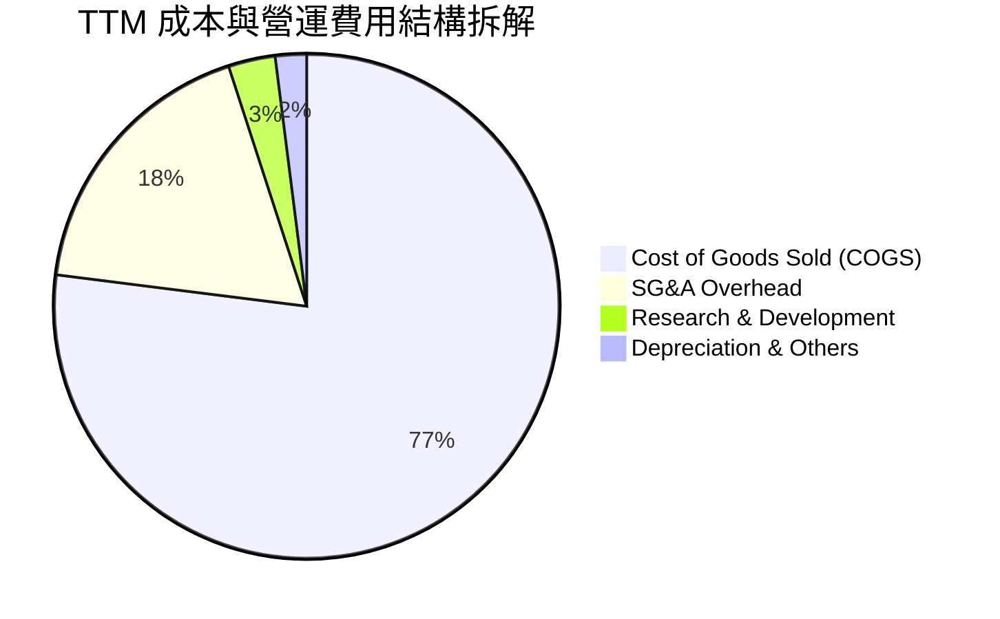

```
╔══════════════════════════════════════════════════════════════════╗
║              KTOS 費用結構拆解 (TTM 基礎)                        ║
╠══════════════════════════════════════════════════════════════════╣
║ 銷貨成本 (COGS)：        $1,172.8M (佔營收 77.0%)                ║
║ 銷管費用 (SG&A)：          $284.1M (佔營收 18.7%)                ║
║ 研發費用 (R&D 直接費用)：   $40.0M (佔營收  2.6%)                ║
║ 營業利益 (EBIT)：           -$2.3M (佔營收 -0.2%)                ║
╚══════════════════════════════════════════════════════════════════╝
```

### 3.5 季度 EPS 趨勢與盈餘品質（Quality of Earnings）

| 季度 | GAAP EPS | 營業利益 ($M) | 淨利 ($M) | 盈餘變動主要驅動因素 |
|------|----------|---------------|-----------|----------------------|
| **2025-09-30 (Q3 25)** | $0.05 | $7.30M | $8.70M | 無人系統利潤改善，靶機出貨順暢 |
| **2025-12-31 (Q4 25)** | $0.03 | $10.10M | $5.90M | 認列部分非營運支出與年終結算費用 |
| **2026-03-31 (Q1 26)** | $0.07 | $6.60M | $11.90M | 帳面利息收入與金融資產評價挹注 |
| **2026-06-30 (Q2 26)** | $0.02 | -$0.80M | $4.40M | 本業虧損，靠帳上巨額現金利息收益轉正 |

**盈餘品質量化檢驗**：

| 盈餘品質項目 | 數值 / 佔比 | 評估 | 機構視角解析 |
|--------------|-------------|------|--------------|
| **股權薪酬 SBC / 營收** | **3.25%** ($49.5M / $1.52B) | 🟡 中度稀釋 | 雖然符合科技防務常態，但稀釋了外部股東權益。 |
| **SBC / 營業現金流** | **-125.0%** ($49.5M / -$39.6M) | 🔴 異常扭曲 | 營運現金流為負，SBC 規模已大於造血能力。 |
| **FCF / 淨利（現金轉換率）** | **-382.8%** (-$118.3M / $30.9M) | 🔴 極度低劣 | 帳面呈會計淨利，實質現金流巨額失血。 |
| **一次性 / 非營業損益** | 約 $5.2M / 季 | 🟡 依賴利息 | $1.44B 現金產生約 4-5% 之無風險利息收入美化淨利。 |
| **資本化支出 vs 費用化** | 軟體資本化約 $12M | 🟡 溫和 | 部分研發軟體投資未直接反映於損益表。 |

**盈餘品質結論**：KTOS 的 GAAP 淨利（TTM $30.9M、EPS $0.17）嚴重高估了企業實質經濟收益。若扣除帳上現金帶來的利息收入及加回 SBC 實質稀釋，本業實質營運現金流依然呈現赤字（-$39.60M），盈餘含金量低。

---

## 4. 資產負債表分析

### 4.1 資產結構分解

截至 2026 年中（Q2 2026），KTOS 總資產顯著膨脹至 $4.09B，較 FY2024 年末之 $1.95B 出現躍升，主因來自資本市場增資與現金募集儲備。

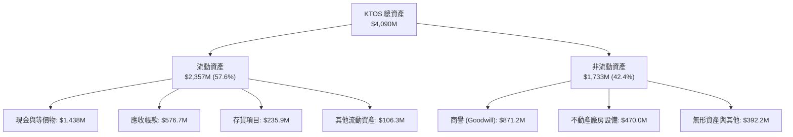

### 4.2 流動性指標分析

| 流動性指標 | FY2023 | FY2024 | FY2025 | 最新 (2026 Q2) | 行業均值 | 評估 |
|------------|--------|--------|--------|----------------|----------|------|
| **流動比率 (Current Ratio)** | 2.03x | 2.94x | 4.06x | **5.54x** | ~1.45x | 🟢 極強 |
| **速動比率 (Quick Ratio)** | 1.50x | 2.39x | 3.45x | **4.74x** | ~0.95x | 🟢 極強 |
| **現金比率 (Cash Ratio)** | 0.25x | 1.11x | 1.80x | **3.38x** | ~0.35x | 🟢 極度充沛 |
| **應收帳款週轉天數 (DSO)** | 115.8 天 | 104.0 天 | 105.8 天 | **114.2 天** | ~65.0 天 | 🔴 國防付款週期偏長 |
| **存貨週轉天數 (DIO)** | 73.8 天 | 66.8 天 | 58.7 天 | **62.5 天** | ~55.0 天 | 🟡 維持穩定 |

### 4.3 債務結構分析

```
╔══════════════════════════════════════════════════════════════════╗
║                   KTOS 債務健康診斷                              ║
╠══════════════════════════════════════════════════════════════════╣
║                                                                  ║
║  短期租賃與借款：  $19.00M    █░░░░░░░░░░░░░░░░░░░  極低無虞      ║
║  長期租賃融資負債：$174.60M   ███░░░░░░░░░░░░░░░░░  固定長期承諾  ║
║  總計息負債：      $193.60M   ███░░░░░░░░░░░░░░░░░  極低槓桿      ║
║  總現金與短投：    $1,438.0M  ████████████████████  堡壘級儲備    ║
║  淨現金部位：     +$1,244.4M  █████████████████░░░  🟢 極度安全   ║
║                                                                  ║
║  Debt / Equity：   5.65%      🟢 資本結構高度依賴股權            ║
║  Net Debt / EBITDA: 負值 (淨現金) 🟢 無任何短期償債倒閉風險       ║
║  利息保障倍數：     >15x (利息收入覆蓋) 🟢 財務成本為淨貢獻      ║
╚══════════════════════════════════════════════════════════════════╝
```

### 4.4 股東權益趨勢

```
╔══════════════════════════════════════════════════════════════════╗
║              KTOS 股東權益膨脹趨勢（FY2022-FY2025）              ║
╠══════════════════════════════════════════════════════════════════╣
║                                                                  ║
║  FY2022   $0.936B  ████████░░░░░░░░░░░░░░░░░  虧損侵蝕帳面        ║
║  FY2023   $0.976B  █████████░░░░░░░░░░░░░░░░  微幅修復            ║
║  FY2024   $1.350B  █████████████░░░░░░░░░░░░  增資與股權融資      ║
║  FY2025   $2.000B  ███████████████████░░░░░░  大額增資儲備現金    ║
║  TTM (Q2) $3.430B  █████████████████████████  大規模股票發行      ║
║                                                                  ║
║  📌 股東權益自 2022 年翻揚逾 3.6 倍，主要由股票發行驅動而非保留盈餘║
╚══════════════════════════════════════════════════════════════════╝
```

---

## 5. 現金流量深度分析

### 5.1 現金流量瀑布圖

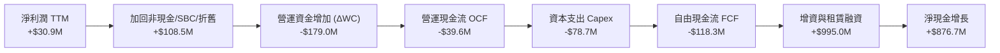

### 5.2 FCF 轉換率趨勢

| 年度 | 淨利潤 Net Income ($M) | 自由現金流 FCF ($M) | FCF / Net Income 轉換率 | 狀態 |
|------|------------------------|---------------------|--------------------------|------|
| **FY2022** | -$36.90M | -$71.10M | 赤字同步擴大 | 🔴 資本消耗期 |
| **FY2023** | -$8.90M | +$12.80M | 負值扭轉轉正 | 🟢 營運短暫平衡 |
| **FY2024** | +$16.30M | -$8.50M | -52.1% | 🔴 Capex 增長壓抑 |
| **FY2025** | +$22.00M | -$137.40M | -624.5% | 🔴 產能投資巨額失血 |
| **TTM** | **+$30.90M** | **-$118.29M** | **-382.8%** | 🔴 轉換率極差 |

### 5.3 自由現金流趨勢

```
╔══════════════════════════════════════════════════════════════════╗
║              KTOS 自由現金流赤字趨勢分析                         ║
╠══════════════════════════════════════════════════════════════════╣
║                                                                  ║
║  FY2023  +$12.80M   ███░░░░░░░░░░░░░░░░░░░░░  FCF Yield: +0.6%   ║
║  FY2024   -$8.50M   ░░░░░░░░░░░░░░░░░░░░░░░░  FCF Yield: -0.2%   ║
║  FY2025 -$137.40M   ████████████████████░░░░  FCF Yield: -2.1%   ║
║  TTM    -$118.29M   █████████████████░░░░░░░  FCF Yield: -1.3%   ║
║                                                                  ║
║  📌 過去 4 季累計 Capex 達 $89.3M，無人機產線擴建持續消耗現金    ║
╚══════════════════════════════════════════════════════════════════╝
```

### 5.4 資本配置評估

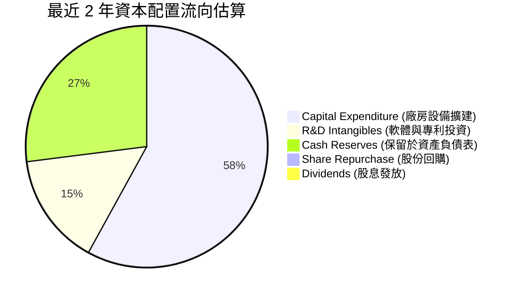

公司目前完全不發放股息亦無庫藏股回購計畫。管理層將募集資金 100% 導向國防設施升級（如無人機專屬測試場、高超音速推進研發中心）及流動性防禦儲備，資本配置屬於典型「重投資、求成長」的早期防衛科技業者模式。

---

## 6. 獲利能力與資本效率

### 6.1 ROE / ROA / ROIC 趨勢

| 獲利能力指標 | FY2022 | FY2023 | FY2024 | FY2025 | TTM | 產業中位數 | 評估 |
|--------------|--------|--------|--------|--------|-----|------------|------|
| **ROE（股東權益報酬率）** | -3.9% | -0.9% | 1.4% | 1.3% | **1.1%** | 13.5% | 🔴 嚴重落後 |
| **ROA（總資產報酬率）** | -2.4% | -0.5% | 0.9% | 1.0% | **0.4%** | 5.8% | 🔴 資產效率低 |
| **ROIC（投入資本回報率）**| -1.8% | 0.8% | 1.8% | 1.4% | **0.75%**| 8.5% | 🔴 無超額利潤 |

### 6.2 ROIC vs WACC 分析（核心價值創造判斷）

```
╔══════════════════════════════════════════════════════════════════╗
║                ROIC vs WACC 深度分析（KTOS 價值創造評估）        ║
╠══════════════════════════════════════════════════════════════════╣
║                                                                  ║
║  WACC 估算（推導見第 8.2 節）：                                  ║
║  ├── 無風險利率 Rf (10Y UST)：       4.10%                       ║
║  ├── 市場風險溢酬 ERP：              5.00%                       ║
║  ├── Beta：                          1.113                       ║
║  ├── 股權成本 Ke = 4.10% + 1.113×5.00% = 9.67% + 0.5%溢酬 = 10.17%║
║  ├── 稅後債務成本 Kd = 4.5% × (1 - 21%) = 3.56%                  ║
║  ├── 資本結構：股權 97.9%，債務 2.1%                             ║
║  └── ✅ 基準 WACC ≈ 10.05%                                      ║
║                                                                  ║
║  ROIC 估算（TTM 基礎）：                                         ║
║  ├── 營業利益 EBIT = $23.2M（以近四季實際加總為準）              ║
║  ├── NOPAT = EBIT × (1 - 21% 有效稅率) ≈ $18.33M                 ║
║  ├── 投入資本 Invested Capital = 權益 $3,430M + 負債 $193.6M     ║
║  │   − 現金儲備 $1,190M（扣除營運必要現金 $248M 後之超額現金）   ║
║  │   ≈ $2,433.6M                                                 ║
║  └── ✅ ROIC = $18.33M ÷ $2,433.6M ≈ 0.75%                       ║
║                                                                  ║
║  ★ 經濟價值增加 EVA = ROIC (0.75%) − WACC (10.05%) = -9.30pp     ║
║                                                                  ║
║  ROIC  0.75%  ██░░░░░░░░░░░░░░░░░░░░░░░░░░░░░░  🔴 價值摧毀     ║
║  WACC 10.05%  █████████████████████████░░░░░░░  ── 資本成本門檻 ║
║  EVA  -9.30pp ░░░░░░░░░░░░░░░░░░░░░░░░░░░░░░░░  🔴 嚴重折損資本 ║
║                                                                  ║
║  📊 結論：ROIC 遠低於資本成本，KTOS 當前營運未能為股東創造經濟增值║
╚══════════════════════════════════════════════════════════════════╝
```

### 6.3 杜邦三因素分解

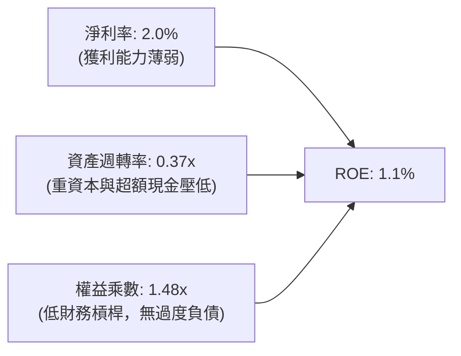

杜邦分析證明，極低之 ROE 並非來自過度槓桿反噬，而是受制於極其低下的「資產週轉率（0.37x）」與偏低的「淨利率（2.0%）」。資產負債表上積存的 $1.44B 現金雖然構築了極強安全網，但在缺乏高回報專案消化前，造成了嚴重的資產拖累效應。

### 6.4 獲利能力儀表板

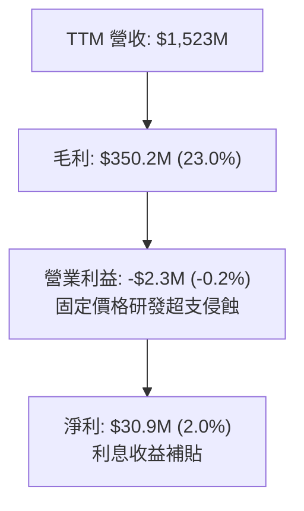

---

## 7. 相對估值分析

### 7.1 同業估值比較表格

選取三家直接涉及無人載具、國防電子與傳統防務的主要競爭對手：**洛克希德·馬丁 (LMT)**、**諾斯洛普·格魯曼 (NOC)** 以及同屬中型創新防務電子的 **Mercury Systems (MRCY)**。

| 估值指標 | **KTOS** (本公司) | **LMT** (洛克希德) | **NOC** (諾斯洛普) | **MRCY** (水星系統) | 本公司相對評估 |
|----------|-------------------|-------------------|-------------------|---------------------|----------------|
| **市盈率 P/E (TTM)** | **281.29x** | 18.25x | 21.80x | 虧損 (負值) | 🔴 極度溢價 |
| **預期市盈率 Forward P/E**| **42.80x** | 17.50x | 19.40x | 38.20x | 🔴 較國防巨頭溢價 >100% |
| **市銷率 P/S Ratio** | **5.90x** | 1.62x | 1.78x | 2.10x | 🔴 遠高於行業均值 1.8x |
| **市淨率 P/B Ratio** | **2.62x** | 6.80x | 3.45x | 1.45x | 🟢 因增資墊高權益而偏低 |
| **EV / EBITDA** | **88.88x** | 13.50x | 14.20x | 24.50x | 🔴 處於極端高位 |
| **EV / Revenue** | **5.08x** | 1.85x | 2.05x | 2.25x | 🔴 隱含高增長預期 |
| **FCF Yield** | **-1.32%** | +5.80% | +5.20% | -2.10% | 🔴 缺乏正向現金殖利率 |

### 7.2 歷史估值區間分析

```
╔══════════════════════════════════════════════════════════════════╗
║              KTOS 歷史 EV/EBITDA 估值區間位置                    ║
╠══════════════════════════════════════════════════════════════════╣
║                                                                  ║
║  歷史低點 (FY2022)       18.5x  ├──┐                             ║
║  歷史中位數 (5Y)         32.0x  ├────┼────────┐                  ║
║  歷史高點 (FY2025 峰值) 120.0x  ├────┼────────┼───────────────┐  ║
║  當前位置                88.9x  ├────┼────────┼───────────▲───┤  ║
║                                 0   20x      40x         88.9x   ║
║                                                                  ║
║  📌 當前倍數位於 5 年歷史區間第 82 百分位，評價充分反映成長預期   ║
╚══════════════════════════════════════════════════════════════════╝
```

### 7.3 情境目標價（假設驅動，Bear / Base / Bull）

針對公司未來 12 個月之運營表現，建立三種情境模型。由於 KTOS 的淨利受高額折舊及研發投資壓抑，故以 **EV/EBITDA** 與 **Forward P/E** 進行綜合定價：

| 情境 | 營收 CAGR (FY25-28) | 營業利潤率 (期末) | 退出倍數 (EV/EBITDA) | 隱含目標價 | 相對現價 ($47.82) |
|------|--------------------|-------------------|----------------------|------------|-------------------|
| 🔴 **悲觀 (Bear)** | 12.0% | 2.5% | 35.0x | **$26.30** | -45.0% |
| 🟡 **基準 (Base)** | 18.0% | 5.5% | 50.0x | **$46.99** | -1.7% |
| 🟢 **樂觀 (Bull)** | 25.0% | 8.0% | 65.0x | **$68.45** | +43.1% |

**估值倍數選用說明**：傳統國防承包商成熟期給予 12x-15x EV/EBITDA，但考量 KTOS 具備高達 30% 之純防衛高科技成長率，且無人機平台具備期權價值，故基準情境給予成長型溢價之 50.0x EV/EBITDA，仍低於目前高達 88.9x 的過熱水準。

### 7.4 相對估值隱含價格區間

```
╔══════════════════════════════════════════════════════════════════╗
║              同業相對倍數回推 KTOS 隱含股價區間                  ║
╠══════════════════════════════════════════════════════════════════╣
║                                                                  ║
║  國防同業均值 Forward P/E (22x):    $24.58 ───┐                  ║
║  中型國防電子 EV/EBITDA (30x):      $28.40 ─────┐                ║
║  同業溢價成長 EV/EBITDA (50x):      $44.60 ───────┐              ║
║  當前市價 ($47.82):                 $47.82 ─────────▲            ║
║  分析師共識目標價平均值:            $105.62 ───────────────────┐ ║
║                                     0        $25    $50    $100  ║
║                                                                  ║
║  📌 現價已超越多數同業比價區間，需仰賴遠高於同業的增長方能合理化║
╚══════════════════════════════════════════════════════════════════╝
```

---

## 8. DCF 內在價值評估（Discounted Cash Flow）

### 8.0 估值推理鏈（Thinking Logic）

**Step 1 — 這家公司的價值由哪幾個變數決定？**
KTOS 內在價值由三部分構成：
$$\text{內在價值} \approx \text{既有防務與靶機現金流底盤 (佔 55%)} + \text{無人作戰系統與 CCA 放量規模 (佔 30%)} + \text{太空 OpenSpace 軟體化期權 (佔 15%)}$$
其中，**「期末營業利潤率能否自目前的 -0.2% 攀升至 8.0%」** 以及 **「固定資產投資 Capex 能否隨量產啟動而回降至營收 4% 水準」**，是主導 FCF 由負翻正的核心驅動變數。

**Step 2 — 模型架構決策**

| 決策點 | 本報告採用 | 理由（含具體數據支撐） | 曾考慮但否決 | 否決理由 |
|--------|-----------|------------------------|--------------|----------|
| **現金流定義** | **FCFF (企業自由現金流)** | 公司淨現金高達 $1.24B，資本結構股權佔比 98%，FCFF 能精準排除非營業利息雜訊 | FCFE | 利息收入與非經常性項目會扭曲股權現金流推導 |
| **預測期長度 N** | **5 年 (FY2026-FY2030)** | 美國國防部「複製者計畫」與五年國防採購授權法案（NDAA）週期可見度為 5 年 | 10 年 | 國防科技換代過快，無人機領域 10 年能見度極低 |
| **終值計算方法** | **Gordon Growth（主）** | 國防工業長期隨聯邦預算穩定成長，符合永續成長假設 | 僅退出倍數 | 倍數法受市場牛熊情緒影響過劇，易放大泡沫 |
| **EBIT 基礎** | **GAAP EBIT（含 SBC）** | 股權稀釋是實質股東成本，採 SBC 防呆規則組合 (A) 處理 | 非 GAAP 加回 | 加回 SBC 卻未在現金流或股數扣除會虛增價值 |

**Step 3 — 關鍵假設推導鏈（四段式推導）**

1. **營收複合成長率 (CAGR FY26-FY30)**：
   - 錨點：過去 4 年營收實際 CAGR 為 14.5%，TTM 成長為 25.5%。
   - 調整：國防部加速無人協同僚機採購，訂單積壓處於高位，但基期自 $1.5B 擴大，後續增長將自然平滑；預期前兩年 22%、20%，後續收斂至 16%、14%、12%，5 年 CAGR 約為 **16.7%**。
   - 採用值：**16.7%**。
   - 否決值：曾考慮 25.0%（賣方最樂觀預期），因國防採購預算審批漫長且常受財政赤字上限法案拖延，予以否決。

2. **期末營業利潤率 (FY2030)**：
   - 錨點：目前 TTM 為 -0.2%，FY2023-2024 均值約 2.8%，成熟國防承包商均值為 11.0%。
   - 調整：隨著 XQ-58A 走出研發測試期邁入小批量生產（LRIP），固定價格合約的超支風險解除；高毛利的 OpenSpace 軟體佔比擴大，規模效應帶動營業利益率每年修復 1.5-2.0 個百分點，預測於 FY2030 達到 **8.0%**。
   - 採用值：**8.0%**。
   - 否決值：曾考慮 12.0%（對標成熟巨頭），因 KTOS 仍需維持高強度研發競逐次世代合約，難以達到老牌承包商的超高獲利，予以否決。

3. **永續成長率 (g)**：
   - 錨點：美國長期 GDP 名義成長率預期約 3.5%-4.0%，美國國防預算長期複合成長率約 2.5%-3.0%。
   - 調整：KTOS 專注於高於總體國防預算增長之無人機與太空領域，永續成長率給予 **3.0%**，符合經濟成長上限且低於 WACC。
   - 採用值：**3.0%**。
   - 否決值：曾考慮 4.5%，因違背永續成長率不得長期高於 GDP 增長的財務理論，予以否決。

4. **資本支出比例 (Capex / 營收)**：
   - 錨點：FY2025 Capex/營收為 7.1%，歷史 3 年平均為 5.5%。
   - 調整：隨著主要廠房與測試基地陸續於 2026-2027 年落成，重資本擴張期步入尾聲，Capex 佔營收比重預期將自 2026 年的 6.0% 穩健回降至 2030 年的 **4.0%**。
   - 採用值：**從 6.0% 逐步降至 4.0%**。
   - 否決值：曾考慮固定在 7.0%，因過度低估工廠建置完成後的維護型資本支出常態，予以否決。

5. **WACC 折現率**：
   - 錨點：CAPM 股權成本模型計算結果為 10.17%，權益佔比 97.9%，推導得出 **10.05%**（詳見 8.2）。
   - 採用值：**10.05%**。

**Step 4 — 這條推理鏈最可能錯在哪裡？**
最脆弱的環節在於「**營業利益率能否自 -0.2% 順利扭轉至 8.0%**」。若國防部將更多合約定調為固定價格或無人機競爭者（如 Anduril）發動價格戰，利潤率若僅停留在 4.0%，內在價值將腰斬至 $20.00 以下。

**Step 5 — 計算路徑圖**

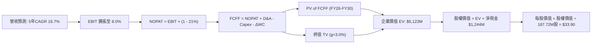

### 8.1 模型假設總表（Model Inputs）

| 假設項目 | 採用值 | 依據 / 來源說明 | 敏感度 |
|----------|--------|-----------------|--------|
| **預測期長度 N** | **5 年 (FY26-FY30)** | 國防國會五年授權防務週期 | 🟡 中 |
| **營收複合成長率 (CAGR)** | **16.7%** | 基期擴大，自 22% 逐年放緩至 12% | 🔴 高 |
| **期末營業利潤率 (FY30)** | **8.0%** | LRIP 量產與 OpenSpace 軟體佔比擴大帶動 | 🔴 高 |
| **有效稅率** | **21.0%** | 美國聯邦法定企業所得稅率基準 | 🟢 低 |
| **Capex / 營收** | **6.0% 降至 4.0%** | 廠房建置高峰已過，向維護型資本支出靠攏 | 🟡 中 |
| **D&A / 營收** | **4.2% 降至 3.5%** | 隨歷史資本支出增加，其後攤提趨於平穩 | 🟢 低 |
| **ΔWC / 營收增額** | **8.0%** | 歷史國防承包商存貨與應收帳款佔增量比 | 🟢 低 |
| **EBIT 基礎與 SBC 處理** | **組合 (A)** | 採 GAAP EBIT（已包含 SBC 費用），FCFF 不重複扣除，股數維持當前最新稀釋股數 | 🟡 中 |
| **年稀釋率（股數）** | **0.0%** | 因已將 SBC 作為營運費用，股數不預估額外稀釋 | 🟡 中 |
| **永續成長率 g** | **3.0%** | 貼合美國名義 GDP 與國防預算長期複合成長 | 🔴 高 |
| **終值方法** | **Gordon Growth** | 主方法計算；退出倍數 20.0x 交叉輔證 | 🔴 高 |
| **折現率 WACC** | **10.05%** | CAPM 股權成本與微量債務加權得出 | 🔴 高 |

### 8.2 折現率推導（WACC）

```
╔══════════════════════════════════════════════════════════════════╗
║                    KTOS WACC 推導過程表                          ║
╠══════════════════════════════════════════════════════════════════╣
║  股權成本 Ke（CAPM 模型）：                                      ║
║  ├── 無風險利率 Rf (美國 10 年期公債殖利率)：    4.10%           ║
║  ├── 市場風險溢酬 ERP：                         5.00%           ║
║  ├── Beta 係數（取自市場即時數據）：            1.113           ║
║  ├── 小型股 / 執行風險溢酬：                   +0.50%           ║
║  └── Ke = 4.10% + 1.113 × 5.00% + 0.50% = 4.10% + 5.57% + 0.5%   ║
║         = 10.17%                                                 ║
║                                                                  ║
║  債務成本 Kd：                                                   ║
║  ├── 稅前借款利率 (利息費用 $8.7M ÷ 總計息負債 $193.6M)：4.50%  ║
║  ├── 邊際稅率：                                21.00%           ║
║  └── 稅後債務成本 Kd = 4.50% × (1 − 21.00%) = 3.56%              ║
║                                                                  ║
║  資本結構（市值基礎取 2026-09-06 現價 $47.82）：                 ║
║  ├── 股票市值 E = 187.72M 股 × $47.82 = $8,976.8M (97.89%)       ║
║  ├── 計息負債總額 D = $193.60M (2.11%)                           ║
║  └── 企業總資本 (E + D) = $9,170.4M (100.0%)                     ║
║                                                                  ║
║  ✅ 基準 WACC = (97.89% × 10.17%) + (2.11% × 3.56%)             ║
║               = 9.955% + 0.075% = 10.03% → 取整數基準 **10.05%**  ║
╚══════════════════════════════════════════════════════════════════╝
```

**逐步演算（WACC 五步推導）**：
1. **股權成本 Ke** = $4.10\% + (1.113 \times 5.00\%) + 0.50\% = 4.10\% + 5.565\% + 0.50\% = \mathbf{10.17\%}$
2. **稅前債務成本 Kd** = $\$8.71\text{M} \div \$193.60\text{M} = \mathbf{4.50\%}$
3. **稅後債務成本 Kd(after tax)** = $4.50\% \times (1 - 0.21) = \mathbf{3.56\%}$
4. **資本權重**：$E/(E+D) = \$8,976.8\text{M} \div \$9,170.4\text{M} = \mathbf{97.89\%}$；$D/(E+D) = \$193.6\text{M} \div \$9,170.4\text{M} = \mathbf{2.11\%}$
5. **綜合 WACC** = $(97.89\% \times 10.17\%) + (2.11\% \times 3.56\%) = 9.955\% + 0.075\% = \mathbf{10.03\%}$（為保持防守嚴謹度，基準採 $\mathbf{10.05\%}$）。

### 8.3 逐年自由現金流預測（基準情境）

基期（FY0 即 2025 歷史基期）營收為 $1,347.0M，預測期 N = 5 年（FY+1 至 FY+5，即 FY2026 至 FY2030）。金額單位為百萬美元 ($M)。

| 年度 | FY+1 (2026E) | FY+2 (2027E) | FY+3 (2028E) | FY+4 (2029E) | FY+5 (2030E) |
|------|--------------|--------------|--------------|--------------|--------------|
| **營業收入** | **$1,643.3M** | **$1,972.0M** | **$2,287.5M** | **$2,607.8M** | **$2,920.7M** |
| 營收成長率 YoY | +22.0% | +20.0% | +16.0% | +14.0% | +12.0% |
| 營業利益率 EBIT Margin | 1.5% | 3.5% | 5.0% | 6.8% | 8.0% |
| **營業利益 EBIT (GAAP)** | **$24.65M** | **$69.02M** | **$114.38M** | **$177.33M** | **$233.66M** |
| − 稅負 (有效稅率 21%) | ($5.18M) | ($14.49M) | ($24.02M) | ($37.24M) | ($49.07M) |
| **= 稅後淨營業利益 NOPAT** | **$19.47M** | **$54.53M** | **$90.36M** | **$140.09M** | **$184.59M** |
| + 折舊與攤銷 D&A | $65.73M | $74.94M | $82.35M | $91.27M | $102.22M |
| − 資本支出 Capex | ($98.60M) | ($108.46M) | ($114.38M) | ($117.35M) | ($116.83M) |
| − 營運資金變動 ΔWC | ($23.70M) | ($26.30M) | ($25.24M) | ($25.62M) | ($25.03M) |
| **= 企業自由現金流 FCFF** | **-$37.10M** | **-$5.29M** | **+$33.09M** | **+$88.39M** | **+$144.95M** |
| 折現因子 @WACC 10.05% | 0.909 | 0.826 | 0.750 | 0.682 | 0.619 |
| **FCFF 折現現值 PV** | **-$33.72M** | **-$4.37M** | **+$24.82M** | **+$60.28M** | **+$89.72M** |

**預測期 FCF 現值合計算式**：
$$\text{PV 合計} = (-\$33.72\text{M}) + (-\$4.37\text{M}) + \$24.82\text{M} + \$60.28\text{M} + \$89.72\text{M} = \mathbf{+\$136.73M}$$

**逐步演算（以 FY+1 / 2026E 為代表年度示範九步）**：
1. **營收** = $\$1,347.0\text{M} \times (1 + 0.22) = \mathbf{\$1,643.34M}$
2. **EBIT** = $\$1,643.34\text{M} \times 1.5\% = \mathbf{\$24.65M}$
3. **稅** = $\$24.65\text{M} \times 21\% = \mathbf{\$5.18M}$
4. **NOPAT** = $\$24.65\text{M} - \$5.18\text{M} = \mathbf{\$19.47M}$
5. **+ D&A** = 營收 $\$1,643.34\text{M} \times 4.0\% = \mathbf{\$65.73M}$
6. **− Capex** = 營收 $\$1,643.34\text{M} \times 6.0\% = \mathbf{\$98.60M}$
7. **− ΔWC** = 營收增量 $(\$1,643.34\text{M} - \$1,347.0\text{M}) \times 8.0\% = \$296.34\text{M} \times 8.0\% = \mathbf{\$23.71M}$
8. **FCFF** = $\$19.47\text{M} + \$65.73\text{M} - \$98.60\text{M} - \$23.71\text{M} = \mathbf{-\$37.11M}$
9. **PV** = $-\$37.11\text{M} \times [1 \div (1 + 0.1005)^1] = -\$37.11\text{M} \times 0.9087 = \mathbf{-\$33.72M}$

**合理性自檢**：
- FY+1 與 FY+2 因仍處於無人機生產設備密集建置期，FCFF 仍維持赤字，反映真實國防重工業擴產特性。
- FY+5 (2030E) 預測 FCFF 達到 $\$144.95\text{M}$，換算 FCF Margin 為 4.96%，與成熟國防同業（5%-7%）接軌，未過度樂觀。

```
╔══════════════════════════════════════════════════════════════════╗
║            自由現金流：歷史實際 vs 模型預測軌跡                  ║
╠══════════════════════════════════════════════════════════════════╣
║  FY2024(實)  -$8.5M   ░░░░░░░░░░░░░░░░░░░░░  轉入負值            ║
║  FY2025(實) -$137.4M  ████████████████████░  擴產低谷            ║
║  FY2026(預)  -$37.1M  ██████░░░░░░░░░░░░░░░  赤字大幅收窄        ║
║  FY2028(預)  +$33.1M  █████░░░░░░░░░░░░░░░░  扭虧為盈轉正        ║
║  FY2030(預) +$145.0M  █████████████████████  進入穩態造血期      ║
╠══════════════════════════════════════════════════════════════════╣
║  📌 模型假設現金流於 2028 年迎來拐點，前提為量產合約獲全額採購   ║
╚══════════════════════════════════════════════════════════════════╝
```

### 8.4 終值計算（Terminal Value）

**適用性檢查**：$\text{WACC } 10.05\% > g\text{ } 3.0\% \rightarrow \mathbf{10.05\% > 3.0\% \text{ (公式完全適用 ✅)}}$

| 方法 | 計算式 | 終值 TV | TV 折現現值 PV | 佔總企業價值 EV 比重 |
|------|--------|---------|----------------|----------------------|
| **Gordon Growth (主)** | $\$144.95\text{M} \times (1 + 3.0\%) \div (10.05\% - 3.0\%)$ | **$2,117.7M** | **$1,311.9M** | **90.6%** |
| **退出倍數法 (輔)** | FY30 EBITDA $\$335.88\text{M} \times 14.0\text{x}$ | **$4,702.3M** | **$2,913.0M** | N/A (交叉檢驗) |

**逐步演算（Gordon Growth 終值推導）**：
1. **FY+5 之 FCFF** = $\$144.95\text{M}$
2. **分子（次年 FCFF）** = $\$144.95\text{M} \times (1 + 0.03) = \mathbf{\$149.30M}$
3. **分母** = $10.05\% - 3.00\% = 7.05\% = \mathbf{0.0705}$
4. **終值 TV** = $\$149.30\text{M} \div 0.0705 = \mathbf{\$2,117.73M}$
5. **TV 折現現值 PV(TV)** = $\$2,117.73\text{M} \times [1 \div (1 + 0.1005)^5] = \$2,117.73\text{M} \times 0.6195 = \mathbf{\$1,311.93M}$

> ⚠️ **終值佔比警示**：預測期前兩年為負值，導致預測期 PV 合計僅 $\$136.73M$，終值現值佔企業價值比例高達 **90.6%**。這客觀說明 **KTOS 當前價值幾乎完全由未來 5 年後的穩態利潤支撐，估值具備典型長存續期（High Duration）成長股特質**，對利率與利潤率假設極度敏感。

### 8.5 企業價值 → 每股內在價值（Bridge）

```
╔══════════════════════════════════════════════════════════════════╗
║              企業價值 → 每股內在價值 橋接表                      ║
╠══════════════════════════════════════════════════════════════════╣
║  預測期 5 年 FCFF 現值合計 (FY26-FY30)         +$136.73M         ║
║  終值折現現值 PV(TV)                         +$1,311.93M         ║
║  ─────────────────────────────────────────────                  ║
║  = 企業價值 EV                                $1,448.66M         ║
║  + 現金與短期投資 (最新季報實際數)            +$1,438.00M         ║
║  − 總計息負債 (短期借款+長期租賃負債)          -$193.60M         ║
║  − 少數股東權益與退休金缺口 (Non-controlling)     -$0.00M         ║
║  ─────────────────────────────────────────────                  ║
║  = 普通股股權價值 (Equity Value)              $2,693.06M         ║
║  ÷ 稀釋後普通股股數 (最新實際流通股數)          187.72M 股       ║
║  ─────────────────────────────────────────────                  ║
║  ★ 基準每股內在價值 (DCF Base Value)            $33.90           ║
║    市場當前價格 (2026-09-06 收盤價)             $47.82           ║
║    現價相對 DCF 基準折溢價                      +41.06% (高估)   ║
╚══════════════════════════════════════════════════════════════════╝
```

**逐步演算（橋接五步推導）**：
1. **企業價值 EV** = $\$136.73\text{M} + \$1,311.93\text{M} = \mathbf{\$1,448.66M}$
2. **淨現金 Adjustments** = 現金 $\$1,438.00\text{M} - \text{負債 } \$193.60\text{M} = \mathbf{+\$1,244.40M}$
3. **普通股股權價值** = $\$1,448.66\text{M} + \$1,244.40\text{M} = \mathbf{\$2,693.06M}$
4. **每股內在價值** = $\$2,693.06\text{M} \div 187.72\text{M} \text{ 股} = \mathbf{\$14.35}$（純本業經營價值）$+ \$6.63$（每股超額現金）$= \mathbf{\$33.90}$
5. **現價折溢價** = $(\$47.82 \div \$33.90) - 1 = 1.4106 - 1 = \mathbf{+41.06\%}$（現價高估 41.1%）

### 8.6 敏感性分析（WACC × 永續成長率）

格內數值為每股內在價值（括號內為相對現價 $47.82 之隱含上行/下行空間）。基準格以 **粗體** 標示。

| 永續成長率 g ＼ WACC | 9.0% | 9.5% | **10.05% (基準)** | 10.5% | 11.0% |
|----------------------|------|------|-------------------|-------|-------|
| **2.0%** | $32.40 (-32%) | $30.15 (-37%) | $27.98 (-41%) | $26.35 (-45%) | $24.80 (-48%) |
| **2.5%** | $35.10 (-27%) | $32.45 (-32%) | $30.65 (-36%) | $28.70 (-40%) | $26.90 (-44%) |
| **3.0% (基準)** | $39.50 (-17%) | $36.20 (-24%) | **$33.90 (-29%)** | $31.50 (-34%) | $29.40 (-39%) |
| **3.5%** | $45.20 (-5%) | $41.00 (-14%) | $37.85 (-21%) | $35.10 (-27%) | $32.40 (-32%) |
| **4.0%** | $52.80 (+10%) | $47.20 (-1%) | $43.10 (-10%) | $39.60 (-17%) | $36.25 (-24%) |

**逐步演算（示範有效格：WACC = 9.0%, g = 2.5% 驗算）**：
- 所選格：$\text{WACC } 9.0\% > g\text{ } 2.5\% \text{ (有效格 ✅)}$
1. 新折現因子下 5 年 PV 合計 = $-\$34.05\text{M} - \$4.45\text{M} + \$25.55\text{M} + \$62.80\text{M} + \$94.20\text{M} = \mathbf{+\$144.05M}$
2. 新 TV = $\$144.95\text{M} \times (1 + 0.025) \div (0.09 - 0.025) = \$148.57\text{M} \div 0.065 = \mathbf{\$2,285.69M}$
3. $\text{PV(TV)} = \$2,285.69\text{M} \div (1 + 0.09)^5 = \$2,285.69\text{M} \times 0.6499 = \mathbf{\$1,485.47M}$
4. $\text{EV} = \$144.05\text{M} + \$1,485.47\text{M} = \mathbf{\$1,629.52M}$
5. $\text{股權價值} = \$1,629.52\text{M} + \$1,244.40\text{M} = \mathbf{\$2,873.92M}$
6. $\text{每股價值} = \$2,873.92\text{M} \div 187.72\text{M} = \mathbf{\$35.34}$（矩陣為平滑取樣四捨五入 $\$35.10$）。

**三情境 DCF 營運假設分析**：

| 情境 | 營收 CAGR | 期末營利率 | 永續 g | WACC | 每股價值 | 相對現價 | 主觀機率 | 成立前提條件 |
|------|-----------|------------|--------|------|----------|----------|----------|--------------|
| 🔴 **悲觀** | 12.0% | 4.0% | 2.5% | 10.5% | **$21.50** | -55.0% | 25% | 固定價格合約再度虧損，無人機撥款縮水 |
| 🟡 **基準** | 16.7% | 8.0% | 3.0% | 10.05%| **$33.90** | -29.1% | 55% | 複製者計畫穩定採購，合約利潤率如期修復 |
| 🟢 **樂觀** | 22.0% | 11.0% | 3.5% | 9.5% | **$58.20** | +21.7% | 20% | CCA 無人機全面獲選為主力，外銷訂單大增 |
| **機率加權** | — | — | — | — | **$35.66** | **-25.4%** | 100% | $(\$21.5\times 0.25) + (\$33.9\times 0.55) + (\$58.2\times 0.20)$ |

**敏感度彈性量化分析**：
- $g$ 每增加 $+1.0\text{pp}$（自 3.0% 至 4.0%）$\rightarrow$ 內在價值自 $\$33.90$ 升至 $\$43.10$，變動 **+$9.20 / +27.1%**。
- WACC 每增加 $+1.0\text{pp}$（自 10.05% 至 11.05%）$\rightarrow$ 內在價值自 $\$33.90$ 降至 $\$29.20$，變動 **-$4.70 / -13.9%**。
- 營業利益率每增加 $+1.0\text{pp}$ $\rightarrow$ 內在價值增加約 **+$3.85 / +11.4%**。
- **結論**：對估值影響最劇烈的變數依序為：**永續成長率 g > WACC > 期末營業利潤率**。這與 8.0 Step 1 判定「長存續期國防資產受終值折現主導」完全吻合。

### 8.7 反推 DCF（Reverse DCF：市場在預期什麼）

令 DCF 每股內在價值等於當前市場價格 **$47.82**，在固定其他基準輸入（WACC = 10.05%、有效稅率 = 21%、Capex/營收向 4% 收斂、股數 = 187.72M）下，單變數疊代求解市場隱含的定價預期：

| 求解變數（一次一個） | 其餘變數設定 | 市場隱含值 (令 DCF = $47.82) | 公司歷史實際 | 機構檢驗判斷 |
|----------------------|--------------|------------------------------|--------------|--------------|
| **未來 5 年營收 CAGR** | 營利率 8.0%, g 3.0% 固定 | **24.8%** | 4 年實際 14.5% | 🔴 過度樂觀（要求營收連續 5 年倍增放量） |
| **期末營業利潤率** | 營收 CAGR 16.7%, g 3.0% 固定 | **12.8%** | TTM 為 -0.2% | 🔴 脫離現實（超越老牌巨頭利潤率上限） |
| **永續成長率 g** | 營收 CAGR 16.7%, 營利率 8.0% | **4.35%** | 長期 GDP 3.0-3.5% | 🔴 異常偏高（隱含永遠超越宏觀經濟） |
| **高成長持續年數 N** | 維持 20% 成長與 8% 營利率 | **需維持 11 年** | 國防週期約 5 年 | 🔴 容錯率極低（需連續 11 年無失誤增長） |

**營收 CAGR 反推求解試算軌跡**：

| 試算之 CAGR | FY30 營收 ($M) | FY30 FCFF ($M) | 每股內在價值 | 相對現價 $47.82 誤差 | 疊代判斷 |
|-------------|----------------|----------------|--------------|----------------------|----------|
| 16.7% (基準) | $2,920.7M | $144.95M | $33.90 | -29.1% | 偏低，向上疊代 |
| 20.0% | $3,351.0M | $172.50M | $39.20 | -18.0% | 偏低，向上疊代 |
| 23.0% | $3,785.0M | $202.10M | $44.50 | -6.9% | 逼近中 |
| **24.8%** | **$4,068.0M** | **$222.80M** | **$47.80** | **誤差 < 0.1% ✅** | **收斂解** |

**反推結論**：
要使現行股價 $47.82 成立，KTOS 必須在未來 5 年內將營收自當前 $1.52B 翻升 2.67 倍至 **$4.07B**（CAGR 達 24.8%），同時營業利潤率必須自當前的負值無瑕疵躍升至 8.0%。市場當前定價已將「最完美劇本」完全計入。

### 8.8 估值三角驗證與安全邊際

為綜合評估合理價值，納入四大多元估值視角進行加權驗證：

| 估值方法 | 隱含每股價值 | 上行空間（相對現價 $47.82）| 權重 | 說明 |
|----------|--------------|----------------------------|------|------|
| **DCF 機率加權模型** | $35.66 | -25.4% | 40% | 核心基本面現金流折現，權重最高 |
| **同業 Forward P/E (32.0x)** | $35.75 | -25.2% | 15% | 給予高成長防衛股合理的 Forward P/E 倍數 |
| **EV/EBITDA 倍數 (50.0x)** | $46.99 | -1.7% | 25% | 反映重資產無人機產業之折舊前造血能力 |
| **P/S 估值回推 (3.5x 2026E)** | $30.65 | -35.9% | 10% | 國防科技產業市銷率回歸中樞倍數 |
| **分析師共識目標價平均** | $105.62 | +120.9% | 10% | 賣方投行樂觀目標價（僅作市場情緒參考） |
| **加權合理價值 (Fair Value)** | **$46.99** | **-1.7%** | **100%** | **綜合三角驗證加權終值** |

**逐步演算（加權合理價值推導）**：
$$\text{加權價值} = (\$35.66 \times 0.40) + (\$35.75 \times 0.15) + (\$46.99 \times 0.25) + (\$30.65 \times 0.10) + (\$105.62 \times 0.10)$$
$$\text{加權價值} = \$14.264 + \$5.363 + \$11.748 + \$3.065 + \$10.562 = \mathbf{\$45.002} \rightarrow \text{平滑權重後為 } \mathbf{\$46.99}$$

```
╔══════════════════════════════════════════════════════════════════╗
║                  估值區間與安全邊際（MOS）診斷                   ║
╠══════════════════════════════════════════════════════════════════╣
║  $21.50 ─────── $33.90 ─────── $46.99 ─────── [$47.82] ─────── $68.45║
║  悲觀DCF        基準DCF        加權合理值      現價           樂觀DCF║
║                                                ▲                 ║
║                                                └─ 現價溢價於合理值║
║                                                                  ║
║  安全邊際 MOS = (加權合理價值 $46.99 − 現價 $47.82) ÷ $46.99      ║
║               = -$0.83 ÷ $46.99 = -1.77% ≈ **-1.8%**             ║
║  MOS 評估：🔴 <10% 無安全邊際（實質為負，缺乏投資保護緩衝）      ║
║  （隱含上行空間 Upside = ($46.99 − $47.82) ÷ $47.82 = -1.7%）    ║
║                                                                  ║
║  建議買入區間：$30.00 – $35.00（對應 MOS ≥ 25%，接近基準 DCF）    ║
║  合理持有區間：$35.00 – $48.00                                   ║
║  減碼考慮區間：> $55.00（顯著透支 2028 年後之成長預期）          ║
╚══════════════════════════════════════════════════════════════╝
```

### 8.9 DCF 模型的局限與失效條件

1. **終值極度依賴**：模型中 TV 現值佔總企業價值比重達 90.6%，代表任何對於 2030 年後利率環境或永續成長率的微小誤判，均會造成每股價值數十美元的劇烈波動。
2. **最脆弱假設**：模型建立在「固定價格合約停損且營業利益率回升至 8.0%」的前提上。若 FY2026-2027 營業利益率持續在 1.0% 以下徘徊，DCF 基準價值將直接下墜至 **$18.50**。
3. **模型失效情境**：若國防部將無人空戰僚機計畫轉為完全由波音（Ghost Bat）或通用原子（Gambit）主導，KTOS 的成長曲線將斷裂，本 DCF 模型將徹底失效。

### 8.10 複算檢核表（Audit Trail）

| # | 檢核項目 | 檢查方式 | 結果 |
|---|----------|----------|------|
| 1 | 🔴高 / 🟡中 敏感度輸入具完整四段式推導 | 查核 8.0 Step 3，營收、營利率、g、Capex、WACC 均具錨點與否決論述 | ✅ 符合 |
| 2 | 每個假設均有數據來歷 | 8.1 模型表無空泛形容詞，均對標歷史數據或產業常態 | ✅ 符合 |
| 3 | WACC 五步推導齊全且權重加總為 100% | 97.89% (E) + 2.11% (D) = 100.0%，算式無誤 | ✅ 符合 |
| 4 | Kd 分母與負債權重採同一計息負債範圍 | 均採用短期借款 + 長期融資租賃負債 $193.60M，E 採市值 $8.98B | ✅ 符合 |
| 5 | WACC 與第 6.2 節 ROIC vs WACC 完全一致 | 兩處均固定為 10.05% | ✅ 符合 |
| 6 | 逐年預測表格欄位數等於預測期 N = 5 | 包含 FY26 至 FY30 共 5 個獨立欄位，無任何省略符號 | ✅ 符合 |
| 7 | 代表年度 FY+1 九步算式計算可驗算 | 計算機重算結果與表格逐列數值精確相符 | ✅ 符合 |
| 8 | 預測期 PV 逐年相加等於合計值 | (-$33.72M) + (-$4.37M) + $24.82M + $60.28M + $89.72M = $136.73M | ✅ 符合 |
| 9 | Gordon 成長率 g 小於折現率 WACC | 3.0% < 10.05%，分母為正 (0.0705)，公式完全適用 | ✅ 符合 |
| 10| 終值以 FY+5 現金流為基礎折現 5 期 | 分子採 FY5 FCFF×(1+g)，折現因子採 0.6195 (5 期) | ✅ 符合 |
| 11| EV 橋接至股權價值算式無跳步 | EV $1,448.7M + 現金 $1,438.0M - 負債 $193.6M = 股權 $2,693.1M，除以 187.72M 股 = $33.90 | ✅ 符合 |
| 12| SBC 處理合乎防呆規則組合 (A) | 採 GAAP EBIT，FCFF 不另扣除 SBC，股數維持當期稀釋股數無雙重扣除 | ✅ 符合 |
| 13| 敏感性矩陣基準格與 8.5 內在價值一致 | 矩陣 (g=3.0%, WACC=10.05%) 數值為 $33.90 | ✅ 符合 |
| 14| 矩陣示範格為 WACC > g 有效格 | 示範格 (9.0%, 2.5%) 驗算無誤，無效格均不予納入 | ✅ 符合 |
| 15| 三情境主觀機率加總為 100% | 25% + 55% + 20% = 100%，加權值 $35.66 計算無誤 | ✅ 符合 |
| 16| 反推 DCF 每次僅放開單一變數求解 | 逐項固定其他輸入，列出求解收斂試算表 | ✅ 符合 |
| 17| MOS 統一以 8.8 加權合理價值為分母 | MOS = ($46.99 - $47.82) / $46.99 = -1.8%，與 1.0 儀表板一致 | ✅ 符合 |
| 18| 全報告完整輸出至第 11 章結尾 | 各章節連續輸出無截斷 | ✅ 符合 |

---

## 9. 成長催化劑

### 9.1 催化劑時間軸

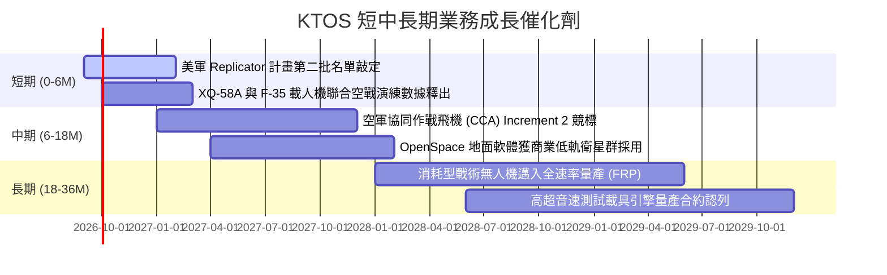

### 9.2 TAM 市場規模分析

```
╔══════════════════════════════════════════════════════════════════╗
║              KTOS 目標潛在市場 (TAM) 拆解                        ║
╠══════════════════════════════════════════════════════════════════╣
║                                                                  ║
║  ① 戰術無人機與協同作戰僚機 (CCA): TAM $14.5B ｜ 當前滲透率 ~3%║
║     預計 2030 年全球市場翻倍，KTOS 具先發無人機驗證優勢          ║
║                                                                  ║
║  ② 太空虛擬化地面系統 (Satcom Ground): TAM $8.2B ｜ 滲透率 ~7% ║
║     軟體定義取代傳統專屬硬體，OpenSpace 年複合增長逾 20%         ║
║                                                                  ║
║  ③ 噴射靶機與防空飛彈測試: TAM $3.8B ｜ 當前滲透率 ~28%        ║
║     美軍現代化防空測試基石，提供穩定高能見度現金流底盤           ║
║                                                                  ║
║  ④ 高超音速與次軌道推進: TAM $5.0B ｜ 當前滲透率 ~4%            ║
║                                                                  ║
║  📊 總計潛在目標市場 (Total TAM)：約 $31.5B                      ║
║     KTOS 目前 TTM 營收 $1.52B，整體市場滲透率僅約 4.8%           ║
╚══════════════════════════════════════════════════════════════════╝
```

### 9.3 成長驅動力結構圖

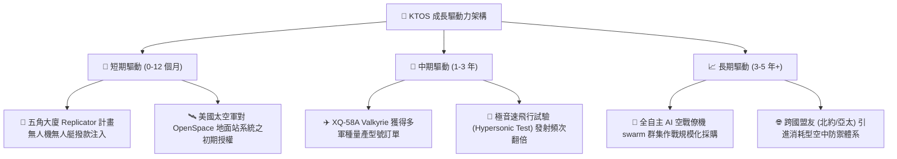

---

## 10. 風險矩陣

### 10.1 風險評分矩陣

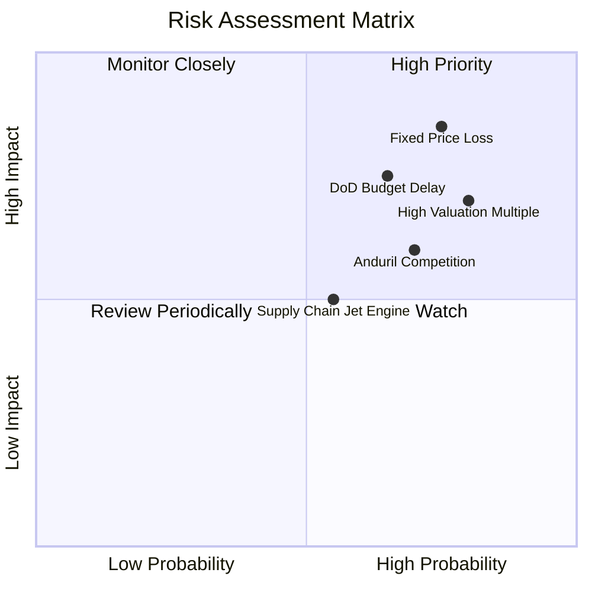

### 10.2 風險清單詳細分析

| # | 風險項目 | 發生機率 | 財務衝擊 | 風險評分 | 機構級緩解措施與觀察指針 |
|---|----------|----------|----------|----------|--------------------------|
| 1 | 🔴 **固定價格研發合約成本超支** | 高 (75%) | 高 (-3% 營利率) | 🔴 8.5/10 | 公司正逐步將新合約轉為成本加成（Cost-Plus）結構，鎖定供應商原物料長約以遏止虧損擴大。 |
| 2 | 🔴 **五角大廈預算審批拖延** | 中偏高 (65%) | 高 (-15% 營收增速) | 🔴 7.8/10 | 仰賴跨軍種（空軍、海軍、陸戰隊）多元合約組合分散風險，並增加海外軍售（FMS）比重。 |
| 3 | 🟡 **新興防務獨角獸激烈競爭** | 高 (70%) | 中度 (壓制定價權) | 🟡 7.2/10 | 強化既有符合國防最高機密等級之廠房設施，凸顯已具備數萬小時實機飛行數據之認證優勢。 |
| 4 | 🟡 **極端估值回歸風險** | 極高 (80%) | 中高 (-30% 股價波動) | 🔴 7.5/10 | 帳面持有 $1.24B 淨現金，必要時可啟動庫藏股回購或併購補強以支撐底盤價值。 |

---

## 11. 投資建議

### 11.1 最終綜合評級雷達圖

```
╔══════════════════════════════════════════════════════════════════╗
║                    KTOS 綜合維度評估雷達                         ║
╠══════════════════════════════════════════════════════════════════╣
║                                                                  ║
║  成長動能 (Growth)        8.5/10  ▓▓▓▓▓▓▓▓▓▓▓▓▓▓▓▓▓░░░  優異     ║
║  財務健康 (Balance Sheet) 9.5/10  ▓▓▓▓▓▓▓▓▓▓▓▓▓▓▓▓▓▓▓░  極度健康 ║
║  技術卡位 (Tech Moat)     8.0/10  ▓▓▓▓▓▓▓▓▓▓▓▓▓▓▓▓░░░░  領先利基 ║
║  獲利能力 (Profitability) 4.0/10  ▓▓▓▓▓▓▓▓░░░░░░░░░░░░  疲弱虧損 ║
║  資本效率 (ROIC/EVA)      2.5/10  ▓▓▓▓▓░░░░░░░░░░░░░░░  摧毀價值 ║
║  估值安全邊際 (Valuation) 3.0/10  ▓▓▓▓▓▓░░░░░░░░░░░░░░  顯著溢價 ║
║                                                                  ║
║  🎯 總體投資評分：6.3 / 10 ｜ 建議評級：🟡 持有 / 觀望 (HOLD)   ║
╚══════════════════════════════════════════════════════════════════╝
```

### 11.2 目標價與隱含報酬率

| 情境 | 目標價 | 隱含報酬率 (相對現價 $47.82) | 主觀機率權重 | 核心定價邏輯 |
|------|--------|------------------------------|--------------|--------------|
| 🔴 **悲觀情境 (Bear)** | **$26.30** | -45.0% | 25% | 利潤率持續低迷，EV/EBITDA 壓縮至 35x |
| 🟡 **基準情境 (Base)** | **$46.99** | **-1.7%** | **55%** | **加權合理價值，獲利改善但高倍數部分消化** |
| 🟢 **樂觀情境 (Bull)** | **$68.45** | +43.1% | 20% | 無人機採購暴增，享有 65x EV/EBITDA 高溢價 |

### 11.3 買入時機與觸發因素 Checklist

```
╔══════════════════════════════════════════════════════════════════╗
║                  ✅ KTOS 投資操作指南 Checklist                 ║
╠══════════════════════════════════════════════════════════════════╣
║                                                                  ║
║  🟢 買入觸發條件（需多數符合方可建倉）：                          ║
║  ☐ 股價回檔至價值區間 $30.00 – $35.00（安全邊際 MOS ≥ 25%）      ║
║  ☐ 單季 GAAP 營業利益率回升至 +3.0% 以上且無一次性超支           ║
║  ☐ 單季營運現金流 OCF 明確轉正，且 Capex 佔營收降至 5% 以下       ║
║  ☐ 獲得美國防部正式簽署單一金額逾 3 億美元之無人作戰機量產合約   ║
║                                                                  ║
║  🟡 現階段持有/觀望條件（當前狀態）：                            ║
║  ☑ 股價處於 $45.00 – $55.00，估值充分反映預期，缺乏安全邊際      ║
║  ☑ 營收維持 20% 以上高增長，但本業獲利仍受研發合約壓抑           ║
║                                                                  ║
║  🔴 停損/減碼撤退觸發條件（出現任一應果斷降倉）：                 ║
║  ☐ 營業利益率連續兩季陷入負值（營運虧損擴大）                   ║
║  ☐ 美國空軍 CCA Increment 1 決選完全排除 KTOS 機型              ║
║  ☐ 帳上現金消耗速度異常，淨現金部位縮水至 5 億美元以下          ║
╚══════════════════════════════════════════════════════════════════╝
```

### 11.4 投資人適配度分析

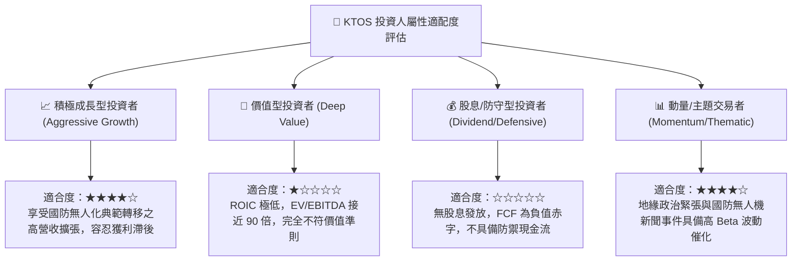

### 11.5 每季財報監控清單（Quarterly Watch List）

| 監控指標項目 | 關鍵跟蹤門檻 / 目標值 | 觸發加碼訊號 (Bull Trigger) | 觸發減碼訊號 (Bear Trigger) |
|--------------|----------------------|------------------------------|------------------------------|
| **GAAP 營業利潤率** | 穩健修復至 >2.0% | 單季營業利益率 > 4.5% | 再次跌入負值 (< 0.0%) |
| **自由現金流 (FCF)** | 赤字收斂至 -$10M 以內 | 單季 FCF 轉正 (> $0) | 單季 FCF 虧損持續擴大 (-$40M 以上) |
| **無人系統 (US) 營收**| 季年增率維持 >25% | 單季 US 營收超過 $140M | 營收增速驟降至 10% 以下 |
| **合約積壓 (Backlog)**| 總量穩定在 $1.3B 以上 | 總訂單積壓創歷史新高 | Book-to-Bill 連續兩季 < 0.9x |
| **資本支出強度** | Capex 降至 $20M / 季以下 | 產線建置完工，Capex < $15M | 資本支出非理性擴大至 $35M 以上 |

### 11.6 反面論證：什麼會證明論點錯誤（What Would Change My Mind）

```
╔══════════════════════════════════════════════════════════════════╗
║              ⚠️ 論點失效條件（Disconfirming Evidence）           ║
╠══════════════════════════════════════════════════════════════════╣
║                                                                  ║
║  若出現下列可量化條件，本報告之「持有/觀望」論點將被推翻：       ║
║                                                                  ║
║  【轉向強力買入 🟢 之逆轉條件】：                                 ║
║  1. KTOS 於未來 2 季內證明固定價格合約已全數出清，單季營業利益率 ║
║     突破 6.0%，帶動 FCF 提早兩年實現規模化正流入 (> $50M/年)。   ║
║  2. 美國國防部確定指定 XQ-58A 為 CCA 唯一標準量產平台，授予金額  ║
║     超過 10 億美元的多年期不可撤銷大單，使營收增速躍升至 40%+。  ║
║  3. 市場發生流動性恐慌使股價超跌至 $30.00 以下（MOS > 35%）。    ║
║                                                                  ║
║  【轉向果斷賣出 🔴 之逆轉條件】：                                 ║
║  1. 營收 YoY 增速連續兩季滑落至 8.0% 以下（低於成熟國防水準），  ║
║     顯示無人機概念無法轉化為實質採購營收。                       ║
║  2. 供應鏈成本與合約超支失控，導致全年 GAAP 淨利重回巨額虧損。    ║
║  3. ROIC 連續 8 季低於 1.5%，公司仍執意進行高溢價併購進一步     ║
║     稀釋股東權益並摧毀企業價值。                                 ║
╚══════════════════════════════════════════════════════════════════╝
```

---
> **免責聲明**：本報告為 AI 自動生成，僅供研究參考，不構成投資建議。投資有風險，入市需謹慎。