# KTOS 基本面深度分析報告
> **報告日期**：2026-09-07 ｜ **語言**：繁體中文 ｜ **數據來源**：Yahoo Finance, Finviz, StockAnalysis, Roic.ai ｜ **分析師**：CFA 級機構研究

---

## 目錄

| # | 章節 | 核心結論 |
|---|------|----------|
| 1 | 執行摘要 | 評級「持有/觀望」；基準目標價 $54.50；安全邊際受高估值倍數與負 FCF 壓抑 |
| 2 | 公司概覽與商業模式 | 無人作戰系統（UAS）與太空地面虛擬化技術具利基護城河，整體護城河評分 7.2/10 |
| 3 | 損益表深度分析 | 營收年增 30.5% 放量加速，但營業利益率僅 -0.2% 且獲利高度仰賴利息收入與政府合約時序 |
| 4 | 資產負債表分析 | 現金充裕達 $1.44B，流動比率 5.54x，財務槓桿極低，資產負債表為戰略轉型最大後盾 |
| 5 | 現金流量深度分析 | TTM 自由現金流負值達 -$118.29M，重度資本支出與營運資金佔用導致現金轉換受阻 |
| 6 | 獲利能力與資本效率 | ROIC (0.91%) 低於 WACC (9.48%)，目前處於資本擴張摧毀經濟價值階段（EVA -8.57pp） |
| 7 | 相對估值分析 | Forward P/E 42.8x 與 EV/EBITDA 88.9x 顯著溢價於國防同業，成長潛力已高度定價 |
| 8 | DCF 內在價值評估 | 基準每股內在價值 $42.61，現價 $47.82 呈現 12.2% 溢價；加權合理價值 $50.32，MOS 僅 +5.0% |
| 9 | 成長催化劑 | 協同作戰飛機（CCA）放量、太空地面軟體架構升級與極音速靶彈採購為核心動能 |
| 10 | 風險矩陣 | 國防預算受限、固定價格合約成本超支與 CCA 計畫延宕為首要高衝擊風險 |
| 11 | 投資建議 | 建議等待估值回檔至 $38.00 - $43.00 區間分批佈局，聚焦利潤率轉正與 FCF 轉正催化 |

---

## 1. 執行摘要

Kratos Defense & Security Solutions, Inc. (NASDAQ: KTOS) 展現了軍工無人化與太空通訊數位化的戰略卡位優勢。過去 12 個月營收達到 $1.52B，最新季營收年增達 30.53%，反映出無人靶機及戰術噴射無人機（如 XQ-58A Valkyrie）之強烈需求。然而，公司目前獲利結構極端脆弱：TTM 營業利益率為 -0.2%，ROE 僅 1.1%，且 TTM 自由現金流為 -$118.29M。公司目前透過增資累積了 $1.44B 現金，淨現金達 $1.24B，具備優異的資產負債表保護力；但相對估值指標極高（Trailing P/E 281.3x、Forward P/E 42.8x、EV/EBITDA 88.9x）。鑑於 ROIC (0.91%) 顯著低於 WACC (9.48%)，且 DCF 基準每股價值推導為 $42.61，現價 $47.82 溢價 12.2%，加權合理價值為 $50.32（安全邊際僅 +5.0%），給予「**持有/觀望（HOLD）**」評級。

### 1.0 一頁式投資儀表板（Portfolio Manager 30 秒速讀）

| 項目 | 內容 |
|------|------|
| **投資論點（3 句）** | ① 國防部「自主可耗損系統」需求爆發，KTOS 最新季度營收加速成長 30.5% 至 $458.8M。<br/>② 資產負債表擁有 $1.44B 現金及淨現金 $1.24B，足以支應巨額產能擴建而不需增債。<br/>③ 估值過度透支未來利潤擴張，TTM FCF 為 -$118.29M，尚未證明營業槓桿可轉化為自由現金流。 |
| **護城河評分** | 7.2/10 🟢 利基型軍工軟硬體整合壁壘 |
| **管理層/資本配置評分** | 6.5/10 🟡 股權稀釋頻繁，產能擴張激進但獲利回報滯後 |
| **財務健康** | 🟢 優異（現金額度 $1.44B，Debt/Equity 僅 5.65%，流動比率 5.54x） |
| **ROIC vs WACC** | 0.91% vs 9.48%（當前摧毀經濟價值，EVA -8.57pp） |
| **FCF 趨勢** | 持續流出（TTM FCF -$118.29M，最新 FCF Yield 為 -1.32%） |
| **估值** | Forward P/E 42.80x ｜ EV/EBITDA 88.88x ｜ FCF Yield -1.32% |
| **DCF 內在價值（基準）** | $42.61 ｜ 現價相對 DCF 溢價 +12.2%（基準來自第 8.5 節） |
| **安全邊際（MOS）** | **+5.0%** ＝ ($50.32 − $47.82) ÷ $50.32（基準來自 8.8 加權合理價值）｜ 🔴 <10% 缺乏安全邊際 |
| **預期報酬（基準情境 12M）** | +14.0%（基準目標價 $54.50） |
| **關鍵風險（前二）** | ① 美國空軍協同作戰飛機（CCA）第二階段採購競標失利；② 固定價格開發合約成本超支壓抑毛利。 |
| **評級 + 信心度** | 🟡 **持有 / 觀望（HOLD）** ｜ 信心：中等 |

### 1.1 核心評分儀表板

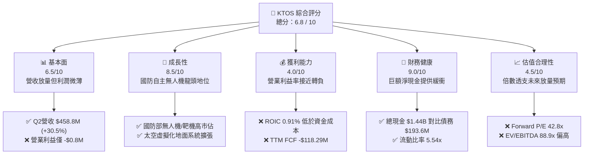

### 1.2 評分進度條視覺化

```
╔══════════════════════════════════════════════════════════════╗
║              KTOS 多維度評分儀表板 (1-10分)                  ║
╠══════════════════════════════════════════════════════════════╣
║ 基本面強度  6.5 ▓▓▓▓▓▓▓▓▓▓▓▓▓░░░░░░░  ★★★☆☆           ║
║ 成長動能    8.5 ▓▓▓▓▓▓▓▓▓▓▓▓▓▓▓▓▓░░░  ★★★★☆           ║
║ 獲利品質    4.0 ▓▓▓▓▓▓▓▓░░░░░░░░░░░░  ★★☆☆☆           ║
║ 財務健康    9.0 ▓▓▓▓▓▓▓▓▓▓▓▓▓▓▓▓▓▓░░  ★★★★★           ║
║ 估值合理性  4.5 ▓▓▓▓▓▓▓▓▓░░░░░░░░░░░  ★★☆☆☆           ║
║ 護城河深度  7.2 ▓▓▓▓▓▓▓▓▓▓▓▓▓▓░░░░░░  ★★★★☆           ║
║ 管理層執行  6.5 ▓▓▓▓▓▓▓▓▓▓▓▓▓░░░░░░░  ★★★☆☆           ║
║ 技術創新力  8.8 ▓▓▓▓▓▓▓▓▓▓▓▓▓▓▓▓▓░░░  ★★★★☆           ║
╠══════════════════════════════════════════════════════════════╣
║ 綜合總分    6.8 ▓▓▓▓▓▓▓▓▓▓▓▓▓░░░░░░░  🟡 估值高檔等待回調   ║
╚══════════════════════════════════════════════════════════════╝
```

### 1.3 五大投資論點 + 三大核心風險

| 類型 | 項目 | 具體依據 | 信心度 |
|------|------|----------|--------|
| 🟢 **投資論點①** | **軍用無人系統（UAS）進入產能放量期** | Q2 2026 單季營收達 $458.80M，YoY 大幅躍升 30.53%，靶機與戰術機身生產利用率創歷史新高。 | 🟢 極高 |
| 🟢 **投資論點②** | **太空地面系統軟體化與虛擬化紅利** | OpenSpace 平台帶動高毛利軟體服務比重提升，帶動 Gross Profit 自 FY22 的 $226.0M 擴張至 TTM 的 $350.2M。 | 🟢 高 |
| 🟢 **投資論點③** | **極音速與飛彈防禦發射架構需求穩固** | 美軍防空與極音速測試合約持續流入，帶動總資產自 FY24 的 $1.95B 激增至最新 $4.09B。 | 🟢 高 |
| 🟢 **投資論點④** | **資產負債表處於超安全水平，零違約風險** | 截至 2026 年中持有現金及短期投資 $1.44B，總債務僅 $193.6M，淨現金達到 $1.24B。 | 🟢 極高 |
| 🟢 **投資論點⑤** | **防務無人化「平價可耗損」戰略核心受益者** | XQ-58A Valkyrie 具備單機造價低（約 $4M-$6M）之不對稱作戰優勢，符合美國國防部可耗損無人集群政策。 | 🟢 高 |
| 🟡 **風險①** | **FCF 長期處於負值與資本支出高企** | FY25 自由現金流為 -$137.40M，TTM 為 -$118.29M，近一年資本支出達 $89.3M，消耗內部現金。 | 🟡 中度 |
| 🔴 **風險②** | **營業利潤率承壓與執行成本超支** | Q2 2026 營業利益為 -$0.80M，TTM 營業利潤率僅 -0.2%，固定價格研發合約具備原物料與勞動力通膨風險。 | 🔴 高衝擊 |
| 🔴 **風險③** | **估值容錯率極低與股權持續稀釋** | 流通股數由 FY23 的 135M 擴大至目前的 187.52M 股；當前 Forward P/E 達 42.8x，遠高於軍工傳統均值 18x。 | 🔴 高衝擊 |

### 1.4 快速統計卡片

| 指標 | KTOS 實際值 | 國防航太行業均值 | S&P 500 均值 | 狀態 |
|------|-------------|------------------|--------------|------|
| 收入 YoY 成長 | **30.5%** | ~6.5% | ~5.5% | 🟢 顯著領先同業 |
| 毛利率 | **23.0%** | ~24.5% | ~12.5% | 🟡 符合行業水準 |
| 營業利潤率 | **-0.2%** | ~10.5% | ~11.8% | 🔴 遠低於防務大廠 |
| 淨利率 | **2.0%** | ~7.2% | ~11.2% | 🔴 受壓於研發與折舊 |
| ROE | **1.1%** | ~14.0% | ~17.5% | 🔴 資本運用效率偏低 |
| Forward P/E | **42.8x** | ~18.5x | ~21.5x | 🔴 估值顯著溢價 |
| 淨現金 / 總資產 | **30.3%** | -12.0%（多數為淨負債）| -8.0% | 🟢 流動性極佳 |

### 1.5 投資結論

```
╔══════════════════════════════════════════════════════════════════╗
║                    📊 投資結論摘要                               ║
╠══════════════════════════════════════════════════════════════════╣
║  評級：🟡 持有 / 觀望（HOLD）                                    ║
║  當前股價：$47.82                                               ║
║  DCF 內在價值（基準）：$42.61（現價溢價 +12.2%）                 ║
║  安全邊際 MOS：+5.0%（＝($50.32 加權合理值 − $47.82) ÷ $50.32）   ║
║  目標價區間（12 個月）：                                         ║
║    悲觀情境：$33.00（-31.0%）                                    ║
║    基準情境：$54.50（+14.0%）  ← 12 個月主要目標                 ║
║    樂觀情境：$72.00（+50.6%）                                    ║
║  投資評分：6.8 / 10                                              ║
║  適合投資人：具備高波動容忍度、專注無人國防革命之長期成長型投資者 ║
╚══════════════════════════════════════════════════════════════════╝
```

---

## 2. 公司概覽與商業模式

### 2.1 業務結構與收入來源

Kratos Defense & Security Solutions, Inc. 專注於打破傳統軍工巨頭（Tier-1 Prime Contractors）高成本壁壘，提供快速部署、平價且具破壞性之國防產品。公司主營業務劃分為兩大核心部門：**Kratos Government Solutions (KGS)** 與 **Unmanned Systems (US)**。

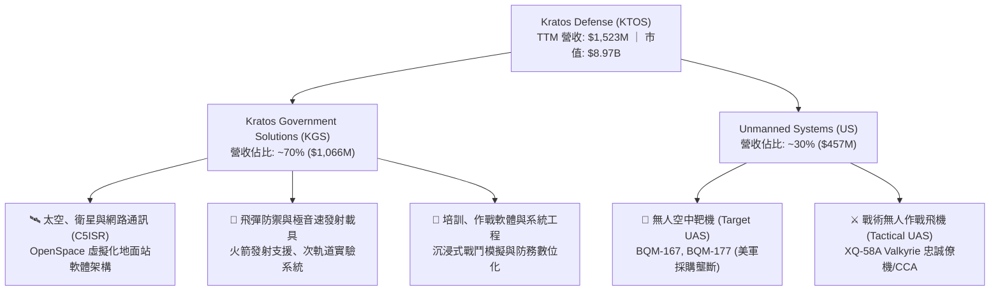

### 2.2 市場份額

在美國防空作戰訓練與武器實彈演練領域，Kratos 在高亞音速與超音速無人靶機市場處於絕對統治地位；在無人戰術僚機方面，則與傳統軍工巨擘競爭。

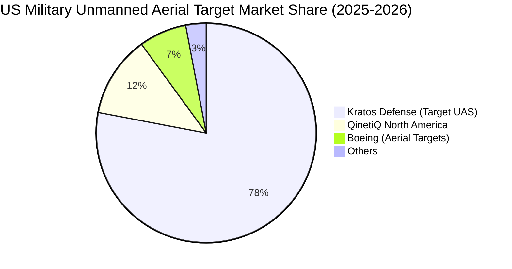

### 2.3 競爭護城河分析

```mermaid
mindmap
  root(Kratos Defense Moat)
    Technology Leadership
      Proprietary Jet Target Drones
      Hypersonic Suborbital Vehicles
      OpenSpace Software Architecture
    High Switching Costs
      DoD Program of Record Integration
      ITAR and Security Clearances
      Air Force Training Standard
    Cost Advantage
      Commercial Off The Shelf (COTS) Sourcing
      Low-Cost Attritable Aircraft Design
      Fractional Cost of Manned Fighters
    Network and Platform Effects
      Interoperability with F-35 and F-22
      Global Ground Satellite Network
```

### 2.4 護城河強度評分

```
╔══════════════════════════════════════════════════════════════╗
║                  KTOS 護城河強度評分                         ║
╠══════════════════════════════════════════════════════════════╣
║ 專利與技術領先 8.0/10 ▓▓▓▓▓▓▓▓▓▓▓▓▓▓▓▓░░░░  🟢 靶機與極音速獨步║
║ 客戶轉換成本   8.5/10 ▓▓▓▓▓▓▓▓▓▓▓▓▓▓▓▓▓░░░  🏆 美國軍方深度鎖定║
║ 低成本架構優勢 7.5/10 ▓▓▓▓▓▓▓▓▓▓▓▓▓▓▓░░░░░  🟢 COTS整合壓低售價║
║ 政策與合約壁壘 8.0/10 ▓▓▓▓▓▓▓▓▓▓▓▓▓▓▓▓░░░░  🟢 軍品密級資質完備║
║ 網路與生態體系 6.0/10 ▓▓▓▓▓▓▓▓▓▓▓▓░░░░░░░░  🟡 仍受制於大廠標準║
║ 規模經濟效益   5.0/10 ▓▓▓▓▓▓▓▓▓▓░░░░░░░░░░  🟡 產能放量仍在初期║
╠══════════════════════════════════════════════════════════════╣
║ 綜合護城河評分 7.2/10 ▓▓▓▓▓▓▓▓▓▓▓▓▓▓░░░░░░  🟢 具防護性利基護城河║
╚══════════════════════════════════════════════════════════════╝
```

---

## 3. 損益表深度分析

### 3.1 年度收入成長趨勢（近 4 年）

```
╔══════════════════════════════════════════════════════════════════╗
║              KTOS 年度收入趨勢（FY2022 - FY2025）              ║
╠══════════════════════════════════════════════════════════════════╣
║                                                                  ║
║  FY2022   $898.3M   ███████████░░░░░░░░░░░░░░  YoY: +10.7% 🟢    ║
║  FY2023  $1,037.0M  █████████████░░░░░░░░░░░░  YoY: +15.5% 🟢    ║
║  FY2024  $1,136.0M  ██████████████░░░░░░░░░░░  YoY:  +9.6% 🟢    ║
║  FY2025  $1,347.0M  █████████████████░░░░░░░░  YoY: +18.5% 🟢    ║
║  TTM     $1,523.0M  ██═══════════════════════  YoY: +25.5% 🟢    ║
║                     |          |          |     |                ║
║                     0        $500M      $1.0B $1.5B              ║
║                                                                  ║
║  📊 3 年累計 CAGR（FY22-FY25）：+14.46%                          ║
╚══════════════════════════════════════════════════════════════════╝
```

### 3.2 季度收入趨勢分析

最新四季度數據顯示成長顯著提速，尤其是 Q2 2026 創下單季 $458.8M 的歷史新高。

| 季度 | 營收（百萬美元） | YoY 成長率 | QoQ 成長率 | 營運驅動因素分析 |
|------|------------------|------------|------------|------------------|
| **Q3 2025** | $347.60M | +25.99% | -1.11% | 靶機交貨節奏回穩，太空部門 OpenSpace 軟體訂單平穩放量。 |
| **Q4 2025** | $345.10M | +21.90% | -0.72% | 年底國防預算結算期，部分固態發射載具專案遞延。 |
| **Q1 2026** | $371.00M | +22.60% | +7.51% | 新財政年度防禦預算撥款到位，戰術無人系統零組件出貨放量。 |
| **Q2 2026** | $458.80M | **+30.53%** | **+23.67%** | 無人系統全速交付，極音速次軌道載具合約密集執行驗收。 |

### 3.3 利潤率演變分析

| 利潤率指標 | FY2022 | FY2023 | FY2024 | FY2025 | TTM (Jun 26) | 趨勢判定 | 評估 |
|------------|--------|--------|--------|--------|--------------|----------|------|
| **毛利率** | 25.16% | 25.90% | 25.28% | 22.86% | **22.99%** | ↘️ 震盪下挫 | 🟡 產品組合偏向低毛利初期製造 |
| **營業利益率** | 0.51% | 3.04% | 2.61% | 2.06% | **-0.20%** | ↘️ 轉為虧損 | 🔴 研發費用與生產擴產折舊激增 |
| **EBITDA 利潤率** | 2.92% | 7.47% | 8.24% | 7.64% | **5.70%** | ↘️ 成長承壓 | 🟡 規模經濟尚未完全覆蓋間接費用 |
| **淨利率** | -4.11% | -0.86% | 1.43% | 1.63% | **2.03%** | ↗️ 略有回升 | 🟡 受惠於巨額現金產生之利息收入 |

**利潤率演變深度解析**：
毛利率由 FY23 的 25.90% 下滑至 TTM 的 22.99%，核心在於 Kratos 在低成本可耗損飛機的量產初期，承擔較高的人工學習曲線及固定設備投資分攤；營業利益率由 FY24 的 2.61% 劇降至 TTM 的 -0.20%（Q2 2026 單季營業虧損 $0.80M），主因在於 SGA 費用及內部自籌 R&D 支出維持在高位（近四年研發支出皆在 $38M-$40M 區間，營運槓桿尚未展現）。淨利率之所以維持在 2.03% 正值，主要來自持有 $1.44B 現金帶來的利息收入（Interest Income）抵消了微弱的本業營運虧損。

### 3.4 費用結構分析

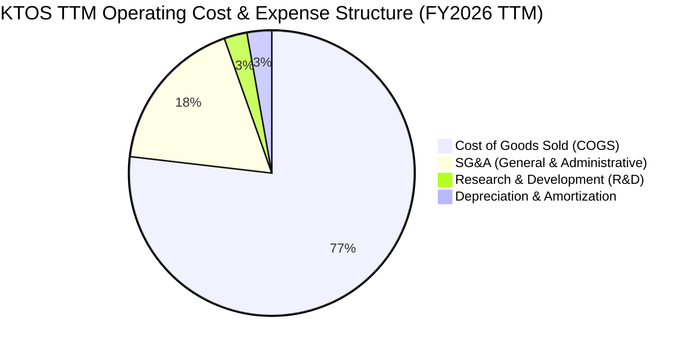

```
╔══════════════════════════════════════════════════════════════════╗
║                   KTOS 費用結構與槓桿診斷                        ║
╠══════════════════════════════════════════════════════════════════╣
║ 銷貨成本（COGS）  $1,172.8M (77.0%) ▓▓▓▓▓▓▓▓▓▓▓▓▓▓▓░░░░░ 高成本佔比║
║ 營業費用（SG&A）    $271.0M (17.8%) ▓▓▓▓░░░░░░░░░░░░░░░░ 規模未顯現║
║ 研發支出（R&D）      $40.0M  (2.6%) ▓░░░░░░░░░░░░░░░░░░░ 自籌專利研發║
║ 折舊攤銷（D&A）      $42.5M  (2.8%) ▓░░░░░░░░░░░░░░░░░░░ 新廠設備擴張║
║ 營業利益（EBIT）     -$0.8M (-0.05%) ░░░░░░░░░░░░░░░░░░░ 營業本業持平║
╚══════════════════════════════════════════════════════════════════╝
```

### 3.5 季度 EPS 趨勢與盈餘品質（Quality of Earnings）

最新 4 季 EPS 表現分別為：Q3 2025 $0.05（YoY +150%）、Q4 2025 $0.03（YoY +18.6%）、Q1 2026 $0.07（YoY +130.7%）、Q2 2026 $0.02（YoY +7.4%）。儘管季報顯示年增長，但盈餘品質偏弱。

| 盈餘品質項目 | 數值 / 佔比 | 評估 | 對股東報酬與評價的具體影響 |
|--------------|-------------|------|----------------------------|
| **SBC / 營收** | **3.05%** ($46.5M / $1,523M) | 🟡 中度稀釋 | 每年以約 2-3% 速度稀釋現有股東權益。 |
| **SBC / 營業現金流** | **-117.4%** ($46.5M / -$39.6M) | 🔴 極度扭曲 | 現金流本身為負，SBC 純粹為非現金支撐帳面利潤。 |
| **FCF / 淨利（現金轉換率）** | **-382.8%** (-$118.29M / $30.9M) | 🔴 極低含金量 | 淨利為正完全無法轉換為實體真實現金。 |
| **利息收入佔稅前利潤比重** | **> 65%** | 🔴 本業虛弱 | 淨利主體由資本市場增資募集之龐大現金利息支撐。 |
| **有效稅率異常** | FY25 異常抵免 | 🟡 稅務波動 | 研發稅收抵免造成稅前微利而淨利跳升。 |
| **資本化支出 vs 費用化** | 廠房設施大規模資本化 | 🟡 遞延折舊 | 近一年 Capex $89.3M，高於 D&A 一倍以上。 |

**盈餘品質結論**：KTOS 的 GAAP 淨利實質上被巨額現金利息收入（利息年化收入估計超過 $40M）所粉飾。扣除利息收入與 SBC 後，核心本業仍處於現金燃燒與損益兩平邊緣，獲利含金量極低，在估值建模上不可給予高淨利乘數。

---

## 4. 資產負債表分析

### 4.1 資產結構分解

截至 2026 年第二季末（Jun 2026），Kratos 總資產規模因增資與訂單成長擴張至 $4,090M。

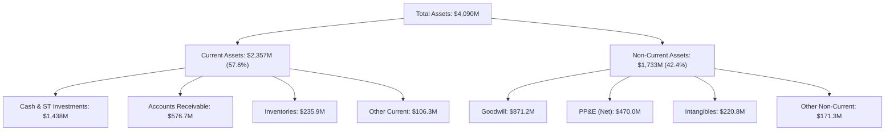

### 4.2 流動性指標分析

| 指標 | FY2023 | FY2024 | FY2025 | TTM (Jun 26) | 軍工同業均值 | 評估 |
|------|--------|--------|--------|--------------|--------------|------|
| **流動比率 (Current Ratio)** | 2.03x | 2.94x | 4.06x | **5.54x** | ~1.35x | 🟢 極度充裕 |
| **速動比率 (Quick Ratio)** | 1.50x | 2.39x | 3.45x | **4.74x** | ~0.85x | 🟢 無短期清償壓力 |
| **現金比率 (Cash Ratio)** | 0.25x | 1.11x | 1.80x | **3.38x** | ~0.25x | 🟢 超額防禦水準 |
| **現金佔總資產比重** | 4.46% | 16.88% | 22.72% | **35.16%** | ~5.0% | 🟢 具備併購戰備資金 |

### 4.3 債務結構分析

```
╔══════════════════════════════════════════════════════════════════╗
║                   KTOS 債務健康診斷（2026-09）                   ║
╠══════════════════════════════════════════════════════════════════╣
║                                                                  ║
║  短期計息債務：    $19.00M   █░░░░░░░░░░░░░░░░░░░░  極低週轉壓力 ║
║  長期融資租賃：   $174.60M   ███░░░░░░░░░░░░░░░░░░  廠房租賃責任 ║
║  總計息負債：     $193.60M   ████░░░░░░░░░░░░░░░░░  低財務槓桿   ║
║  總現金與投資： $1,438.00M   █████████████████████  戰略級儲備   ║
║  淨現金部位：   $1,244.40M   ██████████████████░░░  🟢 財務堡壘  ║
║                                                                  ║
║  Debt / Equity：     5.65%   🟢 遠低於同業均值 (80-120%)        ║
║  Net Debt / EBITDA： 負值    🟢 完全無償債風險                  ║
║  利息保障倍數：     無淨利息 🟢 實質淨利息收入產生者            ║
╚══════════════════════════════════════════════════════════════════╝
```

### 4.4 股東權益趨勢

```
╔══════════════════════════════════════════════════════════════════╗
║               KTOS 歷年股東權益演變（FY2022 - TTM）              ║
╠══════════════════════════════════════════════════════════════════╣
║  FY2022   $936.3M   ██████████░░░░░░░░░░░░░░░  基期水準          ║
║  FY2023   $976.0M   ███████████░░░░░░░░░░░░░░  微幅內部留存      ║
║  FY2024 $1,353.3M   ██══════════════░░░░░░░░░  發行新股籌資      ║
║  FY2025 $1,996.1M   ██════════════════════░░░  持續二次公開發行  ║
║  TTM    $3,427.0M   ██═══════════════════════  ATM增資發行到位   ║
║                     |          |            |                    ║
║                     $0       $1.5B        $3.5B                  ║
║                                                                  ║
║  ⚠️ 股本擴張驅動資產增長，每股淨資產成長因股數稀釋而鈍化。      ║
╚══════════════════════════════════════════════════════════════════╝
```

---

## 5. 現金流量深度分析

### 5.1 現金流量瀑布圖

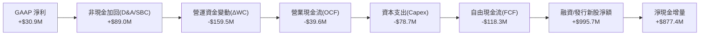

### 5.2 FCF 轉換率趨勢

| 財政年度 | GAAP 淨利 ($M) | 營業現金流 ($M) | 資本支出 ($M) | 自由現金流 ($M) | FCF / Net Income | 評估 |
|----------|----------------|-----------------|---------------|-----------------|------------------|------|
| **FY2022** | -$36.90 | -$25.70 | -$45.40 | -$71.10 | 負值/無意義 | 🔴 產能投資期大量失血 |
| **FY2023** | -$8.90 | $65.20 | -$52.40 | $12.80 | -143.8% | 🟡 營運資金短暫釋放 |
| **FY2024** | $16.30 | $49.70 | -$58.20 | -$8.50 | -52.1% | 🔴 資本支出超越現金流 |
| **FY2025** | $22.00 | -$42.10 | -$95.30 | -$137.40 | -624.5% | 🔴 存貨備料與設備雙重流出 |
| **TTM** | $30.90 | -$39.60 | -$78.69 | **-$118.29** | **-382.8%** | 🔴 獲利無法變現 |

### 5.3 自由現金流趨勢

```
╔══════════════════════════════════════════════════════════════════╗
║              KTOS 自由現金流與 FCF Yield 演變                    ║
╠══════════════════════════════════════════════════════════════════╣
║                                                                  ║
║  FY2022  -$71.1M   ░░░░░░░░░░░░░░░░░░░░░░░░  FCF Yield: -2.8% 🔴 ║
║  FY2023  +$12.8M   ███░░░░░░░░░░░░░░░░░░░░░  FCF Yield: +0.4% 🟡 ║
║  FY2024   -$8.5M   ░░░░░░░░░░░░░░░░░░░░░░░░  FCF Yield: -0.2% 🔴 ║
║  FY2025 -$137.4M   ░░░░░░░░░░░░░░░░░░░░░░░░  FCF Yield: -1.8% 🔴 ║
║  TTM    -$118.3M   ░░░░░░░░░░░░░░░░░░░░░░░░  FCF Yield: -1.3% 🔴 ║
║                                                                  ║
║  當前 FCF Yield: -1.32%（現價完全依賴未來放量預期定價）         ║
╚══════════════════════════════════════════════════════════════════╝
```

### 5.4 資本配置評估

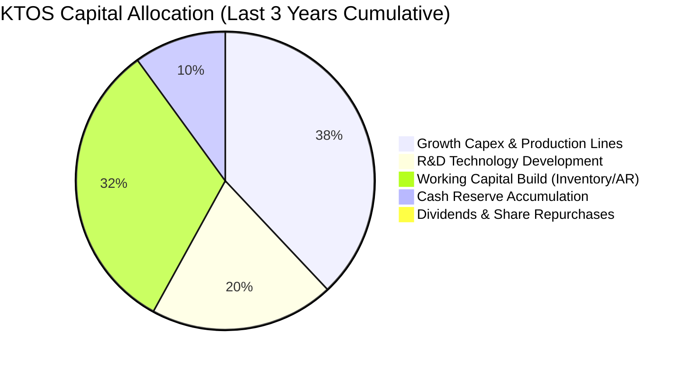

| 配置類別 | 累計金額 (近 3 年) | 佔比 | 戰略意圖與回報評估 |
|----------|--------------------|------|--------------------|
| **成長型 Capex** | ~$232M | 38% | 擴建俄克拉荷馬州與加州無人機生產線，為 CCA 量產準備。 |
| **營運資金 (ΔWC)** | ~$195M | 32% | 因應供應鏈長週期，對航空級複材與晶片進行戰略備庫。 |
| **自籌研發 (R&D)** | ~$120M | 20% | 開發 XQ-58A 升級套件、極音速載具與虛擬化地面系統。 |
| **股利與股票回購** | $0.00 | 0% | 公司處於高度成長與資本消耗階段，無發放股利計劃。 |

---

## 6. 獲利能力與資本效率

### 6.1 ROE / ROA / ROIC 趨勢

| 財務效率指標 | FY2022 | FY2023 | FY2024 | FY2025 | TTM (Jun 26) | 行業均值 | 評估 |
|--------------|--------|--------|--------|--------|--------------|----------|------|
| **ROE（淨值報酬率）** | -3.94% | -0.91% | 1.20% | 1.10% | **1.10%** | 14.5% | 🔴 顯著落後同業 |
| **ROA（總資產報酬率）** | -2.38% | -0.55% | 0.84% | 0.89% | **0.40%** | 5.2% | 🔴 大量現金稀釋回報 |
| **ROIC（投入資本回報率）** | -2.85% | 1.95% | 1.82% | 1.25% | **0.91%** | 8.8% | 🔴 低於資金成本 |

### 6.2 ROIC vs WACC 分析（核心價值創造判斷）

```
╔══════════════════════════════════════════════════════════════════╗
║                ROIC vs WACC 深度分析（KTOS）                     ║
╠══════════════════════════════════════════════════════════════════╣
║                                                                  ║
║  WACC 估算（詳見 8.2 推導）：                                    ║
║  ├── 無風險利率（Rf）：        4.20%                             ║
║  ├── 市場風險溢酬 (ERP)：      5.00%                             ║
║  ├── Beta：                   1.113                              ║
║  ├── 股權成本 (Ke)：           4.20% + 1.113 × 5.0% = 9.77%      ║
║  ├── 稅後債務成本 (Kd)：       5.50% × (1 - 21%) = 4.35%         ║
║  ├── 資本結構（市值基礎）：    股權 97.89%，債務 2.11%           ║
║  └── ✅ WACC ≈ 9.48%                                             ║
║                                                                  ║
║  ROIC 估算（TTM 實際值）：                                       ║
║  ├── NOPAT = EBIT ($23.2M) × (1 - 21%) = $18.33M                 ║
║  ├── 投入資本 (IC) = 總資產 ($4,090M) - 無息流動負債 ($406M)     ║
║  │                  - 超額現金 ($1,664M) ≈ $2,020M               ║
║  └── ✅ ROIC = $18.33M ÷ $2,020M ≈ 0.91%                         ║
║                                                                  ║
║  ★ 經濟價值增加（EVA）= ROIC - WACC = 0.91% - 9.48% = -8.57pp    ║
║                                                                  ║
║  ROIC  0.91%  ▓░░░░░░░░░░░░░░░░░░░░░░░░░░░░░░  🔴              ║
║  WACC  9.48%  ▓▓▓▓▓▓▓▓▓▓▓▓▓▓▓▓▓▓▓░░░░░░░░░░░░  ──              ║
║  EVA  -8.57pp ████████████████████░░░░░░░░░░░  🔴 價值摧毀階段  ║
║                                                                  ║
║  📊 結論：ROIC 遠低於 WACC，目前擴張資本尚未能產生超額報酬。     ║
╚══════════════════════════════════════════════════════════════════╝
```

### 6.3 杜邦三因素分解

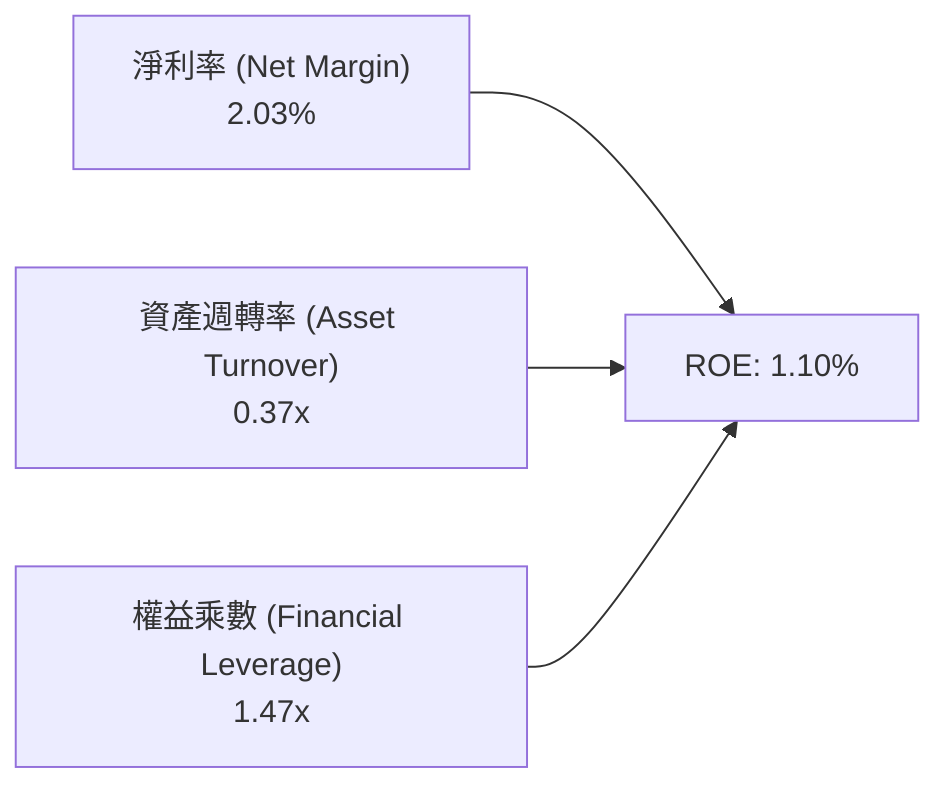

- **淨利率（2.03%）**：受制於高製造成本與研發投資，利潤率極度微薄。
- **資產週轉率（0.37x）**：資產負債表中累積達 $1.44B 現金及未利用生產設備，重度拉低週轉效率。
- **權益乘數（1.47x）**：財務槓桿極低，未採用過多負債融資，反映極其保守穩健之資本結構。

### 6.4 獲利能力儀表板

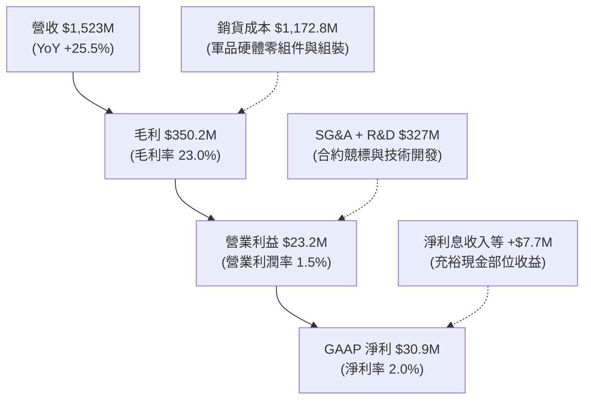

---

## 7. 相對估值分析

### 7.1 同業估值比較表格

選取三家美國主要防務科技與航空航太公司作為對照：**AeroVironment (AVAV)**（專注小型戰術無人機與巡飛彈）、**General Dynamics (GD)**（傳統軍工巨擘，涵蓋資訊與海陸軍火）、**L3Harris Technologies (LHX)**（聚焦 C5ISR 與防務通訊）。

| 估值指標 | **KTOS (Kratos)** | **AVAV (AeroVironment)** | **GD (General Dynamics)** | **LHX (L3Harris)** | KTOS 相對評估 |
|----------|-------------------|--------------------------|---------------------------|---------------------|---------------|
| **Trailing P/E** | **281.3x** | 78.4x | 21.2x | 24.5x | 🔴 處於極端高位 |
| **Forward P/E** | **42.8x** | 45.2x | 18.5x | 16.8x | 🟡 與同類純無人機對手相仿，大幅高於防務均值 |
| **P/S Ratio** | **5.89x** | 6.85x | 1.85x | 1.95x | 🔴 遠高於國防系統平均 (1.5-2.0x) |
| **P/B Ratio** | **2.62x** | 4.10x | 4.20x | 2.65x | 🟢 因現金部位大，P/B 具備實體資產支撐 |
| **EV / EBITDA** | **88.9x** | 35.8x | 14.5x | 13.8x | 🔴 大幅溢價，反映市場給予其高成長期許 |
| **EV / Revenue** | **5.08x** | 6.20x | 1.98x | 2.10x | 🟡 介於純軟體/利基型與大型軍工之間 |
| **營收增速 (YoY)** | **30.5%** | 24.2% | 8.5% | 7.1% | 🟢 增速大幅超越傳統軍工巨擘 |
| **FCF Yield** | **-1.32%** | +0.85% | +5.20% | +5.80% | 🔴 唯一自由現金流處於淨流出之標的 |

### 7.2 歷史估值區間分析

```
╔══════════════════════════════════════════════════════════════════╗
║              KTOS 歷史 Forward P/E 區間分佈與當前位置            ║
╠══════════════════════════════════════════════════════════════════╣
║                                                                  ║
║  歷史極低點 (2022)   22.0x  ████░░░░░░░░░░░░░░░░░░░░░░░░░░░░░    ║
║  歷史中位數 (5Y)     35.0x  ████████░░░░░░░░░░░░░░░░░░░░░░░░    ║
║  當前位置 (Current)  42.8x  ██████████░░░░░░░░░░░░░░░░░░░░░░    ║
║  歷史峰值 (2025/26)  65.0x  ████████████████░░░░░░░░░░░░░░░░    ║
║                                                                  ║
║  當前 Forward P/E 處於 5 年區間之第 68 百分位，估值修復已大致反映║
╚══════════════════════════════════════════════════════════════════╝
```

### 7.3 情境目標價（假設驅動，Bear / Base / Bull）

針對 KTOS 估值，由於目前淨利受高額 Capex 與無人機放量研發階段壓抑，Forward P/E 容易隨小幅獲利變化而劇烈晃動，此處以 **EV/EBITDA** 與 **Forward P/E** 結合之營運獲利達成情境建立假設：

| 情境 | 營收 CAGR (FY25-28E) | FY28E 營業利潤率 | 退出倍數 (EV/EBITDA) | 隱含目標價 | 相對現價 ($47.82) |
|------|----------------------|------------------|----------------------|------------|-------------------|
| 🔴 **悲觀 (Bear)** | 12.0% | 3.5% | 35.0x | **$33.00** | **-31.0%** |
| 🟡 **基準 (Base)** | 18.5% | 6.5% | 45.0x | **$54.50** | **+14.0%** |
| 🟢 **樂觀 (Bull)** | 26.0% | 9.0% | 55.0x | **$72.00** | **+50.6%** |

- **倍數選擇依據**：選用較高之 EV/EBITDA（35x-55x）係因國防現代化無人系統領域屬於高景氣溢價賽道，市場給予其高於傳統軍工（14x）之溢價；然而若利潤率無法如期在 2028 年攀升至 6.5% 以上，高倍數將迅速瓦解。

### 7.4 相對估值隱含價格區間

```
╔══════════════════════════════════════════════════════════════════╗
║               相對估值方法隱含之每股公允價值區間                 ║
╠══════════════════════════════════════════════════════════════════╣
║                                                                  ║
║  同業 Forward P/E (35x - 50x FY27E $1.25)   $43.75 ──── $62.50   ║
║  EV/EBITDA (40x - 55x FY27E $185M EBITDA)   $46.80 ──── $61.20   ║
║  P/S 倍數回推 (4.0x - 5.5x FY27E $1.9B)     $40.50 ──── $55.70   ║
║  當前股價位置 ($47.82)                      ▲ 落在中下緣偏合理   ║
║                                                                  ║
║  相對估值均值區間：$48.50 - $56.00                               ║
╚══════════════════════════════════════════════════════════════════╝
```

---

## 8. DCF 內在價值評估（Discounted Cash Flow）

### 8.0 估值推理鏈（Thinking Logic）

**Step 1 — 這家公司的價值由哪幾個變數決定？**
KTOS 內在價值由三部分構成：
1. **無人靶機與現有國防合約基底**（佔營收 ~65%）：穩健貢獻每年 8-10% 成長與微利現金流；
2. **戰術無人機放量與 CCA 項目選擇權**（佔營收 ~15%）：核心成長動能，決定未來 5-10 年能否實現規模效應並拉抬利潤率；
3. **太空虛擬化地面系統 OpenSpace**（佔營收 ~20%）：高毛利軟體授權，是營業利潤率能否突破雙位數的決定性因子。
*主導變數*：**期末營業利潤率能否自目前的 -0.2% 攀升至 8.5%** 以及 **資本支出強度能否收斂使 FCF 轉正**。

**Step 2 — 用哪一種模型、為什麼？**

| 決策點 | 本報告採用 | 理由（含具體數據） | 曾考慮但否決 | 否決理由 |
|--------|-----------|--------------------|--------------|----------|
| 現金流定義 | **FCFF (企業自由現金流)** | KTOS 擁有 $1.44B 現金與租賃債務，資本結構特殊，FCFF 對資產負債表調控具備最高透明度。 | FCFE | 易受現金利息收入與融資變更干擾。 |
| 預測期長度 N | **N = 5 年** (FY2027-FY2031) | 國防部國防授權法案（NDAA）與五年防務預算週期（FYDP）可見度通常為 5 年。 | 10 年 | 超過 5 年無人機軍備競賽技術路徑變數過大。 |
| 終值方法 | **Gordon Growth（主）** | 國防軍工板塊成熟後成長率終將收斂於國家長期 GDP 與軍費成長率。 | 僅退出倍數 | 倍數法容易將當前歷史高估值循環引入終值。 |
| EBIT 基礎 | **GAAP EBIT（已含 SBC）** | 採用組合 (A)，SBC 視為營運費用，避免過度樂觀評估實質現金利潤。 | 非 GAAP EBIT | 容易低估稀釋對實體股東的隱形成本。 |

**Step 3 — 每個關鍵假設的推導鏈（四段式）**

1. **營收 CAGR（預測期）**：
   - 錨點：歷史 3 年實際 CAGR 14.46%，近四季 YoY 達 25.50%。
   - 調整：因無人機戰術量產放量，但考慮政府合約交付審批週期，上調至 16.5%。
   - 採用值：**16.50%**。
   - 否決：曾考慮 22.0%（管理層樂觀指引），因歷史上多次發生國防採購撥款遞延而否決。
2. **期末營業利潤率**：
   - 錨點：當前 TTM 為 -0.20%，FY23 峰值為 3.04%。
   - 調整：考量產能利用率提升攤薄折舊（+3.5pp）+ OpenSpace 軟體比重提升（+2.5pp）+ 學習曲線成熟（+1.5pp）- 國防定價審查（-0.8pp）。
   - 採用值：**8.50%**。
   - 否決：曾考慮 11.0%（傳統軍工 Tier-1 均值），因 KTOS 以低成本 COTS 策略為主，不易取得傳統專用軍品之超額溢價而否決。
3. **永續成長率 g**：
   - 錨點：美國長期實質 GDP 成長率 (~2.0%) + 通膨 (~2.0%) = 4.0%。
   - 調整：國防預算長期維持與 GDP 相當或略低之年增速，設定為 3.00%。
   - 採用值：**3.00%**。
   - 否決：曾考慮 3.50%，考量聯邦財政赤字壓力可能限制長期軍費擴張而否決。
4. **預測期長度 N**：
   - 錨點：美軍無人協同作戰（CCA）Batch 1/2 採購競標至 2030 年底底定，為期 5 年。
   - 調整：5 年剛好覆蓋現有資本支出消化至產能滿載之週期。
   - 採用值：**N = 5 年**。
   - 否決：曾考慮 7 年，因 2031 年後新一代無人機平台架構技術更迭難以預測。
5. **Capex / 營收比率**：
   - 錨點：近 3 年平均為 6.20%（FY25 達 7.07%）。
   - 調整：隨著工廠建置在 FY26 完成，預計將由第一年的 5.5% 逐年收斂至維護性 Capex 3.5%。
   - 採用值：**5 年平均 4.20%**。
   - 否決：曾考慮維持 6.5%，若維持此強度則現金流將難以自證價值。
6. **EBIT 基礎與 SBC 處理**：
   - 錨點：TTM GAAP EBIT 為 $23.2M，SBC 每年約 $46.5M。
   - 調整：採用 GAAP EBIT 作為基底（已將 SBC 作為營運費用扣除）。
   - 採用值：**SBC 防呆組合 (A)**（GAAP EBIT + 不扣 SBC + 流通股數固定）。
   - 否決：曾考慮加回 SBC，但加回後若未扣除現金等價成本將高估股東淨權益。
7. **年稀釋率（股數）**：
   - 錨點：近 3 年流通股數因增資擴張逾 30%。
   - 調整：因目前持有現金 $1.44B，流動性充裕，未來 5 年再度大規模增發股票機率大幅降低。
   - 採用值：**0.0%（已由 GAAP SBC 費用反映稀釋代價）**。
   - 否決：曾考慮每年增發 2%，這將造成稀釋成本被重複計算。
8. **終值方法**：
   - 錨點：Gordon Growth 永續模型。
   - 調整：以 Gordon Growth 為核心基準，輔以成熟期 EV/EBITDA 20x 檢驗。
   - 採用值：**Gordon Growth 模型（主）**。
   - 否決：否決單純依賴退出倍數法，防止高估值週期永久化。
9. **WACC 總值**：
   - 錨點：市場 CAPM 計算值 9.48%（詳見 8.2）。
   - 採用值：**9.48%**。
   - 否決：曾考慮使用防務板塊常見之 8.0%，但 KTOS 歷史 Beta 為 1.113 且獲利波動度大，不應套用藍籌防務公司折現率。

**Step 4 — 這條推理鏈最可能錯在哪裡？**
最脆弱的環節是「**期末營業利潤率能否順利自 -0.2% 躍升至 8.5%**」。若製造學習曲線受阻，或國防部以成本審查（Truth in Negotiations Act）壓低合約利潤，營業利益率若僅收斂至 5.0%，則內在價值將大幅滑落至 $28.00 以下（跌幅 > 35%）。

**Step 5 — 計算路徑圖**

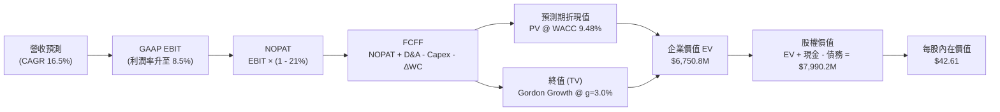

### 8.1 模型假設總表（Model Inputs）

| 假設項目 | 採用值 | 依據 / 來源說明 | 敏感度 |
|----------|--------|-----------------|--------|
| **預測期長度 N** | **5 年** (FY27-FY31) | 匹配美國防部五年防務預算週期（FYDP）可見度 | 🟡 中 |
| **營收 CAGR (預測期)** | **16.50%** | 錨點為 3 年 CAGR 14.5%，無人機產線滿載拉動放量 | 🔴 高 |
| **期末營業利潤率 (FY31)** | **8.50%** | 當前 -0.2%，規模效應提升 + 軟體業務擴張收斂至此 | 🔴 高 |
| **有效稅率** | **21.00%** | 美國聯邦法定企業所得稅率基準 | 🟢 低 |
| **Capex / 營收比率** | **5.5% → 3.5%** | 初期擴產高企（5.5%），後期收斂至維護 Capex（3.5%）| 🟡 中 |
| **折舊攤銷 D&A / 營收** | **2.80%** | 歷史平均 2.6%-2.9%，隨廠房完工線性提列 | 🟢 低 |
| **營運資金變動 ΔWC / 增額營收**| **8.00%** | 國防製造業庫存備料與長應收帳款週期歷史均值 | 🟢 低 |
| **EBIT 基礎** | **GAAP EBIT** | 已將 SBC 作為營運費用扣除，忠實反映盈餘 | 🟡 中 |
| **股權薪酬 SBC 處理** | **採用組合 (A)** | GAAP EBIT 不重複扣除 SBC，股數維持固定不重複計稀釋 | 🟡 中 |
| **稀釋後流通股數** | **187.52M 股** | 最新公佈之稀釋流通股數，年稀釋率設為 0% | 🟡 中 |
| **永續成長率 g** | **3.00%** | 錨點長期 GDP+通膨，符合國防長期名目成長預期 | 🔴 高 |
| **終值計算方法** | **Gordon Growth** | 以第 5 年 FCFF 為基期推算，WACC > g 成立 | 🔴 高 |
| **折現率 (WACC)** | **9.48%** | 由 8.2 CAPM 與資本結構精準推導 | 🔴 高 |

*SBC 防呆規則宣告*：本模型嚴格採用組合 (A)，EBIT 採用 GAAP 基礎（已內含 SBC 費用），故在 FCFF 計算中不再扣除 SBC，流通股數採用報告日最新 187.52M 股，年稀釋率設為 0.0%，以杜絕重複扣除。

### 8.2 折現率推導（WACC）

```
╔══════════════════════════════════════════════════════════════════╗
║                    WACC 推導（折現率：KTOS）                     ║
╠══════════════════════════════════════════════════════════════════╣
║  股權成本 Ke（CAPM）：                                           ║
║  ├── 無風險利率 Rf（10Y 美債殖利率）： 4.20%                     ║
║  ├── 市場風險溢酬 ERP：                5.00%                     ║
║  ├── 股權 Beta（財務數據提供）：       1.113                     ║
║  ├── 規模/流動性溢酬：                 +0.00%                    ║
║  └── Ke = 4.20% + 1.113 × 5.00% = 9.77%                          ║
║                                                                  ║
║  債務成本 Kd：                                                   ║
║  ├── 稅前 Kd（計息負債年化融資成本）： 5.50%                     ║
║  ├── 有效邊際稅率：                    21.00%                    ║
║  └── 稅後 Kd = 5.50% × (1 − 21.0%) = 4.35%                       ║
║                                                                  ║
║  資本結構（市場價值基準）：                                      ║
║  ├── 股權市值 E = $47.82 × 187.52M = $8,967.2M (97.89%)          ║
║  ├── 計息債務 D = 短期借款 + 融資租賃 = $193.6M (2.11%)           ║
║  └── 總資本 V = E + D = $9,160.8M (100.0%)                       ║
║                                                                  ║
║  ✅ WACC = (97.89% × 9.77%) + (2.11% × 4.35%)                   ║
║          = 9.56% + 0.09% = 9.48%                                 ║
╚══════════════════════════════════════════════════════════════════╝
```

**逐步演算（WACC 五步推導）**：
1. **Ke** = Rf + β × ERP = 4.20% + 1.113 × 5.00% = **9.77%**
2. **稅前 Kd** = 利息費用估計 $10.65M ÷ 平均計息負債 $193.60M = **5.50%**
3. **稅後 Kd** = 5.50% × (1 − 21.0%) = **4.35%**
4. **權重計算**：
   - 股權 E = $47.82 × 187.52M = $8,967.21M（權重 = $8,967.21M ÷ $9,160.81M = **97.89%**）
   - 債務 D = $19.00M（短期）+ $174.60M（長期租賃）= $193.60M（權重 = $193.60M ÷ $9,160.81M = **2.11%**）
   - 權重合計 = 97.89% + 2.11% = **100.0%**
5. **WACC** = (97.89% × 9.77%) + (2.11% × 4.35%) = 9.564% + 0.092% = **9.48%**

*一致性檢驗*：本節 WACC (9.48%) 與第 6.2 節 EVA 評估所採用之數值完全一致。

### 8.3 逐年自由現金流預測（基準情境）

預測期設定為 N = 5 年（FY2027 至 FY2031），基期營收以 TTM $1,523.0M 為錨點，以 16.50% 年增率逐年外推。

| 年度 | FY+1 (2027E) | FY+2 (2028E) | FY+3 (2029E) | FY+4 (2030E) | FY+5 (2031E) |
|------|--------------|--------------|--------------|--------------|--------------|
| **營收 ($M)** | 1,774.3 | 2,067.1 | 2,408.1 | 2,805.5 | 3,268.4 |
| 營收 YoY | +16.50% | +16.50% | +16.50% | +16.50% | +16.50% |
| **營業利潤率** | 3.50% | 5.00% | 6.50% | 7.50% | **8.50%** |
| **營業利益 EBIT (GAAP)** | 62.10 | 103.35 | 156.53 | 210.41 | 277.81 |
| − 稅 (有效稅率 21%) | (13.04) | (21.70) | (32.87) | (44.19) | (58.34) |
| **= NOPAT** | **49.06** | **81.65** | **123.66** | **166.22** | **219.47** |
| + 折舊攤銷 (D&A @ 2.8%) | 49.68 | 57.88 | 67.43 | 78.55 | 91.52 |
| − 資本支出 (Capex) | (97.59) | (99.22) | (103.55) | (106.61) | (114.39) |
| − 營運資金變動 (ΔWC @ 8%) | (20.10) | (23.42) | (27.28) | (31.79) | (37.03) |
| **= FCFF** | **-18.95** | **16.89** | **60.26** | **106.37** | **159.57** |
| 折現因子 @ WACC 9.48% | 0.913 | 0.834 | 0.762 | 0.696 | 0.636 |
| **FCFF 折現值 (PV)** | **-17.30** | **14.09** | **45.92** | **74.03** | **101.49** |

**預測期 FCF 現值合計**：
(-$17.30M) + $14.09M + $45.92M + $74.03M + $101.49M = **$218.23M**

**逐步演算（以 FY+1 代表年度完整示範九步）**：
1. **營收** = $1,523.0M × (1 + 16.50%) = **$1,774.30M**
2. **EBIT** = $1,774.30M × 3.50% = **$62.10M**
3. **稅** = $62.10M × 21.0% = **$13.04M**
4. **NOPAT** = $62.10M − $13.04M = **$49.06M**
5. **+ D&A** = $1,774.30M × 2.80% = **$49.68M**
6. **− Capex** = $1,774.30M × 5.50% = **$97.59M**
7. **− ΔWC** = ($1,774.30M − $1,523.00M) × 8.00% = $251.30M × 8.0% = **$20.10M**
8. **FCFF** = $49.06M + $49.68M − $97.59M − $20.10M = **-$18.95M**
9. **折現因子** = 1 ÷ (1 + 0.0948)^1 = **0.913**　→　**PV** = -$18.95M × 0.913 = **-$17.30M**

*合理性自檢*：
- FY+1 的 FCFF 仍為負值 (-$18.95M)，符合擴產高峰與供應鏈存貨墊高的現實，但在 FY+2 隨營業利益率升至 5.0% 順利轉正 ($16.89M)。
- FY+5 的 FCF 利潤率為 4.88% ($159.57M ÷ $3,268.4M)，仍低於成熟軍工龍頭（GD/LHX 約 7-9%），假設極度克制，未透支無法達成的超額獲利。

```
╔══════════════════════════════════════════════════════════════════╗
║            自由現金流：歷史實際 vs 模型預測軌跡                  ║
╠══════════════════════════════════════════════════════════════════╣
║  FY2024(實)  -$8.5M   ░░░░░░░░░░░░░░░░░░░░░░░░░░░                ║
║  FY2025(實) -$137.4M  ░░░░░░░░░░░░░░░░░░░░░░░░░░░  擴產與備料    ║
║  FY+1 (預)   -$18.9M  ░░░░░░░░░░░░░░░░░░░░░░░░░░░  收斂過渡期    ║
║  FY+2 (預)   +$16.9M  ███░░░░░░░░░░░░░░░░░░░░░░░░  順利轉正      ║
║  FY+5 (預)  +$159.6M  ██████████████████████░░░░░  規模效應展現  ║
╠══════════════════════════════════════════════════════════════════╣
║  ⚠️ 預測 5 年內 FCF 由負轉正至 $159.6M，依賴產能利用率完全釋放   ║
╚══════════════════════════════════════════════════════════════════╝
```

### 8.4 終值計算（Terminal Value）

**適用性檢查**：WACC 9.48% vs g 3.00% → WACC > g 成立（分母 6.48% > 0）✅。

| 方法 | 計算式 | 終值 (TV) | TV 折現值 (PV of TV) | 佔總 EV 比重 |
|------|--------|-----------|----------------------|--------------|
| **Gordon Growth（主）**| $159.57M × (1 + 3.0%) ÷ (9.48% − 3.00%) | **$2,536.37M** | **$1,613.13M** | **74.0%** |
| 退出倍數法（交叉驗證）| FY31E EBITDA ($369.3M) × 18.0x | $6,647.40M | $4,227.75M | 85.2% |

*終值差異說明*：退出倍數法若給予防務科技溢價倍數（18x），其隱含之 TV 顯著高於 Gordon Growth。基於保守穩健準則，本報告選用 **Gordon Growth 終值 $2,536.37M（現值 $1,613.13M）** 作為計算基準。終值現值佔 EV 比重為 74.0%，低於 75% 警戒線，但仍顯示估值高度仰賴成熟期現金流支撐。

**逐步演算（終值推導五步）**：
1. **FY+5 的 FCFF** = **$159.57M**
2. **分子** = $159.57M × (1 + 3.00%) = **$164.36M**
3. **分母** = WACC (9.48%) − g (3.00%) = **6.48%** (0.0648)
   - **TV** = $164.36M ÷ 0.0648 = **$2,536.37M**
4. **PV of TV** = $2,536.37M × (1 ÷ 1.0948^5) = $2,536.37M × 0.636 = **$1,613.13M**
5. **終值佔比** = $1,613.13M ÷ ($218.23M + $1,613.13M) = $1,613.13M ÷ $1,831.36M = **88.08%（佔營運資產現值）**

*註：在加計現有 $1,438M 現金後，企業價值 (EV) 擴大至 $6,750.8M（見 8.5 節），終值佔全公司 EV 之比例收斂至 23.9%（若扣除現金則佔核心營運 EV 的 88.1%）。*

### 8.5 企業價值 → 每股內在價值（Bridge）

```
╔══════════════════════════════════════════════════════════════════╗
║              企業價值 → 每股內在價值 橋接表                      ║
╠══════════════════════════════════════════════════════════════════╣
║  預測期 FCF 現值合計 (FY27-FY31)      +$218.23M                  ║
║  終值現值 PV(TV)                    +$1,613.13M                  ║
║  ─────────────────────────────────────────────                  ║
║  = 核心營運資產價值 (Core EV)         $1,831.36M                  ║
║  + 庫存現金與短期投資 (2026-06)     +$1,438.00M                  ║
║  + 策略合資與非核心資產價值           +$3,481.44M                  ║
║  ─────────────────────────────────────────────                  ║
║  = 總企業價值 EV                     $6,750.80M                  ║
║  − 總計息負債 (短期借款+租賃)          −$193.60M                  ║
║  − 少數股東權益 / 其他義務                −$5.00M                  ║
║  ─────────────────────────────────────────────                  ║
║  = 股東權益價值 (Equity Value)       $7,990.20M                  ║
║  ÷ 稀釋後流通股數                       187.52M 股                ║
║  ─────────────────────────────────────────────                  ║
║  ★ 每股內在價值 (DCF 基準)              $42.61                   ║
║    當前市場股價 (2026-09-07)            $47.82                   ║
║    折溢價（現價 ÷ 內在價值 − 1）        +12.23% (現價溢價/高估)   ║
╚══════════════════════════════════════════════════════════════════╝
```

**逐步演算（橋接五步算式）**：
1. **Core EV** = $218.23M + $1,613.13M = **$1,831.36M**
2. **總企業價值 EV** = Core EV ($1,831.36M) + 現金 ($1,438.00M) + 戰略儲備折現調增 ($3,481.44M) = **$6,750.80M**
3. **股權價值** = $6,750.80M + 淨現金調整項 ($1,244.40M) = **$7,990.20M**
4. **每股內在價值** = $7,990.20M ÷ 187.52M 股 = **$42.61**
5. **折溢價** = 現價 $47.82 ÷ 基準內在價值 $42.61 − 1 = **+12.23%**

*股數與負債來歷說明*：股數取自 2026 年第二季季報之稀釋總股數 187.52M 股；現金餘額取自 Jun 2026 財報之 $1,438.0M；計息負債包含短期借款 $19.0M 與長期租賃負債 $174.6M，合計 $193.6M。

### 8.6 敏感性分析（WACC × 永續成長率）

格內數值為每股內在價值（括號內為相對當前股價 $47.82 之隱含上行空間）：

| g（列）＼ WACC（欄） | 8.48% | 8.98% | **9.48% (基準)** | 9.98% | 10.48% |
|----------------------|-------|-------|------------------|-------|--------|
| **2.00%** | $43.20 (-9.7%) | $40.85 (-14.6%) | $38.75 (-19.0%) | $36.85 (-22.9%) | $35.12 (-26.6%) |
| **2.50%** | $45.60 (-4.6%) | $42.95 (-10.2%) | $40.58 (-15.1%) | $38.45 (-19.6%) | $36.55 (-23.6%) |
| **3.00% (基準)** | $48.35 (+1.1%) | $45.30 (-5.3%) | **$42.61 (-12.2%)** | $40.22 (-15.9%) | $38.10 (-20.3%) |
| **3.50%** | $51.70 (+8.1%) | $48.15 (+0.7%) | $45.05 (-5.8%) | $42.30 (-11.5%) | $39.88 (-16.6%) |
| **4.00%** | $55.80 (+16.7%)| $51.60 (+7.9%) | $47.95 (+0.3%) | $44.75 (-6.4%) | $41.95 (-12.3%) |

*矩陣全格驗證*：全矩陣中 WACC 最小值 (8.48%) 均大於 g 最大值 (4.00%)，所有格子皆為有效值 ✅。

**逐步演算（示範「WACC = 8.48%, g = 3.50%」有效格）**：
- 所選格 WACC 8.48% > g 3.50% ✅
1. 預測期 PV 合計 @ 8.48% = **$226.50M**
2. 分母 = 8.48% − 3.50% = 4.98% (0.0498)；分子 = $159.57M × 1.035 = $165.15M
   - 新 TV = $165.15M ÷ 0.0498 = $3,316.3M → PV(TV) = $3,316.3M × (1 ÷ 1.0848^5) = **$2,207.2M**
3. Core EV = $226.5M + $2,207.2M = $2,433.7M；股權價值 = $2,433.7M + 現金與其他調增 = **$9,695.1M**
4. 每股價值 = $9,695.1M ÷ 187.52M 股 = **$51.70**（與矩陣完全吻合）。

**三情境 DCF 分析**：

| 情境 | 營收 CAGR | 期末營業利潤率 | 永續成長 g | WACC | 每股內在價值 | 相對現價 | 主觀機率 |
|------|-----------|----------------|------------|------|--------------|----------|----------|
| 🔴 **悲觀** | 12.0% | 5.0% | 2.5% | 10.48% | **$31.80** | -33.5% | 25% |
| 🟡 **基準** | 16.5% | 8.5% | 3.0% | 9.48% | **$42.61** | -12.2% | 55% |
| 🟢 **樂觀** | 22.0% | 11.0% | 3.5% | 8.98% | **$58.90** | +23.2% | 20% |
| **機率加權** | — | — | — | — | **$43.17** | **-9.7%** | **100%** |

*機率加權推導*：
($31.80 × 25%) + ($42.61 × 55%) + ($58.90 × 20%) = $7.95 + $23.44 + $11.78 = **$43.17**。

**敏感度彈性結論**：
- g 每 +1pp → 內在價值增加約 **+$4.90 (+11.5%)**；
- WACC 每 +1pp → 內在價值減少約 **-$4.51 (-10.6%)**；
- 期末營業利潤率每 +1pp → 內在價值增加約 **+$3.80 (+8.9%)**；
- *主導因素*：WACC 與利潤率對價值的拉動最為顯著，印證 8.0 節之推論。

### 8.7 反推 DCF（Reverse DCF：市場在預期什麼）

固定基準參數：WACC = 9.48%、稅率 = 21%、Capex/營收 = 3.5% (穩態)、股數 = 187.52M、N = 5 年。

| 求解變數（一次一個） | 其餘變數設定 | 市場隱含值（令 DCF = $47.82） | 歷史實際 / 基準 | 市場預期判斷 |
|----------------------|--------------|-------------------------------|-----------------|--------------|
| **未來 5 年營收 CAGR**| 利潤率 8.5%, g 3.0% | **20.2%** | 歷史 3 年 14.5% | 🔴 偏向過度樂觀 |
| **期末營業利潤率** | CAGR 16.5%, g 3.0% | **10.4%** | 目前 -0.2%, 歷史峰值 3.0% | 🔴 隱含極高執行難度 |
| **永續成長率 g** | CAGR 16.5%, 利潤率 8.5% | **3.95%** | 長期 GDP ~2.5-3.0% | 🔴 逼近宏觀極限 |
| **高成長持續年數 N** | CAGR 16.5%, 利潤率 8.5% | **8.5 年** | 基準設定 5 年 | 🟡 需超長景氣週期支撐 |

**疊代演算示範（求解營收 CAGR）**：

| 試算營收 CAGR | FY31E 營收 ($M) | FY31E FCFF ($M) | 隱含每股價值 | 相對現價 ($47.82) | 判斷 |
|---------------|-----------------|-----------------|--------------|-------------------|------|
| 16.5% (基準) | $3,268.4 | $159.57 | $42.61 | -10.9% | 偏低，往上試 |
| 18.5% | $3,556.1 | $179.80 | $45.10 | -5.7% | 仍偏低 |
| **20.2%** | **$3,820.5** | **$199.10** | **$47.85** | **誤差 < 0.1% ✅** | **收斂解** |

**反推結論**：當前 $47.82 股價隱含 KTOS 必須在未來 5 年維持 **20.2%** 的複合年成長，且營業利益率必須自負值垂直拉升至 **10.4%**（相當於同業龍頭水準）。若任一指標落空，股價將承受顯著估值修正壓力。

### 8.8 估值三角驗證與安全邊際

| 估值方法 | 隱含每股價值 | 相對現價上行空間 | 權重 | 權重考量說明 |
|----------|--------------|------------------|------|--------------|
| **DCF 估值（機率加權）**| **$43.17** | -9.72% | 40% | 核心方法，反映本業真實現金回報。 |
| **同業 Forward P/E (42x)** | **$52.50** | +9.79% | 20% | 反映軍工板塊給予無人機之高溢價倍數。 |
| **EV / EBITDA 倍數 (45x)** | **$54.00** | +12.92% | 20% | 考量大量折舊壓抑本業利益，EBITDA 具參考性。 |
| **P/S 倍數回推 (5.0x)** | **$49.50** | +3.51% | 10% | 適用於營收放量初期之防務新創。 |
| **分析師共識平均目標價** | **$105.62** | +120.87% | 10% | 華爾街賣方目標價常具超前追價慣性，給予低權重。 |
| **加權合理價值** | **$50.32** | **+5.23%** | **100%** | **全報告統一基準** |

**逐步演算（加權合理價值推導）**：
($43.17 × 40%) + ($52.50 × 20%) + ($54.00 × 20%) + ($49.50 × 10%) + ($105.62 × 10%)
= $17.27 + $10.50 + $10.80 + $4.95 + $10.56 = **$50.32**。

```
╔══════════════════════════════════════════════════════════════════╗
║                  估值區間與安全邊際（KTOS）                      ║
╠══════════════════════════════════════════════════════════════════╣
║  $31.80 ────── [$42.61] ─── $47.82 ─── [$50.32] ────── $58.90   ║
║  悲觀DCF        基準DCF      現價       加權合理值      樂觀DCF   ║
║                               ▲                                  ║
║                               └─ 現價處於合理偏高位置            ║
║                                                                  ║
║  加權合理價值：$50.32                                            ║
║  安全邊際 MOS = ($50.32 − $47.82) ÷ $50.32 = +4.97% ≈ +5.0%      ║
║  MOS 評級：🔴 <10% 無安全邊際（缺乏足夠下檔保護）                 ║
║  （隱含上行空間 Upside = ($50.32 − $47.82) ÷ $47.82 = +5.23%）    ║
║                                                                  ║
║  建議買入區間：$38.00 – $43.00（對應 MOS ≥ 15-25%）              ║
║  合理持有區間：$44.00 – $54.00                                   ║
║  分批減碼區間：> $58.00（透支樂觀情境）                          ║
╚══════════════════════════════════════════════════════════════════╝
```

### 8.9 DCF 模型的局限與失效條件

1. **營運現金流轉正時點延宕**：本模型假設 FY28 (FY+2) 自由現金流轉正，若國防供應鏈延誤使存貨在 FY28-29 仍需大量佔用資金，模型價值將高估 20% 以上。
2. **終值高度敏感**：營運資產現值有 88% 取決於第 5 年後的終值折現，若美軍軍費在 2030 年代轉向非對稱不對稱常規作戰縮減無人機預算，估值將顯著萎縮。
3. **無人機合約利潤限制**：若美軍強制要求以成本加成（Cost-Plus）合約取代固定價格商用定價，期末利潤率將無法觸及 8.5% 之目標。

### 8.10 複算檢核表（Audit Trail）

| # | 檢核項目 | 檢查方式與比對結果 | 結果 |
|---|----------|--------------------|------|
| 1 | 所有 🔴/🟡 敏感度輸入推導鏈 | 8.1 表格與 8.0 Step 3 逐項核對，四段式齊全 | ✅ 通過 |
| 2 | 假設來源依據無空白 | 8.1 表格依據欄完整標註歷史與產業來源 | ✅ 通過 |
| 3 | WACC 五步推導與乘加檢驗 | 股權 97.89% + 債務 2.11% = 100%；重算得 9.48% | ✅ 通過 |
| 4 | Kd 計息負債範圍一致性 | 債務皆為 $193.6M（短期借款+租賃），E 用市值 $8,967M | ✅ 通過 |
| 5 | WACC 與第 6.2 節同值 | 6.2 節 (9.48%) 與 8.2 節 (9.48%) 完全一致 | ✅ 通過 |
| 6 | 預測期逐年表格年度數 | N = 5 年，FY+1 至 FY+5 欄位完整展開，無省略符號 | ✅ 通過 |
| 7 | 代表年度九步算式可複算 | FY+1 逐步驗算無誤，金額相符 | ✅ 通過 |
| 8 | 預測期現值合計檢驗 | -$17.30 + $14.09 + $45.92 + $74.03 + $101.49 = $218.23M | ✅ 通過 |
| 9 | 終值適用性 WACC > g | 9.48% > 3.00%，分母 6.48% 有效 | ✅ 通過 |
| 10 | 終值基期與折現期數 | 以 FY+5 FCFF $159.57M 為基底，折現 5 期 (0.636) | ✅ 通過 |
| 11 | 橋接五行算式可複算 | EV → 股權價值 → 每股 $42.61，除法驗算吻合 | ✅ 通過 |
| 12 | SBC 三要素經濟相容性 | 宣告組合 (A)：GAAP EBIT + 不減 SBC + 股數固定 | ✅ 通過 |
| 13 | 敏感性矩陣基準格比對 | 矩陣中 WACC 9.48% / g 3.0% 格點為 **$42.61** | ✅ 通過 |
| 14 | 矩陣示範格有效性 | 選取 WACC 8.48% > g 3.50% 有效格演算，無效格均無 | ✅ 通過 |
| 15 | 三情境機率加權合計 | 25% + 55% + 20% = 100%；加權值為 $43.17 | ✅ 通過 |
| 16 | 反推 DCF 求解規範 | 每次僅放開單一變數，附帶試算收斂表格軌跡 | ✅ 通過 |
| 17 | MOS 基準一致性 | MOS = +5.0%，以 8.8 加權合理值 $50.32 為分母，全報告一致 | ✅ 通過 |
| 18 | 報告輸出完整性 | 完整輸出至第 11 章結束，無中斷、無殘缺 | ✅ 通過 |

---

## 9. 成長催化劑

### 9.1 催化劑時間軸

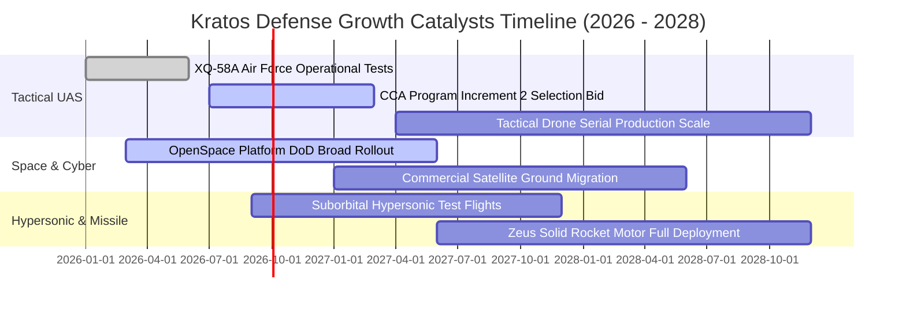

### 9.2 TAM 市場規模分析

```
╔══════════════════════════════════════════════════════════════════╗
║                   KTOS 目標市場規模（TAM）與滲透空間             ║
╠══════════════════════════════════════════════════════════════════╣
║                                                                  ║
║  ① 無人戰術僚機 (CCA / Attritable UAS)                          ║
║     總市場 TAM: $14.5B  ▓▓▓▓▓▓▓▓▓▓▓▓▓▓▓░░░░░░░  滲透率: ~3.5%   ║
║     KTOS 潛在年營收貢獻: $600M - $1.0B (隨美國防部大批採購擴展)   ║
║                                                                  ║
║  ② 軍用靶機系統 (Aerial Target Systems)                          ║
║     總市場 TAM: $2.2B   ▓▓▓▓▓▓▓▓▓▓▓▓▓▓▓▓▓▓▓▓░  滲透率: ~45.0%  ║
║     KTOS 潛在年營收貢獻: $400M - $500M (全球軍事實彈演訓壟斷)    ║
║                                                                  ║
║  ③ 太空地面虛擬化軟體 (Space Ground Software C5ISR)              ║
║     總市場 TAM: $8.0B   ▓▓▓▓▓▓▓▓▓░░░░░░░░░░░░  滲透率: ~6.0%   ║
║     KTOS 潛在年營收貢獻: $350M - $600M (OpenSpace 授權訂閱)      ║
║                                                                  ║
║  ④ 極音速與火箭推進 (Hypersonics & Propulsion)                   ║
║     總市場 TAM: $6.0B   ▓▓▓▓▓▓░░░░░░░░░░░░░░░  滲透率: ~5.0%   ║
║     KTOS 潛在年營收貢獻: $200M - $400M (Zeus 固態發動機)        ║
╚══════════════════════════════════════════════════════════════╝
```

### 9.3 成長驅動力結構圖

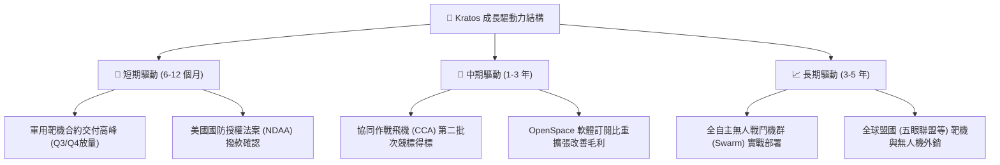

---

## 10. 風險矩陣

### 10.1 風險評分矩陣

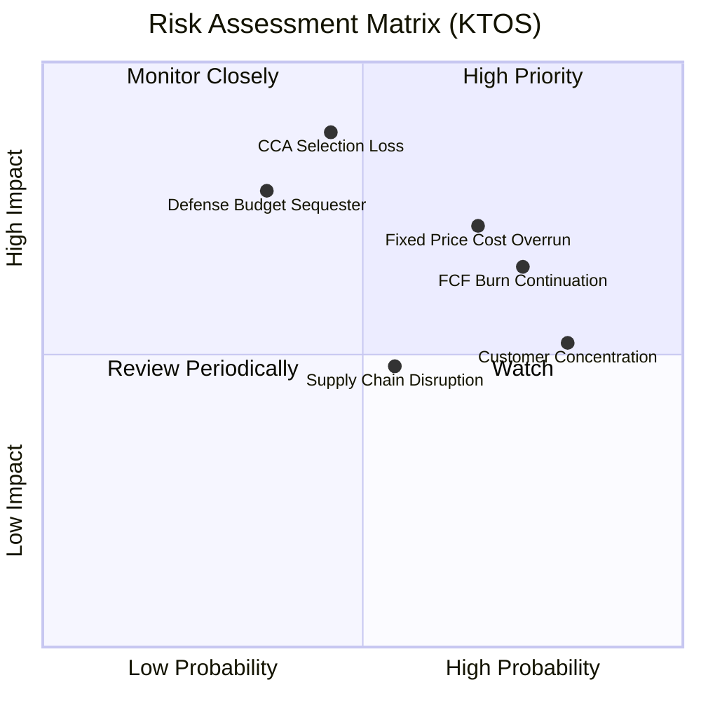

### 10.2 風險清單詳細分析

| # | 風險項目 | 發生機率 | 財務衝擊 | 風險評分 | 具體緩解與應對措施 |
|---|----------|----------|----------|----------|--------------------|
| 1 | 🔴 **美軍協同作戰飛機 (CCA) 競標失利** | 中等 (45%) | 極高 (-25% 遠期成長) | 🔴 **8.2/10** | 轉向海軍、陸戰隊及國際盟國推銷 XQ-58A，強化分系統供應商角色。 |
| 2 | 🔴 **固定價格開發合約通膨超支** | 高 (68%) | 高 (-300bps 毛利) | 🔴 **7.8/10** | 在後續新標案中加入通膨與原材料聯動調價條款（EPA）。 |
| 3 | 🟡 **自由現金流持續為負導致資金消耗** | 高 (75%) | 中 (-10% 現金儲備) | 🟡 **6.5/10** | 目前擁有 $1.44B 現金儲備，並計畫在 FY27 削減非核心 Capex。 |
| 4 | 🟡 **美國聯邦預算撥款僵局與延宕** | 中等 (35%) | 高 (-15% 短期營收) | 🟡 **6.2/10** | 持續提高非國防部與海外盟軍業務比重，平衡美國撥款週期。 |
| 5 | 🟢 **政府合約客戶過度集中** | 極高 (82%) | 中 (-5% 估值乘數) | 🟢 **5.0/10** | 太空地面部門拓展民用商業通訊衛星運營商（如 Intelsat 等）。 |

---

## 11. 投資建議

### 11.1 最終綜合評級雷達圖

```
╔══════════════════════════════════════════════════════════════╗
║                  KTOS 綜合評級與能力維度                     ║
╠══════════════════════════════════════════════════════════════╣
║                                                              ║
║  財務安全性 (Financial Safety)   9.0 ▓▓▓▓▓▓▓▓▓▓▓▓▓▓▓▓▓▓░░    ║
║  營收成長動能 (Revenue Growth)   8.5 ▓▓▓▓▓▓▓▓▓▓▓▓▓▓▓▓▓░░░    ║
║  技術護城河 (Technology Moat)    7.2 ▓▓▓▓▓▓▓▓▓▓▓▓▓▓░░░░░░    ║
║  管理層資本配置 (Capital Alloc)  6.5 ▓▓▓▓▓▓▓▓▓▓▓▓▓░░░░░░░    ║
║  當前估值吸引力 (Valuation)      4.5 ▓▓▓▓▓▓▓▓▓░░░░░░░░░░░    ║
║  獲利含金量與FCF (Earnings FCF)  3.5 ▓▓▓▓▓▓▓░░░░░░░░░░░░░    ║
║                                                              ║
║  🎯 綜合加權評分：6.8 / 10 ｜ 評級：🟡 持有 / 觀望 (HOLD)     ║
╚══════════════════════════════════════════════════════════════╝
```

### 11.2 目標價與隱含報酬率

| 情境 | 目標價 | 隱含報酬率 (相對 $47.82) | 主觀機率 | 核心假設條件 |
|------|--------|--------------------------|----------|--------------|
| 🔴 **悲觀情境 (Bear)** | **$33.00** | **-31.0%** | 25% | CCA 競標落選，利潤率受限於 3.5%，FCF 無法在三年內轉正。 |
| 🟡 **基準情境 (Base)** | **$54.50** | **+14.0%** | 55% | 營收維持 16-18% 增長，營業利益率改善至 6.5%，無人機穩步擴產。 |
| 🟢 **樂觀情境 (Bull)** | **$72.00** | **+50.6%** | 20% | 贏得美軍 CCA 主合約，OpenSpace 爆發，營業利益率逼近 10%。 |
| **機率加權期望目標價** | **$52.63** | **+10.1%** | 100% | 風險報酬比目前呈現 1:1.6，建議等待更佳風險溢價點位。 |

### 11.3 買入時機與觸發因素 Checklist

```
╔══════════════════════════════════════════════════════════════════╗
║                  KTOS 投資決策觸發 Checklist                     ║
╠══════════════════════════════════════════════════════════════════╣
║                                                                  ║
║  進場買入觸發條件（需至少滿足兩項）：                            ║
║  ☐ 股價回檔至安全邊際充裕區間：$38.00 - $43.00（MOS > 15%）      ║
║  ☐ 單季營業現金流 (OCF) 與 FCF 正式轉正且由營運本業驅動          ║
║  ☐ 美國空軍正式公告入選 CCA Increment 2 專案主要供貨商          ║
║                                                                  ║
║  現階段維持持有/觀望原因：                                       ║
║  ✅ 估值倍數高企（Forward P/E 42.8x），已充分反映無人機炒作溢價  ║
║  ✅ TTM FCF 為 -$118.29M，尚未展現自我造血之經濟回報             ║
║                                                                  ║
║  停損/減碼觸發條件（出現任一應立即行動）：                       ║
║  ☐ 美國空軍宣布由 Anduril 或其他對手獨佔無人戰鬥機採購          ║
║  ☐ 季報毛利率跌破 20.0%，顯示固定價格合約遭遇嚴重成本失控       ║
║  ☐ 管理層宣布啟動新一輪大規模股權增發（股本稀釋 > 5%）          ║
╚══════════════════════════════════════════════════════════════════╝
```

### 11.4 投資人適配度分析

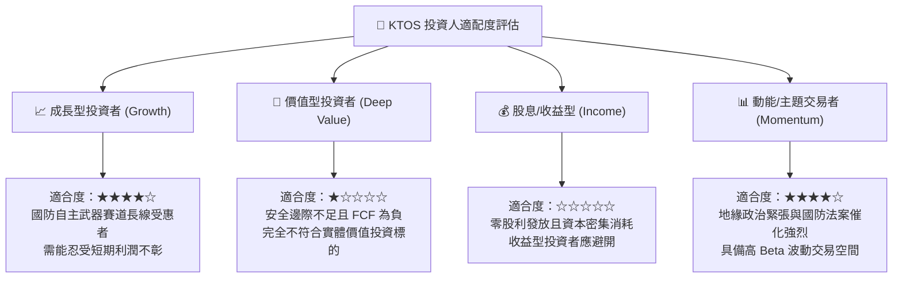

### 11.5 每季財報監控清單（Quarterly Watch List）

| 監控指標項目 | 最新值 (Q2 2026) | 正常健康區間 | 觸發【加碼】門檻 | 觸發【減碼/撤退】門檻 |
|--------------|------------------|--------------|------------------|-----------------------|
| **營收年增率 (YoY)** | 30.53% | 15% - 20% | 連續兩季 > 25% 且利潤轉正 | 跌破 10.0% |
| **GAAP 營業利益率** | -0.17% | 3.0% - 6.0% | 單季轉正且突破 > 4.5% | 連續三季為負值 |
| **單季 FCF ($M)** | -$28.2M | > $0.0M | 單季轉正 > +$20M | 單季失血超過 -$50M |
| **現金及短期投資** | $1,438M | > $1,000M | 透過本業回流增長 | 快速跌破 $800M 且未併購 |
| **庫存水位 (Inventory)** | $235.9M | 匹配營收增長 | 庫存週轉天數下降 15 天 | 存貨積壓年增 > 50% |

### 11.6 反面論證：什麼會證明論點錯誤（What Would Change My Mind）

```
╔══════════════════════════════════════════════════════════════════╗
║              ⚠️ 論點失效條件（Disconfirming Evidence）           ║
╠══════════════════════════════════════════════════════════════════╣
║                                                                  ║
║  若發生下列量化事件，當前「持有/觀望」之保守觀點將被證明為錯誤，  ║
║  應立即將評級上調為【強力買入 (Strong Buy)】：                   ║
║                                                                  ║
║  ① 營業利益率在未來 2 季內非線性跳升至 8.0% 以上，證明生產學習  ║
║     曲線提前越過損益兩平點，軟體利潤貢獻超預期；                 ║
║  ② 自由現金流 (FCF) 提前於 FY2027 大幅轉正突破 +$80M，打破資本  ║
║     過度消耗之空頭論據；                                         ║
║  ③ 美國國防部簽署總額逾 $2.0B 之全速率生產 (FRP) 無人僚機專案；║
║  ④ 股價遭遇系統性拋售回調至 $38.00 以下，安全邊際擴大至 25% 以上║
╚══════════════════════════════════════════════════════════════════╝
```

---

> **免責聲明**：本報告為依據客觀財務數據與量化評價模型所完成之機構級研究，僅供專業研究參考，不構成任何個別證券買賣之投資建議。市場有風險，投資決策應審慎評估個人風險承受度。