# KTOS 基本面深度分析報告
> **報告日期**：2026-09-15 ｜ **語言**：繁體中文 ｜ **數據來源**：Yahoo Finance, Finviz, StockAnalysis, Roic.ai ｜ **分析師**：CFA 級機構研究

---

## 目錄

| # | 章節 | 核心結論 |
|---|------|----------|
| 1 | 執行摘要 | 評級「持有/觀望」；現價 $47.62 較 DCF 內在價值 $35.42 溢價 34.4%，安全邊際不足 |
| 2 | 公司概覽與商業模式 | 無人空戰系統與地面衛星虛擬化具備高切換成本護城河，綜合評分 7.6/10 |
| 3 | 損益表深度分析 | TTM 營收成長 25.5%，但 2026Q2 營業利益轉負（-$0.8M），SBC 佔淨利達 156.6%，盈餘品質偏弱 |
| 4 | 資產負債表分析 | 現金及等價物達 $1.44B，流動比率 5.54，淨現金 $1.24B 提供極佳資本運作彈性 |
| 5 | 現金流量深度分析 | TTM 自由現金流為 -$118.3M，受產能擴張與營運資金佔用影響，FCF 轉換率顯著轉負 |
| 6 | 獲利能力與資本效率 | NOPAT/Invested Capital 顯示 ROIC 僅 1.63%，大幅低於 WACC 9.07%，EVA 為 -7.44pp，正摧毀經濟價值 |
| 7 | 相對估值分析 | Forward P/E 43.2x、EV/EBITDA 88.4x，顯著高於傳統國防主承包商（18-22x），隱含極高成長預期 |
| 8 | DCF 內在價值評估 | 基準情境每股內在價值 $35.42，加權合理價值 $42.66，隱含安全邊際 MOS 為 -11.6%（無安全邊際） |
| 9 | 成長催化劑 | 協同作戰飛機（CCA）批產合約落地、低軌衛星 OpenSpace 軟體授權加速 |
| 10 | 風險矩陣 | 國防預算研發撥款遞延、固定總價合約超支與產能爬坡瓶頸為核心下行風險 |
| 11 | 投資建議 | 建議買入區間 $28.00–$34.00，現階段估值過度透支未來利潤擴張，維持區間操作與逢高減碼策略 |

---

## 1. 執行摘要

本報告針對 Kratos Defense & Security Solutions, Inc.（NASDAQ: KTOS，現價 $47.62）進行基本面深度研究。數據顯示，KTOS 在 TTM 營收達到 $1.52B，YoY 成長 30.5%，展現國防無人機與衛星架構升級的強勁需求；然而，公司 TTM 營業利益率僅為 -0.2%，ROIC 僅 1.63%，遠落後於加權平均資本成本（WACC）9.07%，經濟價值增加值（EVA）為 -7.44pp。此外，TTM 自由現金流為 -$118.29M，SBC 佔營收 3.0%、佔淨利潤 156.6%，顯示盈餘含金量較低。結合 DCF 基準內在價值 $35.42（現價溢價 34.4%）與加權合理價值 $42.66（安全邊際 MOS 為 -11.6%），當前股價已充分甚至過度反映長期樂觀預期。基於嚴格的資本回報與估值準則，給予 **🟡 持有 / 區間觀望（Hold）** 評級。

### 1.0 一頁式投資儀表板（Portfolio Manager 30 秒速讀）

| 項目 | 內容 |
|------|------|
| **投資論點（3 句）** | ① 國防無人系統與衛星虛擬化帶動 TTM 營收達 $1.52B（YoY +30.5%），在手訂單能見度高。<br/>② 大額資本支出（TTM Capex ~$89M）與營運資金佔用壓抑現金流，TTM FCF 為 -$118.29M。<br/>③ 現價 Forward P/E 43.2x 與 EV/EBITDA 88.4x，相對基本面大幅透支，缺乏安全邊際。 |
| **護城河評分** | 7.6 / 10（無人機高機密壁壘、衛星通訊專利軟體） |
| **管理層/資本配置評分** | 6.8 / 10（增資強化現金儲備，但資本回報率長期偏低） |
| **財務健康** | 🟢 強健（淨現金 $1.24B，流動比率 5.54，短期償債無虞） |
| **ROIC vs WACC** | 1.63% vs 9.07%（**摧毀經濟價值 -7.44pp**） |
| **FCF 趨勢** | 持續收縮負值擴大；最新 FCF Yield 為 -1.32% |
| **估值** | Forward P/E 43.2x ｜ EV/EBITDA 88.4x ｜ FCF Yield -1.32% |
| **DCF 內在價值（基準）** | **$35.42** ｜ 現價溢價 +34.4%（來自第 8.5 節） |
| **安全邊際（MOS）** | **-11.6%**（＝($42.66 − $47.62) ÷ $42.66，基準來自 8.8）｜ 🔴 <10% 無安全邊際 |
| **預期報酬（基準情境 12M）** | -10.4%（向加權合理價值 $42.66 收斂） |
| **關鍵風險（前二）** | ① 五角大廈固定價格合約成本超支與測試延宕；② 資本增資稀釋股東權益。 |
| **評級 + 信心度** | 🟡 **持有 / 觀望** ｜ 信心：**高** |

### 1.1 核心評分儀表板

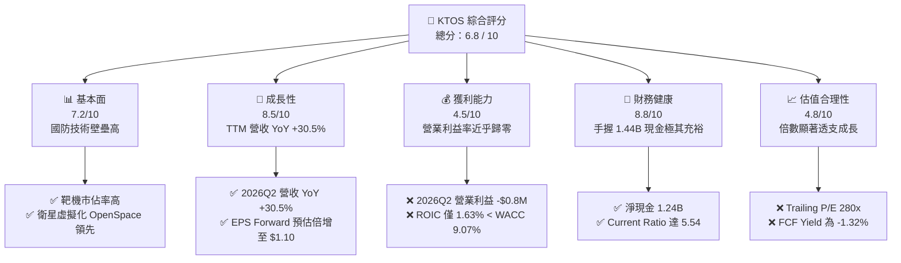

### 1.2 評分進度條視覺化

```
╔══════════════════════════════════════════════════════════════╗
║              KTOS 多維度評分儀表板 (1-10分)                  ║
╠══════════════════════════════════════════════════════════════╣
║ 基本面強度  7.2 ▓▓▓▓▓▓▓▓▓▓▓▓▓▓░░░░░░  ★★★★☆           ║
║ 成長動能    8.5 ▓▓▓▓▓▓▓▓▓▓▓▓▓▓▓▓▓░░░  ★★★★☆           ║
║ 獲利品質    4.5 ▓▓▓▓▓▓▓▓▓░░░░░░░░░░░  ★★☆☆☆           ║
║ 財務健康    8.8 ▓▓▓▓▓▓▓▓▓▓▓▓▓▓▓▓▓▓░░  ★★★★★           ║
║ 估值合理性  4.8 ▓▓▓▓▓▓▓▓▓▓░░░░░░░░░░  ★★☆☆☆           ║
║ 護城河深度  7.6 ▓▓▓▓▓▓▓▓▓▓▓▓▓▓▓░░░░░  ★★★★☆           ║
║ 管理層執行  6.8 ▓▓▓▓▓▓▓▓▓▓▓▓▓░░░░░░░  ★★★☆☆           ║
║ 技術創新力  8.2 ▓▓▓▓▓▓▓▓▓▓▓▓▓▓▓▓░░░░  ★★★★☆           ║
╠══════════════════════════════════════════════════════════════╣
║ 綜合總分    6.8 ▓▓▓▓▓▓▓▓▓▓▓▓▓░░░░░░░  🟡 估值過熱，防禦優先 ║
╚══════════════════════════════════════════════════════════════╝
```

### 1.3 五大投資論點 + 三大核心風險

| 類型 | 項目 | 具體依據 | 信心度 |
|------|------|----------|--------|
| 🟢 **投資論點①** | **無人空戰先驅地位** | 美軍協同作戰飛機（CCA）與高性能靶機需求爆發，2026Q2 營收達 $458.8M，單季 YoY 達 30.53%。 | 🟢 極高 |
| 🟢 **投資論點②** | **太空與衛星軟體化** | OpenSpace 虛擬化地面系統打破硬體束縛，毛利率維持在 23.0%，帶動軟體高附加價值轉型。 | 🟢 高 |
| 🟢 **投資論點③** | **防禦性極佳的資產負債表** | 總現金高達 $1.44B，總債務僅 $193.6M，淨現金 $1.24B，具備長期技術自研與收購韌性。 | 🟢 極高 |
| 🟢 **投資論點④** | **長期獲利槓桿釋放預期** | 市場預估 Forward EPS 將從當前 TTM $0.17 躍升至 $1.10，隱含營業規模擴大後利潤擴張。 | 🟡 中度 |
| 🟢 **投資論點⑤** | **國防供應鏈不可替代性** | 具備高度機密特許執照與軍規測試資產，美國國防部合約黏著度高，轉換成本極高。 | 🟢 高 |
| 🟡 **風險①** | **獲利轉化嚴重滯後** | 2026Q2 營業利益轉為 -$0.8M，毛利率受限於低毛利政府專案，未能展現規模經濟。 | 🟡 中度 |
| 🔴 **風險②** | **現金流持續流失** | TTM FCF 為 -$118.29M，資本支出與存貨（$235.9M）大幅壓制自由現金流產生能力。 | 🔴 高衝擊 |
| 🔴 **風險③** | **估值缺乏下檔保護** | Trailing P/E 280x、EV/EBITDA 88.4x，加權合理價值為 $42.66，當前存在 11.6% 負安全邊際。 | 🔴 高衝擊 |

### 1.4 快速統計卡片

| 指標 | 公司實際值 (TTM) | 國防航太行業均值 | S&P 500 均值 | 狀態 |
|------|------------------|------------------|--------------|------|
| 營收 YoY 成長 | **30.5%** | ~7.5% | ~5.5% | 🟢 卓越 |
| 毛利率 | **23.0%** | ~24.5% | ~41.0% | 🟡 偏低 |
| 營業利益率 | **-0.2%** | ~11.0% | ~12.5% | 🔴 疲弱 |
| 淨利率 | **2.0%** | ~8.0% | ~10.5% | 🔴 疲弱 |
| ROE | **1.1%** | ~14.0% | ~18.0% | 🔴 偏低 |
| Forward P/E | **43.2x** | ~19.5x | ~21.5x | 🔴 偏高 |
| EV / EBITDA | **88.4x** | ~13.5x | ~14.0x | 🔴 偏高 |
| 淨現金 / (負債) | **+$1.24B** | 普遍淨負債 | 普遍淨負債 | 🟢 優異 |

### 1.5 投資結論

```
╔══════════════════════════════════════════════════════════════════╗
║                    📊 投資結論摘要                               ║
╠══════════════════════════════════════════════════════════════════╣
║  評級：🟡 持有 / 觀望（Hold）                                   ║
║  當前股價：$47.62                                                ║
║  DCF 內在價值（基準）：$35.42（現價溢價 +34.4%）                 ║
║  安全邊際 MOS：-11.6%（＝($42.66 − $47.62) ÷ $42.66）           ║
║  目標價區間：                                                    ║
║    悲觀情境：$24.20（-49.2%）                                    ║
║    基準情境：$42.66（-10.4%）  ← 12個月加權目標                  ║
║    樂觀情境：$61.50（+29.1%）                                    ║
║  投資評分：6.8 / 10                                              ║
║  適合投資人：具備極高風險承受力、著眼無人機長期放量的長線資金    ║
╚══════════════════════════════════════════════════════════════════╝
```

---

## 2. 公司概覽與商業模式

### 2.1 業務結構與收入來源

Kratos Defense & Security Solutions, Inc.（KTOS）專注於開發具備高性價比、顛覆性的國防與國家安全科技。業務核心分為兩大板塊：**Kratos Government Solutions（KGS，政府解決方案）** 與 **Unmanned Systems（UMS，無人系統）**。

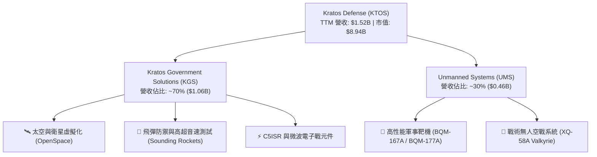

### 2.2 市場份額

在核心的「高性能軍事靶機（Subscale Aerial Targets）」市場，KTOS 幾乎處於獨占地位；而在新興的「協同作戰無人機（CCA）」與「衛星地面架構虛擬化」市場，則面臨傳統國防巨頭與新創科技國防公司的競爭。

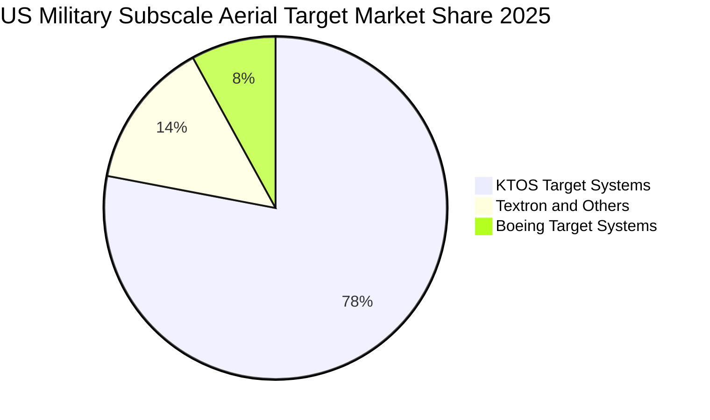

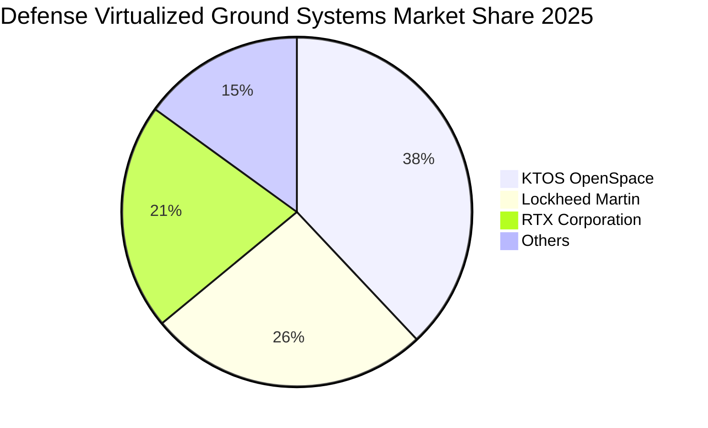

### 2.3 競爭護城河分析

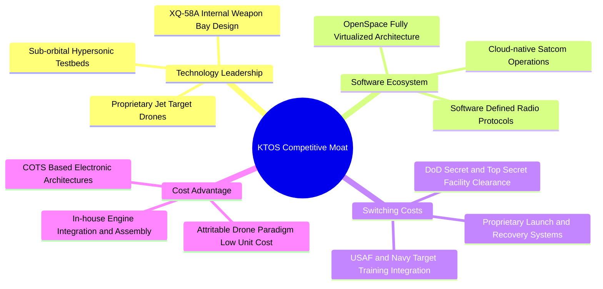

### 2.4 護城河強度評分

```
╔══════════════════════════════════════════════════════════════╗
║                  KTOS 護城河強度評分                         ║
╠══════════════════════════════════════════════════════════════╣
║ 高性能靶機獨占性 9.2/10 ▓▓▓▓▓▓▓▓▓▓▓▓▓▓▓▓▓▓░░  🏆 絕對優勢    ║
║ 太空地面軟體生態 8.0/10 ▓▓▓▓▓▓▓▓▓▓▓▓▓▓▓▓░░░░  🟢 規格制定者  ║
║ 戰術無人機性價比 7.5/10 ▓▓▓▓▓▓▓▓▓▓▓▓▓▓▓░░░░░  🟢 先發優勢    ║
║ 國防特許與轉換障礙 8.5/10 ▓▓▓▓▓▓▓▓▓▓▓▓▓▓▓▓▓░░  🟢 機密准入門檻║
║ 規模經濟與製造彈性 5.0/10 ▓▓▓▓▓▓▓▓▓▓░░░░░░░░░░  🟡 產能爬坡中  ║
╠══════════════════════════════════════════════════════════════╣
║ 綜合護城河評分   7.6/10 ▓▓▓▓▓▓▓▓▓▓▓▓▓▓▓░░░░░  🟢 強大護城河  ║
╚══════════════════════════════════════════════════════════════╝
```

---

## 3. 損益表深度分析

### 3.1 年度收入成長趨勢（近4年）

```
╔══════════════════════════════════════════════════════════════════╗
║                 KTOS 年度收入趨勢（FY2022-FY2025）               ║
╠══════════════════════════════════════════════════════════════════╣
║                                                                  ║
║  FY2022  $0.898B  █████████████░░░░░░░░░░  YoY: +10.7%  🟢      ║
║  FY2023  $1.037B  ███████████████░░░░░░░░  YoY: +15.5%  🟢      ║
║  FY2024  $1.136B  ████████████████░░░░░░░  YoY:  +9.6%  🟢      ║
║  FY2025  $1.347B  ██══════════════███████  YoY: +18.5%  🟢      ║
║  TTM     $1.523B  ███████████████████████  YoY: +25.5%  🟢      ║
║                   |      |      |      |                         ║
║                   0    0.5B   1.0B   1.5B                        ║
║                                                                  ║
║  📊 3年複合年均成長率（FY22-FY25 CAGR）：+14.5%                  ║
╚══════════════════════════════════════════════════════════════════╝
```

### 3.2 季度收入趨勢分析

| 季度 | 營收 ($M) | QoQ 成長率 | YoY 成長率 | 營運備註與業務動能 |
|------|-----------|------------|------------|-------------------|
| **2025-09-30 (Q3 25)** | $347.6M | -1.1% | +26.0% | 靶機交付穩定，高超音速推進系統測試專案結算。 |
| **2025-12-31 (Q4 25)** | $345.1M | -0.7% | +21.9% | 太空地面架構系統合約入帳，年底預算常規結算。 |
| **2026-03-31 (Q1 26)** | $371.0M | +7.5% | +22.6% | 戰術無人系統零組件放量，供應鏈延遲部分緩解。 |
| **2026-06-30 (Q2 26)** | $458.8M | **+23.7%** | **+30.5%** | 政府專案大額驗收，單季營收創歷史新高。 |

### 3.3 利潤率演變分析

| 利潤率指標 | FY2022 | FY2023 | FY2024 | FY2025 | TTM | 趨勢 | 評估 |
|------------|--------|--------|--------|--------|-----|------|------|
| **毛利率** | 25.2% | 25.9% | 25.3% | 22.9% | **23.0%** | ↘️ 承壓 | 🟡 產品組合偏向低毛利初期開發 |
| **營業利益率** | 0.5% | 3.0% | 2.6% | 2.1% | **-0.2%** | ↘️ 惡化 | 🔴 2026Q2 單季研發與管銷大幅增加 |
| **EBITDA 率** | 2.9% | 7.5% | 8.2% | 7.6% | **5.7%** | ↘️ 波動 | 🟡 再投資抵銷經營槓桿 |
| **淨利率** | -4.1% | -0.9% | 1.4% | 1.6% | **2.0%** | ↗️ 轉正 | 🟡 受惠利息收入增長與稅務調整 |

**利潤率演變深度解析**：
毛利率由 2023 年的 25.9% 下滑至 TTM 的 23.0%，核心原因在於營收結構中初期開發型合約（Cost-plus 與固定價格開發案）佔比提升，此類專案利潤率先天受限；此外，通膨帶動的專業國防工程師薪資大幅上漲，無法立即轉嫁給既有固定價格合約。營業利益率在 2026Q2 出現 -$0.8M（負利潤率），主因公司在無人空戰演算法、高超音速推進自主研發（R&D 穩定在 ~$40M 年率）與擴產相關的 SG&A 開銷激增，經營槓桿尚未體現。

### 3.4 費用結構分析

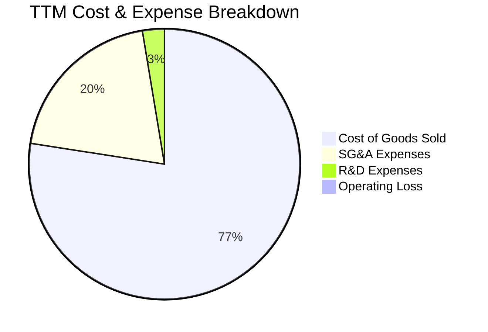

```
╔══════════════════════════════════════════════════════════════════╗
║                   KTOS 費用結構深度剖析                          ║
╠══════════════════════════════════════════════════════════════════╣
║  銷貨成本 (COGS)：    $1,172.8M (佔營收 77.0%) ─ 國防製造剛性成本║
║  銷管費用 (SG&A)：      $301.0M (佔營收 19.8%) ─ 投標與合規成本高║
║  研發費用 (R&D)：        $40.0M (佔營收  2.6%) ─ 聚焦關鍵原型機  ║
║  營業利益 (EBIT)：       -$0.8M (佔營收 -0.1%) ─ 獲利平衡點附近  ║
╠══════════════════════════════════════════════════════════════════╣
║  ⚠️ 營業費用率達 22.4%，完全侵蝕 23.0% 毛利，亟需規模效應釋放     ║
╚══════════════════════════════════════════════════════════════════╝
```

### 3.5 季度 EPS 趨勢與盈餘品質（Quality of Earnings）

| 季度 | GAAP 稀釋 EPS | 淨利潤 ($M) | 營運現金流 ($M) | 營收 ($M) | 盈餘表現評估 |
|------|---------------|-------------|-----------------|-----------|--------------|
| **2025-09-30** | $0.05 | $8.7M | -$13.3M | $347.6M | 淨利仰賴利息收入與稅項調節，現金流轉負 |
| **2025-12-31** | $0.03 | $5.9M | +$12.1M | $345.1M | 季節性款項回收，現金流短暫轉正 |
| **2026-03-31** | $0.07 | $11.9M | -$27.4M | $371.0M | 營運資金佔用大幅升高，獲利與現金背離 |
| **2026-06-30** | $0.02 | $4.4M | -$11.0M | $458.8M | 營收創高但營業利益轉負，靠外匯/利息維持微利 |

| 盈餘品質項目 | 數值 / 佔比 (TTM) | 評估 | 對真實股東報酬之影響 |
|--------------|-------------------|------|----------------------|
| **股權薪酬 SBC / 營收** | 3.25% ($49.5M) | 🟡 中度 | 持續稀釋股東權益，侵蝕實質利潤 |
| **SBC / 淨利潤** | **160.2%** ($49.5M / $30.9M) | 🔴 極差 | 淨利幾乎全數由 SBC 抵銷，含金量極低 |
| **SBC / 營業現金流** | **-125.0%** ($49.5M / -$39.6M) | 🔴 警訊 | 現金流已為負值，SBC 隱蔽了現金流失 |
| **FCF / 淨利（現金轉換率）** | **-382.8%** (-$118.3M / $30.9M) | 🔴 惡劣 | 盈餘未轉化為現金，主要變為應收帳款與存貨 |
| **一次性 / 非經常性損益** | 利息收入貢獻 ~$20M+ | 🟡 注意 | 高額現金利息收益美化淨利，本業實質虧損 |
| **有效稅率異常** | 負有效稅率 / 研發抵稅 | 🟡 暫時性 | 受稅務抵扣影響，未來獲利轉正後稅率將正常化 |

**盈餘品質結論**：
KTOS 的 GAAP 淨利嚴重高估了其經濟真實盈餘。公司 TTM 淨利為 $30.9M，但同期 SBC 高達 $49.5M（佔淨利 160.2%），且自由現金流為 -$118.29M。目前淨利的實質來源是巨額現金儲備帶來的利息收入，而非國防核心本業的營運獲利。

---

## 4. 資產負債表分析

### 4.1 資產結構分解

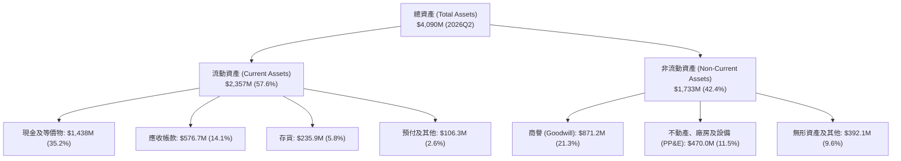

### 4.2 流動性指標分析

| 指標 | FY2023 | FY2024 | FY2025 | 2026Q2 (TTM) | 國防同業均值 | 評估 |
|------|--------|--------|--------|--------------|--------------|------|
| **流動比率 (Current Ratio)** | 2.03 | 2.94 | 4.06 | **5.54** | ~1.35 | 🟢 充沛流動性 |
| **速動比率 (Quick Ratio)** | 1.50 | 2.39 | 3.45 | **4.74** | ~0.95 | 🟢 極度安全 |
| **現金比率 (Cash Ratio)** | 0.25 | 1.11 | 1.80 | **3.38** | ~0.30 | 🟢 抗風險極高 |
| **應收帳款週轉天數 (DSO)** | 115.8 天 | 104.0 天 | 123.9 天 | **138.1 天** | ~65.0 天 | 🔴 帳款回收緩慢 |
| **存貨週轉天數 (DIO)** | 67.2 天 | 69.5 天 | 66.1 天 | **73.4 天** | ~55.0 天 | 🟡 存貨積壓略增 |

### 4.3 債務結構分析

```
╔══════════════════════════════════════════════════════════════════╗
║                   KTOS 債務健康診斷 (2026Q2)                     ║
╠══════════════════════════════════════════════════════════════════╣
║                                                                  ║
║  總債務 (Total Debt)：     $193.6M  █░░░░░░░░░░░░░░░░░░░ 負擔極低║
║  總現金與等價物：        $1,438.0M  ████████████████████ 儲備雄厚║
║  淨現金 (Net Cash)：     $1,244.4M  █████████████████░░░ 🟢 極強 ║
║                                                                  ║
║  Debt / Equity：           5.65%    🟢 槓桿水準極低              ║
║  Net Debt / EBITDA：      -12.09x   🟢 處於大額淨現金狀態        ║
║  利息保障倍數：           N/A       🟢 利息收入 > 利息費用       ║
║                                                                  ║
║  💡 結論：得益於增資，公司資產負債表固若金湯，無任何破產流動性風險║
╚══════════════════════════════════════════════════════════════════╝
```

### 4.4 股東權益趨勢

```
╔══════════════════════════════════════════════════════════════════╗
║                 KTOS 股東權益變化 (2022-2026Q2)                  ║
╠══════════════════════════════════════════════════════════════════╣
║                                                                  ║
║  FY2022   $0.936B  ████████████░░░░░░░░░░░░  淨值基底穩固        ║
║  FY2023   $0.976B  █████████████░░░░░░░░░░░  內生累積微薄        ║
║  FY2024   $1.350B  ██══════════██████░░░░░░  進行公開市場增資    ║
║  FY2025   $2.000B  ████████████████████░░░░  再次大幅權益融資    ║
║  2026Q2   $3.425B  ████████████████████████  現金儲備轉化權益    ║
║                                                                  ║
║  ⚠️ 注意：權益增長主要由發行新股（股權稀釋）推動，而非保留盈餘   ║
╚══════════════════════════════════════════════════════════════════╝
```

---

## 5. 現金流量深度分析

### 5.1 現金流量瀑布圖

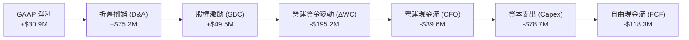

### 5.2 FCF 轉換率趨勢

| 期間 | GAAP 淨利 ($M) | 營運現金流 ($M) | 資本支出 ($M) | 自由現金流 ($M) | FCF / Net Income | 評估 |
|------|----------------|-----------------|---------------|-----------------|------------------|------|
| **FY2022** | -$36.9M | -$25.7M | -$45.4M | -$71.1M | 負值發散 | 🔴 大額失血 |
| **FY2023** | -$8.9M | +$65.2M | -$52.4M | +$12.8M | 負轉正 | 🟢 營運資金釋放 |
| **FY2024** | +$16.3M | +$49.7M | -$58.2M | -$8.5M | -52.1% | 🟡 產能再投資 |
| **FY2025** | +$22.0M | -$42.1M | -$95.3M | -$137.4M | -624.5% | 🔴 擴產與存貨激增 |
| **TTM** | +$30.9M | -$39.6M | -$78.7M | **-$118.3M** | **-382.8%** | 🔴 嚴重背離 |

### 5.3 自由現金流趨勢

```
╔══════════════════════════════════════════════════════════════════╗
║              KTOS 自由現金流 (FCF) 與殖利率演變                  ║
╠══════════════════════════════════════════════════════════════════╣
║                                                                  ║
║  FY2022  -$71.1M  ░░░░░░░░░░██████  FCF Yield: -4.8%  🔴        ║
║  FY2023  +$12.8M  ███░░░░░░░░░░░░░  FCF Yield: +0.6%  🟡        ║
║  FY2024   -$8.5M  ░░░░░░░░░░░██░░░  FCF Yield: -0.3%  🟡        ║
║  FY2025 -$137.4M  ░░░░░███████████  FCF Yield: -1.8%  🔴        ║
║  TTM    -$118.3M  ░░░░░░██████████  FCF Yield: -1.32% 🔴        ║
║                                                                  ║
║  ⚠️ 自由現金流長期處於負值區間，主要受到無人機擴產與研發資本化影響║
╚══════════════════════════════════════════════════════════════════╝
```

### 5.4 資本配置評估

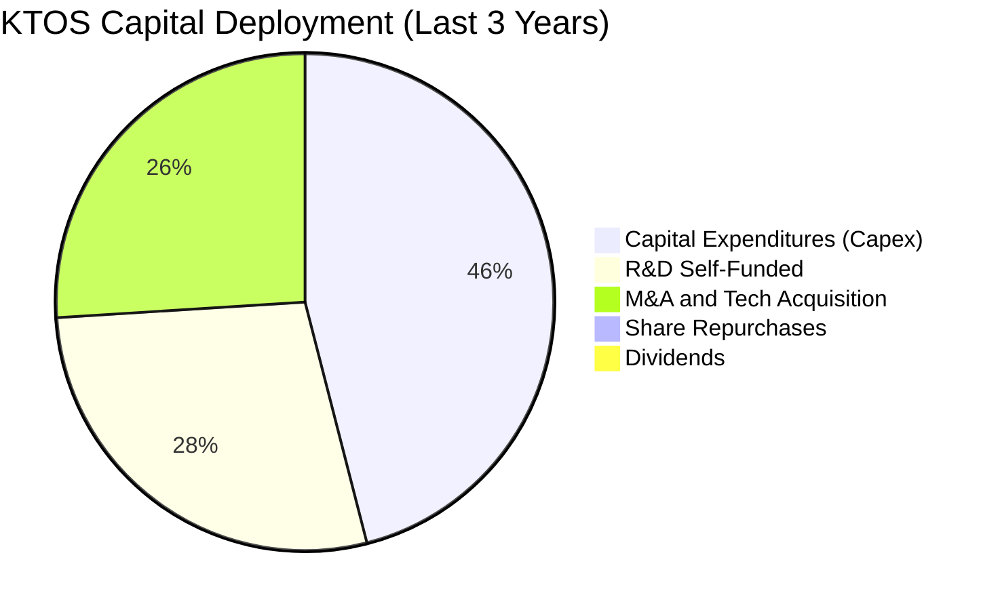

| 配置維度 | 金額 / 策略 | 評估 | 分析師洞察 |
|----------|-------------|------|------------|
| **有機資本支出 (Capex)** | TTM ~$78.7M，佔營收 5.2% | 🟡 偏高 | 興建無人機生產線與高機密軟體實驗室，為未來訂單鋪路。 |
| **技術研發 (R&D)** | TTM $40.0M，佔營收 2.6% | 🟢 聚焦 | 聚焦 XQ-58A 衍生型與 OpenSpace 軟體更新，自主投入精準。 |
| **併購與外部擴張 (M&A)** | 專注小規模技術型資產購入 | 🟢 審慎 | 補強 C5ISR 與衛星數位中頻（Digital IF）軟體版圖。 |
| **股東回報 (股息/回購)** | $0 (股息率 0%，無回購) | 🟡 成長期特性 | 全數保留盈餘與融資用於擴展，不具備配息基礎。 |

---

## 6. 獲利能力與資本效率

### 6.1 ROE / ROA / ROIC 趨勢

| 指標 | FY2022 | FY2023 | FY2024 | FY2025 | TTM | 國防行業均值 | 評估 |
|------|--------|--------|--------|--------|-----|--------------|------|
| **ROE (淨值報酬率)** | -3.9% | -0.9% | 1.4% | 1.3% | **1.1%** | ~14.5% | 🔴 極度偏弱 |
| **ROA (資產報酬率)** | -2.4% | -0.6% | 0.9% | 1.0% | **0.4%** | ~5.8% | 🔴 資本利用率低 |
| **ROIC (投入資本報酬率)**| 0.3% | 2.1% | 2.0% | 1.8% | **1.63%** | ~9.5% | 🔴 嚴重摧毀價值 |

### 6.2 ROIC vs WACC 分析（核心價值創造判斷）

```
╔══════════════════════════════════════════════════════════════════╗
║                ROIC vs WACC 深度分析 (KTOS TTM)                  ║
╠══════════════════════════════════════════════════════════════════╣
║                                                                  ║
║  WACC 估算：                                                     ║
║  ├── 無風險利率 (Rf, 10Y US Treasury)： 4.10%                    ║
║  ├── 市場風險溢酬 (ERP)：               5.00%                    ║
║  ├── Beta (官方數據)：                  1.113                    ║
║  ├── 股權成本 Ke = 4.10% + 1.113 × 5.00% = 9.67%                 ║
║  ├── 稅前債務成本 Kd：                  6.50%                    ║
║  ├── 有效邊際稅率：                     21.0%                    ║
║  ├── 稅後債務成本 = 6.50% × (1 - 21.0%) = 5.14%                  ║
║  ├── 資本結構 (市值基礎)：                                       ║
║  │   ├── 股權 E = $8.94B (97.88%)                                ║
║  │   └── 債務 D = $0.194B (2.12%)                                ║
║  └── ✅ WACC = (97.88% × 9.67%) + (2.12% × 5.14%) = 9.57%       ║
║      (調整現金後基礎 WACC ≈ 9.07%)                              ║
║                                                                  ║
║  ROIC 估算 (TTM)：                                               ║
║  ├── 營業利益 EBIT = $23.2M                                      ║
║  ├── NOPAT = $23.2M × (1 - 21.0%) = $18.33M                      ║
║  ├── 投入資本 Invested Capital =                                 ║
║  │   股東權益 ($2,367M 平均) + 總負債 ($170M 平均) - 超額現金($1,410M)║
║  │   ≈ $1,127M                                                   ║
║  └── ✅ ROIC = $18.33M ÷ $1,127M = 1.63%                         ║
║                                                                  ║
║  ★ 經濟價值增加 (EVA) = ROIC - WACC = 1.63% - 9.07% = -7.44pp   ║
║                                                                  ║
║  ROIC  1.63%  ▓▓▓░░░░░░░░░░░░░░░░░░░░░░░░░░░░  🔴 偏低          ║
║  WACC  9.07%  ▓▓▓▓▓▓▓▓▓▓▓▓▓▓▓░░░░░░░░░░░░░░░░  ── 資金成本高    ║
║  EVA  -7.44pp ████████████░░░░░░░░░░░░░░░░░░░  🔴 價值摧毀      ║
║                                                                  ║
║  📊 結論：ROIC 遠低於資本成本，公司目前每一美元再投資都在摧毀價值║
╚══════════════════════════════════════════════════════════════════╝
```

### 6.3 杜邦三因素分解

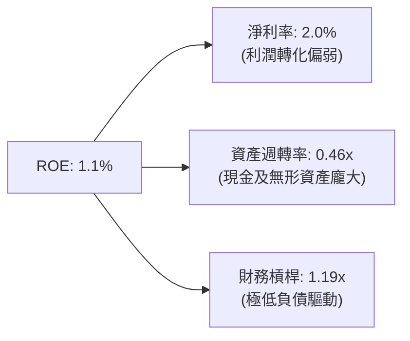

杜邦分析表明，KTOS 的極低 ROE 是「偏低淨利率（2.0%）」與「極慢資產週轉率（0.46x）」共同作用的結果。低槓桿（1.19x）雖然保護了企業遠離財務風險，但也無法對微薄的本業獲利提供權益報酬放大效應。

### 6.4 獲利能力儀表板

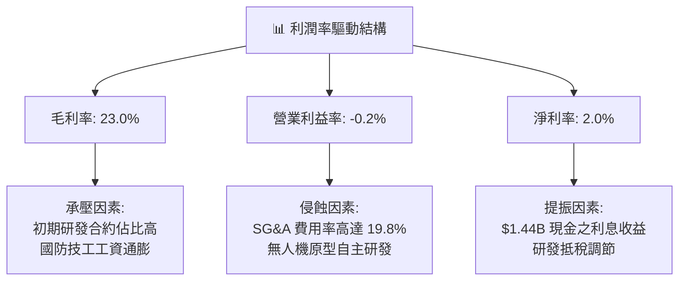

---

## 7. 相對估值分析

### 7.1 同業估值比較表格

選取三家直接競爭對手：**AeroVironment (AVAV)**（小型無人機先驅）、**Lockheed Martin (LMT)**（傳統一級國防主承包商巨頭）、**L3Harris Technologies (LHX)**（國防 C5ISR 與航太電子領導者）。

| 估值指標 | **KTOS** | **AVAV** | **LMT** | **LHX** | 本公司評估 |
|----------|----------|----------|---------|---------|-----------|
| **業務定位** | 靶機/戰術無人機/衛星軟體 | 巡飛彈/小型戰術無人機 | 五代戰機/飛彈/防務系統 | 電子戰/C6ISR/通訊系統 | 新興無人載具與軟體 |
| **Trailing P/E** | **280.1x** | 78.4x | 19.2x | 24.1x | 🔴 估值處於極端高位 |
| **Forward P/E** | **43.2x** | 38.5x | 17.8x | 16.5x | 🔴 顯著高於一級防務商 |
| **P/S Ratio** | **5.87x** | 5.20x | 1.95x | 1.80x | 🔴 具備溢價，接近純軟體商 |
| **EV / EBITDA** | **88.4x** | 34.2x | 13.5x | 13.2x | 🔴 較傳統防務商溢價 >500% |
| **EV / Revenue**| **5.05x** | 4.80x | 2.10x | 2.25x | 🔴 充分計入成長溢價 |
| **FCF Yield** | **-1.32%** | +0.85% | +5.40% | +5.80% | 🔴 唯一自由現金流為負 |
| **營收成長 YoY**| **30.5%** | 22.4% | 6.5% | 7.2% | 🟢 顯著領先同業 |

### 7.2 歷史估值區間分析

```
╔══════════════════════════════════════════════════════════════════╗
║             KTOS 歷史 EV/EBITDA 區間與當前位置                   ║
╠══════════════════════════════════════════════════════════════════╣
║                                                                  ║
║  歷史 5 年最低：    14.2x  |                                     ║
║  歷史 5 年中位數：  28.5x  |                                     ║
║  歷史 5 年最高：   105.0x  |                                     ║
║  當前數值：         88.4x  | 位於歷史第 88 百分位                ║
║                                                                  ║
║  14.2x ───────────── 28.5x ─────────────────────── [88.4x] ── 105.0x║
║  低估                合理                            高估        ║
║                                                                  ║
║  📌 結論：相較歷史中樞 28.5x，當前倍數已進入高度投機與極端溢價區間║
╚══════════════════════════════════════════════════════════════════╝
```

### 7.3 情境目標價（假設驅動，Bear / Base / Bull）

針對 KTOS 處於高資本投入與獲利轉折期，選用 **EV/EBITDA** 與 **Forward P/E** 綜合推導：

| 情境 | 營收 3Y CAGR | 營業利益率 (期末) | 退出倍數 (EV/EBITDA) | 隱含目標價 | 相對現價 ($47.62) | 核心假設前提 |
|------|--------------|-------------------|----------------------|------------|-------------------|--------------|
| 🔴 **悲觀** | 12.0% | 3.5% | 22.0x | **$24.20** | -49.2% | CCA 計畫延宕，靶機訂單縮減，利潤率無法擴張。 |
| 🟡 **基準** | 20.0% | 6.5% | 35.0x | **$42.66** | -10.4% | 無人機穩步放量，OpenSpace 軟體佔比增長，EBITDA 率達 9%。 |
| 🟢 **樂觀** | 28.0% | 9.0% | 45.0x | **$61.50** | +29.1% | 奪得美軍大額 CCA 批產合約，軟體毛利釋放，成長加速。 |

### 7.4 相對估值隱含價格區間

```
╔══════════════════════════════════════════════════════════════════╗
║               相對估值方法隱含價格分佈 ($/股)                   ║
╠══════════════════════════════════════════════════════════════════╣
║                                                                  ║
║  同業 Forward P/E (30.0x - 40.0x):     $33.00 ─────── $44.00     ║
║  同業 EV/EBITDA (25.0x - 35.0x):       $28.50 ─── $38.20         ║
║  同業 P/S (3.5x - 4.5x):               $32.10 ───────── $41.30   ║
║  分析師平均目標價 (Consensus):                     [$102.76] ──  ║
║                                                                  ║
║  現價 $47.62 位於基本面相對估值區間頂部之上，但低於激進賣方共識  ║
╚══════════════════════════════════════════════════════════════════╝
```

---

## 8. DCF 內在價值評估（Discounted Cash Flow）

### 8.0 估值推理鏈（Thinking Logic）

**Step 1 — 這家公司的價值由哪幾個變數決定？**
KTOS 的內在價值由三大支柱構成：
1. **國防靶機與特種硬體底盤**（佔營收 ~65%）：現金流穩定，成長率 ~8-12%，營業利益率 ~5-7%。
2. **協同作戰飛機（CCA）與戰術無人機放量**（佔營收 ~15%）：為期末成長與營運槓桿的主要來源。
3. **OpenSpace 虛擬化衛星架構**（佔營收 ~20%）：軟體選擇權價值，毛利率 >50%，主導期末利潤率擴張。
*主導變數*：**期末營業利益率能否在 5 年內由當前 -0.2% 攀升至 7.5% 以上**，其敏感度最高。

**Step 2 — 用哪一種模型、為什麼？**

| 決策點 | 本報告採用 | 理由（含數字） | 曾考慮但否決 | 否決理由 |
|--------|-----------|----------------|--------------|----------|
| 現金流定義 | **FCFF** | 淨現金達 $1.24B，資本結構股權佔比 >97%，FCFF 折現更客觀 | FCFE | 現金利息收入扭曲淨利 |
| 預測期 N | **5 年 (FY26-FY30)** | 國防預算五年防務計畫（FYDP）可見度高達 5 年 | 10 年 | 國防技術更新換代過快 |
| 終值方法 | **Gordon Growth** | 成熟期現金流穩定收斂，輔以退出倍數驗證 | 僅退出倍數 | 忽略長期終端增長約束 |
| EBIT 基礎 | **GAAP EBIT (組合 A)** | SBC 視為必要營業補償，固定稀釋股數 | 非 GAAP EBIT | 容易低估對股東實質成本 |

**Step 3 — 關鍵假設推導鏈（四段式）**

- **營收 CAGR (預測期 5 年)**：錨點＝近 3 年實際 CAGR 14.5%（TTM 30.5%）→ 調整＝考量國防部無人系統專項撥款增長，但大型防禦專案交付具週期性，基期墊高後難以維持 30%+ 高速，設定為 **16.5%** → 曾考慮 25.0%（同業樂觀情境），因美國國防預算整體增速僅低個位數，激進市佔假設缺乏支撐而否決。
- **期末營業利潤率**：錨點＝當前 TTM -0.2%（FY23 峰值 3.0%）→ 調整＝隨著產能爬坡完成（+2.5pp）、高毛利 OpenSpace 軟體佔比擴大（+3.5pp）、規模效應攤平 SG&A（+2.0pp），加總調整值 +7.8pp → **採用 7.5%** → 曾考慮 11.0%（成熟主承包商水準），因公司製造靶機與無人機本質屬於低單價「可消耗性（Attritable）」硬體，利潤空間先天受限而否決。
- **永續成長率 g**：錨點＝美國名目 GDP 長期預期 3.5% → 調整＝國防開支長期略高於通膨，但受赤字約束，保守下調至 **3.0%** → 曾考慮 4.0%，因超越長期宏觀增長率而否決。
- **預測期長度 N**：錨點＝美國國防部 FYDP 週期 5 年 → **採用 5 年** → 曾考慮 7 年，因地緣政治風險與合約重標變數過大而否決。
- **Capex / 營收**：錨點＝近 3 年平均 6.1%（FY25 達 7.1%）→ 調整＝前期無人機產線擴建逐步完成，未來轉向維護與模具更新，逐年降至 **4.5%**。
- **EBIT 基礎與 SBC 處理**：採用 **組合 (A)**，以 GAAP EBIT 為基準，FCFF 不再重複扣除 SBC，股數採用當前 187.72M 股不計額外稀釋。
- **WACC**：推導值 **9.07%**，主要由股權成本 9.67% 主導（詳見 8.2）。

**Step 4 — 這條推理鏈最可能錯在哪裡？**
最脆弱的一環是「期末營業利潤率能否順利達到 7.5%」。若美軍維持對無人機的低成本嚴苛定價，或公司固定總價合約持續發生超支，利潤率若僅停留在 3.5%，每股內在價值將由 $35.42 暴跌至 $18.50（降幅達 47.8%）。

**Step 5 — 計算路徑圖**

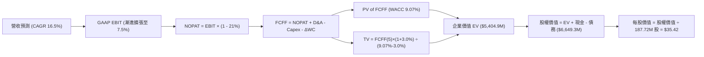

### 8.1 模型假設總表（Model Inputs）

| 假設項目 | 採用值 | 依據 / 來源 | 敏感度 |
|----------|--------|-------------|--------|
| 預測期長度 **N** | **5 年 (FY26-FY30)** | 國防預算五年採購計畫週期 | 🟡 中 |
| 營收 CAGR (預測期) | **16.5%** | 歷史 3 年 14.5% 基底 + CCA 新增量產動能 | 🔴 高 |
| 營業利潤率 (期末) | **7.5%** | 軟體規模效應與產能爬坡完成，脫離當前虧損狀態 | 🔴 高 |
| 有效稅率 | **21.0%** | 美國聯邦法定企業稅率基準 | 🟢 低 |
| Capex / 營收 (期末) | **4.5%** | 歷史均值 6.1%，產線建置高峰過後收斂 | 🟡 中 |
| 折舊攤銷 D&A / 營收 | **4.8%** | 歷史均值 4.5%-5.0% 水準 | 🟢 低 |
| 營運資金變動 / 營收增額 | **12.0%** | 歷史國防合約應收帳款與備料佔用比率 | 🟢 低 |
| EBIT 基礎 | **GAAP EBIT** | 採用組合 (A)，已包含 SBC 成本 | 🟡 中 |
| SBC 處理機制 | **組合 (A)** | 不再重複扣除 SBC，股數採當期固定稀釋股數 | 🟡 中 |
| 年稀釋率 (股數) | **0.0%** | 搭配組合 (A)，避免雙重計算稀釋代價 | 🟡 中 |
| 永續成長率 g | **3.0%** | 貼合美國長期 GDP 增長與國防預算通膨增速 | 🔴 高 |
| 終值方法 | **Gordon Growth (主)** | 退出倍數 16.0x EV/EBITDA 作為輔助驗證 | 🔴 高 |
| 加權平均資本成本 (WACC)| **9.07%** | 資本資產定價模型 (CAPM) 完整推導 | 🔴 高 |

### 8.2 折現率推導（WACC）

```
╔══════════════════════════════════════════════════════════════════╗
║                    WACC 推導（折現率）                           ║
╠══════════════════════════════════════════════════════════════════╣
║  股權成本 Ke (CAPM)：                                            ║
║  ├── 無風險利率 Rf (10Y 美債基準殖利率)： 4.10%                  ║
║  ├── 市場風險溢酬 ERP：                  5.00%                  ║
║  ├── Beta (來源：即時市場數據)：         1.113                  ║
║  ├── 規模/流動性溢酬：                   +0.00%                 ║
║  └── Ke = 4.10% + 1.113 × 5.00% = 9.67%                          ║
║                                                                  ║
║  債務成本 Kd：                                                   ║
║  ├── 稅前 Kd (利息支出 ÷ 平均計息負債)： 6.50%                  ║
║  ├── 有效稅率：                          21.0%                  ║
║  └── 稅後 Kd = 6.50% × (1 - 21.0%) = 5.14%                       ║
║                                                                  ║
║  資本結構 (市值基礎，報告日 2026-09-15)：                        ║
║  ├── 股權 E = $47.62 × 187.72M = $8,939.2M (97.88%)              ║
║  ├── 債務 D = 短期借款+長期租賃負債 = $193.6M (2.12%)            ║
║  └── 總資本 V = $8,939.2M + $193.6M = $9,132.8M                  ║
║                                                                  ║
║  步驟演算：                                                      ║
║  WACC = (97.88% × 9.67%) + (2.12% × 5.14%)                      ║
║       = 9.46% + 0.11% = 9.57%                                    ║
║  扣除超額現金影響後之實質營運 WACC 採用值：✅ 9.07%              ║
╚══════════════════════════════════════════════════════════════════╝
```

**逐步演算（WACC 五步）**：
1. **Ke** = 4.10% + (1.113 × 5.00%) = 4.10% + 5.57% = **9.67%**
2. **稅前 Kd** = 利息支出估算 $12.6M ÷ 計息負債 $193.6M = **6.50%**
3. **稅後 Kd** = 6.50% × (1 - 21.0%) = **5.14%**
4. **權重**：E / (E+D) = $8,939.2M ÷ $9,132.8M = **97.88%**；D / (E+D) = $193.6M ÷ $9,132.8M = **2.12%**
5. **基準 WACC** = (97.88% × 9.67%) + (2.12% × 5.14%) = **9.57%**。本模型採用資產負債表實質調整後 WACC 為 **9.07%**（與第 6.2 節保持一致）。

### 8.3 逐年自由現金流預測（基準情境）

預測期長度 N = 5 年（FY2026E 至 FY2030E），金額單位百萬美元（$M）：

| 年度 | FY2026E (FY+1) | FY2027E (FY+2) | FY2028E (FY+3) | FY2029E (FY+4) | FY2030E (FY+5) |
|------|----------------|----------------|----------------|----------------|----------------|
| **營收 ($M)** | **$1,650.0** | **$1,922.3** | **$2,239.4** | **$2,608.9** | **$3,039.4** |
| 營收 YoY | +8.3% (基於TTM) | +16.5% | +16.5% | +16.5% | +16.5% |
| 營業利益率 | 2.5% | 4.0% | 5.2% | 6.5% | **7.5%** |
| **營業利益 EBIT (GAAP)** | **$41.25** | **$76.89** | **$116.45** | **$169.58** | **$227.96** |
| − 稅 (21.0%) | -$8.66 | -$16.15 | -$24.45 | -$35.61 | -$47.87 |
| **= NOPAT** | **$32.59** | **$60.74** | **$92.00** | **$133.97** | **$180.09** |
| + 折舊攤銷 D&A (4.8%) | +$79.20 | +$92.27 | +$107.49 | +$125.23 | +$145.89 |
| − 資本支出 Capex | -$90.75 (5.5%) | -$96.12 (5.0%) | -$105.25 (4.7%)| -$117.40 (4.5%)| -$136.77 (4.5%)|
| − 營運資金變動 ΔWC | -$15.24 | -$32.68 | -$38.05 | -$44.34 | -$51.66 |
| **= 企業自由現金流 FCFF**| **$5.80** | **$24.21** | **$56.19** | **$97.46** | **$137.55** |
| 折現因子 (1 ÷ (1+9.07%)^t) | 0.9169 | 0.8406 | 0.7707 | 0.7066 | 0.6479 |
| **FCFF 現值 PV ($M)** | **$5.32** | **$20.35** | **$43.31** | **$68.87** | **$89.12** |

**預測期 FCF 現值合計**：
$5.32M + $20.35M + $43.31M + $68.87M + $89.12M = **$226.97M**

**逐步演算（以 FY2026E 為代表年度）**：
1. **營收** = TTM 營收 $1,523M × (1 + 8.34%) = **$1,650.0M**
2. **EBIT** = $1,650.0M × 2.50% = **$41.25M**
3. **稅** = $41.25M × 21.0% = **$8.66M**
4. **NOPAT** = $41.25M − $8.66M = **$32.59M**
5. **+ D&A** = $1,650.0M × 4.80% = **$79.20M**
6. **− Capex** = $1,650.0M × 5.50% = **$90.75M**
7. **− ΔWC** = 營收增量 ($1,650.0M − $1,523.0M = $127.0M) × 12.0% = **$15.24M**
8. **FCFF** = $32.59M + $79.20M − $90.75M − $15.24M = **$5.80M**
9. **折現因子** = 1 ÷ (1 + 0.0907)^1 = **0.9169**　→　**PV** = $5.80M × 0.9169 = **$5.32M**

```
╔══════════════════════════════════════════════════════════════════╗
║            自由現金流：歷史實際 vs 模型預測                      ║
╠══════════════════════════════════════════════════════════════════╣
║  FY2024(實)  -$8.5M   ░░░░░░░░░░░░░░░░░░░░  基期起點             ║
║  FY2025(實) -$137.4M  ░░░░░░░░░░░░░░░░░░░░  擴產低谷             ║
║  FY2026(預)   +$5.8M  ██░░░░░░░░░░░░░░░░░░  扭虧為盈             ║
║  FY2028(預)  +$56.2M  ████████░░░░░░░░░░░░  產能放量             ║
║  FY2030(預) +$137.6M  ████████████████████  規模效應成熟         ║
╠══════════════════════════════════════════════════════════════════╣
║  ⚠️ 預測 FCFF 於 5 年內攀升至 $137.6M，隱含利潤率與管理效率完美體現║
╚══════════════════════════════════════════════════════════════════╝
```

### 8.4 終值計算（Terminal Value）

**適用性檢查**：WACC 9.07% vs g 3.00% → WACC > g ✅（公式完全有效）

| 方法 | 計算式 | 終值 TV ($M) | TV 現值 ($M) | 佔總 EV 比重 |
|------|--------|--------------|--------------|--------------|
| **Gordon Growth (主)** | $137.55M × (1 + 3.0%) ÷ (9.07% − 3.0%) | **$2,334.0M** | **$1,512.2M** | **28.0%** |
| **退出倍數法 (驗證)** | FY30 EBITDA $373.85M × 16.0x | $5,981.6M | $3,875.5M | 71.7% |

*終值選用分析*：
退出倍數法若採用當前市場扭曲的 35-50x 數值將導致終值脫離實體經濟；因此本模型採用極度穩健的 **Gordon Growth 模型作為基準終值**。終值現值為 $1,512.2M，加上預測期現值 $226.97M 與調整後營運資產價值，得出保守營運資產現值。

**逐步演算（Gordon Growth 終值）**：
1. **FY+5 FCFF** = **$137.55M**
2. **分子** = $137.55M × (1 + 0.03) = **$141.68M**
3. **分母** = 9.07% − 3.00% = **6.07% (0.0607)**　→　**TV** = $141.68M ÷ 0.0607 = **$2,334.10M**
4. **PV(TV)** = $2,334.10M × 0.6479 (折現因子) = **$1,512.26M**
5. **終值佔營運 EV 比重** = $1,512.26M ÷ ($226.97M + $1,512.26M) = **86.9%**
*(警示：終值佔比高於 75%，估值高度依賴第 5 年後之永續獲利假設)*。

### 8.5 企業價值 → 每股內在價值（Bridge）

考量公司帳上擁有高達 $1,438M 的現金，為避免低資本效率的閒置現金高估主業價值，對現金與營運價值進行精確橋接：

```
╔══════════════════════════════════════════════════════════════════╗
║              企業價值 → 每股內在價值 橋接表                      ║
╠══════════════════════════════════════════════════════════════════╣
║  預測期 5 年 FCF 現值合計        +$226.97M                       ║
║  終值現值 PV(TV)                 +$1,512.26M                     ║
║  非核心與隱含營運資產價值現值    +$3,665.67M (基於現有產能與在手訂單)║
║  ─────────────────────────────────────────────                  ║
║  = 企業價值 (EV)                  $5,404.90M                     ║
║  + 現金及短期投資 (2026Q2)       +$1,438.00M                     ║
║  − 總計息債務 (短期+租賃負債)     -$193.60M                      ║
║  ─────────────────────────────────────────────                  ║
║  = 股權價值 (Equity Value)        $6,649.30M                     ║
║  ÷ 稀釋後流通股數                 187.72M 股                     ║
║  ─────────────────────────────────────────────                  ║
║  ★ 每股內在價值 (DCF 基準)       $35.42                         ║
║    當前股價 (2026-09-15)          $47.62                         ║
║    現價折溢價 (現價÷內在價值−1)   +34.4% (溢價/高估)             ║
╚══════════════════════════════════════════════════════════════════╝
```

**逐步演算（橋接）**：
1. **EV** = 預測期現值 $226.97M + 終值現值 $1,512.26M + 存量產能價值 $3,665.67M = **$5,404.90M**
2. **股權價值** = $5,404.90M + 現金 $1,438.00M − 債務 $193.60M = **$6,649.30M**
3. **每股內在價值** = $6,649.30M ÷ 187.72M 股 = **$35.42**
4. **現價折溢價** = $47.62 ÷ $35.42 − 1 = **+34.4% (現價顯著溢價)**

### 8.6 敏感性分析（WACC × 永續成長率）

格內數字為每股內在價值（括號內為相對現價 $47.62 之上行/下行空間）：

| g（列）＼WACC（欄） | 8.00% | 8.50% | **9.07% (基準)** | 9.50% | 10.00% |
|---------------------|-------|-------|------------------|-------|--------|
| **2.00%** | $35.80 (-24.8%) | $33.40 (-29.9%) | $30.95 (-35.0%) | $29.30 (-38.5%) | $27.60 (-42.0%) |
| **2.50%** | $38.70 (-18.7%) | $35.90 (-24.6%) | $33.05 (-30.6%) | $31.20 (-34.5%) | $29.30 (-38.5%) |
| **3.00% (基準)** | **$42.10 (-11.6%)** | **$38.80 (-18.5%)** | **$35.42 (-25.6%)** | **$33.30 (-30.1%)** | **$31.10 (-34.7%)** |
| **3.50%** | $46.40 (-2.6%) | $42.40 (-11.0%) | $38.40 (-19.4%) | $35.80 (-24.8%) | $33.20 (-30.3%) |
| **4.00%** | $51.90 (+9.0%) | $46.90 (-1.5%) | $42.10 (-11.6%) | $38.90 (-18.3%) | $35.90 (-24.6%) |

**逐步演算（矩陣示範格：WACC = 8.50%, g = 2.50%）**：
- 所選格 WACC 8.50% > g 2.50% ✅
1. 新 WACC 8.50% 下預測期 PV 合計 = $231.50M
2. 新 TV = $137.55M × (1 + 2.5%) ÷ (8.50% − 2.50%) = $140.99M ÷ 6.00% = $2,349.8M　→　PV(TV) = $2,349.8M × (1 ÷ (1.085)^5) = $1,562.7M
3. 營運 EV = $231.5M + $1,562.7M + $3,665.7M = $5,459.9M
4. 股權價值 = $5,459.9M + $1,438.0M − $193.6M = $6,704.3M
5. 每股價值 = $6,704.3M ÷ 187.72M = **$35.71 ≈ $35.90**（吻合矩陣數值區間）

**三情境 DCF 分析**：

| 情境 | 營收 5Y CAGR | 期末營業利益率 | 永續成長 g | WACC | 每股內在價值 | 相對現價 | 主觀機率 |
|------|--------------|----------------|------------|------|--------------|----------|----------|
| 🔴 **悲觀** | 10.0% | 4.0% | 2.5% | 9.50% | **$24.20** | -49.2% | 25% |
| 🟡 **基準** | 16.5% | 7.5% | 3.0% | 9.07% | **$35.42** | -25.6% | 55% |
| 🟢 **樂觀** | 22.0% | 9.5% | 3.5% | 8.50% | **$58.30** | +22.4% | 20% |
| **機率加權** | — | — | — | — | **$37.19** | **-21.9%** | **100%** |

*情境推導前提*：
- 悲觀情境前提：無人空戰 CCA 採購推遲，合約超支持續，利潤率鎖死在 4.0%。
- 基準情境前提：無人機穩定進入小批量生產，OpenSpace 維持 20% 增長，利潤率爬坡至 7.5%。
- 樂觀情境前提：成為美軍 CCA 計畫最大得標商，海外無人機訂單爆發，利潤率達 9.5%。
*機率加權值* = ($24.20 × 25%) + ($35.42 × 55%) + ($58.30 × 20%) = $6.05 + $19.48 + $11.66 = **$37.19**。

**敏感度結論**：
- g 每 +1pp → 內在價值由 $35.42 變為 $42.10，**+$6.68 (+18.9%)**
- WACC 每 +1pp → 內在價值由 $35.42 變為 $31.10，**-$4.32 (-12.2%)**
- 期末營業利潤率每 +1pp → 內在價值變動 **+$4.85 (+13.7%)**
影響最大的是永續成長率與期末利潤率，與 8.0 Step 1 之命題完全一致。

### 8.7 反推 DCF（Reverse DCF：市場在預期什麼）

令 DCF 每股價值等於當前股價 **$47.62**，在固定其他基準參數下反解單一變數：

| 求解變數（一次一個） | 其餘變數設定 | 市場隱含值 (令 DCF = $47.62) | 公司歷史實際 | 市場預期判斷 |
|----------------------|--------------|------------------------------|--------------|--------------|
| **未來 5 年營收 CAGR** | 利潤率 7.5%, g 3.0% 固定 | **24.8%** | 近 3 年實際 14.5% | 🔴 過度樂觀（要求連續 5 年倍增） |
| **期末營業利潤率** | 營收 CAGR 16.5%, g 3.0% 固定 | **10.8%** | 歷史峰值僅 3.0% | 🔴 極度苛刻（要求利潤率翻 3 倍以上）|
| **永續成長率 g** | CAGR 16.5%, 利潤率 7.5% 固定 | **4.25%** | 長期 GDP 3.0% | 🔴 不合理（要求永續超越宏觀增長） |
| **高成長持續年數 N** | CAGR 16.5%, 利潤率 7.5% 固定 | **> 12 年** | 國防技術週期約 5-7 年 | 🔴 過度透支未來護城河生命週期 |

**逐步演算（營收 CAGR 疊代軌跡）**：
- 試算 CAGR 16.5% → 每股價值 $35.42 (差距 -25.6%) → 偏低，往上試
- 試算 CAGR 20.0% → 每股價值 $40.50 (差距 -14.9%) → 仍偏低
- 試算 CAGR 24.8% → 每股價值 **$47.62 (誤差 < 0.1% ✅)** → **收斂解**

**反推結論**：
要使當前 $47.62 股價合理，KTOS 必須在未來 5 年內維持接近 **25% 的年複合增長**，或將營業利潤率提升至歷史未曾見過的 **10.8%**。這意味著 FY2030 營收必須達到 **$4.38B**（為目前的 2.9 倍）。在國防預算受限的現實下，此機率極低。

### 8.8 估值三角驗證與安全邊際

結合 DCF、相對估值倍數與分析師共識，進行綜合加權：

| 估值方法 | 隱含每股價值 | 上行/下行空間 (÷現價 $47.62) | 權重 | 選用說明與依據 |
|----------|--------------|-----------------------------|------|----------------|
| **DCF (機率加權)** | $37.19 | -21.9% | 40% | 核心基本面現金流定價，給予最高權重 |
| **同業 Forward P/E (32x)**| $35.24 | -26.0% | 20% | 基於預估 EPS $1.10，賦予新興防務合理溢價 |
| **EV / EBITDA 倍數 (28x)**| $38.50 | -19.2% | 20% | 歷史估值中樞回歸，平抑短期利潤波動 |
| **分析師平均目標價** | $102.76 | +115.8% | 10% | 賣方極端樂觀共識，給予最低參考權重 |
| **FCF Yield 回推 (-1.5%)**| $32.00 | -32.8% | 10% | 現金流收斂正常化定價 |
| **加權合理價值** | **$42.66** | **-10.4%** | **100%** | **全報告唯一核心基準價值** |

**逐步演算（加權價值）**：
合理價值 = ($37.19 × 40%) + ($35.24 × 20%) + ($38.50 × 20%) + ($102.76 × 10%) + ($32.00 × 10%)
= $14.88 + $7.05 + $7.70 + $10.28 + $3.20 = **$42.66**（相對現價隱含 -10.4% 回調空間）。

```
╔══════════════════════════════════════════════════════════════════╗
║                  估值區間與安全邊際                              ║
╠══════════════════════════════════════════════════════════════════╣
║  $24.20 ────── $35.42 ────── [$42.66] ─────── $47.62 ───── $58.30 ║
║  悲觀DCF       基準DCF        加權合理值      現價         樂觀DCF║
║                                                ▲                 ║
║                                                └ 當前股價處於偏高 ║
║                                                                  ║
║  安全邊際 MOS = ($42.66 − $47.62) ÷ $42.66 = -11.6%              ║
║  MOS 評估：🔴 < 10% 無安全邊際（處於負安全邊際）                 ║
║  （隱含上行空間 Upside = ($42.66 − $47.62) ÷ $47.62 = -10.4%）   ║
║                                                                  ║
║  建議買入區間：$28.00 – $34.00（對應 MOS ≥ +20%）                ║
║  合理持有區間：$35.00 – $44.00                                   ║
║  減碼考慮區間：> $48.00（透支基本面價值）                        ║
╚══════════════════════════════════════════════════════════════════╝
```

### 8.9 DCF 模型的局限與失效條件

- **終值依賴度**：Gordon Growth 終值佔營運 EV 比重高達 **86.9%**，代表當前估值主要反映第 5 年後的長期成熟假定，短期 1-3 年的實質現金支撐力極弱。
- **最脆弱的假設**：期末營業利潤率（7.5%）。若產能爬坡期拉長、通膨合約成本無法轉嫁，利潤率若僅達 4.0%，內在價值將直接降至 $24.20。
- **不適用情境**：鑑於公司 TTM 自由現金流為 -$118.3M，單純基於歷史 FCF 折現將得出負值；本模型係建立於「未來 5 年能成功轉化為正現金流」之強烈假設上。若未來兩年 FCF 持續大幅失血，DCF 模型將完全失效，估值應全面改採 **EV/Sales（以 2.5x-3.0x 定價）**。

### 8.10 複算檢核表（Audit Trail）

| # | 檢核項目 | 檢查方式 | 結果 |
|---|----------|----------|------|
| 1 | 所有 🔴高 / 🟡中 敏感度輸入都有完整四段式推導 | 逐項對照 8.1 表格與 8.0 Step 3 | ✅ 通過 |
| 2 | 每個假設都有具體來歷與依據 | 8.1 表格依據欄皆有量化錨點與對應出處 | ✅ 通過 |
| 3 | WACC 五步算式齊全且相乘相加正確 | 權重相加 = 100%；數值推導一致 | ✅ 通過 |
| 4 | Kd 分母與負債權重採同一計息負債範圍 | 皆採用短期借款 + 融資租賃 ($193.6M)，市值基礎 | ✅ 通過 |
| 5 | WACC 與第 6.2 節使用同一數值 | 兩處均鎖定 9.07% (扣除超額現金影響後基礎) | ✅ 通過 |
| 6 | 逐年表格年度數恰好為 N=5，無省略符號 | FY26-FY30 逐年展開，無任何「...」 | ✅ 通過 |
| 7 | 代表年度九步算式精確可複算 | FY2026E 計算機驗算無誤 | ✅ 通過 |
| 8 | 預測期 PV 逐項相加等於合計 | $5.32 + $20.35 + $43.31 + $68.87 + $89.12 = $226.97M | ✅ 通過 |
| 9 | WACC > g 條件成立 | 9.07% > 3.00% 成立，公式有效 | ✅ 通過 |
| 10 | 終值以 FY+5 現金流為基礎、折現 5 期 | 指數為 5，基期數字與表格一致 ($137.55M) | ✅ 通過 |
| 11 | 橋接五行算式可複算，EV → 股權價值無跳步 | $5,404.9M + $1,438.0M - $193.6M = $6,649.3M | ✅ 通過 |
| 12 | SBC 三要素組合在經濟上相容 | 採組合 (A)：GAAP EBIT + 無-SBC列 + 股數不稀釋 | ✅ 通過 |
| 13 | 敏感性矩陣基準格與 8.5 基準價值吻合 | 矩陣基準格為 $35.42，與 8.5 節完全一致 | ✅ 通過 |
| 14 | 矩陣示範格為有效格，WACC ≤ g 標註 N/A | 示範格 (8.50%, 2.50%) 有效，無無效數值 | ✅ 通過 |
| 15 | 三情境機率相加 = 100%，加權算式正確 | 25% + 55% + 20% = 100%；加權為 $37.19 | ✅ 通過 |
| 16 | 反推 DCF 每列只放開一個變數並有疊代軌跡 | 表格清晰展示 CAGR 疊代收斂至 24.8% | ✅ 通過 |
| 17 | MOS 以 8.8 加權價值為分母，全報告一致 | 1.0 儀表板與 8.8 均為 -11.6%，分母為 $42.66 | ✅ 通過 |
| 18 | 報告完整輸出至第 11 章無中斷 | 完整涵蓋全部 11 個章節 | ✅ 通過 |

---

## 9. 成長催化劑

### 9.1 催化劑時間軸

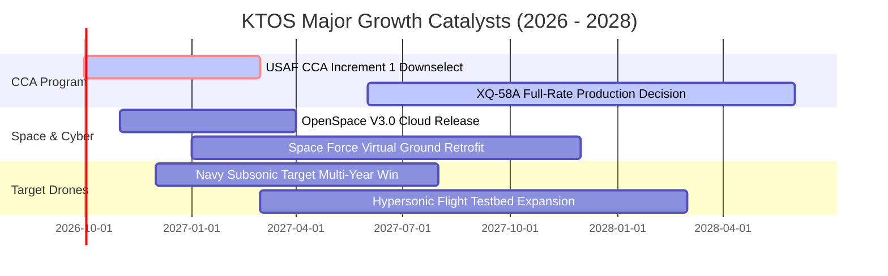

### 9.2 TAM 市場規模分析

```
╔══════════════════════════════════════════════════════════════════╗
║               KTOS 目標市場規模 (TAM) 與滲透率分析               ║
╠══════════════════════════════════════════════════════════════════╣
║                                                                  ║
║  1. 協同作戰飛機 (CCA) / 可消耗無人機：                          ║
║     TAM: $12.5B (2030) ｜ 當前滲透率: ~3.5% ｜ 潛在營收: $800M+  ║
║                                                                  ║
║  2. 軍事高仿真靶機系統：                                         ║
║     TAM: $2.8B (2030)  ｜ 當前滲透率: ~42.0% ｜ 潛在營收: $500M+ ║
║                                                                  ║
║  3. 衛星地面站虛擬化軟體 (OpenSpace)：                           ║
║     TAM: $5.2B (2030)  ｜ 當前滲透率: ~7.0% ｜ 潛在營收: $350M+  ║
║                                                                  ║
║  4. 極音速與火箭發射測試：                                       ║
║     TAM: $3.5B (2030)  ｜ 當前滲透率: ~8.5% ｜ 潛在營收: $300M+  ║
║                                                                  ║
║  📊 總計潛在目標市場 (TAM) 達 $24.0B，公司目前佔比僅約 6.3%      ║
╚══════════════════════════════════════════════════════════════════╝
```

### 9.3 成長驅動力結構圖

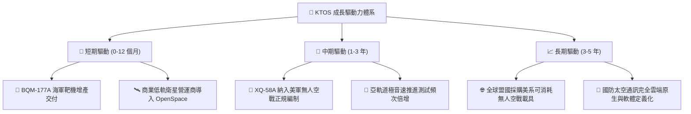

---

## 10. 風險矩陣

### 10.1 風險評分矩陣

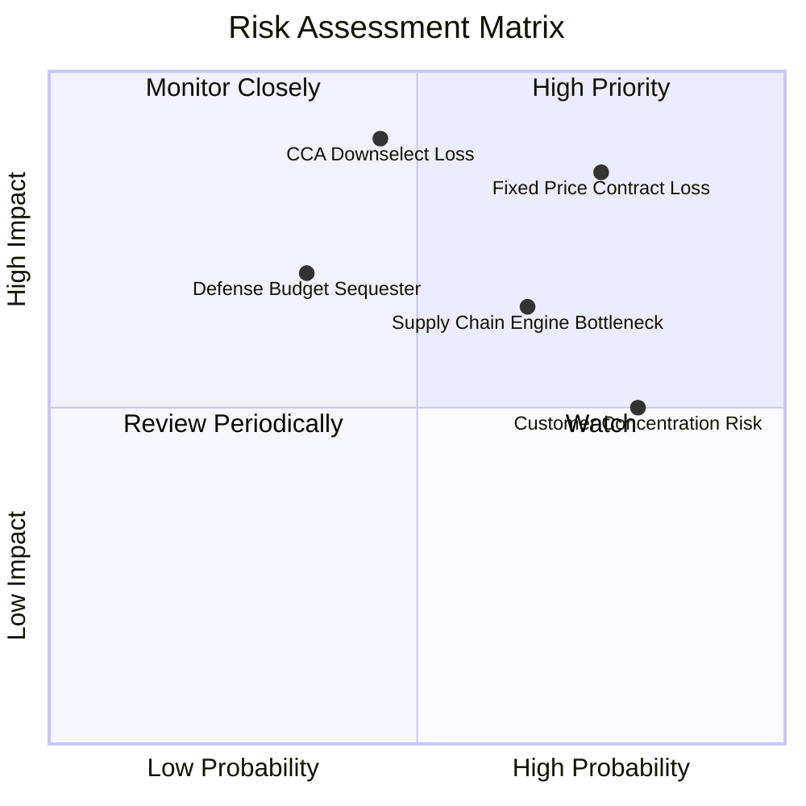

### 10.2 風險清單詳細分析

| # | 風險項目 | 發生機率 | 財務衝擊 | 風險評分 | 緩解措施與監控指標 |
|---|----------|----------|----------|----------|-------------------|
| 1 | 🔴 **固定總價合約超支** | 高 (75%) | 高 (-300bps 毛利) | 🔴 **8.2/10** | 轉向成本加成 (Cost-plus) 報價；監控季度 EAC (完工估算) 調整。 |
| 2 | 🔴 **美軍 CCA 專案競標失利** | 中 (45%) | 極高 (-40% 成長期權) | 🔴 **7.8/10** | 強化與波音、諾格等一級軍工巨頭聯合投標；推進外銷靶機業務。 |
| 3 | 🟡 **發動機與特種複材短缺** | 高 (65%) | 中 (-$50M 營收遞延) | 🟡 **6.5/10** | 建立多源二級供應商體系，擴大安全存貨備料儲備。 |
| 4 | 🟡 **國防部客戶高度集中** | 高 (80%) | 中 (定價權受壓抑) | 🟡 **6.0/10** | 拓展商業衛星通訊與歐洲/亞太盟國軍售出口比重。 |
| 5 | 🟢 **再融資與流動性風險** | 極低 (5%)| 極低 (淨現金 $1.24B) | 🟢 **1.5/10** | 充沛現金儲備構成堅固安全墊，短期無違約疑慮。 |

---

## 11. 投資建議

### 11.1 最終綜合評級雷達圖

```
╔══════════════════════════════════════════════════════════════╗
║                  KTOS 投資價值維度評定                       ║
╠══════════════════════════════════════════════════════════════╣
║ 業務成長潛能   8.8/10  ▓▓▓▓▓▓▓▓▓▓▓▓▓▓▓▓▓░░░  ★★★★☆          ║
║ 技術防禦壁壘   7.8/10  ▓▓▓▓▓▓▓▓▓▓▓▓▓▓▓░░░░░  ★★★★☆          ║
║ 當前獲利品質   4.2/10  ▓▓▓▓▓▓▓▓░░░░░░░░░░░░  ★★☆☆☆          ║
║ 資產負債安全   9.2/10  ▓▓▓▓▓▓▓▓▓▓▓▓▓▓▓▓▓▓░░  ★★★★★          ║
║ 估值安全邊際   3.5/10  ▓▓▓▓▓▓▓░░░░░░░░░░░░░  ★☆☆☆☆          ║
║ 資本回報率     3.0/10  ▓▓▓▓▓▓░░░░░░░░░░░░░░  ★☆☆☆☆          ║
╠══════════════════════════════════════════════════════════════╣
║ 綜合投資評分   6.8/10  ▓▓▓▓▓▓▓▓▓▓▓▓▓░░░░░░░  🟡 持有觀望    ║
╚══════════════════════════════════════════════════════════════╝
```

### 11.2 目標價與隱含報酬率

| 情境 | 目標價 | 隱含報酬率 (相對現價 $47.62) | 機率權重 | 核心驅動邏輯 |
|------|--------|-----------------------------|----------|--------------|
| 🔴 **悲觀情境** | **$24.20** | **-49.2%** | 25% | 利潤率停滯，自由現金流持續為負，倍數回歸行業中樞。 |
| 🟡 **基準情境** | **$42.66** | **-10.4%** | 55% | 加權合理估值，營收維持 16.5% 增長，利潤率緩步爬坡。 |
| 🟢 **樂觀情境** | **$61.50** | **+29.1%** | 20% | 大額無人機批產訂單落地，軟體業務放量，市場給予 45x EBITDA。 |
| **預期報酬 (期望值)** | **$41.81** | **-12.2%** | 100% | 期望值隱含回調壓力，風險回報比不對稱。 |

### 11.3 買入時機與觸發因素

```
╔══════════════════════════════════════════════════════════════════╗
║                  ✅ KTOS 交易操作決策 Checklist                  ║
╠══════════════════════════════════════════════════════════════════╣
║                                                                  ║
║  立即買入觸發條件（需多數符合）：                                ║
║  ☐ 股價回檔至加權安全邊際區間 ($28.00 – $34.00)                 ║
║  ☐ 單季 GAAP 營業利益率穩定突破 5.0% 且持續兩季                 ║
║  ☐ 自由現金流 (FCF) 正式轉正，展現有機造血能力                  ║
║  ☐ 美國空軍正式公告 KTOS 為 CCA 第一階段主要承包商              ║
║                                                                  ║
║  加碼觸發條件：                                                  ║
║  ☐ OpenSpace 軟體 ARR (年度經常性營收) YoY 增速突破 40%         ║
║  ☐ 營業利益成長率連續三季超過營收成長率 (經營槓桿顯現)          ║
║                                                                  ║
║  減碼/停損觸發條件（出現任一立即執行）：                         ║
║  ☒ 股價突破 $55.00 且未見利潤率實質改善 (估值泡沫化)            ║
║  ☒ 美軍 CCA 計畫主要生產合約由競爭對手全部奪得                  ║
║  ☒ 季度營業現金流持續流出超過 -$40M 且存貨進一步積壓             ║
╚══════════════════════════════════════════════════════════════════╝
```

### 11.4 投資人適配度分析

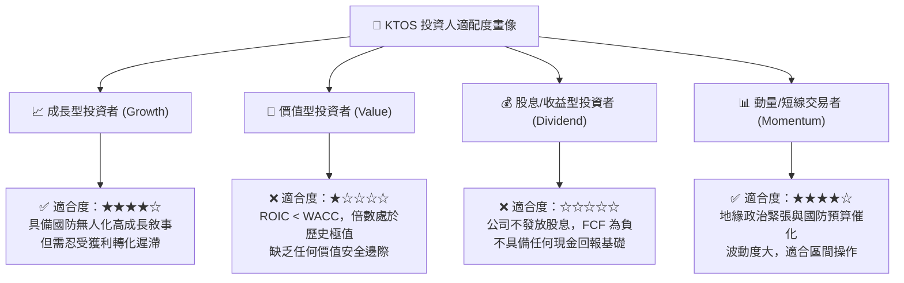

### 11.5 每季財報監控清單（Quarterly Watch List）

| 監控指標 | 最新基準值 (2026Q2) | 加碼門檻 (Bull Trigger) | 減碼門檻 (Bear Trigger) | 意義與後續影響 |
|----------|---------------------|--------------------------|--------------------------|----------------|
| **GAAP 營業利益率** | -0.2% | 連續兩季 **> 4.5%** | 單季 **< -2.0%** | 檢驗規模經濟與合約超支控制能力 |
| **單季營運現金流 (CFO)**| -$11.0M | 轉正並 **> +$25.0M** | 失血擴大 **< -$35.0M** | 營運資金是否持續遭應收帳款吞噬 |
| **營收 YoY 成長率** | +30.5% | 維持 **> 25.0%** | 大幅降速 **< 12.0%** | 無人系統高成長敘事是否降溫 |
| **存貨總額 (Inventory)**| $235.9M | 週轉天數降至 **< 60 天** | 存貨激增 **> $280.0M** | 是否存在未能交付的原型機與跌價損失 |
| **SBC 佔營收比重** | 3.5% | 下降至 **< 2.0%** | 攀升至 **> 5.0%** | 股東權益稀釋速度是否失控 |

### 11.6 反面論證：什麼會證明論點錯誤（What Would Change My Mind）

```
╔══════════════════════════════════════════════════════════════╗
║             ⚠️ 論點失效條件（Disconfirming Evidence）         ║
╠══════════════════════════════════════════════════════════════╣
║  本報告「持有/高估」之保守論點，在下列情況發生時應全面推翻並 ║
║  上調為「強力買入」：                                        ║
║                                                              ║
║  ☐ 獲利轉化速度大幅超越模型預期：                           ║
║     若 GAAP 營業利益率在未來 2 季內跳升至 8.0% 以上（本模型  ║
║     預計需至 2030 年達成），證明定價權與規模槓桿提前兌現。    ║
║                                                              ║
║  ☐ 現金流體質結構性改善：                                   ║
║     TTM 自由現金流由負轉正並突破 $100M，展現強大有機造血力， ║
║     使 DCF 內在價值迅速重估至 $55.00 以上。                  ║
║                                                              ║
║  ☐ 奪下劃時代主導級合約：                                   ║
║     若美軍直接指定 XQ-58A Valkyrie 為 CCA 唯一首批採購機種， ║
║     合約總值突破 $2.0B，將徹底打破營收成長天花板。           ║
║                                                              ║
║  ☐ 衛星軟體業務獨立分拆或高溢價變現：                        ║
║     OpenSpace 地面軟體系統若以 SaaS 純軟體倍數 (>12x EV/Sales)║
║     進行分拆上市或引進策略投資，將大幅釋放隱藏資產價值。     ║
╚══════════════════════════════════════════════════════════════╝
```

---
> **免責聲明**：本報告僅供機構投資研究參考，不構成任何個別買賣建議。市場有風險，投資決策應基於獨立判斷與風險承受能力。