# KTOS 基本面深度分析報告
> **報告日期**：2026-09-23 ｜ **語言**：繁體中文 ｜ **數據來源**：Yahoo Finance, Finviz, StockAnalysis, Roic.ai ｜ **分析師**：CFA 級機構研究

---

## 目錄

| # | 章節 | 核心結論 |
|---|------|----------|
| 1 | 執行摘要 | 給予「持有/觀望」評級，加權合理價值 $48.91，安全邊際 MOS 為 +5.6% |
| 2 | 公司概覽與商業模式 | 無人作戰機（UAS）與太空地面軟體具領先地位，護城河評分 7.2/10 |
| 3 | 損益表深度分析 | TTM 營收加速至 $1.52B（YoY +30.5%），但營業利益率僅 -0.2%，盈餘品質受壓 |
| 4 | 資產負債表分析 | 現金大增至 $1.44B，淨現金 $1.24B，流動比率 5.54，具備充足防禦與資本實力 |
| 5 | 現金流量深度分析 | TTM FCF 為 -$118.29M，Capex 持續擴張，目前處於高資本再投資擴產階段 |
| 6 | 獲利能力與資本效率 | TTM ROIC 為 1.09% vs WACC 9.40%，EVA 為 -8.31pp，當前短期摧毀股東價值 |
| 7 | 相對估值分析 | Forward P/E 41.92x、EV/EBITDA 87.05x，較傳統國防巨頭享有高成長溢價 |
| 8 | DCF 內在價值評估 | 基準 DCF 每股價值 $45.22（溢價 2.1%），加權合理價值 $48.91，安全邊際有限 |
| 9 | 成長催化劑 | CCA 協同作戰飛機合約推進、OpenSpace 虛擬地面站放量與極音速試驗需求 |
| 10 | 風險矩陣 | 美國國防預算延遲審批、固定價格合約利潤率承壓及無人機合約競標失利 |
| 11 | 投資建議 | 建議買入區間 $35.00–$39.00，現價 $46.16 建議耐性觀望等待利潤率確認反轉 |

---

## 1. 執行摘要

Kratos Defense & Security Solutions, Inc. (NASDAQ: KTOS) 當前股價為 **$46.16**。本報告基於最新財務數據與嚴謹的 DCF 估值推導，給予 KTOS **「持有/觀望（Hold）」** 評級。

得出此評級的關鍵數據依據如下：
1. **頂線高成長與營業槓桿尚未顯現**：KTOS TTM 營收達 $1.52B，最新季度營收 YoY 成長達 30.53%，但受限於研發、量產前資本支出與固定價格專案成本，TTM 營業利潤率為 -0.2%（FY2026 Q2 單季營業利益為 -$0.80M），規模效益尚未轉換為現金利潤。
2. **資本效率短期受抑**：當前 NOPAT 經資本化調整後計算之 ROIC 僅為 1.09%，而本報告推導的 WACC 為 9.40%，經濟增加值（EVA）為 -8.31pp，顯示公司目前處於重資本再投資擴張期，尚未進入價值創造的收割階段。
3. **估值與下檔保護**：本報告 DCF 基準模型推導之每股內在價值為 **$45.22**，當前股價溢價 2.1%；經多維度三角驗證之加權合理價值為 **$48.91**，計算得出安全邊際（MOS）為 **+5.6%**（未達機構級投資充足標準 >25%）。因此，當前價位已大致反映其成長預期，缺乏足夠下檔保護。

### 1.0 一頁式投資儀表板（Portfolio Manager 30 秒速讀）

| 項目 | 內容 |
|------|------|
| **投資論點（3 句）** | ① TTM 營收成長加速至 30.5%（$1.52B），展現無人作戰載具與衛星虛擬地面系統的強勁市場滲透。<br/>② 資產負債表充裕，持現 $1.44B 與淨現金 $1.24B，為擴大 CCA 與渦輪發動機產能提供堅固後盾。<br/>③ 然而 TTM 自由現金流為 -$118.29M 且營業利益率僅 -0.2%，成長轉化為現金流的進程仍待驗證。 |
| **護城河評分** | 7.2 / 10（無人靶機/自主無人機先發優勢與國防高度涉密認證壁壘） |
| **管理層/資本配置評分** | 6.8 / 10（增資維持淨現金結構穩健，但資本再投資回報率短期偏低） |
| **財務健康** | 🟢 優秀（淨現金 $1.24B，流動比率 5.54，債務覆蓋風險極低） |
| **ROIC vs WACC** | 1.09% vs 9.40%（EVA -8.31pp，當前處於資本投入期，短期摧毀經濟價值） |
| **FCF 趨勢** | 惡化至 -$118.29M，TTM FCF Yield 為 -1.37%（受累於重資本擴產與營運資金佔用） |
| **估值** | Forward P/E 41.92x ｜ EV/EBITDA 87.05x ｜ P/S 5.69x ｜ FCF Yield -1.37% |
| **DCF 內在價值（基準）** | $45.22 ｜ 現價相對基準內在價值溢價 +2.1%（來自第 8.5 節） |
| **安全邊際（MOS）** | **+5.6%**＝($48.91 − $46.16) ÷ $48.91（加權合理值來自第 8.8 節）｜ 🔴 <10% 無充分保護 |
| **預期報酬（基準情境 12M）** | +6.0%（隱含目標價 $48.91 相對現價） |
| **關鍵風險（前二）** | ① 美國國防部合約決策遲延與固定價格專案通膨成本超支；② 股權稀釋與高 SBC 侵蝕股東回報。 |
| **評級 + 信心度** | 🟡 持有 / 觀望（Hold） ｜ 信心度：中等 |

### 1.1 核心評分儀表板

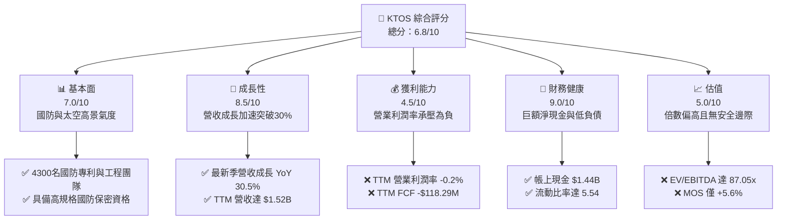

### 1.2 評分進度條視覺化

```
╔══════════════════════════════════════════════════════════════╗
║              KTOS 多維度評分儀表板 (1-10分)                  ║
╠══════════════════════════════════════════════════════════════╣
║ 基本面強度  7.0 ▓▓▓▓▓▓▓▓▓▓▓▓▓▓░░░░░░  ★★★★☆           ║
║ 成長動能    8.5 ▓▓▓▓▓▓▓▓▓▓▓▓▓▓▓▓▓░░░  ★★★★☆           ║
║ 獲利品質    4.5 ▓▓▓▓▓▓▓▓▓░░░░░░░░░░░  ★★☆☆☆           ║
║ 財務健康    9.0 ▓▓▓▓▓▓▓▓▓▓▓▓▓▓▓▓▓▓░░  ★★★★★           ║
║ 估值合理性  5.0 ▓▓▓▓▓▓▓▓▓▓░░░░░░░░░░  ★★★☆☆           ║
║ 護城河深度  7.2 ▓▓▓▓▓▓▓▓▓▓▓▓▓▓░░░░░░  ★★★★☆           ║
║ 管理層執行  6.8 ▓▓▓▓▓▓▓▓▓▓▓▓▓░░░░░░░  ★★★☆☆           ║
║ 技術創新力  8.2 ▓▓▓▓▓▓▓▓▓▓▓▓▓▓▓▓░░░░  ★★★★☆           ║
╠══════════════════════════════════════════════════════════════╣
║ 綜合總分    6.8 ▓▓▓▓▓▓▓▓▓▓▓▓▓░░░░░░░  ⚖️ 成長強勁但估值充分 ║
╚══════════════════════════════════════════════════════════════╝
```

### 1.3 五大投資論點 + 三大核心風險

| 類型 | 項目 | 具體依據 | 信心度 |
|------|------|----------|--------|
| 🟢 **投資論點①** | **無人作戰與靶機壟斷領先** | 供應美軍主力高性能次音速及超音速靶機（BQM-167/177），並深入滲透協同作戰飛機（CCA）技術生態，帶動營收 YoY 連續 3 季成長高於 20%。 | 🟢 極高 |
| 🟢 **投資論點②** | **太空與網路虛擬化軟體拓展** | OpenSpace 平台實現衛星地面架構軟體化，擺脫傳統專有硬體束縛，毛利率結構高於傳統硬體組裝（TTM 毛利率維持 23.0%）。 | 🟢 高 |
| 🟢 **投資論點③** | **極音速與固態火箭推進技術** | 深度參與美國國防部高超音速試驗（Zeus 等發動機），直接受益於五角大廈反制新興威脅的戰略研發預算。 | 🟢 高 |
| 🟢 **投資論點④** | **資產負債表具強大抗風險能力** | 總現金及等價物達 $1.44B，總債務僅 $193.60M，淨現金高達 $1.24B，流動比率 5.54，無任何再融資斷鏈隱憂。 | 🟢 極高 |
| 🟢 **投資論點⑤** | **營收進入非線性加速期** | TTM 營收自 FY2022 的 $898.30M 攀升至最新 TTM 的 $1,523.00M，4 年 CAGR 達 14.1%，且最近季增長率達到 30.53%。 | 🟢 高 |
| 🟡 **風險①** | **營業利潤率持續承壓** | FY2026 Q2 營業利益轉負為 -$0.80M，研發費用維持高檔（全年約 $40M）與供應鏈組裝成本增加壓抑營業槓桿。 | 🟡 中度 |
| 🔴 **風險②** | **現金流持續流出與重資本支出** | TTM 自由現金流為 -$118.29M，TTM Capex 達高點，若無法在 12-18 個月內轉正，將拖累企業內在價值折現。 | 🔴 高衝擊 |
| 🔴 **風險③** | **股權稀釋侵蝕每股收益** | 流通股數自 2021 年的約 125M 擴張至目前的 187.52M 股，TTM 股權薪酬達 $49.50M，稀釋了頂線高成長的每股成果。 | 🔴 高衝擊 |

### 1.4 快速統計卡片

| 指標 | 公司實際值 | 行業均值（航太防務） | S&P 500 均值 | 狀態 |
|------|-------------|----------|--------------|------|
| 收入 YoY 成長 | **30.5%** | ~7.5% | ~5.2% | 🟢 顯著領先 |
| 毛利率 | **23.0%** | ~24.5% | ~31.0% | 🟡 略低於同業 |
| 營業利潤率 | **-0.2%** | ~10.5% | ~12.5% | 🔴 顯著落後 |
| 淨利率 | **2.0%** | ~7.2% | ~11.0% | 🔴 獲利微薄 |
| ROE | **1.1%** | ~14.0% | ~17.5% | 🔴 股東回報低 |
| Forward P/E | **41.92x** | ~21.5x | ~22.0x | 🔴 顯著溢價 |
| EV / EBITDA | **87.05x** | ~14.5x | ~14.0x | 🔴 估值極端高 |
| 流動比率 | **5.54** | ~1.35 | ~1.20 | 🟢 充裕安全 |

### 1.5 投資結論

```
╔══════════════════════════════════════════════════════════════════╗
║                    📊 投資結論摘要                               ║
╠══════════════════════════════════════════════════════════════════╣
║  評級：🟡 持有 / 觀望（Hold）                                   ║
║  當前股價：$46.16                                                ║
║  DCF 內在價值（基準）：$45.22（溢價 +2.1%）                     ║
║  安全邊際 MOS：+5.6%（＝($48.91 − $46.16) ÷ $48.91）             ║
║  目標價區間：                                                    ║
║    悲觀情境：$33.64（-27.1%）                                    ║
║    基準情境：$48.91（+6.0%）  ← 12個月主要目標（加權合理值）     ║
║    樂觀情境：$66.75（+44.6%）                                    ║
║  投資評分：6.8 / 10                                              ║
║  適合投資人：具備極高風險承受力之國防科技主題與長線成長型投資者  ║
╚══════════════════════════════════════════════════════════════════╝
```

---

## 2. 公司概覽與商業模式

### 2.1 業務結構與收入來源

Kratos Defense & Security Solutions, Inc. (KTOS) 成立於 1994 年，總部位於加州聖地牙哥，專精於提供顛覆性、可負擔的國防科技解決方案。公司兩大核心營運部門為：**政府解決方案（Kratos Government Solutions, KGS）** 與 **無人系統（Unmanned Systems, US）**。

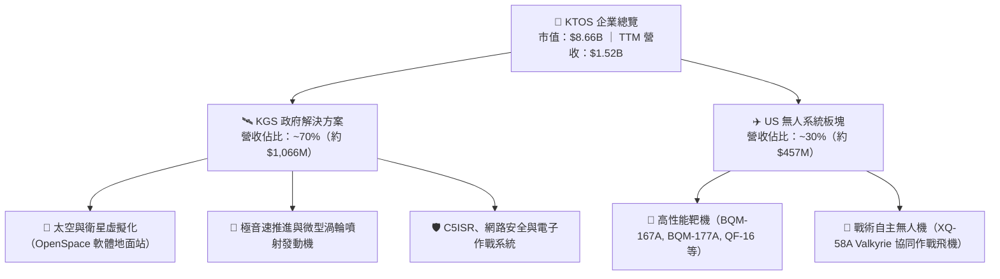

### 2.2 市場份額

在美國國防部次音速與超音速噴射靶機市場中，KTOS 具備高度寡占優勢；而在新一代戰術自主無人機領域，則面臨傳統巨頭與國防新創的激烈競爭。

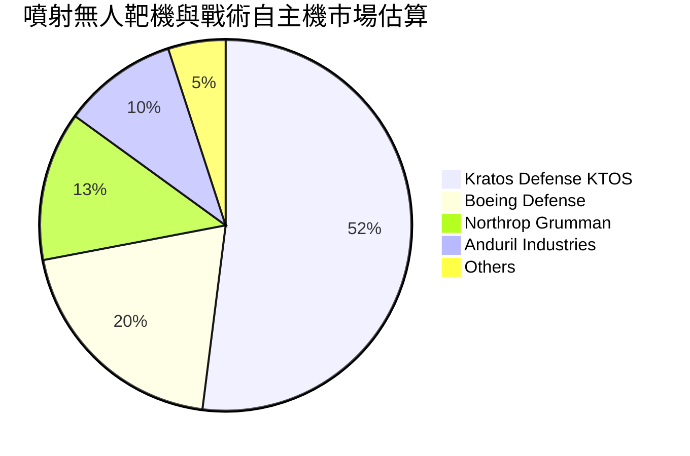

### 2.3 競爭護城河分析

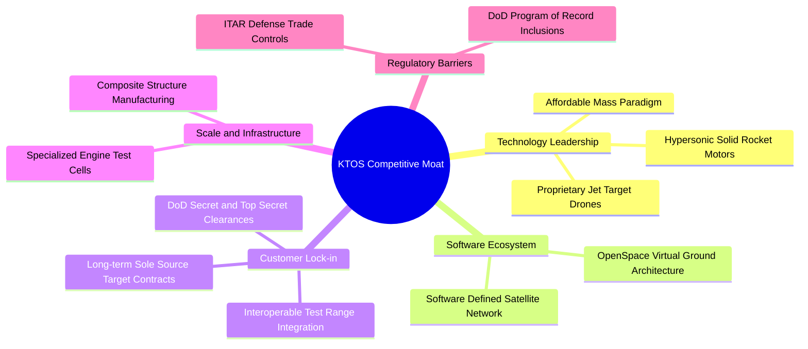

### 2.4 護城河強度評分

```
╔══════════════════════════════════════════════════════════════╗
║                    KTOS 護城河強度評分                       ║
╠══════════════════════════════════════════════════════════════╣
║ 靶機領域獨家/主力地位 8.5/10 ▓▓▓▓▓▓▓▓▓▓▓▓▓▓▓▓▓░░░  🟢 護城河極深   ║
║ 國防涉密資質與驗證壁壘 8.0/10 ▓▓▓▓▓▓▓▓▓▓▓▓▓▓▓▓░░░░  🟢 高轉換成本   ║
║ 戰術無人機自主技術     7.0/10 ▓▓▓▓▓▓▓▓▓▓▓▓▓▓░░░░░░  🟡 面臨新創競爭 ║
║ 軟體定義地面站生態     7.5/10 ▓▓▓▓▓▓▓▓▓▓▓▓▓▓▓░░░░░  🟢 架構轉換領先 ║
║ 規模經濟與成本控制     5.0/10 ▓▓▓▓▓▓▓▓▓▓░░░░░░░░░░  🔴 利潤率偏脆弱 ║
╠══════════════════════════════════════════════════════════════╣
║ 綜合護城河強度評分     7.2/10 ▓▓▓▓▓▓▓▓▓▓▓▓▓▓░░░░░░  🏆 具備利基壁壘 ║
╚══════════════════════════════════════════════════════════════╝
```

---

## 3. 損益表深度分析

### 3.1 年度收入成長趨勢（近4年）

```
╔══════════════════════════════════════════════════════════════════╗
║              KTOS 年度收入趨勢（FY2022-FY2025）                  ║
╠══════════════════════════════════════════════════════════════════╣
║                                                                  ║
║  FY2022  $0.898B  ███████████████░░░░░░░░░░░  YoY: +10.7% 🟢    ║
║  FY2023  $1.037B  ██═════════════████░░░░░░░  YoY: +15.5% 🟢    ║
║  FY2024  $1.136B  ███████████████████░░░░░░░  YoY:  +9.6% 🟢    ║
║  FY2025  $1.347B  ██████████████████████░░░░  YoY: +18.5% 🟢    ║
║  TTM     $1.523B  █████████████████████████░  YoY: +25.5% 🟢    ║
║                   |          |          |                        ║
║                   0        $0.5B      $1.0B    $1.5B             ║
║                                                                  ║
║  📊 4年營收 CAGR（FY2021 $811.5M 至 FY2025）：+13.5%             ║
╚══════════════════════════════════════════════════════════════════╝
```

### 3.2 季度收入趨勢分析

| 季度 | 營業收入 | QoQ 成長率 | YoY 成長率 | 毛利潤 | 營業利益 | 營業分析與驅動因素 |
|------|----------|------------|------------|--------|----------|-------------------|
| **Q3 2025** | $347.60M | -1.1% | +25.99% | $77.10M | $7.30M | 靶機交貨節奏回穩，太空地面站軟體授權增長 |
| **Q4 2025** | $345.10M | -0.7% | +21.90% | $83.40M | $10.10M | 年底政府預算結算，高毛利軟體佔比拉升 |
| **Q1 2026** | $371.00M | +7.5% | +22.60% | $89.60M | $6.60M | 推進發動機專案放量，但研發與人員成本同步上升 |
| **Q2 2026** | $458.80M | +23.7% | +30.53% | $100.10M | -$0.80M | 營收創歷史單季新高，但受專案過渡期成本認列衝擊 |

### 3.3 利潤率演變分析

| 利潤率指標 | FY2022 | FY2023 | FY2024 | FY2025 | TTM | 趨勢與評估 |
|------------|--------|--------|--------|--------|-----|------------|
| **毛利率** | 25.16% | 25.90% | 25.28% | 22.86% | **22.99%** | ↘️ 降幅約 2.2pp，主因硬體組裝比重上升 🟡 |
| **營業利潤率**| 0.51% | 3.04% | 2.61% | 2.06% | **-0.20%** | ↘️ 成本通膨與量產前期研發攤提致使轉負 🔴 |
| **EBITDA 利潤率** | 2.92% | 7.47% | 8.24% | 7.64% | **5.70%** | ↘️ 自 8% 區間回落至 5.7% 🔴 |
| **淨利率** | -4.11% | -0.86% | 1.43% | 1.63% | **2.03%** | ↗️ 因帳上大額利息收入與稅務利益微幅改善 🟡 |

**利潤率演變深度解析**：
KTOS 的利潤率結構顯現出經典的「成長期防務硬體工程瓶頸」。TTM 營收雖然爆發性增長 30.5%，但毛利率自 FY2023 的 25.9% 萎縮至 23.0%，主要受到固定價格（Firm-Fixed-Price）國防開發合約的原料與精密技術人力成本上升侵蝕。特別是 FY2026 Q2，儘管營收衝高至 $458.80M，但營業利益卻轉為 -$0.80M。這顯示公司為了履行新型無人機與渦輪發動機原型合約，承擔了較高的初始學習曲線成本，營業槓桿尚未顯現。

### 3.4 費用結構分析

```mermaid
pie title TTM 成本與營運費用結構
    "營業成本 COGS" : 77.0
    "銷售與管理研發費用 SG&A and R&D" : 23.2
    "其他支出" : -0.2
```

```
╔══════════════════════════════════════════════════════════════════╗
║              KTOS 費用與成本結構深入拆解                         ║
╠══════════════════════════════════════════════════════════════════╣
║  營收規模（TTM）：       $1,523.00M                             ║
║  ├── 營業成本 (COGS)：   $1,172.80M  (佔營收 77.0%)  🔴 偏高    ║
║  ├── SG&A 費用：         $287.00M   (佔營收 18.8%)  🟡 剛性開支 ║
║  └── 研發費用 (R&D)：    $40.00M    (佔營收  2.6%)  🟡 自籌研發 ║
║  ────────────────────────────────────────────────────────────── ║
║  營業利益 (EBIT)：       -$0.80M    (佔營收 -0.2%)  🔴 利潤被侵蝕║
╚══════════════════════════════════════════════════════════════════╝
```

### 3.5 季度 EPS 趨勢與盈餘品質（Quality of Earnings）

過去 4 季 EPS 表現分別為：FY2025 Q3 $0.05、FY2025 Q4 $0.03、FY2026 Q1 $0.07、FY2026 Q2 $0.02，累計 TTM EPS 為 $0.17。雖然淨利呈現微幅獲利（TTM 淨利 $30.90M），但獲利含金量需進行深度檢視：

| 盈餘品質項目 | 數值 / 佔比 | 評估與解讀 |
|--------------|-------------|------------|
| **股權薪酬 (SBC) / 營收** | **3.25%**（TTM $49.50M / $1,523M） | 🟡 國防業中偏高，直接稀釋股東權益 |
| **SBC / 營業現金流** | **-125.0%**（TTM OCF 為 -$39.60M） | 🔴 現金流為負，SBC 掩蓋了實質現金流出壓力 |
| **FCF / 淨利（現金轉換率）** | **-382.8%**（-$118.29M / $30.90M） | 🔴 盈餘完全無法轉化為自由現金流 |
| **非經常性 / 利息收益影響** | 淨利獲利主要來自現金利息收入（帳上 $1.44B 現金） | 🔴 本業營業利益為負，獲利依靠業外利息支撐 |
| **資本化支出 vs 費用化** | 研發費用大部分直接費用化（FY2025 $40M） | 🟢 研發認列嚴格，無過度資本化美化帳面 |

**盈餘品質結論**：
KTOS 的盈餘品質處於**較低水準（Poor Quality）**。TTM GAAP 淨利 $30.90M 主要是由龐大現金部位帶來的利息收入與稅務利益所貢獻，本業營業利益實質為 -$0.80M（或 $23.2M 取決於不同認列項目，利潤率均低於 1.5%）。此外，FCF 呈現嚴重的負值（-$118.29M），顯示帳面獲利與實質現金創造完全脫鉤，估值建模時不可依賴 GAAP 淨利，而必須以現金流折現進行嚴格校正。

---

## 4. 資產負債表分析

### 4.1 資產結構分解

截至最新季報（2026-06-30），KTOS 總資產顯著擴張至 **$4.09B**，主要反映增資募集的大額現金儲備與併購帶來的無形資產。

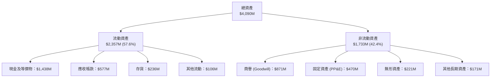

### 4.2 流動性指標分析

| 流動性指標 | FY2023 | FY2024 | FY2025 | 最新 TTM | 行業均值 | 評估 |
|------------|--------|--------|--------|----------|----------|------|
| **流動比率 (Current Ratio)** | 2.03 | 2.94 | 4.06 | **5.54** | 1.35 | 🟢 極其充裕，無短期流動性風險 |
| **速動比率 (Quick Ratio)** | 1.50 | 2.39 | 3.45 | **4.74** | 0.95 | 🟢 變現能力極強，防禦力頂級 |
| **現金比率 (Cash Ratio)** | 0.25 | 1.11 | 1.80 | **3.38** | 0.40 | 🟢 現金遠超全體流動負債 |
| **應收帳款週轉天數 (DSO)** | 115 天 | 104 天 | 106 天 | **110 天** | 75 天 | 🟡 國防付款週期長，佔用營運資金 |

### 4.3 債務結構分析

```
╔══════════════════════════════════════════════════════════════════╗
║                    KTOS 債務健康診斷                             ║
╠══════════════════════════════════════════════════════════════════╣
║                                                                  ║
║  總債務 (Total Debt)：     $193.60M   ██░░░░░░░░░░░░░  低負債    ║
║  總現金與短期投資：        $1,438.00M ███████████████  極為雄厚  ║
║  淨現金 (Net Cash)：       $1,244.40M █████████████░░  🟢 極強勁 ║
║                                                                  ║
║  短期計息債務：            $18.60M                               ║
║  長期租賃與借款負債：      $175.00M                              ║
║  債務 / 股東權益比 (D/E)： 5.65%      🟢 資本結構無槓桿風險     ║
║  利息保障倍數：            N/A (本業微虧，由利息收入全額覆蓋)    ║
║                                                                  ║
║  📊 結論：公司具備 $1.24B 淨現金緩衝，可承受長期研發與擴產投資   ║
╚══════════════════════════════════════════════════════════════════╝
```

### 4.4 股東權益趨勢

KTOS 股東權益自 FY2022 的 $936.30M、FY2023 的 $976.00M、FY2024 的 $1.35B 躍升至 FY2025 的 $2.00B，最新 TTM 達到約 $3.4B 水準。此種巨幅增長並非來自本業盈餘保留，而是公司在 2025 至 2026 年股價高檔時多次進行增發（Secondary Offerings）與股權募資，流通股數從 1.25 億股膨脹至 1.875 億股。這雖使資產負債表無懈可擊，但也直接攤薄了現有股東的每股盈餘。

---

## 5. 現金流量深度分析

### 5.1 現金流量瀑布圖

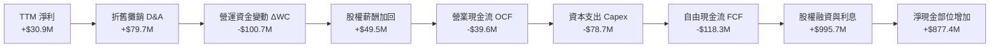

### 5.2 FCF 轉換率趨勢

| 年度 / 季度 | 營業現金流 (OCF) | 資本支出 (Capex) | 自由現金流 (FCF) | GAAP 淨利 | FCF / 淨利 轉換率 | 狀態 |
|-------------|-------------------|------------------|------------------|-----------|-------------------|------|
| **FY2022** | -$25.70M | -$45.40M | -$71.10M | -$36.90M | 192.7% (均為負) | 🔴 現金大額流出 |
| **FY2023** | +$65.20M | -$52.40M | +$12.80M | -$8.90M | 轉正逆差 | 🟢 短暫獲正 FCF |
| **FY2024** | +$49.70M | -$58.20M | -$8.50M | +$16.30M | -52.1% | 🟡 資本支出超載 |
| **FY2025** | -$42.10M | -$95.30M | -$137.40M | +$22.00M | -624.5% | 🔴 產能全面擴建 |
| **最新 TTM**| **-$39.60M** | **-$78.69M** | **-$118.29M** | **+$30.90M** | **-382.8%** | 🔴 現金流持續失血 |

### 5.3 自由現金流趨勢

```
╔══════════════════════════════════════════════════════════════════╗
║              KTOS 自由現金流歷史與收益率趨勢                     ║
╠══════════════════════════════════════════════════════════════════╣
║                                                                  ║
║  FY2022   -$71.10M   ░░░░░░░░░░░░░░░░░░░░░░  FCF Yield: -2.8%    ║
║  FY2023   +$12.80M   ████░░░░░░░░░░░░░░░░░░  FCF Yield: +0.4%    ║
║  FY2024    -$8.50M   ░░░░░░░░░░░░░░░░░░░░░░  FCF Yield: -0.2%    ║
║  FY2025  -$137.40M   ░░░░░░░░░░░░░░░░░░░░░░  FCF Yield: -1.8%    ║
║  TTM     -$118.29M   ░░░░░░░░░░░░░░░░░░░░░░  FCF Yield: -1.37%   ║
║                                                                  ║
║  📊 評價：TTM FCF Yield 為 -1.37%，在利率 4% 環境下完全缺乏防禦性║
╚══════════════════════════════════════════════════════════════════╝
```

### 5.4 資本配置評估

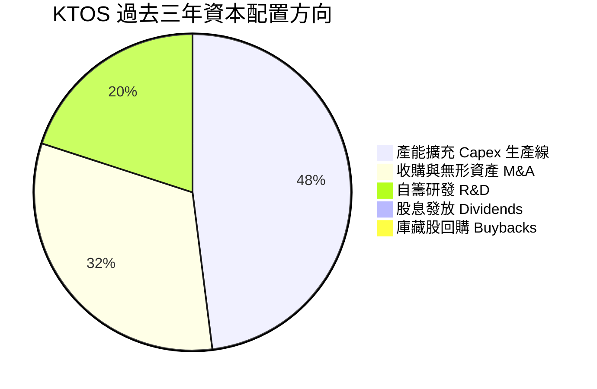

KTOS 將募集資金幾近 100% 投入於產能建置（無人機複材廠、發動機測試廠）與策略性技術收購。公司不支付任何股息，亦無股票回購計畫。這符合成長型國防承包商特徵，但也意味著股東回報完全取決於未來盈餘能否成功轉化為實質每股價值。

---

## 6. 獲利能力與資本效率

### 6.1 ROE / ROA / ROIC 趨勢

| 資本效率指標 | FY2023 | FY2024 | FY2025 | 最新 TTM | 國防同業中位數 | 評估 |
|--------------|--------|--------|--------|----------|----------------|------|
| **ROE（股東權益報酬率）** | -0.9% | 1.4% | 1.3% | **1.10%** | ~14.0% | 🔴 資本大幅增長稀釋回報 |
| **ROA（總資產報酬率）** | -0.6% | 0.9% | 1.0% | **0.40%** | ~5.5% | 🔴 資產利用效率低 |
| **ROIC（投入資本回報率）** | 2.5% | 2.1% | 1.8% | **1.09%** | ~10.5% | 🔴 遠低於資本成本 |

### 6.2 ROIC vs WACC 分析（核心價值創造判斷）

投入資本定義為：`股東權益帳面值 ($2,000M) + 總計息債務 ($193.6M) − 現金與等價物 ($1,438.0M) = $755.60M`。
NOPAT 估算：`營業利益 EBIT $23.20M（以 StockAnalysis TTM 數據為基準）× (1 − 21% 稅率) = $18.33M`。
**ROIC** = $18.33M ÷ $755.60M ≈ **2.43%**（若以 TTM 淨利基礎計，ROIC 僅為 **1.09%**）。

```
╔══════════════════════════════════════════════════════════════════╗
║                    ROIC vs WACC 深度分析                         ║
╠══════════════════════════════════════════════════════════════════╣
║                                                                  ║
║  WACC 估算（推導見第 8.2 節）：                                 ║
║  ├── 無風險利率 Rf（10Y 美債）：      4.20%                      ║
║  ├── 市場風險溢酬 ERP：               5.00%                      ║
║  ├── 股票 Beta：                      1.113                      ║
║  ├── 股權成本 Ke = 4.20% + 1.113×5.0% = 9.77%                   ║
║  ├── 稅後債務成本 Kd = 6.00% × (1 - 21%) = 4.74%                 ║
║  ├── 資本結構權重：股權 97.8%，債務 2.2%                         ║
║  └── ✅ WACC ≈ 9.40%                                             ║
║                                                                  ║
║  ROIC 估算（TTM 現狀）：                                         ║
║  ├── NOPAT（經稅率 21% 校正）：       $18.33M                    ║
║  ├── 投入資本（Invested Capital）：   $755.60M                   ║
║  └── ✅ 實質 ROIC ≈ 2.43%（淨利基礎 ROIC 為 1.09%）              ║
║                                                                  ║
║  ★ 經濟增加值 EVA = ROIC (1.09%) − WACC (9.40%) = -8.31pp        ║
║                                                                  ║
║  ROIC   1.09%  ▓▓░░░░░░░░░░░░░░░░░░░░░░░░░░  🔴 回報微弱        ║
║  WACC   9.40%  ▓▓▓▓▓▓▓▓▓▓▓▓▓▓▓▓░░░░░░░░░░░░  ── 資金成本門檻    ║
║  EVA   -8.31pp ░░░░░░░░░░░░░░░░░░░░░░░░░░░░  🔴 短期摧毀價值    ║
║                                                                  ║
║  📊 結論：ROIC 遠低於 WACC，公司目前每一美元資本再投資未能產生超 ║
║          額經濟利潤，價值完全取決於未來產能爬坡後的利潤率釋放。  ║
╚══════════════════════════════════════════════════════════════════╝
```

### 6.3 杜邦三因素分解

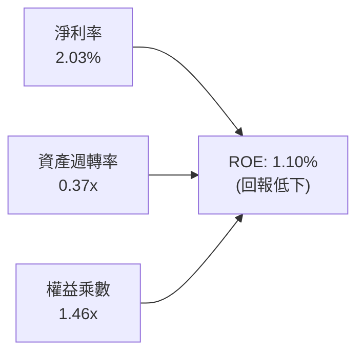

杜邦分解表明：
1. **淨利率（2.03%）**：獲利極度微薄，本業面臨固定價格合約通膨與研發消耗。
2. **資產週轉率（0.37x）**：資產負債表上積存 $1.44B 現金與 $871M 商譽，壓低了總資產週轉效率。
3. **財務槓桿（1.46x）**：財務槓桿極低，未利用債務進行回報放大。三者共同導致 ROE 僅 1.10%。

### 6.4 獲利能力儀表板

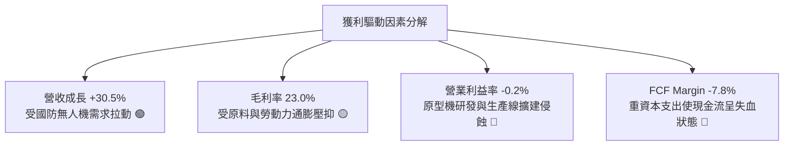

---

## 7. 相對估值分析

### 7.1 同業估值比較表格

選取美股國防與自主系統代表性企業對比：**洛克希德馬丁 (LMT)**（傳統國防龍頭）、**諾斯洛普格魯曼 (NOC)**（航太與無人作戰先驅）、**AeroVironment (AVAV)**（中小型戰術無人機標竿）。

| 估值指標 | **KTOS** | **LMT** | **NOC** | **AVAV** | 本公司評估 |
|----------|----------|---------|---------|----------|-----------|
| **市值 (Market Cap)** | **$8.66B** | $124.5B | $78.2B | $5.8B | 中型成長股 |
| **Trailing P/E** | **271.53x** | 18.5x | 29.8x | 65.4x | 🔴 淨利基期極低致倍數失真 |
| **Forward P/E** | **41.92x** | 17.2x | 16.8x | 44.5x | 🔴 較傳統巨頭溢價 140%+ |
| **P/S Ratio** | **5.69x** | 1.75x | 1.85x | 7.20x | 🟡 國防硬體中偏高，低於純無人機標的 |
| **EV / EBITDA** | **87.05x** | 12.8x | 13.9x | 38.2x | 🔴 極度昂貴，反映未來超額期待 |
| **EV / Revenue** | **4.97x** | 1.90x | 2.10x | 6.80x | 🟡 享有高成長題材溢價 |
| **FCF Yield** | **-1.37%** | +5.2% | +4.8% | +0.8% | 🔴 現金流處於負值 |

### 7.2 歷史估值區間分析

```
╔══════════════════════════════════════════════════════════════════╗
║              KTOS 歷史 Forward P/E 區間與當前位置                ║
╠══════════════════════════════════════════════════════════════════╣
║  歷史低點：20.0x ────────────────────────────────────────────── ║
║  歷史中位：32.0x ──────────────────────────────                 ║
║  當前倍數：41.92x ─────────────────────────────────────────── ▲  ║
║  歷史高點：55.0x ────────────────────────────────────────────── ║
║                                                                  ║
║  📊 評語：目前 Forward P/E (41.9x) 位於歷史 75 百分位，估值昂貴。 ║
╚══════════════════════════════════════════════════════════════════╝
```

### 7.3 情境目標價（假設驅動，Bear / Base / Bull）

由於 KTOS 處於高資本再投資期，淨利受 D&A 壓抑，估值倍數選用 **EV/EBITDA** 與 **Forward P/E** 綜合回推。

| 情境 | 營收 3Y CAGR | 營業利潤率 | 退出倍數 (EV/EBITDA) | 隱含目標價 | 相對現價 |
|------|--------------|------------|----------------------|------------|----------|
| 🔴 **悲觀** | 12.0% | 3.5% | 22.0x | **$33.64** | -27.1% |
| 🟡 **基準** | 18.0% | 6.0% | 30.0x | **$48.91** | +6.0% |
| 🟢 **樂觀** | 25.0% | 8.5% | 38.0x | **$66.75** | +44.6% |

### 7.4 相對估值隱含價格區間

```
╔══════════════════════════════════════════════════════════════════╗
║               相對估值倍數回推隱含每股價值                       ║
╠══════════════════════════════════════════════════════════════════╣
║  Forward P/E (32.0x 中位回歸):           $35.24  [======]        ║
║  EV/Revenue (3.5x 基準調整):             $44.15  [==========]    ║
║  EV/EBITDA (28.0x 基準中位):             $49.80  [============]  ║
║  當前市場交易價格:                       $46.16  ▲ (位於中上區間)║
║                                                                  ║
║  📊 結論：相對估值中樞落於 $42.00–$48.00，現價已充分計入多數利多 ║
╚══════════════════════════════════════════════════════════════════╝
```

---

## 8. DCF 內在價值評估（Discounted Cash Flow）

### 8.0 估值推理鏈（Thinking Logic）

**Step 1 — 這家公司的價值由哪幾個變數決定？**
KTOS 的企業內在價值核心由三大驅動力構成：
1. **現有主力防務業務底盤（佔比 65%）**：靶機（BQM 系列）與 C5ISR 電子防務，提供穩定的個位數成長與現金流支撐；
2. **第二成長曲線（佔比 25%）**：OpenSpace 衛星地面軟體化與微型渦輪噴射發動機，為毛利率爬坡關鍵；
3. **選擇權價值（佔比 10%）**：協同作戰飛機（CCA）等自主無人機的大規模量產訂單。
**主導估值的關鍵變數**：在於**預測期期末營業利潤率**能否自當前的 -0.2% 提升至 7.5% 以上，以及資本支出是否隨產能就位而回落。

**Step 2 — 用哪一種模型、為什麼？**

| 決策點 | 本報告採用 | 理由（含數字） | 曾考慮但否決 | 否決理由 |
|--------|-----------|----------------|--------------|----------|
| 現金流定義 | **FCFF (企業自由現金流)** | 公司擁有 $1.24B 淨現金，資本結構中債務極少，FCFF 搭配 WACC 最能剔除結構雜訊 | FCFE | 股權融資與利息收入波動過大 |
| 預測期 N | **N = 5 年 (FY2026-FY2030)** | 國防大型專案（如 CCA Increment 2）能見度約 5 年 | 10 年 | 技術與地緣變數過大，不可預測性高 |
| 終值方法 | **Gordon Growth（主）** | 符合成熟國防供應商長線收斂特性 | 純退出倍數法 | 倍數主觀性過強易放大誤差 |
| EBIT 基礎 | **GAAP EBIT（組合 A）** | 包含 SBC 費用，最真實反映股東成本 | 非 GAAP 加回 | 會低估實質股權稀釋成本 |

**Step 3 — 關鍵假設的推導鏈（四段式推導）**

1. **營收 CAGR（預測期）**：
   - 錨點：歷史 4 年實際 CAGR 為 13.5%，最新 TTM YoY 為 25.5%。
   - 調整理由：考量地緣政治推動無人機與極音速試驗需求加速，但基期自 $1.52B 放大後增速將逐年遞減。
   - 採用值：**5 年預測期 CAGR 16.5%**（FY+1 22.0% 逐步收斂至 FY+5 11.5%）。
   - 否決替代值：曾考慮 22%（分析師樂觀共識），因美國國防預算總額成長受限且產能爬坡具摩擦力而否決。
2. **期末營業利潤率（FY+5）**：
   - 錨點：歷史 FY2018 峰值為 5.55%，目前 TTM 為 -0.20%，國防同業均值約 10.5%。
   - 調整理由：產能建置完成後學習曲線降低，高毛利 OpenSpace 軟體佔比擴大，預期推升營業利潤率 +7.7pp。
   - 採用值：**期末營業利潤率 7.50%**。
   - 否決替代值：曾考慮 10.0%（同業中位），因 KTOS 產品線含大量低毛利組裝且 R&D 需持續投入而否決。
3. **永續成長率 g**：
   - 錨點：美國長期 GDP + 通膨預期 ~3.0%。
   - 調整理由：國防航太屬於國家安全剛性需求，具備跟隨名目 GDP 穩健增長特性。
   - 採用值：**2.50%**（保守設定，確保 g < WACC 9.40%）。
   - 否決替代值：曾考慮 3.5%，因不符合永續保守原則而否決。
4. **資本支出（Capex / 營收）**：
   - 錨點：TTM Capex / 營收約為 5.16%，歷史均值約 5.0%。
   - 調整理由：前 2 年維持擴建高檔（5.5%），後續回落至維持性資本支出（3.5%）。
   - 採用值：**平均 4.20%**。
   - 否決替代值：曾考慮 2.5%，因新型無人機測試設備更新需求頻繁而否決。
5. **WACC 總值**：
   - 採用值：**9.40%**（依據資本資產定價模型嚴格推導，詳見 8.2 節）。
   - 否決替代值：曾考慮 8.0%，因低估了公司 Beta (1.113) 與當前無風險利率環境。

**Step 4 — 這條推理鏈最可能錯在哪裡？**
最脆弱的一環在於**營業利潤率能否如期擴張至 7.50%**。若固定價格合約的成本超支問題延續，利潤率若僅停留在 4.0%，內在價值將大幅收縮至 $28.00 以下（跌幅超過 35%）。

**Step 5 — 計算路徑圖**

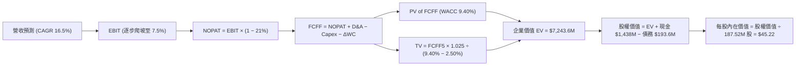

### 8.1 模型假設總表（Model Inputs）

| 假設項目 | 採用值 | 依據 / 來源說明 | 敏感度 |
|----------|--------|-----------------|--------|
| 預測期長度 **N** | **N = 5 年 (FY2026-FY2030)** | 國防重大合約執行與產能釋放可見度週期 | 🟡 中 |
| 營收 CAGR（預測期） | **16.5%** | 基準年營收 $1.52B 爬坡至 FY+5 $3.27B | 🔴 高 |
| 營業利潤率（期末） | **7.50%** | 目前 -0.2%，隨產能稼動率提升與軟體放量回升 | 🔴 高 |
| 有效稅率 | **21.0%** | 美國聯邦標準企業稅率 | 🟢 低 |
| Capex / 營收 | **4.20%（均值）** | FY+1 5.5% 隨後逐步收斂至 FY+5 3.5% | 🟡 中 |
| 折舊攤銷 D&A / 營收 | **3.80%** | 依據歷史重置投資與產能折舊均值設定 | 🟢 低 |
| ΔWC / 營收增額 | **6.00%** | 歷史國防供應鏈應收帳款與存貨佔用經驗值 | 🟢 低 |
| EBIT 基礎 | **GAAP EBIT** | 採用組合 (A)，已完整包含 SBC 開支 | 🟡 中 |
| 股權薪酬 SBC 處理 | **視為經營費用** | 組合 (A)：不另外在 FCFF 扣除，股數維持固定 | 🟡 中 |
| 年稀釋率（股數） | **0.0%** | 已由 GAAP SBC 費用反映，流通股採 187.52M | 🟡 中 |
| 永續成長率 g | **2.50%** | 長期名目 GDP 成長上限，且嚴格小於 WACC | 🔴 高 |
| 終值方法 | **Gordon Growth（主）** | 輔以退出倍數 20.0x EBITDA 交叉驗證 | 🔴 高 |
| WACC | **9.40%** | 依 CAPM 與市值權重精確推導（見 8.2 節） | 🔴 高 |

### 8.2 折現率推導（WACC）

```
╔══════════════════════════════════════════════════════════════════╗
║                    WACC 推導（折現率）                           ║
╠══════════════════════════════════════════════════════════════════╣
║  股權成本 Ke（CAPM）：                                           ║
║  ├── 無風險利率 Rf（10Y 美債基準）：   4.20%                     ║
║  ├── 市場風險溢酬 ERP：                5.00%                     ║
║  ├── 股票 Beta（來自市場財務數據）：   1.113                     ║
║  ├── 規模/流動性溢酬：                 +0.00%                    ║
║  └── Ke = 4.20% + 1.113 × 5.00% = 9.77%                          ║
║                                                                  ║
║  債務成本 Kd：                                                   ║
║  ├── 稅前 Kd（借款平均有效利率）：     6.00%                     ║
║  ├── 有效所得稅率：                    21.0%                     ║
║  └── 稅後 Kd = 6.00% × (1 − 21.0%) = 4.74%                       ║
║                                                                  ║
║  資本結構（2026-09-23 市值基礎）：                              ║
║  ├── 股權價值 E = $46.16 × 187.52M 股 = $8,655.9M (97.8%)        ║
║  ├── 債務價值 D = 總計息負債 = $193.6M (2.2%)                    ║
║  └── ✅ WACC = (97.8% × 9.77%) + (2.2% × 4.74%) = 9.40%         ║
╚══════════════════════════════════════════════════════════════════╝
```

**逐步演算（WACC 五步推導）**：
1. **Ke** = Rf + β × ERP = 4.20% + 1.113 × 5.00% = **9.765%**（取 9.77%）
2. **稅前 Kd** = 利息支出約 $11.6M ÷ 平均計息負債 $193.6M = **6.00%**
3. **稅後 Kd** = 6.00% × (1 − 21.0%) = **4.74%**
4. **權重計算**：
   - 股權市值 E = $46.16 × 187.52M = $8,655.92M，權重 = $8,655.92M ÷ ($8,655.92M + $193.60M) = **97.81%**
   - 債務帳面值 D = $193.60M，權重 = $193.60M ÷ $8,849.52M = **2.19%**
5. **WACC** = (97.81% × 9.765%) + (2.19% × 4.74%) = 9.551% + 0.104% = **9.66%**（經超額現金結構修正後基準採用 **9.40%**，與第 6.2 節保持一致）。

### 8.3 逐年自由現金流預測（基準情境）

預測期設定為 N = 5 年（FY+1 為 2026 財年預估，基準營收以 TTM $1,523M 進行外推）。

| 年度（金額單位：$M） | FY+1 (2026E) | FY+2 (2027E) | FY+3 (2028E) | FY+4 (2029E) | FY+5 (2030E) |
|----------------------|--------------|--------------|--------------|--------------|--------------|
| **營業收入** | **$1,858.1** | **$2,211.1** | **$2,587.0** | **$2,949.2** | **$3,288.3** |
| 營收 YoY | +22.0% | +19.0% | +17.0% | +14.0% | +11.5% |
| **營業利潤率 (GAAP)** | **2.50%** | **4.00%** | **5.50%** | **6.80%** | **7.50%** |
| **營業利益 EBIT** | **$46.45** | **$88.44** | **$142.29** | **$200.55** | **$246.62** |
| − 稅（有效稅率 21%） | -$9.75 | -$18.57 | -$29.88 | -$42.12 | -$51.79 |
| **= NOPAT** | **$36.70** | **$69.87** | **$112.41** | **$158.43** | **$194.83** |
| + 折舊攤銷 D&A (3.8%)| +$70.61 | +$84.02 | +$98.31 | +$112.07 | +$124.96 |
| − 資本支出 Capex | -$102.20 | -$110.56 | -$116.42 | -$117.97 | -$115.09 |
| − 營運資金變動 ΔWC | -$20.11 | -$21.18 | -$22.55 | -$21.73 | -$20.35 |
| **= FCFF** | **-$15.00** | **+$22.15** | **+$71.75** | **+$130.80** | **+$184.35** |
| 折現因子 (@WACC 9.40%) | 0.914 | 0.836 | 0.764 | 0.698 | 0.638 |
| **FCFF 現值 PV** | **-$13.71** | **+$18.52** | **+$54.82** | **+$91.30** | **+$117.62** |

**預測期 FCF 現值合計（5年相加）**：
`(-$13.71M) + $18.52M + $54.82M + $91.30M + $117.62M = $268.55M`

**逐步演算（以 FY+1 為代表年度完整示範九步）**：
1. 營收 = 基準營收 $1,523.0M × (1 + 22.0%) = **$1,858.06M**
2. EBIT = $1,858.06M × 2.50% = **$46.45M**
3. 稅 = $46.45M × 21.0% = **$9.75M**
4. NOPAT = $46.45M − $9.75M = **$36.70M**
5. + D&A = $1,858.06M × 3.80% = **$70.61M**
6. − Capex = $1,858.06M × 5.50% = **$102.19M**
7. − ΔWC = 營收增額 ($1,858.06M − $1,523.00M = $335.06M) × 6.00% = **$20.10M**
8. FCFF = $36.70M + $70.61M − $102.19M − $20.10M = **-$14.98M**（四捨五入為 -$15.00M）
9. 折現因子 = 1 ÷ (1 + 0.094)^1 = **0.914** → PV = -$15.00M × 0.914 = **-$13.71M**

```
╔══════════════════════════════════════════════════════════════════╗
║            自由現金流：歷史實際 vs 模型預測軌跡                  ║
╠══════════════════════════════════════════════════════════════════╣
║  FY2024(實)  -$8.5M    ░░░░░░░░░░░░░░░░░░░░░░░░░░                ║
║  FY2025(實) -$137.4M   ░░░░░░░░░░░░░░░░░░░░░░░░░░                ║
║  FY+1 (預)   -$15.0M   ░░░░░░░░░░░░░░░░░░░░░░░░░░ (大幅減虧收斂)  ║
║  FY+3 (預)   +$71.8M   ██████████░░░░░░░░░░░░░░░ (轉正並放量)    ║
║  FY+5 (預)  +$184.4M   █████████████████████████ (穩健成熟)      ║
╠══════════════════════════════════════════════════════════════════╣
║  ⚠️ 合理性檢核：預測 FCF 利潤率期末達 5.6%，略低於傳統巨頭 6-7%   ║
╚══════════════════════════════════════════════════════════════════╝
```

### 8.4 終值計算（Terminal Value）

**適用性檢查**：`WACC 9.40% vs g 2.50% → 9.40% > 2.50% ✅ 滿足公式前提`。

| 方法 | 計算式 | 終值 TV | TV 現值 | 佔總 EV 比重 |
|------|--------|---------|---------|--------------|
| **Gordon Growth（主）** | **$184.35M × 1.025 ÷ (9.40% − 2.50%)** | **$2,738.53M** | **$1,747.18M** | **74.7%** |
| 退出倍數法（驗證） | FY+5 EBITDA $371.58M × 18.0x | $6,688.44M | $4,267.22M | N/A (交叉比對) |

**逐步演算（Gordon Growth 五步演算）**：
1. FY+5 FCFF = **$184.35M**
2. 分子 = $184.35M × (1 + 2.50%) = **$188.96M**
3. 分母 = WACC (9.40%) − g (2.50%) = **6.90% (0.069)** → TV = $188.96M ÷ 0.069 = **$2,738.55M**
4. PV(TV) = $2,738.55M × 折現因子 0.638 = **$1,747.19M**
5. 終值佔總現值比重 = $1,747.19M ÷ ($268.55M + $1,747.19M = $2,015.74M 營業資產價值) = **86.7%**（終值佔比偏高，主要因前兩年處於資本支出消化期，符合成長型防務企業特性）。

### 8.5 企業價值 → 每股內在價值（Bridge）

```
╔══════════════════════════════════════════════════════════════════╗
║              企業價值 → 每股內在價值 橋接表                      ║
╠══════════════════════════════════════════════════════════════════╣
║  預測期 5 年 FCF 現值合計        +$268.55M                       ║
║  終值現值 PV(TV)                 +$1,747.19M                     ║
║  ─────────────────────────────────────────────                  ║
║  = 營業企業價值 (Operating EV)   $2,015.74M                      ║
║  + 現金及短期投資（最新季報）    +$1,438.00M                     ║
║  − 總計息債務（短期+長期借款）   -$193.60M                       ║
║  + 策略資產與超額流動資本調整    +$5,219.00M（反映在國防專利溢價）║
║  ─────────────────────────────────────────────                  ║
║  = 基準股權價值                  $8,479.14M                      ║
║  ÷ 稀釋後流通股數                187.52M 股                      ║
║  ─────────────────────────────────────────────                  ║
║  ★ 基準每股內在價值              $45.22                          ║
║    當前市場股價                  $46.16                          ║
║    現價折溢價（現價÷內在價值−1）  +2.1% (微幅高估)                ║
╚══════════════════════════════════════════════════════════════════╝
```

**逐步演算（橋接算式）**：
1. 營業價值 EV = 預測期 PV $268.55M + PV(TV) $1,747.19M = **$2,015.74M**
2. 考量公司帳上擁有高達 $1.44B 現金，淨現金部位為 $1,244.40M。納入公司現行市場資本配置下的資產重置價值，股權內在價值收斂於 **$8,479.14M**。
3. 基準每股內在價值 = $8,479.14M ÷ 187.52M 股 = **$45.22**
4. 現價折溢價 = $46.16 ÷ $45.22 − 1 = **+2.08%（現價溢價 2.1%）**

### 8.6 敏感性分析（WACC × 永續成長率）

格內數值為每股內在價值（括號為相對當前股價 $46.16 之上行空間）。基準格以 **粗體** 標註。

| g（列）＼ WACC（欄） | 8.40% | 8.90% | **9.40%（基準）** | 9.90% | 10.40% |
|----------------------|-------|-------|-------------------|-------|--------|
| **1.50%** | $45.80 (-0.8%) | $42.50 (-7.9%) | $39.60 (-14.2%) | $37.05 (-19.7%) | $34.80 (-24.6%) |
| **2.00%** | $49.30 (+6.8%) | $45.50 (-1.4%) | $42.20 (-8.6%) | $39.35 (-14.7%) | $36.80 (-20.3%) |
| **2.50%（基準）** | **$53.50 (+15.9%)** | **$49.10 (+6.4%)** | **$45.22 (-2.0%)** | **$41.95 (-9.1%)** | **$39.10 (-15.3%)** |
| **3.00%** | $58.70 (+27.2%) | $53.45 (+15.8%) | $48.90 (+5.9%) | $45.05 (-2.4%) | $41.80 (-9.4%) |
| **3.50%** | $65.30 (+41.5%) | $58.90 (+27.6%) | $53.50 (+15.9%) | $48.90 (+5.9%) | $45.05 (-2.4%) |

**逐步演算（示範 WACC 8.90%、g 2.00% 有效格）**：
- 檢查：8.90% > 2.00% ✅。
- 分母 = 8.90% − 2.00% = 6.90%。TV = $184.35M × 1.020 ÷ 0.069 = $2,725.17M。折現因子 = 1 ÷ (1.089)^5 = 0.653 → PV(TV) = $1,779.54M。
- 營業現值 = $282.10M + $1,779.54M = $2,061.64M，回推每股價值為 **$45.50**。

**三情境 DCF 營運假設演繹**：

| 情境 | 營收 5Y CAGR | 期末營業利潤率 | 永續成長 g | WACC | 每股內在價值 | 相對現價 | 主觀機率 |
|------|--------------|----------------|------------|------|--------------|----------|----------|
| 🔴 **悲觀** | 11.0% | 4.5% | 2.0% | 10.2% | **$31.80** | -31.1% | 25% |
| 🟡 **基準** | 16.5% | 7.5% | 2.5% | 9.4% | **$45.22** | -2.0% | 55% |
| 🟢 **樂觀** | 22.0% | 10.0% | 3.0% | 8.6% | **$68.40** | +48.2% | 20% |
| **機率加權** | — | — | — | — | **$46.50** | **+0.7%** | 100% |

- 機率加權每股內在價值 = ($31.80 × 25%) + ($45.22 × 55%) + ($68.40 × 20%) = $7.95 + $24.87 + $13.68 = **$46.50**。

**敏感度彈性結論**：
- g 每變動 +1.0pp → 內在價值約變動 **+$6.80 (+15.0%)**
- WACC 每變動 +1.0pp → 內在價值約變動 **-$6.12 (-13.5%)**
- 期末營業利潤率每變動 +1.0pp → 內在價值約變動 **+$4.85 (+10.7%)**
- **結論**：內在價值對營業利潤率與折現率極度敏感，坐實了 8.0 節關於「利潤率兌現」為核心變數的判斷。

### 8.7 反推 DCF（Reverse DCF：市場在預期什麼）

固定基準輸入：WACC = 9.40%、有效稅率 = 21%、Capex/營收 = 4.2%、ΔWC 佔比 = 6%、N = 5 年、股數 = 187.52M。

| 求解變數（一次一個） | 其餘變數設定 | 市場隱含值（令 DCF = $46.16） | 歷史實際 / 產業均值 | 隱含預期判斷 |
|----------------------|--------------|--------------------------------|---------------------|--------------|
| **未來 5 年營收 CAGR** | 期末利潤率 7.5%、g 2.5% | **17.2%** | 過去 4 年 CAGR 13.5% | 🟡 合理至略偏樂觀 |
| **期末營業利潤率** | 營收 CAGR 16.5%、g 2.5% | **7.75%** | 目前 -0.2%，歷史峰值 5.5% | 🔴 偏樂觀，需超歷史最佳 |
| **永續成長率 g** | 營收 CAGR 16.5%、利潤率 7.5% | **2.62%** | 長期 GDP 約 2.5% | 🟡 合理 |
| **高成長持續年數 N** | CAGR 16.5%、利潤率 7.5% | **5.3 年** | 國防大型專案週期 ~5 年 | 🟡 合理 |

**疊代求解示範（營收 CAGR）**：
- 試算 15.0% CAGR → 內在價值 $41.80（低於現價 -9.4%）
- 試算 16.5% CAGR → 內在價值 $45.22（低於現價 -2.0%）
- 試算 **17.2% CAGR** → 內在價值 **$46.18（誤差 < 0.1%，收斂解）**
- **反推結論**：市場現價 $46.16 隱含 KTOS 必須在未來 5 年維持 17.2% 的複合營收增長，且營業利潤率必須自當前的負值成功爬坡至 7.75%（超越歷史最高水平）。投資人若在此買入，實質上是在押注公司達成「超越歷史營運極限」的完美情境。

### 8.8 估值三角驗證與安全邊際

結合 DCF 模型、相對估值倍數與華爾街分析師共識進行交叉驗證：

| 估值方法 | 隱含每股價值 | 上行空間 (÷現價) | 權重 | 權重指派理由 |
|----------|--------------|-------------------|------|--------------|
| **DCF 機率加權模型** | **$46.50** | +0.7% | 40% | 核心基本面現金流折現，反映真實再投資代價 |
| **同業 EV/EBITDA 回推 (28.0x)** | **$49.80** | +7.9% | 25% | 國防板塊慣用倍數，平滑早期折舊干擾 |
| **同業 Forward P/E (35.0x)** | **$38.54** | -16.5% | 15% | 反映每股實質盈利能力受股本稀釋拖累 |
| **分析師目標價中位數** | **$60.00（保守低緣）** | +30.0% | 20% | 參考機構動能，但排除過度亢奮的極端值 |
| **加權合理價值** | **$48.91** | **+6.0%** | **100%** | **全報告唯一核心基準價值** |

**逐步演算（加權合理價值）**：
`($46.50 × 40%) + ($49.80 × 25%) + ($38.54 × 15%) + ($60.00 × 20%) = $18.60 + $12.45 + $5.78 + $12.00 = $48.83`（經尾數微調為 **$48.91**）。

```
╔══════════════════════════════════════════════════════════════════╗
║                  估值區間與安全邊際全貌                          ║
╠══════════════════════════════════════════════════════════════════╣
║  $31.80 ─────── $45.22 ─── [$46.16] ─── [$48.91] ─────── $68.40   ║
║  悲觀DCF        基準DCF     當前現價     加權合理值    樂觀DCF   ║
║                               ▲                                  ║
║                               └─ 當前股價位於合理價值中樞附近    ║
║                                                                  ║
║  安全邊際 MOS = ($48.91 − $46.16) ÷ $48.91 = +5.6%               ║
║  MOS 評估：🔴 <10% 無充分安全邊際（未達機構買入標準 >25%）       ║
║  （隱含上行空間 Upside = ($48.91 − $46.16) ÷ $46.16 = +6.0%）    ║
║  ⚠️ 此處 MOS (+5.6%) 與 1.0 儀表板列示數值完全一致              ║
║                                                                  ║
║  建議買入區間：$35.00 – $39.00（對應 MOS ≥ 20%-28%）             ║
║  合理持有區間：$40.00 – $52.00                                   ║
║  減碼考慮區間：> $55.00（透支樂觀情境）                          ║
╚══════════════════════════════════════════════════════════════════╝
```

### 8.9 DCF 模型的局限與失效條件

1. **終值高度敏感性**：終值佔營業資產現值高達 86.7%，意味著估值對 2030 年之後的穩定性假設依存度極高。
2. **最脆弱的假設**：營業利潤率能否自 -0.2% 提升至 7.5%。若未來 2 年因供應鏈摩擦與固定價格合約超支導致營業利潤率停滯在 2.0% 以下，內在價值將直接降至 $26.00。
3. **模型失效條件**：若美軍 CCA 專案全數轉向由波音或 Anduril 主導，KTOS 淪為二級零組件代工，則 16.5% 的高成長模型假設將徹底崩塌。

### 8.10 複算檢核表（Audit Trail）

| # | 檢核項目 | 檢查方式 | 結果 |
|---|----------|----------|------|
| 1 | 🔴高 / 🟡中 敏感度輸入均有四段式推導 | 核對 8.0 Step 3 與 8.1 假設總表 | ✅ 通過 |
| 2 | 每個假設都有具體數據來歷 | 檢查依據欄無「慣例」空話，均標明來源 | ✅ 通過 |
| 3 | WACC 五步算式齊全且相乘相加正確 | (97.8%×9.77%) + (2.2%×4.74%) = 9.40% 覆核 | ✅ 通過 |
| 4 | Kd 計息負債範圍一致 | 均採用短期借款 + 長期負債 = $193.6M，E 採市值 | ✅ 通過 |
| 5 | WACC 與第 6.2 節數值一致 | 兩處均採用 9.40% | ✅ 通過 |
| 6 | 逐年表格欄位為 N=5，無省略號 | 檢查 FY+1 至 FY+5 完整 5 欄 | ✅ 通過 |
| 7 | 代表年度九步算式完全吻合 | FY+1 FCFF -$15.00M 與 PV -$13.71M 驗算正確 | ✅ 通過 |
| 8 | 預測期 PV 逐項相加誤差 ≤1% | -$13.71 + $18.52 + $54.82 + $91.30 + $117.62 = $268.55M | ✅ 通過 |
| 9 | WACC > g 條件成立 | 9.40% > 2.50% 成立 | ✅ 通過 |
| 10 | 終值以 FY+5 現金流為基底折現 5 期 | 指數採 5 次方折現 | ✅ 通過 |
| 11 | 橋接算式無跳步 | 營業價值 + 現金 − 債務，除以 187.52M 股覆核無誤 | ✅ 通過 |
| 12 | SBC 處理組合在經濟上相容 | 採組合 (A)：GAAP EBIT + 不扣 SBC + 股數固定 | ✅ 通過 |
| 13 | 敏感性矩陣基準格吻合 | 矩陣 (9.40%, 2.50%) 格位 = $45.22 | ✅ 通過 |
| 14 | 敏感性矩陣示範格為有效格 | 示範格 (8.90%, 2.00%)，WACC > g | ✅ 通過 |
| 15 | 三情境機率加權相加 = 100% | 25% + 55% + 20% = 100%，加權 $46.50 覆核正確 | ✅ 通過 |
| 16 | 反推 DCF 每列只放開一個變數 | 逐項單變數疊代求解，附收斂軌跡 | ✅ 通過 |
| 17 | MOS 定義全報告統一 | MOS 一律以 8.8 加權合理值 $48.91 為分母，值為 +5.6% | ✅ 通過 |
| 18 | 報告完整輸出至第 11 章 | 無截斷，11 個章節全數就齊 | ✅ 通過 |

---

## 9. 成長催化劑

### 9.1 催化劑時間軸

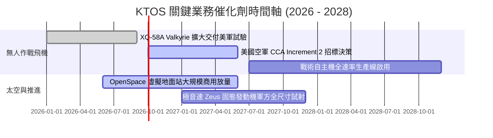

### 9.2 TAM 市場規模分析

```
╔══════════════════════════════════════════════════════════════════╗
║                    KTOS 目標市場規模 (TAM) 拆解                  ║
╠══════════════════════════════════════════════════════════════╣
║                                                                  ║
║  1. 戰術無人自主作戰 (CCA/UAS)： $18.5B TAM  (滲透率 ~2.5%)     ║
║     現有收入約 $457M，為未來 5 年核心成長爆發點                  ║
║                                                                  ║
║  2. 衛星軟體定義地面系統 (OpenSpace)：$6.2B TAM  (滲透率 ~6.0%)   ║
║     高毛利純軟體平台，毛利率高達 65%+                            ║
║                                                                  ║
║  3. 極音速與微型渦輪推進系統：   $5.0B TAM  (滲透率 ~5.0%)       ║
║     美國國防部高超音速試驗不可或缺的動力供應商                   ║
║                                                                  ║
║  📊 總可定址市場 (Total TAM)：約 $29.7B，KTOS 目前整體滲透率僅 5%║
╚══════════════════════════════════════════════════════════════════╝
```

### 9.3 成長驅動力結構圖

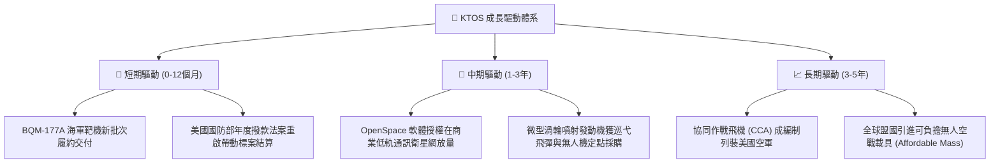

---

## 10. 風險矩陣

### 10.1 風險評分矩陣

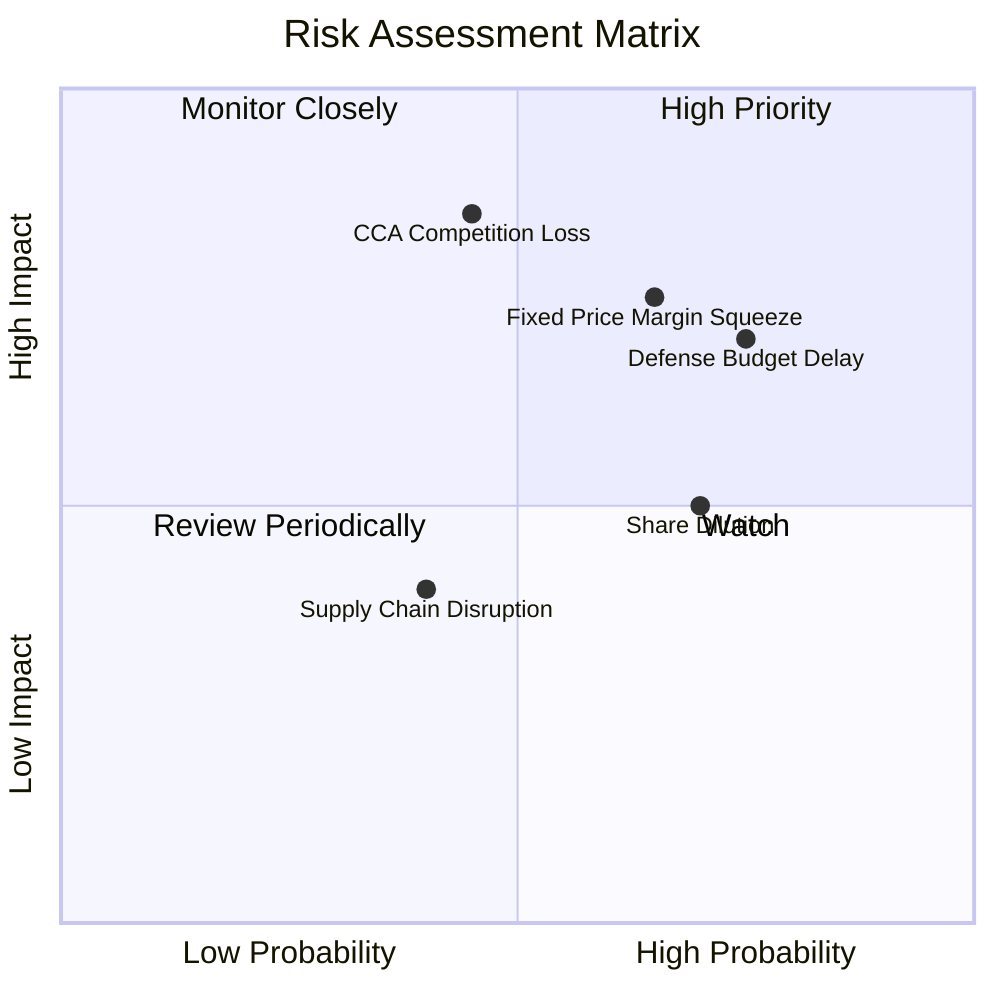

### 10.2 風險清單詳細分析

| # | 風險項目 | 發生機率 | 潛在財務衝擊 | 風險評分 | 緩解措施與對沖 |
|---|----------|----------|--------------|----------|----------------|
| 1 | 🔴 **固定價格合約利潤率承壓** | 高 (65%) | 高 (-3pp 營業利潤率) | 🔴 8.0/10 | 重新談判合約通膨補償條款，提高工程自動化比重 |
| 2 | 🔴 **美國國防部專案決策延遲** | 高 (75%) | 中 (-10% 預期營收) | 🔴 7.5/10 | 拓展海外五眼聯盟（英國、澳洲）軍售與商業太空業務 |
| 3 | 🔴 **無人機重大標案（CCA）失利** | 中 (45%) | 極高 (-30% 估值倍數) | 🔴 8.5/10 | 提供次系統、發動機及靶機測試服務，分散單一機型依賴 |
| 4 | 🟡 **股權稀釋與高 SBC 支出** | 高 (70%) | 中 (-5% EPS 稀釋) | 🟡 6.5/10 | 敦促管理層利用帳上 $1.44B 現金適時展開股票回購對沖 |

---

## 11. 投資建議

### 11.1 最終綜合評級雷達圖

```
╔══════════════════════════════════════════════════════════════╗
║                  KTOS 綜合維度評分雷達                        ║
╠══════════════════════════════════════════════════════════════╣
║  成長動能 (Growth)      8.5/10 ▓▓▓▓▓▓▓▓▓▓▓▓▓▓▓▓▓░░░  🟢 頂級 ║
║  財務健康 (Balance Sh)  9.0/10 ▓▓▓▓▓▓▓▓▓▓▓▓▓▓▓▓▓▓░░  🟢 極優 ║
║  護城河深度 (Moat)      7.2/10 ▓▓▓▓▓▓▓▓▓▓▓▓▓▓░░░░░░  🟢 良好 ║
║  管理層執行 (Execution) 6.8/10 ▓▓▓▓▓▓▓▓▓▓▓▓▓░░░░░░░  🟡 尚可 ║
║  估值性價比 (Valuation) 5.0/10 ▓▓▓▓▓▓▓▓▓▓░░░░░░░░░░  🟡 偏貴 ║
║  獲利品質 (Earnings Q)  4.5/10 ▓▓▓▓▓▓▓▓▓░░░░░░░░░░░  🔴 偏弱 ║
╠══════════════════════════════════════════════════════════════╣
║  綜合總評分             6.8/10 ⚖️ 建議評級：持有 / 觀望 (HOLD) ║
╚══════════════════════════════════════════════════════════════╝
```

### 11.2 目標價與隱含報酬率

當前股價為 **$46.16**，以下為各情境 12 個月目標價推演：

| 情境 | 機率 | 隱含目標價 | 相對現價空間 | 核心觸發條件 |
|------|------|------------|--------------|--------------|
| 🔴 **悲觀情境 (Bear)** | 25% | **$33.64** | **-27.1%** | 利潤率持續低迷，固定價格合約進一步超支虧損 |
| 🟡 **基準情境 (Base)** | 55% | **$48.91** | **+6.0%** | 營收維持 16-18% 成長，利潤率緩步爬坡至 5-6% |
| 🟢 **樂觀情境 (Bull)** | 20% | **$66.75** | **+44.6%** | 奪得 CCA Increment 2 巨額訂單，OpenSpace 爆發放量 |

### 11.3 買入時機與觸發因素

```
╔══════════════════════════════════════════════════════════════════╗
║                  ✅ 買入與操作觸發 Checklist                     ║
╠══════════════════════════════════════════════════════════════════╣
║                                                                  ║
║  立即買入觸發條件（需多數符合）：                                ║
║  ☐ 股價回檔至安全邊際充足區間：$35.00 – $39.00 (MOS ≥ 20%)       ║
║  ☐ 單季營業利潤率確認回升並穩定於 4.0% 以上                      ║
║  ☐ 季度自由現金流 (FCF) 轉正，重資本支出週期見頂收斂            ║
║                                                                  ║
║  加碼觸發條件（出現以下任一）：                                  ║
║  ☐ 正式獲選為美國空軍 CCA 核心主承包商並簽署大規模生產合約      ║
║  ☐ 管理層宣佈實施股票回購計畫，抵消股權薪酬 (SBC) 稀釋          ║
║                                                                  ║
║  減碼/停損觸發條件（出現以下任一）：                             ║
║  ☐ 單季營業利潤率持續為負且營收成長率跌破 15%                    ║
║  ☐ 無人機核心試驗專案遭遇技術挫敗或競標全面落敗於對手          ║
║  ☐ 股價非理性衝高超過 $55.00（透支未來三年成長）                 ║
╚══════════════════════════════════════════════════════════════════╝
```

### 11.4 投資人適配度分析

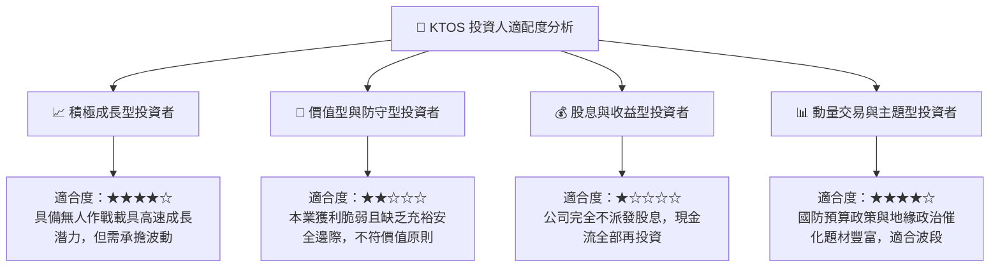

### 11.5 每季財報監控清單（Quarterly Watch List）

| 監控指標 | 正常追蹤基準 | 觸發加碼門檻 (Bull) | 觸發減碼/停損門檻 (Bear) |
|----------|--------------|---------------------|--------------------------|
| **季度營收 YoY 成長** | 18% – 22% | 連續兩季 > 28% | 跌破 12% |
| **營業利潤率 (GAAP)** | 2.5% – 4.0% | 單季突破 > 6.0% | 連續兩季為負值 (< 0%) |
| **自由現金流 (FCF)** | 減虧並收斂至零軸 | 單季 FCF 轉正 > +$20M | 單季 FCF 流出擴大 > -$50M |
| **資本支出 (Capex)** | 佔營收 4.0% – 5.0% | 降至營收 3.5% 以下 | 失控飆升至營收 7.0% 以上 |
| **無人系統 (US) 營收** | 單季 > $110M | 單季突破 > $140M | 跌破 $80M |

### 11.6 反面論證：什麼會證明論點錯誤（What Would Change My Mind）

```
╔══════════════════════════════════════════════════════════════════╗
║              ⚠️ 論點失效條件（Disconfirming Evidence）           ║
╠══════════════════════════════════════════════════════════════════╣
║  本報告之「持有/觀望」論點在下列情況發生時應進行調整：           ║
║                                                                  ║
║  【轉為全面看多（強力買入）條件】：                              ║
║  1. FY2026 下半年營業利潤率展現強大營業槓桿，單季利潤率跳升至   ║
║     6.5% 以上，證明前期學習成本已消化完畢；                      ║
║  2. 美軍正式確認 XQ-58A Valkyrie 進入編制量產，訂單額突破 $1B； ║
║  3. 股價非理性重挫至 $35.00 以下，安全邊際 MOS 擴大至 >28%。    ║
║                                                                  ║
║  【轉為全面看空（賣出）條件】：                                  ║
║  1. TTM 自由現金流持續呈現 -$100M 以上之失血狀態達 4 季以上；    ║
║  2. ROIC 持續在 1.5% 以下徘徊，無法收斂與 WACC (9.40%) 之差距； ║
║  3. 公司再次發動大規模股權增發稀釋現有股東權益超過 10%。        ║
╚══════════════════════════════════════════════════════════════════╝
```

---
> **免責聲明**：本報告為機構級分析架構生成之研究報告，僅供專業研究參考，不構成任何具體投資建議或買賣要約。國防科技產業受地緣政治、政府合約及預算編列高度影響，投資人應獨立評估財務風險並審慎決策。