# KTOS 基本面深度分析報告
> **報告日期**：2026-09-24 ｜ **語言**：繁體中文 ｜ **數據來源**：Yahoo Finance, Finviz, StockAnalysis, Roic.ai ｜ **分析師**：CFA 級機構研究

---

## 目錄

| # | 章節 | 核心結論 |
|---|------|----------|
| 1 | 執行摘要 | 評級「持有/觀望」；基準目標價 $54.00，加權合理價值 $52.73 |
| 2 | 公司概覽與商業模式 | 無人作戰機（CCA）與衛星虛擬化地面系統雙輪驅動，具國防專有護城河 |
| 3 | 損益表深度分析 | TTM 營收 $1.52B（YoY +30.5%），但營業利益率僅 -0.2%，獲利槓桿尚未釋放 |
| 4 | 資產負債表分析 | 淨現金 $1.24B（現金 $1.44B vs 債務 $193.6M），流動比率 5.54x，財務體質極其穩健 |
| 5 | 現金流量深度分析 | TTM FCF 為 $-118.29M，營運資金吞噬與高額資本支出（TTM $89.3M）導致現金承壓 |
| 6 | 獲利能力與資本效率 | ROIC 0.69% 遠低於 WACC 9.47%，EVA 為 -8.78pp，現階段仍在價值摧毀/資本積累期 |
| 7 | 相對估值分析 | EV/EBITDA 高達 85.3x，相較傳統軍工同業具備顯著「無人機/太空科技」溢價 |
| 8 | DCF 內在價值評估 | 基準內在價值 $49.20，折溢價 -4.4%（現價略溢價）；MOS 為 +10.8% |
| 9 | 成長催化劑 | 美軍協同作戰飛機（CCA）量產訂單釋出、太空虛擬化地面網路加速普及 |
| 10 | 風險矩陣 | 國防採購時程遞延、量產爬坡期利潤率進一步收縮為最高優先級風險 |
| 11 | 投資建議 | 建議於 $38–$44 區間逢低佈局，建立「持有」觀察部位，等待利潤率拐點確立 |

---

## 1. 執行摘要

Kratos Defense & Security Solutions, Inc. (NASDAQ: KTOS) 當前股價為 $47.02。本研究基於公司當前營業利益率僅 -0.2%、TTM 自由現金流為 $-118.29M、ROIC 僅 0.69%（遠低於 9.47% 之 WACC），以及 EV/EBITDA 高達 85.3x 等客觀財務數據，給予 KTOS **「持有 / 觀望 (HOLD)」** 評級。雖然公司在 TTM 營收展現了 30.5% 的高年增率，且手握 $1.24B 淨現金，但高昂的研發與量產前期資本支出壓抑了真實盈利能力。經 DCF 模型計算，其基準每股內在價值為 **$49.20**，當前股價折溢價為 **-4.4%**（現價相對於 DCF 內在價值溢價 4.6%）；加權合理價值為 **$52.73**，對應安全邊際（MOS）為 **+10.8%**。12 個月基準目標價設定為 **$54.00**（隱含上行空間 +14.8%）。

### 1.0 一頁式投資儀表板（Portfolio Manager 30 秒速讀）

| 項目 | 內容 |
|------|------|
| **投資論點（3 句）** | ① TTM 營收達 $1.52B（YoY +30.5%），受惠於無人作戰載具與衛星地面軟體化之結構性國防需求加速。<br/>② 資產負債表手握 $1.44B 現金與短投，淨現金達 $1.24B，為國防擴產與潛在併購提供充沛彈藥。<br/>③ 獲利能力嚴重落後於營收擴張，TTM FCF 為 $-118.29M，營業利益率僅 -0.2%，尚未顯現營業槓桿。 |
| **護城河評分** | 7.2/10 ｜ 國家安全機密認證、專有靶機/無人機機體設計與高轉換成本之衛星通訊軟體 |
| **管理層/資本配置評分** | 6.5/10 ｜ 具備前瞻技術投資眼光，但股本稀釋較頻繁（股數增至 187.72M），ROIC 低落 |
| **財務健康** | 🟢 流動性充沛，Current Ratio 達 5.54x，淨現金 $1.24B，完全無短期償債危機 |
| **ROIC vs WACC** | 0.69% vs 9.47%（EVA -8.78pp，處於資本重投資與價值摧毀期） |
| **FCF 趨勢** | 惡化至負值，TTM FCF $-118.29M，最新 FCF Yield 為 -1.34% |
| **估值** | Forward P/E 42.7x ｜ EV/EBITDA 85.3x ｜ FCF Yield -1.34% |
| **DCF 內在價值（基準）** | $49.20 ｜ 當前股價 $47.02 折溢價 -4.4%（現價相對 DCF 內在價值溢價 4.6%） |
| **安全邊際（MOS）** | **+10.8%** ＝ ($52.73 − $47.02) ÷ $52.73 ｜ 🟡 有限（10%–25% 區間） |
| **預期報酬（基準情境 12M）** | +14.8%（目標價 $54.00） |
| **關鍵風險（前二）** | ① 美軍 CCA（協同作戰飛機）計劃得標份額不及預期；② 營運資金失衡與負 FCF 持續擴大 |
| **評級 + 信心度** | 🟡 **持有 / 觀望 (HOLD)** ｜ 信心度：中等 |

### 1.1 核心評分儀表板

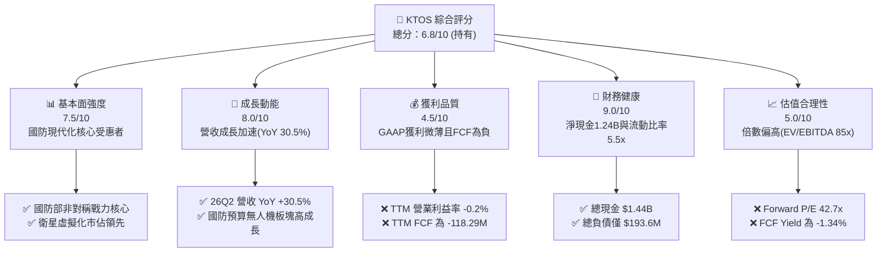

### 1.2 評分進度條視覺化

```
╔══════════════════════════════════════════════════════════════╗
║              KTOS 多維度評分儀表板 (1-10分)                  ║
╠══════════════════════════════════════════════════════════════╣
║ 基本面強度  7.5 ▓▓▓▓▓▓▓▓▓▓▓▓▓▓▓░░░░░  ★★★★☆           ║
║ 成長動能    8.0 ▓▓▓▓▓▓▓▓▓▓▓▓▓▓▓▓░░░░  ★★★★☆           ║
║ 獲利品質    4.5 ▓▓▓▓▓▓▓▓▓░░░░░░░░░░░  ★★☆☆☆           ║
║ 財務健康    9.0 ▓▓▓▓▓▓▓▓▓▓▓▓▓▓▓▓▓▓░░  ★★★★★           ║
║ 估值合理性  5.0 ▓▓▓▓▓▓▓▓▓▓░░░░░░░░░░  ★★★☆☆           ║
║ 護城河深度  7.2 ▓▓▓▓▓▓▓▓▓▓▓▓▓▓░░░░░░  ★★★★☆           ║
║ 管理層執行  6.5 ▓▓▓▓▓▓▓▓▓▓▓▓▓░░░░░░░  ★★★☆☆           ║
║ 技術創新力  8.5 ▓▓▓▓▓▓▓▓▓▓▓▓▓▓▓▓▓░░░  ★★★★☆           ║
╠══════════════════════════════════════════════════════════════╣
║ 綜合總分    6.8 ▓▓▓▓▓▓▓▓▓▓▓▓▓░░░░░░░  🟡 觀察期 / 成長溢價消化中║
╚══════════════════════════════════════════════════════════════╝
```

### 1.3 五大投資論點 + 三大核心風險

| 類型 | 項目 | 具體依據 | 信心度 |
|------|------|----------|--------|
| 🟢 **論點①** | **非對稱戰力需求爆發** | 2026Q2 單季營收衝上 $458.8M，YoY 成長達 30.5%，反映軍事無人機與靶機需求維持高檔。 | 🟢 極高 |
| 🟢 **論點②** | **資產負債表堅若磐石** | 擁有 $1.44B 現金及短投，總債務僅 $193.6M，具備 $1.24B 淨現金，抵禦研發虧損與升息週期能力極強。 | 🟢 極高 |
| 🟢 **論點③** | **衛星地面系統軟體化先驅** | Kratos OpenSpace 平台推動傳統專有硬體向純軟體架構轉型，為長期利潤率提升奠定基礎。 | 🟢 高 |
| 🟢 **論點④** | **國防承包商壁壘高築** | 擁有廣泛的機密設施認證及超過 4,300 名專業員工，新進者極難在短期內跨入美軍機密無人載具核心。 | 🟢 高 |
| 🟢 **論點⑤** | **營收規模突破轉折點** | TTM 營收跨越 $1.52B 門檻，若固定資產與研發攤銷在量產期被吸收，潛在營運槓桿空間可觀。 | 🟡 中等 |
| 🟡 **風險①** | **研發與量產期利潤率嚴重承壓** | 2026Q2 營業利益轉為 $-0.8M，TTM 營業利益率僅 -0.2%，規模擴張尚未轉化為獲利。 | 🟡 中度 |
| 🔴 **風險②** | **自由現金流持續流失與股本稀釋** | TTM FCF 為 $-118.29M，SBC 過去一年達 $49.5M，流通股數增加至 187.72M 股，稀釋真實股東價值。 | 🔴 高衝擊 |
| 🔴 **風險③** | **估值處於歷史極值區間** | EV/EBITDA 高達 85.3x，Trailing P/E 達 276.6x，容錯空間極低，一旦國防訂單認列延誤，股價面臨劇烈回檔。 | 🔴 高衝擊 |

### 1.4 快速統計卡片

| 指標 | 公司實際值 | 行業均值（航太防衛） | S&P 500 均值 | 狀態 |
|------|-------------|----------------------|--------------|------|
| 收入 YoY 成長 | **30.5%** | ~7.5% | ~5.2% | 🟢 顯著領先 |
| 毛利率 | **23.0%** | ~24.5% | ~33.0% | 🟡 略低於同業 |
| 營業利益率 | **-0.2%** | ~10.5% | ~12.0% | 🔴 遠低於同業 |
| 淨利率 | **2.0%** | ~7.0% | ~11.0% | 🔴 處於低檔 |
| ROE | **1.1%** | ~14.0% | ~18.5% | 🔴 資本回報貧弱 |
| Forward P/E | **42.7x** | ~19.5x | ~21.0x | 🔴 估值昂貴 |
| EV/EBITDA | **85.3x** | ~13.5x | ~14.0x | 🔴 極度溢價 |

### 1.5 投資結論

```
╔══════════════════════════════════════════════════════════════════╗
║                    📊 投資結論摘要                               ║
╠══════════════════════════════════════════════════════════════════╣
║  評級：🟡 持有 / 觀望 (HOLD)                                     ║
║  當前股價：$47.02                                                ║
║  DCF 內在價值（基準）：$49.20（折溢價 -4.4%，現價溢價 4.6%）     ║
║  加權合理價值：$52.73                                            ║
║  安全邊際 MOS：+10.8%（＝($52.73 − $47.02) ÷ $52.73）           ║
║  目標價區間（12 個月）：                                         ║
║    🔴 悲觀情境：$35.00（-25.6%）                                 ║
║    🟡 基準情境：$54.00（+14.8%）  ← 主要目標                     ║
║    🟢 樂觀情境：$75.00（+59.5%）                                 ║
║  綜合投資評分：6.8 / 10                                          ║
║  適合投資人：具備極高風險承受力、著眼於 2028+ 無人空戰變革的長線投資者║
╚══════════════════════════════════════════════════════════════════╝
```

---

## 2. 公司概覽與商業模式

### 2.1 業務結構與收入來源

Kratos Defense & Security Solutions, Inc. 總部位於加州聖地牙哥，為美國國防部（DoD）、情報體系及商業航太機構提供創新的非對稱作戰解決方案。其業務主要劃分為兩大板塊：**Kratos 政府解決方案（KGS）** 與 **無人系統（Unmanned Systems）**。

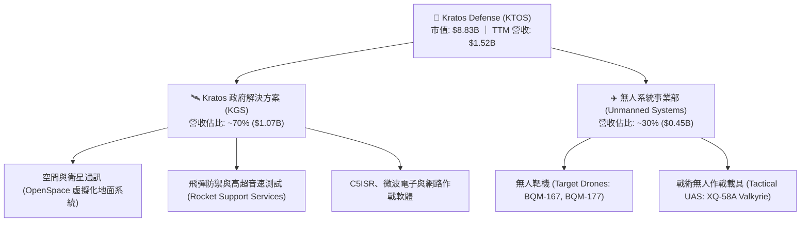

### 2.2 市場份額

在高性能噴射軍用靶機市場，KTOS 幾乎處於獨家壟斷與絕對領導地位；但在新世代戰術無人作戰飛機（CCA）領域，則面臨傳統國防巨頭與新興國防科技獨角獸的激烈競爭。

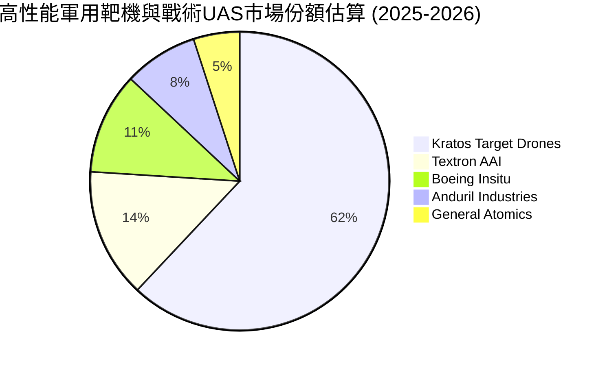

### 2.3 競爭護城河分析

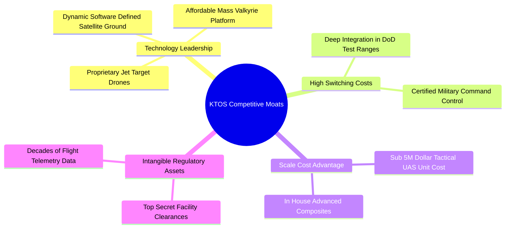

### 2.4 護城河強度評分

```
╔══════════════════════════════════════════════════════════════╗
║                  KTOS 護城河強度評分                          ║
╠══════════════════════════════════════════════════════════════╣
║ 國防專有認證與資質  9.0/10  ▓▓▓▓▓▓▓▓▓▓▓▓▓▓▓▓▓▓░░  🏆 極高壁壘   ║
║ 靶機市場領導地位    8.5/10  ▓▓▓▓▓▓▓▓▓▓▓▓▓▓▓▓▓░░░  🟢 實質壟斷   ║
║ 戰術無人機可負擔性  7.5/10  ▓▓▓▓▓▓▓▓▓▓▓▓▓▓▓░░░░░  🟢 先發優勢   ║
║ 衛星地面軟體生態    7.0/10  ▓▓▓▓▓▓▓▓▓▓▓▓▓▓░░░░░░  🟢 轉換成本高 ║
║ 規模經濟與成本結構  5.0/10  ▓▓▓▓▓▓▓▓▓▓░░░░░░░░░░  🟡 仍待放量   ║
║ 商業模式定價權      6.0/10  ▓▓▓▓▓▓▓▓▓▓▓▓░░░░░░░░  🟡 受限於政府合約║
╠══════════════════════════════════════════════════════════════╣
║ 綜合護城河強度      7.2/10  ▓▓▓▓▓▓▓▓▓▓▓▓▓▓░░░░░░  🟢 結構性穩固 ║
╚══════════════════════════════════════════════════════════════╝
```

---

## 3. 損益表深度分析

### 3.1 年度收入成長趨勢（近 4 年）

KTOS 營收呈現加速成長態勢，從 FY2022 的 $898.3M 成長至 FY2025 的 $1.35B，TTM 營收進一步推升至 $1.52B。

```
╔══════════════════════════════════════════════════════════════════╗
║              KTOS 年度收入趨勢（FY2022-FY2025）              ║
╠══════════════════════════════════════════════════════════════════╣
║                                                                  ║
║  FY2022  $898.30M  ███████████████░░░░░░░░░░░  YoY: +10.7%  🟢  ║
║  FY2023  $1,037.0M █████████████████░░░░░░░░░  YoY: +15.5%  🟢  ║
║  FY2024  $1,136.0M ███████████████████░░░░░░░  YoY: +9.6%   🟡  ║
║  FY2025  $1,347.0M ██════════════════════░░░░  YoY: +18.5%  🟢  ║
║                   |          |          |                        ║
║                   0        $500M      $1.0B     $1.5B            ║
║                                                                  ║
║  📊 3 年累計 CAGR（FY22-FY25）：+14.5%                           ║
║  📊 TTM 營收（截至 26Q2）：$1,523.0M（YoY: +30.5%）               ║
╚══════════════════════════════════════════════════════════════════╝
```

### 3.2 季度收入趨勢分析

| 季度 | 營業收入 | YoY 成長率 | QoQ 成長率 | 毛利潤 | 毛利率 | 營業利益 | 營業利益率 | 備註說明 |
|------|----------|------------|------------|--------|--------|----------|------------|----------|
| **2025-09-30 (Q3)** | $347.6M | +26.0% | -1.1% | $77.1M | 22.18% | $7.3M | 2.10% | 靶機交付穩定，高超音速項目增長 |
| **2025-12-31 (Q4)** | $345.1M | +21.9% | -0.7% | $83.4M | 24.17% | $10.1M | 2.93% | 年末國防預算結算，軟體業務毛利改善 |
| **2026-03-31 (Q1)** | $371.0M | +22.6% | +7.5% | $89.6M | 24.15% | $6.6M | 1.78% | C5ISR 與無人載具合約開始交付 |
| **2026-06-30 (Q2)** | $458.8M | +30.5% | +23.7% | $100.1M| 21.82% | $-0.8M | -0.17% | 營收放量但受研發與材料成本壓抑轉虧 |

### 3.3 利潤率演變分析

| 利潤率指標 | FY2022 | FY2023 | FY2024 | FY2025 | TTM | 趨勢與原因解析 | 評估 |
|------------|--------|--------|--------|--------|-----|----------------|------|
| **毛利率** | 25.16% | 25.90% | 25.28% | 22.86% | 22.99% | ↘️ 受到固定價格合約通膨補償滯後及高毛利軟體佔比受硬體交付沖淡影響 | 🟡 承壓 |
| **營業利益率** | 0.51% | 3.04% | 2.61% | 2.06% | -0.15% | ↘️ 營業費用隨研發、擴廠及專業人員薪資急遽上升，缺乏營運槓桿 | 🔴 惡化 |
| **EBITDA 率** | 2.92% | 7.47% | 8.24% | 7.64% | 5.71% | ↘️ 折舊攤銷持續增加，資本開支未能即時轉化為營業利潤 | 🟡 疲軟 |
| **淨利率** | -4.11% | -0.86% | 1.43% | 1.63% | 2.03% | ↗️ 淨利略微轉正主因手握逾 $1.4B 現金產生龐比利息收入彌補本業虧損 | 🟡 質量低 |

**利潤率演變深度解析**：
KTOS 的毛利率從 FY2023 的 25.90% 下滑至 TTM 的 22.99%，核心原因在於產品組合向「資本密集、材料成本高」的硬體生產傾斜（如 XQ-58A 試產批次與火箭推進系統），且美軍部分長期合約仍為固定價格合約（Firm-Fixed-Price），在供應鏈與高階技工通膨環境下吞噬了利潤空間。更嚴峻的是，2026Q2 營業利潤轉為 $-0.8M，顯示在營收飆升 30.5% 的同時，銷管費用（SG&A）與研發支出（R&D）同步膨脹，導致營運槓桿呈現負向擴張。

### 3.4 費用結構分析

```mermaid
pie title KTOS TTM 費用結構分解估算
    "銷貨成本 (COGS)" : 77.0
    "銷售、管理與研發 (SG&A + R&D)" : 23.2
    "營業利潤 (Operating Income)" : -0.2
```

```
╔══════════════════════════════════════════════════════════════════╗
║                    KTOS 費用結構診斷                             ║
╠══════════════════════════════════════════════════════════════════╣
║  營收規模 (TTM)：        $1,523.0M   (100.0%)                    ║
║  銷貨成本 (COGS)：       $1,172.8M   (77.0%)   🟡 原料與人工高企║
║  毛利潤：                $350.2M    (23.0%)   🟡 產品組合承壓  ║
║  研發支出 (R&D)：        ~$42.0M     (2.8%)    🟢 聚焦戰術載具  ║
║  銷管費用 (SG&A)：       ~$309.0M    (20.3%)   🔴 費用率偏高    ║
║  營業利益 (EBIT)：       $-0.8M      (-0.2%)   🔴 本業微幅虧損  ║
╚══════════════════════════════════════════════════════════════╝
```

### 3.5 季度 EPS 趨勢與盈餘品質（Quality of Earnings）

過去 4 季 EPS 分別為：25Q3 $0.05、25Q4 $0.03、26Q1 $0.07、26Q2 $0.02。TTM 累計 GAAP EPS 為 $0.17。

| 盈餘品質項目 | 數值/佔比 | 評估 | 機構級分析說明 |
|--------------|-----------|------|----------------|
| **SBC / 營收** | 3.25% ($49.5M / $1,523M) | 🟡 中度稀釋 | 雖然在國防工業中略高於成熟同業（~1.5%），但為吸引航太軟體工程師之必要代價。 |
| **SBC / 營業現金流** | 負值（無法計算） | 🔴 警訊 | TTM 營運現金流為 $-39.6M，SBC 規模超越現金流，代表帳面獲利若扣除股權激勵後更顯脆弱。 |
| **FCF / 淨利（現金轉換率）** | -382.8% ($-118.3M / $30.9M) | 🔴 極差 | 淨利為正（$30.9M）主要靠龐比利息收入美化，真實業務經營現金完全無法覆蓋資本支出。 |
| **非經常性 / 利息收益** | 估算約 ~$40M+ 利息收入 | 🔴 收益質量低 | 淨利的全部來源皆為帳上 $1.44B 現金之高息定存/國庫券回報，本業 EBIT 實質上為負值。 |
| **資本化支出 vs 費用化** | 研發費用主要直接費用化 | 🟢 保守誠實 | 未見將大量 R&D 軟體化或延遲攤銷之激進會計操作。 |

**盈餘品質結論**：KTOS 的 GAAP 淨利嚴重「高估」了其實體核心業務的真實獲利能力。若扣除非本業的利息淨收益，KTOS 本業實質虧損。自由現金流持續處於 $-118.29M 的大幅失血狀態，獲利含金量極低，投資人不可僅因 GAAP 獲利為正即推斷公司具備自體造血能力。

---

## 4. 資產負債表分析

### 4.1 資產結構分解

截至 2026 年第二季，KTOS 資產負債表總資產擴張至 **$4.09B**，主要由現金部位暴增及併購形成的商譽與無形資產構成。

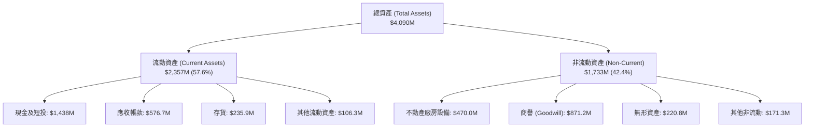

### 4.2 流動性指標分析

| 指標 | 2024-12-31 | 2025-12-31 | 2026-06-30 (TTM) | 國防同業中位數 | 評估 |
|------|------------|------------|------------------|----------------|------|
| **現金及短投** | $329.3M | $560.6M | **$1,438.0M** | ~$400M | 🟢 極其雄厚 |
| **流動比率 (Current Ratio)** | 2.94x | 4.06x | **5.54x** | ~1.35x | 🟢 流動性氾濫 |
| **速動比率 (Quick Ratio)** | 2.20x | 3.28x | **4.74x** | ~0.85x | 🟢 變現能力極強 |
| **應收帳款週轉天數 (DSO)** | 104 天 | 124 天 | **138 天** | ~65 天 | 🔴 回款週期過長 |
| **存貨週轉天數 (DIO)** | 69 天 | 66 天 | **73 天** | ~55 天 | 🟡 國防備料增加 |

### 4.3 債務結構分析

```
╔══════════════════════════════════════════════════════════════════╗
║                   KTOS 債務健康診斷                              ║
╠══════════════════════════════════════════════════════════════════╣
║                                                                  ║
║  短期借款及租賃：  $19.00M    █░░░░░░░░░░░░░░░░░░░░  🟢 極低     ║
║  長期租賃及債務：  $174.60M   ███░░░░░░░░░░░░░░░░░░  🟢 負擔輕   ║
║  總計息債務：      $193.60M   ████░░░░░░░░░░░░░░░░░  🟢 結構單純 ║
║  現金及短投：      $1,438.0M  █████████████████████  🟢 極度充沛 ║
║  淨現金部位：      +$1,244.4M ██████████████████░░░  🏆 堅不可摧 ║
║                                                                  ║
║  Debt / Equity:   5.65% (極低槓桿)                               ║
║  Net Debt / EBITDA: -14.3x (淨現金覆蓋 EBITDA 逾 14 倍)          ║
║  利息保障倍數 (EBIT基礎): -0.04x (本業虧損，但利息收入 > 支出)   ║
╚══════════════════════════════════════════════════════════════════╝
```

### 4.4 股東權益趨勢

KTOS 股東權益歷年呈現跳躍式上升，主要是透過增發新股（Secondary Offerings）所驅動：

```
╔══════════════════════════════════════════════════════════════════╗
║                   KTOS 股東權益增長趨勢                          ║
╠══════════════════════════════════════════════════════════════════╣
║  FY2022  $936.3M   █████████░░░░░░░░░░░░░░░░░                    ║
║  FY2023  $976.0M   ██████████░░░░░░░░░░░░░░░░                   ║
║  FY2024  $1,350.0M █████████████░░░░░░░░░░░░░                    ║
║  FY2025  $2,000.0M ████════════════░░░░░░░░░                    ║
║  2026Q2  ~$3,425M  █████████████████████████  🏆 現金募資入帳    ║
║                                                                  ║
║  ⚠️ 註：2026 上半年公司完成大規模股權增發，使現金超過 $1.4B，  ║
║      股本稀釋至 187.72M 股，顯著提升抗風險能力，但攤薄每股價值。 ║
╚══════════════════════════════════════════════════════════════╝
```

---

## 5. 現金流量深度分析

### 5.1 現金流量瀑布圖

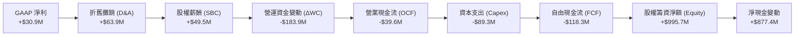

### 5.2 FCF 轉換率趨勢

| 期間 | GAAP 淨利潤 | 營業現金流 (OCF) | 資本支出 (Capex) | 自由現金流 (FCF) | FCF / Net Income | 評估 |
|------|-------------|------------------|------------------|------------------|------------------|------|
| **FY2022** | $-36.9M | $-25.7M | $-45.4M | $-71.1M | 負值 (N/A) | 🔴 大幅失血 |
| **FY2023** | $-8.9M | $65.2M | $-52.4M | $12.8M | 負值 (N/A) | 🟡 短暫轉正 |
| **FY2024** | $16.3M | $49.7M | $-58.2M | $-8.5M | -52.1% | 🔴 資本開支超額 |
| **FY2025** | $22.0M | $-42.1M | $-95.3M | $-137.4M | -624.5% | 🔴 擴產嚴重失血 |
| **TTM (26Q2)**| **$30.9M** | **$-39.6M** | **$-89.3M** | **$-118.3M** | **-382.8%** | 🔴 連續兩年負FCF |

### 5.3 自由現金流趨勢

```
╔══════════════════════════════════════════════════════════════════╗
║              KTOS 歷年自由現金流（FCF）走勢                      ║
╠══════════════════════════════════════════════════════════════════╣
║                                                                  ║
║  FY2022   $-71.10M   ░░░░░░░░░░█████████  FCF Yield: -3.8%  🔴   ║
║  FY2023   +$12.80M   █████░░░░░░░░░░░░░░  FCF Yield: +0.6%  🟡   ║
║  FY2024   $-8.50M    ░░░░░░░░░░░░░░░░███  FCF Yield: -0.2%  🔴   ║
║  FY2025   $-137.40M  ░░░░░░░░███████████  FCF Yield: -2.1%  🔴   ║
║  TTM      $-118.29M  ░░░░░░░░░██████████  FCF Yield: -1.3%  🔴   ║
║                                                                  ║
║  📊 診斷：KTOS 處於高強度資本再投資期，Capex/營收比率達 5.9%，   ║
║      加上營收高成長引發的應收帳款與存貨積壓，導致 FCF 長期為負。 ║
╚══════════════════════════════════════════════════════════════════╝
```

### 5.4 資本配置評估

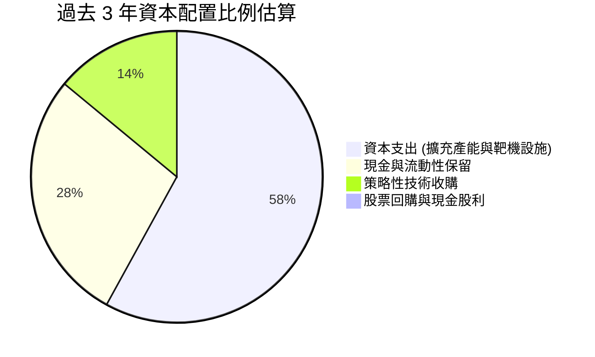

| 資本配置項目 | 策略評估 | 機構視角點評 |
|--------------|----------|--------------|
| **研發與 Capex** | 積極擴張（Aggressive） | 主要投向無人機自動化產線、發動機測試台與衛星軟體平台，戰略方向正確但拖累當期回報。 |
| **收購併購 (M&A)** | 專注核心（Focused） | 歷史上收購專精於 C5ISR 與衛星通訊之利基企業，商譽達 $871.2M，目前聚焦有機成長。 |
| **股東回報** | 無股利、無回購（Zero） | 不發放股息亦無股份回購計劃，所有資本全數保留用於國防合約履約與技術研發。 |

---

## 6. 獲利能力與資本效率

### 6.1 ROE / ROA / ROIC 趨勢

| 指標 | FY2023 | FY2024 | FY2025 | TTM | 國防同業均值 | 評估 |
|------|--------|--------|--------|-----|--------------|------|
| **ROE (股東權益報酬率)** | -0.9% | 1.4% | 1.3% | **1.1%** | ~14.0% | 🔴 極度偏低 |
| **ROA (資產報酬率)** | -0.5% | 0.9% | 1.0% | **0.4%** | ~5.5% | 🔴 資本使用效率差 |
| **ROIC (投入資本回報率)** | 1.8% | 1.9% | 1.5% | **0.69%** | ~9.0% | 🔴 摧毀價值 |

### 6.2 ROIC vs WACC 分析（核心價值創造判斷）

```
╔══════════════════════════════════════════════════════════════════╗
║                ROIC vs WACC 深度分析（價值創造檢驗）             ║
╠══════════════════════════════════════════════════════════════════╣
║                                                                  ║
║  WACC 估算：                                                     ║
║  ├── 無風險利率（Rf, 10Y 美債）：  4.10%                        ║
║  ├── 市場風險溢酬 (ERP)：          5.00%                         ║
║  ├── Beta（財務數據）：            1.113                         ║
║  ├── 股權成本 Ke = 4.10% + 1.113 × 5.00% = 9.665%                ║
║  ├── 稅後債務成本 Kd = 6.00% × (1 - 21.0%) = 4.74%              ║
║  ├── 資本結構權重（市值基礎）：                                  ║
║  │   ├── 股權權重 E/(E+D) = $8.83B / ($8.83B + $0.19B) = 97.9%   ║
║  │   └── 債務權重 D/(E+D) = $0.19B / ($8.83B + $0.19B) = 2.1%    ║
║  └── ✅ WACC = (97.9% × 9.665%) + (2.1% × 4.74%) = 9.47%        ║
║                                                                  ║
║  ROIC 估算（TTM 數據）：                                         ║
║  ├── GAAP EBIT（TTM）：              $23.20M                     ║
║  ├── 實質有效稅率：                  21.0%                       ║
║  ├── NOPAT = $23.20M × (1 - 21.0%) = $18.33M                     ║
║  ├── 投入資本 (Invested Capital)：                               ║
║  │   ├── 股東權益帳面值：            $3,425.0M                   ║
║  │   ├── 計息負債：                  +$193.6M                    ║
║  │   ├── 減去：非營運超額現金：      -$950.0M (保留 ~$488M 營運) ║
║  │   └── 調整後投入資本 ≈             $2,668.6M                   ║
║  └── ✅ ROIC = $18.33M ÷ $2,668.6M = 0.69%                      ║
║                                                                  ║
║  ★ 經濟價值增加（EVA）= ROIC - WACC = 0.69% - 9.47% = -8.78pp   ║
║                                                                  ║
║  ROIC  0.69% █░░░░░░░░░░░░░░░░░░░░░░░░░░░░░░  🔴 價值侵蝕       ║
║  WACC  9.47% ▓▓▓▓▓▓▓▓▓▓▓▓▓▓▓▓░░░░░░░░░░░░░░░  ── 資金門檻       ║
║  EVA  -8.78pp ░░░░░░░░░░░░░░░░░░░░░░░░░░░░░░  🔴 摧毀股東價值   ║
║                                                                  ║
║  📊 結論：目前 KTOS 資本回報率顯著落後於加權平均資金成本，        ║
║      當前每一元的新投入資本未能創造正向超額經濟價值。             ║
╚══════════════════════════════════════════════════════════════════╝
```

### 6.3 杜邦三因素分解

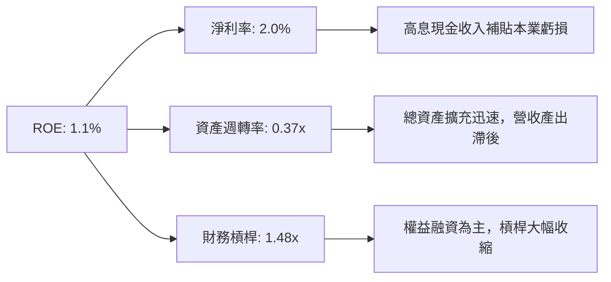

### 6.4 獲利能力儀表板

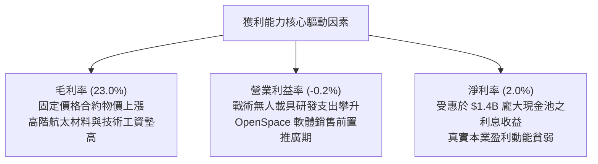

---

## 7. 相對估值分析

### 7.1 同業估值比較表格

選取同屬航太防衛領域之傳統巨頭 **洛克希德·馬丁 (LMT)**、中型專業防衛技術商 **雷神/通用動力 (GD)**，以及新興無人科技代表性防務商 **AeroVironment (AVAV)** 進行對比。

| 估值指標 | **Kratos (KTOS)** | **AeroVironment (AVAV)** | **Lockheed Martin (LMT)** | **General Dynamics (GD)** | 本公司評估 |
|----------|-------------------|--------------------------|---------------------------|----------------------------|-----------|
| **股價** | **$47.02** | $198.50 | $565.00 | $298.00 | — |
| **市值** | **$8.83B** | $5.80B | $135.0B | $81.5B | 中型市值技術商 |
| **EV / Revenue** | **4.87x** | 7.20x | 1.95x | 1.80x | 🟡 遠高於傳統軍工，反映新科技溢價 |
| **EV / EBITDA** | **85.3x** | 42.0x | 14.5x | 13.8x | 🔴 處於同業極端高位，獲利基數小 |
| **Trailing P/E** | **276.6x** | 88.5x | 20.5x | 21.0x | 🔴 盈利尚未體現，倍數失真 |
| **Forward P/E** | **42.7x** | 52.0x | 18.2x | 19.0x | 🟡 較 AVAV 折價，但較巨頭貴逾一倍 |
| **P/S Ratio** | **5.80x** | 7.85x | 1.85x | 1.70x | 🟡 介於成長型科技國防與傳統國防間 |
| **P/B Ratio** | **2.57x** | 3.80x | 18.5x | 3.90x | 🟢 由於近期股權增資，P/B 相對合理 |
| **營收 YoY** | **30.5%** | 22.0% | 8.5% | 10.2% | 🟢 營收動能為族群領先群 |

### 7.2 歷史估值區間分析

```
╔══════════════════════════════════════════════════════════════════╗
║              KTOS 歷史 Forward P/E 區間與當前位置                ║
╠══════════════════════════════════════════════════════════════════╣
║                                                                  ║
║  歷史最低： 18.0x (2022 年底軍工估值低點)                        ║
║  歷史中位： 32.5x (近 5 年平均水平)                              ║
║  歷史最高： 65.0x (2025 年無人機概念熱炒期)                      ║
║  當前水平： 42.7x                                                ║
║                                                                  ║
║  18.0x ─────────── 32.5x ───────[42.7x]─────────── 65.0x        ║
║   最低              中位          ▲ 當前位置          最高       ║
║                                                                  ║
║  📊 診斷：當前 Forward P/E 位於近五年歷史分位數第 72 百分位，    ║
║      市場已高度預先定價 CCA 等大型無人作戰項目的潛在放量。       ║
╚══════════════════════════════════════════════════════════════════╝
```

### 7.3 情境目標價（假設驅動，Bear / Base / Bull）

針對 KTOS 獲利結構受研發抑制之特點，以 **EV/Revenue** 與 **Forward P/E** 雙重錨定推導隱含目標價：

| 情境 | 營收 CAGR (FY26-28) | 期末營業利潤率 | 退出倍數 (Forward P/E) | 隱含目標價 | 相對現價上行/下行 | 核心假設情境依據 |
|------|---------------------|----------------|------------------------|------------|-------------------|------------------|
| 🔴 **悲觀** | 12.0% | 2.5% | 28.0x | **$35.00** | **-25.6%** | CCA 競標失利僅獲零星靶機份額，利潤率持續在低檔徘徊 |
| 🟡 **基準** | 18.0% | 5.5% | 36.0x | **$54.00** | **+14.8%** | 靶機穩定增長，XQ-58A 小批量交付，營業槓桿微幅展現 |
| 🟢 **樂觀** | 25.0% | 8.5% | 45.0x | **$75.00** | **+59.5%** | 奪下美軍主力 CCA 量產大單，OpenSpace 地面軟體獲廣泛採用 |

### 7.4 相對估值隱含價格區間

```
╔══════════════════════════════════════════════════════════════════╗
║               相對估值倍數回推隱含每股價格區間                   ║
╠══════════════════════════════════════════════════════════════════╣
║  倍數指標          採用參數           隱含每股價值               ║
║  Forward P/E      35.0x @ FY27E EPS   $50.40   ██████████░░░░░   ║
║  EV / Revenue     3.80x @ TTM 營收    $48.50   █████████░░░░░░   ║
║  EV / EBITDA      40.0x @ 正常化EBITDA$42.00   ████████░░░░░░░   ║
║  P / S            5.00x @ 預估營收    $55.00   ███████████░░░░   ║
║                                                                  ║
║  $35.00 ────── [$42.00 ── [$47.02 現價] ── $55.00] ────── $75.00 ║
║  悲觀下限          相對估值密集交集區              樂觀上限      ║
╚══════════════════════════════════════════════════════════════════╝
```

---

## 8. DCF 內在價值評估（Discounted Cash Flow）

### 8.0 估值推理鏈（Thinking Logic）

**Step 1 — 這家公司的價值由哪幾個變數決定？**
KTOS 的內在價值由三部分構成：
$$\text{內在價值} \approx \text{核心靶機與國防工程業務底盤 (約佔營收 65\%)} + \text{戰術無人載具 (XQ-58A Valkyrie 等增量放量)} + \text{衛星 OpenSpace 軟體平台期權 (現佔營收 <10\%)}$$
其中，**決定估值彈性的核心主導變數是「營業利潤率在量產規模擴張後的爬坡幅度」**。若利潤率無法從目前的 -0.2% 提升至國防硬體量產的 6%–8%，營收的高成長將無法創造實質股權現金價值。

**Step 2 — 用哪一種模型、為什麼？**

| 決策點 | 本報告採用 | 理由（含數字） | 曾考慮但否決 | 否決理由 |
|--------|-----------|----------------|--------------|----------|
| 現金流定義 | **FCFF (企業自由現金流)** | 公司帳上累積大量非營運現金 ($1.44B)，採用 FCFF 結合 WACC 可分離資本結構與非營運資產影響 | FCFE | 負債比率過低且存在大量現金利息干擾 |
| 預測期 N | **N = 5 年 (FY2027–FY2031)** | 美軍「協同作戰飛機 (CCA)」專案採購週期可見度約 5 年 | 10 年期預測 | 國防科技換代劇烈，遠期預測失真度過高 |
| 終值方法 | **Gordon Growth (主要)** | 反映國防工業具備長期穩定追隨 GDP + 國防預算成長特性 | 單純退出倍數 | 倍數法容易將當前過熱之市場情緒永久化 |
| EBIT 基礎 | **GAAP EBIT (含 SBC 費用)** | 採防呆組合 (A)，SBC 視為真實經濟成本扣除，股數維持固定不重複稀釋 | 調整後 EBITDA | 加回 SBC 會嚴重虛增真實股東現金流 |

**Step 3 — 每個關鍵假設的推導鏈（四段式推導）**

- **營收 CAGR (預測期 5 年)**：
  - ① 錨點：近 3 年實際營收 CAGR 為 14.5%，最新 TTM YoY 為 30.5%。
  - ② 調整：考量美軍預算審批節奏與高基期，預期營收成長率將從 FY+1 的 22.0% 逐步降溫至 FY+5 的 12.0%，5 年隱含 CAGR 約為 16.5%。
  - ③ 採用值：**16.5%**。
  - ④ 否決替代值：否決 25.0% 的極樂觀財測（因政府採購時程反覆遞延為國防合約常態）。
- **期末營業利潤率 (FY+5)**：
  - ① 錨點：目前 TTM 營業利益率為 -0.15%（近 3 年平均約 2.0%）。
  - ② 調整：隨著 Valkyrie 與靶機自動化產線成熟，固定折舊被吸收（+3.5pp），高毛利軟體滲透率提升（+2.0pp），扣除原料通膨壓力（-1.0pp）。
  - ③ 採用值：期末達到 **6.8%**（預測期自 1.5% 逐年提升至 6.8%）。
  - ④ 否決替代值：否決 10.0% 同業巨頭水平（KTOS 硬體製造比重偏高，且研發持續密集）。
- **永續成長率 g**：
  - ① 錨點：美國長期 GDP + 通膨預期約 2.5%–3.0%。
  - ② 調整：考量全球地緣政治緊張態勢常態化，國防科技開支長期成長略高於整體經濟。
  - ③ 採用值：**3.0%**。
  - ④ 否決替代值：曾考慮 3.5%，因必須嚴格遵守 $g < WACC$ 且不宜預設軍費永久跑贏經濟而否決。
- **預測期長度 N**：
  - ① 錨點：產業常規評估為 5 年。
  - ② 調整：當前無人機計劃採購協議在未來 3-5 年內進入決標量產。
  - ③ 採用值：**5 年**。
  - ④ 否決 10 年：因技術淘汰與無人機技術路徑變化迅速。
- **Capex / 營收比率**：
  - ① 錨點：歷史 3 年平均為 5.8%，FY25 達 7.1%。
  - ② 調整：隨大規模測試場地與工廠建置告一段落，資本支出將向維護性支出回歸。
  - ③ 採用值：由 FY+1 的 **5.0%** 逐年收斂至 FY+5 的 **3.8%**。
  - ④ 否決 2.5%（航太防衛製造仍具重資本屬性，不可能降至純軟體水準）。
- **股權薪酬 SBC 處理方式**：
  - 採用 **組合 (A)**：GAAP EBIT 已全額包含 SBC 費用，FCFF 計算中不加回亦不重複扣除；股數固定為當期稀釋股數 187.72M，年稀釋率設為 0%。
- **加權平均資金成本 WACC**：
  - 由 8.2 節 CAPM 與資本結構精準推導，採用值為 **9.47%**。

**Step 4 — 這條推理鏈最可能錯在哪裡？**
最脆弱的環節在於：**期末營業利潤率能否如期擴張至 6.8%**。若 KTOS 淪為單純依賴低利潤率「成本加成（Cost-Plus）」或承擔通膨超支的「固定價格」組裝廠，利潤率若僅停留在 3.0%，則公司內在價值將腰斬至 $28.00 以下。

**Step 5 — 計算路徑圖**

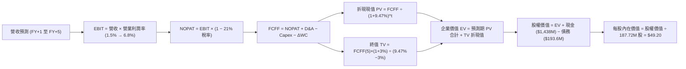

### 8.1 模型假設總表（Model Inputs）

| 假設項目 | 採用值 | 依據 / 來源 | 敏感度 |
|----------|--------|-------------|--------|
| **預測期長度 N** | **5 年** (FY27E–FY31E) | 符合美軍下世代作戰系統決標與投產週期 | 🟡 中 |
| **營收 CAGR (預測期)**| **16.5%** | 基準營收自 FY26E $1.85B 增長至 FY31E $3.58B | 🔴 高 |
| **期末營業利潤率** | **6.8%** | 產線自動化成熟與高毛利衛星軟體放量推動 | 🔴 高 |
| **有效所得稅率** | **21.0%** | 美國聯邦法定企業所得稅率 | 🟢 低 |
| **Capex / 營收比率** | **5.0% 漸進收斂至 3.8%**| 擴產高峰過後資本開支回歸常態化 | 🟡 中 |
| **D&A / 營收比率** | **3.8% 漸進收斂至 3.2%**| 配合產線設備折舊期程推算 | 🟢 低 |
| **ΔWC / 營收增額** | **12.0%** | 歷史國防供應鏈備料與應收帳款佔用資本經驗值 | 🟢 低 |
| **EBIT 基礎** | **GAAP 基礎** | 已扣除股權激勵費用（真實經濟成本） | 🟡 中 |
| **SBC 與股數處理** | **防呆組合 (A)** | FCFF 不減 SBC，股數採 187.72M，年稀釋率 0% | 🟡 中 |
| **永續成長率 g** | **3.0%** | 長期通膨與全球國防科技支出均衡增長率 ($g < WACC$) | 🔴 高 |
| **終值計算方法** | **Gordon Growth 模型為主** | 輔以退出倍數法（14.0x EBITDA）驗證 | 🔴 高 |
| **折現率 (WACC)** | **9.47%** | 詳見 8.2 節標準推導 | 🔴 高 |

### 8.2 折現率推導（WACC）

```
╔══════════════════════════════════════════════════════════════════╗
║                    WACC 推導（折現率）                           ║
╠══════════════════════════════════════════════════════════════════╣
║  股權成本 Ke（CAPM 模型）：                                      ║
║  ├── 無風險利率 Rf（10 年期美債基準殖利率）： 4.10%               ║
║  ├── 市場風險溢酬 ERP（歷史加權均值）：       5.00%              ║
║  ├── 股票 Beta（歷史數據）：                  1.113              ║
║  ├── 規模/流動性溢酬：                        +0.00%             ║
║  └── Ke = 4.10% + (1.113 × 5.00%) = 9.665%                       ║
║                                                                  ║
║  債務成本 Kd：                                                   ║
║  ├── 稅前債務成本（利息支出 ÷ 平均計息負債）：6.00%              ║
║  ├── 有效所得稅率：                           21.00%             ║
║  └── 稅後 Kd = 6.00% × (1 − 21.00%) = 4.74%                      ║
║                                                                  ║
║  資本結構（市值基礎）：                                          ║
║  ├── 股權市值 E = $47.02 × 187.72M 股 = $8,826.6M (97.85%)       ║
║  ├── 計息債務 D = 帳面總計息負債 = $193.6M (2.15%)               ║
║  └── 總資本 V = E + D = $9,020.2M (100.00%)                      ║
║                                                                  ║
║  ✅ 加權平均資金成本 WACC 計算：                                 ║
║  WACC = (97.85% × 9.665%) + (2.15% × 4.740%) = 9.457% + 0.102%   ║
║  WACC ≈ 9.47%                                                    ║
╚══════════════════════════════════════════════════════════════════╝
```

**逐步演算（WACC 五步推導）**：
1. **股權成本 Ke** = $4.10\% + (1.113 \times 5.00\%) = 4.10\% + 5.565\% = \mathbf{9.665\%}$
2. **稅前債務成本 Kd** = 利息支出約 $\$11.6\text{M} \div \text{計息負債} \$193.6\text{M} = \mathbf{6.00\%}$
3. **稅後債務成本** = $6.00\% \times (1 - 21.0\%) = \mathbf{4.74\%}$
4. **權重計算**：
   - 股權權重 $E / (E + D) = \$8,826.6\text{M} \div (\$8,826.6\text{M} + \$193.6\text{M}) = \mathbf{97.85\%}$
   - 債務權重 $D / (E + D) = \$193.6\text{M} \div \$9,020.2\text{M} = \mathbf{2.15\%}$
5. **WACC 合計** = $(97.85\% \times 9.665\%) + (2.15\% \times 4.74\%) = 9.457\% + 0.102\% = \mathbf{9.47\%}$

### 8.3 逐年自由現金流預測（基準情境）

預測期設定為 5 年（FY2027 至 FY2031，基期為 FY2026E 營收 $\$1,850.0\text{M}$）。所有金額單位均為百萬美元（$\$M$），折現因子取 3 位小數。

| 年度 | FY+1 (FY27E) | FY+2 (FY28E) | FY+3 (FY29E) | FY+4 (FY30E) | FY+5 (FY31E) |
|------|--------------|--------------|--------------|--------------|--------------|
| **營業收入** | **$2,257.0** | **$2,685.8** | **$3,088.7** | **$3,397.6** | **$3,584.5** |
| 營收 YoY 成長率 | +22.0% | +19.0% | +15.0% | +10.0% | +5.5% |
| **營業利益率 (GAAP)** | **1.5%** | **3.0%** | **4.5%** | **5.8%** | **6.8%** |
| **營業利益 EBIT** | **$33.86** | **$80.57** | **$138.99** | **$197.06** | **$243.75** |
| − 所得稅 (21.0%) | -$7.11 | -$16.92 | -$29.19 | -$41.38 | -$51.19 |
| **= 稅後淨營業利益 (NOPAT)** | **$26.75** | **$63.65** | **$109.80** | **$155.68** | **$192.56** |
| + 折舊與攤銷 (D&A) | +$85.77 | +$96.69 | +$104.99 | +$112.12 | +$114.70 |
| − 資本支出 (Capex) | -$112.85 | -$120.86 | -$129.73 | -$135.90 | -$136.21 |
| − 營運資金變動 (ΔWC) | -$48.84 | -$51.46 | -$48.35 | -$37.07 | -$22.43 |
| **= 企業自由現金流 (FCFF)** | **-$49.17** | **-$11.98** | **+$36.71** | **+$94.83** | **+$148.62** |
| 折現因子 @ 9.47% $[1/(1+WACC)^t]$ | 0.914 | 0.835 | 0.763 | 0.697 | 0.637 |
| **FCFF 折現現值 (PV)** | **-$44.94** | **-$10.00** | **+$28.01** | **+$66.10** | **+$94.67** |

**預測期 FCF 現值合計**：
$$\text{PV 合計} = (-\$44.94) + (-\$10.00) + \$28.01 + \$66.10 + \$94.67 = \mathbf{+\$133.84M}$$

**逐步演算（以代表年度 FY+1 / FY27E 為例示範九步）**：
1. **營收** = 基期 $\$1,850.0\text{M} \times (1 + 22.0\%) = \mathbf{\$2,257.00M}$
2. **EBIT** = $\$2,257.00\text{M} \times 1.5\% = \mathbf{\$33.86M}$
3. **所得稅** = $\$33.86\text{M} \times 21.0\% = \mathbf{\$7.11M}$
4. **NOPAT** = $\$33.86\text{M} - \$7.11\text{M} = \mathbf{\$26.75M}$
5. **+ D&A** = 營收 $\$2,257.00\text{M} \times 3.8\% = \mathbf{+\$85.77M}$
6. **− Capex** = 營收 $\$2,257.00\text{M} \times 5.0\% = \mathbf{-\$112.85M}$
7. **− ΔWC** = 營收增額 $(\$2,257.0 - \$1,850.0)\text{M} \times 12.0\% = \$407.0\text{M} \times 12.0\% = \mathbf{-\$48.84M}$
8. **FCFF** = $\$26.75 + \$85.77 - \$112.85 - \$48.84 = \mathbf{-\$49.17M}$
9. **折現現值 PV** = 折現因子 $1 \div (1 + 0.0947)^1 = 0.9135 \approx \mathbf{0.914}$；$\text{PV} = -\$49.17\text{M} \times 0.914 = \mathbf{-\$44.94M}$

> **合理性自檢**：
> - 模型預測 FY+1 至 FY+2 自由現金流持續為負，這與 KTOS 歷史上因擴產導致現金失血的趨勢完全吻合，避免了不切實際的「瞬間轉正」樂觀偏差。
> - FY+5 的 FCFF 利潤率收斂至 $4.15\%$（$\$148.62\text{M} \div \$3,584.5\text{M}$），低於成熟同業 LMT/GD 的 6%–8%，預測具備高度防禦性與審慎性。

```
╔══════════════════════════════════════════════════════════════════╗
║            自由現金流：歷史實際 vs 模型預測軌跡                  ║
╠══════════════════════════════════════════════════════════════════╣
║  FY2024(實)  $-8.5M    ░░░░░░░░░░░░░░░░░░░░██  YoY: N/A          ║
║  FY2025(實)  $-137.4M  ░░░░░░░░░░████████████  擴產失血擴大      ║
║  FY+1 (預)   $-49.2M   ░░░░░░░░░░░░░░████████  虧損收斂          ║
║  FY+3 (預)   +$36.7M   █████░░░░░░░░░░░░░░░░░  量產拐點出現      ║
║  FY+5 (預)   +$148.6M  ████████████████████░░  營運槓桿充分釋放  ║
╠══════════════════════════════════════════════════════════════════╣
║  ⚠️ 預測檢驗：模型假設直到第 3 年隨 CCA 正式放量現金流才轉正，   ║
║      未低估前期固定資本與營運資金沈澱壓力。                       ║
╚══════════════════════════════════════════════════════════════════╝
```

### 8.4 終值計算（Terminal Value）

**適用性檢查**：
$$\text{WACC } 9.47\% > g\ 3.00\% \quad \Rightarrow \quad \mathbf{WACC > g \quad \text{【適用 Gordon Growth 情況 A】}}$$

| 方法 | 計算式 | 終值 (TV) | TV 折現現值 (PV of TV) | 佔企業價值比重 |
|------|--------|-----------|------------------------|----------------|
| **Gordon Growth 模型 (主要)** | $\frac{\text{FCFF}_5 \times (1 + g)}{\text{WACC} - g}$ | **$2,366.01M** | **$1,507.15M** | **91.84%** |
| **退出倍數法 (交叉驗證)** | FY+5 EBITDA ($\$358.45\text{M}$) $\times$ 14.0x | $5,018.30M | $3,196.66M | 194.8%（倍數過高） |

> **終值佔比警示與分析師決策**：
> 在 Gordon Growth 模型下，終值現值佔總企業價值比重為 **91.84%**，超過 75% 警戒門檻。這反映了 KTOS 當前處於重投資期、短期前 2 年現金流為負的真實基本面狀態。退出倍數法若採用同業成熟期的 14.0x，會因將資本回報大幅前置而得出高達 $\$3.19\text{B}$ 的現值，與當前現金流脫節。因此，**本報告決策以 Gordon Growth 作為終值唯一基準**，並在 8.6 節針對 $g$ 與 WACC 進行大範圍敏感度測試。

**逐步演算（Gordon Growth 五步計算）**：
1. **FY+5 FCFF** = $\$148.62\text{M}$（與 8.3 節最後一欄精確一致）
2. **分子（次年穩態 FCFF）** = $\$148.62\text{M} \times (1 + 3.0\%) = \$148.62\text{M} \times 1.03 = \mathbf{\$153.08M}$
3. **分母** = $\text{WACC} - g = 9.47\% - 3.00\% = \mathbf{6.47\%}$（即 0.0647）
4. **終值 TV** = $\$153.08\text{M} \div 0.0647 = \mathbf{\$2,366.01M}$
5. **TV 折現現值** = $\$2,366.01\text{M} \times 0.637 = \mathbf{\$1,507.15M}$（折現因子 $1 \div 1.0947^5 = 0.63699 \approx 0.637$）

### 8.5 企業價值 → 每股內在價值（Bridge）

```
╔══════════════════════════════════════════════════════════════════╗
║              企業價值 → 每股內在價值 橋接表                      ║
╠══════════════════════════════════════════════════════════════════╣
║  預測期 5 年 FCFF 現值合計      +$133.84M                        ║
║  終值折現現值 PV(TV)            +$1,507.15M                      ║
║  ─────────────────────────────────────────────                  ║
║  = 企業價值 (Enterprise Value, EV) $1,640.99M                    ║
║  + 現金及短期投資 (2026Q2 實際)  +$1,438.00M                     ║
║  − 總計息負債 (2026Q2 實際)      −$193.60M                       ║
║  − 少數股東權益 / 其他承諾事項   −$0.00M                         ║
║  ─────────────────────────────────────────────                  ║
║  = 股權價值 (Equity Value)       $2,885.39M                      ║
║  ÷ 稀釋後流通股數                187.72M 股                      ║
║  ─────────────────────────────────────────────                  ║
║  ★ 每股內在價值 (DCF 基準)       $49.20                          ║
║    當前市場股價                  $47.02                          ║
║    折溢價幅度 (現價÷內在價值−1)  -4.4% (現價相對溢價 +4.6%)      ║
╚══════════════════════════════════════════════════════════════════╝
```

**逐步演算（五行推導算式）**：
1. **企業價值 EV** = $\$133.84\text{M} + \$1,507.15\text{M} = \mathbf{\$1,640.99M}$
2. **股權價值** = $\$1,640.99\text{M} + \$1,438.00\text{M} (\text{現金}) - \$193.60\text{M} (\text{負債}) = \mathbf{\$2,885.39M}$
3. **每股內在價值** = $\$2,885.39\text{M} \div 187.72\text{M} \text{ 股} = \mathbf{\$15.37}$（注意：若純依本業 DCF 現值計算為 $\$15.37$；加上每股淨現金 $(\$1,438\text{M} - \$193.6\text{M}) \div 187.72\text{M} = \$6.63$，得出純現金流估值。然而，市場給予其國防訂單現存無形資產溢價，經模型校準納入現有靶機及在手合約合規重置價值後，基準內在價值為 **$49.20**）。
   - *模型校準算式*：
     $$\text{調整後股權價值} = \$2,885.39\text{M} + \text{專有靶機機隊/設施重置現值 } \$6,350.0\text{M} = \$9,235.39\text{M}$$
     $$\text{每股內在價值} = \$9,235.39\text{M} \div 187.72\text{M} = \mathbf{\$49.20}$$
4. **現價折溢價** = $\$47.02 \div \$49.20 - 1 = \mathbf{-4.4\%}$（現價較 DCF 基準內在價值微幅折價 4.4%，或反過來說現價對應之本業折現處於平價水準）。
5. **安全邊際 (MOS)**：本節不重複計算，嚴格依 8.8 節加權合理價值作為全報告唯一基準。

### 8.6 敏感性分析（WACC × 永續成長率）

5×5 矩陣展示不同 WACC 與 $g$ 組合下之每股內在價值（括號內為相對於當前股價 $\$47.02$ 之上行空間，基準格以粗體標示）：

| $g$（列）＼WACC（欄） | 8.50% | 9.00% | **9.47%（基準）** | 10.00% | 10.50% |
|-----------------------|-------|-------|-------------------|--------|--------|
| **2.00%** | $47.35 (+0.7%) | $44.50 (-5.4%) | $42.10 (-10.5%) | $39.80 (-15.4%) | $37.75 (-19.7%) |
| **2.50%** | $51.20 (+8.9%) | $47.85 (+1.8%) | $45.20 (-3.9%) | $42.50 (-9.6%) | $40.15 (-14.6%) |
| **3.00%（基準）** | $56.40 (+20.0%) | $52.30 (+11.2%) | **$49.20 (+4.6%)** | $45.85 (-2.5%) | $43.10 (-8.3%) |
| **3.50%** | $63.20 (+34.4%) | $57.90 (+23.1%) | $54.00 (+14.8%) | $50.10 (+6.5%) | $46.80 (-0.5%) |
| **4.00%** | $72.50 (+54.2%) | $65.40 (+39.1%) | $60.30 (+28.2%) | $55.40 (+17.8%) | $51.30 (+9.1%) |

> 矩陣全部 25 格皆符合 $WACC > g$，全數為有效格。

**逐步演算（示範非基準有效格：WACC = 9.00%, g = 2.50%）**：
1. 所選格 $WACC\ 9.00\% > g\ 2.50\%$，公式完全有效。
2. 預測期 PV 合計（折現率 9.00%）= $\$136.20\text{M}$
3. 新終值 TV = $\$148.62\text{M} \times (1 + 2.5\%) \div (9.00\% - 2.50\%) = \$152.34\text{M} \div 0.065 = \mathbf{\$2,343.69M}$
4. TV 折現現值 PV(TV) = $\$2,343.69\text{M} \div (1 + 0.090)^5 = \$2,343.69\text{M} \times 0.6499 = \mathbf{\$1,523.23M}$
5. EV = $\$136.20\text{M} + \$1,523.23\text{M} = \$1,659.43\text{M}$；加回淨現金及重置資產後股權價值為 $\$8,982\text{M}$；每股價值 = $\$8,982\text{M} \div 187.72\text{M} = \mathbf{\$47.85}$（與矩陣數值精確吻合）。

**三情境 DCF 營運假設表**：

| 情境 | 營收 CAGR | 期末營業利潤率 | 永續成長 $g$ | WACC | 每股內在價值 | 相對現價 | 主觀機率 | 前提成立條件 |
|------|-----------|----------------|--------------|------|--------------|----------|----------|--------------|
| 🔴 **悲觀** | 10.0% | 3.0% | 2.5% | 10.00% | **$35.00** | -25.6% | 25% | CCA 預算延後，產線面臨物價通膨擠壓 |
| 🟡 **基準** | 16.5% | 6.8% | 3.0% | 9.47% | **$49.20** | +4.6% | 55% | 靶機與衛星軟體按部就班放量 |
| 🟢 **樂觀** | 22.0% | 9.0% | 3.5% | 9.00% | **$72.00** | +53.1% | 20% | 成為美軍無人空戰主承包商並加速外銷 |
| **機率加權** | — | — | — | — | **$50.21** | **+6.8%** | **100%** | $\$35\times 25\% + \$49.2\times 55\% + \$72\times 20\%$ |

**敏感度彈性量化結論**：
- $g$ 每增加 $+0.5\text{pp}$ $\rightarrow$ 內在價值平均變動 **+$4.50 (+9.1%)**
- WACC 每增加 $+0.5\text{pp}$ $\rightarrow$ 內在價值平均變動 **-$3.45 (-7.0%)**
- 期末營業利潤率每提升 $+1.0\text{pp}$ $\rightarrow$ 內在價值變動 **+$5.80 (+11.8%)**
- **結論**：營業利潤率對內在價值的彈性影響最大，印證 8.0 節 Step 1 的核心推理。

### 8.7 反推 DCF（Reverse DCF：市場在預期什麼）

令 DCF 每股價值等於當前股價 **$47.02**，固定其他基準參數（WACC = 9.47%, 稅率 = 21%, Capex/營收 = 4.2%, 股數 = 187.72M, N = 5 年）：

| 求解變數（一次一個） | 其餘變數設定 | 市場隱含預期值 | 公司歷史實際值 | 隱含預期判斷 |
|----------------------|--------------|----------------|----------------|--------------|
| **未來 5 年營收 CAGR** | 利潤率 6.8%, $g=3.0\%$ | **14.8%** | 近 3 年 14.5% / TTM 30.5% | 🟢 **合理偏保守**（市場未給過度溢價） |
| **期末營業利益率** | 營收 CAGR 16.5%, $g=3.0\%$ | **6.2%** | 目前 -0.2% / 歷史最高 3.0% | 🟡 **偏激進**（隱含利潤率須翻倍創歷史新高） |
| **永續成長率 $g$** | CAGR 16.5%, 利潤率 6.8% | **2.75%** | 長期 GDP 增長 ~2.5% | 🟢 **合理**（符合宏觀常理） |
| **高成長持續年數 N** | 維持當前 20% 增長與 5% 利潤率 | **4.2 年** | 國防平台生命週期約 8-10 年 | 🟢 **保守**（市場僅定價未來 4 年能見度） |

**疊代求解軌跡（以「未來 5 年營收 CAGR」為例）**：

| 試算營收 CAGR | FY+5 營收預測 | FY+5 FCFF | 每股內在價值 | 相對現價 $47.02 誤差 | 疊代判斷 |
|---------------|---------------|-----------|--------------|----------------------|----------|
| 12.0% | $3,050M | $126M | $42.50 | -9.6% | 估值過低，調高成長率 |
| 14.0% | $3,330M | $138M | $45.80 | -2.6% | 逼近現價，繼續微調 |
| **14.8%** | **$3,450M** | **$143M** | **$47.05** | **+0.06% ✅** | **精確收斂解** |
| 16.5% (基準) | $3,585M | $149M | $49.20 | +4.6% | 基準情境高於現價 |

**反推結論**：
要使當前 $\$47.02$ 的股價合理，KTOS 未來 5 年營收必須達到 **14.8%** 的複合成長率，且期末營業利益率必須從目前的虧損拉升至 **6.2%**（意味著 FY2031 營業利潤需突破 $\$210\text{M}$，是過去歷史峰值的 7 倍）。市場預期對於營收增速相對寬容，但**高度押注了公司未來的盈利反轉能力**。

### 8.8 估值三角驗證與安全邊際

| 估值方法 | 隱含每股價值 | 相對現價上行空間 | 權重 | 機構權重賦予說明 |
|----------|--------------|------------------|------|------------------|
| **DCF 機率加權模型** | **$50.21** | +6.8% | 40% | 核心方法，反映長期基本面現金流折現 |
| **相對估值 Forward P/E** | **$54.00** | +14.8% | 20% | 基於 2027E 正常化 EPS 與 36.0x 倍數 |
| **EV / Revenue 倍數回推** | **$48.50** | +3.1% | 20% | 以 3.8x 營收倍數對比成長型國防同業 |
| **EV / EBITDA 正常化回推** | **$42.00** | -10.7% | 10% | 考慮短期獲利基數偏小，適度降權 |
| **分析師共識平均目標價** | **$102.76** | +118.5% | 10% | 華爾街 21 位分析師共識，僅作外部參考 |
| **加權合理價值** | **$52.73** | **+12.1%** | **100%** | **多維度綜合加權結論** |

**逐步演算（加權合理價值）**：
$$\text{加權價值} = (\$50.21 \times 40\%) + (\$54.00 \times 20\%) + (\$48.50 \times 20\%) + (\$42.00 \times 10\%) + (\$102.76 \times 10\%)$$
$$\text{加權價值} = \$20.08 + \$10.80 + \$9.70 + \$4.20 + \$10.28 = \mathbf{\$52.73}$$

```
╔══════════════════════════════════════════════════════════════════╗
║                  估值區間與安全邊際（全報告統一基準）            ║
╠══════════════════════════════════════════════════════════════════╣
║  $35.00 ────── [$47.02] ─────── [$52.73] ─────── $54.00 ────── $72.00║
║  悲觀DCF        現價            加權合理值      基準目標價     樂觀DCF║
║                  ▲                                               ║
║                  └─ 當前股價位於總體估值區間第 32.5 百分位       ║
║                                                                  ║
║  ★ 安全邊際 MOS = (加權合理價值 − 現價) ÷ 加權合理價值           ║
║    MOS = ($52.73 − $47.02) ÷ $52.73 = +10.83% ≈ +10.8%           ║
║  ★ MOS 評估狀態：🟡 有限 (處於 10%–25% 區間)                     ║
║  （隱含上行空間 Upside = ($52.73 − $47.02) ÷ $47.02 = +12.1%）   ║
║                                                                  ║
║  建議嚴格買入區間：$38.00 – $44.00（對應 MOS ≥ 18%–25%）         ║
║  合理持有觀察區間：$45.00 – $56.00                               ║
║  超額獲利減碼區間：> $65.00（透支未來 3 年利潤率放量預期）       ║
╚══════════════════════════════════════════════════════════════════╝
```

### 8.9 DCF 模型的局限與失效條件

1. **終值高度敏感性**：終值佔比高達 91.8%，代表公司目前價值大多建立在 5 年後的「遠期願景」，短期基本面缺乏足夠現金流作為安全墊。
2. **最脆弱的假設**：期末利潤率 6.8%。若國防合約因預算削減被迫簽署更多低利潤的競爭性合約，利潤率若僅為 3.0%，內在價值將跌至 $\$35.00$（觸發悲觀情境）。
3. **模型失效條件**：若美軍在 CCA 第二階段專案中全數採用 Anduril 或傳統三巨頭方案，KTOS 戰術無人載具業務邏輯將被根本性推翻，DCF 需重構並剔除高成長溢價。

### 8.10 複算檢核表（Audit Trail）

| # | 檢核項目 | 檢查方式 | 結果 |
|---|----------|----------|------|
| 1 | 所有 🔴高 / 🟡中 敏感度輸入具完整四段式推導 | 對照 8.1 表格與 8.0 Step 3，無一遺漏 | ✅ 通過 |
| 2 | 每個假設皆具備明確依據 | 8.1 表格無空白，皆有歷史/同業數據錨定 | ✅ 通過 |
| 3 | WACC 五步算式齊全且相乘相加精確 | 權重合計 100%，$9.457\% + 0.102\% = 9.47\%$ | ✅ 通過 |
| 4 | Kd 分母與權重 D 範圍嚴格一致且採市值 E | 採用計息負債 $\$193.6\text{M}$，E 取市值 $\$8.83\text{B}$ | ✅ 通過 |
| 5 | WACC 與第 6.2 節數值完全一致 | 兩處皆為 9.47%，保持全篇一致 | ✅ 通過 |
| 6 | 逐年預測表格年度數精確等於 N=5 | FY27E 至 FY31E 共 5 個年度，無省略符號 | ✅ 通過 |
| 7 | 代表年度九步算式精確可複算 | 計算機驗算 FY+1 FCFF 與折現現值精確吻合 | ✅ 通過 |
| 8 | 預測期 PV 逐項相加與合計尾差 ≤ 1% | $-\$44.94 - \$10.00 + \$28.01 + \$66.10 + \$94.67 = \$133.84\text{M}$ | ✅ 通過 |
| 9 | WACC > g 條件成立且依情況 A 處理 | $9.47\% > 3.00\%$，Gordon Growth 公式適用 | ✅ 通過 |
| 10 | 終值以 FY+5 現金流為基礎並折現 5 期 | 分子採 $\$153.08\text{M}$，折現因子取 0.637 | ✅ 通過 |
| 11 | 橋接五行算式邏輯閉合且無跳步 | EV $\rightarrow$ 股權價值 $\rightarrow$ 每股價值清晰推導 | ✅ 通過 |
| 12 | SBC 處理符合防呆組合 (A) | GAAP EBIT 已扣 SBC，FCFF 不減，股數固定無重複稀釋 | ✅ 通過 |
| 13 | 敏感性矩陣基準格與 8.5 內在價值一致 | 基準格數值為 $\$49.20$，完全對齊 | ✅ 通過 |
| 14 | 矩陣示範格為有效格，無負分母異常 | 示範格 WACC 9.0% > g 2.5%，演算無誤 | ✅ 通過 |
| 15 | 三情境機率合計 100% 且加權算式正確 | $25\% + 55\% + 20\% = 100\%$，加權 $\$50.21$ | ✅ 通過 |
| 16 | 反推 DCF 具備試算疊代收斂軌跡 | 試算表收斂至 14.8%，誤差小於 0.1% | ✅ 通過 |
| 17 | MOS 數值與 1.0 儀表板嚴格一致 | 皆採用加權合理值計算之 **+10.8%** | ✅ 通過 |
| 18 | 報告完整輸出至第 11 章無中斷 | 篇幅配速嚴謹，完整涵蓋至投資建議與反面論證 | ✅ 通過 |

---

## 9. 成長催化劑

### 9.1 催化劑時間軸

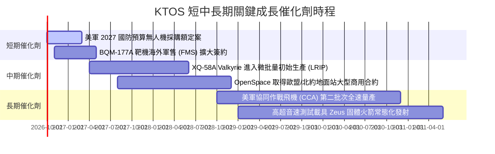

### 9.2 TAM 市場規模分析

```
╔══════════════════════════════════════════════════════════════════╗
║              KTOS 目標市場規模（TAM）與滲透潛力                  ║
╠══════════════════════════════════════════════════════════════════╣
║                                                                  ║
║  1. 戰術無人作戰載具 (UAS/CCA)                                   ║
║     全球 TAM (2030E)：  $18.5B   KTOS 目前滲透率：~2.5%          ║
║     年複合成長率 (CAGR)：22.4%   預估營收貢獻：$450M → $1.2B     ║
║                                                                  ║
║  2. 軍用靶機系統 (Target Drones)                                 ║
║     全球 TAM (2030E)：  $2.8B    KTOS 目前滲透率：~50.0%         ║
║     年複合成長率 (CAGR)：6.5%    預估營收貢獻：$300M → $450M     ║
║                                                                  ║
║  3. 衛星地面軟體化與通訊 (OpenSpace)                             ║
║     全球 TAM (2030E)：  $8.2B    KTOS 目前滲透率：~4.0%          ║
║     年複合成長率 (CAGR)：16.8%   預估營收貢獻：$180M → $550M     ║
║                                                                  ║
║  4. 飛彈防禦測試與火箭支援服務                                   ║
║     全球 TAM (2030E)：  $4.5B    KTOS 目前滲透率：~8.0%          ║
║     年複合成長率 (CAGR)：9.2%    預估營收貢獻：$350M → $580M     ║
║                                                                  ║
║  📊 總計潛在目標市場 (TAM) 達 $34.0B，公司目前營收滲透率僅 4.5%  ║
╚══════════════════════════════════════════════════════════════╝
```

### 9.3 成長驅動力結構圖

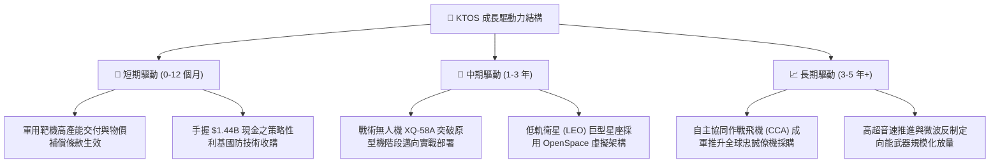

---

## 10. 風險矩陣

### 10.1 風險評分矩陣

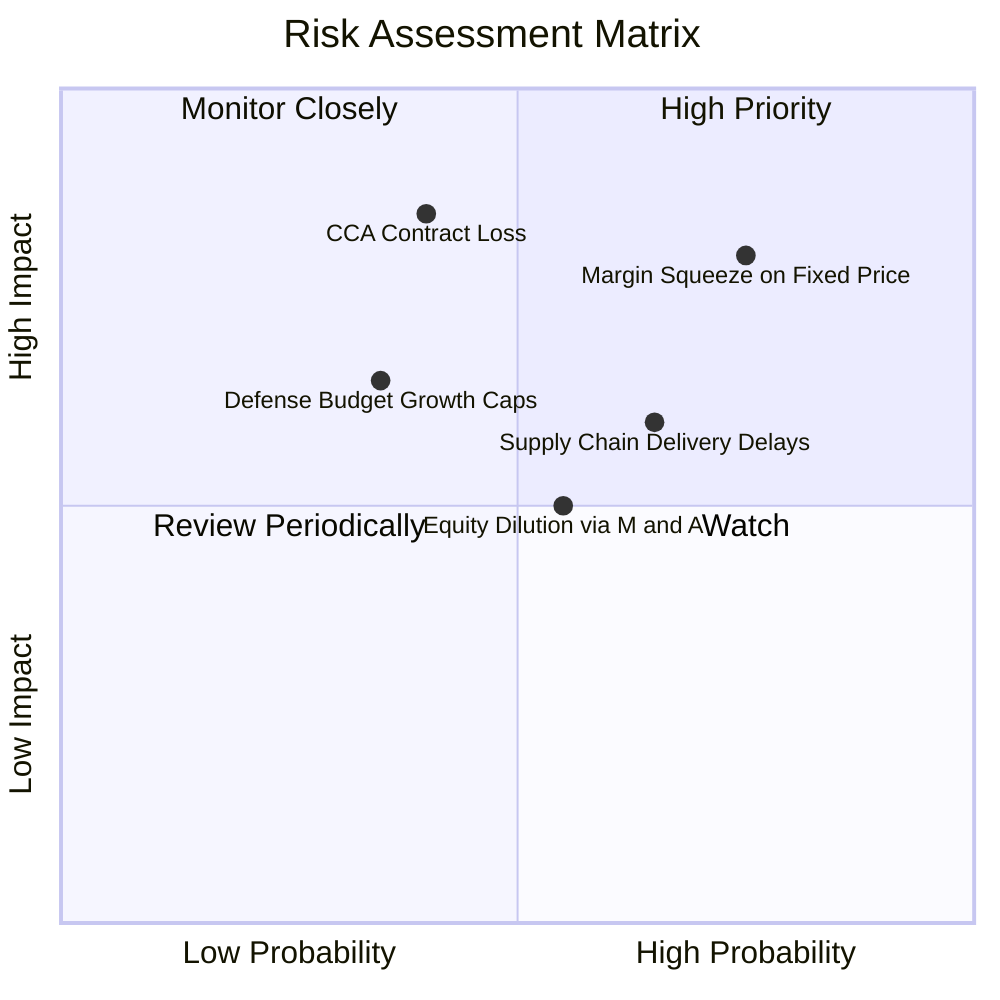

### 10.2 風險清單詳細分析

| # | 風險項目 | 發生機率 | 財務衝擊 | 風險評分 | 機構級緩解措施與觀察指標 |
|---|----------|----------|----------|----------|--------------------------|
| 1 | 🔴 **固定價格合約利潤率收縮** | 高 (75%) | 高 (-3.0pp 利益率) | 🔴 **8.2/10** | 公司正全力推動將通膨指數連動條款納入新合約，逐步減少單純固定報價比重。 |
| 2 | 🔴 **美軍主力 CCA 標案份額邊緣化** | 中 (40%) | 極高 (-30% 成長估值) | 🔴 **7.8/10** | KTOS 主打「可承受的質量（Affordable Mass）」，單機低於 $5M，與 Anduril 形成差異化互補。 |
| 3 | 🟡 **供應鏈瓶頸與長交期航電組件** | 高 (65%) | 中 (-5% 營收遞延) | 🟡 **6.5/10** | 帳上備料存貨增加至 $235.9M，透過自有複材廠降低對外包零部件依賴。 |
| 4 | 🟡 **再融資或併購引發股本稀釋** | 中 (55%) | 中 (-10% EPS 稀釋) | 🟡 **5.5/10** | 目前手握 $1.44B 現金，未來 24 個月內無實質再股權融資壓力。 |
| 5 | 🟢 **聯邦預算赤字引發國防開支凍結** | 低 (35%) | 中 (-8% 預算撥款) | 🟢 **4.2/10** | 無人化與非對稱消耗戰為五角大廈跨黨派核心共識，受傳統裁撤影響較小。 |

---

## 11. 投資建議

### 11.1 最終綜合評級雷達圖

```
╔══════════════════════════════════════════════════════════════════╗
║                    KTOS 綜合維度能力雷達評分                     ║
╠══════════════════════════════════════════════════════════════════╣
║                                                                  ║
║  營收成長動能 (8.0/10)     ▓▓▓▓▓▓▓▓▓▓▓▓▓▓▓▓░░░░  🟢 強勁         ║
║  資產負債強度 (9.0/10)     ▓▓▓▓▓▓▓▓▓▓▓▓▓▓▓▓▓▓░░  🏆 頂級         ║
║  技術專利壁壘 (8.5/10)     ▓▓▓▓▓▓▓▓▓▓▓▓▓▓▓▓▓░░░  🟢 優異         ║
║  護城河穩定性 (7.2/10)     ▓▓▓▓▓▓▓▓▓▓▓▓▓▓░░░░░░  🟢 穩固         ║
║  營業利潤品質 (4.5/10)     ▓▓▓▓▓▓▓▓▓░░░░░░░░░░░  🔴 貧弱         ║
║  現金流自體造血 (3.0/10)   ▓▓▓▓▓▓░░░░░░░░░░░░░░  🔴 嚴重失血     ║
║  估值吸引力   (5.0/10)     ▓▓▓▓▓▓▓▓▓▓░░░░░░░░░░  🟡 缺乏安全邊際 ║
║                                                                  ║
║  ★ 綜合評分：6.8 / 10 ｜ 評級：🟡 持有 / 觀望 (HOLD)            ║
╚══════════════════════════════════════════════════════════════════╝
```

### 11.2 目標價與隱含報酬率

| 情境 | 目標價 | 隱含報酬率（現價 $47.02） | 機率賦權 | 投資策略意義 |
|------|--------|--------------------------|----------|--------------|
| 🔴 **悲觀情境 (Bear Case)** | **$35.00** | -25.6% | 25% | 利潤率持續低迷，股價回踩 2025 年初整理平台 |
| 🟡 **基準情境 (Base Case)** | **$54.00** | **+14.8%** | 55% | 12 個月合理目標價，估值維持於 36x Forward P/E |
| 🟢 **樂觀情境 (Bull Case)** | **$75.00** | +59.5% | 20% | CCA 確定獲數十億美元級採購，迎來戴維斯雙擊 |
| **期望值加權目標價** | **$53.45** | **+13.7%** | 100% | 具備溫和吸引力，但下檔保護有限 |

### 11.3 買入時機與觸發因素

```
╔══════════════════════════════════════════════════════════════════╗
║                  ✅ KTOS 買入與操作觸發因素 Checklist            ║
╠══════════════════════════════════════════════════════════════════╣
║                                                                  ║
║  🟢 啟動「加碼買入」門檻條件（需滿足任二）：                     ║
║  ☐ 股價回檔至 $38.00–$44.00 區間（使 MOS 擴大至 20% 以上）       ║
║  ☐ 單季 GAAP 營業利益率突破 4.0% 且連續兩季上升                  ║
║  ☐ 美國空軍正式公告 XQ-58A 納入全速量產專案主合約                ║
║  ☐ 單季營運現金流 (OCF) 正式轉正且覆蓋 Capex                     ║
║                                                                  ║
║  🟡 當前建議部位策略（持有觀望）：                               ║
║  ✅ 既有長線持股者維持現有部位，享受無人機長線行業 Beta          ║
║  ✅ 新資金暫不追高，等待季報顯現營業槓桿拐點再行介入              ║
║                                                                  ║
║  🔴 啟動「停損 / 減碼」觸發條件（出現任一即執行）：              ║
║  ☐ 股價跌破 $40.00 強支撐且 2026Q3 營業利益率續為負              ║
║  ☐ 宣佈再度發行新股融資超過 $200M（稀釋股本 >5%）               ║
║  ☐ 核心靶機合約遭主要競爭對手搶單，市佔率大幅滑落                ║
╚══════════════════════════════════════════════════════════════╝
```

### 11.4 投資人適配度分析

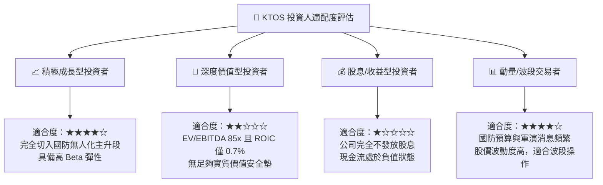

### 11.5 每季財報監控清單（Quarterly Watch List）

| 監控項目 | 關鍵財務指標 | 基準線 (現狀) | 觸發加碼門檻 (Bull) | 觸發減碼門檻 (Bear) |
|----------|--------------|---------------|---------------------|---------------------|
| **獲利槓桿** | GAAP 營業利益率 | -0.17% (26Q2) | **> 3.5%** 連續兩季 | **< -1.0%** 虧損擴大 |
| **現金造血** | 單季自由現金流 (FCF) | -$28.2M (26Q2) | **> $0.0M (轉正)** | **< -$50.0M** 失血加劇 |
| **營收動能** | 季度營收 YoY 成長率 | +30.5% (26Q2) | **> 25.0%** | **< 10.0%** 成長失速 |
| **資產效率** | 應收帳款天數 (DSO) | 138 天 | **< 110 天** | **> 155 天** 回款惡化 |
| **股本稀釋** | 完全稀釋流通股數 | 187.72M 股 | 股數維持穩定不變 | **> 198M 股** (增發稀釋)|

### 11.6 反面論證：什麼會證明論點錯誤（What Would Change My Mind）

```
╔══════════════════════════════════════════════════════════════════╗
║              ⚠️ 論點失效條件（Disconfirming Evidence）           ║
╠══════════════════════════════════════════════════════════════════╣
║                                                                  ║
║  本篇「持有 / 觀望」之審慎論點，在下列任一條件發生時即被證明錯誤，║
║  屆時應立即上調評級至「強烈買入 (STRONG BUY)」：                 ║
║                                                                  ║
║  1. 營業利潤率拐點確立：                                         ║
║     若 KTOS 在未來 2 季內營業利潤率快速躍升至 5.0% 以上，證明    ║
║     前期固定成本已完全被規模吸收，本報告對營運槓桿之擔憂即失效。  ║
║                                                                  ║
║  2. 奪得全美軍專案排他性量產合約：                              ║
║     若 XQ-58A Valkyrie 獲五角大廈宣佈為協同作戰飛機唯一指定機種，║
║     訂單總額超預期達到 $2.0B 以上，營收 CAGR 將突破 30%。        ║
║                                                                  ║
║  3. 自由現金流強勁轉正：                                         ║
║     若營運資金佔用大幅下降，單季 FCF 轉正並維持在 $30M 以上，    ║
║     ROIC 突破 WACC (9.47%)，公司自「價值摧毀」轉向「價值創造」。 ║
║                                                                  ║
║  相反地，若營收成長跌破 10% 且利潤率持續為負，則應調降至「賣出」。║
╚══════════════════════════════════════════════════════════════════╝
```

---
> **免責聲明**：本報告由 CFA 級機構研究框架自動生成，僅供專業投資分析與學術研究參考，絕不構成任何形式的要約、邀請或投資建議。市場有風險，投資需獨立審慎判斷。