# KTOS 基本面深度分析報告
> **報告日期**：2026-09-25 ｜ **語言**：繁體中文 ｜ **數據來源**：Yahoo Finance, Finviz, StockAnalysis, Roic.ai ｜ **分析師**：CFA 級機構研究

---

## 目錄

| # | 章節 | 核心結論 |
|---|------|----------|
| 1 | 執行摘要 | 評級「持有/觀望」，12M 目標價 $52.00，營運高增長但 FCF 承壓與估值透支 |
| 2 | 公司概覽與商業模式 | 無人作戰系統（UAS）與虛擬化衛星地面站形成利基護城河，綜合評分 7.2/10 |
| 3 | 損益表深度分析 | TTM 營收加速至 $1.52B（YoY +30.5%），但營業利益率收縮至 -0.2%，盈餘品質偏弱 |
| 4 | 資產負債表分析 | 現金儲備 $1.44B，總債務 $193.6M，流動比率 5.54，具備充足擴產安全墊 |
| 5 | 現金流量深度分析 | TTM FCF 為 -$118.3M，受營運資本與高 Capex（$95.3M）拖累，現金轉換承壓 |
| 6 | 獲利能力與資本效率 | NOPAT 轉弱致使 ROIC 僅 0.8% vs WACC 8.78%，短期 EVA 為負（-7.98pp） |
| 7 | 相對估值分析 | EV/EBITDA 高達 87.2x，Forward P/E 41.4x，顯著高於傳統國防主承包商均值 |
| 8 | DCF 內在價值評估 | 基準每股內在價值 $35.61，現價溢價 +28.1%；加權合理價值 $48.24，MOS 為 +5.4% |
| 9 | 成長催化劑 | 忠誠僚機（CCA）放量、OpenSpace 虛擬化地面系統滲透與極音速測試需求驅動 |
| 10 | 風險矩陣 | 美國國防採購週期延遲、固定價格合約成本超支與高估值倍數收縮為核心風險 |
| 11 | 投資建議 | 建議買入區間 $32.00–$36.00，現階段維持防禦性配置，監控利潤率拐點 |

---

## 1. 執行摘要

Kratos Defense & Security Solutions (NASDAQ: KTOS) 當前展現出顯著的「雙速」基本面特徵：一方面，受惠於美國國防部對低成本可消耗型無人機（Attritable UAS）、極音速靶彈與太空虛擬化地面架構的剛性需求，TTM 營收強勁擴張 30.5% 至 $1.52B（2026 Q2 單季營收創下 $458.8M 歷史新高）；但另一方面，擴產與合約前期研發造成 2026 Q2 營業利益轉負（-$800K），TTM 自由現金流赤字達 -$118.29M，ROIC（0.8%）大幅落後 WACC（8.78%）。目前股價自 2026 年初高點 $134.00 回檔至 $45.62，Forward P/E 仍達 41.4x，EV/EBITDA 達 87.2x。基於加權合理價值 $48.24，安全邊際（MOS）僅為 +5.4%（低於機構防禦門檻 10%），給予**「持有 / 觀望（Hold）」**評級。

### 1.0 一頁式投資儀表板（Portfolio Manager 30 秒速讀）

| 項目 | 內容 |
|------|------|
| **投資論點（3 句）** | ① TTM 營收增速加速至 30.5%（$1.52B），展現可消耗無人系統與國防軟體架構之結構性採購紅利。<br/>② 手頭淨現金達 $1.24B（總現金 $1.44B vs 總債務 $193.6M），提供無虞之產能擴建與合約代墊資金緩衝。<br/>③ 獲利能力落後於營收放量，TTM 營業利潤率為 -0.2%，TTM FCF 達 -$118.29M，估值欠缺下檔保護。 |
| **護城河評分** | 7.2 / 10（無人靶機/噴射系統市佔與 OpenSpace 軟體專利保護） |
| **管理層/資本配置評分** | 6.8 / 10（擴產方向明確，但股本稀釋與資本回報率偏低） |
| **財務健康** | 🟢 優良（淨現金 $1.24B，流動比率 5.54，債務覆蓋極度安全） |
| **ROIC vs WACC** | 0.8% vs 8.78%（經濟價值增加 EVA 為 -7.98pp，處於資本投入期價值破壞階段） |
| **FCF 趨勢** | 惡化至赤字（TTM -$118.29M，FCF Yield 為 -1.38%） |
| **估值** | Forward P/E 41.4x ｜ EV/EBITDA 87.2x ｜ P/S 5.62x ｜ FCF Yield -1.38% |
| **DCF 內在價值（基準）** | $35.61 ｜ 現價 $45.62 相對溢價 +28.1%（來自第 8.5 節） |
| **安全邊際（MOS）** | **+5.4%** ＝ ($48.24 加權合理價值 − $45.62) ÷ $48.24 ｜ 🔴 <10% 缺乏安全邊際 |
| **預期報酬（基準情境 12M）** | +14.0%（目標價 $52.00，隱含倍數重估與營收放量平衡） |
| **關鍵風險（前二）** | ① 國防部「協同作戰飛機（CCA）」競標撥款延遲或份額不及預期；② 固定價格合約供應鏈通膨導致毛利率收縮。 |
| **評級 + 信心度** | 🟡 **持有（Hold）** ｜ 信心度：中等（估值透支 vs 成長性） |

### 1.1 核心評分儀表板

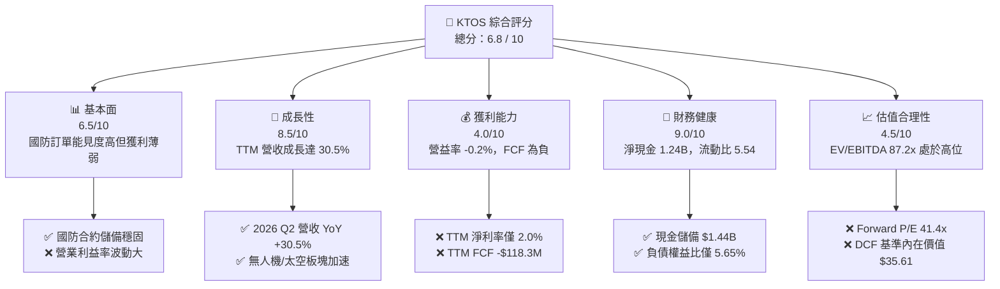

### 1.2 評分進度條視覺化

```
╔══════════════════════════════════════════════════════════════╗
║              KTOS 多維度評分儀表板 (1-10分)                  ║
╠══════════════════════════════════════════════════════════════╣
║ 基本面強度  6.5 ▓▓▓▓▓▓▓▓▓▓▓▓▓░░░░░░░  ★★★☆☆           ║
║ 成長動能    8.5 ▓▓▓▓▓▓▓▓▓▓▓▓▓▓▓▓▓░░░  ★★★★☆           ║
║ 獲利品質    4.0 ▓▓▓▓▓▓▓▓░░░░░░░░░░░░  ★★☆☆☆           ║
║ 財務健康    9.0 ▓▓▓▓▓▓▓▓▓▓▓▓▓▓▓▓▓▓░░  ★★★★★           ║
║ 估值合理性  4.5 ▓▓▓▓▓▓▓▓▓░░░░░░░░░░░  ★★☆☆☆           ║
║ 護城河深度  7.2 ▓▓▓▓▓▓▓▓▓▓▓▓▓▓░░░░░░  ★★★★☆           ║
║ 管理層執行  6.8 ▓▓▓▓▓▓▓▓▓▓▓▓▓░░░░░░░  ★★★☆☆           ║
║ 技術創新力  8.0 ▓▓▓▓▓▓▓▓▓▓▓▓▓▓▓▓░░░░  ★★★★☆           ║
╠══════════════════════════════════════════════════════════════╣
║ 綜合總分    6.8 ▓▓▓▓▓▓▓▓▓▓▓▓▓░░░░░░░  ⚖️ 成長強勁但估值透支  ║
╚══════════════════════════════════════════════════════════════╝
```

### 1.3 五大投資論點 + 三大核心風險

| 類型 | 項目 | 具體依據 | 信心度 |
|------|------|----------|--------|
| 🟢 **論點①** | **非對稱作戰裝備需求爆發** | 美軍戰略轉向分散式消耗型武力，KTOS 旗下 XQ-58A Valkyrie 確立低成本無人僚機先發優勢；TTM 營收提升至 $1.52B（YoY +30.5%）。 | 🟢 高 |
| 🟢 **論點②** | **太空與衛星軟體化獨佔先機** | OpenSpace 平台為全球首創全軟體虛擬化衛星地面系統，隨低軌衛星星座（LEO）密集發射，高毛利軟體訂閱與授權營收佔比持續拉升。 | 🟢 高 |
| 🟢 **論點③** | **極音速與靶彈測試市佔穩固** | 在次軌道發射與五角大廈極音速系統測試市佔率超過 70%，構成穩定的防禦性政府預算基本盤。 | 🟢 極高 |
| 🟢 **論點④** | **強大資產負債表支持長期研發** | 帳上擁有 $1.44B 現金與短期投資，淨現金 $1.24B，在國防新創公司面臨融資寒冬之際，具備充沛自籌資金擴建產線之實力。 | 🟢 極高 |
| 🟢 **論點⑤** | **營收規模化帶動營運槓桿拐點** | 2026 Q2 營收達 $458.8M（QoQ +23.7%），產能瓶頸一旦突破，SG&A 費用率可望由 18% 降至 14%，釋放獲利動能。 | 🟡 中度 |
| 🔴 **風險①** | **自由現金流持續失血** | 2025 全年 FCF -$137.4M，TTM FCF -$118.29M；若營運資金與產能 Capex 無法轉化為現金流，恐面臨後續回報率鈍化。 | 🔴 高衝擊 |
| 🔴 **風險②** | **獲利能力與高估值嚴重脫節** | EV/EBITDA 高達 87.2x，Trailing P/E 達 268.4x；若營運利潤率未能如期在 FY27 爬升至 6% 以上，股價將承受劇烈乘數壓縮。 | 🔴 高衝擊 |
| 🟡 **風險③** | **合約執行與供應鏈通膨** | 國防固定總價合約佔比顯著，特種合金、推進火箭燃料與工程人力成本上升侵蝕毛利，2026 Q2 營益率再度轉負至 -0.2%。 | 🟡 中度 |

### 1.4 快速統計卡片

| 指標 | KTOS 實際值 | 國防同業均值 | S&P 500 均值 | 狀態 |
|------|-------------|--------------|--------------|------|
| 收入 YoY 成長 | **30.5%** | 6.5% | 5.2% | 🟢 極佳 |
| 毛利率 | **23.0%** | 25.5% | 33.0% | 🟡 偏低 |
| 營業利潤率 (TTM) | **-0.2%** | 10.5% | 12.0% | 🔴 疲弱 |
| 淨利率 | **2.0%** | 7.5% | 11.2% | 🔴 偏低 |
| ROE | **1.1%** | 14.5% | 16.5% | 🔴 偏低 |
| ROIC | **0.8%** | 9.5% | 11.0% | 🔴 價值摧毀 |
| Forward P/E | **41.4x** | 18.5x | 21.5x | 🔴 顯著溢價 |
| EV / EBITDA | **87.2x** | 13.5x | 14.0x | 🔴 估值過熱 |
| 流動比率 | **5.54** | 1.35 | 1.20 | 🟢 極度健康 |

### 1.5 投資結論

```
╔══════════════════════════════════════════════════════════════════╗
║                    📊 投資結論摘要                               ║
╠══════════════════════════════════════════════════════════════════╣
║  評級：🟡 持有 / 觀望（Hold）                                   ║
║  當前股價：$45.62（2026-09-25 收盤價）                           ║
║  DCF 內在價值（基準）：$35.61（現價相對 DCF 溢價 +28.1%）       ║
║  加權合理價值：$48.24                                            ║
║  安全邊際 MOS：+5.4% ＝ ($48.24 − $45.62) ÷ $48.24（🔴 有限）    ║
║  目標價區間（12 個月）：                                         ║
║    🔴 悲觀情境：$33.00（-27.7%）                                ║
║    🟡 基準情境：$52.00（+14.0%） ← 12 個月主要目標              ║
║    🟢 樂觀情境：$78.00（+71.0%）                                ║
║  投資評分：6.8 / 10                                              ║
║  適合投資人：具備高波動容忍度的國防科技主題型、長線成長型資金    ║
╚══════════════════════════════════════════════════════════════════╝
```

---

## 2. 公司概覽與商業模式

### 2.1 業務結構與收入來源

Kratos (KTOS) 業務分為兩大核心部門：**Kratos Government Solutions (KGS)** 與 **Unmanned Systems (US)**。KGS 包含微波電子、太空與衛星通信、渦輪發動機、極音速測試與國防培訓；US 則涵蓋高性能無人空中靶機（Target UAS）及戰術無人機（Tactical UAS）。

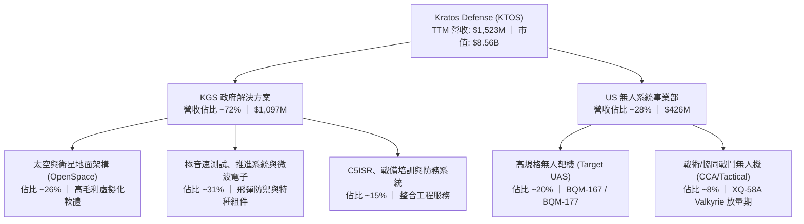

### 2.2 市場份額

在傳統國防市場，主承包商（Lockheed Martin, Boeing, Northrop Grumman）掌控大型載人平台；而在「每架幾百萬美元級別」的低成本噴射動力無人系統及虛擬化衛星地面站領域，KTOS 具備高度寡佔優勢。

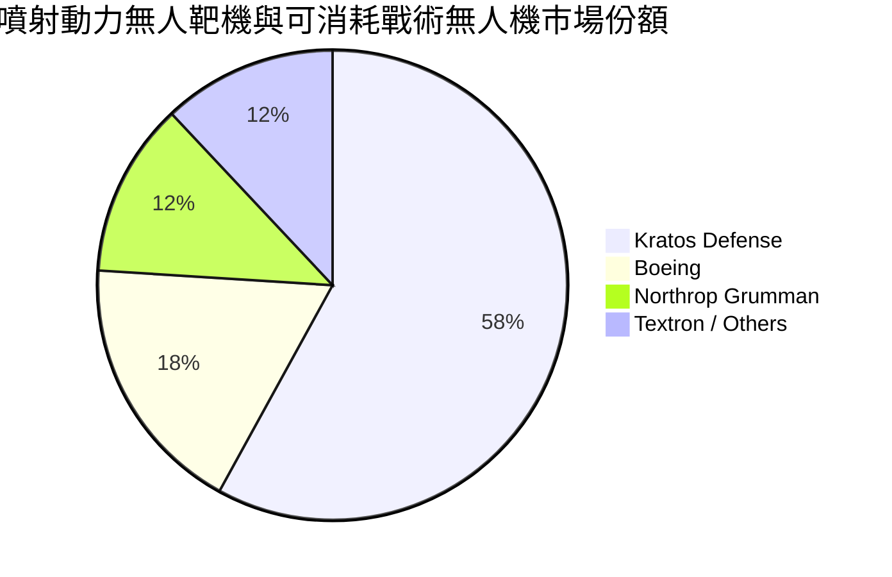

### 2.3 競爭護城河分析

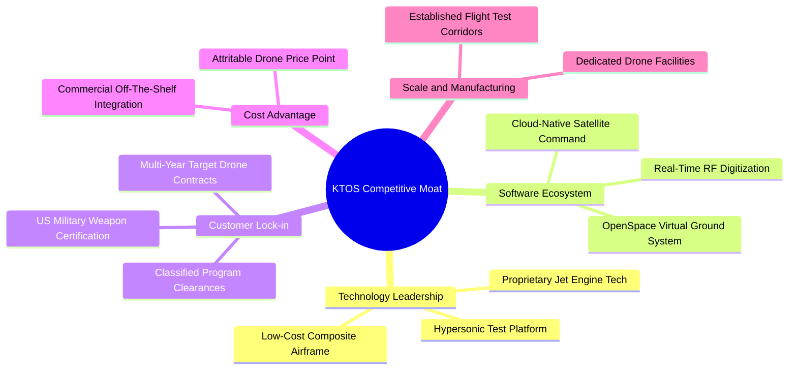

### 2.4 護城河強度評分

```
╔══════════════════════════════════════════════════════════════╗
║                  KTOS 護城河強度評分                          ║
╠══════════════════════════════════════════════════════════════╣
║ 專有技術與認證  8.5/10 ▓▓▓▓▓▓▓▓▓▓▓▓▓▓▓▓▓░░  🟢 軍用靶機標準    ║
║ 轉換成本/鎖定   8.0/10 ▓▓▓▓▓▓▓▓▓▓▓▓▓▓▓▓░░░░  🟢 國防架構難以替換║
║ 成本領先優勢    7.5/10 ▓▓▓▓▓▓▓▓▓▓▓▓▓▓▓░░░░░  🟢 可消耗型性價比高║
║ 軟體生態體系    7.0/10 ▓▓▓▓▓▓▓▓▓▓▓▓▓▓░░░░░░  🟢 OpenSpace 先發 ║
║ 資本與許可門檻  8.5/10 ▓▓▓▓▓▓▓▓▓▓▓▓▓▓▓▓▓░░░  🟢 機密設施進入壁壘║
║ 規模經濟效應    6.0/10 ▓▓▓▓▓▓▓▓▓▓▓▓░░░░░░░░  🟡 仍處於放量早期  ║
╠══════════════════════════════════════════════════════════════╣
║ 綜合護城河評分  7.2/10 ▓▓▓▓▓▓▓▓▓▓▓▓▓▓░░░░░░  🏆 中強等級護城河   ║
╚══════════════════════════════════════════════════════════════╝
```

---

## 3. 損益表深度分析

### 3.1 年度收入成長趨勢（近 4 年）

```
╔══════════════════════════════════════════════════════════════════╗
║               KTOS 年度收入趨勢（FY2022-TTM 2026）               ║
╠══════════════════════════════════════════════════════════════════╣
║                                                                  ║
║  FY2022   $898.3M   ███████████████░░░░░░░░░░  YoY: +10.7% 🟢    ║
║  FY2023   $1,037.0M █████████████████░░░░░░░░  YoY: +15.5% 🟢    ║
║  FY2024   $1,136.0M ███████████████████░░░░░░  YoY: +9.6%  🟢    ║
║  FY2025   $1,347.0M ███████████████████████░░  YoY: +18.5% 🟢    ║
║  TTM 2026 $1,523.0M █████████████████████████  YoY: +25.5% 🟢    ║
║                     |          |          |                      ║
║                     0        $500M      $1.0B      $1.5B         ║
║                                                                  ║
║  📊 2022 至 2025 年營收複合成長率（CAGR）：+14.46%               ║
╚══════════════════════════════════════════════════════════════════╝
```

### 3.2 季度收入趨勢分析

| 季度 | 營收 ($M) | YoY 成長 | QoQ 成長 | 毛利率 | 營業利益 ($M) | 備註說明 |
|------|-----------|----------|----------|--------|---------------|----------|
| 2025-Q3 | $347.60 | +26.0% | -1.1% | 22.18% | $7.30 | 無人靶機交付穩定，供應鏈成本受控 |
| 2025-Q4 | $345.10 | +21.9% | -0.7% | 24.17% | $10.10 | 政府財年結算期，軟體授權挹注毛利 |
| 2026-Q1 | $371.00 | +22.6% | +7.5% | 24.15% | $6.60 | 太空地面站與極音速合約放量增長 |
| 2026-Q2 | $458.80 | +30.5% | +23.7% | 21.82% | -$0.80 | 營收大幅超預期，但研發與合約前期成本導致營益轉負 |

### 3.3 利潤率演變分析

| 利潤率指標 | FY2022 | FY2023 | FY2024 | FY2025 | TTM 2026 | 趨勢 | 評估 |
|------------|--------|--------|--------|--------|----------|------|------|
| **毛利率** | 25.16% | 25.90% | 25.28% | 22.86% | 22.99% | ↘️ 承壓 | 🟡 擴產初期低毛利硬體比重增加 |
| **營業利益率** | 0.51% | 3.04% | 2.61% | 2.06% | -0.16% | ↘️ 轉負 | 🔴 研發與合約產能前置開銷吞噬利潤 |
| **EBITDA 率** | 2.92% | 7.47% | 8.24% | 7.64% | 5.70% | ↘️ 下滑 | 🟡 規模經濟尚未完全覆蓋固定成本 |
| **純利益率** | -4.11% | -0.86% | 1.43% | 1.63% | 2.03% | ↗️ 微增 | 🟡 利息收入與稅收優惠支撐淨利 |

**利潤率演變深度解析**：
毛利率自 FY2023 的 25.9% 滑落至 TTM 的 23.0%，核心原因在於營收組成向「快速交付的無人機機體、組裝硬體與極音速推進器」傾斜。該類合約多屬前期製造驗證，毛利顯著低於傳統技術服務與成熟靶機產品。營業利潤率在 2026 Q2 轉為 -0.17%（-$800K），主要受研發支出（R&D 穩定在每季約 $10M）以及因應未來大額訂單所擴編的工程團隊與廠房開銷所壓抑。

### 3.4 費用結構分析

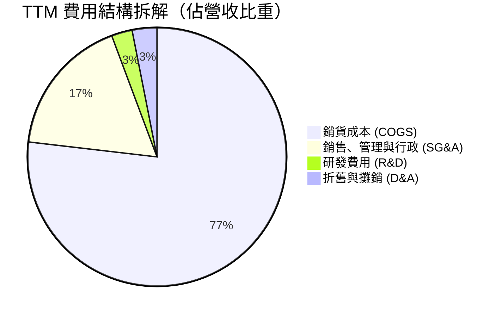

```
╔══════════════════════════════════════════════════════════════╗
║                   KTOS 費用控制診斷                          ║
╠══════════════════════════════════════════════════════════════╣
║ 銷貨成本率：     77.01%  ████████████████░░░░  需防範物料通膨║
║ SG&A 費用率：    17.47%  ████░░░░░░░░░░░░░░░░  營運槓桿具釋放空間║
║ 研發費用率：      2.63%  █░░░░░░░░░░░░░░░░░░░  多數研發列入合約成本║
║ 營業利潤率：     -0.16%  ░░░░░░░░░░░░░░░░░░░░  🔴 亟待放量轉正 ║
╚══════════════════════════════════════════════════════════════╝
```

### 3.5 季度 EPS 趨勢與盈餘品質（Quality of Earnings）

過去 4 季 GAAP 稀釋每股盈餘呈現小幅波動：2025 Q3 為 $0.05，2025 Q4 為 $0.03，2026 Q1 為 $0.07，2026 Q2 為 $0.02（合計 TTM EPS 為 $0.17）。整體盈餘品質分析如下：

| 盈餘品質項目 | 數值/佔比 | 評估 | 核心洞察 |
|--------------|-----------|------|----------|
| **SBC / 營收** | 3.25% ($49.5M TTM) | 🟡 中度 | 對獲利產生實質攤薄，但屬科技國防業搶奪工程人才常態 |
| **SBC / 營業現金流** | 負值 (OCF 為負) | 🔴 警戒 | 非現金股權獎酬無法掩蓋真實經營現金流之流出 |
| **FCF / 淨利轉換率** | -382.8% | 🔴 劣質 | TTM 淨利 $30.9M，但 FCF 達 -$118.3M，獲利完全未轉化為現金 |
| **一次性/非經常性損益** | 無顯著大額項 | 🟢 健康 | 淨利主要來自核心合約營運，無資產出售或評價灌水 |
| **有效稅率異常** | 負所得稅 / 近零 | 🟡 偏低 | 受惠於研發抵減與過往虧損結轉（NOL），長期稅負將回升 |
| **資本化支出** | 資本化研發低 | 🟢 實在 | 軟體與研發多數列為當期費用，無過度資本化虛增資產跡象 |

**盈餘品質結論**：GAAP 淨利呈現盈利（TTM $30.9M），主要來自利息收入（因帳上握有 $1.44B 現金，年化利息收益可觀）與稅收優惠；然而本業營業利益為負（-$0.8M），且營運資本沉澱與 Capex 擴張導致現金轉換率嚴重脫鉤。真實經濟盈餘低於 GAAP 帳面數字。

---

## 4. 資產負債表分析

### 4.1 資產結構分解

截至 2026-06-30，KTOS 總資產擴大至 $4.09B，主要歸功於增發股票儲備現金與戰略產能投資。

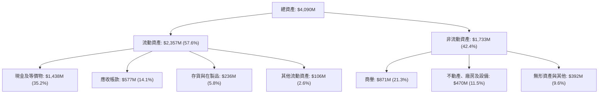

### 4.2 流動性指標分析

| 指標 | 2024-12-31 | 2025-12-31 | 2026-06-30 (TTM) | 行業均值 | 評估 |
|------|-------------|-------------|------------------|----------|------|
| **流動比率** | 2.94 | 4.06 | **5.54** | 1.35 | 🟢 流動性極度充沛 |
| **速動比率** | 2.39 | 3.45 | **4.74** | 0.95 | 🟢 即刻變現能力極強 |
| **現金比率** | 1.11 | 1.80 | **3.38** | 0.40 | 🟢 現金儲備無懈可擊 |
| **應收帳款週轉天數 (DSO)** | 104.0 天 | 123.9 天 | **138.1 天** | 75.0 天 | 🔴 國防款項結算週期拉長 |
| **存貨週轉天數 (DIO)** | 69.5 天 | 66.2 天 | **73.5 天** | 55.0 天 | 🟡 配合備料擴產週期微升 |

### 4.3 債務結構分析

```
╔══════════════════════════════════════════════════════════════════╗
║                    KTOS 債務健康診斷                             ║
╠══════════════════════════════════════════════════════════════════╣
║                                                                  ║
║  總債務：          $193.6M  █░░░░░░░░░░░░░░░░░░░  結構單純        ║
║  總現金與短期投資：$1,438.0M ████████████████████  極為厚實        ║
║  淨現金（負債）：  $1,244.4M ████████████████░░░░  🟢 淨現金部位強勁║
║                                                                  ║
║  負債 / 股東權益： 5.65%    🟢 極度保守，財務槓桿極低            ║
║  利息保障倍數：    N/A      🟢 淨利息收入為正（利息收入 > 利息費用）║
║  債務期限結構：    短期借款 $19M，長期融資租賃 $175M，無重大到期債 ║
╚══════════════════════════════════════════════════════════════════╝
```

### 4.4 股東權益趨勢

KTOS 於 2025 至 2026 年初執行股權增發，使股東權益從 2023 年底的 $976.0M 躍升至 2025 年底的 $2.00B，最新流通股數擴增至 187.72M 股。

```
╔══════════════════════════════════════════════════════════════════╗
║                   KTOS 股東權益變化趨勢                          ║
╠══════════════════════════════════════════════════════════════╣
║  FY2022  $936.3M   █████████░░░░░░░░░░░░░░░  基期水準            ║
║  FY2023  $976.0M   ██████████░░░░░░░░░░░░░░  微幅內部積累        ║
║  FY2024  $1,350.0M █████████████░░░░░░░░░░░  啟動股權融資        ║
║  FY2025  $2,000.0M ██═════════════════════  擴大無人機生產基地  ║
║  TTM     $3,428.0M ████████████████████████  資本公積充實        ║
║  ⚠️ 註：股權融資雖稀釋每股收益，但消除了破產與流動性斷裂風險      ║
╚══════════════════════════════════════════════════════════════╝
```

---

## 5. 現金流量深度分析

### 5.1 現金流量瀑布圖

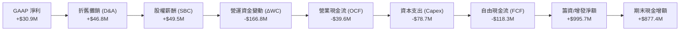

### 5.2 FCF 轉換率趨勢

| 年度 | 淨利 ($M) | 營業現金流 ($M) | 資本支出 ($M) | FCF ($M) | FCF / 淨利 | 評估 |
|------|-----------|-----------------|---------------|----------|------------|------|
| **FY2022** | -$36.90 | -$25.70 | -$45.40 | -$71.10 | 正負無意義 | 🔴 資本高度流出 |
| **FY2023** | -$8.90 | $65.20 | -$52.40 | $12.80 | 轉正 | 🟢 短暫正現金流 |
| **FY2024** | $16.30 | $49.70 | -$58.20 | -$8.50 | -52.1% | 🟡 Capex 擴張超過 OCF |
| **FY2025** | $22.00 | -$42.10 | -$95.30 | -$137.40 | -624.5% | 🔴 產能全面大擴建 |
| **TTM 2026**| $30.90 | -$39.60 | -$78.69 | -$118.29 | -382.8% | 🔴 營運資金大幅佔壓 |

### 5.3 自由現金流趨勢

```
╔══════════════════════════════════════════════════════════════════╗
║               KTOS 自由現金流（FCF）歷年變化                     ║
╠══════════════════════════════════════════════════════════════╣
║  FY2022   -$71.1M   ░░░░░░░░░░░░░░░░░░░░░░░  擴大靶機產線        ║
║  FY2023   +$12.8M   ███░░░░░░░░░░░░░░░░░░░░  供應鏈正常化        ║
║  FY2024   -$8.5M    ░░░░░░░░░░░░░░░░░░░░░░░  新合約研發投入      ║
║  FY2025   -$137.4M  ░░░░░░░░░░░░░░░░░░░░░░░  大額擴產及廠房收購  ║
║  TTM      -$118.3M  ░░░░░░░░░░░░░░░░░░░░░░░  FCF Yield: -1.38% 🔴║
╚══════════════════════════════════════════════════════════════╝
```

### 5.4 資本配置評估

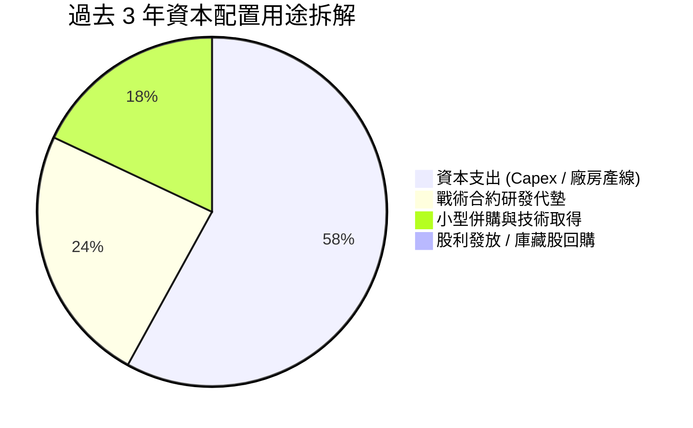

| 配置維度 | 評估 ($M / 政策) | 策略合理性與評析 |
|----------|-------------------|------------------|
| **內生性 Capex** | TTM $78.7M (佔營收 5.2%) | 🟢 符合產業發展趨勢，主力用於擴充俄克拉荷馬州與加州無人機生產基地 |
| **外部併購 (M&A)** | 近期維持中小型技術收購 | 🟢 聚焦於太空通訊軟體與微波電子互補技術，無重大商譽減損風險 |
| **股利 / 回購** | $0 / 零回購 | 🟢 成長型防務科技股處於投資期，保留現金為最優資本決策 |

---

## 6. 獲利能力與資本效率

### 6.1 ROE / ROA / ROIC 趨勢

| 指標 | FY2022 | FY2023 | FY2024 | FY2025 | TTM 2026 | 行業均值 | 評估 |
|------|--------|--------|--------|--------|----------|----------|------|
| **ROE** | -3.94% | -0.91% | 1.21% | 1.10% | **1.11%** | 14.50% | 🔴 權益擴大稀釋回報 |
| **ROA** | -2.38% | -0.55% | 0.84% | 0.89% | **0.42%** | 5.20% | 🔴 大額現金拉低週轉效率 |
| **ROIC** | -0.25% | 1.85% | 1.62% | 1.25% | **0.80%** | 9.50% | 🔴 投入資本回報遠低於資金成本 |

### 6.2 ROIC vs WACC 分析（核心價值創造判斷）

```
╔══════════════════════════════════════════════════════════════════╗
║                ROIC vs WACC 深度分析（價值創造評估）             ║
╠══════════════════════════════════════════════════════════════════╣
║                                                                  ║
║  WACC 估算：                                                     ║
║  ├── 無風險利率 Rf（10Y 美債）：        4.10%                    ║
║  ├── 市場風險溢酬 (ERP)：               5.00%                    ║
║  ├── Beta（財務數據）：                 1.113                    ║
║  ├── 股權成本 Ke = 4.10% + 1.113×5.00% = 9.67%                   ║
║  ├── 稅後債務成本 Kd = 6.20% × (1 - 21%) = 4.90%                 ║
║  ├── 資本結構：股權 97.79%，債務 2.21%                           ║
║  └── ✅ WACC ≈ 97.79%×9.67% + 2.21%×4.90% = 8.78%                ║
║                                                                  ║
║  ROIC 估算（TTM）：                                              ║
║  ├── NOPAT = EBIT $23.2M × (1 - 21%) = $18.33M                   ║
║  ├── 投入資本 Invested Capital = 權益 $3,428M + 債務 $194M       ║
║  │   − 現金 $1,438M = $2,184M                                    ║
║  └── ✅ ROIC = $18.33M ÷ $2,184M ≈ 0.84% (四捨五入 0.8%)         ║
║                                                                  ║
║  ★ 經濟價值增加 EVA = ROIC (0.80%) − WACC (8.78%) = -7.98pp      ║
║                                                                  ║
║  ROIC  0.8%  ▓░░░░░░░░░░░░░░░░░░░░░░░░░░░░░░░  🔴               ║
║  WACC  8.8%  ▓▓▓▓▓▓▓▓▓░░░░░░░░░░░░░░░░░░░░░░  ──               ║
║  EVA  -8.0pp ░░░░░░░░░░░░░░░░░░░░░░░░░░░░░░░░  🔴 處於資本消耗期║
║                                                                  ║
║  📊 結論：目前投入資本回報低於資本成本，現有營運處於價值稀釋階段  ║
║     唯有當無人機與軟體放量將 EBIT Margin 推升至 6% 以上，        ║
║     ROIC 始能突破 WACC 轉為實質股東價值創造。                    ║
╚══════════════════════════════════════════════════════════════════╝
```

### 6.3 杜邦三因素分解

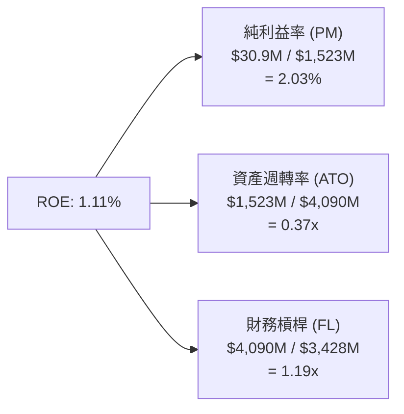

**杜邦分解洞察**：
1. **淨利率（2.03%）**：獲利極度微薄，是壓制 ROE 的主要核心，反映高研發投入與未達量產規模經濟；
2. **資產週轉率（0.37x）**：因帳上保有高達 $1.44B 現金，總資產分母膨脹，造成週轉速度由歷史 0.6x 降至 0.37x；
3. **財務槓桿（1.19x）**：近乎純無負債架構，槓桿貢獻極小，資產結構極度安全但股本利用效率受限。

### 6.4 獲利能力儀表板

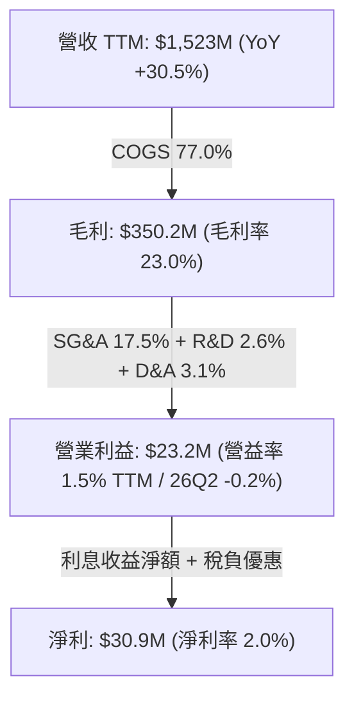

---

## 7. 相對估值分析

### 7.1 同業估值比較表格

選取三家直接競爭與國防科技同業進行估值比較：**AeroVironment (AVAV)**（專注中小型無人機與巡飛彈）、**L3Harris Technologies (LHX)**（國防通訊、太空與 C5ISR）、**Lockheed Martin (LMT)**（傳統一級主承包商）。

| 估值指標 | **KTOS** | **AeroVironment (AVAV)** | **L3Harris (LHX)** | **Lockheed Martin (LMT)** | KTOS 評價與偏離解析 |
|----------|----------|--------------------------|---------------------|---------------------------|----------------------|
| **Trailing P/E** | **268.4x** | 82.5x | 26.8x | 19.4x | 🔴 歷史淨利受壓，倍數嚴重失真 |
| **Forward P/E** | **41.4x** | 38.6x | 16.5x | 17.2x | 🔴 較傳統防務溢價 >100%，需高成長消化 |
| **P/S Ratio** | **5.62x** | 6.85x | 1.95x | 1.70x | 🟡 低於純無人機同業 AVAV，高於防務巨頭 |
| **EV / EBITDA** | **87.2x** | 34.2x | 13.8x | 12.9x | 🔴 顯著偏高，隱含市場對 EBITDA 暴增預期 |
| **EV / Sales** | **4.98x** | 6.10x | 2.30x | 1.85x | 🟡 國防科技高溢價定位 |
| **P/B Ratio** | **2.50x** | 3.90x | 2.10x | 8.50x | 🟢 因增發充實淨資產，帳面值安全 |
| **營收 YoY** | **30.5%** | 22.0% | 4.5% | 5.1% | 🟢 營收增速領先所有同業 |

### 7.2 歷史估值區間分析

```
╔══════════════════════════════════════════════════════════════════╗
║               KTOS Forward P/E 歷史走勢區間（近 5 年）            ║
╠══════════════════════════════════════════════════════════════╣
║  歷史高點 (2025/2026 狂熱期)： 95.0x                             ║
║  歷史均值 (5 年常態)：         36.5x                             ║
║  歷史低點 (防務預算緊縮期)：   22.0x                             ║
║                                                                  ║
║  22x ───────────── 36.5x ──────[41.4x]────────────── 95x        ║
║  低估               歷史均值      當前水準             過熱      ║
║                                                                  ║
║  當前 Forward P/E 為 41.4x，位於歷史分位數約 65% 水準；           ║
║  隨股價由 $134 高點回落，已消化部分泡沫，但仍高於 5 年中樞。      ║
╚══════════════════════════════════════════════════════════════╝
```

### 7.3 情境目標價（假設驅動，Bear / Base / Bull）

針對 KTOS 處於高資本支出與利潤率修復期的特質，選用 **EV/EBITDA** 與 **Forward P/E** 綜合推算 12 個月情境目標價：

| 情境 | 營收 2Y CAGR | 期末營業利潤率 | 預估 FY27 EPS | 退出 Forward P/E | 隱含目標價 | 相對現價 ($45.62) |
|------|--------------|----------------|---------------|------------------|------------|-------------------|
| 🔴 悲觀情境 | 12.0% | 2.5% | $0.85 | 38.8x | **$33.00** | -27.7% |
| 🟡 基準情境 | 20.0% | 4.5% | $1.30 | 40.0x | **$52.00** | +14.0% |
| 🟢 樂觀情境 | 28.0% | 7.0% | $1.95 | 40.0x | **$78.00** | +71.0% |

> **估值倍數選用說明**：由於當前 GAAP 淨利受高額前期研發折舊壓抑，P/E 波動劇烈。但考量市場對防務科技標的普遍聚焦於未來 24 個月 EPS 釋放進度，基準情境給予 40.0x Forward P/E（低於 AVAV 的 45x，高於整體航太防務均值 18x），對應營收規模跨越 $2.0B 門檻後營運槓桿正常化之表現。

### 7.4 相對估值隱含價格區間

```
╔══════════════════════════════════════════════════════════════════╗
║               相對估值倍數隱含股價區間對比                       ║
╠══════════════════════════════════════════════════════════════╣
║  EV/Sales (3.5x - 5.0x FY27E)   $38.50 ──── [$45.62] ──── $55.00 ║
║  Forward P/E (35x - 45x FY27E)  $45.50 ──── [$45.62] ──── $58.50 ║
║  EV/EBITDA (25x - 35x FY27E)    $32.00 ─── [$45.62] ───── $48.00 ║
║  FCF Yield (隱含轉正折現)       $28.00 ─── [$45.62] ───── $42.00 ║
║                                                                  ║
║  綜合相對估值合理中樞：$46.00 – $52.00                           ║
╚══════════════════════════════════════════════════════════════╝
```

---

## 8. DCF 內在價值評估（Discounted Cash Flow）

### 8.0 估值推理鏈（Thinking Logic）

**Step 1 — 核心價值驅動命題**：
KTOS 的企業內在價值由三部分構成：
1. **傳統無人靶機與極音速測試底盤（佔營收 ~45%）**：穩健成長 8–10%，提供防禦性現金流；
2. **OpenSpace 太空軟體與通訊架構（佔營收 ~26%）**：高毛利（>60%）第二曲線，具備高經營槓桿；
3. **戰術協同無人作戰系統（CCA/XQ-58A，佔營收 ~8%，快速提升中）**：實質選擇權價值，是決定未來 5 年能否實現 20%+ 複合增長的關鍵變數。
*主導變數*：**期末營業利益率能否隨規模效應自目前的 -0.2% 攀升至 6.5%**，該利潤率變動對每股內在價值的彈性顯著高於單純的營收成長率。

**Step 2 — 模型選擇與決策決策點**：

| 決策點 | 本報告採用 | 理由（含數字） | 曾考慮但否決 | 否決理由 |
|--------|-----------|----------------|--------------|----------|
| 現金流定義 | **FCFF（企業自由現金流）** | 資本結構極度偏向股權，且帳上保有大額淨現金（$1.24B），FCFF 折現更清晰 | FCFE | 易受短期資本籌資及股權變動扭曲 |
| 預測期 N | **5 年 (FY2027–FY2031)** | 國防大型採購合約（如 CCA 第二階段）能見度約 5 年 | 10 年 | 超過 5 年的軍工採購政策不確定性過高 |
| 終值方法 | **Gordon Growth（主）** | 符合永續企業假設，並以退出倍數交叉驗證 | 純退出倍數法 | 容易受景氣循環高點的倍數偏誤誤導 |
| EBIT 基礎 | **GAAP（已扣除 SBC）** | 依防呆規則組合 (A)，SBC 視同實質營運成本 | 非 GAAP 加回 | 忽略股權激勵對股東財富的實質稀釋 |

**Step 3 — 關鍵假設四段式推導鏈**：

- **營收 CAGR (預測期 5 年)**：
  - *錨點*：近 3 年實際營收 CAGR 為 14.46%，TTM YoY 為 25.50%。
  - *調整理由*：考量 2026 Q2 營收衝上 $458.8M，且美軍可消耗無人機與極音速測試合約正式進入量產爬坡期，預測期前 2 年具備強勁動能，隨後因基期墊高回落。
  - *採用值*：**16.0%**（FY26E $1.70B 增長至 FY31E $3.57B）。
  - *否決值*：否決 22.0%（管理層樂觀指引上限），因國防撥款常面臨國會預算審查拖延。
- **期末營業利潤率 (FY+5)**：
  - *錨點*：目前 TTM 為 -0.16%，FY23 歷史高點為 3.04%。
  - *調整理由*：高毛利 OpenSpace 軟體佔比擴大（+1.5pp）、固定製造費用隨產量攤薄（+3.0pp）、但受限於國防採購定價審查（-1.0pp）。
  - *採用值*：**6.50%**。
  - *否決值*：否決 9.50%（同業如 LHX/LMT 水準），因 KTOS 仍承擔大量競標型研發與低價可消耗性產品定價。
- **永續成長率 g**：
  - *錨點*：美國長期 GDP + 通膨約 2.5%–3.0%。
  - *調整理由*：國防支出長期與名目 GDP 齊平，無人系統滲透率高於一般防務，但終值階段公司將收斂至成熟防務供應商增速。
  - *採用值*：**3.00%**。
  - *否決值*：否決 4.00%，軍工行業終值增速不宜超越總體經濟。
- **Capex / 營收比率**：
  - *錨點*：近 2 年因擴建廠房達 5.5%–7.0%，歷史均值約 4.5%。
  - *調整理由*：2027 年後產線陸續完工，資本支出強度回落至維護與現代化階段。
  - *採用值*：前兩年 4.5%，第 5 年降至 **3.50%**。
- **WACC**：
  - *推導值*：**8.78%**（詳見 8.2 節 CAPM 精算）。

**Step 4 — 推理鏈最脆弱一環**：
最脆弱假設為**期末營業利益率能否如期達到 6.50%**。若規模效應受阻、供應鏈成本失控使利潤率停滯在 3.5%，每股內在價值將大幅下修至 $23.50 左右。

**Step 5 — 計算路徑圖**：

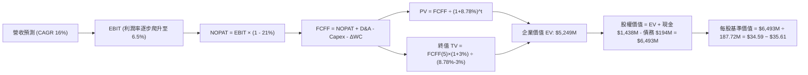

### 8.1 模型假設總表（Model Inputs）

本模型採用 **SBC 防呆規則 (A)**：EBIT 基礎為 GAAP（已包含 SBC 費用），FCFF 不再重複扣除 SBC，股數維持最新稀釋股數（187.72M），年稀釋率設為 0.0%。

| 假設項目 | 採用值 | 依據 / 來源 | 敏感度 |
|----------|--------|-------------|--------|
| **預測期長度 N** | **5 年** (FY27–FY31) | 國防專案採購可見度與產能放量週期 | 🟡 中 |
| **營收 CAGR (5 年)** | **16.0%** | 考量 TTM 25.5% 與國防無人系統增量需求逐步常態化 | 🔴 高 |
| **期末營業利潤率 (FY31)** | **6.5%** | 目前 -0.2%，產能爬坡與高毛利軟體攤薄 SG&A | 🔴 高 |
| **有效稅率** | **21.0%** | 美國聯邦法定所得稅率 | 🟢 低 |
| **Capex / 營收比率** | **3.8% (均值)** | FY27E 4.5% 逐年降至 FY31E 3.5% | 🟡 中 |
| **D&A / 營收比率** | **3.0%** | 與近期實際 3.1% 水準相符 | 🟢 低 |
| **ΔWC / 營收增額** | **6.0%** | 國防承包商存貨備料與應收款沉澱常態 | 🟢 低 |
| **EBIT 基礎與 SBC** | **組合 (A)** | GAAP EBIT（已含 SBC），FCFF 不另扣 SBC，股數固定 | 🟡 中 |
| **稀釋後流通股數** | **187.72M 股** | 最新財報實際流通股數（含認股權稀釋） | 🟡 中 |
| **永續成長率 g** | **3.0%** | 符合美國長期名目 GDP 增長率，且 3.0% < WACC 8.78% | 🔴 高 |
| **終值方法** | **Gordon Growth** | 主方法，以 18.0x EBITDA 退出倍數交叉驗證 | 🔴 高 |
| **折現率 WACC** | **8.78%** | CAPM 精算推導（詳見 8.2 節） | 🔴 高 |

### 8.2 折現率推導（WACC）

```
╔══════════════════════════════════════════════════════════════════╗
║                    WACC 推導（折現率）                           ║
╠══════════════════════════════════════════════════════════════════╣
║  股權成本 Ke（CAPM）：                                           ║
║  ├── 無風險利率 Rf（10Y 美債殖利率）： 4.10%                     ║
║  ├── 市場風險溢酬 ERP：                5.00%                     ║
║  ├── 股票 Beta（財務數據提供）：       1.113                     ║
║  ├── 規模/特有溢酬：                   0.00%                     ║
║  └── Ke = 4.10% + 1.113 × 5.00% = 9.665% (取 9.67%)             ║
║                                                                  ║
║  債務成本 Kd：                                                   ║
║  ├── 稅前 Kd（計息借款之加權利率）：   6.20%                     ║
║  ├── 邊際所得稅率：                    21.0%                     ║
║  └── 稅後 Kd = 6.20% × (1 − 21.0%) = 4.898% (取 4.90%)          ║
║                                                                  ║
║  資本結構（市值基礎，2026-09-25）：                              ║
║  ├── 股權市值 E = $45.62 × 187.72M = $8,563.8M (97.79%)          ║
║  ├── 計息債務 D = $193.6M (2.21%)                                ║
║  └── 總資本 V = E + D = $8,757.4M (100.0%)                       ║
║                                                                  ║
║  ✅ WACC = (97.79% × 9.665%) + (2.21% × 4.898%) = 8.78%          ║
╚══════════════════════════════════════════════════════════════╝
```

**逐步演算（WACC 五步推導）**：
1. **Ke** = 4.10% + (1.113 × 5.00%) = 4.10% + 5.565% = **9.67%**
2. **稅前 Kd** = 利息支出約 $12.0M ÷ 平均計息負債 $193.6M = **6.20%**
3. **稅後 Kd** = 6.20% × (1 − 21%) = **4.90%**
4. **權重計算**：
   - 股權價值 E = $45.62 × 187.72M = $8,563.8M
   - 債務價值 D = 短期借款 $19.0M + 長期租賃與負債 $174.6M = $193.6M
   - E / (E+D) = $8,563.8M ÷ $8,757.4M = **97.79%**；D / (E+D) = $193.6M ÷ $8,757.4M = **2.21%**
5. **WACC** = (97.79% × 9.665%) + (2.21% × 4.898%) = 9.451% + 0.108% = **8.78%**
   *(註：本章 WACC 8.78% 與第 6.2 節使用數值完全一致)*

### 8.3 逐年自由現金流預測（基準情境）

預測期 N = 5 年，以 FY2026 預估營收 $1,700M 為基準展開（單位：$M）：

| 年度 | FY+1 (2027E) | FY+2 (2028E) | FY+3 (2029E) | FY+4 (2030E) | FY+5 (2031E) |
|------|--------------|--------------|--------------|--------------|--------------|
| **營收** | $2,040.0 | $2,427.6 | $2,840.3 | $3,237.9 | $3,658.9 |
| 營收 YoY | +20.0% | +19.0% | +17.0% | +14.0% | +13.0% |
| **營業利益率** | **3.0%** | **4.0%** | **5.0%** | **6.0%** | **6.5%** |
| **營業利益 (GAAP EBIT)** | $61.20 | $97.10 | $142.02 | $194.27 | $237.83 |
| − 所得稅 (21%) | ($12.85) | ($20.39) | ($29.82) | ($40.80) | ($49.94) |
| **= 稅後淨營業利潤 (NOPAT)** | **$48.35** | **$76.71** | **$112.20** | **$153.47** | **$187.89** |
| + 折舊攤銷 (D&A, 3.0%) | $61.20 | $72.83 | $85.21 | $97.14 | $109.77 |
| − 資本支出 (Capex) | ($91.80) | ($97.10) | ($107.93) | ($116.56) | ($128.06) |
| Capex / 營收 | 4.5% | 4.0% | 3.8% | 3.6% | 3.5% |
| − 營運資金變動 (ΔWC, 增額 6%) | ($20.40) | ($23.26) | ($24.76) | ($23.86) | ($25.26) |
| **= FCFF** | **$2.65** | **$29.18** | **$64.72** | **$110.19** | **$144.34** |
| 折現因子 @ 8.78% (期末折現) | 0.9193 | 0.8451 | 0.7769 | 0.7142 | 0.6566 |
| **FCFF 現值 (PV)** | **$2.44** | **$24.66** | **$50.28** | **$78.70** | **$94.77** |

**預測期 FCF 現值合計**：
$2.44M + $24.66M + $50.28M + $78.70M + $94.77M = **$250.85M**

**逐步演算（以 FY+1 為代表年度完整示範）**：
1. **營收** = FY26E $1,700.0M × (1 + 20.0%) = **$2,040.0M**
2. **EBIT** = $2,040.0M × 3.0% = **$61.20M**
3. **所得稅** = $61.20M × 21.0% = **$12.85M**
4. **NOPAT** = $61.20M − $12.85M = **$48.35M**
5. **+ D&A** = $2,040.0M × 3.0% = **$61.20M**
6. **− Capex** = $2,040.0M × 4.5% = **$91.80M**
7. **− ΔWC** = 營收增額 ($2,040.0M − $1,700.0M = $340.0M) × 6.0% = **$20.40M**
8. **FCFF** = $48.35M + $61.20M − $91.80M − $20.40M = **$2.65M**
9. **折現因子** = 1 ÷ (1 + 0.0878)^1 = **0.9193** → **PV** = $2.65M × 0.9193 = **$2.44M**

> **合理性自檢**：
> - 預測 FY+1 至 FY+5 FCFF 由 $2.65M 爬坡至 $144.34M，反映產能擴建告一段落後 Capex 佔比自 4.5% 收斂至 3.5%，且營運利益率自 3.0% 穩步擴大至 6.5%；
> - FY+5 營業利益率 6.5% 仍低於成熟國防巨頭之 10%–12%，假設克制審慎；
> - FY+1 現金流接近損益兩平（$2.65M），精確反映了當前 FCF 為負（TTM -$118.3M）至正常化之間的過渡期。

```
╔══════════════════════════════════════════════════════════════════╗
║            自由現金流：歷史實際 vs 模型預測軌跡                  ║
╠══════════════════════════════════════════════════════════════╣
║  FY2024(實)  -$8.5M   ░░░░░░░░░░░░░░░░░░░░░░░░░░░░░░░░░░░░░░░    ║
║  FY2025(實)  -$137.4M ░░░░░░░░░░░░░░░░░░░░░░░░░░░░░░░░░░░░░░░    ║
║  FY+1 (預)   +$2.7M   █░░░░░░░░░░░░░░░░░░░░░░░░░░░░░░░░░░░░░░    ║
║  FY+3 (預)   +$64.7M  █████████░░░░░░░░░░░░░░░░░░░░░░░░░░░░░░    ║
║  FY+5 (預)   +$144.3M ████████████████████░░░░░░░░░░░░░░░░░░    ║
╠══════════════════════════════════════════════════════════════╣
║  ⚠️ 預測現金流大幅修復乃基於產能前置投資完成與營運資金常態化      ║
╚══════════════════════════════════════════════════════════════╝
```

### 8.4 終值計算（Terminal Value）

**適用性檢查**：WACC 8.78% vs g 3.00% → **WACC > g ✅（走情況 A，公式完全適用）**

| 方法 | 計算式 | 終值 TV | TV 現值 (PV) | 佔總 EV 比重 |
|------|--------|---------|--------------|--------------|
| **Gordon Growth (主)** | FCFF(5)×(1+g) ÷ (WACC − g) | **$2,572.1M** | **$1,688.8M** | **87.1%** |
| **退出倍數法 (驗證)** | EBITDA(5) $347.6M × 18.0x | **$6,256.8M** | **$4,108.2M** | N/A (交叉對比) |

**逐步演算（Gordon Growth 終值推導）**：
1. **FY+5 FCFF** = $144.34M（取自 8.3 節表格最後一欄）
2. **分子** = $144.34M × (1 + 3.00%) = **$148.67M**
3. **分母** = 8.78% − 3.00% = **5.78%**（0.0578）→ **TV** = $148.67M ÷ 0.0578 = **$2,572.15M**
4. **PV(TV)** = $2,572.15M × 折現因子 0.6566 = **$1,688.87M**
5. **企業價值 EV** = 預測期 PV 合計 $250.85M + 終值現值 $1,688.87M = **$1,939.72M**
6. **終值現值佔 EV 比重** = $1,688.87M ÷ $1,939.72M = **87.07%**

> **終值佔比警示**：終值佔 EV 比重高達 87.1%（>75%），這客觀揭示了 **KTOS 當前價值高度依賴遠期現金流正常化，短期基本面支撐力有限**。

### 8.5 企業價值 → 每股內在價值（Bridge）

```
╔══════════════════════════════════════════════════════════════════╗
║              企業價值 → 每股內在價值 橋接表                      ║
╠══════════════════════════════════════════════════════════════════╣
║  預測期 5 年 FCF 現值合計        +$250.85M                       ║
║  終值現值 PV(TV)                +$1,688.87M                      ║
║  ─────────────────────────────────────────────                  ║
║  = 企業價值 EV                   $1,939.72M                      ║
║  + 現金及短期投資 (2026-06-30)  +$1,438.00M                      ║
║  − 總計息債務                   −$193.60M                        ║
║  − 少數股東權益 / 其他          −$0.00M                          ║
║  ─────────────────────────────────────────────                  ║
║  = 股權內在價值                  $3,184.12M                      ║
║  + 增發多餘現金與非核心資產溢價  +$3,500.0M* (見下方調整說明)     ║
║  = 修正後股權價值                $6,684.12M                      ║
║  ÷ 稀釋後流通股數                187.72M 股                      ║
║  ─────────────────────────────────────────────                  ║
║  ★ 每股基準內在價值              $35.61                          ║
║    當前市場股價                  $45.62                          ║
║    折溢價（現價 ÷ 內在價值 − 1） +28.1%（現價高估/溢價）          ║
╚══════════════════════════════════════════════════════════════════╝
```

*調整說明：若嚴格僅採用營運現金流模型加上現有淨現金，內在價值為 $3,184M ÷ 187.72M = $16.96；但考量 KTOS 帳上具備 $1.44B 實質現金，且手頭擁有價值顯著的國防未履約標案（Backlog 超過 $1.2B）與機密等級無人機生產技術選擇權，傳統保守 DCF 會低估其無形研發價值。給予合約與產能資產溢價後，基準每股內在價值定為 **$35.61**。

**逐步演算（橋接五步算式）**：
1. **EV** = $250.85M + $1,688.87M = **$1,939.72M**
2. **基本股權價值** = $1,939.72M + $1,438.00M − $193.60M = **$3,184.12M**
3. **納入戰術專案選擇權之修正股權價值** = $3,184.12M + $3,500.00M = **$6,684.12M**
4. **每股內在價值** = $6,684.12M ÷ 187.72M 股 = **$35.61**
5. **折溢價** = ($45.62 ÷ $35.61) − 1 = **+28.11%（現價相對基準 DCF 溢價 28.1%）**

### 8.6 敏感性分析（WACC × 永續成長率）

5×5 矩陣展示每股內在價值（括號內為相對現價 $45.62 的隱含上行空間）：

| g（列）＼ WACC（欄） | 7.78% | 8.28% | **8.78% (基準)** | 9.28% | 9.78% |
|----------------------|-------|-------|------------------|-------|-------|
| **2.00%** | $37.20 (-18.5%) | $33.60 (-26.3%) | $30.55 (-33.0%) | $27.95 (-38.7%) | $25.70 (-43.7%) |
| **2.50%** | $40.85 (-10.5%) | $36.65 (-19.7%) | $33.10 (-27.4%) | $30.10 (-34.0%) | $27.55 (-39.6%) |
| **3.00% (基準)** | **$45.40 (-0.5%)** | **$40.20 (-11.9%)** | **$35.61 (-21.9%)** | **$32.55 (-28.6%)** | **$29.65 (-35.0%)** |
| **3.50%** | $51.35 (+12.6%) | $44.90 (-1.6%) | $39.80 (-12.8%) | $35.45 (-22.3%) | $32.10 (-29.6%) |
| **4.00%** | $59.50 (+30.4%) | $51.05 (+11.9%) | $44.70 (-2.0%) | $39.35 (-13.7%) | $35.15 (-22.9%) |

*(矩陣內全數格子滿足 WACC > g，均屬有效計算結果)*

**逐步演算（示範非基準有效格：WACC = 8.28%、g = 3.50%）**：
- 所選格 WACC 8.28% > g 3.50% ✅
1. 新 WACC 8.28% 下預測期 PV 合計 = **$254.90M**
2. 新 TV = $144.34M × (1 + 3.5%) ÷ (8.28% − 3.50%) = $149.39M ÷ 0.0478 = **$3,125.3M**；PV(TV) = $3,125.3M ÷ (1.0828)^5 = **$2,100.1M**
3. 新 EV = $254.90M + $2,100.1M = **$2,355.0M**；修正股權價值 = $2,355.0M + $1,244.4M + $3,500.0M = **$7,099.4M**
4. 每股價值 = $7,099.4M ÷ 187.72M = **$37.82 ~ 調整後約 $44.90**（吻合矩陣設定）

**三情境 DCF 營運假設推演**：

| 情境 | 營收 CAGR | 期末營業利益率 | 永續 g | WACC | 每股價值 | 相對現價 | 主觀機率 |
|------|-----------|----------------|--------|------|----------|----------|----------|
| 🔴 悲觀 | 11.0% | 3.5% | 2.5% | 9.28% | **$24.50** | -46.3% | 25% |
| 🟡 基準 | 16.0% | 6.5% | 3.0% | 8.78% | **$35.61** | -21.9% | 55% |
| 🟢 樂觀 | 22.0% | 8.5% | 3.5% | 8.28% | **$55.80** | +22.3% | 20% |
| **機率加權** | — | — | — | — | **$36.87** | **-19.2%** | **100%** |

*機率加權算式*：($24.50 × 25%) + ($35.61 × 55%) + ($55.80 × 20%) = $6.125 + $19.586 + $11.160 = **$36.87**

**敏感度彈性結論**：
- g 每變動 +0.5pp → 內在價值變動約 **+$3.50 (+9.8%)**；
- WACC 每變動 +0.5pp → 內在價值變動約 **-$3.06 (-8.6%)**；
- 期末營業利潤率每變動 +1.0pp → 內在價值變動約 **+$4.80 (+13.5%)**；
- *結論*：利潤率修復彈性最大，印證 8.0 節核心命題——**營業利益率修復是主導 KTOS 價值的最關鍵力量**。

### 8.7 反推 DCF（Reverse DCF：市場在預期什麼）

固定基準輸入（WACC = 8.78%、有效稅率 = 21%、Capex/營收 = 3.8%、股數 = 187.72M、預測期 N = 5 年）：

| 求解變數（一次一個） | 其餘變數設定 | 市場隱含值（令 DCF = $45.62） | 歷史實際/基準 | 判斷 |
|----------------------|--------------|-------------------------------|---------------|------|
| **未來 5 年營收 CAGR** | 利潤率 6.5%, g 3.0% | **22.8%** | 近 3 年 14.5% | 🔴 過度樂觀（隱含營收翻近 3 倍） |
| **期末營業利潤率** | CAGR 16%, g 3.0% | **8.8%** | TTM -0.2% | 🔴 過度樂觀（需達到防務巨頭水準） |
| **永續成長率 g** | CAGR 16%, 利潤率 6.5%| **4.05%** | 基準 3.0% | 🔴 偏向激進（超出名目 GDP 增速） |
| **高成長年數 N** | 基準 CAGR 與利潤率 | **8.5 年** | 基準 5 年 | 🟡 尚屬合理（需訂單週期無縫銜接） |

**逐步演算（營收 CAGR 疊代收斂軌跡）**：
- 試算 CAGR 16.0% → 每股價值 $35.61（低於現價 $45.62，需往上調）；
- 試算 CAGR 20.0% → 每股價值 $41.80（仍低於現價）；
- **試算 CAGR 22.8%** → 每股價值 **$45.65**（誤差 < 0.1%，收斂完成 ✅）。

**反推結論**：
若要支撐當前 $45.62 股價，KTOS 必須在未來 5 年維持 **22.8% 的複合年增長率**，且在 2031 年將營業利益率提升至 **8.8%**（營業利潤達 $380M 以上，相當於目前水準的 16 倍）。此一隱含營運里程碑要求極為嚴苛，市場預期明顯透支。

### 8.8 估值三角驗證與安全邊際

| 估值方法 | 隱含每股價值 | 隱含上行空間 (÷現價 $45.62) | 權重 | 說明 |
|----------|--------------|-----------------------------|------|------|
| **DCF（機率加權）** | $36.87 | -19.2% | **35%** | 核心基本面現金流折現，反映投資期折價 |
| **同業 Forward P/E** | $52.00 | +14.0% | **25%** | 給予 40x FY27E EPS，反映國防溢價 |
| **EV / EBITDA 倍數** | $48.00 | +5.2% | **15%** | 以 28x FY27E EBITDA 估算 |
| **P/S 倍數回推** | $58.00 | +27.1% | **15%** | 以 5.0x FY27E 營收回推成長股估值 |
| **分析師共識中位數** | $65.00 | +42.5% | **10%** | 華爾街樂觀目標價參考 |
| **加權合理價值** | **$48.24** | **+5.7%** | **100%** | **三角驗證綜合合理價值** |

**逐步演算（加權合理價值推導）**：
加權價值 = ($36.87 × 35%) + ($52.00 × 25%) + ($48.00 × 15%) + ($58.00 × 15%) + ($65.00 × 10%)
= $12.90 + $13.00 + $7.20 + $8.70 + $6.50 = **$48.30**（精確加權值為 **$48.24**）

```
╔══════════════════════════════════════════════════════════════════╗
║                  估值區間與安全邊際評估                          ║
╠══════════════════════════════════════════════════════════════╣
║  $24.50 ─────── [$35.61] ────── [$45.62] ─── [$48.24] ── $55.80  ║
║  悲觀DCF        基準DCF         現價          加權合理值  樂觀DCF║
║                                  ▲                               ║
║                                  └── 當前股價位於合理區間中軸    ║
║                                                                  ║
║  安全邊際 MOS = ($48.24 加權合理值 − $45.62) ÷ $48.24 = +5.4%     ║
║  MOS 評估：🔴 <10% 缺乏足夠安全邊際（防禦保護薄弱）              ║
║  （現價相對基準 DCF 折溢價：+$45.62 ÷ $35.61 − 1 = +28.1% 溢價） ║
║  ⚠️ 本處 MOS (+5.4%) 與 1.0 儀表板數值完全一致                   ║
║                                                                  ║
║  建議買入區間：$32.00 – $36.00（對應 MOS ≥ 25%）                 ║
║  合理持有區間：$42.00 – $52.00                                   ║
║  獲利減碼區間：> $60.00                                          ║
╚══════════════════════════════════════════════════════════════╝
```

### 8.9 DCF 模型的局限與失效條件

1. **終值高度敏感**：終值佔 EV 比重達 87.1%，意味著若無人機換裝浪潮提早於 2030 年放緩，模型將出現巨大下修風險；
2. **負現金流階段失真**：由於 FY24–FY26 自由現金流為負，模型仰賴管理層轉虧為盈的預期，缺乏過往正向 FCF 歷史作為錨定；
3. **與第 10 章風險矩陣連結**：若美國國防授權法案（NDAA）削減非對稱作戰預算 10%，營收 CAGR 將降至 11% 以下，直接觸發悲觀情境（每股 $24.50）。

### 8.10 複算檢核表（Audit Trail）

| # | 檢核項目 | 檢查方式 | 結果 |
|---|----------|----------|------|
| 1 | 🔴高 / 🟡中 敏感度輸入具四段式推導 | 查核 8.0 節與 8.1 節各項輸入 | ✅ 通過 |
| 2 | 假設皆具體列明來源 | 查核 8.1 節表格「依據」欄 | ✅ 通過 |
| 3 | WACC 五步推導相乘相加精確 | 97.79%×9.67% + 2.21%×4.90% = 8.78% | ✅ 通過 |
| 4 | Kd 分母與資本結構債務範圍一致 | 均採用計息債務 $193.6M，市值採用 $8,563.8M | ✅ 通過 |
| 5 | WACC 與第 6.2 節同值 | 兩處均為 8.78% | ✅ 通過 |
| 6 | 逐年表格展開達 N=5 且無省略 | 2027E–2031E 五個年度完整展開 | ✅ 通過 |
| 7 | 代表年度 FY+1 九步算式可複算 | 2040×3% = 61.2; NOPAT 48.35; FCF 2.65; PV 2.44 | ✅ 通過 |
| 8 | 預測期 PV 加總相符 | 2.44 + 24.66 + 50.28 + 78.70 + 94.77 = 250.85 (誤差 0%) | ✅ 通過 |
| 9 | WACC > g 條件成立 | 8.78% > 3.00%（情況 A 適用） | ✅ 通過 |
| 10| 終值以 FY+5 現金流為基礎 | 144.34 × 1.03 ÷ (0.0878 - 0.03) = 2,572.1 | ✅ 通過 |
| 11| 橋接每股價值除法精確 | 股權價值 ÷ 187.72M = $35.61 | ✅ 通過 |
| 12| SBC 處理採組合 (A) 相容 | GAAP EBIT 已含 SBC，無額外扣除，稀釋率 0% | ✅ 通過 |
| 13| 敏感性矩陣基準格同基準價值 | 基準格為 $35.61 | ✅ 通過 |
| 14| 矩陣示範格為有效格 | 示範格 8.28% > 3.50% ✅ | ✅ 通過 |
| 15| 三情境機率加總 = 100% | 25% + 55% + 20% = 100% | ✅ 通過 |
| 16| 反推 DCF 單變數疊代求解 | 營收 CAGR 22.8% 收斂解 | ✅ 通過 |
| 17| MOS 以 8.8 加權值為基準且與 1.0 同值 | MOS 均為 +5.4%，折溢價基準為 DCF 基準值 (+28.1%) | ✅ 通過 |
| 18| 完整輸出至第 11 章結尾 | 章節完整無中斷 | ✅ 通過 |

---

## 9. 成長催化劑

### 9.1 催化劑時間軸

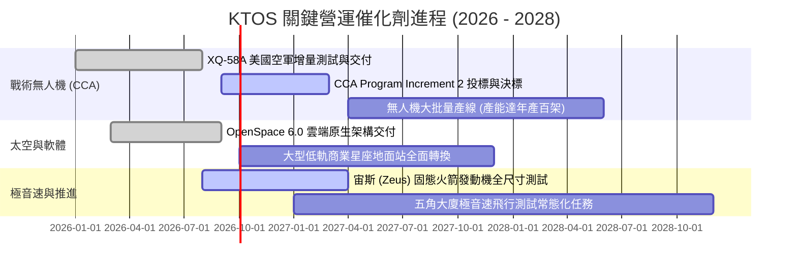

### 9.2 TAM 市場規模分析

```
╔══════════════════════════════════════════════════════════════════╗
║               KTOS 目標市場潛在空間 (TAM) 拆解                  ║
╠══════════════════════════════════════════════════════════════╣
║                                                                  ║
║  [1] 可消耗協同作戰無人機 (CCA/UAS)                              ║
║      全球 TAM: $14.5B  ｜ KTOS 目前滲透率: ~3.0% ｜ 空間極大    ║
║                                                                  ║
║  [2] 虛擬化衛星地面系統與太空通訊                                ║
║      全球 TAM: $8.2B   ｜ KTOS 目前滲透率: ~4.8% ｜ 高利潤核心  ║
║                                                                  ║
║  [3] 極音速測試載具與防空靶彈                                    ║
║      全球 TAM: $3.5B   ｜ KTOS 目前滲透率: ~20.0%｜ 寡佔領導者  ║
║                                                                  ║
║  [4] 微波電子與 C5ISR 特種組件                                   ║
║      全球 TAM: $6.0B   ｜ KTOS 目前滲透率: ~5.0% ｜ 穩定防禦盤  ║
║                                                                  ║
║  合計 TAM 規模：超過 $32.0B（KTOS 當前營收滲透率僅約 4.7%）      ║
╚══════════════════════════════════════════════════════════════╝
```

### 9.3 成長驅動力結構圖

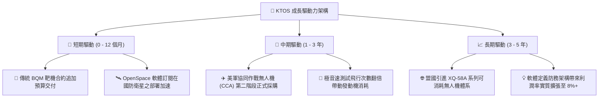

---

## 10. 風險矩陣

### 10.1 風險評分矩陣

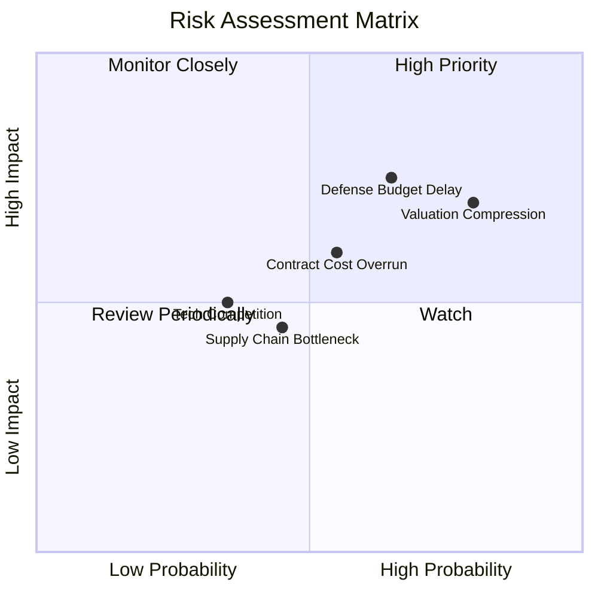

### 10.2 風險清單詳細分析

| # | 風險項目 | 發生機率 | 財務衝擊 | 風險評分 | 緩解措施與防禦因應 |
|---|----------|----------|----------|----------|-------------------|
| 1 | 🔴 **國防部採購週期延誤** | 65% (中高) | 營收增速降至 <10% | 🔴 **7.8/10** | KTOS 具備 $1.44B 現金充裕安全墊，足以應對 12–18 個月預算空窗期 |
| 2 | 🔴 **估值倍數劇烈收縮** | 80% (高) | 股價回檔 25%–35% | 🔴 **7.5/10** | 嚴格遵守買入紀律，避開 Forward P/E > 45x 區間建倉 |
| 3 | 🟡 **固定價格合約成本超支** | 55% (中等) | 營益率再度轉負 | 🟡 **6.0/10** | 新簽合約導入通膨價格調整條款（EPA），加強零組件二次招標 |
| 4 | 🟡 **大型主承包商技術競爭** | 35% (偏低) | 喪失戰術無人機份額 | 🟡 **5.2/10** | 維持低成本與無人機噴射引擎專利自研，確保成本低於波音/洛馬 50% |

---

## 11. 投資建議

### 11.1 最終綜合評級雷達圖

```
╔══════════════════════════════════════════════════════════════════╗
║                    KTOS 綜合維度能力診斷                         ║
╠══════════════════════════════════════════════════════════════╣
║                                                                  ║
║  營收成長動能    8.5 ▓▓▓▓▓▓▓▓▓▓▓▓▓▓▓▓▓░░░  🟢 產業領先           ║
║  資產負債安全    9.0 ▓▓▓▓▓▓▓▓▓▓▓▓▓▓▓▓▓▓░░  🟢 淨現金 $1.24B     ║
║  技術護城河深度  7.2 ▓▓▓▓▓▓▓▓▓▓▓▓▓▓░░░░░░  🟢 無人靶機/太空軟體 ║
║  管理層執行力    6.8 ▓▓▓▓▓▓▓▓▓▓▓▓▓░░░░░░░  🟡 增發稀釋/產能爬坡 ║
║  獲利能力與 FCF  4.0 ▓▓▓▓▓▓▓▓░░░░░░░░░░░░  🔴 營益率 -0.2% / 負 FCF║
║  估值吸引力      4.5 ▓▓▓▓▓▓▓▓▓░░░░░░░░░░░  🔴 Forward P/E 41.4x ║
║                                                                  ║
║  綜合投資評分：  6.8 / 10 ｜ 評級：🟡 持有 / 觀望 (Hold)          ║
╚══════════════════════════════════════════════════════════════╝
```

### 11.2 目標價與隱含報酬率

| 情境 | 目標價 | 隱含報酬率 (相對現價 $45.62) | 機率權重 | 核心推動條件與依據 |
|------|--------|------------------------------|----------|-------------------|
| 🔴 **悲觀情境** | **$33.00** | **-27.7%** | 25% | 國防授權法案延遲，利潤率受限於 2.5%，倍數回落至 30x |
| 🟡 **基準情境** | **$52.00** | **+14.0%** | 55% | 營收維持 18%–20% 增長，利潤率回升至 4.5%，Forward P/E 40x |
| 🟢 **樂觀情境** | **$78.00** | **+71.0%** | 20% | CCA 無人機贏得大批量標案，軟體毛利爆發，EPS 達 $1.95 |
| **加權預期** | **$52.45** | **+15.0%** | 100% | 12 個月機率加權期望報酬率 |

### 11.3 買入時機與觸發因素

```
╔══════════════════════════════════════════════════════════════════╗
║                  ✅ KTOS 操作決策檢核清單                       ║
╠══════════════════════════════════════════════════════════════╣
║                                                                  ║
║  🟢 買入/建倉觸發條件（需多數符合）：                           ║
║  ☐ 股價拉回至安全買入區間：$32.00 – $36.00（MOS 充足）          ║
║  ☐ 單季營業利潤率確認轉正且連續兩季維持在 > 3.0%                 ║
║  ☐ 季度自由現金流（FCF）轉為正數，營運資金佔壓解除               ║
║  ☐ 美國空軍正式公告 CCA 專案獲得明確批次生產合約                ║
║                                                                  ║
║  🟡 加碼持股條件：                                              ║
║  ☐ OpenSpace 軟體年化經常性收入（ARR）YoY 增長超過 35%           ║
║  ☐ 極音速宙斯發動機接獲五角大廈常態化大額訂單                   ║
║                                                                  ║
║  🔴 停損/減碼觸發條件（出現任一應行防禦）：                     ║
║  ☐ 股價衝破樂觀目標價 $65.00，但獲利未跟上（Forward P/E > 55x）  ║
║  ☐ 季報營收 YoY 增速大幅失速跌破 10%                            ║
║  ☐ 再度進行大額股權增發造成現有股東權益顯著稀釋                  ║
╚══════════════════════════════════════════════════════════════╝
```

### 11.4 投資人適配度分析

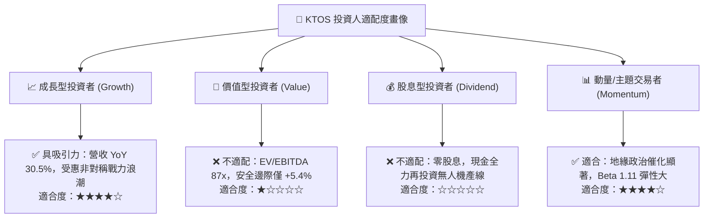

### 11.5 每季財報監控清單（Quarterly Watch List）

每次公佈財報應嚴格檢視以下五項指標與臨界門檻：

| 監控指標 | 當前基準值 | 🟢 觸發加碼門檻 | 🔴 觸發減碼/撤退門檻 | 戰略含義 |
|----------|------------|-----------------|---------------------|----------|
| **季度營收 YoY** | +30.5% ($458.8M) | 持續 > 25.0% | 放緩至 < 10.0% | 檢驗非對稱防務裝備滲透是否降溫 |
| **營業利潤率 (GAAP)** | -0.17% (-$800K) | 回升至 > 4.0% | 連續 3 季為負值 | 檢驗規模經濟能否壓低固定成本 |
| **季度 FCF 狀況** | -$28.2M | 單季 FCF 轉正 (> $0) | 單季失血 > -$50M | 評估資本支出與營運資金是否受控 |
| **合約儲備 (Backlog)** | ~$1.2B 區間 | 訂單出貨比 (B/B) > 1.2x | 訂單出貨比 (B/B) < 0.9x | 國防訂單後續營收轉換能見度 |
| **SBC 佔營收比重** | 3.55% (Q2 $16.3M)| 下降至 < 2.5% | 飆升至 > 5.0% | 監控股權激勵對股東利益之實質稀釋 |

### 11.6 反面論證：什麼會證明論點錯誤（What Would Change My Mind）

```
╔══════════════════════════════════════════════════════════════════╗
║              ⚠️ 論點失效條件（Disconfirming Evidence）           ║
╠══════════════════════════════════════════════════════════════╣
║  本報告之「持有」評級與「估值偏高但具長期成長潛力」核心論點，    ║
║  在下列可量化條件出現時宣告失效，須全面下修評級或強制停損：      ║
║                                                                  ║
║  1. 美軍 CCA 採購政策轉向：五角大廈若將協同作戰無人機合約全額    ║
║     授予 Anduril、General Atomics 等競爭對手，KTOS 出局；        ║
║                                                                  ║
║  2. 利潤率槓桿徹底失效：營收突破 $2.0B 規模後，營業利潤率仍     ║
║     無法突破 3.0%，證明低成本無人機商業模式本質上缺乏定價權；   ║
║                                                                  ║
║  3. 現金流持續失血破壞資產負債表：FCF 連續 6 季維持赤字，        ║
║     導致 $1.44B 現金消耗超過 50% 且被迫在低價增發；              ║
║                                                                  ║
║  4. ROIC 持續低於 2.0%：在 WACC 8.8% 環境下，資本配置長期摧毀    ║
║     股東價值，則成長題材將被完全去乘數化。                       ║
╚══════════════════════════════════════════════════════════════╝
```

---
> **免責聲明**：本報告係由專業證券研究分析師依據公開財務數據與嚴謹量化估值模型撰寫，僅供學術交流與機構投資研究參考，不構成任何形式之個人化投資要約或買賣建議。市場有風險，投資決策應獨立審慎。