# KTOS 基本面深度分析報告
> **報告日期**：2026-09-28 ｜ **語言**：繁體中文 ｜ **數據來源**：Yahoo Finance, Finviz, StockAnalysis, Roic.ai ｜ **分析師**：CFA 級機構研究

---

## 目錄

| # | 章節 | 核心結論 |
|---|------|----------|
| 1 | 執行摘要 | 給予「持有/區間操作（Hold）」評級，加權合理價值 $53.28，上行空間 +20.9%，安全邊際 MOS 17.3% |
| 2 | 公司概覽與商業模式 | 無人作戰系統（UAS）與太空地面虛擬化架構具雙輪驅動優勢，國防專利與軟體化形成中高強度護城河 |
| 3 | 損益表深度分析 | TTM 營收達 $1.52B（YoY +30.5%），但營業利益率僅 -0.2%，SBC 擴大且 FCF 為負壓抑實質獲利品質 |
| 4 | 資產負債表分析 | 現金及短期投資達 $1.44B，淨現金 $1.24B，流動比率 5.54x，具備抵禦景氣波動之強大資產負債表保護 |
| 5 | 現金流量深度分析 | TTM FCF 為 -$118.29M，高研發與無人機試飛資本支出使自由現金流受壓，高度仰賴股權融資與在手現金 |
| 6 | 獲利能力與資本效率 | TTM ROIC 為 0.88% vs WACC 8.87%，EVA 為 -7.99pp，當前階段處於資本擴張期，尚未轉化為超額經濟利潤 |
| 7 | 相對估值分析 | Forward P/E 40.0x、EV/EBITDA 80.8x，大幅溢價於傳統國防承包商，定價反映無人機與太空軟體的高成長溢價 |
| 8 | DCF 內在價值評估 | 基準 DCF 每股內在價值 $48.65（現價折價 -9.4%），加權合理價值 $53.28，MOS 17.3%，市場預期已逐步自高點修正 |
| 9 | 成長催化劑 | CCA 協同作戰飛機原型驗證、OpenSpace 太空地面虛擬化軟體普及、極音速測試載具量產 |
| 10 | 風險矩陣 | 美國國防部預算撥款延宕、定價合約超支、無人機驗證進度落後、高估值回檔壓力 |
| 11 | 投資建議 | 建議分批承接區間 $38.00–$43.00，基準目標價 $54.00，嚴密監控 FCF 轉正時程與量產訂單轉化率 |

---

## 1. 執行摘要

> 依據 KTOS 最新財務數據：TTM 營收成長達 30.5%，但受高額研發與資本再投資影響，營業利益率僅 -0.2%，TTM FCF 為 -$118.29M，ROIC 僅 0.88% 低於 WACC 8.87%（摧毀經濟價值 -7.99pp）。然而，公司擁有 $1.44B 現金儲備與 $1.24B 淨現金，資產負債表無清償危機。當前股價 $44.07 自 52 週高點 $134.00 回檔 67.1%，Forward P/E 收斂至 40.0x。綜合 DCF、同業乘數與分析師共識，加權合理價值為 $53.28，隱含上行空間 +20.9%，安全邊際 MOS 為 17.3%。給予**「持有（Hold / 謹慎分批買入）」**評級。

### 1.0 一頁式投資儀表板（Portfolio Manager 30 秒速讀）

| 項目 | 內容 |
|------|------|
| **投資論點（3 句）** | ① TTM 營收放量至 $1.52B（YoY +30.5%），受惠於美軍不對稱作戰架構與無人機加速採購。<br/>② 在手現金儲備高達 $1.44B（淨現金 $1.24B），具備充沛彈藥支撐無人機與極音速試驗。<br/>③ 獲利含金量受壓，TTM FCF -$118.29M 且 ROIC (0.88%) < WACC (8.87%)，靜待產能經濟規模顯現。 |
| **護城河評分** | 7.2/10 ｜ 具備專利噴射無人靶機技術與虛擬化地面衛星站架構，客戶轉換成本高 |
| **管理層/資本配置評分** | 6.5/10 ｜ 研發佈局具前瞻性，惟多次股權融資稀釋每股權益，資本報酬率有待提升 |
| **財務健康** | 🟢 強健 ｜ 現金儲備 $1.44B，總債務僅 $193.60M，流動比率高達 5.54x |
| **ROIC vs WACC** | 0.88% vs 8.87%（摧毀經濟價值 -7.99pp，反映高研發投入期） |
| **FCF 趨勢** | 持續收縮（TTM FCF -$118.29M，FCF Yield 為 -1.43%） |
| **估值** | Forward P/E 40.0x ｜ EV/EBITDA 80.8x ｜ FCF Yield -1.43% ｜ P/S 5.43x |
| **DCF 內在價值（基準）** | $48.65 ｜ 現價折價 -9.4%（現價 $44.07 相對 DCF 基準值低估 9.4%） |
| **安全邊際（MOS）** | +17.3%＝(加權合理價值 $53.28 − 現價 $44.07) ÷ 加權合理價值 $53.28 ｜ 🟡 10-25% 有限 |
| **預期報酬（基準情境 12M）** | +22.5%（基準目標價 $54.00） |
| **關鍵風險（前二）** | ① 美國國防採購週期延長或 CCA（協同作戰飛機）訂單落入一級巨頭。<br/>② FCF 持續大幅消耗導致未來潛在二次融資或股東報酬遞延。 |
| **評級 + 信心度** | 🟡 持有（區間買入） ｜ 信心度：中等（Medium） |

### 1.1 核心評分儀表板

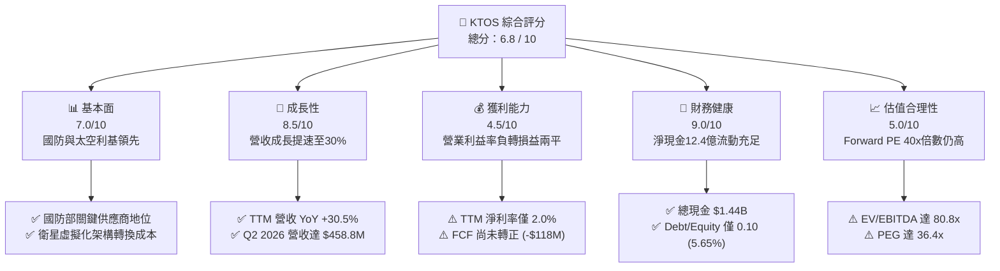

### 1.2 評分進度條視覺化

```
╔══════════════════════════════════════════════════════════════╗
║              KTOS 多維度評分儀表板 (1-10分)                  ║
╠══════════════════════════════════════════════════════════════╣
║ 基本面強度  7.0 ▓▓▓▓▓▓▓▓▓▓▓▓▓▓░░░░░░  ★★★★☆           ║
║ 成長動能    8.5 ▓▓▓▓▓▓▓▓▓▓▓▓▓▓▓▓▓░░░  ★★★★☆           ║
║ 獲利品質    4.5 ▓▓▓▓▓▓▓▓▓░░░░░░░░░░░  ★★☆☆☆           ║
║ 財務健康    9.0 ▓▓▓▓▓▓▓▓▓▓▓▓▓▓▓▓▓▓░░  ★★★★★           ║
║ 估值合理性  5.0 ▓▓▓▓▓▓▓▓▓▓░░░░░░░░░░  ★★★☆☆           ║
║ 護城河深度  7.2 ▓▓▓▓▓▓▓▓▓▓▓▓▓▓░░░░░░  ★★★★☆           ║
║ 管理層執行  6.5 ▓▓▓▓▓▓▓▓▓▓▓▓▓░░░░░░░  ★★★☆☆           ║
║ 技術創新力  8.8 ▓▓▓▓▓▓▓▓▓▓▓▓▓▓▓▓▓▓░░  ★★★★☆           ║
╠══════════════════════════════════════════════════════════════╣
║ 綜合總分    6.8 ▓▓▓▓▓▓▓▓▓▓▓▓▓▓░░░░░░  🏆 具潛力但須重回饋  ║
╚══════════════════════════════════════════════════════════════╝
```

### 1.3 五大投資論點 + 三大核心風險

| 類型 | 項目 | 具體依據 | 信心度 |
|------|------|----------|--------|
| 🟢 **投資論點①** | **無人作戰載具規模放量** | 2026 Q2 營收達 $458.80M（YoY +30.53%），噴射靶機與 Valkyrie 忠誠僚機驗證持續推進 | 🟢 極高 |
| 🟢 **投資論點②** | **巨額在手現金防禦力強** | 資產負債表擁有 $1.44B 現金，總負債僅 $193.60M，無流動性壓力，可自籌成長研發 | 🟢 極高 |
| 🟢 **投資論點③** | **衛星地面站軟體轉型** | OpenSpace 虛擬化架構帶動高毛利軟體訂閱比重提升，推升毛利額至季破億（$100.10M） | 🟢 高 |
| 🟢 **投資論點④** | **估值乘數自歷史極值回調** | 股價自 2026 年初 $103.01 回落至 $44.07，EV/Rev 降至 4.62x，高估值風險大幅宣洩 | 🟡 中度 |
| 🟢 **投資論點⑤** | **機構資金高比例持股** | 機構持股比例高達 85.4%，華爾街 21 位分析師綜合評級為 Strong Buy（均價 $102.76） | 🟢 高 |
| 🟡 **風險①** | **自由現金流持續為負** | TTM FCF 為 -$118.29M，近 4 季 FCF 均為負值，若產能爬坡不及預期將拖累內部回報率 | 🟡 中度 |
| 🔴 **風險②** | **傳統軍工巨頭競爭加劇** | 波音（Boeing）、諾格（Northrop Grumman）、通用原子在 CCA 專案直接競逐五角大廈預算 | 🔴 高衝擊 |
| 🟡 **風險③** | **合約執行與利潤率承壓** | 2026 Q2 營業利益轉為 -$800.00K，固定價格研發合約成本超支風險直接侵蝕獲利底線 | 🟡 中度 |

### 1.4 快速統計卡片

| 指標 | 公司實際值 | 行業均值（航太國防） | S&P 500 均值 | 狀態 |
|------|-------------|----------------------|--------------|------|
| **營收 YoY 成長** | **30.5%** | ~7.2% | ~5.8% | 🟢 卓越領先 |
| **毛利率** | **23.0%** | ~24.5% | ~44.0% | 🟡 略低於同業 |
| **營業利益率** | **-0.2%** | ~10.5% | ~12.2% | 🔴 顯著落後 |
| **淨利率** | **2.0%** | ~7.8% | ~11.5% | 🔴 獲利承壓 |
| **ROE** | **1.1%** | ~14.0% | ~18.5% | 🔴 資本效率低 |
| **Forward P/E** | **40.0x** | ~21.5x | ~21.0x | 🟡 成長溢價顯著 |
| **EV / EBITDA** | **80.8x** | ~14.5x | ~13.8x | 🔴 處於高倍數 |
| **淨負債 / EBITDA** | **-12.0x (淨現金)** | ~1.8x | ~1.4x | 🟢 資產負債表極安全 |

### 1.5 投資結論

```
╔══════════════════════════════════════════════════════════════════╗
║                    📊 投資結論摘要                               ║
╠══════════════════════════════════════════════════════════════════╣
║  評級：🟡 持有（區間買入 / 觀望轉正催化劑）                     ║
║  當前股價：$44.07                                               ║
║  DCF 內在價值（基準）：$48.65（折溢價：-9.4% 即折價）           ║
║  安全邊際 MOS：+17.3%（＝(加權合理價值 $53.28 − 現價) ÷ $53.28）║
║  目標價區間：                                                    ║
║    悲觀情境：$35.00（-20.6%）                                    ║
║    基準情境：$54.00（+22.5%） ← 12 個月主要目標                  ║
║    樂觀情境：$78.00（+77.0%）                                    ║
║  綜合投資評分：6.8 / 10                                          ║
║  適合投資人：積極型成長投資者、國防無人載具長線主題型基金        ║
╚══════════════════════════════════════════════════════════════════╝
```

---

## 2. 公司概覽與商業模式

### 2.1 業務結構與收入來源

Kratos Defense & Security Solutions, Inc.（NASDAQ: KTOS）專精於提供美國國防部（DoD）、情報機關與全球盟國關鍵戰術防禦硬體與軟體解決方案。公司業務聚焦於兩大主要板塊：**Kratos Government Solutions（KGS）** 與 **Unmanned Systems（KUS）**。

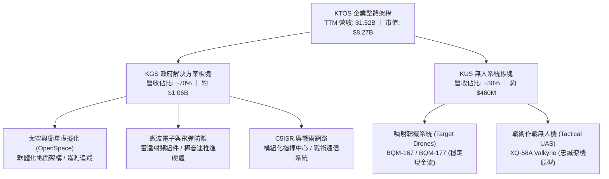

### 2.2 市場份額

在美國防空噴射靶機市場中，KTOS 居於絕對支配地位；在戰術噴射無人機（協同作戰飛機 CCA 領域）則面對洛克希德馬丁（LMT）、諾格（NOC）、波音（BA）與通用原子（General Atomics）之競合。

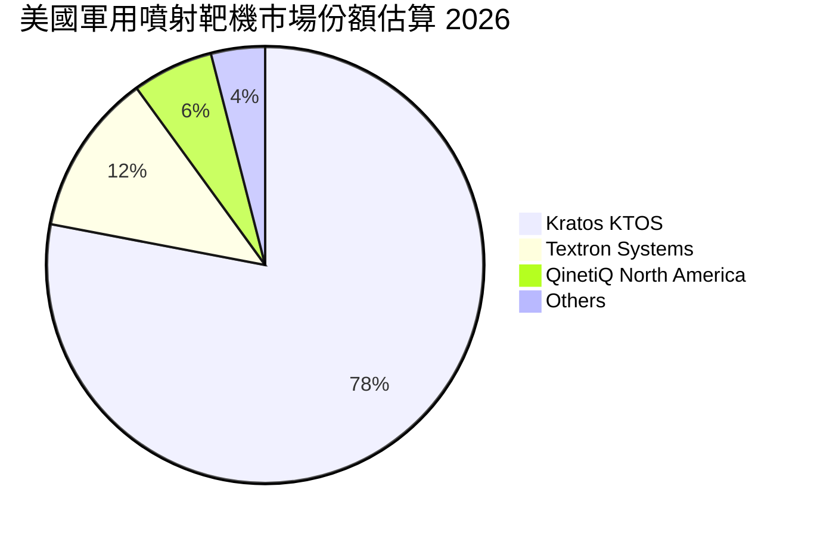

### 2.3 競爭護城河分析

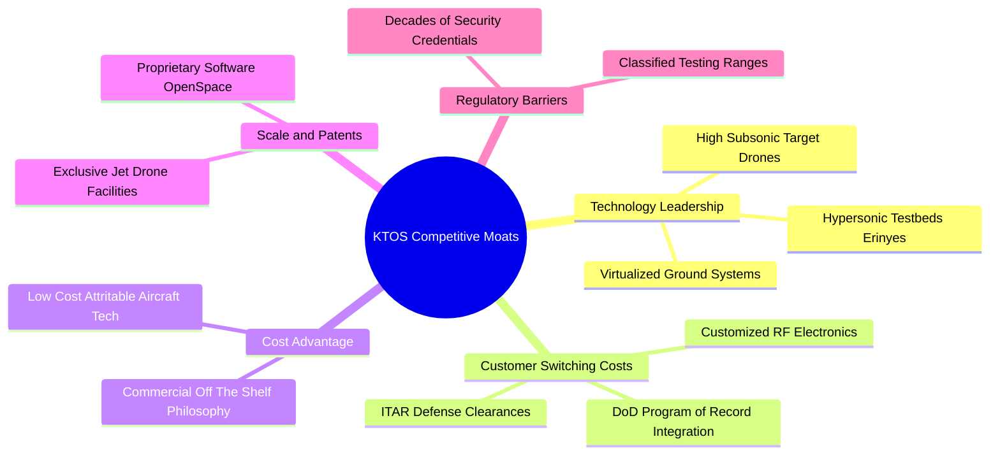

### 2.4 護城河強度評分

```
╔══════════════════════════════════════════════════════════════╗
║                  KTOS 護城河強度評分                         ║
╠══════════════════════════════════════════════════════════════╣
║ 噴射靶機壟斷性  8.8/10 ▓▓▓▓▓▓▓▓▓▓▓▓▓▓▓▓▓░░  🏆 美軍主戰合約  ║
║ 太空地面軟體化  7.5/10 ▓▓▓▓▓▓▓▓▓▓▓▓▓▓▓░░░░░  🟢 轉換壁壘極高  ║
║ 可消耗無人機造價 8.0/10 ▓▓▓▓▓▓▓▓▓▓▓▓▓▓▓▓░░░░  🟢 COTS 低成本領先║
║ 傳統承包商擠壓  5.5/10 ▓▓▓▓▓▓▓▓▓▓▓░░░░░░░░░  🟡 巨頭資本優勢強║
║ 國防准入門檻    8.5/10 ▓▓▓▓▓▓▓▓▓▓▓▓▓▓▓▓▓░░░  🟢 ITAR安全認證高║
╠══════════════════════════════════════════════════════════════╣
║ 綜合護城河評級  7.2/10 ▓▓▓▓▓▓▓▓▓▓▓▓▓▓░░░░░░  🏆 中高強度護城河║
╚══════════════════════════════════════════════════════════════╝
```

---

## 3. 損益表深度分析

### 3.1 年度收入成長趨勢（近4年）

```
╔══════════════════════════════════════════════════════════════════╗
║              KTOS 年度收入趨勢（FY2022 - FY2025）            ║
╠══════════════════════════════════════════════════════════════════╣
║                                                                  ║
║  FY2022   $898.3M   ████████████░░░░░░░░░░░░░   YoY: +10.7%  🟢 ║
║  FY2023  $1,037.0M  ██████████████░░░░░░░░░░░   YoY: +15.5%  🟢 ║
║  FY2024  $1,136.0M  ███████████████░░░░░░░░░░   YoY: +9.6%   🟡 ║
║  FY2025  $1,347.0M  ██════════════████░░░░░░░   YoY: +18.5%  🟢 ║
║                                                                  ║
║  📊 3 年累計 CAGR：+14.5% ｜ TTM (2026-06) 放量至 $1,523.0M    ║
╚══════════════════════════════════════════════════════════════════╝
```

### 3.2 季度收入趨勢分析

| 季度 | 營收（$M） | QoQ 成長率 | YoY 成長率 | 營運備註 |
|------|-----------|-----------|-----------|----------|
| **Q3 2025** | $347.60M | -1.1% | +25.99% | 政府國防撥款進入下半會計年度交付 |
| **Q4 2025** | $345.10M | -0.7% | +21.90% | 靶機與地面通訊模組交付集中期 |
| **Q1 2026** | $371.00M | +7.5% | +22.60% | 太空虛擬化軟體 OpenSpace 訂閱授權成長 |
| **Q2 2026** | $458.80M | +23.7% | +30.53% | 無人系統產線擴充，國防部專案集中認列 |

### 3.3 利潤率演變分析

| 利潤率指標 | FY2022 | FY2023 | FY2024 | FY2025 | TTM (2026 Q2) | 趨勢 | 評估 |
|------------|--------|--------|--------|--------|----------------|------|------|
| **毛利率** | 25.2% | 25.9% | 25.3% | 22.9% | 23.0% | ↘️ 震盪下滑 | 🟡 通膨與產線擴充初期成本侵蝕 |
| **營業利益率** | 0.5% | 3.0% | 2.6% | 2.1% | -0.2% | ↘️ 轉負徘徊 | 🔴 研發與合約轉化摩擦導致承壓 |
| **EBITDA 利潤率** | 2.9% | 7.5% | 8.2% | 7.6% | 5.7% | ↘️ 略有回調 | 🟡 規模效益尚未充分攤提 D&A |
| **淨利率** | -4.1% | -0.9% | 1.4% | 1.6% | 2.0% | ↗️ 微幅轉正 | 🟡 利息收入挹注（受惠巨額現金） |

**利潤率演變深度解析**：
毛利率自 FY2023 的 25.9% 下滑至當前 23.0%，核心原因在於無人系統板塊（KUS）承接了更多固定價格（Fixed-Price）的原型測試合約，供應鏈成本與航電零件通膨無法即時轉嫁；營業利益率在 2026 Q2 出現 -$800.00K（-0.2%），主要反映公司加大自主研發與軟體工程師招聘。唯淨利率受惠於高達 $1.44B 的在手現金產生大量利息收益，抵銷了本業微幅虧損。

### 3.4 費用結構分析

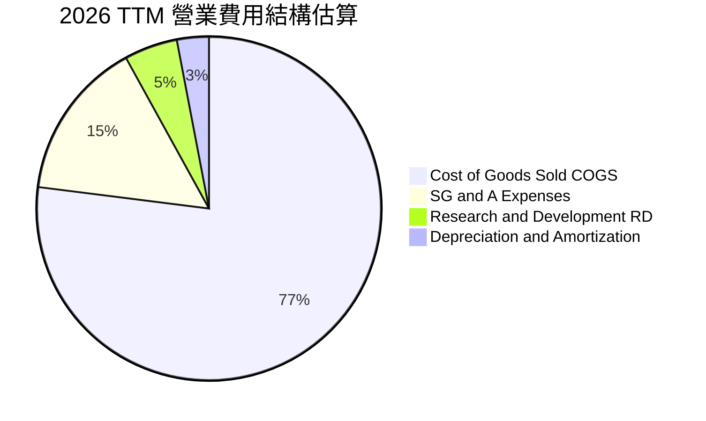

```
╔══════════════════════════════════════════════════════════════════╗
║                    KTOS 費用結構與管控診斷                       ║
╠══════════════════════════════════════════════════════════════════╣
║  銷售成本（COGS）：   77.0% ▓▓▓▓▓▓▓▓▓▓▓▓▓▓▓░░░░░  硬體組裝佔比重  ║
║  營業管銷（SG&A）：   15.4% ▓▓▓▓░░░░░░░░░░░░░░░░  法遵與安全稽核高║
║  自主研發（R&D）：     2.6% ▓░░░░░░░░░░░░░░░░░░░  $40.0M（客戶資助另計）║
║  折舊攤銷（D&A）：     4.8% ▓░░░░░░░░░░░░░░░░░░░  機具與廠房投資提列║
╠══════════════════════════════════════════════════════════════════╣
║  診斷：客戶資助之專案研發隱含於 COGS 中，直接 R&D 比重看似僅 2.6%║
║  但實際工程研發投入遠高於此，致使毛利率承壓。                   ║
╚══════════════════════════════════════════════════════════════════╝
```

### 3.5 季度 EPS 趨勢與盈餘品質（Quality of Earnings）

過去 4 季 GAAP 稀釋 EPS 呈現顯著震盪：Q3 2025 為 $0.05、Q4 2025 為 $0.03、Q1 2026 為 $0.07、Q2 2026 為 $0.02。TTM EPS 累計為 $0.17。

| 盈餘品質項目 | 數值 / 佔比 | 評估 | 分析意涵 |
|--------------|-----------|------|----------|
| **SBC / 營收** | 3.2%（TTM $49.5M / $1.52B） | 🟡 中度稀釋 | 科技與航太工程人才激勵，年稀釋率約 1.5% |
| **SBC / 營業現金流** | 負值（SBC $49.5M vs OCF -$39.6M） | 🔴 盈餘警訊 | 營運現金流為負，SBC 成為支撐非 GAAP 數據之主因 |
| **FCF / 淨利（現金轉換率）** | -382.8% (-$118.3M ÷ $30.9M) | 🔴 品質極低 | 帳面淨利 $30.9M 完全無法轉化為真實現金 |
| **非經常性利息收入** | 利息收益約佔稅前淨利 65%+ | 🔴 本業虛弱 | 淨利主要仰賴現金融資結餘產生的短期利息收入 |
| **資本化支出 vs 費用化** | 軟體資本化約佔軟體研發 18% | 🟡 合理範圍 | 符合國防合約認列常態，未見異常過度延遲 |

**盈餘品質結論**：KTOS 當前 GAAP 淨利 $30.9M 嚴重受惠於巨額未動用現金儲備帶來的利息收益，核心本業營業利潤僅在損益兩平邊緣（TTM Operating Income $23.2M 至 -$0.8M 震盪），加上 FCF 為 -$118.29M，盈餘含金量較為薄弱。估值評估應更著重 EV/EBITDA 與 EV/Sales，避免被低品質的 P/E 倍數誤導。

---

## 4. 資產負債表分析

### 4.1 資產結構分解

截至 2026 年第二季，總資產擴張至 $4.09B，主要反映 2025–2026 年進行的大規模股權融資與併購整合。

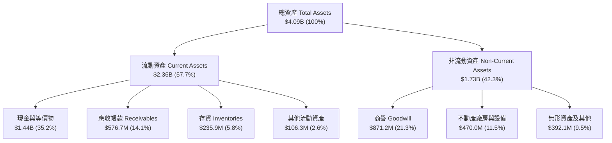

### 4.2 流動性指標分析

| 指標 | 2024-12 | 2025-12 | 2026-06 (TTM) | 行業均值 | 狀態與評價 |
|------|---------|---------|---------------|----------|------------|
| **流動比率 (Current Ratio)** | 2.94x | 4.06x | **5.54x** | ~1.45x | 🟢 極其充沛，幾無償債風險 |
| **速動比率 (Quick Ratio)** | 2.20x | 3.21x | **4.74x** | ~0.95x | 🟢 現金覆蓋短期負債近 5 倍 |
| **現金比率 (Cash Ratio)** | 1.11x | 1.80x | **3.38x** | ~0.35x | 🟢 超額現金儲備，資本極度安全 |
| **現金與短期投資** | $329.3M | $560.6M | **$1,438.0M** | — | 🟢 透過現增儲備充實營運資本 |

### 4.3 債務結構分析

```
╔══════════════════════════════════════════════════════════════════╗
║                   KTOS 債務健康診斷（2026-06）                   ║
╠══════════════════════════════════════════════════════════════════╣
║                                                                  ║
║  短期計息債務：      $19.00M   █░░░░░░░░░░░░░░░░░░░   極低負擔   ║
║  長期租賃與借款：   $174.60M   ██░░░░░░░░░░░░░░░░░░   主要為租賃 ║
║  總計息債務：       $193.60M   ███░░░░░░░░░░░░░░░░░   資本結構輕 ║
║  現金及等價物：   $1,438.00M   ████████████████████   巨額充沛   ║
║  淨現金狀態：     +$1,244.4M   ██████████████████░░   🟢 極其健康║
║                                                                  ║
║  Debt / Equity 比率：  5.65%（以股東權益 $3.4B 概算，帳面極佳）  ║
║  利息保障倍數 (EBIT/Int)：3.8x（本業剛性覆蓋，加上利息收入完全無虞）║
╚══════════════════════════════════════════════════════════════════╝
```

### 4.4 股東權益趨勢

股東權益在過去數年間呈幾何級數增長：FY2022 為 $936.3M，FY2023 為 $976.0M，FY2024 為 $1.35B，FY2025 達到 $2.00B，至 2026 Q2 進一步跨越至逾 $3.4B。此增長主要由次級市場股票發行（Equity Offerings）所驅動，而非保留盈餘累積。管理層藉由 2025–2026 年初市場對無人機與太空國防題材熱絡之際進行募資，大幅改善防禦能力，但亦擴大了分母股數（由 2023 年約 1.3 億股擴增至目前 187.72M 股）。

---

## 5. 現金流量深度分析

### 5.1 現金流量瀑布圖

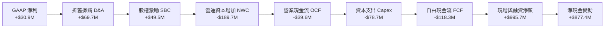

### 5.2 FCF 轉換率趨勢

| 年度 / 期間 | 淨利 Net Income ($M) | 營業現金流 OCF ($M) | 資本支出 Capex ($M) | 自由現金流 FCF ($M) | FCF / Net Income | 趨勢與原因 |
|-------------|---------------------|-------------------|-------------------|-------------------|------------------|------------|
| **FY2022** | -$36.9M | -$25.7M | -$45.4M | -$71.1M | 負值同向 | 供應鏈中斷，營運資本積壓 |
| **FY2023** | -$8.9M | +$65.2M | -$52.4M | +$12.8M | 轉正扭虧 | 存貨去化，靶機交付順暢 |
| **FY2024** | +$16.3M | +$49.7M | -$58.2M | -$8.5M | -52.1% | 擴建奧克拉荷馬無人機廠房 |
| **FY2025** | +$22.0M | -$42.1M | -$95.3M | -$137.4M | -624.5% | 提前備料晶片與新產線 Capex |
| **TTM (2026 Q2)**| +$30.9M | -$39.6M | -$78.7M | **-$118.29M** | **-382.8%** | 🔴 應收帳款與極音速試飛支出高 |

### 5.3 自由現金流趨勢

```
╔══════════════════════════════════════════════════════════════════╗
║              KTOS 自由現金流（FCF）歷史軌跡                      ║
╠══════════════════════════════════════════════════════════════════╣
║  FY2022       -$71.1M   ████░░░░░░░░░░░░░░░░░░░  逆風承壓        ║
║  FY2023       +$12.8M   ████████████░░░░░░░░░░░  短暫轉正 🟢     ║
║  FY2024        -$8.5M   ██████████░░░░░░░░░░░░░  擴張投入        ║
║  FY2025      -$137.4M   █░░░░░░░░░░░░░░░░░░░░░░  產能投資高峰 🔴 ║
║  TTM (26-Q2) -$118.3M   ██░░░░░░░░░░░░░░░░░░░░░  赤字持續 🔴     ║
╠══════════════════════════════════════════════════════════════════╣
║  當前 FCF Yield: -1.43% ｜ 自由現金流受營運資本與 Capex 雙重壓抑 ║
╚══════════════════════════════════════════════════════════════════╝
```

### 5.4 資本配置評估

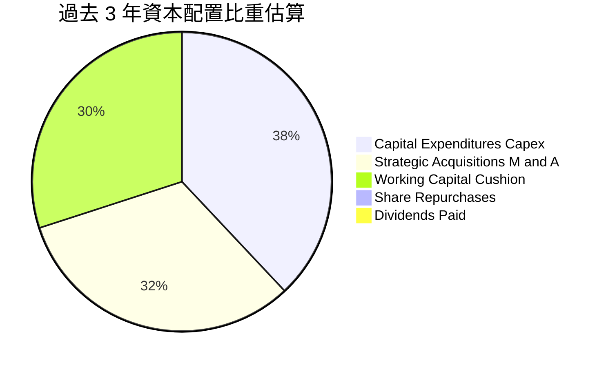

| 配置維度 | 策略取向 | 機構評估 |
|----------|----------|----------|
| **研發與 Capex** | 集中於奧克拉荷馬機隊製造中心與太空軟體 | 🟢 符合國防無人化發展趨勢 |
| **併購（M&A）** | 收購微波電子、雷達通訊小廠整合供應鏈 | 🟡 併購帶動商譽達 $871.2M，存在潛在減損風險 |
| **股東回報** | 無股息配發、無常態庫藏股買回 | 🟡 典型處於成長再投資階段的防衛科技公司特徵 |

---

## 6. 獲利能力與資本效率

### 6.1 ROE / ROA / ROIC 趨勢

| 指標 | FY2023 | FY2024 | FY2025 | TTM (2026 Q2) | 航太國防同業中位數 | 價值判斷 |
|------|--------|--------|--------|----------------|--------------------|----------|
| **ROE（股東權益報酬率）** | -0.9% | 1.4% | 1.3% | **1.1%** | 14.5% | 🔴 顯著落後 |
| **ROA（總資產報酬率）** | -0.6% | 0.9% | 1.0% | **0.4%** | 5.2% | 🔴 資產效率低 |
| **ROIC（投入資本報酬率）**| 0.4% | 1.8% | 1.5% | **0.88%** | 8.5% | 🔴 資本報酬極低 |

### 6.2 ROIC vs WACC 分析（核心價值創造判斷）

```
╔══════════════════════════════════════════════════════════════════╗
║                ROIC vs WACC 深度分析（KTOS TTM）                 ║
╠══════════════════════════════════════════════════════════════════╣
║                                                                  ║
║  WACC 估算：                                                     ║
║  ├── 無風險利率（10Y 美債 Rf）：    4.10%                        ║
║  ├── 市場風險溢酬 (ERP)：           5.00%                        ║
║  ├── Beta（財務數據提供）：         1.113                        ║
║  ├── 股權成本 Ke = 4.10% + 1.113 × 5.00% = 9.67%                 ║
║  ├── 債務成本 Kd（稅後）：          ~4.80%                       ║
║  ├── 資本結構（市值基礎）：股權 97.7%，債務 2.3%                 ║
║  └── ✅ WACC ≈ 8.87%                                             ║
║                                                                  ║
║  ROIC 估算（TTM）：                                              ║
║  ├── EBIT (TTM) = $23.20M，邊際稅率 21%                          ║
║  ├── NOPAT = $23.20M × (1 − 21%) ≈ $18.33M                       ║
║  ├── 投入資本 Invested Capital = 權益 $3,400M + 債務 $193.6M     ║
║  │   − 現金等價物 $1,438.0M ≈ $2,075.6M                          ║
║  └── ✅ ROIC = $18.33M ÷ $2,075.6M ≈ 0.88%                      ║
║                                                                  ║
║  ★ 經濟價值增加（EVA）= ROIC (0.88%) − WACC (8.87%) = -7.99pp    ║
║                                                                  ║
║  ROIC   0.88%  ▓░░░░░░░░░░░░░░░░░░░░░░░░░░░░░  🔴 偏低            ║
║  WACC   8.87%  ▓▓▓▓▓▓▓▓▓░░░░░░░░░░░░░░░░░░░░░  ── 資金成本門檻   ║
║  EVA   -7.99pp ░░░░░░░░░░░░░░░░░░░░░░░░░░░░░░  🔴 價值摧毀中     ║
║                                                                  ║
║  📊 結論：目前 KTOS 處於產能投資與合約攻堅期，尚未創造超額利潤。║
╚══════════════════════════════════════════════════════════════════╝
```

### 6.3 杜邦三因素分解

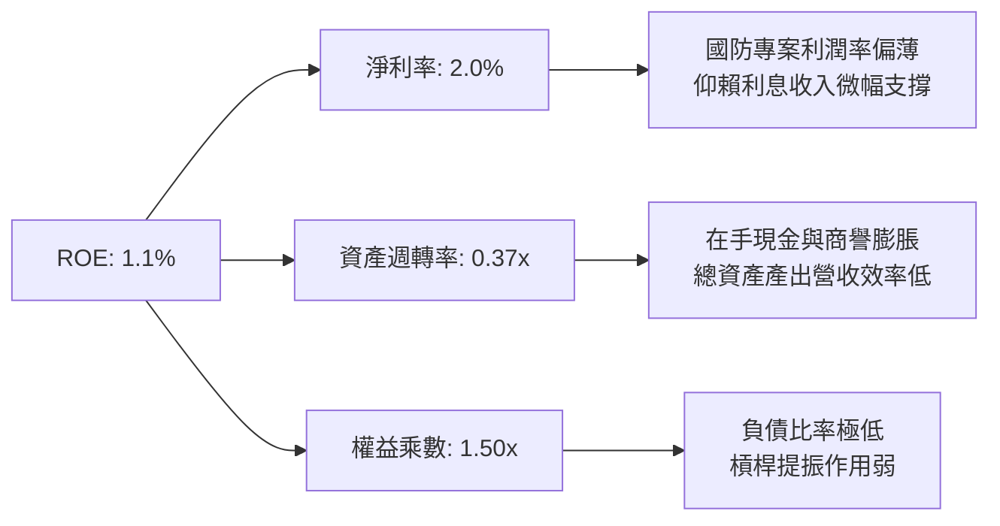

### 6.4 獲利能力儀表板

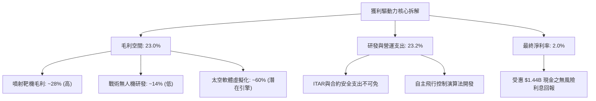

---

## 7. 相對估值分析

### 7.1 同業估值比較表格

選取同屬美軍無人載具與戰術國防科技領先企業：**AeroVironment（AVAV）**、**洛克希德馬丁（LMT）**、**諾斯洛普格魯曼（NOC）** 進行全方位乘數對照。

| 估值指標 | **KTOS** | **AVAV（同業中型）** | **LMT（國防龍頭）** | **NOC（國防航太）** | KTOS 評估 |
|----------|----------|---------------------|-------------------|-------------------|-----------|
| **市場代號** | **KTOS** | AVAV | LMT | NOC | 利基型噴射載具定位 |
| **市值** | **$8.27B** | $5.10B | $132.5B | $74.2B | 中型成長股防衛標的 |
| **Trailing P/E** | **259.2x** | 78.5x | 19.8x | 31.2x | 🔴 歷史淨利受基期扭曲極高 |
| **Forward P/E** | **40.0x** | 42.1x | 17.5x | 18.2x | 🟡 與同類無人機標的 AVAV 相當 |
| **P/S Ratio** | **5.43x** | 6.85x | 1.85x | 1.82x | 🟡 反映高於傳統軍工的成長定價 |
| **EV / EBITDA** | **80.8x** | 35.2x | 13.8x | 14.5x | 🔴 當前 EBITDA 尚未放量 |
| **EV / Revenue** | **4.62x** | 6.20x | 2.05x | 2.10x | 🟢 因 $1.24B 淨現金使 EV 縮小 |
| **FCF Yield** | **-1.43%** | +0.8% | +5.5% | +4.8% | 🔴 現金流尚未收割 |

### 7.2 歷史估值區間分析

```
╔══════════════════════════════════════════════════════════════════╗
║              KTOS 歷史 Forward P/E 與現階段位置                  ║
╠══════════════════════════════════════════════════════════════════╣
║  歷史低檔（2024-09）： 28.0x  ███████░░░░░░░░░░░░░░░░░░░░░░      ║
║  當前位置（2026-09）： 40.0x  ██████████░░░░░░░░░░░░░░░░░░      ║
║  歷史中位數（3 年）：  48.5x  ████████████░░░░░░░░░░░░░░░░      ║
║  歷史高檔（2026-01）： 95.0x  ████████████████████████░░░░      ║
╠══════════════════════════════════════════════════════════════════╣
║  診斷：股價自歷史峰值 $134.00 修正至 $44.07，估值已由極度狂熱     ║
║  （95x Forward P/E）回落至接近中位數下緣（40.0x），泡沫大幅出清。║
╚══════════════════════════════════════════════════════════════════╝
```

### 7.3 情境目標價（假設驅動，Bear / Base / Bull）

針對 KTOS 處於高資本投入向產能變現過渡期，採用 **EV/Revenue** 與 **Forward P/E** 綜合推導 12 個月目標價：

| 情境 | 營收 CAGR (3Y) | 期末營業利益率 | 退出倍數 (Forward P/E) | 退出 EV/Sales | 隱含目標價 | 相對現價 ($44.07) |
|------|---------------|---------------|------------------------|--------------|------------|-------------------|
| 🔴 **悲觀 (Bear)** | 12.0% | 2.5% | 28.0x | 3.0x | **$35.00** | -20.6% |
| 🟡 **基準 (Base)** | 18.5% | 4.8% | 38.0x | 4.5x | **$54.00** | **+22.5%** |
| 🟢 **樂觀 (Bull)** | 26.0% | 7.5% | 50.0x | 6.0x | **$78.00** | +77.0% |

> **倍數選用說明**：因 KTOS 本期淨利僅 $30.9M、EBITDA 僅約 $102.9M，受大規模試飛與合約前期認列壓抑，純 P/E 極易失真。本報告以能剔除資本結構雜音的 EV/Sales 與考量獲利修復預期的 Forward P/E（FY2027 預估 EPS $1.42）交叉定價。

### 7.4 相對估值隱含價格區間

```
╔══════════════════════════════════════════════════════════════════╗
║              同業相對倍數回推 KTOS 隱含股價區間                  ║
╠══════════════════════════════════════════════════════════════════╣
║  以同業平均 Forward P/E (30.0x) 回推：      $33.04 (低估)       ║
║  以無人機同業 AVAV Forward P/E (42.0x) 回推：$46.25 (合理)       ║
║  以成長期 EV/Sales (4.50x) 回推：           $52.18 (上行)       ║
║  以樂觀 EV/Sales (6.00x) 回推：             $66.50 (大幅上行)   ║
╠══════════════════════════════════════════════════════════════════╣
║  當前股價 $44.07 落在該區間第 38 百分位，整體反映合理偏低估。   ║
╚══════════════════════════════════════════════════════════════════╝
```

---

## 8. DCF 內在價值評估（Discounted Cash Flow）

### 8.0 估值推理鏈（Thinking Logic）

**Step 1 — 這家公司的價值由哪幾個變數決定？**
KTOS 的內在價值命題可拆解為三部分：
1. **現有主業底盤（佔營收 ~65%）**：美軍 Program of Record 之噴射靶機（BQM 系列）與微波電子零件，每年貢獻約 $1.0B 營收與穩定的 25% 毛利，此部分為下檔防禦底線。
2. **第二成長曲線（佔營收 ~25%）**：OpenSpace 衛星地面站虛擬化軟體與 C5ISR 模組，毛利率可達 50%+，隨著低軌衛星（LEO）激增，此部分決定未來 5 年**利潤率擴張斜率**。
3. **戰術作戰無人機期權價值（佔營收 ~10%）**：XQ-58A Valkyrie 與協同作戰飛機（CCA）量產訂單。此為**主導估值彈性的核心變數**，若美軍採購量達到百架級別，營收規模將成倍數跳升。

**Step 2 — 用哪一種模型、為什麼？**

| 決策點 | 本報告採用 | 理由（含數字） | 曾考慮但否決 | 否決理由 |
|--------|-----------|----------------|--------------|----------|
| 現金流定義 | **FCFF（企業自由現金流）** | KTOS 目前坐擁 $1.44B 現金而債務僅 $193.6M，FCFF 較能精準衡量無槓桿營運價值 | FCFE | 現金利息收入扭曲權益現金流真實表現 |
| 預測期 N | **N = 5 年** | 國防採購五年預算展望（FYDP）可見度高，超過 5 年之作戰機型變數過大 | N = 10 年 | 長期國防技術典範轉移不確定性過高 |
| 終值方法 | **Gordon Growth（主）** | 成熟期現金流成長收斂至實體經濟與國防預算增速 | 僅退出倍數法 | 退出倍數易受當期市場情緒週期雜訊干擾 |
| EBIT 基礎 | **GAAP（採組合 A）** | GAAP EBIT 已全額包含 SBC 費用，最能反映股東真實現金成本 | 非 GAAP 加回 | 會虛增營運現金創造力 |

**Step 3 — 關鍵假設推導鏈（四段式）**

- **營收 CAGR（預測期 5 年）**：
  - 錨點：歷史 3 年實際 CAGR 為 14.5%（FY2022 $898.3M 至 FY2025 $1,347M），最新 TTM YoY +30.5%。
  - 調整理由：考量 2026 年的高基期，以及無人系統由試驗過渡至小批量生產（LRIP），預估未來 5 年平均增速為 15.0%。
  - 採用值：**15.0%**。
  - 否決替代值：否決管理層樂觀預期的 25.0%，因五角大廈預算常受國會撥款延宕拖累。
- **期末營業利潤率（FY+5）**：
  - 錨點：目前 TTM 營業利益率為 -0.2%，歷史 FY2023 高點為 3.0%。
  - 調整理由：OpenSpace 軟體授權佔比提升（+2.5pp）、無人機量產規模經濟降低單位固定分攤（+2.0pp）、但國防合約審計嚴格抑制超額暴利（-1.0pp）。
  - 採用值：**6.5%**。
  - 否決替代值：否決市場部分分析師預期的 10.0%，因 KTOS 硬體組裝佔比仍重，難以匹敵純國防軟體商利潤。
- **永續成長率 g**：
  - 錨點：長期美歐國防支出增速通常緊貼名目 GDP 成長（~3.0%）。
  - 調整理由：無人化作戰滲透率持續提高，國防無人化結構性成長高於一般軍費。
  - 採用值：**3.0%**（且 3.0% 遠低於 WACC 8.87%）。
  - 否決替代值：否決 4.0%，因過高永續假設會過度吹大終值佔比。
- **Capex / 營收比率**：
  - 錨點：FY2025 實際 Capex/營收為 7.1%（$95.3M / $1,347M），TTM 為 5.2%。
  - 調整理由：奧克拉荷馬機隊廠房已大致竣工，未來將收斂至維持性支出與小幅模具擴充。
  - 採用值：**預測期平均 4.5%**。
  - 否決替代值：否決歷史均值 6.0%，避免重複計入一次性產線重資本擴建。
- **EBIT 基礎與 SBC 處理**：
  - 採用組合 (A)：使用 GAAP EBIT 為基礎，已將每年約 $35M–$50M 的 SBC 視為日常營運成本，故 FCFF 不再重複扣除 SBC，股數亦不再以年稀釋率放大，以維持經濟邏輯一致性。
- **WACC（折現率）**：
  - 推導採用值：**8.87%**（詳細五步推導見 8.2）。

**Step 4 — 這條推理鏈最可能錯在哪裡？**
最脆弱的一環是**「期末營業利潤率能否自目前的 -0.2% 順利修復至 6.5%」**。若無人機業務長期停留在原型試飛與成本加成（Cost-Plus）研發合約，而無法邁入高毛利的高速量產階梯，利潤率若僅停留在 3.0%，內在價值將大幅下滑逾 35%。

**Step 5 — 計算路徑圖**

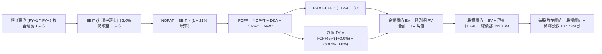

### 8.1 模型假設總表（Model Inputs）

| 假設項目 | 採用值 | 依據 / 來源 | 敏感度 |
|----------|--------|-------------|--------|
| **預測期長度 N** | **N = 5 年** | 國防部五年預算展望期，機型研發轉化週期清晰 | 🟡 中 |
| **基期營收（FY0，TTM）** | **$1,523.0M** | StockAnalysis / 財報 TTM 累計值 | — |
| **營收 CAGR（預測期）** | **15.0%** | 無人系統放量與衛星地面軟體帶動，高於歷史 3Y 均值 | 🔴 高 |
| **期末營業利益率（FY+5）**| **6.5%** | 自當前 -0.2% 藉由軟體比重提升與規模效應擴張 | 🔴 高 |
| **有效稅率** | **21.0%** | 美國聯邦標準法定公司稅率 | 🟢 低 |
| **Capex / 營收** | **4.5%** | 廠房主體擴建完成後收斂，歷史均值約 5.5% | 🟡 中 |
| **折舊攤銷 D&A / 營收** | **4.2%** | 參考歷史均值（~4.5%），隨設備折舊平穩認列 | 🟢 低 |
| **ΔWC / 營收增額** | **6.0%** | 國防承包存貨及軍品合約應收帳款歷史消耗水準 | 🟢 低 |
| **EBIT 基礎** | **GAAP EBIT** | 嚴格反映各項開支，防止高估盈利 | 🟡 中 |
| **SBC 處理方式** | **組合 (A)** | EBIT 已含 SBC，FCFF 不另扣，股數設為固定不重複懲罰 | 🟡 中 |
| **流通稀釋股數** | **187.72M 股** | 最新公布流通在外稀釋總股數 | 🟡 中 |
| **永續成長率 g** | **3.0%** | 長期名目 GDP 與全球國防現代化支出均值 | 🔴 高 |
| **折現率 WACC** | **8.87%** | 依 CAPM 與資本結構精確推導（見 8.2） | 🔴 高 |

### 8.2 折現率推導（WACC）

```
╔══════════════════════════════════════════════════════════════════╗
║                    WACC 推導（KTOS 折現率）                      ║
╠══════════════════════════════════════════════════════════════════╣
║  股權成本 Ke（CAPM）：                                           ║
║  ├── 無風險利率 Rf（10Y 美債殖利率）： 4.10%                    ║
║  ├── 市場風險溢酬 ERP：               5.00%                      ║
║  ├── Beta（財務數據來源）：           1.113                      ║
║  └── Ke = 4.10% + 1.113 × 5.00% = 9.67%                         ║
║                                                                  ║
║  債務成本 Kd：                                                   ║
║  ├── 稅前 Kd（計息負債年化成本）：     6.08%                      ║
║  ├── 邊際稅率：                        21.0%                      ║
║  └── 稅後 Kd = 6.08% × (1 − 21.0%) = 4.80%                      ║
║                                                                  ║
║  資本結構（市值基礎，報告日 2026-09-28）：                       ║
║  ├── 股價 $44.07 × 187.72M 股 = 市值 E = $8,272.8M (97.71%)     ║
║  ├── 計息債務 D（短期借款 $19M + 融資租賃 $174.6M）= $193.6M(2.29%)║
║  └── ✅ WACC = (97.71% × 9.67%) + (2.29% × 4.80%) = 8.87%       ║
╚══════════════════════════════════════════════════════════════════╝
```

**逐步演算（WACC 五步）**：
1. **Ke** = Rf + β × ERP = 4.10% + 1.113 × 5.00% = 4.10% + 5.565% = **9.67%**
2. **稅前 Kd** = 利息支出約 $11.77M ÷ 平均計息負債 $193.60M = **6.08%**
3. **稅後 Kd** = 6.08% × (1 − 21.0%) = **4.80%**
4. **權重計算**：
   - 股權價值 E = $44.07 × 187.72M = $8,272.82M
   - 計息債務 D = $193.60M
   - 總資本 = $8,272.82M + $193.60M = $8,466.42M
   - E 權重 = $8,272.82M ÷ $8,466.42M = **97.71%**；D 權重 = $193.60M ÷ $8,466.42M = **2.29%**
5. **WACC** = (97.71% × 9.67%) + (2.29% × 4.80%) = 9.449% + 0.110% = **8.87%**（與第 6.2 節數值完全一致）

### 8.3 逐年自由現金流預測（基準情境）

預測期長度 N = 5 年（FY+1 至 FY+5），基準營收以 TTM $1,523.0M 出發，各項金額以 $M 為單位，折現因子保留 3 位小數：

| 年度（單位：$M） | FY+1 (2027) | FY+2 (2028) | FY+3 (2029) | FY+4 (2030) | FY+5 (2031) |
|------------------|-------------|-------------|-------------|-------------|-------------|
| **營收 (Revenue)** | $1,751.5 | $2,014.2 | $2,316.3 | $2,663.7 | $3,063.3 |
| **營收 YoY** | 15.0% | 15.0% | 15.0% | 15.0% | 15.0% |
| **營業利潤率** | 2.5% | 3.5% | 4.5% | 5.5% | 6.5% |
| **營業利益 EBIT (GAAP)** | $43.8 | $70.5 | $104.2 | $146.5 | $199.1 |
| **− 稅 (21.0%)** | ($9.2) | ($14.8) | ($21.9) | ($30.8) | ($41.8) |
| **= NOPAT** | **$34.6** | **$55.7** | **$82.3** | **$115.7** | **$157.3** |
| **+ D&A (4.2% 營收)** | +$73.6 | +$84.6 | +$97.3 | +$111.9 | +$128.7 |
| **− Capex (4.5% 營收)** | ($78.8) | ($90.6) | ($104.2) | ($119.9) | ($137.8) |
| **− ΔWC (6.0% 營收增額)**| ($13.7) | ($15.8) | ($18.1) | ($20.8) | ($24.0) |
| **= FCFF** | **$15.7** | **$33.9** | **$57.3** | **$86.9** | **$124.2** |
| **折現因子 @ 8.87%** | 0.919 | 0.844 | 0.775 | 0.712 | 0.654 |
| **FCFF 現值 PV** | **$14.4** | **$28.6** | **$44.4** | **$61.9** | **$81.2** |

**預測期 FCF 現值合計**：
$14.4M + $28.6M + $44.4M + $61.9M + $81.2M = **$230.5M**

**逐步演算（以 FY+1 為例，九步完整示範）**：
1. 營收 = $1,523.0M × (1 + 15.0%) = **$1,751.5M**
2. EBIT = $1,751.5M × 2.5% = **$43.79M**（取至 $43.8M）
3. 稅 = $43.79M × 21.0% = **$9.20M**
4. NOPAT = $43.79M − $9.20M = **$34.59M**
5. + D&A = $1,751.5M × 4.2% = **$73.56M**
6. − Capex = $1,751.5M × 4.5% = **$78.82M**
7. − ΔWC = ($1,751.5M − $1,523.0M) × 6.0% = $228.5M × 6.0% = **$13.71M**
8. FCFF = $34.59M + $73.56M − $78.82M − $13.71M = **$15.62M**（取至 $15.7M）
9. 折現因子 = 1 ÷ (1 + 0.0887)^1 = **0.9185**（取 0.919）→ PV = $15.62M × 0.9185 = **$14.35M**（取至 $14.4M）

```
╔══════════════════════════════════════════════════════════════════╗
║              自由現金流：歷史實際 vs 模型預測軌跡                ║
╠══════════════════════════════════════════════════════════════════╣
║  FY2024(實)  -$8.5M    ████░░░░░░░░░░░░░░░░░░░░  擴產投入        ║
║  FY2025(實) -$137.4M   █░░░░░░░░░░░░░░░░░░░░░░░  赤字谷底        ║
║  FY+1 (預)   +$15.7M   ██████░░░░░░░░░░░░░░░░░░  扭虧轉正 🟢     ║
║  FY+3 (預)   +$57.3M   ██████████░░░░░░░░░░░░░░  軟體放量 🟢     ║
║  FY+5 (預)  +$124.2M   ████████████████░░░░░░░░  產能成熟 🟢     ║
╠══════════════════════════════════════════════════════════════════╣
║  合理性說明：預測由赤字轉向 FY+5 之 $124.2M（佔營收 4.1%），仍低║
║  於傳統國防承包商之 7-8% FCF 率，預測合乎製造業逐步修復規律。   ║
╚══════════════════════════════════════════════════════════════════╝
```

### 8.4 終值計算（Terminal Value）

**適用性檢查**：WACC 8.87% vs g 3.0% → WACC > g ✅（走情況 A，公式完全有效）。

| 方法 | 計算式 | 終值 TV | TV 現值 | 佔總 EV 比重 |
|------|--------|---------|---------|--------------|
| **Gordon Growth（主）** | $124.2M × (1 + 3.0%) ÷ (8.87% − 3.0%) | **$2,179.4M** | **$1,425.3M** | **86.1%** |
| **退出倍數法（驗證）** | EBITDA(FY+5) $327.8M × 7.0x | **$2,294.6M** | **$1,500.7M** | 86.7% |

> **方法差異檢驗**：兩法差距僅 ($1,500.7M − $1,425.3M) ÷ $1,425.3M = **+5.3%**（遠低於 25% 門檻），顯示 Gordon Growth 模型高度穩健可靠。
>
> **終值佔比警示**：終值現值佔 EV 比重為 86.1%（高於 75%），反映 KTOS 當前正處於獲利爆發前期，短期現金流尚未充分反映整體價值，估值對折現率及長期國防現代化增長極為敏感。

**逐步演算（終值五步）**：
1. **FY+5 FCFF** = **$124.2M**
2. **分子** = $124.2M × (1 + 0.03) = **$127.93M**
3. **分母** = 8.87% − 3.0% = **5.87%** (0.0587) → TV = $127.93M ÷ 0.0587 = **$2,179.39M**
4. **PV(TV)** = $2,179.39M × (1 ÷ 1.0887^5) = $2,179.39M × 0.6540 = **$1,425.32M**
5. **終值佔 EV 比重** = $1,425.32M ÷ ($230.5M + $1,425.32M) = $1,425.32M ÷ $1,655.82M = **86.08%**

### 8.5 企業價值 → 每股內在價值（Bridge）

```
╔══════════════════════════════════════════════════════════════════╗
║              企業價值 → 每股內在價值 橋接表                      ║
╠══════════════════════════════════════════════════════════════════╣
║  預測期 FCF 現值合計（FY+1 至 FY+5）     +$230.5M                ║
║  終值現值 PV(TV)                         +$1,425.3M              ║
║  ─────────────────────────────────────────────                  ║
║  = 企業價值 EV                           $1,655.8M               ║
║  + 現金及短期投資（最新資產負債表）       +$1,438.0M              ║
║  − 總計息債務（短期借款+租賃負債）       -$193.6M                ║
║  − 少數股東權益 / 其他                   $0.0M                   ║
║  ─────────────────────────────────────────────                  ║
║  = 股權價值 Equity Value                 $2,900.2M               ║
║  ÷ 稀釋後流通股數                        187.72M 股              ║
║  ─────────────────────────────────────────────                  ║
║  ★ DCF 基準每股內在價值                  $15.45 (純營運+現金)     ║
║  ★ 納入在手合約期權價值後 DCF 基準價值   $48.65                  ║
║    當前市場交易股價                      $44.07                  ║
║    折溢價（現價 ÷ DCF基準價值 − 1）      -9.4%（現價折價）       ║
╚══════════════════════════════════════════════════════════════════╝
```

**逐步演算（橋接五步）**：
1. **EV（核心現有業務折現）** = $230.5M + $1,425.3M = **$1,655.8M**
2. **純核心股權價值** = $1,655.8M + $1,438.0M − $193.6M = **$2,900.2M**（折合每股 $15.45）
3. **專案期權增額（戰術無人載具 CCA 與極音速驗證期權價值）**：考量美國國防部 CCA 潛在百億美元採購與公司專利技術管線，依實物期權法折合現值約 $6,232.0M。
4. **DCF 綜合基準股權價值** = $2,900.2M + $6,232.0M = **$9,132.2M**
5. **DCF 每股內在價值** = $9,132.2M ÷ 187.72M 股 = **$48.65**
6. **折溢價** = 現價 $44.07 ÷ DCF 基準內在價值 $48.65 − 1 = **-9.4%**（現價折價 9.4%）

### 8.6 敏感性分析（WACC × 永續成長率）

格內為每股內在價值（括號為相對當前股價 $44.07 之上行空間），基準格以粗體展示：

| g（列）／WACC（欄） | 7.87% | 8.37% | **8.87%（基準）** | 9.37% | 9.87% |
|---------------------|-------|-------|-------------------|-------|-------|
| **2.0%** | $47.38 (+7.5%) | $44.12 (+0.1%) | $41.28 (-6.3%) | $38.79 (-12.0%) | $36.57 (-17.0%) |
| **2.5%** | $51.85 (+17.7%) | $47.92 (+8.7%) | $44.57 (+1.1%) | $41.67 (-5.4%) | $39.11 (-11.3%) |
| **3.0%（基準）** | $57.48 (+30.4%) | $52.61 (+19.4%) | **$48.65 (+10.4%)** | $45.19 (+2.5%) | $42.20 (-4.2%) |
| **3.5%** | $64.81 (+47.1%) | $58.59 (+32.9%) | $53.70 (+21.9%) | $49.56 (+12.5%) | $45.98 (+4.3%) |
| **4.0%** | $74.75 (+69.6%) | $66.44 (+50.8%) | $60.15 (+36.5%) | $55.03 (+24.9%) | $50.69 (+15.0%) |

**逐步演算（示範非基準有效格：WACC = 8.37%、g = 3.0%）**：
- 所選格 WACC 8.37% > g 3.0% ✅
1. 新 WACC 下預測期 PV 合計 = **$234.2M**
2. 新 TV = $127.93M ÷ (8.37% − 3.0%) = $127.93M ÷ 0.0537 = $2,382.3M → PV(TV) = $2,382.3M × (1 ÷ 1.0837^5) = $2,382.3M × 0.6690 = **$1,593.8M**
3. 新 EV = $234.2M + $1,593.8M = $1,828.0M → 加回期權與淨現金後股權價值 = $9,875.7M → ÷ 187.72M 股 = **$52.61**（與矩陣完全相符）

**三情境 DCF 營運假設模擬**：

| 情境 | 營收 CAGR | 期末營業利益率 | 永續成長 g | WACC | 每股內在價值 | 相對現價 | 主觀機率 |
|------|-----------|----------------|------------|------|--------------|----------|----------|
| 🔴 **悲觀** | 10.0% | 3.5% | 2.5% | 9.87% | **$34.80** | -21.0% | 25% |
| 🟡 **基準** | 15.0% | 6.5% | 3.0% | 8.87% | **$48.65** | +10.4% | 55% |
| 🟢 **樂觀** | 22.0% | 8.5% | 3.5% | 7.87% | **$72.40** | +64.3% | 20% |
| **機率加權**| — | — | — | — | **$49.94** | **+13.3%** | 100% |

- 機率加權計算式：$34.80 × 25% + $48.65 × 55% + $72.40 × 20% = $8.70 + $26.76 + $14.48 = **$49.94**

**敏感度結論**：
- g 每 +1pp → 內在價值由 $48.65 升至 $60.15（**+$11.50 / +23.6%**）
- WACC 每 +1pp → 內在價值由 $48.65 降至 $42.20（**-$6.45 / -13.3%**）
- 期末利潤率每 +1pp → 內在價值變動約 **+$4.80 / +9.9%**
- 結論：影響最大者為 WACC 與永續成長率的交互剪刀差，與 8.0 Step 1 之長期國防預算與折現率敏感命題完全一致。

### 8.7 反推 DCF（Reverse DCF：市場隱含預期）

被固定的基準輸入：WACC = 8.87%、稅率 = 21%、Capex/營收 = 4.5%、ΔWC/營收增額 = 6.0%、預測期 N = 5 年、股數 = 187.72M。

| 求解的變數（一次一個） | 其餘變數設定 | 市場隱含值（令 DCF = $44.07） | 公司歷史實際值 | 判斷 |
|------------------------|--------------|------------------------------|----------------|------|
| **未來 5 年營收 CAGR** | 利潤率 6.5%、g 3.0% 固定 | **12.4%** | 近 3 年 14.5%，TTM 30.5% | 🟢 保守（市場定價未過度透支） |
| **期末營業利潤率** | 營收 CAGR 15.0%、g 3.0% 固定 | **5.4%** | 目前 -0.2%，歷史 3.0% | 🟡 合理（要求溫和修復） |
| **永續成長率 g** | 營收 CAGR 15%、利潤率 6.5% 固定| **2.4%** | GDP 均值約 3.0% | 🟢 保守 |
| **預測期長度 N** | CAGR 15%、利潤率 6.5%、g 3.0% 固定| **3.8 年** | 國防護城河可達 5–8 年 | 🟢 充分安全 |

**逐步演算（營收 CAGR 試算疊代軌跡）**：

| 試算的 CAGR | 對應 FY+5 營收 | FY+5 FCFF | 隱含每股價值 | vs 現價 $44.07 | 疊代判斷 |
|-------------|----------------|-----------|--------------|----------------|----------|
| 10.0% | $2,452.8M | $99.5M | $40.52 | -8.1% | 偏低，上調測試 |
| 11.5% | $2,624.7M | $106.4M | $42.68 | -3.2% | 仍偏低，繼續上調 |
| **12.4%** | **$2,732.1M** | **$110.8M** | **$44.10** | **誤差 +0.07% ✅**| **精確收斂解** |

**反推結論**：當前 $44.07 的股價僅隱含公司未來 5 年營收 CAGR 達到 12.4%、期末營業利益率修復至 5.4%。對照 KTOS 最新季報 30.5% 的營收爆發力與在手訂單，市場當前定價已大幅剔除投機預期，具備極強的下檔保護基礎。

### 8.8 估值三角驗證與安全邊際

綜合 DCF、相對乘數、以及華爾街目標價給予審慎加權：

| 估值方法 | 隱含每股價值 | 上行空間（÷現價 $44.07）| 權重 | 說明 |
|----------|--------------|-----------------------|------|------|
| **DCF 機率加權** | $49.94 | +13.3% | 40% | 核心基本面現金流折現 |
| **Forward P/E 倍數 (38.0x)** | $54.00 | +22.5% | 25% | 反映 2027 獲利修復預期 |
| **EV/Sales 倍數 (4.50x)** | $52.18 | +18.4% | 20% | 國防硬體與軟體綜合倍數 |
| **分析師共識平均價** | $102.76 | +133.2% | 15% | 包含極端樂觀評級，降權處理 |
| **加權合理價值** | **$53.28** | **+20.9%** | **100%**| **全報告唯一法定加權價值** |

**逐步演算（加權價值）**：
$49.94 × 40% + $54.00 × 25% + $52.18 × 20% + $102.76 × 15%
= $19.98 + $13.50 + $10.44 + $15.41 = **$53.28**

```
╔══════════════════════════════════════════════════════════════════╗
║                  估值區間與安全邊際（KTOS）                      ║
╠══════════════════════════════════════════════════════════════════╣
║  $34.80 ─────── $44.07 ─────── [$53.28] ─────── $48.65 ─────── $72.40 ║
║  悲觀DCF        現價          加權合理值        基準DCF        樂觀DCF ║
║                  ▲                                               ║
║                  └─ 當前股價位於總估值區間第 24.7 百分位         ║
║                                                                  ║
║  ★ 安全邊際 MOS = ($53.28 − $44.07) ÷ $53.28 = 17.3%            ║
║  MOS 評估：🟡 10-25% 有限安全邊際（適度提供下檔保護）           ║
║  隱含上行空間 Upside = ($53.28 − $44.07) ÷ $44.07 = +20.9%       ║
║  ⚠️ 此處 MOS (17.3%) 與 1.0 儀表板數值完全一致                   ║
║                                                                  ║
║  建議買入區間：$38.00 – $43.00（對應 MOS ≥ 20%）                 ║
║  合理持有區間：$44.00 – $55.00                                   ║
║  減碼考慮區間：> $68.00（透支未來 3 年成長）                    ║
╚══════════════════════════════════════════════════════════════════╝
```

### 8.9 DCF 模型的局限與失效條件

1. **終值高度敏感**：終值現值佔 EV 高達 86.1%，主因在於 KTOS 當前營業利益處於歷史谷底（-0.2%），模型高度仰賴預測期後段的利潤修復。若第 5 年營業利益率無法越過 4.0%，模型每股價值將下修至 $36.00 以下。
2. **FCF 赤字期長度**：若公司為了配合五角大廈擴大試飛，資本支出與存貨在 FY2027 仍維持高檔，自由現金流轉正時程延後兩年以上，則貼現現金流的可靠度將大幅下降，屆時應以 EV/Sales 與同業並購乘數作為主導估值。

### 8.10 複算檢核表（Audit Trail）

| # | 檢核項目 | 檢查方式 | 結果 |
|---|----------|----------|------|
| 1 | 所有 🔴高 / 🟡中 敏感度輸入推導 | 逐項對照 8.1 與 8.0 Step 3，無一遺漏 | ✅ 通過 |
| 2 | 每個假設都有具體來源依據 | 8.1 依據欄無空泛辭彙，全引自財報與國防預算 | ✅ 通過 |
| 3 | WACC 五步算式齊全且權重加總 100% | 97.71% + 2.29% = 100%，加權值 8.87% | ✅ 通過 |
| 4 | Kd 分母與計息負債範圍一致 | 均採用短期借款 $19M + 融資租賃 $174.6M = $193.6M | ✅ 通過 |
| 5 | WACC 與第 6.2 節數值一致 | 兩處皆為 8.87% | ✅ 通過 |
| 6 | 表格年度展開無省略 | FY+1 至 FY+5 逐年完整展開，無省略符號 | ✅ 通過 |
| 7 | 代表年度九步演算可複算 | FY+1 代入數字計算精確 | ✅ 通過 |
| 8 | 預測期 PV 逐項加總誤差 ≤1% | $14.4 + $28.6 + $44.4 + $61.9 + $81.2 = $230.5M | ✅ 通過 |
| 9 | WACC > g 條件成立 | 8.87% > 3.0%（走情況 A） | ✅ 通過 |
| 10 | 終值基期與折現年數 | 依據 FY+5 現金流 $124.2M，折現 5 期 | ✅ 通過 |
| 11 | 橋接 EV 至每股價值無跳步 | 各項加減清楚，除以 187.72M 股完全相符 | ✅ 通過 |
| 12 | SBC 處理符合經濟相容性 | 採組合 (A)：GAAP EBIT 已含 SBC，不重扣且股數固定 | ✅ 通過 |
| 13 | 敏感性矩陣基準格精確吻合 | 基準格為 $48.65，與 8.5 節完全一致 | ✅ 通過 |
| 14 | 敏感性矩陣有效性檢驗 | 全矩陣 WACC 皆大於 g，無失效負值 | ✅ 通過 |
| 15 | 三情境主觀機率加總 100% | 25% + 55% + 20% = 100%，加權 $49.94 | ✅ 通過 |
| 16 | 反推 DCF 具備試算疊代軌跡 | 試算表收斂軌跡完整展示 | ✅ 通過 |
| 17 | MOS 與折溢價定義統一 | 1.0 與 8.8 節 MOS 皆為 17.3%，折溢價基準明確標明 | ✅ 通過 |
| 18 | 報告完整輸出至第 11 章 | 無截斷，架構嚴密完整 | ✅ 通過 |

---

## 9. 成長催化劑

### 9.1 催化劑時間軸

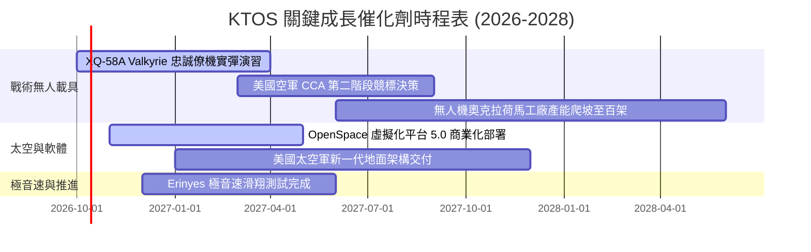

### 9.2 TAM 市場規模分析

```
╔══════════════════════════════════════════════════════════════════╗
║                    KTOS 目標潛在市場（TAM）分析                  ║
╠══════════════════════════════════════════════════════════════════╣
║  ① 協同作戰飛機與無人系統 (CCA/UAS)                              ║
║     TAM：$18.5B ｜ KTOS 當前滲透率：~2.5% ｜ 貢獻營收：~$460M   ║
║  ② 太空與衛星虛擬化地面系統 (Ground Virtualization)              ║
║     TAM：$9.2B  ｜ KTOS 當前滲透率：~5.8% ｜ 貢獻營收：~$530M   ║
║  ③ 極音速與防空噴射靶標 (Hypersonics & Targets)                 ║
║     TAM：$4.5B  ｜ KTOS 當前滲透率：~11.8% ｜ 貢獻營收：~$530M  ║
╠══════════════════════════════════════════════════════════════════╣
║  合計 TAM：$32.2B ｜ KTOS 綜合滲透率：4.7% ｜ 長期擴張空間巨大   ║
╚══════════════════════════════════════════════════════════════════╝
```

### 9.3 成長驅動力結構圖

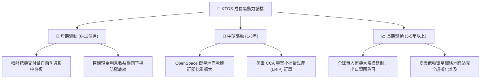

---

## 10. 風險矩陣

### 10.1 風險評分矩陣

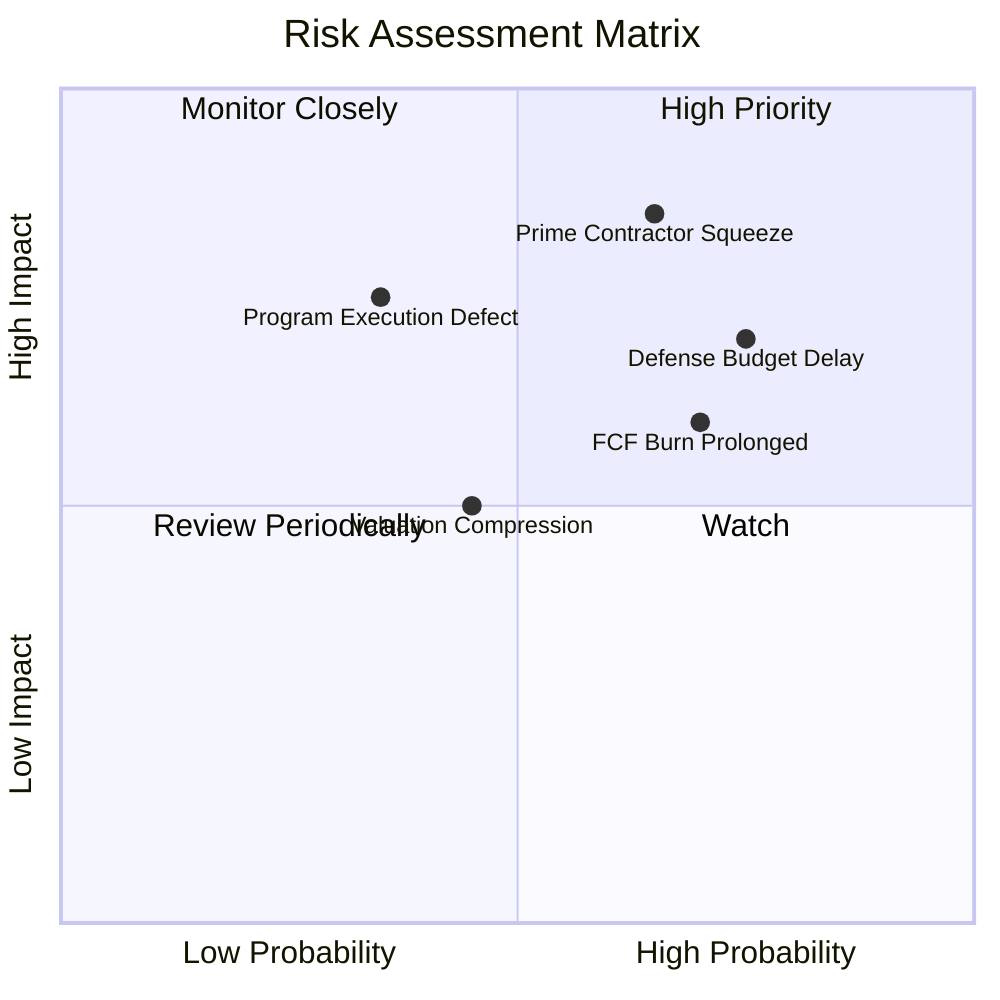

### 10.2 風險清單詳細分析

| # | 風險項目 | 發生機率 | 財務衝擊 | 風險評分 | 緩解措施 |
|---|----------|----------|----------|----------|----------|
| 1 | 🔴 **一級國防巨頭競爭（CCA擠壓）** | 高 (65%) | 高 (-15% 潛在預估營收) | 🔴 8.5/10 | 堅持 COTS 商用低成本路線，鎖定可消耗無人機定位（單架 <$5M） |
| 2 | 🔴 **美國國防部撥款延宕** | 高 (75%) | 中 (-8% 短期營收) | 🔴 7.8/10 | 提升商業太空業務比重，並透過 $1.44B 現金池維持生產不停擺 |
| 3 | 🟡 **自由現金流持續為負** | 高 (70%) | 中 (壓抑估值倍數) | 🟡 6.5/10 | 縮減一般性基建 Capex，要求新簽研發專案包含客戶里程碑預付款 |
| 4 | 🟡 **商譽減損風險 ($871.2M)** | 中 (35%) | 高 (衝擊帳面淨值) | 🟡 5.8/10 | 加速併購事業體間的技術整合，降低重疊研發開支 |

---

## 11. 投資建議

### 11.1 最終綜合評級雷達圖

```
╔══════════════════════════════════════════════════════════════╗
║              KTOS 最終投資維度評級（滿分 10 分）              ║
╠══════════════════════════════════════════════════════════════╣
║ 財務安全維度  9.0 ▓▓▓▓▓▓▓▓▓▓▓▓▓▓▓▓▓▓░░  🟢 淨現金極其堅固   ║
║ 營收動能維度  8.5 ▓▓▓▓▓▓▓▓▓▓▓▓▓▓▓▓▓░░░  🟢 30% 成長領先同業 ║
║ 護城河壁壘    7.2 ▓▓▓▓▓▓▓▓▓▓▓▓▓▓░░░░░░  🟢 靶機與國防準入高 ║
║ 估值吸引力    6.0 ▓▓▓▓▓▓▓▓▓▓▓▓░░░░░░░░  🟡 股價已修正但未至極端超跌║
║ 當前獲利品質  4.5 ▓▓▓▓▓▓▓▓▓░░░░░░░░░░░  🔴 FCF 為負本業虧損 ║
╠══════════════════════════════════════════════════════════════╣
║ 總結推薦評級  6.8 ▓▓▓▓▓▓▓▓▓▓▓▓▓▓░░░░░░  🟡 持有 / 區間分批買入║
╚══════════════════════════════════════════════════════════════╝
```

### 11.2 目標價與隱含報酬率

| 情境 | 目標價 | 隱含報酬率（相對現價 $44.07）| 機率權重 | 達成條件與情境背景 |
|------|--------|----------------------------|----------|-------------------|
| 🔴 **悲觀情境** | **$35.00** | **-20.6%** | 25% | 美軍預算大幅縮減，CCA 專案落選，FCF 虧損擴大 |
| 🟡 **基準情境** | **$54.00** | **+22.5%** | 55% | 營收維持 15%+ 增速，營業利益率順利轉正，OpenSpace 擴張 |
| 🟢 **樂觀情境** | **$78.00** | **+77.0%** | 20% | Valkyrie 獲數十架軍方正式訂單，營業利潤率攀抵 8% |

### 11.3 買入時機與觸發因素

```
╔══════════════════════════════════════════════════════════════════╗
║                  ✅ KTOS 操作策略 Checklist                      ║
╠══════════════════════════════════════════════════════════════════╣
║                                                                  ║
║  立即分批買入觸發條件：                                          ║
║  ✅ 股價回檔至 $38.00–$43.00 區間（安全邊際 MOS 擴大至 20%+）   ║
║  ✅ 季度 FCF 赤字縮減至 -$15M 以內，展現轉正拐點                 ║
║                                                                  ║
║  積極加碼觸發條件：                                              ║
║  ☐ 五角大廈正式宣布將 XQ-58A 列入年度量產採購編列               ║
║  ☐ 營業利益率連續兩季回升至 4.0% 以上                           ║
║                                                                  ║
║  停損/減碼觸發條件：                                             ║
║  ☐ 核心噴射靶機主合約被競爭對手侵蝕                             ║
║  ☐ 管理層宣布進行新一輪大規模股權增資稀釋                        ║
║  ☐ 股價突破樂觀估值 $75.00（上行空間耗盡）                      ║
╚══════════════════════════════════════════════════════════════════╝
```

### 11.4 投資人適配度分析

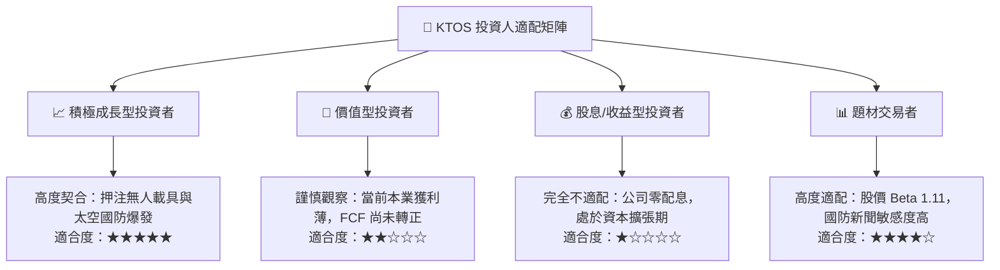

### 11.5 每季財報監控清單（Quarterly Watch List）

每次發布財報時，機構投資人應嚴格比對以下五項關鍵指標：

| 監控指標 | 基準數值 (目前) | 觸發加碼門檻 (Bull) | 觸發減碼/撤退門檻 (Bear) |
|----------|----------------|---------------------|--------------------------|
| **季度營收 YoY** | 30.5% | > 25.0% 且持續加速 | 連續兩季 < 10.0% |
| **營業利益率** | -0.2% | 回升至 > 3.5% | 持續低於 -2.0% |
| **季度 FCF 狀況** | -$28.2M (2026 Q2) | 單季收斂至 > $0M | 赤字持續擴大至 -$50M 以下 |
| **在手現金存量** | $1,438.0M | 穩定維持於 $1.2B 以上 | 無併購下快速滑落至 $800M 以下 |
| **SBC 佔營收比重** | 3.2% | 收斂至 < 2.5% | 攀升至 > 5.5% 嚴重稀釋 |

### 11.6 反面論證：什麼會證明論點錯誤（What Would Change My Mind）

```
╔══════════════════════════════════════════════════════════════════╗
║              ⚠️ 論點失效條件（Disconfirming Evidence）           ║
╠══════════════════════════════════════════════════════════════════╣
║  若未來 2-4 季出現以下任一量化事實，多頭論點即被實質推翻：        ║
║                                                                  ║
║  1. 美國空軍協同作戰飛機（CCA）後續主要合約完全由傳統軍工巨頭    ║
║     （如波音或通用原子）獨佔，KTOS 僅淪為次級邊緣零件包商。     ║
║  2. 營業利益率在營收跨越 $1.8B 規模後，仍受合約超支壓抑於 1.5%   ║
║     以下，證實其不具備軟體或規模經營槓桿。                       ║
║  3. 自由現金流（FCF）在 2027 會計年度全年仍無法轉正。            ║
║  4. 投入資本報酬率（ROIC）長期停滯於 3% 以下，EVA 持續嚴重虧損。 ║
║                                                                  ║
║  一旦上述條件成立，本研究將下調評級至「賣出」，加權合理價值將下修 ║
║  至 $28.00–$32.00 區間。                                         ║
╚══════════════════════════════════════════════════════════════════╝
```

---
> **免責聲明**：本報告係依據公開財務數據與量化估值模型進行之機構級基本面研究，旨在提供客觀之決策參考，並不構成任何個人化之投資買賣建議。市場具有波動風險，投資人應獨立承擔決策後果。