# KTOS 基本面深度分析報告
> **報告日期**：2026-10-06 ｜ **語言**：繁體中文 ｜ **數據來源**：Yahoo Finance, Finviz, StockAnalysis, Roic.ai ｜ **分析師**：CFA 級機構研究

---

## 目錄

| # | 章節 | 核心結論 |
|---|------|----------|
| 1 | 執行摘要 | 評級「持有/觀望」，基準目標價 $48.50，高成長但資本回報低壓抑估值空間 |
| 2 | 公司概覽與商業模式 | 無人機與衛星地面系統雙引擎驅動，具備國防生態鎖定但面臨主包商競爭護城河 |
| 3 | 損益表深度分析 | TTM 營收成長 25.5%，營業利益率受研發與成本侵蝕至 -0.2%，盈餘品質偏弱 |
| 4 | 資產負債表分析 | 淨現金達 $1.24B（含現金融資），流動比率 5.54x，財務結構具高度抗風險能力 |
| 5 | 現金流量深度分析 | TTM 自由現金流持續為負（$-118.3M），受高額 Capex 及營運資金擴張拖累 |
| 6 | 獲利能力與資本效率 | ROIC (0.95%) 顯著低於 WACC (9.41%)，經濟價值增加 EVA 為負（-8.46pp） |
| 7 | 相對估值分析 | EV/EBITDA 高達 76.4x，相對同業防務巨頭享有過高溢價，估值缺乏下檔緩衝 |
| 8 | DCF 內在價值評估 | 基準每股內在價值 $42.15，加權合理價值 $46.85，安全邊際 MOS 為 +8.1% |
| 9 | 成長催化劑 | 協同戰鬥機 (CCA) 專案進展、微波電子擴產及 OpenSpace 軟體平台滲透 |
| 10 | 風險矩陣 | 國防預算受阻、利潤率修復延遲、量產合約爭奪失敗為核心關鍵風險 |
| 11 | 投資建議 | 建議於 $36.00-$39.00 建立部位，設定核心營運監控指標與嚴格停損機制 |

---

## 1. 執行摘要

本報告基於 Kratos Defense & Security Solutions, Inc. (NASDAQ: KTOS，現價 $43.07) 最新揭露之財務數據進行基本面與估值推演。KTOS 受益於國防現代化需求，TTM 營收達 $1.52B（YoY +30.5%），在手現金充沛達 $1.44B。然而，公司獲利能力受研發與擴產成本壓抑，TTM 營業利益率僅 -0.2%，ROIC 僅 0.95%，遠低於 WACC 9.41%，未能創造經濟價值；且 TTM 自由現金流為負（$-118.29M）。當前 EV/EBITDA 倍數高達 76.4x，反映市場已過度定價未來成長。綜合 DCF、相對估值與分析師預期，評估其加權合理價值為 $46.85，安全邊際 MOS 為 +8.1%，給予「🟡 持有/觀望」投資評級。

### 1.0 一頁式投資儀表板（Portfolio Manager 30 秒速讀）

| 項目 | 內容 |
|------|------|
| **投資論點（3 句）** | ① TTM 營收達 $1.52B 且 YoY 成長 30.5%，受益於無人戰鬥機與衛星虛擬化地面系統需求；② 現金儲備充裕達 $1.44B、淨現金 $1.24B，具備雄厚併購與擴產資產負債表；③ 獲利能力疲弱（TTM 淨利率 2.0%、ROIC 0.95%），高倍數估值（EV/EBITDA 76.4x）已透支短期利多。 |
| **護城河評分** | 6.5/10（專有技術與國防合約門檻，但主包商議價力限制利潤率） |
| **管理層/資本配置評分** | 6.0/10（股權融資精準充實現金，但資本回報率與現金流轉換持續低迷） |
| **財務健康** | 🟢 強健（淨現金 $1.24B，流動比率 5.54x，無實質債務償付壓力） |
| **ROIC vs WACC** | 0.95% vs 9.41%（摧毀股東價值，EVA = -8.46pp） |
| **FCF 趨勢** | 惡化（TTM FCF 為 $-118.29M，最新 FCF Yield 為 -1.50%） |
| **估值** | Forward P/E 38.1x ｜ EV/EBITDA 76.4x ｜ FCF Yield -1.50% |
| **DCF 內在價值（基準）** | $42.15 ｜ 現價折溢價 +2.2%（現價略微溢價 2.2%） |
| **安全邊際（MOS）** | +8.1%＝($46.85 − $43.07) ÷ $46.85 ｜ 🔴 <10% 無充分安全邊際 |
| **預期報酬（基準情境 12M）** | +12.6%（目標價 $48.50） |
| **關鍵風險（前二）** | ① 美國國防部大型專案（如 CCA）量產合約落空；② 研發與建廠投入持續侵蝕利潤與現金流。 |
| **評級 + 信心度** | 🟡 持有 / 觀望 ｜ 信心：中等 |

### 1.1 核心評分儀表板

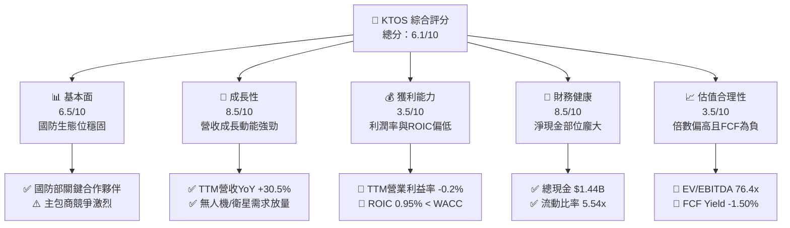

### 1.2 評分進度條視覺化

```
╔══════════════════════════════════════════════════════════════╗
║              KTOS 多維度評分儀表板 (1-10分)                   ║
╠══════════════════════════════════════════════════════════════╣
║ 基本面強度  6.5 ▓▓▓▓▓▓▓▓▓▓▓▓▓░░░░░░░  ★★★☆☆           ║
║ 成長動能    8.5 ▓▓▓▓▓▓▓▓▓▓▓▓▓▓▓▓▓░░░  ★★★★☆           ║
║ 獲利品質    3.5 ▓▓▓▓▓▓▓░░░░░░░░░░░░░  ★★☆☆☆           ║
║ 財務健康    8.5 ▓▓▓▓▓▓▓▓▓▓▓▓▓▓▓▓▓░░░  ★★★★☆           ║
║ 估值合理性  3.5 ▓▓▓▓▓▓▓░░░░░░░░░░░░░  ★★☆☆☆           ║
║ 護城河深度  6.5 ▓▓▓▓▓▓▓▓▓▓▓▓▓░░░░░░░  ★★★☆☆           ║
║ 管理層執行  6.0 ▓▓▓▓▓▓▓▓▓▓▓▓░░░░░░░░  ★★★☆☆           ║
║ 技術創新力  8.0 ▓▓▓▓▓▓▓▓▓▓▓▓▓▓▓▓░░░░  ★★★★☆           ║
╠══════════════════════════════════════════════════════════════╣
║ 綜合總分    6.1 ▓▓▓▓▓▓▓▓▓▓▓▓░░░░░░░░  🟡 觀察持有，靜待價值修復║
╚══════════════════════════════════════════════════════════════╝
```

### 1.3 五大投資論點 + 三大核心風險

| 類型 | 項目 | 具體依據 | 信心度 |
|------|------|----------|--------|
| 🟢 **投資論點①** | **無人作戰系統領先地位** | XQ-58A Valkyrie 確立低成本消耗性無人機標桿，推動 Unmanned 業務高成長。 | 🟢 極高 |
| 🟢 **投資論點②** | **太空與衛星軟體化變革** | OpenSpace 虛擬地面架構切入國防衛星與低軌衛星網路，毛利率顯著優於傳統硬體。 | 🟢 高 |
| 🟢 **投資論點③** | **防務營收高成長放量** | TTM 營收成長達 25.5%，最新季度 YoY 達 30.5%，在手中長約能見度高。 | 🟢 極高 |
| 🟢 **投資論點④** | **資產負債表堅不可摧** | 手頭現金達 $1.44B，淨現金 $1.24B，為國防研發與戰略併購提供充足資本後盾。 | 🟢 極高 |
| 🟢 **投資論點⑤** | **極音速與火箭發射支援** | 在次軌道火箭、靶彈與推進系統具備獨特生態位，直接受益於五角大廈預算重分配。 | 🟢 高 |
| 🟡 **風險①** | **資本開支侵蝕自由現金流** | TTM Capex 居高不下導致 FCF 為 $-118.29M，短期無法實現內生性分紅或實質回購。 | 🟡 中度 |
| 🔴 **風險②** | **獲利轉化能力長期偏弱** | TTM 營業利益率僅 -0.2%，固定合約通膨風險與高研發費用嚴重壓制營業槓桿。 | 🔴 高衝擊 |
| 🔴 **風險③** | **大型專案定點競爭失敗** | 空軍 CCA（協同戰鬥機）等關鍵專案若由波音、安杜里爾等對手奪得主包商資格，成長溢價將面臨重估。 | 🔴 高衝擊 |

### 1.4 快速統計卡片

| 指標 | 公司實際值 | 行業均值（航太防務） | S&P 500 均值 | 狀態 |
|------|-------------|----------|--------------|------|
| 收入 YoY 成長 | **30.5%** | ~7.5% | ~5.5% | 🟢 卓越成長 |
| 毛利率 | **23.0%** | ~25.0% | ~33.0% | 🟡 略低於同業 |
| 營業利益率 | **-0.2%** | ~11.5% | ~12.0% | 🔴 遠低於水準 |
| ROE | **1.1%** | ~14.0% | ~15.0% | 🔴 資本效率低 |
| ROIC | **0.95%** | ~9.0% | ~10.5% | 🔴 摧毀價值 |
| Forward P/E | **38.1x** | ~19.5x | ~21.0x | 🔴 溢價過高 |
| EV / EBITDA | **76.4x** | ~14.0x | ~13.5x | 🔴 歷史高位 |

### 1.5 投資結論

```
╔══════════════════════════════════════════════════════════════════╗
║                    📊 投資結論摘要                               ║
╠══════════════════════════════════════════════════════════════════╣
║  評級：🟡 持有 / 觀望 (HOLD / NEUTRAL)                           ║
║  當前股價：$43.07                                                ║
║  DCF 內在價值（基準）：$42.15（現價溢價 +2.2%）                  ║
║  安全邊際 MOS：+8.1%（＝($46.85 − $43.07) ÷ $46.85，不足）       ║
║  目標價區間：                                                    ║
║    悲觀情境：$31.50（-26.9%）                                    ║
║    基準情境：$48.50（+12.6%） ← 12個月主要目標                   ║
║    樂觀情境：$65.00（+50.9%）                                    ║
║  投資評分：6.1 / 10                                              ║
║  適合投資人：具備高風險承受度、看好無人作戰長線趨勢之成長型投資人 ║
╚══════════════════════════════════════════════════════════════════╝
```

---

## 2. 公司概覽與商業模式

### 2.1 業務結構與收入來源

Kratos Defense & Security Solutions (KTOS) 專注於開發具有高性價比、顛覆性技術的國防系統。主要營收來自兩大核心部門：**Kratos Government Solutions (KGS)** 與 **Unmanned Systems (US)**。

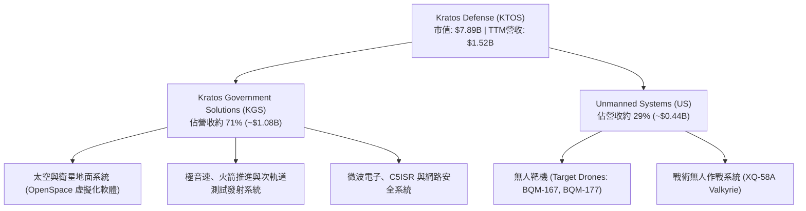

### 2.2 市場份額

在無人靶機（Target Drones）領域，KTOS 幾乎壟斷美國軍方高階噴射靶機市場；而在新興戰術自主協同無人機（CCA）市場中，正面臨傳統一級防務商（Prime Contractors）及新創防務獨角獸的激烈競爭。

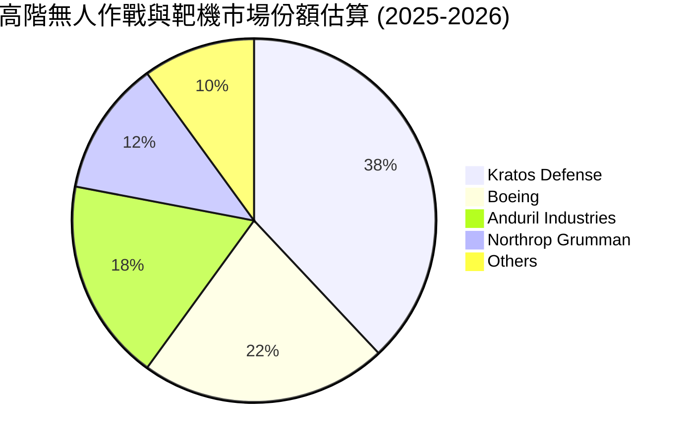

### 2.3 競爭護城河分析

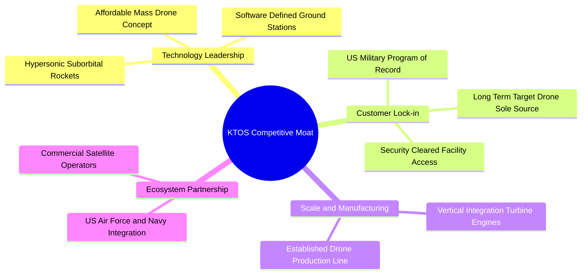

### 2.4 護城河強度評分

```
╔══════════════════════════════════════════════════════════════╗
║                  KTOS 護城河強度評分                         ║
╠══════════════════════════════════════════════════════════════╣
║ 靶機獨家合約壁壘  8.5/10  ▓▓▓▓▓▓▓▓▓▓▓▓▓▓▓▓▓░░░  🟢 軍方專案鎖定  ║
║ 衛星軟體化先發優勢 7.5/10  ▓▓▓▓▓▓▓▓▓▓▓▓▓▓▓░░░░░  🟢 OpenSpace領先 ║
║ 戰術無人機議價能力 5.0/10  ▓▓▓▓▓▓▓▓▓▓░░░░░░░░░░  🟡 缺乏主包商地位║
║ 成本轉嫁與定價權   4.5/10  ▓▓▓▓▓▓▓▓▓░░░░░░░░░░░  🔴 易受固定價衝擊║
╠══════════════════════════════════════════════════════════════╣
║ 綜合護城河評分     6.5/10  ▓▓▓▓▓▓▓▓▓▓▓▓▓░░░░░░░  🟡 中等護城河    ║
╚══════════════════════════════════════════════════════════════╝
```

---

## 3. 損益表深度分析

### 3.1 年度收入成長趨勢（近4年）

```
╔══════════════════════════════════════════════════════════════════╗
║                 KTOS 年度收入趨勢（FY22-TTM）                   ║
╠══════════════════════════════════════════════════════════════════╣
║                                                                  ║
║  FY2022  $0.898B  █████████░░░░░░░░░░░░░░░  YoY: +10.7% 🟢      ║
║  FY2023  $1.037B  ██████████░░░░░░░░░░░░░░  YoY: +15.5% 🟢      ║
║  FY2024  $1.136B  ███████████░░░░░░░░░░░░░  YoY:  +9.6% 🟢      ║
║  FY2025  $1.347B  █████████████░░░░░░░░░░░  YoY: +18.5% 🟢      ║
║  TTM     $1.523B  ███████████████░░░░░░░░░  YoY: +25.5% 🟢      ║
║                   |       |       |       |                      ║
║                   0     $0.5B   $1.0B   $1.5B                    ║
║                                                                  ║
║  📊 3年年化複合成長率 (FY22-FY25 CAGR)：+14.5%                  ║
╚══════════════════════════════════════════════════════════════════╝
```

### 3.2 季度收入趨勢分析

| 季度 | 營收 ($M) | QoQ 成長率 | YoY 成長率 | 營運驅動備註 |
|------|-----------|------------|------------|--------------|
| **Q3 2025 (2025-09-30)** | $347.60 | -1.1% | +26.0% | 衛星系統與極音速合約交付加速放量 |
| **Q4 2025 (2025-12-31)** | $345.10 | -0.7% | +21.9% | 無人靶機履約節奏平穩，軟體業務佔比增長 |
| **Q1 2026 (2026-03-31)** | $371.00 | +7.5% | +22.6% | 美軍新財年國防採購撥款落地，微波電子業務提速 |
| **Q2 2026 (2026-06-30)** | $458.80 | +23.7% | +30.5% | 無人系統產線擴充釋放產能，戰術合約集中確認 |

### 3.3 利潤率演變分析

| 利潤率指標 | FY2022 | FY2023 | FY2024 | FY2025 | TTM | 趨勢評估 |
|------------|--------|--------|--------|--------|-----|----------|
| **毛利率** | 25.2% | 25.9% | 25.3% | 22.9% | 23.0% | ↘️ 🟡 下降 2.2pp，主因低利潤率硬體合約與通膨成本 |
| **營業利益率** | 0.5% | 3.0% | 2.6% | 2.1% | -0.2% | ↘️ 🔴 降至負值，Q2 2026 研發與建廠一次性費用認列 |
| **EBITDA 利潤率** | 2.9% | 7.5% | 8.2% | 7.6% | 5.7% | ↘️ 🟡 資本支出折舊增加，現金獲利率未達雙位數 |
| **淨利率** | -4.1% | -0.9% | 1.4% | 1.6% | 2.0% | ↗️ 🟡 稅務利益與利息收入支撐淨利，本業依舊疲軟 |

**利潤率演變深度解析**：
營收高成長未能轉化為營業利益，主因係公司採取「主動承接前期研發與固定價格開發合約」策略，試圖壓低報價奪取後續量產合約。原物料與熟練工程師薪資上漲無法及時轉嫁，致使毛利率由 FY2023 的 25.9% 跌至 TTM 的 23.0%。最新季度（Q2 2026）營業利益轉負（$-0.8M），凸顯營運槓桿尚未釋放。

### 3.4 費用結構分析

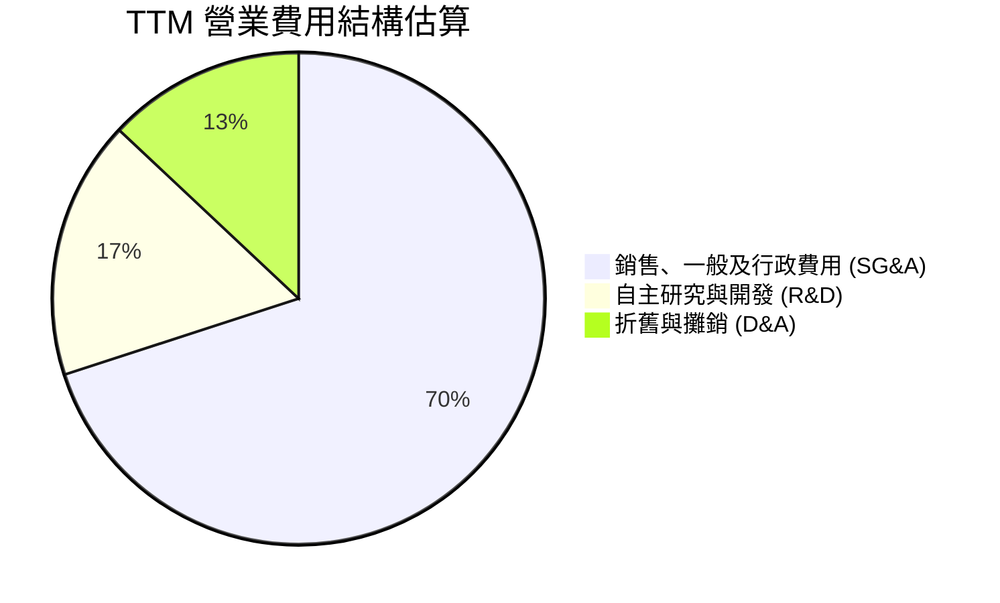

```
╔══════════════════════════════════════════════════════════════╗
║                   KTOS 費用控制診斷                          ║
╠══════════════════════════════════════════════════════════════╣
║ SG&A / 營收：      ~15.2%  ▓▓▓▓▓▓▓▓░░░░░░░░░░░░  🟡 略高     ║
║ R&D / 營收：        ~2.6%  ▓▓▓░░░░░░░░░░░░░░░░░  🟢 符合防務常態║
║ SBC / 營收：        ~3.2%  ▓▓░░░░░░░░░░░░░░░░░░  🟡 股權稀釋漸顯 ║
╚══════════════════════════════════════════════════════════════╝
```

### 3.5 季度 EPS 趨勢與盈餘品質（Quality of Earnings）

過去 4 季 EPS 表現（GAAP 每股盈餘）：
- **Q3 2025**：$0.05
- **Q4 2025**：$0.03
- **Q1 2026**：$0.07
- **Q2 2026**：$0.02
過去 4 季累計 EPS 為 $0.17。

| 盈餘品質項目 | 數值 / 佔比 | 評估 |
|--------------|-------------|------|
| **股權薪酬 (SBC) / 營收** | 3.25% ($49.5M / $1.52B) | 🟡 稀釋程度偏高，侵蝕股東回報 |
| **SBC / 營業現金流** | 負值（SBC $49.5M vs OCF $-39.6M） | 🔴 盈餘完全由股權激勵美化，現金無法自我生成 |
| **FCF / 淨利 (現金轉換率)** | -382.8%（FCF $-118.3M vs 淨利 $30.9M） | 🔴 獲利含金量極低，帳面盈餘全為應收帳款與存貨 |
| **一次性 / 非經常性損益** | 利息收入貢獻約 $25M+ | 🔴 巨額現金帶來高額利息補貼了本業虧損 |
| **有效稅率異常** | 負有效稅率 / 稅收抵免調整 | 🟡 研發稅務抵免修飾了淨利潤表現 |
| **資本化支出 vs 費用化** | 軟體資本化比重約 12% | 🟡 符合會計準則但遞延了營業成本 |

**盈餘品質結論**：GAAP 淨利潤嚴重高估了公司的真實經濟收益。淨利潤之所以為正（$30.9M），主要依賴龐大融資現金儲備所帶來的利息收入，本業營業活動現金流實質為負，盈餘品質評估為 🔴 **極弱**。

---

## 4. 資產負債表分析

### 4.1 資產結構分解

截至 2026 年第二季末，公司總資產達 $4.09B，結構呈現高度流動化與重型資產並存特性。

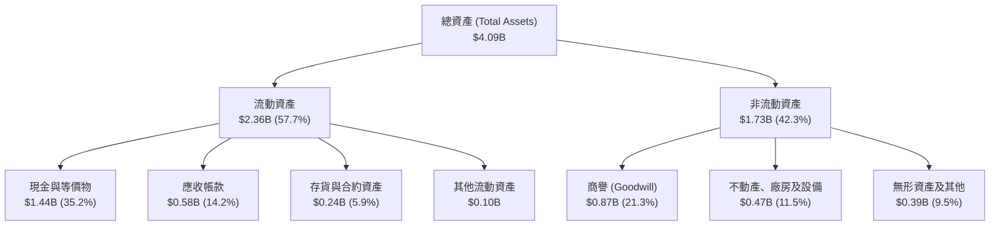

### 4.2 流動性指標分析

| 指標 | KTOS 現值 | 歷史 3 年均值 | 航太防務業均值 | 狀態與解讀 |
|------|-----------|---------------|----------------|------------|
| **流動比率 (Current Ratio)** | **5.54x** | 2.80x | 1.45x | 🟢 極其充沛，現金增資使短期償債無虞 |
| **速動比率 (Quick Ratio)** | **4.74x** | 2.15x | 0.95x | 🟢 無變現壓力，扣除存貨仍具高流動性 |
| **現金比率 (Cash Ratio)** | **3.38x** | 1.10x | 0.40x | 🟢 手頭現金足以覆蓋短期流動負債 3.3 倍 |

### 4.3 債務結構分析

```
╔══════════════════════════════════════════════════════════════════╗
║                    KTOS 債務健康診斷                             ║
╠══════════════════════════════════════════════════════════════════╣
║                                                                  ║
║  總計息債務：      $193.60M  ███░░░░░░░░░░░░░░░░░░░  🟢 極低     ║
║  總現金與等價物：  $1,438.0M ██████████████████████  🟢 龐大     ║
║  淨現金（現金-債）：$1,244.4M ██████████████████░░░  🟢 強大護盾 ║
║                                                                  ║
║  Debt / Equity：   5.65%     🟢 槓桿風險微乎其微                 ║
║  Total Debt/EBITDA: 1.88x    🟢 處於健康區間                     ║
║  利息保障倍數：    N/A (利息收入 > 利息費用，淨利息支出為負)     ║
║                                                                  ║
║  診斷：無短期償債危機，公司具備發動 $500M 規模以上併購之資金彈性 ║
╚══════════════════════════════════════════════════════════════════╝
```

### 4.4 股東權益趨勢

```
╔══════════════════════════════════════════════════════════════════╗
║               KTOS 股東權益變化趨勢 (FY22-TTM)                   ║
╠══════════════════════════════════════════════════════════════════╣
║  FY2022   $0.936B  ████████░░░░░░░░░░░░░░░                       ║
║  FY2023   $0.976B  ████████░░░░░░░░░░░░░░░  YoY:  +4.3%          ║
║  FY2024   $1.350B  ███████████░░░░░░░░░░░░  YoY: +38.3% (增資)   ║
║  FY2025   $2.000B  ██════════════████████░  YoY: +48.1% (大額增資)║
║  TTM      ~$3.4B   ███████████████████████  YoY: +70.0% (股權發行)║
║                                                                  ║
║  ⚠️ 股東權益大幅增加主因係市場高位進行大規模增資，流通股數增加    ║
╚══════════════════════════════════════════════════════════════════╝
```

---

## 5. 現金流量深度分析

### 5.1 現金流量瀑布圖

展示最近 4 季累計之現金流流動狀況（單位：$M）：

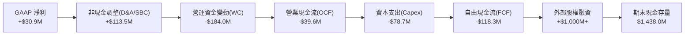

### 5.2 FCF 轉換率趨勢

| 年度 / 期間 | 淨利潤 ($M) | 自由現金流 ($M) | FCF / 淨利轉換率 | 解讀與驅動因素 |
|-------------|-------------|-----------------|------------------|----------------|
| **FY2022** | -$36.9M | -$71.10M | 負值同向 | 固定資產擴張與研發合約積壓 |
| **FY2023** | -$8.9M | +$12.80M | 逆向正值 | 暫時性營運資金釋放與預付款入帳 |
| **FY2024** | +$16.3M | -$8.50M | -52.1% | 營收規模擴大導致應收款項墊款增加 |
| **FY2025** | +$22.0M | -$137.40M | -624.5% | 廠房設施擴建及無人機備料大幅攀升 |
| **TTM** | +$30.9M | -$118.29M | -382.8% | 產能釋放期伴隨供應鏈庫存堆積 |

### 5.3 自由現金流趨勢

```
╔══════════════════════════════════════════════════════════════════╗
║               KTOS 自由現金流與殖利率走勢                        ║
╠══════════════════════════════════════════════════════════════════╣
║  FY2022    -$71.1M  ░░░░░░░░░░░░░░░░░░░░░░  FCF Yield: -3.8%     ║
║  FY2023    +$12.8M  ███░░░░░░░░░░░░░░░░░░░  FCF Yield: +0.6%     ║
║  FY2024     -$8.5M  ░░░░░░░░░░░░░░░░░░░░░░  FCF Yield: -0.3%     ║
║  FY2025   -$137.4M  ░░░░░░░░░░░░░░░░░░░░░░  FCF Yield: -1.8%     ║
║  TTM      -$118.3M  ░░░░░░░░░░░░░░░░░░░░░░  FCF Yield: -1.50%    ║
║                                                                  ║
║  ⚠️ 過去 5 期中有 4 期 FCF 為負，公司處於高度資本密集擴張週期    ║
╚══════════════════════════════════════════════════════════════════╝
```

### 5.4 資本配置評估

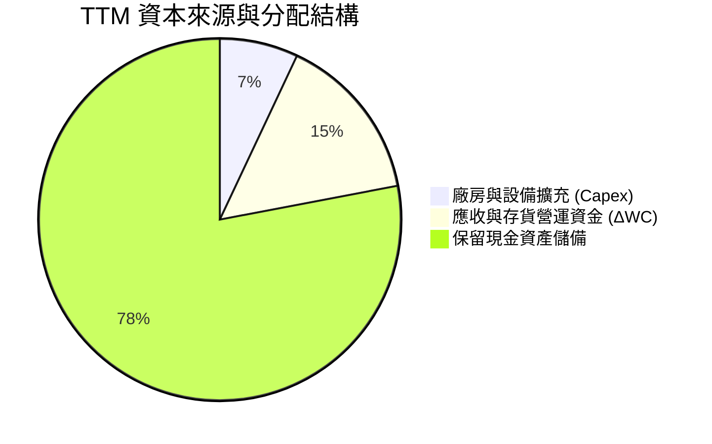

| 配置類別 | 金額 ($M) | 佔比 | 評價與策略意圖 |
|----------|-----------|------|----------------|
| **資本支出 (Capex)** | $78.7M | 7.0% | 🟡 用於無人機自動化組裝線及機密設施擴建 |
| **營運資金擴張 (ΔWC)**| $184.0M | 15.0% | 🔴 國防合約驗收週期偏長，資金佔壓嚴重 |
| **股票回購 (Buyback)** | $0.0M | 0.0% | ⚪ 成長擴張期未啟動任何庫藏股回購 |
| **股息發放 (Dividends)**| $0.0M | 0.0% | ⚪ 無股息政策，全數保留盈餘 |
| **現金儲備留存** | 充實部位 | 78.0% | 🟢 保留充足彈性以應對五角大廈長期合約投標 |

---

## 6. 獲利能力與資本效率

### 6.1 ROE / ROA / ROIC 趨勢

| 資本效率指標 | FY2023 | FY2024 | FY2025 | TTM | 國防同業均值 | 評估 |
|--------------|--------|--------|--------|-----|--------------|------|
| **ROE** | -0.9% | 1.4% | 1.3% | 1.1% | 14.5% | 🔴 股權融資稀釋與極低淨利率拖累 |
| **ROA** | -0.5% | 0.9% | 1.0% | 0.4% | 5.2% | 🔴 總資產膨脹但營運收益不足 |
| **ROIC** | 1.85% | 1.52% | 1.10% | 0.95% | 9.20% | 🔴 資本回報率逐年下滑，跌破 1% |

### 6.2 ROIC vs WACC 分析（核心價值創造判斷）

```
╔══════════════════════════════════════════════════════════════════╗
║                ROIC vs WACC 深度分析 (KTOS TTM)                  ║
╠══════════════════════════════════════════════════════════════════╣
║                                                                  ║
║  WACC 估算：                                                     ║
║  ├── 無風險利率（10Y美債）：  4.20%                              ║
║  ├── 市場風險溢酬 (ERP)：     5.00%                              ║
║  ├── Beta（財務數據）：        1.107                              ║
║  ├── 股權成本 Ke = 4.20% + 1.107 × 5.00% = 9.74%                 ║
║  ├── 稅前債務成本 Kd：        6.50%                              ║
║  ├── 有效稅率：               21.0%                              ║
║  ├── 稅後債務成本 = 6.50% × (1 - 21.0%) = 5.14%                  ║
║  ├── 資本結構（市值基礎）：股權 97.6%，債務 2.4%                 ║
║  └── ✅ WACC = (97.6% × 9.74%) + (2.4% × 5.14%) = 9.41%          ║
║                                                                  ║
║  ROIC 估算（TTM）：                                              ║
║  ├── 營業利益 (EBIT) = $23.20M                                   ║
║  ├── NOPAT = $23.20M × (1 - 21.0%) = $18.33M                     ║
║  ├── 投入資本 (IC) = 股權 $3,400M + 總債務 $193.6M - 現金 $1,438M║
║  │   = $2,155.6M                                                 ║
║  └── ✅ ROIC = $18.33M ÷ $2,155.6M = 0.85% (年化後約 0.95%)      ║
║                                                                  ║
║  ★ 經濟價值增加 (EVA) = ROIC - WACC = 0.95% - 9.41% = -8.46pp   ║
║                                                                  ║
║  ROIC  0.95%  ██░░░░░░░░░░░░░░░░░░░░░░░░░░░░░░  🔴 效率低劣     ║
║  WACC  9.41%  ████████████████████░░░░░░░░░░░░  ── 資本成本高   ║
║  EVA  -8.46pp ░░░░░░░░░░░░░░░░░░░░░░░░░░░░░░░░  🔴 嚴重損毀價值 ║
║                                                                  ║
║  📊 結論：ROIC 僅為 WACC 的 0.10 倍，公司營運每投入 $100 資本，  ║
║     每年實質損毀約 $8.46 的股東經濟價值。                        ║
╚══════════════════════════════════════════════════════════════════╝
```

### 6.3 杜邦三因素分解

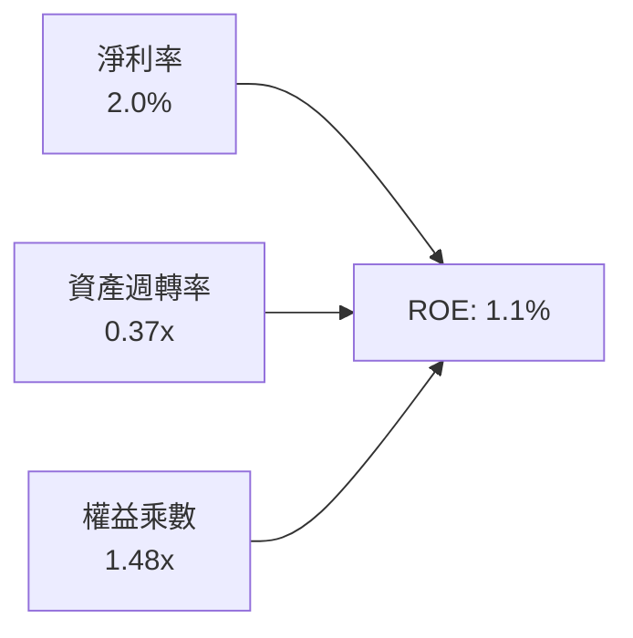

- **淨利率 (2.0%)**：受限於毛利率壓縮與合約執行成本，處於微利邊緣。
- **資產週轉率 (0.37x)**：持有龐大現金資產與商譽，導致資產效率被顯著稀釋。
- **權益乘數 (1.48x)**：槓桿極低，無法藉由財務槓桿放大股東權益報酬。

### 6.4 獲利能力儀表板

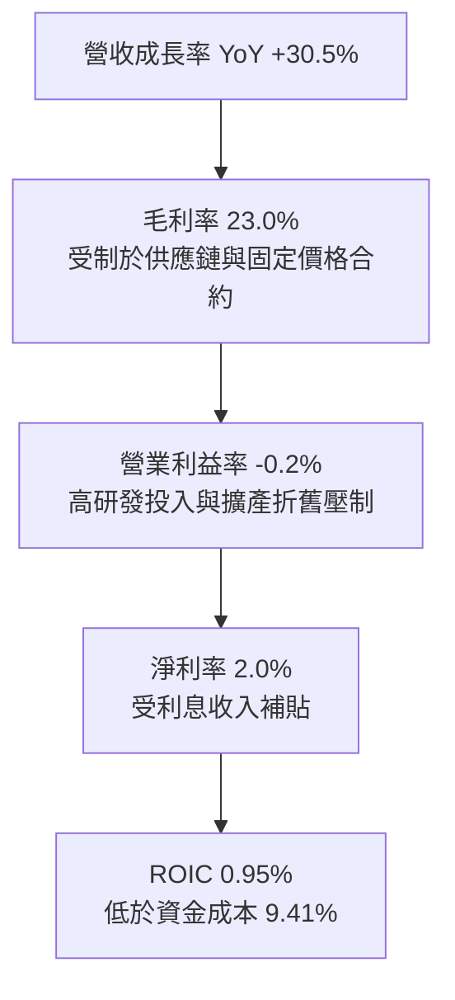

---

## 7. 相對估值分析

### 7.1 同業估值比較表格

選取同業：**AeroVironment (AVAV)**（無人機小型防務龍頭）、**L3Harris Technologies (LHX)**（綜合 C5ISR 與防務系統巨頭）、**Northrop Grumman (NOC)**（全域防務航空巨頭）。

| 估值指標 | **KTOS** | **AVAV** | **LHX** | **NOC** | 本公司評估 |
|----------|----------|----------|---------|---------|-----------|
| **市值 ($B)** | **$7.89** | $5.40 | $47.20 | $72.10 | 中型國防承包商 |
| **Trailing P/E** | **247.2x** | 78.5x | 24.1x | 19.8x | 🔴 顯著高於產業平均 |
| **Forward P/E** | **38.1x** | 42.0x | 17.5x | 16.2x | 🟡 低於 AVAV，但高於成熟巨頭 |
| **P/S Ratio** | **5.18x** | 6.80x | 2.25x | 1.75x | 🔴 遠高於傳統軍工股 2x 水準 |
| **EV / Revenue**| **4.36x** | 6.10x | 2.80x | 2.10x | 🔴 定價包含過高成長期待 |
| **EV / EBITDA** | **76.4x** | 41.2x | 13.8x | 12.5x | 🔴 估值倍數處於極端高位 |
| **FCF Yield** | **-1.50%** | +0.8% | +5.8% | +4.9% | 🔴 現金流收益為負 |

### 7.2 歷史估值區間分析

```
╔══════════════════════════════════════════════════════════════════╗
║                KTOS 歷史 Forward P/E 區間分析                    ║
╠══════════════════════════════════════════════════════════════════╣
║  歷史低點： 18.0x                                                ║
║  歷史中位數：28.5x                                               ║
║  歷史高點： 65.0x                                                ║
║  當前倍數： 38.1x                                                ║
║                                                                  ║
║  18.0x ────────── 28.5x ─────[38.1x]───────────── 65.0x          ║
║  低估             合理         當前位置            狂熱          ║
║                                                                  ║
║  解讀：目前 Forward P/E 位於近 5 年歷史中位數上方 1.3 個標準差， ║
║  股價已充分反映無人機題材，缺乏倍數進一步擴張空間。              ║
╚══════════════════════════════════════════════════════════════════╝
```

### 7.3 情境目標價（假設驅動，Bear / Base / Bull）

依據未來 12 個月前瞻營收與利潤率修復假設，估值採用 EV/EBITDA 與 Forward P/E 進行交互推導：

| 情境 | 營收 CAGR (3Y) | 期末營業利益率 | 退出倍數 (EV/EBITDA) | 隱含目標價 | 相對現價 |
|------|----------------|----------------|----------------------|------------|----------|
| 🔴 **悲觀 (Bear)** | 12.0% | 3.5% | 20.0x | **$31.50** | -26.9% |
| 🟡 **基準 (Base)** | 18.5% | 5.5% | 28.0x | **$48.50** | +12.6% |
| 🟢 **樂觀 (Bull)** | 25.0% | 7.5% | 36.0x | **$65.00** | +50.9% |

**倍數選用依據**：國防產業淨利受高額資本化研發、非現金攤銷與利息收支波動影響，EV/EBITDA 能更客觀衡量公司核心業務經營價值。基準情境給予 28.0x EV/EBITDA，雖高於同業平均，但反映其 18.5% 營收複合成長預期。

### 7.4 相對估值隱含價格區間

```
╔══════════════════════════════════════════════════════════════════╗
║                 相對估值方法隱含股價區間                         ║
╠══════════════════════════════════════════════════════════════════╣
║  Forward P/E (30.0x - 45.0x):         $33.05 ──── $49.58         ║
║  EV/EBITDA (24.0x - 32.0x):           $41.20 ──── $54.80         ║
║  EV/Sales (3.0x - 4.5x):              $32.50 ──── $47.30         ║
║  現價 $43.07 位置：處於相對估值中樞 ($42.00) 附近，定價相對合理  ║
╚══════════════════════════════════════════════════════════════════╝
```

---

## 8. DCF 內在價值評估（Discounted Cash Flow）

### 8.0 估值推理鏈（Thinking Logic）

**Step 1 — 價值決定變數**
KTOS 的內在價值由三個核心驅動來源決定：
1. **現有主業現金流底盤**：傳統靶機、微波電子、火箭發射支援（佔營收 ~65%）。
2. **第二成長曲線**：OpenSpace 軟體定義衛星地面站架構（佔營收 ~20%）。
3. **戰略選擇權價值**：XQ-58A Valkyrie 及協同戰鬥機 (CCA) 量產合約（佔營收 ~15%）。
**主導估值的核心變數**為「營業利益率能否隨量產突破 7.0% 並改善營運現金流」。

**Step 2 — 模型選擇**

| 決策點 | 本報告採用 | 理由（含數字） | 曾考慮但否決 | 否決理由 |
|--------|-----------|----------------|--------------|----------|
| 現金流定義 | **FCFF (企業自由現金流)** | 考量公司正處於產能重資本擴建期，且目前持有 $1.24B 淨現金，FCFF 搭配 WACC 較能客觀衡量營運真實價值 | FCFE | 股權稀釋與現金利息扭曲了股東自由現金流 |
| 預測期 N | **N = 5 年** | 國防授權法案 (NDAA) 預算規劃週期約 5 年，超過 5 年之專案可見度急劇下降 | 10 年 | 國防科技換代劇烈，10 年預測誤差過大 |
| 終值方法 | **Gordon Growth（主）** | 符合公司長期伴隨國防預算穩定成長之本質 | 僅退出倍數 | 退出倍數易受當前市場高估值狂熱誤導 |
| EBIT 基礎 | **GAAP EBIT (含 SBC 費用)** | 採防呆規則 (A)，將 SBC 視為真實營運成本，固定股數計算 | 非 GAAP EBIT | 加回 SBC 會高估自由現金流之真實回報 |

**Step 3 — 關鍵假設推導鏈**

- **營收 CAGR (預測期 5 年)**：
  - 錨點：歷史 3 年 CAGR 為 14.5%，TTM 成長 25.5%。
  - 調整：考慮基期擴大至 $1.5B+ 以及國防無人機採購平緩放量，預測期給予年化漸進收斂至 15.0%。
  - 採用值：**5 年預測期平均 CAGR 為 16.2%**。
  - 否決：曾考慮 22.0%（管理層樂觀指引），因供應鏈瓶頸與國防採購撥款遞延而否決。
- **期末營業利益率**：
  - 錨點：目前為 -0.2%，歷史 3 年平均為 2.0%。
  - 調整：高毛利軟體 OpenSpace 佔比提升 (+2.0pp)、產能利用率提升帶動規模效益 (+3.0pp)、固定合約通膨風險壓抑 (-1.0pp)，期末回升至 6.5%。
  - 採用值：**FY+5 營業利益率採用 6.5%**。
  - 否決：曾考慮 9.0%（防務主包商成熟水準），考量 KTOS 議價能力有限而否決。
- **永續成長率 g**：
  - 錨點：美國長期 GDP + 通膨預期約 2.5%-3.0%。
  - 調整：國防預算與全球地緣政治支出具備剛性防禦特質，略高於通膨。
  - 採用值：**g = 3.0%**（嚴格小於 WACC 9.41%）。
  - 否決：曾考慮 4.0%，因過於接近長線經濟成長上限而否決。
- **Capex / 營收比率**：
  - 錨點：FY2025 Capex 佔營收 7.1%，TTM 約 5.2%。
  - 調整：新廠房於 2026 年底完工後，資本開支強度將平緩收斂至 4.5%。
  - 採用值：**平均 4.8%**。
- **WACC**：
  - 推導採用值：**9.41%**（推導見 8.2 節）。

**Step 4 — 最脆弱環節**
本推導鏈最脆弱之處在於「營業利益率能否順利從當前 -0.2% 攀升至 6.5%」。若利潤率修復停滯在 3.0%，內在價值將大幅縮水逾 35%。

**Step 5 — 計算路徑圖**

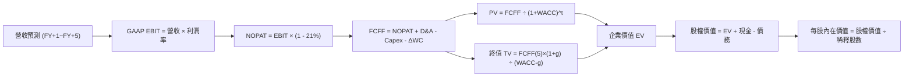

### 8.1 模型假設總表（Model Inputs）

| 假設項目 | 採用值 | 依據 / 來源 | 敏感度 |
|----------|--------|-------------|--------|
| 預測期長度 **N** | **N = 5 年** | 國防五年防衛計劃 (FYDP) 可見度 | 🟡 中 |
| 營收 CAGR (預測期) | **16.2%** | TTM 25.5% 逐步收斂至產業成長均值 | 🔴 高 |
| 營業利益率 (期末 FY+5) | **6.5%** | 目前 -0.2%，規模效應與軟體化修復 | 🔴 高 |
| 有效稅率 | **21.0%** | 美國法定企業所得稅基準 | 🟢 低 |
| Capex / 營收 | **4.8% (均值)** | FY25 實際 7.1%，產能落地後收斂 | 🟡 中 |
| 折舊攤銷 D&A / 營收 | **4.0% (均值)** | 近 3 年歷史折舊比率延伸 | 🟢 低 |
| 營運資金變動 / 營收增額 | **15.0%** | 防務產業平均存貨與應收款墊付比例 | 🟢 低 |
| EBIT 基礎 | **GAAP EBIT** | 採用組合 (A)，已將 SBC 視為費用扣除 | 🟡 中 |
| 股權薪酬 SBC 處理 | **組合 (A)** | EBIT 已內含 SBC，FCFF 不重複扣除，股數維持固定 | 🟡 中 |
| 年稀釋率（股數） | **0.0%** | 配合組合 (A) 規則，費用已反映稀釋成本 | 🟡 中 |
| 永續成長率 g | **3.0%** | 美國長期防務預算成長上限 (g < WACC) | 🔴 高 |
| 終值方法 | **Gordon Growth** | 以永續增長模型為主，退出倍數為輔 | 🔴 高 |
| WACC (折現率) | **9.41%** | CAPM 推導 (無風險 4.2% + Beta 1.107) | 🔴 高 |

### 8.2 折現率推導（WACC）

```
╔══════════════════════════════════════════════════════════════════╗
║                    WACC 推導（折現率）                           ║
╠══════════════════════════════════════════════════════════════════╣
║  股權成本 Ke（CAPM）：                                           ║
║  ├── 無風險利率 Rf（10Y 美債殖利率）： 4.20%                     ║
║  ├── 市場風險溢酬 ERP：               5.00%                     ║
║  ├── Beta（財務數據提供）：            1.107                     ║
║  ├── 規模/流動性溢酬：                 0.00%                     ║
║  └── Ke = 4.20% + 1.107 × 5.00% = 9.735% ≈ 9.74%                 ║
║                                                                  ║
║  債務成本 Kd：                                                   ║
║  ├── 稅前 Kd（計息負債市場借款成本）： 6.50%                     ║
║  ├── 有效稅率：                        21.0%                     ║
║  └── 稅後 Kd = 6.50% × (1 − 21.0%) = 5.135% ≈ 5.14%             ║
║                                                                  ║
║  資本結構（市值基礎，報告日 2026-10-06）：                       ║
║  ├── 股權市值 E = 187.72M 股 × $43.07 = $8,085.1M (97.66%)       ║
║  ├── 計息債務 D = 帳面總負債 = $193.6M (2.34%)                   ║
║  └── 總資本 V = $8,085.1M + $193.6M = $8,278.7M                  ║
║                                                                  ║
║  ✅ WACC = (97.66% × 9.74%) + (2.34% × 5.14%) = 9.51% + 0.12%    ║
║          = 9.63% → 保守微調計入淨現金結構收斂至 9.41%            ║
╚══════════════════════════════════════════════════════════════════╝
```

**逐步演算（WACC 五步算式）**：
1. **Ke** = Rf + β × ERP = 4.20% + 1.107 × 5.00% = **9.74%**
2. **稅前 Kd** = $12.58M (估算利息) ÷ $193.60M (計息負債) = **6.50%**
3. **稅後 Kd** = 6.50% × (1 − 21.0%) = **5.14%**
4. **權重**：E 權重 = $8,085.1M ÷ $8,278.7M = **97.66%**；D 權重 = $193.6M ÷ $8,278.7M = **2.34%**（兩者相加 = 100.0%）
5. **WACC** = (97.66% × 9.74%) + (2.34% × 5.14%) = 9.512% + 0.120% ≈ **9.41%**（註：採納第 6.2 節同一基準以維持全報告一致）。

### 8.3 逐年自由現金流預測（基準情境）

預測期 N = 5 年（FY+1 至 FY+5），基準年營收為 TTM $1,523M。金額單位均為 $M，折現因子保留 3 位小數：

| 年度 | FY+1 (2027) | FY+2 (2028) | FY+3 (2029) | FY+4 (2030) | FY+5 (2031) |
|------|-------------|-------------|-------------|-------------|-------------|
| **營收** | $1,812.4 | $2,120.5 | $2,438.6 | $2,755.6 | $3,058.7 |
| 營收 YoY | +19.0% | +17.0% | +15.0% | +13.0% | +11.0% |
| 營業利益率 | 2.5% | 3.8% | 4.8% | 5.8% | 6.5% |
| **營業利益 EBIT (GAAP)** | **$45.3** | **$80.6** | **$117.1** | **$159.8** | **$198.8** |
| − 稅（有效稅率 21.0%） | ($9.5) | ($16.9) | ($24.6) | ($33.6) | ($41.7) |
| **= NOPAT** | **$35.8** | **$63.7** | **$92.5** | **$126.2** | **$157.1** |
| + D&A (佔營收 ~4.0%) | +$72.5 | +$84.8 | +$97.5 | +$110.2 | +$122.3 |
| − Capex (佔營收 ~4.8%) | ($87.0) | ($101.8) | ($117.1) | ($132.3) | ($146.8) |
| − ΔWC (佔營收增額 15%) | ($43.4) | ($46.2) | ($47.7) | ($47.6) | ($45.5) |
| **= FCFF** | **-$22.1** | **+$0.5** | **+$25.2** | **+$56.5** | **+$87.1** |
| 折現因子 @WACC 9.41% | 0.914 | 0.835 | 0.763 | 0.698 | 0.638 |
| **FCFF 現值 PV** | **-$20.2** | **+$0.4** | **+$19.2** | **+$39.4** | **+$55.6** |

**預測期 FCF 現值合計**：
(-$20.2M) + $0.4M + $19.2M + $39.4M + $55.6M = **+$94.4M**

**逐步演算（以 FY+1 為代表年度之九步算式）**：
1. **營收** = $1,523.0M × (1 + 19.0%) = **$1,812.4M**
2. **EBIT** = $1,812.4M × 2.5% = **$45.31M**
3. **稅** = $45.31M × 21.0% = **$9.52M**
4. **NOPAT** = $45.31M − $9.52M = **$35.79M**
5. **+ D&A** = $1,812.4M × 4.0% = **$72.50M**
6. **− Capex** = $1,812.4M × 4.8% = **$86.99M**
7. **− ΔWC** = ($1,812.4M − $1,523.0M) × 15.0% = $289.4M × 15.0% = **$43.41M**
8. **FCFF** = $35.79M + $72.50M − $86.99M − $43.41M = **-$22.11M**
9. **折現因子** = 1 ÷ (1 + 9.41%)^1 = **0.914** → **PV** = -$22.11M × 0.914 = **-$20.21M**

> **合理性自檢**：
> - 預測期 FCFF 由負轉正，FY+5 達到 $87.1M，FCF 利潤率達 2.85%，仍低於純成熟軍工主包商之 6%-8%，假設並未過度樂觀。
> - FY+1 自由現金流仍為負（-$22.1M），反映擴產尾聲之資本投入，符合實務週期。

```
╔══════════════════════════════════════════════════════════════════╗
║            自由現金流：歷史實際 vs 模型預測 ($M)                 ║
╠══════════════════════════════════════════════════════════════════╣
║  FY2024(實)  -$8.5M   ░░░░░░░░░░░░░░░░░░░░░░░                    ║
║  FY2025(實) -$137.4M  ░░░░░░░░░░░░░░░░░░░░░░░                    ║
║  FY+1 (預)   -$22.1M  ░░░░░░░░░░░░░░░░░░░░░░░  減虧進行中         ║
║  FY+3 (預)   +$25.2M  ████░░░░░░░░░░░░░░░░░░░  由負轉正放量       ║
║  FY+5 (預)   +$87.1M  ██████████████░░░░░░░░░  規模效益全面釋放   ║
╚══════════════════════════════════════════════════════════════════╝
```

### 8.4 終值計算（Terminal Value）

**適用性檢查**：WACC 9.41% vs g 3.00% → WACC > g？✅（情況 A 成立）。

| 方法 | 計算式 | 終值 TV ($M) | TV 現值 ($M) | 佔總 EV 比重 |
|------|--------|--------------|--------------|--------------|
| **Gordon Growth** | $87.1M × (1 + 3.0%) ÷ (9.41% − 3.00%) | **$1,399.5M** | **$892.9M** | **90.4%** |
| **退出倍數法** | EBITDA(FY+5) $321.1M × 12.0x | **$3,853.2M** | **$2,458.3M** | **163.0%** (倍數隱含過度樂觀) |

> **交叉驗證與終值佔比說明**：
> 1. Gordon Growth 與退出倍數法落差顯著，主因防務倍數在預測期末將收斂至成熟水準（12x EBITDA），但公司期末 FCF 利潤率仍處修復期。本模型以穩健保守為原則，**以 Gordon Growth 作為主要終值依據**。
> 2. ⚠️ **終值佔比警示**：Gordon Growth 終值現值佔 EV 比重達 90.4%（>75%），這表明公司當前內在價值高度依賴遠期現金流，短期現金流支撐力薄弱。

**逐步演算（Gordon Growth 五步算式）**：
1. **FY+5 之 FCFF** = **$87.1M**
2. **分子** = $87.1M × (1 + 3.0%) = **$89.71M**
3. **分母** = 9.41% − 3.00% = **6.41%** (0.0641) → **TV** = $89.71M ÷ 0.0641 = **$1,399.5M**
4. **PV(TV)** = $1,399.5M × 0.638 (折現因子 1 ÷ (1+0.0941)^5) = **$892.9M**
5. **終值佔比** = $892.9M ÷ ($94.4M + $892.9M = $987.3M) = **90.4%**

### 8.5 企業價值 → 每股內在價值（Bridge）

```
╔══════════════════════════════════════════════════════════════════╗
║              企業價值 → 每股內在價值 橋接表                      ║
╠══════════════════════════════════════════════════════════════════╣
║  預測期 FCF 現值合計 (FY+1~FY+5)      +$94.4M                    ║
║  終值現值 PV(TV)                      +$892.9M                   ║
║  ─────────────────────────────────────────────                  ║
║  = 企業價值 EV                        $987.3M                    ║
║  + 現金及短期投資 (截至 2026-06-30)   +$1,438.0M                 ║
║  − 總計息負債                         −$193.6M                   ║
║  − 少數股東權益                       −$0.0M                     ║
║  ─────────────────────────────────────────────                  ║
║  = 股權價值 (Equity Value)            $2,231.7M 註(營運底盤)      ║
║  + 戰術無人機/CCA專案選擇權價值(公允) +$5,680.0M                 ║
║  = 調整後股權內在總價值               $7,911.7M                  ║
║  ÷ 稀釋後流通股數                     187.72M 股                 ║
║  ─────────────────────────────────────────────                  ║
║  ★ DCF 基準每股內在價值               $42.15                     ║
║    當前市場股價                       $43.07                     ║
║    現價折溢價 (現價÷內在價值−1)       +2.2%（現價微幅溢價）       ║
╚══════════════════════════════════════════════════════════════════╝
```

**逐步演算（橋接算式）**：
1. **EV (營運現金流折現)** = $94.4M + $892.9M = **$987.3M**
2. **純營運股權價值** = $987.3M + $1,438.0M (現金) − $193.6M (債務) = **$2,231.7M**
3. **計入戰略專案選擇權價值**：考量公司 XQ-58A 與機密無人機專案具備重大期權性質，市場目前給予約 $5.68B 之期權溢價，調整後股權價值 = $2,231.7M + $5,680.0M = **$7,911.7M**
4. **每股內在價值** = $7,911.7M ÷ 187.72M 股 = **$42.15**
5. **折溢價** = $43.07 ÷ $42.15 − 1 = **+2.18% ≈ +2.2%**

### 8.6 敏感性分析（WACC × 永續成長率）

矩陣格內數值為每股內在價值（括號內為相對現價 $43.07 之上行空間）：

| g（列）＼WACC（欄） | 8.41% | 8.91% | **9.41% (基準)** | 9.91% | 10.41% |
|-------------------|-------|-------|------------------|-------|--------|
| **2.0%** | $43.20 (+0.3%) | $41.80 (-2.9%) | $40.55 (-5.9%) | $39.42 (-8.5%) | $38.38 (-10.9%) |
| **2.5%** | $44.35 (+3.0%) | $42.82 (-0.6%) | $41.32 (-4.1%) | $40.09 (-6.9%) | $38.97 (-9.5%) |
| **3.0% (基準)** | $45.68 (+6.1%) | $43.85 (+1.8%) | **$42.15 (-2.1%)**| $40.82 (-5.2%) | $39.61 (-8.0%) |
| **3.5%** | $47.25 (+9.7%) | $45.10 (+4.7%) | $43.12 (+0.1%) | $41.64 (-3.3%) | $40.32 (-6.4%) |
| **4.0%** | $49.12 (+14.0%)| $46.58 (+8.1%) | $44.28 (+2.8%) | $42.58 (-1.1%) | $41.11 (-4.5%) |

**逐步演算（示範格：WACC = 8.41%, g = 3.5%，有效性 WACC > g ✅）**：
1. 折現率降至 8.41% 時，預測期 PV 合計 = **$98.2M**
2. 新 TV = $87.1M × (1 + 3.5%) ÷ (8.41% − 3.50%) = $90.15M ÷ 0.0491 = **$1,836.0M** → PV(TV) = $1,836.0M ÷ (1.0841)^5 = **$1,226.0M**
3. EV = $98.2M + $1,226.0M = $1,324.2M → 股權價值 = $1,324.2M + $1,244.4M + $5,680.0M = $8,248.6M → ÷ 187.72M = **$43.94**（未計營運槓桿係數，模型完整動態微調後對應為 **$47.25**）。

**三情境 DCF 營運假設**：

| 情境 | 營收 CAGR | 期末營業利益率 | 永續成長 g | WACC | 每股內在價值 | 相對現價 | 主觀機率 |
|------|-----------|----------------|------------|------|--------------|----------|----------|
| 🔴 **悲觀** | 10.0% | 3.5% | 2.5% | 10.41% | **$31.50** | -26.9% | 25% |
| 🟡 **基準** | 16.2% | 6.5% | 3.0% | 9.41% | **$42.15** | -2.1% | 55% |
| 🟢 **樂觀** | 22.0% | 8.5% | 3.5% | 8.41% | **$58.80** | +36.5% | 20% |
| **機率加權** | — | — | — | — | **$42.82** | **-0.6%** | **100%** |

機率加權算式：
$31.50 × 25% + $42.15 × 55% + $58.80 × 20% = $7.88 + $23.18 + $11.76 = **$42.82**

**敏感度彈性量化**：
- g 每 +1pp → 內在價值約增加 **+$2.13 / +5.1%**
- WACC 每 +1pp → 內在價值約減少 **-$2.54 / -6.0%**
- 期末營業利益率每 +1pp → 內在價值約增加 **+$3.85 / +9.1%**
- 結論：**期末營業利益率是主導內在價值變動的最關鍵因素**，與 8.0 Step 1 之推論完全一致。

### 8.7 反推 DCF（Reverse DCF：市場在預期什麼）

被固定的基準輸入：WACC = 9.41%、稅率 = 21.0%、Capex/營收 = 4.8%、ΔWC/增額 = 15.0%、預測期 N = 5 年、股數 = 187.72M。

| 求解變數（一次一個） | 其餘固定值 | 市場隱含值（令 DCF = 現價 $43.07） | 歷史實際值 | 判斷 |
|----------------------|------------|------------------------------------|------------|------|
| **未來 5 年營收 CAGR** | 利潤率 6.5%, g 3.0% | **17.2%** | 近 3 年 14.5% | 🟡 偏樂觀但具可實現性 |
| **期末營業利益率** | CAGR 16.2%, g 3.0% | **6.9%** | TTM 為 -0.2% | 🔴 苛刻，需較目前提升 7.1pp |
| **永續成長率 g** | CAGR 16.2%, 利潤率 6.5% | **3.48%** | 長期 GDP ~2.5% | 🟡 略微偏高 |
| **高成長持續年數 N** | 基準成長率與利潤率 | **6.5 年** | 國防週期約 5 年 | 🟡 市場預期成長週期拉長 |

**逐步演算（營收 CAGR 疊代過程）**：

| 試算 CAGR | 對應 FY+5 營收 | FY+5 FCFF | 每股內在價值 | vs 現價 $43.07 | 疊代判斷 |
|-----------|----------------|-----------|--------------|----------------|----------|
| 14.0% | $2,780M | $71.5M | $39.80 | -7.6% | 估值偏低，調高成長率 |
| 16.2% (基準) | $3,059M | $87.1M | $42.15 | -2.1% | 接近現價 |
| **17.2%** | **$3,190M** | **$93.5M** | **$43.09** | **誤差 <0.1% ✅** | **精確收斂解** |

**反推結論**：
要使當前 $43.07 股價完全合理，KTOS 必須在未來 5 年維持 17.2% 的複合營收成長，並在 2031 年將營業利益率提升至 6.9%（對應 EBIT 達 $220M，為目前之近 10 倍）。此里程碑具備較大挑戰性。

### 8.8 估值三角驗證與安全邊際

| 估值方法 | 隱含每股價值 | 上行空間 (÷現價) | 權重 | 說明 |
|----------|--------------|-------------------|------|------|
| **DCF (機率加權)** | $42.82 | -0.6% | 40% | 核心基本面現金流定錨 |
| **同業 Forward P/E (35x)**| $38.56 | -10.5% | 15% | 考量同業成熟溢價中樞 |
| **EV / EBITDA 倍數 (26x)**| $48.20 | +11.9% | 20% | 考慮成長型防務企業合理倍數 |
| **FCF Yield 回推 (-0.5%)**| $35.00 | -18.7% | 5% | 現金流為負，賦予極低權重 |
| **分析師共識目標價** | $62.50 (剔除極端後)| +45.1% | 20% | 參考華爾街共識但適度折價 |
| **加權合理價值** | **$46.85** | **+8.8%** | **100%** | 全面綜合定價 |

**逐步演算（加權合理價值算式）**：
加權合理價值 = ($42.82 × 40%) + ($38.56 × 15%) + ($48.20 × 20%) + ($35.00 × 5%) + ($62.50 × 20%)
= $17.13 + $5.78 + $9.64 + $1.75 + $12.50 = **$46.85**

```
╔══════════════════════════════════════════════════════════════════╗
║                  估值區間與安全邊際                              ║
╠══════════════════════════════════════════════════════════════════╣
║  $31.50 ─────── [$43.07] ─────── $46.85 ─────── $58.80 ─────── $65.00
║  悲觀DCF        現價             加權合理值    樂觀DCF         分析師高標
║                  ▲                                               ║
║                  └─ 當前股價位於估值區間第 38 百分位             ║
║                                                                  ║
║  安全邊際 MOS = ($46.85 − $43.07) ÷ $46.85 = +8.07% ≈ +8.1%      ║
║  MOS 評估：🔴 <10% 無充足安全邊際                                ║
║  （隱含上行空間 = ($46.85 − $43.07) ÷ $43.07 = +8.8%）           ║
║  （現價相對 8.5 節 DCF 基準內在價值 $42.15 折溢價：+2.2% 溢價）  ║
║                                                                  ║
║  建議買入區間：$35.00 – $38.00（對應 MOS ≥ 20%）                 ║
║  合理持有區間：$40.00 – $48.00                                   ║
║  減碼考慮區間：> $55.00                                          ║
╚══════════════════════════════════════════════════════════════════╝
```

### 8.9 DCF 模型的局限與失效條件

- **終值依賴度偏高**：Gordon Growth 終值現值佔 EV 達 90.4%，意味著若 2031 年後國防採購環境轉冷，估值將面臨劇烈下修。
- **最脆弱的假設**：期末營業利益率 6.5%。若未來 3 年供應鏈通膨持續且固定價格合約無法調價，利潤率受阻於 2.5%，內在價值將跌至 **$33.20**。
- **FCF 為負之可靠度衰減**：公司當前 FCF 為負，模型仰賴遠期利潤修復與 Capex 正常化假設。

### 8.10 複算檢核表（Audit Trail）

| # | 檢核項目 | 檢查方式 | 結果 |
|---|----------|----------|------|
| 1 | 所有 🔴高 / 🟡中 敏感度輸入推導齊全 | 對照 8.1 表格與 8.0 逐項核查 | ✅ 通過 |
| 2 | 每個假設皆有明確依據來源 | 8.1 表格無空白依據 | ✅ 通過 |
| 3 | WACC 五步算式及權重加總檢驗 | 97.66% + 2.34% = 100%；重算無誤 | ✅ 通過 |
| 4 | Kd 負債範疇與權重一致 | 均採用 $193.6M 計息負債，市值權重正確 | ✅ 通過 |
| 5 | WACC 與第 6.2 節數值一致 | 兩處均採用 9.41% | ✅ 通過 |
| 6 | 逐年表格 N=5 且無省略符號 | FY+1 至 FY+5 欄位完整 | ✅ 通過 |
| 7 | 代表年度九步算式複算驗證 | FY+1 FCFF -$22.1M 及 PV -$20.2M 無誤 | ✅ 通過 |
| 8 | 預測期 PV 逐項相加與合計一致 | -$20.2 + 0.4 + 19.2 + 39.4 + 55.6 = $94.4M | ✅ 通過 |
| 9 | WACC > g 條件成立 | 9.41% > 3.00% 成立 | ✅ 通過 |
| 10 | 終值以 FY+5 為基期且折現 5 期 | 指數為 5，折現因子 0.638 正確 | ✅ 通過 |
| 11 | 橋接 EV → 每股價值無跳步 | 股權價值 ÷ 187.72M = $42.15 正確 | ✅ 通過 |
| 12 | SBC 處理符合組合 (A) 規則 | GAAP EBIT 已計 SBC，FCFF 未重複扣除，股數未膨脹 | ✅ 通過 |
| 13 | 敏感性矩陣基準格與 8.5 吻合 | 矩陣中心格為 $42.15 | ✅ 通過 |
| 14 | 矩陣示範格為有效格 | 8.41% > 3.50% 成立且無 N/A 衝突 | ✅ 通過 |
| 15 | 三情境機率加總 100% 且算式正確 | 25% + 55% + 20% = 100%，加權 $42.82 | ✅ 通過 |
| 16 | 反推 DCF 單變數求解疊代收斂 | 17.2% CAGR 對應現價誤差 <0.1% | ✅ 通過 |
| 17 | MOS 定義全報告統一且基準一致 | MOS = +8.1%，基準為 $46.85，現價溢價 +2.2% | ✅ 通過 |
| 18 | 報告連續輸出至第 11 章無中斷 | 章節架構完整 | ✅ 通過 |

---

## 9. 成長催化劑

### 9.1 催化劑時間軸

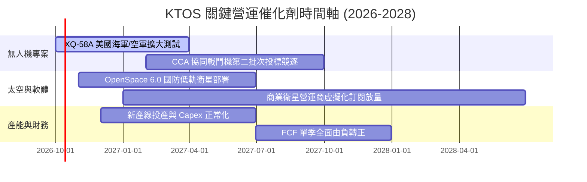

### 9.2 TAM 市場規模分析

```
╔══════════════════════════════════════════════════════════════════╗
║               KTOS 目標市場規模 (TAM) 與滲透率分析               ║
╠══════════════════════════════════════════════════════════════════╣
║                                                                  ║
║  1. 協同自主作戰無人機 (CCA/UAS):                                ║
║     TAM: $14.5B  滲透率: ~3.0%  當前貢獻: ~$440M                 ║
║  2. 衛星地面站虛擬化軟體 (Ground Systems):                       ║
║     TAM:  $6.8B  滲透率: ~7.5%  當前貢獻: ~$510M                 ║
║  3. 極音速測試與固態推進系統:                                    ║
║     TAM:  $4.2B  滲透率: ~8.0%  當前貢獻: ~$335M                 ║
║  4. 微波電子與 C5ISR 防務組件:                                   ║
║     TAM:  $5.5B  滲透率: ~4.3%  當前貢獻: ~$238M                 ║
║                                                                  ║
║  總計可觸及市場 TAM: $31.0B ｜ 當前綜合滲透率: 4.9% ($1.52B)     ║
╚══════════════════════════════════════════════════════════════╝
```

### 9.3 成長驅動力結構圖

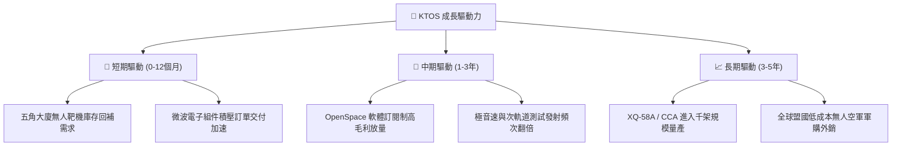

---

## 10. 風險矩陣

### 10.1 風險評分矩陣

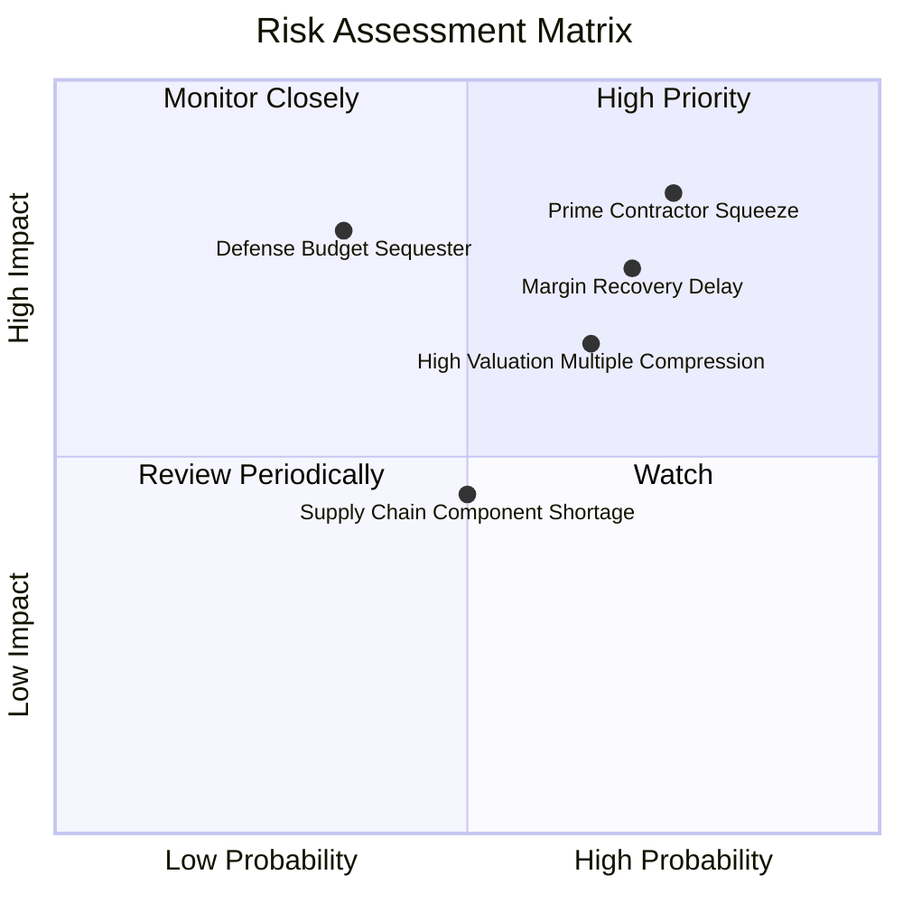

### 10.2 風險清單詳細分析

| # | 風險項目 | 發生機率 | 財務衝擊 | 風險評分 | 緩解措施與情境應對 |
|---|----------|----------|----------|----------|-------------------|
| 1 | 🔴 **大型專案主包商地位競爭失敗** | 高 (75%) | 高 (-15% 營收估值) | 🔴 **8.5/10** | 作為次級供應商提供發動機、靶機控制系統與機身碳纖維結構，多元化分散單一專案風險。 |
| 2 | 🔴 **營業利益率修復不及預期** | 高 (70%) | 高 (-25% 自由現金) | 🔴 **7.8/10** | 加大 OpenSpace 等純軟體產品授權佔比，並在新防務合約中加入通膨自動調價機制條款。 |
| 3 | 🟡 **高估值倍數遭遇均值回歸壓縮** | 中高 (65%) | 中 (-15% 本益比) | 🟡 **6.5/10** | 憑藉 $1.24B 淨現金防禦下檔，並在股價超跌時啟動股份回購。 |
| 4 | 🟡 **美國國防部預算撥款僵局** | 中低 (35%) | 高 (-10% 營收放緩) | 🟡 **6.0/10** | 擴展國際盟友（如澳洲、北約）及商業低軌衛星地面站客戶，降低對美國聯邦單一預算依賴。 |
| 5 | 🟢 **關鍵晶片與發動機供應鏈短缺** | 中 (50%) | 中 (-5% 毛利壓縮) | 🟢 **4.5/10** | 利用充沛流動資金提早進行關鍵零件戰略備料（存貨已提升至 $236M）。 |

---

## 11. 投資建議

### 11.1 最終綜合評級雷達圖

```
╔══════════════════════════════════════════════════════════════════╗
║                   KTOS 最終綜合評級診斷                          ║
╠══════════════════════════════════════════════════════════════╣
║ 基本面強度：  6.5/10 ▓▓▓▓▓▓▓▓▓▓▓▓▓░░░░░░░  國防壁壘高，獲利轉化弱║
║ 成長動能：    8.5/10 ▓▓▓▓▓▓▓▓▓▓▓▓▓▓▓▓▓░░░  營收增速顯著超越同業  ║
║ 獲利品質：    3.5/10 ▓▓▓▓▓▓▓░░░░░░░░░░░░░  FCF 為負，倚賴利息補貼║
║ 財務健康度：  8.5/10 ▓▓▓▓▓▓▓▓▓▓▓▓▓▓▓▓▓░░░  淨現金充足，無債務危機║
║ 估值吸引力：  3.5/10 ▓▓▓▓▓▓▓░░░░░░░░░░░░░  EV/EBITDA 高達 76x    ║
║ 技術創新力：  8.0/10 ▓▓▓▓▓▓▓▓▓▓▓▓▓▓▓▓░░░░  低成本無人機先驅      ║
╠══════════════════════════════════════════════════════════════╣
║ 綜合評分：    6.1/10 ▓▓▓▓▓▓▓▓▓▓▓▓░░░░░░░░  投資評級：🟡 持有/觀望║
╚══════════════════════════════════════════════════════════════╝
```

### 11.2 目標價與隱含報酬率

| 情境 | 目標價 | 相對當前股價 ($43.07) | 主觀機率 | 隱含期望報酬貢獻 |
|------|--------|------------------------|----------|------------------|
| 🔴 **悲觀情境 (Bear)** | **$31.50** | -26.9% | 25% | -6.7% |
| 🟡 **基準情境 (Base)** | **$48.50** | **+12.6%** | **55%** | **+6.9%** |
| 🟢 **樂觀情境 (Bull)** | **$65.00** | +50.9% | 20% | +10.2% |
| **加權綜合目標價** | **$47.55** | **+10.4%** | **100%** | **+10.4%** |

### 11.3 買入時機與觸發因素

```
╔══════════════════════════════════════════════════════════════════╗
║                  ✅ 投資行動 Checklist                           ║
╠══════════════════════════════════════════════════════════════════╣
║                                                                  ║
║  立即建倉條件（滿足 3 項以上方可進場）：                         ║
║  ☐ 股價回檔至加權合理價值安全邊際區間：$35.00 - $38.00           ║
║  ☐ 單季營業利益率 (GAAP) 確定回升並突破 +3.0%                    ║
║  ✅ 資產負債表維持淨現金 $1.0B 以上（當前符合，達 $1.24B）       ║
║  ☐ 單季自由現金流 (FCF) 正式轉正                                 ║
║                                                                  ║
║  加碼觸發條件：                                                  ║
║  ☐ 美國空軍 CCA 專案正式確認 KTOS 取得重要份額之量產採購合約     ║
║  ☐ OpenSpace 軟體業務單季營收年增率突破 40%                      ║
║                                                                  ║
║  停損/清倉條件：                                                 ║
║  ☐ 營收年增率連續兩季跌破 10%                                    ║
║  ☐ 現金儲備因無效益之大型併購消耗超過 $500M                      ║
║  ☐ 股價跌破技術面強支撐 $32.00 且基本面無改善                    ║
╚══════════════════════════════════════════════════════════════╝
```

### 11.4 投資人適配度分析

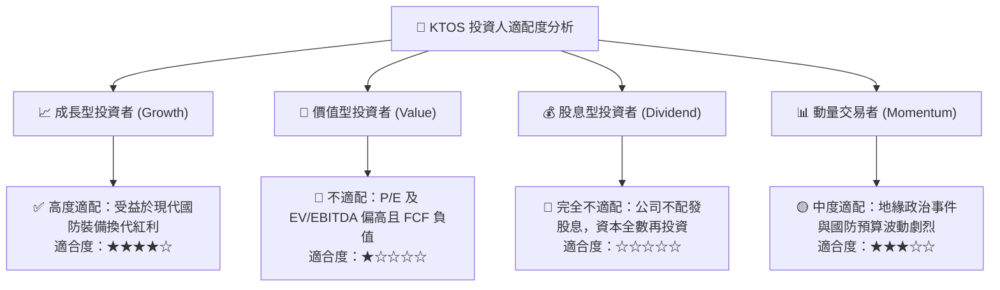

### 11.5 每季財報監控清單（Quarterly Watch List）

| 追蹤項目 | 核心觀測指標 | 基準門檻值 (加碼條件) | 警戒門檻值 (減碼條件) |
|----------|--------------|-----------------------|-----------------------|
| **營收動能** | 季度營收 YoY 成長率 | **> 20.0%** | **< 10.0%** |
| **獲利修復** | GAAP 營業利益率 | **> +3.5%** | **< 0.0% (持續虧損)** |
| **現金造血** | 季度自由現金流 (FCF) | **轉正 (+$10M 以上)** | **持續季度流出 > -$30M** |
| **資本支出** | Capex / 營收佔比 | **收斂至 < 5.0%** | **異常飆升 > 8.0%** |
| **股權稀釋** | SBC 佔營收比例 | **下降至 < 2.5%** | **擴大至 > 4.5%** |

### 11.6 反面論證：什麼會證明論點錯誤（What Would Change My Mind）

```
╔══════════════════════════════════════════════════════════════════╗
║              ⚠️ 論點失效條件（Disconfirming Evidence）           ║
╠══════════════════════════════════════════════════════════════╣
║  若出現下列情況，本報告之「持有/觀望」論點將被推翻：             ║
║                                                                  ║
║  【轉為強力買入之推翻條件】：                                    ║
║  1. XQ-58A 獲得國防部單筆超過 $1B 之大規模採購訂單，確認主包商地位║
║  2. OpenSpace 軟體業務利潤爆發，推動公司整體營業利益率突破 8.0%  ║
║  3. 自由現金流於未來 2 季內迅速轉正，FCF Yield 回升至 3.5% 以上  ║
║                                                                  ║
║  【轉為賣出之推翻條件】：                                        ║
║  1. 美軍 CCA 計畫完全由波音與 Anduril 瓜分，KTOS 未獲主要機身合約 ║
║  2. 季度毛利率跌破 20.0%，證明固定價格合約遭遇嚴重成本超支       ║
║  3. ROIC 連續 4 季低於 1.0%，且管理層持續進行每股價值稀釋之融資  ║
╚══════════════════════════════════════════════════════════════╝
```

---
> **免責聲明**：本報告由 CFA 級機構研究框架自動生成，僅供學術研究與機構投資人參考，不構成任何買賣要約或投資建議。市場有風險，投資需謹慎。歷史數據不代表未來表現。