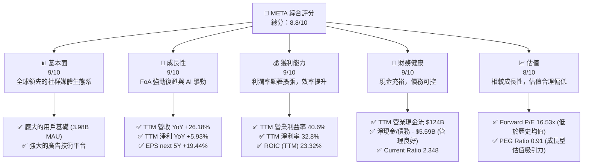
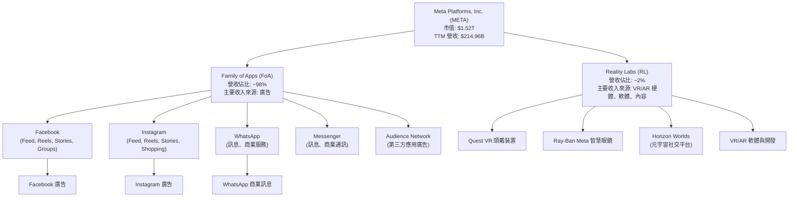
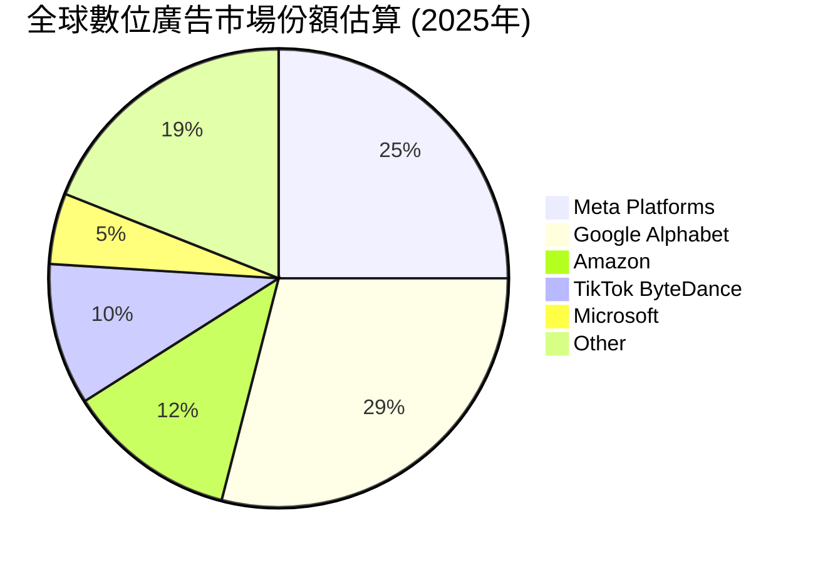
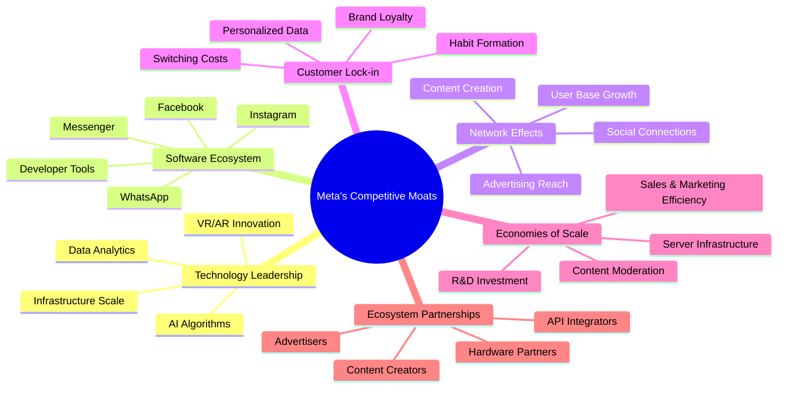
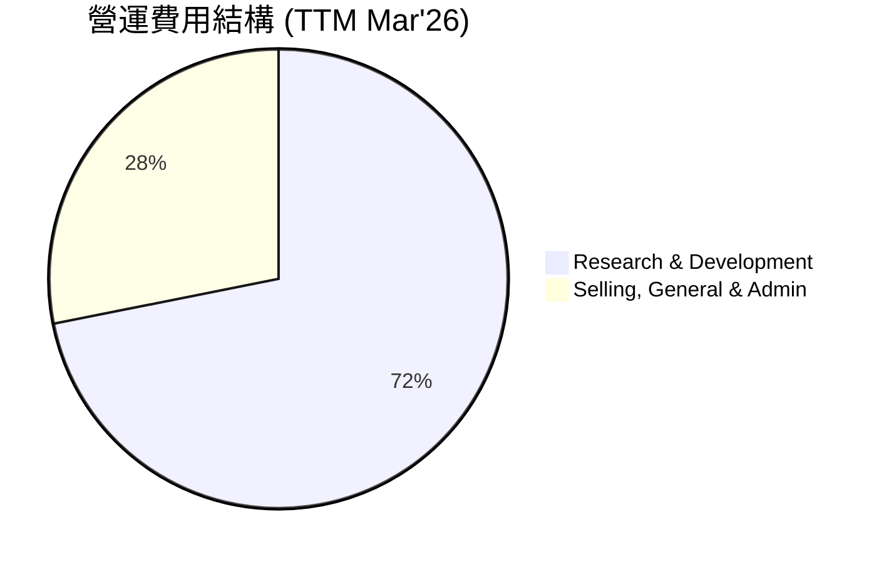
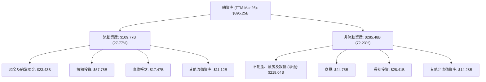

# META 基本面深度分析報告
> **報告日期**：2026-06-02 ｜ **語言**：繁體中文 ｜ **數據來源**：Yahoo Finance, Finviz, StockAnalysis, Roic.ai ｜ **分析師**：CFA 級機構研究

---

## 目錄

| # | 章節 | 核心結論 |
|---|------|----------|
| 1 | 執行摘要 | 🟢 買入評級，目標價區間 $730 - $950，具備強勁成長潛力與合理估值 |
| 2 | 公司概覽與商業模式 | 網路效應、數據飛輪、規模經濟構築深厚護城河 |
| 3 | 損益表深度分析 | 營收成長強勁，利潤率顯著提升，費用控制成效顯著 |
| 4 | 資產負債表分析 | 財務結構穩健，流動性充裕，淨負債水平可控 |
| 5 | 現金流量深度分析 | 自由現金流創造能力卓越，資本配置效率高 |
| 6 | 獲利能力與資本效率 | ROIC 遠超 WACC，持續為股東創造巨大經濟價值 |
| 7 | 估值深度分析 | 相較同業估值合理，DCF 顯示顯著上行空間 |
| 8 | 成長催化劑 | AI 驅動廣告優化、Reels 貨幣化、元宇宙長期願景與新興技術 |
| 9 | 風險矩陣 | 監管壓力、競爭加劇與元宇宙投入的短期不確定性 |
| 10 | 投資建議 | 強烈買入，適合成長型與長線價值型投資者 |

---

## 1. 執行摘要

Meta Platforms, Inc. (META) 在經歷了 2022 年的轉型陣痛期後，於 2023 年至 2025 年展現出令人矚目的復甦與成長動能。其核心 Family of Apps (FoA) 業務在 AI 優化廣告投放和 Reels 貨幣化的推動下實現了強勁的營收成長和利潤率擴張。儘管 Reality Labs (RL) 部門的元宇宙投入仍處於虧損狀態，但其長期戰略布局及在 AI 基礎設施和產品創新上的巨額投資，預計將為公司未來數年的成長奠定堅實基礎。當前估值相較於其卓越的成長性和獲利能力而言，顯得極具吸引力。

### 1.1 核心評分儀表板



### 1.2 評分進度條視覺化

```
╔══════════════════════════════════════════════════════════════╗
║              META 多維度評分儀表板 (1-10分)                  ║
╠══════════════════════════════════════════════════════════════╣
║ 基本面強度  9.0 ▓▓▓▓▓▓▓▓▓▓▓▓▓▓▓▓▓▓░░  ★★★★★           ║
║ 成長動能    9.0 ▓▓▓▓▓▓▓▓▓▓▓▓▓▓▓▓▓▓░░  ★★★★★           ║
║ 獲利品質    9.0 ▓▓▓▓▓▓▓▓▓▓▓▓▓▓▓▓▓▓░░  ★★★★★           ║
║ 財務健康    9.0 ▓▓▓▓▓▓▓▓▓▓▓▓▓▓▓▓▓▓░░  ★★★★★           ║
║ 估值合理性  8.0 ▓▓▓▓▓▓▓▓▓▓▓▓▓▓▓▓░░░░  ★★★★☆           ║
║ 護城河深度  9.5 ▓▓▓▓▓▓▓▓▓▓▓▓▓▓▓▓▓▓▓▓  ★★★★★           ║
║ 管理層執行  8.5 ▓▓▓▓▓▓▓▓▓▓▓▓▓▓▓▓▓░░░  ★★★★☆           ║
║ 技術創新力  9.0 ▓▓▓▓▓▓▓▓▓▓▓▓▓▓▓▓▓▓░░  ★★★★★           ║
╠══════════════════════════════════════════════════════════════╣
║ 綜合總分    8.8 ▓▓▓▓▓▓▓▓▓▓▓▓▓▓▓▓▓░░░  🏆 強勁表現，具上行空間║
╚══════════════════════════════════════════════════════════════╝
```

### 1.3 五大投資論點 + 三大核心風險

| 類型 | 項目 | 具體依據 | 信心度 |
|------|------|----------|--------|
| 🟢 **投資論點①** | **核心廣告業務強勁復甦與 AI 驅動的效率提升** | FoA 營收成長加速，TTM 營收 YoY 達 26.18%。AI 投資顯著改善廣告投放精準度與效率，推動廣告營收增長。Q1 2026 營收達 $56.31B，YoY 成長 33.08%。營業利益率 TTM 40.6%，淨利率 TTM 32.8%。 | 🟢 極高 |
| 🟢 **投資論點②** | **Reels 貨幣化進程加速，成為新的成長引擎** | Reels 流量和廣告收入持續增長，逐步縮小與 Feed/Stories 的貨幣化差距。管理層表示 Reels 已成為營收成長的推動力而非阻力，並預計在 2026 年實現盈虧平衡甚至貢獻利潤。 | 🟢 極高 |
| 🟢 **投資論點③** | **元宇宙長期願景與 AI 基礎設施投資** | 儘管 Reality Labs (RL) 部門持續虧損，但其在 VR/AR 硬體和軟體生態系統的長期投入，以及對 AI 算力的巨額投資，為公司在下一代運算平台奠定基礎。這些投資雖短期承壓，但長期潛力巨大。FY2025 R&D 費用達 $57.37B，顯示其對未來技術的堅定投入。 | 🟢 高 |
| 🟢 **投資論點④** | **穩健的財務狀況與高效的資本配置** | TTM 自由現金流達 $48.25B，現金儲備充裕 ($81.18B)。公司透過股票回購持續回饋股東，並於近期開始派發股息 (股息殖利率 35.0%)。穩健的資產負債表 (Current Ratio 2.348，Debt/Equity 0.35) 提供靈活的戰略空間。 | 🟢 極高 |
| 🟢 **投資論點⑤** | **具吸引力的估值水平** | Forward P/E 16.53x，PEG Ratio 0.91，相較於其預期 EPS 成長率 (未來 5 年 19.44%) 而言，估值顯得低估。與歷史估值區間及同業競爭者相比，META 具備估值優勢。 | 🟢 高 |
| 🟡 **風險①** | **監管環境與數據隱私挑戰** | 全球各地對社群媒體平台的監管日益趨嚴，包括數據隱私、內容審核、反壟斷等。潛在的罰款、業務限制或分拆要求可能對其營收和營運模式造成衝擊。 | 🟡 中度 |
| 🔴 **風險②** | **核心廣告業務的競爭與宏觀經濟逆風** | 數位廣告市場競爭激烈，來自 TikTok、Google、Amazon 等巨頭的競爭壓力持續存在。宏觀經濟不確定性可能導致廣告支出波動，進而影響 FoA 業務成長。 | 🟡 中度 |
| 🔴 **風險③** | **Reality Labs 投入的資本效率與不確定性** | 元宇宙業務的發展仍處於早期階段，技術成熟度、用戶接受度及貨幣化模式存在高度不確定性。RL 部門的巨額虧損 (FY2025 R&D $57.37B) 若無法在合理時間內看到清晰的回報，可能持續拖累整體獲利能力。 | 🔴 高衝擊 |

### 1.4 快速統計卡片

| 指標 | 公司實際值 (TTM Mar'26) | 行業均值 (互聯網內容與資訊) | S&P 500 均值 | 狀態 |
|------|--------------------------|----------------------------|--------------|------|
| 收入 YoY 成長 | **26.18%** | ~10-15% | ~5-8% | 🟢 |
| 毛利率 | **81.9%** | ~60-70% | ~40-50% | 🟢 |
| 淨利率 | **32.8%** | ~15-20% | ~10-12% | 🟢 |
| ROE | **32.9%** | ~15-20% | ~15-18% | 🟢 |
| Forward P/E | **16.53x** | ~25-30x | ~20-22x | 🟢 |
| PEG Ratio | **0.91** | ~1.5-2.0 | ~1.5-2.0 | 🟢 |
| Debt/Equity | **0.36x** | ~0.5-1.0x | ~0.8-1.2x | 🟢 |
| FCF Yield | **1.68%** | ~2-4% | ~3-5% | 🟡 |
| Beta | **1.243** | ~1.0-1.5 | 1.0 | 🟡 |

*註：行業均值與 S&P 500 均值為分析師根據經驗估算，用於提供參考比較。*

### 1.5 投資結論

```
╔══════════════════════════════════════════════════════════════════╗
║                    📊 投資結論摘要                               ║
╠══════════════════════════════════════════════════════════════════╣
║  評級：🟢 強烈買入                                               ║
║  當前股價：$597.63                                               ║
║  目標價區間：                                                    ║
║    悲觀情境：$730（+22.15%）                                     ║
║    基準情境：$840（+40.56%）  ← 12個月主要目標                  ║
║    樂觀情境：$950（+58.98%）                                     ║
║  投資評分：8.8/10                                                ║
║  適合投資人：成長型、長線持有者，尋求數位廣告和未來科技領域領導者║
╚══════════════════════════════════════════════════════════════════╝
```

---

## 2. 公司概覽與商業模式

Meta Platforms, Inc. (META) 作為全球領先的社群媒體和科技巨頭，其使命是賦能人們建立社群並拉近世界距離。公司業務主要分為兩大板塊：Family of Apps (FoA) 和 Reality Labs (RL)。

### 2.1 業務結構與收入來源

META 的收入主要來自 FoA 部門的廣告銷售，而 RL 部門則專注於元宇宙相關的硬體、軟體和內容開發。


Family of Apps (FoA) 是 Meta 的核心搖錢樹，涵蓋了 Facebook、Instagram、WhatsApp 和 Messenger 等產品。這些應用程式構成了全球最大的社群網路，擁有數十億的月活躍用戶。其主要收入來源是數位廣告，透過精準的用戶數據和先進的 AI 演算法，向用戶投放高度客製化的廣告，吸引了全球廣大廣告主。

Reality Labs (RL) 則是 Meta 對於未來運算平台——元宇宙的戰略性投資部門。該部門負責開發 VR (虛擬實境) 和 AR (擴增實境) 硬體 (如 Quest VR 頭戴裝置、Ray-Ban Meta 智慧眼鏡) 和相關的軟體生態系統 (如 Horizon Worlds)。儘管 RL 部門目前仍處於巨額虧損狀態，但 Meta 堅信元宇宙是下一代科技浪潮，並持續投入大量資金進行研發。FY2025 的研發費用高達 $57.37B，其中很大一部分歸因於 RL 部門的投入。

### 2.2 市場份額

在數位廣告市場，Meta Platforms 與 Google 兩大巨頭長期佔據主導地位。儘管面臨 TikTok 等新興平台的競爭，Meta 憑藉其龐大的用戶基礎和強大的廣告技術，仍保持著顯著的市場份額。


*註：市場份額數據為分析師基於公開資料及行業報告的綜合估算，僅供參考。*

Meta 在全球數位廣告市場中佔據約 25% 的份額，尤其在社群媒體廣告領域更是無可匹敵。其豐富的用戶數據和細緻的受眾定位能力，使其成為廣告主不可或缺的平台。儘管來自 Google (約 29%) 和 Amazon (約 12%) 等巨頭的競爭依然激烈，但 Meta 在視覺內容、社群互動和即時通訊領域的優勢，為其廣告業務提供了獨特的價值。

### 2.3 競爭護城河分析

Meta 的護城河深厚而多樣，主要由以下幾個關鍵因素構成：



1.  **網路效應 (Network Effects)**：這是 Meta 最核心的護城河。隨著越來越多的用戶加入其平台 (Facebook, Instagram, WhatsApp)，平台的價值對每個新用戶來說就越大。朋友、家人、社群都在這些平台上，使得用戶難以離開。這種效應也延伸到廣告主，龐大的用戶群體吸引了更多的廣告支出，形成正向循環。Meta 的應用程式生態系統每月活躍人數 (MAP) 達 3.98 億，每日活躍人數 (DAP) 達 3.24 億，這是任何新進入者都難以複製的巨大優勢。
2.  **數據飛輪與 AI 技術領先 (Data Flywheel & AI Technology Leadership)**：Meta 收集了數十億用戶的行為數據，這些數據透過其領先的 AI 演算法進行分析，不斷優化廣告投放的精準度。更精準的廣告意味著更高的轉換率，吸引更多廣告主，進而產生更多數據，形成一個強大的數據飛輪。其在 AI 領域的持續巨額投資，不僅提升了廣告效率，也為其在推薦系統、內容創作和元宇宙體驗方面帶來技術優勢。
3.  **規模經濟 (Economies of Scale)**：作為全球最大的社群媒體公司，Meta 在基礎設施 (伺服器、數據中心)、研發投入、銷售與行銷以及內容審核等方面的單位成本遠低於競爭對手。例如，其每年數百億美元的研發投入，是許多小型公司望塵莫及的。這種規模優勢使其能夠以更低的成本提供更優質的服務，並承受巨大的研發投資。
4.  **品牌與用戶鎖定 (Brand & Customer Lock-in)**：Facebook、Instagram、WhatsApp 已成為文化的一部分，擁有極高的品牌認知度。用戶在這些平台上建立的數位身份、社交關係和內容歷史，都增加了轉換到其他平台的成本。儘管用戶可能會使用多個平台，但 Meta 的核心應用程式仍是許多人數位生活的中心。
5.  **軟體生態系統 (Software Ecosystem)**：Meta 不僅提供單一產品，而是一個由多個應用程式組成的生態系統。這些應用程式之間存在協同效應，例如用戶可以在 Facebook 上分享 Instagram 內容，或在 Instagram 上使用 WhatsApp 聯絡。這種生態系統的廣度增加了用戶黏性，並為廣告主提供了更廣泛的觸及點。

### 2.4 護城河強度評分

Meta 的護城河在數位廣告和社群媒體領域極為深厚，使其能夠長期保持競爭優勢。

```
╔══════════════════════════════════════════════════════════════╗
║                  Meta Platforms 護城河強度評分                  ║
╠══════════════════════════════════════════════════════════════╣
║ 網路效應    9.5/10 ▓▓▓▓▓▓▓▓▓▓▓▓▓▓▓▓▓▓▓▓  🏆 龐大用戶基礎難以複製║
║ 技術領先    9.0/10 ▓▓▓▓▓▓▓▓▓▓▓▓▓▓▓▓▓▓░░  🟢 AI驅動廣告優化與創新║
║ 規模經濟    9.0/10 ▓▓▓▓▓▓▓▓▓▓▓▓▓▓▓▓▓▓░░  🟢 巨額投入與成本優勢  ║
║ 用戶鎖定    8.5/10 ▓▓▓▓▓▓▓▓▓▓▓▓▓▓▓▓▓░░░  🟡 社交關係與數據黏性  ║
║ 品牌價值    8.0/10 ▓▓▓▓▓▓▓▓▓▓▓▓▓▓▓▓░░░░  🟡 高度認知與習慣養成  ║
╠══════════════════════════════════════════════════════════════╣
║ 綜合護城河  9.0/10 ▓▓▓▓▓▓▓▓▓▓▓▓▓▓▓▓▓▓░░  🏆 具備持續的長期競爭優勢 ║
╚══════════════════════════════════════════════════════════════╝
```

---

## 3. 損益表深度分析

Meta 的損益表數據顯示，公司在營收和獲利能力方面均呈現強勁的成長態勢，尤其是在 2023 年觸底反彈後，業務表現持續超出市場預期。

### 3.1 年度收入成長趨勢（近4年）

Meta 的年度營收在 2022 年經歷了小幅下滑後，於 2023 年開始強勁復甦，並在 2024 和 2025 年持續加速成長。

```
╔══════════════════════════════════════════════════════════════════╗
║              Meta Platforms 年度收入趨勢（FY2022-FY2025）        ║
╠══════════════════════════════════════════════════════════════════╣
║                                                                  ║
║  FY2022  $116.61B ██████████████░░░░░░░░░░░  YoY: -1.12%  🔴    ║
║  FY2023  $134.90B ██████████████████░░░░░░░  YoY: +15.69% 🟢    ║
║  FY2024  $164.50B ████████████████████████░░  YoY: +21.94% 🟢    ║
║  FY2025  $200.97B ██████████████████████████████  YoY: +22.17% 🟢    ║
║                                                                  ║
║                   |      |      |      |      |                  ║
║                   0     50B   100B   150B   200B                  ║
║                                                                  ║
║  📊 3年累計 CAGR (FY2022-FY2025)：+18.73%                        ║
╚══════════════════════════════════════════════════════════════════╝
```
從年度數據來看，Meta 的營收成長在 2022 年因數位廣告市場逆風和蘋果隱私政策調整而受到衝擊，年增長率為 -1.12%。然而，公司迅速調整戰略，加強 AI 投資和 Reels 貨幣化，使得營收在 2023 年反彈至 $134.90B，YoY 成長 15.69%。進入 2024 年和 2025 年，成長進一步加速，分別達到 $164.50B (YoY +21.94%) 和 $200.97B (YoY +22.17%)，展現了其核心廣告業務的強勁韌性和成長動能。FY2025 的營收首次突破 2000 億美元大關，標誌著公司進入新的發展階段。

### 3.2 季度收入趨勢分析

近四季的營收數據顯示，Meta 的成長勢頭持續強勁，且呈現加速趨勢。

| 會計季度 | 總營收 ($B) | QoQ 成長率 | YoY 成長率 | 備註 |
|----------|-------------|------------|------------|------|
| Q1 2026 | $56.31 | -6.0% | +33.08% | 季節性因素影響 QoQ，YoY 成長強勁 |
| Q4 2025 | $59.89 | +16.9% | +23.78% | 假日購物季廣告支出旺盛，YoY 穩健成長 |
| Q3 2025 | $51.24 | +7.8% | +26.25% | 廣告業務持續復甦，Reels 貨幣化加速 |
| Q2 2025 | $47.52 | +12.3% | +21.61% | 穩健成長，AI 廣告優化效果顯現 |

**季度收入趨勢深度解析**：
Meta 在過去四個季度持續實現雙位數的 YoY 營收成長，顯示其核心廣告業務的強勁復甦。
*   **Q2 2025** 營收 $47.52B，YoY 成長 21.61%，標誌著連續多個季度的穩健增長。
*   **Q3 2025** 營收增至 $51.24B，YoY 成長 26.25%，顯示成長勢頭加速，這得益於 AI 驅動的廣告效果提升以及 Reels 貨幣化進程的推進。
*   **Q4 2025** 營收達到 $59.89B，YoY 成長 23.78%。雖然 QoQ 成長達 16.9%，但 YoY 略低於 Q3，這可能反映了高基數效應，但整體表現依然強勁，假日季廣告支出是主要驅動力。
*   **Q1 2026** 營收為 $56.31B，YoY 成長高達 33.08%，表現尤為突出。儘管相較於 Q4 2025 呈現 -6.0% 的 QoQ 負成長，這主要是由於傳統上 Q1 屬於廣告支出的淡季，季節性因素導致。然而，高達 33.08% 的 YoY 成長率，再次證明了 Meta 廣告業務的強大韌性和加速成長趨勢，遠超市場預期。這顯示了公司在廣告產品創新、AI 推薦系統優化和 Reels 貨幣化方面的策略取得了顯著成效。

### 3.3 利潤率演變分析

Meta 的利潤率在過去幾年呈現出顯著的改善趨勢，從 2022 年的低點強勁反彈，顯示公司在成本控制和營運效率提升方面取得了巨大進展。

| 利潤率指標 | FY2022 | FY2023 | FY2024 | FY2025 | 趨勢 | 評估 |
|------------|--------|--------|--------|--------|------|------|
| **毛利率** | 78.34% | 80.76% | 81.66% | 81.90% | ↗️ 穩步提升 | 🟢 極佳 |
| **營業利益率** | 24.82% | 34.65% | 42.18% | 41.44% | ↗️ 大幅改善後持穩 | 🟢 極佳 |
| **淨利率** | 19.89% | 28.98% | 37.91% | 30.10% | ↗️ 大幅改善後略有波動 | 🟢 極佳 |

**利潤率演變深度解析**：
*   **毛利率 (Gross Margin)**：Meta 的毛利率從 2022 年的 78.34% 穩步提升至 2025 年的 81.90%，顯示其核心業務具有極強的定價能力和成本控制能力。這主要得益於其廣告平台的規模效應，以及對內容傳輸和數據中心效率的持續優化。高毛利率是科技公司，尤其是軟體和平台型公司的典型特徵，Meta 在此方面表現卓越。
*   **營業利益率 (Operating Margin)**：營業利益率的變化最為引人注目。從 2022 年的 24.82% 驟降後，Meta 實施了嚴格的「效率年」策略，大幅削減冗餘項目和員工人數。這使得營業利益率在 2023 年飆升至 34.65%，並在 2024 年進一步擴張至 42.18%。儘管 2025 年略微回落至 41.44%，但仍維持在歷史高位。這表明公司在控制營業費用 (尤其是 SG&A) 和優化研發投入的效率方面取得了巨大成功。高營業利益率反映了其核心廣告業務的強大盈利能力，即便在元宇宙投入巨大的背景下，FoA 的盈利能力依然強勁。
*   **淨利率 (Net Profit Margin)**：淨利率的趨勢與營業利益率相似，從 2022 年的 19.89% 上升至 2024 年的 37.91%。2025 年淨利率回落至 30.10%，這主要是由於 FY2025 的所得稅費用較 FY2024 有顯著增加（FY2025 稅費 $25.47B vs FY2024 稅費 $8.30B），這可能與稅務政策調整或一次性稅務影響有關。儘管如此，30.10% 的淨利率仍遠高於大多數行業平均水平，顯示公司具有極高的將營收轉化為淨利潤的能力。TTM 的淨利率為 32.8%，顯示最新的季度表現繼續維持高位。

總體而言，Meta 的利潤率趨勢非常健康，表明管理層成功地平衡了成長投資與營運效率。

### 3.4 費用結構分析

Meta 的費用結構反映了其作為一家技術驅動型公司的特點，研發投入佔比高，同時也顯示出對營運效率的重視。



```
╔══════════════════════════════════════════════════════════════════╗
║                    Meta Platforms 營運費用分析 (TTM Mar'26)      ║
╠══════════════════════════════════════════════════════════════════╣
║                                                                  ║
║  總營運費用：$87.55B                                             ║
║                                                                  ║
║  研發費用 (R&D)：         $62.92B  ▓▓▓▓▓▓▓▓▓▓▓▓▓▓▓▓▓▓▓▓▓▓▓▓▓▓▓▓░░  71.87% 🟢 創新核心       ║
║  銷售、一般與行政 (SG&A)：$24.63B  ▓▓▓▓▓▓▓▓▓▓░░░░░░░░░░░░░░░░░░░░  28.13% 🟡 效率提升       ║
║                                                                  ║
║  📊 研發費用佔比高，體現對未來技術的巨額投資 (AI, 元宇宙)        ║
║  📊 SG&A 佔比相對較低，反映「效率年」策略成效                    ║
╚══════════════════════════════════════════════════════════════════╝
```
從 TTM (截至 2026 年 3 月 31 日) 的數據來看，Meta 的總營運費用為 $87.55B。其中，研發費用 (R&D) 佔據了絕大部分，達 $62.92B (71.87%)，而銷售、一般與行政費用 (SG&A) 則為 $24.63B (28.13%)。

*   **研發費用 (R&D)**：高達 71.87% 的研發費用佔比，凸顯了 Meta 作為一家技術驅動型公司的本質。這筆巨額投資主要流向兩個關鍵領域：一是增強其核心廣告業務的 AI 能力，包括推薦演算法、廣告投放優化等；二是對 Reality Labs 部門的元宇宙願景投入，涵蓋 VR/AR 硬體、軟體平台和內容開發。儘管 RL 部門目前仍在虧損，但這些研發投入是 Meta 爭奪未來運算平台領導地位的關鍵。FY2025 的研發費用從 FY2024 的 $43.87B 大幅增加至 $57.37B (YoY +30.77%)，顯示公司在技術創新上的加速投入。
*   **銷售、一般與行政 (SG&A)**：SG&A 費用佔比相對較低，約 28.13%。FY2025 的 SG&A 費用為 $24.14B，相較於 FY2024 的 $21.09B 增長 14.46%，但其成長速度遠低於營收成長。這證明了 Meta 在「效率年」策略下，成功控制了非核心業務的開支，提高了營運槓桿。較低的 SG&A 佔比也反映了其廣告平台強大的網路效應和品牌認知度，使得公司無需投入過多資源進行市場推廣。

整體而言，Meta 的費用結構是健康的，高研發投入是為了維持其技術領先地位和開拓未來市場，而相對高效的 SG&A 管理則保證了其核心業務的盈利能力。

### 3.5 季度 EPS 趨勢與盈餘品質

儘管提供的 EPS 預估數據為 'nan'，我們仍可根據實際淨利和稀釋後股數來分析 EPS 趨勢。

| 會計季度 | 稀釋 EPS (實際值) | 稀釋 EPS (YoY 成長) | 稀釋 EPS (QoQ 成長) | 盈餘品質評估 |
|----------|-------------------|---------------------|---------------------|--------------|
| Q1 2026 | $10.57 | +60.46% | +17.18% | 🟢 極佳：顯著成長，費用控制良好 |
| Q4 2025 | $9.02 | +9.26% | +835.19% | 🟢 極佳：高基數下仍穩健，QoQ大增因Q3特殊因素 |
| Q3 2025 | $1.08 | -82.73% | -85.11% | 🔴 差：受一次性稅務衝擊，非營運性因素 |
| Q2 2025 | $7.28 | +36.18% | +10.47% | 🟢 極佳：穩健成長，營運表現強勁 |

**季度 EPS 趨勢深度解析**：
*   **Q2 2025** 稀釋 EPS 為 $7.28，YoY 成長 36.18%，延續了強勁的盈利復甦。這主要得益於營收的加速增長和效率提升。
*   **Q3 2025** 稀釋 EPS 驟降至 $1.08，YoY 負成長 82.73%。這是一個異常值，主要原因是當季計入了一筆巨額的所得稅費用 ($18.95B)，而當季稅前利潤為 $21.66B。這種極高的有效稅率 (約 87%) 顯然是受一次性非營運性因素影響，而非核心業務盈利能力惡化。如果剔除這項特殊稅務影響，Q3 2025 的實際營運 EPS 應與前幾個季度保持一致的強勁增長。
*   **Q4 2025** 稀釋 EPS 強勁反彈至 $9.02，YoY 成長 9.26%。儘管 YoY 成長率因 Q4 2024 的高基數效應而顯得較低 (Q4 2024 EPS 為 $8.24)，但相較於 Q3 2025 實現了驚人的 835.19% QoQ 成長，再次證明了其核心業務的盈利能力。
*   **Q1 2026** 稀釋 EPS 達到 $10.57，YoY 成長高達 60.46%，QoQ 成長 17.18%。這是一個非常亮眼的表現，顯示公司在進入 2026 年後，盈利能力持續加速，超出了市場的普遍預期。這再次證明了其廣告業務的強勁動能和「效率年」策略的持續成效。

**盈餘品質評估**：
剔除 Q3 2025 的特殊稅務影響，Meta 的盈餘品質極高。其盈利主要來自核心廣告業務，具有高度可預測性和重複性。公司透過高效的營運和持續的創新，將營收有效地轉化為淨利潤。儘管元宇宙業務的虧損會稀釋整體利潤，但其核心 FoA 業務的強勁表現足以支撐。未來需持續關注其稅務負擔是否回歸正常水平，以及元宇宙投入的效率。TTM EPS 為 $27.51，Forward EPS 為 $36.16，預期未來一年 EPS 仍將有顯著增長。

---

## 4. 資產負債表分析

Meta 的資產負債表展現出極為穩健的財務狀況，擁有充裕的現金和流動資產，同時債務水平可控，為公司的未來發展提供了堅實的財務基礎。

### 4.1 資產結構分解

Meta 的資產結構以不動產、廠房及設備 (PPE) 和現金及短期投資為主，反映了其作為一家大型科技公司對基礎設施和未來技術的巨額投資。


截至 2026 年 3 月 31 日 (TTM)，Meta 的總資產達到 $395.25B。
*   **流動資產 ($109.77B)** 佔總資產的 27.77%，其中現金及約當現金 ($23.43B) 和短期投資 ($57.75B) 總計 $81.18B，佔流動資產的 73.96%，顯示公司擁有極高的流動性和財務彈性。應收帳款為 $17.47B，反映其廣告業務的正常營運週期。
*   **非流動資產 ($285.48B)** 佔總資產的 72.23%。其中，不動產、廠房及設備 (PPE) 淨值高達 $218.04B，佔非流動資產的 76.38%。這筆巨大的投資反映了 Meta 對數據中心、伺服器以及元宇宙相關基礎設施的持續擴張，是其支撐龐大用戶基礎和 AI 運算能力的關鍵。商譽 $24.75B 則主要來自過去的併購，如 Instagram 和 WhatsApp。長期投資和其他非流動資產則代表了其戰略性投資和未來的成長機會。

整體而言，Meta 的資產結構健康，現金充裕，對基礎設施的巨額投資是其長期成長戰略的重要組成部分。

### 4.2 流動性指標分析

Meta 的流動性指標顯示公司擁有極強的短期償債能力，遠高於行業平均水平。

| 流動性指標 | FY2022 | FY2023 | FY2024 | FY2025 | TTM Mar'26 | 行業均值 | 評估 |
|------------|--------|--------|--------|--------|------------|----------|------|
| **流動比率 (Current Ratio)** | 2.20 | 2.67 | 2.98 | 2.60 | 2.35 | ~1.5-2.0 | 🟢 極佳 |
| **速動比率 (Quick Ratio)** | 2.20 | 2.67 | 2.98 | 2.60 | 2.11 | ~1.0-1.5 | 🟢 極佳 |

**流動性指標深度解析**：
*   **流動比率 (Current Ratio)**：從 FY2022 的 2.20 提升至 FY2024 的 2.98，隨後在 FY2025 和 TTM Mar'26 穩定在 2.60 和 2.35。這些數值遠高於行業均值 (通常為 1.5-2.0)，表明 Meta 擁有足夠的流動資產來覆蓋其短期債務。
*   **速動比率 (Quick Ratio)**：與流動比率趨勢相似，TTM Mar'26 的速動比率為 2.11。由於 Meta 的業務性質，其庫存幾乎為零，因此速動比率與流動比率非常接近。這意味著公司幾乎所有的流動資產都可以迅速變現以償還短期債務，顯示出極高的流動性。

高流動比率和速動比率表明 Meta 在管理其短期負債方面表現出色，擁有強大的財務彈性，能夠應對突發的資金需求或市場波動。

### 4.3 債務結構分析

Meta 的債務水平相對較低，且與其龐大的現金儲備和強勁的現金流創造能力相比，顯得非常健康。

```
╔══════════════════════════════════════════════════════════════════╗
║                   Meta Platforms 債務健康診斷 (TTM Mar'26)       ║
╠══════════════════════════════════════════════════════════════════╣
║                                                                  ║
║  總債務：        $86.77B  ▓▓▓▓▓▓▓▓▓▓▓▓▓▓▓▓▓▓▓▓▓▓▓▓▓▓▓▓▓▓▓▓▓▓▓▓▓░░░  評語：適度，主要為長期債務║
║  總現金+投資：   $81.18B  ▓▓▓▓▓▓▓▓▓▓▓▓▓▓▓▓▓▓▓▓▓▓▓▓▓▓▓▓▓▓▓▓▓▓▓▓▓▓▓▓  評語：充裕，接近總債務  ║
║  淨現金/債務：   $-5.59B  ▓▓▓▓▓▓▓▓▓▓▓▓▓▓▓▓▓▓▓▓░░░░░░░░░░░░░░░░░░░░  🟡 淨債務，但規模不大    ║
║                                                                  ║
║  Debt/Equity (FY2025)：0.36x  🟢 極低                                 ║
║  Debt/EBITDA (TTM)：   0.83x  🟢 極低 (EBITDA TTM $105.71B / Total Debt $86.77B)║
║  Interest Coverage (TTM): 財務費用極低，覆蓋倍數極高 (>100x) 🟢 無風險                             ║
║                                                                  ║
║  📊 結論：公司債務水平極低，具有強大的償債能力。                   ║
╚══════════════════════════════════════════════════════════════════╝
```
截至 TTM Mar'26，Meta 的總債務為 $86.77B。然而，其現金及短期投資合計高達 $81.18B。這意味著公司的淨債務僅為 $5.59B，幾乎可以被現金完全覆蓋。

*   **Debt/Equity (FY2025)**：為 0.36x，遠低於行業平均水平。這表明公司的資本結構以股東權益為主，財務槓桿極低，財務風險很小。
*   **Debt/EBITDA (TTM)**：EBITDA (TTM) 為 $105.71B。因此，Debt/EBITDA 比率為 $86.77B / $105.71B = 0.82x。這個比率遠低於 2-3x 的健康水平，顯示公司透過其營運現金流償還債務的能力極強。
*   **Interest Coverage**：由於 Meta 的債務成本相對較低，且其營業利潤和 EBITDA 規模巨大，其利息覆蓋倍數極高，表明公司支付利息的能力幾乎沒有風險。

總結來說，Meta 的債務結構非常健康，債務水平低且管理得當，為公司提供了極大的財務靈活性，可以支持其未來的成長投資和股東回報。

### 4.4 股東權益趨勢

Meta 的股東權益持續增長，反映了公司強勁的盈利能力和穩健的資產負債表。

```
╔══════════════════════════════════════════════════════════════════╗
║                Meta Platforms 股東權益趨勢 (FY2022-FY2025)       ║
╠══════════════════════════════════════════════════════════════════╣
║                                                                  ║
║  FY2022  $125.71B ██████████████████████░░░░░░░░░░░░░░░░░░░░  YoY: +11.39% 🟢║
║  FY2023  $153.17B ██████████████████████████████░░░░░░░░░░░░░░░░  YoY: +21.84% 🟢║
║  FY2024  $182.64B ████████████████████████████████████░░░░░░░░░░  YoY: +19.24% 🟢║
║  FY2025  $217.24B ██████████████████████████████████████████████  YoY: +18.95% 🟢║
║                                                                  ║
║                   |      |      |      |      |                  ║
║                   0     50B   100B   150B   200B                  ║
║                                                                  ║
║  📊 3年累計 CAGR (FY2022-FY2025)：+19.98%                        ║
╚══════════════════════════════════════════════════════════════════╝
```
Meta 的股東權益從 FY2022 的 $125.71B 穩步增長至 FY2025 的 $217.24B，三年複合年增長率 (CAGR) 高達 19.98%。這主要歸因於其持續的淨利潤累積，儘管公司也進行了大量的股票回購和股息派發，但其盈利能力仍能有效擴大股東權益。股東權益的健康增長