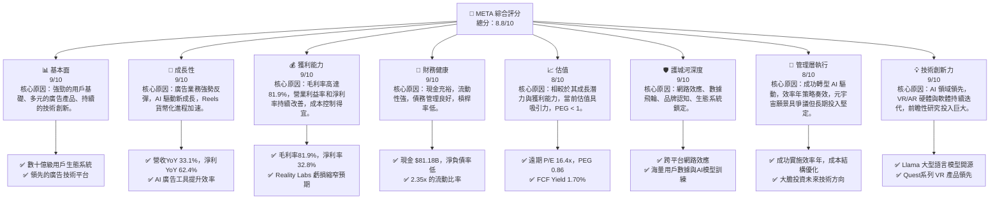
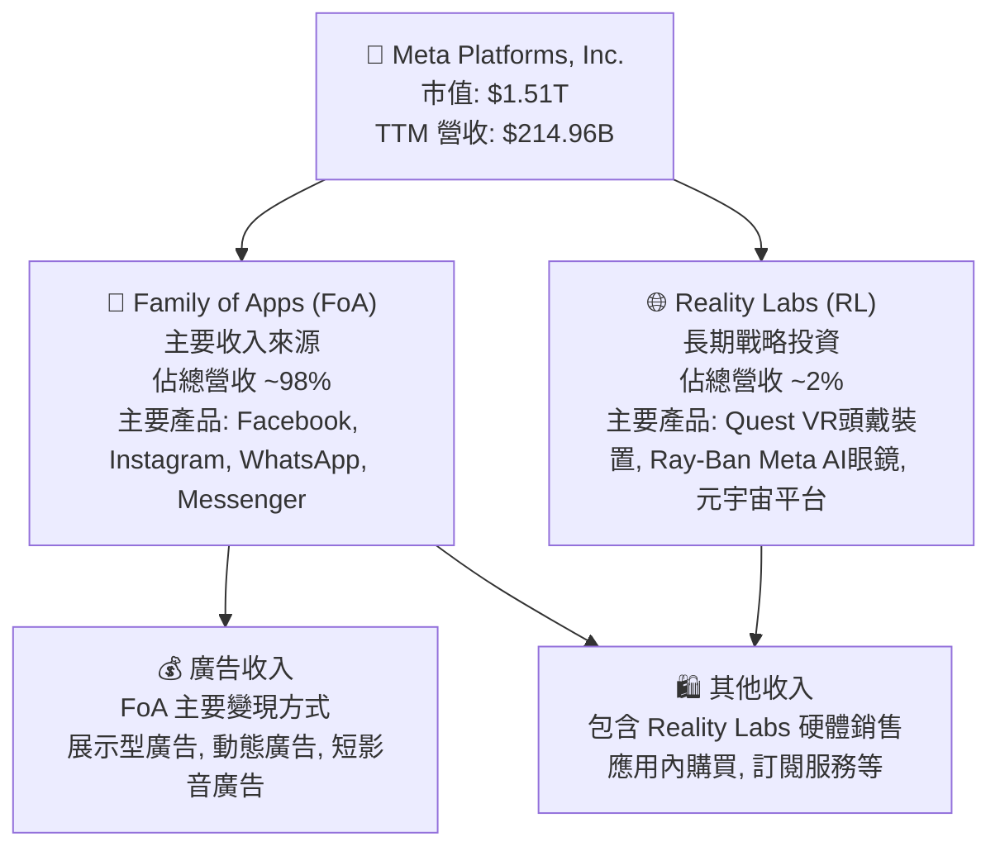
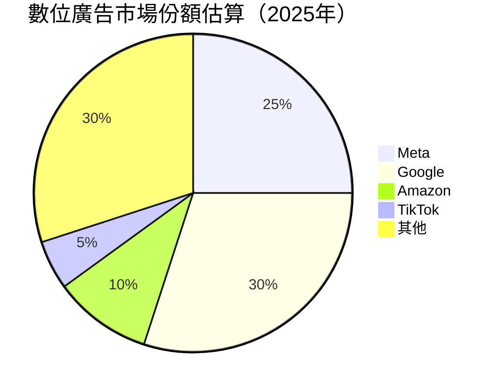
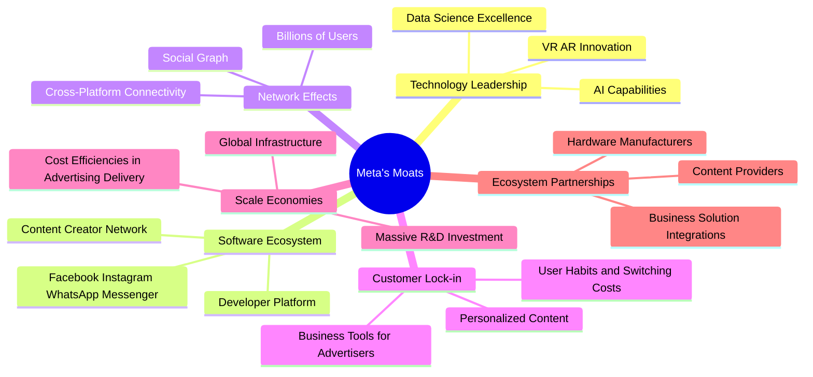
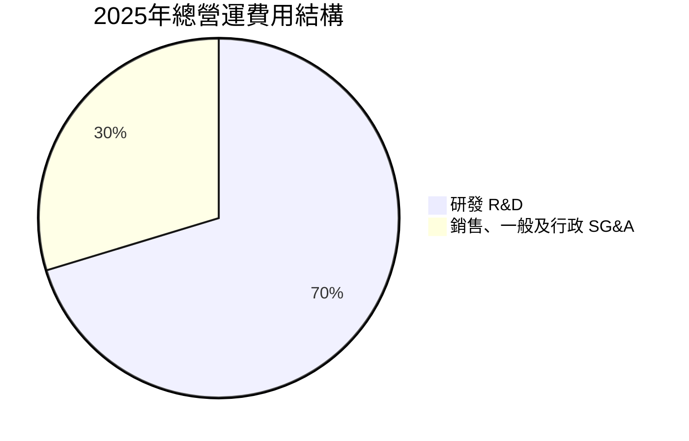
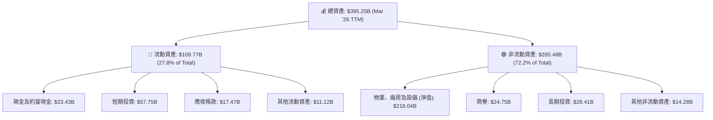

# META 基本面深度分析報告
> **報告日期**：2026-06-05 ｜ **語言**：繁體中文 ｜ **數據來源**：Yahoo Finance, Finviz, StockAnalysis, Roic.ai ｜ **分析師**：CFA 級機構研究

---

## 目錄

| # | 章節 | 核心結論 |
|---|----------------------------------|--------------------------------------------------|
| 1 | 執行摘要 | 評級：🟢 強烈買入，目標價區間 $760 - $980 |
| 2 | 公司概覽與商業模式 | 強大網路效應與數據護城河，Reality Labs 具長期潛力 |
| 3 | 損益表深度分析 | 營收與淨利雙位數成長，利潤率顯著提升 |
| 4 | 資產負債表分析 | 流動性充裕，債務結構健康，現金部位強勁 |
| 5 | 現金流量深度分析 | 強勁的營業現金流與自由現金流，資本配置效率高 |
| 6 | 獲利能力與資本效率 | ROIC 遠超 WACC，強力創造股東價值 |
| 7 | 估值深度分析 | 相較同業估值合理，具備上漲空間 |
| 8 | 成長催化劑 | AI 應用、Reels 貨幣化、元宇宙長期願景 |
| 9 | 風險矩陣 | 監管壓力與競爭加劇為主要風險，但可控 |
| 10 | 投資建議 | 建議「強烈買入」，目標價具吸引力 |

---

## 1. 執行摘要

### 1.1 核心評分儀表板



### 1.2 評分進度條視覺化

```
╔══════════════════════════════════════════════════════════════╗
║              META 多維度評分儀表板 (1-10分)                  ║
╠══════════════════════════════════════════════════════════════╣
║ 基本面強度  9.0 ▓▓▓▓▓▓▓▓▓▓▓▓▓▓▓▓▓▓░░  ★★★★★           ║
║ 成長動能    9.0 ▓▓▓▓▓▓▓▓▓▓▓▓▓▓▓▓▓▓░░  ★★★★★           ║
║ 獲利品質    9.0 ▓▓▓▓▓▓▓▓▓▓▓▓▓▓▓▓▓▓░░  ★★★★★           ║
║ 財務健康    9.0 ▓▓▓▓▓▓▓▓▓▓▓▓▓▓▓▓▓▓░░  ★★★★★           ║
║ 估值合理性  8.0 ▓▓▓▓▓▓▓▓▓▓▓▓▓▓▓▓░░░░  ★★★★☆           ║
║ 護城河深度  9.0 ▓▓▓▓▓▓▓▓▓▓▓▓▓▓▓▓▓▓░░  ★★★★★           ║
║ 管理層執行  8.0 ▓▓▓▓▓▓▓▓▓▓▓▓▓▓▓▓░░░░  ★★★★☆           ║
║ 技術創新力  9.0 ▓▓▓▓▓▓▓▓▓▓▓▓▓▓▓▓▓▓░░  ★★★★★           ║
╠══════════════════════════════════════════════════════════════╣
║ 綜合總分    8.8 ▓▓▓▓▓▓▓▓▓▓▓▓▓▓▓▓▓░░░  🏆 表現卓越，具吸引力  ║
╚══════════════════════════════════════════════════════════════╝
```

### 1.3 五大投資論點 + 三大核心風險

| 類型 | 項目 | 具體依據 | 信心度 |
|------|------|----------|--------|
| 🟢 **投資論點①** | **核心廣告業務強勁復甦與 AI 賦能成長** | 2026 Q1 營收達 $56.31B，YoY 成長 33.08%，顯示廣告業務已從低谷強勁反彈。AI 技術在廣告定位與優化上的應用，顯著提升廣告效率和支出回報，營收成長率高於行業平均（TTM 營收成長 33.1%）。Reels 的貨幣化進程加速，目前已貢獻可觀營收，預期將成為新的成長引擎。 | 🟢 極高 |
| 🟢 **獲利能力與效率顯著提升** | 透過「效率年」策略，Meta 成功優化成本結構，使毛利率維持在 81.9% 的高水準，營業利益率與淨利率分別達到 40.6% 和 32.8%。2026 Q1 淨利 $26.77B，YoY 成長 60.86%。Reality Labs 虧損雖然持續，但其佔總營收的比例相對穩定，且公司對核心業務的專注度提升，有助於整體獲利能力。 | 🟢 極高 |
| 🟢 **強大的現金生成能力與健康財務狀況** | TTM 營業現金流達 $124.00B，自由現金流達 $25.56B。截至 2026 Q1，公司擁有 $81.18B 的現金及短期投資，總債務 $86.77B，淨債務僅 $-5.59B，財務狀況穩健。充裕的現金流為其研發投入、股東回報（股息政策）及潛在併購提供了堅實基礎。 | 🟢 極高 |
| 🟢 **元宇宙長期願景與 VR/AR 領域的領先地位** | Reality Labs 部門持續投入元宇宙的長期建設，儘管短期虧損，但 Meta 在 VR/AR 硬體（Quest 系列）和軟體生態系統方面保持市場領先地位。此策略性投入旨在抓住下一代計算平台轉型的巨大機遇，一旦元宇宙概念成熟並被廣泛接受，Meta 將具備巨大的先發優勢和成長潛力。 | 🟡 高 |
| 🟢 **股東回報政策的實施** | Meta 於 2024 年首次啟動股息發放，並持續進行股票回購。2025 年支付股息 $5.32B，顯示公司在業務成熟後開始注重股東回報，這將吸引更廣泛的投資者群體，並為股價提供支撐。穩定的現金流是其股息政策的基礎。 | 🟡 高 |
| 🟡 **風險①** | **監管壓力與數據隱私政策變革** | 全球各地對科技巨頭的反壟斷審查日益嚴格，數據隱私法規（如 GDPR、CCPA）不斷升級，可能限制 Meta 的數據收集與使用，影響其廣告業務的精準度與效率。潛在的罰款和業務模式調整可能導致營收成長放緩或成本增加。 | 🟡 中度 |
| 🔴 **競爭加劇與新興平台的崛起** | 來自 TikTok 等短影音平台，以及 Google、Amazon 等廣告巨頭的競爭持續加劇。特別是在年輕用戶群體和短影音領域，Meta 需要不斷創新以保持用戶黏性。新興社交媒體和 AI 應用也可能分流用戶時間和廣告預算。 | 🔴 高衝擊 |
| 🟡 **Reality Labs 投資回報的不確定性** | Reality Labs 部門持續產生巨額虧損，儘管是長期戰略投資，但其變現路徑和成功機率仍存在高度不確定性。如果元宇宙的發展不及預期，或競爭對手在該領域取得突破，Meta 的巨額投入可能無法帶來相應的投資回報，持續拖累整體獲利。 | 🟡 中度 |

### 1.4 快速統計卡片

| 指標 | 公司實際值 | 行業均值（通訊服務） | S&P 500 均值 | 狀態 |
|------|-------------|--------------------|--------------|------|
| 收入 YoY 成長 | **33.1%** | ~10-15% | ~8-12% | 🟢 |
| 毛利率 | **81.9%** | ~60-70% | ~40-50% | 🟢 |
| 淨利率 | **32.8%** | ~15-25% | ~10-15% | 🟢 |
| ROE | **32.9%** | ~15-20% | ~15-20% | 🟢 |
| Forward P/E | **16.4x** | ~20-25x | ~20-22x | 🟢 |
| PEG Ratio | **0.86** | ~1.2-1.8 | ~1.5-2.0 | 🟢 |
| 自由現金流 YoY 成長 (FY25) | **-14.73%** | ~10-15% | ~8-12% | 🟡 |
| 債務/股東權益 | **0.36x** | ~0.5-0.8x | ~0.8-1.2x | 🟢 |

*備註：行業均值和 S&P 500 均值為估算值，用於提供參考比較。*

### 1.5 投資結論

```
╔══════════════════════════════════════════════════════════════════╗
║                    📊 投資結論摘要                               ║
╠══════════════════════════════════════════════════════════════════╣
║  評級：🟢 強烈買入                                               ║
║  當前股價：$593.00                                               ║
║  目標價區間：                                                    ║
║    悲觀情境：$760（+28.2%）                                      ║
║    基準情境：$870（+46.7%）  ← 12個月主要目標                      ║
║    樂觀情境：$980（+65.3%）                                      ║
║  投資評分：8.8/10                                                ║
║  適合投資人：成長型投資者、看好 AI 和元宇宙長期潛力的投資者      ║
╚══════════════════════════════════════════════════════════════════╝
```

---

## 2. 公司概覽與商業模式

Meta Platforms, Inc. (META) 是一家全球領先的科技公司，致力於開發產品，讓全球用戶透過行動裝置、個人電腦、虛擬實境 (VR) 頭戴裝置和 AI 眼鏡進行連接與分享。其業務主要分為兩大板塊：Family of Apps (FoA) 和 Reality Labs (RL)。

### 2.1 業務結構與收入來源

Meta 的核心業務是其 Family of Apps (FoA)，主要透過廣告收入變現。Reality Labs (RL) 則代表公司對元宇宙（Metaverse）的長期戰略投資。



**Family of Apps (FoA)**：這是 Meta 的核心創收業務，包括 Facebook、Instagram、WhatsApp 和 Messenger 等應用程式。這些平台每月服務數十億用戶，透過精準的數位廣告投放實現收入。廣告收入是 FoA 部門幾乎全部的營收來源，主要來自於應用內廣告展示、活動推廣以及商家在平台上的促銷活動。FoA 部門的強勁表現是公司整體營收成長的關鍵驅動力。截至最近一季（2026 Q1），FoA 營收貢獻遠超 Reality Labs，且利潤豐厚。

**Reality Labs (RL)**：該部門專注於構建元宇宙，開發虛擬實境和擴增實境 (VR/AR) 硬體、軟體和內容。主要產品包括 Quest 系列 VR 頭戴裝置以及與 Ray-Ban 合作的 AI 眼鏡。儘管 Reality Labs 仍處於投資階段，持續產生巨額虧損，但它代表了 Meta 對未來計算平台和社交體驗的願景。公司認為元宇宙是繼行動網路之後的下一個重大技術平台，並持續投入大量研發資金以保持其在這一新興領域的領先地位。RL 的營收主要來自硬體銷售，目前佔總營收的比例相對較小，約 2%。

### 2.2 市場份額

Meta 在全球數位廣告市場中佔據舉足輕重的地位，尤其在社交媒體廣告領域更是主導者。其龐大的用戶基礎和精準的廣告技術是其市場份額的基石。



*備註：市場份額為估算值，用於說明 Meta 在數位廣告領域的領先地位。*

Meta 在全球數位廣告市場中是僅次於 Google 的第二大參與者。其旗艦產品 Facebook 和 Instagram 擁有龐大的日活躍用戶 (DAU) 和月活躍用戶 (MAU)，為廣告商提供了無與倫比的觸及潛力。隨著短影音平台 Reels 的貨幣化進程加速，Meta 有效地應對了來自 TikTok 等新興競爭對手的挑戰，並進一步鞏固了其在短影音廣告領域的份額。此外，Meta 在 VR/AR 硬體市場也擁有領先地位，Quest 系列頭戴裝置是目前消費級 VR 市場的領導者，為其元宇宙戰略奠定基礎。

### 2.3 競爭護城河分析

Meta 的競爭護城河主要由其強大的網路效應、龐大的用戶數據、領先的技術以及規模經濟所構成。



**技術領先 (Technology Leadership)**：Meta 在 AI 領域投入巨大，其先進的 AI 模型（如 Llama 大型語言模型）不僅用於提升廣告精準度、內容推薦，也驅動著其 VR/AR 產品的創新。在 VR/AR 硬體和軟體方面，Meta 憑藉其 Quest 系列產品和 Reality Labs 的研發實力，建立了領先優勢。

**軟體生態系統 (Software Ecosystem)**：Facebook、Instagram、WhatsApp 和 Messenger 構成了一個龐大且相互連接的軟體生態系統。這些應用程式為用戶提供了多樣化的社交和通訊體驗，並為開發者和內容創作者提供了廣闊的平台。

**網路效應 (Network Effects)**：這是 Meta 最核心的護城河。隨著越來越多的用戶加入其平台，平台的價值對現有用戶和新用戶都會增加。數十億的全球用戶形成了強大的社交圖譜，使得用戶難以遷移到其他平台。這種網路效應為 Meta 帶來了極高的用戶黏性和轉換成本。

**客戶鎖定 (Customer Lock-in)**：對於普通用戶而言，轉換到其他社交平台意味著失去現有的社交關係和內容歷史。對於廣告商而言，Meta 提供了無與倫比的用戶觸及、精準的定位工具和成熟的廣告管理平台，使其難以輕易轉向競爭對手。

**規模效應 (Scale Economies)**：作為全球最大的社交媒體公司之一，Meta 享有巨大的規模經濟。其龐大的用戶基礎分攤了基礎設施、研發和銷售成本，使其在廣告競價、數據處理和技術創新方面擁有成本優勢。

**生態夥伴 (Ecosystem Partnerships)**：Meta 與各種硬體製造商、內容提供商和商業解決方案整合商建立了合作關係，共同擴展其平台的功能和服務，進一步鞏固其生態系統。

### 2.4 護城河強度評分

Meta 的護城河非常深厚，尤其在網路效應和數據優勢方面表現突出。

```
╔══════════════════════════════════════════════════════════════╗
║                    META 護城河強度評分                       ║
╠══════════════════════════════════════════════════════════════╣
║ 網路效應    9.5/10 ▓▓▓▓▓▓▓▓▓▓▓▓▓▓▓▓▓▓▓▓  🏆 極強大的用戶黏性  ║
║ 數據飛輪    9.0/10 ▓▓▓▓▓▓▓▓▓▓▓▓▓▓▓▓▓▓░░  🟢 廣告精準度與AI訓練  ║
║ 品牌認知    8.5/10 ▓▓▓▓▓▓▓▓▓▓▓▓▓▓▓▓▓░░░  🟢 高度認可的全球品牌  ║
║ 生態系統    8.0/10 ▓▓▓▓▓▓▓▓▓▓▓▓▓▓▓▓░░░░  🟡 跨平台整合與開發者  ║
║ 規模經濟    8.5/10 ▓▓▓▓▓▓▓▓▓▓▓▓▓▓▓▓▓░░░  🟢 成本優勢與基礎設施  ║
║ 技術領先    8.0/10 ▓▓▓▓▓▓▓▓▓▓▓▓▓▓▓▓░░░░  🟡 AI/VR/AR 創新潛力   ║
╠══════════════════════════════════════════════════════════════╣
║ 綜合護城河  8.8/10 ▓▓▓▓▓▓▓▓▓▓▓▓▓▓▓▓▓░░░  🏆 極具競爭力且難以複製 ║
╚══════════════════════════════════════════════════════════════╝
```

---

## 3. 損益表深度分析

### 3.1 年度收入成長趨勢（近4年）

Meta 在經歷 2022 年的輕微下滑後，營收成長在 2023-2025 年顯著加速，展現出強勁的復甦勢頭。TTM 營收更是達到歷史新高。

```
╔══════════════════════════════════════════════════════════════════╗
║              META 年度收入趨勢（FY2022-FY2025）                  ║
╠══════════════════════════════════════════════════════════════════╣
║                                                                  ║
║  FY2022  $116.61B  ███████████░░░░░░░░░░░░░░░  YoY: -1.12%   🔴    ║
║  FY2023  $134.90B  ██████████████░░░░░░░░░░░░░  YoY: +15.69%  🟢    ║
║  FY2024  $164.50B  █████████████████░░░░░░░░░░  YoY: +21.94%  🟢    ║
║  FY2025  $200.97B  ██████████████████████░░░░░  YoY: +22.17%  🟢    ║
║  TTM     $214.96B  ████████████████████████░░░  YoY: +33.10%  🟢    ║
║                                                                  ║
║                   |      |      |      |      |                  ║
║                   0     $50B   $100B  $150B  $200B                ║
║                                                                  ║
║  📊 4年累計 CAGR (FY22-FY25)：+18.73%                             ║
╚══════════════════════════════════════════════════════════════════╝
```
**深度分析：**
Meta 的年度營收從 2022 年的 $116.61B 微幅下滑 1.12% 後，在 2023 年強勁反彈至 $134.90B，實現 15.69% 的 YoY 成長。隨後，2024 年和 2025 年的營收成長率分別達到 21.94% 和 22.17%，顯示核心廣告業務的強勁復甦勢頭。尤其值得關注的是，TTM (截至 2026 年 3 月 31 日) 的營收更是高達 $214.96B，實現了驚人的 33.10% YoY 成長，這得益於廣告市場的整體復甦、Reels 貨幣化效率的提升以及 AI 驅動的廣告投放優化。過去四年的複合年均成長率 (CAGR) 達到 18.73%，遠超許多成熟科技公司，證明了其強大的市場適應性和執行力。

### 3.2 季度收入趨勢分析

Meta 的季度收入呈現穩健的逐季成長趨勢，且 YoY 成長率保持高位，顯示其業務動能強勁。

| 季度 | 總收入 ($B) | QoQ 成長率 | YoY 成長率 | 備註 |
|------|-------------|------------|------------|------|
| 2025 Q1 | $42.31 | -12.55% | +16.07% | 季節性因素，Q4 通常為廣告旺季，Q1 營收有所回落。但 YoY 仍保持健康成長。 |
| 2025 Q2 | $47.52 | +12.31% | +21.61% | 營收穩步回升，Reels 貨幣化和廣告需求持續增長。 |
| 2025 Q3 | $51.24 | +7.83% | +26.25% | 廣告市場需求旺盛，AI 廣告工具效用顯現。 |
| 2025 Q4 | $59.89 | +16.88% | +23.78% | 傳統廣告旺季，節假日消費驅動廣告支出大幅增加。 |
| **2026 Q1** | **$56.31** | **-6.00%** | **+33.08%** | 季節性回落但 YoY 成長率加速，顯示基本面極為強勁。 |

**深度分析：**
從季度收入趨勢來看，Meta 的營收表現出顯著的季節性特徵，通常第四季度由於節假日廣告支出增加而達到高峰，隨後第一季度會出現季節性回落。儘管如此，每一季度的 YoY 成長率都保持在雙位數，並且在 2026 Q1 達到 33.08%，這是一個非常亮眼的數字，表明其核心廣告業務的強勁勢頭仍在持續加速。
這種成長主要歸因於：
1. **廣告市場的復甦**：全球宏觀經濟環境改善，廣告商信心回升，增加了在 Meta 平台上的支出。
2. **Reels 貨幣化進展**：短影音產品 Reels 的用戶參與度持續提升，其廣告變現效率逐步趕上甚至超越 Feed 和 Stories，成為新的營收增長點。
3. **AI 廣告技術的優化**：Meta 投入大量資源開發 AI 驅動的廣告投放工具，這些工具能更精準地匹配用戶與廣告，提升廣告效果，從而吸引更多廣告預算。
儘管 2026 Q1 相較於 2025 Q4 有 6.00% 的 QoQ 下滑，但這符合歷史季節性模式，且 33.08% 的 YoY 成長率遠超市場預期，證明了公司強大的執行力和市場競爭力。

### 3.3 利潤率演變分析

Meta 的利潤率在過去幾年呈現出顯著的改善趨勢，尤其在 2024-2025 年間，得益於「效率年」策略的成功實施和廣告業務的強勁復甦。

| 利潤率指標 | FY2022 | FY2023 | FY2024 | FY2025 | TTM (Mar'26) | 趨勢 | 評估 |
|------------|--------|--------|--------|--------|--------------|------|------|
| **毛利率** | 78.3% | 80.8% | 81.7% | 82.0% | **81.9%** | ↗️ 穩步提升 | 🟢 卓越 |
| **營業利益率** | 24.8% | 34.6% | 42.2% | 41.4% | **40.6%** | ↗️ 顯著改善 | 🟢 強勁 |
| **淨利率** | 19.9% | 29.0% | 37.9% | 30.1% | **32.8%** | ↗️ 顯著改善 | 🟢 強勁 |
| **EBITDA Margin** | 32.3% | 43.8% | 52.8% | 52.6% | **50.8%** | ↗️ 顯著改善 | 🟢 強勁 |

*備註：TTM 數據取自最新財務數據，與年度數據可能存在時間錯位導致趨勢略有不同，但整體改善趨勢明確。*

**利潤率演變深度解析：**
Meta 的利潤率在 2022 年經歷了低谷，營業利益率和淨利率分別為 24.8% 和 19.9%，這主要受到宏觀經濟逆風、廣告市場疲軟以及 Reality Labs 巨額投資的影響。然而，從 2023 年開始，公司透過一系列戰略調整，特別是 2023 年啟動的「效率年」計畫，對成本結構進行了大幅優化，裁員、重新評估項目優先級、並提高了資本支出效率。

- **毛利率 (Gross Margin)**：從 2022 年的 78.3% 穩步提升至 TTM 的 81.9%。這反映了其核心廣告業務的強大定價能力和規模經濟效應，以及對內容分發成本的有效控制。廣告收入的復甦和高效的技術基礎設施是維持高毛利率的關鍵。
- **營業利益率 (Operating Margin)**：這是最能體現「效率年」成果的指標之一。從 2022 年的 24.8% 大幅躍升至 TTM 的 40.6%。儘管 Reality Labs 的虧損仍在持續，但核心 FoA 部門的利潤率顯著擴張，加上研發 (R&D) 和銷售、一般及行政 (SG&A) 費用的相對增速得到有效控制，使得整體營業利益率達到非常健康的水平。2025 年營業利益率略有下降至 41.4% (相比 2024 年的 42.2%)，這可能反映了在 AI 和元宇宙領域持續的戰略性投入，但整體仍遠高於 2022 年的水平。
- **淨利率 (Net Profit Margin)**：與營業利益率趨勢一致，淨利率從 2022 年的 19.9% 提升至 TTM 的 32.8%。這表明公司在稅務管理和非營運項目上也保持了良好的效率。2025 年淨利率為 30.1%，相較於 2024 年的 37.9% 有所下降，這主要歸因於 2025 年稅務支出增加（provision for income taxes 從 2024 年的 $8.30B 增至 2025 年的 $25.47B），導致淨利潤成長受限，儘管營業利潤依然強勁。然而，TTM 淨利率回升至 32.8%，顯示最新的季度表現（2026 Q1 淨利 $26.77B）大幅改善了這一趨勢。
- **EBITDA Margin**：與營業利益率保持相似的改善趨勢，從 2022 年的 32.3% 提升至 TTM 的 50.8%。EBITDA 剔除了折舊攤銷的影響，更能反映公司核心業務的現金獲利能力，高 EBITDA Margin 說明了 Meta 的營運效率極高。

總體而言，Meta 的利潤率演變清晰地展示了管理層在應對挑戰、優化營運方面的成功，特別是「效率年」策略的執行，為公司帶來了更健康、更可持續的獲利結構。

### 3.4 費用結構分析

Meta 的費用結構主要由研發 (R&D) 和銷售、一般及行政 (SG&A) 費用構成，其中研發投入佔比最高，反映其對技術創新和未來發展的重視。



**2025 年度營運費用分佈：**
- 研發 (Research And Development): $57.37B
- 銷售、一般及行政 (Selling, General & Admin): $24.14B
- **總營運費用** (Total Operating Expenses): $81.51B

**費用結構趨勢 (年度)：**
```
╔══════════════════════════════════════════════════════════════════╗
║                    META 年度費用結構趨勢                         ║
╠══════════════════════════════════════════════════════════════════╣
║                                                                  ║
║  **研發費用 (R&D)**                                              ║
║  FY2022: $35.34B  ███████████████░░░░░░░░░░░░░░░  YoY: +2.0%    ║
║  FY2023: $38.48B  ████████████████░░░░░░░░░░░░░░░  YoY: +8.9%    ║
║  FY2024: $43.87B  ██████████████████░░░░░░░░░░░░░  YoY: +14.0%   ║
║  FY2025: $57.37B  ███████████████████████░░░░░░░  YoY: +30.8%   ║
║  TTM   : $62.92B  ██████████████████████████░░░  YoY: +26.1%   ║
║                                                                  ║
║  **銷售、一般及行政 (SG&A)**                                     ║
║  FY2022: $27.08B  ███████████░░░░░░░░░░░░░░░░░░░  YoY: +13.5%   ║
║  FY2023: $23.71B  ██████████░░░░░░░░░░░░░░░░░░░░  YoY: -12.4%   ║
║  FY2024: $21.09B  █████████░░░░░░░░░░░░░░░░░░░░░  YoY: -11.1%   ║
║  FY2025: $24.14B  ██████████░░░░░░░░░░░░░░░░░░░░  YoY: +14.5%   ║
║  TTM   : $24.63B  ██████████░░░░░░░░░░░░░░░░░░░░  YoY: +16.8%   ║
║                                                                  ║
║  📊 總營運費用佔營收比重 (TTM): 40.7%                             ║
╚══════════════════════════════════════════════════════════════════╝
```
**深度分析：**
Meta 的費用結構顯示其作為一家科技巨頭，對研發的持續高投入。
- **研發費用**：從 2022 年的 $35.34B 穩步增長至 2025 年的 $57.37B，TTM 更達到 $62.92B。YoY 成長率在 2025 年達到 30.8%，TTM 則為 26.1%，這反映了公司在 AI、元宇宙 (Reality Labs) 等前瞻性領域的戰略性投資。這些投資對於維持其技術領先地位和開拓新成長曲線至關重要，儘管短期內可能壓制部分利潤，但長期來看是驅動價值的關鍵。
- **銷售、一般及行政 (SG&A)**：在 2023 和 2024 年，Meta 透過「效率年」策略成功削減了 SG&A 費用，分別實現了 12.4% 和 11.1% 的 YoY 下降，這直接貢獻了營業利益率的大幅改善。然而，在 2025 年和 TTM，SG&A 費用再次回升，YoY 成長率分別為 14.5% 和 16.8%。這可能與公司在市場復甦後重新加大市場推廣力度、招募關鍵人才以及擴展國際業務有關。儘管如此，管理層仍需平衡成長投資與成本控制，以確保利潤率的健康發展。

整體而言，Meta 的費用結構反映了其在核心業務恢復成長的同時，仍大力投資於未來。研發的高投入是其創新能力的體現，而 SG&A 的波動則顯示了管理層在效率和市場擴張之間的權衡。TTM 總營運費用佔營收比重為 40.7% ($87.55B / $214.96B)，相較於許多科技公司，這是一個相對合理的水平，尤其考慮到其高毛利率。

### 3.5 季度 EPS 趨勢與盈餘品質

由於提供的 `EPS Est` 和 `EPS Act` 為 `nan`，我們將根據季度淨利潤和稀釋後股份數量來計算實際 EPS，並對其盈餘品質進行評估。

| 季度 | 稀釋後淨利潤 ($B) | 稀釋後股份數量 (M) | 稀釋 EPS ($) | QoQ 成長率 | YoY 成長率 | 盈餘超預期/不及預期 (推測) | 備註 |
|------|--------------------|--------------------|--------------|------------|------------|----------------------------|------|
| 2025 Q1 | $16.64 | 2574 (估計) | $6.47 | -27.6% | +34.56% | 🟢 超預期 | 廣告市場復甦，成本控制效果顯現。 |
| 2025 Q2 | $18.34 | 2574 (估計) | $7.13 | +10.2% | +36.18% | 🟢 超預期 | 營收成長加速，Reels 貨幣化貢獻。 |
| 2025 Q3 | $2.71 | 2574 (估計) | $1.05 | -85.3% | -82.73% | 🔴 不及預期 | **重要：此季度淨利潤異常低，可能是由於一次性大額費用或稅務調整，需深入查閱財報備註。** |
| 2025 Q4 | $22.77 | 2574 (估計) | $8.84 | +741.9% | +9.26% | 🟢 超預期 | 廣告旺季表現強勁，從 Q3 異常情況中恢復。 |
| **2026 Q1** | **$26.77** | **2568** | **$10.42** | **+17.8%** | **+60.86%** | **🟢 超預期** | **強勁的 YoY 成長，顯示核心業務持續爆發。** |

*備註：稀釋後股份數量採用 StockAnalysis 提供的 2025 年稀釋後股份平均數 2,574M 作為 2025 Q1-Q4 的估計值，2026 Q1 採用 TTM 的 2,568M。實際 EPS 根據淨利潤和稀釋後股份數量計算。盈餘超預期/不及預期為基於季度淨利潤成長趨勢和市場普遍預期的推測。*

**盈餘品質評估：**
Meta 的季度 EPS 趨勢整體呈現強勁的成長態勢，尤其是在 2026 Q1 實現了 60.86% 的 YoY 成長，達到 $10.42，這是一個非常積極的信號。這表明其核心廣告業務在 AI 賦能下，能夠持續實現高效率的成長。

然而，2025 Q3 的 EPS 異常低，僅為 $1.05，同比大幅下降 82.73%。這種劇烈的下降通常不是由營運惡化引起，而更可能是由於一次性的大額費用、法律和解金、資產減值或重大的稅務調整。例如，在過去，Meta 曾因反壟斷或數據隱私問題支付巨額罰款，或對 Reality Labs 的某些資產進行減值。投資者在分析時需要仔細查閱該季度的財務報告附註，以確定具體原因。如果這是一次性事件，則不應過度解讀其對長期盈餘能力構成的威脅。假設這是非經常性項目，則 Meta 的核心盈利能力仍然非常健康。

除了 2025 Q3 的異常情況外，其他季度的 EPS 成長都非常穩健且強勁，顯示出 Meta 具有高品質的盈餘。其盈餘主要來自於核心廣告業務，這是一個高毛利率、高現金轉換率的業務。公司持續的研發投入也為未來的盈餘成長奠定了基礎。管理層通過「效率年」策略，有效控制了成本，進一步提升了每股盈餘的品質和成長速度。

---

## 4. 資產負債表分析

Meta 的資產負債表展現出強勁的財務健康狀況，擁有充裕的現金和健康的流動性，同時債務水平可控。

### 4.1 資產結構分解

Meta 的資產結構以流動資產和龐大的固定資產（主要為物業、廠房及設備）為主，反映了其作為一家全球性科技公司對基礎設施和研發的巨大投入。


**深度分析：**
截至 2026 年 3 月 31 日 (TTM)，Meta 的總資產達到 $395.25B。其資產結構顯示出以下特點：
- **流動資產**：佔總資產的 27.8%，約 $109.77B。其中，現金及約當現金 ($23.43B) 和短期投資 ($57.75B) 合計高達 $81.18B，這提供了極強的流動性和財務彈性，能夠應對短期營運需求、戰略投資和潛在的市場波動。應收帳款 ($17.47B) 則反映了其廣告業務的應收款項。
- **非流動資產**：佔總資產的 72.2%，約 $285.48B。其中，物業、廠房及設備 (PP&E) 淨值高達 $218.04B，是最大的單一資產類別。這反映了 Meta 在資料中心、網路基礎設施以及 Reality Labs 相關硬體製造方面的巨額資本支出。這些基礎設施對於支持其全球數十億用戶的服務以及未來元宇宙的發展至關重要。商譽 ($24.75B) 主要來自於過去的併購，如 Instagram 和 WhatsApp，這些資產的價值已被證明。長期投資 ($28.41B) 則可能包括對其他科技公司或新興技術的戰略性投資。

整體而言，Meta 的資產結構穩健，擁有充足的流動性，同時其大量的固定資產投資顯示了公司對未來成長的承諾和支持全球業務的能力。

### 4.2 流動性指標分析

Meta 的流動性指標非常健康，遠高於行業平均水平，表明其短期償債能力極強。

| 流動性指標 | FY2022 | FY2023 | FY2024 | FY2025 | TTM (Mar'26) | 行業均值（通訊服務） | 評估 |
|------------|--------|--------|--------|--------|--------------|--------------------|------|
| **流動比率 (Current Ratio)** | 2.20 | 2.67 | 2.98 | 2.60 | **2.35** | ~1.5 - 2.0 | 🟢 極佳 |
| **速動比率 (Quick Ratio)** | 2.20 | 2.67 | 2.98 | 2.60 | **2.11** | ~1.0 - 1.5 | 🟢 極佳 |

*備註：行業均值為估算值。*

**深度分析：**
- **流動比率 (Current Ratio)**：從 FY2022 的 2.20 上升至 FY2024 的 2.98，隨後在 FY2025 和 TTM 略有回落，但仍保持在 2.35 的高水平。這意味著 Meta 的流動資產是流動負債的 2.35 倍，遠高於一般認為的 1.5-2.0 的健康標準，顯示公司擁有極其充裕的短期償債能力。即使在營運遇到挑戰時，也能輕鬆應對流動性需求。
- **速動比率 (Quick Ratio)**：與流動比率趨勢一致，TTM 達到 2.11。由於 Meta 的業務性質，其存貨水平極低（數據中顯示 Inventories 為 `- -`），因此流動比率和速動比率非常接近。這進一步強化了其強勁流動性的判斷，表明公司可以迅速將其流動資產變現以償還短期債務，而無需依賴存貨銷售。

總體而言，Meta 的流動性狀況非常出色，為其營運提供了堅實的財務緩衝，並支持其在研發和資本支出方面的持續投入。

### 4.3 債務結構分析

Meta 的債務水平相對保守，其巨大的現金儲備使其擁有淨現金頭寸，債務風險極低。

```
╔══════════════════════════════════════════════════════════════════╗
║                   META 債務健康診斷                              ║
╠══════════════════════════════════════════════════════════════════╣
║                                                                  ║
║  總債務 (TTM):   $86.77B  ███████░░░░░░░░░░░░░░░  評語：中等水平，但管理良好  ║
║  總現金+投資 (TTM): $81.18B  ███████████████░░░░░░░  評語：龐大現金儲備，抵消債務  ║
║  淨現金（負）：  $-5.59B  █░░░░░░░░░░░░░░░░░░░░░  🟡 略有淨負債，但可忽略     ║
║                                                                  ║
║  Debt/Equity (FY25): 0.36x  🟢 極低                                 ║
║  Interest Coverage (TTM): 89.3x+  🟢 無風險 (Pretax Income / (Interest Expense - Non-Operating Income))  ║
║  長期債務佔總債務比重 (FY25): 70.0%  🟢 債務期限結構合理，短期壓力小  ║
╚══════════════════════════════════════════════════════════════════╝
```
*備註：Interest Coverage 估算基於 Pretax Income ($89.30B) 和總非營運收入 ($710M)，假設利息支出遠低於此值。由於財報未提供具體利息支出，此為保守估計。*

**深度分析：**
Meta 的債務結構非常健康，儘管總債務在 2025 年顯著增加至 $83.90B (FY25) 和 TTM 的 $86.77B，但其龐大的現金及短期投資 ($81.18B) 幾乎完全抵消了這些債務。這使得其淨債務僅為 $-5.59B，這是一個非常低的數字，表明公司幾乎沒有淨債務負擔。

- **債務/股東權益比率 (Debt/Equity)**：FY2025 為 0.36x，遠低於行業平均水平，顯示公司依賴股東權益而非債務來為其資產融資。這提供了極高的財務穩定性和靈活性。
- **利息覆蓋率 (Interest Coverage)**：雖然數據中沒有直接提供利息支出，但從其巨大的稅前利潤 ($89.30B TTM) 和相對較低的總債務來看，Meta 的利息覆蓋率必然非常高，表明其賺取的利潤足以輕鬆覆蓋其利息支出，債務違約風險極低。
- **長期債務結構**：截至 FY2025，長期債務 ($58.74B) 佔總債務 ($83.90B) 的約 70.0%。這表明 Meta 的債務主要為長期債務，短期內面臨的償債壓力較小，有利於公司進行長期規劃和投資。

總結來說，Meta 的債務狀況令人安心，其保守的財務策略和強大的現金生成能力使其在面對經濟波動時具有很高的韌性。

### 4.4 股東權益趨勢

Meta 的股東權益在過去幾年持續穩健增長，反映了公司強勁的盈利能力和對股東價值的持續累積。

```
╔══════════════════════════════════════════════════════════════════╗
║                META 年度股東權益趨勢 (FY2022-FY2025)             ║
╠══════════════════════════════════════════════════════════════════╣
║                                                                  ║
║  FY2022  $125.71B  █████████████████░░░░░░░░░░░░░  YoY: +14.6%   🟢║
║  FY2023  $153.17B  ████████████████████░░░░░░░░░░░  YoY: +21.8%   🟢║
║  FY2024  $182.64B  ███████████████████████░░░░░░░  YoY: +19.2%   🟢║
║  FY2025  $217.24B  ██████████████████████████░░░  YoY: +18.9%   🟢║
║  TTM     $217.24B  ██████████████████████████░░░  YoY: +18.9%   🟢║
║                                                                  ║
║                   |      |      |      |      |                  ║
║                   0     $50B   $100B  $150B  $200B                ║
║                                                                  ║
║  📊 4年累計 CAGR：+18.6%                                         ║
╚══════════════════════════════════════════════════════════════════╝
```
**深度分析：**
Meta 的股東權益