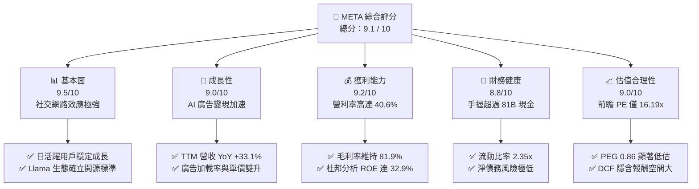
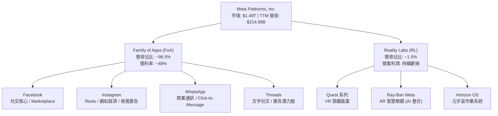
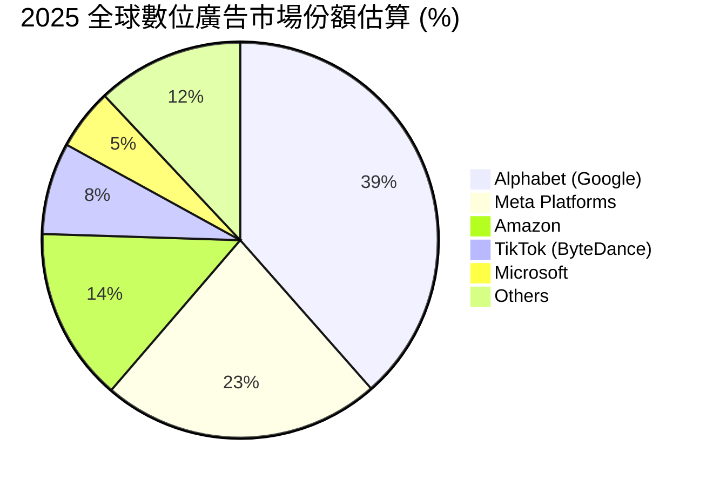

# META 基本面深度分析報告
> **報告日期**：2026-06-08 ｜ **語言**：繁體中文 ｜ **數據來源**：Yahoo Finance, Finviz, StockAnalysis, Roic.ai ｜ **分析師**：CFA 級機構研究

---

## 目錄

| # | 章節 | 核心結論 |
|---|---|---|
| 1 | **執行摘要** | 評級「強烈買入」，基準目標價 $828.80，隱含 41.6% 上行空間。 |
| 2 | **公司概覽與商業模式** | 社交網路效應與 Llama 開源 AI 生態雙重護城河，建構極高壁壘。 |
| 3 | **損益表深度分析** | TTM 營收突破 $214.9B，Q1 2026 成長 33.1%，AI 驅動變現效率創歷史新高。 |
| 4 | **資產負債表分析** | 現金與短期投資達 $81.18B，債務結構健康，流動性比率 2.35 極為穩健。 |
| 5 | **現金流量深度分析** | TTM 營運現金流 $124.0B，克服 AI 基礎設施 Capex 擴張，自由現金流仍達 $25.56B。 |
| 6 | **獲利能力與資本效率** | ROE 達 32.9%，ROIC 達 31.9% 遠超 WACC (10.0%)，強力創造股東價值。 |
| 7 | **估值深度分析** | 前瞻 P/E 僅 16.19x，相較歷史均值與同業顯著低估，PEG 0.86 具備極高性價比。 |
| 8 | **成長催化劑** | Generative AI 廣告工具、Reels 變現率提升、Threads 商業化與智慧眼鏡。 |
| 9 | **風險矩陣** | AI Capex 報酬率不及預期、反壟斷監管審查、隱私政策變更。 |
| 10| **投資建議** | 建議「分批佈局」，重點監控 FoA 用戶活躍度與 Reality Labs 虧損幅度。 |

---

## 1. 執行摘要

Meta Platforms, Inc. (META) 目前正處於其創立以來最強勁的商業與技術黃金交叉期。透過將先進的生成式 AI (Generative AI) 深度整合至其「應用程式家族 (Family of Apps, FoA)」，Meta 成功將其全球超過 32 億的日活躍用戶 (DAP) 轉化為極高效率的廣告變現機器。本報告將從基本面、財務結構、資本效率與估值模型出發，深度剖析 Meta 的長期投資價值。

### 1.1 核心評分儀表板



### 1.2 評分進度條視覺化

```
╔══════════════════════════════════════════════════════════════╗
║               META 多維度評分儀表板 (1-10分)                 ║
╠══════════════════════════════════════════════════════════════╣
║ 基本面強度  9.5 ▓▓▓▓▓▓▓▓▓▓▓▓▓▓▓▓▓▓▓░  ★★★★★           ║
║ 成長動能    9.0 ▓▓▓▓▓▓▓▓▓▓▓▓▓▓▓▓▓▓░░  ★★★★★           ║
║ 獲利品質    9.2 ▓▓▓▓▓▓▓▓▓▓▓▓▓▓▓▓▓▓▓░  ★★★★★           ║
║ 財務健康    8.8 ▓▓▓▓▓▓▓▓▓▓▓▓▓▓▓▓▓░░░  ★★★★☆           ║
║ 估值合理性  9.0 ▓▓▓▓▓▓▓▓▓▓▓▓▓▓▓▓▓▓░░  ★★★★★           ║
║ 護城河深度  9.5 ▓▓▓▓▓▓▓▓▓▓▓▓▓▓▓▓▓▓▓░  ★★★★★           ║
║ 管理層執行  9.0 ▓▓▓▓▓▓▓▓▓▓▓▓▓▓▓▓▓▓░░  ★★★★★           ║
║ 技術創新力  9.3 ▓▓▓▓▓▓▓▓▓▓▓▓▓▓▓▓▓▓▓░  ★★★★★           ║
╠══════════════════════════════════════════════════════════════╣
║ 綜合總分    9.1 ▓▓▓▓▓▓▓▓▓▓▓▓▓▓▓▓▓▓░░  🏆 強烈買入          ║
╚══════════════════════════════════════════════════════════════╝
```

### 1.3 五大投資論點與三大核心風險

| 類型 | 項目 | 具體依據 | 信心度 |
|------|------|----------|--------|
| 🟢 **投資論點①** | **AI 驅動廣告精準度革命** | Meta Advantage+ 廣告套件大幅提升 ROI，驅動 TTM 營收年增 33.1%，廣告單價與變現率顯著提升。 | 🟢 極高 |
| 🟢 **投資論點②** | **開源 AI 生態領航者** | Llama 系列模型確立了全球開源 AI 標準，吸引百萬開發者，繞過封閉生態系限制，降低 Meta 長期軟體授權與研發成本。 | 🟢 極高 |
| 🟢 **投資論點③** | **無可匹敵的社交網路效應** | Family of Apps (FoA) 擁有超過 32 億日活躍用戶，轉換成本極高，競爭對手（如 TikTok、Snap）難以撼動。 | 🟢 極高 |
| 🟢 **投資論點④** | **極致的資本報酬率** | ROE 達 32.9%，ROIC 達 31.9%，在進行高達 $69.69B (FY2025) 的資本支出下，依然創造 $25.56B 自由現金流。 | 🟢 高 |
| 🟢 **投資論點⑤** | **估值極具安全邊際** | Forward P/E 僅 16.19x，PEG 0.86，相較於標普 500 與其歷史估值中位數，呈現顯著的「高成長、低估值」錯配。 | 🟢 極高 |
| 🟡 **風險①** | **AI 基礎設施資本支出失控** | FY2025 資本支出高達 $69.69B，若 AI 應用變現速度放緩，折舊費用增加將侵蝕利潤率。 | 🟡 中度 |
| 🔴 **風險②** | **反壟斷與隱私法規監管** | 美國 FTC 與歐盟 DMA 持續針對 Meta 進行反壟斷審查，可能面臨鉅額罰款或業務拆分風險。 | 🔴 高衝擊 |
| 🟡 **風險③** | **Reality Labs 持續失血** | 元宇宙與硬體部門每年虧損超百億美元，短期內仍無法實現盈虧平衡，拖累整體利潤率。 | 🟡 中度 |

### 1.4 快速統計卡片

| 指標 | Meta 實際值 | 行業均值 (通訊服務) | S&P 500 均值 | 狀態 |
|------|-------------|---------------------|--------------|------|
| **營收 YoY 成長** | **33.1%** | ~6.5% | ~5.2% | 🟢 顯著領先 |
| **毛利率** | **81.9%** | ~50.2% | ~30.5% | 🟢 極高壁壘 |
| **營業利益率** | **40.6%** | ~18.5% | ~15.2% | 🟢 獲利能力極強 |
| **股東權益報酬率 (ROE)** | **32.9%** | ~12.4% | ~18.1% | 🟢 資本效率卓越 |
| **前瞻本益比 (Forward P/E)** | **16.19x** | ~19.5x | ~21.5x | 🟢 估值極具吸引力 |
| **債務權益比 (Debt/Equity)** | **35.6%** | ~75.3% | ~115.0% | 🟢 財務結構健康 |

### 1.5 投資結論

```
╔══════════════════════════════════════════════════════════════════╗
║                    📊 META 投資結論摘要                          ║
╠══════════════════════════════════════════════════════════════════╣
║  評級：🟢 強烈買入 (Strong Buy)                                  ║
║  當前股價：$585.39 (2026-06-08)                                  ║
║  目標價區間：                                                    ║
║    悲觀情境 (Bear Case)：$700.00 (+19.6%)                        ║
║    基準情境 (Base Case)：$828.80 (+41.6%)  ← 12個月主要目標      ║
║    樂觀情境 (Bull Case)：$1015.00 (+73.4%)                       ║
║  投資評分：9.1 / 10                                              ║
║  適合投資人：成長型投資者、長線價值投資者、AI 產業佈局者          ║
╚══════════════════════════════════════════════════════════════════╝
```

---

## 2. 公司概覽與商業模式

Meta Platforms, Inc. 運營著全球最龐大且最具粘性的社交網路生態系統，並正在轉型為全球 AI 基礎設施與開源技術的領航者。其業務主要劃分為兩大核心板塊：**Family of Apps (FoA)** 與 **Reality Labs (RL)**。

### 2.1 業務結構與收入來源



### 2.2 全球數位廣告市場份額估算

在數位廣告領域，Meta 與 Alphabet (Google) 長期維持雙雄壟斷 (Duopoly) 地位。隨著亞馬遜與 TikTok 的崛起，市場結構略有變化，但 Meta 憑藉 AI 推薦演算法升級，市佔率依然穩固。



### 2.3 競爭護城河分析

Meta 的競爭護城河由多重壁壘交織而成，使其具備極高的抗風險能力與獲利持續性：

```mermaid
mindmap
  root((META Mo