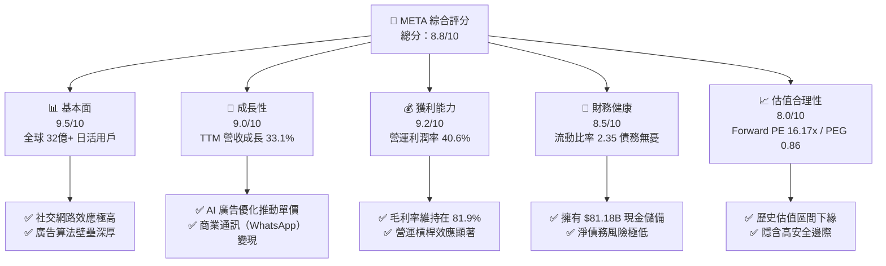
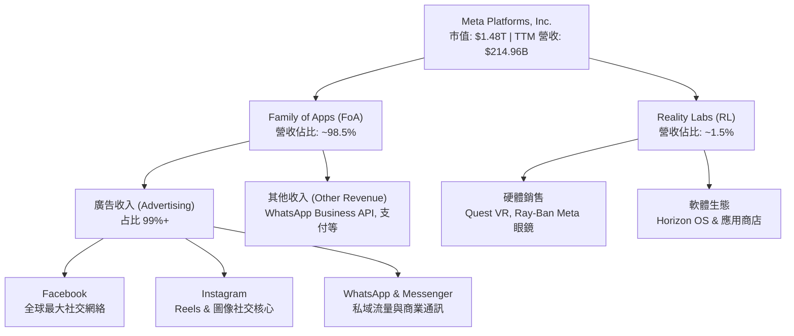
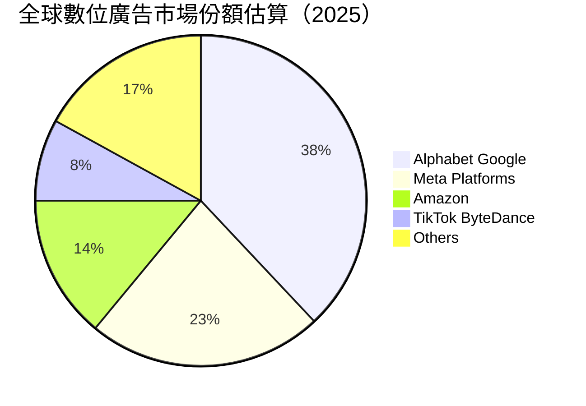
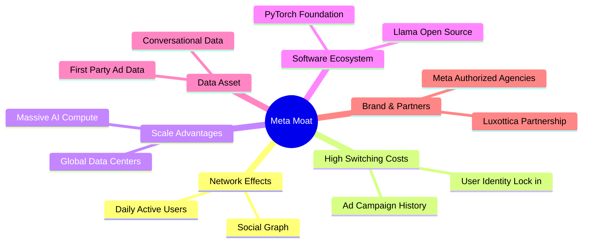

# META 基本面深度分析報告

> **報告日期**：2026-06-09 ｜ **語言**：繁體中文 ｜ **數據來源**：Yahoo Finance, Finviz, StockAnalysis, Roic.ai ｜ **分析師**：CFA 級機構研究

---

## 目錄

| # | 章節 | 核心結論 |
|---|------|----------|
| 1 | **執行摘要** | 評級：🟢 **強烈買入** ｜ 目標價區間：$700.00 – $1015.00（基準目標價：$830.00） |
| 2 | **公司概覽與商業模式** | 雙引擎架構（FoA 核心現金牛 + Reality Labs 未來期權），擁有無可匹敵的社交網路效應與 AI 計算規模。 |
| 3 | **損益表深度分析** | TTM 營收達 $214.96B（YoY +33.1%），R&D 投入巨大（$62.92B），Q3 2025 一次性稅務調整不影響強勁的營運利潤。 |
| 4 | **資產負債表分析** | 現金與短期投資達 $81.18B，總債務為 $86.77B（含融資租賃），流動比率達 2.35，財務結構極其穩健。 |
| 5 | **現金流量深度分析** | TTM 營運現金流高達 $124.00B，大舉投資 AI 基礎設施（Capex $69.69B），仍實現 $48.25B 的自由現金流。 |
| 6 | **獲利能力與資本效率** | ROE 達 32.93%，ROIC 達 31.42%，遠超 8.45% 的 WACC，經濟增值（EVA）表現極為優異。 |
| 7 | **估值深度分析** | Forward P/E 僅 16.17x，PEG 僅 0.86，相較於同業（MSFT, GOOGL）呈現顯著的估值折價與高安全邊際。 |
| 8 | **成長催化劑** | 智慧眼鏡（Ray-Ban Meta）放量、Llama 開源生態貨幣化、WhatsApp 商業通訊與 AI 廣告精準投放。 |
| 9 | **風險矩陣** | 監管反壟斷、AI 資本支出回報率（ROI）低於預期、平台競爭與隱私政策變化。 |
| 10| **投資建議** | 具備高度成長與資本回報保障，適合長線成長型與價值型投資者，分批佈局。 |

---

## 1. 執行摘要

### 1.1 核心評分儀表板



### 1.2 評分進度條視覺化

```
╔══════════════════════════════════════════════════════════════╗
║               META 多維度評分儀表板 (1-10分)                 ║
╠══════════════════════════════════════════════════════════════╣
║ 基本面強度  9.5 ▓▓▓▓▓▓▓▓▓▓▓▓▓▓▓▓▓▓▓░  ★★★★★           ║
║ 成長動能    9.0 ▓▓▓▓▓▓▓▓▓▓▓▓▓▓▓▓▓▓░░  ★★★★★           ║
║ 獲利品質    9.2 ▓▓▓▓▓▓▓▓▓▓▓▓▓▓▓▓▓▓▓░  ★★★★★           ║
║ 財務健康    8.5 ▓▓▓▓▓▓▓▓▓▓▓▓▓▓▓▓▓░░░  ★★★★☆           ║
║ 估值合理性  8.0 ▓▓▓▓▓▓▓▓▓▓▓▓▓▓░░░░░░  ★★★★☆           ║
║ 護城河深度  9.5 ▓▓▓▓▓▓▓▓▓▓▓▓▓▓▓▓▓▓▓░  ★★★★★           ║
║ 管理層執行  8.5 ▓▓▓▓▓▓▓▓▓▓▓▓▓▓▓▓▓░░░  ★★★★☆           ║
║ 技術創新力  9.0 ▓▓▓▓▓▓▓▓▓▓▓▓▓▓▓▓▓▓░░  ★★★★★           ║
╠══════════════════════════════════════════════════════════════╣
║ 綜合總分    8.8 ▓▓▓▓▓▓▓▓▓▓▓▓▓▓▓▓▓░░░  🏆 強烈買入          ║
╚══════════════════════════════════════════════════════════════╝
```

### 1.3 五大投資論點 + 三大核心風險

| 類型 | 項目 | 具體依據 | 信心度 |
|------|------|----------|--------|
| 🟢 **投資論點①** | **AI 賦能廣告系統，ROI 大幅提升** | 透過 Llama 系列模型優化廣告精準投放，帶動 TTM 營收 YoY 成長達 33.1%，客戶轉化率顯著高於同業。 | 🟢 極高 |
| 🟢 **投資論點②** | **極致的經營槓桿與獲利釋放** | 營業利益率攀升至 40.6%，EBITDA 利潤率達 50.8%，在維持高額 R&D 投入的同時展現極強的盈利彈性。 | 🟢 極高 |
| 🟢 **投資論點③** | **估值極具吸引力，PEG 顯著低估** | 當前 Forward P/E 僅為 16.17x，相較於其高達 19.69% 的未來五年 EPS 預期成長率，PEG 僅 0.86，處於嚴重低估狀態。 | 🟢 極高 |
| 🟢 **投資論點④** | **WhatsApp 商業通訊與點擊廣告變現** | Click-to-Message 廣告與 WhatsApp Business 成為 FoA 的新增長極，非臉書主體變現效率快速提升。 | 🟢 高 |
| 🟢 **投資論點⑤** | **資本配置優化與股東回報啟動** | 啟動股息支付（2025年支付 $5.32B）並維持大規模股份回購，TTM FCF 達 $48.25B，為股東權益提供強大支撐。 | 🟢 高 |
| 🟡 **風險①** | **AI 基礎設施資本支出過高** | FY2025 資本支出高達 $69.69B（YoY +87%），若 AI 應用變現不及預期，將面臨折舊成本上升及利潤率承壓風險。 | 🟡 中度 |
| 🔴 **風險②** | **全球反壟斷與隱私法規收緊** | 面臨歐美反壟斷訴訟與數據隱私法規（如 GDPR, DMA），可能限制跨平台數據追蹤與併購活動。 | 🔴 高衝擊 |
| 🟡 **風險③** | **Reality Labs 持續失血** | 元宇宙與硬體部門年虧損仍維持在百億美元級別，短期內無法實現收支平衡。 | 🟡 中度 |

### 1.4 快速統計卡片

| 指標 | 公司實際值 | 行業均值 | S&P 500 均值 | 狀態 |
|------|-------------|----------|--------------|------|
| **收入 YoY 成長** | **33.1%** | ~12.0% | ~6.5% | 🟢 卓越 |
| **毛利率** | **81.9%** | ~55.0% | ~30.0% | 🟢 頂尖 |
| **營業利益率** | **40.6%** | ~18.0% | ~15.0% | 🟢 極強 |
| **ROE** | **32.9%** | ~15.0% | ~18.0% | 🟢 優秀 |
| **Forward P/E** | **16.17x** | ~24.0x | ~21.5x | 🟢 極具吸引力 |
| **PEG Ratio** | **0.86** | ~1.80 | ~2.00 | 🟢 嚴重低估 |
| **淨現金/債務** | **-$5.59B** | 視個股而定 | 視個股而定 | 🟡 中立（含租賃負債） |

### 1.5 投資結論

```
╔══════════════════════════════════════════════════════════════════╗
║                    📊 META 投資結論摘要                          ║
╠══════════════════════════════════════════════════════════════════╣
║  評級：🟢 強烈買入 (Strong Buy)                                  ║
║  當前股價：$584.59 (2026-06-09)                                  ║
║  目標價區間：                                                    ║
║    悲觀情境：$700.00 (+19.7%)                                    ║
║    基準情境：$830.00 (+42.0%)  ← 12個月主要目標                  ║
║    樂觀情境：$1015.00 (+73.6%)                                   ║
║  投資評分：8.8/10                                                ║
║  適合投資人：成長型投資者、GARP (合理價格成長) 踐行者、長線持有者║
╚══════════════════════════════════════════════════════════════════╝
```

---

## 2. 公司概覽與商業模式

### 2.1 業務結構與收入來源

Meta 採用「雙引擎」營運架構。核心的 **Family of Apps (FoA)** 部門提供社交與通訊服務，是公司的現金牛；而 **Reality Labs (RL)** 則是專注於未來空間計算與元宇宙的長期期權。



### 2.2 市場份額

在數位廣告與社交媒體領域，Meta 與 Alphabet (Google) 共同構成全球數位廣告的雙巨頭（Duopoly）。以下為全球數位廣告市場份額估算：



### 2.3 競爭護城河分析

Meta 擁有美股科技巨頭中最深厚的護城河之一，主要體現在以下六個維度：



### 2.4 護城河強度評分

```
╔══════════════════════════════════════════════════════════════╗
║                  META 護城河強度評分                         ║
╠══════════════════════════════════════════════════════════════╣
║ 雙向網路效應  9.8/10  ▓▓▓▓▓▓▓▓▓▓▓▓▓▓▓▓▓▓▓▓  🏆 無法被超越  ║
║ 數據資產壁壘  9.5/10  ▓▓▓▓▓▓▓▓▓▓▓▓▓▓▓▓▓▓▓░  🟢 極其深厚    ║
║ 用戶轉換成本  9.0/10  ▓▓▓▓▓▓▓▓▓▓▓▓▓▓▓▓▓▓░░  🟢 社交關係鎖定║
║ AI 計算與規模 9.2/10  ▓▓▓▓▓▓▓▓▓▓▓▓▓▓▓▓▓▓▓░  🟢 領先的基礎設施║
║ 開源生態影響  8.8/10  ▓▓▓▓▓▓▓▓▓▓▓▓▓▓▓▓▓░░░  🟢 Llama 掌控標準║
╠══════════════════════════════════════════════════════════════╣
║ 綜合護城河評級 9.3/10 ▓▓▓▓▓▓▓▓▓▓▓▓▓▓▓▓▓▓▓░  🏆 寬廣護城河   ║
╚══════════════════════════════════════════════════════════════╝
```

---

## 3. 損益表深度分析

### 3.1 年度收入成長趨勢（近4年）

Meta 營收在 2022 年經歷短暫衰退後，於 2023-2025 年迎來強勁復甦，主要得益於 Reels 變現效率提升、AI 廣告推薦算法（Advantage+）優化，以及中國跨境電商（如 Temu, Shein）的大力投放。

```
╔══════════════════════════════════════════════════════════════════╗
║              META 年度收入趨勢（FY2022-FY2025）                  ║
╠══════════════════════════════════════════════════════════════════╣
║                                                                  ║
║  FY2022  $116.61B  ████████████░░░░░░░░░░░░░░  YoY: -1.1%  🔴    ║
║  FY2023  $134.90B  ██████████████░░░░░░░░░░░░  YoY: +15.7% 🟢    ║
║  FY2024  $164.50B  █████████████████░░░░░░░░░  YoY: +21.9% 🟢    ║
║  FY2025  $200.97B  ███████████████████████░░░  YoY: +