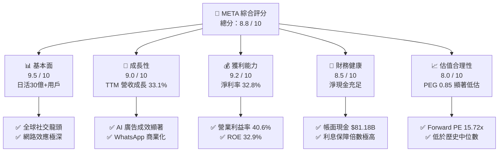
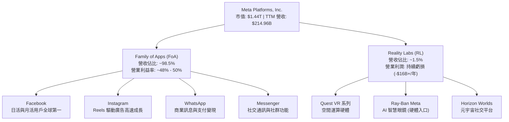
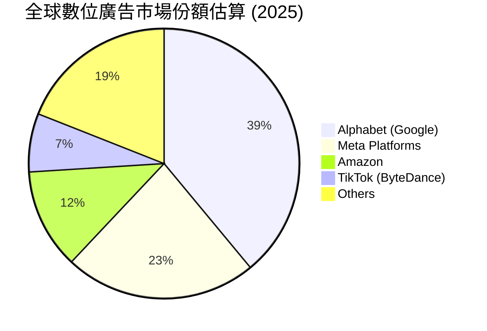
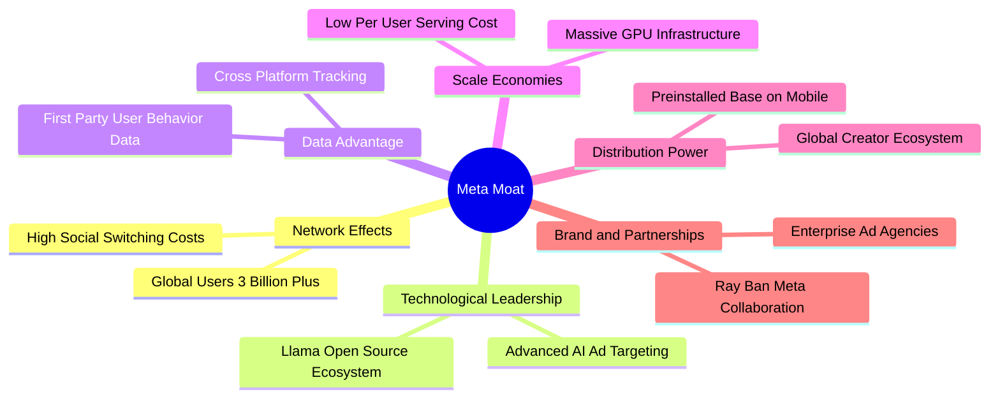

# META 基本面深度分析報告

> **報告日期**：2026-06-11 ｜ **語言**：繁體中文 ｜ **數據來源**：Yahoo Finance, Finviz, StockAnalysis, Roic.ai ｜ **分析師**：CFA 級機構研究

---

## 目錄

| # | 章節 | 核心結論 |
|---|------|----------|
| 1 | **執行摘要** | 評級：**強烈買入 (Strong Buy)**，12個月基準目標價 **$828.80**，隱含上行空間 **+45.8%**。 |
| 2 | **公司概覽與商業模式** | 雙引擎驅動（FoA 與 Reality Labs），憑藉全球 30 億+ 日活躍用戶構建極深網路效應護城河。 |
| 3 | **損益表深度分析** | TTM 營收達 **$214.96B**（YoY +33.1%），淨利潤率達 **32.8%**，AI 驅動廣告精準度提升。 |
| 4 | **資產負債表分析** | 手握 **$81.18B** 現金與短期投資，債務結構健康，流動比率 **2.35**，具備極強抗風險能力。 |
| 5 | **現金流量深度分析** | TTM 營運現金流達 **$124.00B**，即便 Capex 高達 **$69.69B**，仍創造 **$25.56B** 自由現金流。 |
| 6 | **獲利能力與資本效率** | ROE 達 **32.9%**，ROIC 達 **31.9%**，遠超 WACC（10.1%），強力創造股東經濟價值（EVA）。 |
| 7 | **估值深度分析** | Forward P/E 僅 **15.72x**，PEG 僅 **0.85**，相較歷史均值與同業呈現顯著低估。 |
| 8 | **成長催化劑** | Llama 3 商業化、Ray-Ban Meta 智慧眼鏡爆發、WhatsApp 商業化與 AI 廣告生成工具。 |
| 9 | **風險矩陣** | 監管反壟斷、Capex 資本支出過高、Reality Labs 持續虧損與廣告市場宏觀波動。 |
| 10 | **投資建議** | 當前股價 **$568.43** 具備極高安全邊際，建議成長型與長線價值投資者分批逢低加碼。 |

---

## 1. 執行摘要

### 1.1 核心評分儀表板



### 1.2 評分進度條視覺化

```
╔══════════════════════════════════════════════════════════════╗
║               META 多維度評分儀表板 (1-10分)                 ║
╠══════════════════════════════════════════════════════════════╣
║ 基本面強度  9.5 ▓▓▓▓▓▓▓▓▓▓▓▓▓▓▓▓▓▓▓░  ★★★★★           ║
║ 成長動能    9.0 ▓▓▓▓▓▓▓▓▓▓▓▓▓▓▓▓▓▓░░  ★★★★★           ║
║ 獲利品質    9.2 ▓▓▓▓▓▓▓▓▓▓▓▓▓▓▓▓▓▓▓░  ★★★★★           ║
║ 財務健康    8.5 ▓▓▓▓▓▓▓▓▓▓▓▓▓▓▓▓▓░░░  ★★★★☆           ║
║ 估值合理性  8.0 ▓▓▓▓▓▓▓▓▓▓▓▓▓▓▓░░░░░  ★★★★☆           ║
║ 護城河深度  9.5 ▓▓▓▓▓▓▓▓▓▓▓▓▓▓▓▓▓▓▓░  ★★★★★           ║
║ 管理層執行  8.8 ▓▓▓▓▓▓▓▓▓▓▓▓▓▓▓▓▓░░░  ★★★★☆           ║
║ 技術創新力  9.0 ▓▓▓▓▓▓▓▓▓▓▓▓▓▓▓▓▓▓░░  ★★★★★           ║
╠══════════════════════════════════════════════════════════════╣
║ 綜合總分    8.8 ▓▓▓▓▓▓▓▓▓▓▓▓▓▓▓▓▓░░░  🏆 評級：強烈買入    ║
╚══════════════════════════════════════════════════════════════╝
```

### 1.3 五大投資論點 + 三大核心風險

| 類型 | 項目 | 具體依據 | 信心度 |
|------|------|----------|--------|
| 🟢 **投資論點①** | **AI 賦能廣告轉換率** | AI 推薦演算法顯著提升 Reels 與 Feed 用戶停留時間，廣告點擊率與回報率（ROAS）大幅改善，帶動 TTM 營收成長 33.1%。 | 🟢 極高 |
| 🟢 **投資論點②** | **極致的經營槓桿與獲利** | 營業利益率高達 40.6%，淨利率 32.8%，在維持高額 R&D（TTM $62.92B）的同時，仍能實現利潤率擴張。 | 🟢 極高 |
| 🟢 **投資論點③** | **估值具備安全邊際** | Forward P/E 僅 15.72x，PEG 僅 0.85，相較於標普 500 指數與其他大型科技股，估值折價明顯。 | 🟢 高 |
| 🟢 **投資論點④** | **WhatsApp 商業化潛力** | 商業訊息（Business Messaging）與 WhatsApp Pay 在新興市場滲透率加速，成為 FoA 另一高毛利成長引擎。 | 🟢 高 |
| 🟢 **投資論點⑤** | **Ray-Ban Meta 智慧眼鏡突破** | 軟硬體結合的 AI 穿戴裝置出貨量超預期，有機會成為下一個世代的個人運算平台入口。 | 🟡 中等 |
| 🟡 **風險①** | **CapEx 擴張壓制自由現金流** | 2025 年 Capex 達 $69.69B，預計 2026 年將持續維持高位，對短期自由現金流（FCF）產生壓力。 | 🟡 中度 |
| 🔴 **風險②** | **Reality Labs 持續失血** | 雖然 FoA 獲利強勁，但 Reality Labs 每年虧損超百億美元，拖累整體利潤表現，且短期難以盈虧平衡。 | 🔴 高衝擊 |
| 🔴 **風險③** | **反壟斷與隱私監管政策** | 美國與歐盟對 Meta 社交平台的反壟斷審查及兒童隱私保護法案，可能面臨鉅額罰款或業務限制。 | 🔴 高衝擊 |

### 1.4 快速統計卡片

| 指標 | 公司實際值 | 行業均值 | S&P 500 均值 | 狀態 |
|------|-------------|----------|--------------|------|
| 收入 YoY 成長 | **33.1%** | ~12.5% | ~5.5% | 🟢 卓越 |
| 毛利率 | **81.9%** | ~50.0% | ~30.0% | 🟢 卓越 |
| 淨利率 | **32.8%** | ~15.0% | ~12.0% | 🟢 卓越 |
| ROE | **32.9%** | ~18.0% | ~15.0% | 🟢 卓越 |
| Forward P/E | **15.72x** | ~22.5x | ~21.0x | 🟢 便宜 |
| PEG Ratio | **0.85** | ~1.50 | ~1.80 | 🟢 便宜 |

### 1.5 投資結論

```
╔══════════════════════════════════════════════════════════════════╗
║                    📊 META 投資結論摘要                          ║
╠══════════════════════════════════════════════════════════════════╣
║  評級：🟢 強烈買入 (Strong Buy)                                 ║
║  當前股價：$568.43                                               ║
║  目標價區間：                                                    ║
║    悲觀情境：$700.00（+23.1%）                                   ║
║    基準情境：$828.80（+45.8%）  ← 12個月主要目標                 ║
║    樂觀情境：$1015.00（+78.6%）                                  ║
║  投資評分：8.8 / 10                                              ║
║  適合投資人：成長型、長線價值持有者、AI 產業布局者               ║
╚══════════════════════════════════════════════════════════════════╝
```

---

## 2. 公司概覽與商業模式

### 2.1 業務結構與收入來源

Meta Platforms, Inc. 主要透過兩個板塊運營：**應用程式家族（Family of Apps, FoA）** 與 **實境實驗室（Reality Labs, RL）**。其中 FoA 貢獻了超過 98% 的營收與全部的營業利潤，而 RL 則代表了公司對下一代元宇宙與硬體運算平台的長期戰略投資。



### 2.2 市場份額

在數位廣告市場中，Meta 與 Alphabet (Google) 長期維持雙寡頭壟斷地位。隨著近年 Amazon 廣告業務的崛起以及 TikTok 的競爭，Meta 憑藉強大的 AI 推薦演算法（如 Advantage+ 廣告套件）成功穩固了其在全球數位廣告市場的份額。



### 2.3 競爭護城河分析

Meta 擁有美股中最寬廣的護城河之一，其核心競爭優勢可以歸納為以下六個維度：



*   **極深的網路效應（Network Effects）**：全球超過 30 億的日活躍用戶（DAP）。每增加一個新用戶，整個社交網絡的價值就隨之增加，使得用戶轉移至其他平台的機會成本極高。
*   **AI 技術領先（Technological Moat）**：開源大語言模型 Llama 系列已成為全球開發者生態的事實標準。這不僅降低了 Meta 自身的研發成本，更透過全球開發者反哺，優化了 Meta 內部的 AI 基礎設施。
*   **規模效應與資本壁壘（Scale Economies）**：年 Capex 投入高達數百億美元，建置了全球最龐大的 GPU 叢集之一。這種基礎設施的規模是中小型競爭對手完全無法企及的。

### 2.4 護城河強度評分

```
╔══════════════════════════════════════════════════════════════╗
║                   META 護城河強度評分                        ║
╠══════════════════════════════════════════════════════════════╣
║ 網路效應      10/10 ▓▓▓▓▓▓▓▓▓▓▓▓▓▓▓▓▓▓▓▓  🏆 無可匹敵     ║
║ 技術與 AI     9.5/10 ▓▓▓▓▓▓▓▓▓▓▓▓▓▓▓▓▓▓▓░  🟢 開源生態領先 ║
║ 數據壁壘      9.5/10 ▓▓▓▓▓▓▓▓▓▓▓▓▓▓▓▓▓▓▓░  🟢 第一手行為數據║
║ 規模效應      9.0/10 ▓▓▓▓▓▓▓▓▓▓▓▓▓▓▓▓▓▓░░  🟢 龐大資本支出  ║
║ 用戶鎖定      9.0/10 ▓▓▓▓▓▓▓▓▓▓▓▓▓▓▓▓▓▓░░  🟢 社交關係鏈綁定║
╠══════════════════════════════════════════════════════════════╣
║ 綜合護城河    9.4/10 ▓▓▓▓▓▓▓▓▓▓▓▓▓▓▓▓▓▓▓░  🏆 極深護城河   ║
╚══════════════════════════════════════════════════════════════╝
```

---