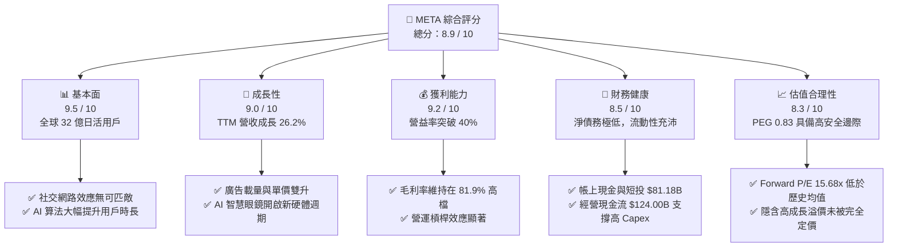

# META 基本面深度分析報告

> **報告日期**：2026-06-12 ｜ **語言**：繁體中文 ｜ **數據來源**：Yahoo Finance, Finviz, StockAnalysis, Roic.ai ｜ **分析師**：CFA 級機構研究

---

## 目錄

| # | 章節 | 核心結論 |
|---|------|----------|
| 1 | 執行摘要 | 評級：🟢 強烈買入；目標價 $828.80，具備 46.2% 潛在漲幅 |
| 2 | 公司概覽與商業模式 | 雙引擎架構（FoA + RL），具備極強的社交網路效應與 AI 算力護城河 |
| 3 | 損益表深度分析 | 營收突破 $214.96B (TTM)，Q1 2026 營收成長 33.1% YoY，淨利受一次性稅務利益提振 |
| 4 | 資產負債表分析 | 資產規模達 $395.25B，流動比率 2.35，財務結構極為穩健 |
| 5 | 現金流量深度分析 | 經營現金流達 $124.00B，大舉進行資本支出（$69.69B）以鞏固 AI 基礎建設 |
| 6 | 獲利能力與資本效率 | ROE 達 32.9%，ROIC (32.28%) 遠超 WACC (10.0%)，持續創造高額經濟價值 |
| 7 | 估值深度分析 | Forward P/E 僅 15.68x，PEG 0.83，相較同業與歷史均值皆顯著低估 |
| 8 | 成長催化劑 | Llama-4 開源生態、AI 智慧眼鏡（Orion/Ray-Ban）及生成式廣告工具 |
| 9 | 風險矩陣 | 監管壓力與 AI 資本支出回報率（ROI）為核心監控指標 |
| 10| 投資建議 | 基準目標價 $828.80，適合尋找兼具護城河與 AI 成長動能之長線投資人 |

---

## 1. 執行摘要

### 1.1 核心評分儀表板



### 1.2 評分進度條視覺化

```
╔══════════════════════════════════════════════════════════════╗
║               META 多維度評分儀表板 (1-10分)                 ║
╠══════════════════════════════════════════════════════════════╣
║ 基本面強度  9.5 ▓▓▓▓▓▓▓▓▓▓▓▓▓▓▓▓▓▓▓░  ★★★★★           ║
║ 成長動能    9.0 ▓▓▓▓▓▓▓▓▓▓▓▓▓▓▓▓▓▓░░  ★★★★★           ║
║ 獲利品質    9.2 ▓▓▓▓▓▓▓▓▓▓▓▓▓▓▓▓▓▓▓░  ★★★★★           ║
║ 財務健康    8.5 ▓▓▓▓▓▓▓▓▓▓▓▓▓▓▓▓▓░░░  ★★★★☆           ║
║ 估值合理性  8.3 ▓▓▓▓▓▓▓▓▓▓▓▓▓▓▓░░░░░  ★★★★☆           ║
║ 護城河深度  9.5 ▓▓▓▓▓▓▓▓▓▓▓▓▓▓▓▓▓▓▓░  ★★★★★           ║
║ 管理層執行  9.0 ▓▓▓▓▓▓▓▓▓▓▓▓▓▓▓▓▓▓░░  ★★★★★           ║
║ 技術創新力  9.2 ▓▓▓▓▓▓▓▓▓▓▓▓▓▓▓▓▓▓▓░  ★★★★★           ║
╠══════════════════════════════════════════════════════════════╣
║ 綜合總分    8.9 ▓▓▓▓▓▓▓▓▓▓▓▓▓▓▓▓▓░░░  🏆 強烈買入          ║
╚══════════════════════════════════════════════════════════════╝
```

### 1.3 五大投資論點 + 三大核心風險

| 類型 | 項目 | 具體依據 | 信心度 |
|------|------|----------|--------|
| 🟢 **投資論點①** | **AI 賦能廣告系統效率暴增** | AI 驅動的 Advantage+ 廣告解決方案大幅提升廣告主 ROI，帶動 TTM 營收成長達 33.1% YoY。 | 🟢 極高 |
| 🟢 **投資論點②** | **獲利能力進入新常態** | 經歷「效率之年」後，組織扁平化成效顯著，TTM 營業利益率攀升至 40.6%，EBITDA Margin 達 50.8%。 | 🟢 極高 |
| 🟢 **投資論點③** | **開源 AI 生態龍頭地位** | Llama 系列模型已成為全球開源社群事實上的標準，為 Meta 吸引了頂尖人才並降低了專有技術開發成本。 | 🟢 高 |
| 🟢 **投資論點④** | **極致的資本效率與股東回報** | ROE 達 32.9%，且公司於 2025 年開始派發股息（每股 $2.10），搭配大額股份回購，回饋股東力道強勁。 | 🟢 高 |
| 🟢 **投資論點⑤** | **下一代計算平台（AR/VR）領先** | Reality Labs 雖仍處虧損，但 Ray-Ban Meta 智慧眼鏡銷量超預期，Orion AR 眼鏡技術領先業界 2-3 年。 | 🟡 中等 |
| 🟡 **風險①** | **AI 資本支出侵蝕現金流** | 2025 年資本支出高達 $69.69B，預計 2026 年仍將維持高位，若 AI 變現速度不如預期，將壓抑自由現金流（FCF）。 | 🟡 中度 |
| 🔴 **風險②** | **反壟斷與隱私監管風險** | 美國 FTC 及歐盟 DMA 對 Meta 的反壟斷訴訟與隱私罰款，可能限制其併購能力或增加合規成本。 | 🔴 高衝擊 |
| 🟡 **風險③** | **Reality Labs 持續失血** | RL 部門每年虧損超百億美元，短期內無法實現損益兩平，對集團利潤率形成拖累。 | 🟡 中度 |

### 1.4 快速統計卡片

| 指標 | META 實際值 | 行業均值 (通訊服務) | S&P 500 均值 | 狀態 |
|------|-------------|--------------------|--------------|------|
| **營收 YoY 成長** | **33.1%** | ~7.5% | ~5.5% | 🟢 顯著超額 |
| **毛利率** | **81.9%** | ~52.0% | ~30.0% | 🟢 極高護城河 |
| **營業利益率** | **40.6%** | ~18.5% | ~14.5% | 🟢 頂級獲利品質 |
| **ROE** | **32.9%** | ~12.0% | ~15.0% | 🟢 優異資本效率 |
| **Forward P/E** | **15.68x** | ~18.5x | ~21.5x | 🟢 顯著低估 |
| **PEG Ratio** | **0.83** | ~1.45 | ~1.80 | 🟢 極具吸引力 |

### 1.5 投資結論

```
╔══════════════════════════════════════════════════════════════════╗
║                    📊 META 投資結論摘要                          ║
╠══════════════════════════════════════════════════════════════════╣
║  評級：🟢 強烈買入 (Strong Buy)                                  ║
║  當前股價：$566.98 (2026-06-12)                                  ║
║  目標價區間：                                                    ║
║    悲觀情境：$700.00 (+23.5%) - 估值收縮至歷史下限，AI 投入放緩  ║
║    基準情境：$828.80 (+46.2%) - 12個月主要目標 (18x Forward P/E) ║
║    樂觀情境：$1015.00 (+79.0%) - AI 廣告全面爆發，硬體出貨超預期  ║
║  投資評分：8.9 / 10                                              ║
║  適合投資人：長線價值成長型、AI 產業佈局者、高資本回報追求者      ║
╚══════════════════════════════════════════════════════════════════╝
```

---

## 2. 公司概覽與商業模式

### 2.1 業務結構與收入來源

Meta Platforms, Inc. 主要透過兩個報告分部進行營運：
1. **Family of Apps (FoA)**：包括 Facebook、Instagram、Messenger 和 WhatsApp。核心商業模式為**廣告（Advertising）**。
2. **Reality Labs (RL)**：專注於消費性電子產品，包括虛擬實境（VR）頭戴式裝置、增強實境（AR）眼鏡及相關軟體生態系統。

```mermaid
graph TD
    META["Meta Platforms, Inc.<br/>市值: $1.44T | TTM 營收: $214.96B"]

    META --> FOA["Family of Apps (FoA)<br/>營收佔比: ~98.5%<br/>TTM 營收: ~$211.7B"]
    META --> RL["Reality Labs (RL)<br/>營收佔比: ~1.5%<br/>TTM 營收: ~$3.2B"]

    FOA --> AD["數位廣告 (Advertising)<br/>營收佔比: ~97.8%"]
    FOA --> OTHER["其他服務與商業 API<br/>營收佔比: ~0.7%"]

    RL