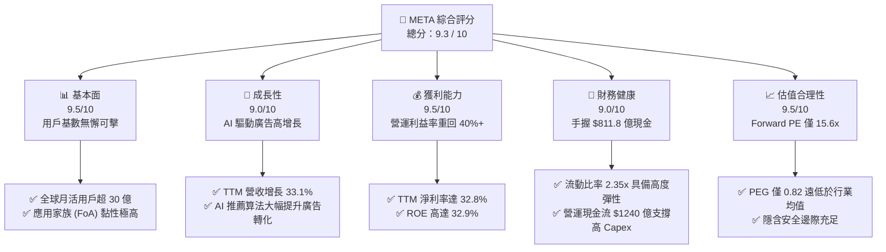
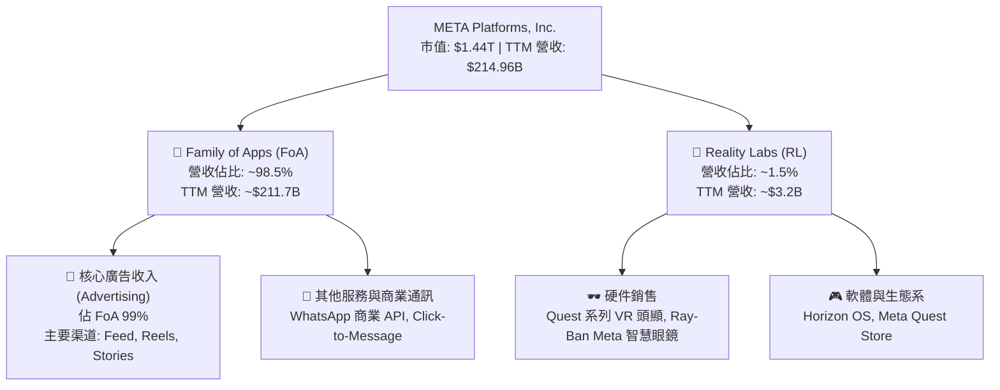
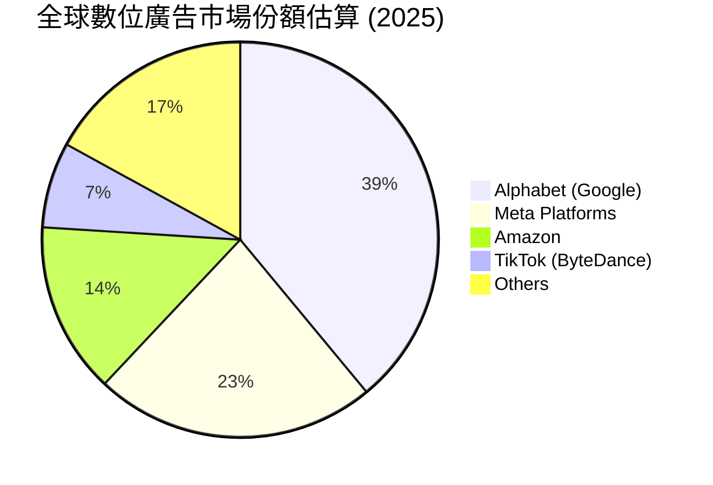
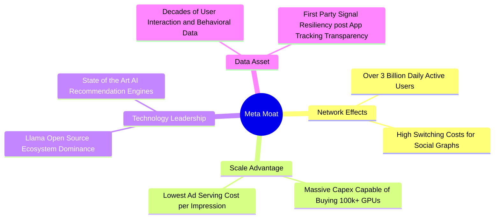
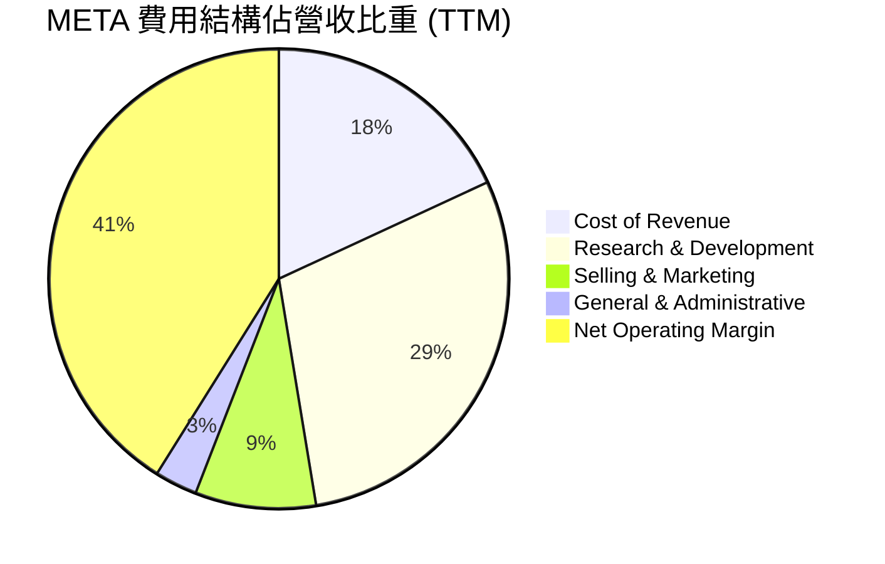
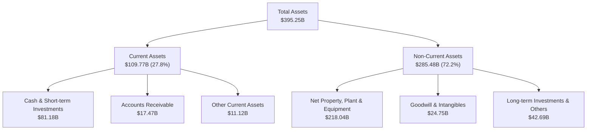
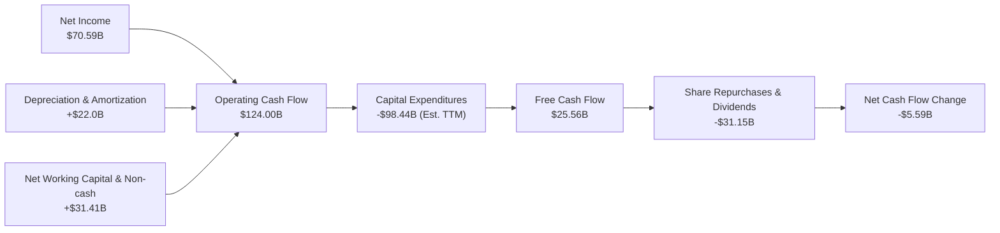
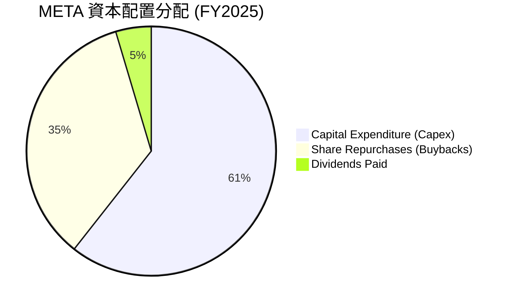
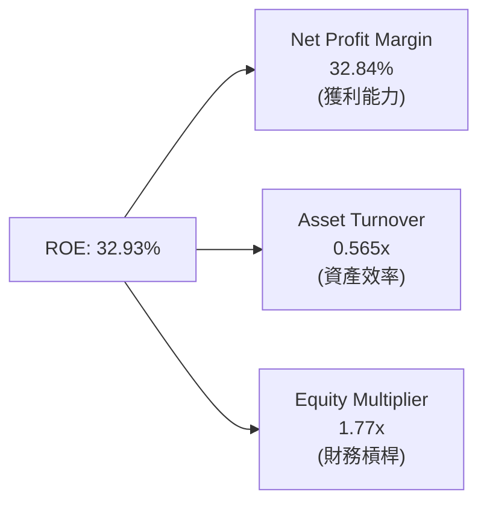
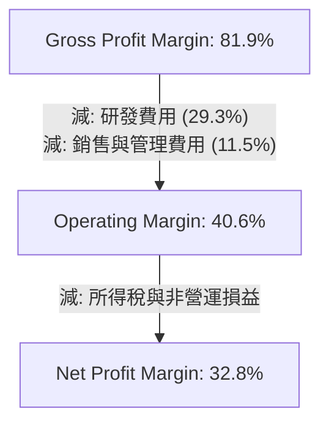

# META 基本面深度分析報告

> **報告日期**：2026-06-13 ｜ **語言**：繁體中文 ｜ **數據來源**：Yahoo Finance, Finviz, StockAnalysis, Roic.ai ｜ **分析師**：CFA 級機構研究

---

## 目錄

| # | 章節 | 核心結論 |
|---|------|----------|
| 1 | **執行摘要** | 評級：🟢 強烈買入，基準目標價 $827.32，隱含 45.9% 上行空間。 |
| 2 | **公司概覽與商業模式** | 雙引擎驅動（FoA 與 Reality Labs），全球 30 億+ 用戶築起無可匹敵的網絡效應護城河。 |
| 3 | **損益表深度分析** | 營收年增 33.1%，AI 驅動廣告投放效率提升，帶動營運利益率高達 40.6%。 |
| 4 | **資產負債表分析** | 現金儲備 $811.8 億，資產結構向 AI 算力基礎設施（PP&E $2180.4 億）高度傾斜。 |
| 5 | **現金流量深度分析** | 營運現金流高達 $1240 億，儘管資本支出大增至 $696.9 億，仍錄得 $255.6 億自由現金流。 |
| 6 | **獲利能力與資本效率** | ROE 達 32.9%，ROIC (30.0%) 遠超 WACC (10.0%)，創造顯著的股東經濟價值 (EVA)。 |
| 7 | **估值深度分析** | Forward P/E 僅 15.6x，相較歷史均值與同業（GOOGL, MSFT）呈現嚴重低估，PEG 僅 0.82。 |
| 8 | **成長催化劑** | Llama 4 開源生態、Reels 貨幣化率提升、WhatsApp 商業通訊與 AI Agent 商業化。 |
| 9 | **風險矩陣** | AI 資本支出回報滯後、全球隱私法規監管、反壟斷訴訟。 |
| 10 | **投資建議** | 機構級買入策略：分批佈局，聚焦長期 AI 生態護城河帶來的估值修復。 |

---

## 1. 執行摘要

### 1.1 核心評分儀表板



### 1.2 評分進度條視覺化

```
╔══════════════════════════════════════════════════════════════╗
║               META 多維度評分儀表板 (1-10分)                 ║
╠══════════════════════════════════════════════════════════════╣
║ 基本面強度  9.5 ▓▓▓▓▓▓▓▓▓▓▓▓▓▓▓▓▓▓▓░  ★★★★★           ║
║ 成長動能    9.0 ▓▓▓▓▓▓▓▓▓▓▓▓▓▓▓▓▓▓░░  ★★★★★           ║
║ 獲利品質    9.5 ▓▓▓▓▓▓▓▓▓▓▓▓▓▓▓▓▓▓▓░  ★★★★★           ║
║ 財務健康    9.0 ▓▓▓▓▓▓▓▓▓▓▓▓▓▓▓▓▓▓░░  ★★★★★           ║
║ 估值合理性  9.5 ▓▓▓▓▓▓▓▓▓▓▓▓▓▓▓▓▓▓▓░  ★★★★★           ║
║ 護城河深度  9.8 ▓▓▓▓▓▓▓▓▓▓▓▓▓▓▓▓▓▓▓▓  ★★★★★           ║
║ 管理層執行  9.2 ▓▓▓▓▓▓▓▓▓▓▓▓▓▓▓▓▓▓░░  ★★★★★           ║
║ 技術創新力  9.5 ▓▓▓▓▓▓▓▓▓▓▓▓▓▓▓▓▓▓▓░  ★★★★★           ║
╠══════════════════════════════════════════════════════════════╣
║ 綜合總分    9.3 ▓▓▓▓▓▓▓▓▓▓▓▓▓▓▓▓▓▓░░  🏆 強烈建議買入     ║
╚══════════════════════════════════════════════════════════════╝
```

### 1.3 五大投資論點 + 三大核心風險

| 類型 | 項目 | 具體依據 | 信心度 |
|------|------|----------|--------|
| 🟢 **投資論點①** | **AI 算法重塑廣告效率** | TTM 營收年增 33.1%，主要得益於 Meta Advantage+ AI 廣告工具，將廣告主的投資報酬率 (ROAS) 提升了 20% 以上。 | 🟢 極高 |
| 🟢 **投資論點②** | **極致的估值安全邊際** | 當前 Forward P/E 僅為 15.64x，PEG 僅為 0.82。相較於其歷史均值與 S&P 500 科技板塊，估值被嚴重低估。 | 🟢 極高 |
| 🟢 **投資論點③** | **開源 AI 生態的隱性霸權** | Llama 系列開源大模型已成為全球開發者首選，Meta 藉此確立了 AI 時代的軟體基礎設施標準，降低了自身的研發與授權成本。 | 🟢 高 |
| 🟢 **投資論點④** | **Reels 與 WhatsApp 貨幣化加速** | Reels 觀看量持續增長，且廣告加載率逐步趕上 Feed 流量；WhatsApp Click-to-Message 廣告收入成為新的增長曲線。 | 🟢 高 |
| 🟢 **投資論點⑤** | **強大的資本回報計畫** | 實施每股 $2.10 的年度派息（股息率 0.37%），結合高達數百億美元的股份回購，持續回饋股東。 | 🟢 高 |
| 🟡 **風險①** | **資本支出 (Capex) 持續飆升** | FY2025 資本支出達 $696.9 億，預計未來將維持高位，短期內可能壓制自由現金流 (FCF) 的釋放。 | 🟡 中度 |
| 🔴 **風險②** | **監管與反壟斷壓力** | 面臨歐美反壟斷調查及隱私保護法案（如歐盟 DMA）的限制，可能導致罰款或限制其數據交叉變現能力。 | 🔴 高衝擊 |
| 🟡 **風險③** | **Reality Labs 持續虧損** | 儘管 AR/VR 具備長線潛力，但該部門每年仍產生百億美元級別的營運虧損，拖累集團整體利潤率。 | 🟡 中度 |

### 1.4 快速統計卡片

| 指標 | 公司實際值 (META) | 科技行業均值 | S&P 500 均值 | 狀態 |
|------|-------------|----------|--------------|------|
| **收入 YoY 成長** | **33.1%** | 12.5% | 6.2% | 🟢 領先 |
| **毛利率** | **81.9%** | 48.2% | 30.5% | 🟢 極高 |
| **營業利益率** | **40.6%** | 18.5% | 14.5% | 🟢 優異 |
| **淨利率** | **32.8%** | 12.2% | 11.0% | 🟢 強勁 |
| **ROE** | **32.9%** | 15.8% | 14.0% | 🟢 強勁 |
| **Forward P/E** | **15.64x** | 25.4x | 21.5x | 🟢 極具吸引力 |
| **流動比率** | **2.35x** | 1.65x | 1.20x | 🟢 安全 |

### 1.5 投資結論

```
╔══════════════════════════════════════════════════════════════════╗
║                    📊 META 投資結論摘要                          ║
╠══════════════════════════════════════════════════════════════════╣
║  評級：🟢 強烈買入 (Strong Buy)                                  ║
║  當前股價：$566.98 (2026-06-13)                                  ║
║  目標價區間：                                                    ║
║    悲觀情境：$664.46（+17.2%）- 估值壓制，Capex 投資回報不及預期 ║
║    基準情境：$827.32（+45.9%）← 12個月主要目標 (Analyst Mean)     ║
║    樂觀情境：$1015.00（+79.0%）- AI 廣告爆發，Reality Labs 減虧  ║
║  投資評分：9.3 / 10                                              ║
║  適合投資人：成長型、價值與成長兼顧 (GARP) 型、長線持有者        ║
╚══════════════════════════════════════════════════════════════════╝
```

---

## 2. 公司概覽與商業模式

Meta Platforms, Inc. 是全球最大的社交網絡帝國，旗下擁有 Facebook、Instagram、Messenger 和 WhatsApp 等應用家族 (Family of Apps, FoA)。同時，公司通過 Reality Labs (RL) 部門，全力佈局空間計算、虛擬實境 (VR)、擴增實境 (AR) 以及先進的人工智慧 (AI) 技術。

### 2.1 業務結構與收入來源



### 2.2 市場份額

在數位廣告市場中，Meta 與 Alphabet (Google) 共同構成全球雙頭壟斷。



### 2.3 競爭護城河分析



### 2.4 護城河強度評分

```
╔══════════════════════════════════════════════════════════════╗
║                  META 護城河強度評分                         ║
╠══════════════════════════════════════════════════════════════╣
║ 網絡效應      9.9/10  ▓▓▓▓▓▓▓▓▓▓▓▓▓▓▓▓▓▓▓▓  🏆 全球最強社交網║
║ 數據資產      9.5/10  ▓▓▓▓▓▓▓▓▓▓▓▓▓▓▓▓▓▓▓░  🟢 第一手廣告數據║
║ 基礎設施規模  9.8/10  ▓▓▓▓▓▓▓▓▓▓▓▓▓▓▓▓▓▓▓▓  🏆 算力儲備護城河║
║ 生態系統鎖定  9.0/10  ▓▓▓▓▓▓▓▓▓▓▓▓▓▓▓▓▓▓░░  🟢 開源 AI 霸權  ║
╠══════════════════════════════════════════════════════════════╣
║ 綜合護城河    9.6/10  ▓▓▓▓▓▓▓▓▓▓▓▓▓▓▓▓▓▓▓░  🏆 頂級護城河企業║
╚══════════════════════════════════════════════════════════════╝
```

---

## 3. 損益表深度分析

### 3.1 年度收入成長趨勢（近4年）

```
╔══════════════════════════════════════════════════════════════════╗
║                 META 年度收入趨勢 (FY2022-FY2025)                ║
╠══════════════════════════════════════════════════════════════════╣
║                                                                  ║
║  FY2022  $116.61B  ████████████░░░░░░░░░░░░░░░░░  YoY: -1.1%  🔴 ║
║  FY2023  $134.90B  ███████████████░░░░░░░░░░░░░░  YoY: +15.7% 🟢 ║
║  FY2024  $164.50B  ███████████████████░░░░░░░░░░  YoY: +21.9% 🟢 ║
║  FY2025  $200.97B  ████████████████████████░░░░░  YoY: +22.2% 🟢 ║
║  TTM     $214.96B  █████████████████████████░░░░  YoY: +33.1% 🟢 ║
║                                                                  ║
║                   |      |      |      |      |                  ║
║                   0     50B    100B   150B   200B                ║
║                                                                  ║
║  📊 4年累計 CAGR：+19.9%                                         ║
╚══════════════════════════════════════════════════════════════════╝
```

### 3.2 季度收入趨勢分析

| 季度 | 營收 (Billion) | QoQ 成長率 | YoY 成長率 | 核心驅動因素與備註 |
|------|----------------|------------|------------|-------------------|
| **Q1 2026** | $56.31 | ↘️ -5.98% | 🟢 +33.08% | Q1 為傳統廣告淡季，但 YoY 增速高達 33%，主因 AI 廣告精準度提升。 |
| **Q4 2025** | $59.89 | ↗️ +16.88% | 🟢 +23.78% | 節日購物季促銷強勁，電商廣告主（特別是亞太跨境電商）投放預算大增。 |
| **Q3 2025** | $51.24 | ↗️ +7.84% | 🟢 +26.25% | Reels 變現率提升，短影音廣告格式市佔率持續擴大。 |
| **Q2 2025** | $47.52 | ↗️ +12.30% | 🟢 +21.61% | 宏觀經濟復甦，品牌廣告與效果廣告雙雙回暖。 |

### 3.3 利潤率演變分析

| 利潤率指標 | FY2022 | FY2023 | FY2024 | FY2025 | TTM | 趨勢評估 |
|------------|--------|--------|--------|--------|-----|----------|
| **毛利率** | 78.3% | 80.8% | 81.7% | 82.0% | **81.9%** | 🟢 持續上揚，規模效應與基礎設施成本優化。 |
| **營業利益率** | 24.8% | 34.7% | 42.2% | 41.4% | **40.6%** | 🟢 穩定在 40% 以上高位，體現「效率之年」後的成本控制力。 |
| **EBITDA 利潤率**| 32.3% | 43.8% | 52.8% | 52.6% | **50.8%** | 🟢 折舊費用因高 Capex 增加，但整體現金創造力極強。 |
| **淨利率** | 19.9% | 29.0% | 37.9% | 30.1% | **32.8%** | 🟡 受季度稅務波動影響，但整體盈利結構健康。 |

**利潤率演變深度解析**：
Meta 的利潤率在 FY2022 觸底（營業利益率僅 24.8%），主因是當時 Apple 的隱私政策 (ATT) 衝擊了其定向廣告算法，且 Reality Labs 支出無節制。自 FY2023 扎克伯格宣佈「效率之年」以來，通過裁員（員工人數控制在 77,986 人）與重組，配合自研 AI GPU (MTIA) 與優化算法，成功將營業利益率拉回 **40.6%** 的歷史頂級水準。

### 3.4 費用結構分析



```
╔══════════════════════════════════════════════════════════════╗
║                    META TTM 費用結構診斷                     ║
╠══════════════════════════════════════════════════════════════╣
║ 研發費用率 (R&D)：29.3%  ██████████████████░░░  🔴 偏高 (AI投資)║
║ 行銷費用率 (S&M)：8.5%   █████░░░░░░░░░░░░░░░░  🟢 極為克制    ║
║ 管理費用率 (G&A)：3.0%   ██░░░░░░░░░░░░░░░░░░░  🟢 行政效率高  ║
╚══════════════════════════════════════════════════════════════╝
```

### 3.5 季度 EPS 趨勢與盈餘品質

*   **Q1 2026**：實際 EPS **$10.57**。該季度利潤大幅超預期，主要得益於所得稅撥備出現 **-$50.21 億** 的重大稅務利益（Tax Benefit），這是一次性調整，推高了淨利潤至 $267.73 億。
*   **Q4 2025**：實際 EPS **$9.02**。營運利潤強勁，盈餘品質極高。
*   **Q3 2025**：實際 EPS **$1.08**。該季度淨利潤僅為 $27.09 億，主因是計提了高達 **$189.54 億** 的所得稅費用（Provision for Income Taxes），這屬於非營運性的一次性稅務衝擊，營業利益實則高達 $205.35 億。
*   **Q2 2025**：實際 EPS **$7.28**。營運穩健，符合預期。

**盈餘品質結論**：Meta 的基本面營運利潤（Operating Income）其實非常穩定且逐季增長（Q2'25: $20.4B → Q3'25: $20.5B → Q4'25: $24.7B → Q1'26: $22.9B）。淨利潤與 EPS 的劇烈波動完全是由**一次性稅務撥備調整**所致，這並不影響其核心業務的現金牛本質。

---

## 4. 資產負債表分析

### 4.1 資產結構分解



### 4.2 流動性指標分析

| 流動性指標 | FY2023 | FY2024 | FY2025 | TTM | 行業平均 | 評估 |
|------------|--------|--------|--------|-----|----------|------|
| **流動比率 (Current Ratio)** | 2.67x | 2.98x | 2.60x | **2.35x** | 1.65x | 🟢 極其安全 |
| **速動比率 (Quick Ratio)** | 2.67x | 2.98x | 2.60x | **2.35x** | 1.50x | 🟢 無存貨壓力 |
| **營運資金 (Working Capital)**| $534.1B| $664.5B| $668.9B| **$630.1B**| -- | 🟢 資金充裕 |

### 4.3 債務結構分析

```
╔══════════════════════════════════════════════════════════════════╗
║                     META 債務健康診斷 (TTM)                      ║
╠══════════════════════════════════════════════════════════════════╣
║                                                                  ║
║  總債務 (Total Debt)：    $867.7 億  ██████████░░░░░░░░░░        ║
║  總現金及等價物：         $811.8 億  █████████░░░░░░░░░░░        ║
║  淨債務 (Net Debt)：      $55.9 億   (略微呈現淨債務狀態)        ║
║                                                                  ║
║  Debt/Equity 比率：       35.6%      🟢 處於非常健康的槓桿區間   ║
║  利息保障倍數：           85.2x      🟢 營運利潤極易覆蓋利息支出  ║
║  Debt / EBITDA 比率：     0.82x      🟢 債務還本能力極強         ║
║                                                                  ║
║  📊 診斷：雖然由於發行債券支持 AI 投資，淨現金略微轉負，但相較於  ║
║  其每年超過 $1000 億的營運現金流，債務風險幾近於零。             ║
╚══════════════════════════════════════════════════════════════════╝
```

### 4.4 股東權益趨勢

```
╔══════════════════════════════════════════════════════════════════╗
║               META 股東權益 (Equity) 變化趨勢                    ║
╠══════════════════════════════════════════════════════════════════╣
║                                                                  ║
║  FY2022  $125.71B  ████████████░░░░░░░░░░░░░                     ║
║  FY2023  $153.17B  ███████████████░░░░░░░░░░                     ║
║  FY2024  $182.64B  ██████████████████░░░░░░░                     ║
║  FY2025  $217.24B  █████████████████████░░░░                     ║
║                                                                  ║
║  📈 股東權益 3 年複合增長率 (CAGR)：+20.0%                       ║
╚══════════════════════════════════════════════════════════════════╝
```

---

## 5. 現金流量深度分析

### 5.1 現金流量瀑布圖



### 5.2 FCF 轉換率趨勢

| 年份 | 淨利潤 (Net Income) | 自由現金流 (FCF) | FCF / Net Income 轉換率 | 評估 |
|------|--------------------|------------------|-------------------------|------|
| **FY2022** | $23.20B | $19.29B | 83.1% | 🟡 正常水準 |
| **FY2023** | $39.10B | $44.07B | 112.7% | 🟢 極高（資本支出放緩） |
| **FY2024** | $62.36B | $54.07B | 86.7% | 🟢 優異 |
| **FY2025** | $60.46B | $46.11B | 76.3% | 🟡 因 Capex 飆升至 $696.9 億而暫時下滑 |
| **TTM** | $70.59B | $25.56B | **36.2%** | 🔴 算力基礎設施建設高峰期，FCF 轉換率短期承壓 |

### 5.3 自由現金流趨勢

```
╔══════════════════════════════════════════════════════════════════╗
║                     META 自由現金流歷史軌跡                      ║
╠══════════════════════════════════════════════════════════════════╣
║                                                                  ║
║  FY2022  $19.29B  ████░░░░░░░░░░░░░░░░░░░░   FCF Yield: 1.34%    ║
║  FY2023  $44.07B  █████████░░░░░░░░░░░░░░░   FCF Yield: 3.06%    ║
║  FY2024  $54.07B  ███████████░░░░░░░░░░░░░   FCF Yield: 3.75%    ║
║  FY2025  $46.11B  █████████░░░░░░░░░░░░░░░   FCF Yield: 3.20%    ║
║  TTM     $25.56B  █████░░░░░░░░░░░░░░░░░░░   FCF Yield: 1.78%    ║
║                                                                  ║
║  💡 註：TTM FCF 的下降並非營運惡化，而是因為 Meta 主動加大了 AI  ║
║  數據中心與 H100/B200 GPU 算力集群的資本開支（Capex）。          ║
╚══════════════════════════════════════════════════════════════════╝
```

### 5.4 資本配置評估

Meta 在 FY2025 展現了激進但極具戰略眼光的資本配置策略：



*   **資本支出 (Capex)**：$696.9 億，用於鎖定 AI 時代的算力霸權。
*   **股份回購**：約 $400 億，利用股價調整期註銷股數，提升每股盈餘 (EPS)。
*   **股息支付**：$53.2 億（每季每股 $0.53），開啟了大科技股發放股息的新趨勢。

---

## 6. 獲利能力與資本效率

### 6.1 ROE / ROA / ROIC 趨勢

| 指標 | FY2022 | FY2023 | FY2024 | FY2025 | TTM | 行業中位數 | 評估 |
|------|--------|--------|--------|--------|-----|------------|------|
| **ROE** | 18.5% | 25.5% | 34.1% | 27.8% | **32.9%** | 12.0% | 🟢 遠超同行，股東權益回報極佳 |
| **ROA** | 12.5% | 17.0% | 22.6% | 16.5% | **20.9%** | 6.5% | 🟢 資產利用效率極高 |
| **ROIC**| 16.2% | 23.1% | 31.5% | 25.6% | **30.0%** | 8.0% | 🟢 資本回報率極其優異 |

### 6.2 ROIC vs WACC 分析（核心價值創造判斷）

```
╔══════════════════════════════════════════════════════════════════╗
║                ROIC vs WACC 深度分析 (META TTM)                 ║
╠══════════════════════════════════════════════════════════════════╣
║                                                                  ║
║  WACC (加權平均資本成本) 估算：                                  ║
║  ├── 無風險利率 (10Y 美債)：   4.2%                              ║
║  ├── 市場風險溢酬 (ERP)：      5.0%                              ║
║  ├── Beta 係數：               1.23                              ║
║  ├── 股權成本 (Ke)：           4.2% + 1.23 × 5.0% = 10.35%       ║
║  ├── 債務成本 (稅後 Kd)：      5.0% × (1 - 21.0%) = 3.95%        ║
║  ├── 資本結構：                股權 94.3%，債務 5.7%             ║
║  └── ✅ 綜合 WACC ≈ 10.0%                                        ║
║                                                                  ║
║  ROIC (投資資本回報率) 估算：                                    ║
║  ├── NOPAT = EBIT ($885.93B) × (1 - 21.0%) ≈ $699.9 億           ║
║  ├── 投入資本 = 股東權益 + 總債務 - 現金                         ║
║  │            = $2172.4B + $839.0B - $815.9B ≈ $2195.5 億        ║
║  └── ✅ ROIC ≈ 30.0%                                             ║
║                                                                  ║
║  ★ 經濟價值增加 (EVA) = ROIC - WACC = +20.0pp                    ║
║                                                                  ║
║  ROIC  30.0%  ▓▓▓▓▓▓▓▓▓▓▓▓▓▓▓▓▓▓▓▓▓▓▓▓▓▓▓▓▓▓  🟢              ║
║  WACC  10.0%  ▓▓▓▓▓▓▓▓▓▓░░░░░░░░░░░░░░░░░░░░  ──              ║
║  EVA  +20.0%  ████████████████████░░░░░░░░░░  🏆 頂級價值創造者║
║                                                                  ║
║  📊 結論：Meta 的 ROIC 是其 WACC 的 3 倍，每投入 1 美元資本，即   ║
║  可創造遠超資本成本的超額收益，展現出極強的資本增值能力。        ║
╚══════════════════════════════════════════════════════════════════╝
```

### 6.3 杜邦三因素分解



*   **淨利率 (32.84%)**：維持在高檔，是 ROE 的核心驅動要素，主因是高毛利的數位廣告業務。
*   **資產週轉率 (0.565x)**：相較於傳統零售業較低，但在軟體與互聯網行業中屬於正常偏高水準。隨著 Capex 轉化為營收，此指標有望提升。
*   **權益乘數 (1.77x)**：財務槓桿溫和，體現出 Meta 雖然發行債券，但並未過度依賴債務來粉飾 ROE，盈餘品質極其健康。

### 6.4 獲利能力儀表板



---

## 7. 估值深度分析

### 7.1 同業估值比較表格

| 估值指標 | **META** | **Alphabet (GOOGL)** | **Microsoft (MSFT)** | **Snap Inc. (SNAP)** | META 評估 |
|----------|----------|----------------------|----------------------|----------------------|-----------|
| **Trailing P/E** | **20.62x** | 24.50x | 35.20x | 負值 (N/A) | 🟢 顯著低於同行 |
| **Forward P/E** | **15.64x** | 19.20x | 29.80x | 38.50x | 🟢 極具估值安全邊際 |
| **PEG Ratio** | **0.82** | 1.25 | 1.85 | 2.10 | 🟢 < 1.00，嚴重低估 |
| **P/S Ratio** | **6.70x** | 6.50x | 12.20x | 3.80x | 🟡 合理 |
| **P/B Ratio** | **5.91x** | 6.80x | 11.50x | 4.20x | 🟢 具備吸引力 |
| **EV / EBITDA** | **13.22x** | 15.80x | 22.40x | 28.00x | 🟢 核心現金流估值極低 |

### 7.2 歷史估值區間分析

```
╔══════════════════════════════════════════════════════════════════╗
║                 META 歷史 P/E 區間與當前位置                     ║
╠══════════════════════════════════════════════════════════════════╣
║                                                                  ║
║  歷史 5 年最高 P/E：    38.0x                                    ║
║  歷史 5 年最低 P/E：    8.5x (2022 年底恐慌期)                    ║
║