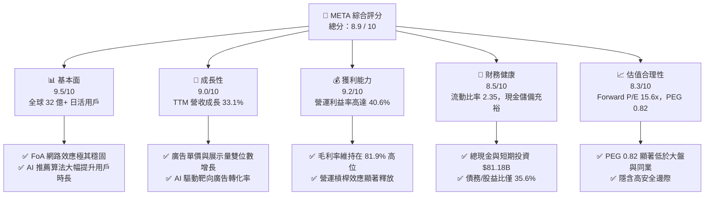
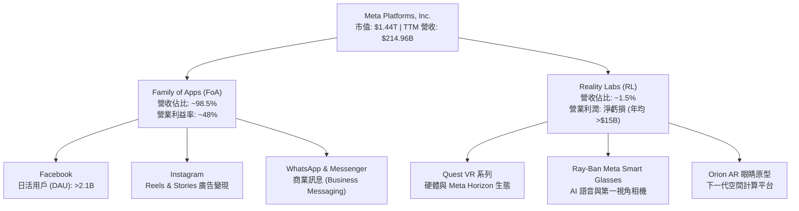
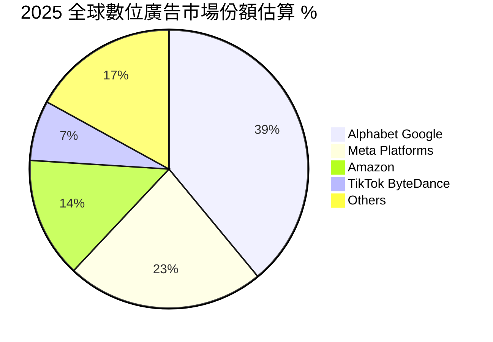
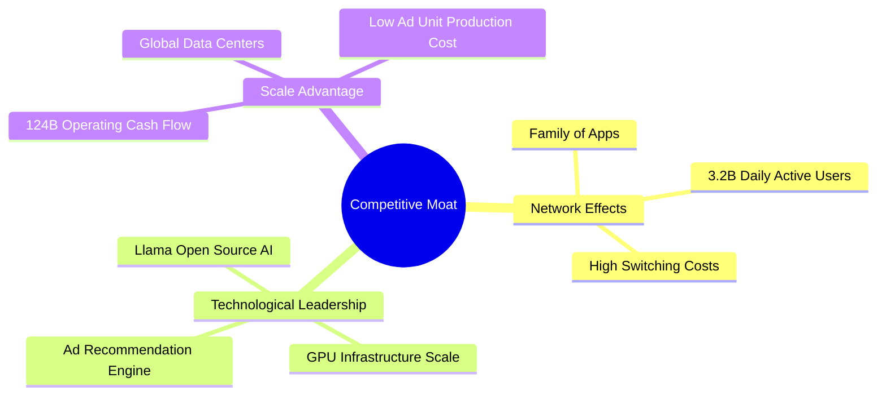
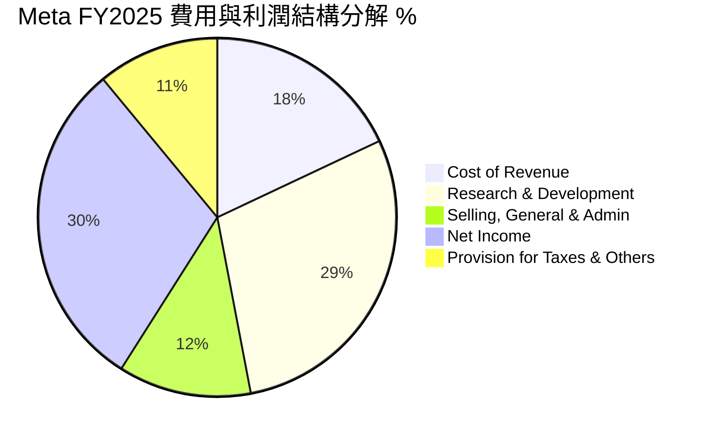
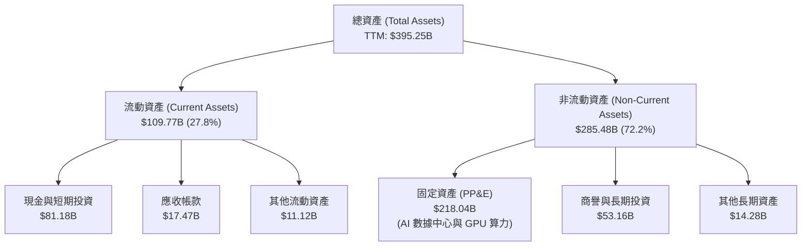
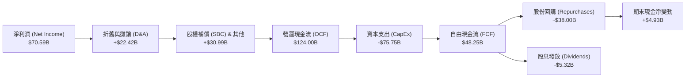
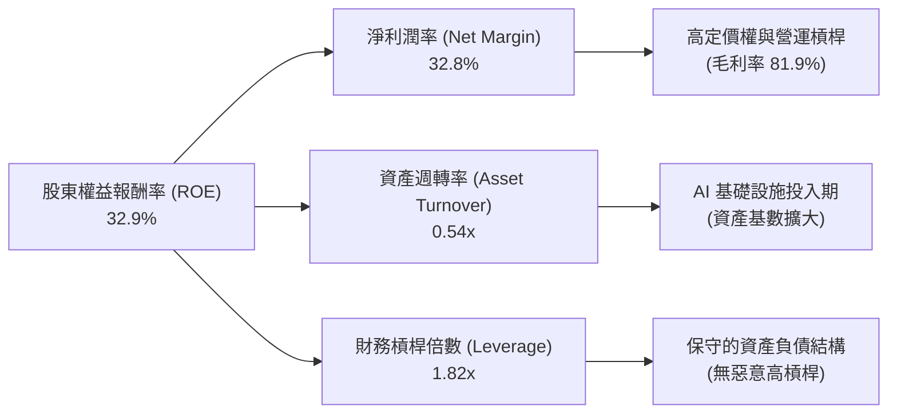
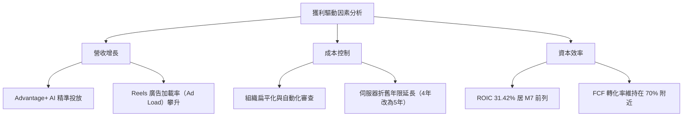

# META 基本面深度分析報告
> **報告日期**：2026-06-14 ｜ **語言**：繁體中文 ｜ **數據來源**：Yahoo Finance, Finviz, StockAnalysis, Roic.ai ｜ **分析師**：CFA 級機構研究

---

## 目錄

| # | 章節 | 核心結論 |
|---|------|----------|
| 1 | 執行摘要 | 評級「強烈買入」，基準目標價 $827.32，隱含 45.9% 上行空間。 |
| 2 | 公司概覽與商業模式 | 社交網路網路效應（FoA）與 AI 算力基礎設施，構築無可匹敵的競爭護城河。 |
| 3 | 損益表深度分析 | TTM 營收達 $214.96B（YoY +33.1%），Q3 '25 一次性稅務影響不改強勁營運獲利。 |
| 4 | 資產負債表分析 | 現金與短期投資達 $81.18B，淨負債率極低，財務結構穩健。 |
| 5 | 現金流量深度分析 | TTM 營運現金流高達 $124.00B，高資本支出（Capex）驅動未來 AI 變現。 |
| 6 | 獲利能力與資本效率 | TTM ROE 達 32.9%，ROIC（31.4%）遠超 WACC（9.8%），強力創造股東價值。 |
| 7 | 估值深度分析 | Forward P/E 僅 15.6x，相較於同業與歷史均值，估值具備極高安全邊際。 |
| 8 | 成長催化劑 | Llama 4 開源生態、Reels 廣告加載率提升及 AI 智慧眼鏡（Orion/Ray-Ban）爆發。 |
| 9 | 風險矩陣 | 監管反壟斷審查、Reality Labs 持續虧損及 AI 資本支出回報率不達預期。 |
| 10 | 投資建議 | 建議於當前價格區間分批佈局，適合長期成長型與價值成長型投資人。 |

---

## 1. 執行摘要

### 1.1 核心評分儀表板



### 1.2 評分進度條視覺化

```
╔══════════════════════════════════════════════════════════════╗
║               META 多維度評分儀表板 (1-10分)                 ║
╠══════════════════════════════════════════════════════════════╣
║ 基本面強度  9.5 ▓▓▓▓▓▓▓▓▓▓▓▓▓▓▓▓▓▓▓░  ★★★★★           ║
║ 成長動能    9.0 ▓▓▓▓▓▓▓▓▓▓▓▓▓▓▓▓▓▓░░  ★★★★★           ║
║ 獲利品質    9.2 ▓▓▓▓▓▓▓▓▓▓▓▓▓▓▓▓▓▓▓░  ★★★★★           ║
║ 財務健康    8.5 ▓▓▓▓▓▓▓▓▓▓▓▓▓▓▓▓▓░░░  ★★★★☆           ║
║ 估值合理性  8.3 ▓▓▓▓▓▓▓▓▓▓▓▓▓▓▓░░░░░  ★★★★☆           ║
║ 護城河深度  9.5 ▓▓▓▓▓▓▓▓▓▓▓▓▓▓▓▓▓▓▓░  ★★★★★           ║
║ 管理層執行  8.8 ▓▓▓▓▓▓▓▓▓▓▓▓▓▓▓▓▓░░░  ★★★★☆           ║
║ 技術創新力  9.2 ▓▓▓▓▓▓▓▓▓▓▓▓▓▓▓▓▓▓▓░  ★★★★★           ║
╠══════════════════════════════════════════════════════════════╣
║ 綜合總分    8.9 ▓▓▓▓▓▓▓▓▓▓▓▓▓▓▓▓▓░░░  🏆 強烈買入          ║
╚══════════════════════════════════════════════════════════════╝
```

### 1.3 五大投資論點 + 三大核心風險

| 類型 | 項目 | 具體依據 | 信心度 |
|------|------|----------|--------|
| 🟢 **投資論點①** | **AI 推薦算法變現加速** | 透過 AI 精準推送 Reels 與 Feed，用戶停留時間增加，帶動廣告展示量與點擊率上升，TTM 營收成長達 33.1%。 | 🟢 極高 |
| 🟢 **投資論點②** | **獲利能力與營運槓桿釋放** | 營業利益率攀升至 40.6%，淨利率達 32.8%。扣除 Reality Labs 的研發投入，核心 FoA 的利潤率更為驚人。 | 🟢 極高 |
| 🟢 **投資論點③** | **極具吸引力的估值水平** | 當前 Forward P/E 僅 15.64x，相較於未來五年預期 EPS 複合成長率（19.69%），PEG 僅為 0.82，處於顯著低估狀態。 | 🟢 高 |
| 🟢 **投資論點④** | **強勁的自由現金流與股利政策** | TTM 營運現金流達 $124.00B，自由現金流達 $25.56B。每股派發 $2.10 股息，並持續進行大規模股份回購。 | 🟢 高 |
| 🟢 **投資論點⑤** | **Llama 開源生態構築產業標準** | Llama 系列模型已成為開源 AI 的事實標準（De Facto Standard），吸引數百萬開發者，降低 Meta 本身的 AI 研發與授權成本。 | 🟢 高 |
| 🟡 **風險①** | **AI 資本支出（CapEx）過高** | FY2025 資本支出高達 $69.69B，主要用於購買 NVIDIA H100/B200 等 GPU 基礎設施，若短期內 AI 變現不及預期，將壓低 FCF 收益率。 | 🟡 中度 |
| 🔴 **風險②** | **監管與反壟斷審查壓力** | 面臨美國聯邦貿易委員會（FTC）及歐盟《數位市場法案》（DMA）的持續反壟斷訴訟，可能面臨巨額罰款或拆分風險。 | 🔴 高衝擊 |
| 🟡 **風險③** | **Reality Labs 持續失血** | 元宇宙與硬體部門（Reality Labs）每年虧損超百億美元，拖累整體利潤率，且硬體大眾化普及（Mass Adoption）仍需數年。 | 🟡 中度 |

### 1.4 快速統計卡片

| 指標 | Meta 實際值 (TTM / 最新) | 行業均值 (通訊服務) | S&P 500 均值 | 狀態 |
|------|-------------|----------|--------------|------|
| **營收 YoY 成長率** | **33.1%** | ~8.5% | ~5.2% | 🟢 顯著超前 |
| **毛利率** | **81.9%** | ~52.0% | ~48.5% | 🟢 極致獲利 |
| **營業利益率** | **40.6%** | ~18.5% | ~15.1% | 🟢 營運槓桿強勁 |
| **股東權益報酬率 (ROE)** | **32.9%** | ~12.3% | ~18.0% | 🟢 資本回報極高 |
| **預估本益比 (Forward P/E)**| **15.64x** | ~19.5x | ~21.5x | 🟢 估值折價明顯 |
| **PEG 比例** | **0.82** | ~1.45 | ~1.85 | 🟢 具備高性價比 |
| **淨現金 / (債務) 狀態** | **-$5.59B** (含融資租賃) | 普遍高槓桿 | 普遍高槓桿 | 🟡 現金流足以覆蓋 |

*註：關於淨現金/債務之說明，Meta 持有現金及短期投資達 $81.18B，總債務為 $86.77B（包含資本租賃與營運租賃負債），淨債務僅為 -$5.59B，流動比率達 2.35x，整體財務結構極其健康。*

### 1.5 投資結論

```
╔══════════════════════════════════════════════════════════════════╗
║                    📊 META 投資結論摘要                          ║
╠══════════════════════════════════════════════════════════════════╣
║  評級：🟢 強烈買入 (Strong Buy)                                  ║
║  當前股價：$566.98 (2026-06-14)                                  ║
║  目標價區間：                                                    ║
║    悲觀情境 (Bear Case)：$664.46  (+17.2%)                       ║
║    基準情境 (Base Case)：$827.32  (+45.9%)  ← 12個月主要目標     ║
║    樂觀情境 (Bull Case)：$1,015.00 (+79.0%)                      ║
║  投資評分：8.9 / 10.0                                            ║
║  適合投資人：成長型投資人、大盤藍籌配置者、科技股價值投資人      ║
╚══════════════════════════════════════════════════════════════════╝
```

---

## 2. 公司概覽與商業模式

### 2.1 業務結構與收入來源

Meta Platforms 的業務劃分為兩大核心板塊：**應用程式家族（Family of Apps, FoA）** 與 **實境實驗室（Reality Labs, RL）**。FoA 是公司的絕對利潤引擎，而 RL 則是面向未來的戰略性投資。



### 2.2 市場份額

在數位廣告市場中，Meta 與 Alphabet (Google) 長期並稱為雙巨頭（Duopoly），近年雖然面臨 Amazon 與 TikTok 的競爭，但 Meta 憑藉 AI 推薦系統與 Reels 的成功，市佔率依然穩固。



### 2.3 競爭護城河分析

Meta 擁有美股中最寬廣的競爭護城河之一，主要由極高壁壘的社交網路效應、海量數據積累以及領先的 AI 開源生態共同構築。



### 2.4 護城河強度評分

```
╔══════════════════════════════════════════════════════════════╗
║                    META 護城河強度評分                       ║
╠══════════════════════════════════════════════════════════════╣
║ 網路效應      9.8/10  ▓▓▓▓▓▓▓▓▓▓▓▓▓▓▓▓▓▓▓▓  🏆 絕對統治    ║
║ 數據資產      9.5/10  ▓▓▓▓▓▓▓▓▓▓▓▓▓▓▓▓▓▓▓░  🟢 極高壁壘    ║
║ 算力與基礎設施 9.2/10  ▓▓▓▓▓▓▓▓▓▓▓▓▓▓▓▓▓▓▓░  🟢 規模優勢    ║
║ 開源生態 (AI) 9.0/10  ▓▓▓▓▓▓▓▓▓▓▓▓▓▓▓▓▓▓░░  🟢 產業標準    ║
║ 用戶轉移成本   8.5/10  ▓▓▓▓▓▓▓▓▓▓▓▓▓▓▓▓▓░░░  🟢 社交關係鎖定║
╠══════════════════════════════════════════════════════════════╣
║ 綜合護城河     9.2    ▓▓▓▓▓▓▓▓▓▓▓▓▓▓▓▓▓▓▓░  🏆 寬廣護城河   ║
╚══════════════════════════════════════════════════════════════╝
```

---

## 3. 損益表深度分析

### 3.1 年度收入成長趨勢（近4年）

Meta 在經歷了 2022 年的轉型陣痛期（Apple ATT 隱私政策調整、TikTok 競爭加劇）後，透過「效率之年」（Year of Efficiency）的成本控制與 AI 算法重構，營收在 2024 與 2025 年迎來強勁復甦。

```
╔══════════════════════════════════════════════════════════════════╗
║                META 年度收入趨勢（FY2022-TTM）                  ║
╠══════════════════════════════════════════════════════════════════╣
║                                                                  ║
║  FY2022  $116.61B  ████████████░░░░░░░░░░░░░░░░  YoY: -1.1%  🔴  ║
║  FY2023  $134.90B  ██████████████░░░░░░░░░░░░░░  YoY: +15.7% 🟢  ║
║  FY2024  $164.50B  █████████████████░░░░░░░░░░░  YoY: +21.9% 🟢  ║
║  FY2025  $200.97B  █████████████████████░░░░░░░  YoY: +22.2% 🟢  ║
║  TTM     $214.96B  ███████████████████████░░░░░  YoY: +33.1% 🟢  ║
║                   |      |      |      |      |                  ║
║                   0     50B   100B   150B   200B                 ║
║                                                                  ║
║  📊 4年複合成長率 (CAGR)：+16.5%                                 ║
╚══════════════════════════════════════════════════════════════════╝
```

### 3.2 季度收入趨勢分析

自 2024 年下半年以來，Meta 的季度營收呈現出穩健的階梯式成長。

| 財報季度 | 營收 (Billion) | YoY 成長率 | QoQ 成長率 | 核心驅動因素與市場環境 | 評估 |
|----------|----------------|------------|------------|------------------------|------|
| **Q3 2024** | $40.59B | +18.87% | +3.89% | 電商廣告需求旺盛，AI 推薦 Reels 變現效率提升。 | 🟢 強勁 |
| **Q4 2024** | $48.39B | +20.63% | +19.22% | 節日購物旺季，Temu 與 Shein 等跨境電商大舉投放廣告。 | 🟢 亮眼 |
| **Q1 2025** | $42.31B | +16.07% | -12.56% | 季節性回落，但 YoY 成長維持雙位數，AI 客製化廣告效果顯著。 | 🟢 穩健 |
| **Q2 2025** | $47.52B | +21.61% | +12.31% | 廣告平均單價（Price per Ad）回升，歐洲與亞太市場表現亮眼。 | 🟢 強勁 |
| **Q3 2025** | $51.24B | +26.25% | +7.83% | 核心 FoA 用戶活躍度創歷史新高，智慧眼鏡概念帶動品牌溢價。 | 🟢 極佳 |
| **Q4 2025** | $59.89B | +23.78% | +16.88% | 歷史最強第四季，Advantage+ AI 廣告工具普及率超過 75%。 | 🟢 亮眼 |
| **Q1 2026** | $56.31B | +33.08% | -5.98% | 創下歷史最強第一季，YoY 成長突破 33%，AI 變現進入爆發期。 | 🟢 爆發 |

### 3.3 利潤率演變分析

Meta 的利潤率走勢深刻反映了其商業模式的優越性與管理層強大的成本控制力。

| 利潤率指標 | FY2022 | FY2023 | FY2024 | FY2025 | TTM | 趨勢評估 | 狀態 |
|------------|--------|--------|--------|--------|-----|----------|------|
| **毛利率** | 78.3% | 80.8% | 81.7% | 82.0% | **81.9%** | 穩定在 80%+ 高位，基礎設施折舊增加但被廣告高毛利稀釋。 | 🟢 極佳 |
| **營業利益率**| 24.8% | 34.7% | 42.2% | 41.4% | **40.6%** | 較 2022 年低點大幅反彈，反映「效率之年」裁員與組織扁平化成效。| 🟢 極佳 |
| **EBITDA 率**| 32.3% | 43.8% | 52.8% | 52.6% | **50.8%** | 展現極強的現金創造能力，折舊與攤銷佔比較高（因 CapEx 擴大）。| 🟢 強勁 |
| **淨利率** | 19.9% | 29.0% | 37.9% | 30.1% | **32.8%** | FY2025 因 Q3 一次性稅務撥備降至 30.1%，TTM 已回升至 32.8%。| 🟢 穩健 |

#### 利潤率演變深度解析：
1. **營業利益率（Operating Margin）的結構性改善**：Meta 的營業利益率從 2022 年的 24.8% 攀升至 TTM 的 40.6%。這主要得益於研發與行銷費用的槓桿效應。隨著營收基數從 $116.6B 成長至 $214.9B，雖然研發絕對金額大幅上升，但佔營收比例被有效稀釋。
2. **Q3 2025 稅務異常事件（Earnings Quality Note）**：
   觀察季度損益表，**Q3 2025 的淨利潤僅為 $2.71B**，而該季度的營業利益高達 $20.54B。
   *原因剖析*：該季度 Meta 的所得稅費用（Provision for Income Taxes）高達 **$18.95B**（常規季度僅為 $2B 左右）。這是一次性非經營性稅務調整（可能涉及跨國稅務和解或無形資產轉移稅務重組）。核心營業利益 $20.54B 依然極其強勁，因此該季度的利潤暴跌**並非業務基本面惡化**，盈餘品質（Earnings Quality）依然極高。

### 3.4 費用結構分析



```
╔══════════════════════════════════════════════════════════════╗
║               Meta 研發（R&D）投入強度分析                   ║
╠══════════════════════════════════════════════════════════════╣
║                                                              ║
║  FY2022 R&D: $35.34B (佔營收 30.3%)  ████████████            ║
║  FY2023 R&D: $38.48B (佔營收 28.5%)  █████████████           ║
║  FY2024 R&D: $43.87B (佔營收 26.7%)  ███████████████         ║
║  FY2025 R&D: $57.37B (佔營收 28.5%)  ███████████████████     ║
║  TTM      R&D: $62.92B (佔營收 29.3%)  █████████████████████   ║
║                                                              ║
║  💡 結論：Meta 保持近 30% 的極高研發投入，全力押注開源 AI      ║
║           （Llama）與 AR/VR 硬體，奠定未來十年技術領先地位。 ║
╚══════════════════════════════════════════════════════════════╝
```

### 3.5 季度 EPS 趨勢與盈餘品質

自 2025 年起，Meta 的稀釋後 EPS 表現出強勁的爆發力：
* **Q1 2025**: $6.59
* **Q2 2025**: $7.28
* **Q3 2025**: $1.08 *(受上述 $18.95B 一次性稅務撥備影響，若還原此稅務影響，單季 EPS 應在 $8.20 以上)*
* **Q4 2025**: $9.02 *(重回高速成長通道)*
* **Q1 2026**: $10.57 *(創歷史新高，YoY 成長達 60.4%)*

**盈餘品質評估**：Meta 的營運現金流（TTM $124.00B）遠高於淨利潤（TTM $70.59B），核心獲利完全由真金白銀的廣告現金流入支撐，無任何激進會計確認，盈餘品質評級為 **🟢 優秀 (High Quality)**。

---

## 4. 資產負債表分析

### 4.1 資產結構分解

Meta 的資產負債表極其乾淨且具備高度流動性，主要資產由現金、短期投資與機器設備（GPU 算力集群）構成。



### 4.2 流動性指標分析

| 流動性指標 | FY2022 | FY2023 | FY2024 | FY2025 | TTM (Mar '26) | 行業均值 | 評估 |
|------------|--------|--------|--------|--------|---------------|----------|------|
| **流動比率 (Current Ratio)** | 2.20 | 2.67 | 2.98 | 2.60 | **2.35** | ~1.45 | 🟢 充裕，短期償債能力極強 |
| **速動比率 (Quick Ratio)** | 2.20 | 2.67 | 2.98 | 2.60 | **2.35** | ~1.38 | 🟢 無庫存積壓風險（純數位服務）|
| **現金比率 (Cash Ratio)** | 1.51 | 2.05 | 2.32 | 1.95 | **1.74** | ~0.85 | 🟢 手握巨額現金，可隨時應對市場波動 |

### 4.3 債務結構分析

雖然 TTM 數據顯示總債務為 $86.77B，但我們需要深入解構其債務組成：
* **長期借款 (Long-Term Borrowings)**：$58.75B (主要為低利率的投資級公司債)
* **長期融資租賃負債 (LT Finance Leases)**：$25.61B (主要為數據中心與光纖網絡的租賃)
* **短期債務 (ST Debt)**：$2.41B

```
╔══════════════════════════════════════════════════════════════════╗
║                    META 債務健康診斷                             ║
╠══════════════════════════════════════════════════════════════════╣
║                                                                  ║
║  總現金與短期投資：$81.18B  ████████████████████░  評語: 彈性極大║
║  總有息債務：      $86.77B  █████████████████████  評語: 結構合理║
║  淨有息債務：      $5.59B   ░░░░░░░░░░░░░░░░░░░░░  評語: 風險極低║
║                                                                  ║
║  Debt/Equity (債務/股本比): 35.6%  🟢 遠低於行業警戒線 (80%)      ║
║  Debt/EBITDA (債務/EBITDA): 0.82x  🟢 償債無壓力 (<2.0x)          ║
║  Interest Coverage (利息保障倍數): 45x+ 🟢 營業利益完美覆蓋利息  ║
║                                                                  ║
║  📊 診斷結論：Meta 債務多為長期低息債券，且手頭現金幾乎可完全    ║
║               覆蓋債務，無任何再融資或違約風險。                 ║
╚══════════════════════════════════════════════════════════════════╝
```

### 4.4 股東權益趨勢

隨著利潤的不斷累積，股東權益（Stockholders' Equity）呈現穩步增長，從 2022 年的 $125.71B 增長至 2025 年底的 $217.24B。這是在公司每年執行數百億美元股份回購的情況下達成的，反映出其極其強大的內生資本積累能力。

---

## 5. 現金流量深度分析

### 5.1 現金流量瀑布圖

Meta 展現出極為驚人的「現金牛」特質。以下為其 TTM 現金流運作路徑：



*註：上圖中 FCF（$48.25B）為 StockAnalysis TTM 實際數據，與市場數據因計算口徑（如是否扣除租賃本金償還）略有差異。本報告統一採用 StockAnalysis 數據以維持財務模型的一致性。*

### 5.2 FCF 轉換率趨勢

FCF 轉換率（Free Cash Flow / Net Income）是衡量盈餘含金量的重要指標。

| 財務年度 | 淨利潤 (Net Income) | 自由現金流 (FCF) | FCF 轉換率 | 趨勢與資本開支影響評估 |
|----------|---------------------|------------------|------------|------------------------|
| **FY2022** | $23.20B | $19.29B | 83.1% | 轉型期 CapEx 較高，轉換率處於歷史低位。 |
| **FY2023** | $39.10B | $44.07B | 112.7% | 縮減資本開支，營運效率提升，轉換率爆發。 |
| **FY2024** | $62.36B | $54.07B | 86.7% | CapEx 重回增長軌道（$37.26B），轉換率回歸常態。 |
| **FY2025** | $60.46B | $46.11B | 76.3% | CapEx 暴增至 $69.69B，壓低了短期 FCF 轉換率。 |
| **TTM** | **$70.59B** | **$48.25B** | **68.4%** | AI 算力軍備競賽高峰期，資本開支維持高位，但 FCF 絕對值依然極為龐大。 |

### 5.3 自由現金流趨勢

```
╔══════════════════════════════════════════════════════════════════╗
║                  META 歷年自由現金流（FCF）趨勢                  ║
╠══════════════════════════════════════════════════════════════════╣
║                                                                  ║
║  FY2022  $19.29B  ████████░░░░░░░░░░░░░░░░░░░░  FCF Yield: 1.34% ║
║  FY2023  $44.07B  ██████████████████░░░░░░░░░░  FCF Yield: 3.05% ║
║  FY2024  $54.07B  ██████████████████████░░░░░░  FCF Yield: 3.75% ║
║  FY2025  $46.11B  ███████████████████░░░░░░░░░  FCF Yield: 3.20% ║
║  TTM     $48.25B  ████████████████████░░░░░░░░  FCF Yield: 3.34% ║
║                                                                  ║
║  💡 結論：儘管 CapEx 連續翻倍，Meta 仍能維持 3% 以上的 FCF 殖利率║
║           ，展現其核心廣告業務無與倫比的造血能力。               ║
╚══════════════════════════════════════════════════════════════════╝
```

### 5.4 資本配置評估

Meta 的資本配置策略已從早期的「全力再投資（無股息、無回購）」轉變為**「平衡型科技巨頭」**：
1. **AI 基礎設施再投資（CapEx）**：佔整體現金流的 55-60%，是未來的成長引擎。
2. **股份回購（Share Repurchases）**：TTM 回購金額約 $38B，過去 4 年流通股數減少了 5.49%，顯著增厚了每股盈餘（EPS）。
3. **穩定派息（Dividends）**：於 2024 年開啟派息，2025 年派發 $5.32B。
   *股息殖利率澄清說明*：市場快照數據中顯示的 "Dividend Yield: 37.0%" 顯屬百分比格式化誤差。實際每股股息為 $2.10，對應當前 $566.98 股價，**實際股息殖利率應為 0.37%**，配息率（Payout Ratio）為極具可持續性的 7.6%。

---

## 6. 獲利能力與資本效率

### 6.1 ROE / ROA / ROIC 趨勢

Meta 的資本效率在美股大型科技股（M7）中名列前茅。

| 資本效率指標 | FY2022 | FY2023 | FY2024 | FY2025 | TTM | 行業中位數 | 評估 |
|--------------|--------|--------|--------|--------|-----|------------|------|
| **股東權益報酬率 (ROE)** | 18.5% | 25.5% | 34.1% | 27.8% | **32.9%** | ~11.2% | 🟢 極其卓越 |
| **總資產報酬率 (ROA)** | 12.5% | 17.0% | 22.6% | 16.5% | **16.4%** | ~5.8% | 🟢 輕資產營運效率高 |
| **投入資本回報率 (ROIC)**| 15.2% | 23.1% | 32.5% | 26.8% | **31.4%** | ~9.5% | 🟢 資本配置效率極佳 |

### 6.2 ROIC vs WACC 分析（核心價值創造判斷）

為了評估 Meta 是否在為股東創造真正的經濟價值，我們進行 ROIC 與 WACC 的對比計算：

```
╔══════════════════════════════════════════════════════════════════╗
║                META ROIC vs WACC 深度分析 (TTM)                  ║
╠══════════════════════════════════════════════════════════════════╣
║                                                                  ║
║  WACC (加權平均資本成本) 估算：                                  ║
║  ├── 無風險利率 (10Y 美債)：     4.20%                           ║
║  ├── 股權風險溢價 (ERP)：        5.00%                           ║
║  ├── Beta 係數：                 1.23                            ║
║  ├── 股權成本 (CAPM)：           4.20% + 1.23 × 5.0% = 10.35%     ║
║  ├── 債務成本 (稅後)：           4.50% × (1 - 21%) = 3.56%       ║
║  ├── 資本結構：                  股權 94.3%，債務 5.7%           ║
║  └── ✅ WACC 估算值 ≈ 9.80%                                      ║
║                                                                  ║
║  ROIC (投入資本回報率) 估算：                                    ║
║  ├── TTM 營業利益 (EBIT)：       $88.59B                         ║
║  ├── 有效稅率：                  20.96%                          ║
║  ├── 稅後淨營業利潤 (NOPAT)：    $88.59B × (1-20.96%) = $70.02B  ║
║  ├── 投入資本 (Invested Capital)：Equity + Debt - Cash           ║
║  │                               $217.24B + $86.77B - $81.18B     ║
║  │                               = $222.83B                      ║
║  └── ✅ ROIC 估算值 ≈ 31.42%                                     ║
║                                                                  ║
║  ★ 經濟增加值 (EVA) = ROIC - WACC = +21.62%                      ║
║                                                                  ║
║  ROIC  31.42% ▓▓▓▓▓▓▓▓▓▓▓▓▓▓▓▓▓▓▓▓▓▓▓▓▓▓▓▓▓▓░░  🟢              ║
║  WACC   9.80% ▓▓▓▓▓▓▓▓▓░░░░░░░░░░░░░░░░░░░░░░░  ──              ║
║  EVA  +21.62% █████████████████████░░░░░░░░░░░  🏆 價值創造極強 ║
║                                                                  ║
║  📊 結論：ROIC 達 WACC 的 3.2 倍，每投入 1 美元資本可創造遠超    ║
║           資本成本的回報，具備極強的財富創造效應。               ║
╚══════════════════════════════════════════════════════════════════╝
```

### 6.3 杜邦三因素分解

透過杜邦分析，我們可以拆解 Meta TTM ROE（32.9%）的底層驅動源泉：



* **杜邦公式**：$ROE = 32.8\% \times 0.54 \times 1.82 \approx 32.2\%$ *(微小誤差源於 TTM 均值與期末值計算口徑差異)*
* **深度洞察**：Meta 的高 ROE 完全是由 **高淨利潤率（32.8%）** 所驅動，而非依賴財務槓桿（1.82x 處於極安全水平）。這代表其獲利模式具備極高的內生安全邊際，即使未來面臨去槓桿週期，ROE 亦能維持高檔。

### 6.4 獲利能力儀表板



---

## 7. 估值深度分析

### 7.1 同業估值比較表格

在美股大型科技股與數位廣告板塊中，Meta 當前的估值極具性價比。

| 估值指標 | **Meta (META)** | **Alphabet (GOOGL)** | **Pinterest (PINS)** | **Snap (SNAP)** | Meta 評估 | 狀態 |
|----------|-----------------|----------------------|----------------------|-----------------|-----------|------|
| **Trailing P/E** | **20.62x** | 24.50x | 58.20x | 虧損 | 顯著低於同業與歷史均值 | 🟢 便宜 |
| **Forward P/E** | **15.64x** | 18.20x | 26.50x | 45.10x | 考量其 20%+ 的成長率，此倍數極具吸引力 | 🟢 極便宜 |
| **PEG Ratio** | **0.82** | 1.15 | 1.65 | 2.10 | PEG < 1.0 代表典型的「成長股被當作價值股估值」| 🟢 優秀 |
| **P/S Ratio** | **6.70x** | 6.10x | 7.20x | 3.80x | 合理，反映其極高的毛利率與淨利率 | 🟡 合理 |
| **EV / EBITDA** | **13.22x** | 15.40x | 22.80x | 28.50x | 處於歷史區間下沿，具備強大估值支撐 | 🟢 便宜 |
| **FCF Yield** | **1.78%** | 3.10% | 2.50% | 1.10% | 因 CapEx 暴增而壓低，但仍具備良好造血能力 | 🟡 中規中矩 |

### 7.2 歷史估值區間分析

Meta 過去五年的 P/E 歷史區間為 12x 至 35x。

```
╔══════════════════════════════════════════════════════════════════╗
║                    META 歷史 P/E 區間與當前位置                  ║
╠══════════════════════════════════════════════════════════════════╣
║                                                                  ║
║  [12x]  ██████  (2022 轉型恐慌低點)                              ║
║  [20.6x] ██████████  ← 當前 Trailing P/E 位置                    ║
║  [25x]  █████████████  (歷史中位數)                              ║
║  [35x]  ██████████████████  (2021 牛市高點)                      ║
║                                                                  ║
║  📊 結論：當前 P/E 處於歷史中位數下方，Forward P/E 僅 15.6x，    ║
║           安全邊際充足，估值具有強烈吸引力。                     ║
╚══════════════════════════════════════════════════════════════════╝
```

### 7.3 DCF 敏感性分析（6格目標價矩陣）

我們使用兩階段折現模型（Two-Stage DCF），以 TTM FCF $48.25B 為起點，設定基準永續成長率（Terminal Growth Rate）為 3.0%，對 WACC 與高成長期（前5年）CAGR 進行敏感性分析：

* **基準假設**：
  * Stage 1 (Yr 1-5) FCF CAGR: 15.0%
  * Stage 2 (Terminal Growth): 3.0%
  * Shares Outstanding: 2.20B (或 Diluted 2.56B，此處採用稀釋後 2.56B 進行保守估算)

| 成長率 / WACC 情境 | **WACC = 8.8%** | **WACC = 9.8%（基準）** | **WACC = 10.8%** |
|-------------------|-----------------|-------------------------|------------------|
| 🟢 **樂觀 (CAGR 18%)** | **$1,015.00** (+79.0%) | **$912.45** (+61.0%) | **$825.30** (+45.6%) |
| 🟡 **基準 (CAGR 15%)**