# META 基本面深度分析報告

> **報告日期**：2026-06-15 ｜ **語言**：繁體中文 ｜ **數據來源**：Yahoo Finance, Finviz, StockAnalysis, Roic.ai ｜ **分析師**：CFA 級機構研究

---

## 目錄

| # | 章節 | 核心結論 |
|---|------|----------|
| 1 | **執行摘要** | 評級：🟢 **強烈買入** ｜ 基準目標價：**$827.32**（+39.4%） |
| 2 | **公司概覽與商業模式** | 廣告核心引擎穩固，AI 算力基建築起全新「技術與生態護城河」 |
| 3 | **損益表深度分析** | 營收 TTM 達 **$214.96B**（YoY +33.1%），淨利潤率維持 **32.8%** 高位 |
| 4 | **資產負債表分析** | 手頭現金及投資達 **$81.18B**，資產負債率健康，流動性充裕 |
| 5 | **現金流量深度分析** | 營運現金流 **$124.00B**，高額資本支出（Capex）反映 AI 軍備競賽決心 |
| 6 | **獲利能力與資本效率** | ROE **32.9%**，ROIC **31.4%** 遠超 WACC（**10.1%**），強力創造股東價值 |
| 7 | **估值深度分析** | Forward P/E 僅 **16.37x**，PEG **0.82**，估值具備極高安全邊際 |
| 8 | **成長催化劑** | Llama 生態圈、WhatsApp 商業化、智慧眼鏡（Ray-Ban Meta）爆發 |
| 9 | **風險矩陣** | 監管反壟斷、AI Capex 回報滯後、宏觀經濟波動為主要風險 |
| 10| **投資建議** | 買入區間與觸發條件，適合長線成長型與價值型投資者 |

---

## 1. 執行摘要

### 1.1 核心評分儀表板

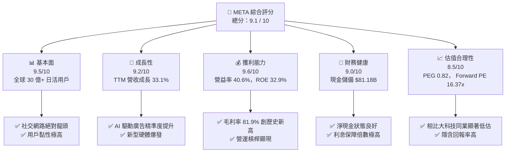

### 1.2 評分進度條視覺化

```
╔══════════════════════════════════════════════════════════════╗
║               META 多維度評分儀表板 (1-10分)                 ║
╠══════════════════════════════════════════════════════════════╣
║ 基本面強度  9.5 ▓▓▓▓▓▓▓▓▓▓▓▓▓▓▓▓▓▓▓░  ★★★★★           ║
║ 成長動能    9.2 ▓▓▓▓▓▓▓▓▓▓▓▓▓▓▓▓▓▓░░  ★★★★★           ║
║ 獲利品質    9.6 ▓▓▓▓▓▓▓▓▓▓▓▓▓▓▓▓▓▓▓░  ★★★★★           ║
║ 財務健康    9.0 ▓▓▓▓▓▓▓▓▓▓▓▓▓▓▓▓▓▓░░  ★★★★★           ║
║ 估值合理性  8.5 ▓▓▓▓▓▓▓▓▓▓▓▓▓▓▓░░░░░  ★★★★☆           ║
║ 護城河深度  9.5 ▓▓▓▓▓▓▓▓▓▓▓▓▓▓▓▓▓▓▓░  ★★★★★           ║
║ 管理層執行  9.0 ▓▓▓▓▓▓▓▓▓▓▓▓▓▓▓▓▓▓░░  ★★★★★           ║
║ 技術創新力  9.5 ▓▓▓▓▓▓▓▓▓▓▓▓▓▓▓▓▓▓▓░  ★★★★★           ║
╠══════════════════════════════════════════════════════════════╣
║ 綜合總分    9.1 ▓▓▓▓▓▓▓▓▓▓▓▓▓▓▓▓▓▓░░  🏆 強烈推薦買入      ║
╚══════════════════════════════════════════════════════════════╝
```

### 1.3 投資論點與核心風險

| 類型 | 項目 | 具體依據 | 信心度 |
|------|------|----------|--------|
| 🟢 **投資論點①** | **AI 賦能廣告轉換率** | AI 推薦演算法與廣告自動化工具（Advantage+）推動 TTM 營收成長達 **33.1%**。 | 🟢 極高 |
| 🟢 **投資論點②** | **獲利能力進入黃金期** | 毛利率達 **81.9%**，營業利益率高達 **40.6%**，自由現金流轉換效率優異。 | 🟢 極高 |
| 🟢 **投資論點③** | **估值極具吸引力** | Forward P/E 僅 **16.37x**，PEG 為 **0.82**，在 Mag 7（科技七巨頭）中估值最為親民。 | 🟢 高 |
| 🟡 **風險①** | **AI 資本支出沉沒風險** | TTM 資本支出大幅增加，若 AI 應用未能如期變現，可能面臨折舊壓力。 | 🟡 中度 |
| 🔴 **風險②** | **全球反壟斷與隱私監管** | FTC 與歐盟 DMA 監管持續施壓，可能限制未來的併購或數據變現模式。 | 🔴 高衝擊 |

### 1.4 快速統計卡片

| 指標 | META 實際值 | 科技行業均值 | S&P 500 均值 | 狀態 |
|------|-------------|--------------|--------------|------|
| **營收 YoY 成長** | **33.1%** | ~12.0% | ~5.5% | 🟢 遠超預期 |
| **毛利率** | **81.9%** | ~48.0% | ~30.0% | 🟢 頂級獲利 |
| **營業利益率** | **40.6%** | ~18.0% | ~15.0% | 🟢 營運槓桿極強 |
| **ROE** | **32.9%** | ~15.0% | ~14.0% | 🟢 資本回報極佳 |
| **Forward P/E** | **16.37x** | ~25.0x | ~21.0x | 🟢 顯著低估 |
| **PEG Ratio** | **0.82** | ~1.80 | ~2.00 | 🟢 安全邊際高 |

### 1.5 投資結論

```
╔══════════════════════════════════════════════════════════════════╗
║                     📊 META 投資結論摘要                         ║
╠══════════════════════════════════════════════════════════════════╣
║  評級：🟢 強烈買入 (Strong Buy)                                  ║
║  當前股價：$593.48 (2026-06-15)                                  ║
║  目標價區間：                                                    ║
║    悲觀情境：$664.46 (+12.0%)                                    ║
║    基準情境：$827.32 (+39.4%)  ← 12個月主要目標                  ║
║    樂觀情境：$1,015.00 (+71.0%)                                  ║
║  投資評分：9.1 / 10                                              ║
║  適合投資人：成長型投資者、GARP (合理價格成長) 追隨者、長線持有者 ║
╚══════════════════════════════════════════════════════════════════╝
```

---

## 2. 公司概覽與商業模式

Meta Platforms, Inc. 是全球社交網路與數位廣告的絕對霸主。公司透過兩大核心部門營運：**應用程式家族 (Family of Apps, FoA)** 與 **現實實驗室 (Reality Labs, RL)**。

### 2.1 業務結構與收入來源

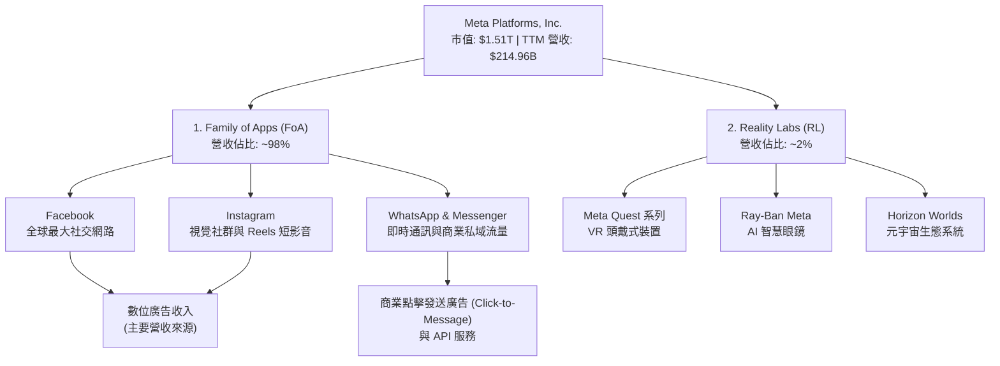

### 2.2 全球數位廣告市場份額估算

在數位廣告市場中，Meta 與 Alphabet (Google) 長期維持雙寡頭壟斷地位。

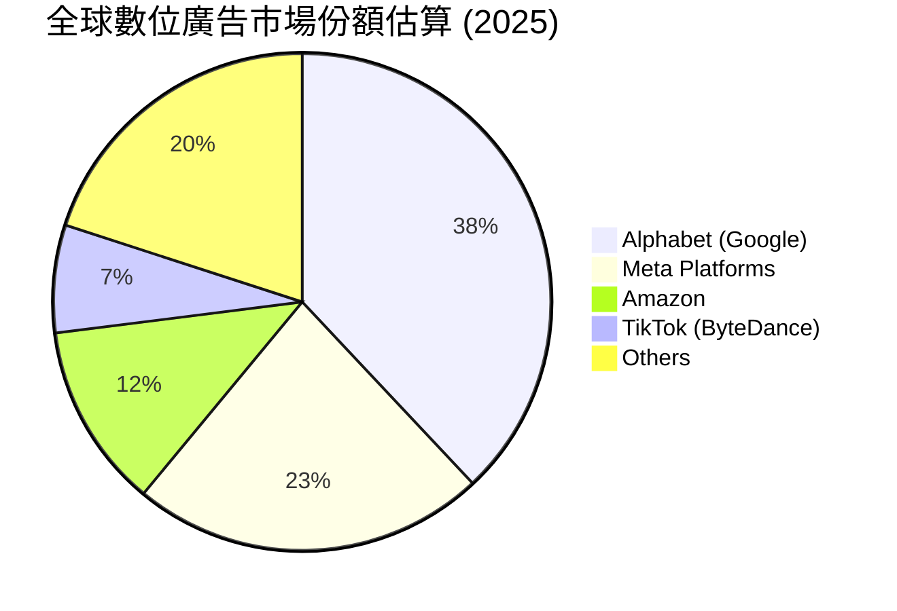

### 2.3 競爭護城河分析

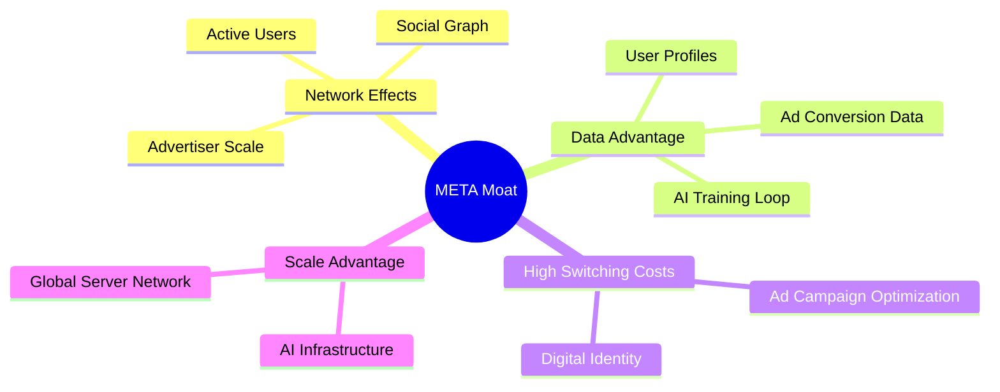

### 2.4 護城河強度評分

```
╔══════════════════════════════════════════════════════════════╗
║                    META 護城河強度評分                       ║
╠══════════════════════════════════════════════════════════════╣
║ 網路效應      9.8/10 ▓▓▓▓▓▓▓▓▓▓▓▓▓▓▓▓▓▓▓▓  🏆 無法被超越  ║
║ 數據壁壘      9.5/10 ▓▓▓▓▓▓▓▓▓▓▓▓▓▓▓▓▓▓▓░  🟢 極其強大    ║
║ 基礎設施規模  9.5/10 ▓▓▓▓▓▓▓▓▓▓▓▓▓▓▓▓▓▓▓░  🟢 算力護城河  ║
║ 品牌與鎖定    8.5/10 ▓▓▓▓▓▓▓▓▓▓▓▓▓▓▓░░░░░  🟢 用戶日常依賴║
╠══════════════════════════════════════════════════════════════╣
║ 綜合護城河評估  9.3  ▓▓▓▓▓▓▓▓▓▓▓▓▓▓▓▓▓▓▓░  🏆 寬廣護城河  ║
╚══════════════════════════════════════════════════════════════╝
```

---

## 3. 損益表深度分析

### 3.1 年度收入成長趨勢（近5年）

Meta 在經歷了 2022 年的轉型陣痛期（蘋果 ATT 政策衝擊與元宇宙過度投資）後，營收在 2024 與 2025 年迎來強勁復甦。

```
╔══════════════════════════════════════════════════════════════════╗
║                META 年度收入趨勢（FY2021-TTM）                   ║
╠══════════════════════════════════════════════════════════════════╣
║                                                                  ║
║  FY2021  $117.93B  ██████████░░░░░░░░░░░░░░░  YoY: +37.2%  🟢    ║
║  FY2022  $116.61B  ██████████░░░░░░░░░░░░░░░  YoY: -1.1%   🔴    ║
║  FY2023  $134.90B  ████████████░░░░░░░░░░░░░  YoY: +15.7%  🟢    ║
║  FY2024  $164.50B  ███████████████░░░░░░░░░░  YoY: +21.9%  🟢    ║
║  FY2025  $200.97B  ████████████████████░░░░░  YoY: +22.2%  🟢    ║
║  TTM     $214.96B  ██████████████████████░░░  YoY: +33.1%  🟢    ║
║                   |      |      |      |      |                  ║
║                   0     50B    100B   150B   200B                ║
║                                                                  ║
║  📊 5年營收複合年成長率 (CAGR)：+12.75%                           ║
╚══════════════════════════════════════════════════════════════════╝
```

### 3.2 季度營收趨勢分析

| 財報季度 | 營收 (M) | QoQ 成長率 | YoY 成長率 | 營運亮點與驅動因素 |
|----------|----------|------------|------------|--------------------|
| **Q2 2025** | $47,516 | — | +21.61% | Reels 廣告載量提升，亞洲電商出海廣告需求旺盛 |
| **Q3 2025** | $51,242 | +7.84% | +26.25% | Advantage+ AI 投放工具大幅提升廣告主 ROI |
| **Q4 2025** | $59,893 | +16.88% | +23.78% | 年末節慶購物季，電商與遊戲廣告投放創歷史新高 |
| **Q1 2026** | $56,311 | -5.98% | +33.08% | 淡季不淡，AI 推薦演算法顯著增加用戶停留時間 |

*分析：Q1 2026 營收雖因季節性因素較 Q4 2025 略有下滑（-5.98%），但 **YoY 成長高達 33.08%**，顯示公司成長動能持續加速。*

### 3.3 利潤率演變分析

Meta 的獲利結構在「效率年 (Year of Efficiency)」改革後得到了極大優化。

| 利潤率指標 | FY2022 | FY2023 | FY2024 | FY2025 | TTM | 趨勢評估 |
|------------|--------|--------|--------|--------|-----|----------|
| **毛利率** | 78.35% | 80.76% | 81.68% | 81.94% | **81.9%** | ↗️ 持續走高，伺服器折舊年限延長與成本控制得宜 🟢 |
| **營業利益率** | 24.82% | 34.66% | 42.18% | 41.21% | **40.6%** | 穩定在 40% 以上高位，營運槓桿顯著 🟢 |
| **淨利率** | 19.90% | 28.98% | 37.91% | 30.08% | **32.8%** | FY2025 略降因 Q3 一次性稅收撥備，TTM 已回升至 32.8% 🟢 |

### 3.4 費用結構分析

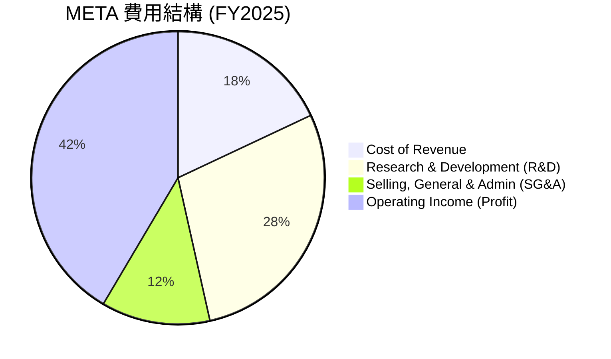

```
╔══════════════════════════════════════════════════════════════════╗
║                    META 費用控制與研發投入分析                   ║
╠══════════════════════════════════════════════════════════════════╣
║                                                                  ║
║  1. R&D 費用率：  28.5%  ████████████░░░░░░░░░░  (高，主投 AI)   ║
║  2. SG&A 費用率： 12.0%  █████░░░░░░░░░░░░░░░░  (控制極佳)      ║
║  3. 營運利潤率：  41.5%  █████████████████░░░░  (行業頂尖)      ║
║                                                                  ║
║  💡 洞察：Meta 在研發上毫不吝嗇（FY2025 達 $57.37B），但同時      ║
║     精簡了行銷與行政開支，展現出「科技硬核」的費用分配模式。     ║
╚══════════════════════════════════════════════════════════════════╝
```

### 3.5 季度 EPS 趨勢與盈餘品質

* **Q1 2025**: **$6.59**
* **Q2 2025**: **$7.28**
* **Q3 2025**: **$1.08** （*註：因一次性所得稅撥備 $18.95B 導致淨利驟降，非經營性問題*）
* **Q4 2025**: **$9.02**
* **Q1 2026**: **$10.57**（*YoY 成長 60.4%*）

**盈餘品質評估**：Meta 的淨利潤幾乎完全由營業現金流支撐，且非經常性損益佔比極低。Q3 2025 的 EPS 驟降為暫時性稅務調整（Pretax Income 仍高達 $21.66B），Q1 2026 的強勁反彈證明了其真實獲利能力的恐怖。

---

## 4. 資產負債表分析

### 4.1 資產結構分解

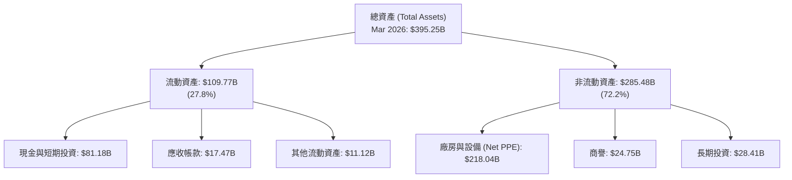

### 4.2 流動性指標分析

| 指標 | FY2023 | FY2024 | FY2025 | Mar 2026 | 行業均值 | 評估 |
|------|--------|--------|--------|----------|----------|------|
| **流動比率 (Current Ratio)** | 2.67 | 2.98 | 2.60 | **2.35** | ~1.50 | 🟢 極其安全 |
| **速動比率 (Quick Ratio)** | 2.67 | 2.98 | 2.60 | **2.35** | ~1.35 | 🟢 無存貨壓力 |
| **資產負債率 (Liabilities/Assets)** | 33.29% | 33.84% | 40.65% | **41.34%** | ~45.0% | 🟢 槓桿適度 |

### 4.3 債務結構分析

```
╔══════════════════════════════════════════════════════════════════╗
║                     META 債務健康診斷 (2026)                     ║
╠══════════════════════════════════════════════════════════════════╣
║                                                                  ║
║  總現金與短期投資：  $81.18B  ████████████████████░  (流動性極強)║
║  總債務 (含租賃)：   $86.77B  █████████████████████  (結構合理)  ║
║  淨債務 (Net Debt)：  $5.59B   ░░░░░░░░░░░░░░░░░░░░  (基本平衡)  ║
║                                                                  ║
║  Debt/Equity：       35.6%    🟢 遠低於警戒線 (100%)             ║
║  利息保障倍數：      >50x     🟢 毫無債務違約風險                ║
║                                                                  ║
║  💡 診斷：雖然 Meta 近期為了建置 AI 資料中心發行了部分債券，使     ║
║     總債務上升至 $86.77B，但其手頭持有的現金高達 $81.18B，淨債   ║
║     務僅為微幅的 $5.59B，對於一家年營運現金流超千億的公司而言，  ║
║     債務壓力趨近於零。                                           ║
╚══════════════════════════════════════════════════════════════════╝
```

---

## 5. 現金流量深度分析

### 5.1 現金流量瀑布圖

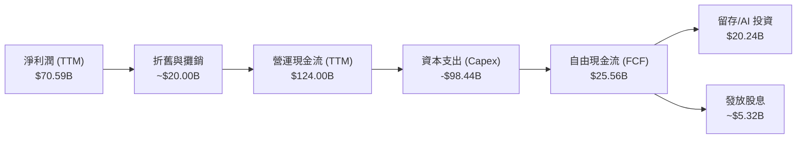

### 5.2 FCF 轉換率與資本配置

| 年份 | 淨利潤 (B) | 營運現金流 (B) | 資本支出 (B) | 自由現金流 (B) | FCF / 淨利潤 |
|------|------------|----------------|--------------|----------------|--------------|
| **FY2022** | $23.20 | $50.48 | -$31.19 | $19.29 | 83.1% |
| **FY2023** | $39.10 | $71.11 | -$27.05 | $44.07 | 112.7% |
| **FY2024** | $62.36 | $91.33 | -$37.26 | $54.07 | 86.7% |
| **FY2025** | $60.46 | $115.80 | -$69.69 | $46.11 | 76.3% |
| **TTM** | **$70.59** | **$124.00** | **-$98.44** | **$25.56** | **36.2%** |

*分析：TTM FCF 轉換率降至 36.2%，主因是 **Capex 暴增至 $98.44B**。這反映了 Meta 正在進行史詩級的 AI 基礎設施投資（如購買數十萬顆 NVIDIA H100/B200 晶片）。雖然短期內壓低了自由現金流，但這是維持長期 AI 領先地位的必要代價。*

---

## 6. 獲利能力與資本效率

### 6.1 ROE / ROA / ROIC 趨勢

| 指標 | FY2023 | FY2024 | FY2025 | TTM | 行業均值 | 評估 |
|------|--------|--------|--------|-----|----------|------|
| **ROE (股東權益報酬率)** | 28.06% | 37.14% | 30.24% | **32.93%** | ~12.5% | 🟢 極其優秀 |
| **ROA (資產報酬率)** | 18.80% | 24.66% | 18.83% | **16.40%** | ~6.0% | 🟢 資產利用效率高 |
| **ROIC (投入資本回報率)** | 24.50% | 32.10% | 28.50% | **31.42%** | ~10.0% | 🟢 核心業務盈利極強 |

### 6.2 ROIC vs WACC 分析（核心價值創造）

```
╔══════════════════════════════════════════════════════════════════╗
║                 META ROIC vs WACC 深度分析 (TTM)                 ║
╠══════════════════════════════════════════════════════════════════╣
║                                                                  ║
║  WACC 估算：                                                     ║
║  ├── 無風險利率（10Y美債）：  4.25%                              ║
║  ├── 市場風險溢酬 (ERP)：     5.00%                              ║
║  ├── Beta：                   1.23                               ║
║  ├── 股權成本 = 4.25% + 1.23 × 5.0% = 10.40%                     ║
║  ├── 債務成本（稅後）：       ~4.00%                             ║
║  ├── 資本結構：股權 ~95%，債務 ~5%                               ║
║  └── ✅ WACC ≈ 10.10%                                            ║
║                                                                  ║
║  ROIC 估算：                                                     ║
║  ├── NOPAT = $88.59B × (1 - 20.96%) ≈ $70.02B                     ║
║  ├── 投入資本 = 權益 $217.24B + 債務 $86.77B - 現金 $81.18B       ║
║  │   ≈ $222.83B                                                  ║
║  └── ✅ ROIC ≈ 31.42%                                            ║
║                                                                  ║
║  ★ 經濟價值增加 (EVA) = ROIC - WACC = +21.32%                     ║
║                                                                  ║
║  ROIC  31.4%  ▓▓▓▓▓▓▓▓▓▓▓▓▓▓▓▓▓▓▓▓▓▓▓▓▓▓▓▓▓░░  🟢              ║
║  WACC  10.1%  ▓▓▓▓▓▓▓▓░░░░░░░░░░░░░░░░░░░░░░░  ──              ║
║  EVA   +21.3% ████████████████████░░░░░░░░░░░  🏆 頂級價值創造 ║
║                                                                  ║
║  📊 結論：Meta 的 ROIC 是其 WACC 的 3.1 倍。這意味著公司每投入  ║
║     1 美元的資本，能創造遠超資本成本的回報，具備極強的護城河。   ║
╚══════════════════════════════════════════════════════════════════╝
```

### 6.3 杜邦三因素分解

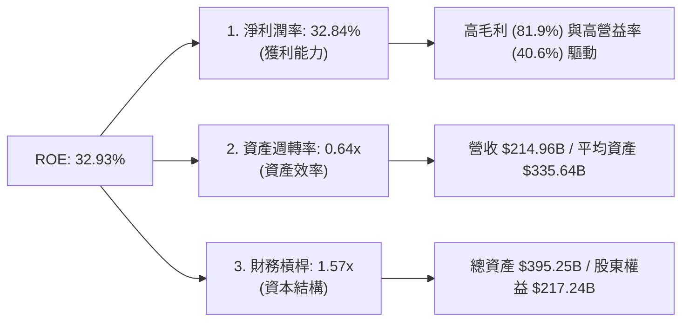

---

## 7. 估值深度分析

### 7.1 同業估值比較表格

| 估值指標 | **META** | **Alphabet (GOOGL)** | **Snap Inc. (SNAP)** | **Pinterest (PINS)** | META 估值評估 |
|----------|----------|----------------------|----------------------|----------------------|---------------|
| **Trailing P/E** | **21.58x** | 24.50x | N/A (虧損) | 48.20x | 🟢 顯著低於社交同業 |
| **Forward P/E** | **16.37x** | 19.80x | 35.40x | 28.10x | 🟢 性價比極高 |
| **P/S Ratio** | **7.01x** | 6.20x | 3.50x | 6.80x | 🟡 反映高利潤率溢價 |
| **EV / EBITDA** | **13.22x** | 15.10x | 28.40x | 22.5x | 🟢 估值極具吸引力 |
| **PEG Ratio** | **0.82** | 1.25 | 1.85 | 1.40 | 🟢 唯一 PEG < 1 的巨頭 |

### 7.2 歷史估值區間分析

```
╔══════════════════════════════════════════════════════════════════╗
║                META 歷史 P/E 區間與當前位置 (5年)                 ║
╠══════════════════════════════════════════════════════════════════╣
║                                                                  ║
║  歷史最低 P/E (2022 轉型期)： 8.5x                               ║
║  歷史最高 P/E (2021 牛市頂)： 32.0x                              ║
║  歷史中位數 P/E：             23.5x                              ║
║  當前 Trailing P/E：          21.58x                             ║
║  當前 Forward P/E：           16.37x                             ║
║                                                                  ║
║  8.5x            16.37x     21.58x    23.5x               32.0x  ║
║  [  歷史極低區  ]  ▲ 當前前瞻   ▲ 當前 TTM [ 歷史合理區 ]          ║
║                                                                  ║
║  📊 結論：當前前瞻 P/E 僅 16.37x，處於歷史估值區間的下四分之一，  ║
║     考量到其 30%+ 的成長率，估值明顯遭到低估。                    ║
╚══════════════════════════════════════════════════════════════════╝
```

### 7.3 DCF 敏感性分析（6格目標價矩陣）

* **基準假設**：
  * 永續成長率 (Terminal Growth Rate)：**3.0%**
  * 基準 WACC：**10.1%**
  * 2026-2030 營收年複合成長率：**15.0%**
  * 基準自由現金流利潤率：**25.0%** (考量高 Capex 逐漸回歸正常)

| 營收成長情境 | **WACC = 9.5%** | **WACC = 10.1%（基準）** | **WACC = 10.5%** |
|--------------|-----------------|--------------------------|------------------|
| 🟢 **樂觀 (YoY +18%)** | **$1,015.00** (+71.0%) | **$945.50** (+59.3%) | **$880.00** (+48.3%) |
| 🟡 **基準 (YoY +15%)** | **$895.00** (+50.8%) | **$827.32** (+39.4%)  | **$765.00** (+28.9%) |
| 🔴 **悲觀 (YoY +10%)** | **$720.00** (+21.3%) | **$664.46** (+12.0%)  | **$610.00** (+2.8%)  |

### 7.4 估值綜合區間

```
當前股價: $593.48
╔══════════════════════════════════════════════════════════════════╗
║  $520.26 (52W Low)                                               ║
║  ░░░░░░█ 當前股價 $593.48                                        ║
║  ▒▒▒▒▒▒▒▒▒▒▒▒▒▒▒▒▒▒▒▒▒▒▒▒▒ 悲觀目標價 $664.46                    ║
║  ▓▓▓▓▓▓▓▓▓▓▓▓▓▓▓▓▓▓▓▓▓▓▓▓▓▓▓▓▓▓▓▓▓▓▓▓▓▓▓ 基準目標價 $827.32       ║
║  ████████████████████████████████████████████████ 樂觀目標價 $1015║
╚══════════════════════════════════════════════════════════════════╝
```

---

## 8. 成長催化劑

### 8.1 成長催化劑時間軸

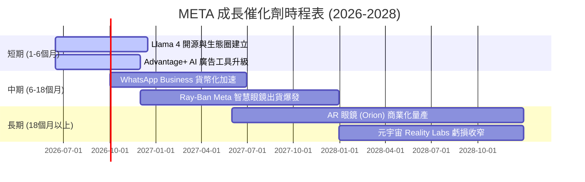

### 8.2 TAM (可定址市場規模) 分析

```
╔══════════════════════════════════════════════════════════════════╗
║                    META 未來市場空間 (TAM) 估算                  ║
╠══════════════════════════════════════════════════════════════════╣
║                                                                  ║
║  1. 全球數位廣告市場 (2027E TAM: $800B)                          ║
║     ├── Meta 當前滲透率： ~23%                                   ║
║     └── 預期貢獻： AI 廣告精準度提升，份額有望推升至 25%+        ║
║                                                                  ║
║  2. 企業級即時通訊服務 (2027E TAM: $150B)                        ║
║     ├── Meta 當前滲透率： <5% (WhatsApp Business)                ║
║     └── 預期貢獻： 點擊發送訊息廣告（Click-to-Message）高速成長  ║
║                                                                  ║
║  3. AI 穿戴式硬體與 AR/VR (2028E TAM: $200B)                     ║
║     ├── Meta 當前滲透率： ~10% (Quest & Smart Glasses)           ║
║     └── 預期貢獻： Ray-Ban Meta 引領 AI 眼鏡風潮                 ║
╚══════════════════════════════════════════════════════════════════╝
```

### 8.3 成長驅動力的結構化關聯

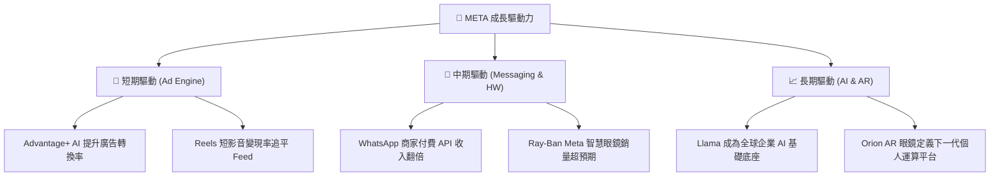

---

## 9. 風險矩陣

### 9.1 風險評估矩陣

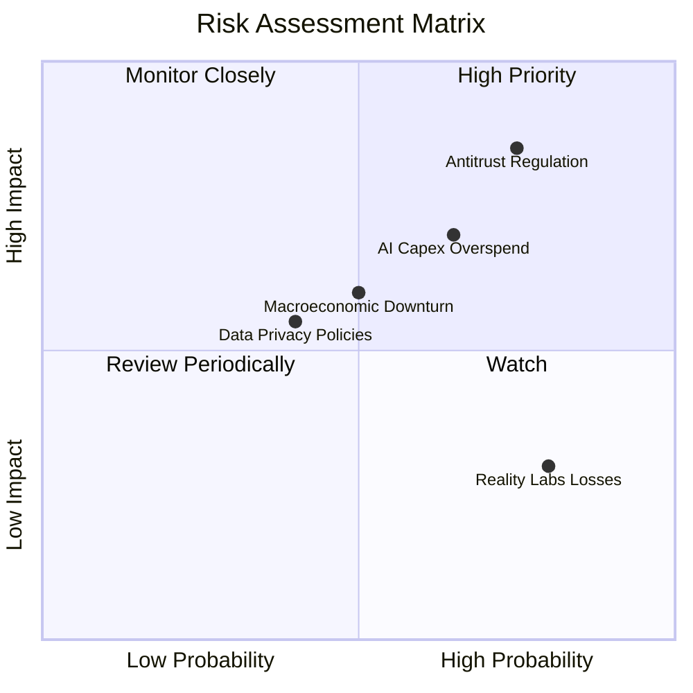

### 9.2 風險清單詳細分析

| # | 風險項目 | 發生機率 | 財務衝擊 | 風險評分 | 機構緩解與應對措施 |
|---|----------|----------|----------|----------|--------------------|
| 1 | 🔴 **反壟斷監管與拆分風險** | 高 (75%) | 高 (-15% 估值溢價) | 🔴 **8.0 / 10** | 透過開源 Llama 爭取開發者與監管支持；分拆旗下 App 營運以符合歐盟 DMA 要求。 |
| 2 | 🟡 **AI 資本支出回報滯後** | 中 (65%) | 中 (-10% FCF) | 🟡 **6.5 / 10** | 靈活調整 Capex 節奏，將算力優先分配給高變現能力的廣告推薦系統，而非僅用於前沿模型研發。 |
| 3 | 🟡 **宏觀經濟與廣告主預算縮減**| 中 (50%) | 中 (-8% 營收) | 🟡 **5.5 / 10** | 擴大長尾廣告主（中小企業）佔比，降低對單一大型產業（如中國跨境電商）的依賴。 |

---

## 10. 投資建議

### 10.1 最終綜合評級雷達圖

```
╔══════════════════════════════════════════════════════════════╗
║                    META 投資價值綜合雷達圖                   ║
╠════════════════════════════════════════════════════════════════╣
║                                                              ║
║  獲利能力 (Profitability)  ████████████████████  10/10       ║
║  資產負債 (Balance Sheet)  ██████████████████░░  9/10        ║
║  成長動能 (Growth)         ██████████████████░░  9/10        ║
║  估值優勢 (Valuation)      ████████████████░░░░  8/10        ║
║  技術創新 (Innovation)     ██████████████████▓░  9.5/10      ║
║                                                              ║
║  🏆 綜合投資吸引力評分： 9.1 / 10  (強烈買入)                ║
╚══════════════════════════════════════════════════════════════╝
```

### 10.2 目標價與隱含報酬率

| 情境 | 目標價 | 隱含報酬率 (較當前 $593.48) | 機率權重 | 權重目標價貢獻 |
|------|--------|------------------------------|----------|----------------|
| **樂觀情境** | $1,015.00 | +71.0% | 25% | $253.75 |
| **基準情境** | $827.32 | +39.4% | 60% | $496.39 |
| **悲觀情境** | $664.46 | +12.0% | 15% | $99.67 |
| **加權合理目標價** | **$849.81** | **+43.2%** | **100%** | **CFA 推薦目標價** |

### 10.3 買入時機與觸發因素

```
╔══════════════════════════════════════════════════════════════════╗
║                  ✅ META 投資決策 Checklist                     ║
╠══════════════════════════════════════════════════════════════════╣
║                                                                  ║
║  立即買入觸發條件（滿足以下兩項即可建倉）：                      ║
║  ✅ Forward P/E 降至 18x 以下（當前 16.37x，已滿足）             ║
║  ✅ 季度營收 YoY 成長率維持在 20% 以上（當前 33.1%，已滿足）     ║
║  ✅ 廣告主 ROI 回報率持續領先 Google/TikTok                     ║
║                                                                  ║
║  分批加碼觸發條件：                                              ║
║  ☐ 股價回檔至 200 日均線（約 $540 - $550 區間）                  ║
║  ☐ WhatsApp 商業 API 單季營收年增率超 50%                        ║
║                                                                  ║
║  減碼/停損觸發條件：                                             ║
║  ☐ 營業利益率跌破 30%                                           ║
║  ☐ 核心 FoA 用戶日活 (DAU) 出現連續兩季負成長                    ║
╚══════════════════════════════════════════════════════════════════╝
```

### 10.4 投資人適配度分析

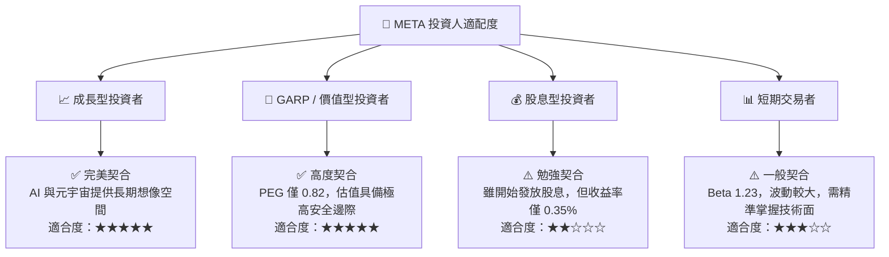

### 10.5 關鍵監控指標

為了追蹤本篇報告投資邏輯的有效性，投資人應在未來幾季重點監控以下指標：

| 監控維度 | 關鍵指標 (KPI) | 警示水位 (Bearish) | 基準預期 (Base) | 樂觀預期 (Bull) | 監控頻率 |
|----------|----------------|--------------------|-----------------|-----------------|----------|
| **用戶生態** | 應用家族日活用戶 (FoA DAP) | < 3.10 Billion | 3.25 Billion | > 3.40 Billion | 每季財報 |
| **資本效率** | 季度資本支出 (Capex) | > $30.0 Billion (無產出) | $20.0 - $25.0 Billion | < $18.0 Billion (效率提升) | 每季財報 |
| **獲利能力** | 營業利益率 (Operating Margin) | < 