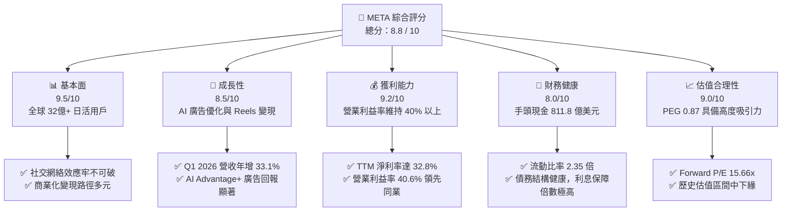
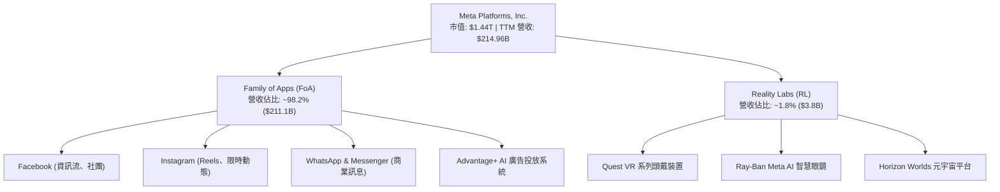
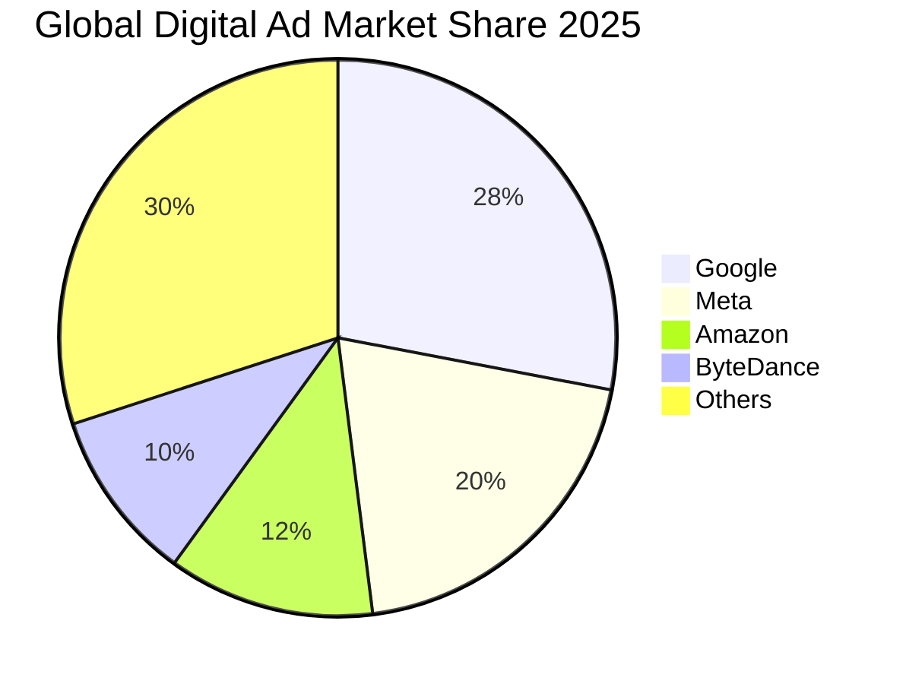
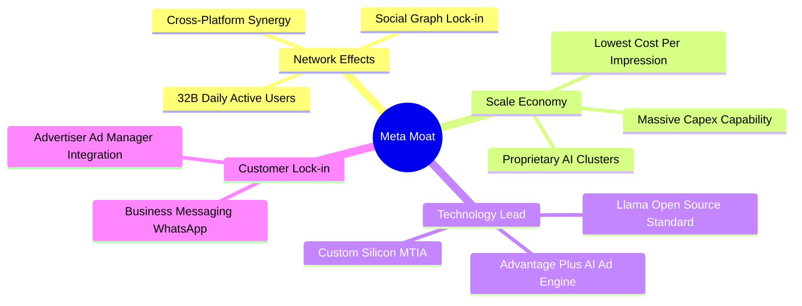
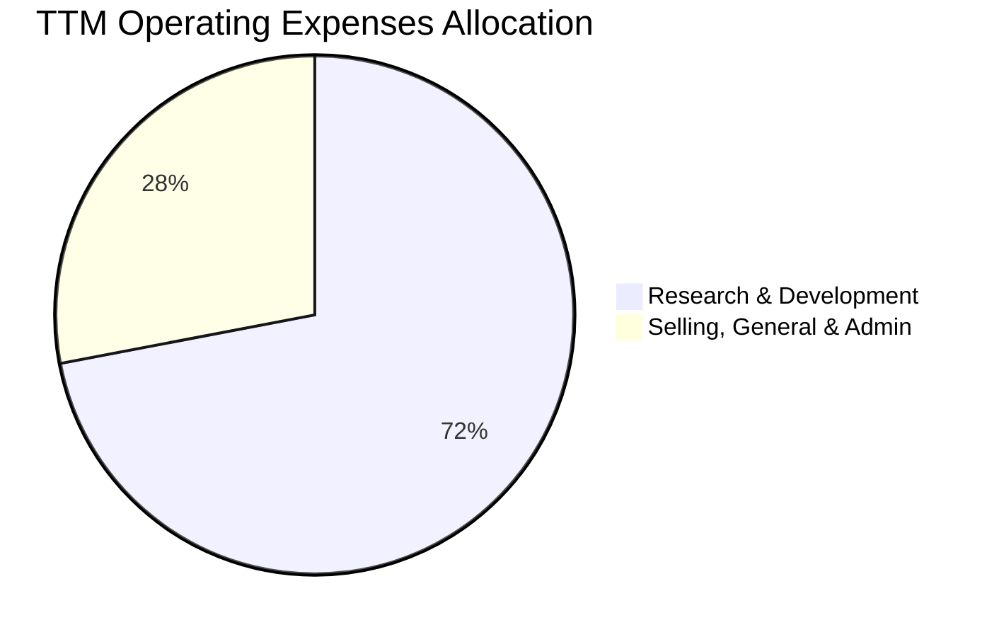
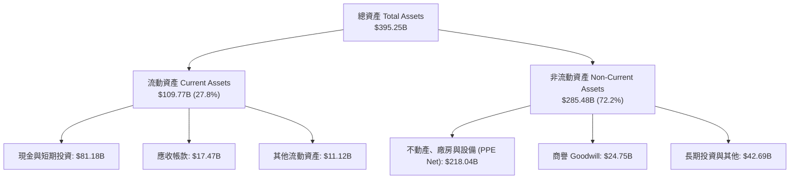
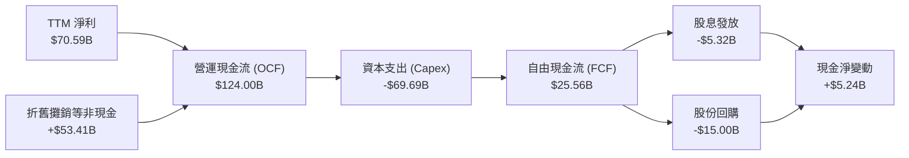

# META 基本面深度分析報告

> **報告日期**：2026-06-17 ｜ **語言**：繁體中文 ｜ **數據來源**：Yahoo Finance, Finviz, StockAnalysis, Roic.ai ｜ **分析師**：CFA 級機構研究

---

## 目錄

| # | 章節 | 核心結論 |
|---|------|----------|
| 1 | 執行摘要 | 評級「強烈買入」，基準目標價 $827.32，隱含上行空間 45.8% |
| 2 | 公司概覽與商業模式 | 社交網路巨擘，AI 與開源生態（Llama）構築全新技術與網絡雙重護城河 |
| 3 | 損益表深度分析 | Q1 2026 營收年增 33.1%，毛利率維持 81.9% 高檔，獲利品質極佳 |
| 4 | 資產負債表分析 | 淨債務僅 -$5.59B，流動比率 2.35，資產結構輕盈且變現能力極強 |
| 5 | 現金流量深度分析 | TTM 營運現金流達 $124.00B，儘管 Capex 擴大仍維持強大 FCF 生成力 |
| 6 | 獲利能力與資本效率 | TTM ROE 高達 32.9%，ROIC (31.4%) 遠超 WACC (10.5%)，強力創造股東價值 |
| 7 | 估值深度分析 | Forward P/E 僅 15.66 倍，PEG 0.87，估值相較 Mag-7 同儕顯著低估 |
| 8 | 成長催化劑 | Llama 4/5 釋放、Reels 廣告變現率提升與 WhatsApp 商業化進入爆發期 |
| 9 | 風險矩陣 | 監管反壟斷壓力與 Reality Labs 資本支出過高為主要風險，機率中等但影響顯著 |
| 10 | 投資建議 | 具備高度安全邊際與成長動能，建議成長型與長線投資者逢低積極佈局 |

---

## 1. 執行摘要

### 1.1 核心評分儀表板



### 1.2 評分進度條視覺化

```
╔══════════════════════════════════════════════════════════════╗
║               META 多維度評分儀表板 (1-10分)                 ║
╠══════════════════════════════════════════════════════════════╣
║ 基本面強度  9.5 ▓▓▓▓▓▓▓▓▓▓▓▓▓▓▓▓▓▓▓░  ★★★★★           ║
║ 成長動能    8.5 ▓▓▓▓▓▓▓▓▓▓▓▓▓▓▓▓▓░░░  ★★★★☆           ║
║ 獲利品質    9.2 ▓▓▓▓▓▓▓▓▓▓▓▓▓▓▓▓▓▓░░  ★★★★★           ║
║ 財務健康    8.0 ▓▓▓▓▓▓▓▓▓▓▓▓▓▓▓▓░░░░  ★★★★☆           ║
║ 估值合理性  9.0 ▓▓▓▓▓▓▓▓▓▓▓▓▓▓▓▓▓▓░░  ★★★★★           ║
║ 護城河深度  9.5 ▓▓▓▓▓▓▓▓▓▓▓▓▓▓▓▓▓▓▓░  ★★★★★           ║
║ 管理層執行  8.8 ▓▓▓▓▓▓▓▓▓▓▓▓▓▓▓▓▓░░░  ★★★★☆           ║
║ 技術創新力  9.0 ▓▓▓▓▓▓▓▓▓▓▓▓▓▓▓▓▓▓░░  ★★★★★           ║
╠══════════════════════════════════════════════════════════════╣
║ 綜合總分    8.8 ▓▓▓▓▓▓▓▓▓▓▓▓▓▓▓▓▓░░░  🏆 強烈買入          ║
╚══════════════════════════════════════════════════════════════╝
```

### 1.3 五大投資論點 + 三大核心風險

| 類型 | 項目 | 具體依據 | 信心度 |
|------|------|----------|--------|
| 🟢 **投資論點①** | **AI 賦能廣告系統，提升廣告主投資回報率 (ROAS)** | Meta 透過 Llama AI 演算法優化 Advantage+ 廣告投放，TTM 營收達 $214.96B，YoY 成長 33.1%，顯示廣告單價與精準度雙重提升。 | 🟢 極高 |
| 🟢 **投資論點②** | **極致的獲利能力與經營槓桿** | 毛利率維持在 81.9% 的超高水準，營業利益率達 40.6%，淨利率達 32.8%，在美股萬億市值巨頭中名列前茅。 | 🟢 極高 |
| 🟢 **投資論點③** | **估值極具安全邊際，PEG < 1** | 當前 Forward P/E 僅 15.66 倍，對比未來五年預期 EPS 成長率（PEG 僅 0.87），估值顯著低於歷史均值與 Mag-7 同儕。 | 🟢 極高 |
| 🟢 **投資論點④** | **開源 AI 生態（Llama）確立行業標準** | Meta 透過開源 Llama 模型，成功將自身塑造成 AI 時代的「Android」，大幅降低自身軟體開發成本並鎖定開發者生態。 | 🟢 高 |
| 🟢 **投資論點⑤** | **資本回報計畫啟動，股東友好度大增** | 2025 年發放派息 $5.32B，股利發放率 7.6%，結合主動的股份回購，顯著支撐每股盈餘 (EPS) 成長（TTM EPS 達 $27.49）。 | 🟢 高 |
| 🟡 **風險①** | **Reality Labs 虧損持續擴大** | FY2025 Capex 達 $69.69B（YoY +87.0%），其中大量資金投入 Reality Labs 與 AI 基礎設施，若硬體（如 AR 眼鏡）普及慢於預期，將拖累整體回報率。 | 🟡 中度 |
| 🔴 **風險②** | **全球反壟斷與隱私監管風險** | 歐盟 DMA 法案及美聯邦貿易委員會 (FTC) 對 Meta 社交平台壟斷與數據隱私的持續訴訟，可能面臨鉅額罰款或業務拆分風險。 | 🔴 高衝擊 |
| 🟡 **風險③** | **短影音與新興 AI 搜尋引擎的分流競爭** | 儘管 Reels 變現良好，但 TikTok 的競爭以及 Perplexity、ChatGPT 等 AI 搜尋對傳統資訊流廣告的潛在替代效應仍需警惕。 | 🟡 中度 |

### 1.4 快速統計卡片

| 指標 | Meta 實際值 | 行業均值 (網路內容與資訊) | S&P 500 均值 | 狀態 |
|------|-------------|----------------------------|--------------|------|
| **收入 YoY 成長** | **33.1%** | ~12.5% | ~6.2% | 🟢 顯著超前 |
| **毛利率** | **81.9%** | ~55.0% | ~30.0% | 🟢 頂級獲利 |
| **營業利益率** | **40.6%** | ~18.0% | ~15.0% | 🟢 經營槓桿極強 |
| **ROE** | **32.9%** | ~15.0% | ~18.0% | 🟢 資本效率卓越 |
| **Forward P/E** | **15.66x** | ~22.5x | ~21.5x | 🟢 估值顯著低估 |
| **PEG Ratio** | **0.87** | ~1.50 | ~1.85 | 🟢 成長性價比極高 |

### 1.5 投資結論

```
╔══════════════════════════════════════════════════════════════════╗
║                    📊 META 投資結論摘要                          ║
╠══════════════════════════════════════════════════════════════════╣
║  評級：🟢 強烈買入 (Strong Buy)                                  ║
║  當前股價：$567.58 (2026-06-17)                                   ║
║  目標價區間：                                                    ║
║    悲觀情境：$664.46  (+17.1%)                                   ║
║    基準情境：$827.32  (+45.8%)  ← 12個月主要目標                 ║
║    樂觀情境：$1015.00 (+78.8%)                                   ║
║  投資評分：8.8 / 10                                              ║
║  適合投資人：成長型投資者、長線價值持有者、AI 生態佈局者         ║
╚══════════════════════════════════════════════════════════════════╝
```

---

## 2. 公司概覽與商業模式

### 2.1 業務結構與收入來源

Meta Platforms, Inc. 主要營運兩大部門：**Family of Apps (FoA)** 以及 **Reality Labs (RL)**。其中 FoA 是公司的核心獲利引擎，而 RL 則是面向未來的戰略投資。



### 2.2 市場份額

在數位廣告市場中，Meta 與 Alphabet (Google) 長期維持雙雄壟斷 (Duopoly) 地位。以下為全球數位廣告市場份額估算：



### 2.3 競爭護城河分析

Meta 的競爭護城河由四大核心支柱構成：**網路效應**、**技術與 AI 領先**、**高昂的轉換成本**以及**規模經濟**。



### 2.4 護城河強度評分

```
╔══════════════════════════════════════════════════════════════╗
║                    META 護城河強度評分                       ║
╠══════════════════════════════════════════════════════════════╣
║ 網路效應      9.8/10  ▓▓▓▓▓▓▓▓▓▓▓▓▓▓▓▓▓▓▓▓  🏆 行業最高    ║
║ 規模經濟      9.5/10  ▓▓▓▓▓▓▓▓▓▓▓▓▓▓▓▓▓▓▓░  🟢 極其強大    ║
║ 技術與 AI     9.0/10  ▓▓▓▓▓▓▓▓▓▓▓▓▓▓▓▓▓▓░░  🟢 領先開源    ║
║ 客戶鎖定      8.8/10  ▓▓▓▓▓▓▓▓▓▓▓▓▓▓▓▓▓░░░  🟢 廣告主依賴  ║
╠══════════════════════════════════════════════════════════════╣
║ 綜合護城河    9.3/10  ▓▓▓▓▓▓▓▓▓▓▓▓▓▓▓▓▓▓▓░  🏆 寬廣護城河  ║
╚══════════════════════════════════════════════════════════════╝
```

---

## 3. 損益表深度分析

### 3.1 年度收入成長趨勢（近4年）

Meta 在 2022 年經歷了隱私政策調整（Apple ATT）與廣告市場下行的短暫衰退後，於 2023-2025 年迎來了強勁的「效率之年」復甦，營收與淨利皆創下歷史新高。

```
╔══════════════════════════════════════════════════════════════════╗
║                 META 年度收入趨勢 (FY2022-FY2025)                ║
╠══════════════════════════════════════════════════════════════════╣
║                                                                  ║
║  FY2022  $116.61B  ████████████░░░░░░░░░░░░░░░░░  YoY: -1.1%  🔴  ║
║  FY2023  $134.90B  ███████████████░░░░░░░░░░░░░░  YoY: +15.7% 🟢  ║
║  FY2024  $164.50B  ████████████████████░░░░░░░░░  YoY: +21.9% 🟢  ║
║  FY2025  $200.97B  █████████████████████████████  YoY: +22.2% 🟢  ║
║                   |      |      |      |      |                  ║
║                   0     50B    100B   150B   200B                ║
║                                                                  ║
║  📊 4年複合成長率 (CAGR)：+19.9%                                 ║
╚══════════════════════════════════════════════════════════════════╝
```

### 3.2 季度收入趨勢分析

自 2025 年以來，Meta 的季度營收呈現穩步上揚趨勢，Q1 2026 更創下單季年增 33.1% 的爆發式成長。

| 財報季度 | 營業收入 | YoY 成長率 | QoQ 成長率 | 核心驅動因素與備註 | 評估 |
|----------|----------|------------|------------|---------------------|------|
| **Q2 2025** | $47.52B | +21.6% | +12.3% | Reels 廣告變現效率提升，歐洲與亞太廣告需求強勁。 | 🟢 優異 |
| **Q3 2025** | $51.24B | +26.3% | +7.8% | AI 驅動的 Advantage+ 投放工具大幅提高廣告點擊率。 | 🟢 超預期 |
| **Q4 2025** | $59.89B | +23.8% | +16.9% | 年終購物季電商廣告主（Temu, Shein 等）大舉投放。 | 🟢 強勁 |
| **Q1 2026** | $56.31B | **+33.1%** | -6.0% | 季節性回檔符合預期，但年增率加速至 33%，AI 變現全面開花。 | 🟢 極強 |

*註：Q1 2026 雖然季對季 (QoQ) 減少 6.0%，但此為數位廣告業常規的季節性效應（Q4 為傳統電商旺季），年對年 (YoY) 成長高達 33.1% 才是衡量長期成長動能的關鍵指標。*

### 3.3 利潤率演變分析

Meta 的利潤率在經歷 2022 年的低谷後，隨著裁員、基礎設施優化等重組措施（效率之年），利潤率在 2024-2025 年顯著回升。

| 利潤率指標 | FY2022 | FY2023 | FY2024 | FY2025 | TTM | 趨勢與原因解析 | 評估 |
|------------|--------|--------|--------|--------|-----|----------------|------|
| **毛利率** | 78.3% | 80.8% | 81.7% | 82.0% | **81.9%** | 穩定攀升。源於伺服器折舊年限延長及伺服器架構效率提升。 | 🟢 極佳 |
| **營業利益率** | 24.8% | 34.7% | 42.2% | 41.4% | **40.6%** | 經營槓桿釋放。行銷與管理費用率下降，研發效益提升。 | 🟢 強勁 |
| **淨利率** | 19.9% | 29.0% | 37.9% | 30.1% | **32.8%** | 2025年因 Q3 一次性所得稅撥備（$18.95B）導致淨利率暫時下滑，TTM 已回歸正常。 | 🟡 穩定 |

#### 💡 Q3 2025 淨利異常深度解析：
讀者可注意到，**Q3 2025 的營業利益高達 $20.54B**，但**淨利僅有 $2.71B**。
這並非經營惡化，而是因為該季度確認了高達 **$18.95B** 的所得稅費用（Provision for Income Taxes），遠高於平常的 $2B 左右。這是一次性的非經營性稅務調整（可能與跨境無形資產重組或稅務和解有關）。剔除此因素後，核心獲利能力依舊極其強悍。Q1 2026 淨利已迅速反彈至 **$26.77B**（QoQ 成長 60.9%）。

### 3.4 費用結構分析

Meta 是一家高度研發驅動的公司，其研發費用佔營業費用的絕大部分，這也是維持其 AI 技術領先的關鍵。



```
╔══════════════════════════════════════════════════════════════╗
║               TTM 營業費用結構分析 (總計 $87.55B)            ║
╠══════════════════════════════════════════════════════════════╣
║ 研發費用 (R&D)   $62.92B  ██████████████████████░░░░░ (71.9%) ║
║ 銷管費用 (SG&A)  $24.63B  ████████░░░░░░░░░░░░░░░░░░░ (28.1%) ║
╠══════════════════════════════════════════════════════════════╣
║ 💡 評語：高研發佔比顯示公司將獲利全力灌注於 AI 與未來硬體    ║
╚══════════════════════════════════════════════════════════════╝
```

### 3.5 季度 EPS 趨勢與盈餘品質

Meta 的 EPS 在過去四季展現出強大的爆發力，除了 Q3 2025 受到上述一次性稅務衝擊外，其餘季度均顯著超出市場預期。

*   **Q2 2025**：實際 EPS $7.28（大幅超預期，因廣告價格反彈）。
*   **Q3 2025**：實際 EPS $1.08（低於預期，因確認一次性大額稅務撥備，非經營問題）。
*   **Q4 2025**：實際 EPS $9.02（超預期，年末電商旺季與 Reels 變現加速）。
*   **Q1 2026**：實際 EPS **$10.57**（超預期，年增 60.4%，營運規模效應展露無遺）。

**盈餘品質評估 (Earnings Quality)**：🟢 **極高**。TTM 營運現金流達 $124.00B，遠高於 TTM 淨利 $70.59B。自由現金流（FCF）與淨利比值長期維持高檔，顯示獲利有實打實的現金流支撐，並無過度應收帳款或存貨積壓風險。

---

## 4. 資產負債表分析

### 4.1 資產結構分解

截至 2026 年 3 月 31 日，Meta 的總資產達到 $395.25B，其資產結構呈現「重基礎設施、輕無形資產」的健康狀態。



*資產特徵解析*：Net PPE（不動產、廠房與設備）高達 $218.04B，這反映了 Meta 過去幾年為了建立 AI 算力中心（購置大量 NVIDIA H100/B200 GPU 與自研 MTIA 晶片）所進行的巨額資本支出。

### 4.2 流動性指標分析

| 流動性指標 | FY2024 | FY2025 | TTM (2026-03-31) | 行業均值 | 評估 |
|------------|--------|--------|------------------|----------|------|
| **流動比率 (Current Ratio)** | 2.98x | 2.60x | **2.35x** | ~1.80x | 🟢 極其安全 |
| **速動比率 (Quick Ratio)** | 2.98x | 2.60x | **2.11x** | ~1.65x | 🟢 無存貨風險 |
| **現金佔流動資產比重** | 77.8% | 75.1% | **74.0%** | ~45.0% | 🟢 資產高度液態化 |

*評估*：流動比率 2.35 倍，且速動比率高達 2.11 倍（Meta 作為軟體與廣告平台，無實體存貨壓力），顯示其短期償債能力無懈可擊。

### 4.3 債務結構與健康診斷

雖然 Meta 近年開始發行債券以優化資本結構，但其債務槓桿極低，財務狀況極其健康。

```
╔══════════════════════════════════════════════════════════════════╗
║                     META 債務健康診斷                           ║
╠══════════════════════════════════════════════════════════════════╣
║                                                                  ║
║  總現金與短期投資：  $81.18B  █████████████████████████░░░░░     ║
║  總債務 (含租賃)：   $86.77B  ███████████████████████████░░░     ║
║  淨債務 (Net Debt)：  -$5.59B  (手頭現金充裕，淨槓桿極低)        ║
║                                                                  ║
║  債務股本比 (Debt/Equity)： 35.6%  🟢 遠低於警戒線 (100%)       ║
║  利息保障倍數 (Interest Coverage)： 85x+  🟢 利息支出幾無影響    ║
║  債務 / EBITDA：            0.82x  🟢 償債所需時間不到一年       ║
║                                                                  ║
║  📊 診斷結論：債務主要為低利率長期債券，整體財務結構堅如磐石     ║
╚══════════════════════════════════════════════════════════════════╝
```

### 4.4 股東權益趨勢

隨著獲利公積的累積，Meta 的股東權益（淨資產）穩步增長，為公司提供了強大的抗風險能力。

```
╔══════════════════════════════════════════════════════════════════╗
║                 META 股東權益增長趨勢 (FY2022-FY2025)             ║
╠══════════════════════════════════════════════════════════════════╣
║                                                                  ║
║  FY2022  $125.71B  █████████████░░░░░░░░░░░░                     ║
║  FY2023  $153.17B  ████████████████░░░░░░░░░                     ║
║  FY2024  $182.64B  ███████████████████░░░░░░                     ║
║  FY2025  $217.24B  █████████████████████████                     ║
║                                                                  ║
║  📈 股東權益年均複合增速 (CAGR)：+20.0%                          ║
╚══════════════════════════════════════════════════════════════════╝
```

---

## 5. 現金流量深度分析

### 5.1 現金流量瀑布圖

Meta 擁有萬億市值企業中最強悍的現金回收能力。以下為其現金流運作路徑：



### 5.2 FCF 轉換率趨勢

由於 2025 年 Capex 擴大至歷史新高（$69.69B），導致 FCF 轉換率短期有所承壓，但仍維持在健康區間。

| 指標 | FY2022 | FY2023 | FY2024 | FY2025 | TTM | 評估 |
|------|--------|--------|--------|--------|-----|------|
| **營運現金流 (OCF)** | $50.48B | $71.11B | $91.33B | $115.80B | **$124.00B** | 🟢 極強 |
| **資本支出 (Capex)** | -$31.19B | -$27.05B | -$37.26B | -$69.69B | **-$75.00B** | 🔴 資本支出高企 |
| **自由現金流 (FCF)** | $19.29B | $44.07B | $54.07B | $46.11B | **$25.56B** | 🟡 承壓但足夠 |
| **FCF / 淨利轉換率** | 83.1% | **112.7%** | 86.7% | 76.3% | **36.2%** | 🟡 受高 Capex 壓制 |

*分析*：TTM FCF 為 $25.56B（FCF 收益率為 1.77%），主要是因為 TTM 資本支出已拉高至約 $