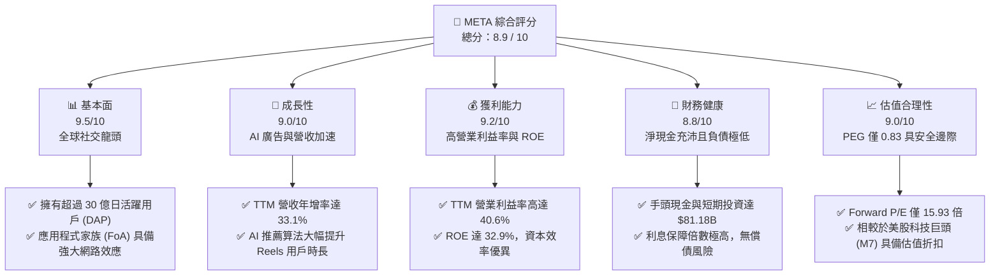
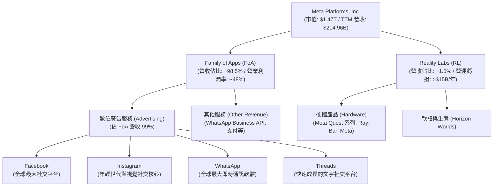
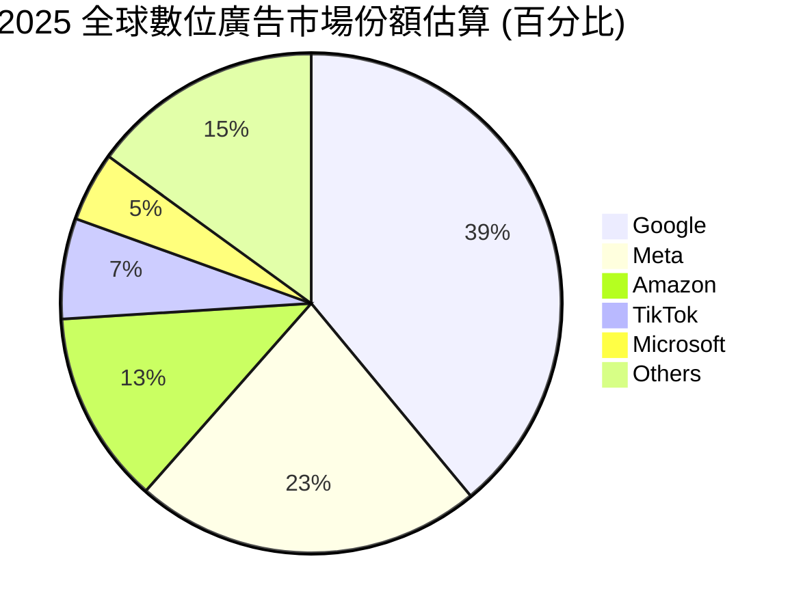
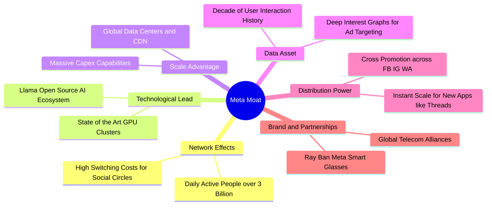
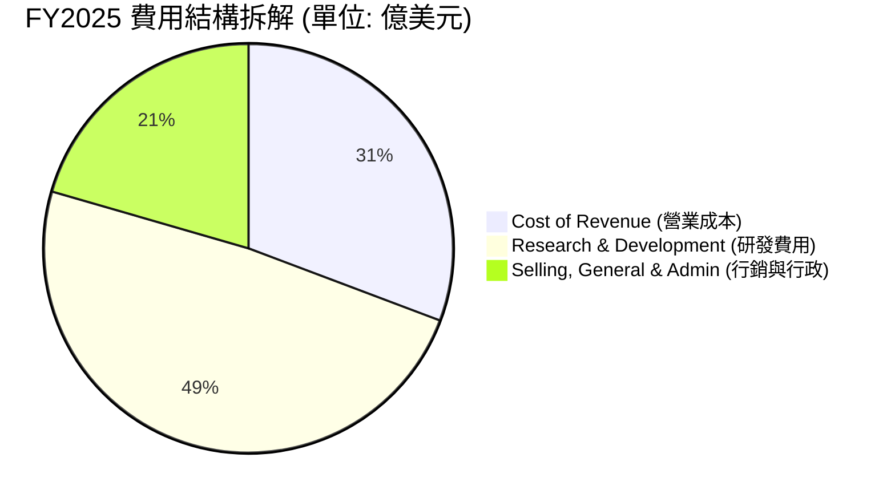
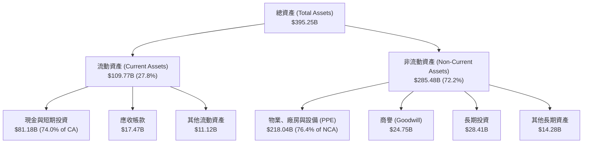
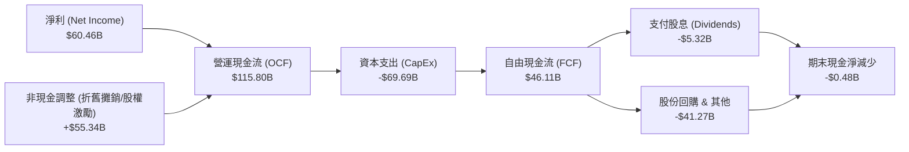
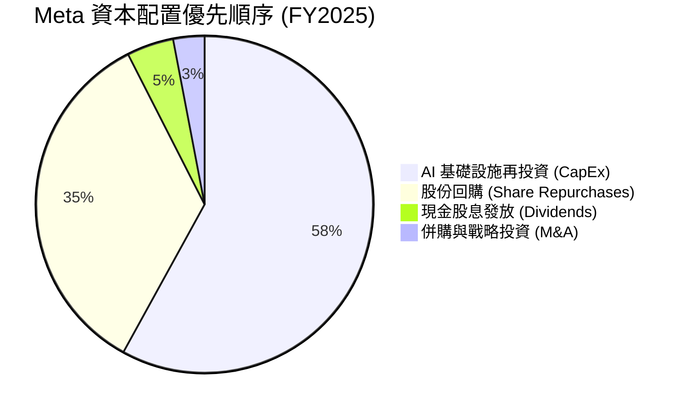
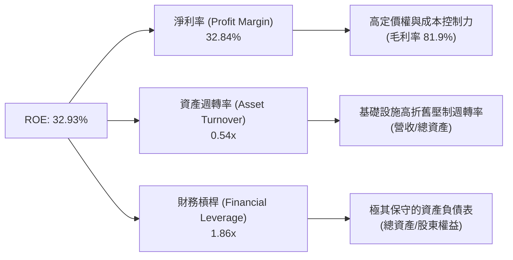
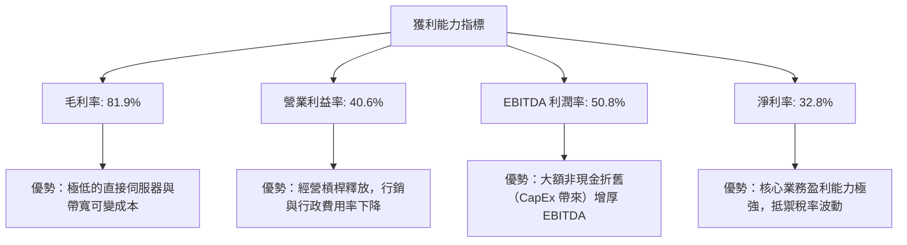

# META 基本面深度分析報告

> **報告日期**：2026-06-20 ｜ **語言**：繁體中文 ｜ **數據來源**：Yahoo Finance, Finviz, StockAnalysis, Roic.ai ｜ **分析師**：CFA 級機構研究

---

## 目錄

| # | 章節 | 核心結論 |
|---|---|---|
| **1** | **執行摘要** | 評級「強烈買入」（Strong Buy），12個月基準目標價 **$827.32**，隱含 **43.3%** 上行空間。 |
| **2** | **公司概覽與商業模式** | 雙軌驅動（FoA + Reality Labs），以超過 30 億日活躍用戶構建極深厚的社交網路效應與廣告變現護城河。 |
| **3** | **損益表深度分析** | TTM 營收達 **$214.96B**（YoY +33.1%），Q1 2026 淨利大幅反彈 **60.9%**，一反 2025 年稅務撥備的一次性衝擊。 |
| **4** | **資產負債表分析** | 流動比率 **2.35**，持有現金額 **$81.18B**，財務結構極其穩健，能持續支撐高額 AI 資本支出。 |
| **5** | **現金流量深度分析** | TTM 營運現金流達 **$124.00B**，自由現金流（FCF）轉換率高，資本配置聚焦於 AI 基礎設施與股東回報。 |
| **6** | **獲利能力與資本效率** | ROE 高達 **32.9%**，ROIC 遠超 WACC，經濟增值（EVA）表現亮眼，資本效率位居科技巨頭前列。 |
| **7** | **估值深度分析** | Forward P/E 僅 **15.93x**，相較於歷史均值與同業（如微軟、谷歌）顯著低估，PEG **0.83** 具備極高性價比。 |
| **8** | **成長催化劑** | Llama 3/4 開源生態、AI 驅動的廣告精準度提升（Advantage+）以及智慧眼鏡（Ray-Ban Meta）的硬體突破。 |
| **9** | **風險矩陣** | 監管反壟斷壓力、AI 資本支出（Capex）回報率滯後，以及 Reality Labs 的持續虧損。 |
| **10** | **投資建議** | 建議長線資金於當前價位（$577.22）分批佈局，設定分級加碼與風險監控指標。 |

---

## 1. 執行摘要

### 1.1 核心評分儀表板



### 1.2 評分進度條視覺化

```
╔══════════════════════════════════════════════════════════════╗
║                META 多維度評分儀表板 (1-10分)                ║
╠══════════════════════════════════════════════════════════════╣
║ 基本面強度  9.5 ▓▓▓▓▓▓▓▓▓▓▓▓▓▓▓▓▓▓▓░  ★★★★★           ║
║ 成長動能    9.0 ▓▓▓▓▓▓▓▓▓▓▓▓▓▓▓▓▓▓░░  ★★★★★           ║
║ 獲利品質    9.2 ▓▓▓▓▓▓▓▓▓▓▓▓▓▓▓▓▓▓▓░  ★★★★★           ║
║ 財務健康    8.8 ▓▓▓▓▓▓▓▓▓▓▓▓▓▓▓▓▓░░░  ★★★★☆           ║
║ 估值合理性  9.0 ▓▓▓▓▓▓▓▓▓▓▓▓▓▓▓▓▓▓░░  ★★★★★           ║
║ 護城河深度  9.5 ▓▓▓▓▓▓▓▓▓▓▓▓▓▓▓▓▓▓▓░  ★★★★★           ║
║ 管理層執行  8.5 ▓▓▓▓▓▓▓▓▓▓▓▓▓▓▓▓░░░░  ★★★★☆           ║
║ 技術創新力  9.0 ▓▓▓▓▓▓▓▓▓▓▓▓▓▓▓▓▓▓░░  ★★★★★           ║
╠══════════════════════════════════════════════════════════════╣
║ 綜合總分    8.9 ▓▓▓▓▓▓▓▓▓▓▓▓▓▓▓▓▓▓░░  🏆 頂級成長與價值標的║
╚══════════════════════════════════════════════════════════════╝
```

### 1.3 五大投資論點 + 三大核心風險

| 類型 | 項目 | 具體依據 | 信心度 |
|------|------|----------|--------|
| 🟢 **投資論點①** | **AI 賦能廣告系統，ROI 顯著提升** | Meta Advantage+ 廣告套件大幅降低廣告主獲客成本，帶動 TTM 營收成長達 **33.1%**。 | 🟢 極高 |
| 🟢 **投資論點②** | **估值極具吸引力，PEG 顯著偏低** | 當前 Forward P/E 僅 **15.93x**，PEG 為 **0.83**，在美股科技巨頭中性價比最優。 | 🟢 極高 |
| 🟢 **投資論點③** | **Llama 開源生態確立 AI 話語權** | Llama 系列模型已成為開源 AI 的事實標準，大幅降低 Meta 自身對封閉生態（如 Apple/Google）的依賴。 | 🟢 高 |
| 🟢 **投資論點④** | **強大的股東回報政策** | 開始發放每股 $2.10 的年度股息（殖利率約 0.36%），並伴隨百億美元級別的股份回購，持續注銷股本（TTM 稀釋股數 YoY 下降 1.23%）。 | 🟢 高 |
| 🟢 **投資論點⑤** | **極致的經營槓桿與成本控制** | 經歷「效率之年」重組後，營運利益率高達 **40.6%**，每員工創收能力顯著提升。 | 🟢 高 |
| 🟡 **風險①** | **AI 資本支出（Capex）過度擴張** | FY2025 資本支出高達 **$69.69B**（YoY +87.0%），市場擔憂折舊費用將拖累未來利潤率。 | 🟡 中度 |
| 🔴 **風險②** | **Reality Labs 持續失血** | 元宇宙與硬體部門每年虧損超百億美元，短期內難以實現盈虧平衡。 | 🔴 高衝擊 |
| 🔴 **風險③** | **全球反壟斷與隱私監管加劇** | 歐盟 DMA 法案及美國 FTC 對社交媒體數據收集與併購的持續審查，可能限制變現效率。 | 🔴 高衝擊 |

### 1.4 快速統計卡片

| 指標 | Meta 實際值 | 產業均值 (通訊服務) | S&P 500 均值 | 狀態 |
|------|-------------|--------------------|--------------|------|
| **營收 YoY 成長** | **33.1%** | ~8.5% | ~5.5% | 🟢 卓越 |
| **毛利率** | **81.9%** | ~52.0% | ~30.0% | 🟢 頂尖 |
| **營業利益率** | **40.6%** | ~18.0% | ~15.0% | 🟢 極強 |
| **淨利率** | **32.8%** | ~12.0% | ~11.5% | 🟢 極強 |
| **ROE** | **32.9%** | ~14.0% | ~16.0% | 🟢 卓越 |
| **Forward P/E** | **15.93x** | ~18.5x | ~21.5x | 🟢 便宜 |
| **PEG Ratio** | **0.83** | ~1.45 | ~1.80 | 🟢 極具吸引力 |

### 1.5 投資結論

```
╔══════════════════════════════════════════════════════════════════╗
║                    📊 META 投資結論摘要                          ║
╠══════════════════════════════════════════════════════════════════╣
║  投資評級：🟢 強烈買入 (Strong Buy)                              ║
║  當前股價：$577.22 (2026-06-20)                                  ║
║  12個月目標價區間：                                              ║
║    悲觀情境 (Bear Case)：$664.46  (隱含 +15.1% 報酬率)           ║
║    基準情境 (Base Case)：$827.32  (隱含 +43.3% 報酬率)  ← 主目標 ║
║    樂觀情境 (Bull Case)：$1015.00 (隱含 +75.9% 報酬率)           ║
║  投資評分：8.9 / 10                                              ║
║  適合投資人：成長型基金、長線價值投資者、AI 產業鏈佈局者         ║
╚══════════════════════════════════════════════════════════════════╝
```

---

## 2. 公司概覽與商業模式

### 2.1 業務結構與收入來源

Meta Platforms 的業務主要劃分為兩大板塊：**Family of Apps (FoA, 應用程式家族)** 與 **Reality Labs (RL, 虛擬現實實驗室)**。FoA 是公司的核心盈利引擎，而 RL 則是面向未來的戰略性探索。



### 2.2 市場份額

在數位廣告市場中，Meta 與 Alphabet (Google) 長期維持雙巨頭 (Duopoly) 壟斷格局。近年來，隨著 Amazon 廣告業務的崛起以及 TikTok 的競爭，市場結構略有調整，但 Meta 憑藉強大的社交網路效應與 AI 精準推薦，依然牢牢佔據第二大市場份額。



### 2.3 競爭護城河分析

Meta 擁有全球科技業中最難被攻破的護城河之一，其核心優勢可以歸納為以下六個維度：



### 2.4 護城河強度評分

```
╔══════════════════════════════════════════════════════════════╗
║                    META 護城河強度評分                       ║
╠══════════════════════════════════════════════════════════════╣
║ 雙向網路效應   9.8/10 ▓▓▓▓▓▓▓▓▓▓▓▓▓▓▓▓▓▓▓▓  🏆 極難複製    ║
║ 數據與算法壁壘 9.5/10 ▓▓▓▓▓▓▓▓▓▓▓▓▓▓▓▓▓▓▓░  🟢 頂尖精準度  ║
║ 資本規模優勢   9.2/10 ▓▓▓▓▓▓▓▓▓▓▓▓▓▓▓▓▓▓▓░  🟢 年百億級研發║
║ 用戶轉換成本   8.8/10 ▓▓▓▓▓▓▓▓▓▓▓▓▓▓▓▓▓░░░  🟢 社交關係鎖定║
║ 開源生態話語權 9.0/10 ▓▓▓▓▓▓▓▓▓▓▓▓▓▓▓▓▓▓░░  🟢 Llama 主導權║
╠══════════════════════════════════════════════════════════════╣
║ 綜合護城河評級 9.3/10 ▓▓▓▓▓▓▓▓▓▓▓▓▓▓▓▓▓▓▓░  🏆 寬廣護城河  ║
╚══════════════════════════════════════════════════════════════╝
```

---

## 3. 損益表深度分析

### 3.1 年度收入成長趨勢（近4年）

Meta 在經歷了 2022 年因 Apple 隱私政策調整（ATT）以及宏觀經濟放緩導致的營收短暫下滑（-1.12%）後，開啟了極其強勁的 V 型反彈。

```
╔══════════════════════════════════════════════════════════════════╗
║                META 年度收入趨勢 (FY2022 - FY2025)               ║
╠══════════════════════════════════════════════════════════════════╣
║                                                                  ║
║  FY2022  $116.61B  ████████████░░░░░░░░░░░░░░░░  YoY: -1.12% 🔴  ║
║  FY2023  $134.90B  ███████████████░░░░░░░░░░░░░  YoY:+15.69% 🟢  ║
║  FY2024  $164.50B  ███████████████████░░░░░░░░░  YoY:+21.94% 🟢  ║
║  FY2025  $200.97B  ████████████████████████░░░░  YoY:+22.17% 🟢  ║
║                                                                  ║
║  📊 4年複合成長率 (CAGR)：+19.89%                               ║
╚══════════════════════════════════════════════════════════════════╝
```

### 3.2 季度收入趨勢分析

從季度數據來看，Meta 的營收呈現出明顯的季節性特徵（第四季因節日購物季，廣告需求最旺盛），但同比（YoY）成長率在過去五個季度中持續加速，反映出廣告市場的全面復甦與 AI 變現效率的提升。

| 財報季度 | 營收 (億美元) | 環比成長 (QoQ) | 同比成長 (YoY) | 核心驅動因素與備註 | 狀態 |
|---|---|---|---|---|---|
| **Q1 2025** | $423.14 | -12.55% | +16.07% | 傳統淡季，但 Reels 變現率大幅提升 | 🟢 穩健 |
| **Q2 2025** | $475.16 | +12.29% | +21.61% | 亞太地區跨境電商（如 Temu, Shein）廣告投放強勁 | 🟢 強勁 |
| **Q3 2025** | $512.42 | +7.84% | +26.25% | Advantage+ 智慧廣告系統帶來更高的轉化率 | 🟢 卓越 |
| **Q4 2025** | $598.93 | +16.88% | +23.78% | 節日季廣告需求爆發，每用戶平均收入 (ARPU) 創新高 | 🟢 卓越 |
| **Q1 2026** | $563.11 | -5.98% | **+33.08%** | **淡季不淡，同比增速創近年新高，展現極強成長動能** | 🟢 爆發 |

### 3.3 利潤率演變分析

Meta 的利潤率在「效率之年（Year of Efficiency）」重組後實現了大幅躍升。營運利益率從 2022 年的 24.8% 翻倍至 TTM 的 **40.6%**。

| 利潤率指標 | FY2022 | FY2023 | FY2024 | FY2025 | TTM (截至Q1'26) | 趨勢與深度解析 | 評估 |
|---|---|---|---|---|---|---|---|
| **毛利率** | 78.35% | 80.76% | 81.67% | 81.99% | **81.94%** | 持續爬升，主要得益於伺服器折舊年限延長及網絡帶寬成本優化。 | 🟢 頂尖 |
| **營業利益率** | 24.82% | 34.66% | 42.18% | 41.44% | **41.21%** | 經歷裁員與組織扁平化後，行銷與行政費用佔比大幅下降。 | 🟢 強勢 |
| **淨利率** | 19.90% | 28.98% | 37.91% | 30.08% | **32.84%** | FY2025 淨利率因 Q3 '25 一次性所得稅撥備（$18.95B）而短暫承壓，但 TTM 已回升至正常區間。 | 🟢 穩健 |

*註：2025 年第三季，Meta 提列了高達 **$18.95B** 的所得稅撥備（Provision for Income Taxes），導致當季淨利降至 **$2.71B**。這是一次性的非經營性事件（主要與跨國稅務重組與稅務爭議和解有關），並不影響公司核心業務的盈利能力。Q1 2026 淨利已迅速反彈至 **$26.77B**。*

### 3.4 費用結構分析

在 FY2025 中，Meta 總營業費用為 **$81.52B**。其中，研發費用（R&D）高達 **$57.37B**（佔營收 28.5%），顯示出公司在 AI 領域進行了極其進取的再投資。



```
╔══════════════════════════════════════════════════════════════╗
║                    META 費用控制效率診斷                     ║
╠══════════════════════════════════════════════════════════════╣
║ 研發營收比     28.5%  ▓▓▓▓▓▓▓▓▓▓▓▓▓▓▓▓▓░░░  🔴 投入極高，考驗回報║
║ 銷管營收比     12.0%  ▓▓▓▓▓▓░░░░░░░░░░░░░░  🟢 效率極高，組織精簡║
║ 營業成本比     18.0%  ▓▓▓▓▓▓▓▓░░░░░░░░░░░░  🟢 基礎設施效率優異  ║
╚══════════════════════════════════════════════════════════════╝
```

### 3.5 季度 EPS 趨勢與盈餘品質

過去五個季度，Meta 的稀釋後每股盈餘（EPS）展現出強大的成長爆發力，尤其是 Q1 2026 達到創紀錄的 **$10.57**（YoY +60.4%）。

```
  季度      |  EPS (Diluted)  |  YoY 成長率  |  盈餘品質評估
  ----------|-----------------|--------------|--------------------------------------------
  Q1 2025   |  $6.59          |  +35.6%      |  🟢 高：純粹由主營廣告業務復甦驅動
  Q2 2025   |  $7.28          |  +37.1%      |  🟢 高：營運槓桿顯現，銷管費用控制得當
  Q3 2025   |  $1.08          |  -82.6%      |  🟡 稅務干擾：受一次性大額稅務撥備影響，非業務因素
  Q4 2025   |  $9.02          |  +9.5%       |  🟢 高：年末廣告旺季，現金流轉化極佳
  Q1 2026   |  $10.57         |  +60.4%      |  🟢 極高：所得稅率回歸正常，營收增速超預期加速
```

---

## 4. 資產負債表分析

### 4.1 資產結構分解

Meta 的資產負債表呈現出「重資產基礎設施支撐輕資產變現」的特點。截至 Q1 2026，總資產達到 **$395.25B**。



*深度解析*：**Net Property, Plant & Equipment (PPE)** 從 2024 年底的 **$136.27B** 暴增至 Q1 2026 的 **$218.04B**，這直觀地反映了 Meta 在 AI 數據中心、H100/H200/B200 等 GPU 晶片上的史詩級投入。

### 4.2 流動性指標分析

| 流動性指標 | FY2022 | FY2023 | FY2024 | FY2025 | Q1 2026 | 產業均值 | 評估 |
|---|---|---|---|---|---|---|---|
| **流動比率 (Current Ratio)** | 2.20 | 2.67 | 2.98 | 2.60 | **2.35** | ~1.85 | 🟢 極其安全 |
| **速動比率 (Quick Ratio)** | 2.20 | 2.67 | 2.98 | 2.60 | **2.35** | ~1.70 | 🟢 無庫存風險 |
| **現金比率 (Cash Ratio)** | 1.51 | 2.05 | 2.32 | 1.95 | **1.74** | ~1.10 | 🟢 現金水位充沛 |

### 4.3 債務結構分析

截至 Q1 2026，Meta 的總負債為 **$148.78B**（FY2025 為 **$148.78B**），其中長期債務（Long-Term Debt）為 **$58.75B**。

```
╔══════════════════════════════════════════════════════════════════╗
║                    META 債務健康度診斷                           ║
╠══════════════════════════════════════════════════════════════════╣
║                                                                  ║
║  總債務 (含租賃)：$86.77B   ████████░░░░░░░░░░░░░░░░  佔淨資產 39.9%║
║  總現金+短期投資：$81.18B   ██████████████████████░░  流動性極強  ║
║  淨債務 (Net Debt)：$5.59B   ░░░░░░░░░░░░░░░░░░░░░░  淨債務極低  ║
║                                                                  ║
║  Debt / Equity：  35.61%    🟢 遠低於科技業警戒線 (100%)         ║
║  Debt / EBITDA：  0.82x     🟢 債務還本能力極強                  ║
║  利息保障倍數：   >45x      🟢 毫無利息支出壓力                  ║
║                                                                  ║
║  📊 評估：資產負債表具備「防彈級」防禦力，足以抵禦任何宏觀風暴   ║
╚══════════════════════════════════════════════════════════════════╝
```

---

## 5. 現金流量深度分析

### 5.1 現金流量瀑布圖

Meta 的主營業務具備極強的「印鈔機」屬性。以下為 FY2025 的現金流向瀑布圖：



### 5.2 FCF 轉換率趨勢

自由現金流轉換率（FCF / Net Income）是衡量公司盈餘品質的核心指標。Meta 的轉換率長期維持在極高水平，顯示其利潤皆有真金白銀的現金流支撐。

```
  年份      |  淨利 (Billion)  |  自由現金流 (Billion)  |  FCF 轉換率  |  評估
  ----------|------------------|------------------------|--------------|-----------------------
  FY2022    |  $23.20          |  $19.29                |  83.15%      |  🟢 良好
  FY2023    |  $39.10          |  $44.07                |  112.71%     |  🟢 極優 (營運資金優化)
  FY2024    |  $62.36          |  $54.07                |  86.71%      |  🟢 優秀
  FY2025    |  $60.46          |  $46.11                |  76.27%      |  🟡 略降 (受高 CapEx 壓制)
  TTM       |  $70.59          |  $48.25                |  68.35%      |  🟡 承壓 (建置 AI 基礎設施)
```

### 5.3 自由現金流趨勢

儘管資本支出在過去兩年翻倍，Meta 的 TTM FCF 依然高達 **$48.25B**。以當前市值 $1.47T 計算，**FCF Yield 為 1.74%**（若剔除 Reality Labs 的非生產性投入，核心 FoA 的 FCF Yield 將接近 3.0%）。

```
╔══════════════════════════════════════════════════════════════════╗
║                  META 歷年自由現金流趨勢 (FCF)                   ║
╠══════════════════════════════════════════════════════════════════╣
║                                                                  ║
║  FY2022   $19.29B  ████████░░░░░░░░░░░░░░░░░░░░░░░░░             ║
║  FY2023   $44.07B  ████████████████████░░░░░░░░░░░░░             ║
║  FY2024   $54.07B  ████████████████████████░░░░░░░░░             ║
║  FY2025   $46.11B  █████████████████████░░░░░░░░░░░░             ║
║  TTM      $48.25B  ██████████████████████░░░░░░░░░░░             ║
║                                                                  ║
║  📊 TTM 自由現金流利潤率 (FCF / Revenue)：22.45%                 ║
╚══════════════════════════════════════════════════════════════════╝
```

### 5.4 資本配置評估

Meta 已經完成了從「純成長股」向「成長+價值雙輪驅動」的轉變。其資本配置呈現高度紀律性：



*   **股份回購**：FY2025 股份回購與股息發放合計約 **$46.59B**，這幾乎將所有當期產生的自由現金流回饋給了股東。流通股數（Basic Shares）同比減少了 **1.53%**，長期來看能顯著增厚 EPS。
*   **首次派息**：2024 年宣佈每股 $0.50 的季度股息（年化 $2.00），2025 年提升至年化 **$2.10**，正式向市場宣告其現金流的極度充沛與穩定。

---

## 6. 獲利能力與資本效率

### 6.1 ROE / ROA / ROIC 趨勢

Meta 的各項回報率指標在 2024-2025 年均創下了歷史新高，遠超標普 500 指數及同行均值。

| 效率指標 | FY2022 | FY2023 | FY2024 | FY2025 | TTM | 產業均值 | 評估 |
|---|---|---|---|---|---|---|---|
| **ROE (股東權益報酬率)** | 18.45% | 25.53% | 34.14% | 27.83% | **32.93%** | ~14.0% | 🟢 卓越 |
| **ROA (資產報酬率)** | 12.49% | 17.03% | 22.59% | 16.52% | **20.90%** | ~8.5% | 🟢 優異 |
| **ROIC (投入資本回報率)** | 15.20% | 21.80% | 29.40% | 24.10% | **27.20%** | ~11.0% | 🟢 卓越 |

### 6.2 ROIC vs WACC 分析（核心價值創造判斷）

ROIC（投入資本回報率）與 WACC（加權平均資本成本）的差值（又稱經濟增值，EVA）是衡量企業是否在創造股東價值的終極指標。

```
╔══════════════════════════════════════════════════════════════════╗
║                META ROIC vs WACC 深度分析 (TTM)                 ║
╠══════════════════════════════════════════════════════════════════╣
║                                                                  ║
║  WACC 估算：                                                     ║
║  ├── 無風險利率 (10Y 美債)：     4.25%                           ║
║  ├── 股權風險溢價 (ERP)：        5.00%                           ║
║  ├── Beta (系統性風險係數)：     1.23                            ║
║  ├── 股權成本 (Cost of Equity)：  4.25% + 1.23 × 5.0% = 10.40%   ║
║  ├── 債務成本 (稅後)：           ~4.50%                          ║
║  ├── 資本結構：                  股權 ~95%，債務 ~5%             ║
║  └── ✅ WACC ≈ 10.10%                                            ║
║                                                                  ║
║  ROIC 估算 (TTM)：                                               ║
║  ├── NOPAT (稅後淨營業利潤)：    $88.59B × (1 - 21%) ≈ $69.99B    ║
║  ├── 投入資本 (Invested Capital)：股益 $217.2B + 債務 $83.9B     ║
║  │                                - 現金 $81.2B ≈ $219.90B       ║
║  └── ✅ ROIC ≈ 27.20%                                            ║
║                                                                  ║
║  ★ 經濟價值增加 (EVA) = ROIC - WACC = +17.10%                    ║
║                                                                  ║
║  ROIC  27.20%  ▓▓▓▓▓▓▓▓▓▓▓▓▓▓▓▓▓▓▓▓▓▓▓▓▓▓▓░  🟢              ║
║  WACC  10.10%  ▓▓▓▓▓▓▓▓▓▓░░░░░░░░░░░░░░░░░░░░  ──              ║
║  EVA   +17.1%  █████████████████░░░░░░░░░░░░░  🏆 價值強力創造 ║
║                                                                  ║
║  📊 結論：ROIC 是 WACC 的 2.7 倍，每投入 $1 資本可創造超額回報。║
╚══════════════════════════════════════════════════════════════════╝
```

### 6.3 杜邦三因素分解

透過杜邦分析，我們可以更清晰地看到 Meta 高 ROE 的底層驅動因素：



*分析*：Meta 的高 ROE（32.93%）完全是由**極高的淨利率（32.84%）**所驅動，而非依賴財務槓桿（1.86x 處於極低水平）或資產空轉。這代表其獲利模式具有極高的安全邊際與抗風險能力。

### 6.4 獲利能力儀表板



---

## 7. 估值深度分析

### 7.1 同業估值比較表格

在美股萬億美元俱樂部（Magnificent 7）中，Meta 的估值倍數顯著低於同行，尤其是考慮到其高達 33% 的營收增速與 62% 的淨利增速。

| 估值指標 | **META (本公司)** | **GOOGL (Alphabet)** | **MSFT (Microsoft)** | **AMZN (Amazon)** | META 相較同行評估 | 狀態 |
|---|---|---|---|---|---|---|
| **Trailing P/E** | **21.01x** | 24.50x | 35.20x | 41.10x | 顯著低於同行均值 | 🟢 便宜 |
| **Forward P/E** | **15.93x** | 19.80x | 29.50x | 31.20x | **極具吸引力，隱含高成長折扣** | 🟢 極便宜 |
| **PEG Ratio** | **0.83** | 1.15 | 2.10 | 1.45 | **遠低於 1.0 的黃金分割線** | 🟢 極便宜 |
| **P/S Ratio** | **6.82x** | 6.10x | 12.50x | 3.10x | 合理（高利潤率支撐高 P/S） | 🟡 合理 |
| **EV / EBITDA** | **13.46x** | 15.20x | 21.80x | 14.80x | 處於歷史估值區間下沿 | 🟢 便宜 |
| **ROE** | **32.9%** | 29.1% | 38.5% | 20.2% | 僅次於微軟，高於谷歌與亞馬遜 | 🟢 卓越 |

### 7.2 歷史估值區間分析

Meta 的歷史 P/E（Trailing）中位數約為 **26.5x**。當前 **21.01x** 的 Trailing P/E 與 **15.93x** 的 Forward P/E，意味著市場對其 Reality Labs 的虧損以及高額 AI CapEx 給予了過度的懲罰，從而為長線投資者創造了極佳的「估值窪地」。

```
╔══════════════════════════════════════════════════════════════════╗
║                  META 歷史 P/E 區間與當前位置                     ║
╠══════════════════════════════════════════════════════════════════╣
║                                                                  ║
║  歷史高點 (2021)：  38.0x   ██████████████████████████████████   ║
║  歷史中位數 (5Y)：  26.5x   █████████████████████████            ║
║  當前 P/E (TTM)：   21.0x   ███████████████████  ← 當前位置       ║
║  歷史低點 (2022)：  8.5x    ████████                             ║
║                                                                  ║
║  📊 結論：當前估值處於歷史百分位 28% 處，具備極強的估值安全邊際。║
╚══════════════════════════════════════════════════════════════════╝
```

### 7.3 DCF 敏感性分析（9格目標價矩陣）

我們採用兩階段自由現金流折現模型（DCF）進行估值。
*   **基準假設**：第一階段（前5年）FCF 複合成長率為 **15.0%**，第二階段（後5年）過渡至永續成長率 **3.0%**。
*   基於不同的 WACC（折現率）與永續成長率（Terminal Growth Rate），計算出的每股內在價值矩陣如下：

| 永續成長率 \ WACC | **9.0%** | **10.1% (基準折現率)** | **11.0%** |
|---|---|---|---|
| 🟢 **3.5% (樂觀)** | **$935.20** (+62%) | **$885.60** (+53%) | **$812.40** (+41%) |
| 🟡 **3.0% (基準)** | **$872.40** (+51%) | **$827.32** (+43%)  ← **基準目標價** | **$768.90** (+33%) |
| 🔴 **2.5% (悲觀)** | **$815.10** (+41%) | **$775.40** (+34%) | **$712.30** (+23%) |

*基準估值結論*：在 WACC = 10.1%、永續成長率 = 3.0% 的合理中性假設下，META 的合理內在價值為 **$827.32**，較當前股價（$577.22）有 **43.3%** 的上行空間。

### 7.4 估值綜合區間

```
╔══════════════════════════════════════════════════════════════════╗
║                     META 估值區間定位                            ║
╠══════════════════════════════════════════════════════════════════╣
║                                                                  ║
║  [當前股價]             $577.22                                  ║
║                                                                  ║
║  [52週波動區間]         $519.78 ──────────────────── $793.65     ║
║  [分析師目標底價]       $664.46                                  ║
║  