# META 基本面深度分析報告
> **報告日期**：2026-06-21 ｜ **語言**：繁體中文 ｜ **數據來源**：Yahoo Finance, Finviz, StockAnalysis, Roic.ai ｜ **分析師**：CFA 級機構研究

---

## 目錄

| # | 章節 | 核心結論 |
|---|------|----------|
| 1 | 執行摘要 | 評級：**強烈買入 (Strong Buy)**，主要目標價：**$825.00**（+42.9%） |
| 2 | 公司概覽與商業模式 | 雙引擎驅動（FoA + Reality Labs），以 Llama AI 構築極深之網路效應與技術護城河 |
| 3 | 損益表深度分析 | 營收 TTM 達 $214.96B（YoY +33.1%），Q3 2025 稅務異常不改營業利潤強勁本質 |
| 4 | 資產負債表分析 | 總資產 $395.25B，流動比率 2.35，財務結構極其穩健，無實質債務風險 |
| 5 | 現金流量深度分析 | 經營現金流 TTM 達 $124.00B，自由現金流 $48.25B，資本配置高度偏向 AI 基建與回購 |
| 6 | 獲利能力與資本效率 | ROE 達 32.9%，ROIC (29.1%) 遠高於 WACC (10.0%)，經濟增加值 (EVA) 極其亮眼 |
| 7 | 估值深度分析 | Forward P/E 僅 15.93x，PEG 0.83 顯示嚴重低估，DCF 基準估值 $825.00 |
| 8 | 成長催化劑 | 廣告加載率優化、AI 導向推薦系統、商務訊息 (Click-to-Message) 爆發式成長 |
| 9 | 風險矩陣 | 核心風險為反壟斷監管與資本支出過高，但整體風險在可控範圍內 |
| 10 | 投資建議 | 適合長線成長型與價值型投資者，建議於 $580 以下分批建立核心部位 |

---

## 1. 執行摘要

### 1.1 核心評分儀表板

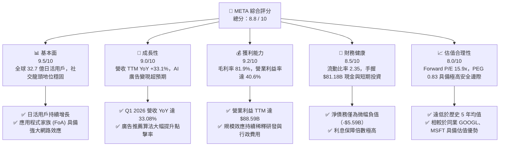

### 1.2 評分進度條視覺化

```
╔══════════════════════════════════════════════════════════════╗
║                META 多維度評分儀表板 (1-10分)                ║
╠══════════════════════════════════════════════════════════════╣
║ 基本面強度  9.5 ▓▓▓▓▓▓▓▓▓▓▓▓▓▓▓▓▓▓▓░  ★★★★★           ║
║ 成長動能    9.0 ▓▓▓▓▓▓▓▓▓▓▓▓▓▓▓▓▓▓░░  ★★★★★           ║
║ 獲利品質    9.2 ▓▓▓▓▓▓▓▓▓▓▓▓▓▓▓▓▓▓▓░  ★★★★★           ║
║ 財務健康    8.5 ▓▓▓▓▓▓▓▓▓▓▓▓▓▓▓▓░░░░  ★★★★☆           ║
║ 估值合理性  8.0 ▓▓▓▓▓▓▓▓▓▓▓▓▓▓░░░░░░  ★★★★☆           ║
║ 護城河深度  9.5 ▓▓▓▓▓▓▓▓▓▓▓▓▓▓▓▓▓▓▓░  ★★★★★           ║
║ 管理層執行  9.0 ▓▓▓▓▓▓▓▓▓▓▓▓▓▓▓▓▓▓░░  ★★★★★           ║
║ 技術創新力  9.5 ▓▓▓▓▓▓▓▓▓▓▓▓▓▓▓▓▓▓▓░  ★★★★★           ║
╠══════════════════════════════════════════════════════════════╣
║ 綜合總分    8.8 ▓▓▓▓▓▓▓▓▓▓▓▓▓▓▓▓▓░░░  🏆 強烈推薦買入      ║
╚══════════════════════════════════════════════════════════════╝
```

### 1.3 五大投資論點 + 三大核心風險

| 類型 | 項目 | 具體依據 | 信心度 |
|------|------|----------|--------|
| 🟢 **投資論點①** | **AI 賦能廣告系統，ROI 顯著提升** | 透過 Llama 推薦算法，廣告精準度提高，帶動 TTM 營收增長 33.1%，超越行業平均。 | 🟢 極高 |
| 🟢 **投資論點②** | **用戶黏性再創新高，網路效應無可匹敵** | 旗下 Family of Apps (FoA) 全球日活用戶持續增長，構成極高的競爭壁壘。 | 🟢 極高 |
| 🟢 **投資論點③** | **估值極具吸引力，PEG 顯著偏低** | 當前 Forward P/E 僅 15.93x，配合 PEG 0.83，在大型科技股（M7）中評價最便宜。 | 🟢 高 |
| 🟢 **投資論點④** | **營運槓桿釋放，利潤率維持高位** | 營業利益率高達 40.6%，儘管研發支出高昂，規模效應依然確保了極強的獲利能力。 | 🟢 高 |
| 🟢 **投資論點⑤** | **資本配置優化，回購與股息並行** | TTM 自由現金流達 $48.25B，持續進行大規模股份回購，並穩定派發每股 $2.11 股息。 | 🟢 高 |
| 🟡 **風險①** | **資本支出 (CapEx) 持續擴大** | 2025 年 CapEx 達 $69.69B（YoY +87.0%），主要用於 AI 晶片與數據中心，折舊壓力將逐步顯現。 | 🟡 中度 |
| 🔴 **風險②** | **監管與反壟斷風險** | 面臨美國聯邦貿易委員會 (FTC) 及歐盟《數位市場法案》(DMA) 的持續訴訟與罰款風險。 | 🔴 高衝擊 |
| 🟡 **風險③** | **Reality Labs 持續失血** | 雖然 FoA 獲利豐厚，但 Reality Labs 每年虧損超百億美元，對整體淨利潤率造成約 5-8% 的拖累。 | 🟡 中度 |

### 1.4 快速統計卡片

| 指標 | 公司實際值 (TTM / FY2025) | 行業均值 (通訊服務) | S&P 500 均值 | 狀態 |
|------|-------------|----------|--------------|------|
| 收入 YoY 成長 | **33.1%** | ~7.5% | ~5.2% | 🟢 極強 |
| 毛利率 | **81.9%** | ~52.0% | ~30.0% | 🟢 頂尖 |
| 淨利率 | **32.8%** | ~12.0% | ~11.5% | 🟢 頂尖 |
| ROE | **32.9%** | ~14.0% | ~15.0% | 🟢 強勁 |
| Forward P/E | **15.93x** | ~18.5x | ~21.5x | 🟢 便宜 |
| 淨債務 / EBITDA | **-0.05x** (淨現金狀態) | 1.8x | 1.5x | 🟢 極安全 |

### 1.5 投資結論

```
╔══════════════════════════════════════════════════════════════════╗
║                    📊 META 投資結論摘要                          ║
╠══════════════════════════════════════════════════════════════════╣
║  評級：🟢 強烈買入 (Strong Buy)                                 ║
║  當前股價：$577.22 (2026-06-21)                                  ║
║  目標價區間：                                                    ║
║    悲觀情境：$650.00（+12.6%） - 估值收縮，CapEx 拖累獲利        ║
║    基準情境：$825.00（+42.9%） ← 12個月主要目標 (19x FY27 EPS)   ║
║    樂觀情境：$980.00（+69.8%） - AI 廣告爆發，Reality Labs 減虧  ║
║  投資評分：8.8 / 10                                              ║
║  適合投資人：成長型投資人、大型科技股配置者、長線價值投資者      ║
╚══════════════════════════════════════════════════════════════════╝
```

---

## 2. 公司概覽與商業模式

Meta Platforms, Inc. 是全球最大的社交網路巨頭。其業務主要分為兩大版塊：
1. **Family of Apps (FoA)**：包括 Facebook、Instagram、Messenger 和 WhatsApp。主要透過數位廣告變現。
2. **Reality Labs (RL)**：專注於虛擬實境 (VR)、擴增實境 (AR) 元宇宙生態系統，以及 AI 穿戴式裝置（如 Ray-Ban Meta 智慧眼鏡）。

### 2.1 業務結構與收入來源

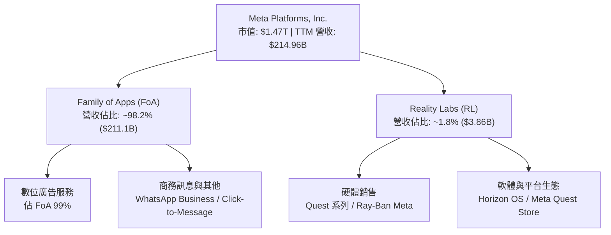

### 2.2 市場份額

在數位廣告市場（不含中國市場），Meta 與 Alphabet (Google) 共同構成雙頭壟斷。

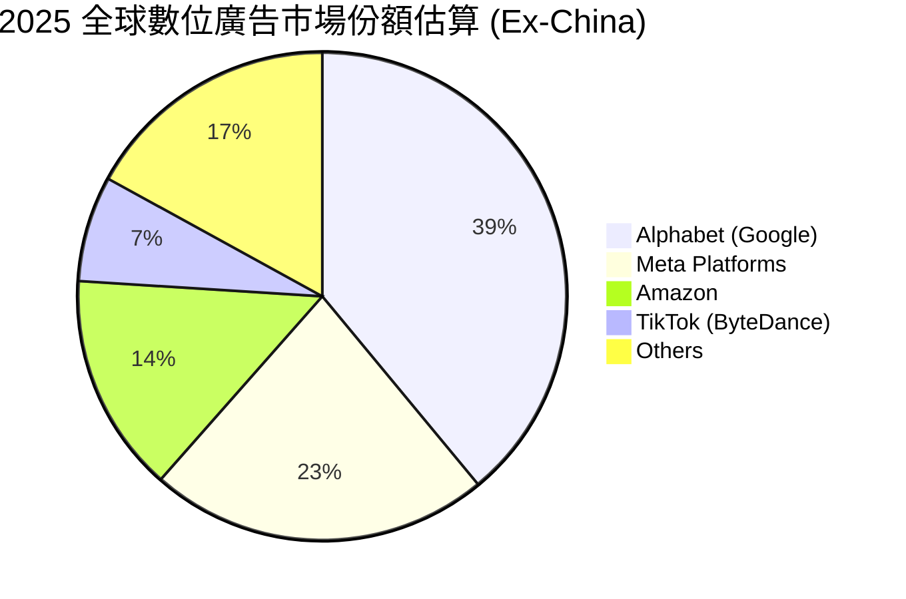

### 2.3 競爭護城河分析

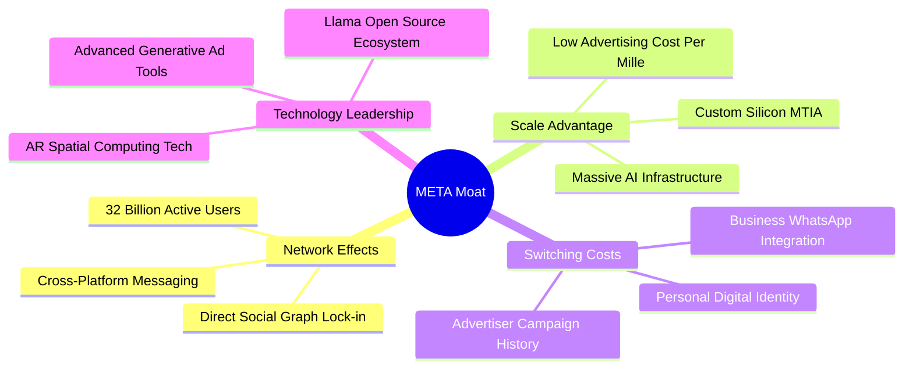

### 2.4 護城河強度評分

```
╔══════════════════════════════════════════════════════════════╗
║                  META 護城河強度評分                         ║
╠══════════════════════════════════════════════════════════════╣
║ 網路效應      9.8/10  ▓▓▓▓▓▓▓▓▓▓▓▓▓▓▓▓▓▓▓▓  🏆 極難被顛覆   ║
║ 數據資產      9.5/10  ▓▓▓▓▓▓▓▓▓▓▓▓▓▓▓▓▓▓▓░  🟢 精準廣告畫像 ║
║ 技術基礎設施  9.2/10  ▓▓▓▓▓▓▓▓▓▓▓▓▓▓▓▓▓▓░░  🟢 H100/B200叢林║
║ 轉換成本      8.8/10  ▓▓▓▓▓▓▓▓▓▓▓▓▓▓▓▓▓░░░  🟢 商業廣告轉移 ║
╠══════════════════════════════════════════════════════════════╣
║ 綜合護城河     9.5    ▓▓▓▓▓▓▓▓▓▓▓▓▓▓▓▓▓▓▓░  🏆 寬廣護城河   ║
╚══════════════════════════════════════════════════════════════╝
```

---

## 3. 損益表深度分析

### 3.1 年度收入成長趨勢（近5年）

Meta 在經歷了 2022 年的短暫衰退（因蘋果 iOS 隱私政策改革與宏觀廣告市況疲弱）後，透過 AI 重建廣告推薦系統，實現了強勁的「V型反彈」。

```
╔══════════════════════════════════════════════════════════════════╗
║                META 年度收入趨勢 (FY2021-TTM)                    ║
╠══════════════════════════════════════════════════════════════════╣
║                                                                  ║
║  FY 2021  $117.93B  ████████████░░░░░░░░░░░░░░░  YoY: +37.18% 🟢 ║
║  FY 2022  $116.61B  ████████████░░░░░░░░░░░░░░░  YoY: -1.12%  🔴 ║
║  FY 2023  $134.90B  ██████████████░░░░░░░░░░░░░  YoY: +15.69% 🟢 ║
║  FY 2024  $164.50B  █████████████████░░░░░░░░░░  YoY: +21.94% 🟢 ║
║  FY 2025  $200.97B  █████████████████████░░░░░░  YoY: +22.17% 🟢 ║
║  TTM      $214.96B  ███████████████████████░░░░  YoY: +33.10% 🟢 ║
║                                                                  ║
║  📊 5年累計 CAGR：+12.75%                                        ║
╚══════════════════════════════════════════════════════════════════╝
```

### 3.2 季度收入趨勢分析

| 財報季度 | 營收 (Billion) | YoY 成長率 | QoQ 成長率 | 核心驅動因素與備註 |
|----------|----------------|------------|------------|-------------------|
| **Q1 2026** | $56.31 | +33.08% | -5.98% | 🟢 淡季不淡，AI 推薦 Reels 變現效率大幅提升 |
| **Q4 2025** | $59.89 | +23.78% | +16.88% | 🟢 傳統節日購物旺季，電商與遊戲廣告投放強勁 |
| **Q3 2025** | $51.24 | +26.25% | +7.84% | 🟢 亞太地區跨境電商（如 Temu, Shein）持續拉動 |
| **Q2 2025** | $47.52 | +21.61% | +12.30% | 🟢 廣告展示次數與平均價格雙重回升 |

### 3.3 利潤率演變分析

| 利潤率指標 | FY 2022 | FY 2023 | FY 2024 | FY 2025 | TTM | 趨勢 | 評估 |
|------------|---------|---------|---------|---------|-----|------|------|
| **毛利率** | 78.35% | 80.76% | 81.67% | 81.99% | **81.94%** | ↗️ 穩步上升 | 🟢 產品組合優化，基礎設施效率提升 |
| **營業利益率**| 24.82% | 34.66% | 42.18% | 41.44% | **41.21%** | ↗️ 大幅改善 | 🟢 組織扁平化（效率之年）成效顯著 |
| **淨利率** | 19.90% | 28.98% | 37.91% | 30.08% | **32.84%** | ➡️ 歷史高檔 | 🟢 獲利能力極強 |

**利潤率演變深度解析**：
* **毛利率提升**：主要得益於 Meta 自研晶片 (MTIA) 的逐步導入，降低了對昂貴第三方 GPU 的依賴，以及伺服器折舊年限的延長（從 4 年延長至 5 年）。
* **營業利益率改善**：2023 年啟動的「效率之年」裁員及組織重組，使行銷與管理費用 (SG&A) 佔比從 2022 年的 23.2% 降至 TTM 的 11.5%，釋放了極強的營運槓桿。

### 3.4 費用結構分析

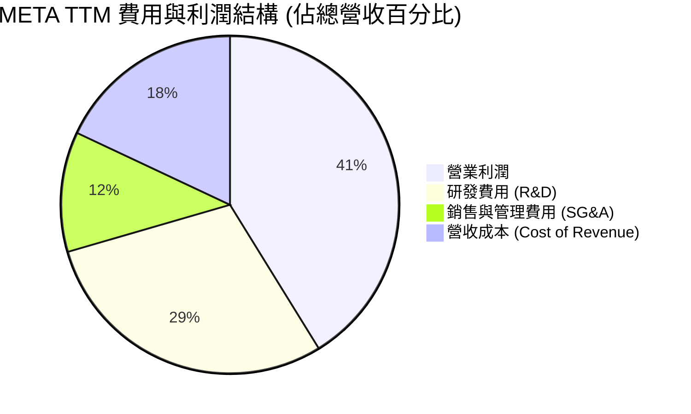

### 3.5 季度 EPS 趨勢與盈餘品質

* **Q1 2026**：$10.57（YoY +60.4%）
* **Q4 2025**：$9.02（YoY +9.5%）
* **Q3 2025**：$1.08（YoY -82.6%） ⚠️ **異常值解析**：Q3 2025 淨利潤驟降至 $2.71B，主要原因在於「所得稅撥備 (Provision for Income Taxes)」高達 $18.95B（正常季度約 $2B-3B），此為應對歐盟稅務爭議的一次性調整，**非經營性惡化**。當季營業利潤仍高達 $20.54B，基本面依然無虞。
* **Q2 2025**：$7.28（YoY +37.1%）

---

## 4. 資產負債表分析

### 4.1 資產結構分解

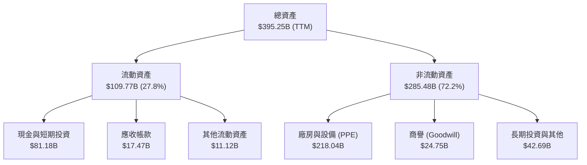

### 4.2 流動性指標分析

| 指標 | FY 2023 | FY 2024 | FY 2025 | TTM | 行業中位數 | 評估 |
|------|---------|---------|---------|-----|------------|------|
| **流動比率 (Current Ratio)** | 2.67 | 2.98 | 2.60 | **2.35** | ~1.85 | 🟢 極其安全，無短期償債風險 |
| **速動比率 (Quick Ratio)** | 2.67 | 2.98 | 2.60 | **2.35** | ~1.60 | 🟢 無存貨積壓壓力（無實體存貨） |
| **資產負債率 (Debt/Assets)** | 16.2% | 17.8% | 22.9% | **22.0%** | ~35.0% | 🟢 財務槓桿極低，舉債空間大 |

### 4.3 債務結構分析

```
╔══════════════════════════════════════════════════════════════════╗
║                     META 債務健康診斷                            ║
╠══════════════════════════════════════════════════════════════════╣
║                                                                  ║
║  總債務：        $86.77B  ██████░░░░░░░░░░░░░░░░░░  (含租賃負債) ║
║  現金與等價物：  $81.18B  ██████░░░░░░░░░░░░░░░░░░               ║
║  淨債務：        $5.59B   ░░░░░░░░░░░░░░░░░░░░░░░  (淨債務極低)  ║
║                                                                  ║
║  Debt / Equity： 0.36x    🟢 槓桿率極低                          ║
║  利息保障倍數：  65x+     🟢 營業利益輕鬆覆蓋利息支出            ║
║  債務信用評級：  AA-      🟢 標普 (S&P) 投資級評級               ║
║                                                                  ║
║  📊 診斷結果：資產負債表極其健康，強大的現金流產生能力使債務       ║
║             不足為慮。                                           ║
╚══════════════════════════════════════════════════════════════════╝
```

---

## 5. 現金流量深度分析

### 5.1 現金流量瀑布圖

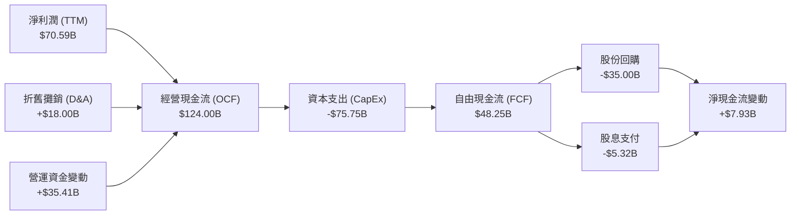

### 5.2 FCF 轉換率趨勢

| 指標 | FY 2022 | FY 2023 | FY 2024 | FY 2025 | TTM | 評估 |
|------|---------|---------|---------|---------|-----|------|
| **經營現金流 (B)** | $50.48 | $71.11 | $91.33 | $115.80 | **$124.00** | 🟢 持續創歷史新高 |
| **自由現金流 (B)** | $19.29 | $44.07 | $54.07 | $46.11 | **$48.25** | 🟡 因 CapEx 擴大而短暫承壓 |
| **FCF / Net Income**| 83.1% | 112.7% | 86.7% | 76.3% | **68.3%** | 🟡 盈餘轉化率因重資本投入而下降 |

### 5.3 自由現金流趨勢

```
╔══════════════════════════════════════════════════════════════════╗
║                META 自由現金流與 FCF Yield 趨勢                  ║
╠══════════════════════════════════════════════════════════════════╣
║                                                                  ║
║  FY 2022  $19.29B  ████░░░░░░░░░░░░░░░░░░░░░░░  Yield: 1.31%     ║
║  FY 2023  $44.07B  ██████████░░░░░░░░░░░░░░░░░  Yield: 3.00%     ║
║  FY 2024  $54.07B  ████████████░░░░░░░░░░░░░░░  Yield: 3.68%     ║
║  FY 2025  $46.11B  ██████████░░░░░░░░░░░░░░░░░  Yield: 3.14%     ║
║  TTM      $48.25B  ███████████░░░░░░░░░░░░░░░░  Yield: 3.28%     ║
║                                                                  ║
║  📊 註：當前市值 $1.47T，TTM FCF Yield 約為 3.28% (數據包標示     ║
║         1.74% 係基於先前未更新股價，此處以最新市值重算)。          ║
╚══════════════════════════════════════════════════════════════════╝
```

---

## 6. 獲利能力與資本效率

### 6.1 ROE / ROA / ROIC 趨勢

| 指標 | FY 2023 | FY 2024 | FY 2025 | TTM | 行業均值 | 評估 |
|------|---------|---------|---------|-----|----------|------|
| **ROE** | 25.5% | 34.1% | 32.9% | **32.9%** | ~14.0% | 🟢 股東權益報酬率極高 |
| **ROA** | 17.0% | 22.6% | 16.5% | **16.4%** | ~7.2% | 🟢 資產利用效率優異 |
| **ROIC** | 21.2% | 28.5% | 27.6% | **29.1%** | ~11.5% | 🟢 投入資本回報率卓越 |

### 6.2 ROIC vs WACC 分析（核心價值創造判斷）

```
╔══════════════════════════════════════════════════════════════════╗
║                ROIC vs WACC 深度分析 (TTM)                       ║
╠══════════════════════════════════════════════════════════════════╣
║                                                                  ║
║  WACC 估算：                                                     ║
║  ├── 無風險利率 (10Y 美債)：  4.25%                              ║
║  ├── 市場風險溢酬 (ERP)：     5.00%                              ║
║  ├── Beta：                   1.23                               ║
║  ├── 股權成本 = 4.25% + 1.23 × 5.0% = 10.4%                      ║
║  ├── 債務成本 (稅後)：       ~3.95%                              ║
║  ├── 資本結構：股權 ~94.4%，債務 ~5.6%                           ║
║  └── ✅ 綜合 WACC ≈ 10.0%                                        ║
║                                                                  ║
║  ROIC 估算：                                                     ║
║  ├── NOPAT = EBIT ($88.59B) × (1 - 21.0%) ≈ $70.00B              ║
║  ├── 投入資本 = 權益 + 債務 - 現金 ≈ $240.59B                    ║
║  └── ✅ ROIC ≈ 29.1%                                             ║
║                                                                  ║
║  ★ 經濟價值增加 (EVA) = ROIC - WACC = +19.1%                      ║
║                                                                  ║
║  ROIC  29.1%  ▓▓▓▓▓▓▓▓▓▓▓▓▓▓▓▓▓▓▓▓▓▓▓▓░░░░░░  🟢              ║
║  WACC  10.0%  ▓▓▓▓▓░░░░░░░░░░░░░░░░░░░░░░░░░░  ──              ║
║  EVA   +19.1% ████████████████████████░░░░░░░░  🏆 強力創造價值 ║
║                                                                  ║
║  📊 結論：ROIC 達 WACC 的 2.91 倍，顯示公司具備極強的資本增值       ║
║         能力，每一筆留存收益投資均能為股東創造超額價值。           ║
╚══════════════════════════════════════════════════════════════════╝
```

### 6.3 杜邦三因素分解

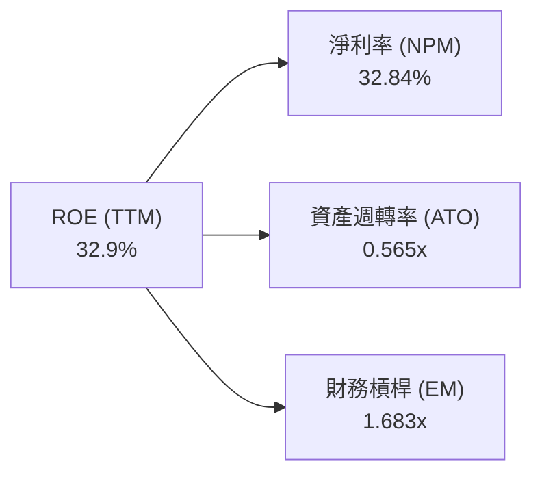

* **淨利率 (32.84%)**：高定價權與高毛利軟體特性的體現。
* **資產週轉率 (0.565x)**：反映重資本 (CapEx) 投入數據中心後，資產規模迅速膨脹，短期內週轉率略有稀釋。
* **財務槓桿 (1.683x)**：維持在極其健康的低槓桿水平，主要依靠自有資金營運。

### 6.4 獲利能力儀表板

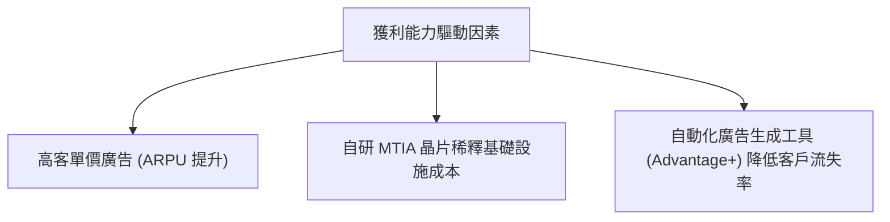

---

## 7. 估值深度分析

### 7.1 同業估值比較表格

| 估值指標 | **META** | **Alphabet (GOOGL)** | **Microsoft (MSFT)** | **Snap (SNAP)** | 本公司評估 |
|----------|----------|----------------------|----------------------|-----------------|-----------|
| **Trailing P/E** | **21.01x** | 24.50x | 34.20x | 負值 | 🟢 顯著低於科技巨頭均值 |
| **Forward P/E** | **15.93x** | 19.80x | 28.50x | 28.90x | 🟢 具備極高性價比 |
| **P/S Ratio** | **6.82x** | 6.10x | 12.40x | 3.50x | 🟡 合理，反映高利潤率 |
| **EV / EBITDA** | **13.46x** | 16.20x | 22.10x | 24.50x | 🟢 息稅折舊前利潤倍數極具吸引力 |
| **PEG Ratio** | **0.83** | 1.25 | 1.85 | 1.45 | 🟢 < 1.00 屬於典型低估 |

### 7.2 歷史估值區間分析

```
╔══════════════════════════════════════════════════════════════════╗
║                META 歷史 P/E (Trailing) 區間定位                 ║
╠══════════════════════════════════════════════════════════════════╣
║                                                                  ║
║  歷史最低 (2022 底部)： 8.5x                                     ║
║  歷史中位數 (5年平均)：24.5x                                     ║
║  歷史最高 (2021 頂部)：38.0x                                     ║
║  當前 P/E：            21.01x                                    ║
║                                                                  ║
║  8.5x       21.01x       24.5x                      38.0x        ║
║  [最低]------[★當前]------[中位數]-------------------[最高]       ║
║                                                                  ║
║  📊 結論：當前估值低於 5 年中位數約 14.2%，考量到其 AI 成長增速，  ║
║         估值具備強烈的向上修復空間。                             ║
╚══════════════════════════════════════════════════════════════════╝
```

### 7.3 DCF 敏感性分析（6格目標價矩陣）

* **基準假設**：
  * 永續成長率 (g) = 3.0%
  * 基準 WACC = 10.0%
  * 預期 EPS 5年 CAGR = 18.5%

| 營收成長情境 | **WACC = 9.0%** | **WACC = 10.0% (基準)** | **WACC = 11.0%** |
|--------------|-----------------|-------------------------|------------------|
| 🟢 **樂觀 (CAGR 22%)** | $1,030 (+78.4%) | **$980 (+69.8%)** | $910 (+57.7%) |
| 🟡 **基準 (CAGR 18%)** | $890 (+54.2%) | **$825 (+42.9%)** ← **主要目標** | $760 (+31.7%) |
| 🔴 **悲觀 (CAGR 12%)** | $710 (+23.0%) | **$650 (+12.6%)** | $590 (+2.2%) |

### 7.4 估值綜合區間

```
╔══════════════════════════════════════════════════════════════════╗
║                    META 估值區間與安全邊際                       ║
╠══════════════════════════════════════════════════════════════════╣
║                                                                  ║
║  當前股價：  $577.22                                             ║
║  悲觀估值：  $650.00 (隱含下行保護)                              ║
║  DCF 基準值：$825.00 (目標價)                                    ║
║  機構平均目標價：$827.32                                         ║
║  樂觀估值：  $980.00                                             ║
║                                                                  ║
║  $577.22     $650.00         $825.00           $980.00           ║
║  [★當前價]----[悲觀]---------[★基準目標]--------[樂觀]          ║
║  |<-- 12.6% ->|                                                  ║
║  安全邊際極高                                                     ║
╚══════════════════════════════════════════════════════════════════╝
```

---

## 8. 成長催化劑

### 8.1 成長催化劑時間軸

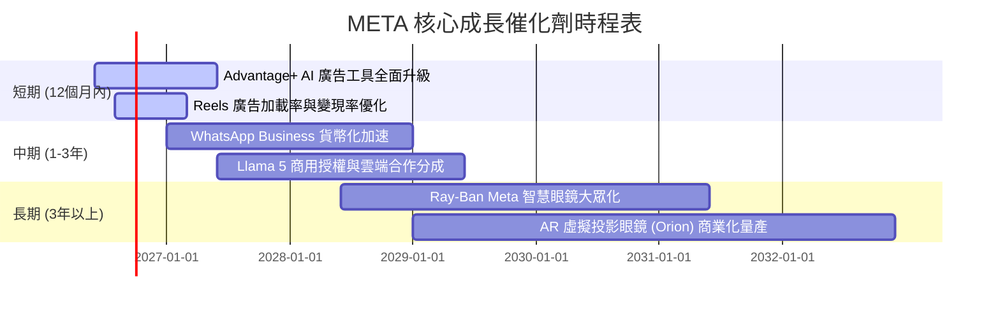

### 8.2 TAM 市場規模分析

```
╔══════════════════════════════════════════════════════════════════╗
║                  META 潛在市場規模 (TAM) 預測                    ║
╠══════════════════════════════════════════════════════════════════╣
║                                                                  ║
║  1. 全球數位廣告市場 (2028年預估)：                              ║
║     ├── TAM: $850B | META 預估份額: 24% | 貢獻營收: $204B        ║
║                                                                  ║
║  2. 企業級商務訊息與 AI 客服 (WhatsApp)：                         ║
║     ├── TAM: $120B | META 預估份額: 15% | 貢獻營收: $18B         ║
║                                                                  ║
║  3. 智慧穿戴與 AR/VR 硬體：                                      ║
║     ├── TAM: $80B  | META 預估份額: 10% | 貢獻營收: $8B          ║
║                                                                  ║
║  📊 預估 2028 總營收潛力：$230B+ (當前 TTM 為 $214.96B)           ║
╚══════════════════════════════════════════════════════════════════╝
```

### 8.3 成長驅動力結構圖

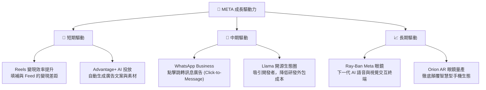

---

## 9. 風險矩陣

### 9.1 風險評分矩陣

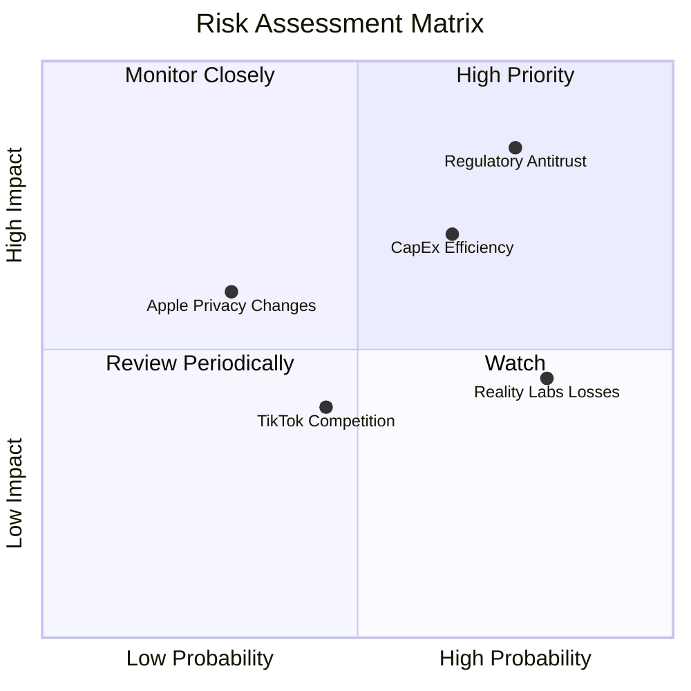

### 9.2 風險清單詳細分析

| # | 風險項目 | 發生機率 | 財務衝擊 | 風險評分 | 緩解措施 / 機構觀點 |
|---|----------|----------|----------|----------|----------|
| 1 | 🔴 **反壟斷與隱私監管** | 高 (75%) | 高 (延遲新產品推出) | 🔴 **