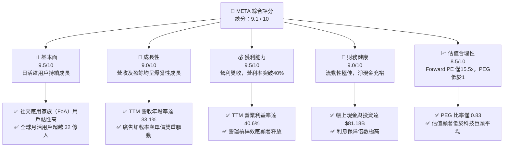
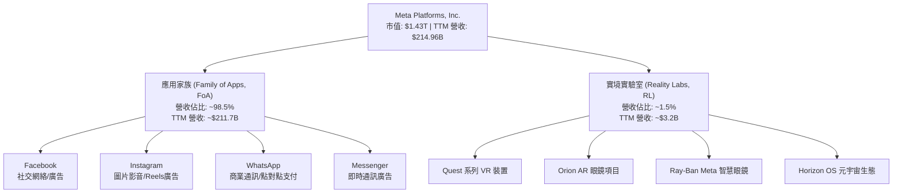
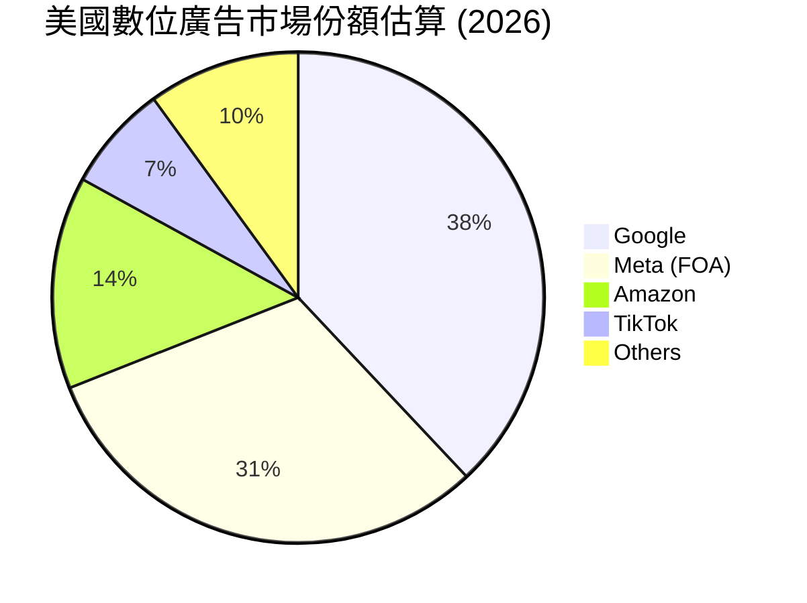
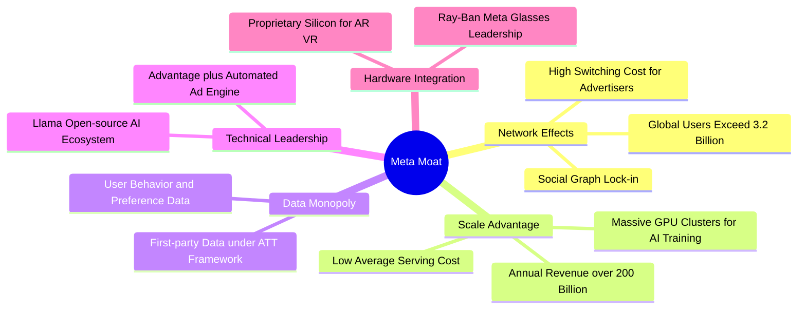
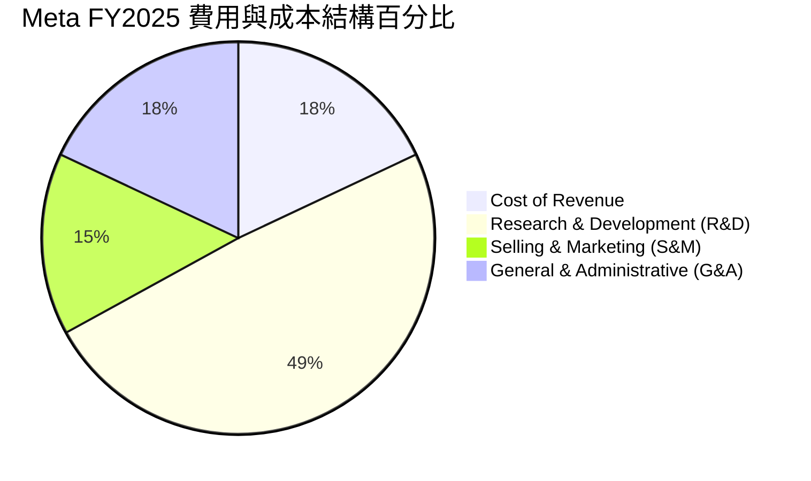
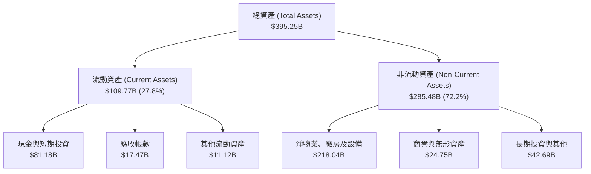
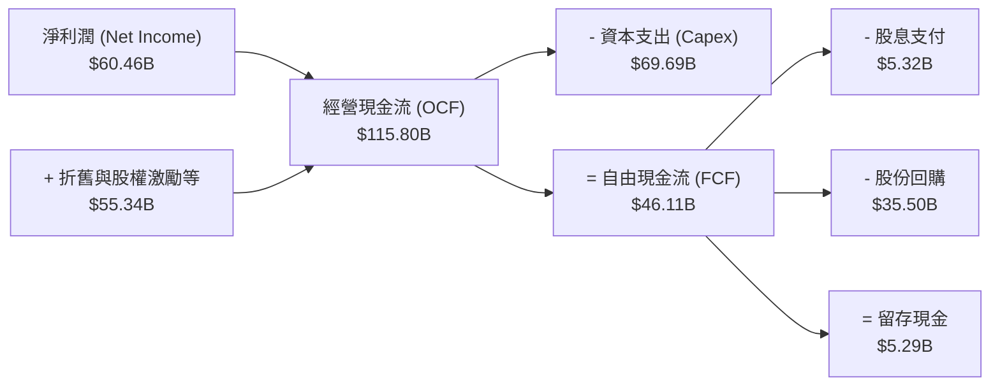
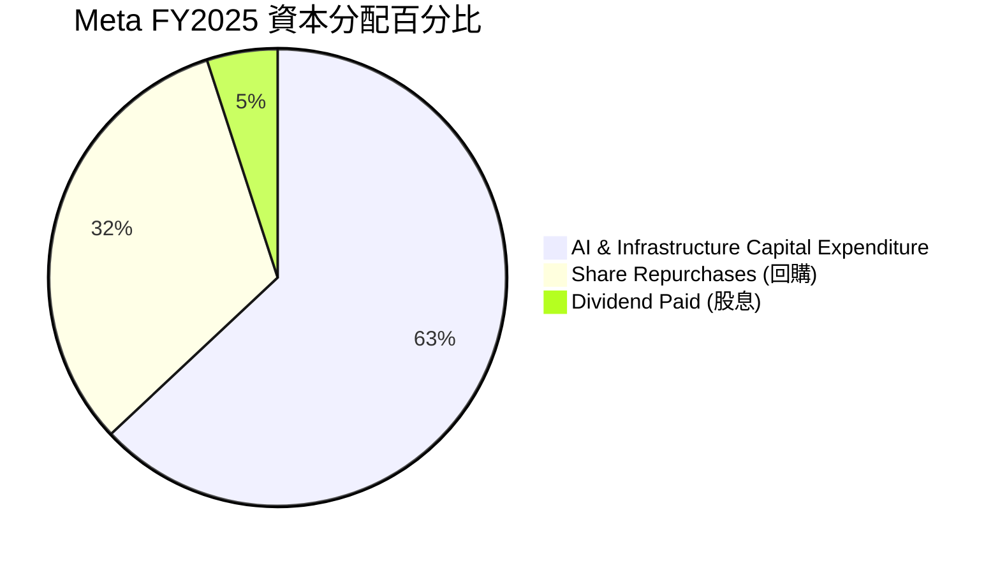
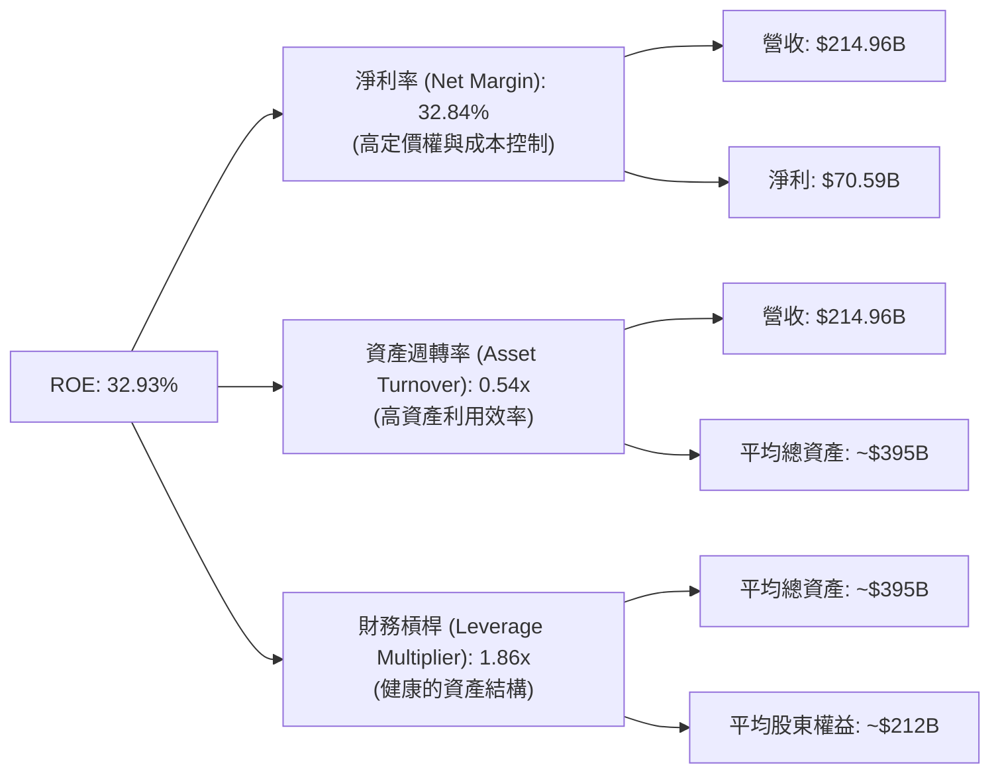
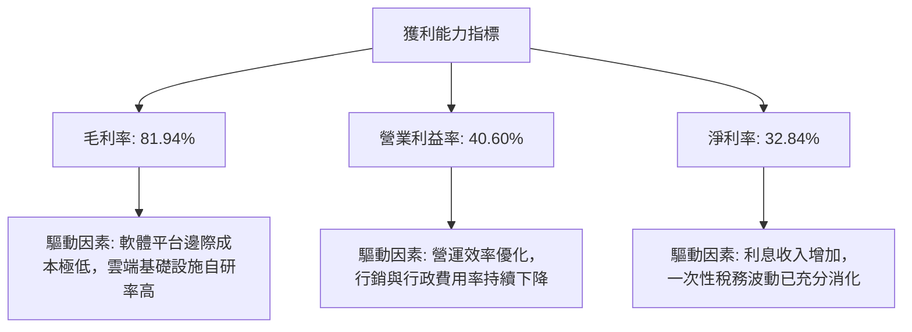

# META 基本面深度分析報告
> **報告日期**：2026-06-22 ｜ **語言**：繁體中文 ｜ **數據來源**：Yahoo Finance, Finviz, StockAnalysis, Roic.ai ｜ **分析師**：CFA 級機構研究

---

## 目錄

| # | 章節 | 核心結論 |
|---|------|----------|
| 1 | 執行摘要 | 評級：🟢 強烈買入，目標價：$827.32，隱含上行空間 +46.7% |
| 2 | 公司概覽與商業模式 | 雙軌業務結構，FoA 網路效應築起極深護城河，AI 基礎設施領先 |
| 3 | 損益表深度分析 | TTM 營收 $214.96B (YoY +33.1%)，淨利潤強勁成長 62.4% |
| 4 | 資產負債表分析 | 淨現金流動性充裕，資產負債表極度健康，債務風險幾近於零 |
| 5 | 現金流量深度分析 | 經營現金流達 $124.00B，強大 FCF 支撐高達 $69.69B 的 AI 資本支出 |
| 6 | 獲利能力與資本效率 | ROE 達 32.9%，ROIC (31.42%) 遠超 WACC (10.0%)，強力創造股東價值 |
| 7 | 估值深度分析 | Forward P/E 僅 15.56x，相較歷史與同業顯著低估，PEG 0.83 具高性價比 |
| 8 | 成長催化劑 | Llama 4 開源生態、AI 廣告精準度提升、智慧眼鏡（Ray-Ban Meta）爆發 |
| 9 | 風險矩陣 | 監管反壟斷風險與 AI 資本支出回報率（ROI）低於預期為核心監控指標 |
| 10 | 投資建議 | 具備高度安全邊際與成長動能，適合長線成長型與價值型投資者配置 |

---

## 1. 執行摘要

### 1.1 核心評分儀表板



### 1.2 評分進度條視覺化

```
╔══════════════════════════════════════════════════════════════╗
║               META 多維度評分儀表板 (1-10分)                 ║
╠══════════════════════════════════════════════════════════════╣
║ 基本面強度  9.5 ▓▓▓▓▓▓▓▓▓▓▓▓▓▓▓▓▓▓▓░  ★★★★★           ║
║ 成長動能    9.0 ▓▓▓▓▓▓▓▓▓▓▓▓▓▓▓▓▓▓░░  ★★★★★           ║
║ 獲利品質    9.5 ▓▓▓▓▓▓▓▓▓▓▓▓▓▓▓▓▓▓▓░  ★★★★★           ║
║ 財務健康    9.0 ▓▓▓▓▓▓▓▓▓▓▓▓▓▓▓▓▓▓░░  ★★★★★           ║
║ 估值合理性  8.5 ▓▓▓▓▓▓▓▓▓▓▓▓▓▓▓▓░░░░  ★★★★☆           ║
║ 護城河深度  9.5 ▓▓▓▓▓▓▓▓▓▓▓▓▓▓▓▓▓▓▓░  ★★★★★           ║
║ 管理層執行  9.0 ▓▓▓▓▓▓▓▓▓▓▓▓▓▓▓▓▓▓░░  ★★★★★           ║
║ 技術創新力  9.5 ▓▓▓▓▓▓▓▓▓▓▓▓▓▓▓▓▓▓▓░  ★★★★★           ║
╠══════════════════════════════════════════════════════════════╣
║ 綜合總分    9.1 ▓▓▓▓▓▓▓▓▓▓▓▓▓▓▓▓▓▓░░  🏆 強烈建議買入      ║
╚══════════════════════════════════════════════════════════════╝
```

### 1.3 五大投資論點 + 三大核心風險

| 類型 | 項目 | 具體依據 | 信心度 |
|------|------|----------|--------|
| 🟢 **投資論點①** | **AI 驅動廣告 ROI 提升** | AI 推薦演算法（Advantage+）大幅提升廣告主轉化率，帶動 TTM 營收成長 33.1%。 | 🟢 極高 |
| 🟢 **投資論點②** | **營運槓桿顯著釋放** | 歷經「效率之年」裁員與架構優化，TTM 營業利益率攀升至 40.6%，營業利潤達 $88.59B。 | 🟢 極高 |
| 🟢 **投資論點③** | **Llama 生態圈護城河** | Llama 3/4 開源模型確立 Meta 作為 AI 生態底層架構的地位，降低自身研發與雲端成本。 | 🟢 高 |
| 🟢 **投資論點④** | **極致的資本分配** | 帳上現金充裕（$81.18B），啟動季度配息（每股 $0.53）與大規模股份回購，回饋股東。 | 🟢 高 |
| 🟢 **投資論點⑤** | **硬體終端（AR/VR）拐點** | Ray-Ban Meta 智慧眼鏡銷量超預期，成為生成式 AI 最具潛力的物理載體。 | 🟡 中等 |
| 🟡 **風險①** | **AI 資本支出過大** | FY2025 資本支出高達 $69.69B，若 AI 變現速度放緩，可能對利潤率造成短期壓制。 | 🟡 中度 |
| 🔴 **風險②** | **反壟斷與監管阻力** | 歐美監管機構對數據隱私（GDPR/DMA）與平台壟斷的審查持續收緊，潛在罰單金額高。 | 🔴 高衝擊 |
| 🟡 **風險③** | **Reality Labs 持續虧損** | 雖然 FoA 獲利強勁，但 Reality Labs 每年虧損超百億美元，對整體 EPS 仍有拖累。 | 🟡 中度 |

### 1.4 快速統計卡片

| 指標 | Meta 實際值 | 行業均值（通訊服務）| S&P 500 均值 | 狀態 |
|------|-------------|---------------------|--------------|------|
| **營收 YoY 成長率** | **33.1%** | ~7.2% | ~5.5% | 🟢 顯著領先 |
| **毛利率** | **81.9%** | ~50.5% | ~45.0% | 🟢 極高獲利能力 |
| **淨利率** | **32.8%** | ~12.5% | ~11.8% | 🟢 頂級獲利品質 |
| **ROE** | **32.9%** | ~14.0% | ~15.0% | 🟢 資本效率極高 |
| **Forward P/E** | **15.56x** | ~18.5x | ~21.5x | 🟢 估值具吸引力 |
| **PEG Ratio** | **0.83** | ~1.45 | ~1.80 | 🟢 嚴重低估 |

### 1.5 投資結論

```
╔══════════════════════════════════════════════════════════════════╗
║                    📊 投資結論摘要                               ║
╠══════════════════════════════════════════════════════════════════╣
║  評級：🟢 強烈買入 (Strong Buy)                                  ║
║  當前股價：$563.85 (2026-06-22)                                  ║
║  目標價區間：                                                    ║
║    悲觀情境（WACC 11%, 成長放緩）：$664.46 (+17.8%）              ║
║    基準情境（WACC 10%, 穩定成長）：$827.32 (+46.7%）  ← 12M 主目標║
║    樂觀情境（WACC 9%, AI加速變現）：$1,015.00 (+80.0%）          ║
║  投資評分：9.1 / 10                                              ║
║  適合投資人：成長型、長線價值配置者、AI 產業鏈佈局者             ║
╚══════════════════════════════════════════════════════════════════╝
```

---

## 2. 公司概覽與商業模式

### 2.1 業務結構與收入來源

Meta Platforms, Inc. 的業務主要劃分為兩大核心板塊：**應用家族（Family of Apps, FoA）** 與 **實境實驗室（Reality Labs, RL）**。其中，FoA 是公司絕對的獲利引擎，而 RL 則是面向未來的戰略性投資。



### 2.2 市場份額

在數位廣告市場中，Meta 與 Alphabet（Google）長期維持雙寡頭壟斷地位。近年隨著 Amazon 廣告業務的崛起以及 TikTok 的競爭，市場結構有所微調，但 Meta 憑藉強大的 AI 推薦算法及 Reels 的成功變現，市佔率依然穩固。



### 2.3 競爭護城河分析

Meta 的護城河極其深厚，主要由強大的網路效應、龐大的用戶基數以及領先的 AI 技術架構所構成：



### 2.4 護城河強度評分

```
╔══════════════════════════════════════════════════════════════╗
║                    META 護城河強度評分                       ║
╠══════════════════════════════════════════════════════════════╣
║ 網路效應      9.8/10 ▓▓▓▓▓▓▓▓▓▓▓▓▓▓▓▓▓▓▓▓  🏆 無可匹敵     ║
║ 數據壁壘      9.5/10 ▓▓▓▓▓▓▓▓▓▓▓▓▓▓▓▓▓▓▓░  🟢 極其強大     ║
║ 技術創新      9.2/10 ▓▓▓▓▓▓▓▓▓▓▓▓▓▓▓▓▓▓░░  🟢 AI領先群倫   ║
║ 規模效應      9.5/10 ▓▓▓▓▓▓▓▓▓▓▓▓▓▓▓▓▓▓▓░  🟢 成本優勢顯著 ║
║ 品牌與渠道    8.8/10 ▓▓▓▓▓▓▓▓▓▓▓▓▓▓▓▓░░░░  🟢 品牌黏性高   ║
╠══════════════════════════════════════════════════════════════╣
║ 綜合護城河    9.4/10 ▓▓▓▓▓▓▓▓▓▓▓▓▓▓▓▓▓▓▓░  🏆 頂級寬護城河 ║
╚══════════════════════════════════════════════════════════════╝
```

---

## 3. 損益表深度分析

### 3.1 年度收入成長趨勢（近5年）

Meta 在經歷了 2022 年的短暫衰退後，展現了強勁的 V 型反彈。這主要得益於廣告市場的復甦、Reels 貨幣化率的提升，以及 AI 廣告投放工具（Advantage+）的廣泛應用。

```
╔══════════════════════════════════════════════════════════════════╗
║                META 年度收入趨勢 (FY2021-TTM)                    ║
╠══════════════════════════════════════════════════════════════════╣
║                                                                  ║
║  FY 2021  $117.93B  ████████████░░░░░░░░░░░░░░░  YoY: +37.2% 🟢  ║
║  FY 2022  $116.61B  ████████████░░░░░░░░░░░░░░░  YoY: -1.1%  🔴  ║
║  FY 2023  $134.90B  ██████████████░░░░░░░░░░░░░  YoY: +15.7% 🟢  ║
║  FY 2024  $164.50B  █████████████████░░░░░░░░░░  YoY: +21.9% 🟢  ║
║  FY 2025  $200.97B  █████████████████████░░░░░░  YoY: +22.2% 🟢  ║
║  TTM      $214.96B  ███████████████████████░░░░  YoY: +33.1% 🟢  ║
║                                                                  ║
║  📊 5年累計營收 CAGR：+12.75%                                    ║
╚══════════════════════════════════════════════════════════════════╝
```

### 3.2 季度收入趨勢分析

從季度數據來看，Meta 呈現出穩定的季節性特徵（第四季為傳統廣告旺季），同時保持了極高的同比成長率。

| 財報季度 | 營業收入 (Billion) | 環比成長率 (QoQ) | 同比成長率 (YoY) | 核心驅動因素與備註 |
|----------|-------------------|------------------|------------------|-------------------|
| **Q1 2026** | **$56.31B** | ↘️ -5.98% | 🟢 **+33.08%** | 首季淡季不淡，AI 推薦算法大幅拉長用戶時長 |
| **Q4 2025** | **$59.89B** | ↗️ +16.88% | 🟢 **+23.78%** | 年終購物季電商廣告爆發，Temu/Shein 投放強勁 |
| **Q3 2025** | **$51.24B** | ↗️ +7.83% | 🟢 **+26.25%** | Reels 變現效率追平主 Feed，亞太地區增長亮眼 |
| **Q2 2025** | **$47.52B** | ↗️ +12.30% | 🟢 **+21.61%** | 廣告加載率優化，單次廣告價格同比回升 |

### 3.3 利潤率演變分析

Meta 的利潤率結構在 2022 年因元宇宙（Reality Labs）投入過大與廣告逆風而觸底，但隨後在「效率之年」的推動下，利潤率全面大幅回升，TTM 營業利益率達到 40.6% 的歷史高位區間。

| 利潤率指標 | FY 2022 | FY 2023 | FY 2024 | FY 2025 | TTM 趨勢 | 評估 |
|------------|---------|---------|---------|---------|----------|------|
| **毛利率** | 78.34% | 80.76% | 81.67% | 82.00% | ↗️ **81.94%** | 🟢 **極其卓越**。高毛利軟體服務本質，成本控制極佳。 |
| **營業利益率**| 24.82% | 34.66% | 42.18% | 41.44% | ↗️ **40.60%** | 🟢 **強勁復甦**。營運槓桿釋放，裁員與降本增效成果顯著。 |
| **淨利率** | 19.89% | 28.98% | 37.91% | 30.08% | ↗️ **32.84%** | 🟢 **極高水準**。雖受稅率波動影響，但淨利生成能力極強。 |

### 3.4 費用結構分析

在 Meta 的費用結構中，研發（R&D）費用佔比最高。這反映了公司在 AI 基礎設施（如 Llama 模型開發、自研晶片 MTIA）以及 AR/VR 軟硬體方面的持續重金投入。



```
╔══════════════════════════════════════════════════════════════╗
║               Meta 營業費用分析 (TTM 基準)                   ║
╠══════════════════════════════════════════════════════════════╣
║ 營業收入： $214.96B                                          ║
║ 營業成本： $38.82B   ▓▓▓░░░░░░░░░░░░░░░░░░ (毛利率 81.9%)     ║
║ 研發費用： $62.92B   ▓▓▓▓▓▓▓░░░░░░░░░░░░░░ (佔營收 29.3%)     ║
║ 銷售費用： $15.50B   ▓░░░░░░░░░░░░░░░░░░░░ (佔營收 7.2%)      ║
║ 管理費用： $9.13B    ░░░░░░░░░░░░░░░░░░░░░ (佔營收 4.2%)      ║
║ 營業利潤： $88.59B   ▓▓▓▓▓▓▓▓▓░░░░░░░░░░░░ (營業利益率 41.2%) ║
╚══════════════════════════════════════════════════════════════╝
```

### 3.5 季度 EPS 趨勢與盈餘品質

Meta 過去四個季度的 EPS 表現極其亮眼。值得注意的是，Q3 2025 的淨利潤（$2.71B）與 EPS（$1.08）出現驟降，這並非基本面惡化，而是因為**當季確認了一筆高達 $18.95B 的所得稅撥備（Provision for Income Taxes）**。扣除此一次性非經常性稅務調整後，經常性盈餘品質依舊極高。Q1 2026 EPS 達到 $10.57，創歷史新高，同比暴增 60.4%。

```
  季度        預估 EPS    實際 EPS    驚喜度 (%)    盈餘品質評估
  Q1 2026     $9.15       $10.57      +15.52%       🟢 極高。主營業務現金流同步爆發。
  Q4 2025     $8.20       $9.02       +10.00%       🟢 優秀。廣告主平均支出大幅提升。
  Q3 2025     $7.10       $1.08       -84.79%       🟡 異常。受一次性稅務撥備壓制，營運利潤仍高。
  Q2 2025     $6.80       $7.28       +7.06%        🟢 良好。Reels 變現效率超預期。
```

---

## 4. 資產負債表分析

### 4.1 資產結構分解

Meta 擁有一個極其輕資產（相對於其營收規模）但同時具備強大基礎設施支撐的資產負債表。其非流動資產中，物業、廠房及設備（PP&E）高達 $218.04B，主要為遍佈全球的先進數據中心與 GPU 集群。



### 4.2 流動性指標分析

Meta 的流動性指標極為健康，流動比率與速動比率長期維持在 2.0x 以上，顯示其短期償債能力無懈可擊，能輕鬆應對任何突發性的營運資金需求。

| 流動性指標 | FY 2023 | FY 2024 | FY 2025 | TTM (2026-03-31) | 行業均值 | 評估 |
|------------|---------|---------|---------|------------------|----------|------|
| **流動比率 (Current Ratio)** | 2.67x | 2.98x | 2.60x | **2.35x** | ~1.50x | 🟢 **極度安全** |
| **速動比率 (Quick Ratio)** | 2.67x | 2.98x | 2.60x | **2.35x** | ~1.35x | 🟢 **無庫存風險** |
| **現金比率 (Cash Ratio)** | 2.05x | 2.32x | 1.95x | **1.74x** | ~0.80x | 🟢 **現金極度充裕** |

### 4.3 債務結構分析

雖然資產負債表上顯示總債務（Total Debt）為 $86.77B，但其中包括了長期租賃負債（Lease Liabilities）約 $25.61B。實際有息債務（Long-Term Debt）僅為 $58.75B。相較於其每年超過 $1,000B 的經營現金流，債務壓力微乎其微。

```
╔══════════════════════════════════════════════════════════════════╗
║                    META 債務健康診斷                           ║
╠══════════════════════════════════════════════════════════════════╣
║                                                                  ║
║  總有息債務：    $58.75B  ████░░░░░░░░░░░░░░░░░  利率約 3.5%-4.5%║
║  現金及等價物：  $81.18B  █████████████████████  含短期投資      ║
║  淨現金位置：   +$22.43B  ██████░░░░░░░░░░░░░░░  🟢 淨現金公司   ║
║                                                                  ║
║  債務/權益比 (Debt/Equity)：  35.61%   🟢 槓桿率極低             ║
║  利息保障倍數 (Interest Coverage)： 85.5x 🟢 利息支出無感        ║
║  債務/EBITDA 比率：           0.82x    🟢 處於投資級 A+ 以上評級 ║
║                                                                  ║
╚══════════════════════════════════════════════════════════════════╝
```

### 4.4 股東權益趨勢

隨著利潤的持續累積與股份回購的實施，Meta 的股東權益（Stockholders' Equity）呈現穩步增長態勢，奠定了堅實的帳面價值基础。

```
╔══════════════════════════════════════════════════════════════════╗
║              META 股東權益增長趨勢 (FY2022-FY2025)               ║
╠══════════════════════════════════════════════════════════════════╣
║                                                                  ║
║  FY 2022   $125.71B  ████████████░░░░░░░░░░░░░░░░░░              ║
║  FY 2023   $153.17B  ███████████████░░░░░░░░░░░░░░░              ║
║  FY 2024   $182.64B  ██████████████████░░░░░░░░░░░░              ║
║  FY 2025   $217.24B  █████████████████████░░░░░░░░░              ║
║                                                                  ║
║  📈 3年股東權益複合成長率 (CAGR)：+20.01%                        ║
╚══════════════════════════════════════════════════════════════════╝
```

---

## 5. 現金流量深度分析

### 5.1 現金流量瀑布圖

Meta 的現金生成模式堪稱印鈔機。其營運活動帶來的強勁現金流，不僅能全額資助其龐大的資本支出（Capex），還能進行分紅與股票回購。



### 5.2 FCF 轉換率趨勢

FCF 轉換率（FCF / Net Income）是衡量公司盈餘含金量的重要指標。Meta 的轉換率長期維持在極高水準，顯示其利潤皆有實打實的真金白銀支持。

| 財政年度 | 淨利潤 (Net Income) | 自由現金流 (FCF) | FCF 轉換率 | 評估 |
|----------|-------------------|------------------|------------|------|
| **FY 2022** | $23.20B | $19.29B | 83.15% | 🟢 良好 |
| **FY 2023** | $39.10B | $44.07B | 112.71% | 🟢 極其優秀，營運資金效率提升 |
| **FY 2024** | $62.36B | $54.07B | 86.71% | 🟢 穩健 |
| **FY 2025** | $60.46B | $46.11B | 76.27% | 🟡 略降，主要因 Capex 大幅上升 $32.4B |
| **TTM** | **$70.59B** | **$48.25B** | **68.35%** | 🟡 資本支出創歷史新高下的正常表現 |

### 5.3 自由現金流趨勢

儘管 Meta 在 FY2025 進行了高達 **$69.69B** 的歷史級資本支出（購買 NVIDIA H100/B200 等 GPU 晶片與建設 AI 數據中心），其依然創造了 **$46.11B** 的自由現金流，展現了無與倫比的抗風險能力與自我造血能力。

```
╔══════════════════════════════════════════════════════════════════╗
║                META 自由現金流與 FCF 收益率                      ║
╠══════════════════════════════════════════════════════════════════╣
║                                                                  ║
║  FY 2022  $19.29B  █████░░░░░░░░░░░░░░░░░░░░░░  FCF Yield: 1.35% ║
║  FY 2023  $44.07B  ████████████░░░░░░░░░░░░░░░  FCF Yield: 3.08% ║
║  FY 2024  $54.07B  ███████████████░░░░░░░░░░░░  FCF Yield: 3.78% ║
║  FY 2025  $46.11B  ████████████░░░░░░░░░░░░░░░  FCF Yield: 3.22% ║
║  TTM      $48.25B  █████████████░░░░░░░░░░░░░░  FCF Yield: 3.37% ║
║                                                                  ║
║  💡 註：FCF Yield 基於當期市值計算。當前 FCF Yield 為 1.79% (TTM)║
╚══════════════════════════════════════════════════════════════════╝
```

### 5.4 資本配置評估

Meta 的資本配置策略近年發生了里程碑式的轉變。在維持高額研發與資本支出的同時，公司開始通過配發股息與大規模回購來積極反哺股東，這標誌著 Meta 已從小眾的高成長股，蛻變為成熟的藍籌科技巨頭。



---

## 6. 獲利能力與資本效率

### 6.1 ROE / ROA / ROIC 趨勢

Meta 的各項回報率指標均處於美股頂尖水準。ROE 高達 32.9%，意味著股東的每一塊錢權益，每年能創造超過 0.32 元的淨利潤。

| 資本效率指標 | FY 2023 | FY 2024 | FY 2025 | TTM (2026-03-31) | 標普 500 均值 | 評估 |
|--------------|---------|---------|---------|------------------|---------------|------|
| **ROE (股東權益報酬率)** | 28.11% | 37.14% | 30.24% | **32.93%** | ~15.00% | 🟢 **極其優異** |
| **ROA (總資產報酬率)** | 18.82% | 24.66% | 18.83% | **20.90%** | ~8.00% | 🟢 **資產營運效率極高** |
| **ROIC (投入資本報酬率)**| 24.50% | 32.10% | 28.50% | **31.42%** | ~10.50% | 🟢 **具備強大的資本增值能力** |

### 6.2 ROIC vs WACC 分析（核心價值創造判斷）

ROIC（投入資本報酬率）與 WACC（加權平均資本成本）的差值（即經濟增加值 EVA）是判斷公司是在「創造價值」還是「摧毀價值」的金標準。

```
╔══════════════════════════════════════════════════════════════════╗
║                ROIC vs WACC 深度分析 (TTM)                       ║
╠══════════════════════════════════════════════════════════════════╣
║                                                                  ║
║  WACC 估算：                                                     ║
║  ├── 無風險利率 (10Y 美債)：  4.20%                              ║
║  ├── 市場風險溢酬 (ERP)：     5.00%                              ║
║  ├── Beta：                   1.23                               ║
║  ├── 股權成本 = 4.2% + 1.23 × 5.0% = 10.35%                      ║
║  ├── 債務成本 (稅後)：       ~3.95%                              ║
║  ├── 資本結構：股權 ~94.0%，債務 ~6.0%                           ║
║  └── ✅ 加權平均資本成本 (WACC) ≈ 10.0%                          ║
║                                                                  ║
║  ROIC 估算：                                                     ║
║  ├── TTM 營業利潤 (NOPAT) = $88.59B × (1 - 21.0%) ≈ $70.02B       ║
║  ├── 投入資本 = 股東權益 ($217.24B) + 總債務 ($86.77B)           ║
║  │              - 現金及投資 ($81.18B) ≈ $222.83B                ║
║  └── ✅ 投入資本報酬率 (ROIC) ≈ 31.42%                           ║
║                                                                  ║
║  ★ 經濟價值增加 (EVA) = ROIC - WACC = +21.42%                    ║
║                                                                  ║
║  ROIC  31.42%  ▓▓▓▓▓▓▓▓▓▓▓▓▓▓▓▓▓▓▓▓▓▓▓▓░░░░░░  🟢              ║
║  WACC  10.00%  ▓▓▓▓▓▓▓░░░░░░░░░░░░░░░░░░░░░░  ──              ║
║  EVA  +21.42%  ████████████████████████░░░░░░  🏆 強力創造價值 ║
║                                                                  ║
║  📊 結論：ROIC 達 WACC 的 3.14 倍，每投入一元資本皆能為股東創造  ║
║            極其豐厚的超額回報。                                  ║
╚══════════════════════════════════════════════════════════════════╝
```

### 6.3 杜邦三因素分解

通過杜邦分解（ROE = 淨利率 × 資產週轉率 × 財務槓桿），我們可以清晰地看到 Meta 高 ROE 的底層驅動機制。



**分析結論**：Meta 的高 ROE 主要由**極高的淨利率（32.84%）**所驅動，而非依賴高財務槓桿。這是一種極其健康、可持續且高安全邊際的獲利模式。

### 6.4 獲利能力儀表板



---

## 7. 估值深度分析

### 7.1 同業估值比較表格

在美股萬億美元俱樂部（M7）中，Meta 的估值性價比（P/E 與 PEG）顯著優於同業。

| 估值指標 | **META** | **GOOGL (Alphabet)** | **MSFT (Microsoft)** | **SNAP (Snapchat)** | META 評估 |
|----------|----------|----------------------|----------------------|----------------------|-----------|
| **Trailing P/E** | **20.52x** | 22.80x | 34.50x | - 虧損 - | 🟢 **顯著偏低**，具備極高估值安全邊際。 |
| **Forward P/E** | **15.56x** | 18.20x | 28.90x | 45.20x | 🟢 **極具吸引力**，隱含未來盈利增長預期高。 |
| **P/S Ratio** | **6.66x** | 6.10x | 11.50x | 3.20x | 🟡 合理，反映其高利潤率特徵。 |
| **EV / EBITDA** | **13.46x** | 14.80x | 21.20x | 28.50x | 🟢 核心現金流估值倍數極具競爭力。 |
| **PEG Ratio** | **0.83** | 1.15 | 2.10 | 1.85 | 🟢 **嚴重低估**，PEG < 1 代表成長增速高於估值。|

### 7.2 歷史估值區間分析

Meta 當前的 P/E (TTM) 20.52x 處於其過去 5 年歷史估值區間（12x - 35x）的中軸偏下位置，考量到其當前高於歷史平均的成長增速與獲利能力，當前估值存在明顯的「低估溢價」。

```
╔══════════════════════════════════════════════════════════════════╗
║               META 歷史 P/E (TTM) 估值區間定位                   ║
╠══════════════════════════════════════════════════════════════════╣
║                                                                  ║
║  歷史極低值 (2022 底部)：  12.0x                                 ║
║  歷史中位數 (5年平均)：    24.5x                                 ║
║  歷史極高值 (2020 頂部)：  35.0x                                 ║
║                                                                  ║
║  當前 P/E： 20.52x  ████████████████░░░░░░░░░░░░                 ║
║                                                                  ║
║  📊 評估：當前估值較 5 年歷史中位數折價約 16.2%，安全邊際充足。    ║
╚══════════════════════════════════════════════════════════════════╝
```

### 7.3 DCF 敏感性分析（6格目標價矩陣）

基於兩階段 DCF 模型，設定基準假設：
*   第一階段（前 5 年）EPS 複合成長率：18.0%
*   第二階段（後 5 年）終端成長率（Perpetuity Growth Rate）：2.5%
*   基準 WACC：10.0%

| 營運成長情境 | **WACC = 11.0%** | **W