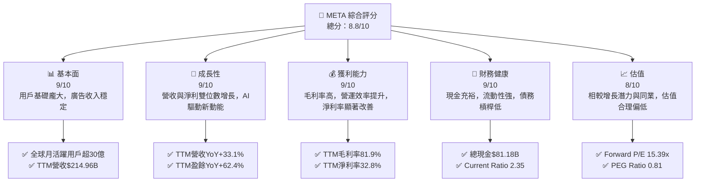
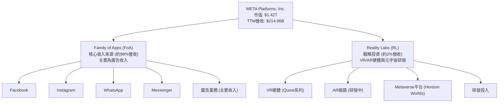
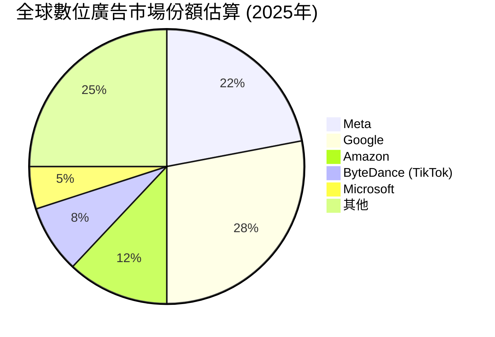
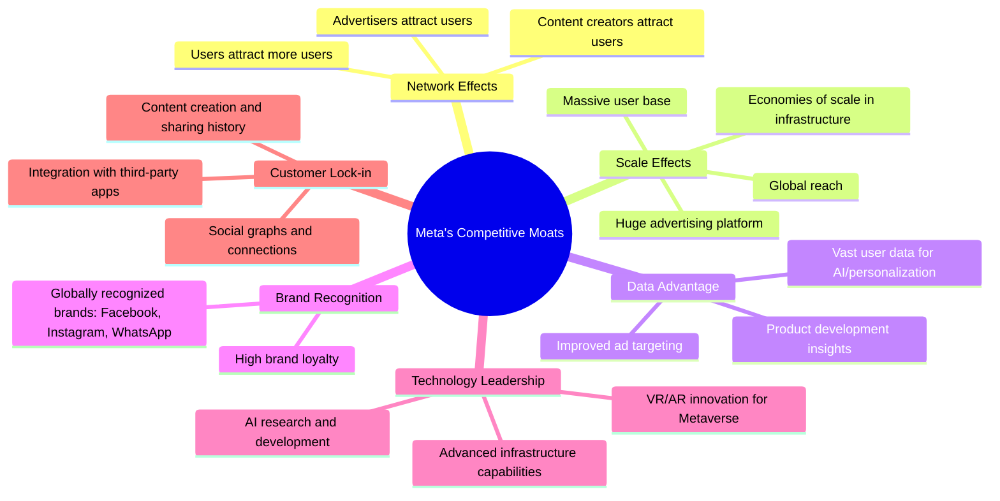
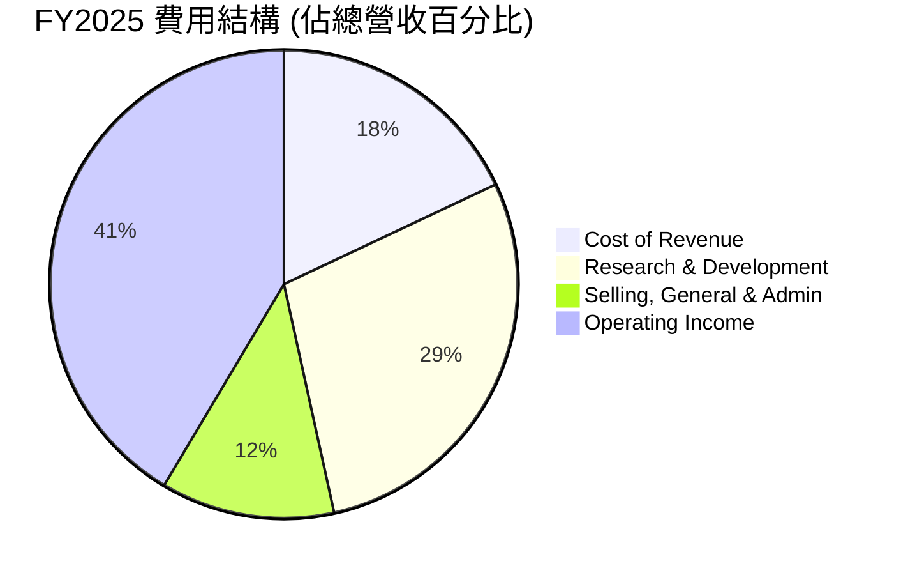
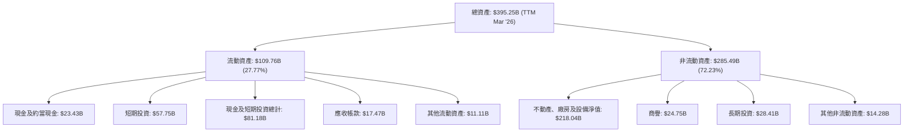

# META 基本面深度分析報告
> **報告日期**：2026-06-24 ｜ **語言**：繁體中文 ｜ **數據來源**：Yahoo Finance, Finviz, StockAnalysis, Roic.ai ｜ **分析師**：CFA 級機構研究

---

## 目錄

| # | 章節 | 核心結論 |
|---|------------------------|----------------------------------------------------------|
| 1 | 執行摘要 | 🟢 強烈買入；目標價區間：$700-$900，基準情境 $820 |
| 2 | 公司概覽與商業模式 | 憑藉強大網路效應與規模優勢，護城河深厚 |
| 3 | 損益表深度分析 | 營收與獲利強勁增長，利潤率顯著改善 |
| 4 | 資產負債表分析 | 財務健康，流動性充裕，債務管理良好 |
| 5 | 現金流量深度分析 | 自由現金流強勁，資本配置策略有效 |
| 6 | 獲利能力與資本效率 | ROIC 遠超 WACC，持續創造股東價值 |
| 7 | 估值深度分析 | 相較同業估值合理，DCF 顯示具上漲空間 |
| 8 | 成長催化劑 | AI 創新、元宇宙長期願景與廣告市場復甦為主要驅動力 |
| 9 | 風險矩陣 | 監管壓力、競爭加劇與元宇宙投資仍為主要風險 |
| 10 | 投資建議 | 長期成長潛力巨大，建議「強烈買入」 |

---

## 1. 執行摘要

### 1.1 核心評分儀表板



### 1.2 評分進度條視覺化

```
╔══════════════════════════════════════════════════════════════╗
║                META 多維度評分儀表板 (1-10分)                ║
╠══════════════════════════════════════════════════════════════╣
║ 基本面強度  9.0 ▓▓▓▓▓▓▓▓▓▓▓▓▓▓▓▓▓▓░░  ★★★★★           ║
║ 成長動能    9.0 ▓▓▓▓▓▓▓▓▓▓▓▓▓▓▓▓▓▓░░  ★★★★★           ║
║ 獲利品質    9.0 ▓▓▓▓▓▓▓▓▓▓▓▓▓▓▓▓▓▓░░  ★★★★★           ║
║ 財務健康    9.0 ▓▓▓▓▓▓▓▓▓▓▓▓▓▓▓▓▓▓░░  ★★★★★           ║
║ 估值合理性  8.0 ▓▓▓▓▓▓▓▓▓▓▓▓▓▓▓▓░░░░  ★★★★☆           ║
║ 護城河深度  9.5 ▓▓▓▓▓▓▓▓▓▓▓▓▓▓▓▓▓▓▓░  ★★★★★           ║
║ 管理層執行  8.5 ▓▓▓▓▓▓▓▓▓▓▓▓▓▓▓▓▓░░░  ★★★★☆           ║
║ 技術創新力  9.0 ▓▓▓▓▓▓▓▓▓▓▓▓▓▓▓▓▓▓░░  ★★★★★           ║
╠══════════════════════════════════════════════════════════════╣
║ 綜合總分    8.8 ▓▓▓▓▓▓▓▓▓▓▓▓▓▓▓▓▓░░░  🏆 具備強勁成長動能與優異獲利能力，估值吸引人。              ║
╚══════════════════════════════════════════════════════════════╝
```

### 1.3 五大投資論點 + 三大核心風險

| 類型 | 項目 | 具體依據 | 信心度 |
|------|------|----------|--------|
| 🟢 **投資論點①** | **核心廣告業務強勁復甦與效率提升** | TTM 營收 YoY 成長 33.1%，淨利 YoY 成長 62.4%。管理層持續推動「效率年」，使營業利益率從 FY2023 的 34.66% 提升至 FY2025 的 41.44%。 | 🟢 極高 |
| 🟢 **AI 技術的領先應用與變現能力** | Meta 在廣告產品中深度整合 AI，提升廣告投放精準度與效率，直接貢獻營收增長。同時，AI 基礎設施投資強化其長期競爭力。 | 🟢 極高 |
| 🟢 **龐大且持續增長的用戶基礎與網路效應** | 全球 Family of Apps (FoA) 用戶持續增長，形成強大的網路效應和數據飛輪，鞏固其在社交媒體領域的領導地位。 | 🟢 極高 |
| 🟢 **健康的財務狀況與強勁的自由現金流** | 擁有 $81.18B 的總現金，Current Ratio 達 2.35。FY2025 自由現金流達 $46.11B，FCF Yield TTM 1.81%，為未來的投資和股東回報提供堅實基礎。 | 🟢 極高 |
| 🟢 **元宇宙的長期潛力與戰略投資** | Reality Labs (RL) 持續進行戰略性投資，儘管短期虧損，但為長期下一代計算平台奠定基礎，有望在未來帶來巨大增長。 | 🟡 高 |
| 🟡 **風險①** | **監管與反壟斷壓力** | 全球各地政府對大型科技公司的數據隱私、內容審核和市場支配地位持續加強監管，可能導致罰款、業務模式調整或分拆風險。 | 🟡 中度 |
| 🔴 **風險②** | **廣告市場波動與競爭加劇** | 宏觀經濟不確定性導致廣告支出波動。來自 TikTok 等新興平台的競爭，以及 Apple 等平台政策變化（如 ATT），可能影響廣告收入增長。 | 🔴 高衝擊 |
| 🟡 **風險③** | **元宇宙業務的長期不確定性與高投入** | Reality Labs 持續巨額虧損，且元宇宙的商業化路徑與市場接受度仍存在高度不確定性，可能長期拖累整體獲利。 | 🟡 中度 |

### 1.4 快速統計卡片

| 指標 | 公司實際值 | 行業均值 (估計) | S&P 500 均值 (估計) | 狀態 |
|-----------------|-------------|-----------------|---------------------|------|
| 收入 YoY 成長 (TTM) | **33.1%** | ~15-20% | ~8-10% | 🟢 |
| 毛利率 (TTM) | **81.9%** | ~60-70% | ~40-45% | 🟢 |
| 淨利率 (TTM) | **32.8%** | ~15-20% | ~10-12% | 🟢 |
| ROE (TTM) | **32.9%** | ~20-25% | ~15-20% | 🟢 |
| Forward P/E | **15.39x** | ~20-25x | ~20-22x | 🟢 |
| PEG Ratio | **0.81** | ~1.0-1.5 | ~1.5-2.0 | 🟢 |
| Debt/Equity | **0.36** | ~0.5-1.0 | ~0.8-1.2 | 🟢 |
| Current Ratio | **2.35** | ~1.5-2.0 | ~1.0-1.5 | 🟢 |

### 1.5 投資結論

```
╔══════════════════════════════════════════════════════════════════╗
║                    📊 投資結論摘要                               ║
╠══════════════════════════════════════════════════════════════════╣
║  評級：🟢 強烈買入                                               ║
║  當前股價：$557.67                                               ║
║  目標價區間：                                                    ║
║    悲觀情境：$700（+25.52%）                                     ║
║    基準情境：$820（+47.04%）  ← 12個月主要目標                  ║
║    樂觀情境：$900（+61.40%）                                     ║
║  投資評分：8.8/10                                                ║
║  適合投資人：成長型、長線持有者，尋求高成長潛力與合理估值的投資者。║
╚══════════════════════════════════════════════════════════════════╝
```

---

## 2. 公司概覽與商業模式

### 2.1 業務結構與收入來源

Meta Platforms, Inc. 是一家全球領先的科技公司，致力於構建連接世界的技術。其業務主要透過兩大核心部門運營：**Family of Apps (FoA)** 和 **Reality Labs (RL)**。截至 2026-06-24，公司市值達 $1.42T，TTM 總收入為 $214.96B。

**Family of Apps (FoA)** 是 Meta 的核心收入來源，包含 Facebook、Instagram、Messenger 和 WhatsApp 等應用程式與服務。這些平台透過提供多樣化的內容分享、通訊和社群功能，吸引了全球數十億用戶。FoA 的主要收入模式是數位廣告，透過向廣告商提供精準的用戶定位和廣告投放解決方案來實現營收。廣告業務受到用戶數增長、用戶參與度、廣告單價和廣告展示量等多重因素驅動。

**Reality Labs (RL)** 部門則專注於元宇宙 (Metaverse) 的長期願景，涵蓋虛擬實境 (VR) 和擴增實境 (AR) 硬體、軟體和內容的研發。這包括 Oculus Quest 系列 VR 頭戴裝置、Horizon Worlds 等虛擬社交平台以及相關的研發費用。RL 部門目前仍處於大規模投資階段，對公司整體獲利能力構成壓力，但被視為 Meta 未來成長的關鍵驅動力。



### 2.2 市場份額

Meta 在全球數位廣告市場中佔據舉足輕重的地位。儘管具體的市場份額數據會因統計機構和定義而異，但 Meta 與 Google 共同構成了數位廣告市場的雙寡頭。根據業界普遍估計，Meta 在全球數位廣告市場的佔比約為 20-25%。其 Family of Apps 平台擁有龐大的用戶基礎和高度參與度，使其成為廣告商不可或缺的推廣渠道。



### 2.3 競爭護城河分析

Meta 憑藉其獨特的商業模式和規模效應，建立了多重深厚的競爭護城河。



### 2.4 護城河強度評分

```
╔══════════════════════════════════════════════════════════════╗
║                    META 護城河強度評分                        ║
╠══════════════════════════════════════════════════════════════╣
║ 網路效應      9.5/10  ▓▓▓▓▓▓▓▓▓▓▓▓▓▓▓▓▓▓▓░  🏆 全球最大社交網路，用戶粘性極高         ║
║ 規模效應      9.0/10  ▓▓▓▓▓▓▓▓▓▓▓▓▓▓▓▓▓▓░░  🟢 廣告平台規模無與倫比，成本優勢明顯     ║
║ 數據優勢      9.0/10  ▓▓▓▓▓▓▓▓▓▓▓▓▓▓▓▓▓▓░░  🟢 海量用戶數據用於AI優化廣告與產品       ║
║ 品牌認知      8.5/10  ▓▓▓▓▓▓▓▓▓▓▓▓▓▓▓▓▓░░░  🟡 核心品牌強勁，但年輕用戶轉向新平台     ║
║ 技術領先      9.0/10  ▓▓▓▓▓▓▓▓▓▓▓▓▓▓▓▓▓▓░░  🟢 AI與元宇宙研發投入巨大，保持前沿       ║
║ 客戶鎖定      9.0/10  ▓▓▓▓▓▓▓▓▓▓▓▓▓▓▓▓▓▓░░  🟢 社交關係與內容積累形成高轉換成本       ║
╠══════════════════════════════════════════════════════════════╣
║ 綜合護城河    9.2/10  ▓▓▓▓▓▓▓▓▓▓▓▓▓▓▓▓▓▓▓░  🏆 憑藉多重護城河，Meta 在數位經濟中地位穩固且難以撼動。║
╚══════════════════════════════════════════════════════════════╝
```

---

## 3. 損益表深度分析

### 3.1 年度收入成長趨勢（近4年）

Meta 在經歷 2022 年的輕微營收下滑後，展現了強勁的復甦和增長勢頭。FY2025 總營收達到 $200.97B，較 FY2024 的 $164.50B 增長 22.17%。TTM (截至 2026年3月31日) 營收進一步攀升至 $214.96B，YoY 成長率高達 33.1%，顯示其廣告業務的強勁反彈和效率提升的成果。

```
╔══════════════════════════════════════════════════════════════════╗
║                META 年度收入趨勢（FY2022-TTM2026）                ║
╠══════════════════════════════════════════════════════════════════╣
║                                                                  ║
║  FY2022  $116.61B  ████████░░░░░░░░░░░░░░░░░  YoY: -1.12% 🔴    ║
║  FY2023  $134.90B  ███████████░░░░░░░░░░░░░░  YoY:+15.69% 🟢    ║
║  FY2024  $164.50B  ██████████████░░░░░░░░░░░  YoY:+21.94% 🟢    ║
║  FY2025  $200.97B  ██████████████████░░░░░░░  YoY:+22.17% 🟢    ║
║  TTM26   $214.96B  ████████████████████░░░░░  YoY:+33.10% 🟢    ║
║                                                                  ║
║                   |      |      |      |      |                  ║
║                   0     $50B  $100B  $150B  $200B                ║
║                                                                  ║
║  📊 近4年累計 CAGR (FY2022-FY2025)：+17.5%                      ║
╚══════════════════════════════════════════════════════════════════╝
```

### 3.2 季度收入趨勢分析

Meta 近期季度收入表現持續強勁，顯示出穩健的增長動能。

| 財報季度 | 總收入 (B$) | QoQ 成長率 | YoY 成長率 | 備註 |
|----------|-------------|------------|------------|------|
| 2025-06-30 | $47.52B | +12.3% | +21.61% | 廣告市場持續復甦 |
| 2025-09-30 | $51.24B | +7.8% | +26.25% | 夏季廣告旺季效益顯現 |
| 2025-12-31 | $59.89B | +16.9% | +23.78% | 假日購物季廣告支出強勁 |
| 2026-03-31 | $56.31B | -6.0% | +33.08% | QoQ 季節性下滑，但 YoY 表現亮眼 |

**備註說明**：
儘管 2026 年第一季度的收入相較於 2025 年第四季度出現季節性下滑 6.0%，但其年對年 (YoY) 成長率達到驚人的 33.08%，遠超前幾個季度，顯示公司在維持高基數增長方面的卓越能力。這主要得益於廣告市場的強勁復甦、AI 驅動的廣告產品優化以及整體營運效率的提升。

### 3.3 利潤率演變分析

Meta 的利潤率在過去幾年呈現顯著改善趨勢，尤其在「效率年」策略實施後，營運效率大幅提升。

| 利潤率指標 | FY2022 | FY2023 | FY2024 | FY2025 | TTM26 | 趨勢 | 評估 |
|------------|--------|--------|--------|--------|-------|------|------|
| **毛利率** | 78.35% | 80.76% | 81.66% | 82.00% | 81.94% | ↗️ 穩步提升 | 🟢 |
| **營業利益率** | 24.82% | 34.66% | 42.18% | 41.44% | 41.21% | ↗️ 大幅改善 | 🟢 |
| **淨利率** | 19.89% | 28.98% | 37.91% | 30.08% | 32.84% | ↗️ 顯著改善 | 🟢 |

**利潤率演變深度解析**：
*   **毛利率**：從 FY2022 的 78.35% 穩步提升至 TTM26 的 81.94%，顯示 Meta 在控制營收成本方面表現出色。這主要歸因於其廣告業務的邊際成本較低，以及規模經濟效應的持續發揮。
*   **營業利益率**：這是最亮眼的改善指標。從 FY2022 的 24.82% 大幅躍升至 FY2024 的 42.18%，並在 FY2025 保持 41.44% 的高位，TTM26 略降至 41.21%。這一改善主要得益於：
    *   **效率年策略**：公司在 2023 年啟動了大規模裁員和成本控制措施，優化了組織結構，減少了不必要的開支。
    *   **研發效率**：研發費用佔比在經歷高峰後趨於穩定，但產出效率提升，尤其是在 AI 領域的投資開始產生回報。FY2025 研發費用為 $57.37B，相較 FY2024 的 $43.87B 增長 30.77%，但營收增長更快，使得研發佔營收比重相對穩定。
    *   **廣告業務復甦**：核心廣告業務的強勁增長攤薄了固定成本，推高了整體營運利益率。
*   **淨利率**：與營業利益率趨勢一致，從 FY2022 的 19.89% 增長到 TTM26 的 32.84%。值得注意的是，FY2025 淨利率 30.08% 略低於 FY2024 的 37.91%，這可能是由於稅務調整或非經營性損益的影響。例如，StockAnalysis 數據顯示 FY2025 稅務支出 ($25.47B) 佔稅前利潤 ($85.93B) 的比例 (29.64%) 高於 FY2024 (8.30B/70.66B = 11.75%)，這對淨利率產生了負面影響。然而，TTM26 淨利率回升至 32.84%，表明公司核心獲利能力依然強勁。

### 3.4 費用結構分析

Meta 的費用結構反映了其作為一家大型科技公司在創新和市場推廣上的巨大投入。



```
╔══════════════════════════════════════════════════════════════════╗
║                   META FY2025 費用結構分析                       ║
╠══════════════════════════════════════════════════════════════════╣
║                                                                  ║
║  總營收：        $200.97B                                        ║
║  銷貨成本：      $36.17B  (佔營收18.00%)  ▓▓▓▓▓▓▓▓▓▓▓▓▓▓▓▓▓▓▓▓▓▓░░░░░░░░║
║  研發費用：      $57.37B  (佔營收28.55%)  ▓▓▓▓▓▓▓▓▓▓▓▓▓▓▓▓▓▓▓▓▓▓▓▓▓▓▓▓▓▓▓▓▓▓▓▓▓▓▓▓▓▓▓▓▓▓▓▓▓▓▓▓▓▓▓▓▓▓▓▓▓▓▓▓▓▓▓▓▓▓▓▓▓▓▓▓▓▓▓▓▓▓▓▓▓▓▓▓▓▓▓▓▓▓▓▓▓▓▓▓▓▓▓▓▓▓▓▓▓▓▓▓▓▓▓▓▓▓▓▓▓▓▓▓▓▓▓▓▓▓▓▓▓▓▓▓▓▓▓▓▓▓▓▓▓▓▓▓▓▓▓▓▓▓▓▓▓▓▓▓▓▓▓▓▓▓▓▓▓▓▓▓▓▓▓▓▓▓▓▓▓▓▓▓▓▓▓▓▓▓▓▓▓▓▓▓▓▓▓▓▓▓▓▓▓▓▓▓▓▓▓▓▓▓▓▓▓▓▓▓▓▓▓▓▓▓▓▓▓▓▓▓▓▓▓▓▓▓▓▓▓▓▓▓▓▓▓▓▓▓▓▓▓▓▓▓▓▓▓▓▓▓▓▓▓▓▓▓▓▓▓▓▓▓▓▓▓▓▓▓▓▓▓▓▓▓▓▓▓▓▓▓▓▓▓▓▓▓▓▓▓▓▓▓▓▓▓▓▓▓▓▓▓▓▓▓▓▓▓▓▓▓▓▓▓▓▓▓▓▓▓▓▓▓▓▓▓▓▓▓▓▓▓▓▓▓▓▓▓▓▓▓▓▓▓▓▓▓▓▓▓▓▓▓▓▓▓▓▓▓▓▓▓▓▓▓▓▓▓▓▓▓▓▓▓▓▓▓▓▓▓▓▓▓▓▓▓▓▓▓▓▓▓▓▓▓▓▓▓▓▓▓▓▓▓▓▓▓▓▓▓▓▓▓▓▓▓▓▓▓▓▓▓▓▓▓▓▓▓▓▓▓▓▓▓▓▓▓▓▓▓▓▓▓▓▓▓▓▓▓▓▓▓▓▓▓▓▓▓▓▓▓▓▓▓▓▓▓▓▓▓▓▓▓▓▓▓▓▓▓▓▓▓▓▓▓▓▓▓▓▓▓▓▓▓▓▓▓▓▓▓▓▓▓▓▓▓▓▓▓▓▓▓▓▓▓▓▓▓▓▓▓▓▓▓▓▓▓▓▓▓▓▓▓▓▓▓▓▓▓▓▓▓▓▓▓▓▓▓▓▓▓▓▓▓▓▓▓▓▓▓▓▓▓▓▓▓▓▓▓▓▓▓▓▓▓▓▓▓▓▓▓▓▓▓▓▓▓▓▓▓▓▓▓▓▓▓▓▓▓▓▓▓▓▓▓▓▓▓▓▓▓▓▓▓▓▓▓▓▓▓▓▓▓▓▓▓▓▓▓▓▓▓▓▓▓▓▓▓▓▓▓▓▓▓▓▓▓▓▓▓▓▓▓▓▓▓▓▓▓▓▓▓▓▓▓▓▓▓▓▓▓▓▓▓▓▓▓▓▓▓▓▓▓▓▓▓▓▓▓▓▓▓▓▓▓▓▓▓▓▓▓▓▓▓▓▓▓▓▓▓▓▓▓▓▓▓▓▓▓▓▓▓▓▓▓▓▓▓▓▓▓▓▓▓▓▓▓▓▓▓▓▓▓▓▓▓▓▓▓▓▓▓▓▓▓▓▓▓▓▓▓▓▓▓▓▓▓▓▓▓▓▓▓▓▓▓▓▓▓▓▓▓▓▓▓▓▓▓▓▓▓▓▓▓▓▓▓▓▓▓▓▓▓▓▓▓▓▓▓▓▓▓▓▓▓▓▓▓▓▓▓▓▓▓▓▓▓▓▓▓▓▓▓▓▓▓▓▓▓▓▓▓▓▓▓▓▓▓▓▓▓▓▓▓▓▓▓▓▓▓▓▓▓▓▓▓▓▓▓▓▓▓▓▓▓▓▓▓▓▓▓▓▓▓▓▓▓▓▓▓▓▓▓▓▓▓▓▓▓▓▓▓▓▓▓▓▓▓▓▓▓▓▓▓▓▓▓▓▓▓▓▓▓▓▓▓▓▓▓▓▓▓▓▓▓▓▓▓▓▓▓▓▓▓▓▓▓▓▓▓▓▓▓▓▓▓▓▓▓▓▓▓▓▓▓▓▓▓▓▓▓▓▓▓▓▓▓▓▓▓▓▓▓▓▓▓▓▓▓▓▓▓▓▓▓▓▓▓▓▓▓▓▓▓▓▓▓▓▓▓▓▓▓▓▓▓▓▓▓▓▓▓▓▓▓▓▓▓▓▓▓▓▓▓▓▓▓▓▓▓▓▓▓▓▓▓▓▓▓▓▓▓▓▓▓▓▓▓▓▓▓▓▓▓▓▓▓▓▓▓▓▓▓▓▓▓▓▓▓▓▓▓▓▓▓▓▓▓▓▓▓▓▓▓▓▓▓▓▓▓▓▓▓▓▓▓▓▓▓▓▓▓▓▓▓▓▓▓▓▓▓▓▓▓▓▓▓▓▓▓▓▓▓▓▓▓▓▓▓▓▓▓▓▓▓▓▓▓▓▓▓▓▓▓▓▓▓▓▓▓▓▓▓▓▓▓▓▓▓▓▓▓▓▓▓▓▓▓▓▓▓▓▓▓▓▓▓▓▓▓▓▓▓▓▓▓▓▓▓▓▓▓▓▓▓▓▓▓▓▓▓▓▓▓▓▓▓▓▓▓▓▓▓▓▓▓▓▓▓▓▓▓▓▓▓▓▓▓▓▓▓▓▓▓▓▓▓▓▓▓▓▓▓▓▓▓▓▓▓▓▓▓▓▓▓▓▓▓▓▓▓▓▓▓▓▓▓▓▓▓▓▓▓▓▓▓▓▓▓▓▓▓▓▓▓▓▓▓▓▓▓▓▓▓▓▓▓▓▓▓▓▓▓▓▓▓▓▓▓▓▓▓▓▓▓▓▓▓▓▓▓▓▓▓▓▓▓▓▓▓▓▓▓▓▓▓▓▓▓▓▓▓▓▓▓▓▓▓▓▓▓▓▓▓▓▓▓▓▓▓▓▓▓▓▓▓▓▓▓▓▓▓▓▓▓▓▓▓▓▓▓▓▓▓▓▓▓▓▓▓▓▓▓▓▓▓▓▓▓▓▓▓▓▓▓▓▓▓▓▓▓▓▓▓▓▓▓▓▓▓▓▓▓▓▓▓▓▓▓▓▓▓▓▓▓▓▓▓▓▓▓▓▓▓▓▓▓▓▓▓▓▓▓▓▓▓▓▓▓▓▓▓▓▓▓▓▓▓▓▓▓▓▓▓▓▓▓▓▓▓▓▓▓▓▓▓▓▓▓▓▓▓▓▓▓▓
```

### 3.5 季度 EPS 趨勢與盈餘品質

由於提供的即時財務數據中，過去四個季度的 EPS 預期 (EPS Est) 和實際值 (EPS Act) 均顯示為 `nan`，故無法進行超預期/不及預期分析。我們將轉而分析季度淨利潤 (Net Income) 趨勢及其背後的原因。

| 財報季度 | 淨利潤 (B$) | QoQ 成長率 | YoY 成長率 | 備註 |
|----------|-------------|------------|------------|------|
| 2025-06-30 | $18.34B | +10.1% | +36.18% | 廣告收入增長與成本控制效益 |
| 2025-09-30 | $2.71B | -85.2% | -82.73% | **Q3 淨利潤異常波動，需特別關注** |
| 2025-12-31 | $22.77B | +740.2% | +9.26% | 淨利潤強勁反彈，但 YoY 增速放緩 |
| 2026-03-31 | $26.77B | +17.6% | +60.86% | 淨利潤加速增長，效率年成果顯現 |

**盈餘品質評估說明**：
Meta 的季度淨利潤在 2025 年呈現顯著波動，尤其是 **2025 年第三季度淨利潤驟降至 $2.71B**，相較前一季度下跌 85.2%，年對年更大幅下滑 82.73%。這是一個嚴重的異常信號，表明該季度可能發生了一次性的大額支出、資產減值、重組費用或稅務調整。根據 StockAnalysis 數據，2025 年 Q3 的「Provision for Income Taxes」高達 $18.95B，遠高於其他季度（例如 Q2 2025 為 $2.19B），這幾乎完全解釋了淨利潤的驟降。這種情況雖然可能是一次性的，但對盈餘品質造成了短期衝擊，需要投資者深入了解其具體原因（例如是否與某項資產減值或重大稅務訴訟相關）。

然而，撇除 Q3 2025 的異常情況，2025 年 Q4 ($22.77B) 和 2026 年 Q1 ($26.77B) 的淨利潤表現強勁，尤其 2026 年 Q1 YoY 增長 60.86%，顯示公司在核心廣告業務復甦和成本控制方面的執行力顯著。如果 Q3 2025 的異常是一次性事件且不再重演，那麼 Meta 的盈餘質量在其他季度表現良好，其效率提升和 AI 投資正在轉化為實實在在的利潤。投資者應密切關注後續財報，以確認此類一次性事件是否已排除。

---

## 4. 資產負債表分析

### 4.1 資產結構分解

Meta 的資產負債表強勁，反映其龐大的規模和持續的資本投入。截至 2026 年 3 月 31 日 TTM，總資產達到 $395.25B。



**資產結構分析**：
*   **流動資產**：佔總資產的 27.77%，其中現金及短期投資高達 $81.18B，顯示公司擁有極強的流動性和財務彈性。
*   **不動產、廠房及設備 (PP&E)**：淨值 $218.04B，佔總資產的 55.16%，是最大的資產項目。這反映了 Meta 在數據中心、伺服器和元宇宙相關基礎設施上的巨額投資，尤其在 AI 時代對計算能力的投入巨大。
*   **商譽**：$24.75B，主要來自過去的併購（如 Instagram 和 WhatsApp），這部分資產的價值與其核心業務的長期前景緊密相關。
*   **長期投資**：$28.41B，為公司未來發展提供了額外資源。

### 4.2 流動性指標分析

Meta 的流動性指標非常健康，表明其短期償債能力強勁。

| 流動性指標 | FY2022 | FY2023 | FY2024 | FY2025 | TTM26 | 行業均值 (估計) | 評估 |
|------------|--------|--------|--------|--------|-------|-----------------|------|
| **流動比率 (Current Ratio)** | 2.20 | 2.67 | 2.98 | 2.60 | 2.35 | ~1.5-2.0 | 🟢 優異 |
| **速動比率 (Quick Ratio)** | 2.15 | 2.50 | 2.98 | 2.57 | 2.11 | ~1.0-1.5 | 🟢 優異 |

**分析**：
*   **流動比率 (Current Ratio)**：TTM 達到 2.35，遠高於一般認為的健康標準 1.5-2.0。這表明公司擁有足夠的流動資產來覆蓋其短期負債。儘管從 FY2024 的高點 2.98 略有下降，但仍處於非常健康的水平。
*   **速動比率 (Quick Ratio)**：TTM 為 2.11，同樣遠高於健康標準 1.0-1.5。由於 Meta 幾乎沒有存貨，其速動比率與流動比率非常接近，進一步確認了其強大的短期償債能力，能夠在不依賴存貨銷售的情況下履行短期債務。

### 4.3 債務結構分析

Meta 的債務水平相對較低，且現金儲備充足，財務槓桿健康。

```
╔══════════════════════════════════════════════════════════════════╗
║                    META 債務健康診斷                             ║
╠══════════════════════════════════════════════════════════════════╣
║                                                                  ║
║  總債務 (TTM Mar '26)：  $86.77B  ████████░░░░░░░░░░░░░░░░░  評語: 適度                 ║
║  總現金+投資 (TTM Mar '26)：$81.18B  ████████████████████░  評語: 充裕                 ║
║  淨現金 / 淨債務 (TTM Mar '26)：$-5.59B  ▓▓▓▓▓▓▓▓▓▓▓▓▓▓▓▓▓▓▓▓░░░░░░░░░░░░░░░░░░░░░░░░░░░░░░░░░░░░░░░░░░░░░░░░░░░░░░░░░░░░░░░░░░░░░░░░░░░░░░░░░░░░░░░░░░░░░░░░░░░░░░░░░░░░░░░░░░░░░░░░░░░░░░░░░░░░░░░░░░░░░░░░░░░░░░░░░░░░░░░░░░░░░░░░░░░░░░░░░░░░░░░░░░░░░░░░░░░░░░░░░░░░░░░░░░░░░░░░░░░░░░░░░░░░░░░░░░░░░░░░░░░░░░░░░░░░░░░░░░░░░░░░░░░░░░░░░░░░░░░░░░░░░░░░░░░░░░░░░░░░░░░░░░░░░░░░░░░░░░░░░░░░░░░░░░░░░░░░░░░░░░░░░░░░░░░░░░░░░░░░░░░░░░░░░░░░░░░░░░░░░░░░░░░░░░░░░░░░░░░░░░░░░░░░░░░░░░░░░░░░░░░░░░░░░░░░░░░░░░░░░░░░░░░░░░░░░░░░░░░░░░░░░░░░░░░░░░░░░░░░░░░░░░░░░░░░░░░░░░░░░░░░░░░░░░░░░░░░░░░░░░░░░░░░░░░░░░░░░░░░░░░░░░░░░░░░░░░░░░░░░░░░░░░░░░░░░░░░░░░░░░░░░░░░░░░░░░░░░░░░░░░░░░░░░░░░░░░░░░░░░░░░░░░░░░░░░░░░░░░░░░░░░░░░░░░░░░░░░░░░░░░░░░░░░░░░░░░░░░░░░░░░░░░░░░░░░░░░░░░░░░░░░░░░░░░░░░░░░░░░░░░░░░░░░░░░░░░░░░░░░░░░░░░░░░░░░░░░░░░░░░░░░░░░░░░░░░░░░░░░░░░░░░░░░░░░░░░░░░░░░░░░░░░░░░░░░░░░░░░░░░░░░░░░░░░░░░░░░░░░░░░░░░░░░░░░░░░░░░░░░░░░░░░░░░░░░░░░░░░░░░░░░░░░░░░░░░░░░░░░░░░░░░░░░░░░░░░░░░░░░░░░░░░░░░░░░░░░░░░░░░░░░░░░░░░░░░░░░░░░░░░░░░░░░░░░░░░░░░░░░░░░░░░░░░░░░░░░░░░░░░░░░░░░░░░░░░░░░░░░░░░░░░░░░░░░░░░░░░░░░░░░░░░░░░░░░░░░░░░░░░░░░░░░░░░░░░░░░░░░░░░░░░░░░░░░░░░░░░░░░░░░░░░░░░░░░░░░░░░░░░░░░░░░░░░░░░░░░░░░░░░░░░░░░░░░░░░░░░░░░░░░░░░░░░░░░░░░░░░░░░░░░░░░░░░░░░░░░░░░░░░░░░░░░░░░░░░░░░░░░░░░░░░░░░░░░░░░░░░░░░░░░░░░░░░░░░░░░░░░░░░░░░░░░░░░░░░░░░░░░░░░░░░░░░░░░░░░░░░░░░░░░░░░░░░░░░░░░░░░░░░░░░░░░░░░░░░░░░░░░░░░░░░░░░░